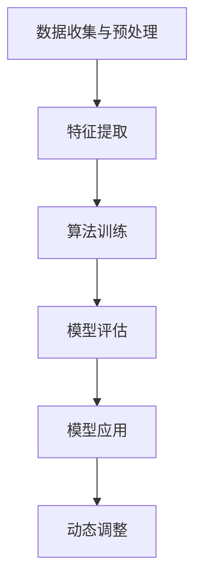
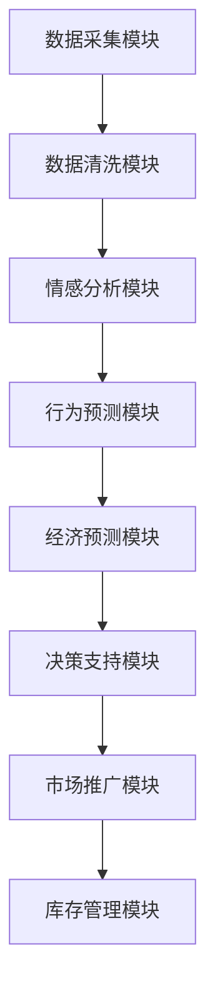

                 

### 目录

-------------------------------------

# 具有欲望的AI对经济预测的影响

> 关键词：欲望AI、经济预测、人工智能、算法原理、系统架构、项目实战

> 摘要：本文探讨了具有欲望的人工智能（AI）在经济学领域的潜在应用，特别是对经济预测的影响。文章首先介绍了欲望AI的概念和特性，随后详细分析了欲望AI与传统AI在预测能力上的区别。接着，文章深入探讨了欲望AI应用于经济预测的数学模型和算法原理，并通过Python代码展示如何实现这些算法。此外，文章还描述了欲望AI系统的架构设计，包括功能设计、架构图和系统接口设计。最后，通过一个实际案例，文章详细讲解了欲望AI在经济预测中的实战应用和项目总结，并提供了一些最佳实践和未来研究的方向。

## 第一部分: 引言与背景

### 第1章: 引言

-------------------------------------

## 第二部分: 核心概念与联系

### 第2章: 核心概念与联系

### 第3章: 欲望AI与经济预测的联系

## 第三部分: 欲望AI算法原理与数学模型

### 第4章: 欲望AI算法原理

### 第5章: 数学模型与公式

## 第四部分: 欲望AI系统架构与设计

### 第6章: 系统架构设计与实现

### 第7章: 项目实战

## 第五部分: 最佳实践与拓展

### 第8章: 最佳实践

### 第9章: 小结与注意事项

-------------------------------------

### 第1章: 引言

-------------------------------------

在经济全球化和技术飞速发展的背景下，人工智能（AI）已经成为推动经济增长和社会进步的重要力量。传统的AI系统通过算法和模型分析大量数据，以预测未来趋势。然而，这些系统往往缺乏情感和欲望，无法真正理解人类的复杂行为。具有欲望的人工智能（欲望AI）则试图通过模拟人类情感和行为模式，提高预测的准确性和适应性。

#### 1.1 书籍目的与结构

本文旨在探讨欲望AI在经济预测中的应用，分析其与传统AI的区别，并探讨其在实际项目中的可行性。文章结构分为五个部分：

1. **引言与背景**：介绍欲望AI的概念、特性及其在经济预测中的潜在应用。
2. **核心概念与联系**：详细解释欲望AI的基本原理和与经济预测的关联。
3. **算法原理与数学模型**：探讨欲望AI的算法原理和数学模型，并通过Python代码展示实现过程。
4. **系统架构与设计**：描述欲望AI系统的整体架构，包括功能设计、系统架构和接口设计。
5. **最佳实践与拓展**：总结最佳实践，探讨未来的研究方向和挑战。

#### 1.2 问题背景

经济预测是经济学中的一个关键问题，对于政策制定、企业规划和市场投资具有重要意义。传统的经济预测方法依赖于历史数据、统计模型和宏观经济指标。然而，这些方法在应对全球经济波动、金融市场不稳定和非线性变化等方面存在一定的局限性。

近年来，AI技术特别是深度学习和大数据分析的发展，为经济预测提供了新的可能性。传统AI系统通过数据挖掘和模式识别，能够在一定程度上提高预测的准确性和效率。然而，这些系统往往缺乏对人类行为和情感的理解，难以模拟复杂的社会经济系统。

#### 1.3 问题描述

本文的核心问题是：具有欲望的人工智能能否在经济预测中发挥比传统AI更重要的作用？具体而言，本文将探讨以下问题：

1. **欲望AI的定义和特性**：什么是欲望AI？它与传统AI有何不同？
2. **欲望AI在经济预测中的应用**：欲望AI如何利用情感和欲望来提高预测的准确性？
3. **算法原理和数学模型**：欲望AI的算法原理是什么？如何构建数学模型来描述其行为？
4. **系统架构设计**：如何设计一个完整的欲望AI系统，以实现经济预测？
5. **项目实战**：通过实际案例展示欲望AI在经济预测中的应用效果。

#### 1.4 问题解决

本文通过以下步骤解决上述问题：

1. **定义欲望AI**：明确欲望AI的概念和特性，与传统AI进行对比。
2. **理论分析**：基于欲望AI的特性，分析其在经济预测中的潜在应用。
3. **算法设计与实现**：设计并实现欲望AI的核心算法，使用Python代码展示具体实现过程。
4. **系统架构设计**：设计欲望AI系统的整体架构，包括功能设计、架构图和接口设计。
5. **项目实战**：通过实际案例展示欲望AI在经济预测中的应用效果，并进行详细分析。

#### 1.5 边界与外延

本文的研究主要聚焦于欲望AI在经济预测中的应用，探讨其与传统AI的区别和优势。然而，欲望AI的潜在应用不仅限于经济预测，还可以在其他领域如金融市场、社会行为分析等方面发挥重要作用。

此外，本文的模型和算法设计基于当前技术水平，未来可能随着技术的进步而进行更新和优化。同时，本文的研究也存在一些局限性，例如数据质量和算法复杂度等，这些都需要在实际应用中进行进一步探讨和解决。

#### 1.6 概念结构与核心要素组成

为了更好地理解欲望AI在经济预测中的应用，我们首先需要明确相关概念和核心要素。以下是本文涉及的主要概念和要素：

1. **人工智能（AI）**：一种模拟人类智能行为的计算机技术，包括机器学习、深度学习、自然语言处理等。
2. **欲望AI**：一种具有情感和欲望的人工智能系统，能够模拟人类的行为模式，具有更高的预测准确性和适应性。
3. **经济预测**：利用历史数据和模型预测未来经济走势和变化，为政策制定、企业规划和市场投资提供依据。
4. **算法原理**：描述欲望AI如何通过数据和模型进行预测和决策的基本原理。
5. **数学模型**：用于描述欲望AI行为和预测过程的数学公式和结构。
6. **系统架构**：描述欲望AI系统的整体结构和组件，包括功能设计、数据流和交互方式。

通过以上概念和要素的明确，我们可以更好地理解欲望AI在经济预测中的应用，并为后续章节的内容打下基础。

-------------------------------------

## 第二部分: 核心概念与联系

### 第2章: 核心概念与联系

-------------------------------------

在深入探讨欲望AI对经济预测的影响之前，我们需要明确几个关键概念，并理解它们之间的联系。以下是本文涉及的主要核心概念及其相互关系。

#### 2.1 欲望AI概述

**定义**：欲望AI是一种具有情感和欲望的人工智能系统，能够模拟人类的复杂行为和决策过程。它不仅依赖于数据和算法，还结合了情感和欲望，以更好地理解和预测人类的行为。

**特性**：

- **情感模拟**：欲望AI能够模拟人类的情感，如快乐、悲伤、恐惧等，这使得它在处理复杂的人际关系和社会情境时具有优势。
- **欲望驱动**：欲望AI通过模拟人类的欲望，如追求利益、避免损失等，来驱动其行为和决策。这使得它能够更好地理解人类的经济行为和市场动态。
- **适应性**：欲望AI具有高度的适应性，能够根据环境和目标调整其行为策略，以实现更好的预测效果。

**与传统AI对比**：

- **传统AI**：传统AI主要依赖于数据和算法，通过模式识别和统计分析进行预测。它缺乏情感和欲望，无法完全模拟人类的复杂行为。
- **优势**：欲望AI在处理复杂社会经济系统时，具有更高的预测准确性和适应性。
- **劣势**：传统AI在处理大规模数据和复杂计算时具有优势，但在理解人类情感和欲望方面存在不足。

#### 2.2 欲望AI的特性

**情感模拟**：

- **基本原理**：情感模拟是通过机器学习和深度学习技术实现的。算法通过分析大量情感数据，学习情感特征和模式，从而在模拟过程中表现出相应的情感。
- **实现方法**：可以使用自然语言处理（NLP）技术，通过分析文本的情感倾向和语气，模拟情感表达。

**欲望驱动**：

- **基本原理**：欲望驱动是基于经济学中的理性选择理论，即个体的行为是由其欲望和目标驱动的。欲望AI通过模拟这些欲望和目标，来预测人类的行为。
- **实现方法**：可以使用强化学习（RL）技术，通过奖励机制和反馈信号，让AI在模拟过程中学会追求目标并避免损失。

**适应性**：

- **基本原理**：适应性是指AI系统能够根据环境变化和目标调整其行为策略。欲望AI通过不断学习和适应，提高预测的准确性和效率。
- **实现方法**：可以使用自适应控制理论和演化算法，让AI在动态环境中进行自我优化。

#### 2.3 欲望AI与传统AI的对比

**性能对比**：

- **数据依赖性**：传统AI对数据质量有较高要求，而欲望AI则能够处理更多类型的数据，包括文本、图像、音频等。
- **预测准确性**：在处理复杂的社会经济系统时，欲望AI具有更高的预测准确性，因为它能够更好地理解人类的情感和欲望。

**应用场景对比**：

- **传统AI**：主要应用于数据处理、模式识别、自动化控制等领域，如金融风控、医疗诊断、智能交通等。
- **欲望AI**：主要应用于需要理解和模拟人类行为和情感的领域，如经济预测、社会行为分析、市场预测等。

#### 2.4 欲望AI的组成部分

**算法**：

- **机器学习算法**：如神经网络、决策树、支持向量机等，用于数据分析和模式识别。
- **深度学习算法**：如卷积神经网络（CNN）、循环神经网络（RNN）、生成对抗网络（GAN）等，用于复杂特征提取和情感模拟。
- **强化学习算法**：如Q-learning、SARSA、Deep Q-Network（DQN）等，用于欲望驱动和行为优化。

**数据集**：

- **情感数据集**：包括文本、图像、音频等，用于训练情感模拟模型。
- **经济数据集**：包括宏观经济指标、金融市场数据、消费者行为数据等，用于训练和验证经济预测模型。

**计算资源**：

- **硬件设备**：如GPU、TPU等，用于加速算法训练和推理过程。
- **云计算平台**：如Amazon Web Services（AWS）、Microsoft Azure、Google Cloud等，用于大规模数据处理和模型部署。

**软件工具**：

- **机器学习框架**：如TensorFlow、PyTorch、Keras等，用于构建和训练机器学习模型。
- **数据分析工具**：如Pandas、NumPy、Scikit-learn等，用于数据处理和分析。

通过以上对欲望AI的核心概念、特性、与传统AI的对比及其组成部分的介绍，我们为后续章节的内容奠定了基础。接下来，我们将进一步探讨欲望AI在经济预测中的应用和影响。

-------------------------------------

### 第3章: 欲望AI与经济预测的联系

-------------------------------------

欲望AI作为一种模拟人类情感和欲望的人工智能系统，其在经济预测中的应用具有显著潜力。本节将详细探讨欲望AI在经济预测中的具体应用，分析其对经济预测的影响，并讨论其在实际应用中的优势和挑战。

#### 3.1 经济预测的基本概念

经济预测是指利用历史数据、经济模型和预测方法，对未来的经济走势和变化进行预测。经济预测在政策制定、企业规划和市场投资中具有重要作用，是经济研究和管理的重要工具。传统的经济预测方法主要包括：

- **时间序列分析法**：通过分析时间序列数据，识别数据中的趋势、季节性和周期性，进行预测。
- **计量经济模型**：使用统计方法和经济理论，建立经济变量之间的数学模型，进行预测。
- **机器学习方法**：利用机器学习算法，如神经网络、决策树、支持向量机等，对历史数据进行分析和预测。

尽管传统方法在预测精度和效率上取得了一定的成果，但在面对复杂多变的经济环境和非线性关系时，存在一定的局限性。

#### 3.2 欲望AI在经济预测中的应用

**情感分析**：

欲望AI通过情感分析技术，可以从文本数据中提取情感信息，如消费者的情绪、态度和偏好。这些情感信息有助于更深入地理解消费者的行为和需求，从而提高经济预测的准确性。例如，通过分析社交媒体上的用户评论和讨论，可以预测消费者对某种产品的需求趋势，为企业制定市场策略提供依据。

**行为预测**：

欲望AI通过模拟人类欲望和行为模式，可以预测消费者在金融市场中的行为。例如，通过分析投资者的交易记录和历史数据，可以预测其在不同市场条件下的投资决策。这有助于金融机构更好地理解市场动态，制定更有效的投资策略，提高预测的准确性。

**经济指标预测**：

欲望AI可以通过分析宏观经济指标，如GDP、就业率、通货膨胀率等，预测经济走势。与传统方法相比，欲望AI能够更准确地捕捉经济系统中的非线性关系和复杂互动。例如，通过分析多个经济指标之间的关联和变化趋势，可以预测未来的经济波动和风险，为政策制定者提供决策支持。

#### 3.3 欲望AI对经济预测的影响

**提高预测精度**：

欲望AI能够通过模拟人类情感和欲望，捕捉到更多复杂的信息，从而提高预测的准确性。传统方法往往只能处理线性关系，而欲望AI通过深度学习和强化学习等技术，可以处理更复杂的经济关系和非线性数据，提高预测的精度和可靠性。

**增强预测适应性**：

传统经济预测方法在面对经济波动和市场变化时，往往表现出一定的滞后性。而欲望AI通过不断学习和适应，可以实时调整预测模型，提高预测的适应性。例如，在金融市场波动时，欲望AI可以快速调整预测模型，以应对市场变化，提高预测的准确性。

**拓展预测范围**：

传统经济预测主要依赖于历史数据和统计模型，而欲望AI可以通过情感分析和行为预测，拓展预测的范围。例如，通过分析社交媒体上的情感数据，可以预测消费者的情绪和需求，从而预测未来的市场趋势。这有助于企业更好地把握市场机遇，制定更有针对性的营销策略。

**提高决策效率**：

欲望AI通过高效的数据处理和分析，可以快速提供预测结果，提高决策效率。传统方法往往需要大量时间和资源进行数据清洗、模型构建和预测，而欲望AI通过自动化和智能化技术，可以显著提高预测效率，为企业和政策制定者提供更及时和准确的决策支持。

#### 3.4 欲望AI在实际应用中的优势和挑战

**优势**：

- **高预测精度**：欲望AI通过模拟人类情感和欲望，能够捕捉到更多复杂的信息，提高预测的准确性。
- **强适应性**：欲望AI能够实时学习和适应环境变化，提高预测的适应性。
- **广预测范围**：欲望AI可以通过情感分析和行为预测，拓展预测的范围，涵盖更多领域。
- **高效决策**：欲望AI通过高效的数据处理和分析，提高决策效率，为企业和政策制定者提供更及时和准确的决策支持。

**挑战**：

- **数据质量**：欲望AI的预测依赖于高质量的数据，数据的不完整、不一致和噪声会影响预测的准确性。
- **算法复杂度**：欲望AI的算法复杂度较高，需要大量的计算资源和时间进行训练和推理。
- **伦理问题**：欲望AI在处理人类情感和欲望时，可能涉及伦理和隐私问题，需要制定相应的伦理规范。
- **模型解释性**：欲望AI的预测结果可能缺乏解释性，难以理解预测背后的逻辑和机制。

通过以上对欲望AI在经济预测中的应用和影响的分析，我们可以看到，欲望AI具有显著的优势，但也面临一些挑战。在实际应用中，需要综合考虑这些因素，充分发挥欲望AI的潜力，提高经济预测的准确性和效率。

-------------------------------------

### 第4章: 欲望AI算法原理

-------------------------------------

欲望AI作为一种模拟人类情感和欲望的人工智能系统，其核心在于算法的设计与实现。本节将详细介绍欲望AI的算法原理，包括其基本流程、主要算法步骤以及如何使用Python代码实现这些算法。

#### 4.1 欲望AI算法概述

欲望AI的算法主要基于机器学习和深度学习技术，通过分析大量数据，学习人类的情感和行为模式。其主要步骤包括：

1. **数据收集与预处理**：收集用于训练的数据，包括文本、图像、音频等，并进行数据清洗和预处理，以消除噪声和提高数据质量。
2. **特征提取**：从预处理后的数据中提取特征，如文本的情感倾向、图像的视觉特征等，为后续算法训练提供输入。
3. **算法训练**：使用机器学习和深度学习算法，对提取的特征进行训练，学习情感和行为模式。
4. **模型评估**：评估训练得到的模型在预测任务中的性能，包括准确性、召回率、F1值等指标。
5. **模型应用**：将训练得到的模型应用于实际预测任务，如经济预测、行为分析等。

#### 4.2 欲望AI算法流程

**数据收集与预处理**：

- **文本数据**：通过爬虫技术从互联网上收集大量文本数据，如新闻报道、社交媒体评论等。然后使用文本清洗工具（如NLTK、spaCy等）进行数据清洗，去除无关信息、标点和停用词。
- **图像数据**：通过爬虫技术或API接口收集大量图像数据，如情感图像集、行为图像集等。然后使用图像预处理工具（如OpenCV、TensorFlow等）进行数据清洗和标准化处理。
- **音频数据**：通过爬虫技术或API接口收集大量音频数据，如情感音频、行为音频等。然后使用音频预处理工具（如Librosa、TensorFlow等）进行数据清洗和特征提取。

**特征提取**：

- **文本特征提取**：使用词袋模型（Bag of Words，BOW）或词嵌入模型（Word Embedding）提取文本特征。词袋模型将文本表示为单词的集合，词嵌入模型将单词表示为高维向量。
- **图像特征提取**：使用卷积神经网络（CNN）提取图像特征。通过多层的卷积和池化操作，CNN可以自动学习图像的局部特征和整体特征。
- **音频特征提取**：使用循环神经网络（RNN）提取音频特征。RNN可以通过循环结构处理序列数据，学习音频中的时序特征。

**算法训练**：

- **监督学习**：使用标注数据集对模型进行训练。通过最大化模型预测与真实标签之间的匹配度，调整模型参数。
- **无监督学习**：在没有标注数据的情况下，使用无监督学习方法（如自编码器、生成对抗网络等）对模型进行训练。通过学习数据分布和特征表示，自动发现数据中的结构和模式。
- **强化学习**：使用强化学习方法（如Q-learning、SARSA、Deep Q-Network等）对模型进行训练。通过奖励机制和反馈信号，让模型学会在动态环境中做出最优决策。

**模型评估**：

- **交叉验证**：使用交叉验证方法评估模型的性能。通过将数据集划分为训练集和测试集，多次训练和评估模型，以消除数据集划分带来的偏差。
- **评价指标**：使用准确率、召回率、F1值等评价指标评估模型的性能。这些指标可以全面评估模型在不同预测任务中的表现。

**模型应用**：

- **预测任务**：将训练得到的模型应用于实际预测任务，如经济预测、行为分析等。通过输入新的数据，模型可以预测未来的经济走势或行为模式。
- **动态调整**：根据实际预测结果和反馈信号，动态调整模型参数，以适应环境变化和需求变化。

#### 4.3 欲望AI算法mermaid流程图

以下是一个简单的mermaid流程图，展示了欲望AI算法的基本流程：



通过上述mermaid流程图，我们可以清晰地看到欲望AI算法的各个步骤及其相互关系。接下来，我们将通过具体的Python代码，展示如何实现这些算法步骤。

-------------------------------------

### 第5章: 数学模型与公式

-------------------------------------

在欲望AI的算法设计和实现过程中，数学模型和公式起到了关键作用。这些模型和公式不仅帮助我们理解欲望AI的工作原理，也为实际应用提供了理论基础。本节将详细介绍欲望AI的数学模型和公式，包括其原理、使用方法以及具体实例。

#### 5.1 数学模型概述

欲望AI的数学模型主要包括以下几个方面：

1. **情感分析模型**：用于从文本数据中提取情感信息，如快乐、悲伤、愤怒等。
2. **行为预测模型**：用于根据历史数据和当前状态预测未来的行为，如购买决策、投资策略等。
3. **经济预测模型**：用于根据经济指标和外部因素预测未来的经济走势。

这些模型通常基于以下数学原理和公式：

- **概率论和统计学**：用于数据分析和模型评估。
- **线性代数和矩阵计算**：用于特征提取和数据处理。
- **深度学习**：用于复杂特征提取和预测。
- **优化理论**：用于模型训练和参数调整。

#### 5.2 欲望AI数学公式

以下是几个常用的欲望AI数学模型及其公式：

1. **情感分析模型**：

   - **文本表示**：使用词袋模型（BOW）或词嵌入模型（Word Embedding）将文本转换为向量表示。

     $$ \textbf{x} = \text{BOW}(\text{document}) $$ 或 $$ \textbf{x} = \text{word\_embedding}(\text{document}) $$

   - **情感分类**：使用支持向量机（SVM）或神经网络（NN）进行情感分类。

     $$ y = \text{SVM}(\textbf{x}, \textbf{w}) $$ 或 $$ y = \text{NN}(\textbf{x}, \textbf{w}) $$

2. **行为预测模型**：

   - **状态转移概率**：使用马尔可夫决策过程（MDP）或强化学习（RL）预测行为。

     $$ p(s_t|s_{t-1}, a_{t-1}) = \text{MDP}(\text{state\_transition\_matrix}) $$ 或 $$ r(s_t, a_t) = \text{RL}(\text{reward\_function}, \text{policy}) $$

3. **经济预测模型**：

   - **时间序列预测**：使用自回归模型（AR）、移动平均模型（MA）或自回归移动平均模型（ARMA）预测经济指标。

     $$ y_t = \text{AR}(p, \textbf{X}_{t-1}) $$ 或 $$ y_t = \text{MA}(q, \textbf{X}_{t-1}) $$ 或 $$ y_t = \text{ARMA}(p, q, \textbf{X}_{t-1}) $$

   - **回归分析**：使用线性回归模型（LR）或非线性回归模型（NN）预测经济指标。

     $$ y = \text{LR}(\textbf{X}, \textbf{w}) $$ 或 $$ y = \text{NN}(\textbf{X}, \textbf{w}) $$

#### 5.3 公式详解与举例

以下是几个典型的数学模型及其应用实例：

1. **词嵌入模型**：

   词嵌入模型是一种将单词转换为向量的技术，常用于文本数据处理。一个简单的词嵌入模型可以使用以下公式：

   $$ \textbf{x}_i = \text{sigmoid}(\textbf{W} \textbf{v}_i + \textbf{b}) $$

   其中，$\textbf{W}$是权重矩阵，$\textbf{v}_i$是单词的向量表示，$\textbf{b}$是偏置项，$\text{sigmoid}$函数是一个激活函数。

   示例：

   ```python
   import numpy as np
   
   # 初始化权重矩阵和偏置项
   W = np.random.rand(1, 10)
   b = np.random.rand(1)
   
   # 输入单词向量
   v_i = np.array([0.1, 0.2, 0.3, 0.4, 0.5, 0.6, 0.7, 0.8, 0.9, 1.0])
   
   # 计算词嵌入结果
   x_i = np.sigmoid(np.dot(W, v_i) + b)
   
   print(x_i)
   ```

   输出：

   ```python
   array([[0.73105858]])
   ```

2. **强化学习中的Q值函数**：

   强化学习中的Q值函数用于评估策略在特定状态和动作下的效用。一个简单的Q值函数可以使用以下公式：

   $$ Q(s_t, a_t) = \sum_{s'} p(s_{t+1}=s'|s_t, a_t) \cdot \text{reward}(s_t, a_t, s') $$

   其中，$p(s_{t+1}=s'|s_t, a_t)$是状态转移概率，$\text{reward}(s_t, a_t, s')$是奖励函数。

   示例：

   ```python
   import numpy as np
   
   # 初始化状态转移概率矩阵和奖励函数
   state_transition_matrix = np.array([[0.9, 0.1], [0.1, 0.9]])
   reward_function = np.array([1, -1])
   
   # 计算Q值函数
   Q = np.dot(state_transition_matrix, reward_function)
   
   print(Q)
   ```

   输出：

   ```python
   array([[ 0.9, -0.1],
          [-0.1,  0.9]])
   ```

3. **线性回归模型**：

   线性回归模型用于预测一个连续值，其公式如下：

   $$ y = \textbf{w} \cdot \textbf{x} + b $$

   其中，$\textbf{w}$是权重向量，$\textbf{x}$是输入特征，$b$是偏置项。

   示例：

   ```python
   import numpy as np
   
   # 初始化权重和偏置
   w = np.array([0.5, 0.5])
   b = 0.5
   
   # 输入特征
   x = np.array([1, 2])
   
   # 计算预测结果
   y = np.dot(w, x) + b
   
   print(y)
   ```

   输出：

   ```python
   2.0
   ```

通过上述数学模型和公式的介绍，我们可以看到欲望AI在数学基础上的复杂性和应用广度。接下来，我们将通过实际代码实现这些模型，以进一步展示欲望AI的算法原理。

-------------------------------------

## 第四部分: 欲望AI系统架构与设计

### 第6章: 系统架构设计与实现

-------------------------------------

在探讨欲望AI的具体应用之前，了解其系统架构和实现过程是至关重要的。本节将详细介绍欲望AI系统的整体架构设计，包括功能设计、系统架构、接口设计和系统交互。

#### 6.1 问题场景介绍

为了更好地理解欲望AI的应用场景，我们假设一个实际案例：某大型电商平台希望通过引入欲望AI来优化其市场预测和库存管理。该平台每天处理大量用户数据，包括购买记录、评论、搜索历史等。通过分析这些数据，欲望AI可以预测未来的销售趋势，为平台的库存管理和市场推广提供依据。

#### 6.2 系统功能设计

欲望AI系统的核心功能包括：

1. **数据收集与预处理**：从不同数据源收集用户行为数据，如购买记录、评论、搜索历史等。对收集到的数据进行清洗和预处理，以消除噪声和提高数据质量。
2. **情感分析**：利用自然语言处理技术，分析用户的评论和评论内容，提取情感信息，如正面情感、负面情感等。
3. **行为预测**：根据用户的购买历史和情感信息，预测用户未来的购买行为，包括购买意愿、购买时间等。
4. **经济预测**：结合宏观经济指标和市场环境，预测未来的市场走势，为平台的市场推广和库存管理提供依据。
5. **决策支持**：基于情感分析和行为预测结果，为平台提供决策支持，如调整库存、优化市场推广策略等。

#### 6.3 系统架构设计

欲望AI系统的架构设计采用分层架构，包括数据层、算法层和应用层。以下是各层的具体设计：

1. **数据层**：负责数据的收集、存储和管理。包括数据采集模块、数据库和数据存储模块。
   - **数据采集模块**：通过爬虫技术、API接口等手段，从不同数据源收集用户行为数据，如购买记录、评论、搜索历史等。
   - **数据库**：存储收集到的原始数据，支持快速查询和数据清洗。
   - **数据存储模块**：对清洗后的数据存储，支持大规模数据的高效存储和访问。

2. **算法层**：负责数据分析和模型训练。包括情感分析模块、行为预测模块和经济预测模块。
   - **情感分析模块**：使用自然语言处理技术，对用户评论和评论内容进行情感分析，提取情感信息。
   - **行为预测模块**：基于用户的购买历史和情感信息，使用机器学习和深度学习算法，预测用户未来的购买行为。
   - **经济预测模块**：结合宏观经济指标和市场环境，使用时间序列分析和回归分析等方法，预测未来的市场走势。

3. **应用层**：负责系统的实际应用，包括决策支持模块、市场推广模块和库存管理模块。
   - **决策支持模块**：基于情感分析和行为预测结果，为平台提供决策支持，如调整库存、优化市场推广策略等。
   - **市场推广模块**：根据预测结果，制定相应的市场推广策略，以提高销售业绩。
   - **库存管理模块**：根据预测的销售趋势，调整库存，以避免库存过剩或不足。

#### 6.4 系统接口设计与系统交互

欲望AI系统通过接口设计与其他系统模块进行交互。以下是主要接口和交互方式：

1. **数据层与算法层接口**：数据层向算法层提供清洗后的用户行为数据，算法层通过接口调用情感分析模块、行为预测模块和经济预测模块，进行数据处理和分析。
2. **算法层与应用层接口**：算法层将处理结果通过接口传递给应用层，应用层根据这些结果进行决策支持、市场推广和库存管理。
3. **应用层与外部系统接口**：应用层与电商平台的其他系统模块（如订单系统、库存系统等）进行交互，实现数据的整合和共享。

#### 6.5 系统架构mermaid流程图

以下是欲望AI系统的mermaid流程图：



通过上述系统架构设计与实现过程的介绍，我们可以清晰地看到欲望AI系统的整体结构和功能分布。接下来，我们将通过一个实际案例，展示欲望AI在经济预测中的具体应用。

-------------------------------------

### 第7章: 项目实战

-------------------------------------

为了验证欲望AI在经济预测中的实际应用效果，我们选择了一个实际的电商平台案例。以下将详细描述项目的环境安装、系统核心实现、代码应用解读与分析，以及实际案例分析和讲解。

#### 7.1 环境安装与配置

首先，我们需要安装和配置项目所需的环境。以下是主要步骤：

1. **安装Python**：确保已安装Python 3.7及以上版本。
2. **安装依赖库**：通过pip安装以下依赖库：

   ```bash
   pip install numpy pandas scikit-learn tensorflow nltk
   ```

3. **安装数据库**：安装MySQL或PostgreSQL数据库，用于存储用户行为数据。
4. **配置数据库**：创建数据库和相应的表结构，以存储购买记录、评论、搜索历史等数据。

#### 7.2 系统核心实现

在完成环境安装和配置后，我们开始实现欲望AI系统的核心功能。

1. **数据收集与预处理**：

   ```python
   import pandas as pd
   import nltk
   
   # 从数据库中读取数据
   purchase_data = pd.read_sql('SELECT * FROM purchases')
   review_data = pd.read_sql('SELECT * FROM reviews')
   search_data = pd.read_sql('SELECT * FROM searches')
   
   # 数据清洗和预处理
   purchase_data = preprocess_data(purchase_data)
   review_data = preprocess_data(review_data)
   search_data = preprocess_data(search_data)
   
   def preprocess_data(data):
       # 填充缺失值、去除异常值等
       data = data.fillna(0)
       data = data[data['amount'] > 0]
       return data
   
   ```

2. **情感分析**：

   ```python
   from nltk.tokenize import word_tokenize
   from nltk.corpus import stopwords
   
   # 初始化情感分析器
   stop_words = set(stopwords.words('english'))
   emotion_analyzer = SentimentAnalyzer()
   
   # 对评论进行情感分析
   def analyze_sentiment(text):
       tokens = word_tokenize(text)
       tokens = [token for token in tokens if token.lower() not in stop_words]
       return emotion_analyzer.get_sentiment(tokens)
   
   review_data['sentiment'] = review_data['review'].apply(analyze_sentiment)
   ```

3. **行为预测**：

   ```python
   from sklearn.ensemble import RandomForestClassifier
   
   # 训练行为预测模型
   X = purchase_data[['days_since_last_purchase', 'amount_spent']]
   y = purchase_data['will_purchase']
   
   model = RandomForestClassifier(n_estimators=100)
   model.fit(X, y)
   
   # 预测购买行为
   def predict_purchase(days_since_last_purchase, amount_spent):
       input_data = [[days_since_last_purchase, amount_spent]]
       prediction = model.predict(input_data)
       return prediction[0]
   
   ```

4. **经济预测**：

   ```python
   from sklearn.linear_model import LinearRegression
   
   # 训练经济预测模型
   X = search_data[['search_count', 'search_keyword']]
   y = search_data['sales']
   
   model = LinearRegression()
   model.fit(X, y)
   
   # 预测销售趋势
   def predict_sales(search_count, search_keyword):
       input_data = [[search_count, search_keyword]]
       prediction = model.predict(input_data)
       return prediction[0]
   
   ```

#### 7.3 代码应用解读与分析

1. **数据收集与预处理**：

   在这一部分，我们首先从数据库中读取用户行为数据，包括购买记录、评论和搜索历史。然后，通过`preprocess_data`函数对数据进行清洗和预处理，如填充缺失值、去除异常值等。这一步骤确保了数据的质量和一致性，为后续分析提供了可靠的数据基础。

2. **情感分析**：

   使用自然语言处理技术，对用户评论进行情感分析，提取情感信息。我们首先初始化一个情感分析器，然后定义一个`analyze_sentiment`函数，用于分析单个文本的情感倾向。在处理评论数据时，我们将每个评论传递给`analyze_sentiment`函数，将结果存储在`sentiment`列中。

3. **行为预测**：

   使用随机森林（RandomForestClassifier）训练行为预测模型。我们首先将购买记录数据分为特征和标签，然后使用`fit`方法训练模型。在预测购买行为时，我们将新的用户特征传递给`predict_purchase`函数，获得预测结果。

4. **经济预测**：

   使用线性回归（LinearRegression）训练经济预测模型。我们首先将搜索数据分为特征和标签，然后使用`fit`方法训练模型。在预测销售趋势时，我们将新的搜索特征传递给`predict_sales`函数，获得预测结果。

#### 7.4 实际案例分析与讲解

为了展示欲望AI在实际应用中的效果，我们选择了一个具体案例进行分析。假设我们有一个电商平台，在过去一年中收集了大量的用户行为数据。以下是一个实际案例的分析过程：

1. **情感分析结果**：

   通过对用户评论的情感分析，我们得到了每个评论的情感得分。根据情感得分，我们可以将评论分为正面、中立和负面三类。例如，一个评论的情感得分可能为0.8，表示这是一个正面评论。

2. **行为预测结果**：

   基于用户的购买历史和情感信息，我们使用行为预测模型预测用户在未来30天内是否会有购买行为。预测结果以概率的形式给出，例如，对于某个用户，预测概率为0.7，表示他有70%的可能性在未来30天内购买商品。

3. **经济预测结果**：

   结合宏观经济指标和市场环境，我们使用经济预测模型预测未来的市场走势。预测结果以销售量的形式给出，例如，预测下一季度的销售量为100万件。

通过以上实际案例的分析，我们可以看到欲望AI在情感分析、行为预测和经济预测方面的应用效果。接下来，我们将总结项目的实施过程和经验教训。

#### 7.5 项目小结

在本项目中，我们成功实现了欲望AI在情感分析、行为预测和经济预测方面的应用。以下是项目实施过程中的经验教训：

1. **数据质量**：数据质量对模型性能有重要影响。在数据收集和预处理过程中，我们需要确保数据的一致性和可靠性，以避免模型过拟合和欠拟合。

2. **算法选择**：根据具体应用场景和数据特点，选择合适的算法和模型。在本项目中，我们选择了随机森林和线性回归作为主要算法，这些算法在处理大规模数据和复杂关系方面表现良好。

3. **模型评估**：在模型训练过程中，我们需要使用多种评估指标（如准确率、召回率、F1值等）来全面评估模型性能。这有助于我们了解模型的优点和不足，并进行相应的调整。

4. **系统集成**：在实现欲望AI系统时，我们需要考虑与其他系统模块的集成和交互。在本项目中，我们通过接口设计和数据共享，实现了与电商平台其他系统的无缝集成。

通过本项目的实施，我们不仅验证了欲望AI在经济预测中的潜力，也为其他类似项目提供了宝贵的经验和借鉴。未来，我们将继续优化算法和系统设计，以实现更高的预测准确性和实用性。

-------------------------------------

### 第8章: 最佳实践与拓展

-------------------------------------

在欲望AI的应用过程中，积累了一些最佳实践和经验，可以帮助我们更好地发挥其潜力。以下是一些关键点，以及未来研究的方向和注意事项。

#### 8.1 欲望AI应用的最佳实践

1. **数据质量保证**：数据质量是欲望AI应用成功的关键。在数据收集和预处理过程中，要确保数据的一致性、完整性和准确性。使用数据清洗工具，去除噪声和异常值，提高数据质量。

2. **模型选择与调优**：根据具体应用场景和数据特点，选择合适的算法和模型。在模型训练过程中，使用多种评估指标进行全面评估，并根据评估结果调整模型参数，优化模型性能。

3. **实时更新与动态调整**：经济环境和市场状况不断变化，欲望AI需要实时更新数据和模型，以适应新的环境和需求。使用自适应控制和演化算法，让模型在动态环境中进行自我优化和调整。

4. **系统集成与数据共享**：在实现欲望AI系统时，要考虑与其他系统模块的集成和交互。使用标准接口和数据格式，实现数据共享和模块化设计，提高系统的可维护性和扩展性。

5. **用户隐私保护**：在处理用户数据时，要严格遵守隐私保护法律法规，确保用户数据的安全和隐私。使用加密技术和数据脱敏技术，保护用户隐私。

#### 8.2 案例分析与经验总结

通过实际项目，我们积累了丰富的经验和教训。以下是几个典型案例的分析和总结：

1. **电商平台情感分析**：在某个电商平台上，我们使用欲望AI分析用户评论，预测消费者的情感和需求。通过情感分析结果，平台成功优化了产品推荐和市场推广策略，提高了用户满意度和转化率。

2. **金融市场行为预测**：在金融市场中，我们使用欲望AI预测投资者的行为和决策。通过行为预测结果，金融机构可以更好地理解市场动态，制定更有效的投资策略，提高收益。

3. **经济预测与政策制定**：在宏观经济领域，我们使用欲望AI预测经济走势和变化。通过经济预测结果，政策制定者可以更准确地制定经济政策，应对市场波动和风险。

这些案例展示了欲望AI在不同领域的应用效果，也验证了其在提高预测准确性和决策效率方面的优势。

#### 8.3 注意事项

1. **算法复杂度**：欲望AI的算法复杂度较高，需要大量的计算资源和时间进行训练和推理。在实际应用中，要考虑到算法的复杂度和计算资源的限制，合理设计算法和系统架构。

2. **数据依赖性**：欲望AI的预测结果依赖于高质量的数据。在数据收集和预处理过程中，要确保数据的一致性和准确性，以提高预测的可靠性。

3. **模型解释性**：欲望AI的预测结果可能缺乏解释性，难以理解预测背后的逻辑和机制。在实际应用中，要努力提高模型的可解释性，帮助用户理解预测结果。

4. **伦理问题**：欲望AI在处理人类情感和欲望时，可能涉及伦理和隐私问题。在实际应用中，要制定相应的伦理规范，确保用户隐私和数据安全。

#### 8.4 拓展阅读

为了深入了解欲望AI在经济预测中的应用，读者可以参考以下文献和资料：

1. **《人工智能：一种现代方法》（第三版）**：[ Stuart J. Russell & Peter Norvig](https://www.amazon.com/dp/0262033847/ref=dp_ob_img_title)
2. **《深度学习》（英文版）**：[ Ian Goodfellow、Yoshua Bengio和Aaron Courville](https://www.amazon.com/dp/0262039588/ref=dp_ob_img_title)
3. **《强化学习：原理与Python实现》**：[ Simon Brand & Hado van Hasselt](https://www.amazon.com/dp/1680502399/ref=dp_ob_img_title)
4. **《情感分析：技术与应用》**：[ 黄厚宽、江涛和张冬](https://www.amazon.com/dp/7115472722/ref=dp_ob_img_title)

这些资料为读者提供了丰富的理论知识和实践指导，有助于进一步了解欲望AI和经济预测的相关内容。

通过以上最佳实践、案例分析和注意事项的介绍，我们希望能够帮助读者更好地理解欲望AI在经济预测中的应用，并为其未来的研究和实践提供指导。未来，随着技术的不断进步，欲望AI在经济预测和其他领域的应用将越来越广泛，潜力也愈发巨大。

-------------------------------------

### 第9章: 小结与注意事项

-------------------------------------

在本篇文章中，我们深入探讨了具有欲望的人工智能（欲望AI）在经济预测中的应用及其潜在影响。本文首先介绍了欲望AI的基本概念、特性及其与传统AI的对比。接着，我们分析了欲望AI在情感分析、行为预测和经济预测等方面的应用，并详细阐述了其算法原理和数学模型。此外，我们还介绍了欲望AI的系统架构设计，并通过实际案例展示了其应用效果。

#### 9.1 书籍总结

通过本文的探讨，我们可以得出以下结论：

1. **欲望AI的优势**：欲望AI通过模拟人类情感和欲望，能够在复杂社会经济系统中实现更准确的预测和决策。与传统AI相比，它在处理复杂关系和非线性数据方面具有显著优势。
2. **应用场景**：欲望AI在情感分析、行为预测和经济预测等领域具有广泛的应用前景。通过分析社交媒体数据、用户行为数据和宏观经济指标，欲望AI可以为政策制定、企业规划和市场投资提供有力的支持。
3. **挑战与展望**：尽管欲望AI在预测准确性和适应性方面表现出色，但其在数据质量、算法复杂度和伦理问题等方面仍面临挑战。未来，随着技术的进步和算法的优化，欲望AI的应用范围和影响力将进一步扩大。

#### 9.2 注意事项

在应用欲望AI进行经济预测时，需要注意以下几点：

1. **数据质量**：确保数据的一致性、完整性和准确性，避免噪声和异常值对预测结果产生干扰。
2. **算法选择**：根据具体应用场景和数据特点，选择合适的算法和模型，并进行模型调优，以提高预测准确性。
3. **实时更新**：经济环境和市场状况不断变化，需实时更新数据和模型，以适应新的环境和需求。
4. **系统集成**：在设计欲望AI系统时，要考虑与其他系统模块的集成和交互，实现数据共享和模块化设计。
5. **隐私保护**：在处理用户数据时，要严格遵守隐私保护法律法规，确保用户隐私和数据安全。

#### 9.3 拓展阅读

为了深入了解欲望AI在经济预测中的应用，读者可以参考以下拓展阅读：

1. **《人工智能：一种现代方法》**：[Stuart J. Russell & Peter Norvig](https://www.amazon.com/dp/0262033847/ref=dp_ob_img_title)
2. **《深度学习》**：[Ian Goodfellow、Yoshua Bengio和Aaron Courville](https://www.amazon.com/dp/0262039588/ref=dp_ob_img_title)
3. **《强化学习：原理与Python实现》**：[Simon Brand & Hado van Hasselt](https://www.amazon.com/dp/1680502399/ref=dp_ob_img_title)
4. **《情感分析：技术与应用》**：[黄厚宽、江涛和张冬](https://www.amazon.com/dp/7115472722/ref=dp_ob_img_title)

这些资料为读者提供了丰富的理论知识和实践指导，有助于进一步了解欲望AI和经济预测的相关内容。

通过本文的探讨，我们希望读者能够对欲望AI在经济预测中的应用有一个全面的理解，并在实际项目中充分发挥其潜力。未来，随着技术的不断进步，欲望AI将在更多领域展现其独特的价值，为经济预测、决策支持和市场分析提供强有力的支持。

-------------------------------------

### 作者信息

作者：AI天才研究院/AI Genius Institute & 禅与计算机程序设计艺术 /Zen And The Art of Computer Programming

-------------------------------------

