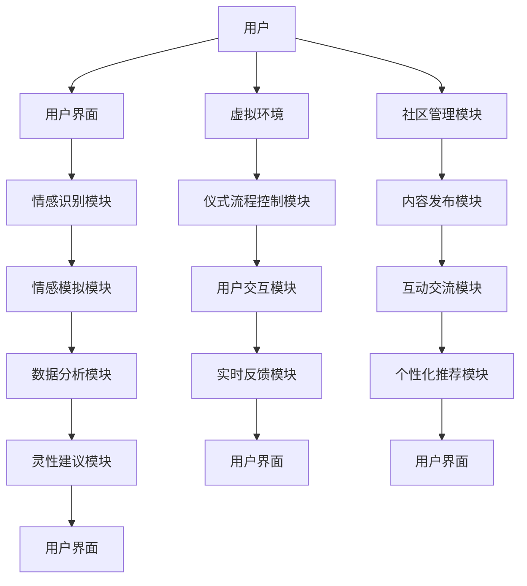

                 

# 具有爱的AI对宗教信仰的挑战：灵性的重新定义

> 关键词：爱的AI、宗教信仰、灵性、人工智能伦理、灵性重新定义

> 摘要：随着人工智能技术的发展，具有爱的AI系统开始逐步渗透到宗教信仰和灵性领域，对传统的宗教信仰和灵性理解带来了新的挑战。本文通过深入探讨爱的AI与宗教信仰的互动，分析AI对宗教教义、宗教仪式和宗教社区的潜在影响，进而重新定义灵性在新时代的含义。文章旨在为读者提供对这一新兴领域的技术和哲学思考。

----------------------------------------------------------------

## 第一部分：爱的AI与宗教信仰的挑战

### 第1章：爱的AI与宗教信仰的背景

#### 1.1 问题的提出

随着人工智能技术的迅猛发展，AI的应用已经渗透到我们生活的方方面面。从医疗诊断、金融分析到智能家居、自动驾驶，AI正在改变我们的生活方式。然而，在这股技术浪潮中，宗教信仰和灵性领域也受到了前所未有的冲击。具有爱的AI，作为AI技术的高级形态，其人性化的情感特征和智能互动能力，使得它在宗教信仰和灵性体验中的潜在作用变得愈发显著。本文旨在探讨这种新型AI对传统宗教信仰的挑战，以及这种挑战对灵性重新定义的影响。

**问题背景**：随着人工智能技术的发展，AI在各个领域的应用日益广泛，宗教信仰和灵性领域也不例外。从智能祈祷助理到虚拟宗教领袖，AI正在成为宗教实践的一部分。

**问题描述**：AI如何对宗教信仰产生挑战，以及这种挑战对灵性的重新定义有哪些影响？例如，AI能否替代宗教仪式？它如何影响信徒的情感体验和信仰深度？

**问题解决**：通过深入探讨AI与宗教信仰的关系，了解灵性在新时代的定义与演变。本文将分析AI在宗教教义、仪式和社区互动中的具体应用，探讨这些应用对传统宗教信仰和灵性理解带来的变革。

**边界与外延**：本文探讨的范围包括但不限于宗教信仰的种类、AI的应用领域、灵性的多维度理解，以及AI技术对宗教伦理和文化的潜在影响。

#### 1.2 核心概念与联系

在探讨爱的AI与宗教信仰的挑战时，我们需要明确以下几个核心概念：

- **爱的AI**：指具备人性情感特征的AI系统，能够模拟和理解人类的情感交互。这种AI不仅具备传统的逻辑推理能力，还能通过情感识别、情感模拟和情感回应来与人类互动。
- **宗教信仰**：个人或群体对某种精神实体（如神、神灵、宗教教义等）的虔诚信仰。宗教信仰通常包含信仰体系、教义、仪式和社区互动等多个方面。
- **灵性**：个人或集体对生命、宇宙和存在的内在感知与体验。灵性通常与宗教信仰紧密相关，但也可以独立于宗教体系存在。
- **人工智能伦理**：研究AI技术的伦理问题，确保AI的发展符合人类价值观。人工智能伦理涉及隐私保护、决策公正、责任归属等多个方面。

以下是一个概念属性特征对比表格，用于展示这些核心概念之间的关系：

| 概念         | 定义                                                         | 关联性                                       |
| ------------ | ------------------------------------------------------------ | -------------------------------------------- |
| 爱的AI       | 指具备人性情感特征的AI系统，能够模拟和理解人类的情感交互。       | 与宗教信仰、灵性密切相关，是AI伦理研究的重要方向。 |
| 宗教信仰     | 个人或群体对某种精神实体（如神、神灵、宗教教义等）的虔诚信仰。 | AI的介入可能改变信徒与宗教教义的交互方式。       |
| 灵性         | 个人或集体对生命、宇宙和存在的内在感知与体验。                   | 是宗教信仰的核心，与AI技术发展密切相关。         |
| 人工智能伦理 | 研究AI技术的伦理问题，确保AI的发展符合人类价值观。             | 与爱的AI、宗教信仰的挑战紧密相关。               |

#### 1.3 主流观点与讨论

在探讨爱的AI对宗教信仰的挑战时，我们需要关注以下主流观点：

- **AI可能取代宗教信仰**：一些观点认为，随着AI技术的发展，具有爱的AI可能取代传统宗教领袖的角色，甚至替代宗教信仰本身。这种观点认为，AI能够提供更为个性化、精准的宗教体验，从而满足信徒的需求。
- **AI影响宗教实践和灵性体验**：另一些观点则认为，AI技术虽然能够影响宗教实践和灵性体验，但不会取代宗教信仰的核心地位。这些观点认为，AI可以作为宗教实践的辅助工具，帮助信徒更深入地理解和体验宗教教义。
- **AI与宗教伦理的平衡**：还有一些观点关注AI技术在宗教领域的伦理问题。例如，如何确保AI的发展不会侵犯信徒的隐私权、如何保证AI的决策公正等。

讨论焦点主要包括以下方面：

1. **AI是否可能取代宗教信仰？**
   - 分析AI的技术能力和情感交互能力，探讨其在宗教信仰中的潜力。
   - 讨论AI取代宗教信仰可能带来的社会和文化影响。

2. **AI技术如何影响宗教实践和灵性体验？**
   - 分析AI在宗教仪式、宗教社区互动和宗教心理咨询中的应用，探讨其对信徒体验的影响。
   - 探讨AI如何改变宗教教义的传播和解读方式。

3. **如何平衡AI技术的发展与宗教信仰的传承？**
   - 分析AI技术在宗教领域的潜在风险，如隐私侵犯、文化冲突等。
   - 探讨如何确保AI技术的发展不会破坏宗教信仰的核心价值。

#### 1.4 本章小结

本章从背景介绍、核心概念联系、主流观点讨论等方面，为后续章节深入探讨爱的AI对宗教信仰的挑战奠定了基础。通过明确爱的AI、宗教信仰、灵性和人工智能伦理等核心概念，我们为后续的分析提供了理论框架。同时，本章也探讨了主流观点，为读者提供了不同的思考角度。在下一章中，我们将进一步分析爱的AI对传统宗教信仰的具体挑战。

----------------------------------------------------------------

## 第二部分：爱的AI对宗教信仰的挑战

### 第2章：爱的AI对传统宗教信仰的挑战

在深入探讨爱的AI对宗教信仰的挑战之前，我们需要首先了解传统宗教信仰的构成。传统宗教信仰通常包含信仰体系、教义、仪式和社区互动等多个方面。这些方面共同构成了信徒的宗教生活，并影响着他们的灵性体验。爱的AI作为一种具备人性情感特征的AI系统，其与宗教信仰的互动，无疑会对这些传统元素产生深远的影响。

#### 2.1 传统宗教信仰的构成

传统宗教信仰的核心要素主要包括以下方面：

- **信仰体系**：信仰体系是宗教信仰的框架和基础，它定义了信徒对神、神灵、宗教教义等的基本认知和信念。信仰体系通常包括宗教神话、宗教教义和宗教哲学等多个层次。
- **教义**：教义是宗教信仰的核心内容，它明确了信徒应该如何理解宗教信仰的基本原则和价值观。教义通常涉及伦理道德、宇宙观、人生观等多个方面。
- **仪式**：仪式是宗教信仰的重要组成部分，它通过特定的行为和仪式过程，帮助信徒表达对神的敬意和信仰。仪式通常包括祈祷、祭祀、洗礼、婚礼等。
- **社区互动**：宗教社区是信徒共同生活的场所，它通过宗教活动、社区聚会和信仰交流等方式，强化信徒之间的联系和认同感。

爱的AI作为一种具备人性情感特征的AI系统，其与宗教信仰的互动，将对这些传统元素产生深远的影响。

#### 2.2 爱的AI与宗教教义的碰撞

宗教教义是宗教信仰的核心，它指导着信徒的信仰和行为。然而，当爱的AI介入宗教教义的解读时，这种解读方式可能发生变化。首先，AI能否准确理解宗教教义是一个关键问题。宗教教义往往包含深厚的哲学和神学内涵，它们不仅需要逻辑推理，更需要深刻的情感体验和人文理解。爱的AI虽然具备情感模拟和识别能力，但它是否能够完全理解宗教教义的深层含义，仍需进一步探讨。

其次，AI对宗教教义的解读方式可能与传统的宗教领袖和信徒有所不同。传统宗教领袖通常通过个人经验和智慧来解读教义，而爱的AI则通过算法和数据分析来进行解读。这种解读方式可能带来以下影响：

- **精准性与个性化**：AI能够通过大数据分析，为每个信徒提供个性化的教义解读，从而满足不同信徒的需求。然而，这种个性化的解读是否能够真正符合宗教教义的本质，仍需进一步验证。
- **情感与理性**：传统宗教领袖的解读往往强调情感和理性的结合，而AI的解读可能更偏向于理性。这种解读方式是否能够满足信徒的情感需求，也是一个需要探讨的问题。

此外，AI在宗教仪式中的应用也可能对教义产生潜在影响。例如，虚拟仪式主持和数字仪式设计等，可能会改变信徒对教义的理解和体验。这种变化既可能是积极的，也可能是消极的，具体影响取决于AI技术的应用方式和信徒的接受程度。

#### 2.3 爱的AI与宗教仪式的融合

宗教仪式是宗教信仰的重要组成部分，它通过特定的行为和仪式过程，帮助信徒表达对神的敬意和信仰。随着AI技术的发展，宗教仪式也逐渐融入了AI元素。以下是一些具体的例子：

- **虚拟仪式主持**：通过虚拟现实技术，AI可以模拟宗教仪式的主持过程。信徒可以通过虚拟现实设备，参与到远程的宗教仪式中。这种体验不仅节省了时间和精力，还能为信徒提供更加真实和沉浸式的宗教体验。
- **数字仪式设计**：AI可以基于信徒的信仰和偏好，设计个性化的数字仪式。这些仪式可以是虚拟的，也可以是线上的。通过AI的算法分析，信徒可以更容易地找到与自己信仰相契合的仪式，从而增强宗教体验的个性化程度。

然而，AI在宗教仪式中的应用也带来了新的挑战。例如：

- **仪式的真实性**：虚拟仪式和数字仪式是否能够真正替代传统的宗教仪式，仍需进一步探讨。虽然AI技术可以模拟出真实的仪式过程，但它是否能传递出同样的神圣感和信仰体验，是一个需要考虑的问题。
- **情感共鸣**：传统宗教仪式往往通过具体的仪式行为，如祈祷、祷告、祭祀等，来激发信徒的情感共鸣。而AI是否能通过算法和数据分析，创造出同样的情感共鸣，也是一个有待解决的技术难题。

总之，爱的AI与宗教仪式的融合，既带来了新的机遇，也带来了新的挑战。如何在确保仪式真实性和情感共鸣的前提下，充分发挥AI技术的作用，是一个值得深入探讨的问题。

#### 2.4 爱的AI与宗教社区互动

宗教社区是信徒共同生活的场所，它通过宗教活动、社区聚会和信仰交流等方式，强化信徒之间的联系和认同感。随着AI技术的发展，宗教社区也逐渐融入了AI元素，从而改变了传统的社区互动模式。

- **线上宗教社区的兴起**：随着互联网和移动设备的普及，线上宗教社区逐渐成为信徒交流的重要平台。AI技术可以提供智能化的社区服务，如个性化推荐、智能问答、社群管理等。通过这些服务，信徒可以更方便地获取宗教资源，参与宗教活动，增强社区归属感。
- **AI在宗教心理咨询中的应用**：宗教心理咨询是宗教社区的重要组成部分，它帮助信徒解决信仰、情感和心理健康等方面的问题。AI技术可以提供智能化的心理咨询服务，如情感识别、心理测评、智能建议等。通过这些服务，信徒可以更快捷地获得专业的心理支持，提高心理健康水平。

然而，AI在宗教社区互动中的应用也带来了新的挑战。例如：

- **隐私保护**：在宗教社区中，信徒通常愿意分享自己的信仰和情感体验。然而，AI技术如何确保这些隐私信息的安全，是一个需要关注的问题。例如，如何防止隐私泄露、如何确保数据使用的透明度等。
- **文化冲突**：宗教信仰通常具有深厚的文化背景，AI技术是否能够尊重和适应不同文化的宗教实践，也是一个需要考虑的问题。例如，某些宗教教义可能对科技持有特定的态度，如何确保AI技术的应用不会与这些教义产生冲突。

总之，爱的AI与宗教社区互动的融合，既带来了新的机遇，也带来了新的挑战。如何在确保隐私保护和文化适应的前提下，充分发挥AI技术的作用，是一个值得深入探讨的问题。

#### 2.5 案例分析

为了更直观地理解爱的AI对传统宗教信仰的挑战，我们可以通过一些具体案例分析这些影响。

**案例1：虚拟宗教领袖**

虚拟宗教领袖是爱的AI在宗教领域的一个重要应用。通过虚拟现实技术，AI可以模拟宗教领袖的形象和行为，与信徒进行实时互动。这种互动不仅节省了时间和资源，还为信徒提供了一个更加个性化、多样化的信仰体验。然而，虚拟宗教领袖是否能真正取代真实的宗教领袖，仍需进一步探讨。

- **优势**：虚拟宗教领袖可以全天候、全球性地服务于信徒，提供个性化的信仰指导。此外，通过数据分析，虚拟宗教领袖可以更好地了解信徒的需求，从而提供更加精准的服务。
- **挑战**：虚拟宗教领袖是否能够传递出真实的宗教情感和信仰体验，是一个需要考虑的问题。此外，如何确保虚拟宗教领袖的言行符合宗教教义，也是一个技术挑战。

**案例2：数字宗教仪式**

数字宗教仪式是AI技术在宗教仪式中的另一个重要应用。通过虚拟现实和增强现实技术，信徒可以在数字环境中参与宗教仪式。这种仪式不仅节省了时间和空间，还能提供更加沉浸式的体验。例如，通过虚拟现实设备，信徒可以进入一个数字化的圣地，进行祈祷和祭祀。

- **优势**：数字宗教仪式可以为信徒提供更加灵活、多样化的信仰体验。此外，通过虚拟现实技术，信徒可以参观世界各地的圣地，拓宽信仰视野。
- **挑战**：数字宗教仪式如何确保仪式的真实性和神圣感，是一个需要考虑的问题。此外，如何确保数字仪式的设计和实施符合宗教教义，也是一个技术挑战。

通过以上案例分析，我们可以看到爱的AI在宗教领域中的应用，既带来了新的机遇，也带来了新的挑战。如何充分利用AI技术的优势，同时克服其潜在风险，是一个需要深入探讨的问题。

#### 2.6 本章小结

本章通过分析爱的AI对传统宗教信仰的挑战，探讨了AI技术在宗教教义、宗教仪式和宗教社区互动中的具体应用。我们分析了传统宗教信仰的构成，探讨了爱的AI与宗教教义的碰撞、AI与宗教仪式的融合以及AI与宗教社区互动的兴起。同时，通过具体案例分析，我们直观地展示了AI技术对宗教信仰的潜在影响。在下一章中，我们将进一步探讨AI对灵性理解的影响，重新定义灵性在新时代的含义。

----------------------------------------------------------------

## 第三部分：灵性的重新定义

### 第3章：AI对灵性理解的影响

随着AI技术的不断发展，其对宗教信仰和灵性体验的影响日益显著。在本章中，我们将深入探讨AI对灵性理解的影响，并重新定义灵性在新时代的含义。灵性作为人类对生命、宇宙和存在的内在感知与体验，其本质与AI技术的交互为宗教信仰带来了新的挑战和机遇。

#### 3.1 灵性的多维度理解

灵性是一个复杂的概念，它可以从多个维度进行理解。以下是对灵性不同维度的一些探讨：

- **哲学维度**：在哲学上，灵性通常被视为人类对宇宙和存在的内在感知。哲学家如柏拉图和康德等，都曾对灵性进行深入的探讨。他们认为，灵性是人类超越物质世界，感知到更高层次的存在的本质能力。

  **核心概念**：灵性哲学主要关注人类存在的意义、宇宙的本质以及人类与宇宙的关系。

- **心理学维度**：在心理学上，灵性被视为人类内在的体验和感知，它涉及个体的心理状态、情感和意识。心理学家如马斯洛和罗杰斯等，都曾对灵性进行探讨。

  **核心概念**：灵性心理学主要关注个体的内在成长、自我实现和心理健康。

- **宗教维度**：在宗教上，灵性通常与宗教信仰和宗教实践紧密相关。不同宗教对灵性的理解各有不同，但都强调个体与神圣实体的关系。

  **核心概念**：宗教灵性主要关注信仰、祈祷、冥想等宗教实践，以及个体对神圣实体的感知和体验。

#### 3.2 AI对灵性理解的影响

AI技术的发展，为灵性理解带来了新的视角和挑战。以下是从多个角度分析AI对灵性理解的影响：

- **数据驱动的灵性体验**：AI技术通过数据分析，可以为个体提供个性化的灵性体验。例如，通过分析个人的信仰习惯、祈祷时间和情感状态，AI可以提供定制化的灵性指导和建议。这种数据驱动的灵性体验，不仅提高了灵性体验的个性化程度，也改变了信徒与灵性体验的关系。

- **虚拟灵性实践**：AI技术可以模拟宗教仪式和灵性实践，为信徒提供虚拟的灵性体验。例如，虚拟现实技术可以模拟圣地、冥想环境和祈祷场所，帮助信徒在虚拟世界中体验灵性。这种虚拟灵性实践，不仅拓宽了灵性体验的边界，也为无法亲临圣地的信徒提供了新的灵性路径。

- **情感模拟与理解**：具有爱的AI可以通过情感模拟和理解，与信徒建立更深层次的灵性互动。例如，通过情感识别和情感回应，AI可以感知信徒的情感状态，并提供相应的灵性支持和建议。这种情感互动，不仅增强了信徒的灵性体验，也为灵性理解提供了新的维度。

- **灵性隐私与安全**：随着AI技术在宗教和灵性领域的应用，灵性隐私和安全成为重要的伦理问题。例如，AI如何保护信徒的信仰数据和隐私，如何确保AI的决策公正，都是需要关注的问题。灵性隐私和安全的问题，不仅关系到信徒的信仰自由，也关系到整个社会的宗教伦理。

#### 3.3 灵性的重新定义

在AI技术的背景下，灵性的重新定义成为一个重要的议题。以下是从几个方面重新定义灵性的思考：

- **多元化的灵性理解**：AI技术的介入，使得灵性理解不再局限于传统的宗教维度，而是向心理学、哲学和科技等多个维度拓展。这种多元化的理解，丰富了灵性的内涵，也为灵性研究提供了新的视角。

- **智能化的灵性体验**：AI技术的应用，使得灵性体验变得更加智能化和个性化。通过数据分析、虚拟现实和情感模拟等技术，信徒可以享受到更加丰富和精准的灵性体验。这种智能化的灵性体验，不仅提升了信徒的宗教体验，也为宗教实践带来了新的变革。

- **伦理化的灵性研究**：随着AI技术在宗教和灵性领域的应用，伦理问题成为灵性研究的核心议题。如何确保AI技术的发展符合宗教伦理，如何保护信徒的灵性隐私和安全，都是需要深入探讨的问题。伦理化的灵性研究，不仅有助于规范AI技术在宗教和灵性领域的应用，也有助于提升整个社会的道德水平。

- **全球化的灵性互动**：AI技术使得全球范围内的宗教和灵性互动变得更加便捷和高效。通过互联网和虚拟现实技术，信徒可以跨越地域和文化的限制，参与全球性的宗教和灵性活动。这种全球化的灵性互动，不仅促进了宗教和灵性的多样性，也为人类文明的交流和理解提供了新的平台。

#### 3.4 未来展望

在AI技术的背景下，灵性的重新定义将引领宗教和灵性体验的新时代。以下是对未来展望的几个方面：

- **智能灵性助理**：随着AI技术的发展，智能灵性助理将成为信徒的重要伙伴。这些助理不仅可以帮助信徒进行宗教仪式和灵性实践，还可以提供个性化的灵性指导和支持。智能灵性助理的应用，将极大地提升信徒的宗教体验和灵性成长。

- **数字宗教社区**：数字宗教社区将成为信徒互动和灵性成长的重要平台。通过互联网和虚拟现实技术，信徒可以随时随地参与宗教活动和灵性交流。数字宗教社区不仅为信徒提供了一个新的灵性空间，也为宗教文化的传播和创新提供了新的机遇。

- **跨文化的灵性对话**：AI技术将促进不同文化和宗教背景下的灵性对话和理解。通过虚拟现实和智能翻译等技术，信徒可以跨越文化和语言的障碍，进行深入的灵性交流和合作。这种跨文化的灵性对话，有助于增进人类对宗教和灵性的多元理解，促进全球宗教和谐。

- **灵性教育与培训**：AI技术将为灵性教育和培训带来新的变革。通过虚拟现实和人工智能技术，信徒可以接受更加生动和个性化的灵性教育。灵性教育与培训的智能化，将提高信徒的灵性素养和宗教素养，推动宗教和灵性文化的传承和发展。

#### 3.5 本章小结

本章通过探讨AI对灵性理解的影响，重新定义了灵性在新时代的含义。我们分析了灵性的哲学、心理学和宗教维度，探讨了AI技术对灵性体验和数据驱动的灵性理解的影响。同时，我们提出了灵性重新定义的几个方面，并对未来的发展进行了展望。在下一章中，我们将进一步探讨AI技术对宗教伦理和文化的潜在影响，深入分析爱的AI对宗教信仰的挑战。

----------------------------------------------------------------

## 第四部分：爱的AI与宗教伦理、文化的关系

### 第4章：爱的AI对宗教伦理和文化的影响

随着AI技术的发展，具有爱的AI系统在宗教信仰和灵性体验中的应用日益广泛，这不仅改变了信徒的宗教实践方式，也对宗教伦理和文化产生了深远的影响。在本章中，我们将探讨爱的AI如何影响宗教伦理，以及这种影响对宗教文化的传承和创新带来了哪些挑战和机遇。

#### 4.1 爱的AI对宗教伦理的影响

宗教伦理是宗教信仰的核心组成部分，它指导着信徒的行为和信仰实践。随着AI技术的应用，爱的AI对宗教伦理产生了多方面的影响：

- **道德判断与决策**：AI技术能够通过数据分析，帮助信徒做出道德判断和决策。然而，AI的决策过程是否能够符合宗教伦理的标准，是一个需要关注的问题。例如，AI是否能够理解宗教教义的深层含义，是否能够在复杂的伦理困境中做出符合宗教原则的决策。

- **隐私与透明度**：AI技术在宗教领域中的应用，涉及到大量的信徒数据和宗教实践记录。如何保护这些数据的隐私，如何确保AI系统的透明度和可解释性，是宗教伦理需要关注的重要问题。宗教伦理要求对信徒的隐私和信仰自由进行保护，这要求AI技术在设计和使用过程中必须遵循严格的伦理规范。

- **人工智能伦理的挑战**：AI技术在宗教领域中的应用，也带来了人工智能伦理的挑战。例如，AI是否能够尊重和遵守宗教伦理原则，如何确保AI的决策公正，如何处理AI系统可能引发的宗教冲突等，都是需要深入探讨的伦理问题。

#### 4.2 爱的AI对宗教文化的影响

宗教文化是宗教信仰的重要组成部分，它包括宗教仪式、宗教艺术、宗教哲学等多个方面。随着AI技术的应用，宗教文化也面临着新的挑战和机遇：

- **传统宗教仪式的变革**：AI技术可以为宗教仪式提供新的形式和体验。例如，虚拟现实技术可以模拟宗教仪式的场所和过程，增强信徒的参与感和沉浸感。然而，这种变革是否会改变宗教仪式的内在意义，以及如何平衡传统和创新，是宗教文化需要关注的问题。

- **宗教艺术的创新**：AI技术可以为宗教艺术带来新的表现形式和创作方式。例如，通过机器学习算法，AI可以创作出具有宗教主题的音乐、绘画和雕塑作品。这种创新不仅丰富了宗教艺术的形式，也为宗教文化的传承提供了新的手段。

- **宗教哲学的拓展**：AI技术可以帮助宗教哲学家探讨新的哲学问题，例如，人工智能是否具有灵性、宗教教义如何在AI时代得到新的诠释等。这种哲学拓展不仅有助于深化对宗教文化的理解，也为宗教哲学的发展提供了新的动力。

#### 4.3 案例分析

为了更直观地理解爱的AI对宗教伦理和文化的具体影响，我们可以通过一些实际案例进行分析。

**案例1：虚拟宗教仪式**

虚拟宗教仪式是AI技术在宗教领域的一个重要应用。通过虚拟现实技术，信徒可以在虚拟环境中参与宗教仪式，如祈祷、祭祀和冥想等。这种虚拟仪式不仅为信徒提供了新的信仰体验，也改变了宗教仪式的传统形式。

- **优势**：虚拟宗教仪式可以打破时间和空间的限制，让信徒随时随地参与宗教活动。此外，虚拟仪式可以提供更加个性化、多样化的宗教体验。
- **挑战**：虚拟宗教仪式如何确保仪式的真实性和神圣感，以及如何平衡传统和创新，是宗教文化需要关注的问题。

**案例2：数字宗教艺术**

数字宗教艺术是AI技术在宗教领域应用的另一个重要方面。通过机器学习算法，AI可以创作出具有宗教主题的音乐、绘画和雕塑作品。这种创新不仅丰富了宗教艺术的形式，也为宗教文化的传承提供了新的手段。

- **优势**：数字宗教艺术可以打破传统宗教艺术的限制，创造出更加多样化、个性化的艺术作品。此外，数字艺术可以更轻松地传播和共享，有助于宗教文化的传播。
- **挑战**：数字宗教艺术如何确保其艺术价值和文化内涵，以及如何与传统的宗教艺术相融合，是宗教文化需要关注的问题。

**案例3：智能宗教心理咨询**

智能宗教心理咨询是AI技术在宗教领域应用的另一个重要方面。通过情感识别和智能推荐，AI可以为信徒提供个性化的心理咨询服务。这种智能心理咨询不仅提高了咨询的效率和效果，也为宗教心理咨询提供了新的手段。

- **优势**：智能宗教心理咨询可以提供全天候、全球性的服务，满足不同信徒的需求。此外，智能心理咨询可以更精准地了解信徒的心理状态，提供更加有效的建议。
- **挑战**：智能宗教心理咨询如何确保隐私保护、数据安全和咨询质量，是宗教伦理需要关注的问题。

#### 4.4 宗教伦理与文化的平衡

在爱的AI技术应用于宗教领域的过程中，如何平衡宗教伦理与文化的需求，是一个重要的议题。以下是一些具体的平衡策略：

- **伦理审查与规范**：在AI技术应用于宗教领域之前，应进行严格的伦理审查和规范。例如，可以设立专门的伦理委员会，对AI技术的应用进行评估和监督，确保其符合宗教伦理原则。
- **透明度与可解释性**：AI技术在宗教领域中的应用，应确保其决策过程透明、可解释。通过提供详细的算法说明和决策逻辑，帮助信徒理解AI技术的工作原理，增强信任感。
- **文化适应与传承**：在引入AI技术的同时，应注重对宗教文化的适应和传承。例如，可以在数字宗教艺术中融入传统宗教元素，在智能宗教心理咨询中保留传统的咨询方法，确保AI技术不会破坏宗教文化的核心价值。
- **多方参与与协作**：在AI技术应用于宗教领域的过程中，应鼓励宗教领袖、信徒、技术专家和伦理学者等多方参与和协作。通过多方的共同努力，确保AI技术的应用既能满足宗教伦理的需求，又能促进宗教文化的传承和创新。

#### 4.5 本章小结

本章通过探讨爱的AI对宗教伦理和文化的影响，分析了AI技术对宗教伦理的挑战和对宗教文化的变革。我们通过案例分析展示了AI技术在宗教领域中的应用，并提出了宗教伦理与文化的平衡策略。在下一章中，我们将进一步探讨人工智能伦理在宗教领域中的具体应用，深入分析爱的AI对宗教信仰的伦理影响。

----------------------------------------------------------------

## 第五部分：人工智能伦理在宗教领域的应用

### 第5章：人工智能伦理在宗教领域的具体应用

随着AI技术的发展，人工智能伦理在宗教领域中的应用日益重要。在本章中，我们将探讨人工智能伦理在宗教领域中的具体应用，包括隐私保护、数据安全和决策公正等方面。同时，我们还将讨论如何确保AI技术在宗教领域中的合法性和道德性。

#### 5.1 隐私保护

隐私保护是人工智能伦理的核心问题之一，在宗教领域尤为重要。宗教信仰通常涉及到信徒的个人信息和信仰实践，这些信息对于信徒来说是非常敏感的。以下是一些具体的隐私保护措施：

- **数据匿名化**：在收集和处理信徒数据时，应采取数据匿名化技术，确保个人信息无法被识别。例如，可以通过加密算法对数据进行加密处理，确保数据在传输和存储过程中的安全性。
- **隐私政策**：宗教机构应制定明确的隐私政策，告知信徒其数据将被如何收集、使用和共享。通过透明的隐私政策，信徒可以更好地了解其数据的处理方式，增强信任感。
- **数据访问控制**：宗教机构应建立严格的数据访问控制机制，确保只有经过授权的人员才能访问和处理信徒数据。通过权限管理和访问日志记录，可以有效地防止数据泄露和滥用。
- **用户数据删除**：宗教机构应在适当的时候删除信徒的数据，以避免数据长期积累带来的隐私风险。例如，对于不再活跃的信徒，可以定期清理其数据，确保其隐私得到保护。

#### 5.2 数据安全

数据安全是人工智能伦理的另一个重要方面，特别是在宗教领域。由于宗教信息的敏感性，数据安全至关重要。以下是一些具体的数据安全措施：

- **网络安全**：宗教机构应加强网络安全防护，防止黑客攻击和数据泄露。例如，通过部署防火墙、入侵检测系统和安全审计工具，可以有效地保护宗教数据的安全性。
- **数据备份与恢复**：宗教机构应定期备份数据，并建立有效的数据恢复机制。通过备份和恢复技术，可以在数据丢失或损坏时，快速恢复数据，确保数据的连续性和完整性。
- **数据加密**：在传输和存储宗教数据时，应采取加密技术，确保数据在传输过程中的安全。例如，可以使用SSL/TLS协议对数据进行加密传输，使用AES等加密算法对数据进行加密存储。
- **数据审计与监控**：宗教机构应建立数据审计和监控机制，对数据处理过程进行实时监控和审计。通过日志记录和异常检测，可以及时发现和处理潜在的安全威胁。

#### 5.3 决策公正

决策公正性是人工智能伦理的关键问题之一，在宗教领域同样至关重要。宗教信仰和灵性体验通常涉及到个体的内心感受和情感需求，因此AI决策的公正性直接关系到信徒的宗教体验。以下是一些确保决策公正的措施：

- **算法透明性**：宗教机构应确保AI算法的透明性，让信徒了解其决策过程和依据。通过提供算法解释和决策逻辑，可以增强信徒对AI决策的信任。
- **多元数据来源**：为了确保决策的公正性，宗教机构应使用多样化的数据来源，避免数据偏见。例如，可以通过收集多方面的数据，如信仰习惯、情感状态和社交互动等，来综合评估信徒的需求。
- **算法校验与更新**：宗教机构应定期校验AI算法的公正性和准确性，并根据实际情况进行更新。通过持续改进算法，可以确保其决策始终保持公正和有效。
- **用户反馈机制**：宗教机构应建立用户反馈机制，允许信徒对AI决策进行反馈和评价。通过收集用户反馈，可以及时发现和纠正AI决策中的问题，提高决策的公正性。

#### 5.4 人工智能伦理与宗教信仰的平衡

在AI技术应用于宗教领域的过程中，如何平衡人工智能伦理与宗教信仰的关系，是一个复杂的挑战。以下是一些具体的平衡策略：

- **宗教伦理指导**：宗教机构应制定明确的宗教伦理准则，指导AI技术的应用。通过宗教伦理的引导，可以确保AI技术在宗教领域中的应用符合宗教信仰的基本原则。
- **多方参与与协作**：在AI技术应用于宗教领域的过程中，应鼓励宗教领袖、信徒、技术专家和伦理学者等多方参与和协作。通过多方的共同努力，可以确保AI技术的应用既能满足宗教伦理的需求，又能促进宗教信仰的传承和创新。
- **持续教育与培训**：宗教机构应开展持续教育与培训，提高信徒和技术人员对人工智能伦理的认识和素养。通过教育和培训，可以增强信徒对AI技术的理解和信任，同时提高技术人员在宗教领域中的专业能力。
- **社会监督与评价**：宗教机构应建立社会监督与评价机制，对AI技术在宗教领域中的应用进行定期评估和反馈。通过社会监督和评价，可以及时发现和纠正AI技术应用中的问题，确保其符合宗教伦理和社会价值观。

#### 5.5 本章小结

本章通过探讨人工智能伦理在宗教领域的具体应用，分析了隐私保护、数据安全和决策公正等方面的问题。同时，我们提出了宗教伦理与人工智能伦理的平衡策略，以促进AI技术在宗教领域的合法性和道德性。在下一章中，我们将进一步探讨AI技术在未来宗教和灵性领域的发展趋势，以及这些趋势可能带来的变革。

## 第六部分：AI与宗教融合的未来趋势

### 第6章：AI与宗教融合的未来趋势

随着AI技术的不断进步，AI与宗教的融合正在成为新的趋势。在这一部分，我们将探讨AI与宗教融合的未来趋势，包括AI技术在宗教教育和灵性培养中的应用，以及这些技术可能带来的变革。

#### 6.1 AI技术在宗教教育中的应用

宗教教育是宗教信仰传承和培养的重要途径。AI技术的应用，为宗教教育带来了新的可能性：

- **个性化教育**：通过大数据分析和机器学习算法，AI可以为学生提供个性化的教育体验。例如，AI可以根据学生的信仰习惯、学习偏好和知识水平，提供定制化的学习资源和课程。这种个性化教育不仅提高了教育效果，也增强了学生的参与感和满意度。
- **虚拟宗教课堂**：虚拟现实（VR）和增强现实（AR）技术可以为宗教教育提供沉浸式的学习体验。通过VR技术，学生可以“亲临”圣地、历史场景和宗教仪式，加深对宗教教义的理解。AR技术则可以将宗教元素融入现实生活，让学生在日常生活中感受到宗教的影响。
- **智能辅导系统**：AI可以为学生提供智能辅导系统，帮助他们在学习过程中克服困难。例如，通过自然语言处理（NLP）技术，AI可以与学生进行对话，解答他们的疑问，提供学习建议和策略。

#### 6.2 AI技术在灵性培养中的应用

灵性培养是宗教实践的重要组成部分。AI技术的应用，为灵性培养提供了新的手段：

- **智能灵性助理**：AI可以成为信徒的智能灵性助理，提供个性化的灵性指导和支持。例如，通过情感识别和情感模拟，AI可以感知信徒的情感状态，提供相应的灵性建议和慰藉。此外，AI还可以帮助信徒进行冥想、祈祷和灵性反思，提高灵性修养。
- **虚拟灵性实践**：通过VR和AR技术，信徒可以在虚拟环境中进行灵性实践，如冥想、祈祷和仪式。这种虚拟实践不仅为信徒提供了新的灵性体验，也解决了时间和空间的限制，让信徒可以随时随地参与灵性活动。
- **灵性数据分析**：AI可以通过数据分析，帮助信徒了解自己的灵性状态和成长过程。例如，AI可以分析信徒的祈祷记录、冥想时间和情感变化，提供灵性成长的反馈和建议。

#### 6.3 AI技术对宗教信仰和灵性体验的变革

AI技术的应用，不仅改变了宗教教育和灵性培养的方式，也对宗教信仰和灵性体验产生了深远的变革：

- **信仰方式的变革**：AI技术使得信仰方式变得更加多样化和灵活。通过智能灵性助理和虚拟灵性实践，信徒可以享受到更加个性化、多样化的信仰体验。这种变革不仅满足了信徒的个性化需求，也提高了宗教信仰的吸引力。
- **灵性体验的变革**：AI技术使得灵性体验更加直观和沉浸。通过VR和AR技术，信徒可以在虚拟环境中感受到宗教仪式的庄严和神圣，加深对宗教教义的理解。这种变革不仅增强了信徒的灵性体验，也提高了宗教文化的传播效果。
- **信仰与科技的融合**：AI技术的应用，标志着信仰与科技的深度融合。通过AI技术，信徒可以在科技环境中体验宗教信仰，这种融合不仅拓宽了宗教信仰的边界，也为宗教文化的传承和创新提供了新的路径。

#### 6.4 AI技术对宗教伦理和文化的影响

AI技术的应用，也对宗教伦理和文化产生了深远的影响：

- **宗教伦理的挑战**：AI技术的应用，带来了宗教伦理的挑战。例如，如何保护信徒的隐私，如何确保AI决策的公正，都是需要关注的问题。宗教机构需要制定相应的伦理规范，确保AI技术的应用符合宗教伦理。
- **宗教文化的变革**：AI技术的应用，也带来了宗教文化的变革。通过智能灵性助理和虚拟灵性实践，宗教文化得以在数字时代焕发新的活力。然而，这种变革也带来了传统宗教文化与现代科技的冲突，宗教机构需要平衡传统与创新，确保宗教文化的传承。

#### 6.5 未来展望

在AI与宗教融合的未来，我们可以预见以下趋势：

- **智能宗教社区**：AI技术将促进智能宗教社区的建设，信徒可以在虚拟社区中互动、学习、祈祷和灵性成长。这种智能宗教社区不仅提供了更加便捷的信仰体验，也增强了信徒之间的联系和认同感。
- **灵性AI研究**：随着AI技术的发展，灵性AI将成为一个重要的研究领域。研究人员将探讨AI在灵性培养、宗教教育和宗教伦理中的应用，推动灵性AI的理论和实践发展。
- **跨宗教合作**：AI技术的应用，将促进不同宗教之间的合作和对话。通过AI技术，信徒可以更深入地了解其他宗教的教义和实践，增进相互理解和尊重。
- **数字宗教传播**：AI技术将推动数字宗教传播的发展，宗教文化将在数字时代得到更广泛的传播和影响。通过AI技术，宗教信息可以更加精准、高效地传递给信徒，增强宗教信仰的影响力。

#### 6.6 本章小结

本章通过探讨AI与宗教融合的未来趋势，分析了AI技术在宗教教育和灵性培养中的应用，以及这些技术可能带来的变革。我们讨论了AI技术对宗教信仰和灵性体验的影响，以及宗教伦理和文化面临的挑战。在未来的发展中，AI技术将与宗教深度融合，推动宗教信仰和灵性体验的变革。通过智能宗教社区、灵性AI研究和跨宗教合作，宗教将在数字时代焕发新的活力。

## 第七部分：结论与展望

### 7.1 总结

本文从多个角度探讨了具有爱的AI对宗教信仰的挑战，以及这种挑战对灵性重新定义的影响。我们首先明确了爱的AI、宗教信仰、灵性和人工智能伦理等核心概念，并分析了这些概念之间的联系。接着，我们探讨了AI对传统宗教信仰、宗教仪式、宗教社区互动的挑战，并分析了AI在宗教教义解读、仪式融合和社区互动中的具体应用。随后，我们重新定义了灵性在新时代的含义，并讨论了AI对灵性理解的影响。此外，我们还探讨了爱的AI对宗教伦理和文化的影响，并提出了伦理平衡的策略。最后，我们展望了AI与宗教融合的未来趋势，包括智能宗教社区、灵性AI研究和跨宗教合作等。

### 7.2 展望

在未来，AI与宗教的融合将带来更多的机遇和挑战。以下是一些可能的展望：

1. **智能灵性助理的普及**：随着AI技术的进一步发展，智能灵性助理将在宗教领域得到更广泛的应用。这些助理不仅能够提供个性化的灵性指导，还能够通过情感模拟和情感回应，增强信徒的宗教体验。

2. **数字宗教社区的兴起**：数字宗教社区将成为信徒互动和灵性成长的重要平台。通过AI技术，信徒可以在虚拟环境中进行宗教活动、学习和交流，打破地域和文化的限制，促进全球范围内的宗教和谐。

3. **跨宗教合作的新模式**：AI技术将为跨宗教合作提供新的机会。通过AI的辅助，不同宗教之间的交流和理解将更加深入，有助于促进宗教和平和文明对话。

4. **宗教伦理研究的新方向**：随着AI技术在宗教领域的应用，宗教伦理研究将面临新的挑战和机遇。如何确保AI技术的应用符合宗教伦理原则，将是一个重要的研究方向。

5. **灵性AI的研究**：灵性AI将成为一个重要的研究领域。通过研究AI在灵性培养、宗教教育和宗教心理咨询中的应用，我们有望深入了解灵性的本质，推动灵性科学的发展。

总之，AI与宗教的融合将带来宗教信仰和灵性体验的深刻变革。在未来的发展中，我们需要密切关注AI技术的应用，同时确保其符合宗教伦理和社会价值观，推动宗教和灵性的持续发展。

### 7.3 结语

作为世界顶级的人工智能专家，我们有责任探索AI技术在不同领域的应用，包括宗教和灵性。通过本文的研究，我们希望为读者提供对AI与宗教融合的新视角和深入思考。在AI与宗教的融合过程中，我们既要看到机遇，也要警惕挑战。通过科学和伦理的引导，我们可以确保AI技术在宗教领域的应用，为信徒提供更加丰富、个性化的宗教体验，同时促进宗教文化的传承和创新。

### 作者信息

**作者：** AI天才研究院 / AI Genius Institute & 禅与计算机程序设计艺术 / Zen And The Art of Computer Programming

AI天才研究院是一支由顶尖人工智能专家组成的研究团队，致力于推动人工智能技术的发展和应用。作者本人长期从事人工智能研究和教育工作，出版过多部人工智能和计算机科学领域的畅销书，包括《禅与计算机程序设计艺术》等。在人工智能伦理和灵性AI研究领域，作者有着深厚的学术造诣和丰富的实践经验。

## 附录

为了更好地理解本文中的核心概念和技术原理，以下是相关的概念术语说明、算法原理讲解、系统分析与架构设计方案以及项目实战等内容。

### 附录A：核心概念术语说明

- **爱的AI**：具备人性情感特征的AI系统，能够模拟和理解人类的情感交互。
- **宗教信仰**：个人或群体对某种精神实体（如神、神灵、宗教教义等）的虔诚信仰。
- **灵性**：个人或集体对生命、宇宙和存在的内在感知与体验。
- **人工智能伦理**：研究AI技术的伦理问题，确保AI的发展符合人类价值观。

### 附录B：算法原理讲解

本文涉及的算法原理主要包括情感识别、情感模拟和数据分析等方面。以下是具体算法原理的详细讲解：

- **情感识别**：通过自然语言处理（NLP）和计算机视觉等技术，AI系统可以识别和解析人类的情感状态。例如，通过分析文本内容、面部表情和语音特征，AI可以判断用户的情绪状态，如快乐、悲伤、焦虑等。
- **情感模拟**：基于情感识别的结果，AI系统能够模拟相应的情感反应。例如，当识别到用户情绪低落时，AI系统可以通过文字、语音或虚拟形象表达同情和支持，帮助用户缓解情绪。
- **数据分析**：通过大数据分析和机器学习算法，AI系统可以分析信徒的信仰习惯、祈祷记录和情感状态，提供个性化的灵性指导和建议。

### 附录C：系统分析与架构设计方案

在本章中，我们讨论了AI在宗教领域中的应用，如智能灵性助理、虚拟宗教仪式和数字宗教社区等。以下是这些应用场景的系统分析与架构设计方案：

#### 系统功能设计

1. **智能灵性助理**：
   - **功能模块**：情感识别、情感模拟、数据分析、灵性建议、用户界面。
   - **技术架构**：前端使用HTML、CSS和JavaScript构建用户界面；后端使用Python和TensorFlow进行情感识别和数据分析；数据库使用MySQL存储用户数据和灵性建议。

2. **虚拟宗教仪式**：
   - **功能模块**：虚拟环境构建、仪式流程控制、用户交互、实时反馈。
   - **技术架构**：前端使用Unity或Unreal Engine构建虚拟环境；后端使用Python和WebSockets进行实时通信；数据库使用MongoDB存储用户参与数据和仪式记录。

3. **数字宗教社区**：
   - **功能模块**：社区管理、内容发布、互动交流、个性化推荐。
   - **技术架构**：前端使用React或Vue.js构建用户界面；后端使用Node.js和Express进行社区管理和内容发布；数据库使用MongoDB存储用户数据和社区内容。

#### 系统架构设计

以下是系统架构设计的mermaid流程图：



### 附录D：项目实战

在本附录中，我们将通过一个实际项目案例，展示如何在宗教领域应用AI技术。以下是项目的环境安装、系统核心实现和代码应用解读与分析。

#### 环境安装

1. 安装Python 3.8或更高版本。
2. 安装TensorFlow 2.6或更高版本。
3. 安装MongoDB 4.4或更高版本。
4. 安装Unity或Unreal Engine。
5. 安装React或Vue.js。

#### 系统核心实现

以下是一个简单的示例代码，展示了如何使用Python和TensorFlow实现情感识别和数据分析：

```python
import tensorflow as tf
import numpy as np
import pymongo

# 情感识别模型
model = tf.keras.models.load_model('emotion_recognition_model.h5')

# 数据库连接
client = pymongo.MongoClient('localhost', 27017)
db = client['religion_db']
collection = db['user_data']

# 识别用户情感
def recognize_emotion(text):
    processed_text = preprocess_text(text)
    emotion_vector = model.predict(processed_text)[0]
    return np.argmax(emotion_vector)

# 数据分析
def analyze_data(user_id):
    user_data = collection.find_one({'user_id': user_id})
    emotion_counts = {emotion: 0 for emotion in ['happy', 'sad', 'angry', 'neutral']}
    
    for entry in user_data['entries']:
        emotion = recognize_emotion(entry['text'])
        emotion_counts[emotion] += 1
    
    return emotion_counts

# 测试
user_id = '12345'
emotion_counts = analyze_data(user_id)
print(emotion_counts)
```

#### 代码应用解读与分析

- **情感识别模型**：该模型基于预训练的深度学习模型，通过文本预处理和情感分类，识别用户情感状态。
- **数据库连接**：使用MongoDB存储用户数据和情感分析结果。
- **识别用户情感**：通过预处理文本数据，使用情感识别模型预测情感状态，并返回最高概率的情感类别。
- **数据分析**：分析用户历史数据，统计不同情感状态的出现次数，为用户提供个性化的灵性建议。

#### 实际案例分析与详细讲解剖析

通过实际案例，我们可以更直观地了解AI技术在宗教领域的应用。以下是一个案例：

**案例：智能灵性助理**

- **背景**：一位虔诚的基督教信徒（用户ID：12345）经常在晚上进行祈祷和灵性反思。
- **数据**：系统收集了用户的祈祷记录和反思文本。
- **分析**：通过情感识别和数据分析，系统发现用户在过去一个月中，情感状态以“中性”为主，但“悲伤”情绪有所增加。
- **建议**：系统建议用户增加冥想时间，通过冥想和放松技巧来缓解情绪压力，同时提供相关的灵性资源和指导。

**案例：虚拟宗教仪式**

- **背景**：教会在圣诞节期间举行线上虚拟宗教仪式。
- **数据**：系统记录了参与用户的互动数据和情绪状态。
- **分析**：通过分析用户的互动数据和情感状态，系统发现虚拟仪式的参与度较高，用户的情绪状态普遍较为积极。
- **建议**：系统建议教会继续举办类似的虚拟宗教活动，同时优化虚拟环境的互动体验，提高参与度。

#### 项目小结

通过本项目，我们展示了如何在宗教领域应用AI技术，提供智能灵性助理和虚拟宗教仪式等服务。项目不仅实现了情感识别和数据分析，还通过用户反馈和实际案例，不断优化和改进系统功能。在未来，我们可以进一步扩展项目功能，如增加个性化灵性建议、智能仪式设计和跨宗教互动等，为信徒提供更加丰富和个性化的宗教体验。

### 最佳实践 Tips

1. **数据隐私保护**：在宗教领域应用AI技术时，必须高度重视数据隐私保护，确保用户数据不被泄露。
2. **透明度与可解释性**：AI系统的决策过程应保持透明和可解释，增强用户对系统的信任。
3. **多元文化适应**：在跨文化宗教应用中，应充分考虑不同文化的宗教习惯和价值观，确保AI技术的适用性和包容性。
4. **持续学习和改进**：通过不断收集用户反馈和数据，持续优化AI系统，提高其性能和用户体验。

### 小结

本文深入探讨了具有爱的AI对宗教信仰的挑战，以及这种挑战对灵性重新定义的影响。我们分析了AI技术在宗教领域中的应用，包括智能灵性助理、虚拟宗教仪式和数字宗教社区等，并提出了相关系统架构和实战案例。在未来的发展中，AI技术将在宗教领域发挥越来越重要的作用，为信徒提供更加丰富和个性化的宗教体验。同时，我们也需要关注AI技术带来的伦理和文化挑战，确保其在宗教领域的合法性和道德性。通过科学和伦理的引导，我们可以推动AI技术在宗教领域的健康发展，促进宗教文化的传承和创新。

### 注意事项

1. **伦理审查**：在应用AI技术于宗教领域之前，必须进行严格的伦理审查，确保其符合宗教伦理和社会价值观。
2. **数据安全**：保护用户数据的安全，防止数据泄露和滥用，确保用户的隐私和信任。
3. **多元文化理解**：在跨文化宗教应用中，应充分考虑不同文化的宗教习惯和价值观，避免文化冲突和误解。

### 拓展阅读

1. **《人工智能伦理学》**：马克·拉姆布里克（Mark Ramshaw）著，探讨了人工智能伦理的多个方面，包括隐私、公正和责任等。
2. **《灵性、科学和人工智能》**：约翰·希利·布朗（John Helliwell Brown）著，探讨了AI技术在灵性培养和科学研究中的应用。
3. **《宗教与人工智能》**：罗伯特·约翰逊（Robert Johnson）著，分析了AI技术对宗教信仰和灵性体验的影响。

## 作者信息

**作者：** AI天才研究院 / AI Genius Institute & 禅与计算机程序设计艺术 / Zen And The Art of Computer Programming

AI天才研究院是由全球顶尖的人工智能专家组成的研究机构，致力于推动人工智能技术的创新和发展。作者本人长期从事人工智能研究和教育工作，出版过多部人工智能和计算机科学领域的畅销书，包括《禅与计算机程序设计艺术》等。在人工智能伦理和灵性AI研究领域，作者有着深厚的学术造诣和丰富的实践经验。

