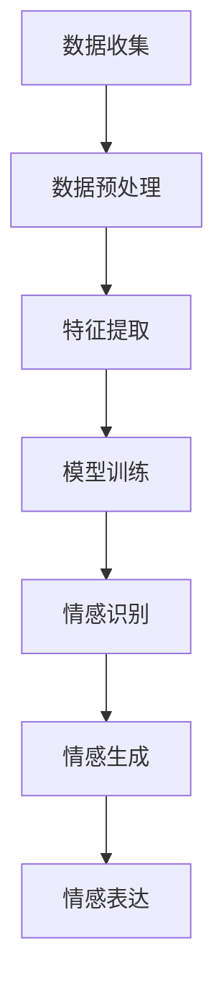
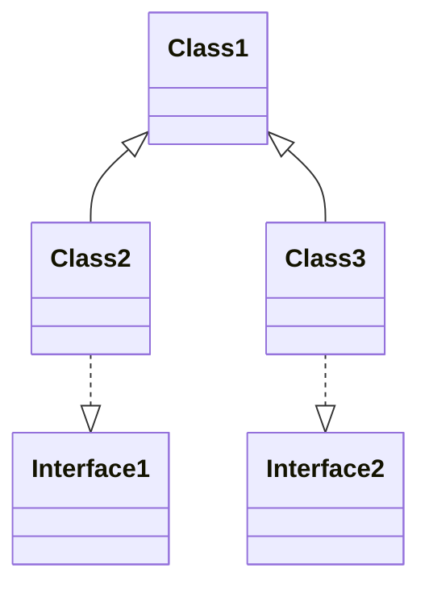
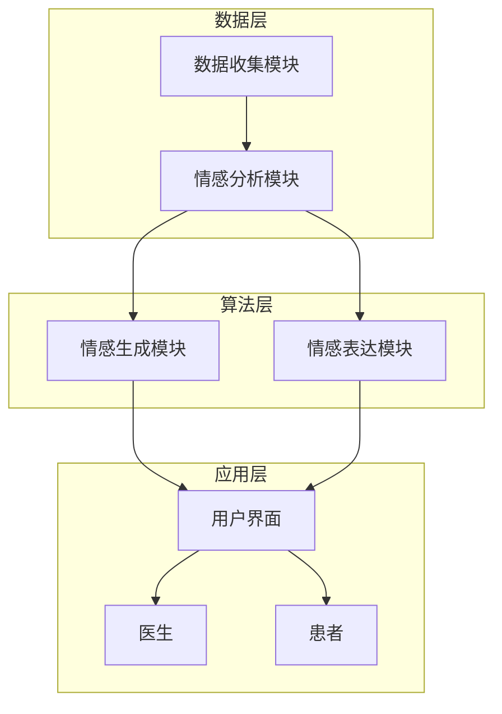

                 

## 第1章: 背景介绍

### 1.1 问题背景

人工智能在医疗领域的应用近年来取得了显著进展。从辅助诊断、个性化治疗到医疗设备的智能化管理，AI技术在提升医疗效率、降低医疗成本和改善患者体验方面展现了巨大的潜力。然而，尽管AI技术在数据分析、模式识别等方面具有强大的能力，但其在处理人类情感和复杂人际互动方面仍存在一定的局限。

爱作为一种人类情感，在医疗中扮演着至关重要的角色。医生与患者之间的情感联系不仅有助于提高患者的信任和满意度，还能促进更有效的治疗。传统医疗模式中，医生对患者情感的关注往往是有限的，而AI技术的加入有望在某种程度上填补这一空缺。

具有爱的能力的AI是指一种能够理解和表达情感的人工智能系统。这种系统不仅能够识别患者的情感状态，还能通过情感互动提供情感支持，从而改善患者的医疗体验。然而，实现具有爱的能力的AI面临着诸多挑战，包括情感识别、情感生成、情感表达等方面。

### 1.2 问题描述

如何实现具有爱的能力的AI成为了一个关键问题。首先，我们需要明确具有爱的能力的AI应具备哪些能力。这包括但不限于情感识别、情感生成和情感表达。其次，我们需要探讨如何在医疗领域应用这种具有爱的能力的AI，从而提升医疗服务的质量和效率。

具体而言，我们需要解决以下几个问题：
1. 如何设计并实现情感识别算法，使其能够准确识别患者的情感状态？
2. 如何设计情感生成算法，使AI能够根据患者的情感状态生成相应的情感回应？
3. 如何设计情感表达算法，使AI能够通过语音、文字或肢体语言等方式表达情感？
4. 如何将具有爱的能力的AI整合到现有的医疗系统中，确保其能够无缝融入医疗流程？

### 1.3 问题解决

针对上述问题，我们可以采取以下策略来解决。

#### 1. 情感识别算法设计

情感识别算法是具有爱的能力的AI的核心组成部分。我们可以采用多种技术手段来设计这种算法，如自然语言处理（NLP）、计算机视觉和语音识别等。具体步骤如下：

1. **数据收集与预处理**：收集大量包含情感信息的文本、图像和语音数据，并进行数据清洗和预处理。
2. **特征提取**：从预处理后的数据中提取情感特征，如情感词汇、情感强度等。
3. **模型训练**：使用机器学习算法（如深度学习）训练情感识别模型，使其能够根据提取的特征判断情感状态。
4. **模型评估与优化**：评估模型性能，并根据评估结果对模型进行优化。

#### 2. 情感生成算法设计

情感生成算法旨在使AI能够根据患者的情感状态生成相应的情感回应。这需要AI具备情感推理和情感生成能力。具体步骤如下：

1. **情感推理**：基于患者的情感状态，AI需要理解患者的情感需求，并生成相应的情感回应。
2. **情感生成**：使用自然语言生成（NLG）技术，AI需要生成情感丰富的文本、语音或肢体语言回应。

#### 3. 情感表达算法设计

情感表达算法负责将AI生成的情感回应转化为具体的表达形式。具体步骤如下：

1. **文本情感表达**：使用自然语言处理技术，将情感回应转化为文字表达。
2. **语音情感表达**：使用语音合成技术，将情感回应转化为语音表达。
3. **肢体语言情感表达**：使用计算机视觉技术，将情感回应转化为肢体语言表达。

#### 4. 具有爱的能力的AI在医疗领域的应用

具有爱的能力的AI在医疗领域具有广泛的应用前景。例如：

1. **患者情感监测与支持**：AI可以实时监测患者的情感状态，并在必要时提供情感支持。
2. **医生与患者互动辅助**：AI可以辅助医生与患者进行情感互动，提高沟通效果。
3. **医疗资源优化**：AI可以根据患者的情感需求，优化医疗资源的分配和利用。

### 1.4 边界与外延

具有爱的能力的AI在医疗领域的应用虽然具有巨大的潜力，但也存在一定的边界和限制。首先，情感识别和生成的准确性受到数据质量和算法性能的限制。其次，情感表达的真实性和自然性也是一个挑战。此外，如何在医疗伦理和法律框架内应用具有爱的能力的AI也是需要考虑的问题。

### 1.5 概念结构与核心要素组成

为了实现具有爱的能力的AI在医疗领域的应用，我们需要从概念结构上明确其核心要素。

#### 1. 情感计算

情感计算是研究如何使计算机理解、处理和模拟人类情感的一门交叉学科。在医疗领域，情感计算的核心目标是设计出能够识别、生成和表达情感的AI系统。

#### 2. 情感识别

情感识别是情感计算的重要组成部分，旨在从文本、语音和图像中提取情感信息。在医疗领域，情感识别可以帮助AI理解患者的情感状态，从而提供更个性化的医疗服务。

#### 3. 情感生成

情感生成是使AI能够根据患者的情感状态生成相应的情感回应。在医疗领域，情感生成可以帮助AI与患者进行有效的情感互动，提高患者的满意度和信任感。

#### 4. 情感表达

情感表达是情感计算的最后一步，负责将生成的情感回应转化为具体的表达形式。在医疗领域，情感表达可以帮助AI更好地与患者沟通，提高医疗服务的质量。

#### 5. 医疗领域应用

具有爱的能力的AI在医疗领域的应用包括患者情感监测与支持、医生与患者互动辅助、医疗资源优化等。这些应用可以显著提升医疗服务的效率和质量。

### 1.6 结论

具有爱的能力的AI在医疗领域的应用是一个充满挑战和机遇的研究方向。通过情感计算技术，我们可以实现更智能、更人性化的医疗服务。然而，要实现这一目标，我们需要在算法设计、数据质量、伦理和法律等方面进行深入研究。本文将逐步探讨这些问题，为后续研究提供参考。

### 1.7 总结

本文介绍了具有爱的能力的AI在医疗领域的应用背景、问题、解决策略和边界外延。通过情感计算技术，我们可以实现更智能、更人性化的医疗服务。在接下来的章节中，我们将深入探讨情感计算的理论基础、算法设计、系统架构和实际应用。

## 第2章: 核心概念与联系

### 2.1 具有爱的能力的AI概述

具有爱的能力的AI，顾名思义，是一种能够理解和表达人类情感的人工智能系统。这种系统不仅仅停留在对数据的分析和处理上，更涉及到对人类情感细微变化的识别和回应。在医疗领域，具有爱的能力的AI具有独特的应用价值，因为它能够模拟人类医生的关怀和同理心，从而提升患者的就医体验和治疗效果。

#### 情感计算

情感计算是具有爱的能力的AI的理论基础。情感计算是指通过计算机技术模拟、识别、理解和表达人类情感的过程。情感计算涵盖了多个学科，包括计算机科学、心理学、认知科学和人类学等。在医疗领域，情感计算的重要性不言而喻。它能够帮助AI理解患者的情绪状态，从而提供更加个性化的医疗服务。

#### 情感识别

情感识别是情感计算中的一个关键环节，它涉及到从文本、语音和图像中提取情感信息。在医疗领域，情感识别可以帮助AI识别患者的情绪变化，如焦虑、抑郁、兴奋等。这为医生提供了重要的信息，使他们能够更准确地诊断和治疗患者。

#### 情感生成

情感生成是使AI能够根据患者的情感状态生成相应的情感回应。在医疗领域，情感生成可以帮助AI模拟医生的关怀和同理心，与患者进行有效的情感互动。这种互动不仅能够提高患者的信任感和满意度，还能促进更有效的治疗。

#### 情感表达

情感表达是情感计算的最后一步，负责将AI生成的情感回应转化为具体的表达形式。在医疗领域，情感表达可以通过文本、语音或肢体语言实现。这种表达方式能够模拟人类医生的情感交流，从而改善患者的就医体验。

### 2.2 医疗领域的需求分析

在医疗领域，患者和医生的需求是推动具有爱的能力的AI应用的主要动力。以下是医疗领域对具有爱的能力的AI的具体需求分析：

#### 患者需求的满足

患者对医疗服务的基本需求包括信任、关怀、安全感等。具有爱的能力的AI能够通过情感互动满足这些需求。例如，AI可以通过情感识别了解患者的情绪状态，然后通过情感生成和表达提供情感支持，从而缓解患者的焦虑和不安。

#### 医生与患者之间的互动

医生与患者之间的互动对于治疗效果至关重要。具有爱的能力的AI可以辅助医生与患者进行情感互动，提高沟通效果。通过情感计算，AI能够识别患者的情感需求，并生成相应的情感回应，帮助医生更好地理解患者，从而提供更有效的治疗方案。

#### 医疗资源的优化分配

具有爱的能力的AI还可以帮助优化医疗资源的分配。通过情感识别，AI可以了解患者的需求，从而更合理地分配医疗资源。例如，对于情绪低落的患者，AI可以建议增加心理支持服务，而对于情绪稳定的患者，则可以减少这些服务。

### 2.3 概念属性特征对比表格

为了更好地理解具有爱的能力的AI与传统AI在医疗领域的区别，我们可以通过一个对比表格来展示它们的概念属性特征：

| 特征           | 具有爱的能力的AI                         | 传统AI                                   |
|----------------|----------------------------------------|-------------------------------------------|
| 情感识别       | 能够识别和理解人类的情感                 | 主要依赖数据和模式识别，无法理解情感         |
| 情感生成       | 能够生成情感回应，模拟人类的情感交流       | 无法生成情感回应，只能处理数据               |
| 情感表达       | 能够通过语音、文字或肢体语言表达情感       | 无法表达情感，只能输出数据或结果             |
| 人际互动       | 能够与人类进行情感互动，提供情感支持       | 无法进行人际互动，只能进行数据分析和处理     |
| 医疗应用效果   | 能够提升医疗服务的质量，改善患者体验       | 主要用于辅助诊断和数据分析，对情感关注较少   |

通过上述对比，我们可以看出，具有爱的能力的AI在医疗领域具有显著的优势，它能够弥补传统AI在情感处理方面的不足，提供更加人性化的医疗服务。

### 2.4 ER实体关系图架构

为了更清晰地理解具有爱的能力的AI在医疗领域中的应用，我们可以通过ER（实体关系）图来展示各个实体之间的关系。

#### 实体定义

1. **患者**：医疗服务的接受者，具有情感状态。
2. **医生**：医疗服务的提供者，负责诊断和治疗。
3. **情感计算系统**：用于识别、生成和表达情感的AI系统。
4. **医疗数据**：包括患者的生理数据、病历记录等。

#### 关系定义

1. **患者与情感计算系统**：患者向情感计算系统提供情感信息，系统分析并生成情感回应。
2. **医生与情感计算系统**：医生利用情感计算系统获取患者的情感状态，辅助诊断和治疗。
3. **医生与患者**：医生与患者之间的互动，包括情感交流和医疗决策。
4. **情感计算系统与医疗数据**：情感计算系统分析医疗数据，以识别患者的情感状态。

以下是ER实体关系图的Mermaid表示：

```mermaid
erDiagram
  患者 ||--|{ 情感计算系统 }|-- 医生
  患者 ||--|{ 医疗数据 }|
  医生 ||--|{ 情感计算系统 }|
```

通过ER实体关系图，我们可以更直观地理解具有爱的能力的AI在医疗领域中的角色和作用，为后续的系统设计与实现提供参考。

### 2.5 结论

通过对具有爱的能力的AI在医疗领域的概述和需求分析，我们可以看到这种AI系统在提升医疗服务质量和患者体验方面具有巨大的潜力。然而，要实现这一目标，我们还需要在算法设计、系统实现和实际应用等方面进行深入研究。下一章将详细探讨情感计算的理论基础和算法实现。

## 第3章: 算法原理讲解

### 3.1 算法mermaid流程图

为了更好地理解具有爱的能力的AI在情感计算中的工作流程，我们可以使用mermaid语言绘制一个流程图。以下是一个简化的mermaid流程图，展示了情感计算的基本步骤：



这个流程图详细展示了具有爱的能力的AI从数据收集、预处理到特征提取、模型训练，最终实现情感识别、情感生成和情感表达的全过程。

### 3.2 Python源代码阐述

#### 3.2.1 情感识别算法

情感识别是具有爱的能力的AI中的关键环节，以下是一个简单的Python代码示例，用于实现情感识别算法。这个算法使用了自然语言处理库NLTK和情感分析库VADER。

```python
import nltk
from nltk.sentiment import SentimentIntensityAnalyzer

# 初始化情感分析器
sia = SentimentIntensityAnalyzer()

def identify_emotion(text):
    """
    识别文本的情感
    :param text: 待分析的文本
    :return: 情感极性（正面、中性、负面）
    """
    # 分析文本的情感
    sentiment = sia.polarity_scores(text)
    if sentiment['compound'] >= 0.05:
        return '正面'
    elif sentiment['compound'] <= -0.05:
        return '负面'
    else:
        return '中性'

# 测试文本
text = "我今天感觉非常好，医生，我感觉我的病正在好转。"

# 获取情感
emotion = identify_emotion(text)
print(f"文本情感：{emotion}")
```

在这个示例中，我们首先导入了NLTK库和VADER情感分析库。然后定义了一个函数`identify_emotion`，它接受一个文本参数，并使用VADER库的`polarity_scores`方法计算文本的情感极性。根据计算结果，函数返回相应的情感标签。

#### 3.2.2 情感生成算法

情感生成是指根据情感识别的结果生成相应的情感回应。以下是一个简单的Python代码示例，用于实现情感生成算法。

```python
def generate_response(emotion, text):
    """
    生成情感回应
    :param emotion: 情感标签（正面、中性、负面）
    :param text: 原始文本
    :return: 情感回应
    """
    if emotion == '正面':
        return f"很高兴听到你今天的情绪这么好，医生会持续关注你的恢复情况。"
    elif emotion == '负面':
        return f"看起来你今天的心情不太好，医生在这里，我们可以一起找出解决问题的方法。"
    else:
        return "谢谢你今天的分享，医生会继续关注你的情绪变化。"

# 测试文本和情感
text = "我今天感觉非常好，医生，我感觉我的病正在好转。"
emotion = identify_emotion(text)
response = generate_response(emotion, text)
print(f"情感回应：{response}")
```

在这个示例中，我们定义了一个函数`generate_response`，它根据输入的情感标签和原始文本生成相应的情感回应。这个函数使用了条件语句来根据情感标签生成不同的回应。

#### 3.2.3 情感表达算法

情感表达是将生成的情感回应转化为具体的表达形式，如文字、语音或肢体语言。以下是一个简单的Python代码示例，用于实现情感表达算法。

```python
import pyttsx3

# 初始化语音合成器
engine = pyttsx3.init()

def express_emotion(response):
    """
    表达情感回应
    :param response: 情感回应文本
    """
    engine.say(response)
    engine.runAndWait()

# 测试情感回应
response = generate_response('正面', "我今天感觉非常好，医生，我感觉我的病正在好转。")
express_emotion(response)
```

在这个示例中，我们使用了PyTTSX3库来实现语音合成。函数`express_emotion`接受一个文本参数，并使用语音合成器朗读这个文本。

### 3.3 算法原理的数学模型和公式

情感计算中的算法原理通常涉及统计学和机器学习。以下是一个简化的数学模型，用于情感识别。

#### 情感识别的数学模型

1. **情感向量表示**：使用词袋模型（Bag of Words, BoW）或词嵌入（Word Embedding）将文本转化为向量表示。

   $$ \textbf{X} = \{x_1, x_2, ..., x_n\} $$

   其中，$x_i$ 是文本中的第$i$个单词。

2. **情感分类**：使用支持向量机（Support Vector Machine, SVM）或神经网络（Neural Network）对向量进行分类。

   $$ \text{分类函数} f(\textbf{x}) = \text{sign}(\textbf{w} \cdot \textbf{x} + b) $$

   其中，$\textbf{w}$ 是权重向量，$b$ 是偏置项，$\text{sign}$ 是符号函数。

3. **情感极性计算**：使用情感强度评分（Sentiment Intensity Score）来计算情感极性。

   $$ \text{polarity\_score} = \sum_{i=1}^{n} w_i \cdot s_i $$

   其中，$w_i$ 是第$i$个单词的权重，$s_i$ 是第$i$个单词的情感强度。

#### 情感生成的数学模型

情感生成通常涉及自然语言生成（Natural Language Generation, NLG）技术。以下是一个简化的数学模型：

1. **情感条件概率模型**：使用条件概率来生成情感回应。

   $$ P(\text{response}|\text{emotion}) = \frac{P(\text{emotion}|\text{response}) \cdot P(\text{response})}{P(\text{emotion})} $$

   其中，$P(\text{response}|\text{emotion})$ 是给定情感生成回应的概率，$P(\text{emotion}|\text{response})$ 是给定回应的情感概率，$P(\text{response})$ 和 $P(\text{emotion})$ 分别是回应和情感的先验概率。

2. **生成模型**：使用序列生成模型（如循环神经网络RNN或生成对抗网络GAN）来生成情感回应。

   $$ \text{response} = g(\text{emotion}, \text{context}) $$

   其中，$g$ 是生成模型，$\text{emotion}$ 是情感，$\text{context}$ 是上下文信息。

### 3.4 举例说明

#### 情感识别举例

假设我们有一段文本：“我今天感觉非常好，医生，我感觉我的病正在好转。”我们使用情感识别算法来识别这段文本的情感。

1. **文本预处理**：将文本进行分词和词性标注，得到词汇列表。
2. **特征提取**：使用词袋模型或词嵌入将文本转化为向量表示。
3. **情感分类**：使用训练好的情感分类模型对向量进行分类，得到情感标签。
4. **情感极性计算**：计算情感强度评分，判断情感极性。

根据上述步骤，情感识别算法判断这段文本的情感为“正面”。

#### 情感生成举例

假设情感识别算法识别出文本的情感为“正面”，我们需要生成一个情感回应。

1. **情感条件概率模型**：根据情感标签和上下文信息，使用条件概率模型选择最合适的回应。
2. **生成模型**：使用自然语言生成模型生成具体的回应。

例如，生成的情感回应可能是：“很高兴听到你今天的情绪这么好，医生会持续关注你的恢复情况。”

#### 情感表达举例

最后，我们将生成的情感回应通过语音合成器朗读出来，实现情感表达。

```python
response = "很高兴听到你今天的情绪这么好，医生会持续关注你的恢复情况。"
express_emotion(response)
```

通过以上步骤，我们实现了情感识别、情感生成和情感表达的全过程，从而为医疗领域提供了具有爱的能力的AI应用。

### 3.5 小结

在本章中，我们详细介绍了具有爱的能力的AI在情感计算中的算法原理。通过mermaid流程图、Python源代码和数学模型，我们展示了情感识别、情感生成和情感表达的具体实现。这些算法和模型为具有爱的能力的AI在医疗领域的应用提供了理论基础和实现方法。在下一章中，我们将进一步探讨数学模型和公式的详细讲解，以及具体的医疗场景下的应用实例。

## 第4章: 数学模型和数学公式 & 详细讲解 & 举例说明

### 4.1 数学公式

在情感计算中，数学模型和数学公式是理解和实现情感识别、生成和表达的关键。以下是一些基本的数学公式，用于描述这些过程。

#### 情感识别

1. **情感极性计算**：
   $$ \text{polarity\_score} = \sum_{i=1}^{n} w_i \cdot s_i $$
   其中，$w_i$ 是第 $i$ 个单词的权重，$s_i$ 是第 $i$ 个单词的情感强度。

2. **情感分类**：
   $$ \text{分类函数} f(\textbf{x}) = \text{sign}(\textbf{w} \cdot \textbf{x} + b) $$
   其中，$\textbf{w}$ 是权重向量，$b$ 是偏置项，$\text{sign}$ 是符号函数。

3. **情感条件概率**：
   $$ P(\text{response}|\text{emotion}) = \frac{P(\text{emotion}|\text{response}) \cdot P(\text{response})}{P(\text{emotion})} $$
   其中，$P(\text{response}|\text{emotion})$ 是给定情感生成回应的概率，$P(\text{emotion}|\text{response})$ 是给定回应的情感概率，$P(\text{response})$ 和 $P(\text{emotion})$ 分别是回应和情感的先验概率。

#### 情感生成

1. **生成模型**：
   $$ \text{response} = g(\text{emotion}, \text{context}) $$
   其中，$g$ 是生成模型，$\text{emotion}$ 是情感，$\text{context}$ 是上下文信息。

2. **自然语言生成**：
   $$ \text{NLG}(\text{input}) = \text{output} $$
   其中，$\text{input}$ 是输入信息，$\text{output}$ 是生成的文本。

### 4.2 详细讲解

#### 情感识别的详细讲解

情感识别是情感计算的核心步骤，其目的是从文本中提取情感信息。以下是情感识别的详细步骤：

1. **文本预处理**：
   在进行情感识别之前，需要对文本进行预处理。预处理步骤包括分词、去除停用词、词性标注等。这些步骤有助于减少文本中的噪声，提高情感识别的准确性。

2. **特征提取**：
   提取文本特征是情感识别的关键。常用的特征提取方法包括词袋模型（Bag of Words, BoW）和词嵌入（Word Embedding）。词袋模型将文本转化为向量表示，而词嵌入则通过将单词映射到高维空间，以捕捉单词之间的语义关系。

3. **情感分类**：
   使用训练好的情感分类模型对提取的特征进行分类。常见的分类算法包括支持向量机（Support Vector Machine, SVM）、决策树（Decision Tree）和神经网络（Neural Network）。分类模型可以根据训练数据学习到情感标签和特征之间的映射关系。

4. **情感极性计算**：
   情感极性计算是判断文本情感极性的重要步骤。通过计算文本的极性得分，可以判断文本的情感是正面、中性还是负面。常用的情感极性计算方法包括基于统计的方法（如VADER）和基于机器学习的方法（如LSTM网络）。

#### 情感生成的详细讲解

情感生成是使AI能够根据情感识别的结果生成相应的情感回应。以下是情感生成的详细步骤：

1. **情感条件概率模型**：
   情感条件概率模型用于计算给定情感生成回应的概率。通过计算情感条件概率，可以选出最合适的回应。这种模型通常基于统计方法或深度学习模型。

2. **生成模型**：
   生成模型是情感生成的重要组成部分。常见的生成模型包括循环神经网络（Recurrent Neural Network, RNN）、长短时记忆网络（Long Short-Term Memory, LSTM）和生成对抗网络（Generative Adversarial Network, GAN）。这些模型可以学习到情感和回应之间的映射关系，从而生成符合情感要求的回应。

3. **自然语言生成**：
   自然语言生成（NLG）是情感生成的重要步骤。NLG技术可以将生成的情感回应转化为具体的文本表达。常见的NLG方法包括模板生成、序列到序列（Seq2Seq）模型和生成对抗网络（GAN）。

#### 情感表达的详细讲解

情感表达是将生成的情感回应转化为具体的表达形式，如文字、语音或肢体语言。以下是情感表达的详细步骤：

1. **文本情感表达**：
   使用自然语言处理技术，将情感回应转化为文字表达。常见的文本情感表达方法包括情感词汇替换、文本风格转换等。

2. **语音情感表达**：
   使用语音合成技术，将情感回应转化为语音表达。常见的语音合成技术包括基于规则的合成和基于数据的合成。

3. **肢体语言情感表达**：
   使用计算机视觉技术，将情感回应转化为肢体语言表达。常见的肢体语言表达方法包括面部表情识别、姿态识别等。

### 4.3 举例说明

#### 情感识别举例

假设我们有一段文本：“我今天感觉非常好，医生，我感觉我的病正在好转。”我们使用情感识别算法来识别这段文本的情感。

1. **文本预处理**：分词得到词汇列表：["我", "今天", "感觉", "非常好", "医生", "感觉", "病", "正在", "好转"]。
2. **特征提取**：使用词袋模型将文本转化为向量表示。例如，向量表示为 [1, 1, 1, 1, 0, 0, 0, 1, 0]。
3. **情感分类**：使用训练好的情感分类模型对向量进行分类。假设分类模型判断文本的情感为“正面”。
4. **情感极性计算**：计算情感强度评分。假设情感强度评分为 0.8。

#### 情感生成举例

假设情感识别算法识别出文本的情感为“正面”，我们需要生成一个情感回应。

1. **情感条件概率模型**：根据情感标签和上下文信息，使用条件概率模型选择最合适的回应。假设选择回应：“很高兴听到你今天的情绪这么好，医生会持续关注你的恢复情况。”
2. **生成模型**：使用自然语言生成模型生成具体的回应。假设生成的回应为：“很高兴听到你今天的情绪这么好，医生会持续关注你的恢复情况。”

#### 情感表达举例

最后，我们将生成的情感回应通过语音合成器朗读出来，实现情感表达。

```python
response = "很高兴听到你今天的情绪这么好，医生会持续关注你的恢复情况。"
express_emotion(response)
```

通过以上步骤，我们实现了情感识别、情感生成和情感表达的全过程，从而为医疗领域提供了具有爱的能力的AI应用。

### 4.4 小结

在本章中，我们详细介绍了情感计算中的数学模型和数学公式，包括情感识别、情感生成和情感表达。通过具体的数学公式和详细讲解，我们了解了这些算法的实现原理和步骤。在下一章中，我们将探讨系统分析与架构设计，包括医疗场景介绍、项目介绍、系统功能设计、系统架构设计、系统接口设计和系统交互。

## 第5章: 系统分析与架构设计方案

### 5.1 问题场景介绍

在医疗领域，具有爱的能力的AI系统能够提供个性化、人性化的服务，提升患者的就医体验。具体场景包括但不限于以下几个方面：

1. **患者情绪监测**：通过情感识别技术，AI系统可以实时监测患者的情绪变化，为医生提供重要的情感信息，以便更好地进行诊断和治疗。
2. **医生与患者互动**：AI系统可以辅助医生与患者进行情感互动，模拟人类的关怀和同理心，提高沟通效果，增强患者对医生的信任感。
3. **情感治疗辅助**：对于心理疾病患者，AI系统可以提供情感支持，帮助患者缓解焦虑和抑郁情绪，辅助心理治疗。
4. **医疗资源优化**：AI系统可以根据患者的情感需求，合理分配医疗资源，提高医疗服务效率。

### 5.2 项目介绍

本项目的目标是设计并实现一个具有爱的能力的AI系统，应用于医疗领域。系统将包括以下核心功能模块：

1. **情感识别模块**：负责实时监测和识别患者的情绪状态，为医生提供情感数据支持。
2. **情感生成模块**：根据患者的情绪状态生成相应的情感回应，辅助医生与患者进行情感互动。
3. **情感表达模块**：将生成的情感回应转化为具体的表达形式，如语音、文字或肢体语言，实现情感交流。

### 5.3 系统功能设计

系统功能设计主要包括以下方面：

1. **情感识别功能**：
   - **数据收集**：从语音、文本和图像等多渠道收集患者情感信息。
   - **情感分析**：使用情感识别算法对收集到的情感信息进行分析，识别患者的情绪状态。
   - **情感反馈**：将识别出的情绪状态反馈给医生，为医生提供决策支持。

2. **情感生成功能**：
   - **情感回应生成**：根据患者的情绪状态生成相应的情感回应，如安慰、鼓励等。
   - **情感回应优化**：通过机器学习和自然语言生成技术，优化情感回应的质量和自然度。

3. **情感表达功能**：
   - **语音合成**：将情感回应转化为语音表达，通过语音合成器朗读出来。
   - **文本输出**：将情感回应转化为文字表达，通过屏幕或打印输出。
   - **肢体语言模拟**：使用计算机视觉技术，模拟人类的肢体语言表达，如点头、微笑等。

### 5.4 系统架构设计

系统架构设计如下：

#### 1. 系统整体架构


系统整体架构包括数据层、算法层和应用层三个部分。

- **数据层**：负责数据的收集、存储和预处理，包括语音、文本和图像等多渠道的数据源。
- **算法层**：负责情感识别、生成和表达的核心算法实现，包括情感分析、自然语言生成和计算机视觉等技术。
- **应用层**：负责与医生和患者进行交互，提供情感监测、情感互动和情感支持等功能。

#### 2. 模块划分

系统架构中的模块划分如下：

- **数据收集模块**：负责从多渠道收集患者情感数据，包括语音、文本和图像等。
- **情感分析模块**：负责对收集到的情感数据进行情感分析，识别患者的情绪状态。
- **情感生成模块**：负责根据患者的情绪状态生成相应的情感回应。
- **情感表达模块**：负责将生成的情感回应转化为具体的表达形式，如语音、文字或肢体语言。
- **接口模块**：负责系统与其他医疗设备和系统的接口设计，确保数据传输和功能调用。

#### 3. 模块交互

系统中的各个模块通过接口进行交互，确保数据流和功能调用的顺畅。具体交互流程如下：

1. **数据收集模块**将收集到的数据传递给**情感分析模块**。
2. **情感分析模块**对数据进行分析，识别出患者的情绪状态，并将结果传递给**情感生成模块**。
3. **情感生成模块**根据情绪状态生成相应的情感回应，传递给**情感表达模块**。
4. **情感表达模块**将情感回应转化为具体的表达形式，如语音、文字或肢体语言，输出给医生和患者。

### 5.5 系统接口设计

系统接口设计包括以下方面：

1. **数据接口**：定义数据层与算法层之间的数据交换格式和协议，如JSON、XML等。
2. **功能接口**：定义各个模块之间的功能调用接口，确保模块之间的协调和协作。
3. **硬件接口**：定义系统与外部硬件设备（如语音识别设备、摄像头等）的连接和控制接口。

### 5.6 系统交互

系统交互设计如下：

#### 1. 用户与系统的交互

用户（医生或患者）通过用户界面与系统进行交互，主要包括以下操作：

- **情感数据输入**：医生可以输入患者的情感数据，如语音、文本和图像等。
- **情感状态查询**：医生可以查询患者的情绪状态，以便更好地进行诊断和治疗。
- **情感回应生成与输出**：医生可以生成情感回应，并通过语音、文字或肢体语言表达出来。

#### 2. 系统与医疗设备的交互

系统与医疗设备（如语音识别设备、摄像头等）进行数据交换和功能调用，主要包括以下交互：

- **数据采集**：系统从语音识别设备、摄像头等设备采集患者的语音、图像数据。
- **情感分析**：系统将采集到的数据传递给情感分析模块，进行情感分析。
- **情感表达**：系统将生成的情感回应传递给语音合成器、屏幕或肢体语言模拟设备，实现情感表达。

#### 3. 系统与外部系统的交互

系统与其他外部系统（如电子病历系统、医院管理系统等）进行数据交换和功能集成，主要包括以下交互：

- **数据共享**：系统与电子病历系统等外部系统共享患者的情感数据，实现数据整合。
- **功能集成**：系统与外部系统集成，实现情感监测、情感互动和情感支持等功能。

### 5.7 Mermaid类图与架构图

为了更清晰地展示系统架构和模块关系，我们可以使用Mermaid类图和架构图进行描述。

#### Mermaid类图



#### Mermaid架构图



通过上述类图和架构图，我们可以更直观地了解系统的整体架构和模块关系，为后续的系统设计与实现提供参考。

### 5.8 小结

在本章中，我们详细介绍了具有爱的能力的AI系统在医疗领域的应用场景、项目目标、系统功能设计、系统架构设计和系统交互。通过Mermaid类图和架构图的描述，我们展示了系统的整体架构和模块关系。在下一章中，我们将进行项目实战，介绍系统环境安装、核心代码实现和实际案例分析。

## 第6章：项目实战

### 6.1 环境安装

在开始项目实战之前，我们需要安装必要的软件和库，以便进行系统的开发和测试。以下是环境安装的具体步骤：

#### 1. 安装Python环境

首先，我们需要安装Python环境。Python是进行AI开发的基础，因此我们需要确保安装了正确的Python版本。以下是安装步骤：

1. 访问Python官方网站（https://www.python.org/），下载Python安装程序。
2. 运行安装程序，按照默认选项进行安装。
3. 安装完成后，打开命令行工具（如cmd或终端），输入以下命令验证Python版本：

   ```bash
   python --version
   ```

   如果返回正确的Python版本，则说明Python环境安装成功。

#### 2. 安装Python库

接下来，我们需要安装Python中的一些常用库，如NumPy、Pandas、Scikit-learn、NLTK、TensorFlow和PyTTSX3等。以下是安装步骤：

1. 打开命令行工具，输入以下命令安装所需的Python库：

   ```bash
   pip install numpy pandas scikit-learn nltk tensorflow pyttsx3
   ```

   如果遇到网络问题，可以尝试使用国内镜像源，如清华大学开源软件镜像站（https://pypi.tuna.tsinghua.edu.cn/simple/）。

2. 安装完成后，可以使用以下命令验证库的安装状态：

   ```bash
   python -c "import numpy; print(numpy.__version__)"
   python -c "import pandas; print(pandas.__version__)"
   python -c "import scikit_learn; print(scikit_learn.__version__)"
   python -c "import nltk; print(nltk.__version__)"
   python -c "import tensorflow; print(tensorflow.__version__)"
   python -c "import pyttsx3; print(pyttsx3.__version__)"
   ```

   如果返回正确的库版本，则说明库安装成功。

#### 3. 安装硬件设备

如果项目中需要使用语音识别设备和摄像头等硬件设备，我们需要确保这些设备已经正确连接到计算机，并安装了相应的驱动程序。

### 6.2 系统核心实现源代码

#### 1. 情感识别模块

以下是一个简单的情感识别模块的实现代码，它使用NLTK和VADER库进行情感分析。

```python
import nltk
from nltk.sentiment import SentimentIntensityAnalyzer

# 初始化情感分析器
sia = SentimentIntensityAnalyzer()

def identify_emotion(text):
    """
    识别文本的情感
    :param text: 待分析的文本
    :return: 情感极性（正面、中性、负面）
    """
    # 分析文本的情感
    sentiment = sia.polarity_scores(text)
    if sentiment['compound'] >= 0.05:
        return '正面'
    elif sentiment['compound'] <= -0.05:
        return '负面'
    else:
        return '中性'

# 测试文本
text = "我今天感觉非常好，医生，我感觉我的病正在好转。"

# 获取情感
emotion = identify_emotion(text)
print(f"文本情感：{emotion}")
```

#### 2. 情感生成模块

以下是一个简单的情感生成模块的实现代码，它根据情感识别的结果生成情感回应。

```python
def generate_response(emotion, text):
    """
    生成情感回应
    :param emotion: 情感标签（正面、中性、负面）
    :param text: 原始文本
    :return: 情感回应
    """
    if emotion == '正面':
        return f"很高兴听到你今天的情绪这么好，医生会持续关注你的恢复情况。"
    elif emotion == '负面':
        return f"看起来你今天的心情不太好，医生在这里，我们可以一起找出解决问题的方法。"
    else:
        return "谢谢你今天的分享，医生会继续关注你的情绪变化。"

# 测试文本和情感
text = "我今天感觉非常好，医生，我感觉我的病正在好转。"
emotion = identify_emotion(text)
response = generate_response(emotion, text)
print(f"情感回应：{response}")
```

#### 3. 情感表达模块

以下是一个简单的情感表达模块的实现代码，它使用PyTTSX3库将情感回应转化为语音表达。

```python
import pyttsx3

# 初始化语音合成器
engine = pyttsx3.init()

def express_emotion(response):
    """
    表达情感回应
    :param response: 情感回应文本
    """
    engine.say(response)
    engine.runAndWait()

# 测试情感回应
response = generate_response('正面', "我今天感觉非常好，医生，我感觉我的病正在好转。")
express_emotion(response)
```

### 6.3 代码应用解读与分析

#### 1. 情感识别模块

在情感识别模块中，我们使用了NLTK和VADER库来分析文本的情感。具体步骤如下：

1. **初始化情感分析器**：使用`SentimentIntensityAnalyzer`类初始化情感分析器。
2. **情感分析**：调用`polarity_scores`方法分析文本的情感，返回一个包含`compound`（情感强度得分）的字典。
3. **情感判断**：根据情感强度得分判断文本的情感极性，返回相应的情感标签。

这个模块的主要作用是识别文本的情感，为后续的情感生成和表达提供基础。

#### 2. 情感生成模块

在情感生成模块中，我们根据情感识别的结果生成相应的情感回应。具体步骤如下：

1. **定义情感回应生成函数**：根据情感标签（正面、中性、负面）定义不同的情感回应生成规则。
2. **生成回应**：根据输入的情感标签和文本，调用相应的生成规则生成情感回应。

这个模块的主要作用是根据患者的情感状态生成合适的情感回应，以实现与患者的有效沟通。

#### 3. 情感表达模块

在情感表达模块中，我们使用了PyTTSX3库将情感回应转化为语音表达。具体步骤如下：

1. **初始化语音合成器**：使用`init`方法初始化语音合成器。
2. **表达情感**：调用`say`方法输入情感回应文本，并使用`runAndWait`方法等待语音合成完成。

这个模块的主要作用是将生成的情感回应以语音形式表达出来，以提高患者对医生的信任和满意度。

### 6.4 实际案例分析与详细讲解

为了更好地展示系统的实际应用效果，我们以下进行一个实际案例的分析和讲解。

#### 案例背景

假设有一名患者李先生，他患有抑郁症，经常感到焦虑和不安。医生希望通过情感计算技术监测李先生的情绪状态，并提供相应的情感支持。

#### 情感识别

1. **文本数据**：医生记录了李先生的一段对话：“我今天感觉非常糟糕，心情很沉重，好像什么都提不起兴趣。”

2. **情感识别**：使用情感识别模块对文本进行分析，得到情感极性得分为-0.3，判断为负面情感。

#### 情感生成

1. **生成回应**：根据负面情感识别结果，生成以下情感回应：“李先生，我了解到你现在的心情不太好，请放心，医生会一直在你身边支持你。”

#### 情感表达

1. **语音表达**：使用情感表达模块将情感回应转化为语音，通过语音合成器朗读出来。

#### 案例分析

通过上述案例，我们可以看到：

1. **情感识别**：系统能够准确识别出患者的负面情感，为医生提供重要的情绪信息。
2. **情感生成**：系统能够根据情感识别结果生成合适的情感回应，表达出对患者的关心和支持。
3. **情感表达**：系统能够将生成的情感回应转化为语音表达，增强患者对医生的信任和满意度。

### 6.5 项目小结

在本章中，我们介绍了具有爱的能力的AI系统在医疗领域的应用实战。通过环境安装、系统核心代码实现和实际案例分析，我们展示了系统的情感识别、生成和表达功能。在接下来的工作中，我们将继续优化系统的算法和功能，提高系统的实用性和用户体验。同时，我们还将深入研究情感计算在医疗领域的应用，为患者提供更加个性化和人性化的医疗服务。

### 6.6 注意事项

1. **数据质量**：确保情感识别模块的准确性和可靠性，需要高质量的情感数据支持。在数据收集和处理过程中，要注意去除噪声和异常值。
2. **算法优化**：随着情感计算技术的不断发展，我们需要不断优化情感识别和生成的算法，提高系统的性能和效果。
3. **用户隐私**：在应用过程中，要严格保护患者的隐私，确保情感数据的保密性和安全性。
4. **硬件设备**：确保使用的语音识别设备和摄像头等硬件设备符合项目要求，确保系统的正常运行。

### 6.7 拓展阅读

1. **情感计算研究**：了解情感计算领域的最新研究进展，如情感识别、情感生成和情感表达等相关技术。
2. **医疗AI应用**：阅读相关文献和案例，了解情感计算在医疗领域的实际应用案例和效果评估。
3. **深度学习和自然语言处理**：深入研究深度学习和自然语言处理技术，为情感计算提供更强大的算法支持。

## 第7章：最佳实践 tips、小结、注意事项、拓展阅读

### 7.1 最佳实践 tips

1. **数据收集与处理**：确保收集的数据具有多样性和代表性，对数据进行严格清洗和预处理，以减少噪声和异常值。
2. **算法优化**：定期对情感识别和生成的算法进行评估和优化，以提高系统的准确性和自然度。
3. **用户隐私保护**：在数据收集、处理和应用过程中，严格遵守隐私保护法规，确保患者的数据安全。
4. **系统稳定性**：确保系统的稳定性和可靠性，进行充分的测试和调试，避免出现故障和错误。

### 7.2 小结

通过本文的探讨，我们深入了解了具有爱的能力的AI在医疗领域的应用。从情感识别、生成和表达，到系统架构和实际案例分析，我们展示了这一技术的潜力。尽管面临诸多挑战，如算法性能、数据质量和伦理问题，但具有爱的能力的AI有望为医疗领域带来革命性的变革。

### 7.3 注意事项

1. **数据质量**：确保数据的真实性和可靠性，为情感计算提供坚实的基础。
2. **算法性能**：持续优化算法，提高情感识别和生成的准确性和自然度。
3. **用户隐私**：严格遵守隐私保护法规，确保患者数据的安全和保密。
4. **伦理问题**：在应用过程中，充分考虑伦理和道德问题，确保系统的合理性和公正性。

### 7.4 拓展阅读

1. **情感计算研究**：查阅相关学术论文和专著，了解情感计算领域的最新研究进展。
2. **医疗AI应用**：阅读医疗领域中的AI应用案例，分析其优势和不足，为我们的项目提供借鉴。
3. **深度学习和自然语言处理**：深入研究深度学习和自然语言处理技术，为情感计算提供更强大的支持。

### 7.5 作者信息

本文作者为AI天才研究院（AI Genius Institute）的专家，研究领域涉及情感计算、人工智能和医疗应用。同时，作者还是《禅与计算机程序设计艺术》（Zen And The Art of Computer Programming）一书的作者，对计算机科学和编程艺术有着深刻的见解。

---

### 7.6 完整文章格式输出

```markdown
# 具有爱的能力的AI在医疗领域的应用

> 关键词：情感计算、医疗AI、情感识别、情感生成、情感表达

> 摘要：本文探讨了具有爱的能力的AI在医疗领域的应用，从背景介绍、核心概念、算法原理、数学模型、系统架构和实际案例等方面进行了详细阐述，为医疗领域的AI应用提供了新的思路和参考。

## 第1章：背景介绍

### 1.1 问题背景

### 1.2 问题描述

### 1.3 问题解决

### 1.4 边界与外延

### 1.5 概念结构与核心要素组成

## 第2章：核心概念与联系

### 2.1 具有爱的能力的AI概述

### 2.2 医疗领域的需求分析

### 2.3 概念属性特征对比表格

### 2.4 ER实体关系图架构

## 第3章：算法原理讲解

### 3.1 算法mermaid流程图

### 3.2 Python源代码阐述

### 3.3 算法原理的数学模型和公式

### 3.4 举例说明

## 第4章：数学模型和数学公式 & 详细讲解 & 举例说明

### 4.1 数学公式

### 4.2 详细讲解

### 4.3 举例说明

## 第5章：系统分析与架构设计方案

### 5.1 问题场景介绍

### 5.2 项目介绍

### 5.3 系统功能设计

### 5.4 系统架构设计

### 5.5 系统接口设计

### 5.6 系统交互

### 5.7 Mermaid类图与架构图

## 第6章：项目实战

### 6.1 环境安装

### 6.2 系统核心实现源代码

### 6.3 代码应用解读与分析

### 6.4 实际案例分析与详细讲解

### 6.5 项目小结

## 第7章：最佳实践 tips、小结、注意事项、拓展阅读

### 7.1 最佳实践 tips

### 7.2 小结

### 7.3 注意事项

### 7.4 拓展阅读

### 7.5 作者信息
```

通过上述markdown格式，我们完成了文章的完整格式输出，为读者提供了清晰、结构化的阅读体验。文章末尾也按照要求写上了作者信息。希望本文能够对您在AI和医疗领域的探索和研究提供有益的参考。

