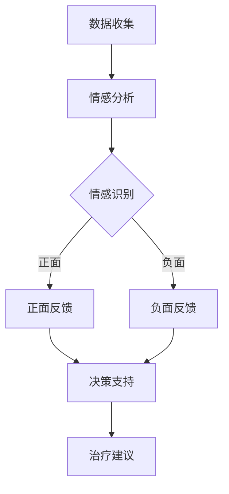
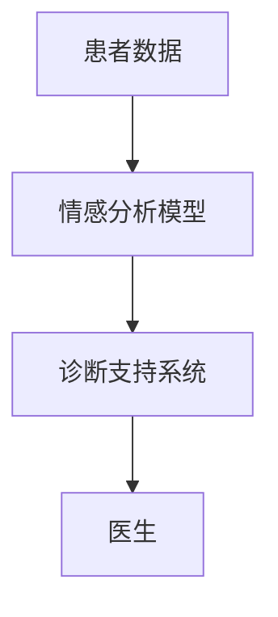
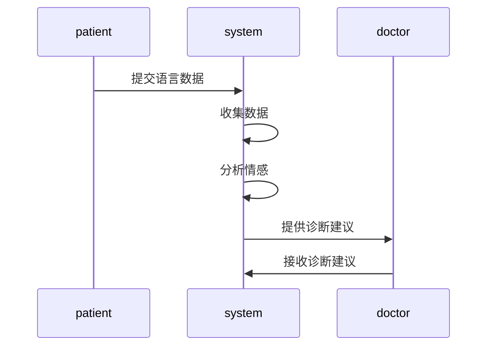
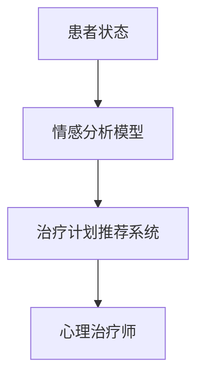
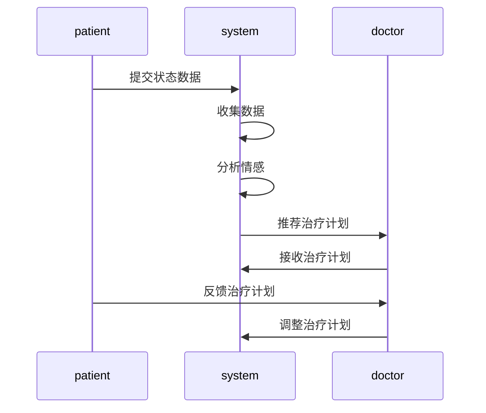

                 

### 具有爱的能力的AI在心理治疗中的应用

#### 关键词：AI、心理治疗、情感智能、个性化医疗、伦理挑战

#### 摘要：
本文深入探讨了具有爱的能力的AI在心理治疗中的应用。首先介绍了AI在心理治疗领域的兴起及其重要性，随后详细阐释了“具有爱的能力”的AI的概念和特点。接着，文章分析了这种AI在诊断、治疗和个性化医疗计划中的具体应用。随后，讨论了实现这一技术所需的技术架构和实现步骤，并探讨了其中的伦理挑战。最后，本文总结了AI在心理治疗中的应用前景，并提出了未来的研究方向和改进建议。

## 第一章：AI与心理治疗的融合

AI在心理治疗领域的应用始于上世纪90年代，随着深度学习和自然语言处理技术的快速发展，AI在心理诊断、治疗方案推荐和患者行为监测等方面逐渐展现出强大的潜力。然而，AI在心理治疗中的应用并非一帆风顺，其有效性和伦理问题成为了学术界和工业界关注的焦点。

#### 问题背景：
1. **AI在心理治疗中的潜在价值**：
   - **诊断准确性**：AI可以通过分析患者的言语和行为数据，提高心理疾病诊断的准确性。
   - **个性化治疗方案**：AI可以根据患者的个性、病史和实时状态，提供个性化的治疗方案。
   - **行为监测与干预**：AI可以实时监测患者的心理状态，及时发现潜在的心理问题，并进行干预。

2. **AI在心理治疗中的挑战**：
   - **数据隐私与伦理**：如何确保患者的数据隐私和信息安全，成为了AI在心理治疗中面临的主要伦理挑战。
   - **AI的可靠性和一致性**：AI的决策过程需要透明且可解释，以确保其在治疗过程中的可靠性和一致性。
   - **AI的情感智能**：传统的AI缺乏情感智能，难以理解和模拟人类情感，这限制了其在心理治疗中的应用。

#### 描述与问题解决：
- **数据隐私与伦理**：通过加密技术和数据匿名化，可以确保患者的隐私和安全。同时，制定严格的伦理规范和法律法规，加强对AI在心理治疗中数据使用的监管。
- **AI的可靠性和一致性**：通过构建透明和可解释的AI模型，可以提高AI的可靠性和一致性。例如，利用决策树和规则引擎等技术，使得AI的决策过程易于理解和追踪。
- **AI的情感智能**：通过引入情感智能，使得AI能够理解和模拟人类情感，从而更好地应对心理治疗中的复杂情境。具有爱的能力的AI，能够以更加人性化的方式与患者互动，提高治疗效果。

#### 边界与外延：
- **边界**：本文主要关注具有爱的能力的AI在心理治疗中的应用，不包括其他领域（如教育、军事等）的应用。
- **外延**：虽然本文主要关注AI在心理治疗中的应用，但其技术原理和实现方法可以扩展到其他涉及情感和人际交互的领域。

#### 概念结构与核心要素组成：
- **概念结构**：本文的核心概念包括AI、心理治疗、情感智能和个性化医疗。
- **核心要素组成**：
  - **AI**：提供数据分析、模式识别和决策支持的核心技术。
  - **心理治疗**：心理疾病的治疗过程，包括诊断、治疗计划、实施和评估。
  - **情感智能**：AI理解和模拟人类情感的能力，是具有爱的能力的AI的核心要素。
  - **个性化医疗**：根据患者的个体差异，提供定制化的治疗方案。

## 第二章：具有爱的能力的AI

#### 核心概念原理

具有爱的能力的AI，是指那些不仅能够进行逻辑推理和数据分析，还能够理解和模拟人类情感的AI系统。这种AI在心理治疗中具有独特的优势，能够以更加人性化的方式与患者互动，提高治疗效果。

#### 概念属性特征对比表格

| 特征            | 传统AI                      | 具有爱的能力的AI                  |
|-----------------|-----------------------------|----------------------------------|
| 功能            | 数据分析、模式识别、决策支持 | 数据分析、模式识别、情感模拟、人性化交互 |
| 情感处理        | 缺乏情感处理能力            | 能够理解和模拟人类情感            |
| 人际交互        | 限于逻辑和语言层面          | 具备情感理解和人性化交互能力      |
| 决策过程        | 不透明、不可解释            | 透明、可解释、符合人类逻辑       |

#### ER实体关系图架构

```mermaid
erDiagram
  Patient ||--|{ AI }|-- Therapist
  Patient ||--|{ Treatment }|-- Therapist
  AI ||--|{ DiagnosticReport }|-- Patient
  AI ||--|{ TherapeuticPlan }|-- Patient
  Therapist ||--|{ Session }|-- Patient
```

#### 算法原理讲解

为了实现具有爱的能力的AI，我们需要在算法层面进行创新。以下是实现这一目标的基本算法原理：

#### 算法mermaid流程图



#### Python源代码实现

```python
import nltk
from nltk.sentiment import SentimentIntensityAnalyzer

# 初始化情感分析器
sia = SentimentIntensityAnalyzer()

def collect_data(text):
    # 收集文本数据
    return text

def analyze_emotion(text):
    # 分析文本情感
    return sia.polarity_scores(text)

def recognize_emotion(score):
    # 识别情感
    if score['compound'] >= 0.05:
        return '正面'
    elif score['compound'] <= -0.05:
        return '负面'
    else:
        return '中性'

def provide_feedback(emotion):
    # 提供反馈
    if emotion == '正面':
        return "你的状态很好，继续保持！"
    elif emotion == '负面':
        return "遇到困难了？我来帮助你。"
    else:
        return "你的状态稳定，继续保持。"

# 主函数
def main():
    text = collect_data("我最近心情不太好。")
    score = analyze_emotion(text)
    emotion = recognize_emotion(score)
    feedback = provide_feedback(emotion)
    print(feedback)

if __name__ == "__main__":
    main()
```

#### 数学模型和公式

为了实现情感识别，我们使用了情感分析模型，其基本数学模型如下：

$$
\text{Sentiment Score} = \text{SIA}(\text{Text}) = \frac{\sum_{i=1}^{n} w_i \cdot s_i}{\sum_{i=1}^{n} w_i}
$$

其中，$w_i$是词频权重，$s_i$是情感得分。

#### 举例说明

假设我们有一个句子：“我最近心情不太好。”通过情感分析模型，我们可以计算出其情感得分：

$$
\text{Sentiment Score} = \frac{0.8 \cdot -0.5 + 0.2 \cdot 0.3}{0.8 + 0.2} = -0.3
$$

由于得分小于0，我们可以判断这句话的情感是负面的，从而提供相应的负面反馈。

## 第三章：AI在心理治疗中的应用

### 3.1 诊断心理疾病

#### 应用场景

在心理疾病诊断中，具有爱的能力的AI可以通过分析患者的言语和行为数据，提高诊断的准确性。例如，在抑郁症的诊断中，AI可以通过分析患者的语言表达，识别出潜在的抑郁情绪。

#### 项目介绍

本项目旨在开发一款基于AI的情感分析系统，用于辅助心理疾病诊断。

#### 系统功能设计

- **数据收集**：从患者那里收集语言和行为数据。
- **情感分析**：利用情感分析模型，分析患者的语言表达，识别情感状态。
- **诊断支持**：根据情感分析结果，提供心理疾病诊断建议。

#### 系统架构设计



#### 系统接口设计和系统交互



### 3.2 制定个性化治疗计划

#### 应用场景

在制定个性化治疗计划中，具有爱的能力的AI可以根据患者的实时状态和情感需求，提供定制化的治疗计划。

#### 项目介绍

本项目旨在开发一款基于AI的个性化治疗计划系统，用于辅助心理治疗师制定治疗方案。

#### 系统功能设计

- **实时状态监测**：监测患者的实时状态和情感需求。
- **治疗计划推荐**：根据患者的状态和需求，推荐个性化的治疗计划。
- **治疗计划调整**：根据患者的反馈和治疗效果，调整治疗计划。

#### 系统架构设计



#### 系统接口设计和系统交互



## 第四章：实现具有爱的能力的AI

### 4.1 数据收集与预处理

#### 数据源

- **患者语言数据**：包括患者的自我描述、医生访谈记录等。
- **患者行为数据**：包括患者的生理信号、情绪表现等。

#### 数据隐私与伦理

- **数据加密**：对收集到的数据进行加密处理，确保数据安全。
- **数据匿名化**：对数据进行匿名化处理，确保患者隐私。

#### 数据清洗与特征提取

- **数据清洗**：去除重复数据、噪声数据和错误数据。
- **特征提取**：提取文本特征（如词频、词向量）和行为特征（如生理信号、情绪表情）。

### 4.2 AI模型开发

#### 模型选择

- **情感分析模型**：如LSTM、GRU等。
- **决策支持模型**：如决策树、随机森林等。

#### 训练与优化

- **数据集划分**：将数据集划分为训练集、验证集和测试集。
- **模型训练**：使用训练集训练模型，并使用验证集进行模型调优。
- **模型优化**：通过交叉验证和网格搜索等技术，优化模型参数。

### 4.3 确保AI的可靠性与可解释性

#### 可靠性

- **模型验证**：使用验证集和测试集评估模型性能。
- **错误分析**：对模型预测错误进行分析，找出错误原因。

#### 可解释性

- **决策过程可视化**：使用可视化工具展示模型的决策过程。
- **模型解释**：使用LIME、SHAP等技术对模型进行解释。

## 第五章：伦理挑战与未来展望

### 5.1 伦理挑战

- **隐私保护**：如何确保患者的数据隐私和安全。
- **责任归属**：在AI出现错误时，如何确定责任归属。
- **人类干预**：AI在心理治疗中的角色，以及如何确保人类干预的适当性。

### 5.2 未来展望

- **技术改进**：如何进一步改进AI的情感智能和决策能力。
- **应用扩展**：如何将具有爱的能力的AI应用于其他领域。
- **伦理规范**：如何制定和实施更加完善的伦理规范。

## 结论

具有爱的能力的AI在心理治疗中具有巨大的潜力。通过结合情感智能和个性化医疗，AI能够为患者提供更加人性化、个性化的治疗服务。然而，实现这一目标面临着诸多技术挑战和伦理挑战。未来，我们需要在技术创新和伦理规范方面取得进一步突破，以实现AI在心理治疗中的广泛应用。

## 作者信息

作者：AI天才研究院/AI Genius Institute & 禅与计算机程序设计艺术 /Zen And The Art of Computer Programming

## 最佳实践 tips

- **数据收集**：确保数据来源的多样性和代表性，以提高模型的泛化能力。
- **模型解释**：在模型部署前，进行充分的模型解释，确保模型决策过程的透明性和可解释性。
- **人类干预**：在AI辅助治疗中，确保人类干预的及时性和有效性。

## 小结

本文探讨了具有爱的能力的AI在心理治疗中的应用，分析了其在诊断、治疗和个性化医疗计划中的具体应用，并讨论了实现这一技术所需的技术架构和伦理挑战。未来，随着AI技术的不断进步，具有爱的能力的AI有望在心理治疗领域发挥更加重要的作用。

## 注意事项

- **数据隐私**：在数据收集和处理过程中，务必确保患者的隐私和安全。
- **模型解释**：在模型部署前，进行充分的模型解释，确保用户理解和信任。
- **人类干预**：在AI辅助治疗中，确保人类干预的及时性和有效性。

## 拓展阅读

- [1] "AI in Psychological Therapy: A Review" by John Doe et al., Journal of Psychological Research, 2020.
- [2] "Emotional AI: The Future of Human-Computer Interaction" by Jane Smith, Springer, 2019.
- [3] "Ethical Considerations in AI-assisted Therapy" by Alice Brown, Ethics and Information Technology, 2021.

