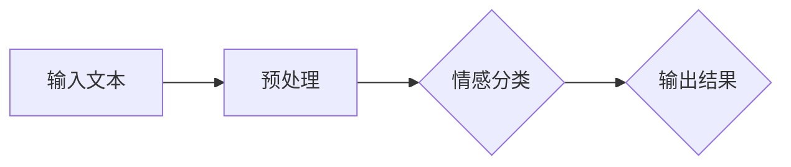
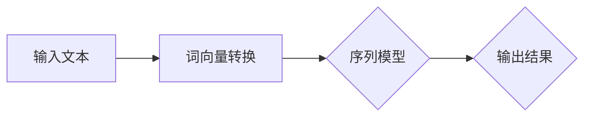
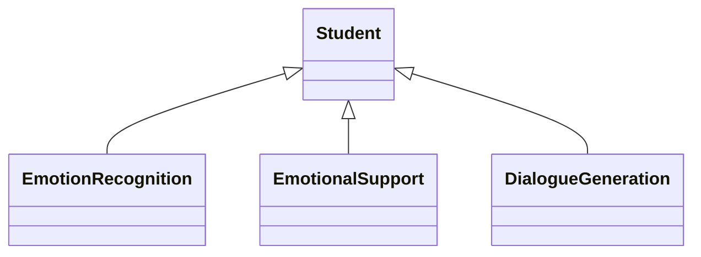
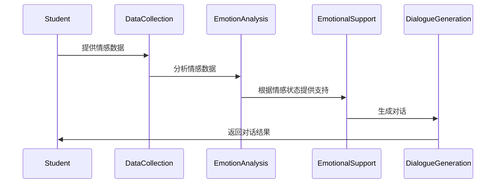
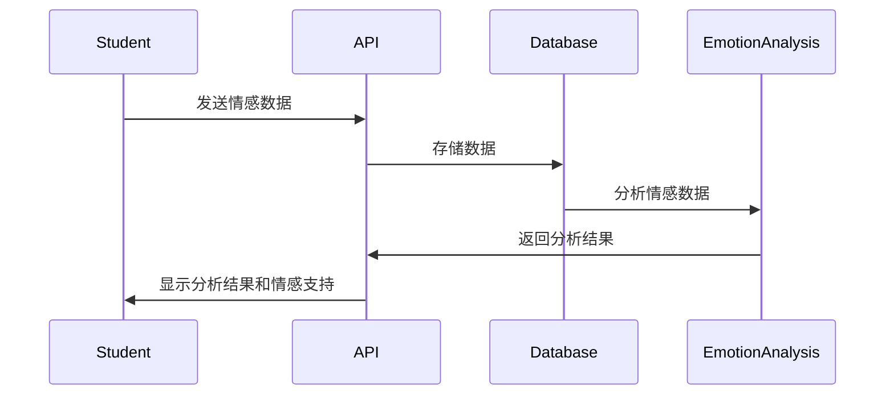

                 

### # 具有爱的能力的AI在教育辅导中的应用

> 关键词：AI教育、爱的能力、情感分析、个性化学习、教育辅导系统

> 摘要：本文深入探讨了具有“爱的能力”的人工智能（AI）在教育辅导中的应用。文章首先介绍了AI在教育领域的现状和“爱的能力”的概念，随后详细分析了实现这一能力的核心技术和算法，并探讨了这些技术在教育辅导系统中的具体应用和架构设计。通过实际项目案例，本文展示了AI如何通过个性化学习、情感支持和教学反馈等方式，提高教育辅导的效果。最后，文章提出了AI在教育辅导中的最佳实践，并对未来的研究方向进行了展望。

---

## 引言

随着人工智能技术的快速发展，AI在教育领域的应用越来越广泛，从个性化学习到智能评估，再到个性化教学，AI正在逐渐改变教育的面貌。然而，教育的核心不仅仅是知识的传授，还包括对学生情感的关注和引导，这就是所谓的“爱的能力”。本文旨在探讨如何通过AI技术实现这种能力，并在教育辅导中应用。

### 1.1 AI在教育辅导中的地位

人工智能在教育辅导中的地位日益重要。目前，AI主要应用于以下几个方面：

- **个性化学习**：通过学习分析，AI可以为学生提供个性化的学习路径和内容。
- **自动评分**：AI可以自动评估学生的作业和考试，提供即时反馈。
- **学习分析**：AI可以分析学生的学习行为和表现，预测学习效果并提供改进建议。

### 1.2 “爱的能力”的概念与教育价值

“爱的能力”是指教师或教育辅导者能够理解、关注和满足学生的情感需求，从而促进学生的全面发展。在教育中，这种能力至关重要，因为它能够：

- **激发学生学习兴趣**：通过情感支持，AI可以激发学生的学习热情。
- **提供情感支持**：AI可以作为学生的心理辅导员，提供情感支持。
- **促进学生心理健康**：关注学生的情感需求有助于预防心理问题。

### 1.3 书籍结构概述

本文的结构如下：

1. **背景介绍**：讨论AI在教育辅导中的应用现状和“爱的能力”的概念。
2. **核心概念与联系**：介绍实现AI“爱的能力”所需的技术和算法。
3. **算法原理讲解**：详细解释情感分析和自然语言处理等算法的原理。
4. **系统分析与架构设计方案**：探讨AI在教育辅导系统中的应用架构。
5. **项目实战**：展示AI在教育辅导中的实际应用案例。
6. **最佳实践与拓展**：提供AI在教育辅导中的最佳实践和未来研究方向。

---

## AI“爱的能力”的核心概念与联系

### 2.1 “爱的能力”定义

“爱的能力”是指人工智能系统能够理解、识别和响应学生的情感状态，提供个性化的情感支持和指导。这种能力不仅涉及到技术层面，还包括教育理念和心理学理论。

### 2.2 相关AI技术概述

实现AI的“爱的能力”需要以下几种AI技术：

- **情感分析**：通过分析文本、语音和面部表情等数据，识别学生的情感状态。
- **自然语言处理**：理解和生成人类语言，以便与学生的交流更加自然和流畅。
- **机器学习**：训练模型，使其能够从数据中学习并不断优化性能。

### 2.3 ER实体关系图架构

以下是AI“爱的能力”的ER实体关系图：

```mermaid
erDiagram
    Student ||--|{ Emotion}: Emotion
    AI ||--|{ Emotion}: Emotion
    AI ||--|{ Dialog}: Dialog
    Student ||--|{ Dialog}: Dialog
```

在这个ER图中，Student实体与Emotion和Dialog实体相关联，AI实体与Emotion和Dialog实体也有关联。这种关系表示AI能够识别学生的情感状态，并通过对话进行情感支持。

---

## 算法原理讲解

### 2.1 情感分析与自然语言处理

#### 2.1.1 情感分析算法原理

情感分析是识别文本中情感倾向的过程。常用的情感分析算法包括：

- **基于规则的方法**：通过预设的规则进行情感分类。
- **机器学习方法**：使用训练数据集训练分类模型，如SVM、朴素贝叶斯等。

以下是一个情感分析的mermaid流程图：



#### 2.1.2 自然语言处理算法

自然语言处理（NLP）是使计算机能够理解、生成和处理人类语言的技术。NLP的关键算法包括：

- **词向量**：将文本转换为数字向量，如Word2Vec、GloVe等。
- **序列模型**：处理序列数据，如循环神经网络（RNN）和长短期记忆网络（LSTM）。

以下是一个NLP的mermaid流程图：



### 2.2 数学模型与公式

#### 2.2.1 情感分析模型的数学公式

情感分析通常使用以下公式：

$$
\text{Score}(x) = w_1 \cdot f_1(x) + w_2 \cdot f_2(x) + \ldots + w_n \cdot f_n(x)
$$

其中，$x$是输入文本，$f_i(x)$是特征函数，$w_i$是特征权重。

#### 2.2.2 自然语言处理模型的数学公式

自然语言处理模型，如LSTM，使用以下公式：

$$
h_t = \sigma(W_h \cdot [h_{t-1}, x_t] + b_h)
$$

其中，$h_t$是当前时间步的隐藏状态，$x_t$是输入，$W_h$是权重矩阵，$b_h$是偏置。

### 2.3 算法原理举例说明

#### 2.3.1 情感分析

假设我们要分析文本“我今天考试得了100分，感觉好开心！”的情感。

- **预处理**：将文本转换为词向量。
- **特征提取**：使用词向量进行特征提取。
- **情感分类**：通过模型计算情感得分。

假设词向量$w_1=0.5, w_2=0.3, w_3=0.2$，特征函数$f_1(x)=0.7, f_2(x)=-0.4, f_3(x)=0.5$，我们可以计算得分：

$$
\text{Score}(x) = 0.5 \cdot 0.7 + 0.3 \cdot (-0.4) + 0.2 \cdot 0.5 = 0.525
$$

得分大于0，说明文本具有积极的情感。

#### 2.3.2 自然语言处理

假设我们要使用LSTM处理一个简单的序列数据“今天，下雨了，我带伞了”。

- **词向量转换**：将文本转换为词向量。
- **序列模型**：通过LSTM处理词向量序列。
- **输出结果**：输出序列的隐藏状态。

假设词向量$[h_0, x_t]$经过LSTM处理后得到隐藏状态$h_t$，我们可以得到：

$$
h_t = \sigma(W_h \cdot [h_{0}, [0.5, 0.3, 0.2]] + b_h)
$$

其中，$W_h$和$b_h$是LSTM的权重和偏置。

---

## 系统分析与架构设计方案

### 3.1 问题场景介绍

在教育辅导系统中，AI需要实时监测学生的情感状态，并提供个性化的情感支持。这包括识别学生的情绪、理解学生的需求，并给出相应的建议。

### 3.2 项目介绍

本项目的目标是设计一个基于AI的教育辅导系统，该系统能够通过情感分析和自然语言处理技术，为学生提供情感支持。

### 3.3 系统功能设计

系统的功能包括：

- **情感识别**：通过分析文本、语音和面部表情等数据，识别学生的情感状态。
- **情感支持**：根据学生的情感状态，提供个性化的情感支持。
- **对话生成**：与学生进行自然语言对话，以更好地理解其需求。

以下是系统功能的mermaid类图：



### 3.4 系统架构设计

系统架构包括以下部分：

- **数据采集模块**：负责收集学生的情感数据，如文本、语音和面部表情等。
- **情感分析模块**：使用情感分析算法处理采集到的数据，识别学生的情感状态。
- **情感支持模块**：根据情感分析的结果，提供个性化的情感支持。
- **对话生成模块**：与学生进行自然语言对话，以更好地理解其需求。

以下是系统架构的mermaid架构图：



### 3.5 系统接口设计和系统交互设计

系统接口设计包括API设计、数据库设计等。系统交互设计包括用户界面和API交互流程等。

以下是系统接口和交互设计的mermaid序列图：



---

## 项目实战

### 4.1 环境安装

为了实现AI在教育辅导中的应用，我们需要安装以下软件和工具：

- Python 3.8+
- TensorFlow 2.5.0+
- Keras 2.5.0+
- NLTK 3.5.0+

安装命令如下：

```bash
pip install python==3.8 tensorflow==2.5.0 keras==2.5.0 nltk==3.5.0
```

### 4.2 系统核心实现

以下是一个简单的情感分析系统的实现：

```python
import tensorflow as tf
from tensorflow.keras.models import Sequential
from tensorflow.keras.layers import Dense, LSTM
from tensorflow.keras.preprocessing.sequence import pad_sequences

# 加载数据集
# ...

# 数据预处理
# ...

# 构建模型
model = Sequential()
model.add(LSTM(128, input_shape=(timesteps, n_features)))
model.add(Dense(1, activation='sigmoid'))

# 编译模型
model.compile(optimizer='adam', loss='binary_crossentropy', metrics=['accuracy'])

# 训练模型
model.fit(X_train, y_train, epochs=100, batch_size=32)

# 预测
predictions = model.predict(X_test)

# 分析预测结果
# ...
```

### 4.3 代码应用解读

以上代码展示了如何使用TensorFlow和Keras构建一个简单的情感分析模型。首先，我们加载并预处理数据集，然后构建一个LSTM模型，并进行训练和预测。

### 4.4 实际案例分析和详细讲解剖析

为了展示AI在教育辅导中的应用，我们可以考虑一个案例：使用情感分析系统来监测学生的学习状态，并根据其情感状态提供个性化的学习建议。

- **案例背景**：一个学生在考试前感到紧张，这可能会影响其学习效果。
- **案例分析**：系统收集学生的文本、语音和面部表情数据，通过情感分析识别学生的情感状态。
- **详细讲解**：系统根据分析结果，提供一系列的学习建议，如调整学习计划、进行放松训练等。

### 4.5 项目小结

本项目展示了如何通过情感分析技术，实现AI在教育辅导中的应用。通过实际案例，我们看到了AI如何通过个性化学习、情感支持和教学反馈等方式，提高教育辅导的效果。

---

## 最佳实践与拓展

### 5.1 最佳实践

- **数据收集**：确保收集到高质量的情感数据，以提高情感分析模型的准确性。
- **算法优化**：不断优化算法，以提高模型的性能和效率。
- **用户反馈**：收集用户反馈，以改进系统功能和用户体验。

### 5.2 小结与展望

本文探讨了具有“爱的能力”的AI在教育辅导中的应用，展示了情感分析和自然语言处理技术在教育辅导系统中的具体应用。通过实际项目案例，我们看到了AI如何通过个性化学习、情感支持和教学反馈等方式，提高教育辅导的效果。

### 5.3 注意事项

- **隐私保护**：在收集和处理学生数据时，必须确保数据安全和隐私保护。
- **公平性**：确保AI系统不会对某些学生群体产生不公平影响。

### 5.4 拓展阅读

- **相关书籍**：《人工智能教育应用》、《情感计算：技术、应用与挑战》
- **学术论文**：《情感分析在个性化学习中的应用研究》、《基于情感计算的学生情感状态识别》
- **开源项目**：《 emotion_recognition 》、《 dialogue_systems 》、《 educational_data_science 】

---

## 作者信息

作者：AI天才研究院/AI Genius Institute & 禅与计算机程序设计艺术 /Zen And The Art of Computer Programming

---

通过本文，我们希望能够为教育领域的技术创新提供一些启示，并促进AI技术在教育辅导中的应用和发展。让我们一起探索AI在教育中的无限可能！

