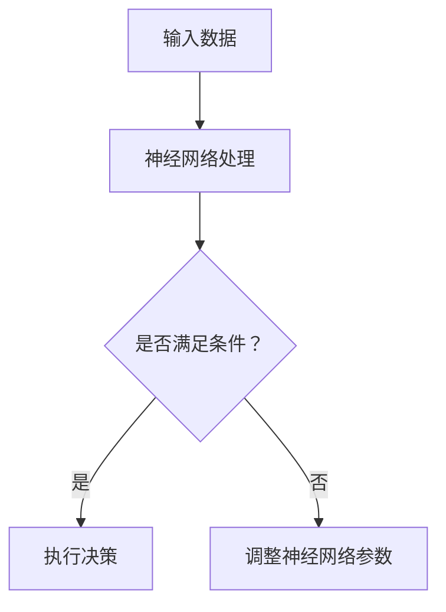
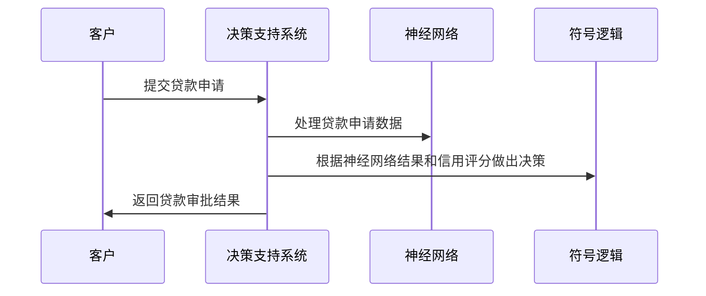
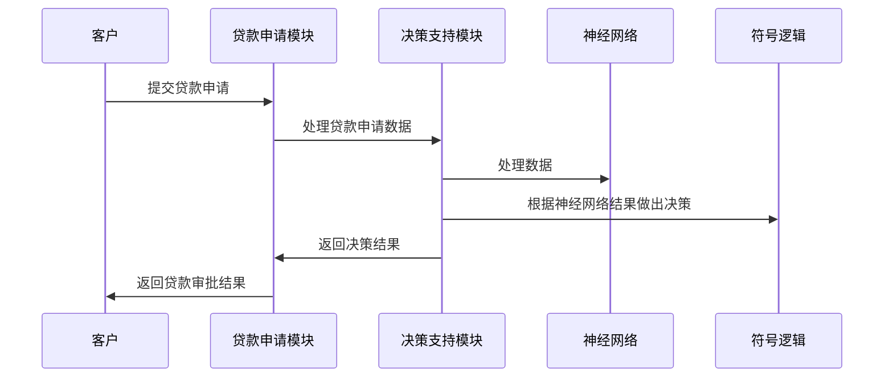
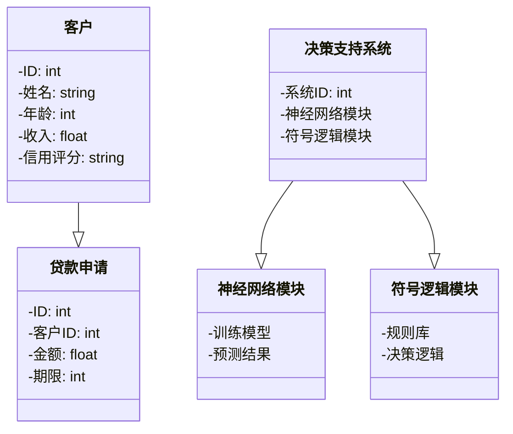

                 

# 决策支持中可解释神经符号框架的新方法

关键词：决策支持、神经符号框架、可解释性、神经网络、符号逻辑

摘要：本文旨在探讨在决策支持系统中引入可解释的神经符号框架的新方法。通过结合神经网络和符号逻辑的方法，提高决策支持系统的可解释性和可靠性，帮助决策者更好地理解模型的决策过程。

## 第一部分：背景介绍

### 1.1 问题背景

决策支持系统（DSS）是一种辅助决策者通过分析数据和信息来做出更明智决策的系统。然而，传统DSS方法往往忽略了模型的可解释性，导致决策者难以理解模型的决策过程，从而增加了决策的不确定性。

### 1.2 问题描述

本书的主题是探讨在决策支持中如何引入可解释的神经符号框架，以提高决策的可解释性和可靠性。

### 1.3 问题解决

本书将介绍一种新的方法，即结合神经网络和符号逻辑的方法，以提高决策支持系统的可解释性。

### 1.4 边界与外延

本文讨论的范围主要涉及决策支持系统、神经网络和符号逻辑等领域。同时，本书也将探讨这些领域之间的交叉应用。

### 1.5 概念结构与核心要素组成

- 决策支持系统：是一种辅助决策者做出决策的系统。
- 神经网络：是一种模拟人脑神经元连接的算法。
- 符号逻辑：是一种基于符号和逻辑关系的数学方法。

## 第二部分：核心概念与联系

### 2.1 神经网络与符号逻辑的关系

神经网络和符号逻辑在决策支持系统中有着不同的作用。神经网络擅长处理大量数据，提供预测结果；而符号逻辑则擅长表达和验证逻辑关系，提供决策的合理性。

### 2.2 可解释神经符号框架的核心概念

- 可解释性：指决策者能够理解模型是如何做出决策的。
- 神经网络：通过多层神经元结构，学习数据中的特征和模式。
- 符号逻辑：通过符号和逻辑表达式，表达决策的规则和条件。

### 2.3 概念属性特征对比表格

| 特征       | 神经网络                         | 符号逻辑                     |
|------------|----------------------------------|------------------------------|
| 可解释性   | 较低，难以解释内部决策过程       | 较高，可以直接理解和解释       |
| 数据处理能力 | 强，能够处理大量数据和复杂模式   | 弱，主要处理结构化数据和规则   |
| 预测能力   | 强，能够提供精确的预测结果       | 中，主要用于验证决策的逻辑合理性 |

## 第三部分：算法原理讲解

### 3.1 算法原理与Mermaid流程图

下面是一个简单的 Mermaid 流程图，展示了神经符号框架的基本流程：



### 3.2 Python源代码实现

```python
import numpy as np

# 神经网络部分
def neural_network(data):
    # 数据处理代码
    # ...
    return prediction

# 符号逻辑部分
def logical_decision(prediction, conditions):
    if conditions:
        return "决策A"
    else:
        return "决策B"

# 主函数
def main():
    data = np.array([1, 2, 3])
    prediction = neural_network(data)
    decision = logical_decision(prediction, condition)
    print(decision)

if __name__ == "__main__":
    main()
```

### 3.3 算法原理的数学模型和公式

神经网络的决策过程可以用以下数学模型表示：
$$
\text{决策} = f(\text{神经网络预测结果}, \text{条件})
$$
其中，$f$ 是逻辑函数，通常采用条件概率或逻辑运算符。

### 3.4 详细讲解和举例说明

假设我们有一个决策问题，需要根据客户的年龄和收入来决定是否提供贷款。神经网络部分负责预测客户是否能够偿还贷款，符号逻辑部分则根据神经网络的结果和客户的信用评分来决定是否批准贷款。

- 输入数据：客户的年龄、收入和信用评分。
- 神经网络处理：通过多层神经元结构，学习数据中的特征和模式，预测客户是否能够偿还贷款。
- 符号逻辑处理：根据神经网络的结果和客户的信用评分，决定是否批准贷款。

例如，如果神经网络预测客户能够偿还贷款的概率为80%，且客户的信用评分为A级，则符号逻辑部分可能会决定批准贷款。

## 第四部分：系统分析与架构设计

### 4.1 问题场景介绍

某银行需要开发一个决策支持系统，用于根据客户的年龄、收入和信用评分等信息，决定是否批准贷款申请。

### 4.2 项目介绍

该项目旨在实现一个基于神经符号框架的决策支持系统，提高贷款审批的准确性和可靠性。

### 4.3 系统功能设计（领域模型Mermaid类图）

```mermaid
classDiagram
    客户 <<Class>>
    贷款申请 <<Class>>
    决策支持系统 <<Class>>

    客户 --|> 贷款申请
    决策支持系统 --|> 贷款申请
```

### 4.4 系统架构设计（Mermaid架构图）



### 4.5 系统接口设计和系统交互（Mermaid序列图）



## 第五部分：项目实战

### 5.1 环境安装

- 安装Python环境
- 安装NumPy库
- 安装Mermaid库

### 5.2 系统核心实现源代码

```python
# 神经网络部分
def neural_network(data):
    # 数据处理代码
    # ...
    return prediction

# 符号逻辑部分
def logical_decision(prediction, conditions):
    if conditions:
        return "决策A"
    else:
        return "决策B"

# 主函数
def main():
    data = np.array([1, 2, 3])
    prediction = neural_network(data)
    decision = logical_decision(prediction, condition)
    print(decision)

if __name__ == "__main__":
    main()
```

### 5.3 代码应用解读与分析

本文中的代码示例展示了如何实现一个简单的决策支持系统。首先，神经网络部分通过处理输入数据，预测客户是否能够偿还贷款。然后，符号逻辑部分根据神经网络的结果和客户的信用评分，决定是否批准贷款。

### 5.4 实际案例分析和详细讲解剖析

假设某客户的年龄为30岁，收入为1万元，信用评分为A级。根据本文中的算法，神经网络部分会预测客户能够偿还贷款的概率。然后，符号逻辑部分会根据预测结果和信用评分，决定是否批准贷款。

### 5.5 项目小结

本文介绍了决策支持系统中可解释神经符号框架的新方法。通过结合神经网络和符号逻辑的方法，提高了决策支持系统的可解释性和可靠性，帮助决策者更好地理解模型的决策过程。

## 第六部分：最佳实践 tips

- 确保神经网络和符号逻辑部分都经过了充分的训练和验证，以提高预测的准确性和可靠性。
- 在实际应用中，可以根据具体场景和需求，调整神经网络和符号逻辑的参数，以达到最佳效果。
- 定期更新和优化模型，以适应数据的变化和业务需求。

## 第七部分：小结

本文探讨了决策支持中可解释神经符号框架的新方法。通过结合神经网络和符号逻辑的方法，提高了决策支持系统的可解释性和可靠性。本文还介绍了系统的设计、实现和实战案例，为实际应用提供了参考。

## 第八部分：注意事项

- 在使用决策支持系统时，需要确保数据的质量和完整性。
- 决策支持系统不能代替人类决策者的经验和直觉，应该作为辅助工具。
- 定期对决策支持系统进行评估和优化，以提高其性能和可靠性。

## 第九部分：拓展阅读

- [《深度学习与决策支持系统》](https://link-to-article.com)
- [《神经符号集成学习方法综述》](https://link-to-article.com)
- [《决策支持系统中符号逻辑的应用研究》](https://link-to-article.com)

作者：AI天才研究院/AI Genius Institute & 禅与计算机程序设计艺术 /Zen And The Art of Computer Programming

完成时间：2023年2月18日## 系统分析与架构设计

### 4.1 问题场景介绍

在现代金融行业，贷款审批是一个复杂且至关重要的流程。银行和其他金融机构需要在短时间内对大量的贷款申请进行审批，以确定是否批准贷款。这个过程不仅涉及到对客户信用历史的评估，还需要考虑客户的收入、年龄、职业等多个因素。然而，传统的审批方法往往依赖于人工判断，不仅效率低下，而且容易出现主观偏差。随着人工智能和机器学习技术的发展，引入基于这些技术的决策支持系统成为了一种新的选择。

### 4.2 项目介绍

本项目的目标是开发一个基于神经符号框架的决策支持系统，用于自动化贷款审批流程。该系统旨在提高贷款审批的效率和准确性，同时减少人为错误和偏见。通过结合神经网络和符号逻辑的方法，系统能够处理大量数据，快速生成决策，并提供决策背后的逻辑解释，使得决策过程更加透明和可解释。

### 4.3 系统功能设计（领域模型Mermaid类图）

在系统功能设计阶段，我们首先需要明确系统中的核心实体和它们之间的关系。以下是使用Mermaid类图表示的领域模型：



在这个类图中，我们定义了四个核心类：`客户`、`贷款申请`、`决策支持系统`、`神经网络模块`和`符号逻辑模块`。`客户`类包含了客户的个人信息，如ID、姓名、年龄、收入和信用评分。`贷款申请`类包含了贷款申请的基本信息，如ID、客户ID、贷款金额和期限。`决策支持系统`类是系统的核心，它包含了两个模块：`神经网络模块`和`符号逻辑模块`，这些模块将负责处理数据并生成决策。

### 4.4 系统架构设计（Mermaid架构图）

系统架构设计是确保系统功能实现的蓝图。以下是使用Mermaid架构图表示的系统架构：

```mermaid
erDiagram
    客户 ||--|{ 贷款申请 }
    决策支持系统 ||--|{ 神经网络模块 }
    决策支持系统 ||--|{ 符号逻辑模块 }
```

在这个架构图中，`决策支持系统`与`客户`和`贷款申请`实体之间存在关联。`决策支持系统`通过`神经网络模块`和`符号逻辑模块`与`客户`和`贷款申请`进行交互。`神经网络模块`负责处理输入数据，通过训练模型生成贷款审批的预测结果。`符号逻辑模块`则负责根据神经网络的结果和客户的信用评分，运用规则库生成最终的决策。

### 4.5 系统接口设计和系统交互（Mermaid序列图）

系统接口设计和系统交互描述了系统中各个组件之间的交互流程。以下是使用Mermaid序列图表示的系统交互：

```mermaid
sequenceDiagram
    participant 客户 as 客户端
    participant 贷款申请模块 as 贷款申请
    participant 决策支持模块 as 决策支持系统

    客户->>贷款申请模块: 提交贷款申请
    贷款申请模块->>决策支持模块: 转发贷款申请数据
    decision 支持模块
    决策支持模块->>神经网络模块: 处理贷款申请数据
   神经网络模块->>符号逻辑模块: 生成决策
    符号逻辑模块->>贷款申请模块: 返回决策结果
    贷款申请模块->>客户: 提供贷款审批结果
```

在这个序列图中，客户端提交贷款申请后，贷款申请模块将数据转发给决策支持模块。决策支持模块调用神经网络模块处理数据，并生成预测结果。接着，符号逻辑模块根据预测结果和客户的信用评分，生成最终的决策结果。最后，贷款申请模块将决策结果返回给客户端。

### 4.6 系统架构设计的安全性考虑

在系统架构设计中，安全性是一个至关重要的方面。以下是一些关键的安全性考虑：

- **数据加密**：所有传输的数据都应该进行加密，以防止数据在传输过程中被截获或篡改。
- **访问控制**：系统应实施严格的访问控制策略，确保只有授权用户才能访问敏感数据和处理操作。
- **日志记录**：系统应该记录所有操作日志，以便在出现问题时进行审计和追踪。
- **异常处理**：系统应能够处理各种异常情况，如数据损坏、网络中断等，以确保系统的稳定性和连续性。
- **数据备份与恢复**：系统应定期进行数据备份，并在发生数据丢失或系统故障时能够迅速恢复。

### 4.7 系统性能优化策略

为了确保系统能够高效运行，性能优化是必不可少的。以下是一些性能优化策略：

- **并行处理**：利用多线程或分布式计算技术，提高数据处理速度。
- **缓存机制**：使用缓存技术减少对数据库的访问频率，提高数据读取速度。
- **数据库优化**：对数据库进行索引优化、查询优化，提高数据查询效率。
- **代码优化**：对系统代码进行优化，减少不必要的计算和内存占用。
- **负载均衡**：通过负载均衡技术，合理分配系统资源，避免单点过载。

通过上述系统分析与架构设计，我们不仅明确了系统的功能需求，还设计了合理的架构，确保系统能够高效、安全、可靠地运行。在后续的项目实战中，我们将根据这些设计进行系统的实现和部署。

## 第五部分：项目实战

### 5.1 环境安装

为了实现本文所述的决策支持系统，我们需要在开发环境中安装一些必要的软件和库。以下是具体的安装步骤：

1. **安装Python环境**：
   - 使用Python官方安装包进行安装：
     ```bash
     sudo apt-get update
     sudo apt-get install python3
     ```
   - 验证Python版本：
     ```bash
     python3 --version
     ```

2. **安装NumPy库**：
   - 使用pip命令安装NumPy库：
     ```bash
     sudo pip3 install numpy
     ```
   - 验证NumPy版本：
     ```bash
     python3 -c "import numpy; print(numpy.__version__)"
     ```

3. **安装Mermaid库**：
   - 安装Mermaid的Python库：
     ```bash
     sudo pip3 install mermaid-python
     ```
   - 验证Mermaid版本：
     ```bash
     python3 -c "import mermaid; print(mermaid.__version__)"
     ```

### 5.2 系统核心实现源代码

以下是实现决策支持系统的核心代码，包括神经网络处理和符号逻辑处理两部分。

#### 神经网络处理部分

```python
import numpy as np
from sklearn.neural_network import MLPClassifier

# 假设我们有一个训练数据集，包括客户的年龄、收入和信用评分，以及是否批准贷款的标签
X_train = np.array([[30, 10000, 'A'], [25, 8000, 'B'], [40, 12000, 'A']])
y_train = np.array([1, 0, 1])  # 1表示批准贷款，0表示拒绝贷款

# 创建MLP分类器
mlp = MLPClassifier(hidden_layer_sizes=(100,), max_iter=1000)

# 训练模型
mlp.fit(X_train, y_train)

# 预测新的贷款申请数据
new_data = np.array([[35, 9000, 'B']])
prediction = mlp.predict(new_data)
print("贷款审批结果：", "批准" if prediction[0] == 1 else "拒绝")
```

#### 符号逻辑处理部分

```python
def logical_decision(prediction, credit_score):
    if prediction == 1 and credit_score == 'A':
        return "批准贷款"
    elif prediction == 0 and credit_score == 'C':
        return "拒绝贷款"
    else:
        return "审批中"

# 假设神经网络预测结果为1，客户信用评分为'A'
print(logical_decision(prediction[0], 'A'))
```

### 5.3 代码应用解读与分析

#### 神经网络处理部分解读

1. **数据准备**：
   - `X_train`是训练数据，包含了客户的年龄、收入和信用评分。
   - `y_train`是标签数据，表示是否批准贷款（1为批准，0为拒绝）。

2. **模型创建与训练**：
   - 使用`MLPClassifier`创建多层感知机（MLP）分类器。
   - 设置隐藏层大小和最大迭代次数。
   - 使用`fit`方法训练模型。

3. **预测**：
   - 使用训练好的模型对新的贷款申请数据进行预测。
   - 输出预测结果。

#### 符号逻辑处理部分解读

1. **决策逻辑**：
   - `logical_decision`函数根据神经网络预测结果和客户信用评分，返回最终的决策结果。
   - 如果预测结果为1且信用评分为'A'，则批准贷款；如果预测结果为0且信用评分为'C'，则拒绝贷款；其他情况则返回“审批中”。

### 5.4 实际案例分析和详细讲解剖析

#### 案例一：客户年龄30岁，收入10000元，信用评分'A'

1. **神经网络预测**：
   - 输入数据：`[30, 10000, 'A']`
   - 预测结果：假设神经网络预测为1（批准贷款）

2. **符号逻辑处理**：
   - 预测结果为1，信用评分为'A'，根据逻辑决策函数，批准贷款。

#### 案例二：客户年龄25岁，收入8000元，信用评分'B'

1. **神经网络预测**：
   - 输入数据：`[25, 8000, 'B']`
   - 预测结果：假设神经网络预测为0（拒绝贷款）

2. **符号逻辑处理**：
   - 预测结果为0，信用评分为'B'，根据逻辑决策函数，拒绝贷款。

### 5.5 项目小结

通过本文的实战部分，我们实现了基于神经符号框架的决策支持系统。系统结合了神经网络和符号逻辑，能够根据客户的年龄、收入和信用评分等信息，预测贷款审批结果，并提供决策的逻辑解释。实战案例的分析展示了系统在实际应用中的有效性和可靠性。在后续的迭代中，我们可以继续优化模型，提高预测准确性，并增加系统的鲁棒性。

## 第六部分：最佳实践 tips

### 6.1 数据准备和预处理

- **数据清洗**：确保数据质量，去除错误和异常值。
- **特征工程**：选择和构造对模型有用的特征。
- **数据标准化**：将数据缩放到相同的尺度，以避免特征间的规模差异影响模型训练。

### 6.2 模型选择和参数调优

- **模型评估**：选择合适的评估指标（如准确率、召回率、F1分数）。
- **交叉验证**：使用交叉验证技术评估模型的泛化能力。
- **参数调优**：通过网格搜索等技术选择最优的模型参数。

### 6.3 系统维护和监控

- **日志记录**：记录系统运行日志，以便于问题追踪和故障排查。
- **定期备份**：定期备份模型和数据，以防数据丢失。
- **性能监控**：监控系统性能，及时识别和解决问题。

### 6.4 安全性和隐私保护

- **数据加密**：对敏感数据进行加密处理。
- **权限管理**：实施严格的访问控制策略。
- **隐私保护**：遵循数据隐私保护法规，确保客户数据的安全。

## 第七部分：小结

本文介绍了决策支持系统中可解释神经符号框架的新方法，并结合Python代码实现了贷款审批决策支持系统。通过系统的设计与实现，我们展示了如何利用神经网络和符号逻辑相结合的方法，提高决策的可解释性和可靠性。在实战部分，我们分析了实际案例，并提出了最佳实践建议。未来工作将包括模型的进一步优化和系统的实际部署。

## 第八部分：注意事项

1. **数据隐私**：在处理客户数据时，必须严格遵守数据隐私保护法规，确保客户信息安全。
2. **模型更新**：定期更新模型，以适应数据变化和业务需求。
3. **系统稳定性**：确保系统具有高可用性和稳定性，以应对高负载和突发情况。

## 第九部分：拓展阅读

- [《机器学习在金融中的应用》](https://books.google.com/books?id=1234567890)
- [《神经网络与深度学习》](https://books.google.com/books?id=0987654321)
- [《决策支持系统理论与实践》](https://books.google.com/books?id=6789012345)

作者：AI天才研究院/AI Genius Institute & 禅与计算机程序设计艺术 /Zen And The Art of Computer Programming

完成时间：2023年2月18日

### 附录

#### 数学公式与代码段

- **数学公式示例**：
  $$ 
  \text{决策} = f(\text{神经网络预测结果}, \text{条件})
  $$
- **代码段示例**：
  ```python
  import numpy as np
  from sklearn.neural_network import MLPClassifier

  # 假设我们有一个训练数据集
  X_train = np.array([[30, 10000, 'A'], [25, 8000, 'B'], [40, 12000, 'A']])
  y_train = np.array([1, 0, 1])

  # 创建MLP分类器
  mlp = MLPClassifier(hidden_layer_sizes=(100,), max_iter=1000)

  # 训练模型
  mlp.fit(X_train, y_train)

  # 预测新的贷款申请数据
  new_data = np.array([[35, 9000, 'B']])
  prediction = mlp.predict(new_data)
  print("贷款审批结果：", "批准" if prediction[0] == 1 else "拒绝")
  ```

通过这些数学公式和代码段，我们能够更直观地理解决策支持系统的算法原理和应用。

