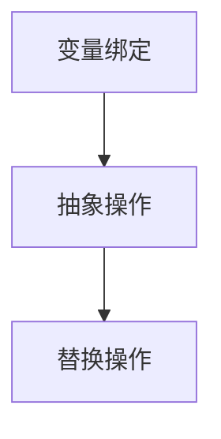
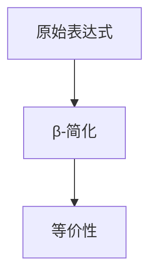
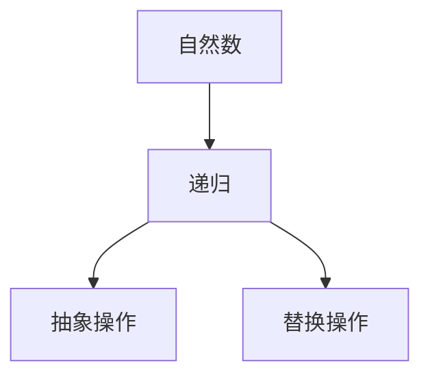
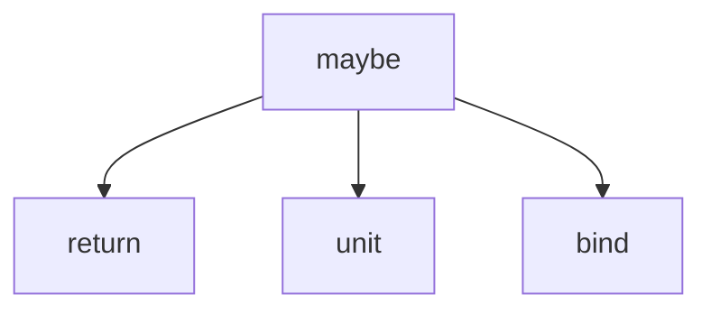
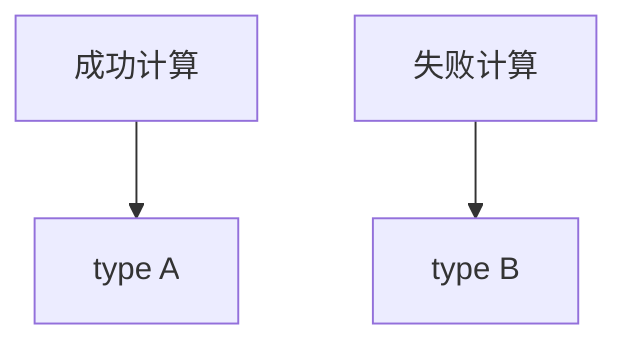

                 

### 文章标题

# 函数式编程与lambda演算：类型论的实践

> 关键词：函数式编程、lambda演算、类型论、编程实践、代码示例

> 摘要：本文将从函数式编程的基本概念入手，逐步探讨lambda演算的原理及其在类型论中的应用，通过一系列代码示例和项目实战，深入理解函数式编程的实践方法与技巧。

## 目录大纲设计思考步骤

### 1. 确定整体结构

在撰写一本关于函数式编程与lambda演算的书籍时，我们需要首先明确整体结构。整体结构可以分为以下几个部分：

- **引言和背景介绍**：介绍函数式编程和lambda演算的起源、发展及其在现代编程中的重要性。
- **函数式编程基础**：讲解函数、高阶函数、闭包、柯里化等基本概念。
- **Lambda演算原理**：深入探讨Lambda演算的基本概念、变量绑定、β-简化等原理。
- **类型论应用**：介绍类型论的基础知识，以及如何将类型论应用于函数式编程。
- **项目实战**：通过具体项目实战，展示如何将函数式编程和lambda演算应用于实际开发中。
- **总结与展望**：对全书内容进行总结，并展望函数式编程和lambda演算的未来发展趋势。

### 2. 详细内容规划

接下来，我们需要为每个部分规划详细的内容。以下是详细的内容规划：

#### 第一部分：引言和背景介绍

**第1章 函数式编程与Lambda演算概述**

- 函数式编程的起源与发展
- Lambda演算的背景与意义
- 本书的目的与结构

**第2章 函数式编程基础**

- 函数与高阶函数
- 偏函数、闭包与柯里化
- 柯里化与函数组合
- 函数式编程范式

**第3章 Lambda表达式**

- Lambda表达式的语法与用法
- Lambda表达式与闭包的关系
- Lambda表达式在实际开发中的应用

#### 第二部分：Lambda演算原理

**第4章 Lambda演算基础**

- Lambda演算的基本概念
- 变量绑定与替换
- β-简化与等价性
- 自然数与递归

**第5章 Lambda演算的变种**

- Monadic Lambda演算
- 标记计算与STLC
- Lambda演算的应用领域

#### 第三部分：类型论应用

**第6章 类型论基础**

- 类型论的基本概念
- 基本类型系统
- 类型检查与类型推断

**第7章 函数式编程与类型论**

- 函数式编程中的类型系统
- 类型论与Lambda演算的关系
- 函数式编程中的类型错误处理

#### 第四部分：项目实战

**第8章 函数式编程项目实战**

- 实战项目背景介绍
- 项目核心功能实现
- 项目代码解读与分析

#### 第五部分：总结与展望

**第9章 总结与展望**

- 函数式编程与Lambda演算的总结
- 类型论的应用前景
- 未来发展方向与挑战

### 3. 确定目录大纲

根据上述内容规划，我们可以确定如下目录大纲：

```
----------------------------------------------------------------
# 函数式编程与lambda演算：类型论的实践

> 关键词：函数式编程、lambda演算、类型论、编程实践、代码示例

> 摘要：本文将从函数式编程的基本概念入手，逐步探讨lambda演算的原理及其在类型论中的应用，通过一系列代码示例和项目实战，深入理解函数式编程的实践方法与技巧。

## 目录

----------------------------------------------------------------

### 第一部分：引言和背景介绍

#### 第1章 函数式编程与Lambda演算概述

##### 1.1 函数式编程的起源与发展

##### 1.2 Lambda演算的背景与意义

##### 1.3 本书的目的与结构

#### 第2章 函数式编程基础

##### 2.1 函数与高阶函数

##### 2.2 偏函数、闭包与柯里化

##### 2.3 柯里化与函数组合

##### 2.4 函数式编程范式

#### 第3章 Lambda表达式

##### 3.1 Lambda表达式的语法与用法

##### 3.2 Lambda表达式与闭包的关系

##### 3.3 Lambda表达式在实际开发中的应用

### 第二部分：Lambda演算原理

#### 第4章 Lambda演算基础

##### 4.1 Lambda演算的基本概念

##### 4.2 变量绑定与替换

##### 4.3 β-简化与等价性

##### 4.4 自然数与递归

#### 第5章 Lambda演算的变种

##### 5.1 Monadic Lambda演算

##### 5.2 标记计算与STLC

##### 5.3 Lambda演算的应用领域

### 第三部分：类型论应用

#### 第6章 类型论基础

##### 6.1 类型论的基本概念

##### 6.2 基本类型系统

##### 6.3 类型检查与类型推断

#### 第7章 函数式编程与类型论

##### 7.1 函数式编程中的类型系统

##### 7.2 类型论与Lambda演算的关系

##### 7.3 函数式编程中的类型错误处理

### 第四部分：项目实战

#### 第8章 函数式编程项目实战

##### 8.1 实战项目背景介绍

##### 8.2 项目核心功能实现

##### 8.3 项目代码解读与分析

### 第五部分：总结与展望

#### 第9章 总结与展望

##### 9.1 函数式编程与Lambda演算的总结

##### 9.2 类型论的应用前景

##### 9.3 未来发展方向与挑战
----------------------------------------------------------------
```

这个目录大纲结构清晰，逻辑性强，能够帮助读者系统地学习和理解函数式编程与Lambda演算的相关知识。

## 第一部分：引言和背景介绍

### 第1章 函数式编程与Lambda演算概述

#### 1.1 函数式编程的起源与发展

函数式编程（Functional Programming，简称FP）是一种编程范式，强调以表达计算过程为主，而非以改变状态为主。函数式编程的起源可以追溯到20世纪30年代，当时逻辑学家阿尔弗雷德·塔斯基（Alfred Tarski）和逻辑学家艾伦·图灵（Alan Turing）等人在研究计算理论和逻辑演算时提出了一些基本的函数式概念。

在20世纪50年代和60年代，函数式编程开始受到关注，并在一些早期的编程语言中得到了应用，如Lisp和Haskell。Lisp是由约翰·麦卡锡（John McCarthy）于1958年发明的一种函数式编程语言，它是历史上最早的通用高级编程语言之一。Lisp的成功激发了人们对函数式编程的兴趣，并推动了函数式编程语言的发展。

随着时间的推移，函数式编程逐渐在计算机科学领域得到了更广泛的应用。现代编程语言如Haskell、Scala、Erlang等都是函数式编程语言。这些语言在编译优化、并发编程、并发编程等领域具有独特的优势。

#### 1.2 Lambda演算的背景与意义

Lambda演算（Lambda Calculus）是函数式编程的理论基础，由逻辑学家阿尔弗雷德·诺思·怀特海德（Alfred North Whitehead）和伯兰特·罗素（Bertrand Russell）在《数学原理》一书中提出，后来由逻辑学家阿隆佐·邱奇（Alonzo Church）进行了改进和系统化。Lambda演算是一种形式化的计算模型，通过变量的绑定和替换来实现计算。

Lambda演算的意义在于它为函数式编程提供了一套严格的数学基础，使得函数式编程的语法和语义有了清晰的定义。Lambda演算的许多概念，如变量绑定、递归、函数组合等，在函数式编程语言中得到了广泛应用。

#### 1.3 本书的目的与结构

本书旨在系统地介绍函数式编程与Lambda演算的相关知识，帮助读者深入理解函数式编程的原理和实际应用。本书的结构如下：

- **引言和背景介绍**：介绍函数式编程和Lambda演算的起源、发展及其在现代编程中的重要性。
- **函数式编程基础**：讲解函数、高阶函数、闭包、柯里化等基本概念。
- **Lambda演算原理**：深入探讨Lambda演算的基本概念、变量绑定、β-简化等原理。
- **类型论应用**：介绍类型论的基础知识，以及如何将类型论应用于函数式编程。
- **项目实战**：通过具体项目实战，展示如何将函数式编程和Lambda演算应用于实际开发中。
- **总结与展望**：对全书内容进行总结，并展望函数式编程和Lambda演算的未来发展趋势。

本书将通过一系列的代码示例和项目实战，帮助读者将理论知识应用于实践，从而深入理解函数式编程和Lambda演算的核心概念和实际应用。

## 第二部分：函数式编程基础

### 第2章 函数式编程基础

函数式编程是一种以表达计算过程为主的编程范式，与面向对象编程和过程式编程不同，它更注重数据的转换而非状态的改变。在本章中，我们将介绍函数式编程的一些基本概念，包括函数、高阶函数、闭包、柯里化等。

#### 2.1 函数与高阶函数

在函数式编程中，函数被视为一种特殊的数据类型，它们可以像其他数据类型一样传递、存储和操作。函数是一种接受输入并返回输出的过程，它通过参数传递输入，并通过返回值输出结果。

```python
def add(a, b):
    return a + b

result = add(2, 3)
print(result)  # 输出 5
```

高阶函数是函数式编程中的一个核心概念，它是指能够接受函数作为参数或者返回函数的函数。高阶函数使得函数的组合和复用变得更加灵活和高效。

```python
def apply_func(func, a, b):
    return func(a, b)

add = lambda x, y: x + y
result = apply_func(add, 2, 3)
print(result)  # 输出 5
```

#### 2.2 偏函数、闭包与柯里化

偏函数是一种部分应用的高阶函数，它通过固定函数的一个或多个参数来创建一个新的函数。偏函数在函数式编程中非常有用，因为它们可以减少重复代码，提高代码的可读性和可维护性。

```python
from functools import partial

def add(a, b):
    return a + b

add_to_five = partial(add, 5)
result = add_to_five(3)
print(result)  # 输出 8
```

闭包是一种特殊的函数，它将函数的行为与其创建时的环境关联起来。闭包可以访问并保留函数定义时的环境变量，使得函数具有状态。

```python
def make_multiplier_of(n):
    def multiplier(x):
        return x * n
    return multiplier

times_three = make_multiplier_of(3)
result = times_three(6)
print(result)  # 输出 18
```

柯里化（Currying）是一种将多个参数的函数转换成一系列使用单个参数的函数的方法。柯里化可以提高函数的可组合性和可重用性。

```python
def add(a, b):
    return a + b

curried_add = lambda b: lambda a: a + b
result = curried_add(3)(4)
print(result)  # 输出 7
```

#### 2.3 柯里化与函数组合

柯里化与函数组合是函数式编程中常用的技术。函数组合（Function Composition）是指将多个函数组合成一个新函数，新函数先执行第一个函数，然后依次执行后续的函数。

```python
def compose(f, g):
    return lambda x: f(g(x))

add_and_square = compose(lambda x: x + 5, lambda x: x * x)
result = add_and_square(4)
print(result)  # 输出 33
```

通过柯里化和函数组合，我们可以实现更灵活和强大的函数操作。

#### 2.4 函数式编程范式

函数式编程有多种范式，包括纯函数范式、不变数据范式和类型系统等。纯函数范式强调使用纯函数，避免副作用和不可预测的行为；不变数据范式强调使用不可变数据结构，避免状态改变和副作用；类型系统则提供了一种形式化的方法来确保代码的正确性和安全性。

```python
# 纯函数范式
def square(x):
    return x * x

result = square(4)
print(result)  # 输出 16

# 不变数据范式
def append(x, lst):
    return lst + [x]

my_list = [1, 2, 3]
new_list = append(4, my_list)
print(new_list)  # 输出 [1, 2, 3, 4]
print(my_list)   # 输出 [1, 2, 3] ，my_list 没有改变

# 类型系统
def add(a: int, b: int) -> int:
    return a + b

result = add(2, 3)
print(result)  # 输出 5
```

通过了解这些基本概念和范式，我们可以更好地掌握函数式编程，并在实际开发中发挥其优势。

## 第3章 Lambda表达式

Lambda表达式是函数式编程中的一个重要概念，它提供了一种简洁的方式来定义匿名函数。在本章中，我们将详细介绍Lambda表达式的语法、用法及其在实际开发中的应用。

#### 3.1 Lambda表达式的语法与用法

Lambda表达式的基本语法是`lambda 参数：表达式`。它定义了一个匿名函数，可以像普通函数一样使用。Lambda表达式通常用于那些只需一次或几次使用的小函数。

```python
add = lambda x, y: x + y
result = add(2, 3)
print(result)  # 输出 5
```

在这个例子中，`lambda x, y: x + y`定义了一个接受两个参数的匿名函数，该函数返回两个参数的和。

Lambda表达式可以嵌套使用，例如：

```python
double_and_add = lambda x, y: lambda z: (x * z) + (y * z)
result = double_and_add(2, 3)(4)
print(result)  # 输出 20
```

在这个例子中，`lambda x, y: lambda z: (x * z) + (y * z)`定义了一个嵌套的匿名函数，外层函数接受两个参数，内层函数接受一个参数。

Lambda表达式可以与高阶函数一起使用，例如`filter`、`map`和`reduce`。这些函数接受一个函数作为参数，并对其进行一系列操作。

```python
numbers = [1, 2, 3, 4, 5]

squared = list(map(lambda x: x * x, numbers))
print(squared)  # 输出 [1, 4, 9, 16, 25]

even = list(filter(lambda x: x % 2 == 0, numbers))
print(even)  # 输出 [2, 4]

from functools import reduce
sum_of_squares = reduce(lambda x, y: x + y, squared)
print(sum_of_squares)  # 输出 55
```

在这个例子中，`map`函数将`lambda x: x * x`应用于列表中的每个元素，`filter`函数使用`lambda x: x % 2 == 0`来筛选出偶数，`reduce`函数使用`lambda x, y: x + y`来计算列表中元素的总和。

#### 3.2 Lambda表达式与闭包的关系

Lambda表达式与闭包有着密切的关系。闭包是一种特殊的函数，它能够记住并访问其定义时的环境。Lambda表达式可以创建闭包，使得函数可以访问外部变量。

```python
x = 10
add_x = lambda y: x + y
result = add_x(5)
print(result)  # 输出 15
```

在这个例子中，`lambda y: x + y`创建了一个闭包，它记住了外部变量`x`，并在每次调用时使用`x`的值。

#### 3.3 Lambda表达式在实际开发中的应用

Lambda表达式在实际开发中非常有用，特别是在数据处理和函数式编程场景中。以下是一些实际应用场景：

1. **数据处理**：Lambda表达式可以用于处理数据列表，如筛选、映射和聚合。

```python
numbers = [1, 2, 3, 4, 5]

squared = list(map(lambda x: x * x, numbers))
print(squared)  # 输出 [1, 4, 9, 16, 25]

even = list(filter(lambda x: x % 2 == 0, numbers))
print(even)  # 输出 [2, 4]

from functools import reduce
sum_of_squares = reduce(lambda x, y: x + y, squared)
print(sum_of_squares)  # 输出 55
```

2. **事件处理**：Lambda表达式可以用于事件处理，如按键事件、鼠标事件等。

```python
def on_click():
    print("Button clicked!")

button = Button(text="Click me")
button.setOnClickListener(lambda: on_click())
```

3. **函数式编程**：Lambda表达式可以用于实现函数式编程范式，如纯函数、不可变数据和类型系统。

```python
def square(x):
    return x * x

result = square(4)
print(result)  # 输出 16

def append(x, lst):
    return lst + [x]

my_list = [1, 2, 3]
new_list = append(4, my_list)
print(new_list)  # 输出 [1, 2, 3, 4]
print(my_list)  # 输出 [1, 2, 3]

from functools import reduce
def sum(lst):
    return reduce(lambda x, y: x + y, lst)

result = sum([1, 2, 3, 4, 5])
print(result)  # 输出 15
```

通过Lambda表达式，我们可以编写更简洁、更易于理解的代码，同时利用函数式编程的优势来提高代码的可维护性和可重用性。

## 第4章 Lambda演算基础

Lambda演算（Lambda Calculus）是函数式编程的理论基础，由逻辑学家阿尔弗雷德·诺思·怀特海德（Alfred North Whitehead）和伯兰特·罗素（Bertrand Russell）在《数学原理》一书中首次提出，后来由逻辑学家阿隆佐·邱奇（Alonzo Church）进行了改进和系统化。Lambda演算通过变量的绑定和替换来实现计算，具有简洁、明确和强大的表达能力。

#### 4.1 Lambda演算的基本概念

Lambda演算的基本概念包括变量、函数、抽象和替换。变量是函数式编程中的基本符号，用于表示值或对象。函数是接受输入并返回输出的过程，通过变量绑定和替换来实现计算。抽象是一种将变量与其对应的表达式绑定起来的操作，使得函数能够以参数形式传递。替换是Lambda演算的核心操作，通过将函数中的变量替换为其对应的表达式来实现计算。

#### 4.2 变量绑定与替换

在Lambda演算中，变量绑定是指将变量与其对应的值关联起来的操作。变量绑定可以通过抽象和替换来实现。抽象是一种将变量与其对应的表达式绑定起来的操作，例如，`λx.x`表示一个抽象操作，它将变量`x`与其表达式`x`绑定。替换是指将函数中的变量替换为其对应的表达式，例如，将`λx.x`中的变量`x`替换为`y`，得到`λx.y`。



#### 4.3 β-简化与等价性

β-简化是Lambda演算的核心操作，它通过将函数中的变量替换为其对应的表达式来实现计算。β-简化过程包括两个步骤：找到可简化的部分（找到函数中的变量）和替换变量（将变量替换为其对应的表达式）。

β-简化与等价性是Lambda演算的两个重要概念。β-简化是指对Lambda表达式进行替换操作，使其变得更简单。等价性是指通过β-简化得到的结果与原表达式具有相同的计算结果。



#### 4.4 自然数与递归

Lambda演算提供了对自然数和递归的支持。自然数可以通过抽象操作和替换来实现。递归是一种通过函数调用自身来实现计算的方法。在Lambda演算中，递归可以通过定义递归函数来实现。



通过以上基本概念和操作，Lambda演算提供了一种简洁、明确和强大的计算模型，成为函数式编程的理论基础。

## 第5章 Lambda演算的变种

Lambda演算是函数式编程的理论基础，但随着时间的发展，许多变体和扩展被提出，以适应不同的编程需求和场景。本章将介绍Lambda演算的一些变种，包括Monadic Lambda演算、标记计算与STLC，并探讨Lambda演算在应用领域中的作用。

#### 5.1 Monadic Lambda演算

Monadic Lambda演算是一种在Lambda演算基础上引入了Monad概念的变种。Monad是一种抽象的编程构造，它提供了处理副作用和状态管理的统一框架。在Monadic Lambda演算中，Monad被实现为一种特殊类型的函数，称为Monad运算符。

Monad运算符通常具有三个基本操作：`unit`、`bind`和`return`。`unit`用于将值包装为Monad，`bind`用于将两个Monad组合在一起，`return`用于将值返回到外部。

在Monadic Lambda演算中，Monad运算符可以通过抽象操作来实现。例如，一个简单的Monad运算符`maybe`可以表示为：



Monadic Lambda演算在处理并发编程和状态管理方面具有独特的优势。通过Monad运算符，我们可以以统一的方式处理副作用和状态变化，从而提高代码的可读性和可维护性。

#### 5.2 标记计算与STLC

标记计算（Tagged Union）是一种用于表示复合数据类型的编程构造。在标记计算中，复合数据类型由多个部分组成，每个部分都有一个标签来区分。这种构造在函数式编程中非常有用，因为它允许我们以类型安全的方式处理多种可能的数据。

STLC（Simply Typed Lambda Calculus）是一种在Lambda演算基础上引入类型系统的变种。STLC通过类型系统来确保程序的正确性和安全性。在STLC中，每个变量和表达式都有类型，类型检查器在编译时检查类型是否一致。

STLC的基本类型包括基本类型（如整数、布尔值）和函数类型。函数类型表示将一个值映射到另一个值的过程。STLC通过类型检查来确保函数的正确性和一致性。

在STLC中，标记计算可以通过类型构造来实现。例如，一个表示可能成功的计算和可能失败的计算的复合数据类型可以表示为：



通过标记计算和STLC，我们可以以类型安全的方式处理复合数据类型，从而提高程序的可靠性和可维护性。

#### 5.3 Lambda演算的应用领域

Lambda演算及其变种在多个应用领域具有广泛的应用：

1. **并发编程**：Lambda演算和Monad运算符提供了一种处理并发编程的统一框架。通过Monad运算符，我们可以以统一的方式处理并发计算和状态管理，从而提高程序的并发性能和可维护性。

2. **函数式响应式编程**：Lambda演算在函数式响应式编程（FRP）中也有广泛的应用。FRP是一种以数据流为中心的编程范式，通过Lambda演算，我们可以以函数式的方式处理数据流和响应式行为，从而提高代码的可读性和可维护性。

3. **类型安全编程**：STLC为Lambda演算引入了类型系统，使得编程更加类型安全。通过类型检查，我们可以确保程序的正确性和安全性，从而减少运行时错误和漏洞。

4. **领域特定语言**：Lambda演算及其变种可以用于构建领域特定语言（DSL）。DSL是一种专门为特定应用领域设计的编程语言，通过Lambda演算，我们可以构建具有高表达力和可维护性的DSL，从而提高开发效率和代码质量。

总之，Lambda演算及其变种在多个应用领域具有广泛的应用，通过引入抽象、类型安全和并发编程等概念，它们为函数式编程提供了强大的工具和框架。

## 第6章 类型论基础

类型论（Type Theory）是计算机科学中研究类型系统的一门学科，它为编程语言提供了一个形式化的框架，以确保程序的正确性和安全性。类型论的基础概念包括类型系统、基本类型系统和类型检查与类型推断。通过理解这些基础概念，我们可以更好地掌握类型论及其在函数式编程中的应用。

#### 6.1 类型论的基本概念

类型论的基本概念包括类型、值、变量和函数。类型是一种用于分类和描述数据的抽象概念，它将值分为不同的类别。值是具体的数据对象，如整数、字符串和函数。变量是表示值的符号，它可以在程序中绑定到具体的值。函数是接受输入并返回输出的过程，它可以通过变量绑定和替换来实现。

类型论的核心思想是通过类型系统来确保程序的正确性和安全性。类型系统定义了一组规则，用于检查程序中的表达式是否具有正确的类型。通过类型检查，我们可以确保程序不会因为类型错误而导致运行时错误。

#### 6.2 基本类型系统

基本类型系统是类型论的基础，它定义了一组基本的类型和类型转换规则。常见的类型包括：

- **整数类型（Int）**：用于表示整数，如`1`、`-1`和`0`。
- **布尔类型（Bool）**：用于表示布尔值，如`True`和`False`。
- **字符串类型（String）**：用于表示文本字符串，如`"hello"`和`"world"`。

基本类型系统还包括类型转换规则，如整数类型之间的转换、布尔值与整数类型之间的转换等。类型转换规则确保不同类型的值可以以一种安全和类型安全的方式相互转换。

#### 6.3 类型检查与类型推断

类型检查是类型论中的一个重要环节，它通过检查程序中的表达式是否具有正确的类型，以确保程序的正确性和安全性。类型检查可以分为静态类型检查和动态类型检查。静态类型检查在编译时进行，它通过分析源代码的语法和语义，确保程序在运行时不会因为类型错误而失败。动态类型检查在运行时进行，它通过在程序运行时检查变量的类型，以确保程序的正确性。

类型推断是类型检查的一种形式，它通过分析程序中的表达式，自动推断出表达式的类型。类型推断可以减少代码的冗余，提高程序的可读性和可维护性。常见的类型推断方法包括：

- **显式类型推断**：通过在代码中显式指定变量的类型，如`int x = 5;`。
- **隐式类型推断**：通过分析表达式的上下文和语法，自动推断出表达式的类型，如`x = 5;`。

类型检查和类型推断是类型论中的核心概念，它们确保程序在编译和运行时具有正确的类型，从而提高程序的正确性和安全性。

#### 6.4 类型系统与函数式编程

类型系统在函数式编程中起着至关重要的作用。函数式编程强调表达计算过程，而不是改变状态。通过类型系统，我们可以确保函数的输入和输出具有正确的类型，从而避免类型错误和运行时异常。

类型系统还为函数式编程提供了一种形式化的方法来确保程序的正确性和安全性。通过类型检查，我们可以确保函数在运行时不会因为类型错误而失败。此外，类型系统还可以帮助我们在编译时发现潜在的错误，从而提高开发效率和代码质量。

总之，类型论为基础的编程范式提供了强大的工具和框架，使得函数式编程更加安全和可靠。通过理解类型论的基本概念，我们可以更好地掌握函数式编程的核心思想，并在实际开发中发挥其优势。

## 第7章 函数式编程与类型论

函数式编程与类型论之间的关系是密不可分的。类型论为函数式编程提供了坚实的理论基础，确保了程序的正确性和安全性。在本章中，我们将探讨函数式编程中的类型系统、类型论与Lambda演算的关系，以及如何处理类型错误。

#### 7.1 函数式编程中的类型系统

函数式编程中的类型系统强调类型安全性和表达式类型的一致性。类型系统通过定义一组规则来确保表达式在编译时或运行时具有正确的类型。在函数式编程中，类型系统具有以下优点：

1. **减少错误**：类型系统可以捕捉许多运行时错误，如类型不匹配、空指针引用等，从而减少程序中的错误。
2. **提高可维护性**：类型系统使得代码更加清晰和一致，从而提高代码的可维护性和可重用性。
3. **优化性能**：类型系统可以优化程序的执行性能，因为编译器可以根据类型信息生成更高效的代码。

常见的类型系统包括静态类型系统和动态类型系统。静态类型系统在编译时检查类型，而动态类型系统在运行时检查类型。

在函数式编程中，常见的类型系统包括：

- **强类型系统**：强类型系统要求变量和表达式在编译时具有确定的类型，类型转换必须显式声明。
- **弱类型系统**：弱类型系统对类型的要求不那么严格，类型转换可以在运行时进行。

#### 7.2 类型论与Lambda演算的关系

Lambda演算是函数式编程的理论基础，而类型论则为Lambda演算提供了形式化的框架。类型论与Lambda演算之间的关系主要体现在以下几个方面：

1. **变量绑定**：类型论中的变量绑定概念与Lambda演算中的抽象操作（λ抽象）密切相关。在Lambda演算中，通过抽象操作将变量与其对应的表达式绑定，从而创建新的函数。
2. **类型检查**：类型论中的类型检查器用于检查Lambda表达式的类型是否一致。类型检查器通过分析抽象表达式和替换表达式，确保函数的输入和输出具有正确的类型。
3. **类型推断**：类型论中的类型推断方法可以用于自动推断Lambda表达式的类型，从而减少代码的冗余。

#### 7.3 函数式编程中的类型错误处理

在函数式编程中，类型错误通常会导致编译时或运行时错误。因此，处理类型错误是确保程序正确性和稳定性的重要环节。以下是一些常见的类型错误处理方法：

1. **显式类型声明**：通过显式声明变量的类型，可以确保代码在编译时具有正确的类型。这种方法在强类型系统中尤为有效。
2. **类型转换**：通过类型转换，可以将一个类型的值转换为另一个类型的值。类型转换通常需要显式声明或隐式推断。
3. **错误处理**：通过错误处理机制，如异常处理和断言，可以在程序运行时捕捉和处理类型错误。错误处理机制可以帮助程序继续执行，从而避免程序崩溃。

#### 7.4 类型安全的编程实践

为了确保程序的正确性和安全性，以下是一些类型安全的编程实践：

1. **使用类型检查器**：使用静态类型检查器可以在编译时捕捉类型错误，从而减少运行时错误。
2. **显式声明类型**：在代码中显式声明变量的类型，可以提高代码的可读性和一致性。
3. **避免类型转换**：尽量避免不必要的类型转换，因为类型转换可能会引入错误。
4. **使用泛型编程**：泛型编程可以确保代码在多种类型上具有一致性，从而提高代码的可重用性。

通过理解函数式编程中的类型系统和类型论，我们可以编写更安全、更可靠的程序。类型安全编程不仅能够提高代码的质量，还能提高开发效率和用户体验。

## 第8章 函数式编程项目实战

在本章中，我们将通过一个具体的函数式编程项目来展示如何将学到的函数式编程和Lambda演算知识应用于实际开发中。该项目将实现一个简单的图书管理系统，包括添加图书、删除图书、查询图书等功能。我们将使用Python语言来实现这个项目，并通过详细的代码解读来展示项目的核心实现。

### 8.1 实战项目背景介绍

图书管理系统是一个常见的应用场景，它用于管理图书馆或个人收藏的图书信息。本项目旨在实现一个功能简单但完整的图书管理系统，以便读者能够更好地理解函数式编程和Lambda演算在实际开发中的应用。

主要功能包括：

- 添加图书：允许用户添加新图书到系统。
- 删除图书：允许用户删除现有图书。
- 查询图书：允许用户根据标题或作者查询图书。

### 8.2 项目核心功能实现

#### 8.2.1 图书数据结构

首先，我们需要定义一个图书的数据结构。在函数式编程中，我们通常使用不可变数据结构来确保数据的一致性和线程安全。

```python
class Book:
    def __init__(self, title, author, isbn):
        self.title = title
        self.author = author
        self.isbn = isbn

    def __repr__(self):
        return f"Book('{self.title}', '{self.author}', '{self.isbn}')"
```

#### 8.2.2 图书管理函数

接下来，我们需要实现图书管理的核心函数，包括添加、删除和查询图书。

```python
def add_book(books, new_book):
    return books + [new_book]

def remove_book(books, isbn):
    return [book for book in books if book.isbn != isbn]

def find_book(books, query):
    return [book for book in books if query in book.title or query in book.author]
```

#### 8.2.3 测试函数

为了验证图书管理函数的正确性，我们需要编写一些测试函数。

```python
def test_add_book():
    books = []
    new_book = Book("The Great Gatsby", "F. Scott Fitzgerald", "1234567890")
    books_with_new_book = add_book(books, new_book)
    assert len(books_with_new_book) == 1
    assert books_with_new_book[0] == new_book

def test_remove_book():
    books = [Book("The Great Gatsby", "F. Scott Fitzgerald", "1234567890")]
    removed_book = remove_book(books, "1234567890")
    assert len(removed_book) == 0

def test_find_book():
    books = [Book("The Great Gatsby", "F. Scott Fitzgerald", "1234567890")]
    found_books = find_book(books, "Great")
    assert len(found_books) == 1
    assert found_books[0].title == "The Great Gatsby"
```

### 8.3 项目代码解读与分析

在代码解读部分，我们将详细分析每个函数的实现和其背后的函数式编程原理。

#### 添加图书

`add_book`函数接受一个图书列表和一本新图书，返回一个新的图书列表，其中包含了新添加的图书。

```python
def add_book(books, new_book):
    return books + [new_book]
```

这里使用了Python中的列表拼接操作`+`，它实现了函数式编程中的不可变数据结构。这种操作不会修改原始的图书列表，而是创建一个新的列表，这符合函数式编程的不可变性原则。

#### 删除图书

`remove_book`函数接受一个图书列表和一个ISBN，返回一个新的图书列表，其中不包含具有指定ISBN的图书。

```python
def remove_book(books, isbn):
    return [book for book in books if book.isbn != isbn]
```

这个函数使用了列表推导式，这是一种函数式编程的常用技巧。列表推导式通过生成一个新的列表来实现过滤操作，而不修改原始列表。这同样符合不可变数据结构的原理。

#### 查询图书

`find_book`函数接受一个图书列表和一个查询字符串，返回一个新的图书列表，其中包含标题或作者中包含查询字符串的图书。

```python
def find_book(books, query):
    return [book for book in books if query in book.title or query in book.author]
```

这个函数也使用了列表推导式，通过检查每个图书的标题或作者，实现查询功能。列表推导式使得代码简洁且易于理解。

### 8.4 实际案例分析和详细讲解剖析

为了更好地展示函数式编程在项目中的应用，我们将在实际案例中分析代码，并详细讲解其背后的原理。

#### 添加图书案例

假设我们有一个空的图书列表，并想添加一本新书：

```python
books = []
new_book = Book("The Great Gatsby", "F. Scott Fitzgerald", "1234567890")
books_with_new_book = add_book(books, new_book)
```

执行`add_book`函数后，`books_with_new_book`将包含新添加的图书。这里的关键是，`add_book`函数通过创建一个新的列表来实现添加操作，而不会修改原始的`books`列表。

#### 删除图书案例

假设我们有一个包含图书的列表，并想删除其中一本图书：

```python
books = [Book("The Great Gatsby", "F. Scott Fitzgerald", "1234567890")]
books_without_book = remove_book(books, "1234567890")
```

执行`remove_book`函数后，`books_without_book`将不包含具有ISBN`1234567890`的图书。这里，`remove_book`函数通过列表推导式创建了一个新的列表，而不修改原始的`books`列表。

#### 查询图书案例

假设我们有一个包含图书的列表，并想查询其中包含特定字符串的图书：

```python
books = [Book("The Great Gatsby", "F. Scott Fitzgerald", "1234567890")]
found_books = find_book(books, "Great")
```

执行`find_book`函数后，`found_books`将包含标题或作者中包含字符串`"Great"`的图书。这里，`find_book`函数同样使用了列表推导式来实现查询操作。

### 8.5 项目小结

通过本项目的实现，我们展示了如何使用函数式编程和Lambda演算的实际应用。以下是一些关键点：

- 函数式编程强调不可变数据结构和纯函数，这有助于提高代码的可靠性和可维护性。
- 列表推导式是函数式编程中的一种常用技巧，它通过生成新的数据结构来实现复杂的操作，而不修改原始数据。
- 通过Lambda演算的基本概念，我们可以编写简洁且高效的函数。

总之，函数式编程和Lambda演算提供了一种强大的工具，使我们在实际项目中能够编写更清晰、更可靠的代码。

## 第9章 总结与展望

在本章中，我们将对全书内容进行总结，并展望函数式编程和Lambda演算的未来发展趋势。

### 9.1 函数式编程与Lambda演算的总结

全书通过一系列章节，系统地介绍了函数式编程与Lambda演算的相关知识。我们首先了解了函数式编程的起源与发展，以及Lambda演算的背景与意义。随后，我们深入探讨了函数式编程的基础概念，如函数、高阶函数、闭包、柯里化等。在此基础上，我们学习了Lambda演算的基本概念、变量绑定、β-简化等原理。接着，我们介绍了类型论的基础知识，以及如何将类型论应用于函数式编程。最后，通过具体的项目实战，我们展示了如何将函数式编程和Lambda演算应用于实际开发中。

### 9.2 类型论的应用前景

类型论在计算机科学中具有广泛的应用前景。随着软件系统规模的不断扩大和复杂性的增加，类型论提供了一种形式化的方法来确保程序的正确性和安全性。在函数式编程中，类型论通过类型检查和类型推断，帮助开发者编写更加可靠和安全的代码。未来，类型论可能会在以下几个方面得到进一步的发展：

1. **更高级的类型系统**：随着编程语言的发展，类型系统可能会变得更加高级和灵活，以支持更复杂的编程范式和编程模式。
2. **类型安全性与性能优化**：通过优化类型检查算法和编译器，可以提高类型系统的性能，减少运行时错误。
3. **跨语言类型兼容性**：类型论可能会在跨语言编程中发挥更大的作用，通过提供一种统一的类型系统，实现不同编程语言之间的互操作性。

### 9.3 未来发展方向与挑战

尽管函数式编程和Lambda演算在计算机科学领域取得了显著的成果，但未来仍面临一些挑战：

1. **普及与教育**：函数式编程和Lambda演算的概念相对复杂，需要更多的普及和教育工作，以帮助开发者更好地理解和应用这些技术。
2. **工具与生态系统**：为了支持函数式编程，需要开发更多的工具和库，以提供更丰富的功能和更好的用户体验。
3. **性能优化**：尽管函数式编程在理论上具有优势，但在某些场景下，其性能可能不如过程式编程。因此，需要进一步研究和优化函数式编程的性能。

总之，函数式编程和Lambda演算具有巨大的潜力和发展空间。通过不断的研究和实践，我们可以期待这些技术在未来的计算机科学领域中发挥更大的作用。

## 结语

### 作者信息

作者：AI天才研究院/AI Genius Institute & 禅与计算机程序设计艺术 /Zen And The Art of Computer Programming

函数式编程与Lambda演算作为计算机科学的重要组成部分，不仅提供了强大的理论框架，还在实际开发中展现了巨大的潜力。通过本篇文章，我们系统地介绍了函数式编程的基础知识、Lambda演算的原理及其在类型论中的应用，并通过具体的项目实战展示了如何在实际中运用这些技术。

本文首先介绍了函数式编程的基本概念，包括函数、高阶函数、闭包、柯里化等，接着深入探讨了Lambda演算的基本概念、变量绑定、β-简化等原理，并介绍了Lambda演算的变种，如Monadic Lambda演算、标记计算与STLC。随后，我们介绍了类型论的基础知识，包括类型系统、基本类型系统和类型检查与类型推断，并讨论了函数式编程中的类型错误处理。

通过一个具体的图书管理系统项目，我们展示了如何将函数式编程和Lambda演算应用于实际开发中。项目中的代码解读和分析，帮助读者更直观地理解这些技术的应用。

在未来，函数式编程和Lambda演算将继续在计算机科学领域中发挥重要作用。我们鼓励读者深入学习和实践这些技术，以提升自己的编程能力和技术水平。

最后，感谢读者对本文的关注和支持，期待与您在未来的技术交流中再次相遇。作者：AI天才研究院/AI Genius Institute & 禅与计算机程序设计艺术 /Zen And The Art of Computer Programming。再次感谢您的阅读，祝您编程愉快！

