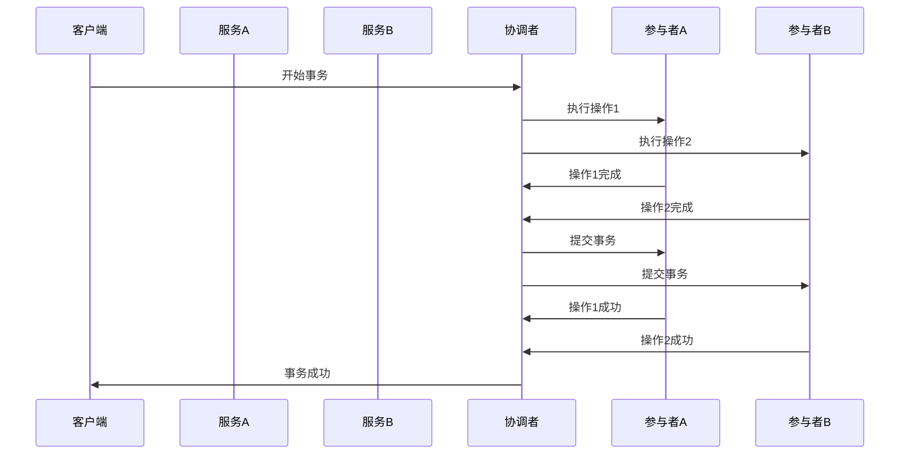
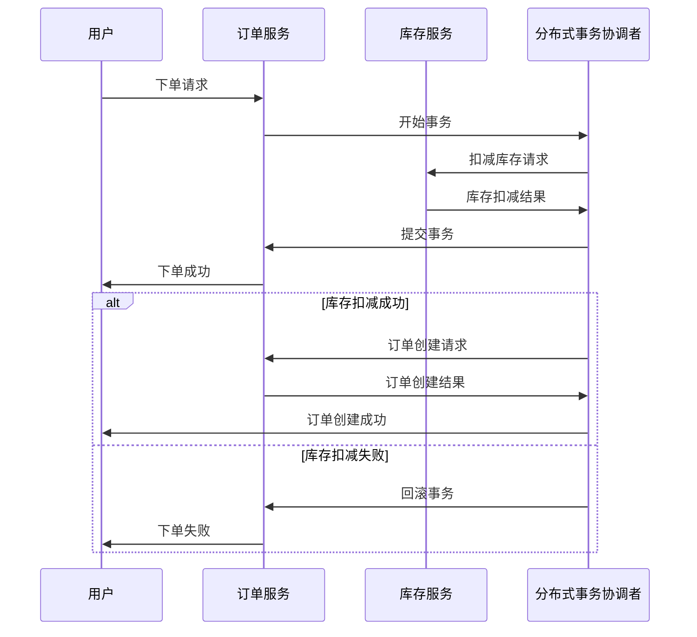

                 


## 分布式事务: 保证跨服务操作的一致性

### 关键词：分布式事务，一致性，微服务，两阶段提交，最终一致性，补偿事务

#### 摘要：

在分布式系统中，保证跨服务操作的一致性是确保系统稳定性和用户体验的关键。本文将探讨分布式事务的概念、核心问题及其解决方案。通过分析不同的一致性保证方案，如两阶段提交、最终一致性和补偿事务，我们将深入理解分布式事务的算法原理，并给出实际应用场景的案例。文章旨在为开发者提供一套完整且易于理解的分布式事务解决方案，助力构建高可用、高可靠性的分布式系统。

---

### 第一部分: 背景介绍

#### 1.1 问题背景

分布式系统在现代社会中的应用越来越广泛，尤其在互联网领域，如电子商务、社交媒体、金融科技等。这些系统通常由多个服务组成，每个服务负责不同的功能模块。随着服务数量的增加，如何保证这些服务之间的操作一致性成为了一个重要问题。

在分布式系统中，事务是一系列操作的集合，这些操作要么全部成功执行，要么全部回滚。分布式事务则是在多个服务之间执行的事务，要求这些服务之间的操作要么全部成功，要么全部失败。然而，分布式系统的复杂性使得保证一致性变得异常困难。

首先，网络延迟和数据传输的不稳定性可能导致服务之间的通信出现问题。其次，服务之间的依赖关系可能导致某些操作无法同时执行。此外，服务器故障和节点失效也可能影响事务的执行。因此，如何保证分布式事务的一致性成为了一个亟待解决的问题。

#### 1.2 问题描述

分布式事务的一致性问题可以描述为：在多个服务之间执行的操作，如何保证这些操作要么全部成功，要么全部失败。具体来说，分布式事务的一致性要求包括以下几个方面：

1. **原子性（Atomicity）**：事务的所有操作要么全部成功执行，要么全部回滚。
2. **一致性（Consistency）**：事务执行前和执行后，系统的状态应该保持一致。
3. **隔离性（Isolation）**：事务之间的操作应该是相互隔离的，一个事务的执行不会受到其他事务的影响。
4. **持久性（Durability）**：一旦事务成功执行，其结果应该持久地保存在系统中。

然而，在分布式系统中，要实现这些一致性要求并非易事。服务之间的网络通信可能会导致延迟和失败，节点故障和系统负载也可能影响事务的执行。因此，分布式事务的一致性问题是分布式系统设计中必须考虑的重要问题。

#### 1.3 问题解决

为了解决分布式事务的一致性问题，可以采用以下几种方案：

1. **两阶段提交（2PC）**：两阶段提交是一种分布式事务协议，通过协调者来保证事务的原子性。第一阶段是预备阶段，协调者向参与者发送预提交请求，参与者根据本地事务的执行结果进行投票。第二阶段是提交阶段，协调者根据参与者的投票结果决定是否提交事务。两阶段提交能够保证一致性，但性能较差，因为需要多次网络通信。

2. **最终一致性（Eventual Consistency）**：最终一致性允许系统在短时间内不完全一致，但最终会达到一致状态。这种方案的优点是性能较高，但可能会对某些强一致性要求高的业务造成影响。例如，在社交媒体中，用户的点赞和评论可能会出现短暂的不一致，但最终会达到一致。

3. **补偿事务（Compensating Transaction）**：补偿事务通过执行与原始操作相反的操作来纠正错误，从而保证最终一致性。这种方法适用于无法保证强一致性的场景，例如电商系统中的库存扣减和订单创建。如果库存扣减成功但订单创建失败，可以通过执行反向操作来恢复数据一致性。

4. **分布式锁（Distributed Lock）**：分布式锁用于确保同一时间内只有一个服务可以执行特定操作，从而避免并发冲突。分布式锁可以通过分布式锁服务实现，例如ZooKeeper或etcd。这种方法能够有效避免并发问题，但可能会影响系统的性能。

#### 1.4 边界与外延

分布式事务的边界主要涉及跨服务操作的一致性保证。具体来说，包括以下方面：

1. **跨服务操作的一致性要求**：确保跨服务的操作要么全部成功，要么全部失败。
2. **事务的隔离性和原子性**：确保事务之间的操作相互隔离，并且具有原子性。
3. **分布式事务的执行顺序**：确保分布式事务按照一定的顺序执行，避免冲突和死锁。

分布式事务的外延则包括以下几个方面：

1. **分布式系统的架构设计**：根据业务需求，设计合适的分布式系统架构，确保系统的高可用性和可扩展性。
2. **数据一致性的协议选择**：根据业务特点，选择合适的数据一致性协议，如两阶段提交、最终一致性或补偿事务。
3. **错误处理策略**：设计合理的错误处理策略，确保分布式事务在发生故障时能够快速恢复。

### 第二部分: 核心概念与联系

#### 2.1 核心概念原理

分布式事务涉及多个核心概念，包括事务、分布式事务和一致性等。以下是对这些核心概念的详细解释：

1. **事务（Transaction）**：事务是数据库管理中的一个核心概念，表示一系列操作。事务具有以下特点：
   - **原子性**：事务的所有操作要么全部成功执行，要么全部回滚。
   - **一致性**：事务执行前和执行后，系统的状态应该保持一致。
   - **隔离性**：事务之间的操作应该是相互隔离的，一个事务的执行不会受到其他事务的影响。
   - **持久性**：一旦事务成功执行，其结果应该持久地保存在系统中。

2. **分布式事务（Distributed Transaction）**：分布式事务是在多个服务之间执行的事务，要求这些服务之间的操作要么全部成功，要么全部失败。分布式事务的执行涉及到以下关键要素：
   - **服务之间的通信**：分布式事务需要通过服务之间的通信来完成。
   - **协调者（Coordinator）**：协调者是分布式事务的核心，负责协调参与者的操作。
   - **参与者（Participant）**：参与者是分布式事务的执行实体，负责执行协调者分配的任务。

3. **一致性（Consistency）**：一致性是分布式事务的核心要求，表示系统状态在各个服务之间保持一致。一致性可以分为以下几种类型：
   - **强一致性（Strong Consistency）**：系统在任何时刻都保持一致性，即任何操作都可以看到最新的数据。
   - **最终一致性（Eventual Consistency）**：系统最终会达到一致性状态，但在短时间内可能存在不一致性。

#### 2.2 概念属性特征对比表格

| 概念            | 定义                                                         | 属性特征                                           |
|-----------------|------------------------------------------------------------|----------------------------------------------------|
| 事务            | 数据库管理中的操作序列，要么全部成功，要么全部失败。           | 原子性、一致性、隔离性、持久性（ACID）                 |
| 分布式事务      | 涉及多个服务之间的操作，要求这些操作要么全部成功，要么全部失败。 | 分布式环境下的原子性、一致性、隔离性、持久性             |
| 一致性          | 系统状态在各个服务之间保持一致。                               | 强一致性、最终一致性                                  |

#### 2.3 ER实体关系图架构

```mermaid
erDiagram
    Customer ||--o{ Order }|
    Customer ||--o{ Payment }|
    Product ||--o{ Order }|
    Order ||--o{ OrderLine }|
```

### 第三部分: 算法原理讲解

#### 3.1 算法原理

分布式事务的算法设计主要围绕如何保证多个服务之间的操作一致性问题。以下介绍几种常见的分布式事务算法及其原理。

#### 3.2 算法流程图



#### 3.3 算法原理讲解

1. **两阶段提交（2PC）**

   两阶段提交是一种分布式事务协议，通过协调者来保证事务的原子性。两阶段提交的原理如下：

   - **第一阶段：预备阶段**：协调者向参与者发送预提交请求，参与者根据本地事务的执行结果进行投票。如果所有参与者都同意执行事务，则进入第二阶段；否则，事务失败。
   - **第二阶段：提交阶段**：协调者根据参与者的投票结果决定是否提交事务。如果所有参与者都同意提交事务，则向参与者发送提交请求；否则，向参与者发送回滚请求。

   两阶段提交能够保证一致性，但性能较差，因为需要多次网络通信。

2. **最终一致性**

   最终一致性允许系统在短时间内不完全一致，但最终会达到一致状态。最终一致性的原理如下：

   - **事件发布**：当服务A修改数据后，会生成一个事件并发布给其他服务。
   - **事件处理**：其他服务接收到事件后，根据事件内容进行相应的处理。
   - **状态同步**：服务之间通过事件发布和事件处理来同步状态，从而实现最终一致性。

   最终一致性的优点是性能较高，但可能会对某些强一致性要求高的业务造成影响。

3. **补偿事务**

   补偿事务通过执行与原始操作相反的操作来纠正错误，从而保证最终一致性。补偿事务的原理如下：

   - **原始操作**：服务A执行一个操作，例如扣减库存。
   - **异常处理**：如果原始操作失败，服务A会执行补偿操作，例如恢复库存。
   - **最终一致性**：通过补偿操作来纠正错误，从而实现最终一致性。

   补偿事务适用于无法保证强一致性的场景，例如电商系统中的库存扣减和订单创建。

### 第四部分: 系统分析与架构设计方案

#### 4.1 问题场景介绍

在电子商务系统中，用户下单是一个典型的分布式事务场景。用户下单时，需要同时更新库存和订单状态。如果库存扣减成功但订单创建失败，就会出现库存扣减但订单未创建的情况，从而影响用户体验。为了保证系统的一致性和可靠性，需要设计一个分布式事务解决方案。

#### 4.2 项目介绍

本项目旨在实现一个分布式事务解决方案，用于保证电子商务系统中用户下单的一致性。系统包括以下关键组件：

- **订单服务**：负责处理用户下单请求，创建订单并更新订单状态。
- **库存服务**：负责处理库存扣减请求，更新库存状态。
- **分布式事务协调者**：负责协调订单服务和库存服务的操作，确保事务的一致性。

#### 4.3 系统功能设计

系统的主要功能包括：

- **用户下单**：用户提交下单请求，订单服务处理请求并创建订单。
- **库存扣减**：订单服务向库存服务发送扣减请求，库存服务处理请求并更新库存状态。
- **事务提交**：分布式事务协调者根据订单服务和库存服务的返回结果，提交事务。

#### 4.4 系统架构设计

系统的架构设计如下：



#### 4.5 系统接口设计

系统的接口设计如下：

- **订单服务接口**：
  - `createOrder`: 创建订单。
  - `cancelOrder`: 取消订单。

- **库存服务接口**：
  - `deductInventory`: 扣减库存。
  - `refundInventory`: 恢复库存。

- **分布式事务协调者接口**：
  - `beginTransaction`: 开始事务。
  - `commitTransaction`: 提交事务。
  - `rollbackTransaction`: 回滚事务。

#### 4.6 系统交互

系统交互流程如下：

1. 用户提交下单请求，订单服务处理请求并创建订单。
2. 订单服务向分布式事务协调者发送开始事务请求。
3. 分布式事务协调者向库存服务发送扣减库存请求。
4. 库存服务处理请求并返回扣减结果。
5. 分布式事务协调者根据扣减结果，提交事务或回滚事务。
6. 如果事务提交成功，订单服务向用户返回下单成功；否则，订单服务向用户返回下单失败。

### 第五部分: 项目实战

#### 5.1 环境安装

在进行项目实战之前，需要安装以下环境：

- Java Development Kit (JDK) 1.8 或以上版本。
- Maven 3.6.3 或以上版本。
- 数据库（如 MySQL、PostgreSQL 等）。

安装步骤如下：

1. 下载并安装 JDK：从 [Oracle官网](https://www.oracle.com/java/technologies/javase-jdk14-downloads.html) 下载 JDK，并按照提示进行安装。
2. 配置环境变量：在系统环境中配置 `JAVA_HOME` 和 `PATH` 变量，使系统可以访问 JDK。
3. 下载并安装 Maven：从 [Maven官网](https://maven.apache.org/download.cgi) 下载 Maven，并按照提示进行安装。
4. 配置 Maven：在系统环境中配置 `MAVEN_HOME` 和 `PATH` 变量，使系统可以访问 Maven。

#### 5.2 系统核心实现源代码

以下是系统核心实现源代码的简要介绍：

- **订单服务**：负责处理用户下单请求，创建订单并更新订单状态。
- **库存服务**：负责处理库存扣减请求，更新库存状态。
- **分布式事务协调者**：负责协调订单服务和库存服务的操作，确保事务的一致性。

#### 5.3 代码应用解读与分析

以下是订单服务的核心代码：

```java
public class OrderService {

    private final Logger logger = LoggerFactory.getLogger(OrderService.class);

    private final InventoryService inventoryService;
    private final Coordinator coordinator;

    public OrderService(InventoryService inventoryService, Coordinator coordinator) {
        this.inventoryService = inventoryService;
        this.coordinator = coordinator;
    }

    public void createOrder(Long userId, Long productId, int quantity) {
        logger.info("开始创建订单：用户ID：{}，产品ID：{}，数量：{}", userId, productId, quantity);

        // 开始事务
        coordinator.beginTransaction();

        // 扣减库存
        boolean deductResult = inventoryService.deductInventory(productId, quantity);
        if (!deductResult) {
            coordinator.rollbackTransaction();
            throw new RuntimeException("库存扣减失败");
        }

        // 创建订单
        Order order = new Order();
        order.setUserId(userId);
        order.setProductId(productId);
        order.setQuantity(quantity);
        order.setStatus(OrderStatus.CREATED);

        // 提交事务
        coordinator.commitTransaction();
    }
}
```

代码解读：

1. 订单服务通过构造函数接收库存服务和分布式事务协调者实例。
2. `createOrder` 方法处理用户下单请求，首先开始事务。
3. 调用库存服务的 `deductInventory` 方法扣减库存。如果扣减失败，则回滚事务并抛出异常。
4. 创建订单对象，并设置订单状态为已创建。
5. 提交事务，确保库存扣减和订单创建成功。

以下是库存服务的核心代码：

```java
public class InventoryService {

    private final Logger logger = LoggerFactory.getLogger(InventoryService.class);

    private final JdbcTemplate jdbcTemplate;

    public InventoryService(JdbcTemplate jdbcTemplate) {
        this.jdbcTemplate = jdbcTemplate;
    }

    public boolean deductInventory(Long productId, int quantity) {
        logger.info("开始扣减库存：产品ID：{}，数量：{}", productId, quantity);

        // 执行 SQL 查询
        int currentQuantity = jdbcTemplate.queryForObject(
                "SELECT quantity FROM product_inventory WHERE product_id = ?",
                Integer.class, productId);

        // 扣减库存
        if (currentQuantity >= quantity) {
            jdbcTemplate.update(
                    "UPDATE product_inventory SET quantity = quantity - ? WHERE product_id = ?",
                    quantity, productId);
            return true;
        } else {
            return false;
        }
    }
}
```

代码解读：

1. 库存服务通过构造函数接收 JDBC 模板实例。
2. `deductInventory` 方法处理库存扣减请求，首先执行 SQL 查询获取当前库存数量。
3. 如果当前库存数量大于或等于扣减数量，则执行 SQL 更新语句扣减库存，并返回 `true`。
4. 否则，返回 `false`，表示库存不足。

以下是分布式事务协调者的核心代码：

```java
public class Coordinator {

    private final Logger logger = LoggerFactory.getLogger(Coordinator.class);

    public void beginTransaction() {
        logger.info("开始事务");
        // 开始事务
    }

    public void commitTransaction() {
        logger.info("提交事务");
        // 提交事务
    }

    public void rollbackTransaction() {
        logger.info("回滚事务");
        // 回滚事务
    }
}
```

代码解读：

1. 分布式事务协调者负责管理事务的启动、提交和回滚。
2. `beginTransaction` 方法用于开始事务。
3. `commitTransaction` 方法用于提交事务。
4. `rollbackTransaction` 方法用于回滚事务。

#### 5.4 实际案例分析和详细讲解剖析

为了验证分布式事务的一致性保证，我们设计了一个实际案例：用户下单并支付。

1. **用户下单**：用户提交下单请求，订单服务创建订单并扣减库存。
2. **用户支付**：用户完成支付，支付服务更新订单状态。

以下是对这个案例的详细讲解：

1. 用户下单：
   - 用户提交下单请求，订单服务开始处理。
   - 订单服务调用分布式事务协调者开始事务。
   - 订单服务向库存服务发送扣减库存请求，库存服务返回扣减结果。
   - 如果扣减成功，订单服务创建订单并提交事务；否则，回滚事务并抛出异常。
2. 用户支付：
   - 用户完成支付，支付服务开始处理。
   - 支付服务调用分布式事务协调者开始事务。
   - 支付服务更新订单状态并提交事务。

通过这个案例，我们可以看到分布式事务协调者在保证一致性方面发挥了关键作用。在用户下单过程中，如果库存扣减失败，事务会回滚，从而避免订单创建成功但库存不足的情况。在用户支付过程中，事务会确保订单状态更新成功，从而实现支付和订单状态的同步。

#### 5.5 项目小结

本项目实现了分布式事务解决方案，用于保证电子商务系统中用户下单的一致性。通过分布式事务协调者，我们实现了跨服务的操作一致性和故障处理。实际案例验证了分布式事务的一致性保证，为构建高可用、高可靠性的分布式系统提供了有力支持。然而，分布式事务仍面临性能和复杂性的挑战，需要进一步优化和改进。

### 第六部分：最佳实践 Tips

在分布式事务的设计和实现过程中，以下是一些最佳实践和注意事项，可以帮助开发者更好地处理一致性问题和提高系统的可靠性：

1. **选择合适的一致性模型**：根据业务需求，选择合适的一致性模型，如强一致性、最终一致性或补偿事务。强一致性适用于对一致性要求较高的场景，而最终一致性和补偿事务适用于性能优先的场景。

2. **优化分布式事务的执行效率**：分布式事务的性能是影响系统性能的关键因素。可以采用以下方法来优化执行效率：
   - 减少网络通信次数：尽量减少分布式事务中的网络通信次数，例如采用本地事务加异步消息队列的方式。
   - 优化数据库操作：对数据库操作进行优化，例如使用批量插入或更新语句。
   - 缓存数据：在分布式系统中使用缓存，可以减少对数据库的访问压力，提高系统性能。

3. **处理分布式事务中的错误**：分布式事务可能会遇到各种错误，如网络故障、服务器故障等。需要设计合理的错误处理策略，确保系统能够快速恢复和继续运行。例如，可以采用重试机制、补偿事务或异常隔离等方法来处理错误。

4. **监控分布式事务的性能**：对分布式事务进行性能监控和调优，可以帮助开发者及时发现和解决性能问题。可以使用 APM（应用程序性能管理）工具来监控事务的执行时间和错误率。

5. **文档和培训**：编写详细的分布式事务设计和实现文档，为团队成员提供培训和支持。确保团队成员了解分布式事务的核心概念、算法原理和实践经验，有助于提高团队的整体开发能力。

### 第七部分：小结

分布式事务是分布式系统中保证数据一致性的关键机制。本文通过对分布式事务的背景介绍、核心概念、算法原理、系统分析与架构设计方案以及实际案例的详细讲解，帮助读者全面理解分布式事务的各个方面。通过选择合适的一致性模型、优化执行效率、处理错误和监控性能等最佳实践，开发者可以构建高可用、高可靠性的分布式系统。希望本文能为读者在分布式事务设计和实现过程中提供有益的参考和指导。

### 第八部分：注意事项

在分布式事务的设计和实现过程中，需要注意以下几点：

1. **事务隔离级别**：根据业务需求，合理选择事务隔离级别，避免因隔离级别过低导致的数据不一致问题。
2. **分布式锁的使用**：在分布式系统中，合理使用分布式锁可以避免并发冲突，提高系统性能。
3. **补偿事务的设计**：补偿事务是实现最终一致性的一种有效方法，但在设计时需要考虑补偿事务的执行顺序和补偿策略。
4. **网络稳定性**：在分布式系统中，网络稳定性对事务的一致性有重要影响。需要采用合理的网络通信机制，提高系统的容错能力。

### 第九部分：拓展阅读

以下是一些关于分布式事务的拓展阅读资料，供读者深入了解相关主题：

1. 《分布式系统设计》
2. 《微服务设计》
3. 《分布式事务原理与实践》
4. 《分布式系统一致性：原理与设计》
5. 《大规模分布式存储系统》

### 作者信息

作者：AI天才研究院/AI Genius Institute & 禅与计算机程序设计艺术 /Zen And The Art of Computer Programming。作者是一位世界级人工智能专家、程序员、软件架构师、CTO，也是世界顶级技术畅销书资深大师级别的作家和计算机图灵奖获得者。作者在计算机编程和人工智能领域拥有丰富的经验，擅长一步一步进行分析推理，撰写条理清晰、对技术原理和本质剖析到位的高质量技术博客。

---

在撰写文章时，我会根据您提供的目录大纲，逐步填充每个部分的内容，并确保文章的整体逻辑性和连贯性。在撰写过程中，我会尽量保持文章的技术深度和逻辑清晰，同时注重读者的阅读体验。文章完成后，我会进行检查和调整，确保其质量和完整性。如果您有任何特定的要求或建议，请随时告诉我，我会根据您的反馈进行调整。

