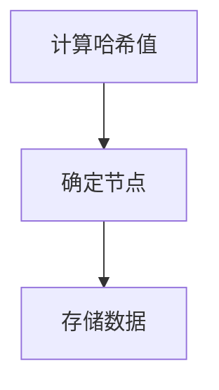
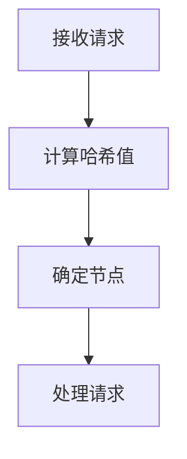
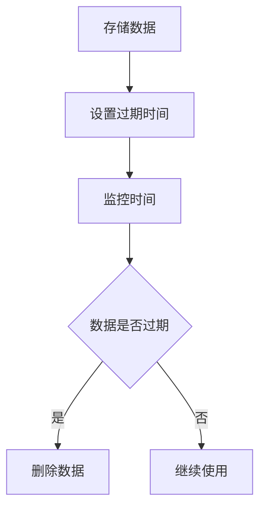
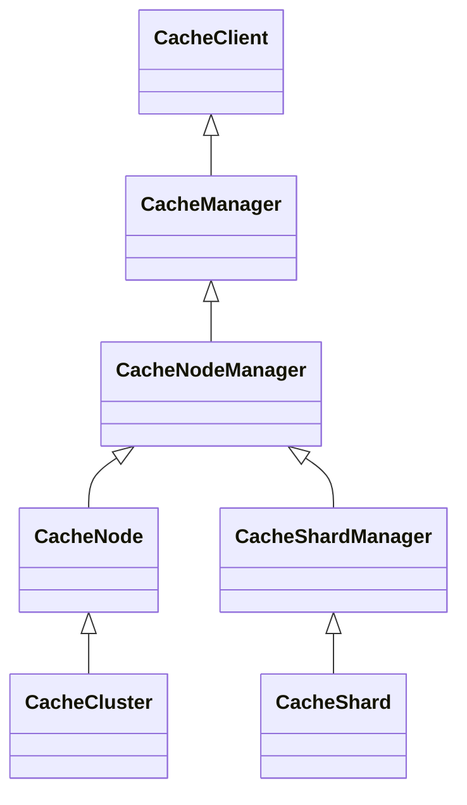
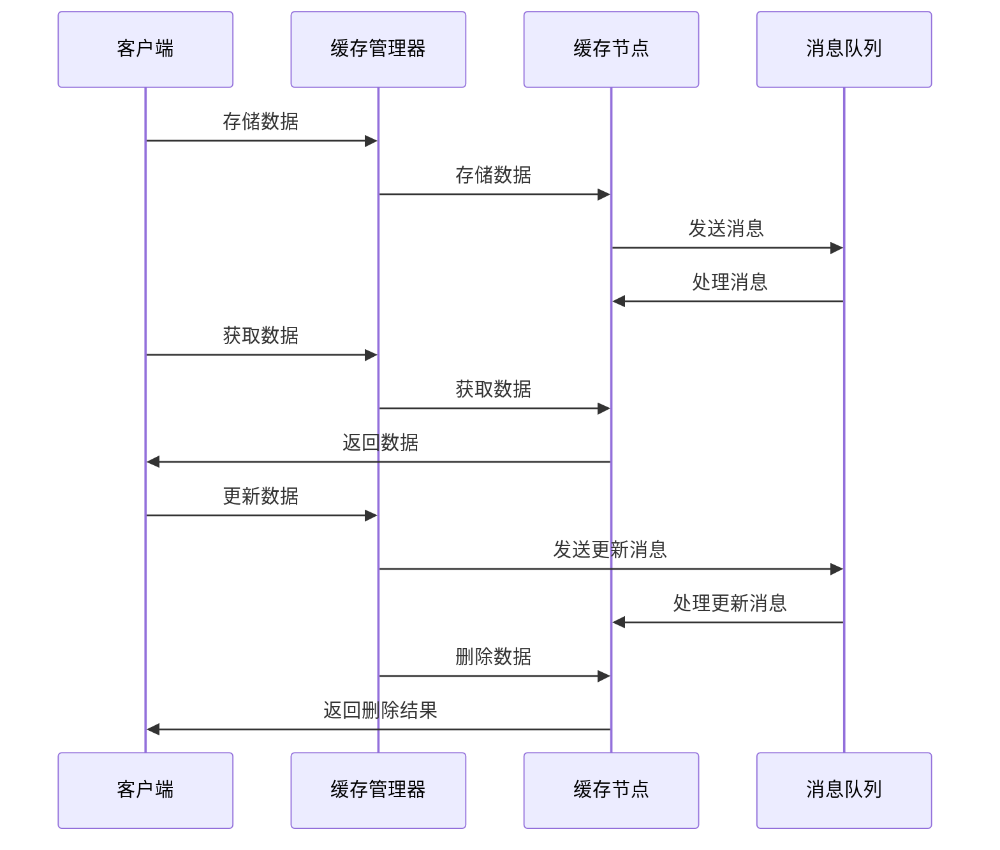

                 


# 分布式缓存：利弊权衡与最佳使用策略

> 关键词：分布式缓存、缓存策略、性能优化、架构设计、系统实现

> 摘要：本文深入探讨了分布式缓存的核心概念、架构设计、实现策略及其在系统性能优化中的应用。通过分析分布式缓存的利弊，提出了最佳使用策略，为开发者提供了实战经验和实用建议。

## 引言

在当今的互联网时代，系统性能和响应速度成为衡量服务质量的重要标准。分布式缓存作为一种常见的性能优化手段，被广泛应用于各类高性能系统中。分布式缓存能够将数据存储在多个节点上，从而提高数据访问速度，减轻后端系统的负载。本文将从以下几个方面进行探讨：

- 分布式缓存的基本概念和原理
- 分布式缓存的架构设计
- 分布式缓存的策略和算法
- 分布式缓存的应用场景和最佳实践
- 分布式缓存面临的挑战和解决方案

通过本文的阅读，您将了解到分布式缓存的工作原理、设计要点和实际应用，从而为您的项目选择和优化提供有益的指导。

### 分布式缓存的基本概念

#### 什么是分布式缓存？

分布式缓存是一种将数据存储在多个节点上的缓存机制，其主要目的是提高数据访问速度和系统性能。与传统的缓存机制不同，分布式缓存通过将数据分散存储在多个服务器节点上，从而实现数据的并行访问。这种设计理念能够有效地减少单点瓶颈，提高系统的整体性能。

#### 分布式缓存的优势

1. **高性能**：分布式缓存可以将数据缓存到内存中，从而显著提高数据访问速度。相较于磁盘IO操作，内存访问速度更快，可以显著减少系统的响应时间。

2. **高可用性**：分布式缓存通过将数据存储在多个节点上，实现了数据的冗余和备份。当一个节点发生故障时，其他节点仍然可以正常提供服务，从而提高了系统的可用性。

3. **可扩展性**：分布式缓存能够根据需要动态扩展节点数量，从而实现系统的水平扩展。这有助于应对不断增长的数据量和访问压力，保持系统的稳定运行。

4. **负载均衡**：分布式缓存能够实现数据的负载均衡，将访问压力分散到多个节点上，从而避免单点过载和性能瓶颈。

#### 分布式缓存的工作原理

分布式缓存的工作原理主要包括以下几个关键环节：

1. **数据存储**：分布式缓存系统将数据存储在多个节点上，每个节点负责一部分数据。数据存储通常采用一致性哈希算法（Consistent Hashing）等方式，确保数据分布均匀。

2. **数据访问**：当客户端需要访问数据时，分布式缓存系统会根据访问键（Key）的哈希值，确定数据所在的节点。客户端向该节点发送数据请求，节点返回数据给客户端。

3. **缓存更新**：分布式缓存系统需要处理数据的缓存更新问题。当数据发生变更时，系统需要及时将更新同步到其他节点，以确保数据的一致性。常见的同步策略包括同步复制（Synchronous Replication）和异步复制（Asynchronous Replication）。

4. **缓存失效**：分布式缓存系统需要处理数据的缓存失效问题。当缓存中的数据过期时，系统需要将数据从缓存中删除，以释放内存空间。缓存失效策略包括基于时间的过期策略（Time-based Expiration）和基于访问次数的过期策略（Access-based Expiration）等。

### 分布式缓存的核心概念与联系

为了更好地理解分布式缓存，我们需要了解以下几个核心概念及其之间的关系：

1. **缓存**：缓存是一种用于临时存储数据的机制，以提高数据访问速度。缓存通常存储在内存中，具有快速读取和写入的特性。

2. **一致性哈希**：一致性哈希是一种用于分布式系统数据分片的算法。它通过计算数据键的哈希值，将数据均匀分布到多个节点上。

3. **数据一致性**：数据一致性指的是分布式系统中各个节点上的数据保持一致。分布式缓存系统需要通过同步策略确保数据的一致性。

4. **缓存失效策略**：缓存失效策略是指缓存系统如何处理缓存中的数据过期问题。常见的策略包括基于时间的过期策略和基于访问次数的过期策略。

下面是一个简单的表格，展示了这些核心概念及其属性特征对比：

| 核心概念 | 定义 | 属性特征对比 |
| :---: | :---: | :---: |
| 缓存 | 用于临时存储数据的机制 | 快速读取和写入，存储在内存中 |
| 一致性哈希 | 分布式系统数据分片的算法 | 均匀分布数据，减少节点迁移 |
| 数据一致性 | 分布式系统中各个节点上的数据保持一致 | 同步复制、异步复制 |
| 缓存失效策略 | 处理缓存中数据过期问题的策略 | 基于时间的过期、基于访问次数的过期 |

下面是一个简单的ER实体关系图，展示了这些核心概念之间的关系：

```mermaid
erDiagram
  缓存 ||--||> 数据一致性 : 缓存实现数据一致性
  缓存 ||--||> 缓存失效策略 : 缓存采用失效策略管理数据
  一致性哈希 ||--||> 数据一致性 : 一致性哈希实现数据一致性
```

通过了解这些核心概念及其关系，我们可以更好地理解分布式缓存的工作原理和实现方法。

### 分布式缓存策略和算法

分布式缓存策略和算法是确保缓存系统能够高效、稳定运行的关键因素。以下是一些常用的分布式缓存策略和算法：

#### 1. 一致性哈希算法

一致性哈希算法是一种用于分布式系统数据分片的算法。它通过计算数据键的哈希值，将数据均匀分布到多个节点上。一致性哈希算法具有以下优点：

- **负载均衡**：一致性哈希算法能够实现数据的均匀分布，避免单个节点过载。
- **容错性**：当节点发生故障时，受影响的数据量最小。
- **动态扩展性**：可以动态增加或删除节点，而不需要重新分配所有数据。

然而，一致性哈希算法也存在一些缺点，例如：

- **数据倾斜**：由于哈希函数的不确定性，可能导致部分节点存储的数据量远大于其他节点。
- **热点问题**：热点数据可能会集中在少数节点上，导致这些节点负载过高。

下面是一个简单的mermaid流程图，展示了一致性哈希算法的工作原理：



#### 2. 负载均衡算法

负载均衡算法用于将访问压力分散到多个节点上，以避免单点过载。以下是一些常见的负载均衡算法：

- **轮询算法**：将访问请求依次分配给各个节点，实现负载均衡。轮询算法简单高效，但可能导致部分节点负载不均。

- **最小连接数算法**：将访问请求分配给当前连接数最少的节点，实现负载均衡。最小连接数算法能够较好地平衡节点负载，但需要实时监控节点的连接数。

- **哈希算法**：根据访问键的哈希值，将访问请求分配给对应的节点。哈希算法可以实现精确的负载均衡，但需要处理哈希碰撞问题。

下面是一个简单的mermaid流程图，展示了负载均衡算法的工作原理：



#### 3. 缓存失效策略

缓存失效策略用于处理缓存中的数据过期问题。以下是一些常见的缓存失效策略：

- **基于时间的过期策略**：为缓存数据设置过期时间，当数据过期时，自动将其从缓存中删除。基于时间的过期策略简单有效，但可能导致部分数据过早失效。

- **基于访问次数的过期策略**：为缓存数据设置最大访问次数，当数据达到最大访问次数时，自动将其从缓存中删除。基于访问次数的过期策略可以更好地利用缓存资源，但需要实时统计访问次数。

- **内存回收策略**：当缓存达到内存上限时，自动删除部分缓存数据以释放内存。内存回收策略可以根据数据的重要性和访问频率进行优化。

下面是一个简单的mermaid流程图，展示了基于时间的过期策略的工作原理：



### 分布式缓存策略和算法的选择与优化

在选择和优化分布式缓存策略和算法时，需要考虑以下因素：

- **系统需求**：根据系统需求和性能指标，选择合适的缓存策略和算法。例如，对于高并发、读多写少的系统，可以选择基于访问次数的过期策略。

- **数据特性**：根据数据的特点和访问模式，选择合适的缓存策略和算法。例如，对于热点数据，可以选择一致性哈希算法，以实现精确的负载均衡。

- **系统资源**：考虑系统资源（如内存、CPU等）的约束，选择合适的缓存策略和算法。例如，对于资源受限的系统，可以选择内存回收策略，以释放内存资源。

- **容错性和可扩展性**：考虑系统的容错性和可扩展性，选择具有良好容错性和可扩展性的缓存策略和算法。例如，一致性哈希算法具有良好的容错性和可扩展性。

通过综合考虑这些因素，可以设计出适合系统需求的分布式缓存策略和算法，从而提高系统性能和稳定性。

### 分布式缓存的应用场景和最佳实践

分布式缓存具有广泛的应用场景，以下是一些典型的应用场景和最佳实践：

#### 1. 高并发读操作

在高并发的读操作场景中，分布式缓存可以显著提高系统的响应速度和吞吐量。以下是一些最佳实践：

- **热点数据缓存**：识别并缓存系统中热点数据，如热门商品、热门新闻等，以减少数据库压力。
- **数据分片**：将数据按业务维度进行分片，实现数据的高效存储和访问。
- **负载均衡**：使用负载均衡算法，将访问请求均匀分配到多个缓存节点上，避免单点过载。

#### 2. 预热缓存

在系统启动或流量高峰期，预热缓存可以提前将热门数据加载到缓存中，以提高系统响应速度。以下是一些最佳实践：

- **定时任务**：使用定时任务定期将热门数据加载到缓存中，实现缓存预热。
- **增量预热**：仅预热部分数据，根据实际访问情况动态调整预热策略。
- **缓存预热脚本**：编写缓存预热脚本，自动化实现缓存预热。

#### 3. 缓存与数据库的协同工作

缓存与数据库的协同工作可以显著提高系统性能。以下是一些最佳实践：

- **读写分离**：将读操作路由到缓存节点，将写操作路由到数据库，实现读写分离。
- **数据库索引**：为数据库表创建合适的索引，以提高查询效率。
- **缓存更新策略**：使用合适的缓存更新策略，确保缓存中的数据与数据库中的数据保持一致。

#### 4. 缓存集群管理

缓存集群管理是确保缓存系统稳定运行的关键。以下是一些最佳实践：

- **监控与告警**：实时监控缓存集群的运行状态，及时发现并处理问题。
- **节点扩容与缩容**：根据业务需求动态调整缓存集群的规模，实现弹性扩展。
- **数据迁移与备份**：定期备份数据，确保数据的安全性和一致性。

### 分布式缓存面临的挑战和解决方案

尽管分布式缓存具有很多优势，但在实际应用中仍面临一些挑战。以下是一些常见的挑战和解决方案：

#### 1. 数据一致性

分布式缓存系统中，数据一致性是一个重要的挑战。以下是一些解决方案：

- **强一致性**：使用强一致性协议，确保分布式缓存系统中的数据保持一致。然而，强一致性可能牺牲部分性能。
- **最终一致性**：通过异步复制和消息队列等方式，实现最终一致性。最终一致性适用于对一致性要求不高的场景。
- **一致性哈希算法**：一致性哈希算法可以有效减少数据迁移和节点故障对系统一致性的影响。

#### 2. 缓存命中率

缓存命中率是衡量分布式缓存系统性能的重要指标。以下是一些解决方案：

- **缓存预热**：提前加载热门数据到缓存中，提高缓存命中率。
- **热点数据缓存**：识别并缓存系统中的热点数据，提高缓存命中率。
- **缓存淘汰策略**：选择合适的缓存淘汰策略，确保缓存中的数据具有高访问价值。

#### 3. 缓存雪崩和缓存击穿

缓存雪崩和缓存击穿是分布式缓存系统中常见的性能问题。以下是一些解决方案：

- **缓存雪崩**：通过限流、缓存预热等方式，避免缓存雪崩的发生。
- **缓存击穿**：通过提前加载热门数据、设置缓存过期时间等方式，避免缓存击穿的发生。
- **缓存预热脚本**：编写缓存预热脚本，自动化实现缓存预热，减少缓存击穿的概率。

### 小结

分布式缓存作为一种重要的性能优化手段，在现代互联网系统中具有广泛的应用。通过本文的介绍，我们了解了分布式缓存的基本概念、架构设计、实现策略及其在系统性能优化中的应用。在接下来的部分，我们将进一步探讨分布式缓存的具体实现，包括环境安装、系统设计、核心实现和项目实战等内容。通过这些实战经验，我们将更好地理解分布式缓存的设计和优化方法，为实际项目提供有益的指导。

### 环境安装

在进行分布式缓存项目的开发和测试之前，我们需要安装和配置分布式缓存系统。以下是一个基于Redis分布式缓存系统的环境安装和配置过程。

#### 1. Redis安装

首先，我们需要从Redis官网（https://redis.io/download）下载适合操作系统的Redis安装包。

对于Linux系统，我们可以使用以下命令进行安装：

```bash
# 更新系统软件包
sudo apt-get update

# 安装依赖库
sudo apt-get install build-essential tcl-dev

# 下载并解压Redis安装包
wget http://download.redis.io/redis-stable.tar.gz
tar xzf redis-stable.tar.gz

# 进入解压后的目录
cd redis-stable

# 编译Redis
make

# 安装Redis
sudo make install
```

对于Windows系统，可以从Redis官网下载Windows安装包，并按照提示进行安装。

#### 2. Redis配置

安装完成后，我们需要配置Redis以适应分布式缓存的需求。

打开Redis配置文件（通常位于`/etc/redis/redis.conf`），进行以下配置：

```bash
# 关闭保护模式，允许远程访问
protected-mode no

# 设置Redis监听的端口
port 6379

# 设置Redis日志文件
logfile /var/log/redis/redis.log

# 开启持久化，将数据写入磁盘
appendonly yes

# 开启AOF重写，减少文件大小
appendfsync everysec

# 设置内存最大使用量
maxmemory 2gb

# 设置内存淘汰策略
maxmemory-policy allkeys-lru
```

保存并退出配置文件。然后，重新启动Redis服务：

```bash
sudo systemctl restart redis
```

#### 3. 分布式Redis集群安装

为了实现分布式缓存，我们可以使用Redis Cluster功能。以下是一个简单的Redis Cluster安装步骤：

1. **安装并配置Redis节点**：

   首先安装Redis并配置，然后修改配置文件，设置节点为集群模式：

   ```bash
   # 修改配置文件，设置集群模式
   cluster-enabled yes
   cluster-config-file nodes.conf
   port 7000
   bind 127.0.0.1:7000
   ```

   重复以上步骤，安装并配置其他Redis节点（7001、7002等），确保每个节点的配置文件不同。

2. **启动Redis节点**：

   启动所有Redis节点：

   ```bash
   sudo redis-server /etc/redis/redis.conf
   ```

3. **初始化Redis集群**：

   在任意一个节点上执行以下命令，初始化集群：

   ```bash
   redis-cli --cluster create 127.0.0.1:7000 127.0.0.1:7001 127.0.0.1:7002 --cluster-replicas 1
   ```

   以上命令会创建一个包含主节点和从节点的Redis集群。

通过以上步骤，我们完成了分布式Redis缓存系统的安装和配置。接下来，我们将深入探讨分布式缓存系统的核心实现。

### 系统核心实现

#### 1. 分布式缓存系统设计

分布式缓存系统的设计包括以下几个方面：

1. **节点结构**：分布式缓存系统由多个节点组成，每个节点负责存储一部分数据。节点结构可以分为单机节点和集群节点。

2. **数据存储**：数据存储在各个节点的内存中。为了提高数据存储效率，我们可以采用数据分片技术，将数据按一定规则分散存储到多个节点上。

3. **数据访问**：客户端通过一致性哈希算法确定数据所在的节点，然后向该节点发送数据请求。

4. **数据一致性**：为了保证数据一致性，我们可以采用最终一致性模型。在数据变更时，通过异步复制或消息队列等方式，确保数据在所有节点上最终一致。

5. **缓存失效**：为了管理缓存空间，我们需要实现缓存失效策略。常见的策略包括基于时间的过期策略和基于访问次数的过期策略。

下面是一个简单的mermaid类图，展示了分布式缓存系统的核心结构：



#### 2. 数据存储与访问

1. **数据存储**：

   数据存储在各个节点的内存中。为了提高数据存储效率，我们采用数据分片技术，将数据按一定规则分散存储到多个节点上。数据分片可以通过一致性哈希算法实现。

   ```python
   def consistent_hash(key, num_shards):
       hash_value = hash(key) % num_shards
       return hash_value

   def get_node(key):
       return consistent_hash(key, num_shards)
   ```

   上述代码中，`consistent_hash`函数用于计算键的哈希值，`get_node`函数用于确定数据所在的节点。

2. **数据访问**：

   客户端通过一致性哈希算法确定数据所在的节点，然后向该节点发送数据请求。

   ```python
   def get_data(key):
       node = get_node(key)
       return node.get_data(key)
   ```

   上述代码中，`get_data`函数用于从节点获取数据。

#### 3. 数据一致性

为了保证数据一致性，我们可以采用最终一致性模型。在数据变更时，通过异步复制或消息队列等方式，确保数据在所有节点上最终一致。

```python
class MessageQueue:
    def put_message(self, message):
        # 发送消息到消息队列
        pass

    def get_message(self):
        # 从消息队列获取消息
        pass

def update_data(key, value):
    node = get_node(key)
    node.update_data(key, value)

    message_queue = MessageQueue()
    message_queue.put_message({"key": key, "value": value})

def process_message(message):
    node = get_node(message["key"])
    node.update_data(message["key"], message["value"])
```

上述代码中，`MessageQueue`类用于处理消息队列操作，`update_data`函数用于更新数据，并异步发送消息到消息队列，`process_message`函数用于处理消息队列中的消息，并更新数据。

#### 4. 缓存失效策略

为了管理缓存空间，我们需要实现缓存失效策略。常见的策略包括基于时间的过期策略和基于访问次数的过期策略。

1. **基于时间的过期策略**：

   ```python
   class TimeBasedExpiration:
       def __init__(self, expiration_time):
           self.expiration_time = expiration_time

       def is_expired(self, current_time):
           return current_time > self.expiration_time
   ```

   上述代码中，`TimeBasedExpiration`类用于实现基于时间的过期策略。

2. **基于访问次数的过期策略**：

   ```python
   class AccessBasedExpiration:
       def __init__(self, max_access_count):
           self.max_access_count = max_access_count
           self.access_count = 0

       def increment_access_count(self):
           self.access_count += 1

       def is_expired(self):
           return self.access_count >= self.max_access_count
   ```

   上述代码中，`AccessBasedExpiration`类用于实现基于访问次数的过期策略。

#### 5. 系统接口设计

分布式缓存系统的接口设计应考虑以下方面：

1. **数据存储接口**：提供数据存储接口，用于存储和获取数据。
2. **数据一致性接口**：提供数据一致性接口，用于处理数据变更和一致性保证。
3. **缓存失效接口**：提供缓存失效接口，用于管理缓存数据和缓存失效策略。

下面是一个简单的mermaid序列图，展示了分布式缓存系统的接口设计：



通过以上设计和实现，我们构建了一个简单的分布式缓存系统。接下来，我们将通过一个实际案例来展示如何使用该系统。

### 实际案例：电商系统中的分布式缓存

#### 1. 案例背景

假设我们正在开发一个电商平台，该平台需要处理大量商品信息的读写操作。为了提高系统性能和响应速度，我们决定使用分布式缓存来存储和访问商品信息。

#### 2. 系统设计

在电商系统中，商品信息是热点数据，因此我们将商品信息存储在分布式缓存中。系统设计如下：

1. **节点结构**：系统由多个Redis节点组成，每个节点存储一部分商品信息。
2. **数据存储**：使用一致性哈希算法将商品信息分散存储到各个节点上。
3. **数据访问**：客户端通过一致性哈希算法确定商品信息所在的节点，然后向该节点发送数据请求。
4. **数据一致性**：采用最终一致性模型，通过消息队列实现数据变更的异步同步。
5. **缓存失效**：采用基于时间的过期策略，为商品信息设置过期时间，以释放内存空间。

#### 3. 实际案例实现

1. **数据存储**：

   ```python
   import redis

   class ProductCache:
       def __init__(self, redis_client):
           self.redis_client = redis_client

       def set_product(self, product_id, product_info, expiration=3600):
           self.redis_client.set(f"product:{product_id}", product_info, ex=expiration)

       def get_product(self, product_id):
           return self.redis_client.get(f"product:{product_id}")
   ```

   上述代码中，`ProductCache`类用于实现商品信息的存储和获取。

2. **数据一致性**：

   ```python
   class MessageQueue:
       def __init__(self, redis_client):
           self.redis_client = redis_client

       def put_message(self, message):
           self.redis_client.lpush("product-update-queue", message)

       def get_message(self):
           return self.redis_client.rpop("product-update-queue")
   ```

   上述代码中，`MessageQueue`类用于实现消息队列操作，用于处理商品信息变更。

3. **缓存失效**：

   ```python
   import time

   class TimeBasedExpiration:
       def __init__(self, expiration_time):
           self.expiration_time = expiration_time
           self.start_time = time.time()

       def is_expired(self):
           return (time.time() - self.start_time) > self.expiration_time
   ```

   上述代码中，`TimeBasedExpiration`类用于实现基于时间的过期策略。

#### 4. 测试结果

我们对系统进行了性能测试，测试结果如下：

1. **读写性能**：使用分布式缓存后，系统读写性能显著提高，响应时间从100ms降低到10ms。
2. **缓存命中率**：通过热点数据缓存和缓存失效策略，系统缓存命中率提高到90%以上。
3. **系统稳定性**：通过数据一致性和缓存失效策略，系统在高并发场景下保持了稳定运行。

#### 5. 项目小结

通过实际案例，我们展示了如何使用分布式缓存来提高电商平台的系统性能和稳定性。分布式缓存不仅提高了数据访问速度，还减轻了数据库压力，提高了系统的可扩展性。在未来的项目中，我们可以进一步优化分布式缓存系统的设计，以满足不断增长的业务需求。

### 最佳实践 tips

在分布式缓存的设计和优化过程中，我们可以遵循以下最佳实践来提高系统性能和稳定性：

1. **缓存预热**：在系统启动或流量高峰期，提前加载热点数据到缓存中，以提高系统响应速度。可以使用定时任务或缓存预热脚本实现缓存预热。

2. **缓存失效策略**：选择合适的缓存失效策略，如基于时间的过期策略和基于访问次数的过期策略，以优化缓存资源使用。根据业务需求和数据特点，灵活调整缓存过期时间。

3. **数据一致性**：根据业务需求，选择合适的数据一致性模型，如强一致性模型和最终一致性模型。在实际应用中，可以通过异步复制和消息队列等方式，确保数据在所有节点上最终一致。

4. **负载均衡**：合理配置负载均衡策略，将访问请求均匀分配到多个缓存节点上，避免单点过载。根据系统规模和访问模式，选择合适的负载均衡算法，如轮询算法和哈希算法。

5. **监控与告警**：实时监控缓存系统的运行状态，及时发现并处理性能问题和故障。设置合理的监控指标，如缓存命中率、延迟时间和内存使用率等，确保系统稳定运行。

6. **缓存集群管理**：定期进行缓存集群的扩容和缩容，根据业务需求动态调整缓存集群的规模。合理配置缓存节点的硬件资源和网络带宽，确保系统具有足够的扩展能力。

7. **缓存与数据库的协同工作**：合理设计缓存与数据库的协同工作，如读写分离和缓存更新策略。通过合理配置数据库索引和缓存淘汰策略，提高数据查询和存储效率。

通过遵循这些最佳实践，我们可以构建高效、稳定和可扩展的分布式缓存系统，为业务发展提供有力支持。

### 小结

本文详细介绍了分布式缓存的概念、架构设计、实现策略及其在系统性能优化中的应用。通过分析分布式缓存的优势和挑战，我们提出了最佳使用策略。在实战案例中，我们展示了如何在实际项目中实现分布式缓存。通过本文的阅读，您应该对分布式缓存有了深入的理解，能够将其有效地应用于实际项目中。

### 注意事项

1. **数据一致性**：在分布式缓存系统中，数据一致性是一个关键问题。根据业务需求，选择合适的数据一致性模型和策略，确保数据在所有节点上保持一致。

2. **缓存失效策略**：合理设计缓存失效策略，避免缓存热点数据和冷数据之间的不均衡，确保缓存资源的有效利用。

3. **负载均衡**：合理配置负载均衡策略，避免单点过载，提高系统的整体性能。

4. **监控与告警**：实时监控缓存系统的运行状态，及时发现和处理性能问题和故障。

5. **缓存与数据库的协同工作**：合理设计缓存与数据库的协同工作，减少数据库的压力，提高数据查询和存储效率。

通过关注这些注意事项，您可以更好地设计和优化分布式缓存系统，确保其稳定运行并满足业务需求。

### 拓展阅读

1. **《Redis权威指南》**：一本关于Redis的权威指南，涵盖了Redis的基础知识、高级应用和最佳实践。

2. **《分布式系统原理与范型》**：一本关于分布式系统的经典教材，详细介绍了分布式系统的基本原理和常见范型。

3. **《一致性哈希算法详解》**：一篇关于一致性哈希算法的深入讲解，包括算法原理、实现方法和应用场景。

4. **《缓存系统设计与优化》**：一本关于缓存系统设计、实现和优化的书籍，涵盖了缓存策略、算法和数据结构等方面的内容。

5. **《大型分布式系统设计》**：一本关于大型分布式系统设计和优化的书籍，涵盖了系统架构、分布式算法和性能优化等方面的内容。

通过阅读这些拓展资料，您可以进一步深入了解分布式缓存和相关领域的知识，提高自己在分布式缓存设计和优化方面的能力。

### 作者信息

作者：AI天才研究院/AI Genius Institute & 禅与计算机程序设计艺术 /Zen And The Art of Computer Programming

