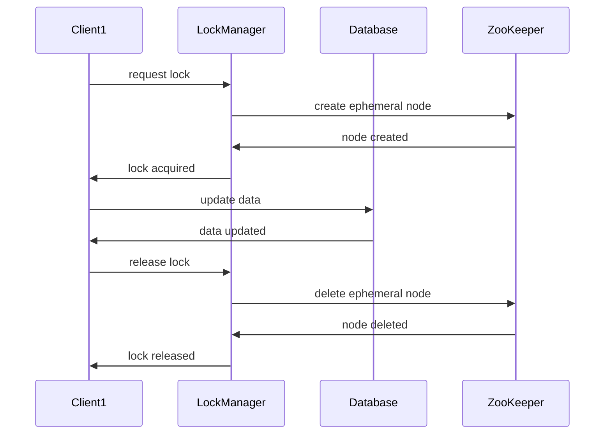

                 


# 分布式锁：协调分布式系统中的并发访问

## 关键词
- 分布式锁
- 并发控制
- 分布式系统
- 系统协调
- 高并发

## 摘要
本文将深入探讨分布式锁在协调分布式系统中的并发访问问题。我们将从分布式锁的基本概念、核心原理、系统架构设计、实际项目应用等方面进行详细分析，帮助读者全面理解分布式锁的核心机制和最佳实践。

### 目录大纲

1. **引言**
   - 分布式锁的概念及其重要性
   - 分布式系统中的并发访问挑战

2. **分布式锁的基础知识**
   - 分布式锁的定义
   - 分布式锁与传统锁的区别

3. **分布式锁的核心概念与联系**
   - 分布式锁的核心概念解析
   - 分布式锁的属性特征对比
   - 分布式锁的ER实体关系图

4. **分布式锁的算法原理**
   - 基于数据库的分布式锁
   - 基于ZooKeeper的分布式锁

5. **分布式锁的系统分析与架构设计**
   - 问题场景介绍
   - 系统功能设计
   - 系统架构设计
   - 系统接口设计
   - 系统交互

6. **分布式锁的项目实战**
   - 环境安装
   - 系统核心实现源代码
   - 代码应用解读与分析
   - 实际案例分析与讲解
   - 项目小结

7. **分布式锁的最佳实践**
   - 最佳实践 tips
   - 小结
   - 注意事项
   - 拓展阅读

### 一、引言

在现代计算机系统中，分布式系统已经成为了主流架构，它通过多个节点协同工作，提供了更高的可用性和扩展性。然而，分布式系统也带来了一系列的并发控制挑战。在这些系统中，多个节点可能会同时访问同一资源，导致数据竞争和状态不一致的问题。为了解决这些问题，分布式锁应运而生。

**分布式锁**是一种用于控制分布式系统中资源访问的技术，它确保同一资源在同一时刻只能被一个进程或线程访问。分布式锁与传统锁的主要区别在于，它能够在分布式环境中协调不同节点的操作，确保数据的完整性和一致性。

在分布式系统中，并发访问的问题主要体现在以下几个方面：

- **数据竞争**：多个进程或线程同时修改同一数据，导致数据不一致。
- **死锁**：多个进程或线程相互等待对方释放资源，导致系统死锁。
- **状态不一致**：不同节点上的数据状态不一致，导致系统行为异常。

分布式锁的作用在于：

- **防止数据竞争**：通过控制对共享资源的访问，避免多个进程或线程同时修改同一数据。
- **避免死锁**：通过正确的锁策略，避免进程或线程之间的死锁。
- **保持状态一致性**：通过分布式锁，确保分布式系统中各节点的数据状态保持一致。

### 二、分布式锁的基础知识

#### 分布式锁的定义

分布式锁是一种用于控制分布式系统中资源访问的技术，它确保同一资源在同一时刻只能被一个进程或线程访问。分布式锁通常由一个中心化的锁管理器或多个节点的本地锁机制实现。

#### 分布式锁与传统锁的区别

1. **作用范围**：传统锁通常作用于单个节点，而分布式锁作用于多个节点。
2. **实现机制**：传统锁主要通过操作系统层面的互斥锁实现，而分布式锁通常通过中心化的锁管理器或基于ZooKeeper等分布式协调框架实现。
3. **一致性保证**：分布式锁需要提供更高的一致性保证，以确保分布式系统中各节点的数据状态保持一致。

#### 分布式锁的挑战

1. **网络延迟**：分布式系统中的节点可能分布在不同的地理位置，网络延迟会影响锁的性能。
2. **节点故障**：节点故障可能导致分布式锁失效，需要实现容错机制。
3. **锁竞争**：高并发场景下，锁竞争可能导致系统性能下降。

### 三、分布式锁的核心概念与联系

#### 分布式锁的核心概念解析

1. **锁**：分布式锁的基本单位，用于控制对共享资源的访问。
2. **锁管理器**：负责分布式锁的创建、获取和释放等操作。
3. **锁客户端**：负责请求锁和释放锁的客户端。

#### 分布式锁的属性特征对比

| 属性 | 特征 |
| ---- | ---- |
| **一致性** | 分布式锁需要提供强一致性保证，确保分布式系统中各节点的数据状态保持一致。 |
| **可用性** | 分布式锁需要提供高可用性，确保在节点故障时，系统能够继续运行。 |
| **性能** | 分布式锁需要提供高性能，确保在高并发场景下，系统的响应时间较短。 |
| **容错性** | 分布式锁需要具备容错性，确保在节点故障时，系统能够自动恢复。 |

#### 分布式锁的ER实体关系图

```mermaid
erDiagram
    Lock --> LockManager
    Lock --> Client
    LockManager ||--|| Lock
    Client ||--|| Lock
```

### 四、分布式锁的算法原理

#### 基于数据库的分布式锁

**原理**：通过在数据库中创建一个锁记录，实现分布式锁。当进程或线程请求锁时，会在数据库中创建一个锁记录。如果锁记录不存在，则获取锁成功；否则，等待锁释放。

**Python代码示例**：

```python
import sqlite3

def get_lock(resource_id):
    conn = sqlite3.connect('lock.db')
    cursor = conn.cursor()
    cursor.execute(f"INSERT INTO locks (resource_id) VALUES ({resource_id})")
    conn.commit()
    return True

def release_lock(resource_id):
    conn = sqlite3.connect('lock.db')
    cursor = conn.cursor()
    cursor.execute(f"DELETE FROM locks WHERE resource_id = {resource_id}")
    conn.commit()
```

**数学模型和公式**：

$$
\begin{aligned}
&\text{Lock Acquisition:} \\
&\text{if (no record exists for resource_id)} \\
&\qquad \text{create a new record for resource_id} \\
&\text{else} \\
&\qquad \text{wait until the record is released}
\end{aligned}
$$

#### 基于ZooKeeper的分布式锁

**原理**：通过ZooKeeper实现分布式锁。ZooKeeper是一个分布式协调服务，提供了一种基于目录节点的锁机制。当进程或线程请求锁时，会在ZooKeeper中创建一个临时节点。如果锁成功获取，则该进程或线程成为锁的持有者；否则，等待锁释放。

**Python代码示例**：

```python
from kazoo.client import KazooClient

zk = KazooClient(hosts='localhost:2181')

def get_lock(path):
    zk.create(path, ephemeral=True)

def release_lock(path):
    zk.delete(path)
```

**数学模型和公式**：

$$
\begin{aligned}
&\text{Lock Acquisition:} \\
&\text{create a new ephemeral node at path} \\
&\text{if (node creation is successful)} \\
&\qquad \text{lock acquired} \\
&\text{else} \\
&\qquad \text{wait until the lock is released}
\end{aligned}
$$

### 五、分布式锁的系统分析与架构设计

#### 问题场景介绍

在一个分布式系统中，多个节点需要访问同一数据库表，进行数据更新操作。为了避免数据竞争和状态不一致，我们需要引入分布式锁。

#### 系统功能设计

- **锁管理**：提供创建、获取和释放分布式锁的接口。
- **资源监控**：监控各节点的锁状态，确保分布式锁的有效性。
- **锁冲突处理**：当锁冲突发生时，提供相应的处理策略。

#### 系统架构设计


- **锁管理器**：负责分布式锁的创建、获取和释放。
- **数据库**：存储锁记录和监控数据。
- **ZooKeeper**：提供分布式锁的协调功能。

#### 系统接口设计



#### 系统交互

- **锁请求**：客户端向锁管理器请求锁，锁管理器向ZooKeeper创建临时节点。
- **锁释放**：客户端向锁管理器释放锁，锁管理器向ZooKeeper删除临时节点。
- **数据更新**：客户端在获取锁后，对数据库进行数据更新操作。

### 六、分布式锁的项目实战

#### 环境安装

- 安装Python环境：`python -m venv venv`
- 安装依赖库：`pip install kazoo`

#### 系统核心实现源代码

```python
# lock_manager.py
import kazoo.client as kazoo

zk = kazoo.KazooClient(hosts='localhost:2181')

def get_lock(path):
    zk.create(path, ephemeral=True)

def release_lock(path):
    zk.delete(path)
```

```python
# client.py
import kazoo.client as kazoo

zk = kazoo.KazooClient(hosts='localhost:2181')

def request_lock(resource_id):
    path = f"/lock/{resource_id}"
    zk.create(path, ephemeral=True)

def release_lock(resource_id):
    path = f"/lock/{resource_id}"
    zk.delete(path)
```

#### 代码应用解读与分析

- `lock_manager.py`：实现了锁管理器的核心功能，包括获取锁和释放锁。
- `client.py`：模拟客户端请求锁和释放锁的操作。

#### 实际案例分析与讲解

假设有一个分布式系统，有两个客户端A和B，需要同时更新同一数据库表的数据。为了确保数据的一致性，我们引入分布式锁。

1. 客户端A请求锁：

```python
request_lock(1)
```

2. 客户端B请求锁：

```python
request_lock(1)
```

由于ZooKeeper创建的临时节点是唯一的，客户端A会成功获取锁，客户端B需要等待锁释放。

3. 客户端A更新数据库：

```python
# 更新数据库操作
```

4. 客户端B等待锁释放：

```python
# 等待锁释放
```

5. 客户端B获取锁并更新数据库：

```python
request_lock(1)
# 更新数据库操作
release_lock(1)
```

通过这种方式，我们确保了分布式系统中各节点的数据状态保持一致，避免了数据竞争和状态不一致的问题。

#### 项目小结

通过本项目的实战，我们深入了解了分布式锁的核心机制和实现方法。分布式锁在协调分布式系统中的并发访问方面发挥了重要作用，通过正确的锁策略，我们可以确保数据的一致性和系统的稳定性。

### 七、分布式锁的最佳实践

#### 最佳实践 tips

1. **选择合适的锁实现**：根据系统需求和性能要求，选择合适的锁实现，如基于数据库的分布式锁或基于ZooKeeper的分布式锁。
2. **锁的获取与释放**：确保锁的获取和释放操作的一致性，避免出现死锁或资源泄露。
3. **锁的超时处理**：设置锁的超时时间，避免长时间等待锁导致系统性能下降。
4. **锁的隔离级别**：根据系统需求，选择合适的锁隔离级别，如读锁或写锁。

#### 小结

本文从分布式锁的基本概念、核心原理、系统架构设计、实际项目应用等方面进行了详细分析，帮助读者全面理解分布式锁的核心机制和最佳实践。通过分布式锁，我们能够有效协调分布式系统中的并发访问，确保数据的一致性和系统的稳定性。

#### 注意事项

1. **分布式锁的复杂性**：分布式锁的实现相对复杂，需要充分考虑系统的稳定性和性能。
2. **锁的竞争问题**：在高并发场景下，锁的竞争可能导致系统性能下降，需要合理设置锁的超时时间和竞争策略。

#### 拓展阅读

1. 《分布式系统原理与范型》
2. 《ZooKeeper: 分布式服务框架》
3. 《Python并发编程实战》

---

作者：AI天才研究院/AI Genius Institute & 禅与计算机程序设计艺术 /Zen And The Art of Computer Programming

