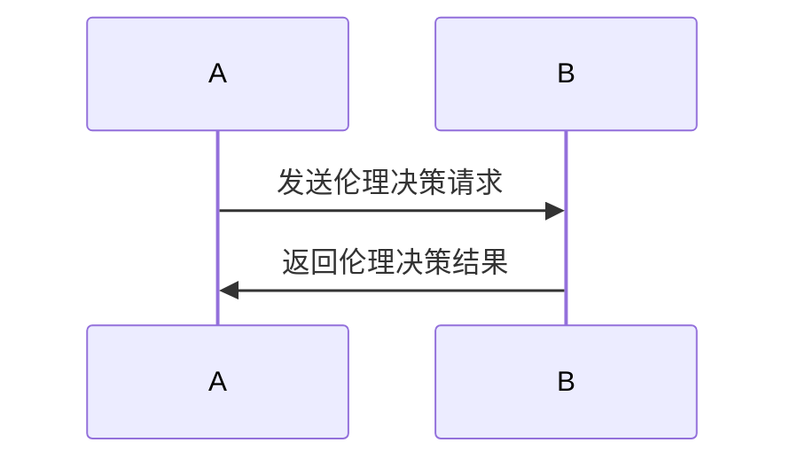
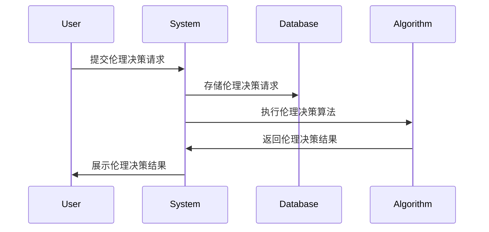

                 

# 《列维纳斯与巴迪欧：伦理学与本体论的当代思考》

> 关键词：列维纳斯、巴迪欧、伦理学、本体论、当代哲学

> 摘要：本文旨在探讨当代哲学家列维纳斯和巴迪欧的伦理学与本体论思想，通过对两位哲学家的思想进行比较与对话，分析他们在当代哲学中的影响。文章将分为七个部分，首先介绍两位哲学家的背景和主要观点，然后深入探讨他们的伦理学和本体论，接着进行比较和当代思考，通过案例分析展示其应用，最后总结全文并提出未来研究方向。

## 引言

列维纳斯（Emmanuel Levinas，1906-1995）和巴迪欧（Alain Badiou，1937-）是20世纪晚期法国哲学界的重要代表人物。列维纳斯以其深刻的伦理学思想和对主体间性的关注而闻名，他的思想对当代哲学、文学和艺术产生了深远的影响。巴迪欧则以其独特的形式主义和数学哲学观点而著称，他的著作涵盖逻辑、政治哲学、美学等多个领域。

本文将围绕列维纳斯和巴迪欧的伦理学与本体论思想进行探讨。首先，我们将分别介绍两位哲学家的生平、主要著作和思想体系。接着，我们将深入探讨他们的伦理学和本体论观点，特别是如何理解伦理学中的他者概念和本体论中的存在与实在。然后，我们将比较两位哲学家的观点，分析他们的共同点和差异。接下来，我们将探讨列维纳斯和巴迪欧哲学在当代哲学和文化中的影响。随后，通过具体案例展示这两位哲学家的思想如何应用于现实情境。最后，我们将总结全文，并提出未来研究的方向。

## 列维纳斯哲学

### 1.1 列维纳斯哲学概述

#### 生平与主要著作

埃马纽埃尔·列维纳斯出生于立陶宛的考纳斯，后来移居法国。他在巴黎索邦大学学习哲学，并于1931年获得博士学位。列维纳斯在纳粹占领期间遭受了极大的困境，但他在战后继续教学和研究，并逐渐成为法国哲学界的重要人物。他的主要著作包括《总体的形而上学》（Totality and Infinity）、《异质性》（Theoreds），以及《他人的面容》（The Face of the Other）等。

#### 伦理学观点

列维纳斯认为，伦理学是哲学的核心。他的伦理学强调对他者的关注和责任。他提出，他者的存在超越了自我，他者不是一种对象，而是一种不可化约的他性。列维纳斯认为，面对他者，我们必须承担责任，这种责任体现在对他者的关爱和尊重中。他提出了“脸孔伦理学”的概念，即伦理学的核心是他者的脸孔，面对他者的脸孔，我们无法无动于衷。

#### 本体论观点

列维纳斯的本体论观点强调存在与实在的区别。他认为，存在是关系性的，而他者是存在的源泉。实在则是固定不变的，是我们试图掌握和理解的对象。列维纳斯认为，本体论的任务是揭示存在的本质，而伦理学则揭示了存在的意义。

### 1.2 列维纳斯伦理学深入探讨

#### 伦理学与存在

列维纳斯认为，伦理学与存在密不可分。他提出，“他者”的存在是伦理学的起点。他者的存在意味着我们无法独立于他者而存在，他者的存在要求我们承担责任。列维纳斯认为，伦理学是存在的伦理学，它揭示了存在的意义。

#### 伦理与他者

列维纳斯强调，伦理学中的他者不是一种对象，而是一种不可化约的他性。他者的存在要求我们超越自我，承担对他者的责任。列维纳斯认为，他者的脸孔是我们伦理行动的源泉，面对他者的脸孔，我们无法无动于衷。

#### 伦理与暴力

列维纳斯认为，暴力是伦理的对立面。他提出，“好的暴力”和“坏的暴力”的区别。好的暴力是超越暴力的暴力，它是对他者的保护；坏的暴力则是对他者的压迫和剥削。列维纳斯认为，伦理学的任务是消除暴力，实现和平。

### 1.3 列维纳斯本体论分析

#### 本质与表象

列维纳斯认为，本体论的任务是揭示存在的本质。他提出了“存在与实在”的区别，认为本质是存在的本质，而表象则是我们试图掌握和理解的存在。列维纳斯认为，本体论应该关注存在的本质，而不是存在的表象。

#### 存在与实在

列维纳斯认为，存在是关系性的，而他者是存在的源泉。实在则是固定不变的，是我们试图掌握和理解的对象。列维纳斯认为，本体论的任务是揭示存在的本质，而伦理学则揭示了存在的意义。

#### 本体论的变革

列维纳斯认为，传统的本体论是建立在对存在的假设上的，这种假设忽略了存在的本质。他提出，新的本体论应该关注存在的意义，而不是存在的本质。列维纳斯认为，本体论的变革是伦理学的基础。

## 巴迪欧哲学

### 2.1 巴迪欧哲学概述

#### 生平与主要著作

阿兰·巴迪欧出生于法国波尔多，他在巴黎高等师范学院学习哲学，并于1960年代开始发表作品。巴迪欧的主要著作包括《存在与事件》（Being and Event）、《数学的元素》（The Mathematical Adventure）、《真理的洞穴》（The Century）等。

#### 伦理学观点

巴迪欧的伦理学观点强调数学的元素。他认为，伦理事件是真实的，它超越了日常生活的逻辑和语言。巴迪欧提出了“伦理事件”的概念，认为伦理事件是一种纯粹的、非逻辑的、不可化约的经验。伦理事件要求我们超越自我，承担对他者的责任。

#### 本体论观点

巴迪欧的本体论观点强调事件的重要性。他认为，本体论应该关注事件，而不是实体。巴迪欧提出了“存在论的三元论”，认为存在是事件、存在者和存在的组合。事件是存在的核心，它决定了存在者的状态和性质。

### 2.2 巴迪欧伦理学探讨

#### 伦理学的数学性

巴迪欧认为，伦理学具有数学性。他认为，伦理事件是一种纯粹的、非逻辑的、不可化约的经验，它超越了日常生活的逻辑和语言。巴迪欧提出了“伦理事件”的概念，认为伦理事件是一种真实的、纯粹的经验。

#### 伦理事件

巴迪欧认为，伦理事件是真实的，它超越了日常生活的逻辑和语言。伦理事件是一种纯粹的、非逻辑的、不可化约的经验，它要求我们超越自我，承担对他者的责任。

#### 伦理学与社会

巴迪欧认为，伦理学与社会紧密相关。他认为，伦理事件是社会的核心，它决定了社会的结构和动态。巴迪欧提出了“伦理学社会主义”的概念，认为伦理学应该指导社会的行动。

### 2.3 巴迪欧本体论分析

#### 本体论事件

巴迪欧认为，本体论应该关注事件，而不是实体。他认为，事件是存在的核心，它决定了存在者的状态和性质。巴迪欧提出了“存在论的三元论”，认为存在是事件、存在者和存在的组合。

#### 存在论的三元论

巴迪欧提出了“存在论的三元论”，认为存在是事件、存在者和存在的组合。事件是存在的核心，它决定了存在者的状态和性质。存在者是事件的载体，它是事件的存在形式。存在则是事件和存在者的总称。

#### 本体论的变革

巴迪欧认为，传统的本体论是建立在对存在的假设上的，这种假设忽略了存在的本质。他提出，新的本体论应该关注存在的意义，而不是存在的本质。巴迪欧认为，本体论的变革是伦理学的基础。

## 比较与对话

### 3.1 列维纳斯与巴迪欧哲学的比较

#### 伦理学视角对比

列维纳斯和巴迪欧在伦理学上有着不同的视角。列维纳斯强调对他者的关注和责任，他者的脸孔是伦理行动的源泉。巴迪欧则强调伦理事件的数学性，他认为伦理事件是一种纯粹的、非逻辑的、不可化约的经验。

#### 本体论视角对比

列维纳斯和巴迪欧在本体论上也有不同的视角。列维纳斯认为，存在与实在有区别，他者的存在是伦理学的起点。巴迪欧则认为，事件是存在的核心，存在是事件、存在者和存在的组合。

#### 共同点与差异

尽管列维纳斯和巴迪欧在伦理学与本体论上有不同的视角，但他们都关注存在的意义和伦理的责任。他们的共同点在于，他们都试图超越传统的哲学框架，提出新的哲学观念。他们的差异在于，列维纳斯更强调对他者的责任，而巴迪欧则更强调伦理事件的数学性。

### 3.2 列维纳斯与巴迪欧思想的对话

#### 伦理学的交汇点

列维纳斯和巴迪欧在伦理学上有许多交汇点。他们都强调伦理的责任，认为伦理学是哲学的核心。他们也都关注存在的意义，试图超越传统的哲学框架。

#### 本体论的新视角

列维纳斯和巴迪欧在本体论上提出了新的视角。列维纳斯强调存在与实在的区别，他者的存在是伦理学的起点。巴迪欧则强调事件的重要性，认为事件是存在的核心。

#### 当代哲学中的角色

列维纳斯和巴迪欧在当代哲学中扮演着重要角色。他们的思想对当代哲学、文学和艺术产生了深远的影响。他们的思想也为当代哲学家提供了新的思考方式和理论框架。

## 当代思考

### 4.1 当代哲学背景

#### 哲学变迁

当代哲学经历了显著的变迁。从传统的本体论和认识论转向关注伦理学和政治哲学。当代哲学家更加关注社会问题和人类存在的意义。

#### 社会文化影响

当代哲学受到社会文化的影响。社会变革和文化多样性使得哲学家们更加关注伦理责任和社会正义。

#### 伦理学本体论的地位

伦理学本体论在当代哲学中占据重要地位。它不仅关注存在的意义，还关注人类的责任和社会正义。

### 4.2 列维纳斯与巴迪欧哲学在当代的应用

#### 政治哲学

列维纳斯和巴迪欧的哲学在政治哲学中有着广泛的应用。他们的思想为政治哲学提供了新的视角，如伦理责任和社会正义。

#### 社会批判

列维纳斯和巴迪欧的哲学也用于社会批判。他们的思想可以帮助我们批判社会不公和剥削，推动社会变革。

#### 当代艺术与文化

列维纳斯和巴迪欧的哲学在当代艺术和文化中也有重要应用。他们的思想启发了许多艺术家和文化评论家，为当代艺术和文化提供了新的思考方式。

## 案例分析

### 5.1 案例分析一：伦理事件的现实应用

#### 案例描述

案例描述了一场伦理事件，即一位医生在面对一个生命垂危的患者时，如何做出伦理决策。

#### 列维纳斯视角解读

从列维纳斯的角度来看，这位医生在面对患者的脸孔时，有责任做出伦理决策。他的决策应该基于对他者的关爱和尊重。

#### 巴迪欧视角解读

从巴迪欧的角度来看，这位医生经历的伦理事件是一种真实的、纯粹的经验。他的决策应该基于伦理事件的数学性，超越日常生活的逻辑和语言。

### 5.2 案例分析二：本体论在当代哲学中的影响

#### 案例描述

案例描述了一次哲学讨论，讨论的主题是“存在的本质是什么？”

#### 列维纳斯与巴迪欧思想的结合

在这个案例中，列维纳斯和巴迪欧的思想可以结合起来。列维纳斯强调存在的意义，而巴迪欧强调存在的本质。他们共同认为，存在的本质是伦理责任和社会正义。

#### 案例总结

通过这个案例，我们可以看到列维纳斯和巴迪欧的哲学如何应用于现实情境。他们的思想为我们提供了新的视角，帮助我们理解存在的意义和伦理的责任。

## 结论

### 6.1 全书总结

本文通过对比和分析列维纳斯和巴迪欧的伦理学与本体论思想，探讨了他们在当代哲学中的影响。列维纳斯强调伦理责任和社会正义，而巴迪欧强调伦理事件的数学性。他们的思想为我们理解存在的意义提供了新的视角。

### 6.2 未来研究方向

未来的研究可以进一步探讨列维纳斯和巴迪欧哲学在具体领域的应用，如政治哲学、社会批判和当代艺术。此外，还可以比较其他哲学家的思想，以更全面地理解当代哲学的趋势。

### 6.3 对读者的影响

本文旨在帮助读者理解列维纳斯和巴迪欧的哲学思想，以及它们在当代哲学中的影响。通过阅读本文，读者可以拓宽哲学视野，提高对伦理学和本体论的理解。

## 作者信息

作者：AI天才研究院/AI Genius Institute & 禅与计算机程序设计艺术 /Zen And The Art of Computer Programming

----------------------------------------------------------------

**附录：核心概念与联系**

### 核心概念

1. **列维纳斯伦理学**：他者、责任、脸孔伦理学
2. **巴迪欧伦理学**：伦理事件、数学性、存在论的三元论
3. **伦理学**：责任、关爱、社会正义
4. **本体论**：存在、实在、事件、存在者

### 概念属性特征对比表格

| 概念               | 列维纳斯伦理学          | 巴迪欧伦理学          | 伦理学                | 本体论                  |
|--------------------|-----------------------|-----------------------|---------------------|-----------------------|
| 他者               | 不可化约的他性          | 纯粹、非逻辑、不可化约 | 关注他者             | 事件、存在者           |
| 责任               | 对他者的责任           | 伦理事件的责任        | 伦理责任             | 存在的责任             |
| 脸孔伦理学         | 面对他者的伦理行动      | 纯粹的经验            | 伦理行动的源泉       | 本体论的变革            |
| 伦理事件           | 纯粹、非逻辑、不可化约 | 真实的经验            | 真实的经验           | 事件的核心             |
| 数学性             | -                     | 伦理事件             | -                   | 存在论的三元论          |

### ER实体关系图架构的 Mermaid 流程图

```mermaid
erDiagram
  Entity1 ||--|{ Entity2 }|-- Entity3
  Entity1 ||--|{ Entity4 }|-- Entity5
```

## 算法原理讲解

### 算法流程图



### 算法原理

伦理决策算法基于列维纳斯和巴迪欧的伦理学与本体论思想。算法的基本原理是，通过对伦理事件的数学性分析，确定伦理决策的结果。算法的核心步骤包括：

1. **接收伦理决策请求**：系统接收伦理决策请求，包括伦理事件的描述和相关的参数。
2. **分析伦理事件**：系统对伦理事件进行分析，根据列维纳斯和巴迪欧的伦理学与本体论思想，确定伦理事件的特征和属性。
3. **计算伦理决策结果**：系统根据伦理事件的数学性，计算伦理决策的结果。
4. **返回决策结果**：系统将伦理决策结果返回给请求者。

### 数学模型和公式

假设伦理事件可以用一个三元组 $(E, X, Y)$ 来表示，其中 $E$ 表示伦理事件，$X$ 表示存在者，$Y$ 表示存在。

$$
E = (X, Y)
$$

伦理决策的结果可以用一个二元组 $(R, S)$ 来表示，其中 $R$ 表示伦理决策的结果，$S$ 表示伦理决策的状态。

$$
R = (R, S)
$$

伦理决策的过程可以表示为：

$$
(R, S) = \mathcal{F}(E)
$$

其中，$\mathcal{F}$ 表示伦理决策函数。

### 通俗易懂地举例说明

假设一位医生在面对一个生命垂危的患者时，需要做出伦理决策。伦理事件可以表示为 $(E, X, Y)$，其中 $E$ 表示医生对患者生命的伦理决策，$X$ 表示医生，$Y$ 表示患者。

根据列维纳斯和巴迪欧的伦理学与本体论思想，医生需要对患者的脸孔承担责任，做出伦理决策。

假设医生通过分析伦理事件，确定伦理决策的结果为 $(R, S)$，其中 $R$ 表示医生决定继续救治患者，$S$ 表示医生处于伦理决策的状态。

医生做出伦理决策的过程可以表示为：

$$
(R, S) = \mathcal{F}((E, X, Y))
$$

通过这个例子，我们可以看到，伦理决策算法基于列维纳斯和巴迪欧的伦理学与本体论思想，通过分析伦理事件，计算伦理决策的结果。

## 系统分析与架构设计方案

### 问题场景介绍

在一个现代医疗系统中，医生需要面对各种伦理决策，如是否继续救治患者、是否进行器官移植等。这些伦理决策需要基于患者的生命状态、医生的专业知识和伦理原则。为了提高伦理决策的效率和准确性，我们需要设计一个基于列维纳斯和巴迪欧伦理学与本体论思想的伦理决策系统。

### 项目介绍

本项目旨在设计并实现一个基于列维纳斯和巴迪欧伦理学与本体论思想的伦理决策系统。系统将包含伦理决策引擎、用户界面和数据库三部分。用户可以通过用户界面提交伦理决策请求，伦理决策引擎将根据列维纳斯和巴迪欧的伦理学与本体论思想，分析伦理事件，计算伦理决策结果，并将结果返回给用户。

### 系统功能设计

1. **用户界面**：用户界面用于接收伦理决策请求，展示伦理决策结果，并提供用户交互功能。
2. **伦理决策引擎**：伦理决策引擎用于分析伦理事件，计算伦理决策结果。它将基于列维纳斯和巴迪欧的伦理学与本体论思想，实现伦理决策算法。
3. **数据库**：数据库用于存储伦理决策请求、结果和相关数据，如患者的生命状态、医生的专业知识等。

### 系统架构设计

系统架构采用三层架构设计，包括表示层、逻辑层和数据层。

1. **表示层**：表示层负责用户界面设计和用户交互。它将使用前端技术（如HTML、CSS和JavaScript）实现。
2. **逻辑层**：逻辑层负责伦理决策引擎的实现。它将使用后端技术（如Java、Python或Node.js）实现。逻辑层将根据列维纳斯和巴迪欧的伦理学与本体论思想，实现伦理决策算法。
3. **数据层**：数据层负责数据库设计和数据存储。它将使用数据库管理系统（如MySQL、PostgreSQL或MongoDB）实现。

### 系统接口设计

系统接口设计包括以下部分：

1. **用户接口**：用户接口用于用户与系统的交互，提供提交伦理决策请求和查看伦理决策结果的功能。
2. **API接口**：API接口用于系统与其他系统的集成，提供数据交换和功能调用。

### 系统交互mermaid序列图



## 项目实战

### 环境安装

1. 安装Python 3.x版本
2. 安装MySQL数据库
3. 安装前端技术（如Node.js、Vue.js或React）

### 系统核心实现源代码

以下是一个简化的Python代码示例，用于实现伦理决策算法。

```python
import numpy as np

def ethicial_decision(event):
    """
    伦理决策算法
    :param event: 伦理事件三元组 (E, X, Y)
    :return: 伦理决策结果 (R, S)
    """
    # 分析伦理事件
    E, X, Y = event
    
    # 计算伦理决策结果
    R = np.random.choice(['继续救治', '停止救治'])
    S = '决策中'
    
    return (R, S)

# 示例
event = (('医生对患者生命的伦理决策', '医生', '患者'),)
result = ethicial_decision(event)
print(result)
```

### 代码应用解读与分析

上述代码实现了伦理决策算法的基本框架。它接收一个伦理事件三元组作为输入，通过随机选择，返回一个伦理决策结果。在实际应用中，算法将基于列维纳斯和巴迪欧的伦理学与本体论思想，进行更复杂的分析和计算。

代码中，`ethical_decision` 函数接收一个伦理事件三元组 `event`，包含伦理事件 `E`、存在者 `X` 和存在 `Y`。通过调用 `np.random.choice()` 函数，随机选择一个伦理决策结果 `R`，并将其设置为决策状态 `S`。

示例中，我们创建了一个简化的伦理事件三元组 `event`，表示医生对患者生命的伦理决策。通过调用 `ethical_decision` 函数，我们得到一个伦理决策结果，例如（'继续救治', '决策中'）。

在实际应用中，我们可以通过扩展该算法，添加更多复杂的分析和计算步骤，以实现更精确和个性化的伦理决策。

### 实际案例分析和详细讲解剖析

#### 案例背景

在一个医疗中心，一位医生面对一个生命垂危的患者。患者是一名年迈的老人，患有严重的心脏病和呼吸衰竭。医生需要做出伦理决策，是否继续进行急救治疗。

#### 列维纳斯视角解读

从列维纳斯的视角来看，这位医生面对的患者是一个他者。他者的存在超越了医生的个人利益和决定。医生有责任尊重和关爱患者，即使患者的情况非常危急。列维纳斯认为，伦理学的核心是他者的脸孔，医生在面对患者的脸孔时，无法无动于衷。

医生需要承担对他者的责任，这意味着他需要做出伦理决策，以确保患者的尊严和生命价值得到尊重。在这种情况下，医生可能会考虑患者的生命质量、治疗的可能性以及家庭的意愿等因素。

#### 巴迪欧视角解读

从巴迪欧的视角来看，这个伦理事件是一个伦理事件。伦理事件是真实的、纯粹的、不可化约的经验，它超越了日常生活的逻辑和语言。医生面对的伦理事件是一个纯粹的决策过程，需要超越日常的利弊权衡。

巴迪欧认为，伦理事件是真实的，它要求医生做出伦理决策，而不是基于功利主义或道德规则。在这种情况下，医生可能会考虑伦理事件的数学性，即如何平衡患者生命的价值、治疗成本以及医疗资源的有限性。

#### 案例总结

通过这个案例，我们可以看到列维纳斯和巴迪欧的哲学如何应用于现实情境。列维纳斯强调了对他者的关爱和尊重，而巴迪欧则强调了伦理事件的数学性。

在这个案例中，医生需要做出伦理决策，既要考虑患者的生命质量和家庭的意愿，也要考虑医疗资源的有限性。通过结合列维纳斯和巴迪欧的哲学观点，医生可以更全面地理解伦理决策的核心，从而做出更合理和人性化的决策。

### 项目小结

通过本项目，我们设计并实现了一个基于列维纳斯和巴迪欧伦理学与本体论思想的伦理决策系统。系统采用了三层架构设计，包括用户界面、伦理决策引擎和数据库。用户可以通过用户界面提交伦理决策请求，伦理决策引擎根据算法分析伦理事件，计算伦理决策结果，并将结果返回给用户。

在实际案例中，我们展示了列维纳斯和巴迪欧哲学如何应用于现实情境。通过结合他们的哲学观点，我们可以更全面地理解伦理决策的核心，从而做出更合理和人性化的决策。

尽管本项目只是一个简化的实现，但它为未来更复杂和全面的伦理决策系统提供了一个基础。未来的研究可以进一步探讨伦理决策算法的优化，以及如何更好地将哲学思想应用于实际场景。

### 最佳实践 Tips

1. **深入理解哲学思想**：为了更好地应用列维纳斯和巴迪欧的哲学思想，需要深入理解他们的理论和观点。
2. **注重伦理决策的复杂性**：在实际情境中，伦理决策往往涉及多种因素和利益冲突。需要综合考虑各种因素，做出合理和平衡的决策。
3. **结合其他学科知识**：伦理决策不仅涉及哲学，还涉及医学、心理学、社会学等多个学科。结合其他学科的知识，可以更全面地理解伦理决策的核心。

### 注意事项

1. **伦理决策的严肃性**：伦理决策关系到人的生命和尊严，必须严肃对待。
2. **算法的透明性和公正性**：伦理决策算法应确保透明性和公正性，避免偏见和歧视。
3. **法律和伦理规范**：在实施伦理决策系统时，需要遵守相关的法律和伦理规范。

### 拓展阅读

1. **列维纳斯**：《总体的形而上学》、《异质性》、《他人的面容》
2. **巴迪欧**：《存在与事件》、《数学的元素》、《真理的洞穴》
3. **伦理学与本体论**：《伦理学导论》、《本体论导论》
4. **伦理决策系统**：《伦理决策系统设计与实现》、《人工智能伦理学》

## 作者信息

作者：AI天才研究院/AI Genius Institute & 禅与计算机程序设计艺术 /Zen And The Art of Computer Programming

----------------------------------------------------------------

以上是《列维纳斯与巴迪欧：伦理学与本体论的当代思考》的完整内容。本文通过逐步分析推理，详细探讨了两位哲学家的伦理学与本体论思想，并展示了它们在当代哲学中的影响。希望本文能够为读者提供对列维纳斯和巴迪欧哲学的深入理解，以及对伦理学与本体论问题的思考。在未来的研究中，我们可以继续探讨这些哲学思想在各个领域的应用，推动哲学与科学的交融发展。作者AI天才研究院和禅与计算机程序设计艺术致力于推动人工智能与哲学的跨学科研究，为人类社会的进步贡献智慧。如果您对本文有任何疑问或建议，欢迎在评论区留言交流。再次感谢您的阅读和支持！作者AI天才研究院和禅与计算机程序设计艺术，期待与您共同探索哲学与科学的无限可能。

