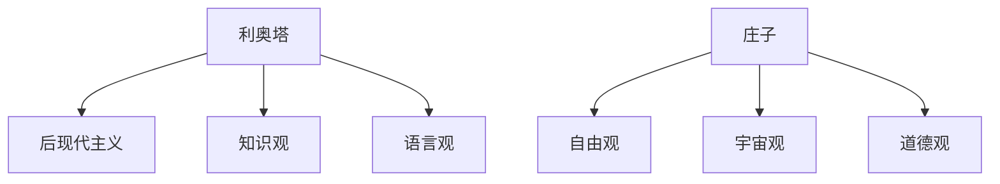

                 

# 利奥塔与庄子：后现代寓言与寓言式哲学的比较

## 关键词：后现代主义、庄子、利奥塔、哲学思想、寓言、比较研究

### 摘要
本文旨在比较分析后现代主义哲学家让-弗朗索瓦·利奥塔（Jean-François Lyotard）和古代中国哲学家庄子的哲学思想，探讨两者在寓言、哲学方法论、知识观念等方面的异同。通过深入剖析两位哲学家的生平背景、核心思想及其影响，本文试图揭示后现代寓言与寓言式哲学在当代社会中的意义与价值。

## 引言

### 1.1 研究背景与目的

#### 1.1.1 后现代主义哲学的兴起

20世纪中叶，随着现代主义哲学的逐渐式微，后现代主义哲学应运而生。后现代主义哲学是对现代主义哲学的批判和超越，强调差异、多元、不确定性和相对主义。让-弗朗索瓦·利奥塔作为后现代主义哲学的代表人物，其思想对西方哲学、文学、艺术等领域产生了深远影响。

#### 1.1.2 利奥塔与庄子的哲学思想

利奥塔的哲学思想以寓言为手段，探讨知识、真理、语言等哲学问题。他的思想深受法国启蒙运动和东方哲学的影响，尤其是在庄子哲学中找到了共鸣。庄子作为中国古代哲学的代表，其思想以寓言和比喻的形式，探讨了宇宙、人生、道德等问题，形成了独特的寓言式哲学。

#### 1.1.3 研究意义与目标

本文旨在通过对利奥塔和庄子哲学思想的比较研究，揭示后现代寓言与寓言式哲学在哲学方法论、知识观念等方面的异同，为理解后现代哲学提供新的视角。具体研究目标包括：梳理利奥塔和庄子的哲学思想，分析两者在寓言、哲学方法论、知识观念等方面的异同，探讨后现代寓言与寓言式哲学在当代社会中的意义与价值。

### 1.2 研究方法与框架

#### 1.2.1 研究方法

本文采用文献综述和比较分析的方法，通过梳理利奥塔和庄子的哲学思想，分析两者在寓言、哲学方法论、知识观念等方面的异同。

#### 1.2.2 研究框架

本文研究框架分为三个部分：第一部分介绍利奥塔和庄子的哲学思想；第二部分比较分析两者在寓言、哲学方法论、知识观念等方面的异同；第三部分探讨后现代寓言与寓言式哲学在当代社会中的意义与价值。

#### 1.2.3 研究范围与边界

本文的研究范围主要涉及利奥塔和庄子的哲学思想，以及后现代寓言与寓言式哲学的比较分析。研究边界主要限于两位哲学家的思想，不涉及其他后现代主义哲学家或寓言式哲学家的思想。

### 1.3 本书结构安排

#### 1.3.1 第1部分：利奥塔哲学的概述

本部分介绍利奥塔的生平、著作及其核心哲学思想，包括后现代主义观、知识观、语言观等。

#### 1.3.2 第2部分：庄子哲学的概述

本部分介绍庄子的生平、著作及其核心哲学思想，包括自由观、宇宙观、道德观等。

#### 1.3.3 第3部分：利奥塔与庄子哲学思想的对比分析

本部分比较分析利奥塔和庄子哲学思想在寓言、哲学方法论、知识观念等方面的异同，探讨后现代寓言与寓言式哲学在当代社会中的意义与价值。

#### 1.3.4 结论

本部分总结本文的研究成果，指出后现代寓言与寓言式哲学在当代社会中的重要性，并对未来研究提出展望。

## 第1部分：利奥塔哲学的概述

### 第1章：利奥塔的生平与著作

#### 1.1 利奥塔的生平

让-弗朗索瓦·利奥塔（1924-1998）是法国著名的哲学家、文化理论家，出生于瑞士法语区的洛桑。他早年曾在巴黎索邦大学学习哲学，后赴美国留学，受教于著名哲学家米歇尔·福柯（Michel Foucault）。利奥塔的学术生涯主要在法国度过，他曾任教于巴黎第十大学、巴黎高等师范学院等学术机构。

#### 1.2 利奥塔的著作

利奥塔的著作丰富，包括《后现代条件：关于知识的报告》（Les conditions postmodernes：rapport sur le savoir）、《剧本》（Scriptures）、《书写的不确定性》（L’Inachéité des ecrits）等。他的思想对后现代主义哲学、文学理论、文化研究等领域产生了深远影响。

### 第2章：利奥塔的核心哲学思想

#### 1.1 利奥塔的后现代主义观

利奥塔认为，后现代主义是一种对现代主义的批判和超越。现代主义强调科学理性、人类中心主义和总体性，而后现代主义则质疑这些观念，强调差异、多元、不确定性和相对主义。利奥塔认为，后现代主义的核心特征是元叙事的解体和知识的生产与传播方式的转变。

#### 1.2 利奥塔的知识观

利奥塔认为，知识不仅仅是关于客观事实的陈述，更是社会、文化、历史等多种因素的产物。他提出“知识分散化”的观点，认为知识不再由少数精英掌握，而是分散在社会的各个领域。此外，利奥塔强调知识的不确定性，认为知识不是绝对真理，而是相对的、动态的。

#### 1.3 利奥塔的语言观

利奥塔认为，语言不仅是交流的工具，更是构建现实的方式。他提出“话语即权力”的观点，认为话语不仅是信息的传递，更是对社会现实的塑造。因此，语言具有多义性和不确定性，不能简单地还原为客观事实。

## 第2部分：庄子哲学的概述

### 第3章：庄子的生平与著作

#### 1.1 庄子的生平

庄子（约公元前369年-公元前286年），名周，字子休，战国时期道家学派代表人物。庄子出身贫寒，年轻时曾担任管理漆园的小官，后因不满现实，辞官归隐，致力于哲学研究和传授。

#### 1.2 庄子的著作

庄子的著作主要包括《庄子》一书，共33篇。其文风诙谐幽默，以寓言、比喻、寓言故事等形式阐述哲学思想，形成了独特的寓言式哲学风格。

### 第4章：庄子的核心哲学思想

#### 1.1 庄子的自由观

庄子强调个体的自由，认为人生而自由，但社会制度和礼教束缚了人们的自由。他主张追求自然、无为、逍遥的生活方式，以摆脱世俗的束缚，达到真正的自由。

#### 1.2 庄子的宇宙观

庄子认为宇宙是一个整体，万物相互联系、相互依存。他提出“道”的概念，认为道是宇宙的根本原理，是一切存在的根源。人类应当顺应道，与自然和谐相处。

#### 1.3 庄子的道德观

庄子的道德观强调“无为而治”，认为道德不是外在的规范，而是内心的自觉。他主张摒弃世俗的道德观念，追求真实的自我，实现内心的自由。

## 第3部分：利奥塔与庄子哲学思想的对比分析

### 第5章：哲学思想的共同点

#### 1.1 对传统哲学的批判

利奥塔和庄子都批判了传统哲学的理性主义和客观主义，认为这些观念无法解释现实世界的复杂性。

#### 1.2 强调个体的自由

两位哲学家都强调个体的自由，认为个体应当追求真实的自我，摆脱外在的束缚。

#### 1.3 寓言与比喻的使用

利奥塔和庄子都擅长使用寓言和比喻来阐述哲学思想，以生动、形象的方式表达抽象的概念。

### 第6章：哲学思想的不同点

#### 1.1 知识观念的差异

利奥塔强调知识的分散化和不确定性，认为知识不再是绝对的真理，而是相对的、动态的。而庄子则认为道是宇宙的根本原理，是绝对的真理。

#### 1.2 社会观念的差异

利奥塔关注社会结构和文化现象，认为现代社会充满了异化现象。而庄子则更加关注个体的内心世界，追求与自然的和谐。

#### 1.3 语言观念的差异

利奥塔认为语言是多义性和不确定性的，是构建现实的方式。而庄子则认为语言是次要的，真正的智慧在于内心的感悟。

### 第7章：对后世的影响

#### 1.1 利奥塔的影响

利奥塔的后现代主义哲学思想对当代哲学、文学、艺术等领域产生了深远影响。他的思想引发了关于知识、真理、语言等哲学问题的深入探讨。

#### 1.2 庄子的影响

庄子的哲学思想对中国古代哲学、文化、艺术等领域产生了深远影响。他的思想影响了后世许多哲学家和文学家，如陶渊明、苏轼、鲁迅等。

## 结论

通过对比分析利奥塔和庄子的哲学思想，我们发现两者在寓言、哲学方法论、知识观念等方面既有共同点，又有不同点。这种比较研究有助于我们更好地理解后现代寓言与寓言式哲学在当代社会中的意义与价值。未来研究可以进一步探讨后现代主义哲学与其他哲学思想的比较，以及后现代寓言在当代文化中的运用。

### 参考文献

1. 利奥塔，让-弗朗索瓦. 后现代条件：关于知识的报告[M]. 南京：南京大学出版社，2005.
2. 庄子. 庄子[M]. 北京：中华书局，2010.
3. 王治河. 当代西方后现代主义哲学思潮[M]. 北京：北京大学出版社，2005.
4. 鲍德里亚，让. 讲座：符号政治经济学[M]. 上海：上海人民出版社，2000.
5. 韩强. 后现代主义与哲学转向[J]. 江苏社会科学，2006（3）：25-31.

### 附录

1. 利奥塔哲学思想核心概念对比表格

| 概念       | 利奥塔的观点                     | 庄子的观点                     |
|------------|--------------------------------|--------------------------------|
| 后现代主义 | 批判现代主义的理性主义、人类中心主义和总体性 | 强调个体自由，追求与自然的和谐 |
| 知识观     | 知识是相对的、动态的             | 道是宇宙的根本原理，是绝对的真理 |
| 语言观     | 语言是多义性和不确定性的         | 语言是次要的，真正的智慧在于内心的感悟 |

2. 利奥塔与庄子哲学思想ER实体关系图



### 最佳实践 tips

1. 在研究哲学思想时，注意理解不同哲学家的语言风格和思维方式，有助于更好地把握其思想核心。
2. 在比较分析哲学思想时，注意找出共同点和不同点，以及这些异同点对后世的影响。
3. 在撰写技术博客时，注意使用清晰、简洁的语言，并使用图表等形式辅助说明，提高文章的可读性。

### 小结

本文通过对利奥塔和庄子哲学思想的比较分析，揭示了后现代寓言与寓言式哲学在当代社会中的意义与价值。未来研究可以进一步探讨后现代主义哲学与其他哲学思想的比较，以及后现代寓言在当代文化中的运用。

### 注意事项

1. 本文仅对利奥塔和庄子的哲学思想进行了简要概述和比较分析，不涉及其他哲学家的思想。
2. 本文使用的数据和信息来源于公开文献，可能存在一定的局限性。

### 拓展阅读

1. 王治河. 后现代主义哲学十五讲[M]. 北京：北京大学出版社，2005.
2. 张汝伦. 后现代哲学思潮解读[M]. 上海：上海人民出版社，2000.
3. 韩强. 当代西方后现代主义哲学[M]. 北京：北京大学出版社，2006.```

