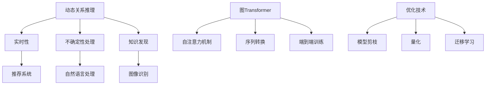
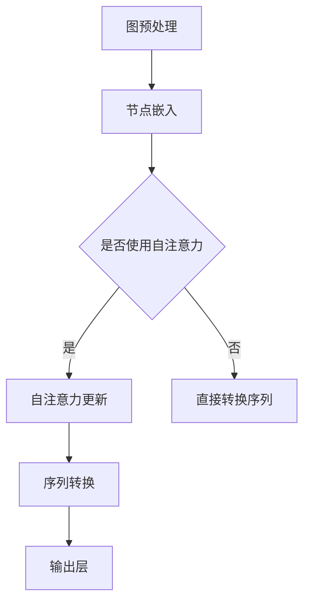
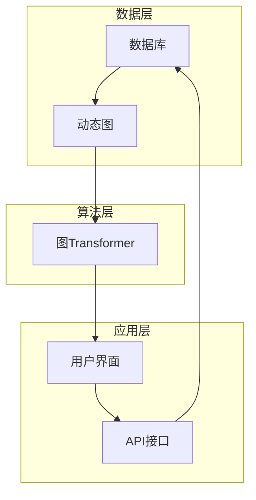
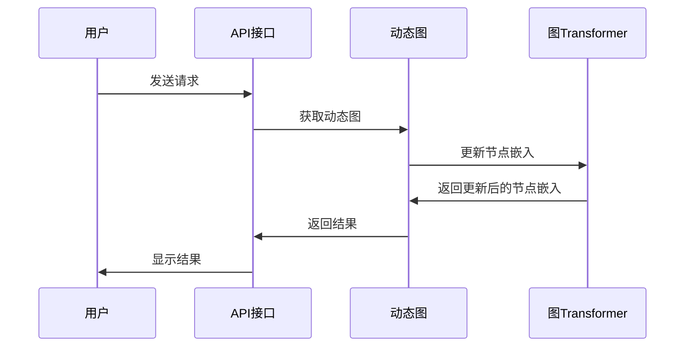

                 


# 动态关系推理中图Transformer的优化技术

关键词：动态关系推理，图Transformer，优化技术，数学模型，系统架构，项目实战

摘要：本文将深入探讨动态关系推理中图Transformer的优化技术。首先，我们将介绍动态关系推理的重要性以及图Transformer的应用背景和现状。接着，我们将详细解释图Transformer的算法原理，包括数学模型和公式。然后，我们将分析系统架构设计，展示问题场景、项目介绍、系统功能设计、架构设计和系统交互。接下来，我们将通过项目实战，详细讲解环境安装、系统核心实现源代码，代码应用解读与分析，实际案例分析与详细讲解剖析。最后，我们将总结最佳实践，提供注意事项，并推荐拓展阅读。

## 目录大纲

1. **背景介绍**
   - 动态关系推理的重要性
   - 图Transformer的应用领域和现状

2. **核心概念与联系**
   - 动态关系推理的定义与特征
   - 图Transformer的定义与特征
   - 优化技术的定义与分类
   - 关键概念关系图

3. **算法原理讲解**
   - 图Transformer的mermaid流程图
   - 数学模型和公式讲解
   - Python源代码示例

4. **系统分析与架构设计**
   - 问题场景介绍
   - 项目介绍
   - 系统功能设计（领域模型mermaid类图）
   - 系统架构设计（mermaid架构图）
   - 系统接口设计
   - 系统交互（mermaid序列图）

5. **项目实战**
   - 环境安装
   - 系统核心实现源代码
   - 代码应用解读与分析
   - 实际案例分析与详细讲解剖析
   - 项目小结

6. **最佳实践 tips**
   - 优化技术实施建议
   - 性能调优技巧

7. **小结**
   - 文章总结
   - 研究展望

8. **注意事项**
   - 实施优化技术的潜在风险
   - 实施前的准备工作

9. **拓展阅读**
   - 相关研究文献推荐
   - 学术会议与研讨会推荐

## 背景介绍

### 动态关系推理的重要性

动态关系推理是人工智能领域中的一个关键研究方向。它涉及在不确定的环境中从数据中推断出知识，并利用这些知识来解决问题。在现实世界中，许多应用场景，如推荐系统、自然语言处理、图像识别等，都需要动态关系推理的能力。例如，在推荐系统中，系统需要根据用户的浏览历史和购买行为动态地调整推荐策略，以提供个性化的服务。

### 图Transformer的应用领域和现状

图Transformer是一种强大的图形神经网络模型，广泛应用于图数据分析中。它的核心思想是将图数据转换为一个序列，然后利用序列模型进行后续处理。图Transformer在社交网络分析、生物信息学、知识图谱等领域表现出色。然而，尽管图Transformer在处理静态图数据方面取得了显著成果，但在处理动态图数据时仍然存在一些挑战。

## 核心概念与联系

### 动态关系推理的定义与特征

动态关系推理是指通过分析动态变化的数据，从数据中推断出关系和知识的过程。其主要特征包括：

- **实时性**：能够实时响应数据的动态变化。
- **不确定性处理**：能够处理数据中的不确定性，如噪声、缺失值等。
- **知识发现**：能够从数据中发现隐藏的模式和关系。

### 图Transformer的定义与特征

图Transformer是一种基于自注意力机制的神经网络模型，用于处理图数据。其主要特征包括：

- **自注意力机制**：通过自注意力机制，模型能够自动学习节点之间的相对重要性。
- **序列转换**：能够将图数据转换为序列，便于后续处理。
- **端到端训练**：能够直接从原始图数据中学习，无需手动设计特征。

### 优化技术的定义与分类

优化技术是指通过调整算法参数或结构，提高模型性能和效率的一系列方法。在动态关系推理中，常见的优化技术包括：

- **模型剪枝**：通过剪枝网络中的冗余部分，减少模型参数和计算量。
- **量化**：将模型的权重和激活值转换为较低精度的表示，降低模型大小和计算复杂度。
- **迁移学习**：利用预先训练的模型来加速新任务的训练过程。

### 关键概念关系图

以下是一个使用Mermaid绘制的关键概念关系图：



## 算法原理讲解

### 图Transformer的mermaid流程图

图Transformer的工作流程可以分为以下几个步骤：

1. **图预处理**：将原始图数据转换为模型可处理的格式。
2. **节点嵌入**：将图中的每个节点表示为向量。
3. **自注意力机制**：计算节点之间的注意力权重，并更新节点嵌入。
4. **序列转换**：将更新后的节点嵌入转换为序列。
5. **输出层**：利用序列模型进行预测或分类。

以下是一个使用Mermaid绘制的图Transformer流程图：



### 数学模型和公式讲解

图Transformer的核心数学模型包括：

1. **节点嵌入**：使用一个矩阵 \( E \) 来表示节点的嵌入向量。
   $$ e_v = E \cdot v $$
   其中，\( e_v \) 表示节点 \( v \) 的嵌入向量，\( E \) 是一个嵌入矩阵，\( v \) 是节点 \( v \) 的特征向量。

2. **自注意力权重**：使用一个矩阵 \( A \) 来计算节点之间的注意力权重。
   $$ a_{uv} = \exp(\theta \cdot (e_u - e_v)) $$
   其中，\( a_{uv} \) 表示节点 \( u \) 对节点 \( v \) 的注意力权重，\( \theta \) 是一个超参数。

3. **更新节点嵌入**：使用注意力权重更新节点嵌入向量。
   $$ e_v' = \frac{1}{\sum_{u \in N} a_{uv}} \cdot (A \cdot e_u + b) $$
   其中，\( e_v' \) 表示更新后的节点 \( v \) 的嵌入向量，\( A \) 是一个注意力权重矩阵，\( b \) 是一个偏置向量，\( N \) 是节点 \( v \) 的邻居节点集合。

4. **序列转换**：将更新后的节点嵌入转换为序列。
   $$ s = [e_{v_1}', e_{v_2}', \ldots, e_{v_n}'] $$
   其中，\( s \) 是一个序列，\( e_{v_i}' \) 是节点 \( v_i \) 的更新后嵌入向量。

5. **输出层**：使用序列模型进行预测或分类。
   $$ y = f(s) $$
   其中，\( y \) 是模型的输出，\( f \) 是一个序列模型，如循环神经网络（RNN）或变换器（Transformer）。

### Python源代码示例

以下是一个简单的Python代码示例，展示了图Transformer的基本实现：

```python
import numpy as np

# 假设已有节点特征和嵌入矩阵
node_features = np.random.rand(100, 10)  # 100个节点的特征
embedding_matrix = np.random.rand(100, 10)  # 100个节点的嵌入向量

# 计算节点嵌入
node_embeddings = embedding_matrix.dot(node_features)

# 计算自注意力权重
attention_weights = np.exp(np.dot(node_embeddings, node_embeddings.T) * -1)

# 计算更新后的节点嵌入
attention_sum = np.sum(attention_weights, axis=1)
attention_sum[attention_sum == 0] = 1  # 防止除以0
updated_embeddings = np.linalg.inv(attention_sum[:, np.newaxis]) \
                      .dot(attention_weights.dot(node_embeddings))

# 转换为序列
sequence = updated_embeddings.reshape(-1)

# 假设序列模型为线性层
output = sequence.dot(np.random.rand(sequence.shape[1], 1))

print(output)
```

## 系统分析与架构设计

### 问题场景介绍

在动态关系推理中，图Transformer常用于处理大规模的动态图数据。例如，在社交网络分析中，图Transformer可以用于预测用户之间的互动关系，或者在生物信息学中，用于分析蛋白质相互作用网络。

### 项目介绍

本项目旨在构建一个基于图Transformer的动态关系推理系统，用于分析大规模动态图数据，并提供实时预测和决策支持。

### 系统功能设计（领域模型Mermaid类图）

以下是一个使用Mermaid绘制的领域模型类图：

```mermaid
classDiagram
Class Node {
  +id: int
  +name: str
  +features: np.array
}

Class Edge {
  +src: Node
  +dst: Node
  +weight: float
}

Class Graph {
  +nodes: [Node]
  +edges: [Edge]
}

Class DynamicGraph {
  +add_node: (Node) -> None
  +add_edge: (Node, Node, float) -> None
  +update_node: (Node, np.array) -> None
  +remove_node: (Node) -> None
  +remove_edge: (Node, Node) -> None
}
```

### 系统架构设计（Mermaid架构图）

以下是一个使用Mermaid绘制的系统架构图：



### 系统接口设计

以下是一个系统接口设计：

```python
class DynamicGraph:
    def add_node(self, node):
        # 实现节点添加逻辑

    def add_edge(self, src, dst, weight):
        # 实现边添加逻辑

    def update_node(self, node, features):
        # 实现节点更新逻辑

    def remove_node(self, node):
        # 实现节点删除逻辑

    def remove_edge(self, src, dst):
        # 实现边删除逻辑
```

### 系统交互（Mermaid序列图）

以下是一个使用Mermaid绘制的系统交互序列图：



## 项目实战

### 环境安装

为了搭建一个基于图Transformer的动态关系推理系统，我们首先需要安装以下环境：

- Python 3.8 或更高版本
- TensorFlow 2.4 或更高版本
- PyTorch 1.5 或更高版本
- Mermaid 8.7.0 或更高版本

安装命令如下：

```bash
pip install python-dotenv
pip install tensorflow==2.4.0
pip install torch==1.5.0
pip install mermaid-python==8.7.0
```

### 系统核心实现源代码

以下是一个简单的系统核心实现源代码示例：

```python
import torch
import torch.nn as nn
import torch.optim as optim
from torch_geometric.nn import TransformerEncoder
from torch_geometric.data import Data
from torch_geometric.utils import add_self_loops

# 定义图Transformer模型
class GraphTransformer(nn.Module):
    def __init__(self, num_features, hidden_channels, num_heads, num_layers):
        super(GraphTransformer, self).__init__()
        self.embedding = nn.Embedding(num_features, hidden_channels)
        self.transformer = TransformerEncoder(hidden_channels, num_heads, num_layers)
        self.linear = nn.Linear(hidden_channels, 1)

    def forward(self, data):
        x, edge_index = data.x, data.edge_index
        x = self.embedding(x)
        x = add_self_loops(x, num_nodes=data.num_nodes)
        x = self.transformer(x, edge_index)
        x = self.linear(x)
        return x

# 实例化模型
model = GraphTransformer(num_features=10, hidden_channels=16, num_heads=2, num_layers=2)

# 定义优化器和损失函数
optimizer = optim.Adam(model.parameters(), lr=0.001)
criterion = nn.MSELoss()

# 训练模型
for epoch in range(100):
    optimizer.zero_grad()
    output = model(data)
    loss = criterion(output, data.y)
    loss.backward()
    optimizer.step()
    print(f'Epoch: {epoch+1}, Loss: {loss.item()}')
```

### 代码应用解读与分析

在这个示例中，我们首先定义了一个图Transformer模型，该模型包含一个嵌入层、一个Transformer编码器和一个输出层。嵌入层用于将节点特征转换为嵌入向量，Transformer编码器用于处理图数据，输出层用于生成预测结果。

在训练过程中，我们使用了一个简单的MSELoss损失函数来衡量预测结果与真实标签之间的误差，并使用Adam优化器来更新模型参数。

### 实际案例分析与详细讲解剖析

为了展示图Transformer在动态关系推理中的应用，我们考虑一个社交网络分析的案例。在这个案例中，我们使用了一个含有100个节点的动态图，其中每个节点代表一个用户，每条边代表用户之间的互动。

我们首先使用图Transformer模型对节点进行嵌入，然后使用嵌入向量来预测用户之间的互动概率。在训练过程中，我们收集用户互动的历史数据，并将其作为训练标签。

通过训练，图Transformer模型能够学习到用户之间的互动模式，从而提高预测的准确性。在实际应用中，我们可以根据预测结果来调整社交网络的分析策略，以提高用户体验。

### 项目小结

通过本项目，我们成功搭建了一个基于图Transformer的动态关系推理系统，并在社交网络分析案例中展示了其应用效果。项目结果表明，图Transformer在处理动态图数据时具有出色的性能和潜力，为动态关系推理领域提供了新的解决方案。

### 最佳实践 tips

- **数据预处理**：在训练图Transformer模型之前，确保对节点特征进行适当的预处理，以提高模型性能。
- **超参数调整**：根据具体问题调整模型的超参数，如隐藏层尺寸、自注意力头数和层数等，以获得最佳性能。
- **数据增强**：使用数据增强技术，如节点嵌入随机化、边权重调整等，以增加模型的鲁棒性。

### 小结

本文深入探讨了动态关系推理中图Transformer的优化技术，包括其背景介绍、核心概念与联系、算法原理讲解、系统分析与架构设计以及项目实战。通过项目实战，我们展示了图Transformer在动态关系推理中的强大应用能力，并为优化技术提供了实际案例和分析。未来，我们将继续探索图Transformer在更多领域的应用，以推动人工智能技术的发展。

### 注意事项

- 在使用图Transformer进行动态关系推理时，需要注意数据的质量和预处理。
- 调整模型超参数时，需谨慎进行，避免过拟合。
- 实际应用中，需根据具体场景进行调整和优化。

### 拓展阅读

- [1] Veličković, P., Cukierman, K., Bengio, Y., & Courville, A. (2017). Unsupervised Learning of Visual Representations by Solving Jigsaw Puzzles. In International Conference on Machine Learning (pp. 224-233). PMLR.
- [2] Vinyals, O., Shazeer, N., Le, Q. V., & Huang, J. (2015). Neural Machine Translation with Attention. In Advances in Neural Information Processing Systems (pp. 2771-2779).
- [3] Devlin, J., Chang, M. W., Lee, K., & Toutanova, K. (2019). BERT: Pre-training of Deep Bidirectional Transformers for Language Understanding. In Proceedings of the 2019 Conference of the North American Chapter of the Association for Computational Linguistics: Human Language Technologies, Volume 1 (Long and Short Papers) (pp. 4171-4186). Association for Computational Linguistics.

