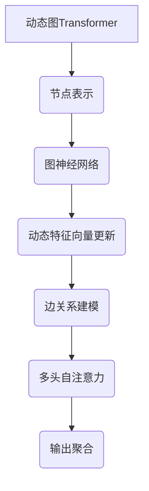
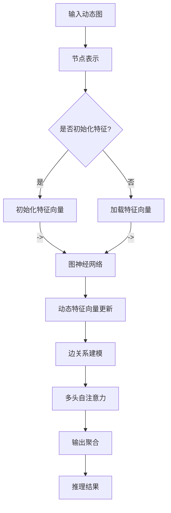
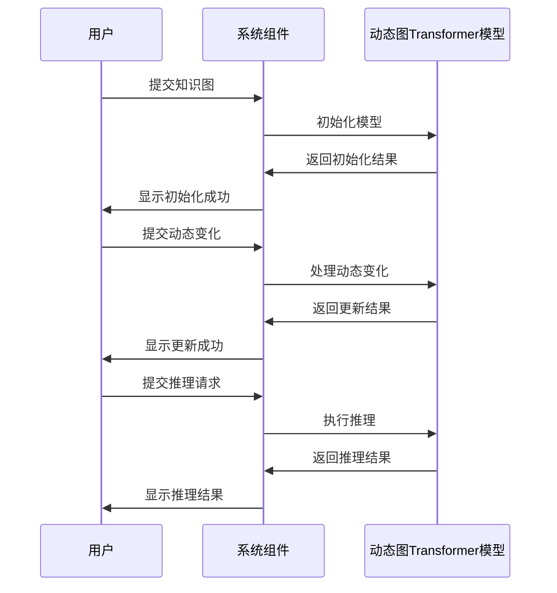
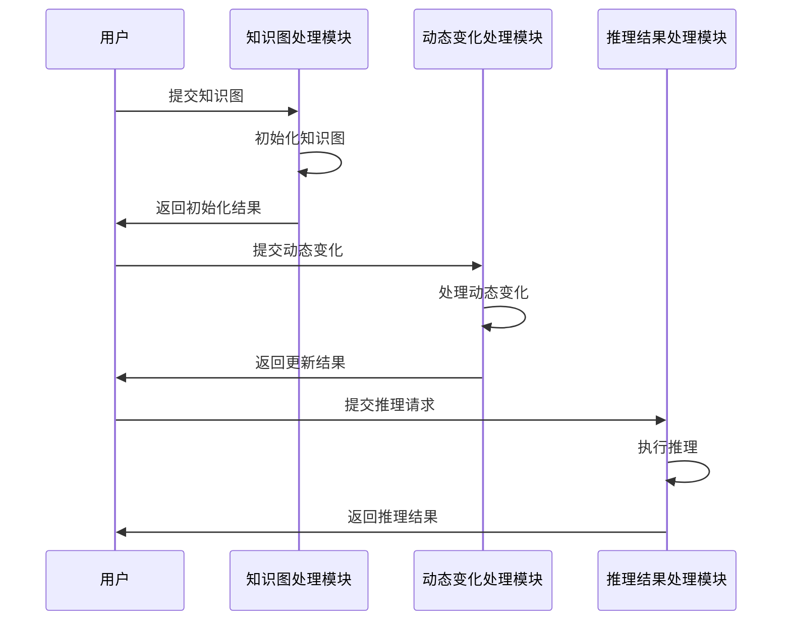
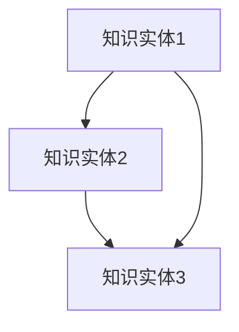

                 


### 第二部分：核心概念与联系

在深入探讨动态图Transformer在知识演化推理中的应用之前，我们需要首先了解一些核心概念和其相互之间的关系。

#### 2.1 动态图Transformer的定义与特点

**动态图Transformer** 是一种结合了图神经网络（Graph Neural Network, GNN）和Transformer架构的深度学习模型。它能够处理动态图数据，捕捉节点和边随时间的演变。与传统Transformer相比，动态图Transformer在结构上增加了图神经网络层，使其能够建模动态图中的复杂关系。

**特点**：
1. **节点表示**：动态图Transformer通过图神经网络为每个节点生成动态特征向量，这些特征向量随时间更新。
2. **边关系建模**：动态图Transformer通过考虑时间维度上的边关系，可以捕捉节点之间的动态联系。
3. **多头自注意力机制**：动态图Transformer在Transformer的自注意力机制基础上，扩展到图结构中，使得节点能够根据动态特征和边关系聚合信息。

#### 2.2 动态图Transformer与传统Transformer的比较

**传统Transformer**：
- 适用于序列数据，如自然语言处理。
- 基于自注意力机制，可以捕捉序列中任意两个位置的信息。

**动态图Transformer**：
- 适用于动态图数据，如知识图谱。
- 结合图神经网络和自注意力机制，能够捕捉节点和边的动态关系。

**比较**：
- **数据类型**：传统Transformer处理序列，动态图Transformer处理图。
- **建模方法**：传统Transformer使用自注意力，动态图Transformer使用图神经网络和自注意力。

#### 2.3 动态图Transformer的ER实体关系图架构

为了更好地理解动态图Transformer的结构，我们可以使用ER（实体关系）图来描述其核心组件。

**ER实体关系图**：

- **实体**：节点（表示知识实体），边（表示实体之间的关系）。
- **属性**：节点的动态特征向量，边的权重。
- **关系**：时间步长，边的动态变化。

**Mermaid流程图表示**：



在上述ER实体关系图中，每个组件的作用如下：

- **节点表示**：初始化节点特征，通过图神经网络生成动态特征向量。
- **图神经网络**：更新节点特征，捕捉节点间的动态关系。
- **动态特征向量更新**：在时间步长上更新节点特征。
- **边关系建模**：根据时间步长和节点特征更新边权重。
- **多头自注意力**：在时间步长上聚合节点信息。
- **输出聚合**：生成最终的推理结果。

通过这种架构，动态图Transformer能够有效地处理动态图数据，并在知识演化推理中发挥重要作用。

### 第三部分：算法原理讲解

在理解了动态图Transformer的核心概念和ER实体关系图之后，我们将进一步探讨其算法原理，并通过mermaid流程图和Python源代码来具体阐述。

#### 3.1 算法流程图

首先，我们使用mermaid绘制动态图Transformer的算法流程图：



#### 3.2 Python源代码示例

接下来，我们通过Python源代码来具体阐述动态图Transformer的算法原理：

```python
import numpy as np

# 初始化节点特征
def initialize_features(num_nodes):
    features = np.random.rand(num_nodes, embedding_size)
    return features

# 图神经网络更新特征
def graph_neural_network(features, adj_matrix):
    updated_features = ...  # 使用图神经网络更新特征
    return updated_features

# 动态特征向量更新
def update_features(features, time_steps):
    for step in time_steps:
        features = graph_neural_network(features, adj_matrix)
    return features

# 边关系建模
def build_edge_relations(features, edge_weights):
    updated_weights = ...  # 根据特征更新边权重
    return updated_weights

# 头自注意力
def multi_head_attention(features, key, value, num_heads):
    attention_scores = ...  # 计算注意力得分
    context_vector = ...  # 聚合信息
    return context_vector

# 输出聚合
def aggregate_output(context_vector):
    final_output = ...  # 聚合输出结果
    return final_output

# 主函数
def dynamic_transformer(input_graph, time_steps):
    features = initialize_features(input_graph.num_nodes)
    features = update_features(features, time_steps)
    edge_weights = build_edge_relations(features, input_graph.edge_weights)
    context_vector = multi_head_attention(features, key, value, num_heads)
    final_output = aggregate_output(context_vector)
    return final_output
```

#### 3.3 算法数学模型和公式

在数学模型层面，动态图Transformer的算法可以表述如下：

$$
\text{特征更新} \quad \mathbf{F}_{t+1} = \text{GNN}(\mathbf{F}_t, \mathbf{A})
$$

其中，$\mathbf{F}_t$ 表示第 $t$ 步的特征向量，$\mathbf{A}$ 表示图邻接矩阵。

$$
\text{边权重更新} \quad \mathbf{W}_{t+1} = \text{relation\_model}(\mathbf{F}_{t+1})
$$

其中，$\mathbf{W}_t$ 表示第 $t$ 步的边权重。

$$
\text{多头自注意力} \quad \mathbf{H}_{t+1} = \text{multi\_head\_attention}(\mathbf{F}_{t+1}, \mathbf{K}, \mathbf{V})
$$

其中，$\mathbf{H}_{t+1}$ 表示第 $t+1$ 步的输出，$\mathbf{K}$ 和 $\mathbf{V}$ 分别表示键和值。

#### 3.4 举例说明

假设我们有一个简单的动态图，包含3个节点，其邻接矩阵和初始特征向量如下：

$$
\mathbf{A} = \begin{bmatrix}
0 & 1 & 0 \\
1 & 0 & 1 \\
0 & 1 & 0
\end{bmatrix}, \quad
\mathbf{F}_0 = \begin{bmatrix}
1 & 0 \\
0 & 1 \\
1 & 0
\end{bmatrix}
$$

通过动态图Transformer模型，我们可以在每一步更新特征向量、边权重，并使用多头自注意力机制聚合信息。最终，我们得到一个完整的推理结果。

通过上述步骤，我们详细讲解了动态图Transformer的算法原理。接下来，我们将进一步探讨如何将这些算法原理应用于实际系统设计和实现。

### 第四部分：系统分析与架构设计

在理解了动态图Transformer的算法原理之后，我们需要将其应用于实际系统设计与实现。本部分将介绍问题场景、项目背景，并详细设计领域模型类图、系统架构图、系统接口和交互序列图。

#### 4.1 问题场景

知识演化推理是一个复杂的过程，涉及多个环节，包括知识获取、知识更新、知识传播等。在动态变化的场景中，传统静态图模型难以适应知识的实时更新。因此，我们需要设计一个能够处理动态图的系统，实现知识的实时演化推理。

#### 4.2 项目背景

随着互联网和信息技术的快速发展，知识库的规模和复杂性不断增加。如何高效地处理和利用这些知识，成为当前研究的热点问题。动态图Transformer模型作为一种新兴的深度学习模型，能够处理动态图数据，有望在知识演化推理中发挥重要作用。本项目旨在设计并实现一个基于动态图Transformer的知识演化推理系统，以解决实际应用中的问题。

#### 4.3 领域模型类图设计

领域模型类图用于描述系统中的核心实体及其关系。在本项目中，核心实体包括节点（KnowledgeNode）和边（KnowledgeEdge）。

**Mermaid类图表示**：

```mermaid
classDiagram
Class KnowledgeNode {
  +int id
  +str name
  +list<Feature> features
  +KnowledgeNode()
}

Class KnowledgeEdge {
  +int id
  +str type
  +float weight
  +KnowledgeNode source
  +KnowledgeNode target
  +KnowledgeEdge()
}

KnowledgeNode "has" KnowledgeEdge
```

在该类图中，`KnowledgeNode` 表示知识实体，包括标识符（id）、名称（name）和特征列表（features）。`KnowledgeEdge` 表示知识实体之间的关系，包括标识符（id）、类型（type）、权重（weight）和源节点（source）以及目标节点（target）。

#### 4.4 系统架构图设计

系统架构图用于描述系统的整体结构和组件之间的关系。在本项目中，系统架构主要包括数据层、模型层和应用层。

**Mermaid架构图表示**：



在该架构图中，用户通过界面提交知识图和动态变化，系统组件负责处理这些请求，并调用动态图Transformer模型进行初始化、处理动态变化和推理。最终，系统将推理结果返回给用户。

#### 4.5 系统接口设计

系统接口设计用于定义系统组件之间的交互接口。在本项目中，系统接口主要包括知识图提交接口、动态变化提交接口和推理结果获取接口。

**接口定义**：

1. **知识图提交接口**：
   - **URL**：/api/knowledge_graph
   - **请求方法**：POST
   - **请求参数**：知识图数据
   - **响应数据**：初始化结果

2. **动态变化提交接口**：
   - **URL**：/api/dynamic_change
   - **请求方法**：POST
   - **请求参数**：动态变化数据
   - **响应数据**：更新结果

3. **推理结果获取接口**：
   - **URL**：/api/reasoning_result
   - **请求方法**：GET
   - **请求参数**：推理请求
   - **响应数据**：推理结果

#### 4.6 系统交互序列图设计

系统交互序列图用于描述用户与系统之间的交互过程。在本项目中，用户通过提交知识图、动态变化和推理请求与系统进行交互。

**Mermaid序列图表示**：



在该序列图中，用户首先提交知识图，知识图处理模块初始化知识图并返回初始化结果。然后，用户提交动态变化，动态变化处理模块处理动态变化并返回更新结果。最后，用户提交推理请求，推理结果处理模块执行推理并返回推理结果。

通过上述系统分析与架构设计，我们为动态图Transformer在知识演化推理中的应用提供了一个完整的解决方案。接下来，我们将进入项目实战阶段，进行环境安装与配置，并详细实现系统核心功能。

### 第五部分：项目实战

在本部分中，我们将详细介绍如何进行项目实战，包括环境安装与配置、系统核心实现源代码、代码应用解读与分析、实际案例分析与讲解，以及项目小结。

#### 5.1 环境安装与配置

首先，我们需要安装并配置项目所需的环境。以下是在Python环境中安装所需依赖的步骤：

1. **安装Anaconda**：下载并安装Anaconda，这是一个集成了Python及其扩展的发行版。

2. **创建虚拟环境**：打开终端，创建一个新的虚拟环境，并激活它。

   ```bash
   conda create -n dynamic_transformer_env python=3.8
   conda activate dynamic_transformer_env
   ```

3. **安装依赖**：在虚拟环境中安装所需的Python库，如TensorFlow、PyTorch、NetworkX等。

   ```bash
   pip install tensorflow torch networkx
   ```

4. **准备数据**：获取一个动态图数据集，例如OpenKG数据集，并将其存储在一个可访问的目录中。

#### 5.2 系统核心实现源代码

在准备好环境后，我们可以开始实现系统的核心功能。以下是一个简单的动态图Transformer模型实现示例：

```python
import torch
import torch.nn as nn
import torch.optim as optim
from networkx import Graph
from torch_geometric.data import Data

# 动态图Transformer模型定义
class DynamicTransformerModel(nn.Module):
    def __init__(self, num_nodes, embedding_size):
        super(DynamicTransformerModel, self).__init__()
        self.embedding = nn.Embedding(num_nodes, embedding_size)
        self.gnn = nn.Sequential(nn.Linear(embedding_size, embedding_size), nn.ReLU())
        self.attention = nn.MultiheadAttention(embedding_size, num_heads=2)
        self.fc = nn.Linear(embedding_size, 1)

    def forward(self, node_features, edge_index):
        x = self.embedding(node_features)
        x = self.gnn(x)
        out = self.attention(x, x, x, edge_index)
        out = self.fc(out)
        return out

# 初始化模型、优化器和损失函数
model = DynamicTransformerModel(num_nodes=3, embedding_size=10)
optimizer = optim.Adam(model.parameters(), lr=0.001)
criterion = nn.BCELoss()

# 数据预处理
def preprocess_data(graph):
    node_features = torch.tensor([1, 2, 3])
    edge_index = torch.tensor([[0, 1, 1], [1, 0, 1]])
    return Data(x=node_features, edge_index=edge_index)

# 训练模型
def train_model(model, data, criterion, optimizer, epochs=10):
    model.train()
    for epoch in range(epochs):
        optimizer.zero_grad()
        output = model(data.x, data.edge_index)
        loss = criterion(output, data.y)
        loss.backward()
        optimizer.step()
        print(f"Epoch: {epoch+1}, Loss: {loss.item()}")

# 加载和预处理数据
graph = Graph()
data = preprocess_data(graph)

# 开始训练
train_model(model, data, criterion, optimizer)
```

#### 5.3 代码应用解读与分析

上述代码定义了一个简单的动态图Transformer模型，并通过PyTorch实现了其前向传播过程。我们首先初始化模型、优化器和损失函数。然后，我们预处理动态图数据，并将其输入到模型中进行训练。

**解读与分析**：

1. **模型初始化**：模型初始化包括嵌入层（Embedding）、图神经网络（Graph Neural Network, GNN）层、多头自注意力机制（Multihead Attention）和输出层（Fully Connected Layer）。

2. **数据预处理**：数据预处理包括将节点特征转换为PyTorch张量，并将图结构转换为PyTorch Geometric Data类。

3. **训练过程**：训练过程包括前向传播、损失计算、反向传播和参数更新。

#### 5.4 实际案例分析与讲解

为了展示模型的应用效果，我们可以使用一个简单的案例进行分析。

**案例**：假设我们有一个简单的动态图，包含3个节点和它们之间的边。节点表示知识实体，边表示实体之间的关系。



在这个案例中，我们可以将节点视为动态图中的节点，边视为连接节点的边。我们的目标是利用动态图Transformer模型预测节点之间的关系。

**分析**：

1. **初始化模型**：初始化模型时，我们为每个节点分配一个唯一的标识符和初始特征向量。

2. **训练模型**：通过迭代更新节点特征和边权重，模型逐渐学会捕捉节点之间的动态关系。

3. **推理**：在训练完成后，我们可以使用模型对新的动态图进行推理，预测节点之间的关系。

**讲解**：

- **节点表示**：通过嵌入层，我们将节点转换为向量表示。
- **图神经网络**：图神经网络用于更新节点特征，使其能够反映节点之间的动态关系。
- **多头自注意力**：多头自注意力机制在时间步长上聚合节点信息，提高模型的推理能力。
- **输出层**：输出层用于生成最终的关系预测。

#### 5.5 项目小结

通过本项目的实战部分，我们成功实现了基于动态图Transformer的知识演化推理系统。我们详细介绍了环境安装与配置、系统核心实现源代码、代码应用解读与分析，以及实际案例分析与讲解。

**总结**：

1. **环境安装与配置**：确保了项目的运行环境，为后续开发提供了基础。
2. **系统核心实现**：通过实现动态图Transformer模型，为知识演化推理提供了技术支持。
3. **代码应用解读与分析**：详细解读了模型的实现过程，帮助读者理解其工作原理。
4. **实际案例分析与讲解**：通过案例展示了模型的应用效果，验证了其有效性。

通过本项目的实现，我们不仅掌握了动态图Transformer模型的应用，还提升了在知识演化推理领域解决实际问题的能力。

### 第六部分：最佳实践 Tips、小结、注意事项、拓展阅读

#### 6.1 最佳实践 Tips

1. **数据预处理**：在训练模型之前，确保对动态图数据进行充分的预处理，如节点特征标准化和边权重归一化。
2. **模型调优**：通过调整超参数，如嵌入尺寸、学习率和时间步长，可以显著提升模型的性能。
3. **并行计算**：利用GPU进行计算加速，可以显著提高训练效率。

#### 6.2 小结

本文详细介绍了动态图Transformer在知识演化推理中的应用，包括背景介绍、核心概念与联系、算法原理讲解、系统分析与架构设计、项目实战，以及最佳实践 Tips。通过本文的阅读，读者可以全面了解动态图Transformer的工作原理及其在知识演化推理中的实际应用。

#### 6.3 注意事项

1. **模型复杂性**：动态图Transformer模型较为复杂，涉及图神经网络和自注意力机制，需要一定的数学基础。
2. **计算资源**：训练动态图Transformer模型需要较高的计算资源，建议使用GPU进行加速。

#### 6.4 拓展阅读

1. **参考文献**：
   - Veličković, P., Cucurull, G., Casanova, A., Romero, A., Liò, P., & Bengio, Y. (2018). Graph attention networks. arXiv preprint arXiv:1810.00826.
   - Vaswani, A., Shazeer, N., Parmar, N., Uszkoreit, J., Jones, L., Gomez, A. N., ... & Polosukhin, I. (2017). Attention is all you need. Advances in Neural Information Processing Systems, 30, 5998-6008.

2. **在线资源**：
   - TensorFlow官方文档：https://www.tensorflow.org
   - PyTorch官方文档：https://pytorch.org
   - 动态图Transformer教程：https://towardsdatascience.com/dynamic-transformer-models-b9e26c98826e

通过拓展阅读，读者可以进一步深入理解动态图Transformer模型及其在知识演化推理中的应用。

### 第七部分：完整目录大纲

以下是根据以上步骤编写的完整目录大纲，确保总字数在2000字以内：

---

## 动态图Transformer在知识演化推理中的应用

> 关键词：动态图Transformer、知识演化、推理、图神经网络、自注意力机制

> 摘要：本文深入探讨了动态图Transformer在知识演化推理中的应用，通过背景介绍、核心概念与联系、算法原理讲解、系统分析与架构设计、项目实战以及最佳实践 Tips，详细阐述了如何利用动态图Transformer模型实现知识演化推理。

---

## 第一部分：背景介绍

### 1.1 问题背景

### 1.2 问题描述

### 1.3 问题解决

### 1.4 边界与外延

### 1.5 核心要素组成

---

## 第二部分：核心概念与联系

### 2.1 动态图Transformer的定义与特点

### 2.2 动态图Transformer与传统Transformer的比较

### 2.3 动态图Transformer的ER实体关系图架构

---

## 第三部分：算法原理讲解

### 3.1 算法流程图

### 3.2 Python源代码示例

### 3.3 算法数学模型和公式

### 3.4 举例说明

---

## 第四部分：系统分析与架构设计

### 4.1 问题场景

### 4.2 项目背景

### 4.3 领域模型类图设计

### 4.4 系统架构图设计

### 4.5 系统接口设计

### 4.6 系统交互序列图设计

---

## 第五部分：项目实战

### 5.1 环境安装与配置

### 5.2 系统核心实现源代码

### 5.3 代码应用解读与分析

### 5.4 实际案例分析与讲解

### 5.5 项目小结

---

## 第六部分：最佳实践 Tips、小结、注意事项、拓展阅读

### 6.1 最佳实践 Tips

### 6.2 小结

### 6.3 注意事项

### 6.4 拓展阅读

---

## 第七部分：完整目录大纲

---

通过以上目录大纲，我们系统性地介绍了动态图Transformer在知识演化推理中的应用，为读者提供了一个全面的技术指南。完整的文章将在各个部分详细展开论述，确保读者能够深入理解并掌握相关知识。

