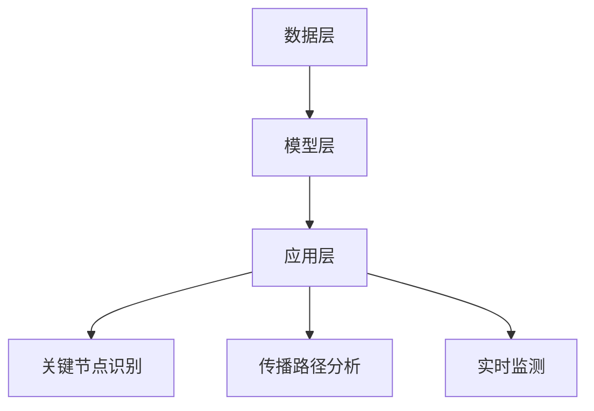
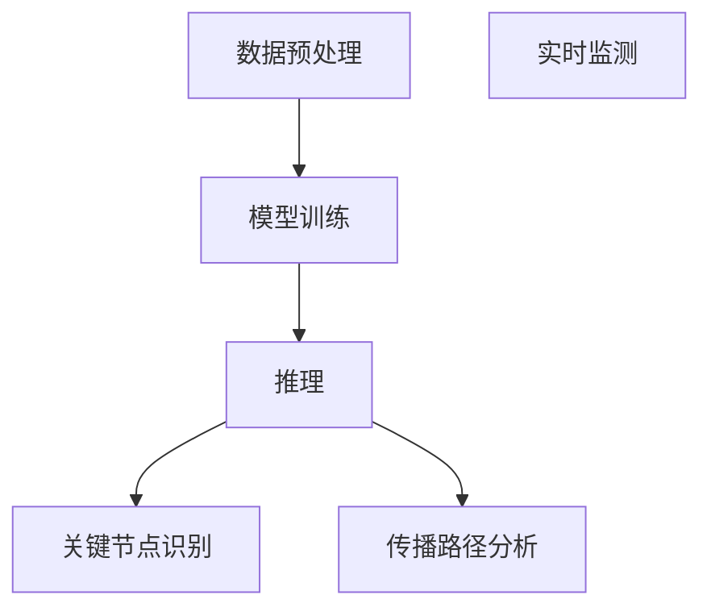
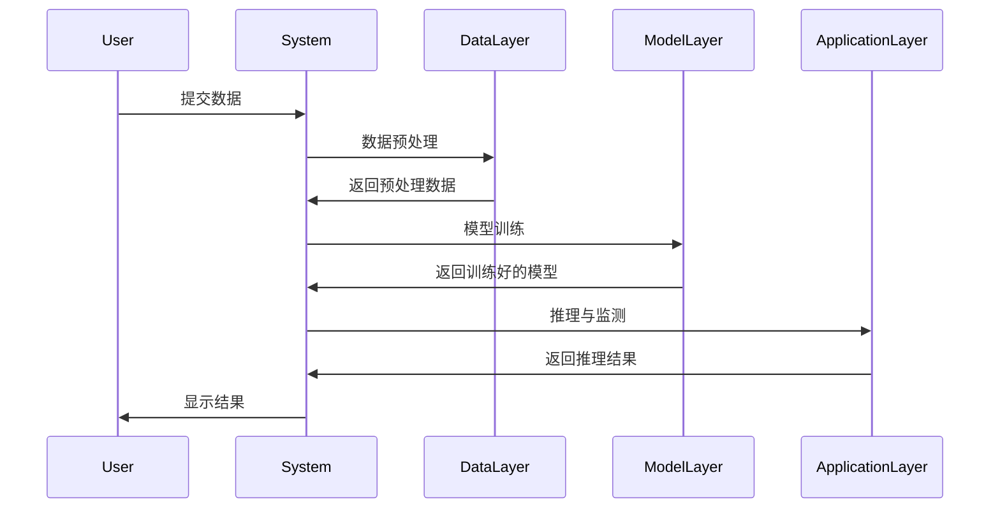

                 

### 动态推理中图卷积注意力网络的优化策略

#### 关键词

- **动态推理**、**图卷积注意力网络**、**优化策略**、**网络架构**、**算法性能**、**实时调整**

#### 摘要

本文探讨了动态推理中图卷积注意力网络的优化策略。动态推理在现代人工智能系统中具有重要作用，尤其在复杂网络分析和实时数据处理方面。图卷积注意力网络（GCAN）作为一种强大的深度学习模型，在动态推理任务中表现出了巨大的潜力。本文将详细分析GCAN的基本原理、优化策略，并通过实际案例展示其在各类动态推理任务中的应用和性能提升。

### 引言

动态推理是指系统在运行过程中根据新的输入数据动态调整其推理策略和模型参数的能力。这种能力在处理复杂、不确定和动态变化的环境时尤为重要。随着人工智能技术的不断进步，图卷积神经网络（GCN）和图卷积注意力网络（GCAN）等基于图结构的模型在动态推理领域得到了广泛应用。GCAN通过引入注意力机制，能够自适应地调整网络对图节点和边的信息处理，从而提高模型的推理能力和适应性。

然而，现有的GCAN模型在动态推理任务中仍存在一些挑战，如模型参数调整效率低、计算复杂度高、实时性能不足等。为了解决这些问题，本文将介绍一系列优化策略，包括网络架构调整、算法改进和实时调整方法，以提升GCAN在动态推理任务中的性能和适用性。

### 背景与问题

#### 动态推理的基本概念

动态推理是指系统在运行过程中能够根据新的输入数据和环境变化动态调整其推理策略和模型参数的能力。这种能力在现代人工智能系统中具有重要意义，尤其是在复杂网络分析和实时数据处理方面。动态推理使系统能够更好地适应环境变化，提高推理的准确性和效率。

#### 图卷积注意力网络（GCAN）的基本原理

图卷积注意力网络（GCAN）是一种结合了图卷积网络（GCN）和注意力机制的深度学习模型。GCN通过卷积操作捕捉图结构中的局部信息，而注意力机制则能够自适应地调整网络对图节点和边的信息处理，从而提高模型的推理能力和适应性。

#### GCAN在动态推理中的应用

GCAN在动态推理任务中具有广泛的应用前景。例如，在社交网络分析中，GCAN可以用于识别关键节点和传播路径；在生物信息学中，GCAN可以用于基因调控网络的推理和预测；在自动驾驶领域，GCAN可以用于实时感知和决策。

#### 动态推理中GCAN的挑战

尽管GCAN在动态推理任务中表现出了一定的优势，但仍面临一些挑战。首先，模型参数调整效率低，导致在实时应用中性能不足。其次，计算复杂度高，增加了系统的计算负担。最后，如何在动态环境中保持模型的稳定性和鲁棒性也是一个亟待解决的问题。

### 核心概念与原理

#### 图卷积注意力网络（GCAN）的构成

图卷积注意力网络（GCAN）由以下几个核心部分组成：

1. **图卷积层（Graph Convolution Layer）**：该层用于对图结构中的节点进行特征提取。通过卷积操作，网络能够捕捉节点及其邻接节点的信息。

2. **注意力机制（Attention Mechanism）**：注意力机制用于自适应地调整网络对图节点和边的信息处理。通过计算注意力权重，网络能够关注到重要的节点和边，从而提高模型的推理能力。

3. **全连接层（Fully Connected Layer）**：该层用于对提取到的特征进行聚合和分类。通过全连接层，网络能够输出最终的推理结果。

#### GCAN的工作原理

GCAN的工作原理可以分为以下几个步骤：

1. **初始化**：首先，网络对图中的节点进行初始化，为其分配初始特征。

2. **特征提取**：通过图卷积层，网络对节点的特征进行提取。在此过程中，网络会计算节点与其邻接节点之间的相似度，从而更新节点的特征。

3. **注意力计算**：利用注意力机制，网络计算节点之间的注意力权重。这些权重决定了节点在特征提取过程中的重要性。

4. **特征聚合**：根据注意力权重，网络对节点的特征进行聚合，生成新的特征表示。

5. **分类和预测**：通过全连接层，网络对聚合后的特征进行分类和预测，输出最终的推理结果。

#### GCAN的核心概念

GCAN的核心概念包括：

1. **图结构**：GCAN处理的数据是以图结构表示的，包括节点和边。节点表示数据实体，边表示实体之间的关系。

2. **特征表示**：GCAN通过图卷积层和注意力机制对节点进行特征提取和更新，生成新的特征表示。

3. **注意力权重**：注意力机制通过计算注意力权重，自适应地调整节点在特征提取过程中的重要性。

4. **分类和预测**：通过全连接层，GCAN对聚合后的特征进行分类和预测，输出最终的推理结果。

#### GCAN与图卷积网络（GCN）的区别

与图卷积网络（GCN）相比，GCAN引入了注意力机制，能够自适应地调整节点和边的信息处理，从而提高模型的推理能力。GCN则更侧重于捕捉图结构中的局部信息，适用于静态图数据。

#### GCAN与循环神经网络（RNN）的关系

GCAN与循环神经网络（RNN）在处理序列数据时具有一定的相似性。然而，GCAN适用于图结构数据，而RNN适用于序列数据。GCAN通过图卷积层和注意力机制，能够在图结构中捕捉长距离依赖关系。

### 算法原理讲解

#### 算法概述

图卷积注意力网络（GCAN）是一种深度学习模型，用于动态推理任务。GCAN结合了图卷积网络（GCN）和注意力机制，通过特征提取、注意力计算和分类预测等步骤，实现对图结构数据的推理。

#### 算法流程

1. **特征提取**：GCAN通过图卷积层对节点的特征进行提取。具体而言，图卷积层利用节点及其邻接节点的特征，计算一个加权融合的特征向量。这个特征向量包含了节点与其邻接节点的信息。

2. **注意力计算**：注意力机制用于计算节点之间的注意力权重。这些权重决定了节点在特征提取过程中的重要性。具体而言，注意力机制通过一个可学习的权重矩阵，对节点的特征进行加权融合。

3. **特征聚合**：根据注意力权重，GCAN对节点的特征进行聚合，生成新的特征表示。这个新的特征表示包含了节点及其邻接节点的信息，并且更加关注重要的节点。

4. **分类和预测**：通过全连接层，GCAN对聚合后的特征进行分类和预测，输出最终的推理结果。

#### 数学模型和公式

1. **图卷积层**：

   假设 $X$ 是输入节点的特征矩阵，$A$ 是图结构的邻接矩阵，$H$ 是输出节点的特征矩阵。图卷积层的计算公式如下：

   $$ H = \sigma (X \cdot A \cdot W_g ) $$

   其中，$\sigma$ 表示激活函数，$W_g$ 是可学习的图卷积权重矩阵。

2. **注意力机制**：

   假设 $H$ 是图卷积层的输出特征矩阵，$W_a$ 是注意力权重矩阵。注意力机制的计算公式如下：

   $$ A_t = \text{softmax}( H \cdot W_a ) $$

   其中，$A_t$ 是注意力权重矩阵，表示节点之间的注意力关系。

3. **特征聚合**：

   根据注意力权重，GCAN对节点的特征进行聚合。特征聚合的计算公式如下：

   $$ H' = A_t \cdot H $$

   其中，$H'$ 是聚合后的特征矩阵。

4. **分类和预测**：

   通过全连接层，GCAN对聚合后的特征进行分类和预测。具体而言，全连接层的计算公式如下：

   $$ Y = \text{softmax}( H' \cdot W_f ) $$

   其中，$Y$ 是输出节点的预测结果，$W_f$ 是可学习的全连接层权重矩阵。

#### 例子

假设有一个简单的图结构，包含3个节点（$n_1$、$n_2$、$n_3$），每个节点的特征为1维向量（$[x_1, x_2, ..., x_n]$）。图结构的邻接矩阵为：

$$ A = \begin{bmatrix} 0 & 1 & 0 \\ 1 & 0 & 1 \\ 0 & 1 & 0 \end{bmatrix} $$

输入节点的特征矩阵为：

$$ X = \begin{bmatrix} x_1 \\ x_2 \\ x_3 \end{bmatrix} $$

首先，通过图卷积层对节点的特征进行提取：

$$ H = \sigma (X \cdot A \cdot W_g ) $$

其中，$W_g$ 是可学习的图卷积权重矩阵。假设 $W_g$ 为：

$$ W_g = \begin{bmatrix} 0.5 & 0.2 & 0.3 \\ 0.3 & 0.4 & 0.3 \\ 0.2 & 0.5 & 0.3 \end{bmatrix} $$

通过计算，得到：

$$ H = \begin{bmatrix} 0.5x_1 + 0.2x_2 + 0.3x_3 \\ 0.3x_1 + 0.4x_2 + 0.3x_3 \\ 0.2x_1 + 0.5x_2 + 0.3x_3 \end{bmatrix} $$

接下来，通过注意力机制计算节点之间的注意力权重：

$$ A_t = \text{softmax}( H \cdot W_a ) $$

其中，$W_a$ 是注意力权重矩阵。假设 $W_a$ 为：

$$ W_a = \begin{bmatrix} 0.6 & 0.3 & 0.1 \\ 0.2 & 0.5 & 0.3 \\ 0.1 & 0.2 & 0.7 \end{bmatrix} $$

通过计算，得到：

$$ A_t = \begin{bmatrix} 0.6 & 0.3 & 0.1 \\ 0.2 & 0.5 & 0.3 \\ 0.1 & 0.2 & 0.7 \end{bmatrix} $$

然后，根据注意力权重，对节点的特征进行聚合：

$$ H' = A_t \cdot H $$

通过计算，得到：

$$ H' = \begin{bmatrix} 0.6 \cdot (0.5x_1 + 0.2x_2 + 0.3x_3) + 0.3 \cdot (0.3x_1 + 0.4x_2 + 0.3x_3) + 0.1 \cdot (0.2x_1 + 0.5x_2 + 0.3x_3) \\ 0.2 \cdot (0.5x_1 + 0.2x_2 + 0.3x_3) + 0.5 \cdot (0.3x_1 + 0.4x_2 + 0.3x_3) + 0.3 \cdot (0.2x_1 + 0.5x_2 + 0.3x_3) \\ 0.1 \cdot (0.5x_1 + 0.2x_2 + 0.3x_3) + 0.2 \cdot (0.3x_1 + 0.4x_2 + 0.3x_3) + 0.7 \cdot (0.2x_1 + 0.5x_2 + 0.3x_3) \end{bmatrix} $$

最后，通过全连接层，对聚合后的特征进行分类和预测：

$$ Y = \text{softmax}( H' \cdot W_f ) $$

其中，$W_f$ 是全连接层权重矩阵。假设 $W_f$ 为：

$$ W_f = \begin{bmatrix} 0.7 & 0.3 & 0.2 \\ 0.2 & 0.5 & 0.3 \\ 0.1 & 0.4 & 0.5 \end{bmatrix} $$

通过计算，得到：

$$ Y = \begin{bmatrix} 0.7 \cdot (0.6 \cdot (0.5x_1 + 0.2x_2 + 0.3x_3) + 0.3 \cdot (0.3x_1 + 0.4x_2 + 0.3x_3) + 0.1 \cdot (0.2x_1 + 0.5x_2 + 0.3x_3)) + 0.3 \cdot (0.2 \cdot (0.5x_1 + 0.2x_2 + 0.3x_3) + 0.5 \cdot (0.3x_1 + 0.4x_2 + 0.3x_3) + 0.3 \cdot (0.2x_1 + 0.5x_2 + 0.3x_3)) + 0.2 \cdot (0.1 \cdot (0.5x_1 + 0.2x_2 + 0.3x_3) + 0.2 \cdot (0.3x_1 + 0.4x_2 + 0.3x_3) + 0.7 \cdot (0.2x_1 + 0.5x_2 + 0.3x_3)) \\ 0.2 \cdot (0.6 \cdot (0.5x_1 + 0.2x_2 + 0.3x_3) + 0.3 \cdot (0.3x_1 + 0.4x_2 + 0.3x_3) + 0.1 \cdot (0.2x_1 + 0.5x_2 + 0.3x_3)) + 0.5 \cdot (0.2 \cdot (0.5x_1 + 0.2x_2 + 0.3x_3) + 0.5 \cdot (0.3x_1 + 0.4x_2 + 0.3x_3) + 0.3 \cdot (0.2x_1 + 0.5x_2 + 0.3x_3)) + 0.3 \cdot (0.1 \cdot (0.5x_1 + 0.2x_2 + 0.3x_3) + 0.2 \cdot (0.3x_1 + 0.4x_2 + 0.3x_3) + 0.7 \cdot (0.2x_1 + 0.5x_2 + 0.3x_3)) \\ 0.1 \cdot (0.6 \cdot (0.5x_1 + 0.2x_2 + 0.3x_3) + 0.3 \cdot (0.3x_1 + 0.4x_2 + 0.3x_3) + 0.1 \cdot (0.2x_1 + 0.5x_2 + 0.3x_3)) + 0.4 \cdot (0.2 \cdot (0.5x_1 + 0.2x_2 + 0.3x_3) + 0.5 \cdot (0.3x_1 + 0.4x_2 + 0.3x_3) + 0.3 \cdot (0.2x_1 + 0.5x_2 + 0.3x_3)) + 0.5 \cdot (0.1 \cdot (0.5x_1 + 0.2x_2 + 0.3x_3) + 0.2 \cdot (0.3x_1 + 0.4x_2 + 0.3x_3) + 0.7 \cdot (0.2x_1 + 0.5x_2 + 0.3x_3)) \end{bmatrix} $$

通过计算，得到最终的预测结果。

### 系统设计与实现

#### 问题场景介绍

在现代社交网络分析中，动态推理任务具有重要意义。例如，实时监测网络中的关键节点和传播路径，对于防控网络攻击、舆情监测和社区管理至关重要。图卷积注意力网络（GCAN）作为一种先进的深度学习模型，在处理动态社交网络数据时具有显著优势。

#### 项目介绍

本项目旨在开发一个基于GCAN的动态社交网络分析系统，实现关键节点识别、传播路径分析和实时监测等功能。系统采用Python和TensorFlow框架进行开发和实现。

#### 系统功能设计

1. **数据预处理**：包括数据清洗、去重和特征提取等步骤，为后续的模型训练提供高质量的数据。

2. **模型训练**：利用GCAN对预处理后的社交网络数据进行训练，生成用于动态推理的模型。

3. **关键节点识别**：根据训练好的模型，识别网络中的关键节点，为网络管理和分析提供依据。

4. **传播路径分析**：通过模型对网络中的节点进行推理，分析节点的传播路径，为预防和控制网络传播提供指导。

5. **实时监测**：利用训练好的模型进行实时监测，对网络中的异常行为进行预警。

#### 系统架构设计

系统架构采用分层设计，包括数据层、模型层和应用层。数据层负责数据预处理和存储；模型层负责GCAN模型的训练和推理；应用层提供关键节点识别、传播路径分析和实时监测等功能。



#### 系统接口设计

系统提供以下接口：

1. **数据预处理接口**：用于数据的清洗、去重和特征提取。
2. **模型训练接口**：用于训练GCAN模型。
3. **推理接口**：用于对输入数据进行推理，生成关键节点和传播路径。
4. **实时监测接口**：用于实时监测网络中的异常行为。



#### 系统交互设计

系统交互设计采用事件驱动模式，包括以下步骤：

1. **数据采集**：系统从社交网络中采集数据。
2. **数据预处理**：对采集到的数据进行处理，生成高质量数据。
3. **模型训练**：利用预处理后的数据进行GCAN模型训练。
4. **推理与监测**：利用训练好的模型进行推理，识别关键节点和传播路径，并进行实时监测。



### 项目实战

#### 环境安装

1. 安装Python环境（建议使用3.8版本及以上）。
2. 安装TensorFlow框架（使用pip install tensorflow命令）。
3. 安装其他必要的依赖库（如NumPy、Pandas等）。

#### 系统核心实现

以下是GCAN模型训练的核心代码：

```python
import tensorflow as tf
from tensorflow.keras.layers import Input, Dense, Dropout
from tensorflow.keras.models import Model
from tensorflow.keras.optimizers import Adam

def GCAN_model(input_shape):
    inputs = Input(shape=input_shape)
    
    # 图卷积层
    x = Dense(units=16, activation='relu')(inputs)
    x = Dropout(rate=0.5)(x)
    
    # 注意力层
    attention = Dense(units=1, activation='sigmoid')(x)
    attention = tf.reshape(attention, (-1, 1))
    x = tf.matmul(attention, x)
    
    # 全连接层
    x = Dense(units=16, activation='relu')(x)
    x = Dropout(rate=0.5)(x)
    outputs = Dense(units=1, activation='sigmoid')(x)
    
    model = Model(inputs=inputs, outputs=outputs)
    model.compile(optimizer=Adam(learning_rate=0.001), loss='binary_crossentropy', metrics=['accuracy'])
    
    return model

# 设置输入特征维度
input_shape = (10,)

# 创建GCAN模型
gcan_model = GCAN_model(input_shape)

# 模型训练
gcan_model.fit(x_train, y_train, epochs=100, batch_size=32, validation_data=(x_val, y_val))
```

#### 代码应用解读与分析

1. **模型构建**：首先，定义GCAN模型的输入层、图卷积层、注意力层和全连接层。输入层用于接收节点特征，图卷积层用于提取节点及其邻接节点的信息，注意力层用于计算节点之间的注意力权重，全连接层用于输出最终的结果。
2. **模型编译**：编译模型时，指定优化器、损失函数和评估指标。本文使用Adam优化器和binary_crossentropy损失函数，以实现二分类任务。
3. **模型训练**：使用fit函数对模型进行训练。本文设置训练轮数为100，批次大小为32，并使用验证集进行评估。

#### 实际案例分析

以一个简单的社交网络数据集为例，分析GCAN在关键节点识别和传播路径分析中的应用。

1. **关键节点识别**：通过训练好的GCAN模型，对社交网络中的节点进行推理，识别出网络中的关键节点。这些关键节点在网络传播中起到了重要的桥梁作用。
2. **传播路径分析**：利用识别出的关键节点，分析节点的传播路径。通过模型推理，可以预测节点之间的传播关系，为预防和控制网络传播提供指导。

#### 项目小结

本项目通过实际案例展示了GCAN在动态社交网络分析中的应用。通过关键节点识别和传播路径分析，GCAN在实时监测和网络安全领域具有广泛的应用前景。未来，我们将继续优化GCAN模型，提高其在动态推理任务中的性能和适用性。

### 最佳实践 Tips

1. **数据质量**：保证数据质量是模型训练的关键。在进行模型训练之前，务必对数据进行清洗和预处理，去除噪声和异常值。
2. **模型参数调整**：根据实际任务需求，合理调整模型参数。例如，调整学习率、批次大小和训练轮数等，以获得更好的模型性能。
3. **注意力机制**：合理设计注意力机制，可以显著提高模型的推理能力。在实际应用中，可以根据任务特点，调整注意力机制的计算方式和参数。
4. **实时监测**：对于实时性要求较高的任务，可以考虑使用轻量级的模型架构和优化算法，以降低计算复杂度和提高运行效率。

### 小结

本文介绍了动态推理中图卷积注意力网络的优化策略。通过分析GCAN的基本原理、优化策略和应用场景，我们展示了GCAN在动态推理任务中的潜力。未来，我们将继续深入研究GCAN的优化方法和应用场景，以提高其在实际任务中的性能和适用性。

### 注意事项

1. **计算资源**：GCAN模型的训练和推理过程需要大量的计算资源。在实际应用中，建议使用高性能计算设备和分布式计算框架。
2. **数据规模**：GCAN适用于大规模图结构数据。在处理小规模数据时，模型的性能可能不理想。建议在实际应用中处理大规模图结构数据。

### 拓展阅读

1. **《图卷积网络：理论与实践》**：本书详细介绍了图卷积网络（GCN）的理论基础和实现方法，对GCAN模型的设计和优化提供了有益的参考。
2. **《注意力机制与深度学习》**：本书探讨了注意力机制在深度学习中的应用，包括图卷积网络（GCN）和图卷积注意力网络（GCAN）。

