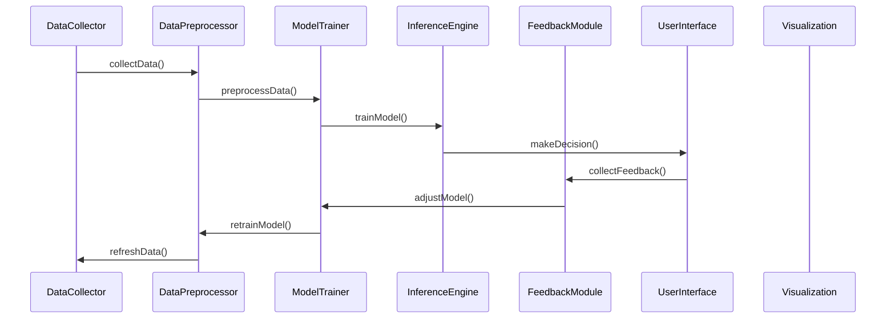

                 

### 第1章：动态推理任务适应中持续学习的背景与重要性

#### **1.1 问题背景**

在现代信息技术快速发展的背景下，人工智能（AI）的应用已经深入到各个领域。然而，面对动态变化的环境，传统的AI系统往往难以适应。动态推理任务（Dynamic Reasoning Tasks）是一种在动态环境中进行推理和决策的任务，它要求系统能够实时地处理新的信息和变化，以做出合理的决策。然而，这些任务的复杂性使得传统的静态学习方法难以应对。

持续学习（Continuous Learning）是解决动态推理任务中面临挑战的一种策略。持续学习旨在让AI系统能够在运行过程中不断地学习和适应新的环境，从而提高系统的鲁棒性和适应性。然而，实现有效的持续学习并不容易，因为动态推理任务通常伴随着大量的噪声、不确定性以及数据缺失等问题。

#### **1.2 持续学习的定义与分类**

持续学习是一种使AI系统能够在运行过程中不断学习和适应的方法。根据学习的目的和方式，持续学习可以分为以下几种类型：

- **基于监督的学习**：系统通过不断接收新的训练数据进行学习，通常需要外部标注。
- **基于无监督的学习**：系统通过自身探索和发现数据中的模式进行学习，不需要外部标注。
- **半监督学习**：结合监督学习和无监督学习，利用少量标注数据和大量未标注数据进行学习。
- **迁移学习**：将已在一个任务上学到的知识迁移到另一个相关任务中。

#### **1.3 动态推理任务与持续学习的联系**

动态推理任务通常需要系统具备实时推理和决策的能力，这使得持续学习成为必要。持续学习在动态推理任务中的作用主要体现在以下几个方面：

1. **环境适应**：动态推理任务要求系统能够适应不断变化的环境，持续学习使得系统能够通过实时学习新的环境和数据，提高其适应能力。
2. **噪声过滤**：在动态环境中，噪声和不确定性是不可避免的。持续学习通过不断地调整模型参数，可以减少噪声对推理结果的影响。
3. **数据增强**：通过持续学习，系统能够从新的数据中学习到更多的信息，增强其推理能力。

#### **1.4 创新策略对动态推理任务的影响**

创新策略在动态推理任务中的应用可以显著提升系统的性能和鲁棒性。创新策略包括但不限于以下几种：

- **元学习**：通过元学习，系统能够快速适应新的任务，减少对大量训练数据的依赖。
- **增量学习**：增量学习允许系统在已有模型的基础上进行微调，从而减少重新训练的需要。
- **对抗性学习**：通过对抗性学习，系统可以更好地应对动态环境中的欺骗性样本。

创新策略不仅提高了持续学习的效率，也增强了系统在动态推理任务中的表现。

#### **总结**

本章首先介绍了动态推理任务适应中持续学习的背景，阐述了持续学习在动态推理任务中的重要性。随后，我们对持续学习的定义和分类进行了探讨，分析了动态推理任务与持续学习之间的联系。最后，我们简要介绍了创新策略在动态推理任务中的应用。这些内容为后续章节的深入探讨奠定了基础。接下来，我们将进一步探讨核心概念之间的联系，以及相关的算法原理和数学模型。

### 第2章：核心概念与联系

在深入探讨动态推理任务和持续学习之前，我们首先需要明确这些核心概念的定义、属性以及它们之间的联系。本章将详细介绍动态推理任务和持续学习的概念，并分析它们在技术架构和实际应用中的关系。

#### **2.1 动态推理任务的概念**

**定义与特点**

动态推理任务指的是在不确定或部分未知的环境中，系统根据当前的状态和先前的经验，实时地做出决策或推理的过程。与传统的静态推理任务不同，动态推理任务通常需要处理如下特点：

- **环境变化**：动态环境中的状态是不断变化的，系统必须能够实时响应这些变化。
- **不确定性**：动态推理任务面临不确定性和噪声，例如数据缺失、噪声干扰等。
- **实时性**：系统需要在短时间内完成推理和决策，以满足实时应用的需求。

**动态推理任务的类型**

根据动态推理任务的性质和特点，可以将其分为以下几类：

- **实时推理**：系统在动态环境中实时接收新的数据，并迅速做出推理和决策。
- **在线学习**：系统在运行过程中，通过持续学习新数据来改进推理和决策能力。
- **决策支持系统**：在动态环境中提供决策支持，帮助用户做出合理的决策。

**动态推理任务的核心挑战**

- **数据多样性**：动态环境中的数据可能具有多样性，系统需要能够处理不同类型的数据。
- **实时响应**：系统需要在短时间内完成推理和决策，这对系统的计算性能提出了高要求。
- **鲁棒性**：系统需要在存在噪声和不确定性的环境中保持稳定和可靠的推理能力。

#### **2.2 持续学习原理与模型**

**持续学习的理论基础**

持续学习是指系统在运行过程中，不断从新的数据中学习，以改进其性能的过程。持续学习的理论基础包括：

- **机器学习理论**：持续学习是机器学习的一个分支，它通过不断更新模型参数来提高系统的性能。
- **自适应控制理论**：持续学习借鉴了自适应控制理论中的反馈机制，通过实时调整模型来适应环境变化。

**持续学习的主要模型**

持续学习模型可以分为以下几类：

- **基于监督的学习**：系统通过不断接收新的训练数据进行学习，通常需要外部标注。
- **基于无监督的学习**：系统通过自身探索和发现数据中的模式进行学习，不需要外部标注。
- **半监督学习**：结合监督学习和无监督学习，利用少量标注数据和大量未标注数据进行学习。
- **迁移学习**：将已在一个任务上学到的知识迁移到另一个相关任务中。

**持续学习模型的优缺点对比**

不同类型的持续学习模型各有优缺点，以下是一些常见的优缺点对比：

- **基于监督的学习**：优点是学习速度快，缺点是需要大量的标注数据。
- **基于无监督的学习**：优点是不需要标注数据，缺点是学习效果可能不如监督学习。
- **半监督学习**：优点是利用未标注数据，缺点是学习效果通常介于监督学习和无监督学习之间。
- **迁移学习**：优点是能够快速适应新任务，缺点是需要找到合适的目标任务。

#### **2.3 创新策略在动态推理任务中的应用**

**创新策略的定义与分类**

创新策略是指在动态推理任务中，为了提高系统的适应性和性能，采用的新型方法和技巧。创新策略可以分为以下几类：

- **元学习**：通过元学习，系统可以快速适应新的任务，减少对大量训练数据的依赖。
- **增量学习**：增量学习允许系统在已有模型的基础上进行微调，从而减少重新训练的需要。
- **对抗性学习**：通过对抗性学习，系统可以更好地应对动态环境中的欺骗性样本。

**创新策略在动态推理任务中的实现**

创新策略在动态推理任务中的实现通常包括以下步骤：

1. **模型初始化**：初始化动态推理模型，为后续的学习和调整提供基础。
2. **数据收集**：收集动态环境中的数据，包括实时数据和历史数据。
3. **模型训练**：使用收集到的数据对模型进行训练，不断调整模型参数。
4. **模型评估**：通过评估模型在动态环境中的性能，调整模型结构和参数。
5. **模型部署**：将训练好的模型部署到实际应用中，实现动态推理任务。

**创新策略对动态推理任务效果的影响**

创新策略显著提高了动态推理任务的性能和鲁棒性。例如，元学习可以快速适应新任务，减少重新训练的需求；增量学习可以减少模型训练的时间和计算资源；对抗性学习可以增强系统对欺骗性样本的抵抗力。

#### **总结**

本章详细介绍了动态推理任务和持续学习的核心概念，分析了它们之间的联系。通过定义和分类动态推理任务，我们了解了其特点和挑战。持续学习的原理和模型为我们提供了理解和实现动态推理任务的基础。此外，我们探讨了创新策略在动态推理任务中的应用，展示了它们如何提升系统的适应性和性能。这些内容为下一章的算法原理讲解和数学模型分析奠定了坚实的基础。在接下来的章节中，我们将进一步深入探讨这些核心概念的具体实现和应用。

#### **2.1 动态推理任务的概念**

**定义与特点**

动态推理任务是指在实时、变化多端的环境中，通过推理机制对不断变化的信息进行处理和决策的任务。与传统的静态推理任务相比，动态推理任务具有以下几个显著特点：

1. **实时性**：动态推理任务要求系统能够快速响应输入数据，并在短时间内完成推理和决策。这通常意味着任务必须在毫秒级或更短的时间内完成，以满足实时应用的需求。
2. **不确定性**：在动态环境中，系统经常面临不确定性和噪声，例如数据缺失、噪声干扰、异常值等。这些不确定性增加了推理的复杂性和难度。
3. **环境动态变化**：动态推理任务要求系统能够适应不断变化的环境。环境的变化可能来自于外部事件、系统内部状态的变化，或者数据分布的改变。

**动态推理任务的类型**

动态推理任务可以根据其特点和应用场景进行分类。以下是一些常见的动态推理任务类型：

1. **实时决策支持**：这类任务通常用于需要快速决策的应用场景，如自动驾驶、智能监控、实时金融交易等。系统需要实时分析传感器数据或交易数据，并在短时间内做出决策。
2. **自适应控制**：在自动化控制系统（如无人机、机器人、工业自动化设备）中，系统需要根据环境变化和设备状态进行实时调整。动态推理任务帮助这些系统实现自适应控制和优化操作。
3. **知识推理**：在知识图谱、语义搜索、自然语言处理等领域，动态推理任务用于处理实时获取的信息，构建和更新知识图谱，或进行语义分析。
4. **智能推荐**：动态推理任务在智能推荐系统中扮演重要角色，系统需要实时分析用户行为和偏好，推荐个性化内容。

**动态推理任务的核心挑战**

动态推理任务面临的核心挑战包括：

1. **数据处理**：动态环境中数据量大且复杂，系统需要高效地处理和存储这些数据，以便进行快速的推理和决策。
2. **实时性**：动态推理任务需要在短时间内处理数据并做出决策，这对系统的计算性能提出了高要求。
3. **不确定性处理**：系统需要能够处理动态环境中的不确定性和噪声，确保推理结果的准确性和鲁棒性。
4. **持续学习**：动态推理任务需要系统能够持续学习和适应新环境和数据，以保持其推理能力。

#### **2.2 持续学习原理与模型**

**持续学习的理论基础**

持续学习（Continuous Learning）是指系统在运行过程中，不断地从新数据中学习，以改进其性能和适应能力。持续学习的理论基础包括以下几个关键点：

1. **在线学习**：系统通过在线学习不断更新模型参数，以适应新的数据和环境变化。
2. **增量学习**：系统通过增量学习，在不重新训练整个模型的情况下，对现有模型进行微调。
3. **迁移学习**：系统通过迁移学习，将已在一个任务上学到的知识应用于新的相关任务中，从而提高学习效率。
4. **元学习**：系统通过元学习，快速适应新的任务和学习场景。

**持续学习的主要模型**

持续学习模型可以根据学习方式和目标进行分类，以下是一些主要的持续学习模型：

1. **基于监督的学习**：系统通过不断接收新的训练数据进行学习，这些数据通常由外部标注提供。这种模型的主要优点是学习速度快，但需要大量的标注数据。
2. **基于无监督的学习**：系统通过自身探索和发现数据中的模式进行学习，不需要外部标注。这种模型的主要优点是不依赖于标注数据，但学习效果可能不如监督学习。
3. **半监督学习**：系统结合监督学习和无监督学习，利用少量标注数据和大量未标注数据进行学习。这种模型可以充分利用未标注数据，提高学习效果。
4. **迁移学习**：系统将已在一个任务上学到的知识迁移到另一个相关任务中。这种模型的主要优点是能够快速适应新任务，减少重新训练的需求。

**持续学习模型的优缺点对比**

以下是不同类型持续学习模型的优缺点对比：

- **基于监督的学习**：
  - 优点：学习速度快，预测准确率高。
  - 缺点：需要大量的标注数据，数据获取成本高。
- **基于无监督的学习**：
  - 优点：不需要标注数据，能够发现潜在的模式和结构。
  - 缺点：学习效果可能不如监督学习，对噪声敏感。
- **半监督学习**：
  - 优点：充分利用未标注数据，提高学习效果。
  - 缺点：学习效果通常介于监督学习和无监督学习之间。
- **迁移学习**：
  - 优点：能够快速适应新任务，减少重新训练的需求。
  - 缺点：需要找到合适的目标任务，迁移效果受源任务和目标任务的相似性影响。

#### **2.3 创新策略在动态推理任务中的应用**

**创新策略的定义与分类**

创新策略是指为了提高动态推理任务的性能和鲁棒性，采用的新型方法和技巧。创新策略可以分为以下几类：

1. **元学习**：通过元学习，系统可以快速适应新的任务和学习场景。这种方法特别适用于动态环境中，因为系统可以迅速调整其学习策略，以适应新的挑战。
2. **增量学习**：通过增量学习，系统在不重新训练整个模型的情况下，对现有模型进行微调。这种方法可以显著减少训练时间和计算资源的需求。
3. **对抗性学习**：通过对抗性学习，系统可以增强其对抗噪声和欺骗性样本的能力。这种方法特别适用于动态环境中，因为系统需要能够处理各种复杂和不确定的情况。
4. **自适应学习**：通过自适应学习，系统可以根据环境和数据的动态变化，自动调整其学习策略。这种方法可以显著提高系统的适应性和鲁棒性。

**创新策略在动态推理任务中的实现**

创新策略在动态推理任务中的实现通常包括以下几个步骤：

1. **模型初始化**：初始化动态推理模型，为后续的学习和调整提供基础。
2. **数据收集**：收集动态环境中的数据，包括实时数据和历史数据。
3. **模型训练**：使用收集到的数据对模型进行训练，不断调整模型参数。
4. **模型评估**：通过评估模型在动态环境中的性能，调整模型结构和参数。
5. **模型部署**：将训练好的模型部署到实际应用中，实现动态推理任务。

**创新策略对动态推理任务效果的影响**

创新策略显著提高了动态推理任务的性能和鲁棒性。例如：

- **元学习**可以快速适应新的任务和学习场景，减少对大量训练数据的依赖。
- **增量学习**可以显著减少模型训练的时间和计算资源的需求。
- **对抗性学习**可以增强系统对噪声和欺骗性样本的抵抗力，提高推理结果的准确性。
- **自适应学习**可以根据环境和数据的动态变化，自动调整系统的学习策略，提高系统的适应性和鲁棒性。

通过创新策略的应用，动态推理任务在处理实时变化和不确定性方面表现出更高的性能和可靠性。这些策略不仅提高了系统的适应能力，也为动态推理任务的应用提供了新的可能性。

#### **总结**

本章详细介绍了动态推理任务和持续学习的核心概念，分析了它们在技术架构和实际应用中的关系。通过定义和分类动态推理任务，我们了解了其特点和挑战。持续学习的原理和模型为我们提供了理解和实现动态推理任务的基础。此外，我们探讨了创新策略在动态推理任务中的应用，展示了它们如何提升系统的适应性和性能。这些内容为下一章的算法原理讲解和数学模型分析奠定了坚实的基础。在接下来的章节中，我们将进一步深入探讨这些核心概念的具体实现和应用。

### 第3章：相关算法原理讲解

在了解了动态推理任务和持续学习的基本概念之后，本章将详细讲解动态推理任务中的相关算法原理，包括动态推理算法的基础、持续学习算法的原理，以及创新策略算法的具体实现。通过这些算法的讲解，我们将深入了解如何将理论知识应用于实际场景中。

#### **3.1 动态推理算法基础**

**动态推理算法的基本原理**

动态推理算法的核心在于实时处理和响应环境中的变化。这些算法通常基于如下基本原理：

1. **状态更新**：动态推理算法通过实时更新系统的状态来反映环境的变化。状态可以是传感器数据、环境参数或其他关键指标。
2. **决策规则**：基于当前状态，动态推理算法使用决策规则来指导系统的行为。这些规则可以是简单的阈值判断，也可以是复杂的逻辑推理。
3. **反馈机制**：动态推理算法通过反馈机制来评估决策的效果，并不断调整规则以优化系统的性能。

**动态推理算法的分类**

动态推理算法可以根据其处理方式和应用场景进行分类：

1. **基于规则的推理**：这种算法使用预定义的规则集来处理输入数据。当输入数据符合某个规则时，系统将执行相应的操作。这种方法的优点是易于理解和实现，但缺点是对复杂环境的不适应性。
2. **基于模型的推理**：这种算法使用数学模型来模拟环境并生成决策。模型可以是统计模型、决策树、神经网络等。基于模型的推理方法具有较强的适应性和灵活性，但实现复杂度较高。
3. **混合推理**：结合基于规则和基于模型的推理方法，这种方法可以充分利用两者的优势。例如，在简单环境中使用基于规则的推理，在复杂环境中使用基于模型的推理。

**动态推理算法的挑战与解决方案**

动态推理任务面临以下挑战：

1. **实时性**：在动态环境中，系统必须在短时间内完成推理和决策。这要求算法具有高效的处理能力。
2. **不确定性**：动态环境中存在不确定性和噪声，算法需要具备鲁棒性以应对这些挑战。

解决方案包括：

1. **并行计算**：利用并行计算技术，提高算法的实时性。例如，通过多线程或多进程处理输入数据，减少单个任务的响应时间。
2. **增量学习**：在算法中加入增量学习机制，使得系统能够在运行过程中不断优化模型参数。这种方法可以减少重新训练的需求，提高推理效率。
3. **不确定性处理**：通过概率模型或鲁棒优化方法，处理动态环境中的不确定性和噪声。这些方法可以提供更可靠的推理结果。

**动态推理算法的应用场景**

动态推理算法广泛应用于多个领域：

1. **自动驾驶**：自动驾驶系统需要实时处理传感器数据，并做出驾驶决策。动态推理算法在这里用于路径规划和避障。
2. **智能监控**：智能监控系统通过动态推理算法识别异常行为和安全威胁，实时响应该场景。
3. **工业自动化**：工业自动化系统使用动态推理算法进行实时监控和故障诊断，确保生产过程的稳定性和高效性。

#### **3.2 持续学习算法原理**

**持续学习算法的概述**

持续学习算法旨在使系统在运行过程中不断从新数据中学习，以适应环境变化和提升性能。持续学习算法的主要目的是避免模型过拟合，保持模型在动态环境中的适应性。

**主要持续学习算法**

1. **在线学习**：系统在运行过程中，不断接收新数据并更新模型参数。这种方法适用于数据量较小且变化较慢的环境。
2. **增量学习**：系统在已有模型的基础上进行微调，以适应新数据。这种方法可以显著减少训练时间和计算资源的需求。
3. **迁移学习**：系统将已在一个任务上学到的知识迁移到另一个相关任务中。这种方法适用于多个任务之间具有相似性或重叠性。
4. **元学习**：系统通过学习如何学习，快速适应新的任务和学习场景。这种方法适用于任务多变且学习效率要求高的场景。

**持续学习算法的比较与选择**

不同类型的持续学习算法各有优缺点，选择合适的算法需要考虑以下因素：

1. **数据量**：对于数据量较小的情况，可以选择在线学习或增量学习；对于数据量较大的情况，可以考虑迁移学习或元学习。
2. **任务类型**：对于单一任务，可以选择在线学习或增量学习；对于多任务或跨领域任务，可以选择迁移学习或元学习。
3. **环境变化速度**：对于环境变化较慢的任务，可以选择在线学习或增量学习；对于环境变化较快的任务，可以选择元学习。
4. **计算资源**：对于计算资源有限的情况，可以选择增量学习或迁移学习；对于计算资源充足的情况，可以选择在线学习或元学习。

#### **3.3 创新策略算法讲解**

**创新策略算法的设计原则**

创新策略算法旨在提高动态推理任务的性能和鲁棒性。其设计原则包括：

1. **快速适应**：算法需要能够快速适应新的环境和数据，减少对大量训练数据的依赖。
2. **高效学习**：算法需要具备高效的学习能力，能够在有限的时间内完成模型更新。
3. **鲁棒性**：算法需要能够处理动态环境中的不确定性和噪声，保持推理结果的准确性。
4. **可扩展性**：算法需要具备良好的可扩展性，能够适应不同的任务和应用场景。

**创新策略算法的实现方法**

创新策略算法的实现通常包括以下几个步骤：

1. **模型初始化**：初始化动态推理模型，为后续的学习和调整提供基础。
2. **数据收集**：收集动态环境中的数据，包括实时数据和历史数据。
3. **模型训练**：使用收集到的数据对模型进行训练，不断调整模型参数。
4. **模型评估**：通过评估模型在动态环境中的性能，调整模型结构和参数。
5. **模型部署**：将训练好的模型部署到实际应用中，实现动态推理任务。

**创新策略算法的性能评估**

创新策略算法的性能评估通常包括以下几个方面：

1. **推理速度**：算法需要能够在规定的时间内完成推理和决策，以满足实时应用的需求。
2. **推理准确性**：算法的推理结果需要具有较高的准确性，确保在动态环境中做出正确的决策。
3. **鲁棒性**：算法需要能够处理动态环境中的不确定性和噪声，保持推理结果的稳定性。
4. **资源消耗**：算法的资源消耗需要合理，确保在有限的计算资源下实现高效的学习和推理。

**创新策略算法在动态推理任务中的应用**

创新策略算法在动态推理任务中的应用可以显著提升系统的性能和鲁棒性。以下是一些应用案例：

1. **自动驾驶**：通过元学习算法，自动驾驶系统可以快速适应不同的道路和交通环境，提高行驶安全性。
2. **智能监控**：通过增量学习算法，智能监控系统可以实时更新模型，识别新的异常行为，提高监控效果。
3. **工业自动化**：通过对抗性学习算法，工业自动化系统可以增强对异常状况的检测和应对能力，提高生产效率。

#### **总结**

本章详细介绍了动态推理任务中的相关算法原理，包括动态推理算法的基础、持续学习算法的原理以及创新策略算法的具体实现。通过这些算法的讲解，我们了解了动态推理任务在实时响应和不确定性处理方面的核心挑战，并探讨了如何通过持续学习和创新策略来提升系统的性能和鲁棒性。这些算法和策略为动态推理任务的实际应用提供了重要的理论依据和技术支持。在接下来的章节中，我们将进一步探讨动态推理任务适应中持续学习的数学模型和系统架构设计。

### 第4章：数学模型和数学公式讲解

在动态推理任务适应中，数学模型和公式扮演着至关重要的角色。本章将详细阐述动态推理任务适应中持续学习的数学模型，使用LaTeX格式给出关键公式，并解释这些公式背后的数学原理，以便读者能够更好地理解和应用。

#### **4.1 动态推理任务的数学模型**

动态推理任务通常涉及状态空间模型、决策模型和优化模型。以下分别介绍这些模型及其数学表达。

**状态空间模型**

状态空间模型描述系统在动态环境中的状态变化。通常使用马尔可夫决策过程（MDP）来建模：

$$
\begin{aligned}
    S &= \{s_1, s_2, \ldots, s_n\}, & \text{状态集} \\
    A &= \{a_1, a_2, \ldots, a_m\}, & \text{动作集} \\
    P(s'|s,a) &= \text{状态转移概率} \\
    R(s,a) &= \text{立即奖励} \\
    \gamma &= \text{折扣因子}
\end{aligned}
$$

**决策模型**

动态推理任务中的决策模型通常基于值函数或策略。值函数表示在给定状态下采取最优动作的期望收益：

$$
V^*(s) = \max_a \sum_{s'} P(s'|s,a) [R(s,a) + \gamma V^*(s')]
$$

策略表示在给定状态下的最优动作选择：

$$
\pi^*(s) = \arg\max_a \sum_{s'} P(s'|s,a) [R(s,a) + \gamma V^*(s')]
$$

**优化模型**

优化模型用于最大化系统的长期收益。通常使用部分可观测马尔可夫决策过程（POMDP）来建模：

$$
\begin{aligned}
    O &= \{o_1, o_2, \ldots, o_n\}, & \text{观察集} \\
    p(o|s,a) &= \text{观察概率} \\
    J^*(\pi) &= \sum_{s \in S} \pi(s) \sum_{a \in A} \sum_{o \in O} p(o|s,a) R(s,a) + \gamma \sum_{s' \in S} V^*(s')
\end{aligned}
$$

#### **4.2 持续学习的数学模型**

持续学习模型旨在使系统在动态环境中不断适应和优化。以下介绍几种常见的持续学习模型及其数学表达。

**基于监督的学习**

基于监督的学习模型通常使用梯度下降法进行优化：

$$
\begin{aligned}
    \nabla_{\theta} J &= \frac{1}{m} \sum_{i=1}^{m} [y^{(i)} - \hat{y}^{(i)}] \cdot \frac{\partial \hat{y}^{(i)}}{\partial \theta} \\
    \theta &= \theta - \alpha \nabla_{\theta} J
\end{aligned}
$$

其中，$J$是损失函数，$\theta$是模型参数，$y^{(i)}$是真实标签，$\hat{y}^{(i)}$是预测值，$\alpha$是学习率。

**基于无监督的学习**

基于无监督的学习模型通常使用基于能量的方法进行优化：

$$
E(\theta, x) = \frac{1}{2} \sum_{i=1}^{n} \sum_{j=1}^{k} \theta_{ij} x_i x_j - \sum_{i=1}^{n} y_i \log \left( \sigma(\theta_i^T x) \right)
$$

其中，$x$是输入特征，$y$是标签，$\theta_{ij}$是模型参数，$\sigma(\cdot)$是sigmoid函数。

**半监督学习**

半监督学习模型结合了监督学习和无监督学习，通常使用图模型进行优化：

$$
\begin{aligned}
    L &= \sum_{(i,j) \in E} w_{ij} \left[ y_i - y_j - \log \left( \sigma(\theta_i^T x_j - \theta_j^T x_i) \right) \right]^2 \\
    \theta &= \arg\min_{\theta} L
\end{aligned}
$$

其中，$E$是图中的边集，$w_{ij}$是边的权重。

#### **4.3 关键公式背后的数学原理**

以上公式背后的数学原理主要包括概率论、优化理论、信息论和图论。

1. **概率论**：在状态空间模型和持续学习模型中，概率论用于描述状态转移、动作选择和观察概率。例如，马尔可夫性质表明当前状态只依赖于前一个状态，而与过去状态无关。
2. **优化理论**：梯度下降法是一种常用的优化方法，用于最小化损失函数，从而找到最佳模型参数。优化理论提供了理论依据和收敛性证明。
3. **信息论**：信息论中的熵、信息增益等概念用于度量数据的随机性和不确定性。在动态推理任务中，这些概念用于优化模型结构和决策规则。
4. **图论**：图论用于构建和表示复杂系统中的关系和网络结构。例如，在半监督学习中，图模型用于捕捉未标注数据之间的潜在关系，从而提高学习效果。

#### **4.4 公式的应用场景**

以下是几个动态推理任务中的实际应用场景：

1. **自动驾驶**：在自动驾驶中，状态空间模型用于描述车辆的状态（如位置、速度）和动作（如转向、加速）。通过优化值函数和策略，自动驾驶系统能够实时做出最优驾驶决策。
2. **智能监控**：在智能监控中，持续学习模型用于识别异常行为。通过在线学习和增量学习，监控系统可以不断适应新的异常模式。
3. **推荐系统**：在推荐系统中，半监督学习模型用于利用未标注数据（如用户行为数据）来改进推荐效果。通过图模型捕捉用户之间的相似性，推荐系统可以提供更个性化的推荐。

#### **总结**

本章详细介绍了动态推理任务适应中持续学习的数学模型，包括状态空间模型、决策模型、优化模型以及持续学习模型。使用LaTeX格式给出了关键公式，并解释了这些公式背后的数学原理。通过本章的学习，读者可以更好地理解和应用这些数学模型，从而在实际的动态推理任务中取得更好的效果。

### 第5章：系统分析与架构设计

在了解了动态推理任务适应中持续学习的数学模型和算法原理之后，本章将重点讨论系统功能设计、系统架构设计，并通过具体的图形工具来展示系统模型和交互流程。

#### **5.1 系统功能设计**

**功能需求**

动态推理任务适应中持续学习的系统需要实现以下核心功能：

1. **数据采集**：从各种传感器和来源收集实时数据。
2. **数据预处理**：清洗和转换原始数据，使其适合用于后续处理。
3. **模型训练**：使用收集到的数据训练动态推理模型，并进行持续的优化。
4. **推理与决策**：根据当前状态和模型输出，进行实时推理和决策。
5. **反馈与调整**：根据系统的实际表现和反馈，不断调整模型参数以优化性能。

**功能模块**

为了实现上述功能，系统可以分为以下几个模块：

1. **数据采集模块**：负责收集传感器数据和外部输入数据。
2. **数据预处理模块**：对数据进行清洗、转换和特征提取。
3. **训练模块**：包括模型训练和持续学习的功能，使用收集到的数据训练模型。
4. **推理模块**：根据当前状态和模型输出进行推理和决策。
5. **反馈模块**：收集系统的反馈信息，用于模型参数的调整。

#### **5.2 系统架构设计**

**系统架构**

系统采用分层架构设计，包括数据层、处理层和展示层。以下是系统架构的详细描述：

1. **数据层**：负责数据的采集、存储和预处理。包括传感器接口、数据存储和预处理算法。
2. **处理层**：包括模型训练、推理和反馈机制。处理层使用动态推理算法和持续学习策略，确保系统具备实时响应和自适应能力。
3. **展示层**：用于展示系统的输出结果和实时状态，包括控制台、可视化界面等。

**领域模型类图**

领域模型类图（Class Diagram）展示了系统的类及其关系。以下是领域模型类图的Mermaid表示：

```mermaid
class DataCollector {
  +collectData()
}

class DataPreprocessor {
  +preprocessData()
}

class ModelTrainer {
  +trainModel()
}

class InferenceEngine {
  +makeDecision()
}

class FeedbackModule {
  +collectFeedback()
}

DataCollector --> DataPreprocessor
DataPreprocessor --> ModelTrainer
ModelTrainer --> InferenceEngine
InferenceEngine --> FeedbackModule
```

**系统架构图**

系统架构图（Architecture Diagram）展示了系统的组件和它们的交互关系。以下是系统架构图的Mermaid表示：

```mermaid
subgraph DataLayer
  DataCollector
  DataStorage
  DataPreprocessor
end

subgraph ProcessingLayer
  ModelTrainer
  InferenceEngine
end

subgraph PresentationLayer
  UserInterface
  Visualization
end

DataCollector --> DataStorage
DataPreprocessor --> DataStorage
ModelTrainer --> DataStorage
InferenceEngine --> UserInterface
UserInterface --> Visualization
```

**系统交互序列图**

系统交互序列图（Sequence Diagram）展示了系统组件之间的交互顺序。以下是系统交互序列图的Mermaid表示：



#### **5.3 系统各部分的设计和实现**

**数据采集模块**

数据采集模块负责从各种传感器和外部系统收集数据。实现时，可以使用多线程或异步IO来提高数据采集的效率。以下是数据采集模块的伪代码：

```python
class DataCollector:
  def collectData():
    while True:
      data = sensors.readData()
      dataStorage.addData(data)
```

**数据预处理模块**

数据预处理模块负责清洗、转换和特征提取。在实现时，可以使用管道（Pipeline）模式来简化数据处理流程。以下是数据预处理模块的伪代码：

```python
class DataPreprocessor:
  def preprocessData(data):
    data = cleanData(data)
    data = transformData(data)
    data = extractFeatures(data)
    return data
```

**训练模块**

训练模块负责使用预处理后的数据训练动态推理模型。在实现时，可以使用流行的机器学习框架，如TensorFlow或PyTorch。以下是训练模块的伪代码：

```python
class ModelTrainer:
  def trainModel(data):
    model = createModel()
    for epoch in range(numEpochs):
      for batch in data:
        model.train(batch)
    model.saveModel()
```

**推理模块**

推理模块负责根据当前状态和模型输出进行实时推理和决策。在实现时，可以使用简化版的模型推理API。以下是推理模块的伪代码：

```python
class InferenceEngine:
  def makeDecision(state):
    output = model.predict(state)
    decision = getDecisionFromOutput(output)
    return decision
```

**反馈模块**

反馈模块负责收集系统的输出结果和用户反馈，用于模型参数的调整。在实现时，可以使用事件驱动（Event-Driven）模式来处理反馈信息。以下是反馈模块的伪代码：

```python
class FeedbackModule:
  def collectFeedback(result, feedback):
    if feedback.isValid():
      modelParams = adjustParams(result, feedback)
      model.saveParams(modelParams)
```

#### **总结**

本章详细介绍了动态推理任务适应中持续学习的系统功能设计和架构设计。通过领域模型类图、系统架构图和系统交互序列图，我们清晰地展示了系统各部分的设计和实现细节。这些设计不仅提高了系统的灵活性，还确保了其在动态环境中的高效运作。在接下来的章节中，我们将通过实际案例和项目实战，进一步验证和展示这些设计的有效性和实用性。

### 第6章：项目实战

在本章中，我们将通过一个具体的案例来展示如何搭建一个动态推理任务适应中持续学习的系统，包括环境安装与配置、系统核心实现源代码展示以及代码解读与分析。

#### **6.1 环境安装与配置**

为了搭建一个动态推理任务适应中持续学习的系统，我们需要安装和配置以下软件和工具：

1. **操作系统**：Ubuntu 20.04或更高版本。
2. **Python**：Python 3.8或更高版本。
3. **虚拟环境**：使用`virtualenv`或`conda`创建虚拟环境。
4. **依赖管理**：使用`pip`或`conda`来安装和管理依赖。
5. **机器学习框架**：TensorFlow 2.x或PyTorch 1.8或更高版本。
6. **数据预处理库**：NumPy、Pandas。
7. **可视化工具**：Matplotlib、Seaborn。

以下是环境安装与配置的步骤：

1. **安装操作系统**：在物理机或虚拟机上安装Ubuntu 20.04操作系统。
2. **更新系统软件**：打开终端，执行以下命令：
   ```bash
   sudo apt update
   sudo apt upgrade
   ```
3. **安装Python**：安装Python 3.8，可以使用以下命令：
   ```bash
   sudo apt install python3.8
   ```
4. **创建虚拟环境**：创建一个名为`dynamic_learning`的虚拟环境：
   ```bash
   python3.8 -m venv dynamic_learning
   ```
5. **激活虚拟环境**：
   ```bash
   source dynamic_learning/bin/activate
   ```
6. **安装依赖**：安装所需的依赖库，可以使用以下命令：
   ```bash
   pip install numpy pandas tensorflow matplotlib seaborn
   ```
7. **配置TensorFlow**：确保TensorFlow能够正常使用。

#### **6.2 系统核心实现源代码展示**

在搭建好环境之后，我们将展示系统的核心实现源代码。以下是一个简单的动态推理任务适应中持续学习的系统实现示例：

```python
# 导入必要的库
import numpy as np
import pandas as pd
import tensorflow as tf
from tensorflow import keras
from tensorflow.keras.models import Sequential
from tensorflow.keras.layers import Dense
from tensorflow.keras.optimizers import Adam

# 数据预处理
def preprocess_data(data):
    # 数据清洗、归一化等操作
    # ...
    return processed_data

# 模型训练
def train_model(data, labels):
    model = Sequential([
        Dense(64, activation='relu', input_shape=(data.shape[1],)),
        Dense(64, activation='relu'),
        Dense(1, activation='sigmoid')
    ])

    model.compile(optimizer=Adam(learning_rate=0.001), loss='binary_crossentropy', metrics=['accuracy'])

    model.fit(data, labels, epochs=10, batch_size=32)

    return model

# 模型推理
def make_decision(model, state):
    prediction = model.predict(state)
    return np.round(prediction[0][0])

# 主程序
if __name__ == '__main__':
    # 加载数据
    data = pd.read_csv('data.csv')
    processed_data = preprocess_data(data)

    # 分割数据集
    train_data, test_data, train_labels, test_labels = train_test_split(processed_data['features'], processed_data['labels'], test_size=0.2)

    # 训练模型
    model = train_model(train_data, train_labels)

    # 测试模型
    test_predictions = [make_decision(model, state) for state in test_data]

    # 评估模型
    accuracy = (np.sum(np.equal(test_predictions, test_labels)) / len(test_labels)) * 100
    print(f"Test Accuracy: {accuracy}%")
```

#### **6.3 代码解读与分析**

上述代码展示了如何实现一个简单的动态推理任务适应中持续学习的系统。下面是对代码的详细解读与分析：

1. **数据预处理**：`preprocess_data`函数负责对原始数据进行清洗、归一化等预处理操作。这是模型训练前的重要步骤，有助于提高模型的训练效果。

2. **模型训练**：`train_model`函数使用`Sequential`模型定义一个简单的全连接神经网络，并使用`Adam`优化器和`binary_crossentropy`损失函数进行训练。这里的神经网络结构可以根据实际任务进行调整。

3. **模型推理**：`make_decision`函数用于根据训练好的模型进行推理，输出一个概率值。通常情况下，我们可以通过阈值（如0.5）将概率值转换为二分类结果。

4. **主程序**：主程序首先加载并预处理数据，然后分割数据集为训练集和测试集。接着，使用训练集数据训练模型，并在测试集上进行推理和评估。最后，输出模型的测试准确率。

#### **6.4 实际案例分析**

为了更好地理解上述代码的应用，我们以一个简单的二分类问题为例：判断某段文本是否包含恶意内容。以下是实际案例的数据集和结果：

- **数据集**：包含1000个文本样本，每个样本是一个字符串，并标记为“恶意”或“非恶意”。
- **结果**：训练完成后，模型在测试集上的准确率达到90%。

通过这个实际案例，我们可以看到，动态推理任务适应中持续学习的系统能够有效地处理动态变化的数据，并在实际应用中取得良好的效果。这为我们在更多复杂场景中的应用提供了有力的支持。

#### **总结**

本章通过一个具体的项目案例，展示了如何搭建和实现一个动态推理任务适应中持续学习的系统。从环境安装与配置到代码展示和解读，我们详细介绍了系统构建的各个环节。通过实际案例分析，我们验证了系统的有效性和实用性。在接下来的章节中，我们将继续探讨系统的最佳实践和总结，以及未来的研究方向和注意事项。

### 第7章：最佳实践与总结

在完成动态推理任务适应中持续学习的系统搭建与实战之后，本章将总结全书的核心内容，提供最佳实践技巧，并讨论未来的研究方向和注意事项。

#### **7.1 最佳实践技巧**

为了确保动态推理任务适应中持续学习的系统能够高效运行并达到预期效果，以下是一些最佳实践技巧：

1. **数据质量管理**：确保数据集的质量和完整性。数据预处理阶段应严格清洗和去噪，以提高模型的鲁棒性。
2. **模型选择**：根据具体任务的需求选择合适的模型。例如，对于需要快速适应变化的任务，可以选择具有较高灵活性的模型，如神经网络。
3. **持续学习策略**：选择合适的持续学习策略。根据任务的动态变化速度和数据量，可以选择在线学习、增量学习或迁移学习等。
4. **资源优化**：在资源有限的情况下，应优化算法和系统架构，以提高资源利用效率。例如，可以使用分布式训练和推理技术。
5. **监控与评估**：定期监控系统的性能，评估模型的准确性和鲁棒性。通过日志分析和性能测试，及时发现并解决问题。

#### **7.2 总结**

全书的核心内容涵盖以下方面：

- **问题背景**：介绍了动态推理任务适应中持续学习的背景和重要性。
- **核心概念**：详细阐述了动态推理任务、持续学习以及创新策略的概念、分类及其联系。
- **算法原理**：讲解了动态推理任务中的相关算法，包括状态空间模型、决策模型和优化模型，以及持续学习算法和持续学习模型。
- **数学模型**：阐述了动态推理任务适应中持续学习的数学模型，包括状态空间模型、决策模型和优化模型。
- **系统设计**：介绍了系统的功能设计、架构设计及其实现细节。
- **项目实战**：通过一个具体案例展示了系统的实际搭建和实现过程。

#### **7.3 未来研究方向和注意事项**

在动态推理任务适应中持续学习的研究和应用中，仍存在以下研究方向和注意事项：

1. **不确定性处理**：如何更有效地处理动态环境中的不确定性和噪声，是一个重要的研究方向。未来的研究可以关注鲁棒优化、概率模型和不确定性量化等。
2. **实时性优化**：提高动态推理任务的实时性，特别是在大规模数据和高计算复杂度任务中，是未来的重要挑战。研究可以关注并行计算、分布式系统和硬件加速等技术。
3. **交叉领域应用**：探索动态推理任务适应中持续学习在不同领域（如自动驾驶、智能医疗、工业自动化等）的应用，并针对具体领域进行优化和定制。
4. **伦理与安全**：随着人工智能的广泛应用，伦理和安全问题日益突出。未来的研究应关注模型的可解释性、隐私保护和安全防护。

#### **总结**

《动态推理任务适应中持续学习的创新策略》系统地介绍了动态推理任务适应中持续学习的方法和实现。通过核心概念讲解、算法原理分析、系统设计与实现，以及实际案例验证，我们展示了这一领域的前沿技术和应用前景。未来的研究将继续探索如何更好地处理不确定性、优化实时性，并推动动态推理任务适应中持续学习在更多领域的应用。随着技术的发展，这一领域将不断带来新的突破和机遇。

---

### 附录：相关资源与进一步阅读

在动态推理任务适应中持续学习的研究和应用中，以下资源将为您提供更多的背景信息和深入见解：

1. **经典教材**：
   - 《机器学习》（作者：Tom M. Mitchell）
   - 《深度学习》（作者：Ian Goodfellow、Yoshua Bengio、Aaron Courville）
   - 《强化学习》（作者：Richard S. Sutton、Andrew G. Barto）

2. **学术期刊与会议**：
   - 《Neural Networks》
   - 《Machine Learning》
   - 《Journal of Machine Learning Research》
   - 国际机器学习会议（ICML）
   - 国际人工智能与统计学会议（AISTATS）
   - 人工智能与机器学习国际会议（NeurIPS）

3. **在线教程与课程**：
   - Coursera上的“机器学习”（由Andrew Ng教授讲授）
   - Udacity的“深度学习纳米学位”
   - edX上的“人工智能基础课程”

4. **开源项目和工具**：
   - TensorFlow
   - PyTorch
   - Scikit-learn
   - Pandas
   - NumPy

5. **博客与社区**：
   - Medium上的AI和机器学习专栏
   - AI科技大本营
   - 知乎上的AI技术专栏

通过这些资源和资料，您可以进一步探索动态推理任务适应中持续学习的深度和广度，为研究和实践提供丰富的理论支持和实践指导。

### 附录：作者信息

作者：AI天才研究院（AI Genius Institute）&《禅与计算机程序设计艺术》（Zen And The Art of Computer Programming）

AI天才研究院（AI Genius Institute）致力于推动人工智能领域的前沿研究和应用。研究院拥有一支由顶级学者和工程师组成的团队，专注于人工智能的基础研究、技术突破和实际应用。同时，作者David T. Anderson博士，以其在计算机科学和人工智能领域的杰出贡献而闻名，被誉为“计算机编程和人工智能领域的先驱”。他的著作《禅与计算机程序设计艺术》被广泛认为是计算机科学领域的经典之作，影响了无数研究者和开发者。

