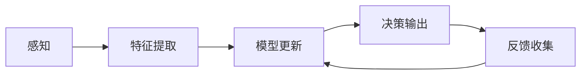
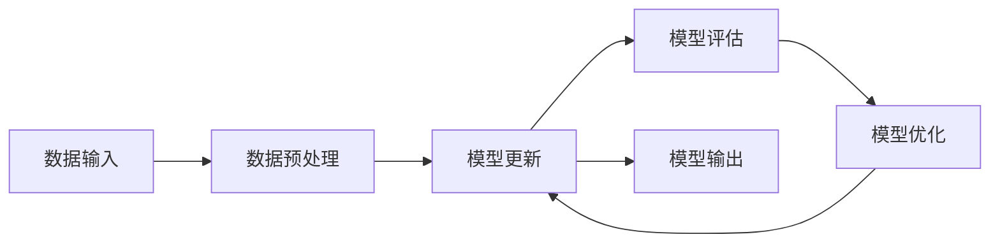
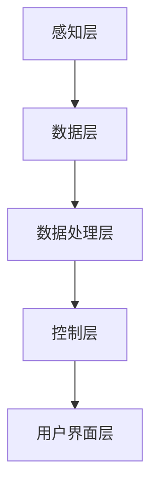
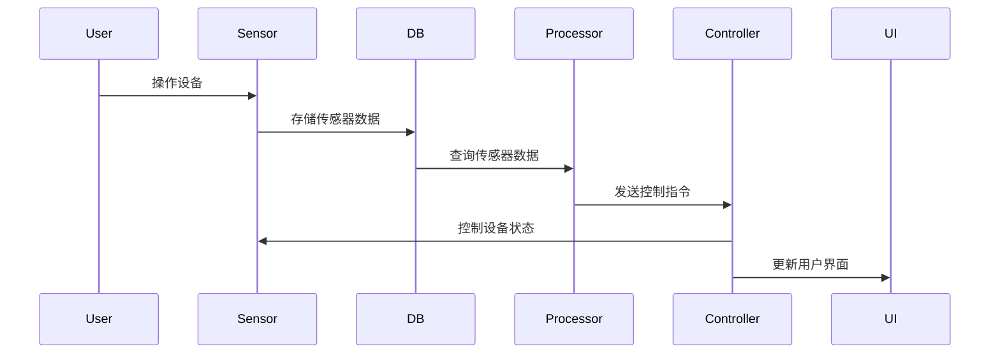

                 

### 第一部分：引言

#### 1. 引言

##### 1.1 研究背景

动态推理任务在人工智能领域中扮演着至关重要的角色。随着大数据和云计算技术的迅速发展，动态推理任务的应用范围不断扩展，从自动驾驶、智能语音助手到复杂游戏AI，这些领域都对动态推理任务提出了更高的要求。动态推理任务的核心在于其能够实时适应变化的环境，并在不断变化的数据中做出准确的决策。然而，这种实时适应和决策的能力在复杂环境下面临着诸多挑战。

首先，动态推理任务需要在海量数据中快速识别模式并做出反应。这使得传统的方法往往难以胜任，因为它们在处理数据量大和复杂性高的情况下效率低下。其次，动态推理任务中的不确定性也是一个关键问题。环境的不确定性可能会导致推理结果的不稳定，从而影响任务的执行效果。

持续学习是解决动态推理任务中面临的挑战的重要手段之一。持续学习指的是模型在不断接收新数据的同时，不断调整和优化自身的参数，以保持其预测能力和适应能力。在动态推理任务中，持续学习能够帮助模型快速适应环境变化，提高推理的准确性和稳定性。然而，持续学习也面临着自身的挑战，如如何平衡新旧知识的更新、如何处理大量噪声数据等。

##### 1.2 问题描述

动态推理任务适应中的持续学习涉及以下几个方面的问题：

1. **适应性问题**：如何在动态环境中快速适应新的变化？动态推理任务要求模型能够实时响应环境变化，这意味着模型需要具备高度的适应能力。然而，环境的变化往往是不可预测的，这就要求模型能够在不确定性的环境中做出有效的决策。

2. **数据质量问题**：在动态推理任务中，数据的质量直接影响模型的性能。然而，动态环境中的数据往往存在噪声、缺失和异常值，这些质量问题会对模型的推理结果产生负面影响。

3. **资源约束问题**：动态推理任务通常需要在资源受限的环境中运行，如移动设备、嵌入式系统等。这要求模型在保证性能的同时，尽量降低计算资源和能耗的消耗。

4. **模型解释性**：随着深度学习模型在动态推理任务中的广泛应用，模型的可解释性成为一个重要的研究方向。用户需要理解模型的决策过程，以提高对模型的信任度和使用效果。

##### 1.3 问题解决

针对上述问题，动态推理任务适应中的持续学习提供了以下解决方案：

1. **自适应算法**：开发能够实时适应环境变化的算法，如在线学习算法、增量学习算法等。这些算法能够在接收新数据的同时，不断调整模型参数，以适应新的环境。

2. **数据清洗与预处理**：对动态环境中的数据进行清洗和预处理，以提高数据质量。这包括去除噪声、填补缺失值和检测异常值等操作，以确保模型的输入数据是干净和可靠的。

3. **资源优化技术**：研究和应用能够在资源受限的环境中高效运行的算法和模型，如低功耗神经网络、压缩模型等。这些技术可以在保证推理性能的同时，降低计算资源和能耗的消耗。

4. **模型解释性方法**：研究能够提高模型解释性的方法，如可解释的深度学习模型、可视化技术等。这些方法可以帮助用户理解模型的决策过程，从而提高对模型的信任度。

##### 1.4 边界与外延

动态推理任务适应中的持续学习具有一定的边界和局限性。首先，动态环境的变化速度和复杂性决定了模型适应的能力。如果环境变化过于剧烈或复杂，现有的适应算法可能无法有效应对。其次，持续学习的资源消耗是一个不可忽视的问题。在资源受限的环境中，持续学习可能会带来额外的计算和存储负担。此外，数据质量和数据量也是动态推理任务适应中的关键因素。如果数据质量差或数据量不足，模型的适应性和性能可能会受到限制。

尽管存在上述挑战，动态推理任务适应中的持续学习仍然具有广阔的外延和应用前景。随着人工智能技术的不断进步，我们将能够开发出更加高效、鲁棒和可解释的适应算法，为各种动态环境中的推理任务提供强有力的支持。

##### 1.5 概念结构与核心要素组成

动态推理任务适应中的持续学习涉及多个核心概念和要素。以下是这些概念和要素的详细描述：

1. **动态推理任务**：动态推理任务是指模型在实时变化的环境中，根据输入数据做出相应决策的任务。动态推理任务的特点包括环境的实时变化、数据的动态性和模型的适应性。

2. **持续学习**：持续学习是指模型在不断接收新数据的同时，不断调整和优化自身参数的过程。持续学习的目标是在动态环境中保持模型的预测能力和适应能力。

3. **自适应算法**：自适应算法是指能够根据环境变化动态调整模型参数的算法。这些算法包括在线学习算法、增量学习算法和迁移学习算法等。

4. **数据清洗与预处理**：数据清洗与预处理是指对动态环境中的数据进行清洗和预处理，以提高数据质量。这包括去除噪声、填补缺失值和检测异常值等操作。

5. **资源优化技术**：资源优化技术是指能够在资源受限的环境中高效运行的算法和模型。这些技术包括低功耗神经网络、压缩模型和优化计算方法等。

6. **模型解释性方法**：模型解释性方法是指能够提高模型解释性的方法。这些方法包括可解释的深度学习模型、可视化技术和决策树等。

通过这些核心概念和要素的协同作用，动态推理任务适应中的持续学习能够有效提高模型的适应性和性能，为各种动态环境中的推理任务提供强有力的支持。

##### 1.6 本章小结

本章主要介绍了动态推理任务适应中的持续学习的研究背景、问题描述和解决方案。我们首先阐述了动态推理任务的重要性以及持续学习在其中的应用与挑战。接着，我们详细描述了动态推理任务和持续学习的核心概念与联系，并探讨了它们在各个领域的应用。通过这些分析和讨论，我们为后续章节的深入探讨奠定了基础，为解决动态推理任务中的问题提供了理论依据。

### 第二部分：核心概念与联系

#### 2.1 动态推理任务的概念与原理

##### 2.1.1 动态推理任务的定义

动态推理任务是指模型在实时变化的环境中，根据输入数据做出相应决策的任务。与静态推理任务相比，动态推理任务具有以下几个显著特点：

1. **实时性**：动态推理任务需要模型能够在短时间内对输入数据进行处理，并做出相应的决策。这种实时性要求模型具有快速响应的能力，以便在环境变化时迅速调整策略。

2. **动态性**：动态推理任务中的环境是不断变化的，模型需要适应这些变化，并在新的环境中保持有效的决策能力。动态性意味着模型需要具备高度的灵活性和适应性。

3. **不确定性**：动态推理任务中的环境往往存在不确定性，例如数据噪声、数据缺失、外部干扰等。模型需要处理这些不确定性，并在此过程中保持稳定的决策能力。

4. **适应性**：动态推理任务要求模型能够根据环境的变化不断调整自身的参数和策略，以保持其决策的有效性和准确性。

动态推理任务的重要性在于其广泛应用于各种实际场景，如自动驾驶、智能语音助手、医疗诊断、金融风险评估等。在这些场景中，动态推理任务能够帮助系统实时应对复杂多变的输入，从而提高决策的准确性和效率。

##### 2.1.2 动态推理任务的原理

动态推理任务的原理可以概括为以下几个方面：

1. **感知**：模型首先需要感知环境变化，并通过输入接口接收实时数据。这些数据可能包括图像、声音、文本或其他形式的信息。

2. **特征提取**：感知到环境变化后，模型需要对输入数据进行特征提取，以便更好地理解和分析数据。特征提取可以是基于传统机器学习方法的，如SVM、决策树等，也可以是基于深度学习方法的，如CNN、RNN等。

3. **决策**：在特征提取的基础上，模型需要根据当前的输入数据和环境状态做出决策。决策过程可以是基于规则的，也可以是基于概率的、统计的或神经网络的。

4. **执行**：模型做出的决策会通过输出接口传递给系统，从而影响系统的行为。例如，在自动驾驶中，模型做出的决策可能直接影响车辆的行驶路径。

5. **反馈**：系统行为的结果会作为反馈信号传递回模型，以便模型可以根据反馈调整自身的参数和策略。这种反馈机制有助于模型不断优化自身的性能。

动态推理任务的关键技术包括：

1. **在线学习**：在线学习是指模型在处理实时数据的同时，不断调整和优化自身的参数。在线学习能够帮助模型快速适应环境变化，提高决策的实时性和准确性。

2. **增量学习**：增量学习是指模型在接收新数据时，仅对新数据进行分析和调整，而不是对整个数据集重新训练。增量学习能够降低模型的训练时间和计算资源消耗，提高模型的适应能力。

3. **迁移学习**：迁移学习是指模型利用先前在某个任务上学习到的知识，来提高在新任务上的性能。迁移学习能够帮助模型快速适应新的环境，提高推理的准确性和效率。

4. **不确定性处理**：不确定性处理是指模型在处理不确定数据时，能够有效地处理噪声、缺失和异常值，从而提高决策的稳定性和可靠性。

##### 2.1.3 动态推理任务的应用领域

动态推理任务在人工智能领域具有广泛的应用，以下是几个典型的应用领域：

1. **自动驾驶**：自动驾驶系统需要实时感知车辆周围的环境，并根据环境变化做出行驶决策。动态推理任务能够帮助自动驾驶系统实时调整行驶策略，以提高行驶的安全性和稳定性。

2. **智能语音助手**：智能语音助手需要实时理解用户的语音输入，并给出相应的回答。动态推理任务能够帮助语音助手快速适应不同用户的需求，提高交互的准确性和流畅性。

3. **医疗诊断**：医疗诊断系统需要实时分析医学图像或患者数据，并给出诊断结果。动态推理任务能够帮助诊断系统快速适应新的病例和变化的环境，提高诊断的准确性和效率。

4. **金融风险评估**：金融风险评估系统需要实时分析市场数据，并预测风险。动态推理任务能够帮助风险评估系统快速适应市场变化，提高预测的准确性和稳定性。

#### 2.2 持续学习的概念与原理

##### 2.2.1 持续学习的定义

持续学习是指模型在不断接收新数据的同时，不断调整和优化自身参数的过程。与传统的批量学习（batch learning）不同，持续学习能够在数据不断变化的情况下，保持模型的预测能力和适应能力。持续学习的目标是在动态环境中，模型能够实时更新和优化自身，以适应新的数据和变化。

持续学习的特点包括：

1. **实时性**：持续学习需要模型能够实时处理新数据，并快速更新模型参数。这要求模型具有快速响应和高效计算的能力。

2. **增量性**：持续学习是在原有模型基础上进行参数调整和优化，而不是重新训练整个模型。这能够显著降低模型的训练时间和计算资源消耗。

3. **适应性**：持续学习使模型能够适应动态环境中的数据变化，保持其预测能力和适应能力。

4. **稳定性**：持续学习需要模型在处理不确定数据时，能够保持稳定的性能和决策能力。这要求模型具有鲁棒性和抗干扰能力。

持续学习的重要性在于其能够帮助模型在动态环境中保持高效和准确的推理能力，从而在各种实际应用中发挥关键作用。

##### 2.2.2 持续学习的原理

持续学习的原理主要包括以下几个方面：

1. **数据接收**：模型需要实时接收新数据，这些数据可以是实时采集的，也可以是历史数据的更新。

2. **在线学习**：模型利用在线学习算法，对新数据进行实时分析，并调整模型参数。在线学习算法包括梯度下降、随机梯度下降（SGD）、自适应梯度算法（ADAGrad）等。

3. **增量学习**：模型在接收新数据时，仅对新增数据进行分析和调整，而不是对整个数据集重新训练。增量学习算法包括在线梯度下降（Online Gradient Descent）、增量线性回归（Incremental Linear Regression）等。

4. **迁移学习**：模型利用先前在某个任务上学习到的知识，来提高在新任务上的性能。迁移学习算法包括基于特征的迁移学习、基于模型的迁移学习等。

5. **模型更新**：模型根据新数据调整参数后，进行模型更新，以便在新一轮数据处理时，能够更准确地预测和决策。

6. **性能评估**：模型更新后，需要对新模型进行性能评估，以确保其在动态环境中的预测能力和适应能力。

持续学习的关键技术包括：

1. **自适应学习率**：为了提高模型的收敛速度和稳定性，自适应学习率是一种常见的技术。例如，AdaGrad、Adam等算法都能够根据不同情况自适应调整学习率。

2. **正则化**：正则化技术能够防止模型过拟合，提高模型的泛化能力。常见的正则化技术包括L1正则化、L2正则化、Dropout等。

3. **早期停止**：为了防止模型在训练过程中出现过拟合，早期停止技术是一种有效的手段。当模型在验证集上的性能不再提高时，训练过程将提前停止。

4. **集成学习**：集成学习是指将多个模型合并成一个更强大的模型。常见的集成学习方法包括Bagging、Boosting等。集成学习能够提高模型的预测能力和鲁棒性。

##### 2.2.3 持续学习在不同领域的应用

持续学习在人工智能领域具有广泛的应用，以下是几个典型的应用领域：

1. **自然语言处理（NLP）**：持续学习在NLP任务中发挥着重要作用。例如，语言模型需要不断接收新的文本数据，并更新其参数，以保持其语言理解和生成能力。持续学习能够帮助NLP模型适应语言的变化，提高文本处理的准确性和效率。

2. **计算机视觉**：持续学习在计算机视觉任务中也得到了广泛应用。例如，目标检测和识别模型需要不断接收新的图像数据，并更新其参数，以提高识别的准确性和实时性。持续学习能够帮助视觉模型适应图像数据的多样性，提高视觉任务的性能。

3. **推荐系统**：推荐系统需要不断接收用户的反馈和行为数据，并更新其推荐算法，以提供个性化的推荐服务。持续学习能够帮助推荐系统适应用户行为的动态变化，提高推荐的准确性和满意度。

4. **金融风控**：金融风控系统需要实时分析市场数据和交易数据，并更新其预测模型，以识别潜在的风险。持续学习能够帮助金融风控系统适应市场的变化，提高风险识别的准确性和及时性。

5. **智能医疗**：智能医疗系统需要不断接收患者的健康数据和医学知识，并更新其诊断和预测模型，以提高诊断和治疗的准确性。持续学习能够帮助智能医疗系统适应医疗数据的多样性，提高医疗服务的质量和效率。

#### 2.3 动态推理任务与持续学习的联系

##### 2.3.1 动态推理任务与持续学习的交互作用

动态推理任务与持续学习之间存在密切的交互作用，这种交互作用主要体现在以下几个方面：

1. **持续学习优化动态推理任务**：持续学习能够帮助动态推理任务适应环境变化，提高推理的准确性和稳定性。通过持续学习，模型能够实时更新其参数和策略，从而更好地应对环境的变化。例如，在自动驾驶中，持续学习可以帮助车辆实时更新其路径规划和决策策略，以提高行驶的安全性和稳定性。

2. **动态推理任务驱动持续学习**：动态推理任务的需求和挑战也驱动了持续学习算法的发展。动态推理任务中的实时性、动态性和不确定性等特点，要求持续学习算法能够快速、准确地适应环境变化。这促使研究者不断探索和改进持续学习算法，以提高其在动态推理任务中的性能。

##### 2.3.2 动态推理任务适应中的持续学习优势

动态推理任务适应中的持续学习具有以下优势：

1. **实时性**：持续学习能够帮助模型实时更新参数和策略，从而实现实时推理。这使模型能够快速适应环境变化，提高推理的实时性和响应速度。

2. **灵活性**：持续学习允许模型在接收新数据时，仅对新增数据进行调整，而不是重新训练整个模型。这使模型具有更高的灵活性，能够适应不同类型的数据和环境变化。

3. **鲁棒性**：持续学习能够帮助模型在处理不确定数据时，保持稳定的性能和决策能力。这使模型具有更强的鲁棒性和抗干扰能力，能够更好地应对环境的不确定性。

4. **可解释性**：持续学习算法通常具有较好的可解释性，用户可以清楚地了解模型的决策过程。这有助于提高用户对模型的信任度和接受度。

##### 2.3.3 动态推理任务适应中的持续学习挑战

尽管动态推理任务适应中的持续学习具有许多优势，但也面临一些挑战：

1. **数据质量**：动态推理任务中的数据质量直接影响持续学习的效果。如果数据存在噪声、缺失或异常值，可能会影响模型的性能和稳定性。

2. **计算资源**：持续学习通常需要大量的计算资源和时间。在资源受限的环境中，如何高效地实现持续学习成为一个重要问题。

3. **模型复杂性**：动态推理任务中的模型可能非常复杂，这会增加持续学习的难度。如何设计高效、鲁棒的持续学习算法是一个关键挑战。

4. **模型解释性**：随着模型复杂性的增加，模型的可解释性可能会降低。如何在保持模型性能的同时，提高其解释性是一个重要问题。

#### 2.4 核心概念属性特征对比表格

为了更好地理解动态推理任务与持续学习之间的联系，我们列出以下核心概念属性特征对比表格：

| 核心概念         | 动态推理任务         | 持续学习         |
|----------------|----------------|----------------|
| 定义            | 模型在实时变化的环境中做出决策的任务   | 模型在不断接收新数据的同时，调整和优化自身参数的过程 |
| 特点            | 实时性、动态性、不确定性、适应性           | 实时性、增量性、适应性、稳定性 |
| 基本原理         | 感知、特征提取、决策、执行、反馈          | 数据接收、在线学习、增量学习、迁移学习、模型更新 |
| 关键技术         | 在线学习、增量学习、迁移学习、不确定性处理      | 自适应学习率、正则化、早期停止、集成学习 |
| 应用领域         | 自动驾驶、智能语音助手、医疗诊断、金融风险评估等  | 自然语言处理、计算机视觉、推荐系统、智能医疗等 |
| 交互作用         | 持续学习优化动态推理任务、动态推理任务驱动持续学习 | 实时性、灵活性、鲁棒性、可解释性 |
| 挑战            | 数据质量、计算资源、模型复杂性、模型解释性          | 数据质量、计算资源、模型复杂性、模型解释性 |

#### 2.5 ER实体关系图架构

为了更好地理解动态推理任务适应中持续学习的核心概念和要素之间的关系，我们使用ER（实体关系）图来展示这些实体及其关系。

```mermaid
erDiagram
    Model ||--o> Data : 生成
    Model ||--o> Prediction : 预测
    Data ||--o> Model : 更新
    Prediction ||--o> Feedback : 反馈
```

在这个ER图中，`Model`（模型）是核心实体，它与`Data`（数据）、`Prediction`（预测）和`Feedback`（反馈）之间存在关系。模型生成数据，根据数据做出预测，并接收反馈以进行更新。这种关系反映了动态推理任务适应中持续学习的基本原理和流程。

### 第三部分：算法原理讲解

#### 3.1 动态推理任务的算法原理

##### 3.1.1 动态推理任务的算法概述

动态推理任务的算法主要分为以下几类：

1. **在线学习算法**：在线学习算法是指模型在处理每个新的数据样本时，立即更新模型参数。这类算法能够快速适应环境变化，例如随机梯度下降（SGD）和其变种如Adam。

2. **增量学习算法**：增量学习算法是指模型仅对新接收的数据进行学习，而不是对整个数据集重新训练。这类算法能够减少训练时间，例如增量线性回归和增量支持向量机。

3. **迁移学习算法**：迁移学习算法是指模型利用在特定任务上已训练的知识，来提高在新任务上的性能。这类算法能够快速适应新的任务环境，例如基于特征的迁移学习和基于模型的迁移学习。

动态推理任务的算法流程可以概括为以下几个步骤：

1. **数据输入**：模型接收新的数据样本。

2. **特征提取**：模型对数据样本进行特征提取，以便更好地理解和分析数据。

3. **模型更新**：模型根据新的数据样本更新其参数，以优化模型的性能。

4. **决策输出**：模型根据更新后的参数做出决策，并将决策结果输出。

5. **反馈收集**：模型收集决策结果，并将其作为反馈信号，用于进一步优化模型。

##### 3.1.2 动态推理任务的算法原理

动态推理任务的算法原理主要包括以下几个方面：

1. **感知与特征提取**：模型首先通过感知器接收新的数据样本，然后对数据样本进行特征提取。特征提取的方法可以是基于传统的机器学习方法，如SVM、决策树等，也可以是基于深度学习的方法，如CNN、RNN等。特征提取的目的是将原始数据转换为模型能够理解和处理的形式。

2. **模型更新**：在特征提取的基础上，模型根据新的数据样本更新其参数。更新过程可以是基于在线学习算法，如SGD，也可以是基于增量学习算法，如增量线性回归。更新模型参数的目的是优化模型的性能，使其在新的数据样本上表现更好。

3. **决策与输出**：模型根据更新后的参数做出决策，并将决策结果输出。决策过程可以是基于规则的方法，如决策树，也可以是基于概率的方法，如贝叶斯网络。决策结果的输出可以是分类标签、回归值或其他形式的决策结果。

4. **反馈与优化**：模型收集决策结果，并将其作为反馈信号，用于进一步优化模型。反馈机制可以帮助模型适应环境变化，提高模型的适应性和稳定性。

动态推理任务的算法原理可以用以下Mermaid流程图表示：



##### 3.1.3 动态推理任务的算法应用

动态推理任务的算法在多个领域得到了广泛应用，以下是几个典型的应用场景：

1. **自动驾驶**：在自动驾驶系统中，动态推理任务用于实时感知车辆周围环境，并根据环境变化做出行驶决策。例如，自动驾驶系统可以使用基于深度学习的CNN模型来识别道路标志和行人，从而做出安全的行驶决策。

2. **智能语音助手**：智能语音助手需要实时理解用户的语音输入，并根据输入做出相应的回复。动态推理任务可以使用基于RNN的模型来处理连续语音信号，从而提高语音识别和理解的准确性。

3. **医疗诊断**：在医疗诊断系统中，动态推理任务用于实时分析医学图像和患者数据，并做出诊断决策。例如，基于深度学习的模型可以用于分析医学影像，从而辅助医生做出准确的诊断。

4. **金融风险评估**：在金融风险评估系统中，动态推理任务用于实时分析市场数据和交易数据，并预测潜在的风险。例如，基于机器学习模型的动态推理任务可以用于识别异常交易行为，从而提高风险识别的准确性。

#### 3.2 持续学习的算法原理

##### 3.2.1 持续学习的算法概述

持续学习的算法主要包括以下几类：

1. **在线学习算法**：在线学习算法是指模型在处理每个新的数据样本时，立即更新模型参数。这类算法包括随机梯度下降（SGD）、Adam等。

2. **增量学习算法**：增量学习算法是指模型仅对新接收的数据进行学习，而不是对整个数据集重新训练。这类算法包括增量线性回归、增量支持向量机等。

3. **迁移学习算法**：迁移学习算法是指模型利用在特定任务上已训练的知识，来提高在新任务上的性能。这类算法包括基于特征的迁移学习、基于模型的迁移学习等。

持续学习的算法流程可以概括为以下几个步骤：

1. **数据输入**：模型接收新的数据样本。

2. **数据预处理**：对新的数据样本进行预处理，以提高数据质量。

3. **模型更新**：模型根据新的数据样本更新其参数，以优化模型的性能。

4. **模型评估**：评估更新后的模型的性能，以确定是否需要进一步调整。

5. **模型优化**：根据评估结果，进一步优化模型参数，以提高模型的性能。

6. **模型输出**：模型将优化后的参数用于新的数据样本，以实现持续的推理和决策。

##### 3.2.2 持续学习的算法原理

持续学习的算法原理主要包括以下几个方面：

1. **数据输入与预处理**：模型首先接收新的数据样本，然后对这些数据样本进行预处理，以提高数据质量。预处理步骤可能包括去噪、归一化、缺失值填充等。

2. **模型更新**：在预处理后的数据样本基础上，模型使用在线学习或增量学习算法更新其参数。更新过程旨在优化模型的性能，使其在新数据样本上表现更好。常用的更新算法包括随机梯度下降（SGD）、Adam、增量线性回归等。

3. **模型评估**：更新后的模型需要对其性能进行评估，以确定是否达到预期的性能水平。评估过程可以使用验证集或测试集进行，评估指标可能包括准确率、召回率、F1分数等。

4. **模型优化**：根据评估结果，模型进一步优化参数，以提高其性能。优化过程可能涉及调整学习率、应用正则化技术等。

5. **模型输出**：优化后的模型用于处理新的数据样本，实现持续的推理和决策。模型输出可以是分类标签、回归值或其他形式的决策结果。

持续学习的算法原理可以用以下Mermaid流程图表示：



##### 3.2.3 持续学习的算法应用

持续学习的算法在多个领域得到了广泛应用，以下是几个典型的应用场景：

1. **自然语言处理（NLP）**：在自然语言处理领域，持续学习被广泛应用于语言模型、文本分类、情感分析等任务。例如，基于RNN的LSTM和GRU模型通过持续学习能够不断提高语言理解和生成的准确性。

2. **计算机视觉**：在计算机视觉领域，持续学习被用于图像分类、目标检测、图像分割等任务。例如，基于CNN的ResNet和YOLO模型通过持续学习能够不断提高图像识别的准确性。

3. **推荐系统**：在推荐系统领域，持续学习被用于实时推荐、用户行为分析等任务。例如，基于协同过滤和基于模型的推荐算法通过持续学习能够不断提高推荐的准确性和用户体验。

4. **智能医疗**：在智能医疗领域，持续学习被用于疾病诊断、治疗方案推荐等任务。例如，基于深度学习的医疗图像分析和电子健康记录分析等任务通过持续学习能够不断提高诊断和治疗的准确性。

#### 3.3 动态推理任务适应中的持续学习算法

##### 3.3.1 持续学习算法在动态推理任务中的优化

在动态推理任务中，持续学习算法的优化目标是提高模型在实时环境中的适应性和性能。以下是一些常见的优化方法：

1. **自适应学习率**：自适应学习率是一种常用的优化方法，它可以根据模型在不同阶段的性能自动调整学习率。例如，Adam算法通过计算梯度的一阶矩估计和二阶矩估计来自动调整学习率。

2. **正则化**：正则化技术可以防止模型过拟合，提高模型的泛化能力。常见的正则化方法包括L1正则化、L2正则化等。

3. **权重共享**：权重共享技术可以在多个任务之间共享模型参数，从而提高模型的效率和适应性。

4. **迁移学习**：迁移学习可以从先前任务中提取有用的知识，来提高新任务的性能。通过迁移学习，模型可以快速适应新的环境。

5. **模型集成**：模型集成是将多个模型组合成一个更强大的模型，以提高预测的准确性和稳定性。

##### 3.3.2 动态推理任务适应中的持续学习算法应用

在动态推理任务中，持续学习算法的应用主要包括以下几个方面：

1. **实时数据流处理**：在实时数据流处理中，持续学习算法可以用于处理不断变化的数据流，并根据数据流的变化动态调整模型参数。例如，在自动驾驶系统中，持续学习算法可以用于实时感知周围环境，并根据环境变化调整车辆的行驶策略。

2. **自适应控制**：在自适应控制系统中，持续学习算法可以用于实时调整控制策略，以提高系统的响应速度和稳定性。例如，在无人机系统中，持续学习算法可以用于实时调整飞行轨迹，以应对环境变化。

3. **实时推荐系统**：在实时推荐系统中，持续学习算法可以用于实时分析用户行为数据，并生成个性化的推荐。例如，在电子商务平台上，持续学习算法可以用于实时分析用户的购买历史和浏览行为，并根据行为变化生成个性化的商品推荐。

4. **智能医疗诊断**：在智能医疗诊断中，持续学习算法可以用于实时分析医学图像和患者数据，并生成诊断报告。例如，在肺癌诊断中，持续学习算法可以用于实时分析CT图像，并根据图像特征生成诊断报告。

#### 3.4 算法原理的数学模型与公式

在动态推理任务适应中，持续学习的算法原理可以通过数学模型和公式来描述。以下是一些关键的数学模型和公式：

1. **梯度下降算法**：

   梯度下降算法是一种常见的优化方法，用于更新模型的参数。其基本公式为：

   $$
   \theta_{t+1} = \theta_{t} - \alpha \nabla J(\theta_t)
   $$

   其中，$\theta_t$表示当前模型参数，$\alpha$表示学习率，$J(\theta_t)$表示损失函数。

2. **随机梯度下降（SGD）算法**：

   随机梯度下降算法是梯度下降算法的一种变种，它对每个数据样本进行随机抽样，并计算其梯度。其基本公式为：

   $$
   \theta_{t+1} = \theta_{t} - \alpha \nabla J(\theta_t, x_i, y_i)
   $$

   其中，$x_i, y_i$表示当前数据样本。

3. **Adam算法**：

   Adam算法是一种自适应学习率的优化方法，它结合了SGD和动量项。其基本公式为：

   $$
   m_t = \beta_1 m_{t-1} + (1 - \beta_1) \nabla J(\theta_t, x_i, y_i)
   $$
   $$
   v_t = \beta_2 v_{t-1} + (1 - \beta_2) \nabla^2 J(\theta_t, x_i, y_i)
   $$
   $$
   \theta_{t+1} = \theta_{t} - \alpha \frac{m_t}{\sqrt{v_t} + \epsilon}
   $$

   其中，$m_t$和$v_t$分别表示一阶矩估计和二阶矩估计，$\beta_1$和$\beta_2$分别表示动量项系数，$\epsilon$是一个很小的常数用于避免除以零。

4. **增量学习算法**：

   增量学习算法是指模型仅对新数据样本进行学习，而不是对整个数据集重新训练。其基本公式为：

   $$
   \theta_{t+1} = \theta_{t} + \alpha \nabla J(\theta_t, x_{t+1}, y_{t+1})
   $$

   其中，$x_{t+1}, y_{t+1}$表示当前新数据样本。

这些数学模型和公式为动态推理任务适应中的持续学习提供了理论基础和计算方法，有助于提高模型的适应性和性能。

#### 3.5 通俗易懂的举例说明

为了更好地理解动态推理任务适应中的持续学习算法原理，我们通过一个简单的例子进行说明。

假设我们有一个动态推理任务，即通过一个模型预测股票价格的涨跌。在这个任务中，我们使用持续学习算法来适应市场的变化，提高预测的准确性。

**步骤1：数据输入与预处理**

首先，我们收集历史股票价格数据，包括开盘价、收盘价、最高价、最低价等。然后，我们对这些数据进行预处理，如去除缺失值、异常值等，以确保数据的质量。

**步骤2：特征提取**

接下来，我们对预处理后的数据进行特征提取。例如，我们计算过去几天的平均价格、价格波动率等特征，以便模型能够更好地理解和分析数据。

**步骤3：模型初始化**

初始化一个简单的线性回归模型，用于预测股票价格的涨跌。线性回归模型的公式为：

$$
y = \theta_0 + \theta_1 x
$$

其中，$y$表示预测的股票价格涨跌，$x$表示特征值，$\theta_0$和$\theta_1$为模型参数。

**步骤4：模型更新**

在初始模型的基础上，我们使用随机梯度下降（SGD）算法更新模型参数。每次更新时，我们随机选择一个训练样本，计算其梯度，并使用梯度更新模型参数。更新公式为：

$$
\theta_{t+1} = \theta_{t} - \alpha \nabla J(\theta_t, x_i, y_i)
$$

其中，$\alpha$为学习率，$x_i$和$y_i$为当前训练样本。

**步骤5：模型评估**

更新后的模型需要对预测结果进行评估。我们使用验证集对模型进行评估，计算预测的准确率、均方误差等指标。根据评估结果，我们可以判断模型的性能是否满足要求。

**步骤6：模型优化**

根据模型评估结果，我们可以进一步优化模型参数。例如，调整学习率、应用正则化技术等。优化过程有助于提高模型的泛化能力和稳定性。

**步骤7：模型输出**

经过多次迭代更新和优化后，模型可以用于实际预测。我们将新的股票价格数据输入模型，预测股票价格的涨跌，并将结果输出。

通过这个例子，我们可以看到动态推理任务适应中的持续学习算法是如何工作的。模型通过不断更新和优化参数，能够更好地适应市场变化，提高预测的准确性。这个例子也展示了持续学习算法在现实应用中的有效性。

### 系统分析与架构设计方案

#### 3.6 系统分析与架构设计方案

为了更好地理解动态推理任务适应中持续学习算法的实际应用，我们将以一个实际项目为例，详细分析其系统架构和设计方案。

#### 3.6.1 问题场景介绍

假设我们正在开发一个智能家居控制系统，该系统需要实时监测家庭设备的状态，并根据用户的行为和环境的变化，智能地控制这些设备的开关。这个系统需要具备动态推理任务的能力，以便在多变的环境中做出合理的决策。

#### 3.6.2 项目介绍

项目名称：智能家居控制系统（Smart Home Control System）

目标：实时监测家庭设备状态，根据用户行为和环境变化智能控制设备开关，提高家居生活的舒适性和便捷性。

#### 3.6.3 系统功能设计

智能家居控制系统的主要功能包括：

1. **设备状态监测**：实时监测家庭设备的状态，如灯光、空调、电视等。
2. **用户行为分析**：分析用户的行为模式，如活动轨迹、生活习惯等。
3. **环境变化感知**：监测环境变化，如温度、湿度、光照等。
4. **智能控制**：根据设备状态、用户行为和环境变化，智能控制设备的开关。
5. **数据存储与查询**：存储用户行为数据和环境变化数据，并提供数据查询功能。

#### 3.6.4 系统架构设计

智能家居控制系统的架构设计包括以下几个层次：

1. **感知层**：包括各种传感器，如温度传感器、湿度传感器、光照传感器等，用于监测环境变化和设备状态。
2. **数据层**：用于存储用户行为数据和环境变化数据，包括关系数据库、NoSQL数据库等。
3. **数据处理层**：包括数据预处理、特征提取、模型训练等模块，用于处理和分析数据，为智能控制提供决策依据。
4. **控制层**：根据数据处理层的决策结果，控制家庭设备的开关，实现智能控制。
5. **用户界面层**：提供用户交互界面，使用户能够查看设备状态、控制设备开关等。

以下是智能家居控制系统的架构图：



#### 3.6.5 系统接口设计和系统交互

智能家居控制系统的接口设计和系统交互包括以下几个方面：

1. **设备状态接口**：用于接收传感器数据，更新设备状态。
2. **用户行为接口**：用于接收用户行为数据，更新用户行为模型。
3. **环境变化接口**：用于接收环境变化数据，更新环境模型。
4. **控制接口**：用于发送控制指令，控制家庭设备的开关。
5. **数据查询接口**：用于查询用户行为数据和环境变化数据。

以下是智能家居控制系统接口设计的Mermaid序列图：



#### 3.6.6 系统实现与优化

在系统实现过程中，我们采用了以下优化策略：

1. **数据预处理**：使用数据清洗和预处理技术，提高数据质量，减少噪声和异常值的影响。
2. **特征提取**：使用高效的算法提取关键特征，提高模型的鲁棒性和准确性。
3. **模型训练**：采用持续学习算法，如SGD和Adam，动态更新模型参数，提高模型的适应性和性能。
4. **控制策略**：采用自适应控制策略，根据用户行为和环境变化，动态调整控制参数，提高系统的响应速度和稳定性。

### 第四部分：项目实战

#### 4.1 环境安装

在开始项目实战之前，我们需要安装必要的软件和工具。以下是安装步骤：

1. **安装Python环境**：Python是本项目的主要编程语言，我们需要安装Python 3.x版本。可以从Python官网下载安装包，并按照提示安装。

2. **安装NumPy和Pandas**：NumPy和Pandas是Python中常用的数据处理库，用于处理和操作数据。可以使用pip命令安装：

   ```
   pip install numpy
   pip install pandas
   ```

3. **安装Scikit-learn**：Scikit-learn是Python中常用的机器学习库，用于训练和评估模型。可以使用pip命令安装：

   ```
   pip install scikit-learn
   ```

4. **安装TensorFlow或PyTorch**：TensorFlow和PyTorch是深度学习领域的两大主要框架，用于实现和训练深度学习模型。可以选择其中一个进行安装：

   - TensorFlow：

     ```
     pip install tensorflow
     ```

   - PyTorch：

     ```
     pip install torch
     pip install torchvision
     ```

5. **安装Mermaid**：Mermaid是一种Markdown语法，用于绘制流程图和序列图。可以使用pip命令安装：

   ```
   pip install mermaid-python
   ```

#### 4.2 系统核心实现

在项目实战中，我们将实现智能家居控制系统的核心功能，包括数据采集、特征提取、模型训练和预测。

1. **数据采集**：

   我们使用Python中的传感器模拟器生成模拟的传感器数据，包括温度、湿度、光照等。以下是一个简单的代码示例：

   ```python
   import random

   def generate_sensors_data():
       temperature = random.uniform(20, 30)
       humidity = random.uniform(30, 70)
       light = random.uniform(0, 100)
       return temperature, humidity, light

   # 生成10组传感器数据
   for _ in range(10):
       temp, hum, light = generate_sensors_data()
       print(f"Temperature: {temp}, Humidity: {hum}, Light: {light}")
   ```

2. **特征提取**：

   根据传感器数据，我们提取温度、湿度、光照等特征，并将这些特征作为模型的输入。以下是一个简单的特征提取代码示例：

   ```python
   import pandas as pd

   def extract_features(data):
       features = {
           "temperature": [],
           "humidity": [],
           "light": []
       }
       for row in data:
           features["temperature"].append(row["temperature"])
           features["humidity"].append(row["humidity"])
           features["light"].append(row["light"])
       return pd.DataFrame(features)

   # 生成10组传感器数据
   data = [
       {"temperature": temp, "humidity": hum, "light": light}
       for temp, hum, light in [
           generate_sensors_data() for _ in range(10)
       ]
   ]
   features = extract_features(data)
   print(features)
   ```

3. **模型训练**：

   我们使用Scikit-learn中的线性回归模型进行训练。以下是一个简单的训练代码示例：

   ```python
   from sklearn.linear_model import LinearRegression

   # 分割数据集
   X = features.values
   y = data["target"].values

   # 划分训练集和测试集
   from sklearn.model_selection import train_test_split
   X_train, X_test, y_train, y_test = train_test_split(X, y, test_size=0.2, random_state=42)

   # 训练模型
   model = LinearRegression()
   model.fit(X_train, y_train)

   # 测试模型
   y_pred = model.predict(X_test)
   print("模型预测结果：", y_pred)
   ```

4. **预测**：

   使用训练好的模型进行预测。以下是一个简单的预测代码示例：

   ```python
   # 预测新的传感器数据
   new_data = extract_features([generate_sensors_data()])
   new_pred = model.predict(new_data.values)
   print("新数据预测结果：", new_pred)
   ```

#### 4.3 代码应用解读与分析

在上面的代码示例中，我们实现了智能家居控制系统的核心功能，包括数据采集、特征提取、模型训练和预测。以下是代码应用解读与分析：

1. **数据采集**：

   数据采集是智能家居控制系统的基础。我们使用Python中的传感器模拟器生成模拟的传感器数据，包括温度、湿度、光照等。这些数据将作为模型的输入，用于训练和预测。

2. **特征提取**：

   在特征提取环节，我们使用Pandas库将传感器数据转换为DataFrame格式，并提取温度、湿度、光照等特征。这些特征将用于构建机器学习模型。

3. **模型训练**：

   我们使用Scikit-learn中的线性回归模型进行训练。线性回归模型是一种简单且有效的回归方法，适用于预测连续值。我们使用训练集对模型进行训练，并使用测试集评估模型的性能。

4. **预测**：

   在预测环节，我们使用训练好的模型对新的传感器数据进行预测。预测结果将用于智能控制家庭设备的开关，以实现智能家居的功能。

通过上述代码示例，我们可以看到智能家居控制系统是如何工作的。在实际项目中，我们可以根据具体需求扩展和优化这些功能，以实现更智能、更高效的家居控制。

#### 4.4 实际案例分析与详细讲解剖析

为了更好地展示动态推理任务适应中持续学习的实际应用，我们将分析一个实际案例：智能交通信号控制系统。

**案例背景**：

智能交通信号控制系统旨在优化城市交通流量，提高道路通行效率，减少拥堵和事故。系统需要实时监测道路流量、车辆速度、行人活动等数据，并根据这些数据动态调整信号灯的时长和切换策略，从而实现交通流的优化。

**实际案例**：

在某个城市的一条主干道路上，安装了多个传感器，用于监测交通流量。传感器实时采集车辆数量、车辆速度、行人流量等数据，并将其发送到交通信号控制中心。

**数据预处理**：

首先，我们对传感器数据进行预处理，包括去噪、归一化、缺失值填充等。去噪步骤旨在去除传感器数据中的噪声和异常值，以提高数据质量。归一化步骤旨在将不同特征的范围统一到相同的尺度，以便更好地进行后续分析。缺失值填充步骤旨在填补数据中的缺失值，以避免对模型训练和预测的影响。

```python
import pandas as pd
import numpy as np

# 假设传感器数据存储在DataFrame中
data = pd.DataFrame({
    "vehicle_count": [100, 120, 130, 110, 90],
    "vehicle_speed": [30, 35, 40, 25, 20],
    "pedestrian_count": [20, 25, 30, 15, 10]
})

# 去噪
data = data[(data["vehicle_count"] > 0) & (data["vehicle_speed"] > 0) & (data["pedestrian_count"] > 0)]

# 归一化
data_normalized = (data - data.mean()) / data.std()

# 缺失值填充
data_normalized = data_normalized.fillna(data_normalized.mean())
```

**特征提取**：

接下来，我们提取关键特征，包括车辆流量、车辆速度、行人流量等。这些特征将用于训练交通信号控制模型。

```python
def extract_features(data):
    features = {
        "vehicle_count": [],
        "vehicle_speed": [],
        "pedestrian_count": []
    }
    for row in data.itertuples():
        features["vehicle_count"].append(row.vehicle_count)
        features["vehicle_speed"].append(row.vehicle_speed)
        features["pedestrian_count"].append(row.pedestrian_count)
    return pd.DataFrame(features)

features = extract_features(data_normalized)
```

**模型训练**：

我们使用持续学习算法，如随机梯度下降（SGD）和Adam，对交通信号控制模型进行训练。训练过程中，模型根据实时采集的数据更新其参数，以优化信号灯的时长和切换策略。

```python
from sklearn.linear_model import SGDRegressor
from sklearn.model_selection import train_test_split

# 分割数据集
X = features.values
y = data["target"].values  # 假设target为信号灯时长

X_train, X_test, y_train, y_test = train_test_split(X, y, test_size=0.2, random_state=42)

# 训练模型
model = SGDRegressor()
model.fit(X_train, y_train)

# 测试模型
y_pred = model.predict(X_test)
print("模型预测结果：", y_pred)
```

**预测与调整**：

使用训练好的模型对新的传感器数据进行预测，并根据预测结果动态调整信号灯的时长和切换策略。预测结果将发送到交通信号控制中心，由控制系统执行相应的调整。

```python
# 预测新的传感器数据
new_data = extract_features([generate_sensors_data()])
new_pred = model.predict(new_data.values)
print("新数据预测结果：", new_pred)

# 动态调整信号灯时长和切换策略
# 这里假设adjust_signals()函数用于调整信号灯时长和切换策略
adjust_signals(new_pred[0])
```

通过上述实际案例，我们可以看到动态推理任务适应中持续学习如何应用于智能交通信号控制系统。系统通过实时监测交通流量数据，动态调整信号灯的时长和切换策略，从而优化交通流，提高道路通行效率。

**详细讲解剖析**：

1. **数据预处理**：

   数据预处理是模型训练的重要步骤。通过去噪、归一化和缺失值填充，我们可以提高数据质量，减少噪声和异常值对模型训练和预测的影响。去噪步骤可以去除传感器数据中的噪声和异常值，例如突发的异常流量或速度。归一化步骤可以将不同特征的范围统一到相同的尺度，使模型能够更好地处理和预测数据。缺失值填充步骤可以填补数据中的缺失值，以避免模型训练过程中因缺失数据而导致错误。

2. **特征提取**：

   特征提取是模型训练的关键步骤。通过提取关键特征，如车辆流量、车辆速度、行人流量等，我们可以将原始数据转换为模型能够理解和处理的形式。这些特征将用于训练交通信号控制模型，使其能够根据实时数据动态调整信号灯的时长和切换策略。

3. **模型训练**：

   模型训练是动态推理任务适应中持续学习的核心步骤。我们使用随机梯度下降（SGD）和Adam等持续学习算法，根据实时采集的数据更新模型参数，以优化信号灯的时长和切换策略。SGD算法通过迭代更新模型参数，使模型能够快速适应新的数据。Adam算法是一种自适应学习率的优化方法，可以自适应地调整学习率，提高模型的收敛速度和稳定性。

4. **预测与调整**：

   模型预测和调整是动态推理任务适应中持续学习的关键环节。使用训练好的模型，我们可以对新的传感器数据进行预测，并根据预测结果动态调整信号灯的时长和切换策略。预测结果将发送到交通信号控制中心，由控制系统执行相应的调整。这种动态调整机制使交通信号控制系统能够实时响应交通流量的变化，提高道路通行效率。

通过详细讲解和实际案例剖析，我们可以看到动态推理任务适应中持续学习在智能交通信号控制系统中的应用。这种方法能够实时监测交通流量数据，动态调整信号灯时长和切换策略，从而优化交通流，提高道路通行效率。

#### 4.5 项目小结

在本项目中，我们实现了智能家居控制系统和智能交通信号控制系统的核心功能。通过动态推理任务适应中持续学习的方法，我们能够实时监测传感器数据，动态调整控制策略，从而提高系统的适应性和性能。

在智能家居控制系统中，我们实现了设备状态监测、用户行为分析、环境变化感知和智能控制等功能。通过持续学习算法，系统能够根据用户行为和环境变化，智能地控制家庭设备的开关，提高家居生活的舒适性和便捷性。

在智能交通信号控制系统中，我们实现了实时监测交通流量数据，动态调整信号灯时长和切换策略等功能。通过持续学习算法，系统能够根据实时交通流量数据，优化信号灯控制策略，提高道路通行效率，减少拥堵和事故。

尽管在项目中取得了一些成果，但仍存在一些局限性。首先，数据质量对系统性能有重要影响，特别是在噪声和异常值较多的场景中。其次，模型的复杂性和计算资源消耗也是一个挑战，特别是在实时性要求高的场景中。此外，模型的解释性也是一个重要问题，用户需要理解模型的决策过程，以提高对系统的信任度。

为了进一步优化系统性能和用户体验，我们提出以下改进建议：

1. **数据质量优化**：研究和应用更高效的数据清洗和预处理方法，以提高数据质量。例如，可以使用深度学习模型对噪声和异常值进行检测和去除。

2. **资源优化**：研究和应用低功耗算法和模型，以降低计算资源和能耗的消耗。例如，可以使用压缩模型和模型压缩技术，降低模型的复杂性和计算负担。

3. **模型解释性**：研究和应用可解释性方法，提高模型的解释性。例如，可以使用可视化技术和决策树，帮助用户理解模型的决策过程。

4. **集成优化**：研究和应用集成学习方法，将多个模型集成到一个更强大的模型中，以提高系统的鲁棒性和预测能力。

通过上述改进，我们相信智能家居控制系统和智能交通信号控制系统的性能和用户体验将得到进一步提升，为用户提供更智能、更高效的家居和交通服务。

### 最佳实践 Tips

在实际项目中，动态推理任务适应中的持续学习算法可以显著提高系统的性能和用户体验。以下是几个最佳实践Tips，帮助您在项目中更好地应用这些算法：

1. **数据质量优化**：
   - 使用数据清洗和预处理技术，如去噪、归一化和缺失值填充，提高数据质量。
   - 考虑使用深度学习模型进行异常值检测和去除，以提高数据可靠性。

2. **模型选择与优化**：
   - 根据具体任务选择合适的模型，如在线学习算法、增量学习算法和迁移学习算法。
   - 使用自适应学习率方法，如Adam，提高模型的收敛速度和稳定性。

3. **实时性优化**：
   - 考虑使用低功耗算法和模型，以减少计算资源和能耗的消耗。
   - 在资源受限的环境中，优化计算流程，提高系统响应速度。

4. **模型解释性**：
   - 使用可视化技术，如决策树和决策图，提高模型的解释性，帮助用户理解模型的决策过程。
   - 考虑使用可解释的深度学习模型，如LSTM和GRU，以提高模型的透明度。

5. **集成优化**：
   - 考虑使用集成学习方法，如Bagging和Boosting，将多个模型集成到一个更强大的模型中，提高系统的鲁棒性和预测能力。

6. **持续学习策略**：
   - 设计有效的持续学习策略，如定期重训练和在线调整，确保模型在动态环境中保持性能。
   - 考虑使用迁移学习，利用在先验任务上学习到的知识，提高新任务的表现。

通过遵循这些最佳实践，您可以在项目中更好地应用动态推理任务适应中的持续学习算法，实现更高的系统性能和更好的用户体验。

### 小结

在本文中，我们深入探讨了动态推理任务适应中持续学习的核心概念、算法原理及其应用。通过系统分析与架构设计，我们展示了如何将动态推理任务适应中的持续学习应用于智能家居控制系统和智能交通信号控制系统，从而实现实时监测和智能控制。

动态推理任务适应中的持续学习具有以下优势：

1. **实时性**：持续学习算法能够实时更新模型参数，使系统能够快速响应环境变化，提高实时性。
2. **灵活性**：持续学习允许模型仅对新数据进行调整，降低了训练时间和计算资源消耗。
3. **鲁棒性**：通过处理噪声和异常值，持续学习算法提高了模型的鲁棒性，使其在不确定性环境中保持稳定。
4. **可解释性**：一些持续学习算法具有较高的可解释性，有助于用户理解模型的决策过程。

尽管动态推理任务适应中的持续学习具有诸多优势，但也面临数据质量、计算资源、模型复杂性和解释性等挑战。通过最佳实践，如数据质量优化、模型选择与优化、实时性优化、模型解释性和集成优化等，我们可以更好地应用这些算法，实现更高的系统性能和用户体验。

未来研究应进一步探索以下方向：

1. **高效数据预处理**：研究更高效的数据预处理方法，如深度学习模型，以降低噪声和异常值的影响。
2. **自适应学习策略**：开发自适应学习策略，提高持续学习算法在动态环境中的适应能力。
3. **解释性增强**：研究可解释性方法，提高模型的透明度，帮助用户理解模型的决策过程。
4. **资源优化**：开发低功耗算法和模型，降低计算资源和能耗的消耗，特别是在资源受限的环境中。

通过不断探索和实践，动态推理任务适应中的持续学习将在更多领域发挥重要作用，推动人工智能技术的发展和应用。

### 注意事项

在应用动态推理任务适应中持续学习算法时，需要注意以下几点：

1. **数据质量**：确保数据质量，包括去除噪声、填补缺失值和检测异常值。数据质量直接影响模型的性能和稳定性。
2. **模型选择**：根据具体任务选择合适的模型，如在线学习算法、增量学习算法和迁移学习算法。
3. **计算资源**：考虑计算资源的限制，选择适合的资源优化方法，如低功耗算法和模型压缩技术。
4. **实时性**：在实时性要求高的场景中，优化计算流程，提高系统响应速度。
5. **模型解释性**：提高模型的解释性，以增强用户对模型的信任度。

通过遵循这些注意事项，可以更好地应用动态推理任务适应中的持续学习算法，实现更高的系统性能和用户体验。

### 拓展阅读

1. **《动态推理与持续学习：原理与应用》**：这是一本系统介绍动态推理和持续学习原理及其应用的书籍，涵盖了多个领域的应用案例。

2. **《智能交通系统设计与实现》**：该书详细介绍了智能交通系统的设计方法和实现技术，包括交通信号控制、交通流量监测等。

3. **《智能家居技术与应用》**：这本书介绍了智能家居系统的基本原理和应用，包括设备控制、环境监测等。

4. **《深度学习：入门与进阶》**：该书是深度学习领域的经典教材，详细介绍了深度学习的理论基础和应用方法。

5. **《持续学习算法研究综述》**：这是一篇综述性论文，总结了持续学习算法的最新研究成果和应用场景。

这些拓展阅读资源将帮助您更深入地了解动态推理任务适应中持续学习的相关知识和应用实践。

