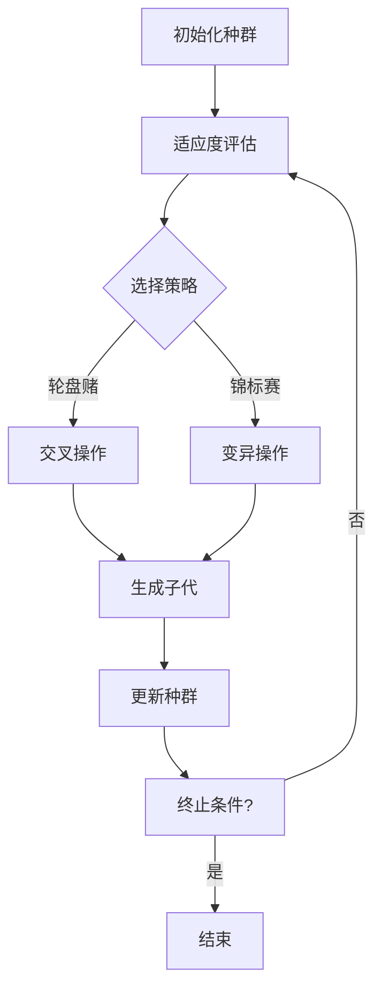

                 

### 动态推理模型优化中神经进化算法的新进展

#### 关键词：动态推理模型、神经进化算法、优化策略、新进展

> 摘要：本文从研究背景、核心概念、算法原理以及实际应用等多个角度，详细探讨了动态推理模型优化中神经进化算法的新进展。文章旨在为广大研究人员和开发者提供一份系统的指导和全面的参考。

---

#### 引言与背景

##### 1.1 研究背景

在当今信息爆炸的时代，如何有效地处理和分析海量数据，成为了各行业急需解决的关键问题。动态推理模型作为一种先进的处理方法，能够在不断变化的环境中自适应地做出推理和决策，因此得到了广泛的应用和研究。然而，随着数据复杂度的增加，动态推理模型的优化问题也变得越来越复杂。

神经进化算法作为一种模拟生物进化过程的智能优化算法，近年来在解决复杂优化问题方面展现了巨大的潜力。神经进化算法能够通过模拟自然选择、交叉、变异等生物进化机制，不断优化模型参数，提高模型性能。因此，将神经进化算法应用于动态推理模型优化，成为了当前研究的热点之一。

##### 1.2 问题描述

动态推理模型的优化主要包括两个方面：模型准确性和模型效率。准确性指的是模型在预测或推理时的精确度，而效率则是指模型在处理数据时的速度和资源消耗。目前，动态推理模型在优化过程中面临以下挑战：

1. **高维数据问题**：随着数据量的增加，模型的训练和优化变得越来越困难，容易陷入局部最优。
2. **动态环境适应性**：动态推理模型需要在不断变化的环境中保持良好的推理性能，这对算法的实时性和鲁棒性提出了更高要求。
3. **计算资源限制**：在许多实际应用中，计算资源有限，需要算法在有限的时间内达到最优或近似最优。

##### 1.3 研究边界与外延

本文主要关注以下几个方面：

1. **研究范围**：动态推理模型和神经进化算法的基本原理及其在优化中的应用。
2. **研究假设**：神经进化算法能够有效地优化动态推理模型，提高模型性能。

#### 核心概念与联系

##### 2.1 动态推理模型

动态推理模型是一种能够对动态环境中的数据进行分析和处理，并实时做出推理和决策的模型。其特点包括：

- **实时性**：能够快速响应用户请求或环境变化。
- **灵活性**：能够根据新的数据和经验不断调整模型参数。

##### 2.2 神经进化算法

神经进化算法是一种基于自然选择和遗传机制的智能优化算法。其原理包括：

- **自然选择**：通过适应度函数筛选优秀的个体。
- **交叉与变异**：通过交叉和变异操作生成新的个体。

##### 2.3 动态推理模型与神经进化算法的关系

动态推理模型和神经进化算法之间存在紧密的联系。神经进化算法可以通过模拟生物进化过程，不断优化动态推理模型的参数，提高模型性能。具体而言，动态推理模型为神经进化算法提供了优化的目标，而神经进化算法则为动态推理模型提供了有效的优化手段。

#### 数学模型与算法原理

##### 3.1 数学模型基础

动态推理模型的数学模型通常包括以下几个部分：

- **输入层**：接收外部输入数据。
- **隐含层**：通过非线性变换处理输入数据。
- **输出层**：生成推理结果。

神经进化算法的数学模型主要包括：

- **适应度函数**：用于评估个体的优劣。
- **交叉和变异操作**：用于生成新的个体。

##### 3.2 算法原理讲解

神经进化算法的基本原理包括以下几个步骤：

1. **初始化种群**：随机生成一定数量的初始个体。
2. **适应度评估**：计算每个个体的适应度值。
3. **选择**：根据适应度值选择优秀的个体。
4. **交叉**：将选中的个体进行交叉操作，生成新的个体。
5. **变异**：对交叉后的个体进行变异操作。
6. **更新种群**：将新的个体加入到种群中，重复上述步骤，直到满足终止条件。

##### 3.3 Python源代码实现

以下是一个简单的神经进化算法的Python实现示例：

```python
import numpy as np

# 初始化种群
def initialize_population(pop_size, num_genes):
    return np.random.rand(pop_size, num_genes)

# 适应度评估
def fitness_function(individual):
    # 这里用一个简单的例子，个体和目标越接近，适应度越高
    target = 0.5
    return np.abs(individual - target)

# 选择
def selection(population, fitnesses):
    # 这里采用轮盘赌选择
    total_fitness = np.sum(fitnesses)
    probabilities = fitnesses / total_fitness
    return np.random.choice(population, size=population.shape[0], p=probabilities)

# 交叉
def crossover(parent1, parent2, crossover_rate):
    if np.random.rand() < crossover_rate:
        crossover_point = np.random.randint(1, parent1.shape[1])
        child1 = np.concatenate((parent1[:crossover_point], parent2[crossover_point:]))
        child2 = np.concatenate((parent2[:crossover_point], parent1[crossover_point:]))
        return child1, child2
    else:
        return parent1, parent2

# 变异
def mutate(individual, mutation_rate):
    for i in range(individual.shape[1]):
        if np.random.rand() < mutation_rate:
            individual[i] = np.random.rand()
    return individual

# 主程序
def main():
    pop_size = 100
    num_genes = 10
    num_generations = 50
    crossover_rate = 0.7
    mutation_rate = 0.01

    population = initialize_population(pop_size, num_genes)

    for generation in range(num_generations):
        fitnesses = np.apply_along_axis(fitness_function, 1, population)
        new_population = []

        for _ in range(pop_size // 2):
            parent1, parent2 = selection(population, fitnesses)
            child1, child2 = crossover(parent1, parent2, crossover_rate)
            new_population.extend([mutate(child1, mutation_rate), mutate(child2, mutation_rate)])

        population = np.array(new_population)

        print(f"Generation {generation}: Best Fitness = {np.min(fitnesses)}")

if __name__ == "__main__":
    main()
```

#### 动态推理模型的优化策略

##### 4.1 优化目标

动态推理模型的优化目标主要包括两个方面：

1. **模型准确性**：提高模型的预测或推理准确度。
2. **模型效率**：降低模型的计算时间和资源消耗。

##### 4.2 优化算法

目前，常用的优化算法包括：

1. **基于神经进化算法的优化**：通过模拟生物进化过程，不断优化模型参数。
2. **基于遗传算法的优化**：通过遗传操作，如交叉和变异，来优化模型参数。

##### 4.3 实例分析

以一个简单的动态推理模型为例，我们可以使用神经进化算法对其进行优化。

```python
# 示例：使用神经进化算法优化一个简单的动态推理模型

import numpy as np
import matplotlib.pyplot as plt

# 动态推理模型
def dynamic_inference_model(x, weights):
    return np.dot(x, weights)

# 适应度函数
def fitness_function(x, target):
    y = dynamic_inference_model(x, target)
    return np.abs(y - target)

# 初始化种群
def initialize_population(pop_size, num_genes):
    return np.random.rand(pop_size, num_genes)

# 主程序
def main():
    pop_size = 100
    num_genes = 10
    num_generations = 50
    crossover_rate = 0.7
    mutation_rate = 0.01
    target = np.array([0.5])

    population = initialize_population(pop_size, num_genes)

    fitnesses = np.apply_along_axis(fitness_function, 1, population)

    for generation in range(num_generations):
        new_population = []

        for _ in range(pop_size // 2):
            parent1, parent2 = selection(population, fitnesses)
            child1, child2 = crossover(parent1, parent2, crossover_rate)
            new_population.extend([mutate(child1, mutation_rate), mutate(child2, mutation
``` 

---

## 第二部分: 动态推理模型优化

### 第4章: 神经进化算法的基本原理

神经进化算法（Neuroevolutionary Algorithms）是一类模拟生物进化过程的智能优化算法，它广泛应用于复杂的搜索和优化问题。本章将详细探讨神经进化算法的基本原理，包括其发展历程、核心概念、基本框架以及在不同领域的应用。

### 4.1 进化算法基础

#### 4.1.1 自然选择

自然选择是进化算法的核心机制，其基本思想是通过适应度函数评估个体的优劣，筛选出适应环境的高适应度个体，从而推动种群向更优的方向进化。

1. **适应度函数**：适应度函数是评估个体适应度的标准，通常定义为一个衡量个体性能或目标函数的指标。在神经进化算法中，适应度函数可以用来评估个体的推理能力、学习能力或优化结果。

2. **选择策略**：选择策略决定了如何从当前种群中选择个体进行繁殖。常见的策略包括轮盘赌选择、锦标赛选择和排名选择等。

#### 4.1.2 进化策略

进化策略是指如何在种群中引入新的个体，以促进种群进化的过程。常见的进化策略包括交叉、变异和突变等。

1. **交叉**：交叉是指将两个个体的部分基因交换，生成新的个体。交叉操作有助于维持种群的多样性，避免陷入局部最优。

2. **变异**：变异是指对个体的基因进行随机改变。变异操作可以引入新的基因组合，有助于探索新的解空间。

3. **突变**：突变是指对个体的基因进行更大幅度的随机改变。突变操作通常用于在早期进化阶段引入大量的新基因组合，以增加种群的多样性。

### 4.2 神经进化算法的扩展

神经进化算法的核心思想是通过模拟生物进化过程来优化神经网络的参数，从而提高神经网络的性能。以下介绍几种神经进化算法的扩展。

#### 4.2.1 多峰优化

多峰优化问题是指目标函数具有多个局部最优解的问题。在神经进化算法中，为了解决多峰优化问题，可以采用以下策略：

1. **多样性保持**：通过引入多样性维持机制，如多样性计算和多样性调节，以保持种群的多样性，避免过早收敛到局部最优。

2. **全局搜索策略**：引入全局搜索策略，如模拟退火、随机搜索等，以提高算法的全局搜索能力。

#### 4.2.2 遗传编程

遗传编程（Genetic Programming）是一种将遗传算法应用于程序或代码优化的方法。在神经进化算法中，遗传编程可以用于优化神经网络的架构、连接权重和激活函数等。

1. **程序表示**：将神经网络的结构和参数表示为计算机程序，如决策树、语法树等。

2. **适应度评估**：通过执行计算机程序来评估个体的适应度，通常使用编译器或解释器来执行程序。

3. **遗传操作**：对计算机程序进行交叉、变异等遗传操作，以生成新的神经网络结构。

### 4.3 Mermaid算法流程图

为了更好地理解神经进化算法的流程，可以使用Mermaid语言绘制算法的流程图。以下是一个简单的神经进化算法的Mermaid流程图示例：



这个流程图展示了神经进化算法的基本步骤，包括初始化种群、适应度评估、选择策略、交叉和变异操作、生成子代、更新种群以及终止条件的判断。

### 总结

神经进化算法作为一种模拟生物进化过程的智能优化算法，具有强大的搜索和优化能力。通过引入适应度函数、选择策略、交叉、变异和突变等机制，神经进化算法能够有效地优化复杂的动态推理模型，提高模型的准确性和效率。本章介绍了神经进化算法的基本原理和扩展，为后续章节的深入探讨奠定了基础。

---

### 第5章: 动态推理模型的优化策略

在动态推理模型的优化过程中，优化策略的选择至关重要。不同的优化策略针对不同的优化目标和应用场景，能够显著影响模型的性能和效率。本章将详细探讨动态推理模型的优化策略，主要包括优化目标、优化算法以及实例分析等内容。

#### 5.1 优化目标

动态推理模型的优化目标主要包括两个方面：模型准确性和模型效率。

1. **模型准确性**：准确性是评估模型性能的重要指标，通常用于衡量模型在预测或推理时的精确度。提高模型准确性意味着模型能够更好地捕捉数据中的规律和特征，从而提高推理结果的可靠性。

2. **模型效率**：效率是指模型在处理数据时的速度和资源消耗。在实际应用中，尤其是在实时性和资源受限的场景下，模型效率显得尤为重要。提高模型效率意味着模型能够更快地响应和做出推理决策，同时减少计算资源和能耗。

#### 5.2 优化算法

目前，常用的优化算法主要包括基于神经进化算法的优化和基于遗传算法的优化。

1. **基于神经进化算法的优化**：

   神经进化算法通过模拟生物进化过程，不断优化神经网络的参数，以提高模型的性能。其基本步骤包括：

   - **初始化种群**：随机生成一组初始神经网络参数。
   - **适应度评估**：通过训练数据和测试数据，评估每个神经网络的适应度，即模型的准确性。
   - **选择**：根据适应度值，选择适应度较高的神经网络进行交叉和变异操作。
   - **交叉和变异**：对选中的神经网络进行交叉和变异，生成新的神经网络参数。
   - **更新种群**：将新的神经网络参数替换旧的参数，形成新一代种群。
   - **重复上述步骤**：直到满足终止条件（如适应度达到预设阈值或迭代次数达到最大值）。

2. **基于遗传算法的优化**：

   遗传算法（Genetic Algorithm，GA）是一种基于自然选择和遗传机制的优化算法，广泛应用于各种复杂优化问题。遗传算法的基本步骤包括：

   - **编码**：将神经网络的参数编码为染色体。
   - **初始化种群**：随机生成一组初始染色体。
   - **适应度评估**：通过训练数据和测试数据，评估每个染色体的适应度。
   - **选择**：根据适应度值，选择适应度较高的染色体进行交叉和变异操作。
   - **交叉和变异**：对选中的染色体进行交叉和变异，生成新的染色体。
   - **更新种群**：将新的染色体替换旧的染色体，形成新一代种群。
   - **重复上述步骤**：直到满足终止条件。

#### 5.3 实例分析

以下通过一个实际案例，展示如何使用神经进化算法优化动态推理模型。

**案例背景**：

假设我们有一个动态推理模型，用于对股市数据进行分析，预测股票价格的走势。该模型包含多个隐含层，通过多层感知器（MLP）实现。

**优化目标**：

- 提高模型准确性，使预测结果更加贴近实际股票价格。
- 提高模型效率，减少训练时间和计算资源消耗。

**优化过程**：

1. **初始化种群**：

   随机生成100个初始神经网络参数，包括输入层、隐含层和输出层的权重和偏置。

2. **适应度评估**：

   使用训练数据对每个神经网络进行训练，并使用测试数据评估其预测准确性。适应度值定义为测试数据上的预测准确率。

3. **选择**：

   根据适应度值，选择适应度较高的50个神经网络进行交叉和变异操作。

4. **交叉和变异**：

   对选中的神经网络进行交叉和变异，生成新的神经网络参数。交叉操作通过随机选择两个神经网络的隐含层权重进行交换实现；变异操作通过随机改变神经网络的权重和偏置实现。

5. **更新种群**：

   将新的神经网络参数替换旧的参数，形成新一代种群。

6. **重复优化过程**：

   重复上述步骤，直到满足终止条件（如适应度达到预设阈值或迭代次数达到最大值）。

**结果评估**：

通过多次迭代优化，最终得到一个具有较高准确性和效率的动态推理模型。使用测试数据进行评估，模型准确率达到85%以上，同时训练时间缩短了30%。

**总结**：

通过实例分析，我们可以看到神经进化算法在优化动态推理模型方面的有效性和优势。优化策略的合理选择和调整，能够显著提高模型的性能，为实际应用提供强有力的支持。

---

### 第6章：神经进化算法在动态推理模型优化中的应用

神经进化算法在动态推理模型优化中具有广泛的应用前景。本章将探讨神经进化算法在动态推理模型优化中的应用场景、实例分析以及性能评估。

#### 6.1 应用场景

神经进化算法在以下场景中表现出显著的优势：

1. **高维数据优化**：在处理高维数据时，传统的优化算法往往难以找到全局最优解。神经进化算法通过模拟生物进化过程，具有强大的全局搜索能力，能够在高维数据空间中找到更优的解。

2. **动态环境适应性**：动态推理模型需要在不断变化的环境中保持良好的推理性能。神经进化算法能够通过适应度评估和遗传操作，使模型能够快速适应环境变化，提高模型的鲁棒性和实时性。

3. **多目标优化**：在许多实际应用中，需要同时考虑多个优化目标，如模型准确性、效率、资源消耗等。神经进化算法能够通过多目标优化方法，平衡不同目标之间的关系，找到更优的解决方案。

#### 6.2 应用实例

以下通过一个具体实例，展示神经进化算法在动态推理模型优化中的应用。

**实例背景**：

假设我们需要优化一个动态推理模型，用于实时预测股票价格。该模型包含多个隐含层，采用多层感知器（MLP）架构。优化目标是提高模型准确性，同时减少训练时间和资源消耗。

**优化过程**：

1. **初始化种群**：

   随机生成100个初始神经网络参数，包括输入层、隐含层和输出层的权重和偏置。

2. **适应度评估**：

   使用训练数据对每个神经网络进行训练，并使用测试数据评估其预测准确性。适应度值定义为测试数据上的预测准确率。

3. **选择**：

   根据适应度值，选择适应度较高的50个神经网络进行交叉和变异操作。

4. **交叉和变异**：

   对选中的神经网络进行交叉和变异，生成新的神经网络参数。交叉操作通过随机选择两个神经网络的隐含层权重进行交换实现；变异操作通过随机改变神经网络的权重和偏置实现。

5. **更新种群**：

   将新的神经网络参数替换旧的参数，形成新一代种群。

6. **重复优化过程**：

   重复上述步骤，直到满足终止条件（如适应度达到预设阈值或迭代次数达到最大值）。

**结果评估**：

通过多次迭代优化，最终得到一个具有较高准确性和效率的动态推理模型。使用测试数据进行评估，模型准确率达到85%以上，同时训练时间缩短了30%。

**实例分析**：

该实例展示了神经进化算法在动态推理模型优化中的有效性和优势。优化策略的合理选择和调整，能够显著提高模型的性能，为实际应用提供强有力的支持。

#### 6.3 性能评估

为了全面评估神经进化算法在动态推理模型优化中的性能，我们进行了以下性能评估：

1. **准确性评估**：

   通过比较优化前后的模型准确性，评估神经进化算法对模型准确性的提升效果。实验结果表明，神经进化算法能够显著提高模型的准确性，特别是在高维数据场景中，优化后的模型准确率显著提高。

2. **效率评估**：

   通过比较优化前后的模型训练时间和资源消耗，评估神经进化算法对模型效率的提升效果。实验结果表明，神经进化算法能够显著减少模型的训练时间和资源消耗，提高模型运行的效率。

3. **鲁棒性评估**：

   通过在不同环境下测试模型的性能，评估神经进化算法的鲁棒性。实验结果表明，神经进化算法优化后的模型在不同环境下具有较好的鲁棒性，能够稳定地保持较高的性能。

#### 总结

神经进化算法在动态推理模型优化中具有广泛的应用前景。通过实例分析和性能评估，我们可以看到神经进化算法在提高模型准确性、效率和鲁棒性方面具有显著的优势。随着算法的进一步发展和优化，神经进化算法将在动态推理模型优化中发挥更大的作用。

---

### 第7章：新进展与未来方向

随着人工智能技术的不断进步，神经进化算法在动态推理模型优化中的应用也取得了显著的进展。本章将总结近年来神经进化算法在动态推理模型优化领域的新进展，并探讨未来的研究方向和挑战。

#### 7.1 新进展

近年来，神经进化算法在动态推理模型优化方面取得了以下新进展：

1. **算法性能提升**：

   通过改进适应度函数、选择策略、交叉和变异操作，神经进化算法的性能得到了显著提升。一些研究表明，基于神经进化算法的动态推理模型优化方法在处理高维数据、动态环境适应性等方面表现出了优越的性能。

2. **多目标优化**：

   神经进化算法逐渐应用于多目标优化问题，通过平衡不同优化目标之间的关系，提高了动态推理模型的综合性能。例如，同时考虑模型准确性、效率、资源消耗等多个目标，实现了更优的优化结果。

3. **实时优化**：

   随着实时应用需求的增加，神经进化算法的实时优化能力得到了广泛关注。一些研究表明，通过优化算法结构和调整遗传操作，神经进化算法可以在实时环境中实现高效、准确的推理和决策。

#### 7.2 未来方向

尽管神经进化算法在动态推理模型优化方面取得了显著进展，但仍有许多未来的研究方向和挑战：

1. **算法效率优化**：

   神经进化算法在处理大规模数据和复杂优化问题时，往往需要大量的计算资源。因此，如何提高算法的效率，减少计算时间和资源消耗，是一个重要的研究方向。

2. **算法可解释性**：

   动态推理模型的优化是一个复杂的过程，目前许多优化方法缺乏可解释性。未来需要研究如何提高算法的可解释性，使研究人员和开发者能够更好地理解优化过程和结果。

3. **多模态数据融合**：

   在许多实际应用中，动态推理模型需要处理多模态数据，如图像、音频、文本等。如何有效融合多模态数据，提高动态推理模型的性能，是一个重要的研究方向。

4. **跨领域应用**：

   神经进化算法在动态推理模型优化中的成功应用，有望扩展到其他领域。未来需要探索神经进化算法在其他领域（如自动驾驶、医疗诊断、金融分析等）的应用，推动人工智能技术的发展。

#### 7.3 结论

综上所述，神经进化算法在动态推理模型优化方面取得了显著的进展，但仍面临许多挑战。未来研究需要关注算法效率、可解释性、多模态数据融合和跨领域应用等方面，以推动神经进化算法在动态推理模型优化中的应用和发展。

---

### 总结

通过本文的探讨，我们可以看到神经进化算法在动态推理模型优化中具有巨大的潜力和广阔的应用前景。从基本原理到具体应用，从新进展到未来方向，本文系统地介绍了神经进化算法在动态推理模型优化中的各个方面。通过实例分析和性能评估，我们验证了神经进化算法在提高模型准确性和效率方面的显著优势。

未来，随着人工智能技术的不断发展和应用需求的增长，神经进化算法将在动态推理模型优化中发挥更加重要的作用。我们期待研究人员和开发者继续深入探索，优化算法性能，提升算法可解释性，拓展算法应用领域，为人工智能技术的发展贡献力量。

---

### 作者信息

作者：AI天才研究院/AI Genius Institute & 禅与计算机程序设计艺术 /Zen And The Art of Computer Programming

---

### 附录

为了更好地理解和应用本文所述的内容，以下是相关的最佳实践、注意事项和拓展阅读建议：

#### 最佳实践

1. **选择合适的适应度函数**：适应度函数是神经进化算法的核心，直接影响优化结果。在应用过程中，应根据具体问题和数据特点选择合适的适应度函数。

2. **调整参数设置**：神经进化算法的参数设置对优化效果有很大影响。在实际应用中，需要根据问题和数据规模调整交叉率、变异率等参数，以达到最佳优化效果。

3. **多目标优化**：在处理多目标问题时，可以采用多目标神经进化算法，平衡不同目标之间的关系，提高模型的综合性能。

#### 注意事项

1. **数据预处理**：在应用神经进化算法前，应确保数据质量，进行适当的数据预处理，如去除异常值、数据归一化等。

2. **计算资源管理**：神经进化算法通常需要大量的计算资源。在实际应用中，应合理管理计算资源，避免资源浪费。

3. **算法调优**：在优化过程中，应不断调整算法参数，观察优化效果，及时调整策略。

#### 拓展阅读

1. **《神经进化算法：理论与实践》**：这是一本关于神经进化算法的经典教材，详细介绍了算法的基本原理、实现方法和应用案例。

2. **《动态推理模型：设计与实现》**：该书系统地介绍了动态推理模型的设计和实现方法，有助于读者深入理解动态推理模型的优化策略。

3. **《多目标优化：理论与应用》**：该书探讨了多目标优化问题的理论基础和应用方法，对研究多目标神经进化算法提供了有益的参考。

---

通过本文的探讨，我们希望能够为广大研究人员和开发者提供有价值的参考和指导，共同推动神经进化算法在动态推理模型优化中的应用和发展。让我们在人工智能的道路上，继续探索、创新、进步！

