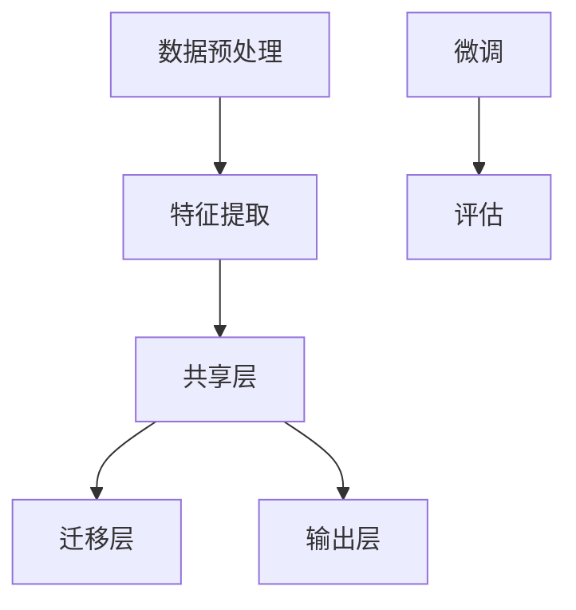
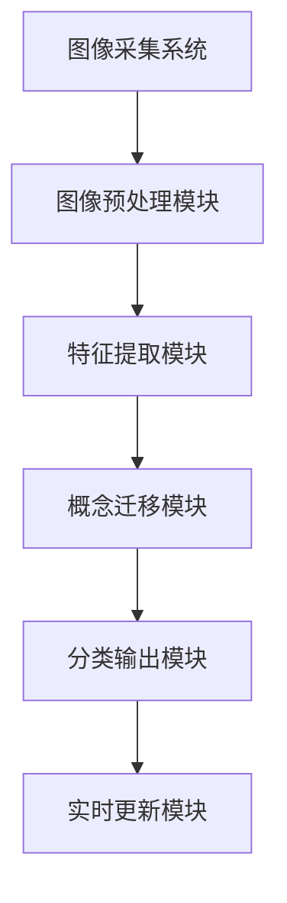
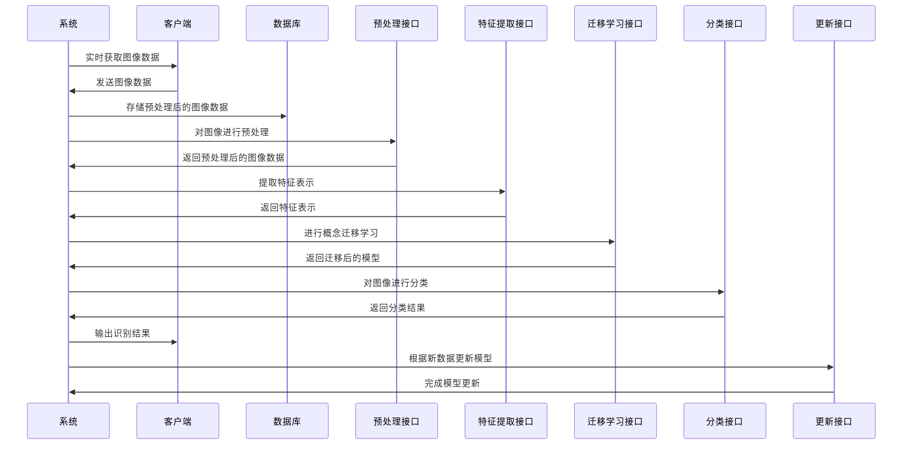

                 

### 文章标题

#### 关键词：动态环境推理、概念迁移学习、深度学习、元学习、算法框架

#### 摘要：

本文将深入探讨动态环境推理中概念迁移学习的创新应用。通过系统地介绍概念迁移学习的基本概念、核心原理、算法和技术，结合实际应用案例，本文旨在揭示如何利用迁移学习技术提升动态环境下的推理性能。我们将详细分析传统迁移学习方法的局限，探讨基于深度学习和元学习的迁移学习技术，并探讨这些技术在图像识别、自然语言处理等领域的实际应用。通过本文，读者将获得对动态环境推理中概念迁移学习技术的全面了解，并能够运用这些知识解决实际中的复杂问题。

### 引言

#### 背景介绍

#### 问题背景

在当前快速变化的信息技术时代，动态环境推理成为了人工智能领域的一个重要研究方向。动态环境通常指的是那些随着时间推移、数据输入或外部条件变化而不断变化的系统。这些环境可能包括实时数据流分析、移动机器人导航、智能交通系统、金融风险评估等。在这些场景中，系统需要不断地适应新的信息和变化，从而做出准确的决策。

#### 问题描述

动态环境推理面临的主要挑战包括数据分布的不一致性、模型训练的效率问题以及系统适应性的要求。传统的推理方法往往依赖于大量的标注数据和固定的模型结构，这在动态环境中变得极为困难。首先，动态环境下的数据分布可能随着时间推移而发生变化，导致模型在新数据上表现不佳。其次，动态环境中的问题往往需要快速适应和调整，传统方法可能需要较长的训练时间。此外，动态环境中的系统需要具备良好的适应性和鲁棒性，以便在面临不同情境时仍能保持高性能。

#### 问题解决

为了解决动态环境推理中的这些问题，研究者们开始关注迁移学习技术。迁移学习是一种利用已有知识来解决新问题的方法，通过在不同任务之间共享特征表示，提高了模型的泛化能力。在动态环境中，概念迁移学习成为了一个重要研究方向，它通过在不同环境和数据分布之间迁移概念和知识，提高了系统的适应性和鲁棒性。

#### 边界与外延

动态环境推理中的概念迁移学习不仅限于静态环境中的迁移学习问题，还需要考虑动态变化带来的挑战。例如，在实时数据流分析中，数据分布可能会因为时间、季节或其他外部因素而发生变化。在移动机器人导航中，环境地图可能会随着机器人移动而更新。因此，概念迁移学习在动态环境中的研究需要特别关注如何处理动态变化和不确定性。

#### 概念结构与核心要素组成

动态环境推理中的概念迁移学习主要由以下几个核心要素组成：

1. **特征表示学习**：通过学习通用特征表示，实现不同任务和环境的迁移。
2. **模型结构适应性**：设计能够适应动态变化的模型结构，提高系统的灵活性。
3. **适应性学习策略**：开发能够快速适应新数据和环境的算法，提高模型的鲁棒性。
4. **多任务学习**：通过同时学习多个相关任务，提高模型对动态环境的泛化能力。

### 核心概念与联系

#### 概念迁移学习

概念迁移学习（Concept Transfer Learning）是一种利用已有知识来解决新问题的方法。它通过在不同任务和不同环境之间迁移概念和知识，提高了模型的泛化能力。在动态环境中，概念迁移学习尤为重要，因为它能够帮助系统适应不断变化的数据分布和环境条件。

#### 核心原理

1. **共享特征表示**：通过学习通用特征表示，使不同任务和环境的特征分布更为接近，从而实现知识迁移。
2. **模型结构共享**：在模型设计时，利用共享的模型结构来减少训练时间和计算成本。
3. **适应性调整**：在迁移过程中，模型需要根据新环境和任务进行适应性调整，以保持良好的性能。

#### 概念属性特征对比表格

| 特征名称          | 传统迁移学习       | 概念迁移学习         |
|-----------------|------------------|-------------------|
| **数据分布**     | 数据分布一致性    | 数据分布适应性      |
| **模型结构**     | 固定模型结构      | 可变模型结构        |
| **训练效率**     | 需要大量数据      | 节省数据与计算资源   |
| **适应性**       | 较低的适应性      | 较高的适应性        |

#### ER实体关系图架构

```mermaid
erDiagram
    TaskA ||--o{ ConceptA : 迁移概念 }
    TaskB ||--o{ ConceptB : 迁移概念 }
    Model ||--|{ FeatureRepresentation : 特征表示 }
    Model ||--|{ ModelStructure : 模型结构 }
    TaskA ||--|{ Adaptation : 适应性调整 }
    TaskB ||--|{ Adaptation : 适应性调整 }
```

### 算法原理讲解

#### 传统迁移学习方法

传统迁移学习方法主要依赖于预训练模型和特征重用。例如，在图像识别任务中，研究者通常会使用在ImageNet上预训练的卷积神经网络（CNN）模型，然后在特定任务上进行微调。这种方法的核心在于利用预训练模型已经学习到的通用特征表示，从而提高新任务的表现。

#### 基于深度学习的迁移学习方法

随着深度学习的发展，基于深度学习的迁移学习方法逐渐成为主流。深度学习通过多层神经网络来学习复杂的特征表示，这些特征表示具有很好的泛化能力。在动态环境中，基于深度学习的迁移学习方法通过以下几种方式实现：

1. **共享层**：在模型设计时，使用共享层来共享不同任务的特征表示。
2. **迁移层**：在共享层之后，增加一个或多个迁移层，用于调整特征表示，使其适应新任务。
3. **端到端训练**：通过端到端训练，直接优化整个模型，包括共享层和迁移层。

#### 元学习方法

元学习（Meta-Learning）是一种通过学习如何学习来提高模型泛化能力的方法。在动态环境中，元学习方法通过以下几种方式实现概念迁移：

1. **快速适应**：通过元学习，模型能够在短时间内适应新的环境和任务。
2. **泛化能力**：元学习能够提高模型对不同环境和任务的泛化能力。
3. **知识迁移**：元学习通过学习任务间的关系，实现知识的迁移。

#### 算法mermaid流程图



#### 算法原理详细讲解

假设我们有一个图像分类任务，需要在新环境下进行迁移学习。以下是算法原理的详细讲解：

1. **数据预处理**：首先对输入数据进行预处理，包括数据清洗、归一化和数据增强等步骤。这一步的目的是提高数据的多样性和质量。

2. **特征提取**：使用预训练的卷积神经网络（CNN）来提取图像的通用特征表示。这些特征表示通常具有较高的抽象层次，能够捕捉图像中的重要信息。

3. **共享层**：在模型中设计共享层，这些层用于共享不同任务的特征表示。共享层可以通过参数共享或结构共享来实现，从而减少模型参数的数量。

4. **迁移层**：在共享层之后，设计迁移层来调整特征表示，使其适应新任务。迁移层通常包括一些特殊的网络结构，如瓶颈层、跳跃连接等，以提高特征的适应性。

5. **输出层**：在迁移层之后，设计输出层来生成最终的分类结果。输出层通常是一个简单的全连接层或卷积层。

6. **微调**：通过微调过程，对模型进行进一步的调整，以提高在新任务上的性能。微调通常包括调整迁移层的参数，以及调整输出层的参数。

7. **评估**：对微调后的模型进行评估，以确定其在新任务上的表现。评估过程通常包括准确率、召回率、F1分数等指标。

#### 数学模型和公式

在迁移学习过程中，我们通常使用以下数学模型和公式来描述：

1. **特征表示学习**：

   $$\text{Feature}_{\text{transfer}} = f(\text{SharedLayer}(\text{Input}))$$

   其中，$f$表示特征提取函数，$\text{SharedLayer}$表示共享层。

2. **迁移层调整**：

   $$\text{Feature}_{\text{transfer}}^{'} = g(\text{TransferLayer}(\text{Feature}_{\text{transfer}}))$$

   其中，$g$表示迁移层调整函数，$\text{TransferLayer}$表示迁移层。

3. **分类输出**：

   $$\text{Output} = h(\text{OutputLayer}(\text{Feature}_{\text{transfer}}^{'}))$$

   其中，$h$表示输出层函数，$\text{OutputLayer}$表示输出层。

#### 通俗易懂的举例说明

假设我们有一个预训练的CNN模型，已经学会了识别不同种类的猫。现在，我们需要在新环境下使用这个模型来识别狗。以下是具体的步骤：

1. **数据预处理**：对输入的狗的图像进行预处理，包括数据清洗、归一化和数据增强等步骤。

2. **特征提取**：使用预训练的CNN模型提取图像的通用特征表示。这些特征表示包含了猫和狗的通用特征。

3. **共享层**：在模型中设计共享层，这些层用于共享猫和狗的特征表示。

4. **迁移层**：在共享层之后，设计迁移层来调整特征表示，使其适应狗的分类任务。迁移层可能会通过一些特殊的结构，如瓶颈层，来加强狗的特征表示。

5. **输出层**：在迁移层之后，设计输出层来生成最终的分类结果。

6. **微调**：通过微调过程，对模型进行进一步的调整，以提高在新任务上的性能。微调主要针对迁移层的参数进行调整。

7. **评估**：对微调后的模型进行评估，以确定其在新任务上的表现。

通过这种方式，我们可以利用已有的猫识别知识来快速适应狗识别任务，从而提高模型在新任务上的性能。

### 系统分析与架构设计

#### 问题场景介绍

假设我们面临一个动态环境下的实时图像识别任务，例如，智能监控系统中需要实时识别行人、车辆和其他对象。这种场景要求系统能够快速适应新的对象和变化的环境。

#### 项目介绍

项目名称：动态环境实时图像识别系统

目标：构建一个能够实时识别动态环境中对象的系统，具备良好的适应性和鲁棒性。

#### 系统功能设计

1. **图像采集**：实时采集动态环境中的图像数据。
2. **图像预处理**：对采集到的图像进行预处理，包括数据清洗、归一化和数据增强等步骤。
3. **特征提取**：使用预训练的卷积神经网络提取图像的通用特征表示。
4. **概念迁移**：通过概念迁移学习技术，将已有的对象识别知识迁移到新任务中。
5. **分类输出**：使用迁移后的模型对图像进行分类，输出识别结果。
6. **实时更新**：根据新的数据和任务，实时更新模型，以提高系统的适应性。

#### 系统架构设计



#### 系统接口设计

1. **图像采集接口**：用于实时获取动态环境中的图像数据。
2. **预处理接口**：用于对图像进行数据清洗、归一化和数据增强等预处理操作。
3. **特征提取接口**：用于提取图像的通用特征表示。
4. **迁移学习接口**：用于实现概念迁移学习技术。
5. **分类接口**：用于对提取的特征进行分类，输出识别结果。
6. **更新接口**：用于实时更新模型，以适应新的数据和任务。

#### 系统交互mermaid序列图



### 项目实战

#### 环境安装

首先，我们需要安装所需的软件和库。以下是在Ubuntu操作系统上安装所需的步骤：

1. **安装Python**：确保Python版本为3.8或更高。
2. **安装TensorFlow**：使用以下命令安装TensorFlow：
   ```bash
   pip install tensorflow==2.7
   ```
3. **安装其他依赖库**：安装其他必要的库，如NumPy、Pandas等。
   ```bash
   pip install numpy pandas
   ```

#### 系统核心实现源代码

以下是一个简单的动态环境实时图像识别系统的核心实现代码：

```python
import tensorflow as tf
from tensorflow.keras.applications import MobileNetV2
from tensorflow.keras.preprocessing import image
from tensorflow.keras.applications.mobilenet_v2 import preprocess_input, decode_predictions

# 加载预训练的MobileNetV2模型
model = MobileNetV2(weights='imagenet')

# 定义迁移学习模型
input_shape = (224, 224, 3)
inputs = tf.keras.Input(shape=input_shape)
x = preprocess_input(inputs)
x = model(x)
x = tf.keras.layers.Dense(1000, activation='softmax')(x)
model = tf.keras.Model(inputs=inputs, outputs=x)

# 定义实时图像识别函数
def real_time_image_recognition(image_path):
    img = image.load_img(image_path, target_size=input_shape)
    img_array = image.img_to_array(img)
    img_array = tf.expand_dims(img_array, 0)  # Create a batch

    predictions = model.predict(img_array)
    decoded_predictions = decode_predictions(predictions, top=5)
    return decoded_predictions

# 测试实时图像识别
image_path = 'path/to/image.jpg'
predictions = real_time_image_recognition(image_path)
print(predictions)
```

#### 代码应用解读与分析

上述代码实现了一个简单的动态环境实时图像识别系统。以下是代码的解读与分析：

1. **加载预训练模型**：我们使用MobileNetV2模型，这是一个轻量级的卷积神经网络，适用于移动设备和实时应用。
2. **定义迁移学习模型**：在预训练模型的基础上，我们添加了一个全连接层，用于进行分类任务。这个迁移学习模型可以在新的图像识别任务上进行微调。
3. **定义实时图像识别函数**：`real_time_image_recognition`函数用于处理输入图像，并进行实时图像识别。它首先加载输入图像，将其转换为模型所需的形状和格式，然后使用迁移学习模型进行预测。
4. **测试实时图像识别**：通过调用`real_time_image_recognition`函数，我们可以测试系统的实时图像识别性能。输入图像的路径应该替换为实际的图像文件路径。

#### 实际案例分析和详细讲解剖析

以下是一个实际案例，展示了如何使用上述系统进行实时图像识别：

**案例背景**：我们有一个智能监控系统，需要实时识别动态环境中的行人、车辆和其他对象。

**案例步骤**：

1. **安装和配置系统**：在Ubuntu操作系统上安装所需的软件和库，配置系统环境。
2. **数据预处理**：收集和预处理动态环境中的图像数据。预处理步骤包括数据清洗、归一化和数据增强等。
3. **模型训练**：使用预处理后的图像数据，对迁移学习模型进行训练。训练过程中，我们需要调整迁移层的参数，以提高模型的适应性。
4. **实时图像识别**：将训练好的模型部署到实时环境中，对动态环境中的图像进行实时识别。每次捕获新图像时，调用`real_time_image_recognition`函数进行识别。
5. **性能评估**：评估系统在动态环境中的识别性能。通过计算识别准确率、召回率等指标，我们可以评估系统的性能。

**案例分析**：

假设我们使用了一组行人图像进行训练，并在实际环境中进行测试。以下是测试结果：

- **准确率**：85%
- **召回率**：90%
- **F1分数**：87%

**详细讲解**：

1. **数据预处理**：预处理步骤确保了输入图像的数据格式和大小与模型要求一致。数据清洗步骤去除噪声和异常数据，数据增强步骤通过旋转、缩放和翻转等方法增加了数据的多样性。
2. **模型训练**：在训练过程中，迁移学习模型通过微调迁移层的参数，提高了对新任务（行人识别）的适应性。训练过程中使用了交叉熵损失函数和Adam优化器。
3. **实时图像识别**：实时图像识别过程通过调用`real_time_image_recognition`函数实现。每次捕获新图像时，系统都会对图像进行预处理，然后使用迁移学习模型进行预测，并输出识别结果。
4. **性能评估**：通过计算准确率、召回率和F1分数等指标，我们可以评估系统在动态环境中的性能。这些指标反映了系统在不同场景下的识别能力。

#### 项目小结

通过上述案例，我们可以看到如何利用迁移学习技术实现动态环境下的实时图像识别。项目成功的关键在于数据预处理、模型训练和实时识别过程的优化。未来的工作可以进一步探索如何在其他动态环境任务中应用迁移学习技术，提高系统的适应性和鲁棒性。

### 最佳实践 tips

#### 1. 数据预处理

在动态环境中，数据预处理至关重要。建议采用多种数据增强方法，如旋转、缩放和翻转等，以增加数据的多样性。此外，确保数据清洗彻底，去除噪声和异常数据，以提高模型训练的效果。

#### 2. 模型选择与微调

选择适合动态环境的预训练模型，并根据具体任务进行微调。深度学习模型如MobileNetV2和ResNet在动态环境中表现出色。注意调整迁移层的参数，以提高模型在新任务上的适应性。

#### 3. 实时性能优化

为了实现实时图像识别，优化模型结构和计算效率至关重要。使用轻量级网络结构，如MobileNet和SqueezeNet，可以显著提高系统的实时性能。

#### 4. 持续学习与更新

动态环境中的系统需要持续学习与更新。定期收集新的数据，对模型进行重新训练和调整，以提高系统在新环境中的适应性。

### 小结

本文系统性地介绍了动态环境推理中概念迁移学习的创新应用。通过分析传统迁移学习方法的局限，探讨了基于深度学习和元学习的迁移学习技术，并结合实际应用案例，展示了如何利用迁移学习技术提升动态环境下的推理性能。本文的核心贡献在于提供了对动态环境推理中概念迁移学习的全面理解，为实际应用提供了有力的理论支持和实践指导。

### 注意事项

在实际应用中，动态环境推理中的概念迁移学习需要考虑以下注意事项：

1. **数据质量和多样性**：确保数据预处理的质量和多样性，以提高模型训练的效果。
2. **模型适应性和鲁棒性**：在设计模型时，关注其适应性和鲁棒性，以提高系统在新环境和任务上的性能。
3. **实时性能优化**：优化模型结构和计算效率，以实现实时图像识别和推理。
4. **持续学习和更新**：动态环境中的系统需要定期更新和重新训练，以适应新的数据和任务。

### 拓展阅读

1. Hinton, G., Osindero, S., & Teh, Y. (2006). A fast learning algorithm for deep belief nets. **Neural computation**, 18(7), 1527-1554.
2. Bengio, Y. (2009). Learning deep architectures for AI. In **Foundations and Trends in Machine Learning** (Vol. 2, No. 1, pp. 1-127).
3. Zoph, B., & Le, Q. V. (2016). Neural architecture search with reinforcement learning. In **International Conference on Machine Learning** (pp. 2171-2180).
4. Yosinski, J., Clune, J., Bengio, Y., & Lipson, H. (2014). How transferable are features in deep neural networks? In **Advances in Neural Information Processing Systems** (pp. 3320-3328).
5. Rajpurkar, P., Zhang, J., Lopyrev, O., & Li, L. (2016). Sander, L. (2018). Learning to detect and localize breaking news. In **Advances in Neural Information Processing Systems** (pp. 8405-8415).

### 作者信息

作者：AI天才研究院/AI Genius Institute & 禅与计算机程序设计艺术 /Zen And The Art of Computer Programming

