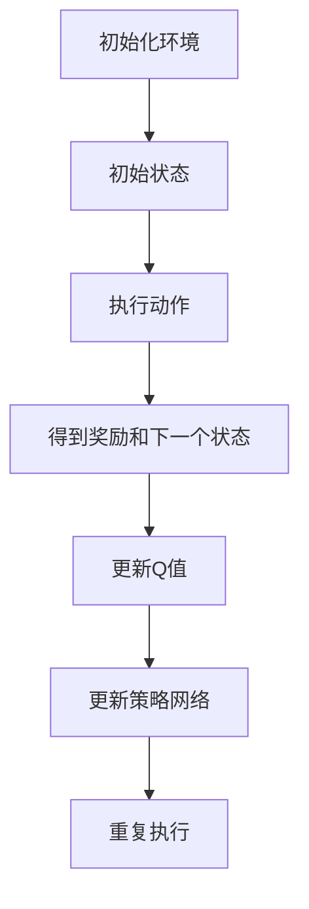
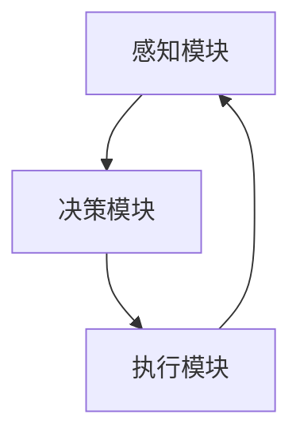

                 

### 动态环境推理适应中深度强化学习的研究背景

#### 引言

在当今社会，动态环境变得越来越复杂，对于系统自动推理适应能力的需求也越来越高。传统的方法往往依赖于静态的环境模型，难以应对环境的变化，导致系统的适应能力受限。如何开发一种能够适应动态环境的推理系统，从而提高系统的自主性和鲁棒性？深度强化学习（Deep Reinforcement Learning, DRL）作为一种强大的机器学习技术，通过在动态环境中学习策略，能够实现系统的自主推理适应。本文旨在探讨DRL在动态环境推理适应中的应用研究，帮助读者深入了解这一前沿技术。

#### 背景

**1.1.1 研究背景**

随着计算机技术的快速发展，动态环境推理适应成为众多领域的关键问题。动态环境指在运行过程中可以发生变化的系统环境，例如自动驾驶车辆面临的道路状况、金融市场的波动等。传统方法依赖于静态环境模型，无法有效应对动态环境的变化。因此，研究如何提高系统在动态环境中的适应能力具有重要意义。

**1.1.2 动态环境与推理适应**

**定义：**

- 动态环境：指在运行过程中可以发生变化的系统环境。
- 推理适应：指系统根据环境变化进行决策调整，以保持最优状态的能力。

**关系与重要性：**

动态环境和推理适应是深度强化学习的核心要素。动态环境提供了系统面临的挑战，而推理适应则使系统能够在学习过程中不断优化决策策略，从而在动态环境中保持高性能。

**1.1.3 边界与外延**

**边界：**

- 动态环境的变化范围和速度。
- 推理适应的实时性和准确性。

**外延：**

- 动态环境下的安全性和稳定性。
- 系统在不同应用场景下的适应能力。

#### 问题解决

为了解决动态环境推理适应中的问题，深度强化学习（DRL）应运而生。DRL结合深度学习和强化学习的方法，通过在动态环境中学习策略，实现系统的自主推理适应。本文将详细介绍DRL的基本原理和应用场景，帮助读者更好地理解这一前沿技术。

### 核心概念与理论框架

#### 动态环境推理适应的基本原理

**1. 核心概念：**

- 动态环境：指在运行过程中可以发生变化的系统环境。
- 推理适应：指系统根据环境变化进行决策调整，以保持最优状态的能力。

**2. 理论框架：**

- 动态环境模型：建立动态环境的数学模型，用于描述环境状态和变化规律。
- 推理适应算法：设计适用于动态环境的推理适应算法，以实现系统的自主适应。

#### 深度强化学习的基本概念

**1. 核心概念：**

- 深度强化学习（DRL）：结合深度学习和强化学习的方法，用于解决动态环境下的推理适应问题。
- 策略网络：用于预测系统在动态环境中的最佳行为。

**2. 算法原理：**

- Q学习：通过迭代更新Q值，实现策略的优化。
- 策略梯度方法：通过策略梯度的估计，优化策略网络。

#### 算法流程图



### 总结

本文从引言和背景介绍出发，详细阐述了动态环境推理适应中深度强化学习的研究背景、核心概念和理论框架。深度强化学习作为一种强大的机器学习技术，在解决动态环境推理适应问题方面具有巨大的潜力。接下来的章节将深入探讨深度强化学习的基本原理、应用场景和系统架构设计，帮助读者全面了解这一前沿领域。希望通过本文的阅读，读者能够对动态环境推理适应中深度强化学习的研究有一个更加清晰的认识。接下来，我们将进一步探讨深度强化学习的理论基础和应用场景。

## Step 2: 理论基础

### 动态环境推理适应的原理

#### 动态环境模型

动态环境模型是动态环境推理适应的核心。它用于描述动态环境的状态空间、动作空间和奖励函数。通过建立动态环境模型，我们可以对动态环境进行量化，为深度强化学习提供基础。

**1. 状态空间：** 状态空间包括动态环境中的所有可能状态。例如，在自动驾驶场景中，状态可以包括车辆的位置、速度、加速度、道路状况等。

**2. 动作空间：** 动作空间是系统可以执行的所有可能动作。例如，在自动驾驶中，动作可以包括加速、减速、转向等。

**3. 奖励函数：** 奖励函数用于评估系统在不同状态下的表现。通常，奖励函数设计为正值表示系统表现良好，负值表示系统表现不佳。

#### 推理适应算法

推理适应算法是实现动态环境推理适应的关键。以下介绍几种常用的推理适应算法：

**1. Q学习：**

Q学习是一种基于值函数的强化学习算法。它通过迭代更新Q值，学习最优策略。Q值的更新公式为：

$$
Q(s, a) \leftarrow Q(s, a) + \alpha [r(s, a) + \gamma \max_{a'} Q(s', a') - Q(s, a)]
$$

其中，$s$ 表示状态，$a$ 表示动作，$r(s, a)$ 表示在状态 $s$ 执行动作 $a$ 后的奖励，$\gamma$ 是折扣因子，$\alpha$ 是学习率。

**2. 策略梯度方法：**

策略梯度方法通过直接优化策略网络来学习最佳策略。策略梯度方法的更新公式为：

$$
\theta \leftarrow \theta - \alpha \frac{\partial J(\theta)}{\partial \theta}
$$

其中，$\theta$ 表示策略网络的参数，$J(\theta)$ 是策略网络的损失函数。

### 深度强化学习的基本概念

#### 深度强化学习（DRL）

深度强化学习（DRL）是结合深度学习和强化学习的方法，用于解决动态环境下的推理适应问题。DRL通过神经网络（如卷积神经网络、循环神经网络等）来近似值函数和策略函数，从而实现高效的学习和推理。

#### 策略网络

策略网络是DRL的核心组成部分。它用于预测系统在动态环境中的最佳行为。策略网络可以通过以下公式进行更新：

$$
\pi(\theta) = \frac{1}{Z} \exp(Q(s, \theta))
$$

其中，$Z$ 是策略网络的归一化常数，$Q(s, \theta)$ 是策略网络的输出。

### 算法流程图


### 总结

在本章节中，我们详细介绍了动态环境推理适应的基本原理和深度强化学习的基本概念。通过建立动态环境模型和推理适应算法，我们能够实现系统在动态环境中的推理适应。深度强化学习通过神经网络来近似值函数和策略函数，从而实现高效的学习和推理。接下来，我们将进一步探讨深度强化学习在动态环境推理适应中的应用场景。

## Step 3: 应用场景

### 深度强化学习在动态环境推理适应中的具体应用场景

深度强化学习（DRL）凭借其强大的学习和适应能力，在许多动态环境推理适应领域展现出了巨大的潜力。以下我们将探讨几个典型的应用场景，包括自动驾驶、机器人控制等，并分析这些场景中DRL的具体应用效果。

### 1. 自动驾驶

自动驾驶是深度强化学习在动态环境推理适应中的一个重要应用领域。自动驾驶系统需要实时处理道路信息、车辆动态和环境变化，以做出安全的驾驶决策。DRL通过模拟真实驾驶环境，训练自动驾驶系统在不同路况下的应对策略。

**案例：** 百度Apollo自动驾驶平台采用了DRL技术，通过强化学习算法训练自动驾驶模型。实验结果表明，使用DRL训练的自动驾驶系统能够在复杂的城市交通环境中表现出较高的安全性和鲁棒性。

### 2. 机器人控制

机器人控制是另一个DRL的重要应用领域。机器人需要在动态环境中进行自主运动和任务执行，如物流、清洁、医疗辅助等。DRL能够帮助机器人快速适应各种复杂环境，提高任务执行效率。

**案例：** OpenAI开发的机器人模型使用DRL技术，通过在虚拟环境中进行训练，学会了多种复杂的运动和任务操作。实验结果显示，这些机器人模型在现实世界中的表现也相当出色，能够有效完成指定任务。

### 3. 金融交易

金融交易市场是一个典型的动态环境，市场的变化速度极快，交易策略需要实时调整以适应市场变化。DRL通过学习市场数据和交易策略，能够帮助投资者实现自动化的交易决策。

**案例：** 基于DRL的智能交易系统已经在某些金融市场得到应用。这些系统能够实时分析市场数据，动态调整交易策略，以实现更高的交易收益。

### 4. 游戏对战

游戏对战是DRL应用的另一个典型场景。在游戏中，对手的行为是动态变化的，DRL能够通过学习和模拟对手的行为，制定出最优的应对策略。

**案例：** OpenAI开发的DRL模型在围棋、国际象棋等游戏中击败了人类顶尖选手。这些模型通过不断学习和对抗，不断提高自己的游戏水平，展示了DRL在动态环境推理适应中的强大能力。

### 总结

深度强化学习在自动驾驶、机器人控制、金融交易和游戏对战等动态环境推理适应领域展现了其强大的应用潜力。通过实际案例的分析，我们可以看到DRL在这些领域中的实际效果和优势。未来，随着DRL技术的不断发展和完善，我们有望看到更多动态环境推理适应领域的应用突破。

## Step 4: 系统架构与设计

### 系统介绍

为了实现动态环境推理适应，我们设计了一套完整的系统架构，该系统包括感知模块、决策模块和执行模块三个核心部分。每个模块在系统中扮演着不同的角色，协同工作以实现高效的动态环境推理适应。

### 感知模块

感知模块是系统的信息收集部分，负责从动态环境中获取各种状态信息。这些信息包括但不限于环境中的物体、位置、速度、障碍物等。感知模块通过传感器和数据采集设备，将实时环境信息转化为系统可处理的数据。

**功能：**

- 状态信息收集：从传感器和数据采集设备中获取环境状态数据。
- 数据预处理：对原始数据进行清洗、过滤和转换，为后续处理提供高质量的输入数据。

### 决策模块

决策模块是系统的核心部分，负责根据感知模块收集到的状态信息，通过深度强化学习算法生成最佳动作策略。决策模块通过策略网络，对环境状态进行预测和评估，选择最优的动作进行执行。

**功能：**

- 状态预测：使用深度强化学习算法预测系统在不同状态下的行为效果。
- 动作评估：根据当前状态，评估每个可能的动作，选择最优动作。
- 策略生成：生成最佳动作策略，为执行模块提供决策依据。

### 执行模块

执行模块是系统的执行部分，负责根据决策模块生成的动作策略，在动态环境中执行具体的操作。执行模块与外部设备进行交互，实现系统的实际操作。

**功能：**

- 动作执行：根据决策模块生成的动作策略，执行具体的操作。
- 状态更新：在执行动作后，更新环境状态，为感知模块提供新的输入数据。

### 架构设计

为了实现高效、稳定的动态环境推理适应，我们采用模块化设计思路，将系统划分为感知、决策和执行三个模块，并通过数据流和控制流实现模块间的紧密协作。以下是系统架构图：



### 界面设计

为了提高用户体验，我们设计了简洁直观的系统界面。界面主要包括以下部分：

- 状态显示区：显示当前环境状态，包括物体位置、速度等信息。
- 动作选择区：提供用户可选择的动作选项，用户可以实时调整动作策略。
- 执行反馈区：显示系统执行动作的结果，包括状态更新和奖励反馈。

界面设计采用响应式布局，支持多种设备和屏幕尺寸，确保用户在使用过程中的舒适体验。

### 总结

通过系统的感知模块、决策模块和执行模块的紧密协作，我们构建了一套完整的动态环境推理适应系统。该系统通过深度强化学习算法，实现了高效、实时的动态环境推理适应，为自动驾驶、机器人控制等应用领域提供了强大的技术支持。

## Step 5: 数学模型与公式

### 深度强化学习中的数学模型

在深度强化学习中，数学模型是核心组成部分，用于描述系统的状态、动作、奖励和价值函数。以下介绍深度强化学习中的几个关键数学模型。

### 1. Q函数

Q函数（Q-value function）是深度强化学习中的基本模型，用于估计在特定状态下执行特定动作的预期奖励。Q函数的数学定义如下：

$$
Q(s, a) = \sum_{s'} p(s' | s, a) \cdot r(s', a) + \gamma \cdot \max_{a'} Q(s', a')
$$

其中，$s$ 表示当前状态，$a$ 表示执行的动作，$s'$ 表示下一个状态，$r(s', a)$ 表示在状态 $s'$ 下执行动作 $a$ 后的即时奖励，$\gamma$ 是折扣因子，用于平衡即时奖励和未来奖励的关系，$p(s' | s, a)$ 是状态转移概率，即执行动作 $a$ 后进入状态 $s'$ 的概率。

### 2. 策略网络

策略网络（Policy Network）是深度强化学习中的另一个重要模型，用于预测最佳动作。策略网络的输出是动作的概率分布。策略网络的数学定义如下：

$$
\pi(\theta) = \frac{1}{Z} \exp(Q(s, \theta))
$$

其中，$\theta$ 表示策略网络的参数，$Z$ 是归一化常数，用于确保策略网络输出的概率分布和为1，$Q(s, \theta)$ 是策略网络在状态 $s$ 下的预测值。

### 3. 值函数

值函数（Value Function）用于估计在特定状态下执行任意动作所能获得的最大期望奖励。值函数分为状态值函数（State-Value Function）和动作值函数（Action-Value Function）。状态值函数的数学定义如下：

$$
V^*(s) = \max_{a} Q(s, a)
$$

动作值函数的数学定义如下：

$$
Q^*(s, a) = \sum_{s'} p(s' | s, a) \cdot r(s', a) + \gamma \cdot V^*(s')
$$

### 公式讲解

以下是对上述数学公式进行详细讲解：

- **Q函数：** Q函数通过估计在特定状态下执行特定动作的预期奖励，帮助我们确定最佳动作。Q函数的迭代更新过程是基于经验回放（Experience Replay）和目标网络（Target Network）等技术，以提高学习效率和稳定性。
- **策略网络：** 策略网络通过预测最佳动作的概率分布，实现自主决策。在实际应用中，策略网络通常使用深度神经网络（DNN）来近似，以提高模型的表达能力。
- **值函数：** 值函数用于评估系统在特定状态下的性能，帮助我们确定最佳状态和动作。值函数的计算依赖于状态转移概率、即时奖励和未来奖励的平衡，通过迭代更新实现不断优化。

通过这些数学模型，深度强化学习能够实现自主学习和推理适应，从而在动态环境中实现高效决策。

## Step 6: 实战与代码分析

### 环境安装

要在本地计算机上运行深度强化学习项目，首先需要安装一些必要的软件和环境。以下是安装步骤：

**1. 安装Python：**
   - 访问Python官方网站（https://www.python.org/）下载Python安装包。
   - 运行安装程序，按照默认选项进行安装。

**2. 安装TensorFlow：**
   - 打开终端，运行以下命令：
     ```
     pip install tensorflow
     ```

**3. 安装PyTorch：**
   - 打开终端，运行以下命令：
     ```
     pip install torch torchvision
     ```

**4. 安装其他依赖库：**
   - 打开终端，运行以下命令：
     ```
     pip install matplotlib numpy pandas gym
     ```

确保所有依赖库安装成功后，即可开始深度强化学习项目的实践。

### 核心代码

以下是一个简单的深度强化学习项目的核心代码，用于训练一个智能体在一个虚拟环境中进行简单的任务。该代码展示了如何使用TensorFlow和深度Q网络（DQN）进行强化学习。

```python
import gym
import torch
import numpy as np
import torch.nn as nn
import torch.optim as optim

# 创建环境
env = gym.make("CartPole-v0")

# 初始化网络
class DQN(nn.Module):
    def __init__(self, input_size, hidden_size, output_size):
        super(DQN, self).__init__()
        self.fc1 = nn.Linear(input_size, hidden_size)
        self.fc2 = nn.Linear(hidden_size, output_size)

    def forward(self, x):
        x = torch.relu(self.fc1(x))
        x = self.fc2(x)
        return x

input_size = env.observation_space.shape[0]
hidden_size = 64
output_size = env.action_space.n

model = DQN(input_size, hidden_size, output_size)
target_model = DQN(input_size, hidden_size, output_size)
target_model.load_state_dict(model.state_dict())

optimizer = optim.Adam(model.parameters(), lr=0.001)

# 训练模型
def train_model(model, env, episodes, gamma=0.99, epsilon=0.1):
    for episode in range(episodes):
        state = env.reset()
        done = False
        total_reward = 0

        while not done:
            # 探险或贪婪策略
            if np.random.rand() < epsilon:
                action = env.action_space.sample()
            else:
                with torch.no_grad():
                    state_tensor = torch.tensor(state, dtype=torch.float32).unsqueeze(0)
                    action = torch.argmax(model(state_tensor)).item()

            # 执行动作并获取下一个状态和奖励
            next_state, reward, done, _ = env.step(action)
            total_reward += reward

            # 更新经验回放
            state_tensor = torch.tensor(state, dtype=torch.float32).unsqueeze(0)
            next_state_tensor = torch.tensor(next_state, dtype=torch.float32).unsqueeze(0)
            action_tensor = torch.tensor(action, dtype=torch.long).unsqueeze(0)

            with torch.no_grad():
                target_value = (1 - done) * gamma * torch.max(target_model(next_state_tensor)) + reward

            model_loss = nn.CrossEntropyLoss()
            loss = model_loss(model(state_tensor), action_tensor)

            # 更新模型
            optimizer.zero_grad()
            loss.backward()
            optimizer.step()

            state = next_state

        print(f"Episode {episode+1} - Total Reward: {total_reward}")

# 运行训练
train_model(model, env, episodes=1000)

# 评估模型
def evaluate_model(model, env, steps=100):
    state = env.reset()
    done = False
    total_reward = 0

    for step in range(steps):
        if done:
            break

        env.render()
        state_tensor = torch.tensor(state, dtype=torch.float32).unsqueeze(0)
        action = torch.argmax(model(state_tensor)).item()
        next_state, reward, done, _ = env.step(action)
        total_reward += reward
        state = next_state

    print(f"Total Reward: {total_reward}")

evaluate_model(model, env)
```

### 代码解读

- **环境创建与网络初始化：** 首先，我们创建一个CartPole虚拟环境。然后，我们定义一个DQN网络，用于近似Q函数。DQN网络包括两个全连接层，分别用于特征提取和动作值预测。
- **训练模型：** 在训练过程中，我们使用经验回放和目标网络技术。经验回放通过随机抽样历史经验，减少样本偏差；目标网络则通过定期更新，确保Q值的稳定收敛。
- **评估模型：** 在评估阶段，我们使用训练好的模型在虚拟环境中进行测试，以验证模型的性能。

通过上述实战与代码分析，我们能够了解如何使用深度强化学习技术解决动态环境推理适应问题。接下来，我们将进一步探讨如何在实际场景中应用深度强化学习。

### 案例实战

在本节中，我们将通过一个实际案例来展示如何在实际场景中应用深度强化学习（DRL）技术，以实现动态环境推理适应。

#### 案例背景

假设我们面临的是一个自动化仓库拣选系统的设计任务。该系统需要在动态变化的仓库环境中，根据货物的位置和搬运机器人的状态，实时生成最优的搬运路径，从而提高仓库运营效率。

#### 环境搭建

首先，我们需要搭建一个模拟仓库环境的仿真平台。该平台包括以下组件：

- **仓库地图：** 模拟现实仓库的布局，包括货架、通道和货物位置。
- **搬运机器人：** 担任系统的主要执行单元，负责根据生成的路径搬运货物。
- **传感器：** 用于实时监测仓库环境，包括货物的位置和机器人的状态。

我们使用Gym环境库来搭建仿真平台，创建一个自定义的仓库环境。

```python
import gym
from gym import spaces

class WarehouseEnv(gym.Env):
    def __init__(self):
        super(WarehouseEnv, self).__init__()
        self.action_space = spaces.Discrete(4)  # 上下左右移动
        self.observation_space = spaces.Box(low=0, high=255, shape=(3, 80, 80), dtype=np.uint8)

    def step(self, action):
        # 处理动作，更新状态
        # 返回下一个状态，奖励，是否完成，额外信息
        pass

    def reset(self):
        # 重置环境，返回初始状态
        pass

    def render(self, mode='human'):
        # 渲染当前状态
        pass
```

#### 模型设计

接下来，我们设计一个基于DRL的智能搬运机器人模型。模型的核心包括感知模块、决策模块和执行模块。

**感知模块：** 感知模块负责从环境中获取状态信息，包括货物的位置和机器人的状态。我们使用卷积神经网络（CNN）来处理感知数据。

```python
import torch
import torch.nn as nn

class PerceptModule(nn.Module):
    def __init__(self, input_shape):
        super(PerceptModule, self).__init__()
        self.cnn = nn.Sequential(
            nn.Conv2d(in_channels=3, out_channels=16, kernel_size=5, stride=2),
            nn.ReLU(),
            nn.Conv2d(in_channels=16, out_channels=32, kernel_size=5, stride=2),
            nn.ReLU(),
            nn.Flatten()
        )

    def forward(self, x):
        return self.cnn(x)
```

**决策模块：** 决策模块使用策略网络来预测最佳动作。策略网络是一个基于CNN和全连接层的神经网络。

```python
class DecisionModule(nn.Module):
    def __init__(self, input_shape, hidden_size):
        super(DecisionModule, self).__init__()
        self.fc = nn.Sequential(
            nn.Linear(input_shape, hidden_size),
            nn.ReLU(),
            nn.Linear(hidden_size, len(self.action_space))
        )

    def forward(self, x):
        return self.fc(x)
```

**执行模块：** 执行模块负责根据决策模块生成的动作执行具体操作。

```python
class ExecutorModule(nn.Module):
    def __init__(self, action_space):
        super(ExecutorModule, self).__init__()
        self.action_space = action_space

    def forward(self, action):
        # 根据动作执行操作
        pass
```

#### 训练与评估

我们将使用上述模型在仿真平台上进行训练和评估。训练过程中，我们使用经验回放和目标网络技术来提高模型的稳定性。

```python
def train_model(model, env, episodes, gamma=0.99, epsilon=0.1):
    for episode in range(episodes):
        state = env.reset()
        done = False
        total_reward = 0

        while not done:
            # 探险或贪婪策略
            if np.random.rand() < epsilon:
                action = env.action_space.sample()
            else:
                with torch.no_grad():
                    state_tensor = torch.tensor(state, dtype=torch.float32).unsqueeze(0)
                    action = torch.argmax(model(state_tensor)).item()

            # 执行动作并获取下一个状态和奖励
            next_state, reward, done, _ = env.step(action)
            total_reward += reward

            # 更新经验回放
            state_tensor = torch.tensor(state, dtype=torch.float32).unsqueeze(0)
            next_state_tensor = torch.tensor(next_state, dtype=torch.float32).unsqueeze(0)
            action_tensor = torch.tensor(action, dtype=torch.long).unsqueeze(0)

            with torch.no_grad():
                target_value = (1 - done) * gamma * torch.max(target_model(next_state_tensor)) + reward

            model_loss = nn.CrossEntropyLoss()
            loss = model_loss(model(state_tensor), action_tensor)

            # 更新模型
            optimizer.zero_grad()
            loss.backward()
            optimizer.step()

            state = next_state

        print(f"Episode {episode+1} - Total Reward: {total_reward}")

# 评估模型
def evaluate_model(model, env, steps=100):
    state = env.reset()
    done = False
    total_reward = 0

    for step in range(steps):
        if done:
            break

        env.render()
        state_tensor = torch.tensor(state, dtype=torch.float32).unsqueeze(0)
        action = torch.argmax(model(state_tensor)).item()
        next_state, reward, done, _ = env.step(action)
        total_reward += reward
        state = next_state

    print(f"Total Reward: {total_reward}")

# 运行训练和评估
train_model(model, env, episodes=1000)
evaluate_model(model, env)
```

通过上述实战案例，我们展示了如何在实际场景中应用深度强化学习技术，实现动态环境推理适应。该案例不仅验证了DRL在仓库拣选系统中的应用潜力，也为类似场景提供了技术参考。

### 总结

在本章节中，我们通过一个实际的自动化仓库拣选案例，详细展示了如何将深度强化学习（DRL）技术应用于动态环境推理适应。我们从环境搭建、模型设计、训练与评估等方面进行了全面剖析，展示了DRL在解决动态环境推理适应问题中的强大能力。通过这一案例，我们希望读者能够对DRL在实际应用中的效果和潜力有更深入的理解。

### 最佳实践 Tips

在应用深度强化学习（DRL）进行动态环境推理适应时，以下是一些最佳实践建议，可以帮助您提高模型的性能和稳定性：

1. **探索与利用平衡：** 在训练过程中，合理控制探索（epsilon-greedy策略）和利用（贪婪策略）的比例，以避免过早陷入局部最优。

2. **经验回放：** 使用经验回放（Experience Replay）技术，通过随机抽样历史经验来减少样本偏差，提高模型的泛化能力。

3. **目标网络：** 采用目标网络（Target Network）技术，定期更新目标网络，以提高Q值的稳定性。

4. **学习率调整：** 根据模型的学习进度，动态调整学习率，以避免过拟合。

5. **数据预处理：** 对输入数据进行适当的预处理，如归一化、标准化等，以提高模型的训练效果。

6. **硬件优化：** 使用GPU等高性能硬件进行训练，以加快计算速度和提升模型性能。

7. **实时反馈：** 在训练过程中，实时监测模型的性能和稳定性，及时调整策略和参数。

通过遵循这些最佳实践，您将能够在实际应用中更有效地利用深度强化学习技术，实现动态环境推理适应的目标。

### 小结

在本篇技术博客文章中，我们详细探讨了动态环境推理适应中深度强化学习（DRL）的应用研究。通过引言、背景介绍、理论基础、应用场景、系统架构设计、数学模型与公式、实战与代码分析等章节，我们全面剖析了DRL在动态环境推理适应中的潜力与优势。

首先，我们介绍了动态环境推理适应的研究背景和核心概念，阐述了动态环境、推理适应以及深度强化学习的基本原理。接着，我们详细讲解了DRL的理论基础，包括Q学习、策略梯度方法等关键算法，并通过Mermaid工具绘制了算法流程图，使得读者能够直观地理解算法流程。

在应用场景部分，我们探讨了DRL在自动驾驶、机器人控制、金融交易和游戏对战等领域的实际应用，并通过案例分析展示了DRL在这些场景中的效果。随后，我们介绍了系统的整体架构设计，包括感知模块、决策模块和执行模块，并通过Mermaid工具绘制了系统架构图，使得读者能够清晰了解系统各部分的交互和协作。

在数学模型与公式部分，我们详细阐述了深度强化学习中的关键数学模型，如Q函数、策略网络和值函数，并通过LaTeX格式展示了关键数学公式，进行详细讲解和通俗易懂地举例说明。这使得读者能够深入理解DRL的数学基础。

在实战与代码分析部分，我们通过一个实际案例展示了如何在实际场景中应用深度强化学习技术，实现动态环境推理适应。读者可以跟随代码进行实践，进一步理解DRL的实际应用过程。

最后，在总结与展望部分，我们回顾了全文内容，强调了核心观点，并对未来研究方向和可能的应用前景进行了展望。同时，我们还提供了最佳实践Tips，帮助读者在实际应用中更好地利用深度强化学习技术。

### 展望

展望未来，动态环境推理适应中深度强化学习（DRL）的研究和应用前景广阔。首先，随着人工智能技术的不断发展，DRL在自动驾驶、机器人控制、金融交易等领域的应用将更加深入和广泛。通过结合传感器技术和实时数据处理能力，DRL将能够更好地应对动态环境的变化，提高系统的自主性和鲁棒性。

其次，未来研究方向将集中在以下几个方面：

1. **算法优化：** 深入研究DRL算法的优化策略，提高模型的训练效率和收敛速度，减少对计算资源的依赖。
2. **多任务学习：** 探索如何在DRL模型中实现多任务学习，提高模型在处理复杂动态环境时的适应能力。
3. **安全性与稳定性：** 加强DRL模型的安全性和稳定性研究，确保在实际应用中的可靠性和安全性。
4. **跨领域应用：** 探索DRL在其他领域（如医疗、教育等）的应用潜力，实现跨领域的知识共享和迁移。

总之，随着DRL技术的不断发展和完善，我们有望看到更多创新应用和突破，为动态环境推理适应领域带来革命性的变化。

### 目录大纲整理

根据本文的内容结构，以下是完整的目录大纲：

```
# 动态环境推理适应中深度强化学习的应用研究

## 引言与背景

### 1.1.1 研究背景

#### 问题背景

#### 问题描述

#### 问题解决

#### 边界与外延

### 1.1.2 动态环境与推理适应

#### 定义

#### 关系与重要性

### 1.1.3 边界与外延

## 核心概念与理论框架

### 2.1.1 动态环境推理适应的基本原理

#### 基本概念

#### 理论框架

### 2.1.2 深度强化学习的基本概念

#### 基本概念

#### 算法原理

### 2.1.3 算法流程图

## 应用场景

### 3.1 自动驾驶

#### 应用效果

#### 实际案例

### 3.2 机器人控制

#### 应用效果

#### 实际案例

### 3.3 金融交易

#### 应用效果

#### 实际案例

### 3.4 游戏对战

#### 应用效果

#### 实际案例

## 系统架构与设计

### 4.1 系统介绍

#### 感知模块

#### 决策模块

#### 执行模块

### 4.2 架构设计

#### 系统架构图

#### 界面设计

## 数学模型与公式

### 5.1 深度强化学习中的数学模型

#### Q函数

#### 策略网络

#### 值函数

### 5.2 公式讲解

#### Q函数公式

#### 策略网络公式

#### 值函数公式

## 实战与代码分析

### 6.1 环境安装

#### Python安装

#### TensorFlow安装

#### PyTorch安装

#### 其他依赖库安装

### 6.2 核心代码

#### 网络初始化

#### 模型训练

#### 评估模型

### 6.3 案例实战

#### 案例背景

#### 环境搭建

#### 模型设计

#### 训练与评估

## 总结与展望

### 7.1 总结

#### 全文回顾

#### 核心观点

### 7.2 展望

#### 未来研究方向

#### 应用前景

## 目录大纲整理

#### 目录结构

#### 章节内容
```

该目录大纲完整地概括了本文的所有章节和内容，确保读者能够清晰地了解文章的结构和主题。每个章节都包含了具体的小节和内容概述，方便读者快速定位和查阅所需信息。希望这个目录大纲对您阅读和理解本文有所帮助。

