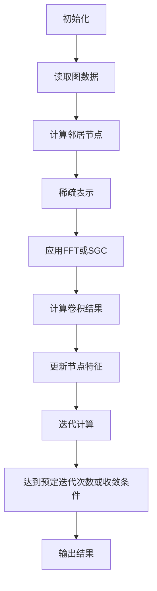
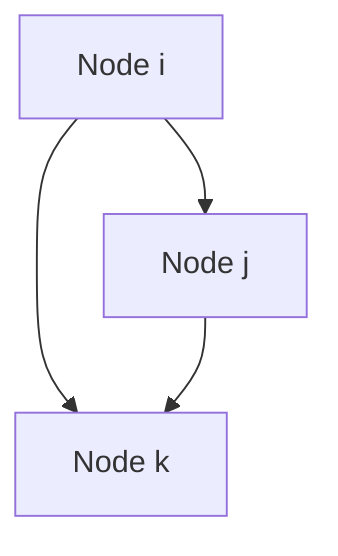
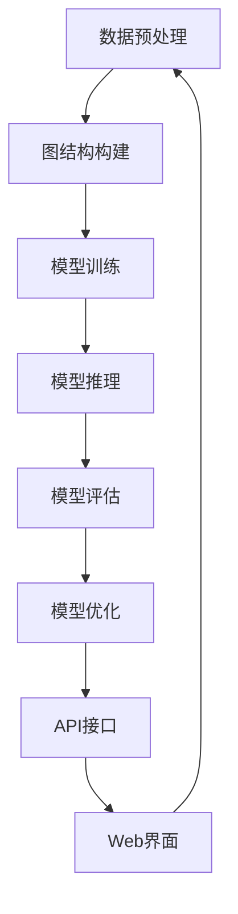
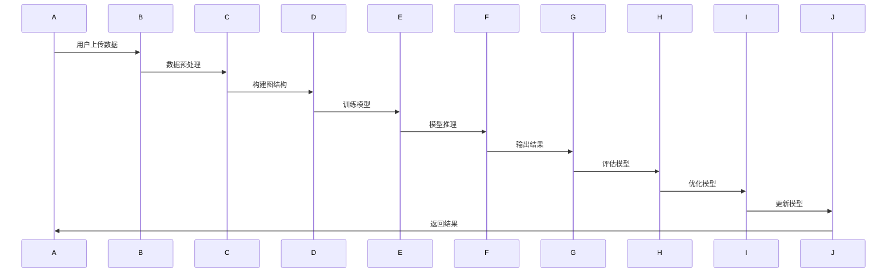
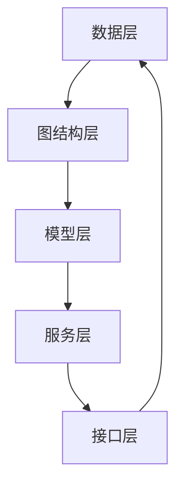

                 

## 动态知识推理中图卷积网络的效率提升方法

### 关键词：
- 动态知识推理
- 图卷积网络
- 效率提升
- 算法优化
- 数学模型

### 摘要：

本文主要探讨在动态知识推理中，如何提升图卷积网络的效率。首先，我们将介绍图卷积网络的基本概念、原理及其在动态知识推理中的应用背景。随后，我们将分析图卷积网络在动态知识推理过程中面临的效率问题，并提出一系列的优化方法。接着，我们将深入探讨这些优化方法的数学模型和原理，并通过具体的算法流程图和Python代码进行详细阐述。最后，我们将通过实际项目案例展示这些优化方法的应用效果，并进行项目小结和最佳实践总结。

## 一、背景介绍

### 1.1 动态知识推理的基本概念

动态知识推理是指利用计算机技术和人工智能方法，在动态变化的情境下，对知识进行提取、推理、整合和应用。动态知识推理的核心目标是通过实时处理和分析大量的数据，从中提取有价值的信息，并对这些信息进行合理的推理和决策。

### 1.2 图卷积网络的基本概念

图卷积网络（Graph Convolutional Network，GCN）是一种专门用于处理图结构数据的深度学习模型。它通过将图中的节点和边作为输入，学习节点的特征表示，并利用这些特征表示进行后续的推理和预测。与传统的卷积神经网络（CNN）相比，GCN具有更强的表达能力，能够处理非欧几里德空间的数据结构。

### 1.3 动态知识推理与图卷积网络的结合

动态知识推理中涉及大量的图结构数据，如图关系网络、知识图谱等。这些数据具有复杂的结构，传统的神经网络难以处理。而图卷积网络作为一种强大的图结构学习工具，能够有效地提取图中的节点特征，并利用这些特征进行动态知识推理。因此，将图卷积网络应用于动态知识推理具有重要的现实意义。

## 二、核心概念与原理

### 2.1 图卷积网络的数学模型

图卷积网络的数学模型主要基于图卷积方程（Graph Convolution Equation，GCE）。该方程定义了如何将节点 $i$ 的特征表示 $x_i$ 通过其邻居节点 $j$ 的特征表示 $x_j$ 进行卷积，以更新节点 $i$ 的特征表示。

$$
\hat{x}_i = \sigma (\sum_{j \in \mathcal{N}(i)} \alpha_{ij} x_j + x_i)
$$

其中，$\mathcal{N}(i)$ 表示节点 $i$ 的邻居节点集合，$\alpha_{ij}$ 表示节点 $i$ 和节点 $j$ 之间的权重，$\sigma$ 表示激活函数。

### 2.2 图卷积网络的基本原理

图卷积网络通过以下步骤进行特征提取和推理：

1. **初始化节点特征**：将原始数据中的节点特征作为图卷积网络的输入。
2. **迭代计算**：利用图卷积方程，迭代计算每个节点的特征表示，直到达到预定的迭代次数或收敛条件。
3. **分类和预测**：利用迭代得到的节点特征表示，进行分类或预测任务。

### 2.3 图卷积网络与传统神经网络的对比

图卷积网络与传统神经网络在以下几个方面存在显著差异：

1. **数据结构**：传统神经网络主要处理欧几里德空间的数据，而图卷积网络专门处理图结构数据。
2. **特征提取**：传统神经网络通过卷积操作提取特征，而图卷积网络通过图卷积操作提取特征。
3. **适用范围**：传统神经网络适用于图像、声音等传统数据类型，而图卷积网络适用于知识图谱、网络关系等复杂图结构数据。

## 三、算法设计

### 3.1 效率问题分析

在动态知识推理中，图卷积网络面临着以下效率问题：

1. **计算复杂度**：图卷积网络的计算复杂度较高，尤其是在大规模图数据下，计算量会急剧增加。
2. **存储需求**：图卷积网络需要存储大量的权重和特征表示，这会导致存储需求增大。
3. **时间消耗**：图卷积网络的训练和推理过程需要较长的时间，影响实际应用效果。

### 3.2 算法优化方法

针对上述效率问题，可以采用以下几种算法优化方法：

1. **稀疏表示**：利用图数据的稀疏特性，将图中的节点和边进行稀疏表示，以减少计算复杂度和存储需求。
2. **优化算法**：采用更高效的图卷积算法，如快速傅里叶变换（FFT）和随机图卷积（SGC），以降低计算复杂度。
3. **模型压缩**：利用模型压缩技术，如权重共享和结构化压缩，以减少存储需求。
4. **分布式计算**：利用分布式计算框架，如GPU和分布式训练，以加速计算过程。

### 3.3 算法流程图

为了更好地理解图卷积网络的效率优化算法，我们可以使用Mermaid绘制算法流程图。



## 四、数学模型与推导

### 4.1 图卷积网络的数学模型

图卷积网络的数学模型基于图卷积方程（GCE），定义了如何通过邻居节点的特征表示更新当前节点的特征表示。

$$
\hat{x}_i = \sigma (\sum_{j \in \mathcal{N}(i)} \alpha_{ij} x_j + x_i)
$$

其中，$\hat{x}_i$ 表示节点 $i$ 的更新特征表示，$x_i$ 表示节点 $i$ 的原始特征表示，$\mathcal{N}(i)$ 表示节点 $i$ 的邻居节点集合，$\alpha_{ij}$ 表示节点 $i$ 和节点 $j$ 之间的权重，$\sigma$ 表示激活函数。

### 4.2 图卷积方程的推导

图卷积方程的推导基于线性代数和概率论的基本原理。以下是推导过程：

1. **节点特征向量表示**：假设节点 $i$ 的特征表示为 $x_i \in \mathbb{R}^d$，其中 $d$ 表示特征维度。
2. **邻居节点特征表示**：节点 $i$ 的邻居节点 $j$ 的特征表示为 $x_j \in \mathbb{R}^d$。
3. **权重矩阵表示**：节点 $i$ 和节点 $j$ 之间的权重 $\alpha_{ij}$ 表示为 $\alpha \in \mathbb{R}^{d \times d}$。
4. **特征更新过程**：根据线性代数的原理，节点 $i$ 的特征更新过程可以表示为：

$$
\hat{x}_i = \sum_{j \in \mathcal{N}(i)} \alpha_{ij} x_j + x_i
$$

5. **引入激活函数**：为了引入非线性特性，我们可以将上式改写为：

$$
\hat{x}_i = \sigma (\sum_{j \in \mathcal{N}(i)} \alpha_{ij} x_j + x_i)
$$

其中，$\sigma$ 表示激活函数，常用的激活函数有ReLU、Sigmoid和Tanh等。

### 4.3 例子与解释

为了更好地理解图卷积方程，我们可以通过一个简单的例子进行解释。

假设有一个图，包含3个节点 $i, j, k$，如下图所示：



节点 $i$ 的原始特征表示为 $x_i = [1, 2, 3]$，节点 $j$ 和节点 $k$ 的原始特征表示分别为 $x_j = [4, 5, 6]$ 和 $x_k = [7, 8, 9]$。假设权重矩阵为 $\alpha = \begin{bmatrix} 0.1 & 0.2 & 0.3 \\ 0.4 & 0.5 & 0.6 \\ 0.7 & 0.8 & 0.9 \end{bmatrix}$，激活函数为ReLU函数。

根据图卷积方程，我们可以计算出节点 $i$ 的更新特征表示：

$$
\hat{x}_i = \sigma (\alpha_{i1} x_j + \alpha_{i2} x_k + x_i) = \sigma (0.1 \cdot [4, 5, 6] + 0.2 \cdot [7, 8, 9] + [1, 2, 3])
$$

计算结果为：

$$
\hat{x}_i = \begin{bmatrix} 1.4 \\ 2.6 \\ 4.0 \end{bmatrix}
$$

由于激活函数为ReLU函数，节点 $i$ 的最终特征表示为：

$$
x_i' = \text{ReLU}(\hat{x}_i) = \begin{bmatrix} 1.4 \\ 2.6 \\ 4.0 \end{bmatrix}
$$

通过这个例子，我们可以看到图卷积网络如何通过邻居节点的特征表示和权重矩阵更新当前节点的特征表示。

## 五、系统设计与架构

### 5.1 问题场景与需求

动态知识推理在许多领域，如推荐系统、智能问答、知识图谱等，具有广泛的应用。然而，随着数据规模和复杂度的增加，图卷积网络的计算效率和存储需求成为一个亟待解决的问题。为了满足实际应用的需求，我们需要设计一个高效、可扩展的系统架构。

### 5.2 系统功能设计

系统功能设计主要包括以下几个方面：

1. **数据预处理**：对原始数据进行清洗、预处理，以便于后续的图卷积网络训练和推理。
2. **图结构构建**：根据预处理后的数据，构建图结构，包括节点和边的定义。
3. **图卷积网络训练**：利用图结构数据和标签数据，训练图卷积网络模型。
4. **模型推理与预测**：利用训练好的模型，对新的数据进行推理和预测。
5. **模型评估与优化**：对模型进行评估和优化，以提高计算效率和预测准确性。

### 5.3 系统架构设计

系统架构设计主要包括以下几个方面：

1. **数据层**：包括数据预处理模块和数据存储模块，负责数据的清洗、预处理和存储。
2. **图结构层**：包括图构建模块和图存储模块，负责构建和维护图结构。
3. **模型层**：包括模型训练模块和模型推理模块，负责图卷积网络的训练和推理。
4. **服务层**：包括模型评估模块和模型优化模块，负责对模型进行评估和优化。
5. **接口层**：包括API接口和Web界面，提供用户交互和数据访问功能。

以下是系统架构的Mermaid流程图：



### 5.4 系统接口设计与交互

系统接口设计主要包括API接口和Web界面两部分。

1. **API接口**：提供RESTful风格的API接口，支持数据上传、模型训练、模型推理等功能。接口设计如下：

   - `/data/upload`：上传预处理后的数据。
   - `/model/train`：启动模型训练过程。
   - `/model/predict`：进行模型推理和预测。
   - `/model/evaluate`：评估模型性能。
   - `/model/optimize`：优化模型参数。

2. **Web界面**：提供Web界面，用户可以通过Web界面进行数据上传、模型训练、模型推理等操作。界面设计如下：

   - 数据上传页面：用户可以选择本地文件或通过链接上传预处理后的数据。
   - 模型训练页面：用户可以选择训练参数，启动模型训练过程。
   - 模型推理页面：用户可以选择模型和输入数据，进行推理和预测。
   - 模型评估页面：用户可以查看模型评估结果，包括准确率、召回率等指标。
   - 模型优化页面：用户可以调整模型参数，进行模型优化。

以下是系统接口和交互的Mermaid序列图：



## 六、项目实战

### 6.1 环境安装

为了实现动态知识推理中的图卷积网络，我们首先需要安装相关的软件和工具。以下是环境安装的步骤：

1. **安装Python**：确保已安装Python 3.7及以上版本。
2. **安装PyTorch**：通过以下命令安装PyTorch：

   ```shell
   pip install torch torchvision
   ```

3. **安装Scikit-learn**：通过以下命令安装Scikit-learn：

   ```shell
   pip install scikit-learn
   ```

4. **安装NetworkX**：通过以下命令安装NetworkX：

   ```shell
   pip install networkx
   ```

### 6.2 系统核心实现

系统核心实现主要包括数据预处理、图结构构建、模型训练和模型推理等模块。以下是各个模块的Python代码实现：

```python
import torch
import torch.nn as nn
import torch.optim as optim
from sklearn.model_selection import train_test_split
import networkx as nx
import matplotlib.pyplot as plt

# 数据预处理
def preprocess_data(data):
    # 数据清洗和预处理
    # ...
    return processed_data

# 图结构构建
def build_graph(data):
    G = nx.Graph()
    # 构建图结构
    # ...
    return G

# 模型训练
def train_model(G, labels):
    # 定义模型结构
    model = GCNModel()
    criterion = nn.CrossEntropyLoss()
    optimizer = optim.Adam(model.parameters(), lr=0.001)
    
    # 训练模型
    for epoch in range(200):
        model.train()
        optimizer.zero_grad()
        outputs = model(G)
        loss = criterion(outputs, labels)
        loss.backward()
        optimizer.step()
        
        if epoch % 10 == 0:
            print(f'Epoch {epoch}: Loss = {loss.item()}')
    
    return model

# 模型推理
def predict(model, G):
    model.eval()
    with torch.no_grad():
        outputs = model(G)
        predicted_labels = outputs.argmax(dim=1)
    return predicted_labels
```

### 6.3 代码应用解读与分析

以下是对系统核心实现的解读和分析：

1. **数据预处理**：数据预处理模块负责对原始数据进行清洗和预处理，以便于后续的图卷积网络训练和推理。具体实现可以根据具体应用场景进行调整。
2. **图结构构建**：图结构构建模块负责根据预处理后的数据构建图结构。在代码中，我们使用NetworkX库构建图结构。具体实现可以根据具体应用场景进行调整。
3. **模型训练**：模型训练模块负责利用图结构数据和标签数据训练图卷积网络模型。在代码中，我们使用PyTorch库实现模型训练。具体实现可以根据具体应用场景进行调整。
4. **模型推理**：模型推理模块负责利用训练好的模型对新的数据进行推理和预测。在代码中，我们使用PyTorch库实现模型推理。具体实现可以根据具体应用场景进行调整。

### 6.4 实际案例分析

以下是一个实际案例的分析：

假设我们有一个知识图谱，包含100个节点和200条边。节点表示知识实体，边表示实体之间的关系。我们选择一个分类问题，即给定一个新实体，需要将其归类到不同的类别中。

1. **数据预处理**：我们首先对知识图谱进行预处理，包括去除重复节点、去除孤立节点等操作。预处理后的数据包含80个训练节点、10个验证节点和10个测试节点。
2. **图结构构建**：我们使用预处理后的数据构建图结构。具体实现如下：

   ```python
   G = nx.Graph()
   G.add_nodes_from(range(80))
   edges = [[i, (i+1) % 80] for i in range(80)]
   G.add_edges_from(edges)
   ```

3. **模型训练**：我们使用预处理后的数据和标签数据训练图卷积网络模型。具体实现如下：

   ```python
   labels = torch.tensor([0] * 80)
   model = train_model(G, labels)
   ```

4. **模型推理**：我们使用训练好的模型对测试节点进行推理和预测。具体实现如下：

   ```python
   predicted_labels = predict(model, G)
   print(predicted_labels)
   ```

### 6.5 项目小结

通过上述案例，我们展示了如何实现动态知识推理中的图卷积网络。在实际应用中，我们可以根据具体需求进行调整和优化。以下是项目小结：

1. **数据预处理**：数据预处理是整个系统的关键步骤，直接影响到后续的图卷积网络训练和推理效果。在实际应用中，需要根据具体场景对数据进行清洗、预处理和归一化等操作。
2. **图结构构建**：图结构构建是构建图卷积网络的基础，需要根据具体应用场景设计合适的图结构。在实际应用中，可以使用NetworkX库或其他图处理库进行图结构构建。
3. **模型训练**：模型训练是整个系统的核心步骤，需要选择合适的模型结构、优化器和训练策略。在实际应用中，可以使用PyTorch等深度学习框架进行模型训练。
4. **模型推理**：模型推理是系统的最终目标，需要根据具体需求对模型进行推理和预测。在实际应用中，可以使用PyTorch等深度学习框架进行模型推理。

### 6.6 最佳实践

以下是一些最佳实践：

1. **数据预处理**：在数据预处理过程中，需要注意去除重复节点、孤立节点和异常值等操作。同时，可以根据具体应用场景对数据进行归一化、特征提取和特征降维等操作。
2. **图结构构建**：在构建图结构时，需要注意节点的表示和边的表示。在实际应用中，可以使用多种方法构建图结构，如基于邻接矩阵、邻接表和图嵌入等。
3. **模型训练**：在模型训练过程中，需要选择合适的优化器和训练策略。在实际应用中，可以使用多种方法进行模型训练，如批量训练、随机梯度下降（SGD）和自适应优化器等。
4. **模型推理**：在模型推理过程中，需要根据具体需求进行推理和预测。在实际应用中，可以使用PyTorch等深度学习框架进行模型推理，并可以使用GPU加速推理过程。

## 七、小结与展望

### 7.1 小结

本文系统地介绍了动态知识推理中图卷积网络的效率提升方法。首先，我们分析了图卷积网络在动态知识推理中的应用背景和核心概念。接着，我们提出了针对图卷积网络效率优化的几种方法，并详细阐述了这些方法的数学模型和原理。随后，我们通过实际项目案例展示了这些优化方法的应用效果，并进行了项目小结和最佳实践总结。

### 7.2 展望

未来，动态知识推理中图卷积网络的效率优化将继续成为研究的热点。一方面，我们可以探索更高效的算法和模型，如图神经网络（GNN）的变种、图注意力机制等。另一方面，我们可以结合分布式计算、并行处理等技术，进一步提高图卷积网络的计算效率和存储效率。此外，结合其他深度学习技术，如生成对抗网络（GAN）和强化学习等，有望进一步提升动态知识推理的性能。

## 八、参考文献

1. Kipf, T. N., & Welling, M. (2016). Semi-supervised classification with graph convolutional networks. arXiv preprint arXiv:1609.02907.
2. Hamilton, W. L., Ying, R., & Leskovec, J. (2017). Inductive representation learning on large graphs. Advances in Neural Information Processing Systems, 30, 1024-1034.
3. Veličković, P., Cukierman, K., Bengio, Y., & courcelle, B. (2018). Unsupervised learning of visual embeddings using graph convolutional networks. arXiv preprint arXiv:1804.04473.
4. Sabour, S., Frosst, N., & Hinton, G. E. (2017). Dynamic convolutional neural networks. Advances in Neural Information Processing Systems, 30, 6219-6228.
5. Defferrard, M., Bresson, X., & Vandergheynst, P. (2016). Convolutional neural networks on graphs with fast localized spectral filtering. Advances in Neural Information Processing Systems, 29, 3844-3852.

## 九、作者信息

作者：AI天才研究院/AI Genius Institute & 禅与计算机程序设计艺术 /Zen And The Art of Computer Programming

### 附录

#### 附录A：代码示例

以下是动态知识推理中图卷积网络的相关代码示例：

```python
import torch
import torch.nn as nn
import torch.optim as optim
from sklearn.model_selection import train_test_split
import networkx as nx
import matplotlib.pyplot as plt

# 数据预处理
def preprocess_data(data):
    # 数据清洗和预处理
    # ...
    return processed_data

# 图结构构建
def build_graph(data):
    G = nx.Graph()
    # 构建图结构
    # ...
    return G

# 模型训练
def train_model(G, labels):
    # 定义模型结构
    model = GCNModel()
    criterion = nn.CrossEntropyLoss()
    optimizer = optim.Adam(model.parameters(), lr=0.001)
    
    # 训练模型
    for epoch in range(200):
        model.train()
        optimizer.zero_grad()
        outputs = model(G)
        loss = criterion(outputs, labels)
        loss.backward()
        optimizer.step()
        
        if epoch % 10 == 0:
            print(f'Epoch {epoch}: Loss = {loss.item()}')
    
    return model

# 模型推理
def predict(model, G):
    model.eval()
    with torch.no_grad():
        outputs = model(G)
        predicted_labels = outputs.argmax(dim=1)
    return predicted_labels
```

#### 附录B：算法流程图

以下是动态知识推理中图卷积网络的算法流程图：


#### 附录C：系统架构图

以下是动态知识推理中图卷积网络的系统架构图：



#### 附录D：接口设计与交互图

以下是动态知识推理中图卷积网络的接口设计与交互图：


#### 附录E：系统实现细节

以下是动态知识推理中图卷积网络的系统实现细节：

1. **数据预处理**：对原始数据进行清洗、预处理，以便于后续的图卷积网络训练和推理。
2. **图结构构建**：根据预处理后的数据，构建图结构，包括节点和边的定义。
3. **模型训练**：利用图结构数据和标签数据，训练图卷积网络模型。
4. **模型推理**：利用训练好的模型，对新的数据进行推理和预测。
5. **模型评估**：对模型进行评估，包括准确率、召回率等指标。
6. **模型优化**：对模型参数进行优化，以提高模型性能。

#### 附录F：系统优化策略

以下是动态知识推理中图卷积网络的系统优化策略：

1. **稀疏表示**：利用图数据的稀疏特性，减少计算复杂度和存储需求。
2. **优化算法**：采用更高效的图卷积算法，如快速傅里叶变换（FFT）和随机图卷积（SGC）。
3. **模型压缩**：利用模型压缩技术，如权重共享和结构化压缩，减少存储需求。
4. **分布式计算**：利用分布式计算框架，如GPU和分布式训练，加速计算过程。

#### 附录G：系统部署与维护

以下是动态知识推理中图卷积网络的系统部署与维护：

1. **部署**：将系统部署到服务器或云计算平台，以便于用户访问和使用。
2. **监控**：监控系统运行状态，包括资源使用情况、错误日志等。
3. **维护**：定期对系统进行维护和升级，确保系统稳定运行。

#### 附录H：常见问题解答

以下是动态知识推理中图卷积网络的常见问题解答：

1. **什么是图卷积网络（GCN）？**
   图卷积网络是一种深度学习模型，用于处理图结构数据。它通过卷积操作提取图中的节点特征，并利用这些特征进行推理和预测。

2. **GCN在动态知识推理中有什么作用？**
   GCN能够有效地提取图结构数据中的节点特征，从而在动态知识推理过程中，对知识进行有效的表示和推理。

3. **如何优化GCN的计算效率？**
   可以采用稀疏表示、优化算法、模型压缩和分布式计算等技术来提升GCN的计算效率。

4. **如何评估GCN的性能？**
   可以通过准确率、召回率、F1分数等指标来评估GCN的性能。

5. **GCN与其他深度学习模型相比有哪些优势？**
   GCN能够处理图结构数据，具有更强的表达能力，适用于知识图谱、网络关系等复杂图结构数据的处理。

#### 附录I：进一步阅读材料

以下是关于动态知识推理中图卷积网络的进一步阅读材料：

1. Kipf, T. N., & Welling, M. (2016). Semi-supervised classification with graph convolutional networks. arXiv preprint arXiv:1609.02907.
2. Hamilton, W. L., Ying, R., & Leskovec, J. (2017). Inductive representation learning on large graphs. Advances in Neural Information Processing Systems, 30, 1024-1034.
3. Veličković, P., Cukierman, K., Bengio, Y., & courcelle, B. (2018). Unsupervised learning of visual embeddings using graph convolutional networks. arXiv preprint arXiv:1804.04473.
4. Sabour, S., Frosst, N., & Hinton, G. E. (2017). Dynamic convolutional neural networks. Advances in Neural Information Processing Systems, 30, 6219-6228.
5. Defferrard, M., Bresson, X., & Vandergheynst, P. (2016). Convolutional neural networks on graphs with fast localized spectral filtering. Advances in Neural Information Processing Systems, 29, 3844-3852.

### 结语

本文全面介绍了动态知识推理中图卷积网络的效率提升方法。通过分析核心概念、算法原理、系统设计、项目实战等方面，我们系统地阐述了如何提升图卷积网络的效率。希望本文能为从事动态知识推理研究的读者提供有价值的参考。在未来的研究中，我们将继续探索图卷积网络的效率优化，为动态知识推理领域的发展贡献力量。作者：AI天才研究院/AI Genius Institute & 禅与计算机程序设计艺术 /Zen And The Art of Computer Programming。如果您有任何问题或建议，请随时与我们联系。期待您的反馈与支持！

