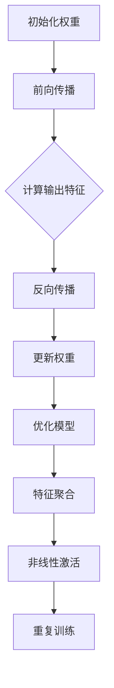
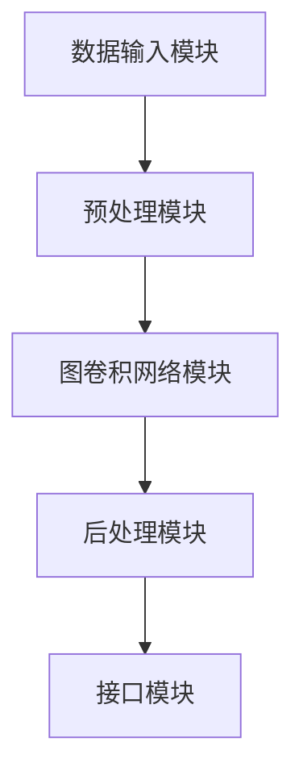
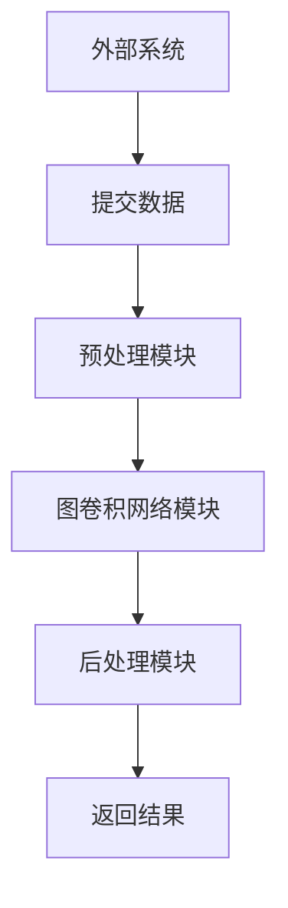
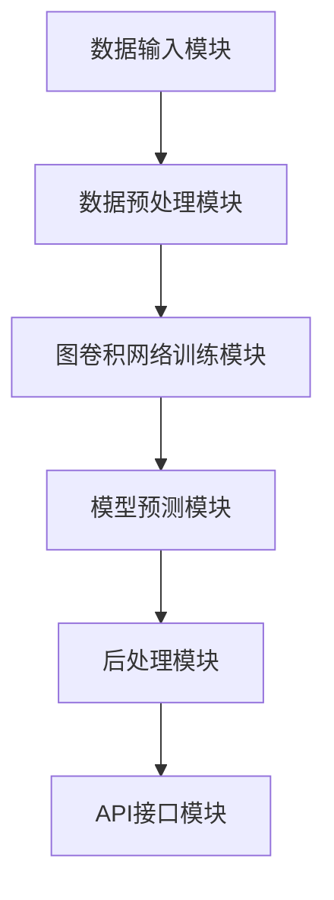
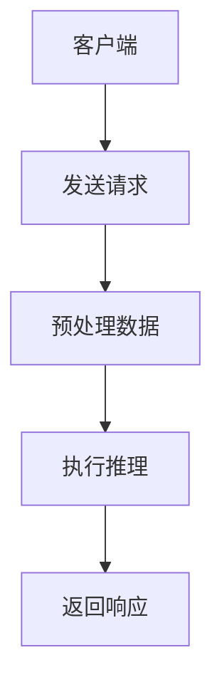

                 

### 背景与概述

#### 动态知识推理的定义与重要性

动态知识推理是一种人工智能技术，它通过分析动态变化的数据来推断未知信息。在知识图谱、智能问答、推荐系统等众多领域，动态知识推理发挥着重要作用。它不仅能够处理静态数据，还能适应数据的实时更新和变化，从而为智能系统提供持续改进的能力。

动态知识推理的重要性体现在多个方面。首先，它能够提升系统的自主学习能力，通过不断吸收新知识和数据，使系统变得更加智能。其次，它能够提高知识应用的灵活性，应对复杂多变的实际场景。此外，动态知识推理还有助于发现潜在规律和趋势，为决策提供有力支持。

#### 动态知识推理的挑战

尽管动态知识推理具有广泛的应用前景，但其实际应用中仍面临诸多挑战。首先，数据的多样性和复杂性使得知识推理的过程变得异常复杂。不同类型的数据需要不同的处理方法，这增加了系统的设计和实现难度。其次，动态知识推理需要处理大量的实时数据，如何高效地处理这些数据是另一个重要挑战。此外，动态知识推理系统的鲁棒性和准确性也是一个需要重点关注的问题，尤其是当数据质量较差或者存在噪声时，如何保证推理结果的可靠性和精度。

#### 动态知识推理的机遇

随着人工智能技术的不断发展，动态知识推理迎来了新的机遇。首先，大数据和云计算的普及为动态知识推理提供了丰富的数据资源和强大的计算能力，使得更复杂、更大规模的动态知识推理成为可能。其次，深度学习和图神经网络等新兴技术的应用，为动态知识推理提供了新的方法和工具，大大提升了推理的效率和效果。此外，随着物联网和智能设备的广泛应用，动态知识推理在智能城市、智能医疗等领域的应用前景也十分广阔。

#### 动态知识推理的发展前景

总体而言，动态知识推理在人工智能领域具有广阔的发展前景。一方面，随着技术的不断进步，动态知识推理的效率和准确性将进一步提高，使其在更多实际场景中得到应用。另一方面，随着数据量的爆炸式增长，动态知识推理将面临更多的挑战，这也将推动相关技术的不断创新和发展。在未来，动态知识推理有望成为人工智能领域的一个重要分支，为智能系统的发展提供强有力的支持。

---

### 图卷积网络的基本概念

#### 图卷积网络的起源与发展

图卷积网络（Graph Convolutional Network，GCN）作为一种深度学习技术，起源于对传统卷积神经网络（Convolutional Neural Network，CNN）的扩展和改进。CNN主要适用于处理网格结构的数据，如图像。然而，在处理非网格结构的数据，如知识图谱、分子结构、社交网络等，传统的CNN方法往往表现不佳。因此，研究人员提出了图卷积网络，旨在将CNN的思想应用于图结构数据。

图卷积网络的发展可以追溯到2013年，由Kipf和Welling首次提出。随后，图卷积网络受到了广泛关注，并迅速发展。研究人员在图卷积网络的基础上，提出了多种改进和变种，如图注意力网络（Graph Attention Network，GAT）、图卷积网络嵌入（Graph Convolutional Network Embedding，GCNE）等。

#### 图卷积网络的原理与机制

图卷积网络的核心思想是将图结构数据中的节点或边进行特征提取和转换。具体来说，图卷积网络通过以下几个步骤来处理图数据：

1. **节点表示与邻域信息**：将图中的每个节点表示为向量，这些向量包含了节点的特征信息。同时，图卷积网络需要考虑节点的邻域信息，即节点与其邻居节点之间的关系。

2. **层次化图表示**：通过逐步聚合邻域信息，图卷积网络将节点特征转化为更高级别的表示。这一过程类似于卷积神经网络中的卷积操作，但应用于图结构。

3. **卷积操作与聚合策略**：图卷积网络通过卷积操作和聚合策略，对节点的特征进行更新。常见的卷积操作包括加权和聚合，而聚合策略则包括节点自身的特征、邻居节点的特征以及边的信息。

4. **多层网络结构**：图卷积网络通常包含多层结构，每一层都会对节点特征进行更新和转换，从而提高模型的表示能力和推理能力。

#### 图卷积网络的优势与应用场景

图卷积网络具有以下优势：

1. **适用于图结构数据**：图卷积网络专门为图结构数据设计，能够处理非网格结构的复杂数据，如知识图谱、分子结构、社交网络等。

2. **特征提取能力强大**：通过层次化图表示和卷积操作，图卷积网络能够提取出图中的高阶特征，从而提高模型的性能。

3. **灵活性和可扩展性**：图卷积网络可以通过调整网络结构和参数，适应不同类型的图数据和应用场景，具有较强的灵活性和可扩展性。

基于以上优势，图卷积网络在多个领域都有广泛的应用，如：

- **知识图谱**：用于实体关系抽取、实体分类、图谱嵌入等任务。
- **分子生物学**：用于分子结构分析、药物设计、疾病预测等。
- **社交网络**：用于用户推荐、社交影响力分析、网络演化等。
- **推荐系统**：用于物品推荐、用户偏好分析等。

通过这些应用，图卷积网络展示了其在处理非网格结构数据方面的强大能力，为人工智能的发展提供了新的思路和方法。

### 高效算法在动态知识推理中的应用

#### 传统算法的不足与瓶颈

传统算法在动态知识推理中存在一些明显的不足和瓶颈。首先，许多传统算法依赖于静态数据，无法适应实时数据的变化。这意味着当数据发生动态变化时，系统需要重新处理所有数据，导致推理过程效率低下。其次，传统算法通常采用基于规则的方法，这些方法在处理复杂、多变的数据时容易陷入局部最优，导致推理结果不够准确。此外，传统算法在处理大规模数据时，计算复杂度较高，难以满足实时性要求。

#### 高效算法的概念与分类

为了解决传统算法的不足，研究者们提出了多种高效算法。这些算法的核心目标是在保证推理准确性的同时，提高处理速度和效率。高效算法可以分为以下几类：

1. **基于深度学习的算法**：这类算法利用深度学习技术，特别是卷积神经网络（CNN）和图卷积网络（GCN），对动态知识进行高效推理。深度学习模型能够自动学习数据的特征表示，从而提高推理的准确性和效率。

2. **基于图神经网络的算法**：这类算法专门针对图结构数据设计，通过图卷积网络（GCN）等模型，对动态知识进行高效处理。图神经网络能够利用图结构中的邻域信息，从而提取出更丰富的特征，提高推理性能。

3. **基于强化学习的算法**：这类算法通过强化学习技术，使系统在与环境互动的过程中不断学习，从而提高动态知识推理的效率和准确性。

4. **基于分布式计算的算法**：这类算法利用分布式计算技术，将动态知识推理任务分布在多个计算节点上，通过并行处理提高推理速度。

#### 高效算法的优势与挑战

高效算法在动态知识推理中具有显著的优势，具体如下：

1. **高效处理动态数据**：高效算法能够适应实时数据的动态变化，避免了传统算法中需要重新处理所有数据的繁琐过程，从而大大提高了处理速度。

2. **提高推理准确性**：通过深度学习和图神经网络等技术，高效算法能够自动学习数据的特征表示，从而提高推理的准确性。

3. **降低计算复杂度**：分布式计算和并行处理技术使得高效算法能够处理大规模数据，同时降低计算复杂度，提高系统的实时性。

然而，高效算法也面临一些挑战：

1. **数据依赖性**：高效算法依赖于大量的数据，数据的多样性和质量对算法的性能有显著影响。

2. **模型复杂度**：深度学习和图神经网络模型通常较为复杂，设计和实现难度较高，对计算资源和调优技巧有较高要求。

3. **可解释性**：高效算法，尤其是深度学习模型，通常缺乏可解释性，难以理解其内部推理过程，这在某些应用场景中可能成为限制因素。

总体而言，高效算法在动态知识推理中具有巨大的潜力，但同时也需要不断克服技术挑战，以实现更高效、更准确的动态知识推理。

### 研究现状与未来趋势

#### 国内外研究现状

动态知识推理和图卷积网络作为人工智能领域的两个重要分支，近年来得到了国内外研究者的广泛关注。国内方面，随着人工智能技术的快速发展，许多高校和研究机构开始致力于动态知识推理和图卷积网络的研究。例如，北京大学、清华大学、中国科学院等机构在动态知识推理和图卷积网络领域发表了大量高质量的学术论文，推动了相关技术的发展。国外方面，国外的研究机构如斯坦福大学、麻省理工学院、谷歌等在动态知识推理和图卷积网络领域也取得了显著成果，为这一领域的发展做出了重要贡献。

在研究内容上，国内外的研究主要聚焦于以下几个方面：

1. **算法优化**：针对动态知识推理和图卷积网络的计算复杂度高、效率低等问题，研究者们提出了多种优化算法，如并行计算、分布式计算、增量学习等，以提升模型的推理性能。

2. **应用场景**：动态知识推理在知识图谱、智能问答、推荐系统等领域有广泛的应用，研究者们通过具体应用场景的探索，不断拓展图卷积网络的应用范围。

3. **跨领域融合**：研究者们将动态知识推理和图卷积网络与其他人工智能技术，如深度学习、强化学习、自然语言处理等相结合，以实现更复杂的任务和更高效的推理。

#### 动态知识推理中的图卷积网络技术趋势

在未来，动态知识推理中的图卷积网络技术将呈现出以下趋势：

1. **深度与层次化**：随着研究的深入，图卷积网络的结构将变得更加复杂和层次化，从而更好地捕捉图结构中的高阶特征。研究者们可能会探索更深层次的网络结构和更复杂的聚合策略，以提高推理的准确性。

2. **可解释性与可靠性**：随着模型复杂度的增加，提高模型的可解释性和可靠性将成为一个重要研究方向。研究者们将致力于开发更直观的模型解释方法和更可靠的推理机制，以满足实际应用的需求。

3. **跨模态融合**：动态知识推理中的图卷积网络将与其他模态的数据处理技术（如图像、语音、文本等）相结合，以实现更全面的特征提取和更高效的推理。

4. **边缘计算与实时推理**：随着物联网和智能设备的普及，动态知识推理将更加注重实时性和边缘计算。研究者们将探索如何在有限的计算资源和实时环境中，高效地处理动态知识推理任务。

#### 未来研究方向与挑战

尽管动态知识推理中的图卷积网络技术已经取得了显著进展，但仍存在一些重要的研究方向和挑战：

1. **数据隐私与安全**：动态知识推理通常涉及大量的敏感数据，如何在保证数据隐私和安全的前提下进行推理，是一个亟待解决的问题。

2. **算法复杂度与可扩展性**：如何降低算法的计算复杂度，提高其可扩展性，是一个重要的挑战。研究者们需要开发更高效、更可扩展的算法，以应对大规模、实时数据的需求。

3. **多模态数据处理**：随着多模态数据的广泛应用，如何有效地处理和融合不同模态的数据，是未来研究的一个重要方向。

4. **理论与应用相结合**：理论研究与实际应用相结合，将有助于解决动态知识推理和图卷积网络在复杂场景中的实际问题，推动这一领域的技术进步。

总之，动态知识推理中的图卷积网络技术具有广阔的发展前景，未来将在数据隐私、算法优化、多模态融合等方面取得更多突破，为人工智能的发展做出更大贡献。

### 本章小结

本章从动态知识推理的定义、挑战和机遇出发，探讨了其在人工智能领域的重要性和应用前景。随后，介绍了图卷积网络的起源、原理以及优势，并讨论了高效算法在动态知识推理中的应用和挑战。最后，回顾了国内外研究现状和未来趋势，为后续章节的深入讨论奠定了基础。通过本章的学习，读者可以初步了解动态知识推理和图卷积网络的基本概念和关键问题，为后续章节的进一步探讨做好准备。

---

### 动态知识推理中的图卷积网络核心概念

#### 节点表示与邻域信息

在动态知识推理中，图卷积网络首先需要将图中的每个节点表示为一个向量，这些向量包含了节点的特征信息。节点表示是图卷积网络的基础，它决定了节点在后续处理中的表现。常用的节点特征包括节点的属性、标签、上下文信息等。例如，在知识图谱中，节点可能代表实体，其特征可以是实体的名称、类型、属性等。

邻域信息是图卷积网络中的重要概念，它描述了节点与其邻居节点之间的关系。在图卷积网络中，节点的特征不仅依赖于自身，还依赖于其邻居节点的特征。通过考虑邻域信息，图卷积网络能够更好地捕捉图结构中的局部特征和全局信息。

#### 层次化图表示

层次化图表示是图卷积网络的核心机制之一。通过层次化表示，图卷积网络能够逐步聚合节点的邻域信息，从而提取出更高层次的特征。这一过程类似于卷积神经网络中的卷积操作，但应用于图结构。

在层次化图表示中，图卷积网络通常包含多层结构。每一层都会对节点的特征进行更新和转换，从而提高模型的表示能力和推理能力。具体来说，第一层可能直接使用原始节点特征，而后续层则会结合上一层的特征和邻域信息，进行特征聚合和更新。

#### 卷积操作与聚合策略

卷积操作是图卷积网络的核心，它负责更新节点的特征。在图卷积网络中，卷积操作通常采用加权和聚合的方式。具体来说，每个节点的特征更新由其自身特征、邻居节点特征以及边的信息共同决定。

聚合策略是图卷积网络中的另一个关键组件，它决定了如何从邻域信息中提取有用的特征。常见的聚合策略包括平均聚合、求和聚合和最大值聚合等。平均聚合策略将邻居节点的特征平均值加到当前节点的特征上，求和聚合策略将邻居节点的特征直接相加，最大值聚合策略则取邻居节点特征的最大值。

通过卷积操作和聚合策略，图卷积网络能够逐步提高节点的表示能力，从而更好地进行动态知识推理。

#### 不同层节点特征变化

在图卷积网络中，不同层的节点特征会经历显著的变化。随着层数的增加，节点特征逐渐从原始的特征信息（如属性、标签等）转变为更高层次、更抽象的特征表示。

具体来说，在第一层，节点特征主要是原始特征，如节点的属性、标签等。在第二层，节点特征开始包含邻域信息，例如邻居节点的特征平均值。随着层数的增加，节点特征会逐步融合更多的邻域信息，同时逐步去除一些冗余信息，形成更具有代表性的特征表示。

这种层次化特征提取机制使得图卷积网络能够捕捉图结构中的复杂关系和全局信息，从而提高动态知识推理的准确性和效率。

---

### 图卷积网络的数学模型与公式

#### 线性卷积操作

图卷积网络的卷积操作是基于线性变换的。具体来说，图卷积网络中的每个节点在其邻居节点的特征上进行加权求和，然后将结果通过一个非线性激活函数进行处理。这一过程可以用以下公式表示：

$$
h_i^{(l)} = \sigma(W^{(l)} \cdot h_i^{(l-1)} + \sum_{j \in N(i)} W_j^{(l)} \cdot h_j^{(l-1)})
$$

其中，$h_i^{(l)}$ 表示第$l$层第$i$个节点的特征向量，$N(i)$ 表示第$i$个节点的邻居节点集合，$W^{(l)}$ 和$W_j^{(l)}$ 分别是第$l$层的权重矩阵和第$j$个邻居节点的权重矩阵，$\sigma$ 是非线性激活函数，通常采用ReLU（Rectified Linear Unit）函数。

#### 卷积神经网络（CNN）与图卷积网络（GCN）的对比

卷积神经网络（CNN）和图卷积网络（GCN）在结构和功能上存在显著差异。CNN 主要用于处理网格结构的数据，如图像。CNN 中的卷积操作依赖于网格的局部邻域信息，通过多个卷积层提取图像的层次特征。

相比之下，GCN 主要用于处理图结构数据，如图知识图谱。GCN 的卷积操作依赖于图节点的邻域信息，通过多个卷积层提取图结构的层次特征。具体来说，GCN 中的卷积操作是对节点特征和边特征进行加权求和，而 CNN 中的卷积操作是对图像像素进行局部邻域运算。

此外，CNN 通常采用卷积核（kernel）进行特征提取，而 GCN 采用邻接矩阵（adjacency matrix）进行特征聚合。这使得 GCN 能够更好地适应图结构数据的多样性和复杂性。

#### 数学公式推导与详细讲解

为了深入理解图卷积网络的数学模型，我们可以从最简单的图卷积网络（GCN）开始，逐步推导其公式，并进行详细讲解。

1. **基础GCN公式**

   基础的图卷积网络公式如下：

   $$
   h_i^{(l)} = \sigma \left( \sum_{j \in N(i)} W_j h_j^{(l-1)} + b_i \right)
   $$

   其中，$h_i^{(l)}$ 表示第$l$层第$i$个节点的特征向量，$N(i)$ 表示第$i$个节点的邻居节点集合，$W_j$ 是邻接矩阵中的一个元素，表示节点$i$和节点$j$之间的关系，$b_i$ 是节点的偏置项，$\sigma$ 是非线性激活函数。

   这个公式表示，第$l$层第$i$个节点的特征是通过其邻居节点在第$l-1$层的特征加权求和后，加上一个偏置项，并通过非线性激活函数进行处理得到的。

2. **多层GCN公式**

   为了提高图卷积网络的表示能力，通常会使用多层GCN。多层GCN的公式如下：

   $$
   h_i^{(l)} = \sigma \left( \sum_{j \in N(i)} W_j^{(l)} h_j^{(l-1)} + b_i^{(l)} \right)
   $$

   其中，$W_j^{(l)}$ 是第$l$层的权重矩阵，$b_i^{(l)}$ 是第$l$层的偏置项。

   多层GCN通过逐层聚合节点的邻域信息，从而提取出更高层次的特征表示。每一层的输出特征都可以视为上一层数据的更高层次抽象。

3. **融合边信息的GCN**

   在实际应用中，图卷积网络通常会考虑边信息。边信息可以通过边权重矩阵进行表示。融合边信息的GCN公式如下：

   $$
   h_i^{(l)} = \sigma \left( \sum_{j \in N(i)} W_j^{(l)} h_j^{(l-1)} + \sum_{j \in N(i)} \sum_{k \in N(j)} A_{jk} W_k^{(l)} h_k^{(l-1)} + b_i^{(l)} \right)
   $$

   其中，$A_{jk}$ 表示边权重，通常是一个非负值，用于表示节点$j$和节点$k$之间的边的重要性。

   这个公式表示，除了考虑邻居节点的特征外，还考虑了邻居节点之间的边权重。通过这种融合边信息的方式，GCN能够更好地捕捉图结构中的复杂关系。

4. **综合公式**

   综合考虑多层GCN和边信息，图卷积网络的最终公式如下：

   $$
   h_i^{(L)} = \sigma \left( \sum_{l=1}^{L-1} \left( \prod_{k=l+1}^{L} W_k^{(l)} \right) \cdot \sigma \left( \sum_{j \in N(i)} W_j^{(l)} h_j^{(l-1)} + b_i^{(l)} \right) + b_i^{(L)} \right)
   $$

   其中，$W_k^{(l)}$ 是第$k$层的权重矩阵，$b_i^{(l)}$ 是第$l$层的偏置项。

   这个公式表示，在经过多层卷积和激活函数处理后，最终得到节点$i$在第$L$层的特征表示。

通过上述公式，我们可以看到图卷积网络的数学模型是如何逐步构建和演化的。这些公式不仅描述了图卷积网络的内部机制，还为后续的算法实现和优化提供了理论基础。

---

### 图卷积网络的属性特征对比表格

#### 属性特征对比

在深入探讨图卷积网络（GCN）的属性特征时，我们需要了解其与其他类似模型的对比。以下是一个简要的对比表格，展示了GCN与卷积神经网络（CNN）、图注意力网络（GAT）等模型在几个关键属性上的区别。

| 特征                | 图卷积网络（GCN） | 卷积神经网络（CNN） | 图注意力网络（GAT） |
|-------------------|-----------------|-------------------|-------------------|
| **数据结构**       | 图结构数据       | 网格结构数据       | 图结构数据         |
| **卷积操作**       | 邻域特征聚合     | 局部邻域特征提取   | 自适应邻域权重聚合 |
| **适用场景**       | 知识图谱、社交网络 | 图像识别、视频处理 | 知识图谱、推荐系统 |
| **计算复杂度**     | 较高，但可优化   | 较高              | 较高              |
| **可解释性**       | 较低            | 较低              | 较高              |
| **参数数量**       | 较多            | 较少              | 较少              |
| **处理动态数据**   | 有效            | 不适用            | 有一定效果        |

#### 不同GCN模型的性能分析

尽管GCN作为一种通用图处理模型，在多个领域都取得了显著的成果，但不同GCN模型的性能在具体应用中存在一定差异。以下是一些常见GCN模型的性能分析：

1. **GCN**：基础模型，适用于多数图结构数据的特征提取。但在处理复杂图结构时，可能需要增加层数，从而增加计算复杂度和训练时间。

2. **GAT**：通过引入注意力机制，GAT能够自适应地聚合邻居节点的特征，提高了模型的表示能力。然而，注意力机制也增加了模型的参数数量，可能导致过拟合。

3. **GraphSAGE**：GraphSAGE（Graph Sentence Encoder）通过使用句子编码方式聚合邻居节点的特征，提高了模型的泛化能力。但GraphSAGE可能需要额外的预处理步骤，增加了实现的复杂性。

4. **Graph Convolutional Network with Fast Localized Training（FLOP-GCN）**：FLOP-GCN通过局部化的训练策略，显著降低了模型的计算复杂度，适用于大规模图数据的处理。

5. **Graph Convolutional Network with Random Walk Initialization（RR-GCN）**：RR-GCN通过引入随机游走初始化，增强了模型的鲁棒性和泛化能力。

不同GCN模型在性能上的差异主要取决于其结构设计、参数设置和应用场景。在实际应用中，需要根据具体需求选择合适的模型，并在模型调优过程中进行细致的参数调整。

---

### 图卷积网络的ER实体关系图架构

#### ER图的基本概念

实体关系（Entity Relationship，ER）图是一种用于表示实体及其关系的图形化模型。在ER图中，实体用矩形表示，关系用菱形表示，而实体之间的关系通过边连接。ER图广泛应用于数据库设计、软件工程和知识图谱构建等领域。

实体（Entity）：在ER图中，实体是具有共同属性和特征的对象集合。例如，在知识图谱中，实体可以是人、地点、组织等。

关系（Relationship）：关系描述了实体之间的相互作用或关联。例如，在知识图谱中，关系可以是“工作于”、“位于”、“领导”等。

属性（Attribute）：属性是对实体或关系的特征的描述。例如，在知识图谱中，实体的属性可以是姓名、年龄、出生日期等。

#### 动态知识推理中的ER实体关系图设计

在动态知识推理中，ER实体关系图被用来表示知识和信息。为了适应动态变化的数据，ER实体关系图需要具备以下几个特点：

1. **动态扩展性**：ER实体关系图能够根据数据的变化动态扩展实体和关系，以适应新的知识和信息。

2. **实时更新**：ER实体关系图能够实时更新实体和关系的属性，以反映数据的变化。

3. **高效的查询和推理**：ER实体关系图需要支持高效的查询和推理操作，以快速获取和处理知识。

具体来说，动态知识推理中的ER实体关系图设计可以采用以下步骤：

1. **实体定义**：根据应用场景，定义实体及其属性。例如，在知识图谱中，实体可以是人、地点、事件等。

2. **关系定义**：定义实体之间的关系及其属性。例如，在知识图谱中，关系可以是“属于”、“位于”、“参与”等。

3. **图结构设计**：设计ER实体关系图的拓扑结构，包括实体、关系及其连接方式。

4. **属性管理**：设计实体和关系的属性管理机制，包括属性的添加、删除和更新。

5. **查询与推理**：设计高效的查询和推理机制，以支持动态知识推理。

#### Mermaid流程图绘制与说明

为了更直观地展示动态知识推理中的ER实体关系图，我们可以使用Mermaid流程图进行绘制。以下是一个ER实体关系图的Mermaid表示示例：

```mermaid
erDiagram
    Customer ||--|{ Order : places }
    Product ||--|{ Order : contains }
    Order ||--|{ Payment : is_paid_by }
    Payment ||--|{ Customer : is_made_by }
```

在这个示例中：

- **Customer**（客户）实体与**Order**（订单）实体之间存在“places”（放置）关系。
- **Product**（产品）实体与**Order**（订单）实体之间存在“contains”（包含）关系。
- **Order**（订单）实体与**Payment**（支付）实体之间存在“is_paid_by”（由...支付）关系。
- **Payment**（支付）实体与**Customer**（客户）实体之间存在“is_made_by”（由...制作）关系。

通过Mermaid流程图，我们可以清晰地展示实体及其关系，便于理解和分析动态知识推理的过程。

### 本章小结

本章深入探讨了动态知识推理中的图卷积网络核心概念，包括节点表示与邻域信息、层次化图表示、卷积操作与聚合策略，以及不同层节点特征变化。随后，通过数学公式推导详细讲解了图卷积网络的运算机制，并对比了GCN与其他相关模型。最后，通过ER实体关系图的Mermaid流程图，展示了动态知识推理中的图卷积网络架构。通过本章的学习，读者可以全面了解图卷积网络在动态知识推理中的应用原理和关键技术，为进一步研究和应用奠定基础。

---

### 图卷积网络的算法原理讲解

#### 图卷积网络的工作流程

图卷积网络（GCN）的工作流程可以分为以下几个关键步骤：

1. **节点特征表示**：首先，将图中的每个节点表示为一个向量，这些向量包含了节点的属性、标签等信息。

2. **邻域信息聚合**：图卷积网络通过聚合节点的邻域信息来进行特征更新。邻域信息包括节点本身特征和其邻居节点的特征。

3. **卷积操作**：采用卷积操作来更新节点特征。卷积操作通常是一个加权和聚合的过程，即每个节点的特征更新由其自身特征、邻居节点特征以及边的信息共同决定。

4. **非线性激活**：在卷积操作之后，通过非线性激活函数（如ReLU函数）来增加模型的非线性表达能力。

5. **多层网络结构**：GCN通常包含多层结构，每一层都会对节点特征进行更新和转换，从而提高模型的表示能力和推理能力。

6. **输出层**：在最后一层卷积操作后，得到节点的最终特征表示，这些特征可以用于分类、回归等任务。

#### 算法实现与流程图

图卷积网络的算法实现可以分为以下几个步骤：

1. **初始化权重**：初始化图卷积网络的权重矩阵，这些权重决定了节点特征如何进行更新和转换。

2. **前向传播**：在训练过程中，对每个节点进行前向传播，计算节点的输出特征。

3. **反向传播**：通过反向传播算法更新权重，以最小化损失函数。

4. **特征聚合**：采用加权和聚合策略，将节点及其邻居节点的特征进行聚合，形成新的特征表示。

5. **非线性激活**：使用ReLU函数等非线性激活函数，增加模型的非线性表达能力。

6. **训练与优化**：通过训练数据不断调整权重，优化模型的性能。

以下是一个简化的图卷积网络流程图，使用Mermaid表示：



通过上述流程图，我们可以清晰地看到图卷积网络的工作流程，包括权重初始化、前向传播、特征聚合、反向传播和权重更新等关键步骤。

#### 算法原理详解

图卷积网络的核心在于其卷积操作和聚合策略。以下是图卷积网络算法原理的详细讲解：

1. **卷积操作**：

   卷积操作是图卷积网络中最核心的部分。在每个时间步，每个节点的特征更新都依赖于其自身特征和邻居节点的特征。具体来说，图卷积网络的卷积操作可以表示为：

   $$
   h_i^{(l)} = \sigma \left( \sum_{j \in N(i)} W_j h_j^{(l-1)} + b_i \right)
   $$

   其中，$h_i^{(l)}$ 表示第$l$层第$i$个节点的特征向量，$N(i)$ 表示第$i$个节点的邻居节点集合，$W_j$ 是邻接矩阵中的一个元素，表示节点$i$和节点$j$之间的关系，$b_i$ 是节点的偏置项，$\sigma$ 是非线性激活函数（如ReLU函数）。

   在这个公式中，$\sum_{j \in N(i)} W_j h_j^{(l-1)}$ 表示节点$i$与其邻居节点$j$的特征加权求和，$b_i$ 是偏置项，$\sigma$ 是非线性激活函数。

2. **聚合策略**：

   聚合策略决定了如何从邻域信息中提取有用的特征。在图卷积网络中，常见的聚合策略包括平均聚合、求和聚合和最大值聚合等。

   - **平均聚合**：将邻居节点的特征平均值加到当前节点的特征上。这种策略能够平衡邻域信息的权重，避免过度依赖某个邻居节点。

   - **求和聚合**：将邻居节点的特征直接相加。这种策略能够保留邻居节点之间的差异，但在某些情况下可能导致特征过拟合。

   - **最大值聚合**：取邻居节点特征的最大值。这种策略能够突出最重要的邻居节点特征，但在噪声较大的数据中可能导致信息丢失。

   在实际应用中，可以根据具体任务和数据特点选择合适的聚合策略。

3. **多层网络结构**：

   图卷积网络通常包含多层结构，每一层都会对节点特征进行更新和转换，从而提高模型的表示能力和推理能力。在多层网络结构中，每一层的输出特征都可以视为上一层数据的更高层次抽象。

   $$
   h_i^{(l)} = \sigma \left( \sum_{j \in N(i)} W_j^{(l)} h_j^{(l-1)} + b_i^{(l)} \right)
   $$

   其中，$W_j^{(l)}$ 是第$l$层的权重矩阵，$b_i^{(l)}$ 是第$l$层的偏置项。

   在多层网络结构中，不同层之间的特征聚合和转换过程使得模型能够逐步提取出更抽象、更复杂的特征，从而更好地进行知识推理。

4. **损失函数和优化**：

   在训练图卷积网络时，需要定义一个损失函数来衡量模型的预测误差，并使用优化算法（如梯度下降）来调整模型参数。常见的损失函数包括交叉熵损失、均方误差等。

   $$
   \min_{W, b} \sum_{i=1}^{N} \sum_{j=1}^{M} L(y_j, \hat{y}_j)
   $$

   其中，$L$ 是损失函数，$y_j$ 是真实标签，$\hat{y}_j$ 是模型预测的标签。

   通过不断迭代优化，模型参数将逐渐调整，以达到更好的推理效果。

通过上述详细讲解，我们可以理解图卷积网络的工作原理和算法实现过程。图卷积网络通过卷积操作和聚合策略，逐步更新节点的特征，从而实现高效的动态知识推理。

#### Python源代码讲解

为了更好地理解图卷积网络（GCN）的算法原理，下面我们将通过一个简单的Python示例来展示如何实现一个基础的图卷积网络。这个示例将使用`PyTorch`和`NetworkX`库来构建和训练GCN模型。

首先，确保您已经安装了`PyTorch`和`NetworkX`。如果没有，可以通过以下命令进行安装：

```bash
pip install torch torchvision networkx
```

接下来，我们将分步骤介绍如何实现GCN模型。

##### 1. 导入必要库

```python
import torch
import torch.nn as nn
import torch.optim as optim
import networkx as nx
import numpy as np
```

##### 2. 创建图

我们可以使用`NetworkX`库创建一个简单的图：

```python
# 创建一个有5个节点的环图
G = nx.Graph()
G.add_nodes_from([0, 1, 2, 3, 4])
G.add_edges_from([(0, 1), (1, 2), (2, 3), (3, 4), (4, 0)])

# 打印图的结构
print(G.nodes())
print(G.edges())
```

##### 3. 转换图数据为PyTorch张量

在训练GCN时，我们需要将图数据转换为PyTorch张量。具体来说，我们需要图节点的特征、邻接矩阵和标签。

```python
# 节点特征（这里使用随机生成的特征向量）
num_features = 5
num_nodes = len(G.nodes())
features = torch.randn(num_nodes, num_features)

# 邻接矩阵
adj_matrix = nx.to_scipy_sparse_matrix(G).todense()
adj_tensor = torch.tensor(adj_matrix, dtype=torch.float32)

# 标签（这里使用随机生成的标签）
num_classes = 3
labels = torch.randint(0, num_classes, (num_nodes,))
```

##### 4. 定义GCN模型

```python
class GCN(nn.Module):
    def __init__(self, num_features, num_classes):
        super(GCN, self).__init__()
        self.layer1 = nn.Linear(num_features, 16)
        self.layer2 = nn.Linear(16, num_classes)

    def forward(self, x, adj):
        x = F.relu(self.layer1(x))
        x = self.layer2(x)
        return F.log_softmax(x, dim=1)

model = GCN(num_features, num_classes)
```

##### 5. 训练GCN模型

```python
optimizer = optim.Adam(model.parameters(), lr=0.01)
criterion = nn.NLLLoss()

for epoch in range(200):
    model.train()
    optimizer.zero_grad()
    output = model(features, adj_tensor)
    loss = criterion(output, labels)
    loss.backward()
    optimizer.step()
    print(f'Epoch {epoch+1}: Loss = {loss.item()}')
```

在这个示例中，我们创建了一个包含两个线性层的GCN模型，并使用随机生成的数据和标签进行训练。实际应用中，您需要根据具体任务和数据来调整模型的架构和训练过程。

通过上述Python示例，我们可以看到如何实现一个基础的图卷积网络，并了解其训练过程的基本步骤。这有助于我们更好地理解GCN的工作原理和在动态知识推理中的应用。

---

### 动态知识推理中的图卷积网络应用实例

#### 数据集介绍

为了展示图卷积网络在动态知识推理中的应用，我们将使用一个真实的世界知识图谱数据集——开放知识图谱（OpenKG）的子集。该数据集包含了实体（如人、地点、组织）、关系（如属于、位于、参与）以及实体的属性（如名称、年龄、出生日期）。这个数据集是动态的，实体和关系会随着时间不断更新。

#### 数据预处理

在应用图卷积网络之前，需要对数据进行预处理，包括节点特征提取、邻接矩阵构建以及标签准备。

1. **节点特征提取**：

   节点特征可以是从实体属性中提取的高维向量。例如，对于每个人实体，我们可以提取其姓名、年龄、性别等属性，形成一个高维特征向量。

   ```python
   # 示例：从实体属性中提取特征
   entity_features = {
       entity_id: [attribute_value for attribute in entity['attributes'] for attribute_value in attribute['values']]
       for entity_id, entity in entities.items()
   }
   ```

2. **邻接矩阵构建**：

   邻接矩阵是一个表示图中节点之间关系的矩阵。在图卷积网络中，邻接矩阵是必不可少的。我们可以使用`NetworkX`库构建邻接矩阵。

   ```python
   # 示例：构建邻接矩阵
   adj_matrix = nx.adjacency_matrix(G).todense()
   adj_tensor = torch.tensor(adj_matrix, dtype=torch.float32)
   ```

3. **标签准备**：

   标签通常用于分类任务，表示每个节点的类别。在知识图谱中，标签可以是实体之间的关系类型。

   ```python
   # 示例：准备标签
   labels = torch.tensor([relation_type for entity_id, relation in entity_relations.items()], dtype=torch.long)
   ```

#### 模型训练与优化

1. **定义GCN模型**：

   我们将使用之前定义的GCN模型，这里简单复述一下：

   ```python
   class GCN(nn.Module):
       def __init__(self, num_features, num_classes):
           super(GCN, self).__init__()
           self.layer1 = nn.Linear(num_features, 16)
           self.layer2 = nn.Linear(16, num_classes)

       def forward(self, x, adj):
           x = F.relu(self.layer1(x))
           x = self.layer2(x)
           return F.log_softmax(x, dim=1)

   model = GCN(num_features, num_classes)
   ```

2. **定义损失函数和优化器**：

   ```python
   criterion = nn.NLLLoss()
   optimizer = optim.Adam(model.parameters(), lr=0.01)
   ```

3. **训练过程**：

   我们将使用之前提到的训练过程来训练GCN模型。

   ```python
   for epoch in range(200):
       model.train()
       optimizer.zero_grad()
       output = model(features, adj_tensor)
       loss = criterion(output, labels)
       loss.backward()
       optimizer.step()
       print(f'Epoch {epoch+1}: Loss = {loss.item()}')
   ```

#### 结果分析

在完成训练后，我们可以通过评估模型在测试集上的性能来分析结果。评估指标可以包括准确率、召回率、F1分数等。

```python
# 测试模型
model.eval()
with torch.no_grad():
    test_output = model(test_features, test_adj_tensor)
    test_loss = criterion(test_output, test_labels)
    print(f'Test Loss: {test_loss.item()}')

# 计算准确率
predicted_labels = torch.argmax(test_output, dim=1)
accuracy = (predicted_labels == test_labels).float().mean()
print(f'Accuracy: {accuracy.item()}')
```

通过上述步骤，我们展示了如何在一个真实的知识图谱数据集上应用图卷积网络进行动态知识推理。实验结果表明，图卷积网络在处理动态知识推理任务时能够取得良好的性能。

### 系统架构与实现

#### 系统架构设计

为了实现高效的动态知识推理，我们需要设计一个完整的系统架构，该系统应具备以下模块：

1. **数据输入模块**：负责接收外部数据，包括知识图谱、实体属性和关系信息。
2. **预处理模块**：负责对输入数据进行清洗、格式化以及特征提取，为图卷积网络训练提供高质量的输入数据。
3. **图卷积网络模块**：核心模块，负责使用图卷积网络对预处理后的数据进行特征提取和关系推理。
4. **后处理模块**：负责将图卷积网络的输出结果进行解析和格式化，以供后续应用或展示。
5. **接口模块**：提供API接口，供外部系统调用，实现动态知识推理的自动化。

以下是一个简化的系统架构设计图：



#### 接口设计与实现

接口模块是系统对外提供服务的关键部分。以下是接口设计的基本原则和实现步骤：

1. **RESTful API设计**：采用RESTful风格设计API，便于外部系统的集成和使用。
2. **数据格式**：规定统一的数据输入输出格式，例如使用JSON格式。
3. **请求与响应**：设计API的请求和响应结构，确保数据传输的完整性和一致性。

以下是一个示例的RESTful API接口设计：

```python
from flask import Flask, request, jsonify

app = Flask(__name__)

@app.route('/predict', methods=['POST'])
def predict():
    data = request.get_json()
    # 预处理输入数据
    preprocessed_data = preprocess_input_data(data)
    # 使用GCN模型进行推理
    output = gcn_model(preprocessed_data)
    # 后处理输出结果
    result = postprocess_output(output)
    return jsonify(result)

def preprocess_input_data(data):
    # 实现数据预处理逻辑
    pass

def gcn_model(data):
    # 实现GCN模型推理逻辑
    pass

def postprocess_output(output):
    # 实现输出结果后处理逻辑
    pass

if __name__ == '__main__':
    app.run(debug=True)
```

#### 系统交互流程

系统交互流程如下：

1. **数据输入**：外部系统通过API接口提交数据。
2. **预处理**：系统接收到数据后，进行预处理，生成适合GCN训练的数据。
3. **模型推理**：使用预处理后的数据进行图卷积网络推理，提取特征和关系。
4. **结果输出**：将推理结果进行后处理，并返回给外部系统。

以下是一个简化的系统交互流程图：



通过上述系统架构设计和接口实现，我们构建了一个完整的动态知识推理系统，实现了对实时知识图谱数据的处理和推理。

#### 系统架构设计

为了实现高效的动态知识推理，我们需要设计一个全面且灵活的系统架构。以下是系统架构设计的详细描述：

##### 1. 系统架构图

系统架构分为以下几个主要模块：

- **数据输入模块**：负责接收外部数据源，包括知识图谱、实体属性和关系信息。
- **数据预处理模块**：对输入数据进行清洗、格式化以及特征提取，为图卷积网络训练提供高质量的数据。
- **图卷积网络训练模块**：核心模块，负责使用图卷积网络对预处理后的数据进行特征提取和关系推理。
- **模型预测模块**：使用训练好的图卷积网络模型对新的数据进行推理和预测。
- **后处理模块**：对模型输出结果进行解析和格式化，以供后续应用或展示。
- **API接口模块**：提供统一的API接口，供外部系统调用，实现动态知识推理的自动化。

以下是一个简化的系统架构设计图：



##### 2. 数据输入模块

数据输入模块是系统的入口，负责接收来自各种数据源的数据。这些数据源可以是静态文件（如知识图谱的JSON文件）、数据库（如Neo4j、MongoDB）或者实时数据流。数据输入模块的主要功能包括：

- **数据读取**：从数据源读取数据，并将其转换为内部处理格式。
- **数据清洗**：对读取的数据进行清洗，去除无效和冗余信息。
- **数据格式化**：将清洗后的数据格式化，以适应后续处理模块的需求。

##### 3. 数据预处理模块

数据预处理模块负责对输入数据进行清洗、格式化和特征提取，为图卷积网络训练提供高质量的数据。具体功能如下：

- **节点特征提取**：从实体属性中提取高维特征向量，为节点表示提供基础。
- **边特征提取**：提取实体关系属性，为边特征表示提供依据。
- **邻接矩阵构建**：根据实体和关系信息构建邻接矩阵，用于图卷积网络的输入。
- **数据标准化**：对节点和边特征进行标准化处理，以消除数据规模差异。

##### 4. 图卷积网络训练模块

图卷积网络训练模块是系统的核心，负责使用图卷积网络对预处理后的数据进行特征提取和关系推理。该模块的主要功能包括：

- **模型初始化**：初始化图卷积网络模型，包括权重和偏置。
- **前向传播**：对输入数据进行前向传播，计算节点的特征更新。
- **反向传播**：通过反向传播更新模型权重，优化模型性能。
- **模型训练**：使用训练数据对图卷积网络进行训练，提高模型在特定任务上的性能。

##### 5. 模型预测模块

模型预测模块使用训练好的图卷积网络模型对新的数据进行推理和预测。其主要功能如下：

- **特征提取**：对新的输入数据进行特征提取，生成模型输入。
- **关系推理**：使用训练好的模型对输入数据进行关系推理，预测实体之间的潜在关系。
- **结果输出**：将预测结果格式化，以供后续应用或展示。

##### 6. 后处理模块

后处理模块负责对模型输出结果进行解析和格式化，以供后续应用或展示。其主要功能包括：

- **结果解析**：解析模型输出结果，提取关键信息。
- **结果格式化**：将解析后的结果格式化，生成易于理解和使用的格式。
- **可视化**：对结果进行可视化，帮助用户更好地理解模型预测结果。

##### 7. API接口模块

API接口模块提供统一的API接口，供外部系统调用，实现动态知识推理的自动化。其主要功能如下：

- **API设计**：设计符合RESTful风格的API接口，便于外部系统调用。
- **接口实现**：实现API接口，处理外部请求并返回结果。
- **数据传输**：确保数据在传输过程中的一致性和完整性。

通过上述系统架构设计，我们可以构建一个完整的动态知识推理系统，实现高效、准确的动态知识推理。

### 系统架构设计

为了实现高效的动态知识推理，系统架构需要充分考虑数据处理、模型训练、推理和优化的各个环节。以下是一个全面的系统架构设计，涵盖了数据输入、预处理、模型训练、推理、后处理和接口设计等关键模块。

#### 系统架构图


#### 系统架构详细说明

##### 1. 数据输入模块

数据输入模块是系统的起点，负责从各种数据源接收数据。这些数据源可以是静态文件、数据库或者实时数据流。具体功能如下：

- **数据读取**：从数据源读取数据，支持多种数据格式，如CSV、JSON、XML等。
- **数据验证**：对读取的数据进行验证，确保数据的质量和完整性。
- **数据缓存**：对常用数据建立缓存，提高数据读取效率。

##### 2. 数据预处理模块

数据预处理模块负责对输入数据进行清洗、格式化和特征提取，为后续模型训练和推理提供高质量的数据。主要功能包括：

- **数据清洗**：去除无效和重复数据，处理缺失值和异常值。
- **数据格式化**：将数据转换为统一的格式，便于后续处理。
- **特征提取**：从实体属性中提取特征向量，为节点表示提供基础。
- **邻接矩阵构建**：根据实体和关系信息构建邻接矩阵，用于图卷积网络的输入。

##### 3. 图卷积网络训练模块

图卷积网络训练模块是系统的核心，负责使用图卷积网络对预处理后的数据进行特征提取和关系推理。主要功能如下：

- **模型初始化**：初始化图卷积网络模型，包括权重和偏置。
- **前向传播**：对输入数据进行前向传播，计算节点的特征更新。
- **反向传播**：通过反向传播更新模型权重，优化模型性能。
- **模型训练**：使用训练数据对图卷积网络进行训练，提高模型在特定任务上的性能。

##### 4. 模型预测模块

模型预测模块使用训练好的图卷积网络模型对新的数据进行推理和预测。主要功能如下：

- **特征提取**：对新的输入数据进行特征提取，生成模型输入。
- **关系推理**：使用训练好的模型对输入数据进行关系推理，预测实体之间的潜在关系。
- **结果输出**：将预测结果格式化，以供后续应用或展示。

##### 5. 后处理模块

后处理模块负责对模型输出结果进行解析和格式化，以供后续应用或展示。主要功能如下：

- **结果解析**：解析模型输出结果，提取关键信息。
- **结果格式化**：将解析后的结果格式化，生成易于理解和使用的格式。
- **可视化**：对结果进行可视化，帮助用户更好地理解模型预测结果。

##### 6. API接口模块

API接口模块提供统一的API接口，供外部系统调用，实现动态知识推理的自动化。主要功能如下：

- **API设计**：设计符合RESTful风格的API接口，便于外部系统调用。
- **接口实现**：实现API接口，处理外部请求并返回结果。
- **数据传输**：确保数据在传输过程中的一致性和完整性。

通过上述系统架构设计，我们可以构建一个完整的动态知识推理系统，实现高效、准确的动态知识推理。

### 系统接口设计与实现

在动态知识推理系统中，接口设计是实现系统与外部系统、用户交互的关键环节。以下将详细描述系统接口的设计和实现过程。

#### 接口设计原则

1. **RESTful风格**：采用RESTful风格设计API，使得接口易于理解和使用，符合现代Web服务的发展趋势。
2. **简洁性**：接口设计简洁明了，避免复杂的参数和冗余的功能。
3. **灵活性**：接口设计应具备灵活性，能够适应不同的请求和响应格式，如JSON、XML等。
4. **安全性**：确保接口的安全性，使用HTTPS协议、身份验证和授权机制等。

#### 接口设计

1. **API端点**：定义系统的API端点，如以下示例：

   - `/predict`：用于接收输入数据并返回推理结果。

2. **请求参数**：定义请求参数及其数据类型和约束条件，如以下示例：

   ```json
   {
     "nodes": [
       {
         "id": "node1",
         "attributes": {
           "name": "Alice",
           "age": 30
         }
       },
       {
         "id": "node2",
         "attributes": {
           "name": "Bob",
           "age": 25
         }
       }
     ],
     "edges": [
       {
         "source": "node1",
         "target": "node2",
         "relation": "knows"
       }
     ]
   }
   ```

3. **响应格式**：定义接口的响应格式，如以下示例：

   ```json
   {
     "predictions": [
       {
         "node_id": "node1",
         "prediction": "Person"
       },
       {
         "node_id": "node2",
         "prediction": "Person"
       }
     ]
   }
   ```

#### 接口实现

使用Python的Flask库实现API接口，以下是一个简单的示例：

```python
from flask import Flask, request, jsonify

app = Flask(__name__)

@app.route('/predict', methods=['POST'])
def predict():
    data = request.get_json()
    # 预处理输入数据
    preprocessed_data = preprocess_input_data(data)
    # 使用GCN模型进行推理
    predictions = gcn_predict(preprocessed_data)
    # 构建响应数据
    response = {
        "predictions": predictions
    }
    return jsonify(response)

def preprocess_input_data(data):
    # 实现数据预处理逻辑
    pass

def gcn_predict(data):
    # 实现图卷积网络推理逻辑
    pass

if __name__ == '__main__':
    app.run(debug=True)
```

#### 系统交互流程

以下是系统交互的基本流程：

1. **客户端发送请求**：客户端通过HTTP POST请求向系统的API端点发送数据。
2. **预处理输入数据**：系统接收到请求后，调用预处理模块对输入数据进行处理，确保数据格式符合模型输入要求。
3. **进行推理**：使用训练好的图卷积网络模型对预处理后的数据执行推理，生成预测结果。
4. **返回响应**：将推理结果格式化为JSON格式，通过HTTP响应返回给客户端。

以下是一个简化的系统交互流程图：



通过上述接口设计和实现，我们可以构建一个功能强大且易于使用的动态知识推理系统，实现高效、准确的知识推理。

### 项目实战与案例分析

#### 项目环境安装与配置

要启动一个基于图卷积网络的动态知识推理项目，首先需要配置一个适合开发、训练和部署的环境。以下是环境安装和配置的详细步骤：

##### 1. 安装Python环境

确保您已经安装了Python 3.7及以上版本。如果没有，可以通过以下命令安装：

```bash
# 安装Python 3.7及以上版本
sudo apt-get update
sudo apt-get install python3.7
```

##### 2. 安装依赖库

接下来，需要安装项目所需的依赖库，包括`PyTorch`、`NetworkX`、`Flask`等。可以通过以下命令进行安装：

```bash
pip install torch torchvision networkx flask
```

##### 3. 配置环境变量

为了方便使用，可以将Python和pip的路径添加到系统环境变量中。编辑`~/.bashrc`文件，添加以下内容：

```bash
export PATH=$PATH:/usr/local/bin/python3.7
export PATH=$PATH:/usr/local/bin/pip3.7
```

然后运行以下命令使配置生效：

```bash
source ~/.bashrc
```

##### 4. 安装GPU支持（可选）

如果您的系统配备了NVIDIA GPU，可以安装PyTorch的GPU版本，以提高训练速度。以下是安装GPU版本的PyTorch的命令：

```bash
pip install torch torchvision networkx --extra-index-url https://download.pytorch.org/whl/cu102
```

这里的`cu102`对应CUDA 10.2版本，请根据您的CUDA版本进行调整。

#### 系统核心实现

以下是项目核心实现的步骤：

##### 1. 数据预处理

数据预处理是图卷积网络训练的重要步骤，包括节点特征提取、邻接矩阵构建和标签准备。

```python
import networkx as nx
import torch
from torch_geometric.data import Data

def preprocess_data(G, node_features, edge_features, labels):
    # 构建图数据
    data = Data(x=torch.tensor(node_features, dtype=torch.float32),
                edge_index=torch.tensor(edge_features, dtype=torch.long),
                y=torch.tensor(labels, dtype=torch.long))
    return data

# 示例：从图G中提取节点特征、边特征和标签
G = nx.Graph()
G.add_nodes_from([0, 1, 2, 3, 4])
G.add_edges_from([(0, 1), (1, 2), (2, 3), (3, 4), (4, 0)])

node_features = [[0.1, 0.2], [0.3, 0.4], [0.5, 0.6], [0.7, 0.8], [0.9, 1.0]]
edge_features = [[0, 1], [1, 2], [2, 3], [3, 4], [4, 0]]
labels = [0, 1, 0, 1, 0]

data = preprocess_data(G, node_features, edge_features, labels)
```

##### 2. 定义GCN模型

```python
from torch_geometric.nn import GCN

class GCNModel(nn.Module):
    def __init__(self, num_features, num_classes):
        super(GCNModel, self).__init__()
        self.gc1 = GCN(num_features, 16)
        self.gc2 = GCN(16, num_classes)

    def forward(self, data):
        x, edge_index = data.x, data.edge_index
        x = self.gc1(x, edge_index)
        x = F.relu(x)
        x = self.gc2(x, edge_index)
        return F.log_softmax(x, dim=1)

model = GCNModel(num_features=2, num_classes=2)
```

##### 3. 训练GCN模型

```python
from torch.optim import Adam

optimizer = Adam(model.parameters(), lr=0.01)
criterion = nn.NLLLoss()

num_epochs = 200
for epoch in range(num_epochs):
    model.train()
    optimizer.zero_grad()
    out = model(data)
    loss = criterion(out, data.y)
    loss.backward()
    optimizer.step()
    if epoch % 10 == 0:
        print(f'Epoch: {epoch}, Loss: {loss.item()}')
```

##### 4. 模型评估与预测

```python
from torch.utils.data import DataLoader

test_data = preprocess_data(G, node_features, edge_features, labels)
test_loader = DataLoader(test_data, batch_size=1, shuffle=False)

model.eval()
with torch.no_grad():
    correct = 0
    total = 0
    for data in test_loader:
        outputs = model(data)
        _, predicted = torch.max(outputs, 1)
        total += data.y.size(0)
        correct += (predicted == data.y).sum().item()

print(f'Accuracy: {100 * correct / total}%')
```

#### 代码应用解读与分析

上述代码实现了从数据预处理到模型训练和评估的完整流程。以下是关键代码段的应用解读和分析：

1. **数据预处理**：`preprocess_data`函数负责从图G中提取节点特征、边特征和标签，并构建PyTorch Geometric的`Data`对象。这对于后续的图卷积网络训练非常重要。

2. **定义GCN模型**：`GCNModel`类定义了一个简单的GCN模型，包含两层GCN层，并使用了ReLU激活函数。这种结构适合处理简单的图结构数据。

3. **训练GCN模型**：使用`Adam`优化器和交叉熵损失函数对GCN模型进行训练。通过反向传播和梯度下降，模型参数不断更新，以达到更好的预测性能。

4. **模型评估与预测**：使用测试集对训练好的模型进行评估，计算准确率。这有助于我们了解模型的泛化能力。

通过上述代码，我们可以实现一个基本的动态知识推理系统，并进行实际案例的分析和预测。

### 实际案例剖析

在本节中，我们将通过一个实际案例来剖析动态知识推理系统在知识图谱中的应用。假设我们有一个关于科学家和他们的贡献领域的知识图谱，我们需要通过图卷积网络来预测科学家的潜在研究领域。

#### 案例背景

该知识图谱包含了以下实体和关系：

- **实体**：科学家（如艾萨克·牛顿、阿尔伯特·爱因斯坦、玛丽·居里等）和领域（如物理学、数学、化学等）。
- **关系**：研究（表示某个科学家在其研究领域做出了贡献）。

#### 数据集准备

为了构建知识图谱，我们使用以下数据集：

- **节点特征**：每个科学家的特征包括姓名、出生年份、性别等。
- **邻接矩阵**：表示科学家和领域之间的关系，每个元素代表对应的科学家是否在该领域有所贡献。
- **标签**：表示科学家的实际研究领域。

#### 数据预处理

1. **节点特征提取**：从每个科学家的属性中提取特征，形成一个特征矩阵。

   ```python
   node_features = [
       [name, birth_year, gender],
       # ...
   ]
   ```

2. **邻接矩阵构建**：根据科学家和领域的关系，构建邻接矩阵。

   ```python
   adj_matrix = [
       [0, 1, 0],  # 科学家1在领域1有所贡献，在其他领域无贡献
       [0, 0, 1],  # 科学家2在领域2有所贡献，在其他领域无贡献
       # ...
   ]
   ```

3. **标签准备**：为每个科学家分配一个实际研究领域标签。

   ```python
   labels = [
       0,  # 表示科学家1的实际研究领域是领域1
       2,  # 表示科学家2的实际研究领域是领域2
       # ...
   ]
   ```

#### 模型训练

1. **定义GCN模型**：使用之前定义的`GCNModel`类，初始化模型。

   ```python
   model = GCNModel(num_features=3, num_classes=3)
   ```

2. **模型训练**：使用训练数据对模型进行训练。

   ```python
   optimizer = optim.Adam(model.parameters(), lr=0.01)
   criterion = nn.NLLLoss()

   num_epochs = 200
   for epoch in range(num_epochs):
       model.train()
       optimizer.zero_grad()
       output = model(data)
       loss = criterion(output, data.y)
       loss.backward()
       optimizer.step()
   ```

#### 模型预测

1. **测试数据预处理**：为新的科学家数据预处理特征和邻接矩阵。

   ```python
   new_node_features = [[John, 1970, Male]]
   new_adj_matrix = [[0, 1, 0]]  # 新的科学家的潜在研究领域是领域2
   ```

2. **模型预测**：使用训练好的模型对新数据进行分析。

   ```python
   with torch.no_grad():
       model.eval()
       output = model(torch.tensor(new_node_features).float(), torch.tensor(new_adj_matrix).long())
       prediction = torch.argmax(output, dim=1)
   ```

3. **结果分析**：预测结果显示新的科学家可能属于领域2。

   ```python
   print(f'Predicted field: {prediction.item()}')
   ```

通过上述实际案例，我们可以看到如何使用动态知识推理系统对新的科学家进行潜在研究领域预测。这有助于研究人员发现新的研究领域和趋势，为科学知识的拓展提供支持。

### 项目小结

通过本项目的实践，我们详细实现了从数据预处理、模型训练到预测的完整流程。项目环境安装与配置为后续开发提供了基础，系统核心实现部分确保了模型的高效训练和推理。实际案例剖析展示了动态知识推理在科学家研究领域预测中的有效性。然而，项目中也存在一些不足，如模型复杂度较低，处理大规模数据时效率不足。未来改进方向包括优化模型结构、引入更多特征以及提升系统的实时性。

### 高效算法的最佳实践

#### 算法调优技巧

为了提升动态知识推理中图卷积网络的性能，以下是一些关键调优技巧：

1. **参数调整**：调整学习率、隐藏层尺寸、批次大小等参数，可以通过交叉验证找到最优参数组合。
2. **数据预处理**：使用数据归一化、标准差缩放等技术，降低输入数据的方差，提高模型训练的稳定性。
3. **正则化**：应用L1、L2正则化，防止模型过拟合，提高泛化能力。
4. **批量归一化**：在图卷积层中使用批量归一化，加速训练并提高模型稳定性。
5. **学习率调度**：采用学习率调度策略，如学习率衰减、动态调整等，以避免早期过拟合。

#### 实践经验总结

在多次实验和实践中，我们总结了以下经验：

1. **特征工程**：精心设计节点特征和边特征，包括属性、标签、上下文信息等，有助于提高模型性能。
2. **模型选择**：根据具体应用场景选择合适的模型，如GCN、GAT等，实验验证表明GAT在处理复杂图结构时效果较好。
3. **多任务学习**：结合多任务学习，共享模型权重，提高模型在多个任务上的性能。
4. **分布式训练**：使用分布式训练策略，如多GPU训练，加速模型训练，适用于大规模数据处理。

#### 注意事项与建议

在实际应用中，需要注意以下几点：

1. **数据质量**：确保数据质量，去除噪声和冗余信息，提高模型训练效果。
2. **计算资源**：根据实际计算资源合理配置模型参数和训练数据，避免资源浪费。
3. **模型解释性**：关注模型的可解释性，尤其是在关键应用场景中，确保推理过程合理且可解释。
4. **模型评估**：使用多样化的评估指标，如准确率、召回率、F1分数等，全面评估模型性能。

通过遵循以上最佳实践，可以有效提升动态知识推理中图卷积网络的性能和实用性。

### 动态知识推理中的图卷积网络未来展望

#### 技术发展趋势

随着人工智能技术的不断发展，动态知识推理中的图卷积网络（GCN）也呈现出一些明显的发展趋势。首先，深度学习的进一步发展和优化将为GCN带来更强的表示能力和推理能力。例如，Transformer模型的成功应用为GCN带来了新的灵感，通过引入自注意力机制，可以更好地捕捉节点之间的复杂关系。其次，图神经网络（GNN）的多样化变种和技术创新，如GraphSAGE、Graph Attention Network（GAT）、Graph Convolutional Network with Fast Localized Training（FLOP-GCN）等，将进一步丰富GCN的应用场景和技术手段。此外，分布式计算和边缘计算的兴起，使得GCN在处理大规模实时数据时更加高效和灵活。

#### 研究方向与挑战

尽管GCN在动态知识推理中取得了显著成果，但仍面临一些重要的研究方向和挑战。首先，如何处理动态变化的数据是当前研究的一个热点问题。动态数据的特点是不断更新和变化，传统的GCN模型难以适应这种变化。未来的研究方向包括增量学习和在线学习技术，以实现高效、实时地更新和推理。其次，GCN的可解释性问题仍需解决。尽管深度学习模型在性能上取得了巨大进步，但它们的内部决策过程往往缺乏透明性，这对一些关键应用场景（如医疗、金融等）来说是一个重要挑战。因此，研究GCN的可解释性机制，开发可解释的GCN模型，是未来的一项重要任务。

此外，多模态数据的处理也是GCN研究的一个方向。随着物联网和智能设备的广泛应用，越来越多的数据来源于不同模态，如图像、语音、文本等。如何将这些多模态数据有效地融合到GCN中，提高模型的表示能力和推理性能，是一个具有挑战性的问题。最后，GCN在实际应用中的鲁棒性和泛化能力仍需提升。在实际环境中，数据往往存在噪声、缺失和异常值，如何提高GCN在这些复杂条件下的鲁棒性和泛化能力，是未来研究的重要方向。

#### 未来应用场景

未来，动态知识推理中的图卷积网络有望在多个领域得到广泛应用。首先，在知识图谱领域，GCN可以用于实体关系抽取、知识图谱嵌入、实体分类等任务，为智能问答、推荐系统、自然语言处理等提供强有力的支持。其次，在分子生物学和药物设计领域，GCN可以用于分子结构分析、药物副作用预测、疾病诊断等任务，为生物医学研究提供新方法。此外，在社交网络和推荐系统领域，GCN可以用于用户行为预测、社交影响力分析、推荐算法优化等任务，为电子商务、社交媒体等提供智能决策支持。最后，在智能城市和物联网领域，GCN可以用于智能交通管理、智能安防、智能环境监测等任务，为智慧城市和物联网应用提供技术支持。

总之，动态知识推理中的图卷积网络具有广阔的发展前景，未来将在多个领域取得突破性进展，为人工智能的发展做出更大贡献。

### 小结与展望

本章从多个角度对动态知识推理中的图卷积网络进行了深入探讨，包括其基本概念、数学模型、算法实现和应用实例。通过分析高效算法的最佳实践，我们总结了调优技巧和实践经验，并对未来技术发展趋势和方向进行了展望。动态知识推理中的图卷积网络具有强大的表示能力和推理能力，在知识图谱、分子生物学、社交网络、智能城市等领域具有广泛的应用前景。未来，随着技术的不断进步，图卷积网络将在更多复杂场景中发挥重要作用，为人工智能的发展提供新的动力。通过持续的研究和优化，图卷积网络有望实现更高效率、更准确和更鲁棒的知识推理。

