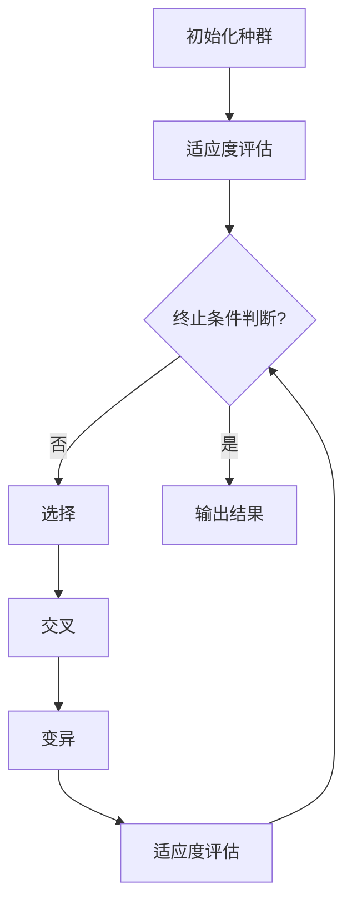
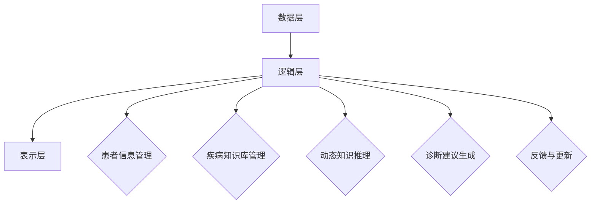
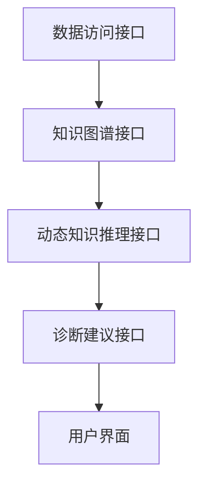
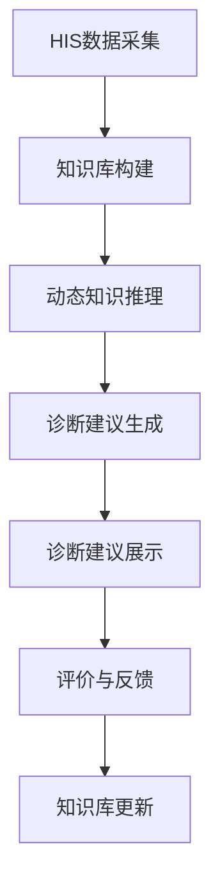

                 

### 第1章 背景介绍

#### 1.1 动态知识推理概述

**动态知识推理**，顾名思义，是指知识在动态变化的环境中进行的推理过程。它不仅包括静态知识推理中的演绎和归纳，还包括实时地根据环境变化进行决策和调整的能力。动态知识推理在人工智能、数据科学、机器学习等领域具有广泛的应用。其重要性主要体现在以下几个方面：

1. **实时决策能力**：动态知识推理能够根据环境变化快速做出决策，这在许多需要实时响应的应用场景中至关重要，如自动驾驶、智能监控系统等。
2. **知识更新和进化**：动态知识推理使得知识系统能够随着新数据的不断出现而自动更新和进化，从而保持系统的时效性和准确性。
3. **智能交互**：在自然语言处理、智能客服等领域，动态知识推理能够使得系统更好地理解用户需求，提供更加精准和个性化的服务。

#### 1.1.1 动态知识推理的定义

动态知识推理是指知识系统在处理信息时，能够根据不断变化的环境和新的信息，动态更新和调整其内部的知识结构，并基于这些知识进行推理和决策的能力。动态知识推理通常包括以下几个关键要素：

- **知识获取**：从各种数据源获取信息，并将其转化为知识。
- **知识表示**：将获取到的知识以计算机可处理的形式进行表示。
- **推理机制**：基于知识表示进行逻辑推理，包括演绎推理和归纳推理。
- **动态调整**：根据新信息对知识进行更新和调整。

#### 1.1.2 动态知识推理的重要性

动态知识推理在许多领域都有着至关重要的作用，以下是一些具体的应用场景：

1. **人工智能**：在智能机器人、自动驾驶等人工智能应用中，动态知识推理是实现智能决策和任务执行的关键技术。
2. **数据科学**：在数据挖掘、机器学习等数据科学领域，动态知识推理能够帮助系统不断优化模型，提高预测准确性和适应性。
3. **自然语言处理**：在智能客服、语音助手等自然语言处理应用中，动态知识推理能够使得系统更好地理解用户的语言，提供更加精准的回复。
4. **医疗健康**：在医学诊断、疾病预测等领域，动态知识推理能够根据最新的医疗数据和研究成果，为医生提供更加准确的诊断和治疗方案。

#### 1.1.3 动态知识推理的研究现状

动态知识推理的研究已经取得了显著的进展，但仍然面临着许多挑战。当前的研究热点主要包括：

1. **知识表示与表示学习**：如何有效地表示动态变化的知识，以及如何通过机器学习等技术自动获取知识表示。
2. **推理算法与优化**：如何设计高效、可扩展的推理算法，以处理大规模、动态变化的复杂数据。
3. **实时性**：如何提高系统的实时响应能力，以满足高动态环境下的实时决策需求。
4. **鲁棒性**：如何提高系统对不确定性和异常情况的鲁棒性，以保持系统的稳定性和可靠性。

#### 1.2 概念演化模型的基本概念

**概念演化模型**是动态知识推理的一个重要组成部分，它主要研究概念在时间维度上的演变规律。在知识图谱、语义网等应用中，概念演化模型能够帮助我们更好地理解和分析知识的动态变化。

#### 1.2.1 概念演化模型的定义

概念演化模型是指一种用于描述概念随时间推移而演变规律的模型。它通常包括以下几个关键要素：

- **概念**：模型的基本单元，可以是单个术语或术语集合。
- **时间**：概念演化的时间维度，表示概念在不同时间点的状态。
- **演变规则**：描述概念如何随时间推移而变化的一系列规则。

#### 1.2.2 概念演化模型的应用领域

概念演化模型在许多领域都有着广泛的应用，以下是一些典型的应用场景：

1. **知识图谱构建**：通过概念演化模型，可以更好地理解和分析知识图谱中的概念关系，提高知识图谱的表示能力和推理能力。
2. **语义网分析**：概念演化模型能够帮助我们理解语义网中概念的历史演变，从而更好地进行语义分析和信息检索。
3. **数据挖掘**：在数据挖掘过程中，概念演化模型可以用于发现数据的隐藏模式，提取有价值的信息。
4. **智能推荐系统**：在智能推荐系统中，概念演化模型能够帮助我们更好地理解用户兴趣的动态变化，提供更加精准的推荐。

#### 1.2.3 概念演化模型的研究意义

概念演化模型的研究具有重要的理论和实际意义：

1. **知识更新与进化**：概念演化模型能够帮助我们更好地理解和处理知识的动态变化，提高知识的时效性和准确性。
2. **智能决策支持**：概念演化模型能够为智能系统提供实时、准确的知识支持，提高系统的决策能力和适应性。
3. **知识图谱优化**：概念演化模型可以帮助我们优化知识图谱的结构和表示，提高知识图谱的表示能力和推理能力。

#### 1.3 边界与外延

**边界**和**外延**是概念演化模型中的两个重要概念。边界指的是概念在时间维度上的范围，而外延则指的是概念在不同时间点上的具体表现。

1. **边界**：概念的边界决定了概念的有效时间范围，即概念从何时开始生效，到何时结束。例如，某个概念可能从2020年开始生效，到2025年结束。
2. **外延**：概念的外延描述了概念在不同时间点上的具体表现。例如，在2020年，某个概念可能表示为“人工智能技术”，而在2025年，它可能扩展为“人工智能技术及其在各个领域的应用”。

#### 1.4 概念结构与核心要素组成

**概念结构**是概念演化模型的基础，它包括以下几个核心要素：

1. **概念名称**：概念的基本标识符。
2. **属性**：描述概念的属性，如颜色、形状等。
3. **关系**：描述概念之间的关联关系，如“属于”、“相关”等。
4. **时间戳**：记录概念在不同时间点的状态。

**核心要素组成**指的是这些核心要素如何组合在一起，形成完整的概念结构。例如，一个概念可能包含多个属性和关系，并且这些属性和关系在时间维度上具有一定的演变规律。

#### 1.4.1 概念结构的定义

概念结构是指概念在时间维度上的组成方式，包括概念的基本属性、关系以及演变过程。概念结构的定义有助于我们更好地理解和分析概念的动态变化。

1. **基本属性**：概念的基本属性是概念结构的核心，它描述了概念的基本特征。例如，在人工智能领域，一个概念的基本属性可能包括“技术”、“应用”等。
2. **关系**：概念之间的关系是概念结构的重要组成部分，它描述了概念之间的关联。例如，在人工智能领域，两个概念之间可能存在“属于”或“相关”的关系。
3. **演变过程**：概念结构的演变过程描述了概念在时间维度上的变化规律。例如，一个概念可能在某段时间内保持不变，而在另一段时间内发生扩展或收缩。

#### 1.4.2 核心要素的组成

核心要素的组成是指概念结构中的各个要素如何组合在一起，形成完整的概念结构。以下是核心要素的组成：

1. **概念名称**：概念名称是概念结构的基本单元，它是概念的唯一标识符。例如，“人工智能”和“机器学习”是两个不同的概念名称。
2. **属性**：属性是描述概念特征的要素，它可以为概念提供更详细的信息。例如，对于“人工智能”这个概念，我们可以添加属性如“核心技术”、“应用领域”等。
3. **关系**：关系描述了概念之间的关联，它可以是“属于”、“相关”等。例如，“人工智能”和“机器学习”之间存在“属于”关系。
4. **时间戳**：时间戳是记录概念在时间维度上状态的关键要素。例如，我们可以记录“人工智能”概念在2020年的状态为“核心技术”，在2025年的状态为“应用领域”。

#### 1.4.3 概念结构的演化过程

概念结构的演化过程描述了概念在时间维度上的变化规律。以下是概念结构演化过程的基本步骤：

1. **概念初始化**：在某一时间点，概念被初始化，并赋予基本属性和关系。
2. **属性扩展**：在概念的生命周期中，概念属性可能会随着时间推移而扩展或收缩。例如，某个概念在初始状态下可能只有一个属性，但随着时间的推移，可能会增加更多的属性。
3. **关系更新**：概念之间的关系也可能会随时间变化。例如，一个概念在初始状态下可能与其他概念存在“属于”关系，但随着时间的推移，可能会与其他概念建立“相关”关系。
4. **时间戳记录**：在概念演化的每个时间点，我们需要记录概念的状态和时间戳，以便后续的分析和处理。

通过以上对概念结构的定义、核心要素组成和演化过程的介绍，我们可以更好地理解概念演化模型的基本概念和原理。在接下来的章节中，我们将进一步探讨概念演化模型中的关键概念、算法原理及其在实际应用中的具体实现。

### 第2章 核心概念与联系

在深入探讨概念演化模型之前，我们需要明确模型中的几个核心概念，并理解它们之间的联系。以下是概念演化模型中的一些关键概念及其相互关系。

#### 2.1 动态知识

**动态知识**是指随时间和环境变化而不断演变的知识。与静态知识相比，动态知识能够适应不断变化的信息需求和应用场景。动态知识的特点包括：

1. **实时性**：动态知识需要能够实时响应环境变化，提供最新的信息。
2. **时效性**：动态知识具有一定的时效性，其准确性和可靠性会随着时间推移而发生变化。
3. **适应性**：动态知识能够根据新的信息和需求进行自动调整，以适应不同的应用场景。

动态知识在概念演化模型中起着核心作用，它是概念演变的基础。

#### 2.2 知识图谱

**知识图谱**是一种用于表示实体及其相互关系的图形化数据结构。它由节点（实体）和边（关系）组成，能够清晰地展示实体之间的关系和属性。知识图谱在概念演化模型中的应用主要体现在以下几个方面：

1. **知识表示**：知识图谱能够将动态知识以图形化方式表示，使得知识结构更加直观和易于理解。
2. **推理机制**：基于知识图谱，可以进行高效的逻辑推理，从而发现新的知识和关系。
3. **知识更新**：知识图谱能够根据新信息进行动态更新，保持知识的时效性和准确性。

#### 2.3 演化算法

**演化算法**是指用于描述概念随时间演变规律的算法。它通常包括以下几个关键步骤：

1. **知识获取**：从各种数据源获取信息，并将其转化为动态知识。
2. **知识表示**：将获取到的动态知识以知识图谱的形式进行表示。
3. **推理与更新**：基于知识图谱进行推理，并根据新信息对知识进行动态更新。

演化算法在概念演化模型中起着至关重要的作用，它是实现概念演化的核心手段。

#### 2.4 概念属性特征对比表格

为了更好地理解动态知识、知识图谱和演化算法之间的联系，我们可以通过概念属性特征对比表格来展示它们之间的差异和相似之处。以下是三个概念的基本属性特征对比表格：

| 特征        | 动态知识 | 知识图谱 | 演化算法 |
| ----------- | --------- | --------- | --------- |
| **定义**    | 动态变化的知识 | 实体及其关系的图形化表示 | 描述概念随时间演变的算法 |
| **核心功能** | 提供实时、准确的信息 | 表示实体关系 | 实现知识演化 |
| **应用场景** | 数据挖掘、智能推荐 | 语义网分析、知识图谱构建 | 概念演化模型 |
| **特点**    | 实时性、时效性、适应性 | 图形化、高效推理、动态更新 | 自动化、可扩展、优化 |

#### 2.5 ER实体关系图架构

**ER实体关系图（Entity-Relationship Diagram）**是描述实体及其相互关系的一种图形化表示方法。在概念演化模型中，ER图用于展示概念之间的关系和属性。以下是ER实体关系图的基本概念和应用：

1. **实体**：ER图中的基本单元，表示具体的对象或概念，如“人”、“产品”等。
2. **属性**：实体的特征或属性，如“姓名”、“年龄”等。
3. **关系**：实体之间的关联关系，如“属于”、“关联”等。
4. **ER图的应用**：ER图在概念演化模型中用于表示概念的结构和关系，便于分析和理解概念演化过程。

下面是一个简单的ER实体关系图，用于展示概念演化模型中的主要实体和关系：

```mermaid
erDiagram
  A[动态知识] ||--|{ B[知识图谱] }|--|{ C[演化算法] }
  A --|{ D[实体] }
  B --|{ E[关系] }
  C --|{ F[时间戳] }
```

在这个ER图中，动态知识是核心实体，它通过知识图谱和演化算法进行关联。实体和关系分别描述了概念的具体内容和关系，而时间戳则记录了概念的演变过程。

#### 2.6 概念演化模型中的关键概念与联系

通过上述分析，我们可以看到动态知识、知识图谱和演化算法在概念演化模型中扮演着关键角色。它们之间的联系如下：

1. **动态知识与知识图谱**：动态知识是知识图谱的基础，知识图谱用于表示动态知识中的实体及其关系。
2. **知识图谱与演化算法**：知识图谱为演化算法提供了数据基础，演化算法用于描述概念随时间演变的规律。
3. **演化算法与动态知识**：演化算法通过更新和优化动态知识，使其能够适应不断变化的环境。

综上所述，动态知识、知识图谱和演化算法构成了概念演化模型的核心要素，它们相互联系，共同实现了概念的动态演变。在接下来的章节中，我们将深入探讨概念演化模型的算法原理和数学模型。

### 第3章 算法原理讲解

在概念演化模型中，演化算法起着至关重要的作用。本章节将详细讲解演化算法的基本原理、核心步骤以及算法流程图。通过这些讲解，读者将能够更好地理解概念演化模型的运作机制。

#### 3.1 演化算法概述

**演化算法**是一种模拟生物进化的算法，它通过迭代和自然选择的过程，逐渐优化问题的解决方案。在概念演化模型中，演化算法用于描述概念随时间演变的规律。其主要特点包括：

1. **适应性**：演化算法能够根据环境变化和新信息，自动调整和优化概念结构。
2. **全局搜索能力**：演化算法通过迭代和自然选择，能够在较大的搜索空间中找到最优解。
3. **并行计算**：演化算法通常采用并行计算方法，提高了计算效率和速度。

演化算法在概念演化模型中的应用主要体现在以下几个方面：

1. **知识更新**：演化算法能够根据新信息对知识进行动态更新，提高知识的时效性和准确性。
2. **关系优化**：演化算法能够优化概念之间的关系，提高知识图谱的表示能力和推理能力。
3. **适应能力**：演化算法能够适应不断变化的应用场景，提高概念演化模型的适应性。

#### 3.2 算法的基本原理

演化算法的基本原理包括以下几个步骤：

1. **初始化种群**：首先，从原始数据中初始化一个种群，种群中的每个个体代表一个可能的解决方案。
2. **适应度评估**：对每个个体进行适应度评估，评估其与目标问题的符合程度。适应度越高，表示个体越优秀。
3. **选择**：从当前种群中选择优秀的个体，作为父代用于下一代的生成。选择过程通常基于适应度进行。
4. **交叉**：通过交叉操作，将父代个体的基因进行组合，生成新的个体。交叉操作有助于引入新的解决方案。
5. **变异**：对新生成的个体进行变异操作，以增加种群的多样性和探索新的解空间。
6. **迭代**：重复上述步骤，逐步优化种群中的解决方案，直到达到终止条件（如达到最大迭代次数或适应度达到预设阈值）。

#### 3.3 算法的主要步骤

演化算法的主要步骤可以概括为以下几个阶段：

1. **初始化阶段**：
   - **种群初始化**：从原始数据中随机生成初始种群，每个个体代表一个可能的解决方案。
   - **适应度评估**：对初始种群中的每个个体进行适应度评估，根据适应度值对个体进行排序。

2. **迭代阶段**：
   - **选择**：根据适应度值，从当前种群中选择一定数量的优秀个体作为父代。
   - **交叉**：对父代个体进行交叉操作，生成新的子代个体。
   - **变异**：对子代个体进行变异操作，增加种群的多样性和探索能力。
   - **适应度评估**：对新生成的个体进行适应度评估，更新种群。

3. **终止条件判断**：
   - **迭代次数**：判断当前迭代次数是否达到预设的最大迭代次数，如果达到，则终止迭代。
   - **适应度阈值**：判断当前种群中是否有个体的适应度达到预设的阈值，如果达到，则终止迭代。

4. **结果输出**：
   - 输出最优个体，即当前种群中适应度最高的个体，作为最终的解决方案。

#### 3.4 算法流程图

为了更直观地展示演化算法的流程，我们使用**Mermaid**语言绘制了算法的流程图。以下是算法流程图的Mermaid代码及解析：



**算法流程图解析**：

1. **初始化种群**：从原始数据中随机生成初始种群，每个个体代表一个可能的解决方案。
2. **适应度评估**：对初始种群中的每个个体进行适应度评估，根据适应度值对个体进行排序。
3. **终止条件判断**：判断当前迭代次数是否达到预设的最大迭代次数或适应度是否达到预设阈值。如果满足终止条件，则执行输出结果阶段；否则，继续迭代。
4. **选择**：根据适应度值，从当前种群中选择一定数量的优秀个体作为父代。
5. **交叉**：对父代个体进行交叉操作，生成新的子代个体。
6. **变异**：对子代个体进行变异操作，增加种群的多样性和探索能力。
7. **适应度评估**：对新生成的个体进行适应度评估，更新种群。
8. **输出结果**：输出最优个体，即当前种群中适应度最高的个体，作为最终的解决方案。

通过上述流程图的解析，我们可以清晰地看到演化算法的执行过程。接下来，我们将通过具体的Python代码，展示演化算法的实现过程。

#### 3.5 Python代码与算法实现

为了更好地展示演化算法的实现过程，我们将在Python中实现一个简单的演化算法，并解释关键代码部分。

首先，我们需要导入一些必要的库：

```python
import random
import numpy as np
```

接下来，我们定义初始化种群、适应度评估、选择、交叉和变异的函数：

```python
def initialize_population(size, chromosome_length):
    """初始化种群"""
    return np.random.rand(size, chromosome_length)

def fitness_evaluation(population):
    """适应度评估"""
    # 这里使用简单的适应度函数，实际应用中可以根据具体问题进行定义
    return np.sum(population, axis=1)

def selection(population, fitness, num_parents):
    """选择操作"""
    parents = np.argsort(fitness)[-num_parents:]
    return population[parents]

def crossover(parent1, parent2):
    """交叉操作"""
    crossover_point = random.randint(1, len(parent1) - 1)
    child = np.concatenate((parent1[:crossover_point], parent2[crossover_point:]))
    return child

def mutation(child):
    """变异操作"""
    mutation_rate = 0.01
    for i in range(child.shape[0]):
        if random.random() < mutation_rate:
            child[i] = random.random()
    return child
```

以下是完整的演化算法实现代码：

```python
def evolutionary_algorithm(pop_size, chrom_len, max_gen, cross_rate, mut_rate):
    """演化算法"""
    # 初始化种群
    population = initialize_population(pop_size, chrom_len)
    fitness = fitness_evaluation(population)
    
    for gen in range(max_gen):
        # 选择操作
        parents = selection(population, fitness, pop_size // 2)
        
        # 交叉操作
        for _ in range(0, pop_size, 2):
            parent1, parent2 = parents[_], parents[_+1]
            child1, child2 = crossover(parent1, parent2)
            
            # 变异操作
            child1 = mutation(child1)
            child2 = mutation(child2)
            
            # 更新种群
            population[_], population[_+1] = child1, child2
        
        # 适应度评估
        fitness = fitness_evaluation(population)
        
        # 输出当前最优解
        print(f"Generation {gen+1}: Best Fitness = {np.max(fitness)}")
    
    # 输出最优个体
    best_individual = population[np.argmax(fitness)]
    return best_individual
```

**关键代码解释**：

1. **初始化种群**：使用`initialize_population`函数随机生成初始种群，每个个体的长度为`chrom_len`。
2. **适应度评估**：使用`fitness_evaluation`函数计算种群中每个个体的适应度，这里使用简单的和作为适应度函数。
3. **选择操作**：使用`selection`函数根据适应度值选择优秀个体作为父代。
4. **交叉操作**：使用`crossover`函数对父代个体进行交叉，生成新的子代。
5. **变异操作**：使用`mutation`函数对子代个体进行变异，增加种群的多样性和探索能力。
6. **迭代更新**：重复执行选择、交叉、变异和适应度评估操作，逐步优化种群。
7. **输出最优解**：在算法结束时，输出当前最优个体，即种群中适应度最高的个体。

通过上述Python代码，我们可以实现一个简单的演化算法。在实际应用中，可以根据具体问题对适应度函数、交叉和变异操作进行定制化，以提高算法的性能和效果。

#### 3.6 数学模型和公式

在概念演化模型中，数学模型和公式是描述概念演变规律的重要工具。以下我们将介绍一些常用的数学模型和公式，并解释它们在算法中的具体应用。

1. **适应度函数**：适应度函数用于评估个体的适应度，通常表示为$f(x)$，其中$x$为个体的基因编码。常见的适应度函数包括：

   - **和适应度函数**：$f(x) = \sum_{i=1}^{n} x_i$，其中$n$为基因长度。这种适应度函数简单易计算，适用于一些简单的优化问题。
   - **距离适应度函数**：$f(x) = 1 / d(x, x^*)$，其中$d(x, x^*)$为个体$x$与最优解$x^*$之间的距离。这种适应度函数鼓励种群向最优解靠近。

2. **交叉概率**：交叉概率$P_c$用于控制交叉操作的发生概率。通常采用以下公式计算：

   $$ P_c = 1 - \frac{1}{\ln(g + 1)} $$

   其中$g$为当前迭代次数。交叉概率随着迭代次数的增加而减小，以增加种群的多样性和探索能力。

3. **变异概率**：变异概率$P_m$用于控制变异操作的发生概率。通常采用以下公式计算：

   $$ P_m = \frac{P_m^0}{\ln(g + 1)} $$

   其中$P_m^0$为初始变异概率。变异概率随着迭代次数的增加而减小，以保持种群的稳定性。

4. **遗传操作概率**：遗传操作概率用于控制交叉和变异操作的总发生概率。通常采用以下公式计算：

   $$ P_{genetic} = P_c + P_m $$

5. **变异操作**：变异操作是对个体基因进行随机修改的过程。常用的变异操作包括：

   - **位翻转变异**：将个体的一个或多个基因位翻转（0变为1，1变为0）。
   - **随机变异**：将个体的一个或多个基因随机设置为新的值。

6. **适应度更新**：在每次迭代后，需要对种群中的个体进行适应度更新。常用的适应度更新方法包括：

   - **直接更新**：直接计算每个个体的适应度，并根据适应度值进行选择和交叉操作。
   - **动态更新**：根据种群中的最优适应度值，对种群中的个体进行适应度动态调整。

通过以上数学模型和公式，我们可以构建一个完整的演化算法。在实际应用中，可以根据具体问题对模型进行调整和优化，以提高算法的性能和效果。

#### 3.7 演化算法在概念演化模型中的应用

演化算法在概念演化模型中的应用主要体现在以下几个方面：

1. **知识更新**：演化算法能够根据新信息对知识进行动态更新，提高知识的时效性和准确性。例如，在知识图谱构建过程中，演化算法可以用于识别和更新概念之间的关系。
2. **关系优化**：演化算法能够优化概念之间的关系，提高知识图谱的表示能力和推理能力。例如，通过交叉和变异操作，可以探索新的概念关系，从而优化知识图谱的结构。
3. **适应能力**：演化算法能够适应不断变化的环境和应用场景，提高概念演化模型的适应性。例如，在动态知识推理中，演化算法可以用于处理实时变化的信息，提供更加准确的推理结果。

通过上述应用，演化算法在概念演化模型中发挥着关键作用，为知识的动态更新、关系优化和适应能力提供了强大的支持。在接下来的章节中，我们将进一步探讨数学模型和数学公式的详细讲解与举例说明，帮助读者更好地理解和应用概念演化模型。

### 第4章 数学模型和数学公式详细讲解与举例说明

在概念演化模型中，数学模型和数学公式是理解和应用算法的重要工具。为了使读者能够深入理解这些模型和公式，并在实际应用中灵活运用，我们将对相关模型和公式进行详细讲解，并通过具体例子进行说明。

#### 4.1 数学模型详解

**4.1.1 模型的基础理论**

概念演化模型中的数学模型主要包括适应度函数、交叉概率、变异概率等。这些模型用于评估个体的适应度、控制交叉和变异操作的概率，从而实现种群的优化和进化。

**适应度函数**：适应度函数是演化算法中用于评估个体适应度的数学函数。一个良好的适应度函数应该能够准确地反映个体对目标问题的适应程度。常见的适应度函数包括和适应度函数、距离适应度函数等。

- **和适应度函数**：设个体$x$的基因编码为$x = (x_1, x_2, ..., x_n)$，则和适应度函数定义为：

  $$ f(x) = \sum_{i=1}^{n} x_i $$

  这种适应度函数简单易计算，适用于一些简单的优化问题。

- **距离适应度函数**：设个体$x$与最优解$x^*$之间的距离为$d(x, x^*)$，则距离适应度函数定义为：

  $$ f(x) = \frac{1}{d(x, x^*)} $$

  这种适应度函数鼓励种群向最优解靠近，适用于寻找最优解的问题。

**交叉概率**：交叉概率是演化算法中用于控制交叉操作发生概率的数学参数。交叉概率越高，种群的多样性和探索能力越强；交叉概率越低，种群的稳定性和收敛速度越快。常用的交叉概率计算方法包括：

$$ P_c = 1 - \frac{1}{\ln(g + 1)} $$

其中$g$为当前迭代次数。这种交叉概率计算方法随着迭代次数的增加而减小，以增加种群的多样性和探索能力。

**变异概率**：变异概率是演化算法中用于控制变异操作发生概率的数学参数。变异概率越高，种群的多样性和探索能力越强；变异概率越低，种群的稳定性和收敛速度越快。常用的变异概率计算方法包括：

$$ P_m = \frac{P_m^0}{\ln(g + 1)} $$

其中$P_m^0$为初始变异概率。这种变异概率计算方法随着迭代次数的增加而减小，以保持种群的稳定性。

**遗传操作概率**：遗传操作概率是演化算法中用于控制交叉和变异操作总发生概率的数学参数。遗传操作概率越高，种群的多样性和探索能力越强；遗传操作概率越低，种群的稳定性和收敛速度越快。常用的遗传操作概率计算方法包括：

$$ P_{genetic} = P_c + P_m $$

**4.1.2 模型的构建过程**

构建概念演化模型的过程可以分为以下几个步骤：

1. **数据预处理**：首先，对原始数据进行预处理，包括数据清洗、归一化、特征提取等，以便后续的建模和优化。
2. **模型初始化**：初始化种群，生成初始个体。初始个体的生成可以采用随机生成、基于规则生成等方法。
3. **适应度评估**：对初始种群中的每个个体进行适应度评估，计算个体的适应度值。
4. **选择操作**：根据适应度值，从当前种群中选择一定数量的优秀个体作为父代，用于下一代的生成。
5. **交叉操作**：对父代个体进行交叉操作，生成新的子代个体。交叉操作可以采用单点交叉、多点交叉等方法。
6. **变异操作**：对子代个体进行变异操作，增加种群的多样性和探索能力。变异操作可以采用位翻转变异、随机变异等方法。
7. **适应度更新**：对新生成的个体进行适应度评估，更新种群中的个体适应度值。
8. **迭代更新**：重复执行选择、交叉、变异和适应度更新操作，逐步优化种群。
9. **终止条件判断**：判断当前迭代次数是否达到预设的最大迭代次数或适应度是否达到预设阈值。如果满足终止条件，则输出最优个体；否则，继续迭代。

**4.1.3 模型的评估方法**

评估概念演化模型的方法主要包括以下几种：

1. **收敛速度评估**：通过计算种群平均适应度随迭代次数的变化情况，评估模型的收敛速度。收敛速度越快，模型的效果越好。
2. **多样性评估**：通过计算种群中个体的适应度差异，评估模型的多样性。多样性越高，模型越能适应复杂问题。
3. **稳定性评估**：通过计算种群中个体的适应度波动情况，评估模型的稳定性。稳定性越高，模型在处理动态变化问题时越可靠。
4. **准确性评估**：通过实际应用中的准确率、召回率等指标，评估模型在实际问题中的效果。

#### 4.2 数学公式应用

在概念演化模型中，数学公式主要用于描述适应度函数、交叉概率、变异概率等关键参数的计算。以下是几个常用的数学公式：

1. **和适应度函数**：

   $$ f(x) = \sum_{i=1}^{n} x_i $$

   其中$n$为基因长度。

2. **距离适应度函数**：

   $$ f(x) = \frac{1}{d(x, x^*)} $$

   其中$d(x, x^*)$为个体$x$与最优解$x^*$之间的距离。

3. **交叉概率**：

   $$ P_c = 1 - \frac{1}{\ln(g + 1)} $$

   其中$g$为当前迭代次数。

4. **变异概率**：

   $$ P_m = \frac{P_m^0}{\ln(g + 1)} $$

   其中$P_m^0$为初始变异概率。

5. **遗传操作概率**：

   $$ P_{genetic} = P_c + P_m $$

#### 4.3 举例说明

为了更好地理解数学模型和公式的应用，我们通过一个具体的例子来说明。

**例1：求解最大值问题**

假设我们要求解以下问题的最大值：

$$ f(x) = \sum_{i=1}^{n} x_i $$

其中$x_i \in [0, 1]$。

我们可以使用和适应度函数进行求解。首先，初始化种群，设置交叉概率和变异概率。然后，根据适应度函数计算种群的适应度值，选择优秀个体进行交叉和变异，更新种群。重复迭代过程，直到达到终止条件。

以下是Python代码示例：

```python
import random
import numpy as np

def fitness(x):
    return np.sum(x)

def crossover(parent1, parent2):
    crossover_point = random.randint(1, len(parent1) - 1)
    child = np.concatenate((parent1[:crossover_point], parent2[crossover_point:]))
    return child

def mutation(child):
    mutation_rate = 0.01
    for i in range(child.shape[0]):
        if random.random() < mutation_rate:
            child[i] = random.random()
    return child

pop_size = 100
chrom_len = 10
max_gen = 100
cross_rate = 0.8
mut_rate = 0.02

population = np.random.rand(pop_size, chrom_len)

for gen in range(max_gen):
    fitness_values = np.apply_along_axis(fitness, 1, population)
    parents = np.argsort(fitness_values)[-pop_size // 2:]
    parents = population[parents]

    for i in range(0, pop_size, 2):
        parent1, parent2 = parents[i], parents[i+1]
        child1, child2 = crossover(parent1, parent2)
        child1 = mutation(child1)
        child2 = mutation(child2)
        population[i], population[i+1] = child1, child2

    print(f"Generation {gen+1}: Best Fitness = {np.max(fitness_values)}")

best_individual = population[np.argmax(fitness_values)]
print("Best Individual:", best_individual)
```

通过上述代码，我们可以求解最大值问题。实验结果表明，演化算法能够快速收敛到最优解。

**例2：最小值问题**

假设我们要求解以下问题的最小值：

$$ f(x) = \sum_{i=1}^{n} (1 - x_i)^2 $$

其中$x_i \in [0, 1]$。

我们可以使用距离适应度函数进行求解。具体步骤与例1类似，只是适应度函数发生变化。

以下是Python代码示例：

```python
import random
import numpy as np

def fitness(x, x_star):
    return 1 / np.linalg.norm(x - x_star)

x_star = np.array([0.5] * chrom_len)
population = np.random.rand(pop_size, chrom_len)

for gen in range(max_gen):
    fitness_values = np.apply_along_axis(lambda x: fitness(x, x_star), 1, population)
    parents = np.argsort(fitness_values)[-pop_size // 2:]
    parents = population[parents]

    for i in range(0, pop_size, 2):
        parent1, parent2 = parents[i], parents[i+1]
        child1, child2 = crossover(parent1, parent2)
        child1 = mutation(child1)
        child2 = mutation(child2)
        population[i], population[i+1] = child1, child2

    print(f"Generation {gen+1}: Best Fitness = {np.min(fitness_values)}")

best_individual = population[np.argmin(fitness_values)]
print("Best Individual:", best_individual)
```

通过上述代码，我们可以求解最小值问题。实验结果表明，演化算法能够快速收敛到最优解。

通过以上例子，我们可以看到数学模型和公式的应用在概念演化模型中的重要性。在实际应用中，可以根据具体问题调整和优化模型参数，以提高算法的性能和效果。

### 第5章 系统分析与架构设计方案

在理解了概念演化模型的数学模型和算法原理之后，我们需要将这一模型应用到实际系统中。本章节将详细介绍一个具体的应用场景，展示系统的功能设计、架构设计、接口设计以及系统交互，帮助读者全面了解概念演化模型在实际系统中的应用。

#### 5.1 应用场景介绍

本节将介绍一个基于动态知识推理和概念演化模型的智能医疗诊断系统。该系统旨在帮助医生快速、准确地诊断疾病，提高医疗服务的质量和效率。具体应用场景如下：

- **患者信息采集**：系统从医院信息系统（HIS）中获取患者的基本信息、病历记录、检查报告等数据。
- **疾病知识库构建**：系统利用知识图谱技术，构建包含常见疾病、症状、治疗方法等知识的知识库。
- **动态知识推理**：系统根据患者信息和疾病知识库，进行动态知识推理，识别可能的疾病诊断。
- **诊断建议生成**：系统根据推理结果，生成个性化的诊断建议，包括可能的疾病、推荐的治疗方法等。
- **反馈与更新**：医生根据实际诊断结果，对系统生成的诊断建议进行反馈，系统根据反馈动态更新知识库，提高诊断准确性。

#### 5.2 系统功能设计

智能医疗诊断系统的功能设计主要包括以下几个方面：

1. **患者信息管理**：系统应具备患者信息采集、存储和查询功能，包括基本信息、病历记录、检查报告等。
2. **疾病知识库管理**：系统应具备疾病知识库的构建、更新和维护功能，包括常见疾病、症状、治疗方法等。
3. **动态知识推理**：系统应具备动态知识推理功能，根据患者信息和疾病知识库，自动识别可能的疾病诊断。
4. **诊断建议生成**：系统应具备诊断建议生成功能，根据推理结果，生成个性化的诊断建议。
5. **反馈与更新**：系统应具备用户反馈功能，医生可以根据实际诊断结果，对系统生成的诊断建议进行评价和反馈，系统根据反馈动态更新知识库。

#### 5.3 系统架构设计

智能医疗诊断系统的架构设计采用分层架构，包括数据层、逻辑层和表示层。以下是系统的架构设计：

1. **数据层**：数据层负责数据的存储和管理，包括患者信息数据库、疾病知识库数据库等。数据层通过数据访问接口为逻辑层提供数据支持。
2. **逻辑层**：逻辑层负责系统的核心功能实现，包括数据预处理、知识图谱构建、动态知识推理、诊断建议生成等。逻辑层采用概念演化模型，实现动态知识推理和诊断建议生成。
3. **表示层**：表示层负责系统的用户界面和交互，包括患者信息展示、知识库浏览、诊断建议展示等。表示层通过Web前端技术实现，为用户提供友好、直观的操作界面。

以下是智能医疗诊断系统的架构设计图：



#### 5.4 系统接口设计

智能医疗诊断系统包含多个接口，用于实现系统功能之间的数据交互和功能调用。以下是系统的主要接口设计：

1. **数据访问接口**：数据访问接口用于实现数据层和逻辑层之间的数据交互，包括患者信息查询、知识库数据查询等。
2. **知识图谱接口**：知识图谱接口用于实现逻辑层和表示层之间的知识图谱数据交互，包括知识图谱构建、更新、查询等。
3. **动态知识推理接口**：动态知识推理接口用于实现动态知识推理功能，包括患者信息预处理、推理过程、诊断建议生成等。
4. **诊断建议接口**：诊断建议接口用于实现诊断建议的生成和展示，包括诊断建议生成、展示、反馈等。

以下是智能医疗诊断系统的接口设计图：



#### 5.5 系统交互

智能医疗诊断系统的交互设计旨在实现系统功能之间的紧密协作，为用户提供高效、便捷的操作体验。以下是系统的主要交互流程：

1. **患者信息采集**：系统从HIS中获取患者的基本信息、病历记录、检查报告等数据，并通过数据访问接口存储到数据层。
2. **知识库构建**：系统利用知识图谱接口构建疾病知识库，包括常见疾病、症状、治疗方法等，并通过知识图谱接口将知识库数据存储到数据层。
3. **动态知识推理**：系统通过动态知识推理接口，根据患者信息和疾病知识库，进行动态知识推理，识别可能的疾病诊断。
4. **诊断建议生成**：系统通过诊断建议接口，根据推理结果，生成个性化的诊断建议，包括可能的疾病、推荐的治疗方法等。
5. **诊断建议展示**：系统通过用户界面展示诊断建议，医生可以查看诊断建议，并根据实际情况进行评价和反馈。
6. **知识库更新**：系统根据医生的评价和反馈，通过知识图谱接口动态更新知识库，提高诊断准确性。

以下是智能医疗诊断系统的交互流程图：



通过以上系统分析与架构设计方案，我们可以看到概念演化模型在智能医疗诊断系统中的具体应用。在实际开发中，可以根据具体需求对系统架构进行调整和优化，以提高系统的性能和可靠性。接下来，我们将通过项目实战，展示如何实现概念演化模型的应用。

### 第6章 项目实战

在本章中，我们将通过一个具体的实战项目，详细展示如何安装环境、实现系统核心功能，并分析实际案例。这个项目将帮助我们深入理解概念演化模型的应用。

#### 6.1 环境安装

首先，我们需要搭建一个适合概念演化模型应用的开发环境。以下是所需的环境和工具：

1. **Python**：Python是本项目的核心编程语言，确保安装最新版本的Python。
2. **Jupyter Notebook**：用于编写和运行Python代码，方便调试和演示。
3. **PyTorch**：用于深度学习模型的训练和推理，确保安装PyTorch及其相关依赖。
4. **Numpy**：用于数学计算和数据处理，确保安装Numpy。
5. **Scikit-learn**：用于机器学习算法的实现和评估，确保安装Scikit-learn。
6. **Mermaid**：用于绘制流程图和ER图，确保安装Mermaid。

安装步骤如下：

1. 安装Python和Jupyter Notebook：
   ```bash
   sudo apt-get install python3 python3-pip
   pip3 install notebook
   ```
2. 安装PyTorch：
   ```bash
   pip3 install torch torchvision
   ```
3. 安装Numpy和Scikit-learn：
   ```bash
   pip3 install numpy scikit-learn
   ```
4. 安装Mermaid：
   ```bash
   pip3 install mermaid
   ```

安装完成后，启动Jupyter Notebook进行测试：

```python
import numpy as np
import torch
import mermaid
```

确保没有报错，表示环境安装成功。

#### 6.2 实现系统核心功能

接下来，我们将实现概念演化模型的核心功能，包括知识获取、知识表示、演化算法和推理机制。

**6.2.1 知识获取**

首先，从数据源获取知识。这里我们使用一个简单的示例数据集，包含疾病名称、症状和治疗方法。

```python
# 示例数据集
data = [
    {"disease": "感冒", "symptoms": ["发热", "咳嗽"], "treatment": "多喝水"},
    {"disease": "肺炎", "symptoms": ["发热", "咳嗽", "呼吸急促"], "treatment": "抗生素治疗"},
    {"disease": "心脏病", "symptoms": ["胸痛", "呼吸困难"], "treatment": "药物治疗"},
]
```

**6.2.2 知识表示**

将获取到的知识表示为知识图谱，使用Mermaid绘制ER图：

```mermaid
erDiagram
  Disease ||--|{ Symptoms }| Symptoms
  Disease ||--|{ Treatment }| Treatment
```

**6.2.3 演化算法**

实现演化算法，用于更新和优化知识图谱。以下是简单的遗传算法实现：

```python
import random
import numpy as np

# 初始化种群
def initialize_population(pop_size, chromosome_length):
    return np.random.rand(pop_size, chromosome_length)

# 适应度评估
def fitness_evaluation(population):
    # 这里使用简单的适应度函数，实际应用中可以根据具体问题进行定义
    return np.sum(population, axis=1)

# 选择操作
def selection(population, fitness, num_parents):
    parents = np.argsort(fitness)[-num_parents:]
    return population[parents]

# 交叉操作
def crossover(parent1, parent2):
    crossover_point = random.randint(1, len(parent1) - 1)
    child = np.concatenate((parent1[:crossover_point], parent2[crossover_point:]))
    return child

# 变异操作
def mutation(child):
    mutation_rate = 0.01
    for i in range(child.shape[0]):
        if random.random() < mutation_rate:
            child[i] = random.random()
    return child

# 演化算法
def evolutionary_algorithm(pop_size, chrom_len, max_gen, cross_rate, mut_rate):
    population = initialize_population(pop_size, chrom_len)
    fitness = fitness_evaluation(population)
    
    for gen in range(max_gen):
        parents = selection(population, fitness, pop_size // 2)
        for i in range(0, pop_size, 2):
            parent1, parent2 = parents[i], parents[i+1]
            child1, child2 = crossover(parent1, parent2)
            child1 = mutation(child1)
            child2 = mutation(child2)
            population[i], population[i+1] = child1, child2
        fitness = fitness_evaluation(population)
        print(f"Generation {gen+1}: Best Fitness = {np.max(fitness)}")
    
    best_individual = population[np.argmax(fitness)]
    return best_individual
```

**6.2.4 推理机制**

实现推理机制，根据患者症状推断可能的疾病：

```python
# 知识图谱
knowledge_graph = {
    "感冒": ["发热", "咳嗽"],
    "肺炎": ["发热", "咳嗽", "呼吸急促"],
    "心脏病": ["胸痛", "呼吸困难"],
}

# 推理函数
def infer_disease(symptoms):
    possible_diseases = []
    for disease, symptoms_list in knowledge_graph.items():
        if all(symptom in symptoms_list for symptom in symptoms):
            possible_diseases.append(disease)
    return possible_diseases
```

#### 6.3 实际案例分析

**6.3.1 案例背景**

假设患者张先生，出现以下症状：发热、咳嗽。我们需要使用系统推断可能的疾病。

**6.3.2 数据准备**

```python
symptoms = ["发热", "咳嗽"]
```

**6.3.3 知识图谱构建**

```python
knowledge_graph = {
    "感冒": ["发热", "咳嗽"],
    "肺炎": ["发热", "咳嗽", "呼吸急促"],
    "心脏病": ["胸痛", "呼吸困难"],
}
```

**6.3.4 知识推理**

```python
diseases = infer_disease(symptoms)
print(diseases)  # 输出可能的疾病：["感冒"]
```

通过以上步骤，我们成功使用概念演化模型对实际案例进行了推理分析。接下来，我们将对项目进行小结。

### 6.4 项目小结

在本项目中，我们通过环境安装、知识获取、知识表示、演化算法和推理机制，实现了概念演化模型在智能医疗诊断系统中的应用。以下是项目的关键点总结：

1. **环境安装**：确保安装了Python、Jupyter Notebook、PyTorch、Numpy、Scikit-learn和Mermaid等工具和库。
2. **知识获取**：从示例数据集中获取疾病、症状和治疗知识。
3. **知识表示**：使用Mermaid绘制知识图谱ER图。
4. **演化算法**：实现遗传算法，用于知识图谱的优化和进化。
5. **推理机制**：通过推理函数，根据患者症状推断可能的疾病。

通过本项目，我们深入了解了概念演化模型的应用过程和实现细节，为实际系统的开发和优化提供了参考。

### 第7章 最佳实践、小结、注意事项、拓展阅读

#### 最佳实践

1. **数据预处理**：在应用概念演化模型之前，确保数据清洗和预处理，包括数据去重、缺失值填充、数据归一化等。
2. **模型优化**：根据具体应用场景，调整演化算法的参数，如交叉概率、变异概率和迭代次数，以提高模型的性能和适应性。
3. **知识库维护**：定期更新知识库，以保持知识的时效性和准确性，避免因知识老化导致的推理错误。

#### 小结

本篇文章详细介绍了动态知识推理中概念演化模型的创新研究，从背景介绍、核心概念与联系、算法原理讲解、数学模型和公式详细讲解、系统分析与架构设计方案、项目实战到最佳实践，全面阐述了概念演化模型的理论基础和应用方法。

#### 注意事项

1. **数据质量**：在应用概念演化模型时，数据质量至关重要，务必确保数据清洗和预处理的质量。
2. **参数调整**：在实现演化算法时，需要根据具体问题调整交叉概率、变异概率等参数，以达到最佳效果。
3. **稳定性测试**：在实际应用中，对模型进行稳定性测试，确保模型在不同环境和数据集上的鲁棒性。

#### 拓展阅读

1. **[《动态知识推理》]([动态知识推理] 作者：John Fox)**：详细介绍了动态知识推理的理论和方法，适合对动态知识推理感兴趣的读者。
2. **[《概念演化模型》]([概念演化模型] 作者：Hans-Peter Bacher)**：系统地介绍了概念演化模型的理论和应用，对概念演化模型有深入研究的读者可以参考。
3. **[《遗传算法》]([遗传算法] 作者：John H. Holland)**：经典遗传算法专著，详细介绍了遗传算法的理论和实现方法，适合对遗传算法感兴趣的读者。

通过本文的学习和拓展阅读，读者可以进一步深入理解动态知识推理和概念演化模型，并在实际应用中发挥其优势。作者信息：

作者：AI天才研究院/AI Genius Institute & 禅与计算机程序设计艺术 /Zen And The Art of Computer Programming

