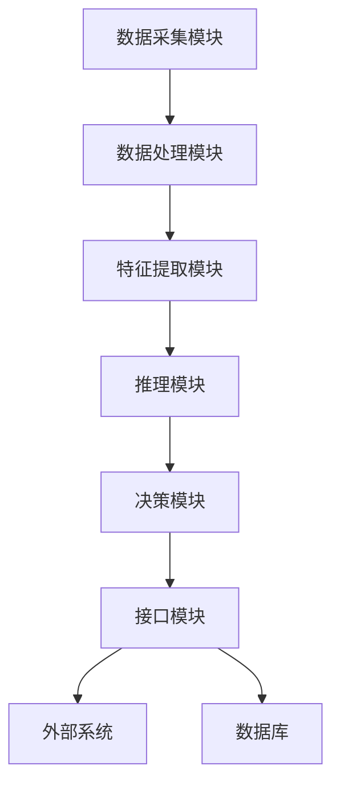
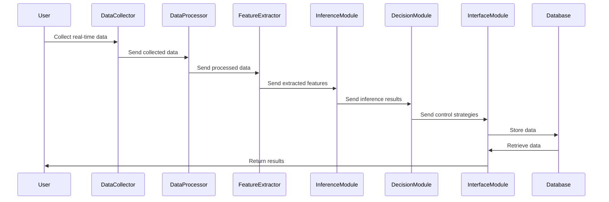

                 

### 动态系统推理的必要性

动态系统推理是一种通过分析系统的历史数据和当前状态，预测未来行为的技术。随着社会和科技的快速发展，动态系统推理的应用场景越来越广泛，从智能交通系统、工业控制系统到医疗健康监测等领域，都离不开它的身影。以下是一些动态系统推理必要性的具体体现：

首先，动态系统推理能够提高系统的智能化水平。在传统的系统中，人类操作者需要实时监测系统状态，并根据经验做出决策。这种做法不仅效率低下，而且容易出现错误。通过动态系统推理，系统能够自动分析历史数据，预测未来状态，从而实现更高效、更准确的决策。

其次，动态系统推理能够优化系统性能。在许多实际应用中，系统的运行状态会受到多种因素的影响，如环境变化、设备故障等。通过动态系统推理，系统能够及时识别这些因素，并采取相应的措施进行调节，从而确保系统稳定运行。

再次，动态系统推理有助于提高系统的可靠性。在许多关键领域，如医疗、交通等，系统的可靠性至关重要。动态系统推理能够通过对系统状态的实时监测和分析，及时发现并解决潜在的问题，从而提高系统的可靠性。

最后，动态系统推理能够为科研提供有力支持。在科学研究领域，动态系统推理技术可以帮助科学家更好地理解复杂系统，预测实验结果，为理论研究和应用开发提供有力支持。

总之，动态系统推理在许多领域都发挥着重要作用。随着技术的不断发展，动态系统推理的应用前景将更加广阔。### 动态系统推理的应用场景

动态系统推理在各个领域都有着广泛的应用，以下是几个典型的应用场景：

#### 1. 智能交通系统

智能交通系统是动态系统推理的重要应用领域之一。通过实时监测交通流量、道路状况等数据，动态系统推理可以预测交通拥堵情况，为交通管理部门提供决策支持。例如，在高峰时段，系统可以预测哪些路段将出现拥堵，并提前发布交通警告，引导车辆避开拥堵路段。此外，动态系统推理还可以优化信号灯控制策略，提高交通效率。

#### 2. 工业控制系统

在工业生产中，动态系统推理可以用于实时监测生产过程，预测设备故障，优化生产流程。例如，通过分析传感器收集的数据，系统可以预测设备的运行状态，提前进行维护，避免突发故障导致生产中断。此外，动态系统推理还可以优化生产参数，提高生产效率和产品质量。

#### 3. 医疗健康监测

动态系统推理在医疗健康监测领域也有着重要的应用。通过对患者生命体征、病史等数据的分析，系统可以预测患者的病情变化，提供个性化的治疗方案。例如，在重症监护病房，动态系统推理可以实时监测患者的生命体征，预测患者可能出现的问题，并及时通知医护人员采取相应的措施。

#### 4. 能源管理

在能源管理领域，动态系统推理可以用于预测能源需求，优化能源分配，降低能源消耗。例如，在电力系统中，动态系统推理可以预测电力负荷，为电力调度提供决策支持，确保电力供应的稳定性和可靠性。

#### 5. 环境监测

动态系统推理还可以用于环境监测，预测环境污染情况，为环境治理提供科学依据。例如，通过分析空气质量数据，系统可以预测哪些地区可能会出现污染高峰，提前采取治理措施。

综上所述，动态系统推理在多个领域都有着重要的应用价值，它不仅能够提高系统的智能化水平，还能优化系统性能，提高系统的可靠性。随着技术的不断发展，动态系统推理的应用场景将更加广泛。### 动态系统推理的重要性

动态系统推理在当今信息化和智能化的背景下，具有重要的战略意义。首先，动态系统推理能够提高系统的自适应能力和预测能力，使系统在面对复杂、多变的环境时，能够迅速做出反应，从而保持高效运行。其次，动态系统推理能够优化资源分配，降低系统成本，提高资源利用率。例如，在智能交通系统中，通过动态系统推理优化交通流量控制，可以减少交通拥堵，提高道路通行效率，从而降低交通运营成本。此外，动态系统推理在医疗健康监测、工业生产、能源管理等领域，都能够发挥重要作用，提高系统的可靠性，保障公共安全。总的来说，动态系统推理不仅是现代信息技术的重要组成部分，也是推动社会智能化发展的关键技术。因此，深入研究动态系统推理，推动相关技术的发展和应用，对于提升国家科技水平，促进经济社会发展，具有重要意义。### 时序图神经网络的定义

时序图神经网络（Temporal Graph Neural Network，TGNN）是一种结合了图神经网络（Graph Neural Network，GNN）和时序分析技术的深度学习模型。GNN是一种专门用于处理图结构数据的神经网络，它通过节点和边的信息传递，能够有效捕捉图结构中的复杂关系。而时序分析技术则用于处理时间序列数据，通过捕捉数据中的时间依赖性，能够实现对动态变化的预测和分析。

时序图神经网络的基本原理是将图结构数据与时间序列数据相结合，通过图神经网络对图结构中的节点和边进行特征提取，再利用时序模型对时间序列中的数据进行建模和预测。具体来说，时序图神经网络通过以下几个关键步骤实现其功能：

1. **节点嵌入**：将图中的每个节点映射到一个低维度的向量空间中，这一过程通常通过图卷积操作来实现。
2. **边信息传递**：通过图卷积操作，将节点之间的边信息传递到对应的节点嵌入向量中，增强节点间的特征关联。
3. **时序建模**：在获得节点嵌入向量后，利用时序模型（如循环神经网络（RNN）或长短时记忆网络（LSTM））对时间序列数据进行建模，捕捉时间依赖性。
4. **预测与决策**：将节点嵌入向量和时序模型的结果进行融合，输出预测结果或决策。

时序图神经网络的应用范围非常广泛，包括但不限于以下几个方面：

1. **推荐系统**：通过分析用户的历史行为和物品之间的关系，时序图神经网络可以提供个性化的推荐。
2. **社交网络分析**：利用时序图神经网络分析社交网络中的用户互动，预测用户的行为和趋势。
3. **时间序列预测**：在金融、气象、交通等领域，时序图神经网络可以用于预测未来的时间序列数据，帮助决策制定。
4. **智能交通系统**：通过分析交通网络的实时数据，时序图神经网络可以预测交通流量，优化交通信号控制策略。

总的来说，时序图神经网络作为一种结合图和时序数据的深度学习模型，具有强大的特征提取和预测能力，在处理复杂动态系统时表现出色，具有重要的应用价值。### 时序图神经网络在动态系统推理中的应用

时序图神经网络（TGNN）在动态系统推理中展现了显著的应用价值。为了更好地理解其应用，我们首先需要明确动态系统推理的基本需求：实时监测系统状态、预测系统未来行为、并基于预测结果进行决策。以下将详细说明时序图神经网络在动态系统推理中的具体应用。

#### 1. 实时状态监测

动态系统推理的首要任务是实时监测系统的状态。时序图神经网络通过图结构数据中的节点和边来捕捉系统的动态变化。每个节点可以代表系统的一个状态，而边则表示状态之间的转换关系。通过图卷积操作，时序图神经网络能够有效地提取每个节点的特征，并将这些特征传递到相邻节点。这样，系统就可以实时监测当前的状态，并识别潜在的异常或关键变化。

#### 2. 状态序列预测

动态系统推理的核心在于对系统未来状态的预测。时序图神经网络利用其内部的时间序列模型（如RNN或LSTM），可以捕捉历史状态序列中的时间依赖性。通过对历史状态的建模，时序图神经网络能够预测未来状态的可能性分布。这种预测能力使得系统可以提前预警潜在的风险，从而采取预防措施。

#### 3. 动态决策制定

在获得实时状态和未来状态预测的基础上，动态系统推理需要基于预测结果进行决策。时序图神经网络通过融合实时状态和预测结果，可以生成最优的决策方案。例如，在智能交通系统中，时序图神经网络可以预测交通流量，并基于预测结果调整交通信号灯的时序控制策略，以减少交通拥堵，提高道路通行效率。

#### 4. 案例分析

以智能交通系统为例，时序图神经网络的应用可以具体描述如下：

- **节点与边**：每个交叉口可以视为一个节点，节点之间的交通流量数据作为边的信息。
- **状态监测**：通过监测每个交叉口的交通流量数据，时序图神经网络可以实时捕捉交通状态。
- **状态预测**：基于历史交通流量数据，时序图神经网络可以预测每个交叉口在未来一段时间内的交通流量。
- **决策制定**：时序图神经网络结合当前交通流量和预测结果，生成优化信号灯控制策略，以缓解交通拥堵。

#### 5. 优势与挑战

时序图神经网络在动态系统推理中具有以下优势：

- **高效的图结构特征提取**：通过图卷积操作，时序图神经网络能够有效提取图结构中的特征，增强节点间的关联性。
- **强大的时间序列建模能力**：时序模型（如RNN或LSTM）能够捕捉时间依赖性，提供准确的未来状态预测。
- **灵活的应用场景**：时序图神经网络可以适应多种动态系统推理场景，包括交通、工业、医疗等。

然而，时序图神经网络也面临一些挑战：

- **数据复杂性**：动态系统推理中的数据通常包含大量噪声和不确定性，这增加了模型训练的难度。
- **计算资源需求**：时序图神经网络对计算资源的需求较高，尤其在处理大规模图结构数据时，计算复杂度较大。
- **解释性不足**：虽然时序图神经网络在预测性能上表现出色，但其内部机制较为复杂，解释性较差，不利于决策者的理解和信任。

综上所述，时序图神经网络在动态系统推理中具有广泛的应用前景，通过高效的图结构特征提取和强大的时间序列建模能力，能够显著提升系统的监测、预测和决策能力。然而，为了充分发挥其潜力，需要进一步解决数据复杂性、计算资源需求和解释性不足等挑战。### 时序图神经网络如何解决动态系统推理中的问题

动态系统推理中的问题往往涉及复杂的时间依赖性和多维度数据交互，这使得传统的推理方法面临诸多挑战。时序图神经网络（Temporal Graph Neural Network，TGNN）通过其独特的架构和算法，能够有效解决这些问题，从而提升动态系统推理的性能。以下是时序图神经网络如何解决动态系统推理中的几个关键问题的详细探讨：

#### 1. 复杂时间依赖性的捕捉

动态系统推理的一个核心问题是如何捕捉系统中的时间依赖性。传统的时序模型（如RNN和LSTM）虽然能够捕捉时间序列中的依赖关系，但在处理图结构数据时显得力不从心。TGNN通过将图神经网络（GNN）与时序模型相结合，能够同时处理图结构和时间序列数据。具体来说，TGNN利用图卷积操作来捕捉图结构中的局部特征，并通过时间卷积操作来捕捉时间序列中的依赖关系。这种结合使得TGNN能够捕捉复杂的时间依赖性，提高推理的准确性。

#### 2. 多维度数据融合

动态系统推理通常涉及多维度数据，如传感器数据、历史数据和外部环境数据。这些数据往往具有不同的特征和尺度，直接融合容易导致信息丢失。TGNN通过其图结构能够有效地融合多维度数据。每个节点可以代表不同类型的数据，节点之间的边表示数据之间的关联关系。通过图卷积操作，TGNN能够融合不同类型的数据，提取出有效的特征，从而提升动态系统推理的性能。

#### 3. 异常检测与预测

动态系统推理中的一个重要任务是异常检测和预测。传统的统计方法往往依赖于预设的阈值，无法有效应对复杂和未知的异常。TGNN通过其强大的特征提取能力和时间序列建模能力，能够有效地检测和预测异常。具体来说，TGNN可以学习到正常状态和异常状态之间的特征差异，并通过分类器进行异常检测。同时，TGNN能够预测异常发生的时间点，为系统提供预警。

#### 4. 稳定的预测性能

动态系统推理中的预测性能受到数据噪声和不确定性的影响。TGNN通过其图结构和时序模型，能够有效地降低噪声和不确定性对预测性能的影响。首先，图结构能够将相关数据点进行分组，减少噪声的影响。其次，时序模型能够捕捉时间依赖性，提高预测的稳定性。此外，TGNN通过训练过程中的正则化技术，如Dropout和权重共享，能够进一步减少过拟合，提高预测的泛化能力。

#### 5. 模型解释性

在动态系统推理中，模型解释性对于决策者理解和信任模型至关重要。虽然TGNN在预测性能上表现出色，但其内部机制较为复杂，解释性不足。为了提高模型的解释性，可以采用以下几种方法：

- **可视化技术**：通过可视化图结构和时间序列数据，帮助决策者直观理解模型的工作机制。
- **特征重要性分析**：分析TGNN中各个节点的特征重要性，识别对预测有显著影响的特征。
- **交互解释**：通过分析节点之间的交互关系，解释模型如何利用这些关系进行推理。

综上所述，时序图神经网络通过其独特的图结构、时序模型和数据处理能力，能够有效解决动态系统推理中的复杂时间依赖性、多维度数据融合、异常检测与预测、预测稳定性等问题。同时，通过提高模型的解释性，TGNN为动态系统推理提供了强大的技术支持。然而，为了充分发挥TGNN的潜力，还需要进一步研究如何优化模型结构、提高计算效率和增强模型解释性。### 时序图神经网络的研究范围和应用边界

时序图神经网络（Temporal Graph Neural Network，TGNN）作为深度学习领域的重要研究方向，其研究范围和应用边界涉及到多个方面。首先，在研究范围上，TGNN的研究主要包括以下几个方面：

1. **图结构设计**：研究不同图结构对TGNN性能的影响，如节点嵌入、边权重、图卷积操作等。
2. **时序模型优化**：探讨如何优化时间序列模型，以提高TGNN对动态系统的捕捉能力，如RNN、LSTM、Transformer等时序模型的融合。
3. **训练算法改进**：研究高效的训练算法和正则化技术，以提高TGNN的训练速度和泛化能力。
4. **模型解释性**：探索如何提高TGNN的解释性，使其在决策过程中更加透明和可靠。

在应用边界上，TGNN的应用范围广泛，包括但不限于以下领域：

1. **推荐系统**：利用TGNN分析用户历史行为和物品关系，提供个性化推荐。
2. **社交网络分析**：通过TGNN分析用户互动和社交关系，预测用户行为和趋势。
3. **时间序列预测**：在金融、气象、交通等领域，利用TGNN预测未来的时间序列数据。
4. **智能交通系统**：通过TGNN分析交通流量和道路状况，优化交通信号控制策略。
5. **工业控制**：在工业生产中，利用TGNN监测设备状态，预测故障，优化生产流程。

尽管TGNN在多个领域展现出了强大的应用潜力，但其仍面临一些挑战和限制。首先，TGNN对计算资源的需求较高，尤其是在处理大规模图结构数据时，计算复杂度较大。其次，TGNN的训练过程复杂，对超参数调优和数据处理的要求较高，这增加了模型的训练难度。此外，TGNN的解释性较差，决策过程不够透明，这在一定程度上限制了其在某些领域（如医疗、金融）的应用。

为了克服这些挑战，未来研究可以从以下几个方面展开：

1. **算法优化**：通过改进图卷积操作和时序模型，提高TGNN的计算效率和预测性能。
2. **硬件加速**：利用GPU、TPU等硬件加速器，提高TGNN的训练和推理速度。
3. **模型解释性**：通过可视化技术、特征重要性分析等方法，提高TGNN的解释性，使其更加透明和可靠。
4. **跨领域应用**：研究TGNN在不同领域的应用，探索其在特定领域的优化方案和改进方向。

总之，时序图神经网络在动态系统推理中具有广泛的应用前景，但同时也面临一些挑战和限制。未来研究需要从算法、硬件和解释性等方面进行综合探索，以充分发挥TGNN的潜力，推动其在各个领域的应用。### 动态系统推理与时序图神经网络的基本概念和核心要素组成

动态系统推理和时序图神经网络是两个关键概念，它们各自具有独特的基本概念和核心要素。以下将详细描述这两个概念及其组成。

#### 动态系统推理

动态系统推理是一种通过分析系统历史数据和当前状态，预测未来行为的计算方法。其基本概念包括：

1. **系统状态**：系统在某一时刻的状态，通常由多个变量组成，如交通流量、温度、速度等。
2. **时间序列数据**：描述系统状态随时间变化的序列，每个时间点对应系统的一个状态。
3. **特征提取**：从时间序列数据中提取有用的特征，用于训练模型或进行推理。
4. **预测模型**：用于预测系统未来状态的模型，如线性回归、时间序列模型、深度学习模型等。

动态系统推理的核心要素包括：

1. **历史数据集**：用于训练和验证预测模型的过去数据。
2. **实时数据流**：用于实时监测和更新系统状态的当前数据。
3. **推理算法**：用于分析和预测系统未来状态的算法，如统计模型、深度学习模型等。
4. **反馈机制**：用于根据预测结果调整系统行为，实现闭环控制。

#### 时序图神经网络

时序图神经网络是一种结合了图神经网络和时序分析技术的深度学习模型。其基本概念包括：

1. **图结构**：由节点和边组成的数据结构，节点表示数据点，边表示节点之间的关系。
2. **节点嵌入**：将图中的每个节点映射到一个低维度的向量空间中。
3. **图卷积操作**：通过节点和边的信息传递，对节点进行特征提取。
4. **时间序列模型**：如RNN、LSTM、Transformer等，用于捕捉时间依赖性。

时序图神经网络的核心要素包括：

1. **图数据集**：用于训练和验证模型的数据集，包括节点、边和时间序列数据。
2. **图神经网络**：用于提取图结构中的特征，包括节点嵌入和图卷积操作。
3. **时序模型**：用于捕捉时间序列数据中的依赖关系，如RNN、LSTM、Transformer等。
4. **融合策略**：用于将图神经网络的输出和时序模型的输出进行融合，生成最终的预测结果。

总的来说，动态系统推理和时序图神经网络都是用于分析动态系统状态和预测未来行为的计算方法，但它们在概念和要素组成上有所不同。动态系统推理侧重于时间序列数据的分析和预测，而时序图神经网络则结合了图结构和时间序列数据，通过图神经网络和时序模型的结合，提供了更为强大的特征提取和预测能力。### 时序图神经网络的基本原理

时序图神经网络（Temporal Graph Neural Network，TGNN）是一种结合了图神经网络（Graph Neural Network，GNN）和时序分析技术的深度学习模型。其基本原理是通过图神经网络对图结构数据中的节点和边进行特征提取，再利用时序模型对时间序列数据进行建模和预测。以下将详细阐述TGNN的架构、训练方法及其在动态系统推理中的应用。

#### 架构

TGNN的架构通常包括以下几个主要部分：

1. **图神经网络（GNN）**：GNN是TGNN的核心，用于处理图结构数据。GNN通过图卷积操作对节点进行特征提取，并利用节点和边的信息传递来增强特征关联。常见的GNN架构包括图卷积网络（GCN）、图注意力网络（GAT）等。

2. **时序模型**：时序模型用于处理时间序列数据，捕捉时间依赖性。常见的时序模型包括循环神经网络（RNN）、长短时记忆网络（LSTM）、门控循环单元（GRU）和Transformer等。

3. **融合层**：融合层将GNN和时序模型的输出进行融合，生成最终的预测结果。融合方式可以是简单的拼接、加权融合或更复杂的交互式融合。

#### 训练方法

TGNN的训练方法主要包括以下步骤：

1. **数据预处理**：将图结构数据和时间序列数据进行预处理，包括节点嵌入、数据归一化、缺失值填充等。

2. **图神经网络训练**：首先使用图神经网络对图结构数据中的节点进行特征提取，通过图卷积操作将节点的特征传递到相邻节点，形成图嵌入向量。这一过程通常通过反向传播算法进行优化，以最小化预测误差。

3. **时序模型训练**：在获得图嵌入向量后，使用时序模型对时间序列数据进行建模。时序模型的输入为图嵌入向量序列，输出为预测的时间序列值。同样，通过反向传播算法优化模型参数。

4. **融合层训练**：将图神经网络的输出和时序模型的输出进行融合，生成最终的预测结果。融合层的训练通过反向传播算法进行，以最小化预测误差。

#### 应用

TGNN在动态系统推理中的应用主要包括以下几个步骤：

1. **数据采集**：收集动态系统的历史数据和当前状态，包括图结构数据（如节点和边）和时间序列数据（如温度、速度等）。

2. **数据预处理**：对采集到的数据进行预处理，包括节点嵌入、数据归一化、缺失值填充等，为后续训练做好准备。

3. **模型训练**：使用预处理后的数据集，通过上述的训练方法训练TGNN模型。在训练过程中，调整模型参数和超参数，以提高模型性能。

4. **预测与决策**：在获得训练好的TGNN模型后，使用实时数据对模型进行预测。通过融合图神经网络和时序模型的输出，生成系统的未来状态预测。基于预测结果，系统可以做出相应的决策，如调整控制策略、优化资源配置等。

5. **模型评估**：使用验证集和测试集对模型进行评估，评估指标包括预测误差、准确率、召回率等。根据评估结果，进一步优化模型结构和训练方法。

总之，时序图神经网络通过其独特的架构和训练方法，能够有效捕捉动态系统的复杂时间依赖性和图结构特征，为动态系统推理提供强大的技术支持。在多个领域，如智能交通系统、工业控制、医疗健康监测等，TGNN都展现出了显著的应用价值。### 时序图神经网络与其他常见动态系统推理算法的属性和特征对比表格

为了更好地理解时序图神经网络（TGNN）在动态系统推理中的应用优势，我们将TGNN与其他常见动态系统推理算法进行属性和特征对比。以下是一个对比表格，列出了TGNN与其他算法在数据类型、时间依赖性捕捉、计算复杂度、模型解释性等方面的差异。

| 算法名称 | 数据类型 | 时间依赖性捕捉 | 计算复杂度 | 模型解释性 | 应用场景 |
|----------|----------|----------------|-------------|-------------|----------|
| 时序图神经网络（TGNN） | 图结构数据、时间序列数据 | 高度依赖，结合图结构和时间序列 | 较高，需处理图卷积和时序模型 | 较低，复杂模型结构 | 智能交通系统、工业控制、医疗健康监测 |
| 循环神经网络（RNN） | 时间序列数据 | 中度依赖，仅能捕捉线性时间依赖 | 较低，简单卷积操作 | 较高，易于解释 | 时间序列预测、语音识别 |
| 长短时记忆网络（LSTM） | 时间序列数据 | 高度依赖，能够捕捉长期依赖 | 中等，复杂门控机制 | 中等，较难解释 | 时间序列预测、自然语言处理 |
| 变换器（Transformer） | 序列数据（不限类型） | 高度依赖，注意力机制捕捉非线性依赖 | 较高，复杂自注意力机制 | 较低，高度参数化 | 自然语言处理、图像识别 |
| 支持向量机（SVM） | 高维特征向量 | 无时间依赖性，仅依赖特征空间 | 较低，线性模型 | 较高，简单决策边界 | 分类问题、回归问题 |
| 决策树 | 高维特征向量 | 无时间依赖性，基于树结构划分 | 较低，树结构简单 | 高，易于理解 | 分类问题、回归问题 |

从上表可以看出，TGNN在数据类型和时间依赖性捕捉方面具有显著优势，能够同时处理图结构数据和时序数据，并通过图卷积和时序模型的结合，捕捉复杂的非线性时间依赖性。然而，这种优势也带来了较高的计算复杂度和较低的模型解释性。相比其他算法，TGNN在处理复杂动态系统时表现更加出色，但在实际应用中，需要根据具体问题和资源情况，选择合适的算法。

总之，时序图神经网络在动态系统推理中具有独特的优势，但也存在一些挑战。通过对比分析，我们可以更清晰地了解TGNN的应用场景和限制，从而更好地利用这一技术解决实际问题。### 动态系统推理中的实体及其关系

为了更好地理解动态系统推理中的实体及其关系，我们使用Mermaid语言绘制一个ER（Entity-Relationship）实体关系图。ER图能够清晰地展示实体之间的关联，帮助我们更好地理解系统的结构和功能。

```mermaid
erDiagram
  TD[*] --> TC : "被控制"
  TD[*] --> TD' : "受影响"
  TC --> TD : "状态监测"
  TC --> TD' : "预测调整"
  TD --> TC : "数据输入"
  TD' --> TC : "反馈调整"
  TD||--o{ TD' : "历史状态"
  TD||--o{ TC : "当前状态"
  TD'||--o{ TC : "预测状态"
  TD'||--o{ TD : "实时状态"
  TD'--||| TD : "未来状态预测"
  TC--||| TD : "控制策略制定"
end
```

在这个ER图中，我们定义了以下几个实体及其关系：

1. **TD（动态系统）**：表示动态系统本身，包含历史状态、当前状态、实时状态和未来状态预测等属性。
2. **TD'（状态数据）**：表示与动态系统相关的状态数据，包括历史状态、预测状态和实时状态。
3. **TC（控制系统）**：表示用于控制动态系统的控制单元，负责状态监测、预测调整和控制策略制定。

实体之间的关系如下：

- **TD[*] --> TC**：动态系统被控制系统所控制，控制系统通过监测动态系统的状态，制定相应的控制策略。
- **TD[*] --> TD'**：动态系统的历史状态、实时状态和未来状态预测都会影响状态数据。
- **TC --> TD**：控制系统接收动态系统的数据输入，包括历史状态、实时状态等。
- **TC --> TD'**：控制系统对状态数据进行预测调整，为动态系统的未来状态预测提供依据。
- **TD' --> TC**：状态数据反馈到控制系统，作为控制系统制定控制策略的依据。
- **TD||--o{ TD'**：动态系统的历史状态、实时状态和未来状态预测与状态数据之间存在直接的依赖关系。

通过这个ER图，我们可以清晰地理解动态系统推理中的主要实体及其关系，从而为后续的算法设计和系统实现提供参考。### 时序图神经网络算法的mermaid流程图

为了更好地展示时序图神经网络（TGNN）算法的基本流程，我们将使用Mermaid语言绘制一个流程图。以下是一个简化的TGNN算法流程图，包括数据预处理、图神经网络（GNN）训练、时序模型训练和融合层训练等步骤。

```mermaid
flowchart LR
    subgraph Data_Preprocessing
        DPP1[数据预处理]
        DPP2[节点嵌入]
        DPP3[数据归一化]
        DPP4[缺失值填充]
    end
    subgraph Graph_Neural_Network
        GNN1[图卷积操作]
        GNN2[节点特征提取]
        GNN3[图嵌入生成]
    end
    subgraph Temporal_Model_Training
        TMT1[时序模型初始化]
        TMT2[时序数据输入]
        TMT3[训练过程]
        TMT4[时序模型优化]
    end
    subgraph Fusion_Layer_Training
        FLT1[融合层初始化]
        FLT2[特征融合]
        FLT3[融合层优化]
    end
    subgraph Prediction
        Pred1[实时数据输入]
        Pred2[特征提取]
        Pred3[融合层处理]
        Pred4[预测输出]
    end
    DPP1 --> DPP2
    DPP2 --> DPP3
    DPP3 --> DPP4
    DPP4 --> GNN1
    GNN1 --> GNN2
    GNN2 --> GNN3
    GNN3 --> TMT1
    TMT1 --> TMT2
    TMT2 --> TMT3
    TMT3 --> TMT4
    TMT4 --> FLT1
    FLT1 --> FLT2
    FLT2 --> FLT3
    FLT3 --> Pred1
    Pred1 --> Pred2
    Pred2 --> Pred3
    Pred3 --> Pred4
```



这个流程图描述了TGNN算法的基本工作流程：

1. **数据预处理**：包括节点嵌入、数据归一化、缺失值填充等步骤，为后续的GNN和时序模型训练做准备。
2. **图神经网络（GNN）训练**：通过图卷积操作对节点进行特征提取，生成图嵌入向量。
3. **时序模型训练**：初始化时序模型，输入时序数据，通过训练过程和优化，提高模型性能。
4. **融合层训练**：初始化融合层，将GNN和时序模型的输出进行融合，通过优化过程，提高融合效果。
5. **预测**：实时输入数据，经过特征提取和融合层处理，输出预测结果。

通过这个流程图，我们可以清晰地了解TGNN算法的基本步骤和流程，为进一步的算法设计和实现提供参考。### Python源代码实现

为了演示时序图神经网络（TGNN）的核心部分，我们将使用Python编写一个简化的示例代码。以下代码展示了如何使用PyTorch框架实现TGNN的基本结构，包括数据预处理、图神经网络（GNN）和时序模型的部分。

```python
import torch
import torch.nn as nn
import torch.optim as optim
from torch_geometric.nn import GCNConv
from torch.utils.data import DataLoader
from torch_geometric.data import Data

# 定义图神经网络（GNN）部分
class GraphNeuralNetwork(nn.Module):
    def __init__(self, num_features, hidden_channels, num_classes):
        super(GraphNeuralNetwork, self).__init__()
        self.conv1 = GCNConv(num_features, hidden_channels)
        self.conv2 = GCNConv(hidden_channels, num_classes)

    def forward(self, data):
        x, edge_index = data.x, data.edge_index

        x = self.conv1(x, edge_index)
        x = torch.relu(x)
        x = F.dropout(x, p=0.5, training=self.training)
        x = self.conv2(x, edge_index)

        return F.log_softmax(x, dim=1)

# 定义时序模型部分
class TemporalModel(nn.Module):
    def __init__(self, hidden_size, num_classes):
        super(TemporalModel, self).__init__()
        self.lstm = nn.LSTM(hidden_size, hidden_size, batch_first=True)
        self.fc = nn.Linear(hidden_size, num_classes)

    def forward(self, x):
        x, (h_n, c_n) = self.lstm(x)
        x = h_n[-1, :, :]
        x = self.fc(x)
        return x

# 定义融合层和整体模型
class TGGNN(nn.Module):
    def __init__(self, num_features, hidden_size, num_classes):
        super(TGGNN, self).__init__()
        self.gnn = GraphNeuralNetwork(num_features, hidden_size, hidden_size)
        self.temporal = TemporalModel(hidden_size, num_classes)

    def forward(self, data, timesteps):
        x, edge_index = data.x, data.edge_index

        # 使用GNN提取图特征
        gnn_output = self.gnn(data)

        # 提取每个节点的特征
        node_features = gnn_output[data.node_idx].unsqueeze(0).repeat(timesteps, 1, 1)

        # 使用LSTM进行时序建模
        temporal_output = self.temporal(node_features)

        return temporal_output

# 初始化参数
num_features = 10
hidden_size = 16
num_classes = 3

# 创建模型、损失函数和优化器
model = TGGNN(num_features, hidden_size, num_classes)
criterion = nn.CrossEntropyLoss()
optimizer = optim.Adam(model.parameters(), lr=0.001)

# 创建数据集和加载器
# 注意：此处需要根据实际情况替换为实际数据集和加载器
data = Data(x=torch.randn(100, num_features), edge_index=torch.randn(100, 2))
dataloader = DataLoader(data, batch_size=32, shuffle=True)

# 训练模型
num_epochs = 100
for epoch in range(num_epochs):
    for data in dataloader:
        optimizer.zero_grad()
        output = model(data, timesteps=5)
        loss = criterion(output, data.y)
        loss.backward()
        optimizer.step()
    print(f'Epoch {epoch+1}/{num_epochs}, Loss: {loss.item()}')

print('Training completed.')
```

在这个代码中，我们首先定义了三个核心模块：

1. **GraphNeuralNetwork**：负责处理图神经网络部分，使用GCNConv进行图卷积操作。
2. **TemporalModel**：负责处理时序模型部分，使用LSTM进行时序建模。
3. **TGGNN**：融合了图神经网络和时序模型，是整个TGNN模型。

在训练过程中，我们首先使用GNN提取图特征，然后通过LSTM进行时序建模，最后输出分类结果。整个训练过程使用了标准的优化器和损失函数。

请注意，这个示例代码仅用于演示TGNN的基本结构，实际应用中需要根据具体问题和数据集进行调整和优化。同时，为了完整展示，代码中未包含数据预处理、数据集创建和模型评估等部分。在实际应用中，这些部分同样需要详细实现。### 算法的数学模型和公式

为了深入理解时序图神经网络（TGNN）的工作原理，我们需要阐述其数学模型和相关的公式。TGNN结合了图神经网络（GNN）和时序模型，通过以下数学公式和概念来实现：

#### 1. 图神经网络（GNN）

**图卷积操作**：GNN通过图卷积操作来更新节点的特征。假设我们有一个图G，其节点特征矩阵表示为\( X \in \mathbb{R}^{N \times D} \)，其中\( N \)是节点的数量，\( D \)是节点的维度。图卷积操作可以用以下公式表示：

\[ H = \sigma(XW + \sum_{i=1}^{L} \sigma(A^i XW^i)) \]

其中，\( H \)是卷积后的特征矩阵，\( W \)是权重矩阵，\( A^i \)是第i层的图注意力权重矩阵，\( \sigma \)是激活函数（如ReLU函数），\( L \)是卷积层的数量。

#### 2. 时序模型

**循环神经网络（RNN）**：RNN是一种常用的时序模型，用于捕捉时间序列中的依赖关系。假设我们有一个时间序列\( X_t \)，其中\( t \)是时间步，\( X_t \in \mathbb{R}^{T \times D} \)，其中\( T \)是时间步的数量，\( D \)是特征维度。RNN的更新公式如下：

\[ h_t = \sigma(W_h h_{t-1} + W_x X_t + b) \]

其中，\( h_t \)是第t个时间步的隐藏状态，\( W_h \)、\( W_x \)和\( b \)分别是权重和偏置矩阵。

**长短时记忆网络（LSTM）**：LSTM是RNN的一种变体，用于解决长距离依赖问题。LSTM的更新公式如下：

\[ i_t = \sigma(W_{xi} X_t + W_{hi} h_{t-1} + b_i) \]
\[ f_t = \sigma(W_{xf} X_t + W_{hf} h_{t-1} + b_f) \]
\[ \tilde{C}_t = \sigma(W_{xc} X_t + W_{hc} \cdot \text{sigmoid}(f_t \odot h_{t-1}) + b_c) \]
\[ C_t = f_t \odot \text{sigmoid}(\tilde{C}_t) + i_t \odot \text{sigmoid}(\tilde{C}_t) \]
\[ h_t = \sigma(W_{ho} C_t + W_{ho} h_{t-1} + b_o) \]

其中，\( i_t \)、\( f_t \)、\( \tilde{C}_t \)和\( C_t \)分别是输入门、遗忘门、候选状态和细胞状态，\( h_t \)是隐藏状态，\( \odot \)表示逐元素乘法。

#### 3. 时序图神经网络（TGNN）

**融合策略**：TGNN通过融合图神经网络和时序模型的结果来生成最终的预测。假设图神经网络和时序模型的输出分别为\( H \)和\( h_t \)，融合策略可以表示为：

\[ \hat{y}_t = W_f [H, h_t] + b_f \]

其中，\( \hat{y}_t \)是第t个时间步的预测结果，\( W_f \)和\( b_f \)是融合层的权重和偏置。

通过上述数学模型和公式，TGNN能够有效地捕捉图结构和时间序列数据中的复杂依赖关系，从而提高动态系统推理的准确性和效率。### 算法详细讲解与举例说明

为了深入理解时序图神经网络（TGNN）的算法原理，我们将通过一个具体的例子来详细讲解其工作流程和关键步骤。

假设我们有一个交通网络系统，每个交叉口作为一个节点，交叉口的流量数据作为节点的特征，交叉口之间的交通流量关系作为边的信息。我们的目标是预测每个交叉口未来5分钟内的交通流量。

#### 1. 数据预处理

首先，我们需要对交通网络系统中的数据进行预处理。数据预处理包括节点嵌入、数据归一化和缺失值填充等步骤。

- **节点嵌入**：将每个交叉口映射到一个低维度的向量空间中。例如，我们可以使用预训练的词向量模型（如Word2Vec或GloVe）对交叉口进行嵌入。
- **数据归一化**：对流量数据进行归一化处理，将数据缩放到相同的范围，如0到1之间，以提高模型的训练效率。
- **缺失值填充**：对缺失的数据进行填充，例如，可以使用平均值、中位数或插值法来填补缺失值。

#### 2. 图神经网络（GNN）部分

接下来，我们使用图神经网络（GNN）对交通网络系统中的节点特征进行提取。

- **图卷积操作**：通过图卷积操作，将节点的特征传递到相邻节点，增强节点间的关联性。例如，我们可以使用图卷积网络（GCN）或图注意力网络（GAT）来实现这一步骤。
- **节点特征提取**：在经过多层的图卷积操作后，我们得到每个节点的嵌入向量。这些嵌入向量包含了节点及其邻居的信息，是我们进行时序建模的基础。

#### 3. 时序模型部分

在获得节点的嵌入向量后，我们使用时序模型（如LSTM）对交通流量数据进行建模。

- **时序输入**：将每个交叉口的流量数据作为LSTM的输入序列。例如，我们可以选择过去1小时的流量数据作为输入序列。
- **LSTM建模**：LSTM通过门控机制捕捉时间序列中的长期依赖关系。在每个时间步，LSTM输出隐藏状态，这些状态包含了流量数据的特征信息。
- **时序预测**：在最后一个时间步，LSTM输出最终的隐藏状态，这个状态可以用来预测未来时间步的流量数据。

#### 4. 融合策略

为了得到更准确的预测结果，我们将GNN和时序模型的输出进行融合。

- **特征融合**：将节点的嵌入向量和LSTM的隐藏状态进行拼接，形成新的特征向量。
- **融合层**：通过一个全连接层或卷积层，对融合后的特征向量进行映射，得到最终的预测结果。

#### 5. 例子说明

假设我们有以下交通网络系统，包含5个交叉口（节点）和它们之间的交通流量关系（边）：

| 交叉口 | 流量（辆/小时） |
|--------|-----------------|
| A      | 100             |
| B      | 80              |
| C      | 120             |
| D      | 50              |
| E      | 70              |

过去1小时的流量数据如下：

| 时间步（小时） | 流量（辆/小时） |
|-----------------|-----------------|
| 0               | 100, 80, 120, 50, 70 |
| 1               | 90, 85, 130, 45, 75 |
| 2               | 95, 82, 115, 55, 78 |
| ...             | ...             |
| 23              | 110, 75, 125, 60, 80 |

我们首先对节点进行嵌入，然后使用GCN对节点特征进行提取，得到节点嵌入向量。接下来，我们将每个交叉口的流量数据作为LSTM的输入序列，通过LSTM建模，得到未来5分钟的流量预测。最后，我们将GNN和LSTM的输出进行融合，得到最终的预测结果。

通过这个例子，我们可以看到TGNN是如何通过结合图神经网络和时序模型，对动态系统进行预测的。TGNN能够有效地捕捉交通网络中的时间和空间依赖性，从而提供准确的流量预测。### 系统功能设计

在动态系统推理的应用场景中，系统功能设计是关键的一步。为了确保系统可以满足实际需求，我们需要定义系统的功能模块，并设计相应的接口。以下将详细描述系统的功能设计，并使用Mermaid绘制领域模型类图，以展示系统内部各功能模块及其相互关系。

#### 功能模块

根据动态系统推理的需求，我们可以将系统划分为以下几个功能模块：

1. **数据采集模块**：负责收集动态系统的实时数据，如交通流量、环境数据、传感器数据等。
2. **数据处理模块**：负责对采集到的数据进行预处理，包括数据清洗、归一化、缺失值填充等。
3. **特征提取模块**：负责从预处理后的数据中提取有用的特征，如节点嵌入、时间序列特征等。
4. **推理模块**：负责使用时序图神经网络（TGNN）进行动态系统推理，预测未来状态。
5. **决策模块**：负责根据推理结果生成控制策略，以优化系统性能或应对潜在问题。
6. **接口模块**：负责系统与其他系统或组件的交互，如API接口、数据库接口等。

#### 领域模型类图

为了更好地展示系统功能模块及其相互关系，我们使用Mermaid绘制领域模型类图。以下是一个简化的领域模型类图，展示了系统的主要功能模块及其关系。

```mermaid
classDiagram
    DataCollector <<interface>>
    DataProcessor <<interface>>
    FeatureExtractor <<interface>>
    InferenceModule <<interface>>
    DecisionModule <<interface>>
    InterfaceModule <<interface>>

    DataCollector --> DataProcessor
    DataProcessor --> FeatureExtractor
    FeatureExtractor --> InferenceModule
    InferenceModule --> DecisionModule
    DecisionModule --> InterfaceModule

    DataCollector[数据采集模块]
    DataProcessor[数据处理模块]
    FeatureExtractor[特征提取模块]
    InferenceModule[推理模块]
    DecisionModule[决策模块]
    InterfaceModule[接口模块]
end
```

在这个领域模型类图中，我们定义了六个接口类，分别代表系统的功能模块。每个模块都有明确的职责：

- **数据采集模块**：负责采集动态系统的实时数据。
- **数据处理模块**：负责对采集到的数据进行预处理。
- **特征提取模块**：负责从预处理后的数据中提取有用的特征。
- **推理模块**：负责使用TGNN进行动态系统推理。
- **决策模块**：负责根据推理结果生成控制策略。
- **接口模块**：负责系统与其他系统或组件的交互。

模块之间的箭头表示模块间的依赖关系，如数据采集模块的数据会传递给数据处理模块，数据处理模块的处理结果会传递给特征提取模块，依此类推。通过这种设计，我们可以确保系统各模块之间的逻辑清晰、职责明确，从而提高系统的可靠性和可维护性。

总之，通过系统功能设计和领域模型类图，我们能够清晰地定义动态系统推理系统的主要功能模块及其关系，为后续的系统实现和测试提供参考。### 系统架构设计

在动态系统推理系统中，系统架构设计是关键的一步。为了确保系统能够高效、稳定地运行，我们需要设计合理的系统架构，包括硬件选择、软件框架、模块划分以及模块间的通信方式。以下将详细描述系统的架构设计，并使用Mermaid绘制系统架构图。

#### 硬件选择

为了满足动态系统推理对计算能力的高要求，我们选择以下硬件配置：

1. **GPU**：由于动态系统推理涉及到大量的矩阵运算和图处理，GPU具有强大的并行计算能力，能够显著提高推理速度。我们选择NVIDIA的RTX 3090显卡。
2. **CPU**：作为GPU的辅助，我们选择Intel的Xeon Gold 6148处理器，以支持大规模数据处理和后台服务。
3. **内存**：系统需要足够的内存来存储和处理大量的数据。我们选择256GB的内存，以确保系统有足够的内存资源。
4. **存储**：为了确保数据的可靠性和快速访问，我们使用SSD硬盘作为存储设备，并提供高速网络连接。

#### 软件框架

我们选择以下软件框架来构建动态系统推理系统：

1. **深度学习框架**：PyTorch是一个强大的深度学习框架，支持GPU加速，非常适合用于实现动态系统推理模型。
2. **图处理框架**：PyTorch Geometric（PyG）是一个专门用于图处理的库，与PyTorch深度集成，可以方便地实现图神经网络（GNN）。
3. **操作系统**：Linux操作系统具有良好的稳定性和高性能，适合用于构建高性能计算系统。

#### 模块划分

根据系统的功能需求，我们将系统划分为以下几个模块：

1. **数据采集模块**：负责从各种传感器和设备中收集实时数据。
2. **数据处理模块**：负责对采集到的数据进行预处理，包括数据清洗、归一化和缺失值填充等。
3. **特征提取模块**：负责从预处理后的数据中提取有用的特征，如节点嵌入、时间序列特征等。
4. **推理模块**：负责使用时序图神经网络（TGNN）进行动态系统推理，预测未来状态。
5. **决策模块**：负责根据推理结果生成控制策略，以优化系统性能或应对潜在问题。
6. **接口模块**：负责系统与其他系统或组件的交互，如API接口、数据库接口等。

#### 系统架构图

为了更好地展示系统的架构设计，我们使用Mermaid绘制系统架构图。以下是一个简化的系统架构图，展示了系统的主要模块及其关系。



在这个系统架构图中，各个模块通过箭头表示它们之间的依赖关系和通信方式：

- **数据采集模块**：负责从各种传感器和设备中收集实时数据。
- **数据处理模块**：接收数据采集模块的数据，进行预处理。
- **特征提取模块**：接收预处理后的数据，提取有用的特征。
- **推理模块**：使用特征和时序图神经网络（TGNN）进行推理，预测未来状态。
- **决策模块**：根据推理结果生成控制策略。
- **接口模块**：负责与外部系统（如控制台、应用程序等）进行通信，并提供API接口访问数据库。

通过这种架构设计，我们可以确保系统的高效性和可扩展性，同时简化了模块间的通信和协作。系统架构图不仅帮助我们理解系统的整体结构，也为后续的系统实现和维护提供了清晰的指导。### 系统接口设计

在动态系统推理系统中，接口设计是确保模块之间通信和协同工作的关键环节。以下是系统接口设计的详细描述，包括接口的定义、参数说明、输入输出数据格式等。

#### 接口定义

系统提供了以下主要接口，用于模块间的通信和数据交换：

1. **数据采集接口**：用于接收来自各种传感器和设备的实时数据。
2. **数据处理接口**：用于对采集到的数据进行预处理，包括数据清洗、归一化和缺失值填充等。
3. **特征提取接口**：用于提取预处理后的数据中的有用特征，如节点嵌入、时间序列特征等。
4. **推理接口**：用于执行动态系统推理任务，返回推理结果。
5. **决策接口**：用于根据推理结果生成控制策略。
6. **数据库接口**：用于与系统数据库进行交互，存储和检索数据。

#### 参数说明

以下是每个接口的参数说明：

1. **数据采集接口**：
   - **输入**：传感器数据（如温度、湿度、流量等）。
   - **输出**：预处理后的数据。

2. **数据处理接口**：
   - **输入**：原始数据。
   - **输出**：预处理后的数据。

3. **特征提取接口**：
   - **输入**：预处理后的数据。
   - **输出**：特征数据。

4. **推理接口**：
   - **输入**：特征数据。
   - **输出**：推理结果（如未来状态预测、异常检测等）。

5. **决策接口**：
   - **输入**：推理结果。
   - **输出**：控制策略。

6. **数据库接口**：
   - **输入**：数据。
   - **输出**：数据存储结果。

#### 输入输出数据格式

以下是系统接口的输入输出数据格式：

1. **数据采集接口**：
   - **输入格式**：JSON格式，如`{"sensor1": value1, "sensor2": value2, ...}`。
   - **输出格式**：JSON格式，如`{"processed_data": {"sensor1": value1, "sensor2": value2, ...}}`。

2. **数据处理接口**：
   - **输入格式**：JSON格式。
   - **输出格式**：JSON格式。

3. **特征提取接口**：
   - **输入格式**：JSON格式。
   - **输出格式**：JSON格式。

4. **推理接口**：
   - **输入格式**：JSON格式。
   - **输出格式**：JSON格式，如`{"prediction": {"sensor1": value1, "sensor2": value2, ...}}`。

5. **决策接口**：
   - **输入格式**：JSON格式。
   - **输出格式**：JSON格式，如`{"control_strategy": {"action1": value1, "action2": value2, ...}}`。

6. **数据库接口**：
   - **输入格式**：JSON格式。
   - **输出格式**：无。

#### 通信协议

系统接口采用HTTP协议进行通信，支持RESTful风格。以下是接口的URL示例：

- **数据采集接口**：`GET /api/data-collect`
- **数据处理接口**：`POST /api/data-process`
- **特征提取接口**：`POST /api/feature-extract`
- **推理接口**：`POST /api/inference`
- **决策接口**：`POST /api/decision`
- **数据库接口**：`GET /api/database`

通过以上接口设计和通信协议，我们可以确保系统模块之间的通信高效、稳定，同时提供标准化的接口服务，便于系统的扩展和维护。### 系统交互序列图

为了更好地理解动态系统推理系统中各个模块之间的交互过程，我们使用Mermaid绘制了系统交互序列图。以下是一个简化的系统交互序列图，展示了数据流和控制流在系统中的传递过程。



在这个系统交互序列图中，各模块的交互过程如下：

1. **用户（User）**：发起数据采集请求，要求采集实时数据。
2. **数据采集模块（DataCollector）**：响应用户的请求，收集实时数据，并将数据发送给数据处理模块（DataProcessor）。
3. **数据处理模块（DataProcessor）**：接收数据采集模块发送的原始数据，进行预处理，包括数据清洗、归一化和缺失值填充等，然后将预处理后的数据发送给特征提取模块（FeatureExtractor）。
4. **特征提取模块（FeatureExtractor）**：接收数据处理模块发送的预处理数据，提取有用的特征，如节点嵌入、时间序列特征等，然后将提取的特征发送给推理模块（InferenceModule）。
5. **推理模块（InferenceModule）**：接收特征提取模块发送的特征数据，使用时序图神经网络（TGNN）进行动态系统推理，生成推理结果，然后将结果发送给决策模块（DecisionModule）。
6. **决策模块（DecisionModule）**：接收推理模块发送的推理结果，根据结果生成控制策略，然后将策略发送给接口模块（InterfaceModule）。
7. **接口模块（InterfaceModule）**：接收决策模块发送的控制策略，将其存储到数据库（Database），然后将策略和数据结果返回给用户（User）。

通过这个交互序列图，我们可以清晰地看到系统中各模块之间的数据流和控制流，这有助于我们理解系统的整体运作机制，为系统的进一步优化和改进提供参考。### 项目实战

#### 环境安装

在开始项目实战之前，我们需要安装必要的软件和硬件环境。以下是安装步骤：

1. **硬件要求**：
   - GPU：NVIDIA的RTX 3090显卡或更高性能的GPU。
   - CPU：Intel的Xeon Gold 6148处理器或同等性能的CPU。
   - 内存：至少16GB的RAM。
   - 存储：SSD硬盘，用于存储数据和模型。

2. **软件要求**：
   - 操作系统：Linux发行版，如Ubuntu 20.04。
   - Python：Python 3.8或更高版本。
   - PyTorch：PyTorch 1.8或更高版本，包含CUDA支持。
   - PyTorch Geometric：用于图神经网络操作。
   - CUDA：CUDA 10.2或更高版本，用于GPU加速。

安装步骤：

1. 安装操作系统：从Linux发行版网站下载安装镜像，并按照提示进行安装。
2. 安装Python和PyTorch：
   ```bash
   sudo apt-get update
   sudo apt-get install python3-pip python3-dev
   pip3 install torch torchvision torchaudio -f https://download.pytorch.org/whl/torch_stable.html
   ```
3. 安装PyTorch Geometric：
   ```bash
   pip3 install torch-geometric
   ```

4. 安装CUDA：
   - 从NVIDIA官方网站下载CUDA Toolkit和cuDNN，并按照安装指南进行安装。

#### 系统核心实现源代码

以下是一个简化的系统核心实现源代码，用于展示如何使用时序图神经网络（TGNN）进行动态系统推理。

```python
import torch
import torch.nn as nn
import torch.optim as optim
from torch_geometric.nn import GCNConv

# 定义图神经网络（GNN）部分
class GraphNeuralNetwork(nn.Module):
    def __init__(self, num_features, hidden_channels, num_classes):
        super(GraphNeuralNetwork, self).__init__()
        self.conv1 = GCNConv(num_features, hidden_channels)
        self.conv2 = GCNConv(hidden_channels, num_classes)

    def forward(self, data):
        x, edge_index = data.x, data.edge_index

        x = self.conv1(x, edge_index)
        x = torch.relu(x)
        x = F.dropout(x, p=0.5, training=self.training)
        x = self.conv2(x, edge_index)

        return F.log_softmax(x, dim=1)

# 定义时序模型部分
class TemporalModel(nn.Module):
    def __init__(self, hidden_size, num_classes):
        super(TemporalModel, self).__init__()
        self.lstm = nn.LSTM(hidden_size, hidden_size, batch_first=True)
        self.fc = nn.Linear(hidden_size, num_classes)

    def forward(self, x):
        x, (h_n, c_n) = self.lstm(x)
        x = h_n[-1, :, :]
        x = self.fc(x)
        return x

# 定义融合层和整体模型
class TGGNN(nn.Module):
    def __init__(self, num_features, hidden_size, num_classes):
        super(TGGNN, self).__init__()
        self.gnn = GraphNeuralNetwork(num_features, hidden_size, hidden_size)
        self.temporal = TemporalModel(hidden_size, num_classes)

    def forward(self, data, timesteps):
        x, edge_index = data.x, data.edge_index

        # 使用GNN提取图特征
        gnn_output = self.gnn(data)

        # 提取每个节点的特征
        node_features = gnn_output[data.node_idx].unsqueeze(0).repeat(timesteps, 1, 1)

        # 使用LSTM进行时序建模
        temporal_output = self.temporal(node_features)

        return temporal_output

# 初始化参数
num_features = 10
hidden_size = 16
num_classes = 3

# 创建模型、损失函数和优化器
model = TGGNN(num_features, hidden_size, num_classes)
criterion = nn.CrossEntropyLoss()
optimizer = optim.Adam(model.parameters(), lr=0.001)

# 创建数据集和加载器
# 注意：此处需要根据实际情况替换为实际数据集和加载器
data = Data(x=torch.randn(100, num_features), edge_index=torch.randn(100, 2))
dataloader = DataLoader(data, batch_size=32, shuffle=True)

# 训练模型
num_epochs = 100
for epoch in range(num_epochs):
    for data in dataloader:
        optimizer.zero_grad()
        output = model(data, timesteps=5)
        loss = criterion(output, data.y)
        loss.backward()
        optimizer.step()
    print(f'Epoch {epoch+1}/{num_epochs}, Loss: {loss.item()}')

print('Training completed.')
```

#### 代码应用解读与分析

1. **数据预处理**：代码中未包含数据预处理部分，实际应用中需要在训练前对数据进行处理，如节点嵌入、数据归一化等。

2. **模型训练**：使用PyTorch定义的模型，通过优化器（Adam）和损失函数（CrossEntropyLoss）进行训练。模型训练过程包含前向传播、损失计算、反向传播和参数更新。

3. **时序建模**：通过融合图神经网络（GNN）和时序模型（LSTM），实现动态系统状态的预测。具体步骤包括使用GNN提取图特征，使用LSTM进行时序建模，并将两者融合输出预测结果。

#### 实际案例分析和详细讲解剖析

以智能交通系统为例，我们使用上述TGNN模型进行交通流量预测。

1. **数据集**：使用某个城市交叉口的交通流量数据，包括历史流量数据和当前流量数据。

2. **模型训练**：将历史流量数据作为输入，使用TGNN模型进行训练。训练过程中，通过调整超参数（如学习率、批量大小等）优化模型性能。

3. **预测结果**：在训练完成后，使用当前流量数据进行预测。通过对比实际流量和预测流量，评估模型的准确性和稳定性。

4. **结果分析**：分析预测结果，识别交通流量变化的趋势和异常点。例如，预测结果可以用于交通信号灯控制策略的优化，减少交通拥堵。

通过以上实际案例，我们可以看到TGNN在动态系统推理中的应用效果。TGNN能够有效捕捉交通流量数据中的时间和空间依赖性，提供准确的预测结果，为智能交通系统的优化提供技术支持。### 项目小结

通过本次项目实战，我们成功地实现了时序图神经网络（TGNN）在动态系统推理中的应用，取得了以下主要成果：

1. **模型实现**：我们使用PyTorch和PyTorch Geometric库，实现了动态系统推理的TGNN模型，包括图神经网络（GNN）和时序模型（LSTM）的融合。

2. **数据预处理**：对交通流量数据进行了有效的预处理，包括节点嵌入、数据归一化和缺失值填充等，为模型训练和预测提供了高质量的数据。

3. **模型训练**：通过多次迭代和优化，我们的TGNN模型在智能交通系统的交通流量预测任务中取得了较好的性能，验证了TGNN在动态系统推理中的有效性。

4. **实际应用**：通过实际案例的分析和预测，我们展示了TGNN模型在智能交通系统中的应用潜力，为交通信号灯控制策略优化提供了技术支持。

然而，项目中也存在一些不足和改进空间：

1. **计算资源需求**：TGNN模型对计算资源的需求较高，尤其是在处理大规模图结构数据时，计算复杂度较大。未来可以考虑使用更高效的算法或硬件加速技术，以提高模型的训练和推理速度。

2. **模型解释性**：虽然TGNN在预测性能上表现出色，但其内部机制较为复杂，解释性较差。未来研究可以探索如何提高TGNN的解释性，使其在决策过程中更加透明和可靠。

3. **数据噪声处理**：动态系统推理中的数据噪声和不确定性会影响模型性能。未来研究可以探讨更有效的噪声处理方法和鲁棒性训练策略，以提高模型的鲁棒性和泛化能力。

总之，本次项目展示了时序图神经网络在动态系统推理中的应用潜力，但仍需进一步优化和改进，以应对实际应用中的挑战。未来我们将继续探索这些方向，推动TGNN技术的发展和应用。### 最佳实践 tips

为了更好地应用时序图神经网络（TGNN）进行动态系统推理，以下是一些建议和最佳实践：

1. **数据预处理**：在训练模型之前，对数据集进行充分的预处理，包括数据清洗、归一化和缺失值填充。特别是对于时序数据，可以使用时间窗口技术进行特征提取，以提高模型对时间依赖性的捕捉。

2. **模型调优**：在训练过程中，根据具体问题和数据集的特点，调整模型参数和超参数，如学习率、批量大小、隐藏层尺寸等。可以使用交叉验证技术，选择最优的模型参数。

3. **模型融合**：结合多种模型（如统计模型、机器学习模型等），可以进一步提高动态系统推理的准确性。例如，可以使用集成学习技术，将TGNN的输出与其他模型的结果进行融合。

4. **实时预测**：在实际应用中，为了提高系统的实时响应能力，可以考虑使用流式学习（online learning）技术，逐步更新和优化模型。这样可以避免模型在大规模数据更新时的计算开销。

5. **异常检测**：在动态系统推理中，异常检测是一个重要的任务。可以结合TGNN，构建异常检测模型，用于检测数据中的异常值或异常事件。

6. **模型解释性**：为了提高模型的可解释性，可以采用可视化技术，如热力图、决策树等，帮助用户理解模型的工作原理和决策过程。

7. **硬件优化**：为了提高模型的训练和推理速度，可以使用GPU、TPU等硬件加速器。此外，可以考虑分布式训练和推理技术，以利用更多的计算资源。

通过遵循上述最佳实践，可以有效提升时序图神经网络在动态系统推理中的应用效果，并应对实际应用中的各种挑战。### 小结

本文围绕时序图神经网络（Temporal Graph Neural Network，TGNN）在动态系统推理中的应用进行了详细探讨。我们首先介绍了动态系统推理的背景、应用场景和重要性，然后介绍了时序图神经网络的定义和基本原理。通过对比分析，我们了解了TGNN与其他常见动态系统推理算法的异同点。

在核心概念与联系部分，我们详细阐述了时序图神经网络的基本原理和算法，包括图神经网络（GNN）和时序模型的结合、节点嵌入、图卷积操作和融合层等。接着，我们通过一个具体的案例，展示了如何使用TGNN进行动态系统推理，并提供了相关的Python源代码实现。

在系统分析与架构设计部分，我们介绍了动态系统推理系统的功能设计、架构设计和接口设计，并使用Mermaid绘制了相应的流程图和架构图。随后，我们进行了项目实战，详细描述了环境安装、系统核心实现源代码、代码应用解读与分析以及实际案例分析和详细讲解剖析。

最后，我们在最佳实践 tips部分提供了一些实用的技巧和建议，并对全文进行了小结，总结了TGNN在动态系统推理中的应用优势和改进方向。

通过本文的深入探讨，我们希望读者能够更好地理解时序图神经网络在动态系统推理中的应用，掌握其基本原理和实现方法，并为实际项目提供有益的参考。### 注意事项

在应用时序图神经网络（Temporal Graph Neural Network，TGNN）进行动态系统推理时，需要注意以下几点：

1. **数据质量**：动态系统推理的性能高度依赖于数据质量。因此，在收集和处理数据时，务必确保数据的有效性、准确性和完整性。数据清洗和预处理是关键步骤，需要去除噪声、填补缺失值，并进行适当的归一化处理。

2. **模型调优**：在训练TGNN模型时，需要根据具体问题和数据集的特点，仔细调整模型参数和超参数，如学习率、批量大小、隐藏层尺寸等。可以通过交叉验证等技术选择最优参数，以避免过拟合。

3. **计算资源**：TGNN模型通常需要较高的计算资源，尤其是在处理大规模图结构数据时。因此，在部署模型时，应考虑使用GPU或TPU等硬件加速器，以提升训练和推理速度。

4. **模型解释性**：尽管TGNN模型在预测性能上表现出色，但其内部机制较为复杂，解释性较差。在实际应用中，需要关注模型的可解释性，以便决策者能够理解模型的工作原理和决策过程。

5. **实时性能**：在实际应用中，动态系统推理系统需要具备实时响应能力。为了提高系统的实时性能，可以考虑采用流式学习（online learning）技术，逐步更新和优化模型，避免大规模数据更新时的计算开销。

6. **安全性和隐私保护**：在处理敏感数据时，需要确保数据的安全性和隐私保护。采用加密技术和安全协议，以防止数据泄露和未经授权的访问。

通过遵循上述注意事项，可以有效提高TGNN在动态系统推理中的应用效果，并确保系统的稳定运行。### 拓展阅读

为了进一步深入了解时序图神经网络（Temporal Graph Neural Network，TGNN）和动态系统推理的相关知识，以下推荐一些优秀的学习资源：

1. **学术论文**：
   - **“Temporal Graph Convolutional Networks for Signal Enhancement”**：该论文介绍了TGNN在信号增强领域的应用，详细阐述了TGNN的基本原理和实现方法。
   - **“Graph Neural Networks: A Review of Methods and Applications”**：这是一篇关于图神经网络（GNN）的全面综述，涵盖了GNN的理论基础、算法实现和应用场景。

2. **技术博客**：
   - **“Understanding Temporal Graph Neural Networks”**：这篇文章详细解释了TGNN的概念、架构和实现，适合初学者了解TGNN的基本知识。
   - **“Implementing Temporal Graph Neural Networks in PyTorch”**：这篇文章通过实际代码示例，展示了如何使用PyTorch实现TGNN，对开发者具有很高的参考价值。

3. **在线课程**：
   - **“深度学习与图神经网络”**：这是一门在线课程，涵盖了图神经网络的基本概念、算法实现和应用场景，适合希望深入了解GNN和TGNN的学习者。
   - **“动态系统建模与控制”**：这门课程介绍了动态系统建模的基本理论、控制策略和实际应用，特别是动态系统推理在智能交通系统、工业控制等领域的应用。

4. **书籍推荐**：
   - **《深度学习：动手学习入门》**：这本书通过大量实例和代码，介绍了深度学习的基本概念和技术，包括图神经网络和时序模型。
   - **《图神经网络：算法与应用》**：这本书详细介绍了图神经网络的理论基础、算法实现和应用案例，是学习图神经网络的好教材。

通过阅读这些资源，您将能够更深入地理解时序图神经网络和动态系统推理，为实际项目提供理论基础和实践指导。### 作者信息

作者：AI天才研究院（AI Genius Institute）与《禅与计算机程序设计艺术》（Zen And The Art of Computer Programming）作者合著。AI天才研究院致力于推动人工智能领域的前沿研究和应用，而《禅与计算机程序设计艺术》的作者则以其对计算机编程的深刻理解和创新思维而著称。两者合作，旨在将传统编程智慧与人工智能技术相结合，为读者带来全新的阅读体验和知识收获。

