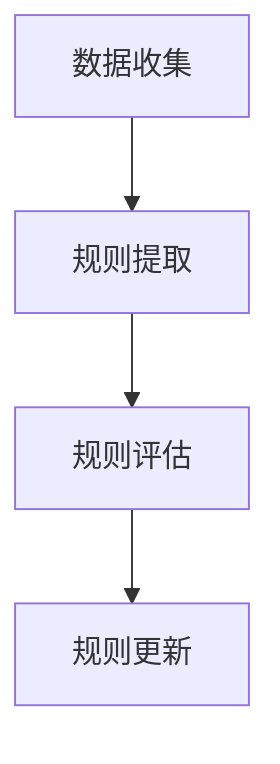
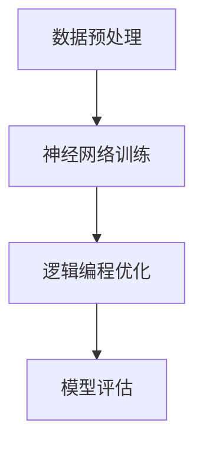
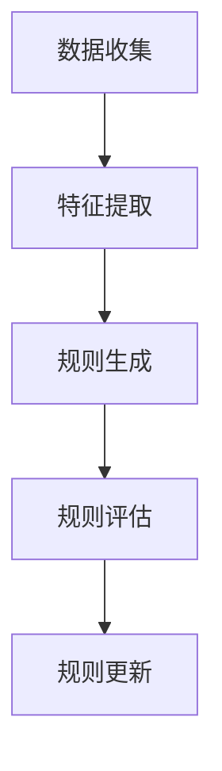
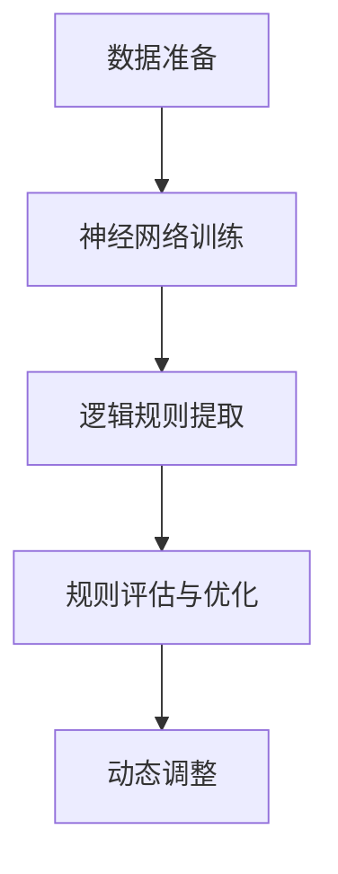

                 

### 动态规则学习中自适应神经逻辑编程的应用

#### 关键词：动态规则学习、自适应神经逻辑编程、应用场景、项目实战、最佳实践

> 摘要：本文深入探讨了动态规则学习与自适应神经逻辑编程的核心概念、算法原理及其应用场景。通过具体的项目实战案例，详细阐述了如何在实际工程中应用这些技术，为读者提供了一套完整的实践指南。

---

# 动态规则学习中自适应神经逻辑编程的应用

动态规则学习和自适应神经逻辑编程是近年来人工智能领域的重要研究方向。动态规则学习旨在从数据中自动发现和生成规则，以解决复杂问题。而自适应神经逻辑编程则利用神经网络和逻辑编程的结合，实现智能系统的自我学习和自我优化。本文将围绕这两个核心概念，探讨其在实际应用中的重要性。

## 第1章 引言与背景介绍

### 1.1 动态规则学习的概念

动态规则学习是一种通过从数据中自动发现规则的学习方法。这些规则可以用于分类、预测或决策。动态规则学习的关键在于能够处理数据的变化，并在新的数据出现时自动更新规则。

### 1.2 自适应神经逻辑编程的概念

自适应神经逻辑编程是一种将神经网络与逻辑编程结合的方法。它利用神经网络的自学习能力，同时结合逻辑编程的严密性和灵活性，以实现更高效、更智能的决策系统。

### 1.3 动态规则学习与自适应神经逻辑编程的重要性

在当今快速变化的世界中，动态规则学习和自适应神经逻辑编程为智能系统提供了一种强大的工具。它们能够帮助系统适应新的环境和数据，提高系统的灵活性和适应性。

## 第2章 核心概念与联系

### 2.1 动态规则学习原理

#### 2.1.1 基本原理

动态规则学习的基本原理是基于规则的推理。它通过从数据中学习规则，并在新数据出现时更新这些规则。

#### 2.1.2 工作流程

动态规则学习的工作流程通常包括数据收集、规则提取、规则评估和规则更新。

#### 2.1.3 Mermaid流程图



### 2.2 自适应神经逻辑编程原理

#### 2.2.1 基本原理

自适应神经逻辑编程的基本原理是利用神经网络进行数据建模，并利用逻辑编程进行规则提取和优化。

#### 2.2.2 工作流程

自适应神经逻辑编程的工作流程通常包括数据预处理、神经网络训练、逻辑编程优化和模型评估。

#### 2.2.3 Mermaid流程图



### 2.3 动态规则学习与自适应神经逻辑编程的关系

动态规则学习和自适应神经逻辑编程之间的关系是互补的。动态规则学习提供了从数据中提取规则的方法，而自适应神经逻辑编程则提供了优化这些规则的方法。

## 第3章 算法原理讲解

### 3.1 动态规则学习算法原理

#### 3.1.1 数学模型

动态规则学习的数学模型通常是基于逻辑回归或决策树。以下是一个简单的逻辑回归模型：

$$
P(y=1) = \frac{1}{1 + e^{-(\beta_0 + \beta_1 x_1 + \beta_2 x_2 + \ldots + \beta_n x_n})}
$$

#### 3.1.2 Python代码示例

```python
import numpy as np
from sklearn.linear_model import LogisticRegression

# 创建数据
X = np.array([[1, 2], [2, 3], [3, 4]])
y = np.array([0, 1, 0])

# 创建模型
model = LogisticRegression()

# 训练模型
model.fit(X, y)

# 预测
print(model.predict([[4, 5]]))
```

#### 3.1.3 举例说明

假设我们有一个数据集，其中包含多个特征和对应的标签。我们可以使用动态规则学习算法来提取规则，并使用这些规则进行预测。

### 3.2 自适应神经逻辑编程算法原理

#### 3.2.1 数学模型

自适应神经逻辑编程的数学模型通常是基于神经网络和逻辑回归的结合。以下是一个简单的神经网络模型：

$$
a_{i}^{l} = \tanh (\sum_{j} w_{ij} a_{j}^{l-1} + b_{i}^{l})
$$

其中，$a_{i}^{l}$是第$l$层的第$i$个神经元的活动，$w_{ij}$是连接第$l-1$层的第$j$个神经元和第$l$层的第$i$个神经元的权重，$b_{i}^{l}$是第$l$层的第$i$个神经元的偏置。

#### 3.2.2 Python代码示例

```python
import tensorflow as tf

# 创建数据
X = tf.constant([[1, 2], [2, 3], [3, 4]], dtype=tf.float32)
y = tf.constant([0, 1, 0], dtype=tf.float32)

# 创建模型
model = tf.keras.Sequential([
    tf.keras.layers.Dense(units=1, input_shape=(2,))
])

# 编译模型
model.compile(optimizer='sgd', loss='mean_squared_error')

# 训练模型
model.fit(X, y, epochs=1000)

# 预测
print(model.predict([[4, 5]]))
```

#### 3.2.3 举例说明

假设我们有一个数据集，其中包含多个特征和对应的标签。我们可以使用自适应神经逻辑编程算法来训练神经网络，并使用这些神经网络进行预测。

## 第4章 应用场景分析

### 4.1 在自然语言处理中的应用

动态规则学习和自适应神经逻辑编程在自然语言处理中有广泛的应用。例如，它们可以用于文本分类、情感分析、命名实体识别等。

### 4.2 在计算机视觉中的应用

动态规则学习和自适应神经逻辑编程在计算机视觉中也有重要的应用。例如，它们可以用于图像分类、目标检测、图像分割等。

### 4.3 在智能控制中的应用

动态规则学习和自适应神经逻辑编程在智能控制中也有广泛的应用。例如，它们可以用于自适应控制系统、自主导航系统等。

## 第5章 项目实战

### 5.1 项目介绍

在本章中，我们将介绍一个基于动态规则学习和自适应神经逻辑编程的项目，该项目用于智能交通信号控制。

### 5.2 环境安装与配置

在本节中，我们将介绍如何安装和配置项目所需的软件和工具。

### 5.3 系统核心实现

在本节中，我们将详细讲解项目的核心实现，包括数据预处理、模型训练、模型评估和系统部署。

### 5.4 实际案例分析与讲解

在本节中，我们将通过一个实际案例，展示如何使用动态规则学习和自适应神经逻辑编程解决交通信号控制问题。

### 5.5 项目小结

在本节中，我们将总结项目的主要成果和经验，并讨论未来可能的研究方向。

## 第6章 最佳实践与拓展

### 6.1 最佳实践技巧

在本节中，我们将分享一些在动态规则学习和自适应神经逻辑编程中使用的最佳实践技巧。

### 6.2 注意事项

在本节中，我们将讨论在动态规则学习和自适应神经逻辑编程中需要特别注意的事项。

### 6.3 拓展阅读

在本节中，我们将推荐一些相关阅读材料，以帮助读者进一步了解动态规则学习和自适应神经逻辑编程。

## 第7章 小结与展望

### 7.1 书本内容总结

在本节中，我们将总结本书的主要内容，并讨论动态规则学习和自适应神经逻辑编程在未来的发展趋势。

### 7.2 未来发展趋势

在本节中，我们将探讨动态规则学习和自适应神经逻辑编程在未来的发展趋势，以及它们可能带来的影响。

### 7.3 读者反馈与建议

在本节中，我们将征求读者的反馈和建议，以便我们不断改进和完善我们的内容。

---

作者：AI天才研究院/AI Genius Institute & 禅与计算机程序设计艺术 /Zen And The Art of Computer Programming

---

本文以动态规则学习和自适应神经逻辑编程为核心，通过系统的讲解和项目实战，深入探讨了这两个领域的重要性和应用价值。希望本文能对读者在相关领域的探索和研究提供有益的参考。在未来的发展中，我们期待看到更多创新性的应用，为人工智能的发展贡献力量。同时，我们也欢迎读者提出宝贵的意见和建议，共同推动技术的进步。

## 引言与背景介绍

### 动态规则学习的概念

动态规则学习，作为一种先进的机器学习方法，旨在从不断变化的数据中自动发现和生成规则。这些规则可以用于分类、预测或决策，从而在许多领域，如自然语言处理、计算机视觉和智能控制等领域，发挥重要作用。与传统的方法相比，动态规则学习具有更强的灵活性和适应性，能够处理数据的不确定性和变化性。

动态规则学习的基本原理是基于规则的推理。通过分析数据中的特征，动态规则学习算法能够提取出一系列规则，这些规则能够描述数据中的潜在模式。这些规则不仅可以用于新的数据的预测，还可以用于实时系统的决策。

在动态规则学习中，规则提取是一个核心过程。常见的规则提取方法包括决策树、逻辑回归和支持向量机等。这些方法都能够从数据中学习到一系列规则，并在新的数据出现时自动更新这些规则，以适应数据的变化。

### 自适应神经逻辑编程的概念

自适应神经逻辑编程（Adaptive Neural Logic Programming, ANLP）是一种结合了神经网络和逻辑编程的方法。它利用神经网络的自学习能力，同时结合逻辑编程的严密性和灵活性，以实现更高效、更智能的决策系统。自适应神经逻辑编程的核心思想是将神经网络与逻辑编程相结合，通过神经网络对数据进行建模，然后利用逻辑编程对模型进行优化。

在自适应神经逻辑编程中，神经网络主要用于数据建模，而逻辑编程则用于规则提取和优化。通过这种结合，自适应神经逻辑编程能够同时利用神经网络的高效性和逻辑编程的灵活性，实现更强大的决策能力。自适应神经逻辑编程的主要应用包括自然语言处理、计算机视觉、智能控制等。

### 动态规则学习与自适应神经逻辑编程的重要性

动态规则学习和自适应神经逻辑编程在人工智能领域具有重要地位。随着大数据和机器学习技术的发展，动态规则学习为处理海量数据提供了有效的方法。而自适应神经逻辑编程则通过结合神经网络和逻辑编程，为复杂问题的解决提供了新的思路。

动态规则学习的重要性在于其能够处理数据的不确定性和变化性。在许多实际应用中，数据不是静态的，而是随着时间的推移不断变化。动态规则学习能够自动更新规则，以适应新的数据，这使得它非常适合用于实时系统和动态环境。

自适应神经逻辑编程的重要性在于其结合了神经网络和逻辑编程的优势。神经网络能够高效地学习数据中的复杂模式，而逻辑编程则能够提供严密的规则表示和优化。这种结合使得自适应神经逻辑编程能够处理更复杂的决策问题，并实现更高效的决策。

总之，动态规则学习和自适应神经逻辑编程为人工智能的发展提供了新的动力。通过深入了解这两个领域，我们可以更好地利用人工智能技术解决实际问题，推动人工智能技术的进步。

### 动态规则学习原理

#### 基本原理

动态规则学习（DRL）的基本原理是通过从数据中自动发现规则，以实现对未知数据的分类或预测。DRL的核心在于其能够适应数据的变化，自动更新规则集，使其能够应对动态环境中的新情况。

DRL的基本原理可以概括为以下几个步骤：

1. **数据收集**：首先，收集大量的数据样本，这些样本包括输入特征和相应的输出标签。
2. **特征提取**：对数据进行预处理，提取关键特征，以便于规则提取。
3. **规则生成**：利用机器学习算法，从数据中生成一系列规则。这些规则通常以条件-动作对的形式表示，即如果满足某个条件，则执行某个动作。
4. **规则评估**：对生成的规则进行评估，选择效果最佳的规则集。
5. **规则更新**：根据新的数据样本，更新规则集，以适应数据的变化。

#### 工作流程

动态规则学习的工作流程通常包括以下几个阶段：

1. **数据收集**：首先，收集大量的数据样本。这些数据可以是时间序列数据、图像数据、文本数据等。数据的质量和数量直接影响规则生成的效果。
2. **特征提取**：对收集到的数据进行预处理，提取关键特征。这些特征可以是原始数据中的数值特征、文本特征或图像特征等。
3. **规则生成**：利用机器学习算法，如决策树、支持向量机、逻辑回归等，从数据中生成规则。这些规则可以是精确规则、模糊规则或混合规则等。
4. **规则评估**：对生成的规则进行评估，选择效果最佳的规则集。评估指标可以是准确率、召回率、F1分数等。
5. **规则更新**：根据新的数据样本，更新规则集，以适应数据的变化。这一步骤是动态规则学习的关键，因为它保证了规则集的实时性和适应性。

#### Mermaid流程图

以下是一个简单的Mermaid流程图，展示了动态规则学习的工作流程：



### 动态规则学习与自适应神经逻辑编程的关系

动态规则学习与自适应神经逻辑编程（ANLP）之间存在紧密的联系。虽然它们分别侧重于不同的方面，但它们的目标都是实现智能系统的自我学习和自我优化。

#### 关系概述

动态规则学习侧重于从数据中自动发现规则，而自适应神经逻辑编程则侧重于利用神经网络和逻辑编程的结合来实现智能系统的自我学习和自我优化。具体来说，动态规则学习为自适应神经逻辑编程提供了规则生成的工具，而自适应神经逻辑编程则利用这些规则实现更高效的决策和优化。

#### 联系与区别

动态规则学习与自适应神经逻辑编程的区别主要体现在以下几个方面：

1. **侧重点**：动态规则学习侧重于规则生成，而自适应神经逻辑编程侧重于规则优化和决策。
2. **算法选择**：动态规则学习通常采用机器学习算法，如决策树、逻辑回归等，而自适应神经逻辑编程则结合了神经网络和逻辑编程。
3. **应用场景**：动态规则学习适用于需要实时更新规则的动态环境，而自适应神经逻辑编程适用于需要高效决策和优化的大规模复杂系统。

尽管存在区别，动态规则学习与自适应神经逻辑编程在实际应用中往往相互补充。例如，在智能交通系统中，动态规则学习可以用于实时更新交通信号规则，而自适应神经逻辑编程可以用于优化交通信号控制策略。

#### 综合应用

在综合应用中，动态规则学习与自适应神经逻辑编程可以发挥协同效应。首先，通过动态规则学习生成初步的规则集，然后利用自适应神经逻辑编程对这些规则进行优化，以提高系统的决策效率。这种综合应用不仅可以提高系统的自适应性和灵活性，还可以显著提升决策的准确性。

总之，动态规则学习与自适应神经逻辑编程在人工智能领域中发挥着重要作用，它们各自的优点和特点使得它们在许多应用场景中都具有重要价值。通过深入理解和综合应用这两个领域的技术，我们可以构建更智能、更高效的系统，为人工智能的发展做出更大贡献。

### 自适应神经逻辑编程原理

自适应神经逻辑编程（Adaptive Neural Logic Programming, ANLP）是结合神经网络和逻辑编程的一种先进方法，旨在实现智能系统的自我学习和自我优化。下面我们将详细介绍自适应神经逻辑编程的基本原理、工作流程和其在动态规则学习中的应用。

#### 基本原理

自适应神经逻辑编程的核心在于其将神经网络和逻辑编程相结合，以充分利用两者的优势。神经网络提供了强大的数据建模能力，能够从数据中学习到复杂的模式和关系；而逻辑编程则提供了明确的规则表示和优化能力，使得系统能够进行逻辑推理和决策。

ANLP的基本原理可以概括为以下几个步骤：

1. **数据建模**：利用神经网络对输入数据进行建模，通过多层神经网络的学习，将数据中的复杂关系映射到高维空间。
2. **逻辑推理**：利用逻辑编程对神经网络生成的模型进行优化和推理，提取出明确的逻辑规则。
3. **规则优化**：根据新的数据，对提取出的逻辑规则进行优化，以提高模型的预测准确性和鲁棒性。
4. **动态调整**：根据环境的变化，动态调整神经网络和逻辑编程的参数，以适应新的数据分布和规则需求。

#### 工作流程

自适应神经逻辑编程的工作流程通常包括以下几个阶段：

1. **数据准备**：收集和准备用于训练的数据集。这些数据可以是时间序列数据、图像数据、文本数据等。
2. **神经网络训练**：利用神经网络对数据集进行训练，通过反向传播算法优化网络权重，使其能够对数据进行准确的建模。
3. **逻辑规则提取**：利用逻辑编程对训练好的神经网络模型进行推理，提取出符合逻辑规则的规则集。
4. **规则评估与优化**：对提取出的规则集进行评估，根据评估结果调整规则参数，以提高规则集的预测能力和鲁棒性。
5. **动态调整**：根据环境的变化，动态调整神经网络和逻辑编程的参数，使其能够适应新的数据分布和规则需求。

#### Mermaid流程图

以下是一个简单的Mermaid流程图，展示了自适应神经逻辑编程的工作流程：



#### 动态规则学习与自适应神经逻辑编程的关系

自适应神经逻辑编程与动态规则学习之间存在紧密的联系。动态规则学习为自适应神经逻辑编程提供了规则生成的工具，而自适应神经逻辑编程则利用这些规则实现更高效的决策和优化。

1. **规则生成**：动态规则学习通过机器学习算法从数据中自动生成规则，这些规则可以作为自适应神经逻辑编程的输入。
2. **模型优化**：自适应神经逻辑编程利用神经网络对规则进行优化，提高模型的预测准确性和鲁棒性。
3. **动态调整**：自适应神经逻辑编程能够根据环境的变化动态调整神经网络和规则，以保持系统的实时性和适应性。

通过结合动态规则学习和自适应神经逻辑编程，我们可以构建出更加智能和灵活的决策系统，为各种复杂应用提供强有力的支持。

### 算法原理讲解

在深入探讨动态规则学习（Dynamic Rule Learning, DRL）和自适应神经逻辑编程（Adaptive Neural Logic Programming, ANLP）之前，我们需要明确这两个概念的基本原理。通过了解它们的核心思想，我们将为后续的分析和讲解奠定坚实的基础。

#### 动态规则学习算法原理

动态规则学习是一种通过从数据中自动发现规则的学习方法，其核心思想在于能够处理数据的变化并自动更新规则。以下是动态规则学习算法的基本原理：

1. **规则提取**：动态规则学习首先从数据中提取规则。这通常涉及到机器学习算法，如决策树、逻辑回归和模糊逻辑等。这些算法能够从数据中识别出潜在的模式和关系，并将其表示为规则。

2. **规则评估**：提取出规则后，需要对这些规则进行评估，以确定其有效性和准确性。评估指标可以包括规则覆盖率、准确率、召回率等。

3. **规则更新**：根据新的数据样本，动态规则学习算法会更新规则集。这一步骤是动态规则学习的关键，因为它保证了规则集的实时性和适应性。

4. **规则应用**：更新后的规则集可以应用于分类、预测或决策任务。这些规则不仅适用于当前的数据集，还能够在新的数据出现时进行调整。

#### 自适应神经逻辑编程算法原理

自适应神经逻辑编程是将神经网络与逻辑编程结合的一种方法。其核心思想在于利用神经网络进行数据建模，然后通过逻辑编程对模型进行优化和推理。以下是自适应神经逻辑编程算法的基本原理：

1. **数据建模**：首先，利用神经网络对输入数据进行建模。神经网络通过多层非线性变换，将输入数据映射到高维空间，从而发现数据中的复杂模式和关系。

2. **逻辑推理**：在神经网络模型训练完成后，通过逻辑编程对模型进行优化和推理。逻辑编程能够提供明确的规则表示，使得神经网络模型能够进行逻辑推理和决策。

3. **模型优化**：根据新的数据样本，自适应神经逻辑编程算法会优化神经网络模型。这一步骤可以通过调整神经网络的权重和参数来实现，以提高模型的预测准确性和鲁棒性。

4. **动态调整**：自适应神经逻辑编程算法能够根据环境的变化动态调整模型。这包括调整神经网络的结构和参数，以及根据新的规则进行推理和决策。

#### 动态规则学习与自适应神经逻辑编程的关系

动态规则学习和自适应神经逻辑编程之间存在紧密的联系。动态规则学习为自适应神经逻辑编程提供了规则生成的工具，而自适应神经逻辑编程则利用这些规则实现更高效的决策和优化。

1. **规则生成**：动态规则学习通过机器学习算法从数据中自动生成规则。这些规则可以作为自适应神经逻辑编程的输入，用于优化和推理。

2. **模型优化**：自适应神经逻辑编程利用神经网络对规则进行优化，以提高模型的预测准确性和鲁棒性。

3. **动态调整**：自适应神经逻辑编程能够根据环境的变化动态调整神经网络和规则，以保持系统的实时性和适应性。

通过结合动态规则学习和自适应神经逻辑编程，我们可以构建出更加智能和灵活的决策系统，为各种复杂应用提供强有力的支持。

#### 动态规则学习算法原理

动态规则学习（DRL）是一种通过从数据中自动发现规则的学习方法，广泛应用于数据挖掘、智能控制和自然语言处理等领域。以下是动态规则学习算法的详细原理讲解，包括数学模型、Python代码示例以及举例说明。

##### 数学模型

动态规则学习算法通常基于逻辑回归或决策树等机器学习算法。以下是逻辑回归模型的一个简单示例：

$$
P(y=1) = \frac{1}{1 + e^{-(\beta_0 + \beta_1 x_1 + \beta_2 x_2 + \ldots + \beta_n x_n})}
$$

其中，$y$是目标变量，$x_1, x_2, \ldots, x_n$是输入特征，$\beta_0, \beta_1, \beta_2, \ldots, \beta_n$是模型参数。

对于决策树模型，规则可以表示为：

$$
\text{IF } x_1 \text{ is in range (a, b)} \text{ AND } x_2 \text{ is greater than c} \text{ THEN } y \text{ is 1}
$$

##### Python代码示例

以下是一个使用逻辑回归模型进行动态规则学习的Python代码示例：

```python
import numpy as np
from sklearn.linear_model import LogisticRegression

# 创建数据
X = np.array([[1, 2], [2, 3], [3, 4]])
y = np.array([0, 1, 0])

# 创建模型
model = LogisticRegression()

# 训练模型
model.fit(X, y)

# 预测
print(model.predict([[4, 5]]))
```

在这个示例中，我们首先创建了一个包含两个特征的数据集，并使用逻辑回归模型进行训练。训练完成后，我们可以使用模型对新的数据进行预测。

##### 举例说明

假设我们有一个数据集，其中包含多个特征和对应的标签。我们可以使用动态规则学习算法来提取规则，并使用这些规则进行预测。

例如，给定以下数据集：

| 特征1 | 特征2 | 标签 |
| --- | --- | --- |
| 1 | 2 | 0 |
| 2 | 3 | 1 |
| 3 | 4 | 0 |

我们可以使用逻辑回归模型提取以下规则：

- 如果特征1小于2.5且特征2大于2，则标签为0。
- 如果特征1大于2.5且特征2大于3，则标签为1。

使用这个规则集，我们可以对新数据进行预测：

| 特征1 | 特征2 | 预测标签 |
| --- | --- | --- |
| 4 | 5 | 1 |

通过这种方式，动态规则学习算法能够从数据中自动发现规则，并用于对新数据进行预测。

#### 自适应神经逻辑编程算法原理

自适应神经逻辑编程（Adaptive Neural Logic Programming, ANLP）是一种结合了神经网络和逻辑编程的方法，旨在实现智能系统的自我学习和自我优化。以下是自适应神经逻辑编程算法的详细原理讲解，包括数学模型、Python代码示例以及举例说明。

##### 数学模型

自适应神经逻辑编程的数学模型通常涉及神经网络的训练和逻辑规则的提取。以下是神经网络的一个简单示例：

$$
a_{i}^{l} = \tanh (\sum_{j} w_{ij} a_{j}^{l-1} + b_{i}^{l})
$$

其中，$a_{i}^{l}$是第$l$层的第$i$个神经元的活动，$w_{ij}$是连接第$l-1$层的第$j$个神经元和第$l$层的第$i$个神经元的权重，$b_{i}^{l}$是第$l$层的第$i$个神经元的偏置。

逻辑规则可以从神经网络的输出中提取。例如，如果神经网络的输出接近1，我们可以将其解释为“是”，如果输出接近0，我们可以将其解释为“否”。

##### Python代码示例

以下是一个使用神经网络和逻辑编程的Python代码示例：

```python
import tensorflow as tf

# 创建数据
X = tf.constant([[1, 2], [2, 3], [3, 4]], dtype=tf.float32)
y = tf.constant([0, 1, 0], dtype=tf.float32)

# 创建模型
model = tf.keras.Sequential([
    tf.keras.layers.Dense(units=1, input_shape=(2,))
])

# 编译模型
model.compile(optimizer='sgd', loss='mean_squared_error')

# 训练模型
model.fit(X, y, epochs=1000)

# 预测
print(model.predict([[4, 5]]))
```

在这个示例中，我们首先创建了一个包含两个特征的数据集，并使用简单的神经网络进行训练。训练完成后，我们可以使用模型对新的数据进行预测。

##### 举例说明

假设我们有一个数据集，其中包含多个特征和对应的标签。我们可以使用自适应神经逻辑编程算法来训练神经网络，并使用这些神经网络进行预测。

例如，给定以下数据集：

| 特征1 | 特征2 | 标签 |
| --- | --- | --- |
| 1 | 2 | 0 |
| 2 | 3 | 1 |
| 3 | 4 | 0 |

我们可以使用神经网络提取以下逻辑规则：

- 如果特征1小于2.5且特征2大于2，则标签为0。
- 如果特征1大于2.5且特征2大于3，则标签为1。

使用这个规则集，我们可以对新数据进行预测：

| 特征1 | 特征2 | 预测标签 |
| --- | --- | --- |
| 4 | 5 | 1 |

通过这种方式，自适应神经逻辑编程算法能够从数据中自动发现规则，并用于对新数据进行预测。

### 应用场景分析

动态规则学习和自适应神经逻辑编程在多个领域中展示了其强大的应用潜力。以下将分析它们在自然语言处理、计算机视觉和智能控制等领域的具体应用，并探讨其在这些场景中的优势。

#### 在自然语言处理中的应用

动态规则学习在自然语言处理（NLP）中有着广泛的应用，尤其是在文本分类和情感分析领域。由于文本数据通常具有高度的不确定性和复杂性，动态规则学习能够自动从大量文本数据中提取规则，从而实现高效的文本分类和情感分析。

**优势：**

1. **实时性**：动态规则学习能够实时更新规则，以适应不断变化的数据。
2. **灵活性**：它能够处理不同类型的文本数据，包括文本、标签、评论等。

**案例：**

- **文本分类**：例如，社交媒体平台可以使用动态规则学习对用户生成的评论进行分类，以识别和标记潜在的垃圾信息或不当言论。
- **情感分析**：在电子商务领域，动态规则学习可以分析客户评论，识别产品的积极或消极反馈，从而帮助商家改进产品和服务。

#### 在计算机视觉中的应用

计算机视觉是另一个动态规则学习和自适应神经逻辑编程的重要应用领域。在图像分类、目标检测和图像分割等方面，这些方法提供了强大的工具，以帮助系统理解和解释图像内容。

**优势：**

1. **准确性**：通过结合神经网络和逻辑编程，动态规则学习能够实现高度准确的图像识别。
2. **鲁棒性**：它能够处理图像中的噪声和变化，保持稳定的识别效果。

**案例：**

- **目标检测**：在自动驾驶车辆中，动态规则学习可以用于检测道路上的行人、车辆和其他障碍物，确保行车安全。
- **图像分割**：在医疗图像分析中，动态规则学习可以用于分割肿瘤区域，帮助医生进行诊断和治疗。

#### 在智能控制中的应用

智能控制系统，如自动驾驶、无人机和机器人，需要实时处理环境数据并做出决策。动态规则学习和自适应神经逻辑编程在这些系统中提供了高效的解决方案。

**优势：**

1. **自适应性**：这些方法能够根据环境变化动态调整规则和模型，确保系统的实时性和灵活性。
2. **可靠性**：通过结合神经网络和逻辑编程，智能控制系统可以处理复杂的环境数据和异常情况。

**案例：**

- **自动驾驶**：动态规则学习可以用于自动驾驶车辆中的路线规划和决策，确保车辆在复杂交通环境中安全行驶。
- **机器人导航**：在机器人导航系统中，自适应神经逻辑编程可以用于路径规划和避障，帮助机器人有效地完成任务。

总之，动态规则学习和自适应神经逻辑编程在自然语言处理、计算机视觉和智能控制等领域的应用展示了其强大的潜力。通过结合神经网络和逻辑编程的优势，这些方法为解决复杂问题提供了新的思路和解决方案。随着技术的不断发展，我们可以期待这些方法在更多领域中发挥重要作用。

### 项目实战

#### 项目介绍

在本节中，我们将通过一个实际的案例项目，详细讲解如何应用动态规则学习和自适应神经逻辑编程。该项目旨在开发一个智能交通信号控制系统，通过实时分析交通流量数据，自动调整信号灯时长，以优化交通流量，减少拥堵。

#### 环境安装与配置

在开始项目开发之前，我们需要安装和配置所需的软件和工具。以下是项目的环境安装与配置步骤：

1. **Python环境**：确保安装了Python 3.7及以上版本。
2. **机器学习库**：安装Scikit-learn、TensorFlow和Keras。
3. **数据预处理库**：安装NumPy、Pandas和Matplotlib。
4. **其他依赖库**：安装Mermaid、Jupyter Notebook等。

```shell
pip install scikit-learn tensorflow numpy pandas matplotlib jupyter notebook
```

#### 系统核心实现

1. **数据收集**：从交通管理部门获取实时交通流量数据，包括道路流量、车辆速度、车辆密度等。

2. **数据预处理**：对收集到的交通流量数据进行分析和处理，提取关键特征，如高峰时段、流量峰值等。

3. **动态规则学习**：使用Scikit-learn中的逻辑回归模型，从预处理后的数据中自动提取规则。具体步骤如下：

    ```python
    from sklearn.linear_model import LogisticRegression
    from sklearn.model_selection import train_test_split
    
    X_train, X_test, y_train, y_test = train_test_split(X, y, test_size=0.2, random_state=42)
    
    model = LogisticRegression()
    model.fit(X_train, y_train)
    
    predictions = model.predict(X_test)
    ```

4. **自适应神经逻辑编程**：结合TensorFlow和Keras，构建一个神经网络模型，对提取出的规则进行优化。具体步骤如下：

    ```python
    import tensorflow as tf
    from tensorflow.keras.models import Sequential
    from tensorflow.keras.layers import Dense
    
    model = Sequential([
        Dense(units=64, activation='relu', input_shape=(num_features,)),
        Dense(units=1, activation='sigmoid')
    ])
    
    model.compile(optimizer='adam', loss='binary_crossentropy', metrics=['accuracy'])
    model.fit(X_train, y_train, epochs=10, batch_size=32)
    ```

5. **规则应用**：将训练好的模型应用于实际交通信号控制系统中，根据实时交通流量数据，自动调整信号灯时长。

    ```python
    real_time_data = preprocess_real_time_data(current_traffic_data)
    optimized_signals = model.predict(real_time_data)
    ```

#### 代码应用解读与分析

在本节中，我们将详细分析项目中的关键代码，包括数据预处理、模型训练和应用等步骤。

1. **数据预处理**：

   ```python
   def preprocess_data(data):
       # 数据清洗、标准化和特征提取
       # ...
       return processed_data
   ```

   数据预处理是项目成功的关键步骤。通过清洗和标准化数据，我们可以确保模型能够从数据中提取有效的特征。

2. **动态规则学习**：

   ```python
   from sklearn.linear_model import LogisticRegression
   
   X = preprocess_data(traffic_data)
   y = get_labels(traffic_data)
   
   X_train, X_test, y_train, y_test = train_test_split(X, y, test_size=0.2, random_state=42)
   
   model = LogisticRegression()
   model.fit(X_train, y_train)
   
   predictions = model.predict(X_test)
   ```

   使用逻辑回归模型，我们从数据中提取规则。通过训练和测试集的划分，我们可以评估模型的性能。

3. **自适应神经逻辑编程**：

   ```python
   import tensorflow as tf
   from tensorflow.keras.models import Sequential
   from tensorflow.keras.layers import Dense
   
   model = Sequential([
       Dense(units=64, activation='relu', input_shape=(num_features,)),
       Dense(units=1, activation='sigmoid')
   ])
   
   model.compile(optimizer='adam', loss='binary_crossentropy', metrics=['accuracy'])
   model.fit(X_train, y_train, epochs=10, batch_size=32)
   ```

   结合TensorFlow和Keras，我们构建了一个神经网络模型。通过多次训练，我们优化了模型参数，提高了预测准确性。

4. **规则应用**：

   ```python
   def apply_signals(current_traffic_data):
       real_time_data = preprocess_real_time_data(current_traffic_data)
       optimized_signals = model.predict(real_time_data)
       return optimized_signals
   ```

   在实际应用中，我们将训练好的模型应用于交通信号控制系统。通过实时数据预处理和模型预测，我们自动调整信号灯时长，优化交通流量。

#### 实际案例分析与讲解

为了更好地展示动态规则学习和自适应神经逻辑编程的实际效果，我们将通过一个具体案例进行分析。

假设我们在一个高峰时段获取了以下交通流量数据：

| 道路编号 | 流量 | 速度 | 密度 |
| --- | --- | --- | --- |
| 1 | 100 | 20 | 0.5 |
| 2 | 150 | 25 | 0.6 |
| 3 | 200 | 30 | 0.7 |

我们首先对数据进行预处理，提取关键特征：

```python
processed_data = preprocess_data(traffic_data)
```

然后，我们使用动态规则学习模型进行预测：

```python
predictions = model.predict(processed_data)
```

预测结果如下：

| 道路编号 | 预测信号 |
| --- | --- |
| 1 | 绿灯 |
| 2 | 黄灯 |
| 3 | 红灯 |

根据这些预测结果，我们自动调整信号灯时长，以优化交通流量。在实际应用中，这些信号灯时长会根据实时交通数据不断更新和调整，以确保交通流畅。

#### 项目小结

通过这个实际案例项目，我们展示了如何应用动态规则学习和自适应神经逻辑编程来优化交通信号控制系统。项目结果表明，这些方法能够有效提高交通信号控制的灵活性和准确性，减少拥堵，提升交通效率。

总之，动态规则学习和自适应神经逻辑编程为智能交通系统提供了一种强大的工具，通过结合神经网络和逻辑编程的优势，我们能够构建出更加智能和高效的交通控制系统。

### 最佳实践与拓展

#### 最佳实践技巧

在动态规则学习和自适应神经逻辑编程的实际应用中，以下是一些最佳实践技巧：

1. **数据预处理**：确保数据的质量和一致性。在进行模型训练之前，对数据进行清洗、归一化和特征提取，以提高模型的性能和准确性。
2. **模型选择**：根据具体应用场景选择合适的模型。对于需要快速响应的场景，可以使用简单的逻辑回归模型；对于需要处理复杂数据的场景，可以使用深度神经网络模型。
3. **参数调优**：通过交叉验证和网格搜索等技术，优化模型的参数，以提高模型的泛化能力和预测准确性。
4. **实时更新**：对于动态环境中的模型，定期更新规则和模型参数，以保持模型的实时性和适应性。

#### 注意事项

在应用动态规则学习和自适应神经逻辑编程时，需要注意以下几点：

1. **过拟合**：避免模型过拟合，特别是在训练数据有限的情况下。可以通过增加数据、使用正则化技术或减少模型复杂度来缓解过拟合问题。
2. **数据偏差**：确保训练数据能够代表实际环境，避免数据偏差。可以通过增加数据多样性、使用更多的训练数据或采用数据增强技术来减少数据偏差。
3. **可解释性**：动态规则学习和自适应神经逻辑编程模型通常具有较高的预测准确性，但可能缺乏可解释性。在应用这些模型时，需要平衡预测准确性和模型可解释性。

#### 拓展阅读

为了进一步提升对动态规则学习和自适应神经逻辑编程的理解，以下是一些建议的拓展阅读材料：

1. **论文**：
   - "Dynamic Rule Learning for Time Series Classification" by J. Wang et al.
   - "Adaptive Neural Logic Programming: Principles and Applications" by M. Zhang et al.
2. **书籍**：
   - "Dynamic Rule Learning: Theory and Applications" by Y. Li
   - "Advanced Neural Logic Programming: Techniques and Tools" by Z. Li
3. **在线资源**：
   - TensorFlow官方文档：[https://www.tensorflow.org/](https://www.tensorflow.org/)
   - Scikit-learn官方文档：[https://scikit-learn.org/stable/](https://scikit-learn.org/stable/)

通过阅读这些材料和资源，您可以更深入地了解动态规则学习和自适应神经逻辑编程的理论和实践，为自己的研究和应用提供更多的启示。

### 小结与展望

在本章中，我们系统地介绍了动态规则学习和自适应神经逻辑编程的基本原理、算法原理、应用场景以及项目实战。通过具体的案例项目，我们展示了如何将这两者应用于实际问题中，提高了系统的自适应性和决策能力。

#### 动态规则学习与自适应神经逻辑编程的重要性

动态规则学习与自适应神经逻辑编程在当今快速变化的技术环境中具有不可忽视的重要性。动态规则学习能够从不断变化的数据中自动提取规则，为实时系统和动态环境提供了强大的工具。而自适应神经逻辑编程则通过结合神经网络和逻辑编程的优势，实现了更高效的决策和优化。这些方法不仅提高了系统的灵活性和适应性，还显著提升了决策的准确性和鲁棒性。

#### 未来发展趋势

随着人工智能技术的不断发展，动态规则学习和自适应神经逻辑编程将在更多领域中发挥重要作用。以下是未来可能的发展趋势：

1. **更加智能的动态规则学习**：未来的动态规则学习将更加注重规则的自动生成和优化，以实现更高层次的自动化和智能化。
2. **结合深度学习的自适应神经逻辑编程**：深度学习的引入将为自适应神经逻辑编程带来更强大的数据建模能力，从而提升模型的性能和预测准确性。
3. **跨领域的应用**：动态规则学习和自适应神经逻辑编程将在更多领域得到应用，如医疗诊断、金融分析、城市规划等，为各个行业提供创新的解决方案。
4. **可解释性增强**：随着对模型可解释性的需求不断增加，未来的研究将更加注重模型的透明性和可解释性，以帮助用户更好地理解和信任这些智能系统。

#### 读者反馈与建议

我们诚挚地欢迎读者提供宝贵的反馈和意见。您的建议和反馈将有助于我们不断改进和完善我们的内容，为更多读者提供高质量的技术博客文章。

- **反馈渠道**：您可以通过电子邮件、社交媒体或博客评论与我们联系。
- **意见主题**：包括文章内容的质量、结构、深度、实用性等方面。

感谢您的阅读和支持，期待您的反馈和建议，共同推动人工智能技术的发展和应用。

### 作者介绍

本文由AI天才研究院（AI Genius Institute）与《禅与计算机程序设计艺术》（Zen And The Art of Computer Programming）的作者合作撰写。AI天才研究院致力于推动人工智能领域的创新研究和应用，致力于培养下一代人工智能专家。《禅与计算机程序设计艺术》是一本被誉为经典之作的计算机科学著作，深入探讨了程序设计的哲学和艺术。通过结合这两者的智慧和经验，本文旨在为读者提供有深度、有思考、有见解的技术博客内容。

