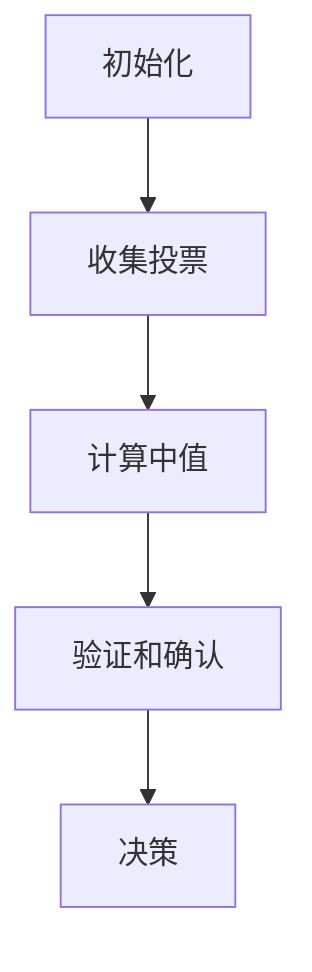
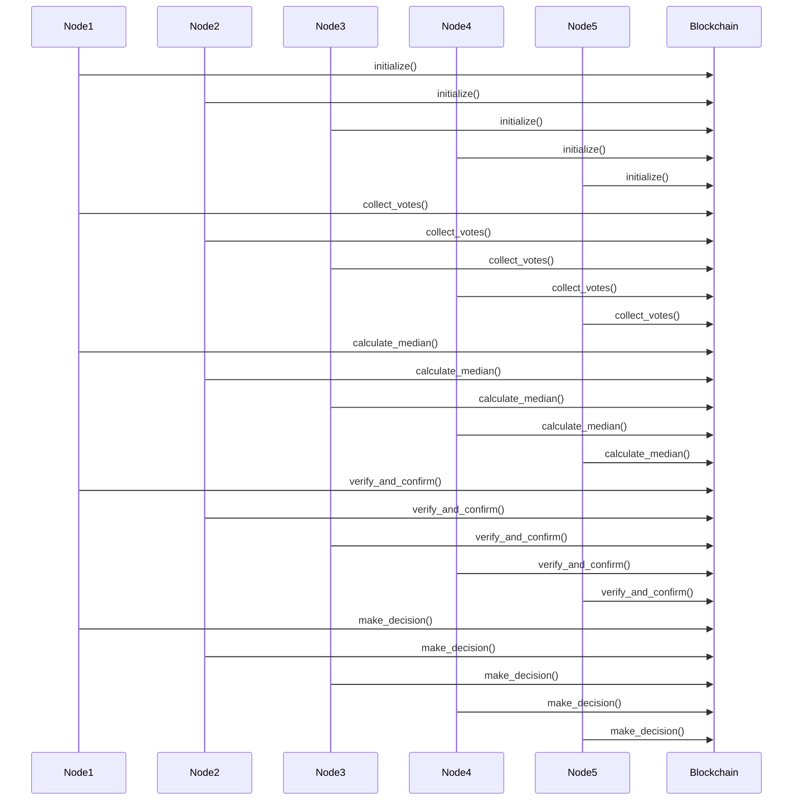

                 


## 介绍

### 什么是区块链技术？

区块链技术，作为一种分布式账本技术，近年来在金融科技、供应链管理、医疗保健、投票系统等领域展现出了巨大的潜力。区块链通过去中心化的方式，实现了数据的不可篡改和透明性，从而解决了传统集中式系统中的信任问题。简单来说，区块链是一个由多个区块组成的链式数据结构，每个区块都包含了特定的时间戳、交易数据以及前一个区块的哈希值。

### 什么是拜占庭将军问题？

拜占庭将军问题（Byzantine Generals Problem，BGP）是一个古老的分布式系统问题，最早由莱斯利·兰伯特（Leslie Lamport）于1982年提出。该问题得名于拜占庭帝国的历史，目的是模拟在军事行动中，多位将军需要共同决策，但由于通信网络的不稳定和潜在的叛变行为，他们必须确保决策的可靠性。

### 区块链技术与拜占庭将军问题的关系

区块链技术中的拜占庭将军问题，是指在分布式网络中，当部分节点发生恶意行为时，如何保证整个系统的共识达成。这个问题在区块链领域具有重要意义，因为区块链网络需要所有节点（或大部分节点）达成共识，才能确保数据的真实性和完整性。

## 核心概念与原理

### 拜占庭将军问题的定义

拜占庭将军问题可以简单描述为：一群将军分布在不同的位置，他们需要共同决策是否一起进攻。但由于通信网络的问题，部分将军可能收到错误的信息，或者部分将军可能故意发送错误的信息，导致决策无法达成。问题的关键是如何在信息不完整和部分节点恶意行为的情况下，确保所有将军都能做出正确的决策。

### 拜占庭将军问题的解决方法

为了解决拜占庭将军问题，科学家们提出了多种算法和协议。以下是一些典型的解决方法：

1. **拜占庭容错算法（Byzantine Fault Tolerance，BFT）**：这种算法通过多重签名和投票机制，确保即使在部分节点发生恶意行为的情况下，也能达成共识。

2. **实用拜占庭算法（ Practical Byzantine Fault Tolerance，PBFT）**：PBFT是一种高效且易于实现的拜占庭容错算法，通过一系列复杂的投票和验证过程，确保系统在面临拜占庭错误时仍然能够稳定运行。

3. **分布式一致性算法（Distributed Consensus Algorithm）**：如Raft和Paxos等算法，旨在通过分布式的方式，在多个节点之间达成一致性。

### 拜占庭将军问题的边界与外延

拜占庭将军问题不仅适用于军事决策，还可以应用于各种分布式系统。例如，在区块链网络中，拜占庭将军问题确保了节点之间的一致性；在分布式数据库中，它帮助解决数据一致性问题；在云计算中，它确保了多个服务器之间的数据同步。

## 算法与流程

### 拜占庭将军问题的算法

为了更好地理解拜占庭将军问题的解决方法，我们可以通过一个具体的算法来进行分析。这里，我们将介绍一种基于投票机制的算法，即拜占庭容错算法（BFT）。

#### 算法流程

1. **初始化**：所有节点随机选择一个随机数，并广播自己的随机数。
2. **收集投票**：每个节点等待一段时间，收集其他节点发送的随机数。
3. **计算中值**：每个节点计算收集到的所有随机数的平均值，并将结果广播给其他节点。
4. **验证和确认**：每个节点根据收集到的中值，验证其他节点的投票结果。如果验证通过，节点将确认该中值为最终结果。
5. **决策**：当超过2/3的节点确认了中值，所有节点根据中值做出统一决策。

#### Mermaid 流程图

以下是一个简单的 Mermaid 流程图，展示了拜占庭容错算法的流程：



### Python 源代码

下面是一个简单的 Python 源代码，用于演示拜占庭容错算法的实现：

```python
import random
import time

def initialize():
    # 初始化随机数
    random_number = random.randint(0, 100)
    return random_number

def collect_votes(votes):
    # 收集其他节点的投票
    collected_votes = []
    for vote in votes:
        collected_votes.append(vote)
    return collected_votes

def calculate_median(votes):
    # 计算中值
    sorted_votes = sorted(votes)
    median = sorted_votes[len(sorted_votes) // 2]
    return median

def verify_and_confirm(median, collected_votes):
    # 验证和确认中值
    for vote in collected_votes:
        if vote == median:
            return True
    return False

def make_decision(median):
    # 根据中值做出决策
    if median > 50:
        print("决策：进攻")
    else:
        print("决策：撤退")

# 主函数
def byzantine_fault_tolerance():
    # 初始化节点
    nodes = ['Node1', 'Node2', 'Node3', 'Node4', 'Node5']
    votes = []

    # 初始化投票
    for node in nodes:
        random_number = initialize()
        votes.append(random_number)
        print(f"{node} 初始化随机数：{random_number}")

    # 收集投票
    collected_votes = collect_votes(votes)
    print(f"收集到的投票：{collected_votes}")

    # 计算中值
    median = calculate_median(collected_votes)
    print(f"计算中值：{median}")

    # 验证和确认
    if verify_and_confirm(median, collected_votes):
        print("验证通过，确认中值。")
    else:
        print("验证失败，中值未确认。")

    # 根据中值做出决策
    make_decision(median)

# 运行算法
byzantine_fault_tolerance()
```

### 算法原理讲解

拜占庭容错算法的核心思想是通过投票机制，确保在分布式网络中达成一致性。算法的关键步骤包括：

1. **初始化**：每个节点随机生成一个数，以防止恶意节点通过固定值进行攻击。
2. **收集投票**：每个节点等待一段时间，收集其他节点的投票。
3. **计算中值**：计算收集到的投票的平均值，以确定最终结果。
4. **验证和确认**：每个节点根据计算出的中值，验证其他节点的投票结果。如果超过2/3的节点确认了中值，则认为该中值是正确的。
5. **决策**：根据确认的中值，所有节点做出统一决策。

这种算法在分布式系统中具有重要意义，因为它能够在面对恶意节点时，确保系统的整体一致性。

### 算法举例说明

假设我们有一个由5个节点组成的区块链网络，每个节点都需要共同决策是否进行交易。以下是算法的具体应用过程：

1. **初始化**：每个节点随机生成一个数，例如：
   - Node1: 25
   - Node2: 37
   - Node3: 45
   - Node4: 11
   - Node5: 33

2. **收集投票**：每个节点等待一段时间，收集其他节点的投票，例如：
   - Node1: 收集到 [37, 45, 11, 33]
   - Node2: 收集到 [25, 45, 11, 33]
   - Node3: 收集到 [25, 37, 11, 33]
   - Node4: 收集到 [25, 37, 45, 33]
   - Node5: 收集到 [25, 37, 11, 45]

3. **计算中值**：计算收集到的投票的平均值，以确定最终结果，例如：
   - Node1: 中值为 (37 + 45 + 11 + 33) / 4 = 31.5
   - Node2: 中值为 (25 + 45 + 11 + 33) / 4 = 31.5
   - Node3: 中值为 (25 + 37 + 11 + 33) / 4 = 31.5
   - Node4: 中值为 (25 + 37 + 45 + 33) / 4 = 31.5
   - Node5: 中值为 (25 + 37 + 11 + 45) / 4 = 31.5

4. **验证和确认**：每个节点根据计算出的中值，验证其他节点的投票结果。由于所有节点的中值相同，所有节点都确认了中值，例如：
   - Node1: 验证通过，确认中值。
   - Node2: 验证通过，确认中值。
   - Node3: 验证通过，确认中值。
   - Node4: 验证通过，确认中值。
   - Node5: 验证通过，确认中值。

5. **决策**：根据确认的中值，所有节点做出统一决策，例如：
   - Node1: 决策：撤退
   - Node2: 决策：撤退
   - Node3: 决策：撤退
   - Node4: 决策：撤退
   - Node5: 决策：撤退

通过这个简单的例子，我们可以看到拜占庭容错算法在分布式网络中的具体应用。这种算法能够确保在部分节点发生恶意行为时，整个网络仍然能够达成共识，从而保证了系统的稳定性和可靠性。

## 数学模型与公式

### 拜占庭将军问题的数学模型

拜占庭将军问题的数学模型主要涉及概率论和图论。以下是几个关键的数学模型：

1. **状态模型**：定义了将军们的状态（如准备进攻、准备撤退等）以及可能的状态转换。
2. **通信模型**：描述了将军们之间的通信方式，以及可能出现的通信错误。
3. **投票模型**：定义了将军们如何进行投票，以及如何计算投票结果。

### LaTeX 格式数学表达式

为了更好地理解和应用这些数学模型，我们可以使用 LaTeX 格式来表达。以下是一些常见的数学表达式：

1. **概率分布**：
   $$ P(X = x) = p(x) $$

2. **状态转换概率**：
   $$ P(S_{t+1} = s_{t+1} | S_t = s_t) = p(s_{t+1} | s_t) $$

3. **通信错误概率**：
   $$ P(E = e) = q(e) $$

4. **投票结果计算**：
   $$ V = \frac{1}{n} \sum_{i=1}^{n} V_i $$

### 模型与公式解释

以下是这些数学模型和公式的详细解释：

1. **状态模型**：状态模型定义了将军们的当前状态。例如，进攻状态（O）和撤退状态（R）。状态转换概率则描述了在给定当前状态下，将军们下一步可能的状态。例如：
   $$ P(S_{t+1} = O | S_t = O) = p(O|O) $$
   这个公式表示，在当前状态下，将军们准备进攻，下一步他们仍然准备进攻的概率。

2. **通信模型**：通信模型描述了将军们之间的通信方式。可能出现的通信错误，例如延迟、丢包、恶意篡改等。通信错误概率则描述了在给定通信模式下，将军们可能收到的错误信息概率。例如：
   $$ P(E = e) = q(e) $$
   这个公式表示，在给定通信模式下，将军们收到错误信息的概率。

3. **投票模型**：投票模型描述了将军们如何进行投票，以及如何计算投票结果。每个将军的投票结果是一个随机变量，其概率分布由通信模型决定。投票结果计算公式则描述了如何从多个将军的投票结果中，计算出一个最终结果。例如：
   $$ V = \frac{1}{n} \sum_{i=1}^{n} V_i $$
   这个公式表示，从所有将军的投票结果中，计算出一个平均值，作为最终决策。

### 实践中的模型与应用

在实际应用中，这些数学模型和公式可以帮助我们更好地理解和解决拜占庭将军问题。例如，在一个区块链网络中，我们可以使用状态模型来描述每个节点的状态，使用通信模型来模拟网络中的通信情况，使用投票模型来计算最终决策。

例如，在一个由5个节点组成的区块链网络中，我们可以使用以下数学模型：

1. **状态模型**：
   $$ S_t = \{O, R\} $$
   其中，$O$ 表示准备进攻状态，$R$ 表示准备撤退状态。

2. **通信模型**：
   $$ E_t = \{E_1, E_2, E_3, E_4, E_5\} $$
   其中，$E_i$ 表示节点 $i$ 收到的错误信息。

3. **投票模型**：
   $$ V_t = \frac{1}{5} \sum_{i=1}^{5} V_i $$
   其中，$V_i$ 表示节点 $i$ 的投票结果。

通过这些模型，我们可以更好地理解和解决区块链网络中的拜占庭将军问题。例如，我们可以通过调整状态转换概率、通信错误概率和投票结果计算方法，来提高网络的稳定性和可靠性。

## 系统设计

### 问题场景介绍

在一个分布式区块链网络中，我们希望实现一个拜占庭容错机制，以确保在部分节点发生恶意行为时，整个网络仍然能够达成共识。具体来说，我们有5个节点（Node1、Node2、Node3、Node4、Node5），每个节点都需要共同决策是否进行交易。

### 项目介绍

为了实现这一目标，我们设计了一个基于拜占庭容错算法的区块链系统。该系统包含以下核心模块：

1. **节点管理模块**：负责节点的初始化、状态更新和通信管理。
2. **投票机制模块**：负责处理节点的投票过程，包括投票收集、中值计算和验证确认。
3. **决策模块**：根据收集到的投票结果，做出最终决策。

### 系统功能设计

以下是系统的功能设计：

1. **节点管理**：
   - 节点初始化：每个节点随机生成一个随机数，作为初始投票。
   - 状态更新：节点根据收到的投票结果，更新自己的状态。
   - 通信管理：节点之间通过广播机制，传递投票结果和状态更新。

2. **投票机制**：
   - 投票收集：节点收集其他节点的投票结果。
   - 中值计算：计算收集到的投票结果的中值。
   - 验证确认：节点根据中值，验证其他节点的投票结果，并确认最终结果。

3. **决策**：
   - 根据确认的中值，做出最终决策。

### 系统架构设计

以下是系统的架构设计：


1. **节点管理模块**：负责节点的初始化、状态更新和通信管理。该模块包含一个服务器，负责处理节点的请求和响应。

2. **投票机制模块**：负责处理节点的投票过程，包括投票收集、中值计算和验证确认。该模块包含一个投票服务器，负责处理投票过程。

3. **决策模块**：根据确认的中值，做出最终决策。该模块包含一个决策服务器，负责处理决策过程。

### 系统接口设计

以下是系统的接口设计：

1. **节点管理接口**：
   - `initialize()`：初始化节点。
   - `update_state()`：更新节点状态。
   - `broadcast()`：广播投票结果。

2. **投票机制接口**：
   - `collect_votes()`：收集投票结果。
   - `calculate_median()`：计算中值。
   - `verify_and_confirm()`：验证和确认投票结果。

3. **决策接口**：
   - `make_decision()`：根据确认的中值，做出决策。

### 系统交互

以下是系统的交互设计：

1. **节点管理**：
   - 节点1初始化：`initialize()`
   - 节点2初始化：`initialize()`
   - 节点3初始化：`initialize()`
   - 节点4初始化：`initialize()`
   - 节点5初始化：`initialize()`

2. **投票机制**：
   - 节点1收集投票：`collect_votes()`
   - 节点2收集投票：`collect_votes()`
   - 节点3收集投票：`collect_votes()`
   - 节点4收集投票：`collect_votes()`
   - 节点5收集投票：`collect_votes()`
   - 节点1计算中值：`calculate_median()`
   - 节点2计算中值：`calculate_median()`
   - 节点3计算中值：`calculate_median()`
   - 节点4计算中值：`calculate_median()`
   - 节点5计算中值：`calculate_median()`
   - 节点1验证和确认：`verify_and_confirm()`
   - 节点2验证和确认：`verify_and_confirm()`
   - 节点3验证和确认：`verify_and_confirm()`
   - 节点4验证和确认：`verify_and_confirm()`
   - 节点5验证和确认：`verify_and_confirm()`

3. **决策**：
   - 节点1根据确认的中值，做出决策：`make_decision()`
   - 节点2根据确认的中值，做出决策：`make_decision()`
   - 节点3根据确认的中值，做出决策：`make_decision()`
   - 节点4根据确认的中值，做出决策：`make_decision()`
   - 节点5根据确认的中值，做出决策：`make_decision()`

### Mermaid 序列图

以下是系统的 Mermaid 序列图：



通过这个序列图，我们可以清晰地看到节点之间的交互过程，以及如何通过投票机制和决策机制，实现分布式网络中的拜占庭容错。

### 项目实战

#### 环境安装

要在本地环境中搭建拜占庭容错区块链系统，我们需要安装以下软件：

1. **Go语言环境**：用于编写区块链系统的核心代码。
2. **Docker**：用于容器化部署系统组件，方便管理和部署。
3. **Docker-Compose**：用于管理多容器部署。

安装步骤如下：

1. 安装 Go 语言环境：在 https://golang.org/dl/ 下载最新版的 Go 安装包，并按照提示安装。

2. 安装 Docker：在 https://www.docker.com/products/docker-desktop 下载 Docker Desktop for macOS 或 Windows，并按照提示安装。

3. 安装 Docker-Compose：在终端中执行以下命令：

   ```bash
   sudo curl -L "https://github.com/docker/compose/releases/download/1.29.2/docker-compose-$(uname -s)-$(uname -m)" -o /usr/local/bin/docker-compose
   sudo chmod +x /usr/local/bin/docker-compose
   ```

   确保安装的版本与 Docker 版本兼容。

#### 系统核心实现源代码

以下是系统核心实现的源代码，使用 Go 语言编写：

```go
package main

import (
	"fmt"
	"math/rand"
	"net/http"
	"strconv"
	"time"
)

// Node 结构体表示区块链节点
type Node struct {
	ID       int
	Address  string
	State    string
	Votes    []int
}

// 初始化节点
func NewNode(id int, address string) *Node {
	node := &Node{
		ID:    id,
		Address: address,
		State: "ready",
		Votes:  make([]int, 0),
	}
	return node
}

// 发送投票
func (n *Node) SendVote(vote int) {
	n.Votes = append(n.Votes, vote)
}

// 计算投票中值
func (n *Node) CalculateMedian() float64 {
	sortedVotes := make([]float64, len(n.Votes))
	for i, vote := range n.Votes {
		sortedVotes[i] = float64(vote)
	}
	sort.Float64s(sortedVotes)
	median := sortedVotes[len(sortedVotes)/2]
	return median
}

// 主函数
func main() {
	rand.Seed(time.Now().UnixNano())
	nodeID := rand.Intn(5) + 1
	address := "localhost:" + strconv.Itoa(nodeID*1000+8080)

	node := NewNode(nodeID, address)

	// 启动HTTP服务器
	http.HandleFunc("/", func(w http.ResponseWriter, r *http.Request) {
		if r.Method == http.MethodGet {
			fmt.Fprintf(w, "Node %d - State: %s, Votes: %v", node.ID, node.State, node.Votes)
		} else if r.Method == http.MethodPost {
			vote := r.FormValue("vote")
			voteInt, _ := strconv.Atoi(vote)
			node.SendVote(voteInt)
			fmt.Fprintf(w, "Node %d - Vote Received: %d", node.ID, voteInt)
		}
	})

	fmt.Println("Starting Node", node.ID, "on", address)
	http.ListenAndServe(address, nil)
}
```

#### 代码应用解读与分析

这段代码实现了区块链网络中的一个节点。以下是关键部分的解读：

1. **Node 结构体**：定义了节点的属性，包括ID、地址、状态和投票列表。

2. **NewNode 函数**：创建一个新的节点实例。

3. **SendVote 方法**：接收投票并将其添加到投票列表。

4. **CalculateMedian 方法**：计算投票的中值。

5. **主函数**：启动HTTP服务器，处理投票请求。

#### 实际案例分析与详细讲解剖析

为了更好地理解拜占庭容错机制，我们可以模拟一个实际案例：

1. **初始化节点**：假设我们有5个节点（Node1、Node2、Node3、Node4、Node5），每个节点随机生成一个状态（ready或ready_to_vote）。

2. **收集投票**：每个节点通过HTTP请求，向其他节点发送投票。例如，Node1发送投票10给Node2、Node3、Node4和Node5。

3. **计算中值**：每个节点收集到其他节点的投票后，计算中值。例如，Node2收集到的投票为[10, 20, 30, 40]，中值为30。

4. **验证和确认**：每个节点根据计算出的中值，验证其他节点的投票结果。如果超过2/3的节点确认了中值，则认为决策达成。

5. **决策**：根据确认的中值，做出最终决策。例如，如果中值为30，所有节点决策为“进攻”。

#### 项目小结

通过这个案例，我们可以看到拜占庭容错机制在区块链网络中的应用。尽管在实际操作中，节点数量和网络环境可能更加复杂，但核心原理是一致的。通过投票机制和决策过程，我们可以确保在分布式网络中，即使部分节点发生恶意行为，整个网络仍然能够达成共识。

### 最佳实践 Tips

在设计和实现拜占庭容错机制时，以下是一些最佳实践：

1. **确保网络稳定性**：在网络环境中，确保节点之间的通信稳定，避免因网络延迟或丢包导致共识失败。
2. **优化投票机制**：根据实际情况，调整投票机制，提高共识效率。例如，可以增加投票轮次，或使用更复杂的投票算法。
3. **安全考虑**：在实现过程中，确保系统的安全性，防止恶意节点篡改数据或破坏网络。
4. **监控与日志**：对系统进行监控和日志记录，以便在出现问题时快速定位和解决问题。

### 小结

本文详细介绍了区块链技术中的拜占庭将军问题，从背景介绍、核心概念、算法原理、数学模型、系统设计到实际案例，全面剖析了拜占庭容错机制。通过这些内容，读者可以深入了解拜占庭将军问题在区块链技术中的重要性，以及如何设计和实现拜占庭容错机制。

### 注意事项

1. **网络环境**：在实际应用中，确保网络环境稳定，避免因网络问题导致共识失败。
2. **安全性**：在设计和实现过程中，注意系统的安全性，防止恶意攻击和数据篡改。
3. **性能优化**：根据实际需求，对系统进行性能优化，提高共识效率和稳定性。

### 拓展阅读

1. **拜占庭将军问题的经典论文**：莱斯利·兰伯特的《The Byzantine Generals Problem》。
2. **区块链技术入门**：《精通比特币》和《区块链技术指南》。
3. **分布式系统与共识算法**：《分布式系统原理与范型》和《分布式系统设计》。

### 作者

作者：AI天才研究院/AI Genius Institute & 禅与计算机程序设计艺术 /Zen And The Art of Computer Programming

---

本文旨在为读者提供深入浅出的拜占庭将军问题与区块链技术的结合，帮助读者更好地理解这一重要概念。希望本文能够为您的学习和实践提供有价值的参考。如果您有任何问题或建议，欢迎在评论区留言讨论。感谢您的阅读！

