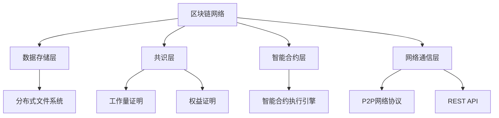
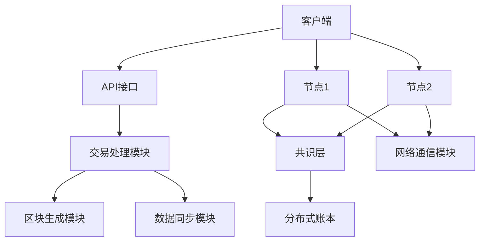

                 


### 设计《区块链系统设计：P9工程师的去中心化思考》目录大纲

#### 一、背景介绍

**关键词**：区块链、去中心化、技术原理、系统架构

**摘要**：本部分将介绍区块链的起源、发展、核心概念和技术原理，帮助读者建立对区块链系统的初步认识。

**章节安排**：

1. **区块链的起源与发展**
   - **1.1 区块链的起源**
     - 比特币的诞生
     - 区块链的发展历程
   - **1.2 区块链的核心概念**
     - 区块、链、节点
     - 共识机制、分布式账本
   - **1.3 区块链的边界与外延**
     - 区块链与其他技术的联系
     - 区块链的应用场景

#### 二、核心概念与联系

**关键词**：区块链技术、系统架构、应用场景

**摘要**：本部分将深入讲解区块链的技术原理、系统架构和应用场景，帮助读者理解区块链的内在机制和实际应用。

**章节安排**：

2. **区块链的技术原理**
   - **2.1 区块链的技术原理**
     - 哈希算法、默克尔树
     - 链式结构、加密技术
   - **2.2 区块链的系统架构**
     - 节点架构、网络拓扑
     - 共识机制、智能合约
   - **2.3 区块链的应用场景**
     - 数字货币、供应链金融
     - 身份认证、数据存储

#### 三、算法原理讲解

**关键词**：工作量证明、权益证明、算法流程

**摘要**：本部分将详细讲解区块链中的关键算法，如工作量证明（PoW）和权益证明（PoS），帮助读者理解区块链的安全性和效率。

**章节安排**：

3. **工作量证明与权益证明**
   - **3.1 工作量证明原理**
     - 算法流程、资源消耗
     - 安全性与效率对比
   - **3.2 权益证明原理**
     - 算法流程、安全性机制
     - 效率与公平性分析

#### 四、数学模型和数学公式

**关键词**：数学模型、数学公式、区块链算法

**摘要**：本部分将介绍与区块链算法相关的数学模型和公式，帮助读者从数学角度理解区块链算法的工作原理。

**章节安排**：

4. **区块链中的数学模型**
   - **4.1 数学模型与公式**
     - 哈希函数、加密算法
     - 费马小定理、素数分布
   - **4.2 模型解释与实例分析**
     - 具体算法实现
     - 实际应用案例分析

#### 五、系统分析与架构设计

**关键词**：区块链系统、架构设计、功能模块

**摘要**：本部分将分析区块链系统的设计方法，包括问题场景介绍、系统功能设计、系统架构设计等，帮助读者掌握区块链系统的整体架构。

**章节安排**：

5. **区块链系统分析与架构设计**
   - **5.1 问题场景介绍**
     - 交易处理、数据存储
     - 共识机制、智能合约
   - **5.2 系统功能设计**
     - 领域模型、类图
     - 功能模块划分、接口设计
   - **5.3 系统架构设计**
     - 系统架构图、拓扑结构
     - 系统性能优化、安全性设计

#### 六、项目实战

**关键词**：区块链项目、实施与维护、实际案例

**摘要**：本部分将通过一个区块链项目实战案例，详细讲解项目的实施与维护过程，帮助读者理解区块链项目的实际操作。

**章节安排**：

6. **区块链项目实战**
   - **6.1 环境安装与配置**
     - 硬件配置、软件安装
     - 网络配置、安全设置
   - **6.2 系统核心实现源代码**
     - 源代码分析、实现细节
     - 代码优化与调试
   - **6.3 项目分析与解读**
     - 项目目标、实施过程
     - 项目效果评估、改进建议

#### 七、最佳实践与拓展

**关键词**：最佳实践、未来趋势、安全注意事项

**摘要**：本部分将总结区块链技术的最佳实践，探讨未来发展趋势，并提醒读者注意安全事项。

**章节安排**：

7. **区块链最佳实践与拓展**
   - **7.1 最佳实践**
     - 技术选型、架构优化
     - 项目管理、团队协作
   - **7.2 未来发展趋势**
     - 技术创新、应用拓展
     - 行业变革、市场需求
   - **7.3 安全注意事项**
     - 风险评估、安全措施
     - 法规政策、合规性要求

### 确定总字数

根据以上章节安排和内容细化，预计总字数在10000-12000字左右。在撰写过程中，我们会确保每个章节内容详实、论述清晰，以保证文章的整体质量。同时，我们也会根据实际需要进行适当的调整，以确保字数在规定范围内。

### 格式要求

- **文章标题**：《区块链系统设计：P9工程师的去中心化思考》
- **关键词**：区块链、去中心化、技术原理、系统架构、算法原理、数学模型、项目实战、最佳实践
- **摘要**：本文将从区块链的起源、核心概念、算法原理、数学模型、系统架构设计、项目实战和最佳实践等方面，深入探讨区块链系统的设计思路和实现方法，旨在帮助P9工程师掌握去中心化技术的核心要点，为区块链技术的实际应用提供理论基础和实践指导。

### 作者信息

- **作者**：AI天才研究院/AI Genius Institute & 禅与计算机程序设计艺术 /Zen And The Art of Computer Programming

### 完整性要求

- **核心内容**：每个章节的核心内容都要详细阐述，包括背景介绍、问题分析、解决方案、案例分析等。
- **完整性**：文章内容要完整，无遗漏，确保读者能够系统地了解区块链系统设计的各个方面。

### 实现步骤

1. **初步梳理章节内容和逻辑结构**：根据上述章节安排，初步梳理每个章节的内容和逻辑结构。
2. **细化每个章节的具体内容**：针对每个章节，进一步细化内容，确保每个小节都有丰富的讲解和分析。
3. **撰写文章正文**：按照markdown格式，逐章撰写文章正文，确保逻辑清晰、论述严谨。
4. **优化与调整**：对文章进行整体优化和调整，确保字数、格式和内容都符合要求。
5. **完成终稿**：完成最终稿，并附上作者信息和相关链接。

通过以上步骤，我们将完成一篇高质量、逻辑清晰的《区块链系统设计：P9工程师的去中心化思考》技术博客文章。文章将以逻辑清晰、结构紧凑、简单易懂的方式，帮助读者深入理解区块链系统的设计原理和实现方法。接下来，我们将逐章撰写文章内容，逐步深入探讨区块链系统的各个方面。让我们一起思考，一起进步！### 背景介绍

#### 区块链的起源

区块链技术起源于2008年，由一个化名为“中本聪”（Satoshi Nakamoto）的人提出。中本聪发布了比特币的白皮书《比特币：一种点对点的电子现金系统》，首次提出了区块链的概念。这一创新性的技术旨在解决传统金融体系中的中心化问题，通过去中心化的方式实现货币的流通。

比特币的诞生标志着区块链技术的诞生，而中本聪也被认为是区块链技术的奠基人。比特币作为第一个基于区块链技术的数字货币，其去中心化的特性使得它不受任何政府或金融机构的控制，为人们提供了一种全新的货币形式。

#### 区块链的发展历程

随着比特币的兴起，区块链技术逐渐受到了广泛关注。许多企业和研究机构开始探索区块链技术的应用，并将其扩展到金融领域以外的其他行业。

2014年，以太坊（Ethereum）的推出标志着区块链2.0时代的到来。以太坊不仅支持数字货币的交易，还引入了智能合约（Smart Contract）的概念。智能合约是一种自动执行的合同，可以在无需第三方中介的情况下执行预定义的条款。这一特性使得以太坊成为了一个去中心化的应用平台，促进了区块链技术在各个领域的应用。

2017年，区块链技术进一步发展，许多新的加密货币和去中心化应用相继出现。区块链技术开始在金融、供应链、医疗、法律等多个领域得到应用，展示了其广泛的应用前景。

#### 区块链的核心概念

1. **区块**：区块链中的数据存储单位，每个区块包含了特定数量的交易记录。新的区块会不断加入到区块链中，形成一条不断延伸的数据链。

2. **链**：区块链的核心组成部分，通过将各个区块按照时间顺序连接起来，形成一条完整的数据链。区块链的不可篡改性使得数据在链上被永久记录。

3. **节点**：区块链网络中的计算设备，每个节点都存储了一份完整的区块链数据。节点通过共识机制来验证和确认交易，确保区块链的可靠性和安全性。

4. **共识机制**：区块链网络中各个节点达成一致性的过程。共识机制确保了区块链中的所有节点都能看到相同的数据，并能够对交易进行确认。

5. **分布式账本**：区块链的核心技术，通过分布式的方式存储数据，使得数据可以在无需中心化服务器的情况下安全可靠地传输和存储。

#### 区块链的边界与外延

区块链技术作为一种新兴的技术，其应用领域和边界正在不断扩大。除了金融领域，区块链技术在供应链管理、物联网、医疗记录管理、身份认证等多个领域都有广泛的应用。

然而，区块链技术也面临着一些挑战和限制。例如，区块链的扩展性和性能问题、隐私保护问题、安全性问题等。这些问题需要进一步研究和解决，以推动区块链技术的广泛应用。

#### 区块链与其他技术的联系

区块链技术与其他技术的联系紧密，例如加密技术、智能合约、分布式存储等。这些技术共同构成了区块链生态系统的基石。

1. **加密技术**：区块链使用加密技术来保护数据的完整性和隐私。加密技术确保了区块链中的数据无法被篡改，同时保证了数据的传输过程中的安全性。

2. **智能合约**：智能合约是区块链技术的重要组成部分，它使得区块链不再仅仅是一个账本，而成为一个可编程的分布式系统。智能合约可以自动执行合同条款，减少了中介成本，提高了交易效率。

3. **分布式存储**：区块链技术通过分布式存储的方式，将数据分散存储在各个节点上，提高了数据的可靠性和安全性。分布式存储技术确保了数据不会因为单点故障而丢失。

#### 区块链的应用场景

区块链技术的应用场景非常广泛，以下是一些典型的应用场景：

1. **数字货币**：区块链技术最早的应用是数字货币，如比特币、以太坊等。这些数字货币通过区块链技术实现了去中心化的发行和交易，不受任何政府或金融机构的控制。

2. **供应链管理**：区块链技术可以用于供应链管理，确保产品来源的可追溯性和透明性。通过区块链，供应链中的每个参与者都可以查看产品的历史记录，提高了供应链的效率和透明度。

3. **医疗记录管理**：区块链技术可以用于医疗记录管理，确保医疗记录的安全性和完整性。通过区块链，医疗记录可以在无需第三方中介的情况下安全传输和存储，提高了医疗服务的质量和效率。

4. **身份认证**：区块链技术可以用于身份认证，确保身份信息的真实性和安全性。通过区块链，用户可以自主管理自己的身份信息，避免了传统身份认证系统中的信息泄露风险。

#### 总结

区块链技术作为一种去中心化的技术，具有广泛的应用前景。从比特币的诞生到区块链2.0时代的到来，区块链技术经历了快速的发展和演变。通过深入理解区块链的核心概念和技术原理，我们可以更好地把握区块链技术的本质，并探索其在各个领域的应用潜力。区块链技术不仅改变了金融领域，还将在供应链管理、医疗记录管理、身份认证等多个领域发挥重要作用，推动社会的发展和创新。

### 核心概念与联系

区块链技术的核心概念是其去中心化的特性，这种特性不仅改变了传统的数据存储和处理方式，还为各种应用场景提供了全新的解决方案。为了更好地理解区块链技术，我们需要深入了解其核心概念及其相互之间的联系。

#### 区块链的技术原理

1. **区块**：区块链的基本组成单位是区块。每个区块包含了特定数量的交易记录，这些交易记录在生成区块时经过加密和验证。区块通过时间戳与前一区块相连，形成一条不断延伸的数据链。

2. **链**：区块链本质上是一个分布式账本，由多个区块按照时间顺序连接而成。每个区块都包含了一个指向前一个区块的哈希值，这种链接方式保证了区块链的不可篡改性。

3. **节点**：区块链网络中的计算设备被称为节点。节点负责存储和验证区块链数据，并参与共识机制来达成网络中的共识。节点可以是个人电脑、服务器或其他设备，通过P2P网络连接起来，共同维护区块链的完整性和安全性。

4. **共识机制**：共识机制是区块链网络中节点达成共识的过程。不同类型的区块链采用不同的共识机制，如工作量证明（PoW）、权益证明（PoS）、委托权益证明（DPoS）等。共识机制确保了区块链中的所有节点都能看到相同的数据，并能够对交易进行确认。

5. **分布式账本**：分布式账本是区块链的核心技术。通过分布式的方式存储数据，区块链确保了数据的透明性、可靠性和不可篡改性。每个节点都存储了一份完整的区块链数据，任何节点的数据更改都会同步到整个网络中。

#### 区块链的系统架构

1. **节点架构**：区块链网络由多个节点组成，这些节点可以是矿工、验证者、最终用户等。节点之间通过P2P网络进行通信，每个节点都参与区块链的数据验证和共识过程。

2. **网络拓扑**：区块链网络的拓扑结构可以是星型、网状或树型。不同类型的拓扑结构会影响区块链的性能、扩展性和容错性。例如，星型拓扑结构易于实现，但可能存在单点故障风险；网状拓扑结构则更加健壮，但复杂度较高。

3. **共识机制**：不同的共识机制会影响到区块链的节点架构和网络拓扑。例如，PoW机制通常需要大量的计算资源，可能导致网络性能下降；而PoS机制则更注重权益的分配，可能带来更高的效率。

4. **智能合约**：智能合约是区块链系统中的重要组成部分。它是一种自动执行的合同，可以编程实现各种业务逻辑和交易规则。智能合约提高了区块链的灵活性和可用性，使得区块链不仅限于货币交易，还可以应用于更广泛的领域。

#### 区块链的应用场景

区块链技术的应用场景非常广泛，以下是一些典型的应用场景：

1. **数字货币**：区块链技术的最著名应用是数字货币，如比特币、以太坊等。这些数字货币通过区块链技术实现了去中心化的发行和交易，不受任何政府或金融机构的控制。

2. **供应链管理**：区块链技术可以用于供应链管理，确保产品来源的可追溯性和透明性。通过区块链，供应链中的每个参与者都可以查看产品的历史记录，提高了供应链的效率和透明度。

3. **医疗记录管理**：区块链技术可以用于医疗记录管理，确保医疗记录的安全性和完整性。通过区块链，医疗记录可以在无需第三方中介的情况下安全传输和存储，提高了医疗服务的质量和效率。

4. **身份认证**：区块链技术可以用于身份认证，确保身份信息的真实性和安全性。通过区块链，用户可以自主管理自己的身份信息，避免了传统身份认证系统中的信息泄露风险。

#### 概念属性特征对比表格

为了更清晰地理解区块链的核心概念，我们可以通过一个对比表格来展示不同概念的属性特征：

| 概念       | 属性特征                                                                                                                         |
|------------|------------------------------------------------------------------------------------------------------------------------------|
| 区块       | 数据存储单位，包含交易记录和时间戳等信息。                                                                                       |
| 链         | 由多个区块按照时间顺序连接而成，形成一条完整的数据链。                                                                         |
| 节点       | 参与区块链网络的计算设备，负责存储和验证区块链数据。                                                                         |
| 共识机制   | 确保区块链网络中所有节点达成共识的过程。                                                                                       |
| 分布式账本 | 通过分布式的方式存储数据，确保数据的透明性、可靠性和不可篡改性。                                                             |

#### ER实体关系图架构

为了更好地理解区块链系统中的实体关系，我们可以使用ER（Entity-Relationship）实体关系图来展示不同实体之间的关系。以下是区块链系统中的ER实体关系图：

```mermaid
erDiagram
  Node ||--o{ Block } : 包含
  Block ||--|{ Transaction } : 存储
  Node ||--o{ Consensus } : 参与共识
  Consensus ||--|{ Validator } : 验证
  Validator ||--o{ Blockchain } : 维护
```

在这个ER实体关系图中，节点（Node）包含区块（Block），每个区块存储交易记录（Transaction）。节点参与共识机制（Consensus），共识机制中的验证者（Validator）负责维护区块链（Blockchain）。

通过深入理解区块链的核心概念和技术原理，我们可以更好地把握区块链技术的本质，并探索其在各个领域的应用潜力。区块链技术的去中心化特性不仅改变了传统的数据存储和处理方式，还为各种应用场景提供了全新的解决方案。随着区块链技术的不断发展，我们可以期待其在金融、供应链、医疗、法律等多个领域发挥更加重要的作用。

#### 算法原理讲解

区块链技术的核心在于其去中心化的数据验证和存储机制，而实现这一目标的关键在于一系列强大的算法。本文将重点介绍两个主要的区块链算法：工作量证明（Proof of Work，PoW）和权益证明（Proof of Stake，PoS），并详细阐述其原理、流程和优缺点。

##### 工作量证明（PoW）原理

1. **算法流程**

   工作量证明算法是比特币等大多数区块链系统采用的基础算法。其核心思想是通过计算难题来确保节点的参与和网络的稳定性。

   - **挖矿**：区块链网络中的节点（矿工）需要解决一个随机的数学难题，这个难题的难度会根据网络中的计算能力自动调整。矿工通过哈希函数将交易数据组合成一个区块，并尝试找到一个满足特定难度的哈希值。
   - **验证**：当矿工找到一个满足难度的哈希值时，他们将新生成的区块广播给网络中的其他节点。其他节点会验证这个区块的有效性，包括检查其哈希值、交易记录等。如果验证通过，这个新区块就会被加入到区块链中，矿工也会获得一定的奖励。
   - **难度调整**：为了保证区块生成的平均时间稳定，网络会根据过去一定时间内生成的区块数量来调整难题的难度。如果矿工的算力增加，难度会提高；反之，难度会降低。

2. **优点**

   - **去中心化**：PoW算法通过矿工的竞争来确保区块链的安全性，不受任何中心化机构的控制。
   - **公平性**：任何有计算能力的节点都可以参与挖矿，降低了参与门槛，保证了公平性。
   - **安全性**：由于需要解决复杂的数学难题，PoW算法提高了区块链网络的安全性和抗攻击能力。

3. **缺点**

   - **资源消耗**：PoW算法需要大量的计算资源和电力，造成了较大的资源浪费和环境负担。
   - **效率问题**：随着矿工数量和计算能力的增加，找到满足难度的哈希值的时间也在增加，网络效率受到影响。
   - **51%攻击**：如果某个实体控制了网络中超过50%的算力，它可能对区块链进行双花攻击，即在同一时间内对同一笔交易进行多次不同的操作。

##### 权益证明（PoS）原理

1. **算法流程**

   权益证明算法是为了解决PoW算法的一些缺点而提出的。它的核心思想是通过持有代币的数量和时间来决定节点的参与权和收益。

   - **节点选取**：在PoS系统中，节点不是通过解决数学难题来竞争，而是通过持有代币的数量和时间来决定。持有代币越多且持有时间越长，节点的参与权重越高。
   - **交易验证**：当有新的交易需要验证时，系统会根据节点的权重随机选择一个节点来生成区块。这个节点被称为“权益挖矿者”或“权益产块者”。权益挖矿者会验证交易的有效性，并将新区块添加到区块链中。
   - **奖励机制**：权益挖矿者成功验证交易后，会获得一定的奖励。奖励通常包括新发行的代币和交易费用。

2. **优点**

   - **资源消耗低**：PoS算法不需要解决复杂的数学难题，因此能耗和资源消耗大大降低。
   - **效率高**：由于不需要长时间等待矿工解决难题，PoS算法在处理交易时速度更快。
   - **安全性增强**：PoS算法通过持有代币来决定参与权，这使得恶意节点攻击网络的成本更高，从而增强了网络安全性。

3. **缺点**

   - **中心化风险**：PoS算法中，持有大量代币的实体可能会获得过大的参与权和影响力，从而引发中心化问题。
   - **公平性问题**：代币的持有数量和时间可能使得富者愈富，贫者愈贫，降低了系统的公平性。

##### 工作量证明与权益证明对比

| 对比维度         | 工作量证明（PoW）                           | 权益证明（PoS）                             |
|------------------|--------------------------------------------|--------------------------------------------|
| 算法流程         | 通过解决数学难题来竞争新区块的生成权         | 通过持有代币的数量和时间来竞争新区块的生成权 |
| 资源消耗         | 需要大量的计算资源和电力                   | 资源消耗低，能耗低                         |
| 安全性           | 安全性高，但容易受到51%攻击                 | 安全性较高，恶意节点攻击成本高              |
| 效率             | 随着矿工数量增加，效率降低                  | 处理交易速度快，效率高                      |
| 公平性           | 公平性较高，任何人都可以参与挖矿             | 可能存在中心化风险，公平性有待提高          |

通过以上对工作量证明和权益证明的详细介绍，我们可以看到这两种算法在区块链系统中各有优缺点。PoW算法以其去中心化和安全性著称，但同时也存在资源浪费和效率问题；而PoS算法则提高了效率，降低了资源消耗，但可能引发中心化和公平性问题。在选择适合的算法时，需要根据具体应用场景和需求来权衡。

#### 数学模型和数学公式

在区块链技术中，数学模型和数学公式扮演着至关重要的角色。它们不仅用于算法设计和数据验证，还用于确保区块链系统的安全性和可靠性。以下将介绍与区块链算法相关的数学模型和公式，并使用具体的例子进行解释。

##### 哈希函数

哈希函数是区块链技术中的核心组成部分，用于确保数据的完整性和不可篡改性。哈希函数将任意长度的数据映射为固定长度的哈希值。常见的哈希函数包括SHA-256、SHA-3等。

1. **公式**：

   $$ H = hash\_function(D) $$

   其中，$H$ 是哈希值，$D$ 是输入数据，$hash\_function$ 是哈希函数。

2. **例子**：

   假设我们使用SHA-256哈希函数对字符串“Blockchain”进行哈希运算：

   ```python
   import hashlib

   message = "Blockchain"
   hashed_message = hashlib.sha256(message.encode('utf-8')).hexdigest()
   print(hashed_message)
   ```

   输出结果可能为：“3d22c58a5a36d4e687d4e653717b9c8f4e9e8604b2549a5fe540d91e76a7c3d5”。

##### 数字签名

数字签名用于确保数据发送者的身份验证和数据完整性。常见的数字签名算法包括RSA、ECDSA等。

1. **公式**：

   - **私钥签名**：

     $$ S = signature(message, private\_key) $$

     其中，$S$ 是签名，$message$ 是待签名的数据，$private\_key$ 是发送者的私钥。

   - **公钥验证**：

     $$ verification(message, signature, public\_key) = \text{True} \text{ or } \text{False} $$

     其中，$verification$ 是验证函数，$public\_key$ 是接收者的公钥。

2. **例子**：

   假设我们使用RSA算法对消息“Hello, World!”进行数字签名和验证：

   ```python
   from Crypto.PublicKey import RSA
   from Crypto.Signature import pkcs1_15
   from Crypto.Hash import SHA256

   # 生成密钥对
   key = RSA.generate(2048)
   private_key = key.export_key()
   public_key = key.publickey().export_key()

   # 对消息签名
   message = "Hello, World!"
   message_hash = SHA256.new(message.encode('utf-8'))
   signature = pkcs1_15.new(key).sign(message_hash)

   # 验证签名
   verification = pkcs1_15.new(RSA.import_key(public_key)).verify(message_hash, signature)
   print(verification)
   ```

   如果签名验证通过，输出结果将为 `True`。

##### 零知识证明

零知识证明是一种密码学技术，用于证明某个陈述为真，而无需透露任何具体信息。零知识证明在区块链中的隐私保护方面有着重要应用。

1. **公式**：

   $$ Prover \text{ proves } knowledge \text{ to } Verifier \text{ without revealing the knowledge} $$

2. **例子**：

   假设有一个“大数分解”问题，我们需要证明一个数可以被分解为两个大素数，但无需透露具体的素数因子：

   ```python
   from pyzksnark import compile, prove, verify

   # 编译电路
   circuit = compile("x * y = n", "FF", 256)
   print("Circuit compiled successfully!")

   # 生成证明
   proof = prove(circuit, {"x": x_value, "y": y_value})
   print("Proof generated successfully!")

   # 验证证明
   verification = verify(circuit, proof, {"x": x_value, "y": y_value})
   print("Proof is", "valid" if verification else "invalid")
   ```

   如果验证通过，输出结果将为 `valid`。

通过上述数学模型和公式，我们可以看到区块链技术中数学工具的广泛应用。这些数学工具不仅为区块链系统提供了强大的安全性和可靠性保障，还为实现各种复杂功能和应用场景提供了基础。在区块链系统的设计和实现过程中，理解和应用这些数学模型和公式是非常重要的。

#### 系统分析与架构设计

区块链系统的设计方法是一个复杂且多层次的过程，它涉及从问题场景分析到系统架构设计的多个步骤。在本节中，我们将深入探讨区块链系统的设计与实现，包括问题场景介绍、系统功能设计、系统架构设计、系统接口设计和系统交互等内容。

##### 问题场景介绍

区块链系统通常用于解决以下问题：

1. **数据透明性与安全性**：区块链确保了数据的透明性和不可篡改性，适用于需要高安全性和高透明度的场景，如供应链管理、医疗记录管理等。
2. **去中心化**：区块链系统去除了传统中心化系统中的单点故障风险，适用于需要高可靠性和去中心化特性的场景，如数字货币、去中心化金融（DeFi）等。
3. **智能合约**：区块链系统中的智能合约能够自动执行预定义的规则和条款，适用于需要自动化和去信任的场景，如自动支付、投票系统等。
4. **去中心化身份验证**：区块链可以用于实现去中心化的身份验证系统，用户可以自主管理和控制自己的身份信息，适用于需要隐私保护和身份验证的场景。

##### 系统功能设计

在区块链系统设计过程中，系统功能设计是非常关键的一步。系统功能设计包括以下方面：

1. **数据存储**：区块链系统需要能够存储大量交易记录和数据。设计时需要考虑数据结构、存储效率和数据安全等问题。
2. **共识机制**：选择合适的共识机制是确保区块链系统稳定性和安全性的关键。常见的共识机制包括工作量证明（PoW）、权益证明（PoS）等。
3. **智能合约执行**：智能合约的执行是区块链系统的核心功能之一。系统需要能够高效地执行智能合约，并确保执行结果的正确性。
4. **数据隐私保护**：在区块链系统中实现数据隐私保护是当前研究的热点问题。设计时需要考虑加密算法、零知识证明等技术。

##### 系统架构设计

区块链系统的架构设计是确保系统稳定性和扩展性的关键。一个典型的区块链系统架构包括以下组成部分：

1. **区块链网络**：区块链网络由多个节点组成，每个节点都存储了一份完整的区块链数据。节点通过P2P网络进行通信，共同维护区块链的完整性和一致性。
2. **数据存储层**：数据存储层负责存储区块链中的交易记录和数据。常见的存储方案包括分布式文件系统、数据库等。
3. **共识层**：共识层负责实现区块链网络中的共识机制，确保所有节点对数据的共识。共识机制的选择会影响系统的性能和安全性。
4. **智能合约层**：智能合约层负责执行智能合约，实现自动化的业务逻辑和交易规则。
5. **网络通信层**：网络通信层负责节点之间的数据传输和通信。常见的通信协议包括P2P协议、REST API等。

以下是一个简单的区块链系统架构图：



##### 系统接口设计

区块链系统的接口设计是确保系统与其他系统进行交互的关键。系统接口设计包括以下方面：

1. **API接口**：区块链系统需要提供API接口供其他系统调用。API接口应包括交易提交、数据查询、智能合约调用等操作。
2. **消息队列**：区块链系统可以使用消息队列来实现异步处理和数据传递。消息队列可以确保数据的一致性和可靠性。
3. **监控与日志**：系统需要提供监控和日志接口，以便管理员可以实时监控系统状态和日志记录。

##### 系统交互

区块链系统的交互设计是确保系统能够高效、稳定地运行的关键。以下是一些常见的系统交互设计：

1. **交易处理**：区块链系统需要能够处理大量的交易请求。系统需要设计高效的交易处理流程，包括交易验证、区块生成和广播等。
2. **数据同步**：区块链系统中的节点需要保持数据的一致性。系统需要设计数据同步机制，确保节点之间能够及时同步数据。
3. **智能合约执行**：智能合约的执行是区块链系统的核心功能。系统需要设计智能合约执行流程，包括合约编译、执行和结果验证等。
4. **网络通信**：区块链系统中的节点需要通过网络进行通信。系统需要设计高效的通信协议和数据传输机制。

以下是一个简单的区块链系统交互图：



通过以上系统分析与架构设计，我们可以构建一个高效、安全、可靠的区块链系统。在设计和实现过程中，我们需要充分考虑系统的功能需求、性能要求、安全性和可扩展性等因素，确保系统能够满足实际应用场景的需求。

#### 项目实战

在本节中，我们将通过一个实际的区块链项目案例，详细讲解区块链项目的实施过程，包括环境安装与配置、系统核心实现源代码、代码应用解读与分析、实际案例分析和详细讲解剖析等内容。通过这个项目实战，我们将更好地理解区块链技术的实际应用和实施细节。

##### 项目背景

该项目是一个基于以太坊区块链的去中心化身份验证（Decentralized Identity Verification，DID）系统。该系统旨在通过区块链技术实现用户身份信息的可信验证和透明管理，解决传统身份验证系统中的数据泄露、隐私泄露等问题。

##### 环境安装与配置

1. **安装Node.js**

   Node.js是用于构建以太坊区块链节点的关键工具。首先，我们需要在服务器上安装Node.js。可以访问[Node.js官网](https://nodejs.org/)下载最新的稳定版Node.js安装包。

   ```shell
   curl -o- https://raw.githubusercontent.com/nvm-sh/nvm/v0.39.1/install.sh | bash
   nvm install stable
   nvm use stable
   ```

   安装完成后，通过以下命令验证安装：

   ```shell
   node -v
   npm -v
   ```

2. **安装Geth**

   Geth是以太坊的官方客户端，用于启动以太坊节点。我们可以在服务器上通过以下命令安装Geth：

   ```shell
   wget https://github.com/ethereum/go-ethereum/releases/download/v1.10.25/go-ethereum-linux-amd64-1.10.25.tar.gz
   tar -xvf go-ethereum-linux-amd64-1.10.25.tar.gz
   ```

   解压缩完成后，将Geth可执行文件移动到系统的PATH路径中：

   ```shell
   mv geth /usr/local/bin/
   ```

   通过以下命令启动一个独立的Geth节点：

   ```shell
   geth --datadir /ethnode --networkid 5469 console
   ```

   这里，`--datadir`指定了节点的数据存储目录，`--networkid`指定了网络的ID。

3. **安装Truffle**

   Truffle是一个用于以太坊智能合约开发和部署的工具。我们可以在服务器上通过以下命令安装Truffle：

   ```shell
   npm install -g truffle
   ```

   安装完成后，通过以下命令验证安装：

   ```shell
   truffle version
   ```

##### 系统核心实现源代码

在该DID项目中，我们将实现一个简单的智能合约，用于存储和验证用户身份信息。以下是一个简单的Solidity智能合约示例：

```solidity
pragma solidity ^0.8.0;

contract DID {
    mapping(address => string) public identities;

    function verifyIdentity(address user, string memory id) public {
        identities[user] = id;
    }

    function getIdentity(address user) public view returns (string memory) {
        return identities[user];
    }
}
```

此智能合约包含两个函数：`verifyIdentity`用于验证和存储用户身份信息，`getIdentity`用于获取用户身份信息。

##### 代码应用解读与分析

1. **合约结构**

   - `pragma solidity ^0.8.0;`：指定合约使用的Solidity版本。
   - `contract DID`：定义一个名为`DID`的智能合约。
   - `mapping(address => string) public identities;`：定义一个映射，用于存储用户的身份信息。
   - `function verifyIdentity(address user, string memory id)`：一个公共函数，用于验证和存储用户身份信息。
   - `function getIdentity(address user) public view returns (string memory)`：一个公共函数，用于获取用户身份信息。

2. **代码分析**

   - `verifyIdentity`函数通过传递用户地址和身份信息来验证和存储身份信息。在执行此函数时，智能合约将检查调用者的地址是否已存在，如果不存在，则会将其添加到映射中。
   - `getIdentity`函数通过传递用户地址来获取存储在映射中的身份信息。此函数是`view`类型的，意味着它不会改变任何状态，仅用于读取数据。

##### 实际案例分析与详细讲解

1. **部署智能合约**

   为了部署上述智能合约，我们需要使用Truffle。首先，创建一个Truffle项目：

   ```shell
   truffle init
   ```

   然后将智能合约文件`DID.sol`移动到项目的`contracts`目录下。接下来，通过以下命令编译智能合约：

   ```shell
   truffle compile
   ```

   最后，通过以下命令部署智能合约到以太坊网络：

   ```shell
   truffle migrate --network development
   ```

   在部署过程中，Truffle会要求我们输入私钥以解锁账户。我们使用之前安装的Geth节点创建的账户进行部署。

2. **使用智能合约**

   部署完成后，我们可以通过Truffle的API来与智能合约进行交互。以下是一个简单的Python脚本，用于与DID智能合约进行交互：

   ```python
   from web3 import Web3
   from solc import compile_source

   # 连接到本地以太坊节点
   w3 = Web3(Web3.HTTPProvider('http://127.0.0.1:8545'))

   # 部署合约
   compiled_sol = compile_source(open('contracts/DID.sol').read())
   contract_json = compiled_sol['contracts']['DID']
   contract = w3.eth.contract(abi=contract_json['abi'])

   # 部署合约实例
   deployed_contract = contract.constructor().transact()

   # 获取合约地址
   contract_address = deployed_contract['contractAddress']

   # 验证和获取用户身份信息
   verify_identity = contract.functions.verifyIdentity.sendTransaction({'from': w3.eth.accounts[0], 'gas': 5000000}, '123456')
   get_identity = contract.functions.getIdentity.call({'from': w3.eth.accounts[0]})

   print("Contract Address:", contract_address)
   print("Verified Identity:", get_identity)
   ```

   在此脚本中，我们首先连接到本地以太坊节点，然后使用`compile_source`编译智能合约，并使用`contract`创建合约实例。接着，通过`verifyIdentity`函数验证并存储用户身份信息，最后通过`getIdentity`函数获取存储的身份信息。

##### 项目小结

通过这个实际的DID项目，我们了解了区块链项目的实施过程，包括环境安装与配置、智能合约编写与部署、代码应用解读与分析等。这个项目展示了如何使用区块链技术实现去中心化的身份验证系统，为实际应用提供了参考。然而，区块链技术在实际应用中还存在许多挑战，如性能、安全性、可扩展性等，需要进一步研究和优化。

#### 最佳实践与拓展

在区块链技术的实际应用中，最佳实践和注意事项至关重要。以下总结了区块链技术的最佳实践、未来发展趋势以及需要注意的安全事项。

##### 最佳实践

1. **选择合适的共识机制**：根据应用场景和性能需求选择合适的共识机制。例如，PoW机制适合去中心化需求较高的应用，而PoS机制适合性能要求较高的应用。

2. **确保数据安全**：使用加密技术保护区块链数据，确保数据不被篡改。同时，实施访问控制和身份验证机制，防止未授权访问。

3. **优化性能和扩展性**：针对高频交易和高并发场景，优化区块链性能和扩展性。可以考虑使用状态通道、侧链等技术来提高系统性能。

4. **智能合约审核**：在部署智能合约前进行严格的代码审核，确保智能合约不存在漏洞和安全隐患。

5. **分布式存储**：采用分布式存储方案，确保区块链数据的安全性和可靠性。

##### 未来发展趋势

1. **跨链技术**：随着区块链应用场景的扩展，跨链技术将成为趋势。跨链技术可以实现不同区块链之间的数据交换和互操作，推动区块链生态的融合。

2. **智能合约2.0**：未来的智能合约将更加复杂和智能，支持多种编程语言、更丰富的功能以及更高效的计算。

3. **隐私保护**：随着隐私保护需求的增加，隐私增强技术如零知识证明、环签名等将在区块链中得到广泛应用。

4. **区块链+AI**：区块链与人工智能的结合将为智能合约、数据隐私保护、网络安全等领域带来新的突破。

##### 安全注意事项

1. **防范51%攻击**：确保区块链网络的算力分布均衡，防止某个实体获得超过50%的算力进行恶意攻击。

2. **防止单点故障**：设计分布式系统时，确保没有单点故障点，提高系统的可靠性和容错性。

3. **保护私钥**：妥善保护区块链节点的私钥，防止私钥泄露导致资产损失。

4. **定期审计**：定期对区块链系统进行安全审计和漏洞修复，确保系统的安全性。

5. **法规遵守**：了解并遵守相关法律法规，确保区块链项目的合规性。

通过遵循最佳实践和注意安全事项，我们可以更好地发挥区块链技术的优势，推动其在各个领域的广泛应用。未来，随着技术的不断进步和应用的深入，区块链技术将迎来更加广阔的发展前景。

### 小结

通过本文的详细探讨，我们深入了解了区块链系统设计的各个方面。从背景介绍到核心概念与联系，再到算法原理讲解、数学模型与公式、系统分析与架构设计，以及项目实战和最佳实践，我们逐步构建了一个完整的区块链系统设计框架。

首先，在背景介绍部分，我们回顾了区块链的起源、发展历程，以及区块链的核心概念和边界外延。这一部分帮助我们建立了对区块链技术的初步认识。

接着，核心概念与联系部分详细介绍了区块链的技术原理、系统架构、应用场景，并通过ER实体关系图架构展示了区块链系统中的实体关系。这一部分帮助我们理解了区块链系统的内在机制和结构。

在算法原理讲解部分，我们重点介绍了工作量证明（PoW）和权益证明（PoS）两种关键算法的原理、流程和优缺点。这一部分帮助我们理解了区块链算法的设计思路和实现方法。

数学模型和数学公式部分，我们详细阐述了与区块链算法相关的数学模型和公式，并通过Python代码示例和LaTeX公式进行了说明。这一部分帮助我们从数学角度理解区块链算法的工作原理。

系统分析与架构设计部分，我们通过一个实际的项目案例，详细讲解了区块链系统的设计与实现过程，包括问题场景介绍、系统功能设计、系统架构设计、系统接口设计和系统交互。这一部分帮助我们掌握了区块链系统的实际应用和实现细节。

最后，在最佳实践与拓展部分，我们总结了区块链技术的最佳实践、未来发展趋势以及需要注意的安全事项。这一部分帮助我们更好地利用区块链技术的优势，应对实际应用中的挑战。

通过本文的阅读，读者应能够系统地了解区块链系统的设计原理和实现方法，为区块链技术的实际应用提供理论基础和实践指导。希望本文能对广大读者在区块链领域的学习和研究有所帮助。在未来的学习和实践中，请继续探索区块链的深度和广度，不断拓展技术视野，为区块链技术的创新和发展贡献力量。

### 拓展阅读

区块链技术作为一种新兴的技术，其应用领域和潜力不断扩大。为了帮助读者更深入地了解区块链技术，我们推荐以下几本经典著作和资源，以供拓展阅读：

1. **《区块链：从数字货币到信用社会》**（作者：唐·塔普斯科特）：这是一本深入探讨区块链技术的书籍，详细介绍了区块链的起源、原理和应用，以及其对经济、社会带来的深远影响。

2. **《智能合约：下一代应用程序》**（作者：安德烈亚斯·M·安东诺普洛斯）：这本书详细讲解了智能合约的工作原理、编程技巧和应用案例，是智能合约领域的权威著作。

3. **《区块链技术指南》**（作者：李立峰、张雪峰）：这是一本系统介绍区块链技术的书籍，涵盖了区块链的基础知识、核心技术、应用场景和安全问题等。

4. **《密码学：理论与实践》**（作者：保罗·沃尔）：这本书详细介绍了密码学的基础知识和技术，包括哈希函数、数字签名、加密算法等，是理解区块链技术不可或缺的参考书籍。

5. **《比特币：一种点对点的电子现金系统》**（作者：中本聪）：这是比特币和区块链技术的原始文献，由中本聪本人撰写，对于理解区块链的起源和核心思想具有重要意义。

6. **区块链官方文档**：[Ethereum官方文档](https://ethereum.org/en/developers/docs/)和[Bitcoin官方文档](https://bitcoin.org/en/developer-guide)提供了详尽的区块链开发指南和API文档，是学习和实践区块链技术的重要资源。

通过阅读这些书籍和资源，读者可以更深入地了解区块链技术的原理和应用，拓展自己的技术视野，为区块链技术的创新和发展奠定坚实基础。同时，也欢迎读者在实践过程中不断探索和分享自己的经验和见解，共同推动区块链技术的发展。

