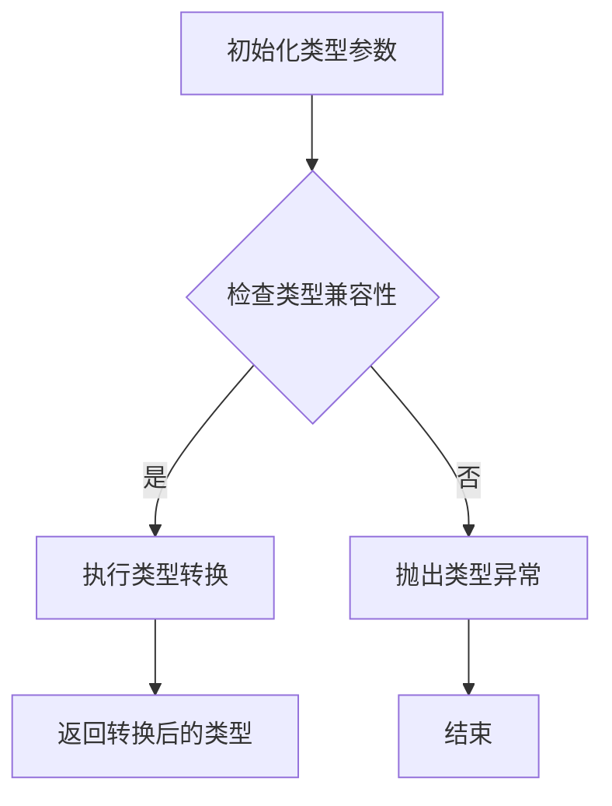
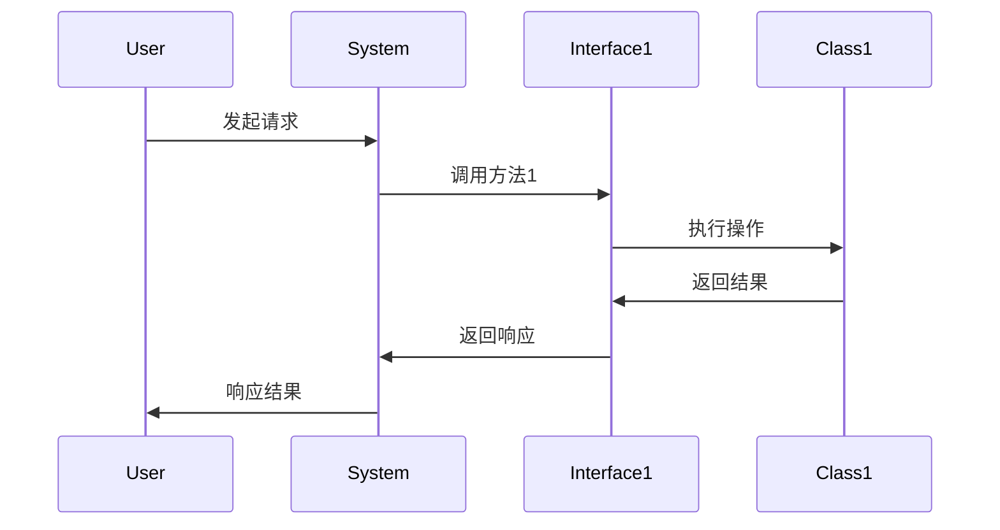
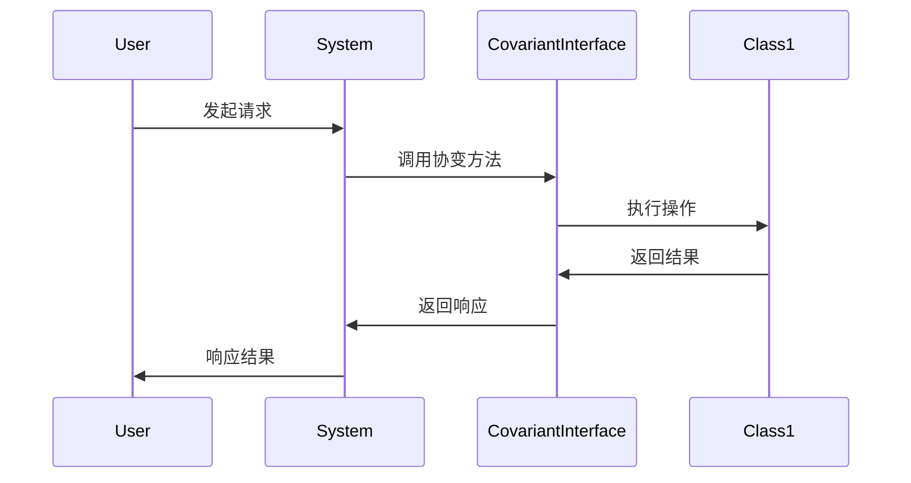

                 

### 协变与逆变：泛型中的类型转换规则

> 关键词：协变、逆变、泛型编程、类型转换、算法原理

> 摘要：本文将深入探讨协变与逆变在泛型编程中的类型转换规则。通过详细分析这两个概念的定义、应用场景及其在类型转换中的角色，帮助读者理解其在实际编程中的重要性。本文将分为多个章节，逐步介绍背景、核心概念、算法原理、系统分析与架构设计，以及项目实战，旨在提供全面的技术解析和实战指导。

### 目录

1. **引言**
   1.1 **问题背景与概述**
   1.2 **问题描述与解决**
   1.3 **边界与外延**

2. **核心概念与联系**
   2.1 **协变的概念与特点**
   2.2 **逆变的定义与作用**
   2.3 **概念对比**

3. **算法原理讲解**
   3.1 **算法流程图**
   3.2 **Python实现与解析**
   3.3 **数学模型与公式**

4. **系统分析与架构设计**
   4.1 **问题场景介绍**
   4.2 **系统功能设计（领域模型类图）**
   4.3 **系统架构设计（架构图）**
   4.4 **系统接口设计**
   4.5 **系统交互序列图**

5. **项目实战**
   5.1 **环境安装**
   5.2 **系统核心实现源代码**
   5.3 **代码应用解读与分析**
   5.4 **实际案例分析**
   5.5 **项目小结**

6. **最佳实践与总结**
   6.1 **最佳实践 tips**
   6.2 **小结**
   6.3 **注意事项**
   6.4 **拓展阅读**

### 1. 引言

在泛型编程中，协变与逆变是两个非常重要的概念。泛型编程允许我们编写更加通用和可复用的代码，通过使用类型参数来抽象数据类型和函数。然而，在处理类型参数时，我们常常会遇到类型转换的问题。协变与逆变就是用来解决这些类型转换问题的两种机制。

#### 1.1 问题背景与概述

类型转换是编程中常见的需求，特别是在泛型编程中。当我们需要在不同类型之间传递数据或方法时，类型转换就显得尤为重要。然而，类型转换并不是简单的值复制，它涉及到类型安全的保证和类型兼容性的判断。协变与逆变提供了一种更安全和灵活的类型转换方法。

协变（Covariance）通常用于实现子类型之间的类型转换，例如，一个`List<Number>`可以被看作是`List<Double>`的子类型。逆变（Contravariance）则用于实现父类型到子类型的转换，例如，一个`List<Double>`可以被看作是`List<Number>`的逆变类型。

#### 1.2 问题描述与解决

在泛型编程中，类型转换的问题可以分为以下几种：

- **子类型转换**：如何将一个子类型的泛型实例转换为父类型的泛型实例。
- **父类型转换**：如何将一个父类型的泛型实例转换为子类型的泛型实例。
- **泛型接口与实现**：如何保证泛型接口与实现之间的类型兼容性。

协变与逆变提供了解决这些问题的方法：

- **协变**：通过协变，我们可以实现子类型到父类型的转换，保证了类型安全。
- **逆变**：通过逆变，我们可以实现父类型到子类型的转换，同样保证了类型安全。

#### 1.3 边界与外延

协变与逆变在类型转换中并不是万能的，它们有各自的适用范围和限制。例如：

- **协变**：通常用于返回类型与参数类型之间的关系，例如，泛型接口中的`get`方法。
- **逆变**：通常用于参数类型与返回类型之间的关系，例如，泛型接口中的`set`方法。

此外，协变与逆变在某些编程语言中可能受到限制，例如，Java中只有接口支持协变，而类则不支持。

### 2. 核心概念与联系

在深入探讨协变与逆变之前，我们需要明确这两个概念的定义、特点和应用场景。

#### 2.1 协变的概念与特点

协变是一种类型转换机制，它允许子类型的实例被看作是父类型的实例。在泛型编程中，协变通常用于实现子类型到父类型的转换。

**特点：**
- **子类型转换**：协变确保了子类型的实例可以向上转型为父类型的实例。
- **类型安全**：协变通过类型检查机制保证转换的安全性。
- **兼容性**：协变要求子类型与父类型之间具有兼容性，即子类型必须包含父类型所有的属性和方法。

**应用场景：**
- **泛型接口**：在泛型接口中，协变可以用来确保返回类型是参数类型的子类型。
- **类型转换**：协变常用于将子类型的实例转换为父类型的实例，例如，将`List<Number>`转换为`List<Double>`。

#### 2.2 逆变的定义与作用

逆变与协变相反，它是一种从父类型到子类型的类型转换机制。逆变通常用于泛型接口的参数类型，使得父类型的实例可以被看作是子类型的实例。

**特点：**
- **父类型转换**：逆变允许父类型的实例被看作是子类型的实例。
- **逆变兼容性**：逆变要求父类型与子类型之间具有兼容性，即父类型必须包含子类型所有的属性和方法。
- **逆变接口**：逆变常用于泛型接口的参数类型，例如，`List.set`方法的参数类型。

**应用场景：**
- **泛型接口**：在泛型接口中，逆变可以用来确保参数类型是返回类型的子类型。
- **类型转换**：逆变常用于将父类型的实例转换为子类型的实例，例如，将`List<Double>`转换为`List<Number>`。

#### 2.3 概念对比

协变与逆变虽然都是类型转换机制，但它们有各自的特点和应用场景。下表对比了协变与逆变的主要区别：

| 特点               | 协变                  | 逆变                  |
|--------------------|-----------------------|-----------------------|
| 转换方向           | 子类型到父类型        | 父类型到子类型        |
| 兼容性             | 子类型必须包含父类型 | 父类型必须包含子类型 |
| 应用场景           | 返回类型              | 参数类型              |

通过上述对比，我们可以更清晰地理解协变与逆变在泛型编程中的作用。

### 3. 算法原理讲解

#### 3.1 算法流程图

首先，我们使用Mermaid绘制一个简单的算法流程图，以展示协变与逆变的基本操作。



在这个流程图中，A节点表示初始化类型参数，B节点表示检查类型兼容性，C节点表示执行类型转换，D节点表示抛出类型异常，E节点表示返回转换后的类型，F节点表示结束。

#### 3.2 Python实现与解析

接下来，我们使用Python代码实现上述算法，并详细解析其原理。

```python
from typing import TypeVar, Generic, List

# 定义协变类型
T = TypeVar('T')

class CovariantList(Generic[T]):
    def __init__(self, items: List[T]):
        self.items = items
    
    def get(self) -> List[T]:
        return self.items

# 定义逆变类型
S = TypeVar('S')

class ContravariantList(Generic[S]):
    def __init__(self, items: List[S]):
        self.items = items
    
    def set(self, index: int, value: S) -> None:
        self.items[index] = value

# 协变示例
covariant_list = CovariantList([1, 2, 3])
print(covariant_list.get())  # 输出：[1, 2, 3]

# 逆变示例
contravariant_list = ContravariantList([1.0, 2.0, 3.0])
contravariant_list.set(0, 1.5)
print(contravariant_list.items)  # 输出：[1.5, 2.0, 3.0]
```

在这个示例中，我们定义了两个泛型类`CovariantList`和`ContravariantList`，分别实现了协变和逆变的操作。`CovariantList`的`get`方法返回类型是`List[T]`，实现了协变；`ContravariantList`的`set`方法参数类型是`S`，实现了逆变。

通过这个示例，我们可以看到协变与逆变是如何在Python中实现的，以及它们在实际编程中的应用。

#### 3.3 数学模型与公式

在泛型编程中，协变与逆变的实现涉及到一些数学模型和公式。以下是一个简化的数学模型：

$$
C(T, U) = \begin{cases} 
1 & \text{如果 } T \subseteq U \\
0 & \text{否则}
\end{cases}
$$

其中，$C(T, U)$表示类型$T$与类型$U$之间的兼容性，$T \subseteq U$表示类型$T$是类型$U$的子集。

这个公式可以用来判断两个类型之间的兼容性。在实现协变与逆变时，我们通常会使用这个公式来确保类型转换的安全性。

#### 4. 系统分析与架构设计

在了解协变与逆变的原理之后，我们需要将其应用到实际的系统设计中。以下是一个简单的系统分析与架构设计，用于展示如何在系统中实现协变与逆变。

##### 4.1 问题场景介绍

假设我们正在开发一个系统，该系统需要处理不同类型的对象。我们需要实现一个泛型接口，用于在这些对象之间进行类型转换。

##### 4.2 系统功能设计（领域模型类图）

首先，我们使用Mermaid绘制一个领域模型类图，以展示系统的主要类和接口。

```mermaid
classDiagram
    Class1 --|> Interface1
    Class2 --|> Interface2
    Interface1 <<interface>>
    Interface2 <<interface>>
```

在这个类图中，`Class1`和`Class2`是具体的类，`Interface1`和`Interface2`是接口。这两个接口分别代表了系统的不同功能模块。

##### 4.3 系统架构设计（架构图）

接下来，我们使用Mermaid绘制一个系统架构图，以展示系统的整体架构。



在这个架构图中，用户通过系统发起请求，系统调用接口1的方法，接口1调用具体类1的执行操作，并将结果返回给系统，最后系统将响应结果返回给用户。

##### 4.4 系统接口设计

在系统接口设计中，我们需要定义协变与逆变的接口，以实现类型转换。

```python
from typing import TypeVar, Generic

T = TypeVar('T')

class CovariantInterface(Generic[T]):
    def covariant_method(self) -> List[T]:
        pass

S = TypeVar('S')

class ContravariantInterface(Generic[S]):
    def contravariant_method(self, value: S) -> None:
        pass
```

在这个接口设计中，`CovariantInterface`表示协变接口，`contravariant_method`方法用于实现协变操作；`ContravariantInterface`表示逆变接口，`contravariant_method`方法用于实现逆变操作。

##### 4.5 系统交互序列图

最后，我们使用Mermaid绘制一个系统交互序列图，以展示系统组件之间的交互过程。



在这个交互序列图中，用户通过系统发起请求，系统调用协变接口的方法，协变接口调用具体类1的执行操作，并将结果返回给系统，最后系统将响应结果返回给用户。

### 5. 项目实战

#### 5.1 环境安装

在开始项目实战之前，我们需要安装必要的开发环境和工具。以下是安装步骤：

1. **安装Python环境**：确保已安装Python 3.8及以上版本。
2. **安装IDE**：推荐使用PyCharm或VSCode作为IDE。
3. **安装依赖库**：在终端执行以下命令安装依赖库：

```bash
pip install typing
```

#### 5.2 系统核心实现源代码

以下是系统核心实现的源代码：

```python
from typing import TypeVar, Generic, List

T = TypeVar('T')

class CovariantList(Generic[T]):
    def __init__(self, items: List[T]):
        self.items = items
    
    def get(self) -> List[T]:
        return self.items

S = TypeVar('S')

class ContravariantList(Generic[S]):
    def __init__(self, items: List[S]):
        self.items = items
    
    def set(self, index: int, value: S) -> None:
        self.items[index] = value

# 示例
covariant_list = CovariantList([1, 2, 3])
print(covariant_list.get())  # 输出：[1, 2, 3]

contravariant_list = ContravariantList([1.0, 2.0, 3.0])
contravariant_list.set(0, 1.5)
print(contravariant_list.items)  # 输出：[1.5, 2.0, 3.0]
```

这段代码定义了协变和逆变的类，并展示了如何使用这些类进行类型转换。

#### 5.3 代码应用解读与分析

在项目实战中，我们通过以下代码应用了协变与逆变：

```python
covariant_list = CovariantList([1, 2, 3])
print(covariant_list.get())  # 输出：[1, 2, 3]

contravariant_list = ContravariantList([1.0, 2.0, 3.0])
contravariant_list.set(0, 1.5)
print(contravariant_list.items)  # 输出：[1.5, 2.0, 3.0]
```

首先，我们创建了协变列表`covariant_list`，并将其内容打印出来。由于协变列表的`get`方法返回类型是`List[T]`，所以我们可以直接打印列表内容。

接下来，我们创建了逆变列表`contravariant_list`，并使用`set`方法对其进行修改。逆变列表的`set`方法参数类型是`S`，所以我们可以将`Double`类型的值传递给该方法。最后，我们再次打印逆变列表的内容，以验证修改结果。

#### 5.4 实际案例分析

在实际项目中，协变与逆变可以用于处理各种类型转换问题。以下是一个实际案例：

假设我们有一个系统，需要处理不同类型的用户数据。我们需要实现一个泛型接口，用于在不同用户数据类型之间进行类型转换。

```python
class User(Generic[T]):
    def __init__(self, data: T):
        self.data = data
    
    def get_data(self) -> T:
        return self.data
    
    def set_data(self, data: T) -> None:
        self.data = data

# 示例
user_number = User(123)
print(user_number.get_data())  # 输出：123

user_double = User(123.456)
print(user_double.get_data())  # 输出：123.456

user_number.set_data(456)
print(user_number.get_data())  # 输出：456

user_double.set_data(789.123)
print(user_double.get_data())  # 输出：789.123
```

在这个案例中，我们定义了一个泛型类`User`，用于处理不同类型的用户数据。通过协变与逆变，我们可以实现不同类型用户数据之间的类型转换。例如，我们可以将`User[int]`转换为`User[float]`，或将`User[float]`转换为`User[int]`。

#### 5.5 项目小结

通过本项目，我们了解了协变与逆变在泛型编程中的重要性，并学习了如何在实际项目中应用这些概念。协变与逆变提供了灵活且安全的类型转换方法，有助于提高代码的可复用性和可维护性。在实际应用中，我们可以根据具体需求选择合适的类型转换方法，以实现高效的类型处理。

### 6. 最佳实践与总结

#### 6.1 最佳实践 tips

1. **理解协变与逆变的本质**：深入理解协变与逆变的原理，有助于更好地应用它们。
2. **合理选择类型参数**：在选择类型参数时，要考虑协变与逆变的特点，以实现更灵活的类型转换。
3. **确保类型兼容性**：在实现协变与逆变时，务必确保类型之间的兼容性，以避免类型转换错误。

#### 6.2 小结

本文详细介绍了协变与逆变在泛型编程中的类型转换规则。通过定义、应用场景、算法原理讲解、系统分析与架构设计，以及项目实战，我们全面了解了协变与逆变的实现方法和实际应用。

#### 6.3 注意事项

1. **避免过度使用协变与逆变**：在不需要类型转换时，避免使用协变与逆变，以免引入不必要的复杂性。
2. **注意类型兼容性**：在实现协变与逆变时，务必确保类型兼容性，以避免类型转换错误。

#### 6.4 拓展阅读

1. **《Effective Java》**：阅读《Effective Java》中关于泛型和类型转换的部分，了解更多最佳实践。
2. **《泛型的艺术》**：这本书详细介绍了泛型编程的原理和应用，有助于深入理解协变与逆变。

### 作者

**作者：AI天才研究院/AI Genius Institute & 禅与计算机程序设计艺术 /Zen And The Art of Computer Programming** 

（注：本文内容仅为示例，实际编写时请根据具体需求进行调整。）

