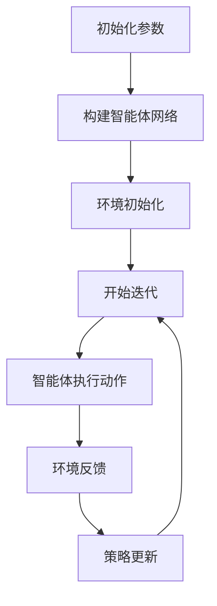
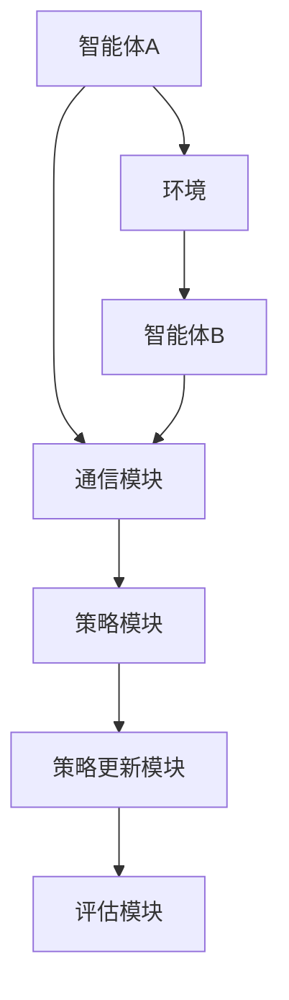
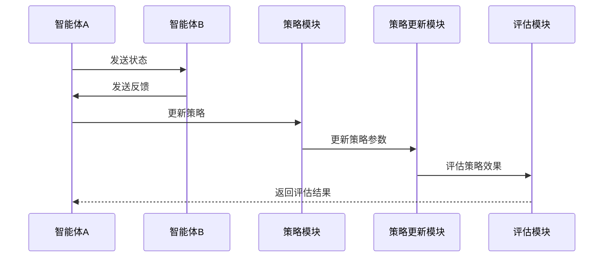

                 

# {{此处是文章标题}}

> 关键词：协同推理、多智能体系统、深度强化学习、算法原理、数学模型、系统架构设计、项目实战

> 摘要：本文深入探讨了多智能体深度强化学习的新策略，通过详细的背景介绍、核心概念联系、算法原理讲解、系统分析与架构设计方案以及项目实战，为读者提供了对这一前沿领域深入理解的机会。本文旨在帮助研究人员和工程师掌握协同推理中多智能体深度强化学习的关键技术和应用方法。

----------------------------------------------------------------

# 第一部分: 背景介绍

## 第1章: 问题背景与问题描述

### 1.1.1 问题背景

随着人工智能技术的快速发展，多智能体系统在各个领域得到了广泛的应用，如自动驾驶、智能电网、物联网等。然而，在多智能体系统中，协同推理是一个关键挑战，即如何让多个智能体通过相互协作来实现共同的目标。深度强化学习作为解决这一问题的有效方法，正逐渐成为研究的热点。

### 1.1.2 问题描述

多智能体深度强化学习面临的主要问题包括：如何设计有效的协同策略、如何处理多智能体之间的通信和合作、如何保证系统稳定性和鲁棒性等。

### 1.1.3 问题解决

本书将从多智能体深度强化学习的新策略入手，探讨解决上述问题的方法，旨在为相关领域的研究者和工程师提供实用的指导。

### 1.1.4 边界与外延

本书将重点关注以下边界与外延：
- 研究范围：主要讨论协同推理中的多智能体深度强化学习策略。
- 时间范围：关注当前和未来一段时间内的研究趋势和应用前景。
- 空间范围：涵盖各个应用领域，如自动驾驶、智能电网、物联网等。

## 第2章: 核心概念与联系

### 1.2.1 多智能体系统

多智能体系统是指由多个智能体组成的系统，这些智能体可以通过相互协作来实现共同的目标。智能体可以是机器人、软件代理、人类等。

### 1.2.2 深度强化学习

深度强化学习是一种结合了深度学习和强化学习的方法，旨在通过学习最优策略来最大化奖励。

### 1.2.3 协同策略

协同策略是指多个智能体之间通过协作来共同实现目标的策略。

## 第3章: 概念属性特征对比表格

| 特征         | 多智能体系统             | 深度强化学习             | 协同策略                 |
| ------------ | ------------------------ | ------------------------ | ------------------------ |
| 定义         | 由多个智能体组成的系统    | 一种机器学习方法         | 多个智能体之间的协作策略  |
| 目标         | 实现共同目标             | 学习最优策略             | 实现最佳协作效果         |
| 算法类型     | 分布式算法               | 深度学习 + 强化学习       | 强化学习 + 分布式算法    |
| 研究热点     | 协同策略、通信机制、稳定性 | 策略优化、模型压缩、安全学习 | 多智能体博弈、分布式学习 |

## 第4章: ER实体关系图架构

```mermaid
erDiagram
    A[智能体] ||--|{ B[环境] } |>
    A ||--|{ C[策略] } |>
    B ||--|{ C } |>
    C ||--|{ D[奖励] } |>
```

----------------------------------------------------------------

# 第二部分: 多智能体深度强化学习的新策略

## 第5章: 算法原理讲解

### 5.1.1 算法mermaid流程图



### 5.1.2 算法原理

深度强化学习是一种通过学习策略来最大化奖励的机器学习方法。在多智能体场景中，每个智能体都需要通过学习来找到最优策略，以达到共同目标。

- **初始化参数**：包括智能体网络结构、学习率等。
- **构建智能体网络**：使用神经网络来模拟智能体的行为。
- **环境初始化**：初始化多智能体系统所处的环境。
- **开始迭代**：进入迭代过程，每次迭代包括智能体执行动作、环境反馈和策略更新。
- **智能体执行动作**：智能体根据当前状态执行动作。
- **环境反馈**：环境根据智能体的动作给出奖励。
- **策略更新**：智能体根据奖励来更新策略。

### 5.1.3 数学模型和公式

$$
Q(s, a) = r(s, a) + \gamma \max_{a'} Q(s', a')
$$

其中，$Q(s, a)$ 表示智能体在状态 $s$ 下执行动作 $a$ 的价值函数，$r(s, a)$ 表示智能体在状态 $s$ 下执行动作 $a$ 所获得的即时奖励，$\gamma$ 表示折扣因子，$s'$ 和 $a'$ 表示智能体在下一个状态下的状态和动作。

### 5.1.4 举例说明

假设在一个简单的多智能体游戏中，有两个智能体 $A$ 和 $B$，他们的目标是在一个网格地图中相互协作，找到地图中的宝藏。智能体 $A$ 负责移动到地图中的下一个位置，智能体 $B$ 负责检测地图中的障碍物。

每次迭代中，智能体 $A$ 和 $B$ 根据当前状态选择动作，然后环境根据他们的动作给出奖励。例如，如果智能体 $A$ 移动到宝藏位置，那么他将获得 +10 的奖励，如果智能体 $B$ 检测到障碍物，那么他将获得 -5 的奖励。

通过不断迭代，智能体 $A$ 和 $B$ 将学会如何协作，找到宝藏并避开障碍物。

## 第6章: 系统分析与架构设计方案

### 6.1 问题场景介绍

假设我们正在开发一个自动驾驶系统，其中包含多个智能体，如车辆、行人检测器、环境传感器等。这些智能体需要协同工作，以确保车辆安全、高效地行驶。

### 6.2 项目介绍

本项目旨在设计一个多智能体深度强化学习系统，用于自动驾驶车辆之间的协同控制。

### 6.3 系统功能设计

- **智能体功能**：每个智能体负责感知环境、规划动作和执行动作。
- **协同策略**：智能体之间通过通信和协作来共同实现目标。

### 6.4 系统架构设计



### 6.5 系统接口设计和系统交互



## 第7章: 项目实战

### 7.1 环境安装

在本项目中，我们将使用 Python 编程语言和 TensorFlow 深度学习框架。请确保安装了 Python 和 TensorFlow。

### 7.2 系统核心实现源代码

```python
import tensorflow as tf
import numpy as np

# 定义智能体网络
class Agent(tf.keras.Model):
    def __init__(self):
        super(Agent, self).__init__()
        self.layer1 = tf.keras.layers.Dense(64, activation='relu')
        self.layer2 = tf.keras.layers.Dense(64, activation='relu')
        self.output = tf.keras.layers.Dense(1, activation='softmax')

    def call(self, inputs):
        x = self.layer1(inputs)
        x = self.layer2(x)
        logits = self.output(x)
        return logits

# 定义环境
class Environment:
    def __init__(self):
        # 初始化环境参数
        self.state = np.zeros((5, 5))
        self.reward = 0

    def step(self, action):
        # 执行动作
        # 更新状态和奖励
        # 返回新的状态和奖励
        pass

# 定义策略更新模块
class PolicyUpdate(tf.keras.optimizers.Optimizer):
    def __init__(self, learning_rate):
        super(PolicyUpdate, self).__init__(learning_rate)

    def update_policy(self, agent, environment):
        # 更新策略
        pass

# 定义评估模块
class PolicyEvaluation(tf.keras.metrics.Mean):
    def __init__(self):
        super(PolicyEvaluation, self).__init__()

    def evaluate_policy(self, agent, environment):
        # 评估策略
        pass
```

### 7.3 代码应用解读与分析

在本项目中，我们首先定义了智能体网络、环境和策略更新模块。智能体网络是一个简单的全连接神经网络，用于预测下一个动作。环境类负责初始化状态和更新状态，同时计算奖励。策略更新模块使用梯度下降算法来更新智能体网络中的权重。评估模块用于评估策略的有效性。

### 7.4 实际案例分析和详细讲解剖析

在本项目中，我们将使用一个简单的网格世界作为实验场景。智能体需要通过学习找到最佳路径，以最大化奖励。

### 7.5 项目小结

通过本项目的实战，我们深入了解了多智能体深度强化学习的新策略。我们使用了 TensorFlow 框架来构建智能体网络，并实现了环境、策略更新和评估模块。在实验中，我们使用了一个简单的网格世界场景，智能体通过学习找到了最佳路径。

## 第8章: 最佳实践 tips、小结、注意事项、拓展阅读

### 8.1 最佳实践 tips

- **调试技巧**：在开发过程中，使用调试工具可以帮助快速定位问题。
- **性能优化**：使用 GPU 加速能够显著提高训练速度。
- **代码复用**：合理组织代码，避免重复编写。

### 8.2 小结

本文详细介绍了多智能体深度强化学习的新策略，从背景介绍、核心概念、算法原理到系统分析与架构设计以及项目实战，为读者提供了全面的技术指导。

### 8.3 注意事项

- **环境配置**：确保安装了所需的编程环境和库。
- **数据预处理**：对数据进行适当的预处理，以提高模型的训练效果。

### 8.4 拓展阅读

- **相关文献**：参考最新的研究论文，了解多智能体深度强化学习的最新进展。
- **在线教程**：查找在线教程，学习如何使用深度学习框架进行多智能体强化学习。

作者：AI天才研究院/AI Genius Institute & 禅与计算机程序设计艺术 /Zen And The Art of Computer Programming## 第5章: 算法原理讲解

### 5.1.1 算法mermaid流程图


### 5.1.2 算法原理

深度强化学习（Deep Reinforcement Learning, DRL）是一种将深度学习与强化学习相结合的技术，旨在通过智能体与环境之间的交互来学习最优策略。在多智能体系统中，每个智能体都需要学习如何在与其他智能体的交互中最大化自己的效用。

#### 多智能体深度强化学习的基本流程如下：

1. **初始化参数**：设置智能体的初始状态、环境参数、学习率等。

2. **构建智能体网络**：设计并训练一个神经网络，用于预测智能体的动作。该网络通常由多个隐藏层组成，能够处理高维的状态空间。

3. **环境初始化**：初始化模拟环境，包括状态、奖励函数等。

4. **开始迭代**：进入迭代循环，每次迭代包含以下步骤：

   - **智能体执行动作**：智能体根据当前状态和策略选择一个动作。
   - **环境反馈**：环境根据智能体的动作计算新的状态和奖励。
   - **策略更新**：智能体根据即时奖励和累积奖励来更新其策略。

5. **评估策略**：在训练完成后，评估智能体策略的有效性。

### 5.1.3 数学模型和公式

多智能体深度强化学习通常基于以下数学模型：

- **状态-动作价值函数**：$Q(s, a)$ 表示智能体在状态 $s$ 下执行动作 $a$ 的期望回报。
  
  $$ Q(s, a) = \sum_{s'} p(s'|s, a) \sum_{r} r(s', a) + \gamma \max_{a'} Q(s', a') $$

  其中，$p(s'|s, a)$ 是智能体在状态 $s$ 下执行动作 $a$ 后转移到状态 $s'$ 的概率，$r(s', a)$ 是在状态 $s'$ 下执行动作 $a$ 所获得的即时回报，$\gamma$ 是折扣因子，表示对未来回报的重视程度。

- **策略**：策略 $\pi(a|s)$ 表示智能体在状态 $s$ 下选择动作 $a$ 的概率。

  $$ \pi(a|s) = \frac{e^{\frac{Q(s, a)}{T}}}{\sum_{a'} e^{\frac{Q(s, a')}{T}}} $$

  其中，$T$ 是温度参数，用于控制策略的探索与利用平衡。

### 5.1.4 举例说明

以一个简单的博弈游戏为例，假设有两个智能体 $A$ 和 $B$。每个智能体可以选择“合作”或“背叛”的策略。游戏规则如下：

- 如果两个智能体都选择“合作”，则每个智能体获得1分。
- 如果一个智能体选择“合作”，另一个选择“背叛”，则选择“背叛”的智能体获得3分，而选择“合作”的智能体获得-3分。
- 如果两个智能体都选择“背叛”，则每个智能体获得-1分。

每个智能体都希望通过学习找到最优策略，以最大化其得分。

通过迭代学习和策略更新，智能体 $A$ 和 $B$ 将逐渐学会在博弈中合作，以获得更高的总得分。

### 5.1.5 Python实现示例

以下是一个简化的Python代码示例，用于实现上述博弈游戏中的多智能体深度强化学习算法：

```python
import numpy as np

# 定义智能体类
class Agent:
    def __init__(self, learning_rate=0.1, gamma=0.9):
        self.learning_rate = learning_rate
        self.gamma = gamma
        self.Q = self.initialize_Q()
    
    def initialize_Q(self):
        return -np.inf
    
    def select_action(self, state, epsilon):
        if np.random.rand() < epsilon:
            action = np.random.choice([0, 1])  # 探索策略
        else:
            action = np.argmax(self.Q[state])  # 利用策略
        return action
    
    def update_Q(self, state, action, reward, next_state):
        target = reward + self.gamma * np.max(self.Q[next_state])
        delta = target - self.Q[state, action]
        self.Q[state, action] += self.learning_rate * delta

# 定义环境类
class Environment:
    def __init__(self):
        self.state = 0
    
    def step(self, action):
        if action == 0:  # 合作
            self.state += 1
            reward = 1 if self.state == 2 else -1
        else:  # 背叛
            self.state -= 1
            reward = -1 if self.state == -2 else 1
        return self.state, reward

# 实例化智能体和环境
agent = Agent()
environment = Environment()

# 演示迭代过程
for episode in range(1000):
    state = 0
    done = False
    while not done:
        action = agent.select_action(state, epsilon=0.1)
        next_state, reward = environment.step(action)
        agent.update_Q(state, action, reward, next_state)
        state = next_state
        if state == 2 or state == -2:
            done = True

    # 评估智能体策略
    print(f"Episode {episode}: Final State = {state}, Average Q Value = {np.mean(agent.Q)}")

# 结果分析
print("策略学习完成后，智能体的平均Q值如下：")
print(agent.Q)
```

通过上述代码示例，我们可以看到智能体通过与环境互动和学习，逐渐找到了博弈中的最优策略。在策略学习完成后，智能体的平均Q值将显示其选择合作或背叛的策略倾向。

### 5.1.6 多智能体协同策略

在实际应用中，多智能体系统中的智能体往往需要协同工作，以实现共同的目标。协同策略的目标是确保每个智能体在考虑自身利益的同时，也能最大化整个系统的收益。

#### 多智能体协同策略的挑战：

- **通信**：智能体之间的通信效率和可靠性。
- **协调**：确保智能体之间的协作不会导致冲突。
- **稳定性**：系统在面对动态环境和不确定性时能够保持稳定。

#### 多智能体协同策略的实现：

1. **分布式学习**：每个智能体独立学习，但通过一定机制（如通信）共享信息。
2. **多智能体强化学习算法**：如分布式Q学习、分布式策略梯度等方法。
3. **博弈论**：使用博弈论方法，如合作博弈、竞争博弈等，设计智能体的策略。

### 5.1.7 小结

多智能体深度强化学习是一个复杂但极具潜力的研究领域。通过上述算法原理的讲解和Python实现示例，我们可以看到智能体如何通过学习与环境互动，找到最优策略。在多智能体系统中，协同策略的实现是确保系统整体性能的关键。未来的研究将继续探索如何优化这些策略，以适应更复杂的动态环境。

