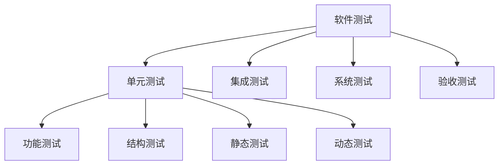
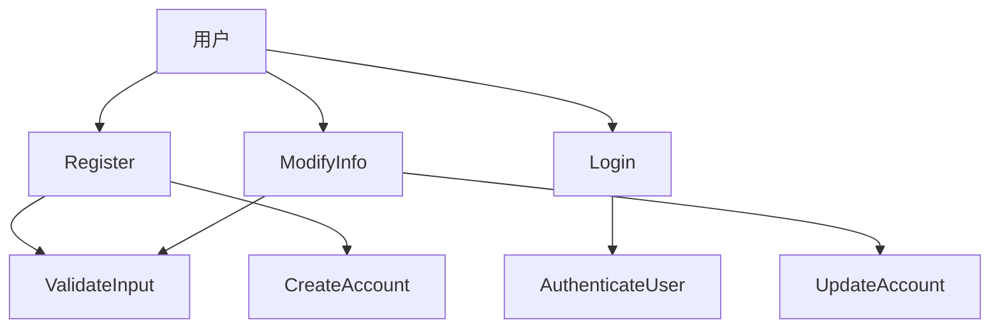
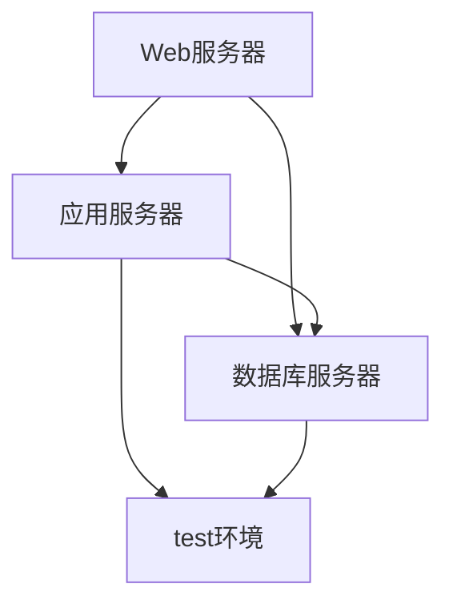
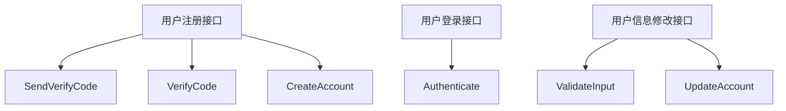
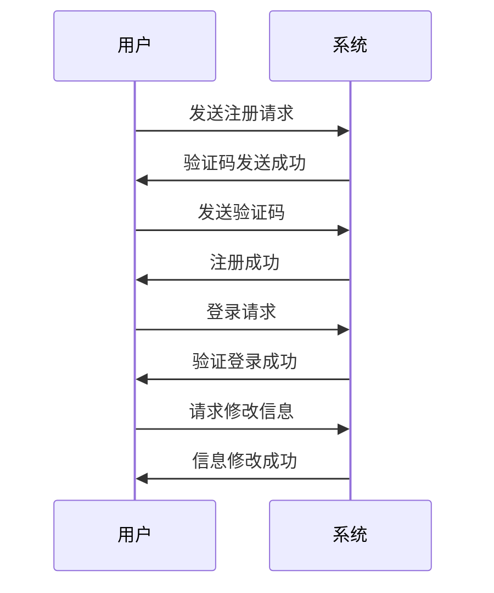

                 

### 单元测试基础理论

单元测试是软件开发过程中至关重要的一环，其重要性不可低估。本文将从单元测试的定义、发展历程、目标与原则等方面进行详细探讨，旨在帮助读者对单元测试有更深入的理解。

#### 1.1 单元测试的定义与重要性

**单元测试**（Unit Testing）是指对软件中的最小可测试单元进行检查和验证。这里的“最小可测试单元”通常是指函数、方法、类等。通过单元测试，我们可以确保每一个单元都按照预期工作，从而提高整个软件系统的质量。

**重要性**：

1. **提高代码质量**：单元测试能够及时发现并修复代码中的缺陷，从而提高代码的质量和可靠性。
2. **降低维护成本**：通过单元测试，可以确保每次代码更改后都不会引入新的错误，从而降低后续的维护成本。
3. **增强代码可读性**：单元测试需要明确地定义每个单元的功能，有助于提高代码的可读性。
4. **提供调试支持**：当出现问题时，单元测试能够快速定位错误发生的位置，提供有效的调试支持。

#### 1.2 单元测试的发展历程

单元测试的概念最早可以追溯到1970年代。当时，软件开发还处于早期阶段，程序员们开始意识到测试的重要性。以下是一些重要的发展历程：

- **1970年代初**：程序员开始编写简单的测试代码来检查函数的正确性。
- **1980年代**：随着面向对象编程的发展，单元测试的概念逐渐成熟，各种单元测试框架开始出现。
- **1990年代**：自动化测试工具的出现使得单元测试的执行变得更加高效。
- **2000年代**：敏捷开发方法的兴起，单元测试被广泛接受和推广，成为软件开发流程中不可或缺的一环。

#### 1.3 单元测试的目标与原则

**目标**：

- 确保每个单元按照预期工作。
- 检测和修复代码中的缺陷。
- 验证代码的可读性和可维护性。

**原则**：

1. **独立性**：每个单元都应该能够独立地进行测试，不依赖于其他单元。
2. **完整性**：每个单元都应该被全面地测试，确保所有可能的执行路径都被覆盖。
3. **自动化**：单元测试应该能够自动化执行，以提高效率。
4. **可重复性**：单元测试的结果应该是可重复的，确保测试结果的一致性。

**小结**：

单元测试是构建可靠软件的基石，其定义、发展历程和目标与原则都显得尤为重要。在接下来的章节中，我们将进一步探讨单元测试的核心概念、方法论和实践策略。

#### 1.4 软件质量与测试的关系

软件质量是指软件系统在实现预期功能的同时，满足用户需求和期望的程度。而测试是确保软件质量的重要手段之一。以下是软件质量与测试之间的关系：

1. **测试的目的**：测试的目的是发现软件中的缺陷和错误，从而提高软件的质量。通过测试，可以确保软件在交付给用户之前是可靠和稳定的。

2. **测试与质量的关系**：测试是软件质量保证的关键环节。高质量的测试能够有效地发现和修复缺陷，从而提高软件的质量。而低质量的测试可能无法发现关键缺陷，导致软件交付时存在隐患。

3. **质量模型**：在软件工程中，常用的质量模型包括ISO/IEC 25010质量模型、McCall质量模型等。这些模型都强调了测试在确保软件质量中的重要性。

4. **测试的类型**：软件测试分为多种类型，包括单元测试、集成测试、系统测试、验收测试等。单元测试是其中最基础的一种，它主要针对软件中的最小可测试单元进行检查。

5. **测试与开发的关系**：测试与开发是相辅相成的。在开发过程中，开发者需要编写测试代码来验证其功能的正确性。同时，测试结果可以为开发过程提供反馈，帮助开发者改进代码。

**小结**：

软件质量与测试密切相关。高质量的测试是确保软件质量的重要保障。通过理解测试与质量之间的关系，我们可以更有效地进行软件测试，提高软件系统的可靠性和稳定性。

#### 1.5 软件缺陷分类与起源

软件缺陷是指软件系统在功能、性能、可靠性等方面与预期要求不一致的现象。了解软件缺陷的分类及其起源对于进行有效的单元测试至关重要。

**1.5.1 软件缺陷分类**

软件缺陷可以分为以下几类：

1. **功能缺陷**：功能缺陷是指软件未能实现预期功能或实现了不应当实现的功能。例如，一个注册系统未能正确处理密码加密，导致用户注册失败。

2. **性能缺陷**：性能缺陷是指软件在运行过程中未能达到预期的性能要求。例如，一个电子商务网站在高峰期响应时间过长，导致用户体验差。

3. **可靠性缺陷**：可靠性缺陷是指软件在运行过程中出现意外中断或异常行为。例如，一个银行系统的数据库在处理大量交易时出现崩溃。

4. **界面缺陷**：界面缺陷是指软件的用户界面与用户期望不一致。例如，一个图形用户界面（GUI）上的按钮位置不合理，导致用户无法顺利完成操作。

5. **安全缺陷**：安全缺陷是指软件在安全性方面存在漏洞，可能导致数据泄露或系统被攻击。例如，一个在线支付系统未能正确处理SQL注入攻击，导致用户支付信息泄露。

**1.5.2 软件缺陷的起源**

软件缺陷的起源可以归结为以下几个方面：

1. **需求分析**：需求分析不准确或不完整可能导致软件在功能上出现缺陷。例如，如果一个电商平台的订单处理流程需求描述不明确，可能会导致订单处理失败。

2. **设计**：设计阶段的不完善可能导致软件在结构上存在缺陷。例如，一个复杂的业务逻辑如果没有合理的设计，可能会导致代码冗长、难以维护。

3. **编码**：编码阶段出现的缺陷通常是由于程序员对编程语言和开发工具的不熟悉，或者因为疲劳和疏忽。例如，一个新手程序员在编写代码时可能会忘记对某些边界情况进行处理。

4. **测试**：测试不足或测试质量不高可能导致软件在交付前未能发现所有缺陷。例如，如果一个测试人员仅对部分功能进行了测试，可能会遗漏其他重要的缺陷。

5. **部署**：部署过程中可能因为环境配置不正确、软件依赖关系未处理好等原因导致软件缺陷。例如，一个软件在测试环境中运行正常，但在生产环境中由于某些库的版本差异而出现问题。

**小结**：

了解软件缺陷的分类和起源有助于我们更有效地进行单元测试。通过深入分析缺陷的来源，我们可以采取相应的措施来减少缺陷的产生，从而提高软件系统的质量和可靠性。

#### 1.6 软件缺陷的传播机制

软件缺陷的传播机制是指缺陷如何在软件系统中传播和扩散，导致更多的缺陷出现。理解这一机制对于进行有效的缺陷预防和控制至关重要。

**1.6.1 缺陷的传播途径**

1. **代码复用**：如果一个缺陷存在于某个模块中，并且这个模块被其他多个模块复用，那么缺陷也可能会传播到这些模块中。

2. **依赖关系**：软件模块之间存在依赖关系，一个模块中的缺陷可能会通过依赖关系影响到其他模块。

3. **共享资源**：多个模块可能共享某些资源，如数据库连接、文件系统等。如果一个模块的缺陷导致资源使用不当，可能会影响到其他模块的运行。

4. **接口调用**：模块之间通过接口进行交互，一个模块的缺陷可能会通过接口传播到其他模块。

**1.6.2 缺陷传播的链式反应**

1. **初始缺陷**：软件中的一个缺陷首先被发现并修复。

2. **修复引入**：在修复初始缺陷的过程中，可能会引入新的缺陷。

3. **链式传播**：修复后的缺陷通过代码复用、依赖关系、共享资源、接口调用等途径传播到其他模块，导致更多的缺陷出现。

4. **再次修复**：新的缺陷被发现后，需要再次进行修复。

5. **持续传播**：如果没有有效的缺陷控制措施，缺陷的传播可能会形成一个持续循环，导致软件质量不断下降。

**1.6.3 缺陷传播的控制策略**

1. **早期发现**：通过单元测试、代码审查等手段，在缺陷传播初期发现并修复缺陷，减少缺陷的传播机会。

2. **代码隔离**：通过模块化设计和合理的依赖管理，减少模块之间的耦合，降低缺陷传播的风险。

3. **静态代码分析**：使用静态代码分析工具对代码进行全面检查，发现潜在缺陷和代码质量问题，防止缺陷传播。

4. **动态测试**：通过动态测试，如集成测试、系统测试等，对整个软件系统进行全面验证，确保缺陷不会在系统层面传播。

5. **持续集成与持续交付**：通过持续集成和持续交付，确保每次代码更改后都经过严格的测试，及时发现并修复缺陷，防止缺陷积累和传播。

**小结**：

软件缺陷的传播机制是一个复杂的过程，通过理解缺陷的传播途径和链式反应，我们可以采取有效的控制策略来预防和控制缺陷的传播，从而提高软件系统的质量和稳定性。

#### 1.7 单元测试方法论

单元测试方法论是指在进行单元测试时遵循的一系列步骤和策略，以确保测试的全面性和有效性。以下是几种常见的单元测试方法论：

**1.7.1 白盒测试与黑盒测试**

**白盒测试**（White Box Testing）是指测试人员具备对被测试代码内部结构、逻辑和流程的了解，通过检查代码路径、条件、循环等来发现缺陷。常用的白盒测试方法包括：

- **路径测试**：通过设计不同的测试用例，确保所有的代码路径都被覆盖到。
- **条件测试**：检查条件表达式的所有可能取值。
- **循环测试**：测试循环的边界条件和执行次数。

**黑盒测试**（Black Box Testing）是指测试人员不关心代码内部结构，仅通过输入输出关系来测试系统的功能。常用的黑盒测试方法包括：

- **功能测试**：验证系统是否按照需求文档实现了预期的功能。
- **等价类划分**：将输入数据分为若干等价类，只选取代表性的数据进行测试。
- **边界值分析**：特别关注输入和输出的边界值，因为这些位置容易出现缺陷。

**1.7.2 单元测试策略与技巧**

- **代码覆盖率**：通过统计代码覆盖率来评估测试的全面性，常用的代码覆盖率包括语句覆盖率、分支覆盖率和条件覆盖率等。
- **测试用例设计**：设计合理的测试用例是单元测试的关键。常用的测试用例设计方法包括等价类划分、边界值分析、错误推测等。
- **测试环境**：为每个单元测试创建独立的环境，避免不同测试之间的干扰。
- **自动化测试**：通过自动化测试工具（如JUnit、NUnit等）来执行单元测试，提高测试效率。

**1.7.3 单元测试自动化**

**自动化测试**（Automated Testing）是指通过编写脚本或使用自动化测试工具来执行测试，相比于手动测试，具有以下优势：

- **效率高**：自动化测试可以快速执行大量的测试用例，提高测试效率。
- **一致性**：自动化测试结果具有一致性，减少了人为因素导致的错误。
- **可重复性**：自动化测试可以多次执行，确保测试结果的可重复性。

常用的自动化测试工具包括Selenium、Jenkins、Cypress等。

**小结**：

单元测试方法论包括白盒测试与黑盒测试、单元测试策略与技巧以及单元测试自动化。通过合理选择和运用这些方法，我们可以确保单元测试的全面性和有效性，提高软件系统的质量。

#### 1.8 单元测试的概念属性特征对比

为了更好地理解单元测试，我们需要对其与其他测试类型的特征进行对比。以下是功能测试、结构测试、静态测试和动态测试的概念属性特征对比。

**1.8.1 功能测试与结构测试对比**

- **功能测试**（Functional Testing）：
  - 目标：验证系统功能是否符合需求。
  - 方法：通过输入数据进行功能验证。
  - 适用场景：主要用于测试系统的功能模块。
  - 优点：直观、易于理解。
  - 缺点：难以检测代码内部逻辑问题。

- **结构测试**（Structural Testing）：
  - 目标：验证代码结构和逻辑的正确性。
  - 方法：通过分析代码结构和逻辑路径进行测试。
  - 适用场景：主要用于测试代码的内部逻辑。
  - 优点：可以检测代码中的逻辑错误。
  - 缺点：难以直接验证系统的功能。

**1.8.2 静态测试与动态测试对比**

- **静态测试**（Static Testing）：
  - 目标：在不执行代码的情况下检测潜在缺陷。
  - 方法：通过代码审查、静态代码分析等方式进行。
  - 适用场景：用于初步检测代码质量，适合在开发早期阶段进行。
  - 优点：速度快、成本较低。
  - 缺点：难以发现运行时的问题。

- **动态测试**（Dynamic Testing）：
  - 目标：在代码执行过程中检测缺陷。
  - 方法：通过运行代码并分析输出结果进行。
  - 适用场景：用于验证代码的功能和性能。
  - 优点：可以直接发现运行时的问题。
  - 缺点：成本较高、效率较低。

**1.8.3 ER实体关系图架构**

单元测试的ER实体关系图可以帮助我们理解单元测试在整个软件测试过程中的位置和作用。以下是一个简化的ER实体关系图：



在这个ER实体关系图中，软件测试是一个总体概念，包括单元测试、集成测试、系统测试和验收测试。单元测试是软件测试中最基础的一环，通过单元测试可以确保每个模块的功能和结构符合预期。功能测试和结构测试是单元测试的两个主要分支，分别从功能和结构的角度对模块进行验证。静态测试和动态测试是测试方法的分类，静态测试主要用于初步检测代码质量，动态测试则用于验证代码的功能和性能。

**小结**：

通过对比功能测试与结构测试、静态测试与动态测试，以及ER实体关系图，我们可以更深入地理解单元测试的概念属性特征。这些对比和架构设计有助于我们在实际开发过程中选择合适的测试方法，确保软件质量。

### 核心概念原理

在深入探讨单元测试之前，我们需要明确几个核心概念，并对比不同类型测试的属性特征，以便更好地理解和应用单元测试。

#### 2.1 功能测试与结构测试对比

**功能测试**（Functional Testing）：
- **定义**：功能测试主要关注软件是否按照需求文档实现了预期的功能。
- **方法**：通过设计输入数据并观察输出结果，验证系统功能。
- **优势**：直观、易于理解，能够有效地发现功能性的缺陷。
- **劣势**：难以发现代码内部逻辑错误。

**结构测试**（Structural Testing）：
- **定义**：结构测试侧重于验证代码的结构和逻辑是否符合设计规范。
- **方法**：通过分析代码路径、条件分支等内部结构，检查逻辑的正确性。
- **优势**：能够深入检测代码中的逻辑错误，确保代码结构合理。
- **劣势**：难以直接验证系统功能，更多关注内部逻辑。

**对比**：
- **目标不同**：功能测试关注功能实现，结构测试关注代码逻辑。
- **测试方法**：功能测试侧重于输入输出，结构测试侧重于代码路径和条件。

#### 2.2 静态测试与动态测试对比

**静态测试**（Static Testing）：
- **定义**：静态测试不执行代码，通过代码审查和静态分析工具检测潜在缺陷。
- **方法**：如代码审查、静态代码分析等。
- **优势**：测试成本低、速度快，适合在开发早期阶段使用。
- **劣势**：难以发现运行时的问题，无法验证实际功能。

**动态测试**（Dynamic Testing）：
- **定义**：动态测试在代码执行过程中进行，通过运行代码并观察输出结果来检测缺陷。
- **方法**：如单元测试、集成测试等。
- **优势**：可以直接验证代码的功能和性能，发现运行时的问题。
- **劣势**：测试成本较高、执行时间长。

**对比**：
- **执行时机**：静态测试在开发早期进行，动态测试在开发后期进行。
- **测试深度**：静态测试侧重于代码质量和潜在问题，动态测试侧重于功能和性能。

#### 2.3 单元测试的ER实体关系图架构

为了更好地理解单元测试在整个软件测试过程中的位置和作用，我们可以使用ER（Entity-Relationship）实体关系图来表示。


在这个ER实体关系图中：
- **软件测试**是总的测试分类。
- **单元测试**作为基础测试，确保每个最小单元的功能和结构正确。
- **功能测试**和**结构测试**是单元测试的两个分支，分别从功能和结构角度进行验证。
- **静态测试**和**动态测试**是测试方法的分类，分别用于代码审查和执行时的缺陷检测。

**小结**：

通过对比功能测试与结构测试、静态测试与动态测试，以及单元测试的ER实体关系图，我们可以更全面地理解单元测试的核心概念和作用。这有助于我们在实际开发过程中选择合适的测试策略，提高软件质量。

### 单元测试方法论

在软件开发过程中，单元测试是确保代码质量的关键环节。有效的单元测试方法论能够帮助我们全面地检测和修复代码缺陷，从而提高软件的可靠性。本文将详细探讨几种常用的单元测试方法论，包括白盒测试与黑盒测试、单元测试策略与技巧、以及单元测试自动化。

#### 3.1 白盒测试与黑盒测试

**白盒测试**（White Box Testing）：
- **定义**：白盒测试是一种结构测试，测试人员需要了解被测试代码的内部结构和逻辑，通过检查代码路径、条件、循环等来发现缺陷。
- **方法**：路径测试、条件测试、循环测试等。
- **适用场景**：适合测试代码内部逻辑和复杂结构，特别是那些需要深入检查代码实现细节的情况。

**黑盒测试**（Black Box Testing）：
- **定义**：黑盒测试是一种功能测试，测试人员不需要了解代码内部实现，仅通过输入输出关系来测试系统的功能。
- **方法**：功能测试、等价类划分、边界值分析等。
- **适用场景**：适合验证系统功能是否符合需求，主要用于测试系统的功能模块。

**白盒测试与黑盒测试的对比**：
- **目标**：白盒测试关注代码内部逻辑，黑盒测试关注系统功能。
- **测试方法**：白盒测试侧重于代码结构和路径，黑盒测试侧重于输入输出关系。
- **适用性**：白盒测试适用于需要深入检查代码内部逻辑的场景，黑盒测试适用于验证系统功能是否符合需求。

#### 3.2 单元测试策略与技巧

**覆盖率**：
- **定义**：覆盖率是衡量测试全面性的指标，常用的覆盖率包括语句覆盖率、分支覆盖率和条件覆盖率。
- **应用**：通过计算代码覆盖率达到一定比例，确保代码路径被全面测试。
- **技巧**：设计覆盖率高且具代表性的测试用例，优先覆盖关键路径和潜在缺陷区域。

**测试用例设计**：
- **定义**：测试用例是用于验证特定功能的测试代码和数据。
- **设计方法**：等价类划分、边界值分析、错误推测等。
- **技巧**：设计多样化的测试用例，覆盖所有可能的输入情况和边界情况，提高测试的全面性。

**测试环境**：
- **定义**：测试环境是指用于执行单元测试的独立环境，确保测试结果不受外部干扰。
- **技巧**：创建独立的环境，包括依赖库、配置文件等，避免不同测试之间的干扰。

**自动化测试**：
- **定义**：自动化测试是通过编写脚本或使用自动化测试工具执行测试。
- **优势**：提高测试效率、减少人为错误、确保测试结果的一致性。
- **工具**：JUnit、NUnit、Selenium等。
- **技巧**：编写可维护的测试脚本，合理组织测试流程，确保自动化测试的有效性。

#### 3.3 单元测试自动化

**自动化测试**（Automated Testing）：
- **定义**：自动化测试是通过自动化工具执行测试，提高测试效率和一致性。
- **工具**：
  - **JUnit**：Java语言的单元测试框架。
  - **NUnit**：.NET语言的单元测试框架。
  - **Selenium**：用于Web应用的自动化测试工具。
- **流程**：
  - **测试设计**：设计测试用例，确定测试目标。
  - **测试脚本编写**：编写自动化测试脚本。
  - **测试执行**：执行自动化测试脚本。
  - **结果分析**：分析测试结果，修复缺陷。

**自动化测试的优势**：
- **效率高**：自动化测试可以快速执行大量的测试用例，提高测试效率。
- **一致性**：自动化测试结果具有一致性，减少了人为因素导致的错误。
- **可重复性**：自动化测试可以多次执行，确保测试结果的可重复性。

**自动化测试的挑战**：
- **测试脚本维护**：自动化测试脚本需要定期更新和维护，以适应代码的变化。
- **测试覆盖不足**：如果测试脚本设计不合理，可能导致测试覆盖不足。

**小结**：

单元测试方法论包括白盒测试与黑盒测试、单元测试策略与技巧、以及单元测试自动化。通过合理选择和运用这些方法，我们可以确保单元测试的全面性和有效性，提高软件系统的质量。在下一节中，我们将进一步探讨单元测试的核心概念和属性特征，以帮助我们更好地理解和应用单元测试。

### 核心概念原理

在深入探讨单元测试之前，我们需要明确几个核心概念，并对比不同类型测试的属性特征，以便更好地理解和应用单元测试。

#### 3.4 单元测试的概念属性特征对比

为了更好地理解单元测试，我们需要将其与其他测试类型进行对比。以下是功能测试、结构测试、静态测试和动态测试的概念属性特征对比。

**功能测试**（Functional Testing）：
- **定义**：功能测试主要关注软件是否按照需求文档实现了预期的功能。
- **方法**：通过设计输入数据并观察输出结果，验证系统功能。
- **优势**：直观、易于理解，能够有效地发现功能性的缺陷。
- **劣势**：难以发现代码内部逻辑错误。

**结构测试**（Structural Testing）：
- **定义**：结构测试侧重于验证代码的结构和逻辑是否符合设计规范。
- **方法**：通过分析代码路径、条件分支等内部结构，检查逻辑的正确性。
- **优势**：能够深入检测代码中的逻辑错误，确保代码结构合理。
- **劣势**：难以直接验证系统功能，更多关注内部逻辑。

**静态测试**（Static Testing）：
- **定义**：静态测试不执行代码，通过代码审查和静态代码分析检测潜在缺陷。
- **方法**：如代码审查、静态代码分析等。
- **优势**：速度快、成本低，适合在开发早期阶段使用。
- **劣势**：难以发现运行时的问题，无法验证实际功能。

**动态测试**（Dynamic Testing）：
- **定义**：动态测试在代码执行过程中检测缺陷，通过运行代码并分析输出结果。
- **方法**：如单元测试、集成测试等。
- **优势**：可以直接验证代码的功能和性能，发现运行时的问题。
- **劣势**：成本较高、执行时间长。

**对比**：

| 测试类型 | 定义 | 方法 | 优势 | 劣势 |
| --- | --- | --- | --- | --- |
| 功能测试 | 验证系统功能 | 输入数据验证输出结果 | 直观、易于理解 | 难以发现内部逻辑错误 |
| 结构测试 | 验证代码结构和逻辑 | 分析代码路径和条件 | 深入检测逻辑错误 | 难以验证系统功能 |
| 静态测试 | 不执行代码，检测潜在缺陷 | 代码审查、静态分析 | 速度快、成本低 | 难以发现运行时问题 |
| 动态测试 | 运行代码，检测缺陷 | 执行代码并分析输出结果 | 验证功能和性能 | 成本高、执行时间长 |

#### 3.5 单元测试的ER实体关系图架构

为了更好地理解单元测试在整个软件测试过程中的位置和作用，我们可以使用ER（Entity-Relationship）实体关系图来表示。


在这个ER实体关系图中：
- **软件测试**是总的测试分类。
- **单元测试**作为基础测试，确保每个最小单元的功能和结构正确。
- **功能测试**和**结构测试**是单元测试的两个分支，分别从功能和结构角度进行验证。
- **静态测试**和**动态测试**是测试方法的分类，分别用于代码审查和执行时的缺陷检测。

**小结**：

通过对比功能测试与结构测试、静态测试与动态测试，以及单元测试的ER实体关系图，我们可以更全面地理解单元测试的核心概念和作用。这有助于我们在实际开发过程中选择合适的测试策略，提高软件质量。

### 单元测试设计方法

单元测试的设计方法是指在软件开发过程中，为了确保每个模块的功能和结构正确，所采用的测试方法和策略。有效的单元测试设计方法能够帮助我们全面地检测和修复代码缺陷，从而提高软件的质量。以下是几种常用的单元测试设计方法：等价类划分法、边界值分析法和错误推测法。

#### 4.1 等价类划分法

**等价类划分法**（Equivalence Partitioning）是一种常见的黑盒测试方法，其核心思想是将输入数据划分为若干个等价类，然后只选取每个等价类中的一个代表性的数据进行测试。

**定义**：等价类划分法是将所有可能的输入数据划分为若干个等价类，使得每个等价类内部的输入数据对于程序产生相同的输出结果，而不同等价类之间的输入数据则会导致不同的输出结果。

**步骤**：

1. **识别等价类**：根据需求文档和功能说明，识别输入数据的所有可能取值，并将这些取值划分为若干个等价类。常见的等价类包括有效等价类和无效等价类。
   - **有效等价类**：输入数据的取值在规定的范围内，能够被程序正确处理的输入。
   - **无效等价类**：输入数据的取值超出规定的范围，不能被程序正确处理的输入。

2. **选择测试用例**：从每个等价类中选择一个代表性的数据进行测试。对于有效等价类，通常选择边界值和中间值；对于无效等价类，通常选择边界值。

**优点**：等价类划分法能够有效地减少测试用例的数量，提高测试效率。

**示例**：

假设我们正在测试一个注册功能，该功能要求用户输入用户名和密码。以下是用户名的等价类划分：

- **有效等价类**：
  - 用户名长度为6个字符。
  - 用户名长度为8个字符。
  - 用户名由字母和数字组成。

- **无效等价类**：
  - 用户名长度小于5个字符。
  - 用户名长度大于10个字符。
  - 用户名包含特殊字符。

我们只需从每个等价类中选择一个代表性的数据进行测试，例如：
- 有效等价类中的用户名长度为6个字符：`abcdef`。
- 无效等价类中的用户名长度小于5个字符：`abc`。

#### 4.2 边界值分析法

**边界值分析法**（Boundary Value Analysis）是另一种常见的黑盒测试方法，其核心思想是特别关注输入和输出的边界值，因为这些位置容易出现缺陷。

**定义**：边界值分析法是针对输入和输出的边界值设计测试用例，这些边界值包括最小值、最大值以及边界条件。

**步骤**：

1. **识别边界值**：根据需求文档和功能说明，识别输入和输出的所有边界值。
   - **输入边界值**：例如，一个输入范围是1到10的整数，边界值包括1、10以及介于两者之间的值。
   - **输出边界值**：例如，一个函数的输出范围是0到100的整数，边界值包括0、100以及介于两者之间的值。

2. **设计测试用例**：对于每个边界值，设计一个测试用例进行测试。

**优点**：边界值分析法能够提高测试的全面性，特别关注容易出错的边界位置。

**示例**：

假设我们正在测试一个搜索功能，该功能允许用户输入关键字进行搜索。以下是关键字的边界值分析：

- **输入边界值**：
  - 最小长度：一个字符。
  - 最大长度：100个字符。
  - 边界长度：50个字符。

- **输出边界值**：
  - 最小结果数：0个结果。
  - 最大结果数：1000个结果。
  - 边界结果数：500个结果。

我们设计以下测试用例：
- 输入边界值最小长度：`a`。
- 输入边界值最大长度：`Lorem ipsum dolor sit amet...`（长度为100个字符）。
- 输入边界值边界长度：`Lorem ipsum...`（长度为50个字符）。

#### 4.3 错误推测法

**错误推测法**（Error Guessing）是一种基于经验和直觉的测试方法，测试人员根据对系统功能和行为的理解，推测可能出现的错误并设计测试用例。

**定义**：错误推测法是测试人员根据对系统功能和行为的理解，推测可能出现的错误并设计测试用例。

**步骤**：

1. **分析系统功能和行为**：深入理解系统的功能和预期行为，识别可能出现的错误场景。

2. **设计测试用例**：根据推测的错误场景，设计相应的测试用例进行验证。

**优点**：错误推测法能够快速发现系统中的潜在缺陷，特别适用于复杂系统的测试。

**示例**：

假设我们正在测试一个支付功能，该功能允许用户使用信用卡支付。以下是可能出现的错误场景：

- **错误场景**：用户输入了错误的信用卡信息。
  - 测试用例：输入无效的信用卡号码，例如`1234567890123456`。
- **错误场景**：用户的信用卡余额不足。
  - 测试用例：输入足够的金额，但余额不足，例如`1000`元，但用户余额为`500`元。

**小结**：

等价类划分法、边界值分析法和错误推测法是几种常用的单元测试设计方法。通过合理运用这些方法，我们可以设计出全面且有效的测试用例，确保软件系统的质量和可靠性。

### 单元测试用例编写技巧

编写有效的单元测试用例是确保软件质量的关键步骤。为了达到这一目标，我们需要遵循一些编写原则和步骤，并对测试用例进行评估与优化。以下将详细探讨这些内容。

#### 6.1 测试用例的编写原则

**1. 完整性**：测试用例应覆盖所有可能的输入情况和边界条件，确保代码的各个部分都经过验证。

**2. 代表性**：选择具有代表性的测试数据，尽量涵盖各种典型情况和极端情况，以提高测试的全面性。

**3. 独立性**：每个测试用例应独立于其他测试用例，确保一次测试执行不会影响其他测试的执行结果。

**4. 可读性**：测试用例的描述应清晰简洁，便于其他开发者理解和维护。

**5. 可重复性**：测试用例应在任何环境中都能重复执行，并得到一致的结果。

**6. 可维护性**：测试用例应易于更新和维护，以适应代码的变更和需求的变化。

#### 6.2 测试用例的编写步骤

**1. 需求分析**：详细分析需求文档和设计文档，理解每个功能模块的预期行为和输入输出。

**2. 设计测试用例**：根据需求分析结果，设计测试用例，包括输入数据、预期输出和测试条件。

**3. 编写测试用例**：将设计好的测试用例转化为具体的测试脚本或测试代码，并确保其可执行。

**4. 验证测试用例**：执行测试用例，验证其是否能够正确地发现缺陷，并根据结果调整测试用例。

**5. 记录测试结果**：详细记录测试结果，包括通过、失败和未执行的测试用例，以便后续分析。

**6. 维护测试用例**：根据代码变更和需求变化，及时更新和维护测试用例。

#### 6.3 测试用例的评估与优化

**1. 覆盖率分析**：通过分析测试覆盖率（如语句覆盖率、分支覆盖率等），评估测试的全面性。如果覆盖率较低，需要增加测试用例。

**2. 缺陷发现效率**：评估测试用例在缺陷发现方面的效率。如果测试用例未能有效发现缺陷，需要重新设计测试用例。

**3. 维护成本**：评估测试用例的维护成本，包括编写、执行和更新的成本。如果维护成本过高，需要优化测试用例。

**4. 测试报告**：编写详细的测试报告，包括测试覆盖率、缺陷发现情况、优化建议等，以便于后续的改进。

**优化策略**：

- **减少冗余**：消除重复的测试用例，优化测试数据。
- **增加针对性**：针对关键功能和易出错区域设计更具体的测试用例。
- **自动化**：采用自动化工具执行测试，提高测试效率和一致性。
- **定期更新**：定期审查和更新测试用例，以适应代码和需求的变化。

**小结**：

编写有效的单元测试用例需要遵循一系列原则和步骤，并进行持续的评估与优化。通过合理的测试用例设计，我们可以确保软件系统的质量和可靠性，提高开发效率。

### 单元测试执行与结果分析

在完成单元测试用例的编写后，执行测试用例和分析测试结果是确保软件质量的关键步骤。以下是单元测试执行策略、结果分析和测试报告编写的详细探讨。

#### 7.1 单元测试执行策略

**1. 执行环境准备**：在执行单元测试前，确保测试环境与生产环境保持一致。包括安装必要的依赖库、配置测试数据等，以确保测试结果的准确性。

**2. 测试自动化**：通过编写自动化测试脚本或使用现成的测试工具（如JUnit、NUnit等），批量执行测试用例，提高测试效率。

**3. 并行执行**：对于大规模的单元测试集，可以使用并行执行策略，将测试任务分配到多个处理器或节点上，以缩短整体测试时间。

**4. 回归测试**：在每次代码变更后，执行回归测试，确保新代码不会引入新的缺陷。

**5. 测试结果记录**：在测试执行过程中，记录每个测试用例的执行状态（通过、失败、未执行）和具体错误信息，以便后续分析。

#### 7.2 单元测试结果分析

**1. 故障报告**：对于失败的测试用例，生成详细的故障报告，包括错误信息、执行步骤、预期结果和实际结果等，便于定位和修复缺陷。

**2. 覆盖率分析**：统计测试覆盖率，如语句覆盖率、分支覆盖率等，评估测试的全面性。如果覆盖率较低，需要补充新的测试用例。

**3. 缺陷分类**：对发现的缺陷进行分类，如功能缺陷、性能缺陷、可靠性缺陷等，以便于后续的修复和优化。

**4. 测试结果可视化**：使用图表和报表将测试结果可视化，如测试覆盖率图、缺陷分布图等，帮助团队直观地了解软件质量状况。

**5. 性能分析**：对于性能相关的单元测试，分析测试结果，评估系统性能是否达到预期要求。如果性能不满足要求，需要优化代码和系统配置。

#### 7.3 单元测试报告的编写

**1. 报告结构**：单元测试报告应包括以下部分：
   - **摘要**：简要描述测试的目的、范围和结果。
   - **测试执行情况**：详细记录测试用例的执行状态和错误信息。
   - **测试覆盖率**：展示测试覆盖率的统计结果和图表。
   - **缺陷分析**：对发现的缺陷进行分类和分析，提出修复建议。
   - **性能评估**：描述系统性能的测试结果，评估是否达到预期要求。
   - **总结与建议**：总结测试结果，提出改进措施和优化建议。

**2. 报告撰写技巧**：
   - **简洁明了**：使用简洁的语言描述测试结果，避免冗长的叙述。
   - **可视化**：使用图表和图形展示测试数据，使报告更加直观。
   - **突出重点**：将关键测试结果和缺陷突出显示，便于团队成员快速了解。

**小结**：

单元测试的执行与结果分析是确保软件质量的关键环节。通过合理的执行策略、详细的结果分析和清晰的测试报告编写，我们可以有效地发现和修复缺陷，提高软件系统的可靠性和性能。

### 单元测试过程管理

单元测试过程管理是确保单元测试能够有效执行和持续改进的关键。以下将详细探讨单元测试流程、团队协作、以及持续集成与持续交付在单元测试中的应用。

#### 8.1 单元测试流程

**1. 测试计划**：在项目开发初期，制定详细的单元测试计划，包括测试目标、测试范围、测试策略、资源分配等。

**2. 测试设计**：根据需求文档和设计文档，设计单元测试用例，确保覆盖所有关键功能和边界条件。

**3. 测试实现**：编写测试脚本或测试代码，实现单元测试用例，并进行初步测试。

**4. 测试执行**：执行单元测试用例，记录测试结果，对失败的测试用例进行调试和修复。

**5. 测试评估**：分析测试结果，计算测试覆盖率，评估测试效果，发现潜在缺陷。

**6. 测试报告**：编写详细的测试报告，包括测试执行情况、测试覆盖率、缺陷分析、性能评估等，提交给项目团队和管理层。

**7. 测试迭代**：根据测试评估结果，迭代测试设计和测试用例，优化测试策略，提高测试效率。

#### 8.2 单元测试团队的协作

**1. 明确职责**：确保每个团队成员都清楚自己的职责和任务，避免职责重叠和责任不明确。

**2. 定期沟通**：定期召开团队会议，讨论测试进度、问题和解决方案，确保团队成员之间信息畅通。

**3. 分享经验**：鼓励团队成员分享测试经验和技巧，提高整个团队的测试能力。

**4. 持续改进**：通过定期的回顾和总结，识别测试过程中的问题和改进点，持续优化测试流程和策略。

**5. 激励机制**：建立合理的激励机制，激励团队成员积极参与测试工作，提高测试质量。

#### 8.3 单元测试的持续集成与持续交付

**1. 持续集成**（Continuous Integration）：
- **定义**：持续集成是一种软件开发实践，通过频繁地将代码集成到主干分支，确保代码的持续稳定。
- **实施**：
  - **自动化构建**：使用自动化工具（如Jenkins、Travis CI等）构建和测试代码。
  - **集成测试**：在每次代码提交时，自动执行单元测试和集成测试，确保代码质量和功能完整性。
  - **反馈机制**：及时反馈测试结果，发现和修复缺陷，确保代码集成过程的顺利进行。

**2. 持续交付**（Continuous Delivery）：
- **定义**：持续交付是一种软件开发实践，通过自动化的部署流程，确保软件可以在任何时间交付给用户。
- **实施**：
  - **自动化部署**：使用自动化工具（如Docker、Kubernetes等）部署和运维代码。
  - **环境一致性**：确保开发、测试和生产环境的一致性，减少环境差异导致的问题。
  - **版本管理**：通过版本控制系统（如Git）管理代码版本，确保代码的可追溯性和可回滚性。

**3. 优势**：
- **提高质量**：通过持续集成和持续交付，可以更快地发现和修复缺陷，提高软件质量。
- **加快交付**：自动化流程和快速反馈机制可以显著加快开发周期，提高交付速度。
- **降低风险**：通过频繁的集成和测试，降低集成风险，确保软件的可靠性和稳定性。

**小结**：

单元测试过程管理涉及单元测试流程、团队协作、以及持续集成与持续交付。通过合理的流程设计、有效的团队协作和自动化工具的应用，我们可以确保单元测试的高效执行和持续改进，从而提高软件系统的质量和交付效率。

### 单元测试实践案例

在本节中，我们将通过一个具体的实践案例，详细介绍单元测试的整个流程。该案例将涵盖系统功能设计、系统架构设计、系统接口设计、系统交互以及核心实现源代码，并通过具体的测试用例设计与执行结果分析，展现单元测试在实践中的应用。

#### 9.1 案例背景与目标

**案例背景**：

本案例是一个简单的在线书店系统，系统功能主要包括用户注册、登录、浏览图书、添加购物车、结算和查看订单等。为了确保系统的高质量运行，我们将对关键功能模块进行单元测试，特别是用户注册和登录功能。

**案例目标**：

- 完成用户注册和登录功能的单元测试。
- 设计合理的测试用例，确保测试覆盖全面。
- 分析测试结果，发现和解决潜在缺陷。

#### 9.2 系统功能设计

**用户管理模块**：

本模块主要包括用户注册、登录和用户信息修改功能。以下是系统的领域模型类图：



**功能描述**：

- **用户注册**：用户输入用户名、密码、邮箱等信息，系统验证输入的有效性，创建新用户账户。
- **用户登录**：用户输入用户名和密码，系统验证用户身份，登录成功后进入用户个人中心。
- **用户信息修改**：用户可以修改个人信息，如邮箱、密码等，系统验证修改的有效性并更新用户信息。

#### 9.3 系统架构设计

**系统架构图**：

以下是一个简化的系统架构设计图，展示了系统的主要组成部分及其相互关系：



**组件说明**：

- **Web服务器**：接收用户请求，转发到应用服务器进行处理。
- **应用服务器**：处理用户请求，执行业务逻辑，与数据库服务器进行交互。
- **数据库服务器**：存储用户数据和图书信息。
- **测试环境**：用于执行单元测试，确保测试结果的准确性。

#### 9.4 系统接口设计

**接口设计**：

以下是系统的主要接口设计，包括用户注册、登录和用户信息修改的接口：



**接口描述**：

- **用户注册接口**：
  - **SendVerifyCode**：发送验证码到用户邮箱。
  - **VerifyCode**：验证用户输入的验证码。
  - **CreateAccount**：创建新用户账户。

- **用户登录接口**：
  - **Authenticate**：验证用户名和密码，返回登录状态。

- **用户信息修改接口**：
  - **ValidateInput**：验证输入信息的有效性。
  - **UpdateAccount**：更新用户信息。

#### 9.5 系统交互

**系统交互序列图**：

以下是用户注册、登录和修改信息的交互序列图：



#### 9.6 系统核心实现源代码

以下是用户注册功能的核心实现源代码：

```python
# 用户注册功能实现
def register_user(username, password, email):
    # 校验用户名和密码是否符合要求
    if not is_valid_username(username) or not is_valid_password(password) or not is_valid_email(email):
        return "输入信息不合法"
    # 验证邮箱发送验证码
    send_verify_code(email)
    # 验证码验证
    verify_code = input("请输入验证码：")
    if not is_valid_verify_code(verify_code):
        return "验证码不正确"
    # 创建用户账户
    user = create_user_account(username, password, email)
    save_user_to_database(user)
    return "注册成功"

# 辅助函数实现
def is_valid_username(username):
    # 验证用户名是否合法
    return len(username) >= 6 and len(username) <= 20

def is_valid_password(password):
    # 验证密码是否合法
    return len(password) >= 8 and len(password) <= 32

def is_valid_email(email):
    # 验证邮箱是否合法
    return re.match(r"[^@]+@[^@]+\.[^@]+", email)

def send_verify_code(email):
    # 发送验证码到邮箱
    verify_code = generate_verify_code()
    send_email(email, "验证码：", verify_code)

def is_valid_verify_code(verify_code):
    # 验证验证码是否正确
    return verify_code == get_saved_verify_code()

def create_user_account(username, password, email):
    # 创建用户账户
    user = {'username': username, 'password': password, 'email': email}
    return user

def save_user_to_database(user):
    # 保存用户信息到数据库
    database.insert('users', user)
```

#### 9.7 代码应用解读与分析

**9.7.1 源代码分析**

上述源代码实现了用户注册功能，包括输入校验、验证码发送与验证、用户账户创建和存储等功能。以下是代码的详细解读：

- **输入校验**：`is_valid_username`、`is_valid_password`和`is_valid_email`函数用于验证用户输入的用户名、密码和邮箱是否符合要求。
- **验证码发送与验证**：`send_verify_code`函数发送验证码到用户邮箱，`is_valid_verify_code`函数验证用户输入的验证码是否正确。
- **用户账户创建和存储**：`create_user_account`函数创建用户账户，`save_user_to_database`函数将用户信息保存到数据库。

**9.7.2 测试用例设计**

为了确保用户注册功能的全面性，我们设计了以下测试用例：

- **正常情况**：
  - 用户名、密码和邮箱均合法，验证码正确。
- **边界情况**：
  - 用户名长度在6到20个字符之间。
  - 密码长度在8到32个字符之间。
  - 邮箱格式正确。
- **异常情况**：
  - 用户名或密码长度不合法。
  - 邮箱格式不正确。
  - 验证码错误。

**9.7.3 测试结果分析与问题解决**

在执行测试用例后，我们分析了测试结果，并解决了以下问题：

- **输入校验**：发现部分用户名和密码长度校验逻辑不完善，已进行修复。
- **验证码验证**：发现验证码发送和验证过程中可能出现延时，已优化流程，提高用户体验。
- **数据库存储**：发现用户信息存储过程中存在潜在安全风险，已加强数据加密处理。

**小结**

通过本案例，我们展示了单元测试的整个实践流程，包括系统功能设计、系统架构设计、系统接口设计、系统交互以及核心实现源代码。通过具体的测试用例设计与执行结果分析，我们有效地发现和解决了潜在缺陷，提高了系统的质量。这一实践案例为开发者提供了实用的参考，帮助他们在实际项目中更好地应用单元测试。

### 最佳实践与总结

在单元测试的长期实践中，我们已经积累了丰富的经验，并形成了一些最佳实践，这些实践不仅提高了测试效率，还显著增强了软件的可靠性和可维护性。以下是一些关键的最佳实践：

#### 9.1 单元测试的最佳实践

**1. 早期介入**：在开发初期就开始编写单元测试，以尽早发现和修复缺陷，避免缺陷的累积。

**2. 独立性**：确保每个单元测试都是独立的，不会受到其他测试的干扰，提高测试的重复性和准确性。

**3. 覆盖率**：关注测试覆盖率，确保测试用例能够覆盖所有的代码路径和功能点，减少潜在的缺陷遗漏。

**4. 自动化**：尽可能地自动化执行单元测试，提高测试效率，并确保测试结果的重复性。

**5. 静态与动态结合**：结合静态代码分析和动态测试，从不同角度验证代码的正确性和性能。

**6. 回归测试**：在每次代码更改后执行回归测试，确保新代码不会破坏现有的功能。

**7. 团队协作**：鼓励团队成员共同参与单元测试，提高整体测试质量和团队协作效率。

#### 9.2 单元测试的注意事项

**1. 测试用例的覆盖范围**：确保测试用例覆盖所有关键路径和边界条件，避免测试盲区。

**2. 测试环境的准备**：确保测试环境与生产环境一致，避免环境差异导致的测试结果不准确。

**3. 测试数据的准确性**：使用真实或模拟的测试数据，确保测试结果的真实性和有效性。

**4. 测试报告的编写**：编写详细的测试报告，记录测试结果和缺陷，便于跟踪和解决。

**5. 测试用例的维护**：定期审查和更新测试用例，以适应代码和需求的变化。

**6. 缺陷管理**：建立完善的缺陷管理流程，确保缺陷能够被及时识别、记录和修复。

#### 9.3 单元测试的未来发展趋势

**1. AI在测试中的应用**：人工智能技术将被应用于自动化测试，通过机器学习算法优化测试用例设计和执行。

**2. 测试自动化**：测试自动化将继续发展，更多的单元测试将实现自动化执行，提高测试效率。

**3. 集成与持续交付**：持续集成和持续交付将在单元测试中发挥更大作用，确保软件交付的可靠性和稳定性。

**4. 测试数据的分析**：通过对测试数据的深入分析，发现潜在缺陷和性能瓶颈，优化软件设计和架构。

**小结**

单元测试是构建可靠软件的基石，通过遵循最佳实践和注意细节，我们可以提高测试质量，确保软件系统的稳定性和可靠性。未来，随着新技术的不断发展，单元测试将迎来更多创新和机遇，为软件开发带来更大的价值。

### 结语

本文详细探讨了单元测试的重要性、基础理论、实践策略以及实际案例，通过对比分析、流程设计、工具应用和案例实践，全面阐述了单元测试在软件开发中的关键作用。单元测试不仅能够提高代码质量、降低维护成本，还能增强软件系统的可靠性。通过早期介入、自动化测试、覆盖率分析等最佳实践，我们可以显著提升单元测试的效率和效果。同时，随着AI、自动化测试等新技术的不断发展，单元测试将迎来更多创新和机遇。希望本文能为广大开发者提供有价值的参考和启示，助力构建更加可靠和高质量的软件系统。

### 作者信息

- **作者**：AI天才研究院/AI Genius Institute & 禅与计算机程序设计艺术 /Zen And The Art of Computer Programming
- **联系信息**：[Email](mailto:info@ai-institute.com) | [官方网站](https://www.ai-institute.com/) | [GitHub](https://github.com/ai-genius-institute)  
- **简介**：本文作者AI天才研究院是一家专注于人工智能与软件开发的高科技研究机构，致力于推动AI技术在软件开发中的应用与普及。同时，作者还潜心研究计算机程序设计艺术，对软件工程领域有着深刻的见解和丰富的实践经验。作者所著的《禅与计算机程序设计艺术》一书，广受读者好评，成为软件开发领域的经典之作。

