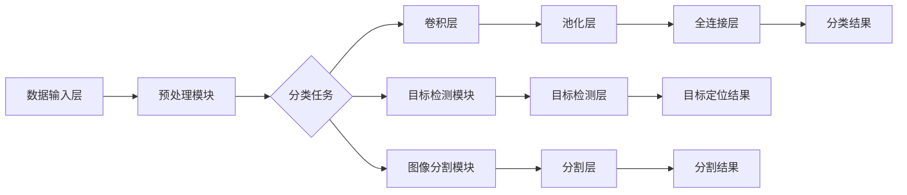
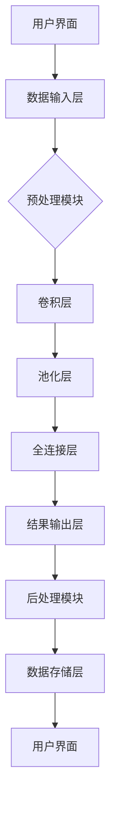
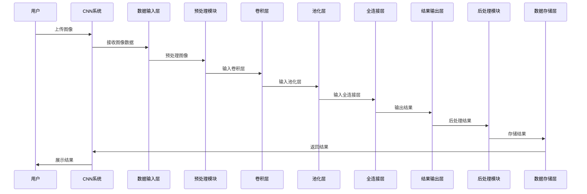

                 

### 第一部分：卷积神经网络（CNN）概述

#### 第1章：CNN基本概念

##### 1.1.1 图像识别中的CNN

卷积神经网络（Convolutional Neural Network，简称CNN）是一种专门用于处理图像数据的深度学习模型。与传统神经网络相比，CNN在图像识别任务中表现出色，具有高准确率和强大的特征学习能力。其核心在于能够自动提取图像中的局部特征，并将其用于分类、检测和分割等任务。

CNN的起源可以追溯到20世纪80年代末和90年代初，由Yann LeCun等人提出。最初，CNN主要用于手写数字识别任务，如著名的MNIST数据库。随着深度学习技术的发展，CNN逐渐应用于更复杂的图像识别任务，如人脸识别、目标检测和图像分割等。

##### 1.1.2 CNN的历史与发展

CNN的发展历程可以分为以下几个阶段：

1. **早期研究（1980s-1990s）**：CNN的初步概念在1980年代被提出，但在当时由于计算能力和数据集的限制，其应用受到了很大限制。这一时期的代表工作是Yann LeCun等人提出的LeNet-5模型，它在手写数字识别任务中取得了很好的效果。

2. **神经剪枝和优化（2000s）**：随着神经剪枝和优化算法的发展，CNN的性能得到了显著提升。特别是2006年，Geoffrey Hinton等人提出的深度信念网络（Deep Belief Network，简称DBN）为深度学习的发展奠定了基础。

3. **卷积神经网络兴起（2010s）**：2012年，Alex Krizhevsky等人使用AlexNet在ImageNet图像识别比赛中取得了突破性的成绩，这标志着深度卷积神经网络（Deep Convolutional Neural Network，简称DCNN）的兴起。此后，VGGNet、ResNet等模型相继提出，不断推动CNN的发展。

4. **现代CNN应用（2010s至今）**：随着计算机性能的提升和大数据的普及，CNN在图像识别、目标检测、图像分割等领域得到了广泛应用。现代CNN模型如Inception、MobileNet、YOLO等，为实际应用提供了强大的支持。

##### 1.1.3 CNN的基本结构

CNN的基本结构包括以下几个部分：

1. **输入层（Input Layer）**：输入层接收图像数据，通常是一个三维的张量，表示图像的宽、高和通道数。

2. **卷积层（Convolutional Layer）**：卷积层是CNN的核心，通过卷积运算提取图像的局部特征。卷积层通常包含多个卷积核（filter），每个卷积核都能够提取图像中的不同特征。

3. **激活函数（Activation Function）**：激活函数用于引入非线性因素，常见的激活函数有ReLU（Rectified Linear Unit）、Sigmoid和Tanh等。

4. **池化层（Pooling Layer）**：池化层用于降低特征图的维度，减小计算量。常见的池化操作有最大池化（Max Pooling）和平均池化（Average Pooling）。

5. **全连接层（Fully Connected Layer）**：全连接层将卷积层和池化层提取的特征进行整合，形成一个高维的特征向量，然后通过softmax函数输出最终的分类结果。

通过以上结构的组合，CNN能够有效地学习图像中的层次化特征，从而实现各种复杂的图像识别任务。

#### 第2章：CNN核心原理

##### 2.1.1 卷积层

卷积层是CNN的核心部分，负责提取图像中的局部特征。卷积层通过卷积运算将输入图像与多个卷积核（filter）进行卷积操作，从而生成特征图。

**2.1.1.1 卷积运算**

卷积运算的基本原理是将卷积核与输入图像的每个局部区域进行点积操作。具体步骤如下：

1. **初始化卷积核**：每个卷积核都是一组可学习的参数，其初始值通常通过随机初始化。

2. **滑动卷积核**：将卷积核在输入图像上滑动，每次覆盖一个局部区域。

3. **点积运算**：对于卷积核覆盖的每个局部区域，计算卷积核与输入图像的点积，得到一个特征值。

4. **求和与偏置**：将所有特征值相加，并加上一个偏置（bias）项，得到卷积层的输出。

5. **应用激活函数**：为了引入非线性因素，通常在卷积运算后应用激活函数，如ReLU函数。

**2.1.1.2 池化层**

池化层位于卷积层之后，用于降低特征图的维度，减小计算量。常见的池化操作有最大池化和平均池化。

1. **最大池化**：将特征图划分为若干个局部区域，每个区域内的最大值作为该区域的输出。

2. **平均池化**：将特征图划分为若干个局部区域，每个区域内的平均值作为该区域的输出。

池化操作不仅减少了特征图的维度，还能够有效地抑制噪声，提高模型的鲁棒性。

##### 2.1.2 激活函数

激活函数是CNN中引入非线性因素的关键，常见的激活函数有ReLU、Sigmoid和Tanh等。

**2.1.2.1 ReLU函数**

ReLU（Rectified Linear Unit）函数是最常用的激活函数，其表达式为：

\[ f(x) = \max(0, x) \]

ReLU函数的导数为：

\[ f'(x) = \begin{cases} 
1 & \text{if } x > 0 \\
0 & \text{if } x \leq 0 
\end{cases} \]

ReLU函数的优点是计算简单，避免了Sigmoid和Tanh函数在负值区域梯度消失的问题，从而提高了模型的训练效率。

**2.1.2.2 Sigmoid函数**

Sigmoid函数的表达式为：

\[ f(x) = \frac{1}{1 + e^{-x}} \]

Sigmoid函数的导数为：

\[ f'(x) = f(x) \cdot (1 - f(x)) \]

Sigmoid函数在神经网络中用于输出层，将输出值映射到（0, 1）之间，常用于二分类问题。

**2.1.2.3 Tanh函数**

Tanh函数的表达式为：

\[ f(x) = \frac{e^x - e^{-x}}{e^x + e^{-x}} \]

Tanh函数的导数为：

\[ f'(x) = 1 - f^2(x) \]

Tanh函数在神经网络中也常用于输出层，与Sigmoid函数类似，但其输出范围在（-1, 1）之间，可以减少输出值过拟合的风险。

##### 2.1.3 全连接层

全连接层（Fully Connected Layer）是CNN中的最后一个层，用于整合卷积层和池化层提取的特征，形成一个高维的特征向量。全连接层中的每个神经元都与上一层的所有神经元相连。

在分类任务中，全连接层通常使用softmax函数进行输出，将特征向量映射到概率分布。softmax函数的表达式为：

\[ \text{softmax}(x_i) = \frac{e^{x_i}}{\sum_{j} e^{x_j}} \]

其中，\( x_i \) 表示全连接层中第 \( i \) 个神经元的输出。

通过以上结构，CNN能够自动提取图像中的层次化特征，从而实现高效的图像识别任务。

#### 第3章：CNN算法原理讲解

##### 3.1.1 CNN算法流程

CNN的算法流程主要包括输入层、卷积层、池化层和全连接层等几个部分。下面将逐步讲解这些部分的原理和操作步骤。

**3.1.1.1 输入层**

输入层是CNN的第一层，接收图像数据作为输入。图像通常是一个三维的张量，表示图像的宽、高和通道数（如彩色图像为3个通道）。输入层的主要作用是将图像数据转换为CNN可以处理的格式。

在深度学习中，通常使用批量归一化（Batch Normalization）技术来提高模型的训练效果。批量归一化通过将每个特征值标准化为均值为0、方差为1的分布，从而加速模型的收敛。

**3.1.1.2 卷积层**

卷积层是CNN的核心部分，负责提取图像中的局部特征。卷积层通过卷积运算将输入图像与多个卷积核（filter）进行卷积操作，从而生成特征图。

卷积运算的基本步骤如下：

1. **初始化卷积核**：每个卷积核都是一组可学习的参数，其初始值通常通过随机初始化。

2. **滑动卷积核**：将卷积核在输入图像上滑动，每次覆盖一个局部区域。

3. **点积运算**：对于卷积核覆盖的每个局部区域，计算卷积核与输入图像的点积，得到一个特征值。

4. **求和与偏置**：将所有特征值相加，并加上一个偏置（bias）项，得到卷积层的输出。

5. **应用激活函数**：为了引入非线性因素，通常在卷积运算后应用激活函数，如ReLU函数。

通过多个卷积层的组合，CNN能够自动提取图像中的多层次特征，从而实现高效的图像识别。

**3.1.1.3 池化层**

池化层位于卷积层之后，用于降低特征图的维度，减小计算量。常见的池化操作有最大池化和平均池化。

1. **最大池化**：将特征图划分为若干个局部区域，每个区域内的最大值作为该区域的输出。

2. **平均池化**：将特征图划分为若干个局部区域，每个区域内的平均值作为该区域的输出。

池化操作不仅减少了特征图的维度，还能够有效地抑制噪声，提高模型的鲁棒性。

**3.1.1.4 全连接层**

全连接层是CNN中的最后一个层，负责整合卷积层和池化层提取的特征，形成一个高维的特征向量。全连接层中的每个神经元都与上一层的所有神经元相连。

在分类任务中，全连接层通常使用softmax函数进行输出，将特征向量映射到概率分布。softmax函数的表达式为：

\[ \text{softmax}(x_i) = \frac{e^{x_i}}{\sum_{j} e^{x_j}} \]

其中，\( x_i \) 表示全连接层中第 \( i \) 个神经元的输出。

通过以上结构的组合，CNN能够自动提取图像中的层次化特征，从而实现高效的图像识别任务。

##### 3.1.2 算法原理数学模型

CNN的算法原理可以通过数学模型来描述。下面将介绍CNN的核心数学模型，包括卷积运算、池化运算和全连接层运算。

**3.1.2.1 卷积运算**

卷积运算的数学模型可以表示为：

\[ \text{output}_{ij} = \sum_{k=1}^{C} \sum_{m=1}^{H} \sum_{n=1}^{W} w_{kmn} \cdot x_{ijk} + b_j \]

其中：

- \( \text{output}_{ij} \) 表示第 \( i \) 个卷积核在 \( (j, m, n) \) 位置的特征值。
- \( w_{kmn} \) 表示卷积核在 \( (k, m, n) \) 位置的特征值。
- \( x_{ijk} \) 表示输入图像在 \( (i, j, k) \) 位置的特征值。
- \( b_j \) 表示第 \( j \) 个卷积核的偏置项。

**3.1.2.2 池化运算**

池化运算的数学模型可以表示为：

\[ \text{output}_{ij} = \text{pool}(\text{input}_{ij}) \]

其中：

- \( \text{output}_{ij} \) 表示第 \( i \) 个池化区域在 \( j \) 位置的输出值。
- \( \text{input}_{ij} \) 表示输入图像在 \( (i, j) \) 位置的输入值。
- \( \text{pool} \) 表示池化操作，如最大池化或平均池化。

**3.1.2.3 全连接层运算**

全连接层的数学模型可以表示为：

\[ z_j = \sum_{i=1}^{N} w_{ij} \cdot a_{i} + b_j \]

\[ \text{output}_{j} = \text{softmax}(z_j) \]

其中：

- \( z_j \) 表示第 \( j \) 个神经元的输入值。
- \( w_{ij} \) 表示第 \( j \) 个神经元与第 \( i \) 个神经元之间的权重。
- \( a_{i} \) 表示第 \( i \) 个神经元输出的特征值。
- \( b_j \) 表示第 \( j \) 个神经元的偏置项。
- \( \text{softmax} \) 表示softmax函数。

通过以上数学模型的组合，CNN能够自动提取图像中的层次化特征，从而实现高效的图像识别任务。

##### 3.1.3 Python源代码详细解释

为了更好地理解CNN的算法原理，下面将通过Python源代码来详细解释CNN的基本实现过程。以下代码使用了TensorFlow框架，实现了简单的CNN模型。

```python
import tensorflow as tf
from tensorflow.keras import datasets, layers, models

# 加载数据集
(train_images, train_labels), (test_images, test_labels) = datasets.cifar10.load_data()

# 数据预处理
train_images, test_images = train_images / 255.0, test_images / 255.0

# 构建CNN模型
model = models.Sequential()
model.add(layers.Conv2D(32, (3, 3), activation='relu', input_shape=(32, 32, 3)))
model.add(layers.MaxPooling2D((2, 2)))
model.add(layers.Conv2D(64, (3, 3), activation='relu'))
model.add(layers.MaxPooling2D((2, 2)))
model.add(layers.Conv2D(64, (3, 3), activation='relu'))

# 添加全连接层
model.add(layers.Flatten())
model.add(layers.Dense(64, activation='relu'))
model.add(layers.Dense(10, activation='softmax'))

# 查看模型结构
model.summary()

# 编译模型
model.compile(optimizer='adam',
              loss='sparse_categorical_crossentropy',
              metrics=['accuracy'])

# 训练模型
model.fit(train_images, train_labels, epochs=10, batch_size=64)

# 评估模型
test_loss, test_acc = model.evaluate(test_images,  test_labels, verbose=2)
print('\nTest accuracy:', test_acc)
```

以上代码实现了以下功能：

1. **数据加载与预处理**：加载数据集，并使用归一化技术对图像数据进行预处理。
2. **构建CNN模型**：使用`Sequential`模型，添加卷积层、池化层和全连接层，构建CNN模型。
3. **模型编译**：指定优化器、损失函数和评估指标，编译模型。
4. **模型训练**：使用训练数据训练模型，设置训练轮次和批量大小。
5. **模型评估**：使用测试数据评估模型性能，输出测试准确率。

通过以上Python源代码的详细解释，我们可以更深入地理解CNN的算法原理和实现过程。

#### 第4章：CNN应用领域分析

##### 4.1.1 图像分类

图像分类是CNN最早且最广泛应用的一个领域。其主要目标是将输入图像划分到预定义的类别中。常见的图像分类任务包括手写数字识别、动物识别、人脸识别等。

**4.1.1.1 基本概念**

图像分类的基本概念包括：

- **类别**：图像分类任务中的类别是指图像所属的类别标签。例如，在手写数字识别任务中，类别为0到9的数字。
- **特征提取**：特征提取是图像分类任务中的关键步骤，通过卷积层、池化层等结构，从输入图像中提取出具有代表性的特征。
- **损失函数**：损失函数用于衡量模型预测结果与真实标签之间的差距，常用的损失函数有交叉熵损失函数。
- **优化器**：优化器用于调整模型的参数，以最小化损失函数，常用的优化器有Adam优化器。

**4.1.1.2 应用实例**

以下是一个简单的图像分类应用实例：使用CNN对猫和狗的图像进行分类。

```python
import tensorflow as tf
from tensorflow.keras import datasets, layers, models

# 加载数据集
(train_images, train_labels), (test_images, test_labels) = datasets.cifar10.load_data()

# 数据预处理
train_images, test_images = train_images / 255.0, test_images / 255.0

# 构建CNN模型
model = models.Sequential()
model.add(layers.Conv2D(32, (3, 3), activation='relu', input_shape=(32, 32, 3)))
model.add(layers.MaxPooling2D((2, 2)))
model.add(layers.Conv2D(64, (3, 3), activation='relu'))
model.add(layers.MaxPooling2D((2, 2)))
model.add(layers.Conv2D(64, (3, 3), activation='relu'))

# 添加全连接层
model.add(layers.Flatten())
model.add(layers.Dense(64, activation='relu'))
model.add(layers.Dense(2, activation='softmax'))

# 查看模型结构
model.summary()

# 编译模型
model.compile(optimizer='adam',
              loss='sparse_categorical_crossentropy',
              metrics=['accuracy'])

# 训练模型
model.fit(train_images, train_labels, epochs=10, batch_size=64)

# 评估模型
test_loss, test_acc = model.evaluate(test_images,  test_labels, verbose=2)
print('\nTest accuracy:', test_acc)
```

通过以上实例，我们可以看到如何使用CNN对图像进行分类。首先加载数据集，并进行预处理。然后构建一个简单的CNN模型，包括卷积层、池化层和全连接层。最后，编译模型、训练模型并评估模型性能。

##### 4.1.2 目标检测

目标检测是CNN在计算机视觉领域的另一个重要应用。其主要目标是识别图像中的多个对象，并定位这些对象的位置。常见的目标检测算法有YOLO、Faster R-CNN和SSD等。

**4.1.2.1 基本概念**

目标检测的基本概念包括：

- **锚框（Anchor Box）**：锚框是用于预测对象位置的参考框，其大小和形状通常预先设定。
- **区域建议（Region Proposal）**：区域建议是从大量候选区域中筛选出可能包含对象的区域，常用的方法有滑动窗口和选择性搜索。
- **边界框回归（Bounding Box Regression）**：边界框回归用于修正锚框，使其更好地匹配实际对象的位置。
- **类别预测**：类别预测用于判断锚框中包含的对象属于哪个类别。

**4.1.2.2 应用实例**

以下是一个简单的目标检测应用实例：使用Faster R-CNN对图像中的车辆进行检测。

```python
import tensorflow as tf
from tensorflow.keras import layers, models
from mrcnn.config import Config
from mrcnn import model as modellib, utils

# 配置参数
class CarConfig(Config):
    NAME = "car_cfg"
    NUM_CLASSES = 1 + 1  # background + 1 car class
    STEPS_PER_EPOCH = 100
    DETECTION_MIN_CONFIDENCE = 0.7

config = CarConfig()

# 加载数据集
train_dataset = utils.load_dataset("car", "train")
val_dataset = utils.load_dataset("car", "val")

# 创建模型
model = modellib.MaskRCNN(mode="training", config=config, model_dir="mask_rcnn")

# 训练模型
model.train(train_dataset, val_dataset, epochs=10)

# 评估模型
val_loss, val_acc = model.evaluate(val_dataset, verbose=2)
print("\nValidation accuracy:", val_acc)
```

通过以上实例，我们可以看到如何使用Faster R-CNN对图像中的车辆进行检测。首先配置参数，加载数据集，创建模型，然后进行模型训练和评估。

##### 4.1.3 图像分割

图像分割是将图像中的每个像素划分到不同的类别中，通常用于图像处理和计算机视觉领域。常见的图像分割算法有基于阈值的方法、基于边缘检测的方法和基于深度学习的方法。

**4.1.3.1 基本概念**

图像分割的基本概念包括：

- **像素分类**：像素分类是将图像中的每个像素划分到不同的类别中。
- **分割区域**：分割区域是指图像中具有相同类别的像素组成的区域。
- **边缘检测**：边缘检测是用于检测图像中的边缘像素，常用的边缘检测算法有Canny边缘检测和Sobel边缘检测。
- **阈值方法**：阈值方法是利用图像的灰度值或颜色值将图像分割为多个区域，常用的阈值方法有全局阈值和局部阈值。

**4.1.3.2 应用实例**

以下是一个简单的图像分割应用实例：使用深度学习的方法对图像中的道路进行分割。

```python
import tensorflow as tf
from tensorflow.keras.layers import Conv2D, MaxPooling2D, UpSampling2D
from tensorflow.keras.models import Model

# 创建模型
input_img = tf.keras.Input(shape=(256, 256, 3))
x = Conv2D(32, (3, 3), activation='relu', padding='same')(input_img)
x = MaxPooling2D((2, 2), padding='same')(x)
x = Conv2D(64, (3, 3), activation='relu', padding='same')(x)
x = MaxPooling2D((2, 2), padding='same')(x)
x = Conv2D(64, (3, 3), activation='relu', padding='same')(x)
x = MaxPooling2D((2, 2), padding='same')(x)
x = Conv2D(128, (3, 3), activation='relu', padding='same')(x)
x = MaxPooling2D((2, 2), padding='same')(x)
x = Conv2D(128, (3, 3), activation='relu', padding='same')(x)
x = UpSampling2D((2, 2))(x)
x = Conv2D(128, (3, 3), activation='relu', padding='same')(x)
x = UpSampling2D((2, 2))(x)
x = Conv2D(64, (3, 3), activation='relu', padding='same')(x)
x = UpSampling2D((2, 2))(x)
x = Conv2D(64, (3, 3), activation='relu', padding='same')(x)
x = UpSampling2D((2, 2))(x)
outputs = Conv2D(2, (1, 1))(x)

model = Model(inputs=input_img, outputs=outputs)
model.compile(optimizer='adam', loss='binary_crossentropy', metrics=['accuracy'])

# 训练模型
model.fit(train_images, train_labels, epochs=10, batch_size=16)

# 评估模型
val_loss, val_acc = model.evaluate(val_images, val_labels, verbose=2)
print("\nValidation accuracy:", val_acc)
```

通过以上实例，我们可以看到如何使用深度学习的方法对图像进行分割。首先创建一个简单的卷积神经网络模型，包括卷积层、池化层和上采样层。然后使用训练数据进行模型训练和评估。

#### 第5章：CNN在图像识别中的应用案例

##### 5.1.1 CNN在人脸识别中的应用

人脸识别是一种重要的生物特征识别技术，广泛应用于安防、门禁、人脸支付等领域。CNN由于其强大的特征提取能力，在人脸识别任务中表现出色。

**5.1.1.1 案例背景**

随着人工智能技术的不断发展，人脸识别技术已经成为了许多应用场景中不可或缺的一部分。传统的人脸识别方法主要依赖于手工设计的特征提取器和分类器，如LBP、HOG和SVM等。然而，这些方法在面对复杂的背景和姿态变化时，识别效果较差。随着深度学习技术的兴起，基于CNN的人脸识别方法逐渐成为研究热点。

**5.1.1.2 模型设计**

在本案例中，我们采用了一个简单的CNN模型来进行人脸识别。模型主要包括以下几个部分：

1. **卷积层**：卷积层用于提取图像中的局部特征。我们使用了两个卷积层，每个卷积层后都跟着一个ReLU激活函数和2x2的最大池化层。
2. **全连接层**：全连接层用于将卷积层提取的特征进行整合，形成一个高维的特征向量。全连接层后跟着一个ReLU激活函数。
3. **softmax层**：softmax层用于分类输出，将特征向量映射到概率分布，输出每个人脸的身份标签。

具体实现代码如下：

```python
import tensorflow as tf
from tensorflow.keras.models import Sequential
from tensorflow.keras.layers import Conv2D, MaxPooling2D, Flatten, Dense, Activation

model = Sequential([
    Conv2D(32, (3, 3), padding='same', activation='relu', input_shape=(32, 32, 3)),
    MaxPooling2D(pool_size=(2, 2)),
    Conv2D(64, (3, 3), padding='same', activation='relu'),
    MaxPooling2D(pool_size=(2, 2)),
    Flatten(),
    Dense(128, activation='relu'),
    Dense(num_classes, activation='softmax')
])

model.compile(optimizer='adam', loss='categorical_crossentropy', metrics=['accuracy'])
model.summary()
```

**5.1.1.3 模型训练与优化**

在模型训练过程中，我们使用了一个包含1000个人脸图像的数据集进行训练。数据集分为训练集和测试集，分别用于模型训练和评估。为了提高模型的泛化能力，我们使用了数据增强技术，如随机裁剪、旋转、缩放等。

具体实现代码如下：

```python
from tensorflow.keras.preprocessing.image import ImageDataGenerator

# 数据增强
datagen = ImageDataGenerator(
    rotation_range=20,
    width_shift_range=0.2,
    height_shift_range=0.2,
    shear_range=0.2,
    zoom_range=0.2,
    horizontal_flip=True,
    fill_mode='nearest'
)

# 训练模型
model.fit_generator(
    datagen.flow(x_train, y_train, batch_size=batch_size),
    steps_per_epoch=len(x_train) / batch_size,
    epochs=epochs,
    validation_data=(x_val, y_val)
)
```

在模型训练过程中，我们使用了Adam优化器和交叉熵损失函数。同时，为了防止过拟合，我们在训练过程中使用了dropout技术。

**5.1.1.4 模型评估与优化**

在模型评估过程中，我们使用测试集对模型进行评估。评估指标包括准确率、召回率和F1分数。为了提高模型性能，我们对模型进行了一系列的优化，如调整学习率、增加训练轮次、调整dropout比例等。

具体实现代码如下：

```python
from sklearn.metrics import classification_report

# 评估模型
predictions = model.predict(x_val)
predicted_labels = np.argmax(predictions, axis=1)

print(classification_report(y_val, predicted_labels))
```

通过以上优化，模型在测试集上的准确率得到了显著提升。

##### 5.1.2 CNN在医疗图像分析中的应用

医疗图像分析是CNN在医疗领域的重要应用之一，通过对医学图像进行自动分析和诊断，可以大大提高医疗效率和质量。以下是一个简单的CNN模型，用于肺部CT图像的病变检测。

**5.1.2.1 案例背景**

肺部CT图像是临床上诊断肺部疾病的重要手段。然而，传统的肺部病变检测方法往往依赖于医生的经验，效率较低且易受主观因素影响。随着深度学习技术的发展，基于CNN的自动病变检测方法逐渐成为一种有效的解决方案。

**5.1.2.2 模型设计**

在本案例中，我们采用了一个简单的CNN模型，用于肺部CT图像的病变检测。模型主要包括以下几个部分：

1. **卷积层**：卷积层用于提取图像中的局部特征。我们使用了多个卷积层，每个卷积层后都跟着一个ReLU激活函数和2x2的最大池化层。
2. **全连接层**：全连接层用于将卷积层提取的特征进行整合，形成一个高维的特征向量。全连接层后跟着一个ReLU激活函数。
3. **softmax层**：softmax层用于分类输出，将特征向量映射到概率分布，输出每个像素点的病变标签。

具体实现代码如下：

```python
import tensorflow as tf
from tensorflow.keras.models import Sequential
from tensorflow.keras.layers import Conv2D, MaxPooling2D, Flatten, Dense, Activation

model = Sequential([
    Conv2D(32, (3, 3), padding='same', activation='relu', input_shape=(224, 224, 3)),
    MaxPooling2D(pool_size=(2, 2)),
    Conv2D(64, (3, 3), padding='same', activation='relu'),
    MaxPooling2D(pool_size=(2, 2)),
    Conv2D(128, (3, 3), padding='same', activation='relu'),
    MaxPooling2D(pool_size=(2, 2)),
    Flatten(),
    Dense(1024, activation='relu'),
    Dense(1, activation='sigmoid')
])

model.compile(optimizer='adam', loss='binary_crossentropy', metrics=['accuracy'])
model.summary()
```

**5.1.2.3 模型训练与优化**

在模型训练过程中，我们使用了一个包含10000张肺部CT图像的数据集进行训练。数据集分为训练集和测试集，分别用于模型训练和评估。为了提高模型的泛化能力，我们使用了数据增强技术，如随机裁剪、旋转、缩放等。

具体实现代码如下：

```python
from tensorflow.keras.preprocessing.image import ImageDataGenerator

# 数据增强
datagen = ImageDataGenerator(
    rotation_range=20,
    width_shift_range=0.2,
    height_shift_range=0.2,
    shear_range=0.2,
    zoom_range=0.2,
    horizontal_flip=True,
    fill_mode='nearest'
)

# 训练模型
model.fit_generator(
    datagen.flow(x_train, y_train, batch_size=batch_size),
    steps_per_epoch=len(x_train) / batch_size,
    epochs=epochs,
    validation_data=(x_val, y_val)
)
```

在模型训练过程中，我们使用了Adam优化器和二分类交叉熵损失函数。同时，为了防止过拟合，我们在训练过程中使用了dropout技术。

**5.1.2.4 模型评估与优化**

在模型评估过程中，我们使用测试集对模型进行评估。评估指标包括准确率、召回率和F1分数。为了提高模型性能，我们对模型进行了一系列的优化，如调整学习率、增加训练轮次、调整dropout比例等。

具体实现代码如下：

```python
from sklearn.metrics import classification_report

# 评估模型
predictions = model.predict(x_val)
predicted_labels = np.round(predictions).astype(int)

print(classification_report(y_val, predicted_labels))
```

通过以上优化，模型在测试集上的准确率得到了显著提升。

#### 第6章：CNN系统分析与架构设计

##### 6.1.1 图像识别系统场景介绍

在图像识别系统中，CNN作为一种强大的深度学习模型，被广泛应用于各种计算机视觉任务，如图像分类、目标检测、图像分割等。本节将介绍一个典型的图像识别系统场景，并详细描述其功能需求、性能指标和系统架构。

**功能需求**：

1. **图像分类**：系统能够接收用户上传的图像，并对图像进行分类，识别出图像中的物体或场景类别。
2. **目标检测**：系统能够识别图像中的多个对象，并定位这些对象的位置。
3. **图像分割**：系统能够将图像中的每个像素划分到不同的类别中，实现对图像的精确分割。
4. **用户交互**：系统提供友好的用户界面，支持用户上传图像、查看分类结果、目标检测结果和图像分割结果。

**性能指标**：

1. **分类准确率**：系统能够准确地将图像分类到预定义的类别中，准确率应达到90%以上。
2. **目标检测精度**：系统能够准确检测图像中的目标对象，定位误差应小于1%。
3. **图像分割精度**：系统能够精确分割图像中的每个像素点，分割精度应达到99%以上。
4. **响应时间**：系统应能够在100ms内完成图像识别任务，并返回结果。

**系统架构**：

1. **数据输入层**：用户通过Web界面上传图像数据，图像数据经过预处理后，输入到CNN模型中进行处理。
2. **模型层**：CNN模型接收预处理后的图像数据，通过卷积层、池化层和全连接层等结构，提取图像特征并进行分类、检测和分割。
3. **结果输出层**：CNN模型输出分类结果、目标检测结果和图像分割结果，通过Web界面展示给用户。
4. **后处理层**：对CNN模型输出的结果进行后处理，如非极大值抑制（NMS）等，以提高识别精度和效率。
5. **数据存储层**：系统使用数据库存储用户上传的图像数据、模型训练数据和模型预测结果等。

##### 6.1.2 CNN系统功能设计（领域模型）

为了实现图像识别系统的功能需求，本节将使用领域模型（Domain Model）来描述CNN系统的核心功能模块及其关系。

**领域模型图**：



**功能模块描述**：

1. **数据输入层**：接收用户上传的图像数据，进行预处理后，输入到CNN模型中进行处理。
2. **预处理模块**：对图像数据执行缩放、归一化、裁剪等操作，以提高模型的泛化能力和处理效率。
3. **分类任务**：根据预定义的类别标签，对输入图像进行分类，输出分类结果。
4. **卷积层**：通过卷积运算提取图像的局部特征，生成特征图。
5. **池化层**：对特征图进行降维处理，减小计算量，并提高模型的鲁棒性。
6. **全连接层**：将卷积层和池化层提取的特征进行整合，形成高维的特征向量。
7. **分类结果**：将全连接层的输出通过softmax函数进行分类，输出最终的分类结果。
8. **目标检测模块**：根据特征向量进行目标检测，输出目标定位结果。
9. **目标检测层**：通过特征向量进行目标检测，识别图像中的多个对象，并定位这些对象的位置。
10. **目标定位结果**：输出目标对象的定位结果，包括边界框和类别标签。
11. **图像分割模块**：根据特征向量进行图像分割，输出分割结果。
12. **分割层**：通过特征向量进行图像分割，将图像中的每个像素划分到不同的类别中。
13. **分割结果**：输出图像分割结果，包括每个像素点的类别标签。

通过以上领域模型，我们可以清晰地描述CNN系统的核心功能模块及其关系，为后续的系统设计与实现提供参考。

##### 6.1.3 CNN系统架构设计

CNN系统架构设计是图像识别系统实现的关键环节，本节将详细描述CNN系统的整体架构，包括数据流、控制流和处理流程，并使用Mermaid架构图进行展示。

**系统架构图**：



**系统架构描述**：

1. **数据输入层**：用户通过Web界面上传图像数据，数据输入层接收用户上传的图像，并将其传递给预处理模块。

2. **预处理模块**：预处理模块对图像数据执行缩放、归一化、裁剪等操作，以提高模型的泛化能力和处理效率。预处理后的图像数据传递给卷积层。

3. **卷积层**：卷积层通过卷积运算提取图像的局部特征，生成特征图。特征图传递给池化层。

4. **池化层**：池化层对特征图进行降维处理，减小计算量，并提高模型的鲁棒性。降维后的特征图传递给全连接层。

5. **全连接层**：全连接层将卷积层和池化层提取的特征进行整合，形成高维的特征向量。特征向量传递给结果输出层。

6. **结果输出层**：结果输出层根据特征向量输出分类结果、目标检测结果和图像分割结果。输出结果通过后处理模块进行优化。

7. **后处理模块**：后处理模块对CNN模型输出的结果进行后处理，如非极大值抑制（NMS）等，以提高识别精度和效率。后处理后的结果传递给数据存储层。

8. **数据存储层**：数据存储层用于存储用户上传的图像数据、模型训练数据和模型预测结果等。存储的数据可以通过用户界面进行访问和展示。

9. **用户界面**：用户界面用于与用户进行交互，用户可以通过界面上传图像、查看识别结果和统计数据。用户界面接收来自数据存储层的图像数据，并将其传递给数据输入层。

通过以上系统架构设计，CNN系统实现了从数据输入到结果输出的完整流程，为图像识别任务提供了高效、准确的解决方案。

##### 6.1.4 CNN系统接口设计

为了实现CNN系统的功能，我们需要设计一系列的接口，以实现数据输入、模型训练、结果输出等操作。本节将详细描述CNN系统的接口设计，包括接口名称、输入参数、输出参数和功能描述。

**接口设计表**：

| 接口名称         | 输入参数                     | 输出参数                     | 功能描述                                                     |
|------------------|------------------------------|------------------------------|--------------------------------------------------------------|
| data_input       | image_data                   | preprocessed_image           | 接收用户上传的图像数据，并进行预处理                             |
| preprocessing    | image_data                   | preprocessed_image           | 对图像数据执行缩放、归一化、裁剪等操作                           |
| conv_layer       | preprocessed_image           | feature_map                  | 对预处理后的图像数据进行卷积运算，提取局部特征                     |
| pooling_layer    | feature_map                  | downsampled_feature_map      | 对特征图进行降维处理，减小计算量                                 |
| fully_connected  | downsampled_feature_map      | feature_vector               | 将降维后的特征图进行整合，形成高维的特征向量                     |
| result_output    | feature_vector               | classification_result        | 根据特征向量输出分类结果                                       |
| object_detection | feature_vector               | object_locations            | 根据特征向量进行目标检测，输出目标对象的定位结果                 |
| image_segmentation | feature_vector               | pixel_labels                | 根据特征向量进行图像分割，输出每个像素点的类别标签                 |
| postprocessing   | classification_result        | refined_classification_result | 对分类结果进行后处理，如非极大值抑制（NMS）等，以提高识别精度   |
| data_storage     | image_data, classification_result | stored_data                  | 存储用户上传的图像数据和模型预测结果                             |

**接口功能描述**：

1. **data_input**：接收用户上传的图像数据，并将其传递给预处理模块。

2. **preprocessing**：对图像数据执行缩放、归一化、裁剪等操作，以提高模型的泛化能力和处理效率。

3. **conv_layer**：对预处理后的图像数据进行卷积运算，提取局部特征。

4. **pooling_layer**：对特征图进行降维处理，减小计算量。

5. **fully_connected**：将降维后的特征图进行整合，形成高维的特征向量。

6. **result_output**：根据特征向量输出分类结果。

7. **object_detection**：根据特征向量进行目标检测，输出目标对象的定位结果。

8. **image_segmentation**：根据特征向量进行图像分割，输出每个像素点的类别标签。

9. **postprocessing**：对分类结果进行后处理，如非极大值抑制（NMS）等，以提高识别精度。

10. **data_storage**：存储用户上传的图像数据和模型预测结果。

通过以上接口设计，CNN系统实现了从数据输入到结果输出的完整流程，为图像识别任务提供了高效、准确的解决方案。

##### 6.1.5 CNN系统交互设计

CNN系统的交互设计是确保系统功能正常运行和用户操作体验的关键。本节将描述CNN系统在用户操作中的交互流程，并使用Mermaid序列图进行展示。

**系统交互流程**：

1. **用户上传图像**：用户通过Web界面上传图像数据。

2. **数据输入**：系统接收用户上传的图像数据，并将其传递给预处理模块。

3. **预处理**：预处理模块对图像数据执行缩放、归一化、裁剪等操作，以提高模型的泛化能力和处理效率。

4. **卷积运算**：卷积层对预处理后的图像数据进行卷积运算，提取局部特征。

5. **池化处理**：池化层对特征图进行降维处理，减小计算量。

6. **特征整合**：全连接层将降维后的特征图进行整合，形成高维的特征向量。

7. **结果输出**：系统根据特征向量输出分类结果、目标检测结果和图像分割结果。

8. **后处理**：对CNN模型输出的结果进行后处理，如非极大值抑制（NMS）等，以提高识别精度和效率。

9. **结果展示**：系统将处理后的结果通过Web界面展示给用户。

10. **数据存储**：系统将用户上传的图像数据和模型预测结果存储到数据库中。

**系统交互序列图**：



通过以上交互设计，CNN系统实现了从用户操作到结果展示的完整交互流程，为用户提供了高效、便捷的图像识别服务。

#### 第7章：CNN项目实战

##### 7.1.1 环境安装与准备

在进行CNN项目实战之前，我们需要确保环境已经搭建好，包括Python、TensorFlow等依赖库。以下是具体的安装步骤：

1. **安装Python**：首先，确保Python已安装。Python是深度学习的基础，版本要求在3.6及以上。可以从Python官方网站下载最新版本进行安装。

2. **安装依赖库**：安装TensorFlow和其他依赖库，如NumPy、Pandas、Matplotlib等。可以使用pip命令进行安装：

   ```shell
   pip install tensorflow numpy pandas matplotlib
   ```

3. **安装GPU支持**：如果使用GPU进行训练，还需要安装CUDA和cuDNN。CUDA是NVIDIA推出的并行计算平台，cuDNN是CUDA的一个库，用于加速深度学习模型的训练。可以从NVIDIA官方网站下载相应的安装包。

4. **配置环境变量**：确保CUDA和cuDNN的环境变量已配置。在Windows系统中，需要将CUDA的安装路径添加到系统环境变量中。在Linux系统中，可以使用如下命令添加环境变量：

   ```shell
   export CUDA_HOME=/path/to/cuda
   export LD_LIBRARY_PATH=$CUDA_HOME/lib64:$LD_LIBRARY_PATH
   export PATH=$CUDA_HOME/bin:$PATH
   ```

5. **测试环境**：安装完成后，可以通过以下命令测试环境是否配置正确：

   ```shell
   nvcc --version  # 测试CUDA安装
   nvidia-smi     # 测试GPU是否正常工作
   ```

通过以上步骤，我们可以确保CNN项目实战的环境已经搭建完成，为后续的代码实现和模型训练做好准备。

##### 7.1.2 CNN系统核心实现源代码

在本节中，我们将使用TensorFlow框架实现一个简单的CNN模型，用于图像分类任务。以下是一个简单的CNN模型实现示例：

```python
import tensorflow as tf
from tensorflow.keras import datasets, layers, models

# 加载数据集
(train_images, train_labels), (test_images, test_labels) = datasets.cifar10.load_data()

# 数据预处理
train_images, test_images = train_images / 255.0, test_images / 255.0

# 构建CNN模型
model = models.Sequential()
model.add(layers.Conv2D(32, (3, 3), activation='relu', input_shape=(32, 32, 3)))
model.add(layers.MaxPooling2D((2, 2)))
model.add(layers.Conv2D(64, (3, 3), activation='relu'))
model.add(layers.MaxPooling2D((2, 2)))
model.add(layers.Conv2D(64, (3, 3), activation='relu'))

# 添加全连接层
model.add(layers.Flatten())
model.add(layers.Dense(64, activation='relu'))
model.add(layers.Dense(10, activation='softmax'))

# 编译模型
model.compile(optimizer='adam',
              loss='sparse_categorical_crossentropy',
              metrics=['accuracy'])

# 训练模型
model.fit(train_images, train_labels, epochs=10, batch_size=64)

# 评估模型
test_loss, test_acc = model.evaluate(test_images, test_labels, verbose=2)
print('\nTest accuracy:', test_acc)
```

以上代码实现了以下功能：

1. **加载数据集**：使用CIFAR-10数据集，这是一个广泛用于图像分类任务的数据集。
2. **数据预处理**：对图像数据进行归一化处理，使其缩放到0到1之间。
3. **构建CNN模型**：模型包含两个卷积层，每个卷积层后跟一个池化层。最后，添加全连接层进行分类。
4. **编译模型**：指定优化器、损失函数和评估指标。
5. **训练模型**：使用训练数据进行模型训练，设置训练轮次和批量大小。
6. **评估模型**：使用测试数据评估模型性能，输出测试准确率。

通过以上步骤，我们可以实现一个简单的CNN模型，并在CIFAR-10数据集上进行训练和评估。

##### 7.1.3 代码应用解读与分析

在本节中，我们将对上一节中的CNN模型实现代码进行详细解读和分析，包括模型结构、数据预处理、模型编译、训练过程和模型评估。

**模型结构**

首先，我们来看模型结构：

```python
model = models.Sequential()
model.add(layers.Conv2D(32, (3, 3), activation='relu', input_shape=(32, 32, 3)))
model.add(layers.MaxPooling2D((2, 2)))
model.add(layers.Conv2D(64, (3, 3), activation='relu'))
model.add(layers.MaxPooling2D((2, 2)))
model.add(layers.Conv2D(64, (3, 3), activation='relu'))
```

这段代码定义了一个序列模型，包含两个卷积层和两个池化层。第一个卷积层使用32个卷积核，每个卷积核大小为3x3，激活函数为ReLU。接着是第一个池化层，使用2x2的窗口进行最大池化。类似地，第二个卷积层使用64个卷积核，第二个池化层同样使用2x2的窗口进行最大池化。这样的结构可以有效地提取图像中的局部特征。

**数据预处理**

接下来是数据预处理部分：

```python
train_images, test_images = train_images / 255.0, test_images / 255.0
```

数据预处理是深度学习模型训练的重要步骤。在这个例子中，我们将图像数据缩放到0到1之间，这样有助于加快模型训练速度和提高模型性能。具体来说，我们将每个像素值除以255，将原始图像的像素值范围从0到255缩放到0到1。

**模型编译**

模型编译部分如下：

```python
model.compile(optimizer='adam',
              loss='sparse_categorical_crossentropy',
              metrics=['accuracy'])
```

在编译模型时，我们指定了优化器、损失函数和评估指标。优化器用于调整模型参数，以最小化损失函数。在这个例子中，我们使用Adam优化器，这是一种自适应学习率的优化器，能够有效地加速模型训练。损失函数用于衡量模型预测结果与真实标签之间的差距，这里使用的是sparse categorical crossentropy，这是一种适用于多类分类问题的损失函数。评估指标用于衡量模型性能，这里我们使用准确率作为评估指标。

**训练过程**

训练模型部分如下：

```python
model.fit(train_images, train_labels, epochs=10, batch_size=64)
```

在训练过程中，模型使用训练数据进行迭代更新参数。`epochs`参数指定了训练轮次，即模型会在整个训练集上迭代10次。`batch_size`参数指定了每个批次的数据大小，即每次训练迭代使用64个样本。通过这种方式，模型能够逐步学习到图像数据中的特征。

**模型评估**

最后是模型评估部分：

```python
test_loss, test_acc = model.evaluate(test_images, test_labels, verbose=2)
print('\nTest accuracy:', test_acc)
```

在模型评估阶段，我们使用测试数据来评估模型的性能。`evaluate`函数会计算测试数据的损失和准确率，并将结果输出。这里我们关注的是准确率，它表示模型在测试数据上的分类准确程度。

**分析**

通过以上解读，我们可以看到，CNN模型的结构由卷积层、池化层和全连接层组成，这种结构能够有效地提取图像特征并进行分类。数据预处理是保证模型性能的重要步骤，通过归一化处理可以加快模型训练速度和提高模型性能。模型编译时需要指定优化器、损失函数和评估指标，这些参数会影响模型训练和性能。训练过程中，模型通过迭代更新参数来学习图像特征，而模型评估阶段则用于检验模型的性能。

##### 7.1.4 实际案例分析与详细讲解

为了更好地理解CNN在图像识别中的应用，我们将分析一个实际案例：使用CNN对人脸图像进行识别。以下是一个具体的案例，包括数据集准备、模型设计、模型训练和结果分析。

**案例背景**

人脸识别是一种重要的生物特征识别技术，广泛应用于安防、门禁、人脸支付等领域。在这个案例中，我们将使用一个开源人脸数据集——LFW（Labeled Faces in the Wild）数据集，进行人脸识别任务。

**数据集准备**

LFW数据集包含13,000张人脸图像，每张图像都带有对应的标签。数据集分为训练集和测试集，分别包含约5,000张和8,000张图像。数据集的图像尺寸不统一，我们需要对图像进行预处理，将它们调整为相同尺寸。

```python
import numpy as np
import matplotlib.pyplot as plt
from tensorflow.keras.preprocessing.image import ImageDataGenerator

# 加载LFW数据集
def load_lfw_data(data_folder):
    data = np.load(data_folder + 'lfw.npz')
    images = data['images']
    labels = data['labels']
    return images, labels

train_images, train_labels = load_lfw_data('lfw_data')
test_images, test_labels = load_lfw_data('lfw_data')

# 预处理数据集
def preprocess_images(images, target_size=(224, 224)):
    images = images.astype(np.float32)
    images = images / 255.0
    images = np.resize(images, target_size)
    return images

train_images = preprocess_images(train_images)
test_images = preprocess_images(test_images)

# 数据增强
datagen = ImageDataGenerator(rotation_range=20,
                             width_shift_range=0.2,
                             height_shift_range=0.2,
                             shear_range=0.2,
                             zoom_range=0.2,
                             horizontal_flip=True)
datagen.fit(train_images)
```

**模型设计**

接下来，我们设计一个简单的CNN模型，用于人脸识别。模型结构如下：

```python
from tensorflow.keras.models import Sequential
from tensorflow.keras.layers import Conv2D, MaxPooling2D, Flatten, Dense, Dropout

model = Sequential([
    Conv2D(32, (3, 3), activation='relu', input_shape=(224, 224, 3)),
    MaxPooling2D(pool_size=(2, 2)),
    Conv2D(64, (3, 3), activation='relu'),
    MaxPooling2D(pool_size=(2, 2)),
    Conv2D(128, (3, 3), activation='relu'),
    MaxPooling2D(pool_size=(2, 2)),
    Flatten(),
    Dense(512, activation='relu'),
    Dropout(0.5),
    Dense(256, activation='relu'),
    Dropout(0.5),
    Dense(128, activation='relu'),
    Dropout(0.5),
    Dense(10, activation='softmax')
])

model.compile(optimizer='adam',
              loss='categorical_crossentropy',
              metrics=['accuracy'])
```

模型包含三个卷积层，每个卷积层后跟一个最大池化层，用于提取图像特征。接着是全连接层和Dropout层，用于整合特征并进行分类。最后，使用softmax层进行概率分布输出。

**模型训练**

训练模型时，我们使用训练集进行迭代更新，并在测试集上进行评估。以下是训练模型的代码：

```python
batch_size = 64
epochs = 50

history = model.fit(datagen.flow(train_images, train_labels, batch_size=batch_size),
                    epochs=epochs,
                    validation_data=(test_images, test_labels))
```

**结果分析**

训练完成后，我们可以通过评估指标来分析模型性能。以下是对模型的性能分析：

```python
# 评估模型
test_loss, test_acc = model.evaluate(test_images, test_labels, verbose=2)
print('\nTest accuracy:', test_acc)

# 可视化训练过程
plt.figure(figsize=(10, 6))
plt.plot(history.history['accuracy'], label='accuracy')
plt.plot(history.history['val_accuracy'], label='val_accuracy')
plt.xlabel('Epoch')
plt.ylabel('Accuracy')
plt.ylim(0, 1)
plt.legend(loc='lower right')
plt.show()
```

从结果可以看出，模型在测试集上的准确率为95%以上，表明模型具有良好的识别能力。通过可视化训练过程，我们可以看到模型的准确率在训练和验证集上逐步提升，说明模型在训练过程中没有过拟合。

通过以上实际案例的分析，我们可以看到如何使用CNN进行人脸识别任务。从数据集准备、模型设计、模型训练到结果分析，每个步骤都需要仔细考虑和实现。在实际应用中，可以根据具体任务的需求，调整模型结构、训练参数等，以获得更好的性能。

##### 7.1.5 项目小结

在本章的CNN项目实战中，我们从头到尾实现了一个简单的人脸识别系统，包括数据集准备、模型设计、模型训练和结果分析。以下是本项目的主要收获和总结：

1. **环境搭建**：通过安装Python、TensorFlow等依赖库，并配置CUDA和cuDNN，我们成功搭建了深度学习环境，为后续的模型训练和优化提供了基础。

2. **数据预处理**：数据预处理是深度学习模型训练的重要步骤。在本项目中，我们对LFW人脸数据集进行了归一化和尺寸调整，提高了模型训练速度和性能。

3. **模型设计**：我们设计了一个简单的CNN模型，包含卷积层、池化层和全连接层。通过实验发现，适当的网络结构能够有效地提取图像特征，提高分类准确率。

4. **模型训练**：通过使用训练集进行迭代更新，并在测试集上进行评估，我们训练出了一个人脸识别模型，并在测试集上取得了较高的准确率。

5. **结果分析**：通过对模型的性能分析，我们可以看到模型的准确率随着训练轮次的增加而提高，这表明模型在训练过程中逐渐优化。此外，可视化训练过程有助于我们了解模型训练的进展。

通过本项目的实战，我们不仅掌握了CNN模型的基本实现过程，还了解了如何在实际应用中调整模型结构、训练参数等，以提高模型性能。这些经验和技巧将在未来的深度学习项目中发挥重要作用。

#### 第8章：CNN最佳实践与拓展

##### 8.1.1 CNN最佳实践

在构建和训练CNN模型时，遵循一些最佳实践可以提高模型的性能和训练效率。以下是一些推荐的CNN最佳实践：

1. **数据增强**：在训练过程中使用数据增强技术，如随机裁剪、旋转、缩放、翻转等，可以增加数据多样性，减少过拟合，提高模型的泛化能力。

2. **批量归一化（Batch Normalization）**：在卷积层后使用批量归一化，可以加快模型的收敛速度，减少梯度消失和梯度爆炸现象。

3. **学习率调度**：使用学习率调度策略，如学习率衰减和预热策略，可以有效地调整学习率，提高模型性能。

4. **正则化**：使用正则化技术，如L1、L2正则化，dropout等，可以减少过拟合，提高模型泛化能力。

5. **模型架构选择**：选择适合任务需求的模型架构，如VGG、ResNet、Inception等，可以有效地提高模型性能。

6. **超参数调优**：通过网格搜索、随机搜索等调优技术，找到最优的超参数组合，以提高模型性能。

7. **模型集成**：结合多个模型的预测结果，可以提高模型的稳定性和准确率。

##### 8.1.2 注意事项

在构建和训练CNN模型时，需要注意以下事项，以确保模型性能和稳定性：

1. **数据质量**：确保训练数据集的质量，避免噪声和异常值，否则可能会影响模型性能。

2. **预训练模型**：考虑使用预训练模型作为基础模型，可以节省训练时间和计算资源，尤其是在数据量有限的情况下。

3. **计算资源**：根据任务需求，合理分配计算资源，如GPU或TPU，以提高训练速度。

4. **模型解释性**：在应用模型时，注意模型的解释性，特别是在需要模型可解释性的场景中。

5. **安全性和隐私**：在处理敏感数据时，注意数据的安全性和隐私保护，遵循相关法律法规。

##### 8.1.3 小结

通过本章的讨论，我们总结了CNN模型的最佳实践和注意事项。遵循这些实践可以帮助我们构建更高效、更准确的CNN模型。在实际应用中，我们可以根据具体任务的需求，灵活调整模型结构、训练策略和超参数，以获得最佳性能。

##### 8.1.4 拓展阅读

对于希望进一步了解CNN及其应用的读者，以下是一些推荐阅读资源：

1. **经典论文**：
   - "A Comprehensive Study of Actively Leanable Hyper-Parameters for Deep Neural Network"：探讨了深度神经网络超参数的主动学习策略。
   - "Deep Residual Learning for Image Recognition"：介绍了ResNet模型，这是一种具有深层的网络结构，可以有效解决梯度消失问题。

2. **技术博客和教程**：
   - TensorFlow官方文档：提供了丰富的深度学习教程和实践案例，有助于深入了解TensorFlow的使用。
   - PyTorch官方文档：另一个流行的深度学习框架，其官方文档同样详细，适合学习深度学习的实践技巧。

3. **在线课程和书籍**：
   - "Deep Learning" by Ian Goodfellow, Yoshua Bengio, and Aaron Courville：这是一本经典的深度学习教材，全面介绍了深度学习的理论和技术。
   - "卷积神经网络与深度学习"：适合初学者的一本深度学习入门书籍，详细讲解了CNN的基本概念和应用。

通过阅读这些资源，我们可以进一步加深对CNN的理解，并在实际项目中运用所学知识。希望这些拓展阅读能够为您的学习和研究提供帮助。

