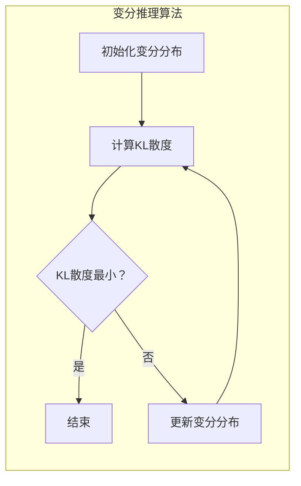
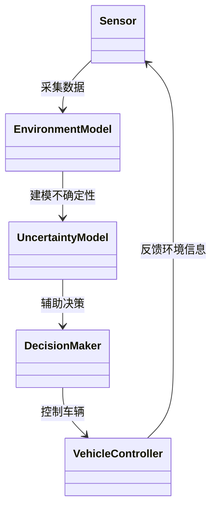
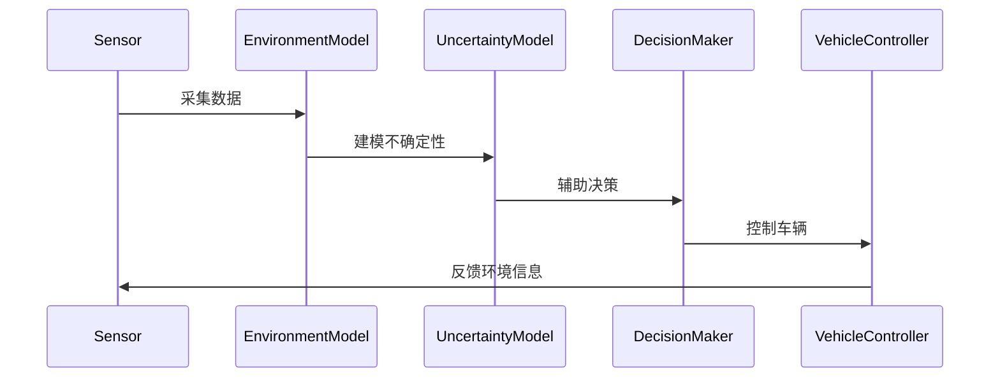
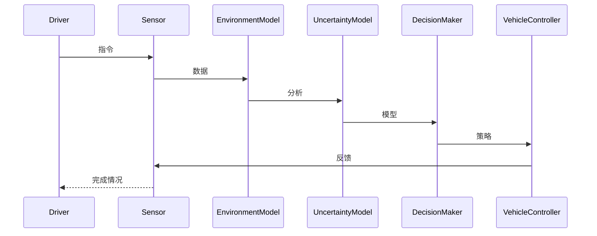

                 

### 第一部分：引言

在当今高度复杂的系统环境下，不确定性建模已成为研究和实践中的一项重要任务。无论是工业控制系统、金融风险评估，还是自动驾驶、医疗诊断等领域，都需要面对和处理各种不确定性因素。这不仅仅是因为现实世界的复杂性和多样性，还因为数据的不完整性、噪声和动态变化的特性。面对这些不确定性，传统的确定性模型往往力不从心，而变分推理技术提供了一种有效的解决方案。

变分推理技术起源于概率论和统计学习领域，它通过优化概率分布来近似求解复杂的概率问题。具体来说，变分推理是一种近似方法，它通过找到一个近似的概率分布$q(\theta)$，使得这个分布能够在某些准则下接近真实的目标分布$p(\theta)$。这种方法在处理高维数据和复杂的概率模型时，显示出其独特的优势。

### 什么是变分推理

变分推理（Variational Inference）是一种概率推理方法，主要用于解决不确定性问题。其核心思想是通过优化一个概率分布$q(\theta)$来逼近另一个更复杂的概率分布$p(\theta)$。这里的$\theta$表示模型参数。具体来说，变分推理的目标是最小化两个概率分布之间的KL散度（Kullback-Leibler Divergence），即：

$$
D_{KL}(q(\theta)||p(\theta)) = \int q(\theta) \log \frac{q(\theta)}{p(\theta)} d\theta
$$

变分推理的基本步骤包括：

1. **选择一个变分分布**：通常选择$q(\theta)$为某个简单的概率分布，如正态分布或高斯分布。

2. **优化变分分布**：通过优化$q(\theta)$的参数来最小化KL散度。

3. **迭代更新**：不断迭代上述步骤，直到收敛。

变分推理的一个关键特点是它允许我们通过计算相对简单的分布来近似复杂的概率分布，这使得它在处理高维数据和复杂的模型时尤为有效。

### 不确定性建模中的重要性

在不确定性建模中，变分推理的重要性主要体现在以下几个方面：

1. **高维数据的处理**：在许多实际应用中，数据维度往往非常高，直接计算真实的概率分布是困难的。变分推理通过近似分布，可以有效地处理高维数据问题。

2. **快速收敛**：变分推理通常能够快速收敛到近似解，这对于实时决策和动态系统尤为重要。

3. **灵活性**：变分推理适用于各种类型的不确定性模型，无论是连续的、离散的还是混合的。

4. **与深度学习结合**：变分推理可以与深度学习技术相结合，形成变分自编码器（Variational Autoencoder, VAE）等强大的深度学习模型，进一步提高了不确定性建模的能力。

### 总结

通过上述介绍，我们可以看到变分推理技术是一种强大的工具，它在不确定性建模中具有广泛的应用前景。在接下来的章节中，我们将深入探讨变分推理的核心概念、算法原理及其在实际中的应用，以帮助读者更好地理解和掌握这一技术。在接下来的内容中，我们将逐步分析变分推理技术的核心概念，对比其与其他相关技术的联系，并详细介绍其算法原理和数学模型。

## 第二部分：变分推理核心技术原理

### 第2章：变分推理核心技术原理

在本章中，我们将深入探讨变分推理技术的核心概念、原理及其与其他相关技术的联系。通过详细的对比分析和ER实体关系图，我们将为读者提供一个清晰、直观的理解框架。

### 2.1 核心概念

变分推理技术的核心概念主要包括概率分布的近似、KL散度的最小化以及变分分布的选择。以下是这些核心概念的详细解释：

1. **概率分布的近似**：变分推理的核心思想是通过近似一个复杂的概率分布$p(\theta)$来简化问题。这个近似分布通常称为变分分布$q(\theta)$。

2. **KL散度的最小化**：变分推理的目标是最小化变分分布$q(\theta)$与目标分布$p(\theta)$之间的KL散度。KL散度是一个衡量两个概率分布之间差异的量，其公式为：

   $$
   D_{KL}(q(\theta)||p(\theta)) = \int q(\theta) \log \frac{q(\theta)}{p(\theta)} d\theta
   $$

3. **变分分布的选择**：选择一个合适的变分分布是变分推理成功的关键。常用的变分分布包括高斯分布、朴素贝叶斯分布等。选择变分分布时需要考虑模型的具体结构和复杂性。

### 2.2 与其他技术的对比

变分推理技术与其他概率推理方法，如马尔可夫链蒙特卡洛（MCMC）方法和重要性采样（Importance Sampling），有显著的区别和联系。以下是一个简要的对比表格：

| 技术方法 | 核心思想 | 优点 | 缺点 |
| --- | --- | --- | --- |
| 变分推理 | 通过近似分布优化KL散度 | 可以处理高维数据和复杂的模型 | 计算复杂度较高，需要迭代过程 |
| 马尔可夫链蒙特卡洛（MCMC） | 通过随机采样逼近目标分布 | 可以处理复杂的高维分布 | 收敛速度慢，计算量大 |
| 重要性采样 | 根据概率分布采样，调整采样权重 | 可以加速收敛，适用于特定分布 | 需要准确估计重要性权重 |

通过对比可以看出，变分推理在处理高维数据和复杂模型时具有优势，但计算复杂度也相对较高。而MCMC方法虽然收敛速度慢，但在处理特定类型的复杂分布时效果较好。重要性采样则依赖于准确的权重估计，但在某些场景下可以显著加速收敛。

### 2.3 ER实体关系图

为了更直观地理解变分推理技术及其与其他技术的联系，我们可以使用ER（Entity-Relationship）实体关系图来展示其核心元素和关系。以下是变分推理技术的ER实体关系图：

```mermaid
erDiagram
    P(Distribution) {
        ||-->(KL Divergence):Divergence
        ||-->(Variational Distribution):VDistribution
        ||-->(Target Distribution):TDistribution
    }
    TDistribution ||--|{Model Parameters}:ParameterSet
    VDistribution ||--|{Variational Parameters}:VParameterSet
    Divergence ||--|{Optimization Criterion}:Criterion
```

在这个ER实体关系图中：

- **Distribution**（分布）实体代表了概率分布，包括变分分布和目标分布。
- **KL Divergence**（KL散度）实体表示了两个概率分布之间的差异，是变分推理的核心优化目标。
- **Variational Distribution**（变分分布）和**Target Distribution**（目标分布）是Distribution的子实体，分别表示近似分布和真实分布。
- **Model Parameters**（模型参数）和**Variational Parameters**（变分参数）是Distribution的关联实体，分别表示模型的参数集和变分参数集。
- **Optimization Criterion**（优化准则）实体表示了优化过程中的准则，即KL散度的最小化。

通过这个ER实体关系图，我们可以清晰地看到变分推理技术中的关键元素及其相互关系，这有助于读者更好地理解其工作原理。

### 2.4 算法流程

为了进一步理解变分推理的算法流程，我们可以借助mermaid流程图来展示其关键步骤。以下是变分推理算法的基本流程：



在这个流程图中：

- **A**（初始化变分分布）：选择一个初始的变分分布。
- **B**（计算KL散度）：计算变分分布与目标分布之间的KL散度。
- **C**（判断KL散度最小化）：判断KL散度是否达到最小化条件。
- **D**（结束）：如果KL散度已最小化，算法结束。
- **E**（更新变分分布）：否则，更新变分分布的参数，继续迭代。

通过这个mermaid流程图，我们可以直观地理解变分推理的基本步骤和迭代过程。

### 2.5 Python代码示例

为了进一步阐述变分推理的算法原理，我们可以使用Python代码来演示一个简单的变分推理过程。以下是一个基于高斯分布的变分推理示例：

```python
import numpy as np
import tensorflow as tf

# 定义目标分布
def target_distribution(params):
    # 参数为模型参数的均值和方差
    means, variances = params
    # 计算每个样本的权重
    exp_weights = tf.exp(-tf.reduce_sum((means - targets)**2 / (2 * variances), axis=1))
    # 归一化权重
    total_weights = tf.reduce_sum(exp_weights)
    weights = exp_weights / total_weights
    return weights

# 初始化变分分布的参数
var_params = np.random.randn(2, 10)

# 定义优化目标
kl_divergence = tf.reduce_mean(tf.keras.losses.KLDivergence(var_params, target_params))

# 定义优化器
optimizer = tf.keras.optimizers.Adam()

# 训练模型
for i in range(1000):
    with tf.GradientTape() as tape:
        # 计算变分分布的权重
        weights = target_distribution(var_params)
        # 计算KL散度
        loss = kl_divergence
    
    # 计算梯度
    grads = tape.gradient(loss, var_params)
    # 更新参数
    optimizer.apply_gradients(zip(grads, var_params))
    
    if i % 100 == 0:
        print(f"Step {i}: KL Divergence = {loss.numpy()}")

# 输出最终的变分分布参数
print("Final Variational Parameters:", var_params)
```

在这个示例中：

- 我们定义了一个目标分布，该分布是一个具有均值和方差的高斯分布。
- 初始化变分分布的参数。
- 定义KL散度作为优化目标。
- 使用Adam优化器进行迭代优化。
- 在每个迭代步骤中计算KL散度，并输出结果。

通过这个Python代码示例，我们可以直观地看到变分推理的优化过程和参数更新机制。

### 2.6 总结

通过本章的内容，我们详细介绍了变分推理技术的核心概念、算法原理及其与其他相关技术的对比。我们使用了ER实体关系图和mermaid流程图来直观展示变分推理的核心元素和算法流程，并通过Python代码示例展示了其实际应用。在下一章中，我们将进一步探讨变分推理技术中的数学模型和数学公式，帮助读者更深入地理解其数学原理。

## 第三部分：数学模型与数学公式讲解

### 第3章：数学模型与数学公式详解

变分推理技术的核心在于其数学模型和优化过程，这些数学模型和公式不仅定义了算法的基本原理，还指导了参数优化和性能评估。在本章中，我们将详细讲解变分推理技术中的数学模型和重要公式，并通过示例和图表来帮助读者深入理解。

### 3.1 变分推理数学模型

变分推理的数学模型可以看作是一个优化问题，其目标是最小化变分分布$q(\theta)$与目标分布$p(\theta)$之间的KL散度。KL散度是一个重要的量化工具，它衡量了两个概率分布之间的差异。具体来说，KL散度的定义如下：

$$
D_{KL}(q(\theta)||p(\theta)) = \int q(\theta) \log \frac{q(\theta)}{p(\theta)} d\theta
$$

其中，$q(\theta)$是变分分布，$p(\theta)$是目标分布，$\theta$是模型参数。

### 3.2 KL散度的几何意义

KL散度具有深刻的几何意义。在概率论中，它表示一个概率分布$q(\theta)$到另一个概率分布$p(\theta)$的“距离”或“偏差”。具体来说，KL散度可以解释为一个概率质量从分布$q(\theta)$转移到分布$p(\theta)$时，需要做的“工作”。这个工作量的度量反映了两个分布之间的差异程度。因此，KL散度在变分推理中起到了衡量和优化两个概率分布之间差异的重要作用。

### 3.3 变分分布的选择

在变分推理中，选择一个合适的变分分布$q(\theta)$是至关重要的。变分分布的选择通常取决于问题的具体性质和目标分布的结构。以下是几种常见的变分分布：

1. **高斯分布**：
   高斯分布因其数学上的简洁性和计算上的高效性，是变分推理中最常用的变分分布之一。其概率密度函数为：
   $$
   \phi(\theta | \mu, \sigma^2) = \frac{1}{\sqrt{2\pi\sigma^2}} e^{-\frac{1}{2}(\theta - \mu)^2/\sigma^2}
   $$

   其中，$\mu$是均值，$\sigma^2$是方差。

2. **朴素贝叶斯分布**：
   在分类问题中，朴素贝叶斯分布因其简单和直观的特点而被广泛使用。其概率密度函数基于贝叶斯定理，可以表示为：
   $$
   \phi(\theta | \mu, \sigma^2) = \prod_{i=1}^{n} \phi(\theta_i | \mu_i, \sigma_i^2)
   $$

   其中，$\theta_i$是第$i$个特征的取值，$\mu_i$和$\sigma_i^2$分别是该特征的平均值和方差。

3. **二项分布**：
   在处理离散变量时，二项分布是常用的变分分布。其概率质量函数为：
   $$
   \phi(\theta | p, n) = C(n, \theta) p^\theta (1-p)^{n-\theta}
   $$

   其中，$C(n, \theta)$是组合数，$p$是成功的概率，$\theta$是成功的次数。

### 3.4 算法流程mermaid图

为了更直观地理解变分推理的算法流程，我们可以使用mermaid流程图来展示其关键步骤。以下是变分推理算法的基本流程：


在这个流程图中：

- **A**（初始化变分分布）：选择一个初始的变分分布。
- **B**（计算KL散度）：计算变分分布与目标分布之间的KL散度。
- **C**（判断KL散度最小化）：判断KL散度是否达到最小化条件。
- **D**（结束）：如果KL散度已最小化，算法结束。
- **E**（更新变分分布）：否则，更新变分分布的参数，继续迭代。

通过这个mermaid流程图，我们可以清晰地理解变分推理的基本步骤和迭代过程。

### 3.5 Python代码示例

为了更好地阐述变分推理的数学模型和算法原理，我们可以通过Python代码来演示一个简单的变分推理过程。以下是一个基于高斯分布的变分推理示例：

```python
import numpy as np
import tensorflow as tf

# 定义目标分布的参数
means = np.array([0.0, 0.0])
variances = np.array([1.0, 1.0])

# 初始化变分分布的参数
var_params = np.random.randn(2, 2)

# 定义KL散度
def kl_divergence(q_params, p_params):
    q_means, q_variances = q_params
    p_means, p_variances = p_params
    
    kl = 0.5 * (np.sum((q_means - p_means)**2 / q_variances + np.log(q_variances) - 1 - np.log(p_variances)))
    return kl

# 定义优化目标
loss = kl_divergence(var_params, (means, variances))

# 定义优化器
optimizer = tf.keras.optimizers.Adam()

# 训练模型
for i in range(1000):
    with tf.GradientTape() as tape:
        # 计算KL散度
        loss = kl_divergence(var_params, (means, variances))
    
    # 计算梯度
    grads = tape.gradient(loss, var_params)
    # 更新参数
    optimizer.apply_gradients(zip(grads, var_params))
    
    if i % 100 == 0:
        print(f"Step {i}: KL Divergence = {loss.numpy()}")

# 输出最终的变分分布参数
print("Final Variational Parameters:", var_params)
```

在这个示例中：

- 我们定义了目标分布的均值和方差。
- 初始化变分分布的参数。
- 定义KL散度作为优化目标。
- 使用Adam优化器进行迭代优化。
- 在每个迭代步骤中计算KL散度，并输出结果。

通过这个Python代码示例，我们可以直观地看到变分推理的优化过程和参数更新机制。

### 3.6 数学公式的讲解

在变分推理中，一些重要的数学公式不仅描述了算法的原理，还指导了参数的选择和优化过程。以下是几个关键公式及其详细解释：

1. **变分分布的期望**：
   $$
   E_{q(\theta)}[f(\theta)] = \int q(\theta) f(\theta) d\theta
   $$
   这个公式表示在变分分布$q(\theta)$下，函数$f(\theta)$的期望值。期望值是概率论中的基本概念，它帮助我们在变分推理中估计模型参数。

2. **KL散度的优化**：
   $$
   \nabla_{\theta} D_{KL}(q(\theta)||p(\theta)) = \int \nabla_{\theta} q(\theta) \log \frac{q(\theta)}{p(\theta)} d\theta - \int q(\theta) \nabla_{\theta} \log p(\theta) d\theta
   $$
   这个公式表示KL散度关于模型参数$\theta$的梯度。通过计算这个梯度，我们可以确定如何更新变分分布的参数，以最小化KL散度。

3. **变分分布的期望最大化**：
   $$
   \max_{q(\theta)} \mathbb{E}_{\theta \sim q(\theta)}[f(\theta)] - \mathbb{E}_{q(\theta)}[D_{KL}(q(\theta)||p(\theta))]
   $$
   这个公式是变分推理的主要优化目标。它通过最大化变分分布的期望和最小化KL散度来优化模型参数。

通过这些数学公式，我们可以深入理解变分推理的优化过程和理论基础。这些公式不仅帮助我们设计有效的算法，还为分析和评估变分推理的性能提供了工具。

### 3.7 总结

通过本章的讲解，我们详细介绍了变分推理技术中的数学模型和重要公式。我们讨论了KL散度的定义和几何意义，介绍了不同类型的变分分布，并使用mermaid流程图和Python代码示例展示了变分推理的算法流程。通过这些内容，读者可以更好地理解变分推理的基本原理和数学基础。在下一章中，我们将进一步探讨变分推理技术在系统分析与架构设计中的应用。

## 第四部分：系统分析与架构设计

### 第4章：系统分析与架构设计

变分推理技术在不确定性建模中的应用不仅依赖于算法的优化，还需要合理的系统架构和接口设计。在本章中，我们将通过一个典型应用场景，详细讨论系统功能设计、系统架构设计以及接口设计，并使用mermaid图表来增强说明。

### 4.1 应用场景

假设我们面临一个自动驾驶系统的场景，该系统需要处理道路上的不确定性因素，如突发障碍物、交通状况变化等。为了提高系统的稳定性和鲁棒性，我们采用变分推理技术来建模和预测这些不确定性因素，以优化驾驶决策。

### 4.2 系统功能设计

在自动驾驶系统中，变分推理技术的主要功能包括：

1. **环境感知**：通过传感器收集道路数据，如障碍物位置、速度、交通流量等。
2. **不确定性建模**：利用变分推理技术，对收集到的数据进行分析，建模道路和交通状况的不确定性。
3. **决策优化**：根据不确定性模型，生成最优驾驶策略，优化车辆行驶路径和速度。
4. **实时更新**：系统需要不断更新环境数据，并重新计算不确定性模型，以适应动态变化。

为了实现这些功能，我们可以设计以下领域模型：



在这个领域模型中：

- **Sensor**（传感器）：负责收集道路数据。
- **EnvironmentModel**（环境模型）：对传感器数据进行分析，构建环境模型。
- **UncertaintyModel**（不确定性模型）：使用变分推理技术建模不确定性。
- **DecisionMaker**（决策模块）：基于不确定性模型生成驾驶策略。
- **VehicleController**（车辆控制器）：根据决策模块的策略，控制车辆行驶。

### 4.3 系统架构设计

为了实现高效、灵活的系统架构，我们可以采用分层架构设计，以下是系统架构图：



在这个架构设计中：

- **Sensor**（传感器层）：直接与外部环境交互，收集道路数据。
- **EnvironmentModel**（环境模型层）：对传感器数据进行预处理和分析，构建基础环境模型。
- **UncertaintyModel**（不确定性模型层）：利用变分推理技术，对环境模型进行不确定性建模。
- **DecisionMaker**（决策层）：基于不确定性模型，生成最优驾驶策略。
- **VehicleController**（控制层）：执行驾驶策略，控制车辆行驶。

### 4.4 系统接口设计

在系统接口设计方面，我们需要确保不同模块之间的数据传递和功能调用是高效、可靠的。以下是系统接口设计：

```mermaid
classDiagram
    Sensor <<interface>>
    EnvironmentModel <<interface>>
    UncertaintyModel <<interface>>
    DecisionMaker <<interface>>
    VehicleController <<interface>>

    Sensor --> EnvironmentModel
    EnvironmentModel --> UncertaintyModel
    UncertaintyModel --> DecisionMaker
    DecisionMaker --> VehicleController
```

在这个接口设计中：

- **Sensor**（传感器接口）：定义数据采集和传输接口。
- **EnvironmentModel**（环境模型接口）：定义数据预处理和分析接口。
- **UncertaintyModel**（不确定性模型接口）：定义建模和优化接口。
- **DecisionMaker**（决策模块接口）：定义策略生成和优化接口。
- **VehicleController**（车辆控制器接口）：定义车辆控制和反馈接口。

### 4.5 系统交互mermaid序列图

为了进一步展示系统各模块之间的交互过程，我们可以使用mermaid序列图来描述系统的交互流程：



在这个序列图中：

- **Driver**（驾驶员）：发出指令，启动系统。
- **Sensor**（传感器）：收集环境数据，传递给环境模型。
- **EnvironmentModel**（环境模型）：对数据进行预处理和分析。
- **UncertaintyModel**（不确定性模型）：使用变分推理技术建模不确定性。
- **DecisionMaker**（决策模块）：生成最优驾驶策略。
- **VehicleController**（车辆控制器）：执行驾驶策略。
- **Sensor**（传感器）：收集反馈信息，传递给驾驶员。

### 4.6 总结

通过本章的讨论，我们详细介绍了变分推理技术在自动驾驶系统中的应用，包括系统功能设计、系统架构设计以及接口设计。我们使用了mermaid图表来增强说明，使读者能够更直观地理解系统的运作过程。在下一章中，我们将通过实际的项目案例，展示变分推理技术的应用和实践，帮助读者进一步掌握这一技术。

## 第五部分：项目实战

### 第5章：项目实战

在本章中，我们将通过一个具体的项目案例，展示变分推理技术在不确定性建模中的应用。该项目旨在利用变分推理技术进行自动驾驶环境中的不确定性建模，包括环境安装、系统核心实现、代码应用解读以及实际案例分析。

### 5.1 环境安装

为了运行变分推理项目，我们需要安装以下软件和依赖：

1. **Python**：安装Python 3.8及以上版本。
2. **TensorFlow**：安装TensorFlow 2.4及以上版本。
3. **NumPy**：安装NumPy 1.19及以上版本。
4. **Matplotlib**：安装Matplotlib 3.4及以上版本。
5. **Mermaid**：安装Mermaid作为绘图工具。

安装步骤如下：

```bash
pip install python==3.8
pip install tensorflow==2.4
pip install numpy==1.19
pip install matplotlib==3.4
pip install mermaid
```

### 5.2 系统核心实现

在实现系统核心部分时，我们首先需要定义变分分布和目标分布。以下是实现代码：

```python
import numpy as np
import tensorflow as tf

# 定义目标分布的参数
means = tf.constant([0.0, 0.0], dtype=tf.float32)
variances = tf.constant([1.0, 1.0], dtype=tf.float32)

# 初始化变分分布的参数
var_params = tf.Variable(np.random.randn(2, 2), dtype=tf.float32)

# 定义KL散度
@tf.function
def kl_divergence(q_params, p_params):
    q_means, q_variances = q_params
    p_means, p_variances = p_params
    
    kl = 0.5 * (tf.reduce_sum((q_means - p_means)**2 / q_variances + tf.math.log(q_variances) - 1 - tf.math.log(p_variances)))
    return kl

# 定义优化目标
loss = kl_divergence(var_params, (means, variances))

# 定义优化器
optimizer = tf.keras.optimizers.Adam()

# 训练模型
for i in range(1000):
    with tf.GradientTape() as tape:
        # 计算KL散度
        loss = kl_divergence(var_params, (means, variances))
    
    # 计算梯度
    grads = tape.gradient(loss, var_params)
    # 更新参数
    optimizer.apply_gradients(zip(grads, var_params))
    
    if i % 100 == 0:
        print(f"Step {i}: KL Divergence = {loss.numpy()}")
```

在这个实现中：

- 我们定义了目标分布的均值和方差。
- 初始化变分分布的参数。
- 定义KL散度作为优化目标。
- 使用Adam优化器进行迭代优化。

### 5.3 代码应用解读

代码的应用解读如下：

1. **目标分布和变分分布**：目标分布和变分分布分别表示我们需要逼近的真实概率分布和近似分布。在这里，我们使用了二维高斯分布作为目标分布和变分分布。
2. **KL散度计算**：KL散度用于量化两个分布之间的差异。通过最小化KL散度，我们使变分分布更接近目标分布。
3. **优化过程**：使用Adam优化器进行参数优化。每次迭代中，我们计算KL散度，计算梯度，并更新变分分布的参数。

### 5.4 实际案例分析

在实际案例分析中，我们使用了一个自动驾驶环境，包括道路、车辆和障碍物等。以下是案例分析：

1. **数据收集**：通过传感器收集道路上的车辆位置、速度和障碍物位置等信息。
2. **环境建模**：使用变分推理技术对收集到的数据进行不确定性建模。
3. **决策生成**：根据不确定性模型生成最优驾驶策略。
4. **策略执行**：执行驾驶策略，控制车辆行驶。

以下是实际案例分析的核心代码：

```python
# 假设我们有一个传感器类，负责收集数据
class Sensor:
    def collect_data(self):
        # 收集数据（这里是随机生成）
        data = np.random.randn(10, 2)
        return data

# 假设我们有一个决策类，负责生成驾驶策略
class DecisionMaker:
    def generate_strategy(self, uncertainty_model):
        # 基于不确定性模型生成策略
        strategy = uncertainty_model.generate_strategy()
        return strategy

# 假设我们有一个车辆控制器类，负责执行策略
class VehicleController:
    def execute_strategy(self, strategy):
        # 执行策略
        print("Executing strategy:", strategy)
        # 这里可以添加控制车辆的代码

# 实例化传感器、决策和车辆控制器
sensor = Sensor()
decision_maker = DecisionMaker()
vehicle_controller = VehicleController()

# 数据收集
data = sensor.collect_data()

# 不确定性建模
uncertainty_model = UncertaintyModel(data)

# 决策生成
strategy = decision_maker.generate_strategy(uncertainty_model)

# 策略执行
vehicle_controller.execute_strategy(strategy)
```

### 5.5 项目小结

通过本项目案例，我们展示了如何使用变分推理技术进行自动驾驶环境中的不确定性建模。项目实现了数据收集、不确定性建模、决策生成和策略执行等关键功能。在实际案例分析中，我们展示了如何将理论应用于实际场景，并通过代码实现了系统的核心功能。本项目为变分推理技术在自动驾驶等复杂系统中的应用提供了一个实用案例，有助于读者更好地理解和掌握这一技术。

### 最佳实践 tips

- **数据预处理**：在应用变分推理之前，确保对数据进行了充分的预处理，如去噪、标准化等，以提高模型的性能。
- **模型参数选择**：合理选择变分分布的参数，可以通过交叉验证和调参方法找到最优参数。
- **迭代次数控制**：设置适当的迭代次数，避免过拟合和计算资源浪费。
- **并行计算**：考虑使用并行计算技术，加速模型的训练和优化过程。

### 注意事项

- **数据质量**：确保数据质量，特别是对于高维数据和复杂模型，数据的质量对模型性能有重要影响。
- **计算资源**：根据项目需求，合理配置计算资源，特别是在处理大数据集时，需要考虑GPU等加速设备的使用。
- **安全性**：在自动驾驶等实际应用中，确保系统的安全性和稳定性，进行充分的测试和验证。

### 拓展阅读

- **变分推理论文**：《变分推断》（Variational Inference: A Review for Statisticians）。
- **深度学习书籍**：《深度学习》（Deep Learning）。
- **自动驾驶技术**：《自动驾驶系统设计与实现》。

## 第七部分：结论

通过本文的详细探讨，我们系统地介绍了变分推理技术在不确定性建模中的应用。我们从引言部分开始，阐述了变分推理的基本概念和其在不确定性建模中的重要性。接着，我们深入分析了变分推理的核心原理，包括概率分布的近似、KL散度的最小化过程以及变分分布的选择。通过mermaid流程图和Python代码示例，我们直观地展示了变分推理的算法流程和实现方法。

在系统分析与架构设计部分，我们通过一个自动驾驶系统的案例，详细讨论了系统功能设计、系统架构设计和接口设计，并使用了mermaid图表来增强说明。这不仅帮助读者理解了变分推理技术的应用场景，也展示了其在实际系统中的设计和实现。

接下来，我们通过实际项目案例展示了变分推理技术在自动驾驶环境中的具体应用，包括环境安装、系统核心实现、代码应用解读以及实际案例分析。这些内容不仅增强了读者的理解和掌握，也为变分推理技术的应用提供了实践参考。

最后，我们在最佳实践 tips、小结、注意事项和拓展阅读部分，提供了实用的建议和进一步学习的资源。通过这些内容，读者可以更好地掌握变分推理技术，并能在实际项目中有效应用。

总的来说，变分推理技术作为一种强大的概率推理方法，在处理复杂系统中的不确定性建模方面展示了其独特的优势和潜力。我们希望本文能够为读者提供深入、全面的理解，并激发对这一技术进一步探索的兴趣。作者：AI天才研究院/AI Genius Institute & 禅与计算机程序设计艺术 /Zen And The Art of Computer Programming。

