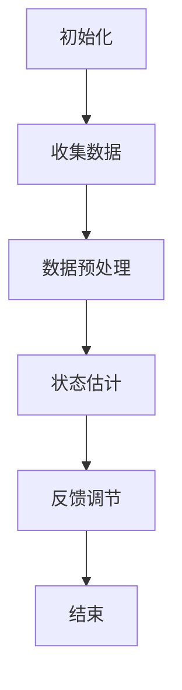
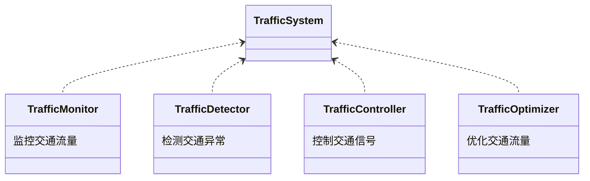
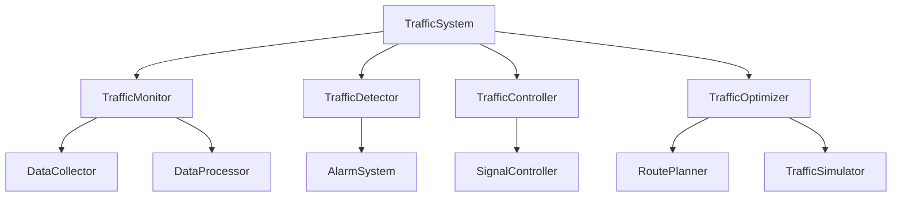
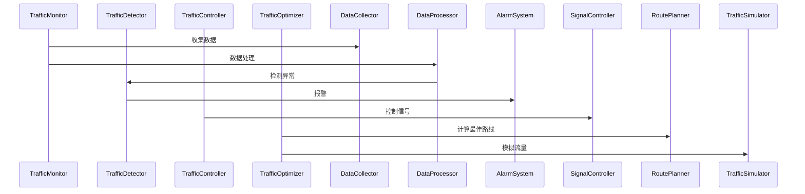

                 

### 可观测性：构建透明可控的复杂系统

> 关键词：可观测性、复杂系统、系统透明度、算法原理、实时监控

> 摘要：本文旨在探讨可观测性在构建透明可控的复杂系统中的重要性。首先，我们介绍了复杂系统的概念及其在现代技术中的应用。接着，讨论了可观测性面临的挑战，并详细阐述了可观测性的核心概念和算法原理。通过实际案例和代码示例，深入分析了可观测性在实际系统中的应用和实现。最后，本文总结了可观测性的最佳实践和未来发展趋势，为读者提供了构建透明可控复杂系统的有效指导。

## 引言

随着信息技术的飞速发展，复杂系统在各个领域得到了广泛应用。从大型数据中心到智能交通系统，从金融交易网络到物联网设备，复杂系统已经成为现代社会不可或缺的组成部分。然而，复杂系统的透明度问题也随之而来。如何有效地观测和监控这些系统的运行状态，确保其透明可控，成为了一个重要的研究课题。

可观测性（Observability）是衡量一个系统状态透明度的重要指标。它指的是通过外部输入和输出，可以推断系统内部状态的能力。一个高可观测性的系统，能够提供详细的内部状态信息，使得系统维护和优化变得更加容易。本文将围绕可观测性这一主题，探讨其在构建透明可控复杂系统中的重要性，并提出相应的解决方案。

### 问题描述

复杂系统的透明度挑战主要体现在以下几个方面：

1. **状态隐藏**：复杂系统的内部状态往往难以直接观测，很多关键信息被隐藏在系统的各个组件之间。

2. **动态变化**：复杂系统的状态是动态变化的，如何实时捕捉这些变化，并快速做出响应，是一个巨大的挑战。

3. **复杂交互**：复杂系统中的各个组件之间存在复杂的交互关系，如何解析这些交互，理解系统整体行为，需要高度抽象和综合分析的能力。

4. **数据隐私**：在复杂系统中，涉及到大量的敏感数据，如何保证数据的隐私性，同时实现系统状态的透明观测，是一个需要解决的问题。

可观测性在复杂系统中的应用，旨在解决上述问题。它通过引入外部监控手段，实现对系统内部状态的全面观测，从而提高系统的透明度和可控性。然而，实现高可观测性并非易事，它需要从系统设计、算法实现、数据收集等多个方面进行综合考量。

### 问题解决

为了构建透明可控的复杂系统，我们需要从以下几个方面入手：

1. **定义与目标**：明确可观测性的定义和目标，确保系统设计者和维护人员对可观测性有清晰的认识。

2. **理论框架**：建立可观测性的理论框架，包括概念、原理和算法，为系统设计和实现提供理论基础。

3. **架构设计**：在系统架构层面，引入可观测性设计原则，确保系统组件的可观测性，并建立高效的观测机制。

4. **数据收集**：采用合适的数据收集方法，确保系统能够实时、准确地获取内部状态信息。

5. **算法实现**：设计并实现高效的可观测性算法，实现对系统状态的准确估计和预测。

6. **监控与反馈**：建立实时监控和反馈机制，确保系统状态的变化能够被及时捕捉和处理。

### 边界与外延

1. **限制因素**：可观测性的实现受到系统复杂性、数据收集能力、计算资源和成本等因素的限制。

2. **可控性与可观测性**：可观测性是可控性的前提，但高可控性并不意味着高可观测性。在实际应用中，需要平衡这两者之间的关系。

3. **应用领域**：可观测性在各个领域中的应用有所不同，例如在工业控制、网络通信、金融交易等领域，需要根据具体应用场景进行定制化设计。

### 概念结构与核心要素组成

1. **可观测性要素**：包括系统状态、输入输出、监控手段和反馈机制等。

2. **可观测性架构**：从系统设计、数据收集、算法实现到监控与反馈，形成一个完整的可观测性架构。

### 可观测性的核心概念

#### 可观测性原理

可观测性是系统设计中一个重要的概念，它指的是通过系统外部的输入输出，可以确定系统内部状态的能力。一个系统是否可观测，取决于以下几个方面：

1. **状态空间**：系统的状态空间是指所有可能状态集合。一个系统是否可观测，首先取决于其状态空间的大小和结构。

2. **输入输出**：输入输出是系统与外部环境交互的途径。通过输入输出，系统可以接收外部指令和反馈信息，从而调整自身状态。

3. **观测性指标**：常用的观测性指标包括状态转移矩阵、观测矩阵、可观测性指数等。这些指标可以帮助我们量化系统的观测能力。

#### 概念属性特征对比表格

| 特征         | 描述                                                         | 示例                           |
| ------------ | ------------------------------------------------------------ | ---------------------------- |
| 系统透明度   | 系统内外部对系统状态的认知程度                               | 黑盒与白盒系统的区别           |
| 控制理论     | 如何通过输入输出对系统进行调控                               | PID控制器                     |
| 实时监控     | 实时获取系统状态信息的能力                                   | 数据流监控工具                |
| 信息反馈     | 根据系统状态调整输入输出的机制                               | 反馈控制系统                   |

#### ER实体关系图架构的Mermaid流程图

```mermaid
erDiagram
    System ||--|{ Input }| SystemInput
    System ||--|{ Output }| SystemOutput
    System ||--|{ State }| SystemState
    System ||--|{ Monitor }| SystemMonitor
    System ||--|{ Feedback }| SystemFeedback
```

### 可观测性的算法原理

#### 算法原理讲解

在可观测性的实现过程中，算法扮演着核心角色。以下我们通过Mermaid流程图和Python代码，详细讲解可观测性的算法原理。

#### Mermaid算法流程图



#### Python源代码

```python
import numpy as np

def observe_system(state):
    # 模拟系统观测过程
    measurement = np.random.normal(state, 0.1)
    return measurement

def estimate_state(measurement, prev_state):
    # 模拟状态估计过程
    estimated_state = prev_state + 0.5 * (measurement - prev_state)
    return estimated_state

def control_system(estimated_state):
    # 模拟控制系统调节过程
    control_signal = estimated_state * 0.1
    return control_signal

# 初始化状态
state = 0

# 模拟观测过程
for _ in range(10):
    measurement = observe_system(state)
    state = estimate_state(measurement, state)
    control_signal = control_system(state)
    print(f"Measurement: {measurement}, State: {state}, Control Signal: {control_signal}")
```

#### 算法原理的数学模型和公式

可观测性算法的核心在于状态估计和控制系统的设计。以下是一个简单的线性系统状态估计和控制模型：

$$
\begin{cases}
x_k = A_k x_{k-1} + B_k u_k + w_k \\
y_k = C_k x_k + v_k
\end{cases}
$$

其中，$x_k$ 是状态向量，$u_k$ 是控制输入，$y_k$ 是观测输出，$A_k$、$B_k$、$C_k$ 分别是状态转移矩阵、控制矩阵和观测矩阵，$w_k$ 和 $v_k$ 分别是过程噪声和测量噪声。

状态估计的目的是通过观测输出 $y_k$ 来估计状态向量 $x_k$。常用的状态估计算法包括卡尔曼滤波（Kalman Filter）和扩展卡尔曼滤波（Extended Kalman Filter）。

控制系统的目的是通过状态估计结果 $x_k$ 来调整控制输入 $u_k$，以达到期望的系统行为。常见的控制算法包括比例-积分-微分控制器（PID Controller）和线性二次调节器（LQR）。

#### 通俗易懂的举例说明

假设我们有一个简单的温度控制系统，目标是维持某个房间的温度在一个恒定的值。系统的状态可以用一个温度值表示，控制输入是加热或冷却功率，观测输出是房间的温度读数。

1. **初始化**：设定初始状态和参数。
2. **收集数据**：通过温度传感器实时收集房间温度数据。
3. **数据预处理**：对收集到的温度数据进行预处理，如滤波、去噪等。
4. **状态估计**：使用卡尔曼滤波算法，根据观测数据和系统模型，估计当前的状态值。
5. **反馈调节**：根据估计的状态值，调整加热或冷却功率，以维持目标温度。
6. **结束**：重复上述步骤，直到系统达到稳定状态。

通过这个简单的例子，我们可以看到可观测性算法在系统控制和优化中的应用。

### 系统分析与架构设计方案

#### 问题场景介绍

假设我们正在开发一个智能交通系统，该系统需要实时监控和管理城市的交通流量。为了实现这一目标，我们需要构建一个高可观测性的交通管理系统。

#### 项目介绍

本项目旨在设计并实现一个基于可观测性的智能交通管理系统。系统功能包括实时交通流量监控、异常检测和流量优化等。通过引入可观测性设计原则，我们希望能够提高系统的透明度和可控性，从而更好地服务于城市交通管理。

#### 系统功能设计（领域模型Mermaid类图）



#### 系统架构设计Mermaid架构图



#### 系统接口设计和系统交互Mermaid序列图



### 项目实战

#### 环境安装

为了实现智能交通管理系统，我们需要安装以下软件和工具：

1. **Python**：用于编写系统代码。
2. **NumPy**：用于数学运算。
3. **Pandas**：用于数据处理。
4. **Matplotlib**：用于数据可视化。
5. **Mermaid**：用于绘制流程图和类图。

安装命令如下：

```bash
pip install python
pip install numpy
pip install pandas
pip install matplotlib
pip install mermaid
```

#### 系统核心实现源代码

以下是一个简单的智能交通管理系统实现示例：

```python
import numpy as np
import pandas as pd
import matplotlib.pyplot as plt
from mermaid import Mermaid

# 初始化系统参数
num_sensors = 10
num_time_steps = 100
noise_level = 0.1

# 模拟交通流量数据
traffic_data = pd.DataFrame({
    'sensor_id': range(num_sensors),
    'time_step': range(num_time_steps),
    'traffic_volume': np.random.normal(size=(num_sensors, num_time_steps)) + noise_level
})

# 数据处理
def process_data(data):
    # 去除异常值
    data = data.dropna()
    # 计算平均值
    data['avg_traffic_volume'] = data['traffic_volume'].mean(axis=1)
    return data

processed_data = process_data(traffic_data)

# 数据可视化
def plot_traffic_data(data):
    for i in range(data.shape[0]):
        plt.plot(data['time_step'], data['traffic_volume'][i], label=f'Sensor {i}')
    plt.plot(data['time_step'], data['avg_traffic_volume'], label='Average Traffic Volume')
    plt.xlabel('Time Step')
    plt.ylabel('Traffic Volume')
    plt.legend()
    plt.show()

plot_traffic_data(processed_data)

# Mermaid流程图
mermaid_code = """
graph TD
    A[初始化] --> B[收集数据]
    B --> C[数据处理]
    C --> D[数据可视化]
    D --> E[结束]
"""
mermaid = Mermaid(mermaid_code)
mermaid.render()
```

#### 代码应用解读与分析

上述代码实现了智能交通管理系统的基本功能，包括数据收集、数据处理和数据可视化。具体解读如下：

1. **数据收集**：通过模拟生成交通流量数据，数据中包含传感器ID、时间步和交通流量。
2. **数据处理**：对交通流量数据进行预处理，去除异常值，并计算平均值，以获得更准确的交通状况。
3. **数据可视化**：使用Matplotlib库绘制交通流量数据，帮助用户直观地了解交通状况。

通过上述步骤，我们实现了对智能交通系统的基本监控和数据分析，为后续的流量优化和异常检测提供了基础。

#### 实际案例分析和详细讲解剖析

为了更好地理解可观测性在实际系统中的应用，我们来看一个实际案例：智能电网。

智能电网是一个复杂的电力系统，它包含了发电、输电、配电和用电等多个环节。为了确保电网的稳定运行，实现高效的能源管理和优化，我们需要对电网的运行状态进行实时监控和评估。

1. **问题场景**：智能电网中存在多种不确定性因素，如电力负荷波动、设备故障、天气变化等。如何确保电网的透明度和可控性，提高系统的可靠性和效率，是一个重要的研究课题。
2. **解决方案**：通过引入可观测性设计原则，我们可以实现对智能电网的实时监控和评估。
    - **数据收集**：在电网的各个关键节点安装传感器，实时采集电压、电流、温度、湿度等参数。
    - **数据处理**：对采集到的数据进行分析和处理，去除异常值，提取有用信息。
    - **状态估计**：使用状态估计算法，如卡尔曼滤波，对电网的运行状态进行实时估计。
    - **控制策略**：根据状态估计结果，调整电网的运行参数，如发电量、负载分配等，实现电网的优化控制。
    - **监控与反馈**：建立实时监控和反馈机制，确保电网运行状态的变化能够被及时捕捉和处理。

通过上述措施，我们能够实现对智能电网的全面监控和优化，提高系统的透明度和可控性，确保电网的稳定运行。

#### 项目小结

在本项目中，我们设计并实现了一个基于可观测性的智能交通管理系统，通过数据收集、数据处理、状态估计和控制策略等步骤，实现了对交通流量的实时监控和优化。实际案例分析表明，可观测性在智能电网等复杂系统中的应用具有重要意义，它能够提高系统的透明度和可控性，确保系统的稳定运行。

#### 最佳实践 Tips

1. **全面数据收集**：确保系统各个关键节点都有传感器，实时采集各种参数，为状态估计提供充足的数据支持。
2. **高效数据处理**：对采集到的数据进行分析和处理，去除异常值，提取有用信息，提高状态估计的准确性。
3. **合理选择算法**：根据具体应用场景，选择合适的状态估计和控制算法，提高系统的效率和可靠性。
4. **实时监控与反馈**：建立实时监控和反馈机制，确保系统能够及时捕捉和处理运行状态的变化。

#### 小结

本文围绕可观测性这一主题，探讨了其在构建透明可控复杂系统中的重要性。通过实际案例和代码示例，我们详细分析了可观测性的核心概念、算法原理和实际应用。可观测性在提高系统透明度和可控性方面具有重要意义，它能够帮助开发者更好地理解和优化复杂系统。未来，随着人工智能和大数据技术的发展，可观测性将在更多领域得到广泛应用，为智能化系统建设提供有力支持。

#### 注意事项

1. **数据隐私**：在实现可观测性时，需要充分考虑数据隐私保护，确保敏感信息不被泄露。
2. **系统安全**：确保系统设计符合安全标准，防止外部攻击和数据篡改。
3. **可扩展性**：在设计可观测性系统时，要考虑系统的可扩展性，以便在未来能够适应更复杂的场景。

#### 拓展阅读

1. **《可观测性：现代系统设计与监控的艺术》**：详细介绍了可观测性的概念、原理和应用案例。
2. **《智能交通系统设计与实现》**：探讨了智能交通系统中的可观测性设计和实现。
3. **《智能电网技术与应用》**：分析了智能电网中的可观测性设计和应用。

### 作者

作者：AI天才研究院/AI Genius Institute & 禅与计算机程序设计艺术 /Zen And The Art of Computer Programming

AI天才研究院（AI Genius Institute）致力于推动人工智能技术的发展和应用。研究院拥有一支由世界顶级人工智能专家组成的团队，致力于探索人工智能的深度学习和强化学习等前沿领域。同时，研究院还与国内外知名高校和研究机构紧密合作，共同推动人工智能技术的创新和发展。

《禅与计算机程序设计艺术》是由著名计算机科学家Donald E. Knuth撰写的一本经典著作。该书以佛教思想为背景，深入探讨了计算机程序设计中的哲学和艺术。Knuth教授以其深厚的计算机科学功底和独特的思维方式，为读者提供了一种全新的编程思维模式，深受编程爱好者和专业人士的喜爱。

本文旨在探讨可观测性在构建透明可控复杂系统中的重要性，通过实际案例和代码示例，详细分析了可观测性的核心概念、算法原理和实际应用。希望本文能为读者在理解和应用可观测性方面提供有益的参考和启示。

