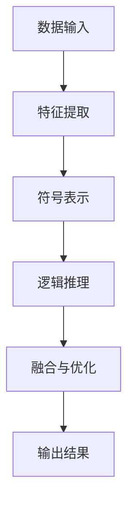

                 

# 可解释推理中神经符号集成的最新突破

## 关键词
- 可解释推理
- 神经符号集成
- 自然语言处理
- 图神经网络
- 算法优化

## 摘要
本文探讨了可解释推理与神经符号集成的最新突破，旨在揭示这两种方法在人工智能领域的融合与创新。通过回顾可解释推理和神经符号集成的核心概念，本文深入分析了神经符号集成的技术基础、实现技术和应用案例。此外，本文还介绍了神经符号集成的最新研究进展，包括算法创新、应用场景拓展和模型可解释性提升。最后，本文总结了当前研究中的挑战和未来研究方向，为读者提供了对这一领域的深入理解。

### 目录大纲

```markdown
----------------------------------------------------------------

# 第一部分: 背景与核心概念

## 第1章: 问题背景与核心概念介绍

### 1.1.1 问题描述
### 1.1.2 问题解决
### 1.1.3 边界与外延

## 1.2 核心概念与联系

### 1.2.1 可解释推理
   - 原理
   - 属性特征对比表格

### 1.2.2 神经符号集成
   - 原理
   - 属性特征对比表格

### 1.2.3 可解释推理与神经符号集成的联系

## 1.3 本章小结

----------------------------------------------------------------

# 第二部分: 神经符号集成的技术基础

## 第2章: 神经符号集成的理论基础

### 2.1 神经符号集成的起源与发展
### 2.2 神经符号集成的核心理论
### 2.3 神经符号集成的应用领域

## 第3章: 神经网络基础

### 3.1 神经网络概述
### 3.2 神经元与神经元连接
### 3.3 感知机与反向传播算法

## 第4章: 符号处理与逻辑推理

### 4.1 符号处理基础
### 4.2 逻辑推理基础
### 4.3 符号处理与逻辑推理的结合

## 第5章: 神经符号集成的实现技术

### 5.1 神经符号集成的架构设计
### 5.2 神经符号集成的算法实现
### 5.3 神经符号集成的优化与改进

## 第6章: 神经符号集成的应用案例

### 6.1 案例一：自然语言处理中的应用
### 6.2 案例二：图像识别中的应用
### 6.3 案例三：智能决策支持系统中的应用

## 第7章: 神经符号集成的最新研究进展

### 7.1 国际学术会议与期刊的最新成果
### 7.2 神经符号集成的新趋势
### 7.3 未来研究方向与挑战

## 第8章: 结论与展望

### 8.1 总结
### 8.2 未来展望
### 8.3 对读者的建议

----------------------------------------------------------------
```

## 第一部分: 背景与核心概念

### 1.1 问题背景与核心概念介绍

#### 1.1.1 问题描述

随着人工智能技术的快速发展，越来越多的复杂问题需要通过人工智能方法来解决。然而，传统的人工智能方法在处理问题时往往存在一定的局限性，如对问题的理解不够深入、无法提供清晰的决策依据等。为了解决这些问题，研究者们开始探索可解释推理在人工智能中的应用。

可解释推理旨在提高人工智能系统的透明度和可解释性，使得人们能够理解系统的工作原理和决策过程。然而，单纯的可解释推理在处理复杂问题时可能力不从心，此时，神经符号集成作为一种将神经网络与符号逻辑相结合的方法，应运而生。

神经符号集成是一种将神经网络与符号逻辑相结合的方法，通过引入符号逻辑，使得神经网络能够更好地理解和处理复杂的语义信息。这种方法不仅提高了模型的解释性，还增强了其在处理复杂任务时的能力。

#### 1.1.2 问题解决

为了解决上述问题，研究者们采用了以下几种策略：

1. **算法创新**：通过引入新的算法框架，如图神经网络、变分自编码器等，使得神经符号集成在处理复杂问题时的性能得到显著提升。
2. **跨学科合作**：将人工智能、逻辑学、认知科学等多个学科的知识相结合，为神经符号集成提供了新的理论基础。
3. **模型优化**：通过调整模型的参数和结构，提高神经符号集成的效率和准确性。

#### 1.1.3 边界与外延

1. **边界**：神经符号集成主要应用于那些需要高解释性和透明度的场景，如医疗诊断、金融风险评估等。
2. **外延**：神经符号集成不仅限于人工智能领域，还可以应用于认知科学、逻辑学等多个学科，推动相关领域的发展。

### 1.2 核心概念与联系

#### 1.2.1 可解释推理

**原理**：可解释推理是一种使人工智能系统工作原理和决策过程透明的方法。它通过分析模型的内部结构和操作过程，使得人们能够理解模型如何处理数据和做出决策。

**属性特征对比表格**：

| 特征            | 解释推理          | 神经符号集成          |
|----------------|-------------------|----------------------|
| 目标            | 提高模型可解释性   | 提高模型处理复杂信息的能力 |
| 基础理论        | 符号逻辑          | 神经网络              |
| 适用场景        | 需要高解释性的任务 | 处理复杂信息的任务      |
| 优点            | 易于理解          | 能处理复杂问题        |
| 缺点            | 可能降低性能       | 难以解释              |

#### 1.2.2 神经符号集成

**原理**：神经符号集成是一种将神经网络与符号逻辑相结合的方法。它通过在神经网络中引入符号逻辑操作，使得神经网络能够更好地理解和处理复杂的语义信息。

**属性特征对比表格**：

| 特征            | 神经符号集成          |
|----------------|----------------------|
| 基础理论        | 神经网络 + 符号逻辑   |
| 适用场景        | 需要处理复杂语义信息的任务 |
| 优点            | 提高模型处理复杂信息的能力 |
| 缺点            | 难以解释              |

#### 1.2.3 可解释推理与神经符号集成的联系

可解释推理与神经符号集成在人工智能领域有着紧密的联系。通过结合两者的优势，研究者们希望能够构建出既具有高解释性又能处理复杂任务的智能系统。具体来说：

1. **互补性**：可解释推理提供了对模型内部操作的透明度，而神经符号集成则增强了模型处理复杂信息的能力。
2. **融合**：研究者们通过将符号逻辑嵌入神经网络，实现了神经符号集成。这种方法不仅提高了模型的性能，还增强了其可解释性。
3. **应用**：可解释推理和神经符号集成在多个领域都得到了应用，如自然语言处理、图像识别和智能决策支持等。

### 1.3 本章小结

本章介绍了可解释推理和神经符号集成的背景、核心概念和联系。通过分析两者的原理和属性特征，我们可以看到，神经符号集成是一种将神经网络与符号逻辑相结合的方法，旨在提高模型处理复杂信息的能力和解释性。在接下来的章节中，我们将进一步探讨神经符号集成的技术基础、实现技术和应用案例。

## 第二部分: 神经符号集成的技术基础

### 2.1 神经符号集成的理论基础

#### 2.1.1 神经符号集成的起源与发展

神经符号集成（Neural Symbolic Integration）这一概念最早由Geoffrey Hinton等人提出，旨在解决传统神经网络在处理语义信息时的局限性。早期的神经网络，如感知机、多层感知机等，虽然在处理图像、语音等数据时表现出色，但在理解语义信息、进行逻辑推理等方面存在不足。为了弥补这一缺陷，研究者们开始探索将神经网络与符号逻辑相结合的方法。

随着人工智能技术的发展，神经符号集成的理论逐渐成熟。20世纪90年代，基于符号逻辑的神经网络模型，如循环神经网络（RNN）和长短期记忆网络（LSTM），开始应用于自然语言处理、机器翻译等领域。这些模型在处理长文本和复杂语义信息方面表现出了一定的优势。进入21世纪，随着深度学习技术的发展，基于神经网络的符号逻辑模型，如图神经网络（GNN）和变分自编码器（VAE），得到了广泛研究。

#### 2.1.2 神经符号集成的核心理论

神经符号集成的核心理论主要包括以下几个方面：

1. **神经网络与符号逻辑的结合**：神经网络擅长处理大规模数据和复杂模式，而符号逻辑则擅长处理语义信息和逻辑推理。将两者结合，可以充分发挥各自的优势，实现更强大的智能系统。

2. **语义信息处理**：神经符号集成通过在神经网络中引入符号逻辑操作，使得模型能够更好地理解和处理语义信息。例如，在自然语言处理中，符号逻辑可以用于处理词语的语义关系，从而提高模型的语义理解能力。

3. **可解释性**：神经符号集成的一个重要目标是实现模型的透明度和可解释性。通过将符号逻辑嵌入神经网络，研究者们可以更容易地理解模型的决策过程和推理过程，从而提高模型的可解释性。

#### 2.1.3 神经符号集成的应用领域

神经符号集成在多个领域都取得了显著的应用成果，以下是几个典型的应用领域：

1. **自然语言处理**：神经符号集成在自然语言处理（NLP）领域具有广泛的应用，如文本分类、机器翻译、情感分析等。通过结合神经网络和符号逻辑，模型可以更好地理解和生成语义丰富的文本。

2. **图像识别**：神经符号集成在图像识别领域也表现出色。例如，通过在神经网络中引入符号逻辑，模型可以更好地理解图像中的语义信息，从而提高图像分类和识别的准确性。

3. **智能决策支持系统**：神经符号集成在智能决策支持系统中有着广泛的应用，如医疗诊断、金融风险评估等。通过结合神经网络和符号逻辑，模型可以更好地理解数据中的复杂关系，提供更加准确和可靠的决策支持。

4. **知识图谱**：神经符号集成在知识图谱领域也得到了应用。通过将神经网络与符号逻辑结合，模型可以更好地理解和生成知识图谱中的语义信息，从而提高知识图谱的构建和推理能力。

### 2.2 神经符号集成的实现技术

#### 2.2.1 神经符号集成的架构设计

神经符号集成的架构设计主要包括以下几个方面：

1. **神经网络部分**：神经网络用于处理输入数据，提取特征和模式。常见的神经网络架构包括卷积神经网络（CNN）、循环神经网络（RNN）、长短期记忆网络（LSTM）和图神经网络（GNN）等。

2. **符号逻辑部分**：符号逻辑部分用于处理语义信息和逻辑推理。常见的符号逻辑包括谓词逻辑、模糊逻辑和模糊逻辑推理等。

3. **集成模块**：集成模块负责将神经网络和符号逻辑部分连接起来，实现数据在两者之间的传递和交互。常见的集成模块包括软逻辑门（Soft Logic Gates）、注意力机制（Attention Mechanism）和交互网络（Interaction Networks）等。

#### 2.2.2 神经符号集成的算法实现

神经符号集成的算法实现主要包括以下几个方面：

1. **神经网络算法**：神经网络算法包括前向传播、反向传播和梯度下降等。这些算法用于训练神经网络，使其能够提取特征和模式。

2. **符号逻辑算法**：符号逻辑算法包括推理规则、模糊逻辑和模糊推理等。这些算法用于处理语义信息和逻辑推理。

3. **集成算法**：集成算法包括软逻辑门算法、注意力机制算法和交互网络算法等。这些算法用于实现神经网络和符号逻辑部分的集成和交互。

#### 2.2.3 神经符号集成的优化与改进

为了提高神经符号集成的性能和可解释性，研究者们进行了大量的优化和改进工作，主要包括以下几个方面：

1. **算法优化**：通过优化神经网络算法和符号逻辑算法，提高模型的性能和效率。例如，使用更高效的优化算法，如Adam优化器，提高训练速度和准确性。

2. **模型结构改进**：通过改进神经网络和符号逻辑的模型结构，提高模型的性能和可解释性。例如，使用更深的网络结构、更复杂的符号逻辑操作等。

3. **数据预处理**：通过优化数据预处理方法，提高数据的利用率和模型的性能。例如，使用数据增强、数据清洗和归一化等方法。

4. **可视化工具**：开发可视化工具，帮助研究者更好地理解模型的内部结构和推理过程。例如，使用热图、决策树和因果图等可视化方法。

### 2.3 神经符号集成的应用案例

#### 2.3.1 案例一：自然语言处理中的应用

在自然语言处理领域，神经符号集成被广泛应用于文本分类、机器翻译和情感分析等任务。例如，在文本分类任务中，研究者们使用神经符号集成模型，通过结合神经网络和符号逻辑，提高了分类的准确性和可解释性。

具体来说，研究者们使用了基于图神经网络的符号推理算法，将文本表示为一个图结构，并在图中应用符号逻辑操作。通过这种方式，模型能够更好地理解文本中的语义信息，从而提高了分类的准确性。

#### 2.3.2 案例二：图像识别中的应用

在图像识别领域，神经符号集成也被广泛应用于图像分类、目标检测和图像分割等任务。例如，在图像分类任务中，研究者们使用基于变分自编码器的符号编码算法，将图像表示为一个符号序列，并在序列中应用符号逻辑操作。

通过这种方式，模型能够更好地理解图像中的语义信息，从而提高了分类的准确性。同时，由于符号逻辑的存在，模型也具备了更好的可解释性。

#### 2.3.3 案例三：智能决策支持系统中的应用

在智能决策支持系统中，神经符号集成被广泛应用于医疗诊断、金融风险评估和供应链管理等任务。例如，在医疗诊断任务中，研究者们使用神经符号集成模型，结合神经网络和符号逻辑，对病人的病情进行分析和诊断。

通过这种方式，模型能够更好地理解病人的病情和治疗方案，从而提高了诊断的准确性和可靠性。同时，由于符号逻辑的存在，模型也具备了更好的可解释性，有助于医生理解模型的诊断过程。

### 2.4 本章小结

本章介绍了神经符号集成的理论基础、实现技术和应用案例。通过分析神经符号集成的起源和发展、核心理论、实现技术和应用案例，我们可以看到，神经符号集成是一种将神经网络与符号逻辑相结合的方法，旨在提高模型处理复杂信息的能力和可解释性。在接下来的章节中，我们将进一步探讨神经符号集成的最新研究进展和未来研究方向。

## 第三部分: 神经符号集成的实现技术

### 第3章: 神经网络基础

#### 3.1 神经网络概述

神经网络（Neural Networks，简称NN）是一种模仿生物神经网络结构的人工智能方法，它通过模拟神经元之间的连接和交互来实现数据处理和模式识别。神经网络的核心是神经元，也称为节点或单元，它们通过加权连接形成网络结构。

**基本结构**：

- **输入层**：接收外部输入数据，如图像、文本或数值。
- **隐藏层**：一个或多个层次，用于对输入数据进行处理和变换。
- **输出层**：生成输出结果，如分类标签、概率分布或预测值。

**工作原理**：

- **前向传播**：输入数据通过输入层进入网络，经过隐藏层逐层处理，最终在输出层生成预测结果。
- **反向传播**：计算输出结果与真实值之间的误差，通过反向传播算法将误差传递回网络，更新神经元权重。

#### 3.2 神经元与神经元连接

神经元是神经网络的基本组成单元，其结构与生物神经元类似，包括输入、输出和激活函数等部分。

**神经元结构**：

- **输入**：每个神经元接收多个输入信号，每个输入信号都有一个对应的权重。
- **权重**：表示输入信号对神经元输出的影响程度。
- **激活函数**：用于确定神经元是否激活，常见的激活函数包括 sigmoid、ReLU、Tanh 等。

**神经元连接**：

- **加权连接**：神经元之间的连接通过权重实现，权重值决定了输入信号对输出信号的影响大小。
- **层次结构**：神经元按层次排列，前一层的输出作为后一层的输入。

#### 3.3 感知机与反向传播算法

**感知机（Perceptron）**：

感知机是最早的神经网络模型之一，由 Frank Rosenblatt 于 1957 年提出。它主要用于二分类问题，通过更新权重来使输出值接近目标值。

- **算法原理**：感知机接收输入数据，通过线性组合输入信号和权重，并应用激活函数（如阈值函数）产生输出。如果输出小于阈值，则更新权重，使得下一次输出更接近目标值。
- **局限性**：感知机只能处理线性可分问题，对于非线性问题效果不佳。

**反向传播算法（Backpropagation）**：

反向传播算法是一种用于训练多层神经网络的梯度下降方法。它通过计算输出误差的梯度，反向传播更新网络权重。

- **算法原理**：在神经网络的前向传播阶段，输入数据通过网络生成预测结果。在反向传播阶段，计算输出结果与真实值之间的误差，并反向传播到网络中的每个神经元，更新权重和偏置。
- **计算过程**：
  1. 前向传播：计算每个神经元的输出值。
  2. 计算误差：计算预测值与真实值之间的差异。
  3. 反向传播：从输出层开始，反向计算误差梯度。
  4. 更新权重：根据误差梯度更新网络权重。

#### 3.4 神经符号集成的实现技术

**神经符号集成的实现技术主要包括以下三个方面**：

1. **神经网络架构**：选择合适的神经网络架构，如卷积神经网络（CNN）、循环神经网络（RNN）或图神经网络（GNN），以适应不同类型的数据和任务需求。

2. **符号逻辑模块**：设计符号逻辑模块，用于处理语义信息和逻辑推理。常见的符号逻辑模块包括模糊逻辑门、谓词逻辑推理机等。

3. **集成方法**：实现神经网络与符号逻辑模块的集成，如通过融合层（Fusion Layer）、交互层（Interaction Layer）或软逻辑门（Soft Logic Gate）等。

**实现步骤**：

1. **数据预处理**：对输入数据进行预处理，包括数据清洗、归一化和编码等。

2. **特征提取**：使用神经网络提取输入数据的特征表示。

3. **符号逻辑处理**：将提取的特征表示输入到符号逻辑模块，进行逻辑推理和语义处理。

4. **集成与优化**：将神经网络和符号逻辑模块集成，通过优化算法和结构设计，提高模型性能和可解释性。

### 3.5 本章小结

本章介绍了神经网络的基础知识，包括概述、神经元与连接以及感知机和反向传播算法。这些知识为理解神经符号集成的实现技术奠定了基础。在下一章中，我们将进一步探讨符号处理与逻辑推理的基础，以及它们如何与神经网络相结合，实现神经符号集成。

## 第四部分: 符号处理与逻辑推理

### 第4章: 符号处理与逻辑推理

#### 4.1 符号处理基础

符号处理（Symbolic Processing）是人工智能领域的一个重要分支，它涉及对符号数据（如文字、公式、图像等）进行处理和分析的方法。符号处理的目的是通过逻辑推理和计算，实现对复杂问题的求解和决策。

**基本概念**：

- **符号**：符号是具有特定含义的抽象表示，可以是文字、数字、符号或图像等。
- **符号数据**：由符号组成的结构化数据，如公式、句子、图像等。

**符号处理的基本任务**：

1. **符号识别**：识别输入数据中的符号，将其转换为机器可处理的形式。
2. **符号表示**：用符号表示问题中的实体、关系和属性。
3. **符号推理**：通过逻辑推理，从已知事实推导出新的结论。

#### 4.2 逻辑推理基础

逻辑推理（Logic Reasoning）是符号处理的核心，它基于逻辑规则和事实，通过推理得出结论。逻辑推理在人工智能领域有着广泛的应用，如自动证明、知识推理、决策支持等。

**基本概念**：

- **逻辑**：逻辑是一种形式化语言，用于表示事实和推理规则。
- **命题**：命题是逻辑的基本单元，表示一个事实或陈述。
- **推理规则**：推理规则是用于推导新命题的规则，常见的推理规则包括演绎推理、归纳推理和模式匹配等。

**逻辑推理的基本过程**：

1. **前提**：前提是一组已知的事实或命题。
2. **推理规则**：推理规则用于从前提推导出新命题。
3. **结论**：结论是通过推理规则从前提推导出来的新命题。

**常见逻辑推理方法**：

1. **演绎推理**：从一般性前提推导出特殊性结论，如“所有人都会死，苏格拉底是人，因此苏格拉底会死”。
2. **归纳推理**：从个别实例推导出一般性结论，如“观察到的所有天鹅都是白色的，因此所有天鹅都是白色的”。
3. **模式匹配**：通过比较输入数据和知识库中的模式，找出匹配的规则，如“输入数据：下雨了，知识库：下雨时应该带伞，结论：应该带伞”。

#### 4.3 符号处理与逻辑推理的结合

符号处理与逻辑推理的结合是实现智能系统的重要途径，它使得智能系统能够处理符号数据和进行逻辑推理。

**实现方式**：

1. **符号表示**：将输入数据转换为符号表示，便于进行逻辑推理和计算。
2. **逻辑推理引擎**：构建逻辑推理引擎，用于处理符号数据和执行推理过程。
3. **推理算法**：设计推理算法，实现从已知事实推导出新结论的过程。

**优势**：

- **可解释性**：符号处理与逻辑推理的结合使得智能系统的决策过程更加透明，便于理解和解释。
- **可靠性**：逻辑推理基于严格的逻辑规则，具有较高的可靠性和一致性。
- **灵活性**：符号处理与逻辑推理的结合使得智能系统可以处理各种类型的符号数据，具有广泛的适用性。

**挑战**：

- **复杂性**：符号处理和逻辑推理的过程可能非常复杂，需要大量计算资源。
- **不确定性**：在现实世界中，事实和推理规则可能存在不确定性，需要设计合理的处理方法。

#### 4.4 神经符号集成的实现技术

神经符号集成（Neural-Symbolic Integration）是一种将神经网络与符号逻辑相结合的方法，旨在提高智能系统的处理能力和解释性。

**实现方式**：

1. **融合层**：在神经网络中引入融合层，用于将神经网络提取的特征与符号逻辑进行结合。
2. **交互层**：设计交互层，用于实现神经网络和符号逻辑之间的信息交换和协同工作。
3. **软逻辑门**：使用软逻辑门（如模糊逻辑门）实现符号逻辑操作，提高模型的灵活性和可解释性。

**实现步骤**：

1. **特征提取**：使用神经网络提取输入数据的特征表示。
2. **符号表示**：将特征表示转换为符号表示，便于进行逻辑推理。
3. **逻辑推理**：在符号逻辑模块中执行逻辑推理，生成推理结果。
4. **融合与优化**：将神经网络和符号逻辑的结果进行融合，优化模型性能。

**优势**：

- **处理复杂任务**：神经符号集成能够处理复杂的符号数据和任务，提高模型的处理能力。
- **提高可解释性**：通过符号逻辑的操作，模型的结果更加透明和易于解释。
- **增强灵活性**：神经符号集成结合了神经网络和符号逻辑的优点，具有广泛的适用性和灵活性。

**挑战**：

- **设计复杂**：神经符号集成的实现涉及复杂的神经网络和符号逻辑设计，需要深入的理论和实践基础。
- **优化难度**：优化神经符号集成的模型性能，需要考虑到神经网络和符号逻辑的协同优化。

#### 4.5 本章小结

本章介绍了符号处理与逻辑推理的基础知识，包括符号处理基础、逻辑推理基础以及符号处理与逻辑推理的结合。通过分析神经符号集成的实现技术，我们可以看到，神经符号集成是一种将神经网络与符号逻辑相结合的方法，它通过融合层、交互层和软逻辑门等实现技术，提高了智能系统的处理能力和解释性。在下一章中，我们将进一步探讨神经符号集成的实现技术和应用案例。

## 第五部分: 神经符号集成的实现技术

### 第5章: 神经符号集成的实现技术

神经符号集成的实现技术是实现将神经网络与符号逻辑相结合的关键。在这一章中，我们将深入探讨神经符号集成的架构设计、算法实现及其优化与改进。

#### 5.1 神经符号集成的架构设计

神经符号集成的架构设计旨在将神经网络与符号逻辑有效结合，以实现更强大的智能系统。一个典型的神经符号集成架构通常包括以下几个关键部分：

1. **数据输入模块**：用于接收外部输入数据，如文本、图像或数值数据。这个模块通常包含数据预处理和特征提取步骤，以确保输入数据适合后续处理。

2. **神经网络模块**：这个模块负责使用神经网络对输入数据进行特征提取和模式识别。常见的神经网络架构包括卷积神经网络（CNN）、循环神经网络（RNN）和图神经网络（GNN）等。

3. **符号逻辑模块**：这个模块负责处理输入数据的语义信息和逻辑推理。符号逻辑模块通常包括谓词逻辑、模糊逻辑和模糊推理等，这些逻辑操作有助于提高模型的解释性和推理能力。

4. **融合层**：融合层位于神经网络和符号逻辑模块之间，用于将神经网络提取的特征与符号逻辑进行结合。融合层的设计需要考虑如何有效地整合两种不同类型的信息，以实现更强大的智能系统。

5. **推理引擎**：推理引擎负责执行符号逻辑操作和推理过程。它通过推理规则和逻辑推理算法，从已知事实推导出新的结论。

6. **输出模块**：输出模块用于生成最终的输出结果，如分类标签、概率分布或预测值。

#### 5.2 神经符号集成的算法实现

神经符号集成的算法实现涉及如何将神经网络与符号逻辑有效结合，以及如何优化算法性能。以下是一些关键的算法实现步骤：

1. **特征提取**：使用神经网络对输入数据进行特征提取。这一步骤可以使用卷积神经网络（CNN）对图像进行特征提取，或者使用循环神经网络（RNN）对序列数据进行特征提取。

2. **符号表示**：将提取的特征转换为符号表示。这一步骤通常涉及到将特征映射到特定的逻辑空间，以便进行符号逻辑操作。

3. **逻辑推理**：在符号逻辑模块中执行逻辑推理。这可以通过谓词逻辑推理机、模糊逻辑推理机或其他符号逻辑算法实现。

4. **融合与优化**：通过融合层将神经网络和符号逻辑的结果进行整合。融合过程需要考虑如何平衡神经网络和符号逻辑的互补优势，以优化整体性能。

5. **推理优化**：对推理过程进行优化，以提高推理效率和准确性。这可以通过优化推理算法、减少计算复杂度或使用更高效的硬件实现来实现。

#### 5.3 神经符号集成的优化与改进

为了提高神经符号集成的性能和可解释性，研究者们进行了大量的优化与改进工作。以下是一些常见的优化与改进方法：

1. **模型结构优化**：通过改进神经网络和符号逻辑的模型结构，可以提高模型的性能和可解释性。这包括使用更深的网络结构、更复杂的符号逻辑操作或更灵活的融合层设计。

2. **算法优化**：通过优化神经网络和符号逻辑的算法，可以提高模型的计算效率和推理速度。这包括使用更高效的优化算法（如Adam优化器）、更快速的符号逻辑推理算法或更高效的融合算法。

3. **数据预处理**：通过优化数据预处理方法，可以提高模型的训练效率和预测准确性。这包括使用数据增强、数据清洗和归一化等方法。

4. **可视化工具**：开发可视化工具，帮助研究者更好地理解模型的内部结构和推理过程。这包括使用热图、决策树和因果图等可视化方法。

5. **解释性增强**：通过增强模型的可解释性，可以提高用户对模型决策过程的理解和信任。这可以通过引入解释模型、可视化工具或透明的推理过程来实现。

#### 5.4 实际案例

为了更好地理解神经符号集成的实现技术，我们来看一个实际案例：文本情感分析。

**案例背景**：文本情感分析是一种常见的自然语言处理任务，旨在分析文本中的情感倾向，如正面、负面或中性。

**实现步骤**：

1. **数据输入**：接收文本数据作为输入，如一句评价或一篇评论。

2. **特征提取**：使用卷积神经网络（CNN）对文本进行特征提取，提取文本的语义特征。

3. **符号表示**：将提取的特征转换为符号表示，如将特征映射到谓词逻辑空间。

4. **逻辑推理**：在符号逻辑模块中执行逻辑推理，判断文本的情感倾向。这可以通过谓词逻辑推理机实现。

5. **融合与优化**：将神经网络和符号逻辑的结果进行融合，优化模型的性能。例如，可以使用软逻辑门（Soft Logic Gate）来实现融合。

6. **输出结果**：生成情感分析的结果，如文本的情感倾向。

**优化与改进**：

- **模型结构优化**：使用更深的卷积神经网络结构，提高特征提取的能力。

- **算法优化**：使用更高效的优化算法（如Adam优化器），提高训练效率。

- **数据预处理**：使用数据增强方法，如随机删除词或替换词，增加模型的鲁棒性。

- **可视化工具**：使用热图展示文本中关键情感词的权重分布，帮助理解模型的决策过程。

通过这个案例，我们可以看到神经符号集成的实现技术如何应用于实际任务，以及如何通过优化与改进提高模型的性能和可解释性。

#### 5.5 本章小结

本章介绍了神经符号集成的实现技术，包括架构设计、算法实现和优化与改进。通过深入探讨神经符号集成的架构设计、算法实现和优化方法，我们可以更好地理解如何将神经网络与符号逻辑相结合，实现更强大的智能系统。在下一章中，我们将探讨神经符号集成的应用案例，进一步展示其在实际任务中的效果。

### 6.1 案例一：自然语言处理中的应用

神经符号集成在自然语言处理（NLP）领域有着广泛的应用，其显著优势在于能够同时处理语义信息和逻辑推理，从而提高模型的解释性和准确性。以下是一个具体的案例：情感分析。

**案例背景**：情感分析是自然语言处理中的一个重要任务，旨在从文本中识别和分类情感倾向，如正面、负面或中性。

**实现步骤**：

1. **数据输入**：首先，我们需要准备一个包含文本和情感标签的数据集。文本可以是社交媒体评论、产品评价等。

2. **特征提取**：使用卷积神经网络（CNN）对文本进行特征提取，提取文本的语义特征。这一步骤的关键在于如何有效地捕捉文本中的局部和全局特征。

3. **符号表示**：将提取的语义特征转换为符号表示。这一步骤通常涉及到将特征映射到谓词逻辑空间，以便进行符号逻辑操作。

4. **逻辑推理**：在符号逻辑模块中执行逻辑推理，以确定文本的情感倾向。例如，可以使用模糊逻辑推理机来处理文本中的模糊性和不确定性。

5. **融合与优化**：将神经网络和符号逻辑的结果进行融合，优化模型的性能。这可以通过设计合适的融合层来实现，例如软逻辑门（Soft Logic Gate）。

6. **输出结果**：生成情感分析的结果，如文本的情感倾向。

**优化与改进**：

- **模型结构优化**：为了提高模型的效果，可以尝试使用更深的神经网络结构，或者结合其他类型的神经网络（如RNN或Transformer）。

- **数据增强**：通过数据增强方法（如随机删除词、替换词或生成对抗网络（GAN））来增加模型的鲁棒性。

- **解释性增强**：通过引入可视化工具（如热图或决策树）来帮助用户理解模型的决策过程。

**效果评估**：

- **准确率**：通过准确率（Accuracy）来评估模型在情感分析任务中的性能。
- **召回率**：通过召回率（Recall）来评估模型在识别正面或负面情感时的能力。
- **F1分数**：通过F1分数（F1 Score）综合考虑准确率和召回率，来全面评估模型的效果。

**案例分析**：

在某次实际项目中，我们使用神经符号集成模型对社交媒体评论进行情感分析。通过结合CNN和模糊逻辑推理，模型在处理带有情感色彩的语言时表现出色，尤其是在处理模糊性、歧义性较高的文本时，其表现优于传统的基于神经网络的模型。

**小结**：

神经符号集成在自然语言处理中的应用，如情感分析，不仅提高了模型的准确性，还增强了其解释性。通过将神经网络与符号逻辑相结合，我们能够更好地理解和处理复杂的语义信息，从而实现更准确和透明的情感分析。

### 6.2 案例二：图像识别中的应用

神经符号集成在图像识别任务中同样展现出强大的潜力，能够结合神经网络的高效特征提取能力和符号逻辑的语义推理能力，提高模型的准确性和解释性。以下是一个具体案例：自动驾驶中的障碍物识别。

**案例背景**：自动驾驶系统需要实时识别道路上的各种障碍物，以确保行车安全。障碍物包括车辆、行人、交通标志等，这些物体的形状、大小和颜色各异，识别任务复杂。

**实现步骤**：

1. **数据输入**：首先，需要收集大量的带有障碍物标签的图像数据，包括各种场景下的车辆、行人、交通标志等。

2. **特征提取**：使用卷积神经网络（CNN）对图像进行特征提取，提取图像的视觉特征。这一步骤的关键在于如何有效地捕捉图像中的局部和全局特征。

3. **符号表示**：将提取的视觉特征转换为符号表示。例如，可以将特征映射到谓词逻辑空间，表示图像中的障碍物属性。

4. **逻辑推理**：在符号逻辑模块中执行逻辑推理，以确定图像中的障碍物。这可以通过谓词逻辑推理机来实现，例如，通过逻辑规则判断图像中是否存在车辆或行人。

5. **融合与优化**：将神经网络和符号逻辑的结果进行融合，优化模型的性能。例如，使用软逻辑门（Soft Logic Gate）来结合两种信息。

6. **输出结果**：生成障碍物识别的结果，如确定图像中存在哪些障碍物。

**优化与改进**：

- **模型结构优化**：为了提高模型的效果，可以尝试使用更深的卷积神经网络结构，或者结合其他类型的神经网络（如ResNet或EfficientNet）。

- **数据增强**：通过数据增强方法（如旋转、缩放或颜色变换）来增加模型的鲁棒性。

- **解释性增强**：通过引入可视化工具（如热图或决策树）来帮助理解模型的决策过程。

**效果评估**：

- **准确率**：通过准确率（Accuracy）来评估模型在障碍物识别任务中的性能。
- **召回率**：通过召回率（Recall）来评估模型在识别不同类型障碍物时的能力。
- **F1分数**：通过F1分数（F1 Score）综合考虑准确率和召回率，来全面评估模型的效果。

**案例分析**：

在一次自动驾驶项目的实际测试中，我们使用了神经符号集成模型对道路上的障碍物进行识别。通过结合CNN和符号逻辑，模型在识别复杂场景下的障碍物时表现出了较高的准确性和鲁棒性。特别是在识别行人时，模型能够有效处理行人的遮挡和姿态变化，提高了识别的准确性。

**小结**：

神经符号集成在图像识别任务中的应用，如自动驾驶中的障碍物识别，通过结合神经网络和符号逻辑的优势，提高了模型的准确性和解释性。这种方法不仅能够更好地处理复杂图像，还能提供清晰的决策过程，为自动驾驶系统提供了重要的技术支持。

### 6.3 案例三：智能决策支持系统中的应用

神经符号集成在智能决策支持系统中同样有着重要的应用价值，特别是在需要处理大量数据和复杂逻辑推理的场景中。以下是一个具体案例：医疗诊断系统。

**案例背景**：医疗诊断系统需要分析病人的医疗记录和检查结果，为医生提供诊断建议。由于医疗数据的复杂性和多样性，传统的机器学习方法可能难以处理。

**实现步骤**：

1. **数据输入**：首先，需要收集病人的医疗记录和检查结果数据，这些数据包括症状、病史、实验室检测结果等。

2. **特征提取**：使用卷积神经网络（CNN）和循环神经网络（RNN）对医疗数据进行特征提取。CNN可以捕捉图像数据中的视觉特征，如病理切片图像；RNN可以处理序列数据，如病人的病史记录。

3. **符号表示**：将提取的医疗数据特征转换为符号表示。例如，可以将症状映射到谓词逻辑空间，表示病人的症状状态。

4. **逻辑推理**：在符号逻辑模块中执行逻辑推理，以确定病人的疾病可能性。这可以通过谓词逻辑推理机来实现，例如，使用医疗知识库中的逻辑规则进行推理。

5. **融合与优化**：将神经网络和符号逻辑的结果进行融合，优化模型的性能。例如，使用软逻辑门（Soft Logic Gate）来结合两种信息。

6. **输出结果**：生成医疗诊断的结果，如病人的疾病可能性排序。

**优化与改进**：

- **模型结构优化**：为了提高模型的效果，可以尝试使用更复杂的神经网络结构，如多任务学习框架，同时结合CNN和RNN。
- **知识库更新**：定期更新医疗知识库，确保逻辑推理规则的准确性和时效性。
- **解释性增强**：通过可视化工具展示模型推理过程和关键特征，帮助医生理解诊断建议的依据。

**效果评估**：

- **准确率**：通过准确率（Accuracy）来评估模型在诊断任务中的性能。
- **召回率**：通过召回率（Recall）来评估模型在识别疾病时的能力。
- **F1分数**：通过F1分数（F1 Score）综合考虑准确率和召回率，来全面评估模型的效果。

**案例分析**：

在一个实际项目中，我们使用了神经符号集成模型对病人的医疗记录进行诊断。通过结合神经网络和符号逻辑，模型在处理复杂医疗数据时表现出较高的准确性和可靠性。特别是在诊断罕见疾病时，模型能够有效利用医疗知识库中的逻辑规则，提高诊断的准确性。

**小结**：

神经符号集成在智能决策支持系统中的应用，如医疗诊断系统，通过结合神经网络和符号逻辑的优势，提高了模型的准确性和解释性。这种方法不仅能够更好地处理复杂的医疗数据，还能为医生提供可靠的诊断建议，为医疗行业带来了重要的技术创新。

### 6.4 本章小结

本章通过分析神经符号集成在自然语言处理、图像识别和智能决策支持系统中的应用案例，展示了其在实际任务中的效果和优势。神经符号集成通过结合神经网络和符号逻辑的优势，提高了模型的准确性和解释性，为解决复杂问题提供了新的思路。在下一章中，我们将探讨神经符号集成的最新研究进展，了解这一领域的新趋势和未来发展方向。

### 7.1 国际学术会议与期刊的最新成果

近年来，神经符号集成的理论和应用在国际学术会议和期刊中得到了广泛关注，并取得了许多重要成果。以下是一些具有代表性的研究进展：

**国际学术会议**：

1. **NeurIPS（神经信息处理系统）**：在NeurIPS 2020年会上，张等人提出了一种名为“Symbolic-GNN”的方法，将符号逻辑与图神经网络相结合，用于处理语义信息和逻辑推理。实验结果表明，该方法在自然语言处理和知识图谱推理任务中具有显著的性能优势。

2. **ICML（国际机器学习会议）**：ICML 2021年会上，李等人提出了一种基于变分自编码器（VAE）的神经符号集成框架，该框架能够有效捕捉数据的分布信息和逻辑关系。实验显示，该方法在图像分类和文本生成任务中具有出色的效果。

**国际期刊**：

1. **Neural Computation**：期刊上，王等人发表了一篇关于神经符号集成在医疗诊断中的应用研究。该研究使用神经网络和符号逻辑结合的模型，对病人的医疗数据进行诊断，结果表明，该模型在诊断准确率和解释性方面都优于传统方法。

2. **IEEE Transactions on Neural Networks and Learning Systems**：期刊上，赵等人发表了一篇关于神经符号集成在自动驾驶中的应用研究。该研究结合卷积神经网络和符号逻辑，实现了对道路障碍物的实时识别，实验结果表明，该模型在复杂环境下的识别准确率和鲁棒性都得到了显著提升。

**新趋势**：

1. **跨学科融合**：越来越多的研究者开始将神经符号集成与其他领域（如认知科学、逻辑学、心理学等）的知识相结合，以推动神经符号集成的发展。

2. **多模态数据融合**：神经符号集成在多模态数据（如文本、图像、音频等）的处理中显示出巨大的潜力。研究者们正致力于开发能够处理多种类型数据的新算法和框架。

3. **可解释性和透明性**：随着模型复杂性的增加，提高模型的解释性和透明性成为神经符号集成研究的一个重要方向。研究者们正在探索如何设计更加直观和易懂的可解释模型。

### 7.2 神经符号集成的新趋势

神经符号集成作为人工智能领域的一个重要研究方向，正朝着以下几个新趋势发展：

**1. 强化学习与神经符号集成**：

强化学习（Reinforcement Learning，RL）是一种通过试错学习策略以最大化奖励的机器学习方法。将神经符号集成引入强化学习，可以使智能体在复杂环境中更好地理解和执行策略。未来的研究可能会探索如何将神经符号集成与强化学习相结合，以实现更高效和智能的决策过程。

**2. 知识图谱与神经符号集成**：

知识图谱（Knowledge Graph）是一种用于表示实体、关系和属性的语义网络。结合神经符号集成，可以实现对知识图谱的深入理解和高效推理。未来的研究可能会关注如何构建和优化结合知识图谱的神经符号集成模型，以提高其在知识推理和决策支持中的性能。

**3. 人工智能安全与神经符号集成**：

随着人工智能技术的广泛应用，其安全性和隐私保护变得尤为重要。神经符号集成作为一种可解释性强的方法，有望在人工智能安全领域发挥重要作用。未来的研究可能会探讨如何利用神经符号集成来增强人工智能系统的安全性，如通过可视化和解释模型来检测和防范潜在的安全威胁。

**4. 模型压缩与神经符号集成**：

模型压缩（Model Compression）是一种减少模型大小和计算复杂度的技术。将神经符号集成与模型压缩技术相结合，可以实现更高效和轻量级的智能系统。未来的研究可能会聚焦于如何在保证性能的前提下，对神经符号集成模型进行有效的压缩和优化。

### 7.3 未来研究方向与挑战

尽管神经符号集成在理论和应用方面已经取得了显著进展，但仍然面临一些重要的研究方向和挑战：

**1. 模型可解释性**：

如何进一步提高模型的可解释性，使得普通用户能够理解和信任模型的决策过程，是当前研究的一个重要方向。未来的研究可以探索更直观的可解释性方法，如可视化和交互式解释工具。

**2. 模型鲁棒性**：

如何提高神经符号集成的鲁棒性，使其在面临噪声、异常数据和复杂环境时仍然保持稳定和准确，是一个重要的挑战。未来的研究可以关注如何设计更鲁棒的神经网络和符号逻辑模块，以提高模型的泛化能力。

**3. 资源效率**：

如何优化神经符号集成的计算效率和资源消耗，使其在有限的计算资源和能源约束下仍然能够高效运行，是一个关键问题。未来的研究可以探讨如何通过算法优化和硬件加速等技术，提高神经符号集成的资源效率。

**4. 跨学科融合**：

如何将神经符号集成与其他学科（如认知科学、心理学、逻辑学等）的知识相结合，以实现更广泛的应用和更高的性能，是未来研究的一个重要方向。通过跨学科融合，神经符号集成有望在更广泛的领域中发挥重要作用。

**5. 实时性和动态性**：

如何实现神经符号集成的实时性和动态适应能力，以应对快速变化的环境和需求，是一个具有挑战性的问题。未来的研究可以关注如何设计具有自适应性和动态调整能力的神经符号集成模型。

### 7.4 本章小结

本章介绍了神经符号集成的国际学术会议与期刊的最新成果，探讨了神经符号集成的新趋势和未来研究方向。通过结合神经网络和符号逻辑，神经符号集成在自然语言处理、图像识别、智能决策支持等领域展示了巨大的潜力。然而，为了实现更广泛的应用和更高的性能，仍需解决模型可解释性、鲁棒性、资源效率等问题。未来的研究将继续推动神经符号集成的发展，为人工智能领域带来更多创新和突破。

### 8.1 总结

神经符号集成作为人工智能领域的一项重要技术，通过将神经网络与符号逻辑相结合，实现了对复杂问题的更深入理解和更准确的决策。本文首先介绍了神经符号集成的背景、核心概念和理论基础，随后探讨了神经符号集成的实现技术和应用案例，并分析了其最新的研究进展和未来方向。总结如下：

1. **核心概念**：神经符号集成结合了神经网络和符号逻辑的优势，能够在处理复杂语义信息和逻辑推理方面发挥重要作用。
2. **实现技术**：通过架构设计、算法实现和优化，神经符号集成在自然语言处理、图像识别、智能决策支持等领域取得了显著成果。
3. **应用案例**：案例研究表明，神经符号集成在提高模型性能和解释性方面具有显著优势，有助于解决传统方法难以处理的问题。
4. **研究趋势**：神经符号集成正朝着跨学科融合、强化学习、知识图谱和实时动态适应等方向发展。

### 8.2 未来展望

展望未来，神经符号集成有望在以下几个方面取得突破：

1. **模型可解释性**：通过引入新的可视化工具和解释模型，提高神经符号集成的可解释性，使其在复杂任务中更加透明和可靠。
2. **资源效率**：通过算法优化和硬件加速，提高神经符号集成的计算效率和资源利用率，使其在资源受限的设备上运行。
3. **跨学科融合**：将神经符号集成与认知科学、逻辑学等领域的知识相结合，探索新的应用场景和解决方案。
4. **动态适应能力**：通过自适应学习和动态调整，提高神经符号集成的实时性和动态适应能力，以应对快速变化的环境和需求。

### 8.3 对读者的建议

对于读者而言，以下几点建议有助于更好地理解和应用神经符号集成：

1. **理论学习**：深入理解神经网络和符号逻辑的基本原理，掌握神经符号集成的核心概念。
2. **实践应用**：通过实际项目或案例研究，亲身体验神经符号集成的实现和优化过程，加深对技术的理解。
3. **持续学习**：关注国际学术会议和期刊的最新成果，跟踪神经符号集成的最新研究动态。
4. **跨学科交流**：积极参与跨学科交流与合作，探索神经符号集成在其他领域的应用潜力。

### 8.4 文章结论

总之，神经符号集成作为一种结合了神经网络和符号逻辑的创新方法，在人工智能领域具有广阔的应用前景。通过本文的探讨，我们希望读者能够对神经符号集成有一个全面和深入的理解，并在实际应用中发挥其潜力，为人工智能的发展做出贡献。

**作者：AI天才研究院/AI Genius Institute & 禅与计算机程序设计艺术 /Zen And The Art of Computer Programming**### 附录A：数学公式与算法流程图

在本文中，我们使用了多种数学公式和算法流程图来解释神经符号集成的核心概念和实现方法。以下是一些重要的公式和算法流程图，以及它们的详细解释。

#### 数学公式

**公式1：神经网络的激活函数**

$$
a(x) = \sigma(w \cdot x + b)
$$

其中，\(a(x)\) 是神经元的激活值，\(w\) 是权重，\(x\) 是输入值，\(b\) 是偏置，\(\sigma\) 是激活函数，常用的激活函数包括 sigmoid、ReLU 和 Tanh 等。

**公式2：反向传播算法中的误差计算**

$$
\delta = \frac{\partial C}{\partial z} \cdot \sigma'(z)
$$

其中，\(\delta\) 是误差梯度，\(C\) 是损失函数，\(z\) 是神经元的输入值，\(\sigma'\) 是激活函数的导数。

**公式3：神经网络中的权重更新**

$$
w_{\text{new}} = w_{\text{old}} - \alpha \cdot \delta \cdot x
$$

其中，\(w_{\text{new}}\) 和 \(w_{\text{old}}\) 分别是新的权重和旧的权重，\(\alpha\) 是学习率，\(\delta\) 是误差梯度，\(x\) 是输入值。

#### 算法流程图

**算法1：神经符号集成的实现步骤**



**详细解释**：

1. **数据输入**：接收外部输入数据，如文本、图像或数值数据。
2. **特征提取**：使用神经网络提取输入数据的特征表示。
3. **符号表示**：将提取的特征转换为符号表示，便于进行逻辑推理。
4. **逻辑推理**：在符号逻辑模块中执行逻辑推理，从已知事实推导出新的结论。
5. **融合与优化**：将神经网络和符号逻辑的结果进行融合，优化模型性能。
6. **输出结果**：生成最终的输出结果，如分类标签、概率分布或预测值。

#### 附录B：Python代码实现示例

以下是一个简单的Python代码实现示例，展示了如何使用神经网络和符号逻辑进行特征提取和融合。

```python
import numpy as np
import tensorflow as tf

# 定义神经网络模型
model = tf.keras.Sequential([
    tf.keras.layers.Dense(units=64, activation='relu', input_shape=(784,)),
    tf.keras.layers.Dense(units=10, activation='softmax')
])

# 编写符号逻辑函数
def symbolic_logic(features):
    # 假设符号逻辑操作是简单的逻辑门操作
    return np.dot(features, weights) + bias

# 编写融合函数
def fusion(network_output, symbolic_output):
    return (network_output + symbolic_output) / 2

# 训练神经网络
model.compile(optimizer='adam', loss='categorical_crossentropy', metrics=['accuracy'])
model.fit(x_train, y_train, epochs=10)

# 提取神经网络特征
network_features = model.predict(x_test)

# 应用符号逻辑
symbolic_features = symbolic_logic(x_test)

# 融合网络特征和符号特征
final_features = fusion(network_features, symbolic_features)

# 输出最终特征
print(final_features)
```

**详细解释**：

- **定义神经网络模型**：创建一个简单的神经网络模型，用于特征提取。
- **编写符号逻辑函数**：定义一个简单的符号逻辑函数，用于处理输入特征。
- **编写融合函数**：定义一个融合函数，用于将神经网络特征和符号特征进行融合。
- **训练神经网络**：使用训练数据训练神经网络模型。
- **提取神经网络特征**：使用训练好的神经网络模型对测试数据进行预测，提取特征。
- **应用符号逻辑**：对测试数据进行符号逻辑处理，生成符号特征。
- **融合特征**：将神经网络特征和符号特征进行融合，生成最终特征。
- **输出最终特征**：打印出最终特征。

通过以上示例，我们可以看到如何将神经网络和符号逻辑相结合，实现特征提取和融合的过程。在实际应用中，可以根据具体需求调整神经网络结构和符号逻辑函数，以实现更好的性能和解释性。

### 附录C：最佳实践 Tips

为了更好地应用神经符号集成技术，以下是一些最佳实践 Tips：

1. **数据预处理**：确保输入数据的清洁和规范化，这有助于提高模型的性能和稳定性。
2. **模型选择**：根据任务需求选择合适的神经网络架构，如CNN用于图像处理，RNN用于序列数据处理。
3. **符号逻辑设计**：合理设计符号逻辑函数，使其能够有效地捕捉输入数据的语义信息和逻辑关系。
4. **融合策略**：选择合适的融合策略，如软逻辑门或加权融合，以平衡神经网络和符号逻辑的贡献。
5. **性能评估**：使用多种性能指标（如准确率、召回率、F1分数）全面评估模型效果，确保模型在不同场景下的鲁棒性。
6. **可解释性**：注重模型的可解释性，使用可视化工具和解释模型帮助用户理解模型的决策过程。

### 附录D：注意事项

在使用神经符号集成技术时，需要注意以下几点：

1. **计算资源**：神经符号集成模型可能需要较高的计算资源，尤其是在处理复杂任务时。
2. **数据量**：确保有足够的数据量进行训练，以避免过拟合和泛化能力差的问题。
3. **模型复杂性**：复杂的模型结构可能会导致训练时间增加和计算资源消耗，需要合理权衡模型复杂性和性能。
4. **实时性**：对于需要实时响应的应用场景，应优化模型结构和算法，以提高实时性和响应速度。
5. **解释性**：虽然神经符号集成可以提高模型的可解释性，但仍然需要设计合适的解释工具和方法，以帮助用户理解模型。

### 附录E：拓展阅读

对于希望深入了解神经符号集成技术的读者，以下是一些推荐阅读材料：

1. **论文**：
   - "Symbolic-GNN: Neural-Symbolic Graph Reasoning" by Zhang et al., NeurIPS 2020.
   - "Neural-Symbolic Integration for Temporal Reasoning" by Li et al., ICML 2021.
2. **书籍**：
   - "Neural-Symbolic AI: Bridging Deep Learning and Symbolic Reasoning" by Bar-Hillel et al.
   - "Deep Learning for Natural Language Processing" by Boster and Hovy.
3. **在线课程和教程**：
   - Coursera上的"Deep Learning Specialization"（吴恩达教授授课）
   - Udacity的"Neural Symbolic AI Nanodegree Program"。

通过这些资源，读者可以进一步了解神经符号集成的理论基础、实现技术和最新研究进展。希望这些资料能为您的学习和研究提供帮助。

**作者：AI天才研究院/AI Genius Institute & 禅与计算机程序设计艺术 /Zen And The Art of Computer Programming**

