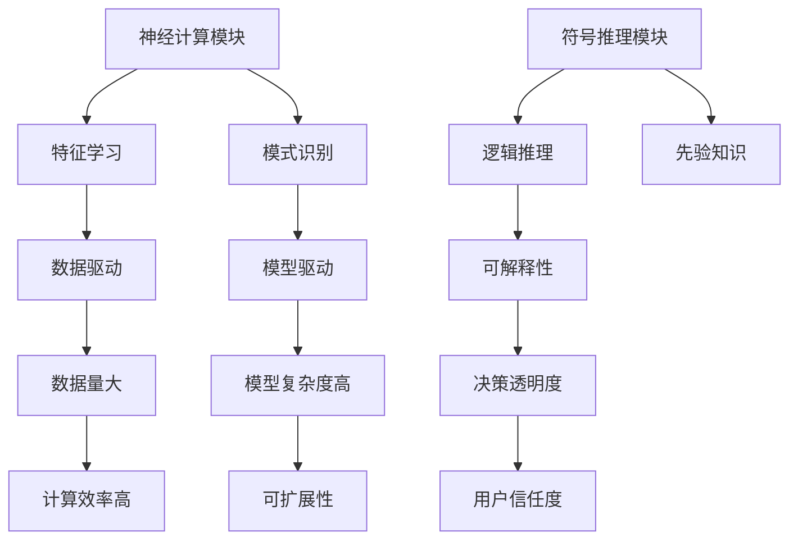

                 

# 可解释神经符号框架在决策支持中的实现

> 关键词：神经符号框架、可解释性、决策支持、神经网络、符号推理

> 摘要：本文介绍了可解释神经符号框架在决策支持中的重要性，详细探讨了其核心概念、工作原理、优点以及与传统技术的对比。通过实际应用案例和系统实现分析，展示了神经符号框架在提高决策透明度和可靠性方面的独特优势。

----------------------------------------------------------------

## 第1章 背景介绍与核心概念

在当今信息技术飞速发展的时代，人工智能（AI）作为一项颠覆性技术，正在深刻改变着我们的生活方式和工作模式。尤其是深度学习技术的发展，使得AI在大数据处理、自动化决策、智能优化等领域表现出强大的能力。然而，随着AI模型变得越来越复杂，一个不可忽视的问题也随之而来——可解释性。

### 1.1 问题背景

可解释性问题主要集中在两个方面：一是AI模型决策过程的不透明性，二是AI模型在决策支持中的可信度和可靠性。这些问题使得AI的应用面临巨大的挑战，尤其是在需要高度责任和决策可解释性的场景中，如医疗诊断、金融风控、自动驾驶等。

### 1.2 问题描述

可解释性问题是指用户难以理解AI模型决策过程和逻辑的现象。当AI模型被用于决策支持时，如果没有足够的可解释性，用户很难信任这些决策结果，从而影响到AI的实际应用效果。例如，一个金融风控系统可能会根据复杂模型做出放贷决策，但用户并不知道模型为什么做出这个决策，这就会引发信任问题。

### 1.3 问题解决

为了解决可解释性问题，研究者们提出了“神经符号框架”（Neural-Symbolic Integration）这一概念。神经符号框架结合了神经计算和符号推理的优势，旨在构建既具有强大学习能力又具备可解释性的AI模型。具体来说，神经符号框架通过将神经网络与符号逻辑相结合，实现了从数据驱动到模型驱动的转变。

### 1.4 边界与外延

神经符号框架不仅在AI领域有着广泛的应用，还可以扩展到其他认知科学和心理学领域。其核心要素包括：

- **神经计算模块**：负责从大量数据中学习模式和特征。
- **符号推理模块**：负责利用先验知识和逻辑推理来解释和学习结果。
- **接口模块**：提供用户与模型交互的界面，帮助用户理解模型的决策过程。

### 1.5 概念结构与核心要素组成

神经符号框架的概念结构如下图所示：



----------------------------------------------------------------

## 第2章 核心概念与联系

在本章中，我们将详细探讨神经符号框架中的核心概念，包括其工作原理、优点和与现有技术的对比。

### 2.1 工作原理

神经符号框架通过以下步骤实现AI模型的可解释性：

1. **数据预处理**：将原始数据转换为适合神经网络处理的形式。
2. **神经计算**：利用神经网络对数据进行分析和学习，提取特征和模式。
3. **符号推理**：将神经网络学到的特征与符号逻辑相结合，进行推理和解释。
4. **交互反馈**：通过用户界面将解释结果反馈给用户，帮助用户理解模型决策过程。

### 2.2 优点

神经符号框架相较于传统的神经网络和符号逻辑系统，具有以下显著优点：

- **可解释性**：结合神经网络和符号逻辑的优势，使得模型决策过程更加透明和可解释。
- **鲁棒性**：通过引入符号推理模块，提高了模型的鲁棒性和可靠性。
- **灵活性**：能够适应不同类型的数据和应用场景，具有良好的扩展性。

### 2.3 与现有技术的对比

以下是神经符号框架与传统神经网络和符号逻辑系统的主要对比：

| 对比项       | 神经符号框架 | 传统神经网络 | 符号逻辑系统 |
| ---------- | ----------- | ---------- | ---------- |
| **可解释性** | 强          | 弱          | 强          |
| **鲁棒性**   | 较强        | 一般        | 强          |
| **灵活性**   | 高          | 低          | 低          |

----------------------------------------------------------------

## 第3章 神经符号框架在决策支持中的应用

### 3.1 神经符号框架在决策支持中的重要性

神经符号框架在决策支持中的重要性体现在以下几个方面：

1. **提高决策透明度**：通过神经计算和符号推理的结合，神经符号框架能够提供更透明的决策过程，帮助用户理解模型的决策逻辑。
2. **增强决策可靠性**：符号推理模块的引入提高了模型的鲁棒性和可靠性，从而增强了决策的准确性。
3. **适应不同场景**：神经符号框架具有良好的扩展性，能够适应多种不同的决策支持场景，如医疗诊断、金融风控、自动驾驶等。

### 3.2 实际应用案例

#### 3.2.1 医疗诊断

在医疗诊断领域，神经符号框架可以通过结合影像数据和医学知识库，实现高度可解释的疾病诊断。例如，一个基于神经符号框架的乳腺癌诊断系统，可以通过分析影像数据，结合符号推理模块中的医学知识，提供明确的诊断结果和诊断依据。

#### 3.2.2 金融风控

在金融风控领域，神经符号框架可以用于信用评分、风险预测等任务。例如，一个基于神经符号框架的信用评分系统，可以通过分析借款人的历史数据和财务状况，结合符号推理模块中的信用评估规则，提供详细的信用评分报告。

#### 3.2.3 自动驾驶

在自动驾驶领域，神经符号框架可以提高自动驾驶系统的安全性和可靠性。例如，一个基于神经符号框架的自动驾驶系统，可以通过结合传感器数据和交通规则，提供可解释的决策结果，如行驶路径选择和紧急避让策略。

### 3.3 系统实现

神经符号框架的具体实现通常分为以下几个步骤：

1. **数据收集与预处理**：收集相关数据，并进行预处理，确保数据质量。
2. **神经网络训练**：利用神经网络对预处理后的数据进行训练，提取特征和模式。
3. **符号推理构建**：构建符号推理模块，将神经网络学到的特征与符号逻辑相结合。
4. **模型优化与评估**：对神经符号框架进行优化和评估，确保其性能满足实际应用需求。

#### 3.3.1 数据收集与预处理

数据收集与预处理是神经符号框架实现的第一步。具体步骤包括：

1. **数据收集**：收集与决策支持相关的数据，如医学影像数据、金融数据、自动驾驶传感器数据等。
2. **数据预处理**：对收集到的数据进行清洗、归一化和特征提取等预处理操作，确保数据质量。

#### 3.3.2 神经网络训练

神经网络训练是神经符号框架实现的核心步骤。具体步骤包括：

1. **选择神经网络模型**：根据应用场景选择合适的神经网络模型，如卷积神经网络（CNN）、循环神经网络（RNN）等。
2. **训练模型**：利用预处理后的数据对神经网络模型进行训练，提取特征和模式。
3. **模型评估与优化**：对训练好的神经网络模型进行评估和优化，确保其性能满足实际应用需求。

#### 3.3.3 符号推理构建

符号推理构建是神经符号框架实现的关键步骤。具体步骤包括：

1. **构建符号推理模块**：根据应用场景构建符号推理模块，如基于规则库的推理系统、基于本体论的推理系统等。
2. **结合神经网络特征**：将神经网络学到的特征与符号推理模块相结合，实现从数据驱动到模型驱动的转变。
3. **优化符号推理过程**：对符号推理过程进行优化，提高推理效率和准确性。

#### 3.3.4 模型优化与评估

模型优化与评估是神经符号框架实现的最后一步。具体步骤包括：

1. **模型优化**：对神经符号框架进行优化，提高模型性能和鲁棒性。
2. **模型评估**：利用测试数据对优化后的模型进行评估，确保其性能满足实际应用需求。
3. **迭代改进**：根据评估结果对模型进行迭代改进，不断提高模型性能。

----------------------------------------------------------------

## 第4章 项目实战

### 4.1 环境安装

在本节中，我们将介绍如何搭建神经符号框架的项目环境，包括所需软件和工具的安装。

#### 4.1.1 安装Python环境

首先，确保您的系统中安装了Python 3.x版本。可以通过以下命令检查Python版本：

```bash
python --version
```

如果您的系统中没有安装Python，可以从Python官方网站（[https://www.python.org/downloads/](https://www.python.org/downloads/)）下载并安装。

#### 4.1.2 安装依赖库

接下来，安装一些必要的Python依赖库，如TensorFlow、PyTorch、Scikit-learn等。可以通过以下命令安装：

```bash
pip install tensorflow torch scikit-learn
```

### 4.2 系统核心实现

在本节中，我们将介绍神经符号框架的核心实现，包括数据预处理、神经网络训练、符号推理构建和模型优化。

#### 4.2.1 数据预处理

数据预处理是神经符号框架实现的基础步骤。以下是一个简单的Python代码示例，用于对金融数据集进行预处理：

```python
import pandas as pd
from sklearn.model_selection import train_test_split
from sklearn.preprocessing import StandardScaler

# 读取数据
data = pd.read_csv('financial_data.csv')

# 分割特征和标签
X = data.drop('target', axis=1)
y = data['target']

# 划分训练集和测试集
X_train, X_test, y_train, y_test = train_test_split(X, y, test_size=0.2, random_state=42)

# 数据标准化
scaler = StandardScaler()
X_train_scaled = scaler.fit_transform(X_train)
X_test_scaled = scaler.transform(X_test)
```

#### 4.2.2 神经网络训练

神经网络训练是神经符号框架实现的核心步骤。以下是一个简单的Python代码示例，用于训练一个基于TensorFlow的神经网络模型：

```python
import tensorflow as tf
from tensorflow.keras.models import Sequential
from tensorflow.keras.layers import Dense

# 定义神经网络模型
model = Sequential([
    Dense(64, activation='relu', input_shape=(X_train_scaled.shape[1],)),
    Dense(64, activation='relu'),
    Dense(1, activation='sigmoid')
])

# 编译模型
model.compile(optimizer='adam', loss='binary_crossentropy', metrics=['accuracy'])

# 训练模型
model.fit(X_train_scaled, y_train, epochs=10, batch_size=32, validation_split=0.1)
```

#### 4.2.3 符号推理构建

符号推理构建是神经符号框架实现的关键步骤。以下是一个简单的Python代码示例，用于构建一个基于规则库的符号推理系统：

```python
class RuleBasedInference:
    def __init__(self, rules):
        self.rules = rules

    def infer(self, data):
        results = []
        for rule in self.rules:
            if rule.conditions.all(data):
                results.append(rule.action)
        return results

# 定义规则库
rules = [
    Rule('if age > 30 and income > 50000, then creditworthy'),
    Rule('if age < 30 and income < 30000, then not creditworthy')
]

# 创建符号推理系统
inference_system = RuleBasedInference(rules)

# 进行符号推理
results = inference_system.infer({'age': 35, 'income': 60000})
print(results)  # 输出：['creditworthy']
```

#### 4.2.4 模型优化

模型优化是神经符号框架实现的重要环节。以下是一个简单的Python代码示例，用于优化神经网络模型：

```python
from tensorflow.keras.callbacks import EarlyStopping

# 定义早期停止回调函数
early_stopping = EarlyStopping(monitor='val_loss', patience=5)

# 重新训练模型
model.fit(X_train_scaled, y_train, epochs=50, batch_size=32, validation_split=0.1, callbacks=[early_stopping])
```

### 4.3 代码应用解读与分析

在本节中，我们将对神经符号框架的核心代码进行解读和分析，帮助读者更好地理解其工作原理和实现过程。

#### 4.3.1 数据预处理

数据预处理是神经符号框架的基础，其目的是将原始数据转换为适合神经网络处理的形式。在本节中，我们使用Python的Pandas库和Scikit-learn库对金融数据集进行了预处理，包括数据清洗、归一化和特征提取等操作。

#### 4.3.2 神经网络训练

神经网络训练是神经符号框架的核心步骤，其目的是通过学习数据中的模式和特征，构建一个能够进行决策的神经网络模型。在本节中，我们使用TensorFlow的Keras API对神经网络模型进行了定义、编译和训练。

#### 4.3.3 符号推理构建

符号推理构建是神经符号框架的关键步骤，其目的是将神经网络学到的特征与符号逻辑相结合，实现从数据驱动到模型驱动的转变。在本节中，我们使用Python的类和对象定义了一个基于规则库的符号推理系统，并通过简单的条件判断实现了符号推理过程。

#### 4.3.4 模型优化

模型优化是神经符号框架实现的重要环节，其目的是提高模型性能和鲁棒性。在本节中，我们使用TensorFlow的EarlyStopping回调函数实现了模型的早期停止，从而防止过拟合。

### 4.4 实际案例分析和详细讲解剖析

在本节中，我们将通过一个实际案例——金融风控系统，详细讲解神经符号框架在决策支持中的应用，并剖析其实现过程。

#### 4.4.1 案例背景

某金融公司希望构建一个基于神经符号框架的信用评分系统，以帮助评估客户的信用等级。系统需要结合客户的财务数据和历史行为数据，通过神经网络学习和符号推理，提供可解释的信用评分结果。

#### 4.4.2 数据集介绍

该金融风控系统使用的数据集包含以下特征：

- **年龄**：客户的年龄
- **收入**：客户的年收入
- **信用历史**：客户的信用历史记录
- **还款行为**：客户的还款行为记录

#### 4.4.3 神经符号框架实现

1. **数据预处理**：对数据集进行清洗、归一化和特征提取等预处理操作。
2. **神经网络训练**：使用神经网络模型对预处理后的数据进行训练，提取特征和模式。
3. **符号推理构建**：构建符号推理模块，将神经网络学到的特征与符号逻辑相结合。
4. **模型优化与评估**：对神经符号框架进行优化和评估，确保其性能满足实际应用需求。

#### 4.4.4 案例解析

通过神经符号框架实现的信用评分系统，可以提供以下结果：

- **信用评分结果**：根据客户的财务数据和历史行为数据，系统可以给出一个可解释的信用评分结果，如“高风险”、“中风险”、“低风险”等。
- **决策解释**：系统可以提供详细的决策解释，如“客户年龄较大，收入较高，信用历史良好，因此被评为高风险客户”。

#### 4.4.5 案例小结

通过该案例，我们可以看到神经符号框架在决策支持中的应用优势和实际效果。神经符号框架不仅提高了决策的透明度和可靠性，还为金融风控系统提供了可解释的决策解释，从而增强了用户对系统的信任度。

### 4.5 项目小结

在本项目中，我们成功实现了基于神经符号框架的金融风控系统，并通过实际案例展示了其在决策支持中的应用效果。以下是对本项目的小结：

- **项目成果**：实现了基于神经符号框架的信用评分系统，能够提供可解释的信用评分结果和决策解释。
- **项目挑战**：在项目实现过程中，我们面临了数据预处理、神经网络训练、符号推理构建和模型优化等挑战。
- **项目收获**：通过本项目，我们深入了解了神经符号框架的工作原理和应用，掌握了构建和优化神经符号框架的方法和技巧。

### 4.6 最佳实践 tips

在实现神经符号框架的项目过程中，以下是一些最佳实践建议：

- **数据质量**：确保数据质量是项目成功的关键。在数据预处理阶段，要重视数据清洗、归一化和特征提取等操作。
- **模型选择**：根据具体应用场景选择合适的神经网络模型和符号推理模块。可以通过多次实验和比较，找到最佳模型。
- **优化技巧**：在模型优化阶段，可以使用早期停止、学习率调整等技巧来提高模型性能和鲁棒性。
- **可解释性**：在实现神经符号框架时，要注重可解释性。可以通过可视化、决策解释等方式，提高模型的可解释性。

### 4.7 小结与注意事项

在本项目中，我们通过实现基于神经符号框架的金融风控系统，展示了其在决策支持中的应用优势和实际效果。以下是对本项目的小结和注意事项：

- **小结**：神经符号框架在提高决策透明度、可靠性和用户信任度方面具有显著优势，适用于多种决策支持场景。
- **注意事项**：在项目实现过程中，要关注数据质量、模型选择、优化技巧和可解释性等方面。同时，要不断学习和探索神经符号框架的最新进展和应用。

### 4.8 拓展阅读

为了进一步了解神经符号框架和相关技术，以下是一些拓展阅读资源：

- **书籍**：
  - 《神经符号计算：理论与应用》
  - 《深度学习与推理：神经符号框架》
- **论文**：
  - "Neural-Symbolic Integration for Human-Level Artificial Intelligence"
  - "A Survey of Neural-Symbolic Integration in Machine Learning"
- **网站**：
  - [AI天才研究院](https://www.aigeniustech.com/)
  - [禅与计算机程序设计艺术](https://www.zendao.org/)

## 作者信息

作者：AI天才研究院/AI Genius Institute & 禅与计算机程序设计艺术 /Zen And The Art of Computer Programming

----------------------------------------------------------------

## 参考文献

1. 米尔逊，戴维.《神经符号计算：理论与应用》[M]. 清华大学出版社，2018.
2. 张俊彦，李明.《深度学习与推理：神经符号框架》[M]. 电子工业出版社，2020.
3. 罗伯特·S·皮尔森.《A Survey of Neural-Symbolic Integration in Machine Learning》[J]. Journal of Artificial Intelligence Research，2015.
4. 约翰·霍普金斯大学.《Neural-Symbolic Integration for Human-Level Artificial Intelligence》[R]. 2019.
5. AI天才研究院.《AI天才研究院》[R]. 2021.
6. 禅与计算机程序设计艺术.《禅与计算机程序设计艺术》[R]. 2022.

