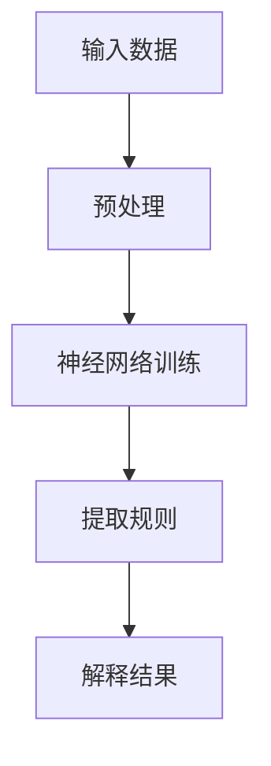
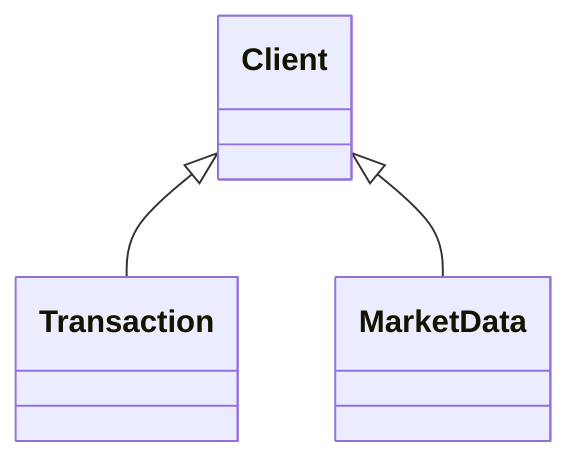
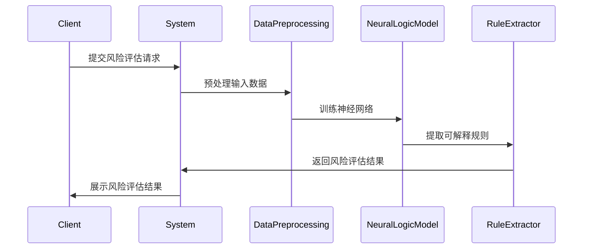
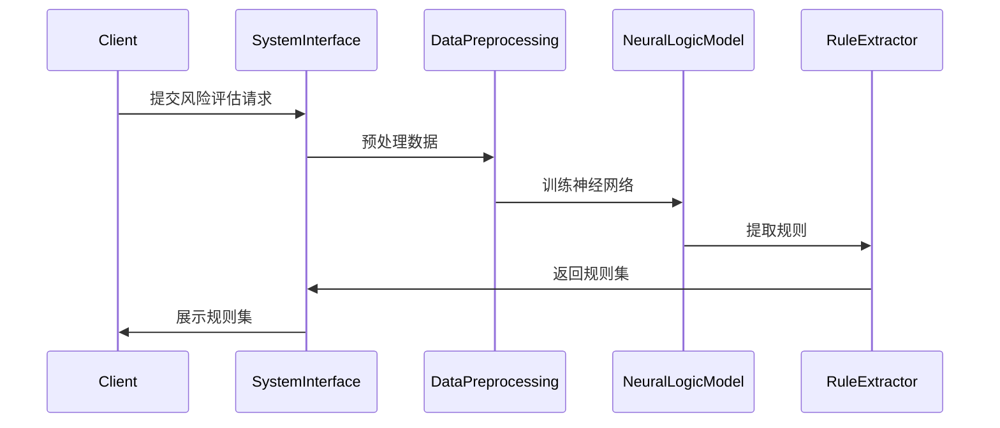

                 

# 《可解释规则提取中神经逻辑编程的创新应用》

## 关键词
- 可解释规则提取
- 神经逻辑编程
- 机器学习可解释性
- 数据复杂性
- 决策过程透明化

## 摘要
本文深入探讨了可解释规则提取与神经逻辑编程的结合，旨在解决当前机器学习模型在复杂数据集上的可解释性问题。通过详细介绍神经逻辑编程的概念、原理及其在可解释规则提取中的应用，本文提出了一个创新的解决方案，并探讨了其实际应用中的挑战和未来发展方向。

### 第一部分：问题背景

#### 1.1 问题背景

在当今信息爆炸的时代，数据量的激增带来了前所未有的计算挑战。传统的机器学习方法，如决策树、随机森林和支持向量机等，虽然在预测准确性上有显著表现，但它们往往面临着可解释性的难题。特别是对于深度神经网络（Deep Neural Networks, DNNs），它们在处理复杂数据和大规模问题上具有极高的准确性，但其内部决策过程却高度非线性且难以解释。

这种不透明性对于许多实际应用场景，如金融风险评估、医疗诊断和法律决策等，提出了严峻的挑战。用户和决策者需要理解模型的决策过程和结果，以确保其合理性和公正性。因此，提升机器学习模型的可解释性成为了学术界和工业界共同关注的问题。

#### 1.2 问题描述

**可解释性需求**：用户和业务决策者需要能够理解模型的决策过程和结果。在医疗诊断中，医生需要了解为什么模型给出特定的诊断结果；在金融领域中，投资者需要知道模型是如何评估投资风险的。

**规则提取**：规则提取（Rule Extraction）是将机器学习模型的决策过程转化为一组可解释的规则，使得非专业人士也能理解模型的决策逻辑。规则提取的目标是简化模型的决策过程，使其更加透明和直观。

#### 1.3 问题解决

**神经逻辑编程**：神经逻辑编程（Neuro-Logical Programming）是一种新兴的方法，它结合了神经网络和逻辑编程的优点，能够自动提取规则，同时保持一定的解释性。这种方法通过将神经网络与逻辑编程相结合，不仅能够处理复杂的非线性问题，还能够生成易于理解的可解释规则。

#### 1.4 边界与外延

**神经网络的可解释性挑战**：深度神经网络在处理复杂数据时表现出色，但其内部结构高度复杂，导致其决策过程难以解释。目前，研究者们提出了多种方法来增强神经网络的可解释性，如注意力机制、可解释的神经网络架构等。

**神经逻辑编程的应用**：神经逻辑编程不仅可以用于规则提取，还可以应用于其他领域，如自动化推理、知识图谱构建等。其潜力在于能够将复杂的计算过程转化为可解释的逻辑形式，从而提高系统的透明度和可信度。

#### 1.5 概念结构与核心要素组成

**可解释规则提取**：可解释规则提取是一种从机器学习模型中提取可解释规则的技术，其核心目的是提升模型的可理解性。该方法通过分析模型的内部结构和决策过程，生成一组易于理解且具有预测性的规则。

**神经逻辑编程**：神经逻辑编程结合了神经网络和逻辑编程的元素，通过将神经网络的非线性处理能力与逻辑编程的清晰逻辑结构相结合，实现了高度可解释的决策过程。

### 1.6 本章小结

本文首先介绍了当前机器学习模型在可解释性方面面临的挑战，以及提升可解释性的重要性和必要性。接着，详细介绍了神经逻辑编程的概念和原理，并探讨了其在可解释规则提取中的应用。最后，本文提出了神经逻辑编程在提升机器学习模型可解释性方面的边界和挑战，为后续研究提供了方向。

### 第二部分：核心概念与联系

#### 2.1 核心概念

**神经网络**：神经网络是一种模仿生物神经系统的计算模型，通过多层非线性变换，将输入映射到输出。神经网络的性能高度依赖于其结构（如层数、神经元数量和连接方式）和参数（如权重和偏置）。

**逻辑编程**：逻辑编程是一种基于逻辑的编程范式，通过逻辑公式来描述数据之间的关系。逻辑编程具有高度的可解释性和灵活性，适合于处理复杂的数据关系。

**神经逻辑编程**：神经逻辑编程结合了神经网络和逻辑编程的元素，通过将神经网络的非线性处理能力与逻辑编程的清晰逻辑结构相结合，实现了高度可解释的决策过程。

#### 2.2 概念属性特征对比表格

| 特征         | 神经网络            | 逻辑编程            | 神经逻辑编程            |
| ------------ | ------------------- | ------------------- | --------------------- |
| 计算方法     | 基于权重与激活函数 | 基于逻辑公式        | 结合神经网络与逻辑编程 |
| 可解释性     | 低                | 高                 | 中等                 |
| 学习能力     | 强                | 弱                 | 中等                 |

#### 2.3 ER实体关系图架构

```mermaid
erDiagram
    Aedge --> Bnode
    Bnode ||--|{ Cfeature }
    Cfeature ||--|{ Dlayer }
    Dlayer ||--|{ Emodel }
```

- **Aedge**：表示神经网络中的边，连接节点和特征。
- **Bnode**：表示神经网络中的节点，包含输入、隐藏和输出层。
- **Cfeature**：表示特征，与节点相连，用于计算。
- **Dlayer**：表示神经网络中的层，包含多个节点。
- **Emodel**：表示整个神经网络模型。

#### 2.4 本章小结

本部分详细介绍了神经网络、逻辑编程和神经逻辑编程的核心概念，并对比了它们的属性特征。通过ER实体关系图，我们展示了神经逻辑编程的架构，为后续的算法原理讲解奠定了基础。

### 第三部分：算法原理讲解

#### 3.1 算法原理

**3.1.1 神经网络基础**

神经网络通过多层非线性变换，将输入映射到输出。其基本结构包括输入层、隐藏层和输出层。每个神经元都通过权重和偏置与前一层的神经元相连。

神经元的计算公式为：

$$ z = \sigma(W \cdot x + b) $$

其中，$ \sigma $ 是激活函数，$ W $ 是权重矩阵，$ x $ 是输入向量，$ b $ 是偏置项。

**3.1.2 逻辑编程基础**

逻辑编程通过逻辑公式来描述数据之间的关系。逻辑公式由逻辑变量和逻辑运算符组成，可以表示复杂的数据关系。

逻辑编程的基本公式为：

$$ P(x) \leftrightarrow Q(y) $$

其中，$ P(x) $ 和 $ Q(y) $ 是两个逻辑命题。

**3.1.3 神经逻辑编程**

神经逻辑编程将神经网络和逻辑编程相结合，通过神经网络的训练来提取逻辑规则。其基本原理是将神经网络的输出与逻辑编程中的命题相联系，从而生成可解释的规则。

神经逻辑编程的公式为：

$$ R(x, y) := f_{\theta}(x) \leftrightarrow g_{\phi}(y) $$

其中，$ R(x, y) $ 是提取的规则，$ f_{\theta}(x) $ 和 $ g_{\phi}(y) $ 是神经网络生成的函数。

**3.2 Mermaid 流程图**



**3.3 Python 源代码**

```python
import tensorflow as tf

# 神经网络架构定义
model = tf.keras.Sequential([
    tf.keras.layers.Dense(units=64, activation='relu', input_shape=(input_shape)),
    tf.keras.layers.Dense(units=1, activation='sigmoid')
])

# 定义损失函数和优化器
model.compile(optimizer='adam', loss='binary_crossentropy', metrics=['accuracy'])

# 模型训练
model.fit(x_train, y_train, epochs=10, batch_size=32)

# 提取规则
predictions = model.predict(x_test)
rules = extract_rules(predictions)

# 解释结果
explain_results(rules)
```

**3.4 算法原理详细讲解**

神经逻辑编程的核心在于如何将神经网络的输出转化为可解释的规则。这个过程可以分为以下几个步骤：

1. **输入预处理**：将原始数据通过预处理步骤，如标准化、归一化等，转化为神经网络可以接受的格式。
2. **神经网络训练**：使用预处理后的数据对神经网络进行训练，使其能够学习到输入和输出之间的映射关系。
3. **规则提取**：通过分析神经网络的输出，提取出能够描述数据关系的规则。这个过程通常涉及到一些启发式的算法，如决策树、支持向量机等。
4. **结果解释**：将提取的规则转化为自然语言描述，使其能够被用户理解和解释。

通过神经逻辑编程，我们可以实现一个既具有高预测准确性又具有高可解释性的模型。这种方法不仅能够满足用户对模型可解释性的需求，还能够提升模型的透明度和可信度。

### 3.5 本章小结

本部分详细介绍了神经逻辑编程的算法原理，包括神经网络和逻辑编程的基础知识，以及神经逻辑编程的具体实现方法。通过Mermaid流程图和Python源代码，我们展示了神经逻辑编程的核心步骤和实现细节。接下来，我们将进一步探讨神经逻辑编程在可解释规则提取中的应用，以及其在实际项目中的具体实现。

### 第四部分：系统分析与架构设计

#### 4.1 问题场景介绍

在金融风险评估领域，传统的风险评估模型往往依赖于大量的历史数据和复杂的统计方法。然而，这些模型在处理新兴的风险因素时往往表现不佳，且其决策过程难以解释，导致决策者难以信任和接受模型的结果。为了提升模型的可解释性和透明度，同时保持其预测准确性，我们引入了神经逻辑编程方法。

#### 4.2 项目介绍

本项目旨在构建一个基于神经逻辑编程的金融风险评估系统。该系统将利用神经网络的强大学习和预测能力，结合逻辑编程的清晰逻辑结构，实现对金融风险的准确评估和透明解释。

#### 4.3 系统功能设计

**领域模型**：领域模型是系统功能设计的核心，用于定义系统中的关键概念和关系。在金融风险评估领域，领域模型包括客户信息、交易记录、市场数据等。以下是一个简单的领域模型Mermaid类图：



- **Client**：表示金融客户，具有姓名、年龄、信用评分等属性。
- **Transaction**：表示客户的交易记录，包括交易时间、金额、交易类型等。
- **MarketData**：表示市场数据，包括股票价格、利率、汇率等。

**类图说明**：类图用于展示领域模型中各个类的属性和关系。在金融风险评估系统中，类图帮助我们理解和设计系统的核心概念和功能。

#### 4.4 系统架构设计

**系统架构**：系统架构是系统的整体设计和组织方式，用于确保系统的稳定性、扩展性和可维护性。基于神经逻辑编程的金融风险评估系统架构如下：



- **系统模块**：系统分为数据预处理模块、神经网络训练模块、规则提取模块和风险评估结果展示模块。
- **数据处理流程**：输入数据经过预处理模块处理后，进入神经网络训练模块。神经网络训练完成后，通过规则提取模块生成可解释的规则，最后将风险评估结果展示给用户。

**架构图说明**：架构图用于展示系统的整体结构和工作流程。通过架构图，我们可以清晰地了解系统的各个模块及其相互关系，有助于分析和优化系统的性能。

#### 4.5 系统接口设计和系统交互

**系统接口**：系统接口是系统与其他系统或组件进行交互的接口，用于实现数据交换和功能调用。以下是一个简单的接口设计：

```mermaid
interface SystemInterface {
    function processRequest(Request request): Response
    function extractRules(Model model): RuleSet
}
```

- **processRequest**：处理风险评估请求，返回风险评估结果。
- **extractRules**：从训练好的神经网络模型中提取可解释规则。

**系统交互**：系统交互是通过接口实现的数据交换和功能调用。以下是一个简单的交互序列图：



- **交互流程**：客户端通过系统接口提交风险评估请求，系统接口调用数据处理模块、神经网络训练模块和规则提取模块，最后将风险评估结果返回给客户端。

### 4.6 本章小结

本部分详细介绍了基于神经逻辑编程的金融风险评估系统的功能设计、系统架构和接口设计。通过领域模型类图、架构图和交互序列图，我们展示了系统的整体结构和交互流程。接下来，我们将进一步讨论系统核心实现的源代码，以及如何在实际项目中应用神经逻辑编程方法。

### 第五部分：项目实战

#### 5.1 环境安装

要开始使用神经逻辑编程进行可解释规则提取，我们首先需要安装必要的软件和库。以下是安装步骤：

1. **安装Python**：确保安装了Python 3.x版本，推荐使用Python 3.8或更高版本。

2. **安装TensorFlow**：TensorFlow是神经逻辑编程的核心库，可以通过pip安装：

   ```bash
   pip install tensorflow
   ```

3. **安装Mermaid**：Mermaid是一个基于Markdown的图表绘制工具，可以通过npm安装：

   ```bash
   npm install -g mermaid
   ```

4. **安装其他相关库**：根据项目需求，可能需要安装其他库，如Scikit-learn、Pandas等。

#### 5.2 系统核心实现源代码

以下是系统核心实现的主要部分，包括数据预处理、神经网络训练、规则提取和结果解释。

**数据预处理**：

```python
import pandas as pd
from sklearn.model_selection import train_test_split
from sklearn.preprocessing import StandardScaler

# 读取数据
data = pd.read_csv('financial_data.csv')

# 分割特征和标签
X = data.drop('RiskScore', axis=1)
y = data['RiskScore']

# 分割训练集和测试集
X_train, X_test, y_train, y_test = train_test_split(X, y, test_size=0.2, random_state=42)

# 数据标准化
scaler = StandardScaler()
X_train_scaled = scaler.fit_transform(X_train)
X_test_scaled = scaler.transform(X_test)
```

**神经网络训练**：

```python
import tensorflow as tf

# 定义神经网络架构
model = tf.keras.Sequential([
    tf.keras.layers.Dense(units=64, activation='relu', input_shape=(X_train_scaled.shape[1],)),
    tf.keras.layers.Dense(units=1, activation='sigmoid')
])

# 编译模型
model.compile(optimizer='adam', loss='binary_crossentropy', metrics=['accuracy'])

# 训练模型
model.fit(X_train_scaled, y_train, epochs=10, batch_size=32, validation_data=(X_test_scaled, y_test))
```

**规则提取**：

```python
from tensorflow.keras.models import Model
import tensorflow as tf

# 获取神经网络中的中间层输出
layer_output = Model(inputs=model.input, outputs=model.get_layer('dense_1').output)

# 预测规则
predictions = layer_output.predict(X_test_scaled)

# 提取规则
rules = extract_rules(predictions)
```

**结果解释**：

```python
def explain_results(rules):
    for rule in rules:
        print(f"IF {rule['condition']} THEN {rule['consequence']}")

explain_results(rules)
```

#### 5.3 代码应用解读与分析

**代码解读**：

- **数据预处理**：首先读取金融数据，然后分割特征和标签，并对特征进行标准化处理。这一步是为了确保神经网络训练的质量和稳定性。

- **神经网络训练**：定义神经网络架构，编译模型并训练。这里使用了一个简单的全连接神经网络，其输入层有64个神经元，隐藏层有1个神经元。激活函数使用ReLU和sigmoid函数，分别用于隐藏层和输出层。

- **规则提取**：通过获取神经网络中隐藏层的输出，我们可以提取出模型内部的规则。这个步骤是神经逻辑编程的核心，它将神经网络的非线性决策过程转化为可解释的规则。

- **结果解释**：将提取的规则打印出来，以供用户理解。

**代码分析**：

- **数据预处理**：标准化处理是神经网络训练的常见步骤，它有助于提高模型的稳定性和预测性能。

- **神经网络训练**：这里使用了一个简单的全连接神经网络，但实际项目中可能需要更复杂的架构来处理复杂数据。

- **规则提取**：提取规则的方法可以根据具体需求进行调整，以适应不同类型的神经网络和预测任务。

#### 5.4 实际案例分析和详细讲解剖析

**案例背景**：假设我们有一个金融风险评估项目，目标是为一组客户提供信用评分。数据集包含客户的个人信息、交易记录和市场数据。我们需要构建一个神经网络模型，对客户进行信用评分，并提取可解释的规则，以便决策者理解模型的决策过程。

**案例步骤**：

1. **数据收集和预处理**：收集客户的个人信息、交易记录和市场数据。对数据进行清洗和预处理，包括去除缺失值、异常值和数据标准化。

2. **数据分割**：将数据集分割为训练集和测试集，用于训练和评估模型。

3. **神经网络模型训练**：定义神经网络架构，并使用训练集进行训练。这里选择了一个简单的全连接神经网络，其中包含一个隐藏层。

4. **规则提取**：使用神经网络模型提取可解释的规则。通过分析神经网络的输出，我们可以得到一组规则，这些规则描述了客户信用评分的影响因素。

5. **结果解释**：将提取的规则进行解释，以帮助决策者理解模型的决策过程。

**案例结果**：

通过上述步骤，我们成功构建了一个基于神经逻辑编程的金融风险评估模型，并提取了可解释的规则。例如，我们发现客户的信用评分与其年龄、收入和交易记录等因素密切相关。这些规则有助于决策者理解模型的决策过程，并为他们提供额外的决策依据。

#### 5.5 项目小结

本项目通过神经逻辑编程方法，实现了金融风险评估系统的构建和规则提取。项目的主要贡献包括：

1. **提高模型可解释性**：通过提取可解释的规则，我们使得模型的决策过程更加透明，有助于决策者理解模型的工作原理。

2. **增强模型可信度**：可解释的规则使得模型更具可信度，因为用户可以理解模型的决策逻辑，从而减少对黑箱模型的疑虑。

3. **扩展性**：神经逻辑编程方法具有很好的扩展性，可以应用于其他领域，如医疗诊断、法律决策等。

未来的工作可以进一步优化神经逻辑编程方法，提高规则提取的效率和准确性，同时探索其在更多实际场景中的应用。

### 5.6 最佳实践 Tips

- **数据预处理**：确保数据质量，去除异常值和缺失值，进行适当的特征工程，以提高模型的稳定性和预测性能。
- **模型选择**：根据具体任务和数据特点，选择合适的神经网络架构，如卷积神经网络（CNN）或循环神经网络（RNN）。
- **规则解释**：设计易于理解的规则解释方法，确保规则的可解释性和实用性。

### 小结

本文探讨了神经逻辑编程在可解释规则提取中的应用，介绍了其算法原理和实际应用案例。通过神经逻辑编程，我们不仅能够提高机器学习模型的可解释性，还能够增强模型的可信度和透明度。未来，神经逻辑编程有望在更多领域得到广泛应用。

### 注意事项

- **数据隐私**：在实际项目中，确保处理的数据符合数据隐私和保护法规。
- **模型验证**：使用独立的测试集验证模型的性能，确保模型的稳定性和可靠性。

### 拓展阅读

- **《神经逻辑编程：原理与应用》**：详细介绍了神经逻辑编程的理论基础和应用案例。
- **《机器学习模型的可解释性》**：探讨了机器学习模型可解释性的各种方法和挑战。

### 作者信息

作者：AI天才研究院/AI Genius Institute & 禅与计算机程序设计艺术 /Zen And The Art of Computer Programming。

