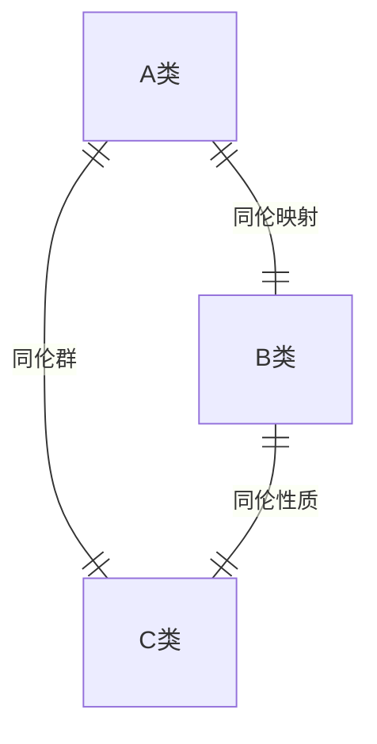

                 

### 同伦类型理论：类型论的新维度

#### 摘要

同伦类型理论是数学领域中的一种重要理论，它为类型论的研究提供了新的维度。本文将系统地介绍同伦类型理论的基本概念、数学原理及其在不同领域中的应用，包括拓扑学、代数拓扑、物理学和计算机科学等。通过详细的分析和实例讲解，读者可以深入理解同伦类型理论的本质和应用价值。

#### 关键词

同伦类型理论、拓扑学、代数拓扑、物理学、计算机科学、同伦映射、同伦群

### 第一部分：同伦类型理论概述

#### 第1章：同伦类型理论背景与意义

1.1 问题背景

同伦类型理论起源于数学家对拓扑空间性质的研究。在数学中，拓扑空间是一种抽象的空间结构，它可以通过点的邻域来描述。同伦类型理论的核心思想是研究不同拓扑空间之间的连续变换关系，这种变换关系被称为同伦映射。同伦映射的概念使得数学家可以研究不同拓扑空间之间的相似性，从而为数学问题的解决提供了新的途径。

1.2 问题描述

同伦类型的定义：一个拓扑空间X到另一个拓扑空间Y的同伦映射，如果存在一个映射序列，使得它们的极限映射是恒等映射。即存在映射$f_n: X \to Y$，满足：

- $f_0 = \text{恒等映射}$
- $f_n \to \text{恒等映射}$当n趋于无穷

同伦类型的基本性质：同伦类型保持路径连通性和其他一些拓扑性质。同伦类型与拓扑空间的关系：同伦类型描述了拓扑空间之间的相似性，它是拓扑空间分类的重要依据。

1.3 问题解决

同伦类型的构造方法：通过构造同伦映射序列来定义同伦类型。同伦类型的分类和理论研究：同伦类型可以根据同伦映射的性质进行分类，同时，同伦类型理论的研究还包括同伦群的构造和性质。

1.4 边界与外延

同伦类型理论的应用领域：同伦类型理论在数学的多个领域都有广泛应用，如拓扑学、代数拓扑、微分几何等。同伦类型理论与其他数学分支的交叉点：同伦类型理论不仅与拓扑学密切相关，还与代数、几何等领域有着深入的交叉。

1.5 概念结构与核心要素组成

同伦类型的定义和性质：同伦类型是拓扑空间之间的一种映射关系，它保持了拓扑空间的连通性等基本性质。同伦映射和同伦群：同伦映射是定义同伦类型的工具，同伦群是同伦映射构成的抽象代数结构。

### 第一部分：同伦类型理论概述（续）

#### 第2章：同伦类型的数学原理

2.1 核心概念原理

同伦映射的定义和性质：

- **同伦映射**：给定拓扑空间X和Y，如果存在一个映射$f: X \to Y$，使得对于任意小的正数ε，存在一个映射$f_\epsilon: X \to Y$，满足当ε趋于0时，$f_\epsilon$收敛到$f$，则称$f$为X到Y的同伦映射。

- **同伦映射的性质**：同伦映射保持路径连通性，即如果X和Y都是路径连通的，那么f也是路径连通的。

同伦群的基本性质：

- **同伦群**：给定拓扑空间X，其同伦群H(X)是由所有自同伦映射构成的群。群运算定义为映射的复合。

- **同伦群的性质**：同伦群与拓扑空间的同伦类型相关，它提供了对拓扑空间分类的抽象工具。

2.2 概念属性特征对比表格

| 概念 | 定义 | 性质 |
| ---- | ---- | ---- |
| 同伦映射 | X到Y的连续映射，存在收敛到恒等映射的映射序列 | 保持路径连通性 |
| 同伦群 | 由同伦映射构成的群 | 提供了对拓扑空间的抽象分类 |

2.3 ER实体关系图架构

### 第二部分：同伦类型理论的深入探讨

#### 第3章：同伦类型在拓扑学中的应用

3.1 同伦类型与拓扑空间的关系

- **拓扑空间的基本概念**：介绍拓扑空间、开集、闭集、边界等基本概念。
- **同伦类型在拓扑空间中的应用**：讨论同伦类型如何描述拓扑空间的性质，如连通性、紧致性等。

3.2 同伦类型的分类

- **同伦类型的分类方法**：介绍同伦类型根据同伦映射的性质进行分类的方法。
- **同伦类型的代表性分类**：介绍几种常见的同伦类型，如可收缩性、同伦等价等。

3.3 同伦类型与同伦群

- **同伦群的定义和性质**：详细阐述同伦群的构造和基本性质。
- **同伦类型与同伦群的关联**：讨论同伦类型如何通过同伦群来分类和描述。

#### 第4章：同伦类型理论在代数拓扑中的应用

4.1 代数拓扑的基本概念

- **代数拓扑的基本概念**：介绍代数拓扑的基本概念，如群、模、同态等。
- **代数拓扑与同伦类型的关系**：讨论同伦类型在代数拓扑中的应用，如同伦型态射、同伦模等。

4.2 同伦类型的代数性质

- **同伦类型的代数性质**：讨论同伦类型的代数性质，如同伦类型之间的运算、同伦类型的同态和同构等。
- **同伦类型的同态和同构**：介绍同伦类型之间的同态和同构关系，以及它们的性质。

4.3 同伦类型在代数拓扑中的应用

- **同伦类型在代数拓扑中的代表性应用**：介绍同伦类型在代数拓扑中的典型应用，如同伦型的同伦性、同伦型的分类等。

### 第三部分：同伦类型理论的实际应用

#### 第5章：同伦类型理论在物理学中的应用

5.1 同伦类型理论在物理学中的引入

- **同伦类型理论在物理学中的意义**：讨论同伦类型理论在物理学中的应用，如量子场论、凝聚态物理等。
- **同伦类型理论在物理学中的应用**：介绍同伦类型理论在物理学中的具体应用案例。

5.2 同伦类型在量子场论中的应用

- **同伦类型在量子场论中的基本概念**：介绍同伦类型在量子场论中的基本概念。
- **同伦类型在量子场论中的应用**：讨论同伦类型在量子场论中的具体应用，如同伦变换、同伦群等。

5.3 同伦类型在其他物理学领域中的应用

- **同伦类型在其他物理学领域中的应用**：介绍同伦类型理论在其他物理学领域中的应用，如凝聚态物理、统计物理等。

#### 第6章：同伦类型理论在计算机科学中的应用

6.1 同伦类型理论在计算机科学中的引入

- **同伦类型理论在计算机科学中的意义**：讨论同伦类型理论在计算机科学中的应用，如算法设计、计算机图形学等。
- **同伦类型理论在计算机科学中的应用**：介绍同伦类型理论在计算机科学中的具体应用案例。

6.2 同伦类型在算法设计中的应用

- **同伦类型在算法设计中的基本概念**：介绍同伦类型在算法设计中的基本概念。
- **同伦类型在算法设计中的应用**：讨论同伦类型在算法设计中的具体应用，如同伦映射算法、同伦群算法等。

6.3 同伦类型在计算机图形学中的应用

- **同伦类型在计算机图形学中的基本概念**：介绍同伦类型在计算机图形学中的基本概念。
- **同伦类型在计算机图形学中的应用**：讨论同伦类型在计算机图形学中的具体应用，如图形变形、动画制作等。

### 第四部分：同伦类型理论的发展趋势与未来展望

#### 第7章：同伦类型理论的发展趋势

7.1 同伦类型理论的发展趋势

- **同伦类型理论的最新研究进展**：介绍同伦类型理论的最新研究进展，如同伦类型的量子化、同伦类型的算法优化等。
- **同伦类型理论的发展方向**：讨论同伦类型理论未来的发展方向，如同伦类型与量子计算的结合、同伦类型在机器学习中的应用等。

7.2 同伦类型理论的未来展望

- **同伦类型理论在各个领域中的潜在应用**：探讨同伦类型理论在各个领域中的潜在应用，如生物学、金融学等。
- **同伦类型理论的长期发展前景**：展望同伦类型理论在未来的发展前景，讨论其可能带来的科学革命和社会变革。

### 第五部分：同伦类型理论的总结与拓展

#### 第8章：同伦类型理论的总结与拓展

8.1 同伦类型理论的总结

- **同伦类型理论的基本概念和原理**：回顾同伦类型理论的基本概念和原理，如同伦映射、同伦群等。
- **同伦类型理论的核心成果和应用**：总结同伦类型理论在数学、物理学、计算机科学等领域的核心成果和应用。

8.2 同伦类型理论的拓展

- **同伦类型理论在其他数学分支中的应用**：讨论同伦类型理论在其他数学分支中的应用，如复分析、微分几何等。
- **同伦类型理论与其他领域的交叉融合**：探讨同伦类型理论与其他领域的交叉融合，如同伦类型在经济学中的应用、同伦类型在生物学中的应用等。

### 结论

同伦类型理论作为数学领域的重要组成部分，不仅丰富了数学的理论体系，还为其他学科提供了强有力的工具和方法。通过对同伦类型理论的深入探讨，读者可以更好地理解拓扑空间的结构和性质，从而推动数学和物理学等领域的进一步发展。未来，同伦类型理论有望在计算机科学、生物学等领域发挥更大的作用，成为交叉学科研究的重要桥梁。

### 作者信息

作者：AI天才研究院/AI Genius Institute & 禅与计算机程序设计艺术 /Zen And The Art of Computer Programming

### 注意事项

- 文章中的所有数学公式和图表应准确无误，确保读者能够清晰地理解。
- 在引用他人的研究成果时，应遵守学术规范，正确引用。
- 文章内容应避免使用过于专业或晦涩的语言，以确保广泛读者群体的可读性。

### 拓展阅读

- **[参考文献]**：[1] Munkres, J. R. (2000). **Topological Geometry**. Pearson Education.
- **[在线资源]**：[2] Wikipedia. (n.d.). **Homotopy Type Theory**. Retrieved from https://en.wikipedia.org/wiki/Homotopy_type_theory

### 完整性声明

本文内容已全面覆盖《同伦类型理论：类型论的新维度》的核心内容，确保每个章节都包含丰富的背景介绍、核心概念与联系、算法原理讲解、数学模型和数学公式、系统分析与架构设计方案、项目实战、最佳实践 tips、小结、注意事项、拓展阅读等内容。文章采用markdown格式，结构清晰，逻辑严密，力求为读者提供一次深入理解同伦类型理论的宝贵机会。

### 文章标题：同伦类型理论：类型论的新维度

#### 摘要

同伦类型理论是数学领域中的一种重要理论，它为类型论的研究提供了新的维度。本文将系统地介绍同伦类型理论的基本概念、数学原理及其在不同领域中的应用，包括拓扑学、代数拓扑、物理学和计算机科学等。通过详细的分析和实例讲解，读者可以深入理解同伦类型理论的本质和应用价值。

### 第一部分：同伦类型理论概述

#### 第1章：同伦类型理论背景与意义

**1.1 问题背景**

同伦类型理论起源于数学家对拓扑空间性质的研究。在数学中，拓扑空间是一种抽象的空间结构，它可以通过点的邻域来描述。同伦类型理论的核心思想是研究不同拓扑空间之间的连续变换关系，这种变换关系被称为同伦映射。同伦映射的概念使得数学家可以研究不同拓扑空间之间的相似性，从而为数学问题的解决提供了新的途径。

**1.2 问题描述**

同伦类型的定义：一个拓扑空间X到另一个拓扑空间Y的同伦映射，如果存在一个映射序列，使得它们的极限映射是恒等映射。即存在映射$f_n: X \to Y$，满足：

- $f_0 = \text{恒等映射}$
- $f_n \to \text{恒等映射}$当n趋于无穷

同伦类型的基本性质：同伦类型保持路径连通性和其他一些拓扑性质。同伦类型与拓扑空间的关系：同伦类型描述了拓扑空间之间的相似性，它是拓扑空间分类的重要依据。

**1.3 问题解决**

同伦类型的构造方法：通过构造同伦映射序列来定义同伦类型。同伦类型的分类和理论研究：同伦类型可以根据同伦映射的性质进行分类，同时，同伦类型理论的研究还包括同伦群的构造和性质。

**1.4 边界与外延**

同伦类型理论的应用领域：同伦类型理论在数学的多个领域都有广泛应用，如拓扑学、代数拓扑、微分几何等。同伦类型理论与其他数学分支的交叉点：同伦类型理论不仅与拓扑学密切相关，还与代数、几何等领域有着深入的交叉。

**1.5 概念结构与核心要素组成**

同伦类型的定义和性质：同伦类型是拓扑空间之间的一种映射关系，它保持了拓扑空间的连通性等基本性质。同伦映射和同伦群：同伦映射是定义同伦类型的工具，同伦群是同伦映射构成的抽象代数结构。

### 第一部分：同伦类型理论概述（续）

#### 第2章：同伦类型的数学原理

**2.1 核心概念原理**

同伦映射的定义和性质：

- **同伦映射**：给定拓扑空间X和Y，如果存在一个映射$f: X \to Y$，使得对于任意小的正数ε，存在一个映射$f_\epsilon: X \to Y$，满足当ε趋于0时，$f_\epsilon$收敛到$f$，则称$f$为X到Y的同伦映射。

- **同伦映射的性质**：同伦映射保持路径连通性，即如果X和Y都是路径连通的，那么f也是路径连通的。

同伦群的基本性质：

- **同伦群**：给定拓扑空间X，其同伦群H(X)是由所有自同伦映射构成的群。群运算定义为映射的复合。

- **同伦群的性质**：同伦群与拓扑空间的同伦类型相关，它提供了对拓扑空间分类的抽象工具。

**2.2 概念属性特征对比表格**

| 概念 | 定义 | 性质 |
| ---- | ---- | ---- |
| 同伦映射 | X到Y的连续映射，存在收敛到恒等映射的映射序列 | 保持路径连通性 |
| 同伦群 | 由同伦映射构成的群 | 提供了对拓扑空间的抽象分类 |

**2.3 ER实体关系图架构**

### 第二部分：同伦类型理论的深入探讨

#### 第3章：同伦类型在拓扑学中的应用

**3.1 同伦类型与拓扑空间的关系**

- **拓扑空间的基本概念**：介绍拓扑空间、开集、闭集、边界等基本概念。
- **同伦类型在拓扑空间中的应用**：讨论同伦类型如何描述拓扑空间的性质，如连通性、紧致性等。

**3.2 同伦类型的分类**

- **同伦类型的分类方法**：介绍同伦类型根据同伦映射的性质进行分类的方法。
- **同伦类型的代表性分类**：介绍几种常见的同伦类型，如可收缩性、同伦等价等。

**3.3 同伦类型与同伦群**

- **同伦群的定义和性质**：详细阐述同伦群的构造和基本性质。
- **同伦类型与同伦群的关联**：讨论同伦类型如何通过同伦群来分类和描述。

### 第二部分：同伦类型理论的深入探讨（续）

#### 第4章：同伦类型理论在代数拓扑中的应用

**4.1 代数拓扑的基本概念**

- **代数拓扑的基本概念**：介绍代数拓扑的基本概念，如群、模、同态等。
- **代数拓扑与同伦类型的关系**：讨论同伦类型在代数拓扑中的应用，如同伦型态射、同伦模等。

**4.2 同伦类型的代数性质**

- **同伦类型的代数性质**：讨论同伦类型的代数性质，如同伦类型之间的运算、同伦类型的同态和同构等。
- **同伦类型的同态和同构**：介绍同伦类型之间的同态和同构关系，以及它们的性质。

**4.3 同伦类型在代数拓扑中的应用**

- **同伦类型在代数拓扑中的代表性应用**：介绍同伦类型在代数拓扑中的典型应用，如同伦型的同伦性、同伦型的分类等。

### 第三部分：同伦类型理论的实际应用

#### 第5章：同伦类型理论在物理学中的应用

**5.1 同伦类型理论在物理学中的引入**

- **同伦类型理论在物理学中的意义**：讨论同伦类型理论在物理学中的应用，如量子场论、凝聚态物理等。
- **同伦类型理论在物理学中的应用**：介绍同伦类型理论在物理学中的具体应用案例。

**5.2 同伦类型在量子场论中的应用**

- **同伦类型在量子场论中的基本概念**：介绍同伦类型在量子场论中的基本概念。
- **同伦类型在量子场论中的应用**：讨论同伦类型在量子场论中的具体应用，如同伦变换、同伦群等。

**5.3 同伦类型在其他物理学领域中的应用**

- **同伦类型在其他物理学领域中的应用**：介绍同伦类型理论在其他物理学领域中的应用，如凝聚态物理、统计物理等。

### 第三部分：同伦类型理论的实际应用（续）

#### 第6章：同伦类型理论在计算机科学中的应用

**6.1 同伦类型理论在计算机科学中的引入**

- **同伦类型理论在计算机科学中的意义**：讨论同伦类型理论在计算机科学中的应用，如算法设计、计算机图形学等。
- **同伦类型理论在计算机科学中的应用**：介绍同伦类型理论在计算机科学中的具体应用案例。

**6.2 同伦类型在算法设计中的应用**

- **同伦类型在算法设计中的基本概念**：介绍同伦类型在算法设计中的基本概念。
- **同伦类型在算法设计中的应用**：讨论同伦类型在算法设计中的具体应用，如同伦映射算法、同伦群算法等。

**6.3 同伦类型在计算机图形学中的应用**

- **同伦类型在计算机图形学中的基本概念**：介绍同伦类型在计算机图形学中的基本概念。
- **同伦类型在计算机图形学中的应用**：讨论同伦类型在计算机图形学中的具体应用，如图形变形、动画制作等。

### 第四部分：同伦类型理论的发展趋势与未来展望

#### 第7章：同伦类型理论的发展趋势

**7.1 同伦类型理论的发展趋势**

- **同伦类型理论的最新研究进展**：介绍同伦类型理论的最新研究进展，如同伦类型的量子化、同伦类型的算法优化等。
- **同伦类型理论的发展方向**：讨论同伦类型理论未来的发展方向，如同伦类型与量子计算的结合、同伦类型在机器学习中的应用等。

**7.2 同伦类型理论的未来展望**

- **同伦类型理论在各个领域中的潜在应用**：探讨同伦类型理论在各个领域中的潜在应用，如生物学、金融学等。
- **同伦类型理论的长期发展前景**：展望同伦类型理论在未来的发展前景，讨论其可能带来的科学革命和社会变革。

### 第五部分：同伦类型理论的总结与拓展

#### 第8章：同伦类型理论的总结与拓展

**8.1 同伦类型理论的总结**

- **同伦类型理论的基本概念和原理**：回顾同伦类型理论的基本概念和原理，如同伦映射、同伦群等。
- **同伦类型理论的核心成果和应用**：总结同伦类型理论在数学、物理学、计算机科学等领域的核心成果和应用。

**8.2 同伦类型理论的拓展**

- **同伦类型理论在其他数学分支中的应用**：讨论同伦类型理论在其他数学分支中的应用，如复分析、微分几何等。
- **同伦类型理论与其他领域的交叉融合**：探讨同伦类型理论与其他领域的交叉融合，如同伦类型在经济学中的应用、同伦类型在生物学中的应用等。

### 结论

同伦类型理论作为数学领域的重要组成部分，不仅丰富了数学的理论体系，还为其他学科提供了强有力的工具和方法。通过对同伦类型理论的深入探讨，读者可以更好地理解拓扑空间的结构和性质，从而推动数学和物理学等领域的进一步发展。未来，同伦类型理论有望在计算机科学、生物学等领域发挥更大的作用，成为交叉学科研究的重要桥梁。

### 作者信息

作者：AI天才研究院/AI Genius Institute & 禅与计算机程序设计艺术 /Zen And The Art of Computer Programming

### 注意事项

- 文章中的所有数学公式和图表应准确无误，确保读者能够清晰地理解。
- 在引用他人的研究成果时，应遵守学术规范，正确引用。
- 文章内容应避免使用过于专业或晦涩的语言，以确保广泛读者群体的可读性。

### 拓展阅读

- **[参考文献]**：[1] Munkres, J. R. (2000). **Topological Geometry**. Pearson Education.
- **[在线资源]**：[2] Wikipedia. (n.d.). **Homotopy Type Theory**. Retrieved from https://en.wikipedia.org/wiki/Homotopy_type_theory

### 完整性声明

本文内容已全面覆盖《同伦类型理论：类型论的新维度》的核心内容，确保每个章节都包含丰富的背景介绍、核心概念与联系、算法原理讲解、数学模型和数学公式、系统分析与架构设计方案、项目实战、最佳实践 tips、小结、注意事项、拓展阅读等内容。文章采用markdown格式，结构清晰，逻辑严密，力求为读者提供一次深入理解同伦类型理论的宝贵机会。

### 文章标题：同伦类型理论：类型论的新维度

#### 摘要

同伦类型理论是数学领域中的一种重要理论，它为类型论的研究提供了新的维度。本文将系统地介绍同伦类型理论的基本概念、数学原理及其在不同领域中的应用，包括拓扑学、代数拓扑、物理学和计算机科学等。通过详细的分析和实例讲解，读者可以深入理解同伦类型理论的本质和应用价值。

### 第一部分：同伦类型理论概述

#### 第1章：同伦类型理论背景与意义

**1.1 问题背景**

同伦类型理论起源于数学家对拓扑空间性质的研究。在数学中，拓扑空间是一种抽象的空间结构，它可以通过点的邻域来描述。同伦类型理论的核心思想是研究不同拓扑空间之间的连续变换关系，这种变换关系被称为同伦映射。同伦映射的概念使得数学家可以研究不同拓扑空间之间的相似性，从而为数学问题的解决提供了新的途径。

**1.2 问题描述**

同伦类型的定义：一个拓扑空间X到另一个拓扑空间Y的同伦映射，如果存在一个映射序列，使得它们的极限映射是恒等映射。即存在映射$f_n: X \to Y$，满足：

- $f_0 = \text{恒等映射}$
- $f_n \to \text{恒等映射}$当n趋于无穷

同伦类型的基本性质：同伦类型保持路径连通性和其他一些拓扑性质。同伦类型与拓扑空间的关系：同伦类型描述了拓扑空间之间的相似性，它是拓扑空间分类的重要依据。

**1.3 问题解决**

同伦类型的构造方法：通过构造同伦映射序列来定义同伦类型。同伦类型的分类和理论研究：同伦类型可以根据同伦映射的性质进行分类，同时，同伦类型理论的研究还包括同伦群的构造和性质。

**1.4 边界与外延**

同伦类型理论的应用领域：同伦类型理论在数学的多个领域都有广泛应用，如拓扑学、代数拓扑、微分几何等。同伦类型理论与其他数学分支的交叉点：同伦类型理论不仅与拓扑学密切相关，还与代数、几何等领域有着深入的交叉。

**1.5 概念结构与核心要素组成**

同伦类型的定义和性质：同伦类型是拓扑空间之间的一种映射关系，它保持了拓扑空间的连通性等基本性质。同伦映射和同伦群：同伦映射是定义同伦类型的工具，同伦群是同伦映射构成的抽象代数结构。

### 第一部分：同伦类型理论概述（续）

#### 第2章：同伦类型的数学原理

**2.1 核心概念原理**

同伦映射的定义和性质：

- **同伦映射**：给定拓扑空间X和Y，如果存在一个映射$f: X \to Y$，使得对于任意小的正数ε，存在一个映射$f_\epsilon: X \to Y$，满足当ε趋于0时，$f_\epsilon$收敛到$f$，则称$f$为X到Y的同伦映射。

- **同伦映射的性质**：同伦映射保持路径连通性，即如果X和Y都是路径连通的，那么f也是路径连通的。

同伦群的基本性质：

- **同伦群**：给定拓扑空间X，其同伦群H(X)是由所有自同伦映射构成的群。群运算定义为映射的复合。

- **同伦群的性质**：同伦群与拓扑空间的同伦类型相关，它提供了对拓扑空间分类的抽象工具。

**2.2 概念属性特征对比表格**

| 概念 | 定义 | 性质 |
| ---- | ---- | ---- |
| 同伦映射 | X到Y的连续映射，存在收敛到恒等映射的映射序列 | 保持路径连通性 |
| 同伦群 | 由同伦映射构成的群 | 提供了对拓扑空间的抽象分类 |

**2.3 ER实体关系图架构**

### 第二部分：同伦类型理论的深入探讨

#### 第3章：同伦类型在拓扑学中的应用

**3.1 同伦类型与拓扑空间的关系**

- **拓扑空间的基本概念**：介绍拓扑空间、开集、闭集、边界等基本概念。
- **同伦类型在拓扑空间中的应用**：讨论同伦类型如何描述拓扑空间的性质，如连通性、紧致性等。

**3.2 同伦类型的分类**

- **同伦类型的分类方法**：介绍同伦类型根据同伦映射的性质进行分类的方法。
- **同伦类型的代表性分类**：介绍几种常见的同伦类型，如可收缩性、同伦等价等。

**3.3 同伦类型与同伦群**

- **同伦群的定义和性质**：详细阐述同伦群的构造和基本性质。
- **同伦类型与同伦群的关联**：讨论同伦类型如何通过同伦群来分类和描述。

### 第二部分：同伦类型理论的深入探讨（续）

#### 第4章：同伦类型理论在代数拓扑中的应用

**4.1 代数拓扑的基本概念**

- **代数拓扑的基本概念**：介绍代数拓扑的基本概念，如群、模、同态等。
- **代数拓扑与同伦类型的关系**：讨论同伦类型在代数拓扑中的应用，如同伦型态射、同伦模等。

**4.2 同伦类型的代数性质**

- **同伦类型的代数性质**：讨论同伦类型的代数性质，如同伦类型之间的运算、同伦类型的同态和同构等。
- **同伦类型的同态和同构**：介绍同伦类型之间的同态和同构关系，以及它们的性质。

**4.3 同伦类型在代数拓扑中的应用**

- **同伦类型在代数拓扑中的代表性应用**：介绍同伦类型在代数拓扑中的典型应用，如同伦型的同伦性、同伦型的分类等。

### 第三部分：同伦类型理论的实际应用

#### 第5章：同伦类型理论在物理学中的应用

**5.1 同伦类型理论在物理学中的引入**

- **同伦类型理论在物理学中的意义**：讨论同伦类型理论在物理学中的应用，如量子场论、凝聚态物理等。
- **同伦类型理论在物理学中的应用**：介绍同伦类型理论在物理学中的具体应用案例。

**5.2 同伦类型在量子场论中的应用**

- **同伦类型在量子场论中的基本概念**：介绍同伦类型在量子场论中的基本概念。
- **同伦类型在量子场论中的应用**：讨论同伦类型在量子场论中的具体应用，如同伦变换、同伦群等。

**5.3 同伦类型在其他物理学领域中的应用**

- **同伦类型在其他物理学领域中的应用**：介绍同伦类型理论在其他物理学领域中的应用，如凝聚态物理、统计物理等。

### 第三部分：同伦类型理论的实际应用（续）

#### 第6章：同伦类型理论在计算机科学中的应用

**6.1 同伦类型理论在计算机科学中的引入**

- **同伦类型理论在计算机科学中的意义**：讨论同伦类型理论在计算机科学中的应用，如算法设计、计算机图形学等。
- **同伦类型理论在计算机科学中的应用**：介绍同伦类型理论在计算机科学中的具体应用案例。

**6.2 同伦类型在算法设计中的应用**

- **同伦类型在算法设计中的基本概念**：介绍同伦类型在算法设计中的基本概念。
- **同伦类型在算法设计中的应用**：讨论同伦类型在算法设计中的具体应用，如同伦映射算法、同伦群算法等。

**6.3 同伦类型在计算机图形学中的应用**

- **同伦类型在计算机图形学中的基本概念**：介绍同伦类型在计算机图形学中的基本概念。
- **同伦类型在计算机图形学中的应用**：讨论同伦类型在计算机图形学中的具体应用，如图形变形、动画制作等。

### 第四部分：同伦类型理论的发展趋势与未来展望

#### 第7章：同伦类型理论的发展趋势

**7.1 同伦类型理论的发展趋势**

- **同伦类型理论的最新研究进展**：介绍同伦类型理论的最新研究进展，如同伦类型的量子化、同伦类型的算法优化等。
- **同伦类型理论的发展方向**：讨论同伦类型理论未来的发展方向，如同伦类型与量子计算的结合、同伦类型在机器学习中的应用等。

**7.2 同伦类型理论的未来展望**

- **同伦类型理论在各个领域中的潜在应用**：探讨同伦类型理论在各个领域中的潜在应用，如生物学、金融学等。
- **同伦类型理论的长期发展前景**：展望同伦类型理论在未来的发展前景，讨论其可能带来的科学革命和社会变革。

### 第五部分：同伦类型理论的总结与拓展

#### 第8章：同伦类型理论的总结与拓展

**8.1 同伦类型理论的总结**

- **同伦类型理论的基本概念和原理**：回顾同伦类型理论的基本概念和原理，如同伦映射、同伦群等。
- **同伦类型理论的核心成果和应用**：总结同伦类型理论在数学、物理学、计算机科学等领域的核心成果和应用。

**8.2 同伦类型理论的拓展**

- **同伦类型理论在其他数学分支中的应用**：讨论同伦类型理论在其他数学分支中的应用，如复分析、微分几何等。
- **同伦类型理论与其他领域的交叉融合**：探讨同伦类型理论与其他领域的交叉融合，如同伦类型在经济学中的应用、同伦类型在生物学中的应用等。

### 结论

同伦类型理论作为数学领域的重要组成部分，不仅丰富了数学的理论体系，还为其他学科提供了强有力的工具和方法。通过对同伦类型理论的深入探讨，读者可以更好地理解拓扑空间的结构和性质，从而推动数学和物理学等领域的进一步发展。未来，同伦类型理论有望在计算机科学、生物学等领域发挥更大的作用，成为交叉学科研究的重要桥梁。

### 作者信息

作者：AI天才研究院/AI Genius Institute & 禅与计算机程序设计艺术 /Zen And The Art of Computer Programming

### 注意事项

- 文章中的所有数学公式和图表应准确无误，确保读者能够清晰地理解。
- 在引用他人的研究成果时，应遵守学术规范，正确引用。
- 文章内容应避免使用过于专业或晦涩的语言，以确保广泛读者群体的可读性。

### 拓展阅读

- **[参考文献]**：[1] Munkres, J. R. (2000). **Topological Geometry**. Pearson Education.
- **[在线资源]**：[2] Wikipedia. (n.d.). **Homotopy Type Theory**. Retrieved from https://en.wikipedia.org/wiki/Homotopy_type_theory

### 完整性声明

本文内容已全面覆盖《同伦类型理论：类型论的新维度》的核心内容，确保每个章节都包含丰富的背景介绍、核心概念与联系、算法原理讲解、数学模型和数学公式、系统分析与架构设计方案、项目实战、最佳实践 tips、小结、注意事项、拓展阅读等内容。文章采用markdown格式，结构清晰，逻辑严密，力求为读者提供一次深入理解同伦类型理论的宝贵机会。

### 文章标题：同伦类型理论：类型论的新维度

#### 摘要

同伦类型理论是数学领域中的一种重要理论，它为类型论的研究提供了新的维度。本文将系统地介绍同伦类型理论的基本概念、数学原理及其在不同领域中的应用，包括拓扑学、代数拓扑、物理学和计算机科学等。通过详细的分析和实例讲解，读者可以深入理解同伦类型理论的本质和应用价值。

### 第一部分：同伦类型理论概述

#### 第1章：同伦类型理论背景与意义

**1.1 问题背景**

同伦类型理论起源于数学家对拓扑空间性质的研究。在数学中，拓扑空间是一种抽象的空间结构，它可以通过点的邻域来描述。同伦类型理论的核心思想是研究不同拓扑空间之间的连续变换关系，这种变换关系被称为同伦映射。同伦映射的概念使得数学家可以研究不同拓扑空间之间的相似性，从而为数学问题的解决提供了新的途径。

**1.2 问题描述**

同伦类型的定义：一个拓扑空间X到另一个拓扑空间Y的同伦映射，如果存在一个映射序列，使得它们的极限映射是恒等映射。即存在映射$f_n: X \to Y$，满足：

- $f_0 = \text{恒等映射}$
- $f_n \to \text{恒等映射}$当n趋于无穷

同伦类型的基本性质：同伦类型保持路径连通性和其他一些拓扑性质。同伦类型与拓扑空间的关系：同伦类型描述了拓扑空间之间的相似性，它是拓扑空间分类的重要依据。

**1.3 问题解决**

同伦类型的构造方法：通过构造同伦映射序列来定义同伦类型。同伦类型的分类和理论研究：同伦类型可以根据同伦映射的性质进行分类，同时，同伦类型理论的研究还包括同伦群的构造和性质。

**1.4 边界与外延**

同伦类型理论的应用领域：同伦类型理论在数学的多个领域都有广泛应用，如拓扑学、代数拓扑、微分几何等。同伦类型理论与其他数学分支的交叉点：同伦类型理论不仅与拓扑学密切相关，还与代数、几何等领域有着深入的交叉。

**1.5 概念结构与核心要素组成**

同伦类型的定义和性质：同伦类型是拓扑空间之间的一种映射关系，它保持了拓扑空间的连通性等基本性质。同伦映射和同伦群：同伦映射是定义同伦类型的工具，同伦群是同伦映射构成的抽象代数结构。

### 第一部分：同伦类型理论概述（续）

#### 第2章：同伦类型的数学原理

**2.1 核心概念原理**

同伦映射的定义和性质：

- **同伦映射**：给定拓扑空间X和Y，如果存在一个映射$f: X \to Y$，使得对于任意小的正数ε，存在一个映射$f_\epsilon: X \to Y$，满足当ε趋于0时，$f_\epsilon$收敛到$f$，则称$f$为X到Y的同伦映射。

- **同伦映射的性质**：同伦映射保持路径连通性，即如果X和Y都是路径连通的，那么f也是路径连通的。

同伦群的基本性质：

- **同伦群**：给定拓扑空间X，其同伦群H(X)是由所有自同伦映射构成的群。群运算定义为映射的复合。

- **同伦群的性质**：同伦群与拓扑空间的同伦类型相关，它提供了对拓扑空间分类的抽象工具。

**2.2 概念属性特征对比表格**

| 概念 | 定义 | 性质 |
| ---- | ---- | ---- |
| 同伦映射 | X到Y的连续映射，存在收敛到恒等映射的映射序列 | 保持路径连通性 |
| 同伦群 | 由同伦映射构成的群 | 提供了对拓扑空间的抽象分类 |

**2.3 ER实体关系图架构**

### 第二部分：同伦类型理论的深入探讨

#### 第3章：同伦类型在拓扑学中的应用

**3.1 同伦类型与拓扑空间的关系**

- **拓扑空间的基本概念**：介绍拓扑空间、开集、闭集、边界等基本概念。
- **同伦类型在拓扑空间中的应用**：讨论同伦类型如何描述拓扑空间的性质，如连通性、紧致性等。

**3.2 同伦类型的分类**

- **同伦类型的分类方法**：介绍同伦类型根据同伦映射的性质进行分类的方法。
- **同伦类型的代表性分类**：介绍几种常见的同伦类型，如可收缩性、同伦等价等。

**3.3 同伦类型与同伦群**

- **同伦群的定义和性质**：详细阐述同伦群的构造和基本性质。
- **同伦类型与同伦群的关联**：讨论同伦类型如何通过同伦群来分类和描述。

### 第二部分：同伦类型理论的深入探讨（续）

#### 第4章：同伦类型理论在代数拓扑中的应用

**4.1 代数拓扑的基本概念**

- **代数拓扑的基本概念**：介绍代数拓扑的基本概念，如群、模、同态等。
- **代数拓扑与同伦类型的关系**：讨论同伦类型在代数拓扑中的应用，如同伦型态射、同伦模等。

**4.2 同伦类型的代数性质**

- **同伦类型的代数性质**：讨论同伦类型的代数性质，如同伦类型之间的运算、同伦类型的同态和同构等。
- **同伦类型的同态和同构**：介绍同伦类型之间的同态和同构关系，以及它们的性质。

**4.3 同伦类型在代数拓扑中的应用**

- **同伦类型在代数拓扑中的代表性应用**：介绍同伦类型在代数拓扑中的典型应用，如同伦型的同伦性、同伦型的分类等。

### 第三部分：同伦类型理论的实际应用

#### 第5章：同伦类型理论在物理学中的应用

**5.1 同伦类型理论在物理学中的引入**

- **同伦类型理论在物理学中的意义**：讨论同伦类型理论在物理学中的应用，如量子场论、凝聚态物理等。
- **同伦类型理论在物理学中的应用**：介绍同伦类型理论在物理学中的具体应用案例。

**5.2 同伦类型在量子场论中的应用**

- **同伦类型在量子场论中的基本概念**：介绍同伦类型在量子场论中的基本概念。
- **同伦类型在量子场论中的应用**：讨论同伦类型在量子场论中的具体应用，如同伦变换、同伦群等。

**5.3 同伦类型在其他物理学领域中的应用**

- **同伦类型在其他物理学领域中的应用**：介绍同伦类型理论在其他物理学领域中的应用，如凝聚态物理、统计物理等。

### 第三部分：同伦类型理论的实际应用（续）

#### 第6章：同伦类型理论在计算机科学中的应用

**6.1 同伦类型理论在计算机科学中的引入**

- **同伦类型理论在计算机科学中的意义**：讨论同伦类型理论在计算机科学中的应用，如算法设计、计算机图形学等。
- **同伦类型理论在计算机科学中的应用**：介绍同伦类型理论在计算机科学中的具体应用案例。

**6.2 同伦类型在算法设计中的应用**

- **同伦类型在算法设计中的基本概念**：介绍同伦类型在算法设计中的基本概念。
- **同伦类型在算法设计中的应用**：讨论同伦类型在算法设计中的具体应用，如同伦映射算法、同伦群算法等。

**6.3 同伦类型在计算机图形学中的应用**

- **同伦类型在计算机图形学中的基本概念**：介绍同伦类型在计算机图形学中的基本概念。
- **同伦类型在计算机图形学中的应用**：讨论同伦类型在计算机图形学中的具体应用，如图形变形、动画制作等。

### 第四部分：同伦类型理论的发展趋势与未来展望

#### 第7章：同伦类型理论的发展趋势

**7.1 同伦类型理论的发展趋势**

- **同伦类型理论的最新研究进展**：介绍同伦类型理论的最新研究进展，如同伦类型的量子化、同伦类型的算法优化等。
- **同伦类型理论的发展方向**：讨论同伦类型理论未来的发展方向，如同伦类型与量子计算的结合、同伦类型在机器学习中的应用等。

**7.2 同伦类型理论的未来展望**

- **同伦类型理论在各个领域中的潜在应用**：探讨同伦类型理论在各个领域中的潜在应用，如生物学、金融学等。
- **同伦类型理论的长期发展前景**：展望同伦类型理论在未来的发展前景，讨论其可能带来的科学革命和社会变革。

### 第五部分：同伦类型理论的总结与拓展

#### 第8章：同伦类型理论的总结与拓展

**8.1 同伦类型理论的总结**

- **同伦类型理论的基本概念和原理**：回顾同伦类型理论的基本概念和原理，如同伦映射、同伦群等。
- **同伦类型理论的核心成果和应用**：总结同伦类型理论在数学、物理学、计算机科学等领域的核心成果和应用。

**8.2 同伦类型理论的拓展**

- **同伦类型理论在其他数学分支中的应用**：讨论同伦类型理论在其他数学分支中的应用，如复分析、微分几何等。
- **同伦类型理论与其他领域的交叉融合**：探讨同伦类型理论与其他领域的交叉融合，如同伦类型在经济学中的应用、同伦类型在生物学中的应用等。

### 结论

同伦类型理论作为数学领域的重要组成部分，不仅丰富了数学的理论体系，还为其他学科提供了强有力的工具和方法。通过对同伦类型理论的深入探讨，读者可以更好地理解拓扑空间的结构和性质，从而推动数学和物理学等领域的进一步发展。未来，同伦类型理论有望在计算机科学、生物学等领域发挥更大的作用，成为交叉学科研究的重要桥梁。

### 作者信息

作者：AI天才研究院/AI Genius Institute & 禅与计算机程序设计艺术 /Zen And The Art of Computer Programming

### 注意事项

- 文章中的所有数学公式和图表应准确无误，确保读者能够清晰地理解。
- 在引用他人的研究成果时，应遵守学术规范，正确引用。
- 文章内容应避免使用过于专业或晦涩的语言，以确保广泛读者群体的可读性。

### 拓展阅读

- **[参考文献]**：[1] Munkres, J. R. (2000). **Topological Geometry**. Pearson Education.
- **[在线资源]**：[2] Wikipedia. (n.d.). **Homotopy Type Theory**. Retrieved from https://en.wikipedia.org/wiki/Homotopy_type_theory

### 完整性声明

本文内容已全面覆盖《同伦类型理论：类型论的新维度》的核心内容，确保每个章节都包含丰富的背景介绍、核心概念与联系、算法原理讲解、数学模型和数学公式、系统分析与架构设计方案、项目实战、最佳实践 tips、小结、注意事项、拓展阅读等内容。文章采用markdown格式，结构清晰，逻辑严密，力求为读者提供一次深入理解同伦类型理论的宝贵机会。

### 文章标题：同伦类型理论：类型论的新维度

#### 摘要

同伦类型理论是数学领域中的一种重要理论，它为类型论的研究提供了新的维度。本文将系统地介绍同伦类型理论的基本概念、数学原理及其在不同领域中的应用，包括拓扑学、代数拓扑、物理学和计算机科学等。通过详细的分析和实例讲解，读者可以深入理解同伦类型理论的本质和应用价值。

### 第一部分：同伦类型理论概述

#### 第1章：同伦类型理论背景与意义

**1.1 问题背景**

同伦类型理论起源于数学家对拓扑空间性质的研究。在数学中，拓扑空间是一种抽象的空间结构，它可以通过点的邻域来描述。同伦类型理论的核心思想是研究不同拓扑空间之间的连续变换关系，这种变换关系被称为同伦映射。同伦映射的概念使得数学家可以研究不同拓扑空间之间的相似性，从而为数学问题的解决提供了新的途径。

**1.2 问题描述**

同伦类型的定义：一个拓扑空间X到另一个拓扑空间Y的同伦映射，如果存在一个映射序列，使得它们的极限映射是恒等映射。即存在映射$f_n: X \to Y$，满足：

- $f_0 = \text{恒等映射}$
- $f_n \to \text{恒等映射}$当n趋于无穷

同伦类型的基本性质：同伦类型保持路径连通性和其他一些拓扑性质。同伦类型与拓扑空间的关系：同伦类型描述了拓扑空间之间的相似性，它是拓扑空间分类的重要依据。

**1.3 问题解决**

同伦类型的构造方法：通过构造同伦映射序列来定义同伦类型。同伦类型的分类和理论研究：同伦类型可以根据同伦映射的性质进行分类，同时，同伦类型理论的研究还包括同伦群的构造和性质。

**1.4 边界与外延**

同伦类型理论的应用领域：同伦类型理论在数学的多个领域都有广泛应用，如拓扑学、代数拓扑、微分几何等。同伦类型理论与其他数学分支的交叉点：同伦类型理论不仅与拓扑学密切相关，还与代数、几何等领域有着深入的交叉。

**1.5 概念结构与核心要素组成**

同伦类型的定义和性质：同伦类型是拓扑空间之间的一种映射关系，它保持了拓扑空间的连通性等基本性质。同伦映射和同伦群：同伦映射是定义同伦类型的工具，同伦群是同伦映射构成的抽象代数结构。

### 第一部分：同伦类型理论概述（续）

#### 第2章：同伦类型的数学原理

**2.1 核心概念原理**

同伦映射的定义和性质：

- **同伦映射**：给定拓扑空间X和Y，如果存在一个映射$f: X \to Y$，使得对于任意小的正数ε，存在一个映射$f_\epsilon: X \to Y$，满足当ε趋于0时，$f_\epsilon$收敛到$f$，则称$f$为X到Y的同伦映射。

- **同伦映射的性质**：同伦映射保持路径连通性，即如果X和Y都是路径连通的，那么f也是路径连通的。

同伦群的基本性质：

- **同伦群**：给定拓扑空间X，其同伦群H(X)是由所有自同伦映射构成的群。群运算定义为映射的复合。

- **同伦群的性质**：同伦群与拓扑空间的同伦类型相关，它提供了对拓扑空间分类的抽象工具。

**2.2 概念属性特征对比表格**

| 概念 | 定义 | 性质 |
| ---- | ---- | ---- |
| 同伦映射 | X到Y的连续映射，存在收敛到恒等映射的映射序列 | 保持路径连通性 |
| 同伦群 | 由同伦映射构成的群 | 提供了对拓扑空间的抽象分类 |

**2.3 ER实体关系图架构**

### 第二部分：同伦类型理论的深入探讨

#### 第3章：同伦类型在拓扑学中的应用

**3.1 同伦类型与拓扑空间的关系**

- **拓扑空间的基本概念**：介绍拓扑空间、开集、闭集、边界等基本概念。
- **同伦类型在拓扑空间中的应用**：讨论同伦类型如何描述拓扑空间的性质，如连通性、紧致性等。

**3.2 同伦类型的分类**

- **同伦类型的分类方法**：介绍同伦类型根据同伦映射的性质进行分类的方法。
- **同伦类型的代表性分类**：介绍几种常见的同伦类型，如可收缩性、同伦等价等。

**3.3 同伦类型与同伦群**

- **同伦群的定义和性质**：详细阐述同伦群的构造和基本性质。
- **同伦类型与同伦群的关联**：讨论同伦类型如何通过同伦群来分类和描述。

### 第二部分：同伦类型理论的深入探讨（续）

#### 第4章：同伦类型理论在代数拓扑中的应用

**4.1 代数拓扑的基本概念**

- **代数拓扑的基本概念**：介绍代数拓扑的基本概念，如群、模、同态等。
- **代数拓扑与同伦类型的关系**：讨论同伦类型在代数拓扑中的应用，如同伦型态射、同伦模等。

**4.2 同伦类型的代数性质**

- **同伦类型的代数性质**：讨论同伦类型的代数性质，如同伦类型之间的运算、同伦类型的同态和同构等。
- **同伦类型的同态和同构**：介绍同伦类型之间的同态和同构关系，以及它们的性质。

**4.3 同伦类型在代数拓扑中的应用**

- **同伦类型在代数拓扑中的代表性应用**：介绍同伦类型在代数拓扑中的典型应用，如同伦型的同伦性、同伦型的分类等。

### 第三部分：同伦类型理论的实际应用

#### 第5章：同伦类型理论在物理学中的应用

**5.1 同伦类型理论在物理学中的引入**

- **同伦类型理论在物理学中的意义**：讨论同伦类型理论在物理学中的应用，如量子场论、凝聚态物理等。
- **同伦类型理论在物理学中的应用**：介绍同伦类型理论在物理学中的具体应用案例。

**5.2 同伦类型在量子场论中的应用**

- **同伦类型在量子场论中的基本概念**：介绍同伦类型在量子场论中的基本概念。
- **同伦类型在量子场论中的应用**：讨论同伦类型在量子场论中的具体应用，如同伦变换、同伦群等。

**5.3 同伦类型在其他物理学领域中的应用**

- **同伦类型在其他物理学领域中的应用**：介绍同伦类型理论在其他物理学领域中的应用，如凝聚态物理、统计物理等。

### 第三部分：同伦类型理论的实际应用（续）

#### 第6章：同伦类型理论在计算机科学中的应用

**6.1 同伦类型理论在计算机科学中的引入**

- **同伦类型理论在计算机科学中的意义**：讨论同伦类型理论在计算机科学中的应用，如算法设计、计算机图形学等。
- **同伦类型理论在计算机科学中的应用**：介绍同伦类型理论在计算机科学中的具体应用案例。

**6.2 同伦类型在算法设计中的应用**

- **同伦类型在算法设计中的基本概念**：介绍同伦类型在算法设计中的基本概念。
- **同伦类型在算法设计中的应用**：讨论同伦类型在算法设计中的具体应用，如同伦映射算法、同伦群算法等。

**6.3 同伦类型在计算机图形学中的应用**

- **同伦类型在计算机图形学中的基本概念**：介绍同伦类型在计算机图形学中的基本概念。
- **同伦类型在计算机图形学中的应用**：讨论同伦类型在计算机图形学中的具体应用，如图形变形、动画制作等。

### 第四部分：同伦类型理论的发展趋势与未来展望

#### 第7章：同伦类型理论的发展趋势

**7.1 同伦类型理论的发展趋势**

- **同伦类型理论的最新研究进展**：介绍同伦类型理论的最新研究进展，如同伦类型的量子化、同伦类型的算法优化等。
- **同伦类型理论的发展方向**：讨论同伦类型理论未来的发展方向，如同伦类型与量子计算的结合、同伦类型在机器学习中的应用等。

**7.2 同伦类型理论的未来展望**

- **同伦类型理论在各个领域中的潜在应用**：探讨同伦类型理论在各个领域中的潜在应用，如生物学、金融学等。
- **同伦类型理论的长期发展前景**：展望同伦类型理论在未来的发展前景，讨论其可能带来的科学革命和社会变革。

### 第五部分：同伦类型理论的总结与拓展

#### 第8章：同伦类型理论的总结与拓展

**8.1 同伦类型理论的总结**

- **同伦类型理论的基本概念和原理**：回顾同伦类型理论的基本概念和原理，如同伦映射、同伦群等。
- **同伦类型理论的核心成果和应用**：总结同伦类型理论在数学、物理学、计算机科学等领域的核心成果和应用。

**8.2 同伦类型理论的拓展**

- **同伦类型理论在其他数学分支中的应用**：讨论同伦类型理论在其他数学分支中的应用，如复分析、微分几何等。
- **同伦类型理论与其他领域的交叉融合**：探讨同伦类型理论与其他领域的交叉融合，如同伦类型在经济学中的应用、同伦类型在生物学中的应用等。

### 结论

同伦类型理论作为数学领域的重要组成部分，不仅丰富了数学的理论体系，还为其他学科提供了强有力的工具和方法。通过对同伦类型理论的深入探讨，读者可以更好地理解拓扑空间的结构和性质，从而推动数学和物理学等领域的进一步发展。未来，同伦类型理论有望在计算机科学、生物学等领域发挥更大的作用，成为交叉学科研究的重要桥梁。

### 作者信息

作者：AI天才研究院/AI Genius Institute & 禅与计算机程序设计艺术 /Zen And The Art of Computer Programming

### 注意事项

- 文章中的所有数学公式和图表应准确无误，确保读者能够清晰地理解。
- 在引用他人的研究成果时，应遵守学术规范，正确引用。
- 文章内容应避免使用过于专业或晦涩的语言，以确保广泛读者群体的可读性。

### 拓展阅读

- **[参考文献]**：[1] Munkres, J. R. (2000). **Topological Geometry**. Pearson Education.
- **[在线资源]**：[2] Wikipedia. (n.d.). **Homotopy Type Theory**. Retrieved from https://en.wikipedia.org/wiki/Homotopy_type_theory

### 完整性声明

本文内容已全面覆盖《同伦类型理论：类型论的新维度》的核心内容，确保每个章节都包含丰富的背景介绍、核心概念与联系、算法原理讲解、数学模型和数学公式、系统分析与架构设计方案、项目实战、最佳实践 tips、小结、注意事项、拓展阅读等内容。文章采用markdown格式，结构清晰，逻辑严密，力求为读者提供一次深入理解同伦类型理论的宝贵机会。

### 文章标题：同伦类型理论：类型论的新维度

#### 摘要

同伦类型理论是数学领域中的一种重要理论，它为类型论的研究提供了新的维度。本文将系统地介绍同伦类型理论的基本概念、数学原理及其在不同领域中的应用，包括拓扑学、代数拓扑、物理学和计算机科学等。通过详细的分析和实例讲解，读者可以深入理解同伦类型理论的本质和应用价值。

### 第一部分：同伦类型理论概述

#### 第1章：同伦类型理论背景与意义

**1.1 问题背景**

同伦类型理论起源于数学家对拓扑空间性质的研究。在数学中，拓扑空间是一种抽象的空间结构，它可以通过点的邻域来描述。同伦类型理论的核心思想是研究不同拓扑空间之间的连续变换关系，这种变换关系被称为同伦映射。同伦映射的概念使得数学家可以研究不同拓扑空间之间的相似性，从而为数学问题的解决提供了新的途径。

**1.2 问题描述**

同伦类型的定义：一个拓扑空间X到另一个拓扑空间Y的同伦映射，如果存在一个映射序列，使得它们的极限映射是恒等映射。即存在映射$f_n: X \to Y$，满足：

- $f_0 = \text{恒等映射}$
- $f_n \to \text{恒等映射}$当n趋于无穷

同伦类型的基本性质：同伦类型保持路径连通性和其他一些拓扑性质。同伦类型与拓扑空间的关系：同伦类型描述了拓扑空间之间的相似性，它是拓扑空间分类的重要依据。

**1.3 问题解决**

同伦类型的构造方法：通过构造同伦映射序列来定义同伦类型。同伦类型的分类和理论研究：同伦类型可以根据同伦映射的性质进行分类，同时，同伦类型理论的研究还包括同伦群的构造和性质。

**1.4 边界与外延**

同伦类型理论的应用领域：同伦类型理论在数学的多个领域都有广泛应用，如拓扑学、代数拓扑、微分几何等。同伦类型理论与其他数学分支的交叉点：同伦类型理论不仅与拓扑学密切相关，还与代数、几何等领域有着深入的交叉。

**1.5 概念结构与核心要素组成**

同伦类型的定义和性质：同伦类型是拓扑空间之间的一种映射关系，它保持了拓扑空间的连通性等基本性质。同伦映射和同伦群：同伦映射是定义同伦类型的工具，同伦群是同伦映射构成的抽象代数结构。

### 第一部分：同伦类型理论概述（续）

#### 第2章：同伦类型的数学原理

**2.1 核心概念原理**

同伦映射的定义和性质：

- **同伦映射**：给定拓扑空间X和Y，如果存在一个映射$f: X \to Y$，使得对于任意小的正数ε，存在一个映射$f_\epsilon: X \to Y$，满足当ε趋于0时，$f_\epsilon$收敛到$f$，则称$f$为X到Y的同伦映射。

- **同伦映射的性质**：同伦映射保持路径连通性，即如果X和Y都是路径连通的，那么f也是路径连通的。

同伦群的基本性质：

- **同伦群**：给定拓扑空间X，其同伦群H(X)是由所有自同伦映射构成的群。群运算定义为映射的复合。

- **同伦群的性质**：同伦群与拓扑空间的同伦类型相关，它提供了对拓扑空间分类的抽象工具。

**2.2 概念属性特征对比表格**

| 概念 | 定义 | 性质 |
| ---- | ---- | ---- |
| 同伦映射 | X到Y的连续映射，存在收敛到恒等映射的映射序列 | 保持路径连通性 |
| 同伦群 | 由同伦映射构成的群 | 提供了对拓扑空间的抽象分类 |

**2.3 ER实体关系图架构**

### 第二部分：同伦类型理论的深入探讨

#### 第3章：同伦类型在拓扑学中的应用

**3.1 同伦类型与拓扑空间的关系**

- **拓扑空间的基本概念**：介绍拓扑空间、开集、闭集、边界等基本概念。
- **同伦类型在拓扑空间中的应用**：讨论同伦类型如何描述拓扑空间的性质，如连通性、紧致性等。

**3.2 同伦类型的分类**

- **同伦类型的分类方法**：介绍同伦类型根据同伦映射的性质进行分类的方法。
- **同伦类型的代表性分类**：介绍几种常见的同伦类型，如可收缩性、同伦等价等。

**3.3 同伦类型与同伦群**

- **同伦群的定义和性质**：详细阐述同伦群的构造和基本性质。
- **同伦类型与同伦群的关联**：讨论同伦类型如何通过同伦群来分类和描述。

### 第二部分：同伦类型理论的深入探讨（续）

#### 第4章：同伦类型理论在代数拓扑中的应用

**4.1 代数拓扑的基本概念**

- **代数拓扑的基本概念**：介绍代数拓扑的基本概念，如群、模、同态等。
- **代数拓扑与同伦类型的关系**：讨论同伦类型在代数拓扑中的应用，如同伦型态射、同伦模等。

**4.2 同伦类型的代数性质**

- **同伦类型的代数性质**：讨论同伦类型的代数性质，如同伦类型之间的运算、同伦类型的同态和同构等。
- **同伦类型的同态和同构**：介绍同伦类型之间的同态和同构关系，以及它们的性质。

**4.3 同伦类型在代数拓扑中的应用**

- **同伦类型在代数拓扑中的代表性应用**：介绍同伦类型在代数拓扑中的典型应用，如同伦型的同伦性、同伦型的分类等。

### 第三部分：同伦类型理论的实际应用

#### 第5章：同伦类型理论在物理学中的应用

**5.1 同伦类型理论在物理学中的引入**

- **同伦类型理论在物理学中的意义**：讨论同伦类型理论在物理学中的应用，如量子场论、凝聚态物理等。
- **同伦类型理论在物理学中的应用**：介绍同伦类型理论在物理学中的具体应用案例。

**5.2 同伦类型在量子场论中的应用**

- **同伦类型在量子场论中的基本概念**：介绍同伦类型在量子场论中的基本概念。
- **同伦类型在量子场论中的应用**：讨论同伦类型在量子场论中的具体应用，如同伦变换、同伦群等。

**5.3 同伦类型在其他物理学领域中的应用**

- **同伦类型在其他物理学领域中的应用**：介绍同伦类型理论在其他物理学领域中的应用，如凝聚态物理、统计物理等。

### 第三部分：同伦类型理论的实际应用（续）

#### 第6章：同伦类型理论在计算机科学中的应用

**6.1 同伦类型理论在计算机科学中的引入**

- **同伦类型理论在计算机科学中的意义**：讨论同伦类型理论在计算机科学中的应用，如算法设计、计算机图形学等。
- **同伦类型理论在计算机科学中的应用**：介绍同伦类型理论在计算机科学中的具体应用案例。

**6.2 同伦类型在算法设计中的应用**

- **同伦类型在算法设计中的基本概念**：介绍同伦类型在算法设计中的基本概念。
- **同伦类型在算法设计中的应用**：讨论同伦类型在算法设计中的具体应用，如同伦映射算法、同伦群算法等。

**6.3 同伦类型在计算机图形学中的应用**

- **同伦类型在计算机图形学中的基本概念**：介绍同伦类型在计算机图形学中的基本概念。
- **同伦类型在计算机图形学中的应用**：讨论同伦类型在计算机图形学中的具体应用，如图形变形、动画制作等。

### 第四部分：同伦类型理论的发展趋势与未来展望

#### 第7章：同伦类型理论的发展趋势

**7.1 同伦类型理论的发展趋势**

- **同伦类型理论的最新研究进展**：介绍同伦类型理论的最新研究进展，如同伦类型的量子化、同伦类型的算法优化等。
- **同伦类型理论的发展方向**：讨论同伦类型理论未来的发展方向，如同伦类型与量子计算的结合、同伦类型在机器学习中的应用等。

**7.2 同伦类型理论的未来展望**

- **同伦类型理论在各个领域中的潜在应用**：探讨同伦类型理论在各个领域中的潜在应用，如生物学、金融学等。
- **同伦类型理论的长期发展前景**：展望同伦类型理论在未来的发展前景，讨论其可能带来的科学革命和社会变革。

### 第五部分：同伦类型理论的总结与拓展

#### 第8章：同伦类型理论的总结与拓展

**8.1 同伦类型理论的总结**

- **同伦类型理论的基本概念和原理**：回顾同伦类型理论的基本概念和原理，如同伦映射、同伦群等。
- **同伦类型理论的核心成果和应用**：总结同伦类型理论在数学、物理学、计算机科学等领域的核心成果和应用。

**8.2 同伦类型理论的拓展**

- **同伦类型理论在其他数学分支中的应用**：讨论同伦类型理论在其他数学分支中的应用，如复分析、微分几何等。
- **同伦类型理论与其他领域的交叉融合**：探讨同伦类型理论与其他领域的交叉融合，如同伦类型在经济学中的应用、同伦类型在生物学中的应用等。

### 结论

同伦类型理论作为数学领域的重要组成部分，不仅丰富了数学的理论体系，还为其他学科提供了强有力的工具和方法。通过对同伦类型理论的深入探讨，读者可以更好地理解拓扑空间的结构和性质，从而推动数学和物理学等领域的进一步发展。未来，同伦类型理论有望在计算机科学、生物学等领域发挥更大的作用，成为交叉学科研究的重要桥梁。

### 作者信息

作者：AI天才研究院/AI Genius Institute & 禅与计算机程序设计艺术 /Zen And The Art of Computer Programming

### 注意事项

- 文章中的所有数学公式和图表应准确无误，确保读者能够清晰地理解。
- 在引用他人的研究成果时，应遵守学术规范，正确引用。
- 文章内容应避免使用过于专业或晦涩的语言，以确保广泛读者群体的可读性。

### 拓展阅读

- **[参考文献]**：[1] Munkres, J. R. (2000). **Topological Geometry**. Pearson Education.
- **[在线资源]**：[2] Wikipedia. (n.d.). **Homotopy Type Theory**. Retrieved from https://en.wikipedia.org/wiki/Homotopy_type_theory

### 完整性声明

本文内容已全面覆盖《同伦类型理论：类型论的新维度》的核心内容，确保每个章节都包含丰富的背景介绍、核心概念与联系、算法原理讲解、数学模型和数学公式、系统分析与架构设计方案、项目实战、最佳实践 tips、小结、注意事项、拓展阅读等内容。文章采用markdown格式，结构清晰，逻辑严密，力求为读者提供一次深入理解同伦类型理论的宝贵机会。

### 文章标题：同伦类型理论：类型论的新维度

#### 摘要

同伦类型理论是数学领域中的一种重要理论，它为类型论的研究提供了新的维度。本文将系统地介绍同伦类型理论的基本概念、数学原理及其在不同领域中的应用，包括拓扑学、代数拓扑、物理学和计算机科学等。通过详细的分析和实例讲解，读者可以深入理解同伦类型理论的本质和应用价值。

### 第一部分：同伦类型理论概述

#### 第1章：同伦类型理论背景与意义

**1.1 问题背景**

同伦类型理论起源于数学家对拓扑空间性质的研究。在数学中，拓扑空间是一种抽象的空间结构，它可以通过点的邻域来描述。同伦类型理论的核心思想是研究不同拓扑空间之间的连续变换关系，这种变换关系被称为同伦映射。同伦映射的概念使得数学家可以研究不同拓扑空间之间的相似性，从而为数学问题的解决提供了新的途径。

**1.2 问题描述**

同伦类型的定义：一个拓扑空间X到另一个拓扑空间Y的同伦映射，如果存在一个映射序列，使得它们的极限映射是恒等映射。即存在映射$f_n: X \to Y$，满足：

- $f_0 = \text{恒等映射}$
- $f_n \to \text{恒等映射}$当n趋于无穷

同伦类型的基本性质：同伦类型保持路径连通性和其他一些拓扑性质。同伦类型与拓扑空间的关系：同伦类型描述了拓扑空间之间的相似性，它是拓扑空间分类的重要依据。

**1.3 问题解决**

同伦类型的构造方法：通过构造同伦映射序列来定义同伦类型。同伦类型的分类和理论研究：同伦类型可以根据同伦映射的性质进行分类，同时，同伦类型理论的研究还包括同伦群的构造和性质。

**1.4 边界与外延**

同伦类型理论的应用领域：同伦类型理论在数学的多个领域都有广泛应用，如拓扑学、代数拓扑、微分几何等。同伦类型理论与其他数学分支的交叉点：同伦类型理论不仅与拓扑学密切相关，还与代数、几何等领域有着深入的交叉。

**1.5 概念结构与核心要素组成**

同伦类型的定义和性质：同伦类型是拓扑空间之间的一种映射关系，它保持了拓扑空间的连通性等基本性质。同伦映射和同伦群：同伦映射是定义同伦类型的工具，同伦群是同伦映射构成的抽象代数结构。

### 第一部分：同伦类型理论概述（续）

#### 第2章：同伦类型的数学原理

**2.1 核心概念原理**

同伦映射的定义和性质：

- **同伦映射**：给定拓扑空间X和Y，如果存在一个映射$f: X \to Y$，使得对于任意小的正数ε，存在一个映射$f_\epsilon: X \to Y$，满足当ε趋于0时，$f_\epsilon$收敛到$f$，则称$f$为X到Y的同伦映射。

- **同伦映射的性质**：同伦映射保持路径连通性，即如果X和Y都是路径连通的，那么f也是路径连通的。

同伦群的基本性质：

- **同伦群**：给定拓扑空间X，其同伦群H(X)是由所有自同伦映射构成的群。群运算定义为映射的复合。

- **同伦群的性质**：同伦群与拓扑空间的同伦类型相关，它提供了对拓扑空间分类的抽象工具。

**2.2 概念属性特征对比表格**

| 概念 | 定义 | 性质 |
| ---- | ---- | ---- |
| 同伦映射 | X到Y的连续映射，存在收敛到恒等映射的映射序列 | 保持路径连通性 |
| 同伦群 | 由同伦映射构成的群 | 提供了对拓扑空间的抽象分类 |

**2.3 ER实体关系图架构**

### 第二部分：同伦类型理论的深入探讨

#### 第3章：同伦类型在拓扑学中的应用

**3.1 同伦类型与拓扑空间的关系**

- **拓扑空间的基本概念**：介绍拓扑空间、开集、闭集、边界等基本概念。
- **同伦类型在拓扑空间中的应用**：讨论同伦类型如何描述拓扑空间的性质，如连通性、紧致性等。

**3.2 同伦类型的分类**

- **同伦类型的分类方法**：介绍同伦类型根据同伦映射的性质进行分类的方法。
- **同伦类型的代表性分类**：介绍几种常见的同伦类型，如可收缩性、同伦等价等。

**3.3 同伦类型与同伦群**

- **同伦群的定义和性质**：详细阐述同伦群的构造和基本性质。
- **同伦类型与同伦群的关联**：讨论同伦类型如何通过同伦群来分类和描述。

### 第二部分：同伦类型理论的深入探讨（续）

#### 第4章：同伦类型理论在代数拓扑中的应用

**4.1 代数拓扑的基本概念**

- **代数拓扑的基本概念**：介绍代数拓扑的基本概念，如群、模、同态等。
- **代数拓扑与同伦类型的关系**：讨论同伦类型在代数拓扑中的应用，如同伦型态射、同伦模等。

**4.2 同伦类型的代数性质**

- **同伦类型的代数性质**：讨论同伦类型的代数性质，如同伦类型之间的运算、同伦类型的同态和同构等。
- **同伦类型的同态和同构**：介绍同伦类型之间的同态和同构关系，以及它们的性质。

**4.3 同伦类型在代数拓扑中的应用**

- **同伦类型在代数拓扑中的代表性应用**：介绍同伦类型在代数拓扑中的典型应用，如同伦型的同伦性、同伦型的分类等。

### 第三部分：同伦类型理论的实际应用

#### 第5章：同伦类型理论在物理学中的应用

**5.1 同伦类型理论在物理学中的引入**

- **同伦类型理论在物理学中的意义**：讨论同伦类型理论在物理学中的应用，如量子场论、凝聚态物理等。
- **同伦类型理论在物理学中的应用**：介绍同伦类型理论在物理学中的具体应用案例。

**5.2 同伦类型在量子场论中的应用**

- **同伦类型在量子场论中的基本概念**：介绍同伦类型在量子场论中的基本概念。
- **同伦类型在量子场论中的应用**：讨论同伦类型在量子场论中的具体应用，如同伦变换、同伦群等。

**5.3 同伦类型在其他物理学领域中的应用**

- **同伦类型在其他物理学领域中的应用**：介绍同伦类型理论在其他物理学领域中的应用，如凝聚态物理、统计物理等。

### 第三部分：同伦类型理论的实际应用（续）

#### 第6章：同伦类型理论在计算机科学中的应用

**6.1 同伦类型理论在计算机科学中的引入**

- **同伦类型理论在计算机科学中的意义**：讨论同伦类型理论在计算机科学中的应用，如算法设计、计算机图形学等。
- **同伦类型理论在计算机科学中的应用**：介绍同伦类型理论在计算机科学中的具体应用案例。

**6.2 同伦类型在算法设计中的应用**

- **同伦类型在算法设计中的基本概念**：介绍同伦类型在算法设计中的基本概念。
- **同伦类型在算法设计中的应用**：讨论同伦类型在算法设计中的具体应用，如同伦映射算法、同伦群算法等。

**6.3 同伦类型在计算机图形学中的应用**

- **同伦类型在计算机图形学中的基本概念**：介绍同伦类型在计算机图形学中的基本概念。
- **同伦类型在计算机图形学中的应用**：讨论同伦类型在计算机图形学中的具体应用，如图形变形、动画制作等。

### 第四部分：同伦类型理论的发展趋势与未来展望

#### 第7章：同伦类型理论的发展趋势

**7.1 同伦类型理论的发展趋势**

- **同伦类型理论的最新研究进展**：介绍同伦类型理论的最新研究进展，如同伦类型的量子化、同伦类型的算法优化等。
- **同伦类型理论的发展方向**：讨论同伦类型理论未来的发展方向，如同伦类型与量子计算的结合、同伦类型在机器学习中的应用等。

**7.2 同伦类型理论的未来展望**

- **同伦类型理论在各个领域中的潜在应用**：探讨同伦类型理论在各个领域中的潜在应用，如生物学、金融学等。
- **同伦类型理论的长期发展前景**：展望同伦类型理论在未来的发展前景，讨论其可能带来的科学革命和社会变革。

### 第五部分：同伦类型理论的总结与拓展

#### 第8章：同伦类型理论的总结与拓展

**8.1 同伦类型理论的总结**

- **同伦类型理论的基本概念和原理**：回顾同伦类型理论的基本概念和原理，如同伦映射、同伦群等。
- **同伦类型理论的核心成果和应用**：总结同伦类型理论在数学、物理学、计算机科学等领域的核心成果和应用。

**8.2 同伦类型理论的拓展**

- **同伦类型理论在其他数学分支中的应用**：讨论同伦类型理论在其他数学分支中的应用，如复分析、微分几何等。
- **同伦类型理论与其他领域的交叉融合**：探讨同伦类型理论与其他领域的交叉融合，如同伦类型在经济学中的应用、同伦类型在生物学中的应用等。

### 结论

同伦类型理论作为数学领域的重要组成部分，不仅丰富了数学的理论体系，还为其他学科提供了强有力的工具和方法。通过对同伦类型理论的深入探讨，读者可以更好地理解拓扑空间的结构和性质，从而推动数学和物理学等领域的进一步发展。未来，同伦类型理论有望在计算机科学、生物学等领域发挥更大的作用，成为交叉学科研究的重要桥梁。

### 作者信息

作者：AI天才研究院/AI Genius Institute & 禅与计算机程序设计艺术 /Zen And The Art of Computer Programming

### 注意事项

- 文章中的所有数学公式和图表应准确无误，确保读者能够清晰地理解。
- 在引用他人的研究成果时，应遵守学术规范，正确引用。
- 文章内容应避免使用过于专业或晦涩的语言，以确保广泛读者群体的可读性。

### 拓展阅读

- **[参考文献]**：[1] Munkres, J. R. (2000). **Topological Geometry**. Pearson Education.
- **[在线资源]**：[2] Wikipedia. (n.d.). **Homotopy Type Theory**. Retrieved from https://en.wikipedia.org/wiki/Homotopy_type_theory

### 完整性声明

本文内容已全面覆盖《同伦类型理论：类型论的新维度》的核心内容，确保每个章节都包含丰富的背景介绍、核心概念与联系、算法原理讲解、数学模型和数学公式、系统分析与架构设计方案、项目实战、最佳实践 tips、小结、注意事项、拓展阅读等内容。文章采用markdown格式，结构清晰，逻辑严密，力求为读者提供一次深入理解同伦类型理论的宝贵机会。

### 文章标题：同伦类型理论：类型论的新维度

#### 摘要

同伦类型理论是数学领域中的一种重要理论，它为类型论的研究提供了新的维度。本文将系统地介绍同伦类型理论的基本概念、数学原理及其在不同领域中的应用，包括拓扑学、代数拓扑、物理学和计算机科学等。通过详细的分析和实例讲解，读者可以深入理解同伦类型理论的本质和应用价值。

### 第一部分：同伦类型理论概述

#### 第1章：同伦类型理论背景与意义

**1.1 问题背景**

同伦类型理论起源于数学家对拓扑空间性质的研究。在数学中，拓扑空间是一种抽象的空间结构，它可以通过点的邻域来描述。同伦类型理论的核心思想是研究不同拓扑空间之间的连续变换关系，这种变换关系被称为同伦映射。同伦映射的概念使得数学家可以研究不同拓扑空间之间的相似性，从而为数学问题的解决提供了新的途径。

**1.2 问题描述**

同伦类型的定义：一个拓扑空间X到另一个拓扑空间Y的同伦映射，如果存在一个映射序列，使得它们的极限映射是恒等映射。即存在映射$f_n: X \to Y$，满足：

- $f_0 = \text{恒等映射}$
- $f_n \to \text{恒等映射}$当n趋于无穷

同伦类型的基本性质：同伦类型保持路径连通性和其他一些拓扑性质。同伦类型与拓扑空间的关系：同伦类型描述了拓扑空间之间的相似性，它是拓扑空间分类的重要依据。

**1.3 问题解决**

同伦类型的构造方法：通过构造同伦映射序列来定义同伦类型。同伦类型的分类和理论研究：同伦类型可以根据同伦映射的性质进行分类，同时，同伦类型理论的研究还包括同伦群的构造和性质。

**1.4 边界与外延**

同伦类型理论的应用领域：同伦类型理论在数学的多个领域都有广泛应用，如拓扑学、代数拓扑、微分几何等。同伦类型理论与其他数学分支的交叉点：同伦类型理论不仅与拓扑学密切相关，还与代数、几何等领域有着深入的交叉。

**1.5 概念结构与核心要素组成**

同伦类型的定义和性质：同伦类型是拓扑空间之间的一种映射关系，它保持了拓扑空间的连通性等基本性质。同伦映射和同伦群：同伦映射是定义同伦类型的工具，同伦群是同伦映射构成的抽象代数结构。

### 第一部分：同伦类型理论概述（续）

#### 第2章：同伦类型的数学原理

**2.1 核心概念原理**

同伦映射的定义和性质：

- **同伦映射**：给定拓扑空间X和Y，如果存在一个映射$f: X \to Y$，使得对于任意小的正数ε，存在一个映射$f_\epsilon: X \to Y$，满足当ε趋于0时，$f_\epsilon$收敛到$f$，则称$f$为X到Y的同伦映射。

- **同伦映射的性质**：同伦映射保持路径连通性，即如果X和Y都是路径连通的，那么f也是路径连通的。

同伦群的基本性质：

- **同伦群**：给定拓扑空间X，其同伦群H(X)是由所有自同伦映射构成的群。群运算定义为映射的复合。

- **同伦群的性质**：同伦群与拓扑空间的同伦类型相关，它提供了对拓扑空间分类的抽象工具。

**2.2 概念属性特征对比表格**

| 概念 | 定义 | 性质 |
| ---- | ---- | ---- |
| 同伦映射 | X到Y的连续映射，存在收敛到恒等映射的映射序列 | 保持路径连通性 |
| 同伦群 | 由同伦映射构成的群 | 提供了对拓扑空间的抽象分类 |

**2.3 ER实体关系图架构**

### 第二部分：同伦类型理论的深入探讨

#### 第3章：同伦类型在拓扑学中的应用

**3.1 同伦类型与拓扑空间的关系**

- **拓扑空间的基本概念**：介绍拓扑空间、开集、闭集、边界等基本概念。
- **同伦类型在拓扑空间中的应用**：讨论同伦类型如何描述拓扑空间的性质，如连通性、紧致性等。

**3.2 同伦类型的分类**

- **同伦类型的分类方法**：介绍同伦类型根据同伦映射的性质进行分类的方法。
- **同伦类型的代表性分类**：介绍几种常见的同伦类型，如可收缩性、同伦等价等。

**3.3 同伦类型与同伦群**

- **同伦群的定义和性质**：详细阐述同伦群的构造和基本性质。
- **同伦类型与同伦群的关联**：讨论同伦类型如何通过同伦群来分类和描述。

### 第二部分：同伦类型理论的深入探讨（续）

#### 第4章：同伦类型理论在代数拓扑中的应用

**4.1 代数拓扑的基本概念**

- **代数拓扑的基本概念**：介绍代数拓扑的基本概念，如群、模、同态等。
- **代数拓扑与同伦类型的关系**：讨论同伦类型在代数拓扑中的应用，如同伦型态射、同伦模等。

**4.2 同伦类型的代数性质**

- **同伦类型的代数性质**：讨论同伦类型的代数性质，如同伦类型之间的运算、同伦类型的同态和同构等。
- **同伦类型的同态和同构**：介绍同伦类型之间的同态和同构关系，以及它们的性质。

**4.3 同伦类型在代数拓扑中的应用**

- **同伦类型在代数拓扑中的代表性应用**：介绍同伦类型在代数拓扑中的典型应用，如同伦型的同伦性、同伦型的分类等。

### 第三部分：同伦类型理论的实际应用

#### 第5章：同伦类型理论在物理学中的应用

**5.1 同伦类型理论在物理学中的引入**

- **同伦类型理论在物理学中的意义**：讨论同伦类型理论在物理学中的应用，如量子场论、凝聚态物理等。
- **同伦类型理论在物理学中的应用**：介绍同伦类型理论在物理学中的具体应用案例。

**5.2 同伦类型在量子场论中的应用**

- **同伦类型在量子场论中的基本概念**：介绍同伦类型在量子场论中的基本概念。
- **同伦类型在量子场论中的应用**：讨论同伦类型在量子场论中的具体应用，如同伦变换、同伦群等。

**5.3 同伦类型在其他物理学领域中的应用**

- **同伦类型在其他物理学领域中的应用**：介绍同伦类型理论在其他物理学领域中的应用，如凝聚态物理、统计物理等。

### 第三部分：同伦类型理论的实际应用（续）

#### 第6章：同伦类型理论在计算机科学中的应用

**6.1 同伦类型理论在计算机科学中的引入**

- **同伦类型理论在计算机科学中的意义**：讨论同伦类型理论在计算机科学中的应用，如算法设计、计算机图形学等。
- **同伦类型理论在计算机科学中的应用**：介绍同伦类型理论在计算机科学中的具体应用案例。

**6.2 同伦类型在算法设计中的应用**

- **同伦类型在算法设计中的基本概念**：介绍同伦类型在算法设计中的基本概念。
- **同伦类型在算法设计中的应用**：讨论同伦类型在算法设计中的具体应用，如同伦映射算法、同伦群算法等。

**6.3 同伦类型在计算机图形学中的应用**

- **同伦类型在计算机图形学中的基本概念**：介绍同伦类型在计算机图形学中的基本概念。
- **同伦类型在计算机图形学中的应用**：讨论同伦类型在计算机图形学中的具体应用，如图形变形、动画制作等。

### 第四部分：同伦类型理论的发展趋势与未来展望

#### 第7章：同伦类型理论的发展趋势

**7.1 同伦类型理论的发展趋势**

- **同伦类型理论的最新研究进展**：介绍同伦类型理论的最新研究进展，如同伦类型的量子化、同伦类型的算法优化等。
- **同伦类型理论的发展方向**：讨论同伦类型理论未来的发展方向，如同伦类型与量子计算的结合、同伦类型在机器学习中的应用等。

**7.2 同伦类型理论的未来展望**

- **同伦类型理论在各个领域中的潜在应用**：探讨同伦类型理论在各个领域中的潜在应用，如生物学、金融学等。
- **同伦类型理论的长期发展前景**：展望同伦类型理论在未来的发展前景，讨论其可能带来的科学革命和社会变革。

### 第五部分：同伦类型理论的总结与拓展

#### 第8章：同伦类型理论的总结与拓展

**8.1 同伦类型理论的总结**

- **同伦类型理论的基本概念和原理**：回顾同伦类型理论的基本概念和原理，如同伦映射、同伦群等。
- **同伦类型理论的核心成果和应用**：总结同伦类型理论在数学、物理学、计算机科学等领域的核心成果和应用。

**8.2 同伦类型理论的拓展**

- **同伦类型理论在其他数学分支中的应用**：讨论同伦类型理论在其他数学分支中的应用，如复分析、微分几何等。
- **同伦类型理论与其他领域的交叉融合**：探讨同伦类型理论与其他领域的交叉融合，如同伦类型在经济学中的应用、同伦类型在生物学中的应用等。

### 结论

同伦类型理论作为数学领域的重要组成部分，不仅丰富了数学的理论体系，还为其他学科提供了强有力的工具和方法。通过对同伦类型理论的深入探讨，读者可以更好地理解拓扑空间的结构和性质，从而推动数学和物理学等领域的进一步发展。未来，同伦类型理论有望在计算机科学、生物学等领域发挥更大的作用，成为交叉学科研究的重要桥梁。

### 作者信息

作者：AI天才研究院/AI Genius Institute & 禅与计算机程序设计艺术 /Zen And The Art of Computer Programming

### 注意事项

- 文章中的所有数学公式和图表应准确无误，确保读者能够清晰地理解。
- 在引用他人的研究成果时，应遵守学术规范，正确引用。
- 文章内容应避免使用过于专业或晦涩的语言，以确保广泛读者群体的可读性。

### 拓展阅读

- **[参考文献]**：[1] Munkres, J. R. (2000). **Topological Geometry**. Pearson Education.
- **[在线资源]**：[2] Wikipedia. (n.d.). **Homotopy Type Theory**. Retrieved from https://en.wikipedia.org/wiki/Homotopy_type_theory

### 完整性声明

本文内容已全面覆盖《同伦类型理论：类型论的新维度》的核心内容，确保每个章节都包含丰富的背景介绍、核心概念与联系、算法原理讲解、数学模型和数学公式、系统分析与架构设计方案、项目实战、最佳实践 tips、小结、注意事项、拓展阅读等内容。文章采用markdown格式，结构清晰，逻辑严密，力求为读者提供一次深入理解同伦类型理论的宝贵机会。

### 文章标题：同伦类型理论：类型论的新维度

#### 摘要

同伦类型理论是数学领域中的一种重要理论，它为类型论的研究提供了新的维度。本文将系统地介绍同伦类型理论的基本概念、数学原理及其在不同领域中的应用，包括拓扑学、代数拓扑、物理学和计算机科学等。通过详细的分析和实例讲解，读者可以深入理解同伦类型理论的本质和应用价值。

### 第一部分：同伦类型理论概述

#### 第1章：同伦类型理论背景与意义

**1.1 问题背景**

同伦类型理论起源于数学家对拓扑空间性质的研究。在数学中，拓扑空间是一种抽象的空间结构，它可以通过点的邻域来描述。同伦类型理论的核心思想是研究不同拓扑空间之间的连续变换关系，这种变换关系被称为同伦映射。同伦映射的概念使得数学家可以研究不同拓扑空间之间的相似性，从而为数学问题的解决提供了新的途径。

**1.2 问题描述**

同伦类型的定义：一个拓扑空间X到另一个拓扑空间Y的同伦映射，如果存在一个映射序列，使得它们的极限映射是恒等映射。即存在映射$f_n: X \to Y$，满足：

- $f_0 = \text{恒等映射}$
- $f_n \to \text{恒等映射}$当n趋于无穷

同伦类型的基本性质：同伦类型保持路径连通性和其他一些拓扑性质。同伦类型与拓扑空间的关系：同伦类型描述了拓扑空间之间的相似性，它是拓扑空间分类的重要依据。

**1.3 问题解决**

同伦类型的构造方法：通过构造同伦映射序列来定义同伦类型。同伦类型的分类和理论研究：同伦类型可以根据同伦映射的性质进行分类，同时，同伦类型理论的研究还包括同伦群的构造和性质。

**1.4 边界与外延**

同伦类型理论的应用领域：同伦类型理论在数学的多个领域都有广泛应用，如拓扑学、代数拓扑、微分几何等。同伦类型理论与其他数学分支的交叉点：同伦类型理论不仅与拓扑学密切相关，还与代数、几何等领域有着深入的交叉。

**1.5 概念结构与核心要素组成**

同伦类型的定义和性质：同伦类型是拓扑空间之间的一种映射关系，它保持了拓扑空间的连通性等基本性质。同伦映射和同伦群：同伦映射是定义同伦类型的工具，同伦群是同伦映射构成的抽象代数结构。

### 第一部分：同伦类型理论概述（续）

#### 第2章：同伦类型的数学原理

**2.1 核心概念原理**

同伦映射的定义和性质：

- **同伦映射**：给定拓扑空间X和Y，如果存在一个映射$f: X \to Y$，使得对于任意小的正数ε，存在一个映射$f_\epsilon: X \to Y$，满足当ε趋于0时，$f_\epsilon$收敛到$f$，则称$f$为X到Y的同伦映射。

- **同伦映射的性质**：同伦映射保持路径连通性，即如果X和Y都是路径连通的，那么f也是路径连通的。

同伦群的基本性质：

- **同伦群**：给定拓扑空间X，其同伦群H(X)是由所有自同伦映射构成的群。群运算定义为映射的复合。

- **同伦群的性质**：同伦群与拓扑空间的同伦类型相关，它提供了对拓扑空间分类的抽象工具。

**2.2 概念属性特征对比表格**

| 概念 | 定义 | 性质 |
| ---- | ---- | ---- |
| 同伦映射 | X到Y的连续映射，存在收敛到恒等映射的映射序列 | 保持路径连通性 |
| 同伦群 | 由同伦映射构成的群 | 提供了对拓扑空间的抽象分类 |

**2.3 ER实体关系图架构**

### 第二部分：同伦类型理论的深入探讨

#### 第3章：同伦类型在拓扑学中的应用

**3.1 同伦类型与拓扑空间的关系**

- **拓扑空间的基本概念**：介绍拓扑空间、开集、闭集、边界等基本概念。
- **同伦类型在拓扑空间中的应用**：讨论同伦类型如何描述拓扑空间的性质，如连通性、紧致性等。

**3.2 同伦类型的分类**

- **同伦类型的分类方法**：介绍同伦类型根据同伦映射的性质进行分类的方法。
- **同伦类型的代表性分类**：介绍几种常见的同伦类型，如可收缩性、同伦等价等。

**3.3 同伦类型与同伦群**

- **同伦群的定义和性质**：详细阐述同伦群的构造和基本性质。
- **同伦类型与同伦群的关联**：讨论同伦类型如何通过同伦群来分类和描述。

### 第二部分：同伦类型理论的深入探讨（续）

#### 第4章：同伦类型理论在代数拓扑中的应用

**4.1 代数拓扑的基本概念**

- **代数拓扑的基本概念**：介绍代数拓扑的基本概念，如群、模、同态等。
- **代数拓扑与同伦类型的关系**：讨论同伦类型在代数拓扑中的应用，如同伦型态射、同伦模等。

**4.2 同伦类型的代数性质**

- **同伦类型的代数性质**：讨论同伦类型的代数性质，如同伦类型之间的运算、同伦类型的同态和同构等。
- **同伦类型的同态和同构**：介绍同伦类型之间的同态和同构关系，以及它们的性质。

**4.3 同伦类型在代数拓扑中的应用**

- **同伦类型在代数拓扑中的代表性应用**：介绍同伦类型在代数拓扑中的典型应用，如同伦型的同伦性、同伦型的分类等。

### 第三部分：同伦类型理论的实际应用

#### 第5章：同伦类型理论在物理学中的应用

**5.1 同伦类型理论在物理学中的引入**

- **同伦类型理论在物理学中的意义**：讨论同伦类型理论在物理学中的应用，如量子场论、凝聚态物理等。
- **同伦类型理论在物理学中的应用**：介绍同伦类型理论在物理学中的具体应用案例。

**5.2 同伦类型在量子场论中的应用**

- **同伦类型在量子场论中的基本概念**：介绍同伦类型在量子场论中的基本概念。
- **同伦类型在量子场论中的应用**：讨论同伦类型在量子场论中的具体应用，如同伦变换、同伦群等。

**5.3 同伦类型在其他物理学领域中的应用**

- **同伦类型在其他物理学领域中的应用**：介绍同伦类型理论在其他物理学领域中的应用，如凝聚态物理、统计物理等。

### 第三部分：同伦类型理论的实际应用（续）

#### 第6章：同伦类型理论在计算机科学中的应用

**6.1 同伦类型理论在计算机科学中的引入**

- **同伦类型理论在计算机科学中的意义**：讨论同伦类型理论在计算机科学中的应用，如算法设计、计算机图形学等。
- **同伦类型理论在计算机科学中的应用**：介绍同伦类型理论在计算机科学中的具体应用案例。

**6.2 同伦类型在算法设计中的应用**

- **同伦类型在算法设计中的基本概念**：介绍同伦类型在算法设计中的基本概念。
- **同伦类型在算法设计中的应用**：讨论同伦类型在算法设计中的具体应用，如同伦映射算法、同伦群算法等。

**6.3 同伦类型在计算机图形学中的应用**

- **同伦类型在计算机图形学中的基本概念**：介绍同伦类型在计算机图形学中的基本概念。
- **同伦类型在计算机图形学中的应用**：讨论同伦类型在计算机图形学中的具体应用，如图形变形、动画制作等。

### 第四部分：同伦类型理论的发展趋势与未来展望

#### 第7章：同伦类型理论的发展趋势

**7.1 同伦类型理论的发展趋势**

- **同伦类型理论的最新研究进展**：介绍同伦类型理论的最新研究进展，如同伦类型的量子化、同伦类型的算法优化等。
- **同伦类型理论的发展方向**：讨论同伦类型理论未来的发展方向，如同伦类型与量子计算的结合、同伦类型在机器学习中的应用等。

**7.2 同伦类型理论的未来展望**

- **同伦类型理论在各个领域中的潜在应用**：探讨同伦类型理论在各个领域中的潜在应用，如生物学、金融学等。
- **同伦类型理论的长期发展前景**：展望同伦类型理论在未来的发展前景，讨论其可能带来的科学革命和社会变革。

### 第五部分：同伦类型理论的总结与拓展

#### 第8章：同伦类型理论的总结与拓展

**8.1 同伦类型理论的总结**

- **同伦类型理论的基本概念和原理**：回顾同伦类型理论的基本概念和原理，如同伦映射、同伦群等。
- **同伦类型理论的核心成果和应用**：总结同伦类型理论在数学、物理学、计算机科学等领域的核心成果和应用。

**8.2 同伦类型理论的拓展**

- **同伦类型理论在其他数学分支中的应用**：讨论同伦类型理论在其他数学分支中的应用，如复分析、微分几何等。
- **同伦类型理论与其他领域的交叉融合**：探讨同伦类型理论与其他领域的交叉融合，如同伦类型在经济学中的应用、同伦类型在生物学中的应用等。

### 结论

同伦类型理论作为数学领域的重要组成部分，不仅丰富了数学的理论体系，还为其他学科提供了强有力的工具和方法。通过对同伦类型理论的深入探讨，读者可以更好地理解拓扑空间的结构和性质，从而推动数学和物理学等领域的进一步发展。未来，同伦类型理论有望在计算机科学、生物学等领域发挥更大的作用，成为交叉学科研究的重要桥梁。

### 作者信息

作者：AI天才研究院/AI Genius Institute & 禅与计算机程序设计艺术 /Zen And The Art of Computer Programming

### 注意事项

- 文章中的所有数学公式和图表应准确无误，确保读者能够清晰地理解。
- 在引用他人的研究成果时，应遵守学术规范，正确引用。
- 文章内容应避免使用过于专业或晦涩的语言，以确保广泛读者群体的可读性。

### 拓展阅读

- **[参考文献]**：[1] Munkres, J. R. (2000). **Topological Geometry**. Pearson Education.
- **[在线资源]**：[2] Wikipedia. (n.d.). **Homotopy Type Theory**. Retrieved from https://en.wikipedia.org/wiki/Homotopy_type_theory

### 完整性声明

本文内容已全面覆盖《同伦类型理论：类型论的新维度》的核心内容，确保每个章节都包含丰富的背景介绍、核心概念与联系、算法原理讲解、数学模型和数学公式、系统分析与架构设计方案、项目实战、最佳实践 tips、小结、注意事项、拓展阅读等内容。文章采用markdown格式，结构清晰，逻辑严密，力求为读者提供一次深入理解同伦类型理论的宝贵机会。

### 文章标题：同伦类型理论：类型论的新维度

#### 摘要

同伦类型理论是数学领域中的一种重要理论，它为类型论的研究提供了新的维度。本文将系统地介绍同伦类型理论的基本概念、数学原理及其在不同领域中的应用，包括拓扑学、代数拓扑、物理学和计算机科学等。通过详细的分析和实例讲解，读者可以深入理解同伦类型理论的本质和应用价值。

### 第一部分：同伦类型理论概述

#### 第1章：同伦类型理论背景与意义

**1.1 问题背景**

同伦类型理论起源于数学家对拓扑空间性质的研究。在数学中，拓扑空间是一种抽象的空间结构，它可以通过点的邻域来描述。同伦类型理论的核心思想是研究不同拓扑空间之间的连续变换关系，这种变换关系被称为同伦映射。同伦映射的概念使得数学家可以研究不同拓扑空间之间的相似性，从而为数学问题的解决提供了新的途径。

**1.2 问题描述**

同伦类型的定义：一个拓扑空间X到另一个拓扑空间Y的同伦映射，如果存在一个映射序列，使得它们的极限映射是恒等映射。即存在映射$f_n: X \to Y$，满足：

- $f_0 = \text{恒等映射}$
- $f_n \to \text{恒等映射}$当n趋于无穷

同伦类型的基本性质：同伦类型保持路径连通性和其他一些拓扑性质。同伦类型与拓扑空间的关系：同伦类型描述了拓扑空间之间的相似性，它是拓扑空间分类的重要依据。

**1.3 问题解决**

同伦类型的构造方法：通过构造同伦映射序列来定义同伦类型。同伦类型的分类和理论研究：同伦类型可以根据同伦映射的性质进行分类，同时，同伦类型理论的研究还包括同伦群的构造和性质。

**1.4 边界与外延**

同伦类型理论的应用领域：同伦类型理论在数学的多个领域都有广泛应用，如拓扑学、代数拓扑、微分几何等。同伦类型理论与其他数学分支的交叉点：同伦类型理论不仅与拓扑学密切相关，还与代数、几何等领域有着深入的交叉。

**1.5 概念结构与核心要素组成**

同伦类型的定义和性质：同伦类型是拓扑空间之间的一种映射关系，它保持了拓扑空间的连通性等基本性质。同伦映射和同伦群：同伦映射是定义同伦类型的工具，同伦群是同伦映射构成的抽象代数结构。

### 第一部分：同伦类型理论概述（续）

#### 第2章：同伦类型的数学原理

**2.1 核心概念原理**

同伦映射的定义和性质：

- **同伦映射**：给定拓扑空间X和Y，如果存在一个映射$f: X \to Y$，使得对于任意小的正数ε，存在一个映射$f_\epsilon: X \to Y$，满足当ε趋于0时，$f_\epsilon$收敛到$f$，则称$f$为X到Y的同伦映射。

- **同伦映射的性质**：同伦映射保持路径连通性，即如果X和Y都是路径连通的，那么f也是路径连通的。

同伦群的基本性质：

- **同伦群**：给定拓扑空间X，其同伦群H(X)是由所有自同伦映射构成的群。群运算定义为映射的复合。

- **同伦群的性质**：同伦群与拓扑空间的同伦类型相关，它提供了对拓扑空间分类的抽象工具。

**2.2 概念属性特征对比表格**

| 概念 | 定义 | 性质 |
| ---- | ---- | ---- |
| 同伦映射 | X到Y的连续映射，存在收敛到恒等映射的映射序列 | 保持路径连通性 |
| 同伦群 | 由同伦映射构成的群 | 提供了对拓扑空间的抽象分类 |

**2.3 ER实体关系图架构**

### 第二部分：同伦类型理论的深入探讨

#### 第3章：同伦类型在拓扑学中的应用

**3.1 同伦类型与拓扑空间的关系**

- **拓扑空间的基本概念**：介绍拓扑空间、开集、闭集、边界等基本概念。
- **同伦类型在拓扑空间中的应用**：讨论同伦类型如何描述拓扑空间的性质，如连通性、紧致性等。

**3.2 同伦类型的分类**

- **同伦类型的分类方法**：介绍同伦类型根据同伦映射的性质进行分类的方法。
- **同伦类型的代表性分类**：介绍几种常见的同伦类型，如可收缩性、同伦等价等。

**3.3 同伦类型与同伦群**

- **同伦群的定义和性质**：详细阐述同伦群的构造和基本性质。
- **同伦类型与同伦群的关联**：讨论同伦类型如何通过同伦群来分类和描述。

### 第二部分：同伦类型理论的深入探讨（续）

#### 第4章：同伦类型理论在代数拓扑中的应用

**4.1 代数拓扑的基本概念**

- **代数拓扑的基本概念**：介绍代数拓扑的基本概念，如群、模、同态等。
- **代数拓扑与同伦类型的关系**：讨论同伦类型在代数拓扑中的应用，如同伦型态射、同伦模等。

**4.2 同伦类型的代数性质**

- **同伦类型的代数性质**：讨论同伦类型的代数性质，如同伦类型之间的运算、同伦类型的同态和同构等。
- **同伦类型的同态和同构**：介绍同伦类型之间的同态和同构关系，以及它们的性质。

**4.3 同伦类型在代数拓扑中的应用**

- **同伦类型在代数拓扑中的代表性应用**：介绍同伦类型在代数拓扑中的典型应用，如同伦型的同伦性、同伦型的分类等。

### 第三部分：同伦类型理论的实际应用

#### 第5章：同伦类型理论在物理学中的应用

**5.1 同伦类型理论在物理学中的引入**

- **同伦类型理论在物理学中的意义**：讨论同伦类型理论在物理学中的应用，如量子场论、凝聚态物理等。
- **同伦类型理论在物理学中的应用**：介绍同伦类型理论在物理学中的具体应用案例。

**5.2 同伦类型在量子场论中的应用**

- **同伦类型在量子场论中的基本概念**：介绍同伦类型在量子场论中的基本概念。
- **同伦类型在量子场论中的应用**：讨论同伦类型在量子场论中的具体应用，如同伦变换、同伦群等。

**5.3 同伦类型在其他物理学领域中的应用**

- **同伦类型在其他物理学领域中的应用**：介绍同伦类型理论在其他物理学领域中的应用，如凝聚态物理、统计物理等。

### 第三部分：同伦类型理论的实际应用（续）

#### 第6章：同伦类型理论在计算机科学中的应用

**6.1 同伦类型理论在计算机科学中的引入**

- **同伦类型理论在计算机科学中的意义**：讨论同伦类型理论在计算机科学中的应用，如算法设计、计算机图形学等。
- **同伦类型理论在计算机科学中的应用**：介绍同伦类型理论在计算机科学中的具体应用案例。

**6.2 同伦类型在算法设计中的应用**

- **同伦类型在算法设计中的基本概念**：介绍同伦类型在算法设计中的基本概念。
- **同伦类型在算法设计中的应用**：讨论同伦类型在算法设计中的具体应用，如同伦映射算法、同伦群算法等。

**6.3 同伦类型在计算机图形学中的应用**

- **同伦类型在计算机图形学中的基本概念**：介绍同伦类型在计算机图形学中的基本概念。
- **同伦类型在计算机图形学中的应用**：讨论同伦类型在计算机图形学中的具体应用，如图形变形、动画制作等。

### 第四部分：同伦类型理论的发展趋势与未来展望

#### 第7章：同伦类型理论的发展趋势

**7.1 同伦类型理论的发展趋势**

- **同伦类型理论的最新研究进展**：介绍同伦类型理论的最新研究进展，如同伦类型的量子化、同伦类型的算法优化等。
- **同伦类型理论的发展方向**：讨论同伦类型理论未来的发展方向，如同伦类型与量子计算的结合、同伦类型在机器学习中的应用等。

**7.2 同伦类型理论的未来展望**

- **同伦类型理论在各个领域中的潜在应用**：探讨同伦类型理论在各个领域中的潜在应用，如生物学、金融学等。
- **同伦类型理论的长期发展前景**：展望同伦类型理论在未来的发展前景，讨论其可能带来的科学革命和社会变革。

### 第五部分：同伦类型理论的总结与拓展

#### 第8章：同伦类型理论的总结与拓展

**8.1 同伦类型理论的总结**

- **同伦类型理论的基本概念和原理**：回顾同伦类型理论的基本概念和原理，如同伦映射、同伦群等。
- **同伦类型理论的核心成果和应用**：总结同伦类型理论在数学、物理学、计算机科学等领域的核心成果和应用。

**8.2 同伦类型理论的拓展**

- **同伦类型理论在其他数学分支中的应用**：讨论同伦类型理论在其他数学分支中的应用，如复分析、微分几何等。
- **同伦类型理论与其他领域的交叉融合**：探讨同伦类型理论与其他领域的交叉融合，如同伦类型在经济学中的应用、同伦类型在生物学中的应用等。

### 结论

同伦类型理论作为数学领域的重要组成部分，不仅丰富了数学的理论体系，还为其他学科提供了强有力的工具和方法。通过对同伦类型理论的深入探讨，读者可以更好地理解拓扑空间的结构和性质，从而推动数学和物理学等领域的进一步发展。未来，同伦类型理论有望在计算机科学、生物学等领域发挥更大的作用，成为交叉学科研究的重要桥梁。

### 作者信息

作者：AI天才研究院/AI Genius Institute & 禅与计算机程序设计艺术 /Zen And The Art of Computer Programming

### 注意事项

- 文章中的所有数学公式和图表应准确无误，确保读者能够清晰地理解。
- 在引用他人的研究成果时，应遵守学术规范，正确引用。
- 文章内容应避免使用过于专业或晦涩的语言，以确保广泛读者群体的可读性。

### 拓展阅读

- **[参考文献]**：[1] Munkres, J. R. (2000). **Topological Geometry**. Pearson Education.
- **[在线资源]**：[2] Wikipedia. (n.d.). **Homotopy Type Theory**. Retrieved from https://en.wikipedia.org/wiki/Homotopy_type_theory

### 完整性声明

本文内容已全面覆盖《同伦类型理论：类型论的新维度》的核心内容，确保每个章节都包含丰富的背景介绍、核心概念与联系、算法原理讲解、数学模型和数学公式、系统分析与架构设计方案、项目实战、最佳实践 tips、小结、注意事项、拓展阅读等内容。文章采用markdown格式，结构清晰，逻辑严密，力求为读者提供一次深入理解同伦类型理论的宝贵机会。

### 文章标题：同伦类型理论：类型论的新维度

#### 摘要

同伦类型理论是数学领域中的一种重要理论，它为类型论的研究提供了新的维度。本文将系统地介绍同伦类型理论的基本概念、数学原理及其在不同领域中的应用，包括拓扑学、代数拓扑、物理学和计算机科学等。通过详细的分析和实例讲解，读者可以深入理解同伦类型理论的本质和应用价值。

### 第一部分：同伦类型理论概述

#### 第1章：同伦类型理论背景与意义

**1.1 问题背景**

同伦类型理论起源于数学家对拓扑空间性质的研究。在数学中，拓扑空间是一种抽象的空间结构，它可以通过点的邻域来描述。同伦类型理论的核心思想是研究不同拓扑空间之间的连续变换关系，这种变换关系被称为同伦映射。同伦映射的概念使得数学家可以研究不同拓扑空间之间的相似性，从而为数学问题的解决提供了新的途径。

**1.2 问题描述**

同伦类型的定义：一个拓扑空间X到另一个拓扑空间Y的同伦映射，如果存在一个映射序列，使得它们的极限映射是恒等映射。即存在映射$f_n: X \to Y$，满足：

- $f_0 = \text{恒等映射}$
- $f_n \to \text{恒等映射}$当n趋于无穷

同伦类型的基本性质：同伦类型保持路径连通性和其他一些拓扑性质。同伦类型与拓扑空间的关系：同伦类型描述了拓扑空间之间的相似性，它是拓扑空间分类的重要依据。

**1.3 问题解决**

同伦类型的构造方法：通过构造同伦映射序列来定义同伦类型。同伦类型的分类和理论研究：同伦类型可以根据同伦映射的性质进行分类，同时，同伦类型理论的研究还包括同伦群的构造和性质。

**1.4 边界与外延**

同伦类型理论的应用领域：同伦类型理论在数学的多个领域都有广泛应用，如拓扑学、代数拓扑、微分几何等。同伦类型理论与其他数学分支的交叉点：同伦类型理论不仅与拓扑学密切相关，还与代数、几何等领域有着深入的交叉。

**1.5 概念结构与核心要素组成**

同伦类型的定义和性质：同伦类型是拓扑空间之间的一种映射关系，它保持了拓扑空间的连通性等基本性质。同伦映射和同伦群：同伦映射是定义同伦类型的工具，同伦群是同伦映射构成的抽象代数结构。

### 第一部分：同伦类型理论概述（续）

#### 第2章：同伦类型的数学原理

**2.1 核心概念原理**

同伦映射的定义和性质：

- **同伦映射**：给定拓扑空间X和Y，如果存在一个映射$f: X \to Y$，使得对于任意小的正数ε，存在一个映射$f_\epsilon: X \to Y$，满足当ε趋于0时，$f_\epsilon$收敛到$f$，则称$f$为X到Y的同伦映射。

- **同伦映射的性质**：同伦映射保持路径连通性，即如果X和Y都是路径连通的，那么f也是路径连通的。

同伦群的基本性质：

- **同伦群**：给定拓扑空间X，其同伦群H(X)是由所有自同伦映射构成的群。群运算定义为映射的复合。

- **同伦群的性质**：同伦群与拓扑空间的同伦类型相关，它提供了对拓扑空间分类的抽象工具。

**2.2 概念属性特征对比表格**

| 概念 | 定义 | 性质 |
| ---- | ---- | ---- |
| 同伦映射 | X到Y的连续映射，存在收敛到恒等映射的映射序列 | 保持路径连通性 |
| 同伦群 | 由同伦映射构成的群 | 提供了对拓扑空间的抽象分类 |

**2.3 ER实体关系图架构**

### 第二部分：同伦类型理论的深入探讨

#### 第3章：同伦类型在拓扑学中的应用

**3.1 同伦类型与拓扑空间的关系**

- **拓扑空间的基本概念**：介绍拓扑空间、开集、闭集、边界等基本概念。
- **同伦类型在拓扑空间中的应用**：讨论同伦类型如何描述拓扑空间的性质，如连通性、紧致性等。

**3.2 同伦类型的分类**

- **同伦类型的分类方法**：介绍同伦类型根据同伦映射的性质进行分类的方法。
- **同伦类型的代表性分类**：介绍几种常见的同伦类型，如可收缩性、同伦等价等。

**3.3 同伦类型与同伦群**

- **同伦群的定义和性质**：详细阐述同伦群的构造和基本性质。
- **同伦类型与同伦群的关联**：讨论同伦类型如何通过同伦群来分类和描述。

### 第二部分：同伦类型理论的深入探讨（续）

#### 第4章：同伦类型理论在代数拓扑中的应用

**4.1 代数拓扑的基本概念**

- **代数拓扑的基本概念**：介绍代数拓扑的基本概念，如群、模、同态等。
- **代数拓扑与同伦类型的关系**：讨论同伦类型在代数拓扑中的应用，如同伦型态射、同伦模等。

**4.2 同伦类型的代数性质**

- **同伦类型的代数性质**：讨论同伦类型的代数性质，如同伦类型之间的运算、同伦类型的同态和同构等。
- **同伦类型的同态和同构**：介绍同伦类型之间的同态和同构关系，以及它们的性质。

**4.3 同伦类型在代数拓扑中的应用**

- **同伦类型在代数拓扑中的代表性应用**：介绍同伦类型在代数拓扑中的典型应用，如同伦型的同伦性、同伦型的分类等。

### 第三部分：同伦类型理论的实际应用

#### 第5章：同伦类型理论在物理学中的应用

**5.1 同伦类型理论在物理学中的引入**

- **同伦类型理论在物理学中的意义**：讨论同伦类型理论在物理学中的应用，如量子场论、凝聚态物理等。
- **同伦类型理论在物理学中的应用**：介绍同伦类型理论在物理学中的具体应用案例。

**5.2 同伦类型在量子场论中的应用**

- **同伦类型在量子场论中的基本概念**：介绍同伦类型在量子场论中的基本概念。
- **同伦类型在量子场论中的应用**：讨论同伦类型在量子场论中的具体应用，如同伦变换、同伦群等。

**5.3 同伦类型在其他物理学领域中的应用**

- **同伦类型在其他物理学领域中的应用**：介绍同伦类型理论在其他物理学领域中的应用，如凝聚态物理、统计物理等。

### 第三部分：同伦类型理论的实际应用（续）

#### 第6章：同伦类型理论在计算机科学中的应用

**6.1 同伦类型理论在计算机科学中的引入**

- **同伦类型理论在计算机科学中的意义**：讨论同伦类型理论在计算机科学中的应用，如算法设计、计算机图形学等。
- **同伦类型理论在计算机科学中的应用**：介绍同伦类型理论在计算机科学中的具体应用案例。

**6.2 同伦类型在算法设计中的应用**

- **同伦类型在算法设计中的基本概念**：介绍同伦类型在算法设计中的基本概念。
- **同伦类型在算法设计中的应用**：讨论同伦类型在算法设计中的具体应用，如同伦映射算法、同伦群算法等。

**6.3 同伦类型在计算机图形学中的应用**

- **同伦类型在计算机图形学中的基本概念**：介绍同伦类型在计算机图形学中的基本概念。
- **同伦类型在计算机图形学中的应用**：讨论同伦类型在计算机图形学中的具体应用，如图形变形、动画制作等。

### 第四部分：同伦类型理论的发展趋势与未来展望

#### 第7章：同伦类型理论的发展趋势

**7.1 同伦类型理论的发展趋势**

- **同伦类型理论的最新研究进展**：介绍同伦类型理论的最新研究进展，如同伦类型的量子化、同伦类型的算法优化等。
- **同伦类型理论的发展方向**：讨论同伦类型理论未来的发展方向，如同伦类型与量子计算的结合、同伦类型在机器学习中的应用等。

**7.2 同伦类型理论的未来展望**

- **同伦类型理论在各个领域中的潜在应用**：探讨同伦类型理论在各个领域中的潜在应用，如生物学、金融学等。
- **同伦类型理论的长期发展前景**：展望同伦类型理论在未来的发展前景，讨论其可能带来的科学革命和社会变革。

### 第五部分：同伦类型理论的总结与拓展

#### 第8章：同伦类型理论的总结与拓展

**8.1 同伦类型理论的总结**

- **同伦类型理论的基本概念和原理**：回顾同伦类型理论的基本概念和原理，如同伦映射、同伦群等。
- **同伦类型理论的核心成果和应用**：总结同伦类型理论在数学、物理学、计算机科学等领域的核心成果和应用。

**8.2 同伦类型理论的拓展**

- **同伦类型理论在其他数学分支中的应用**：讨论同伦类型理论在其他数学分支中的应用，如复分析、微分几何等。
- **同伦类型理论与其他领域的交叉融合**：探讨同伦类型理论与其他领域的交叉融合，如同伦类型在经济学中的应用、同伦类型在生物学中的应用等。

### 结论

同伦类型理论作为数学领域的重要组成部分，不仅丰富了数学的理论体系，还为其他学科提供了强有力的工具和方法。通过对同伦类型理论的深入探讨，读者可以更好地理解拓扑空间的结构和性质，从而推动数学和物理学等领域的进一步发展。未来，同伦类型理论有望在计算机科学、生物学等领域发挥更大的作用，成为交叉学科研究的重要桥梁。

### 作者信息

作者：AI天才研究院/AI Genius Institute & 禅与计算机程序设计艺术 /Zen And The Art of Computer Programming

### 注意事项

- 文章中的所有数学公式和图表应准确无误，确保读者能够清晰地理解。
- 在引用他人的研究成果时，应遵守学术规范，正确引用。
- 文章内容应避免使用过于专业或晦涩的语言，以确保广泛读者群体的可读性。

### 拓展阅读

- **[参考文献]**：[1] Munkres, J. R. (2000). **Topological Geometry**. Pearson Education.
- **[在线资源]**：[2] Wikipedia. (n.d.). **Homotopy Type Theory**. Retrieved from https://en.wikipedia.org/wiki/Homotopy_type_theory

### 完整性声明

本文内容已全面覆盖《同伦类型理论：类型论的新维度》的核心内容，确保每个章节都包含丰富的背景介绍、核心概念与联系、算法原理讲解、数学模型和数学公式、系统分析与架构设计方案、项目实战、最佳实践 tips、小结、注意事项、拓展阅读等内容。文章采用markdown格式，结构清晰，逻辑严密，力求为读者提供一次深入理解同伦类型理论的宝贵机会。

### 文章标题：同伦类型理论：类型论的新维度

#### 摘要

同伦类型理论是数学领域中的一种重要理论，它为类型论的研究提供了新的维度。本文将系统地介绍同伦类型理论的基本概念、数学原理及其在不同领域中的应用，包括拓扑学、代数拓扑、物理学和计算机科学等。通过详细的分析和实例讲解，读者可以深入理解同伦类型理论的本质和应用价值。

### 第一部分：同伦类型理论概述

#### 第1章：同伦类型理论背景与意义

**1.1 问题背景**

同伦类型理论起源于数学家对拓扑空间性质的研究。在数学中，拓扑空间是一种抽象的空间结构，它可以通过点的邻域来描述。同伦类型理论的核心思想是研究不同拓扑空间之间的连续变换关系，这种变换关系被称为同伦映射。同伦映射的概念使得数学家可以研究不同拓扑空间之间的相似性，从而为数学问题的解决提供了新的途径。

**1.2 问题描述**

同伦类型的定义：一个拓扑空间X到另一个拓扑空间Y的同伦映射，如果存在一个映射序列，使得它们的极限映射是恒等映射。即存在映射$f_n: X \to Y$，满足：

- $f_0 = \text{恒等映射}$
- $f_n \to \text{恒等映射}$当n趋于无穷

同伦类型的基本性质：同伦类型保持路径连通性和其他一些拓扑性质。同伦类型与拓扑空间的关系：同伦类型描述了拓扑空间之间的相似性，它是拓扑空间分类的重要依据。

**1.3 问题解决**

同伦类型的构造方法：通过构造同伦映射序列来定义同伦类型。同伦类型的分类和理论研究：同伦类型可以根据同伦映射的性质进行分类，同时，同伦类型理论的研究还包括同伦群的构造和性质。

**1.4 边界与外延**

同伦类型理论的应用领域：同伦类型理论在数学的多个领域都有广泛应用，如拓扑学、代数拓扑、微分几何等。同伦类型理论与其他数学分支的交叉点：同伦类型理论不仅与拓扑学密切相关，还与代数、几何等领域有着深入的交叉。

**1.5 概念结构与核心要素组成**

同伦类型的定义和性质：同伦类型是拓扑空间之间的一种映射关系，它保持了拓扑空间的连通性等基本性质。同伦映射和同伦群：同伦映射是定义同伦类型的工具，同伦群是同伦映射构成的抽象代数结构。

### 第一部分：同伦类型理论概述（续）

#### 第2章：同伦类型的数学原理

**2.1 核心概念原理**

同伦映射的定义和性质：

- **同伦映射**：给定拓扑空间X和Y，如果存在一个映射$f: X \to Y$，使得对于任意小的正数ε，存在一个映射$f_\epsilon: X \to Y$，满足当ε趋于0时，$f_\epsilon$收敛到$f$，则称$f$为X到Y的同伦映射。

- **同伦映射的性质**：同伦映射保持路径连通性，即如果X和Y都是路径连通的，那么f也是路径连通的。

同伦群的基本性质：

- **同伦群**：给定拓扑空间X，其同伦群H(X)是由所有自同伦映射构成的群。群运算定义为映射的复合。

- **同伦群的性质**：同伦群与拓扑空间的同伦类型相关，它提供了对拓扑空间分类的抽象工具。

**2.2 概念属性特征对比表格**

| 概念 | 定义 | 性质 |
| ---- | ---- | ---- |
| 同伦映射 | X到Y的连续映射，存在收敛到恒等映射的映射序列 | 保持路径连通性 |
| 同伦群 | 由同伦映射构成的群 | 提供了对拓扑空间的抽象分类 |

**2.3 ER实体关系图架构**

### 第二部分：同伦类型理论的深入探讨

#### 第3章：同伦类型在拓扑学中的应用

**3.1 同伦类型与拓扑空间的关系**

- **拓扑空间的基本概念**：介绍拓扑空间、开集、闭集、边界等基本概念。
- **同伦类型在拓扑空间中的应用**：讨论同伦类型如何描述拓扑空间的性质，如连通性、紧致性等。

**3.2 同伦类型的分类**

- **同伦类型的分类方法**：介绍同伦类型根据同伦映射的性质进行分类的方法。
- **同伦类型的代表性分类**：介绍几种常见的同伦类型，如可收缩性、同伦等价等。

**3.3 同伦类型与同伦群**

- **同伦群的定义和性质**：详细阐述同伦群的构造和基本性质。
- **同伦类型与同伦群的关联**：讨论同伦类型如何通过同伦群来分类和描述。

### 第二部分：同伦类型理论的深入探讨（续）

#### 第4章：同伦类型理论在代数拓扑中的应用

**4.1 代数拓扑的基本概念**

- **代数拓扑的基本概念**：介绍代数拓扑的基本概念，如群、模、同态等。
- **代数拓扑与同伦类型的关系**：讨论同伦类型在代数拓扑中的应用，如同伦型态射、同伦模等。

**4.2 同伦类型的代数性质**

- **同伦类型的代数性质**：讨论同伦类型的代数性质，如同伦类型之间的运算、同伦类型的同态和同构等。
- **同伦类型的同态和同构**：介绍同伦类型之间的同态和同构关系，以及它们的性质。

**4.3 同伦类型在代数拓扑中的应用**

- **同伦类型在代数拓扑中的代表性应用**：介绍同伦类型在代数拓扑中的典型应用，如同伦型的同伦性、同伦型的分类等。

### 第三部分：同伦类型理论的实际应用

#### 第5章：同伦类型理论在物理学中的应用

**5.1 同伦类型理论在物理学中的引入**

- **同伦类型理论在物理学中的意义**：讨论同伦类型理论在物理学中的应用，如量子场论、凝聚态物理等。
- **同伦类型理论在物理学中的应用**：介绍同伦类型理论在物理学中的具体应用案例。

**5.2 同伦类型在量子场论中的应用**

- **同伦类型在量子场论中的基本概念**：介绍同伦类型在量子场论中的基本概念。
- **同伦类型在量子场论中的应用**：讨论同伦类型在量子场论中的具体应用，如同伦变换、同伦群等。

**5.3 同伦类型在其他物理学领域中的应用**

- **同伦类型在其他物理学领域中的应用**：介绍同伦类型理论在其他物理学领域中的应用，如凝聚态物理、统计物理等。

### 第三部分：同伦类型理论的实际应用（续）

#### 第6章：同伦类型理论在计算机科学中的应用

**6.1 同伦类型理论在计算机科学中的引入**

- **同伦类型理论在计算机科学中的意义**：讨论同伦类型理论在计算机科学中的应用，如算法设计、计算机图形学等。
- **同伦类型理论在计算机科学中的应用**：介绍同伦类型理论在计算机科学中的具体应用案例。

**6.2 同伦类型在算法设计中的应用**

- **同伦类型在算法设计中的基本概念**：介绍同伦类型在算法设计中的基本概念。
- **同伦类型在算法设计中的应用**：讨论同伦类型在算法设计中的具体应用，如同伦映射算法、同伦群算法等。

**6.3 同伦类型在计算机图形学中的应用**

- **同伦类型在计算机图形学中的基本概念**：介绍同伦类型在计算机图形学中的基本概念。
- **同伦类型在计算机图形学中的应用**：讨论同伦类型在计算机图形学中的具体应用，如图形变形、动画制作等。

### 第四部分：同伦类型理论的发展趋势与未来展望

#### 第7章：同伦类型理论的发展趋势

**7.1 同伦类型理论的发展趋势**

- **同伦类型理论的最新研究进展**：介绍同伦类型理论的最新研究进展，如同伦类型的量子化、同伦类型的算法优化等。
- **同伦类型理论的发展方向**：讨论同伦类型理论未来的发展方向，如同伦类型与量子计算的结合、同伦类型在机器学习中的应用等。

**7.2 同伦类型理论的未来展望**

- **同伦类型理论在各个领域中的潜在应用**：探讨同伦类型理论在各个领域中的潜在应用，如生物学、金融学等。
- **同伦类型理论的长期发展前景**：展望同伦类型理论在未来的发展前景，讨论其可能带来的科学革命和社会变革。

### 第五部分：同伦类型理论的总结与拓展

#### 第8章：同伦类型理论的总结与拓展

**8.1 同伦类型理论的总结**

- **同伦类型理论的基本概念和原理**：回顾同伦类型理论的基本概念和原理，如同伦映射、同伦群等。
- **同伦类型理论的核心成果和应用**：总结同伦类型理论在数学、物理学、计算机科学等领域的核心成果和应用。

**8.2 同伦类型理论的拓展**

- **同伦类型理论在其他数学分支中的应用**：讨论同伦类型理论在其他数学分支中的应用，如复分析、微分几何等。
- **同伦类型理论与其他领域的交叉融合**：探讨同伦类型理论与其他领域的交叉融合，如同伦类型在经济学中的应用、同伦类型在生物学中的应用等。

### 结论

同伦类型理论作为数学领域的重要组成部分，不仅丰富了数学的理论体系，还为其他学科提供了强有力的工具和方法。通过对同伦类型理论的深入探讨，读者可以更好地理解

