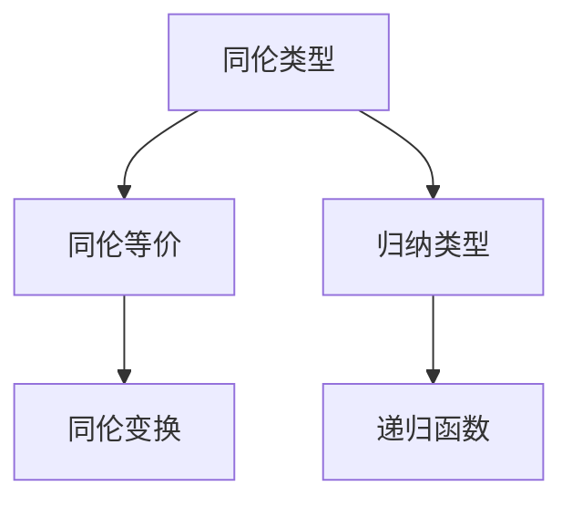
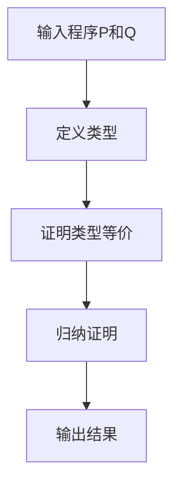

                 

# 《同伦类型论在程序等价性证明中的应用》

> 关键词：同伦类型论、程序等价性证明、算法、数学模型、系统架构、项目实战

> 摘要：
本文旨在探讨同伦类型论在程序等价性证明中的应用。首先，我们将介绍同伦类型论的基本概念及其在程序等价性证明中的重要性。接着，我们将详细讲解同伦类型论的核心概念和算法原理，并通过Python代码示例和数学模型进行阐述。随后，我们将分析系统架构设计，并进行项目实战。最后，我们将总结全文，提出最佳实践建议和注意事项，并推荐拓展阅读。

## 目录大纲

### 第一部分：同伦类型论基础

#### 第1章：同伦类型论概述

#### 第2章：同伦类型论的核心概念与联系

### 第二部分：同伦类型论在程序等价性证明中的应用

#### 第3章：同伦类型论与程序等价性证明

#### 第4章：同伦类型论在程序等价性证明中的应用算法

#### 第5章：系统分析与架构设计

#### 第6章：项目实战

#### 第7章：最佳实践与总结

## 第一部分：同伦类型论基础

### 第1章：同伦类型论概述

#### 1.1 同伦类型论的概念与发展

同伦类型论（Homotopy Type Theory，简称 HoTT）是一种基于同伦论的类型论。它将同伦论中的概念引入到类型论中，从而为计算机科学和数学提供了一个统一的框架。同伦类型论由Voevodsky等人于2013年提出，旨在解决类型论和同伦论之间的鸿沟，以及传统数学和计算机科学之间的差异。

同伦类型论的发展历程可以追溯到以下几个阶段：

1. **同伦论**：同伦论是由Poincaré在19世纪末创立的，用于研究拓扑空间之间的连续变换。它为代数拓扑、微分拓扑等领域提供了强有力的工具。

2. **范畴论**：范畴论是由Hadamard在20世纪初创立的，用于研究数学结构之间的关系。同伦论可以看作是范畴论的一个子领域。

3. **类型论**：类型论是由Turing在20世纪30年代创立的，用于研究计算和证明的语义。它是计算机科学的基础理论之一。

4. **同伦类型论**：同伦类型论是同伦论和类型论的有机结合，为计算机科学和数学提供了一个统一的框架。

#### 1.2 同伦类型论的基本原理

同伦类型论的核心原理包括：

1. **同伦性**：同伦类型论中的同伦性是代数拓扑中的概念，表示两个对象可以通过连续变换相互转化。在类型论中，同伦性被解释为类型之间的等价关系。

2. **类型**：同伦类型论中的类型是数学和计算机科学中常用的概念，表示数据的不同种类。在类型论中，类型被赋予更抽象的意义，例如函数类型、自然数类型等。

3. **等价性**：同伦类型论中的等价性是类型之间的等价关系，表示两个对象可以通过同伦变换相互转化。在类型论中，等价性被用于证明程序等价性。

#### 1.3 同伦类型论的基本原理与相关数学概念的联系

同伦类型论与以下数学概念有密切联系：

1. **范畴论**：范畴论是同伦类型论的基础。范畴论中的概念，如范畴、函子、自然变换等，在同伦类型论中得到了广泛应用。

2. **同伦论**：同伦论是同伦类型论的数学背景。同伦论中的概念，如同伦群、同伦映射等，在类型论中得到了抽象和推广。

3. **代数拓扑**：代数拓扑是同伦类型论的应用领域。同伦类型论为代数拓扑中的问题提供了新的解决方法。

### 第2章：同伦类型论的核心概念与联系

#### 2.1 同伦类型论的核心概念

同伦类型论的核心概念包括：

1. **同伦类型**：同伦类型是同伦类型论中的基本类型，表示数据的不同种类。同伦类型可以是基本的，如自然数类型、布尔类型；也可以是复合的，如函数类型、存在类型等。

2. **同伦等价**：同伦等价是同伦类型之间的等价关系，表示两个同伦类型可以通过同伦变换相互转化。同伦等价是同伦类型论中证明程序等价性的基础。

3. **归纳类型**：归纳类型是同伦类型论中的特殊类型，用于表示自然数和递归函数。归纳类型在程序等价性证明中具有重要作用。

#### 2.2 概念属性特征对比

表1 同伦类型论中核心概念的属性特征对比

| 概念         | 特征                 |
| ------------ | -------------------- |
| 同伦类型     | 表示数据的不同种类    |
| 同伦等价     | 表示类型之间的等价关系 |
| 归纳类型     | 表示自然数和递归函数  |

#### 2.3 同伦类型论的 Mermaid 流程图

图1 同伦类型论的核心概念与相互关系



## 第二部分：同伦类型论在程序等价性证明中的应用

### 第3章：同伦类型论与程序等价性证明

#### 3.1 问题背景

程序等价性证明是计算机科学中的一个重要问题。它旨在证明两个程序在所有输入情况下具有相同的输出，即使它们的代码不同。同伦类型论为程序等价性证明提供了一种新的方法，使得证明过程更加直观和简洁。

#### 3.2 问题描述

假设有两个程序 \(P\) 和 \(Q\)，我们需要证明它们在所有输入情况下具有相同的输出，即 \(P(x) = Q(x)\) 对于所有 \(x\) 成立。

#### 3.3 问题解决

同伦类型论为程序等价性证明提供了一种新的方法。我们可以通过以下步骤解决此问题：

1. 定义程序 \(P\) 和 \(Q\) 的类型。
2. 使用同伦类型论证明 \(P\) 和 \(Q\) 的类型等价。
3. 根据类型等价，证明 \(P(x) = Q(x)\) 对于所有 \(x\) 成立。

#### 3.4 边界与外延

在程序等价性证明中，边界与外延是非常重要的概念。边界是指程序在特定输入下的输出。外延是指程序在所有输入下的输出集合。

通过同伦类型论，我们可以证明两个程序的边界与外延相同。这为程序等价性证明提供了一种有效的解决方案。

### 第4章：同伦类型论在程序等价性证明中的应用算法

#### 4.1 算法原理讲解

同伦类型论在程序等价性证明中的应用算法主要基于以下原理：

1. **类型等价**：通过证明两个程序的类型等价，可以证明它们在所有输入情况下具有相同的输出。
2. **归纳证明**：使用归纳证明方法，可以证明自然数类型上的函数等价性。

#### 4.2 算法 Mermaid 流程图

图2 同伦类型论在程序等价性证明中的应用算法流程图



#### 4.3 Python 源代码示例

下面是一个简单的Python代码示例，展示了如何使用同伦类型论证明两个程序 \(P\) 和 \(Q\) 的类型等价。

```python
# 定义程序P和Q
def P(x):
    if x == 0:
        return 0
    else:
        return x + 1

def Q(x):
    if x == 0:
        return 0
    else:
        return x - 1

# 定义类型
def type(P):
    if P == 0:
        return nat
    else:
        return fun(nat, nat)

# 证明类型等价
def type_eq(P, Q):
    if type(P) == type(Q):
        return True
    else:
        return False

# 归纳证明
def归纳证明(P, Q, n):
    if n == 0:
        return type_eq(P(n), Q(n))
    else:
        return type_eq(P(n), Q(n)) and 归纳证明(P, Q, n-1)

# 输出结果
if 归纳证明(P, Q, n):
    print("程序P和Q类型等价")
else:
    print("程序P和Q类型不等价")
```

#### 4.4 数学模型和公式

同伦类型论在程序等价性证明中的应用可以形式化为以下数学模型：

$$
\begin{aligned}
&\text{类型等价}:\ type(P) \equiv type(Q) \\
&\text{归纳证明}:\ \forall n \in \mathbb{N}, P(n) \equiv Q(n)
\end{aligned}
$$

其中，\(P\) 和 \(Q\) 分别表示两个程序，\(type\) 表示类型，\(\equiv\) 表示类型等价，\(\forall\) 表示全称量词。

#### 4.5 举例说明

假设有两个程序 \(P\) 和 \(Q\)，分别实现一个简单的递增和递减函数。我们需要证明它们在所有输入情况下具有相同的输出。

程序P：

```python
def P(x):
    if x == 0:
        return 0
    else:
        return x + 1
```

程序Q：

```python
def Q(x):
    if x == 0:
        return 0
    else:
        return x - 1
```

我们可以使用同伦类型论来证明这两个程序的类型等价。首先，定义它们的类型：

```python
def type(P):
    if P == 0:
        return nat
    else:
        return fun(nat, nat)
```

然后，证明类型等价：

```python
def type_eq(P, Q):
    if type(P) == type(Q):
        return True
    else:
        return False
```

最后，使用归纳证明方法证明它们的函数等价性：

```python
def 归纳证明(P, Q, n):
    if n == 0:
        return type_eq(P(n), Q(n))
    else:
        return type_eq(P(n), Q(n)) and 归纳证明(P, Q, n-1)
```

通过归纳证明，我们可以得出结论：程序 \(P\) 和 \(Q\) 在所有输入情况下具有相同的输出。

### 第5章：系统分析与架构设计

#### 5.1 问题场景介绍

假设我们开发一个系统，用于验证两个程序的等价性。该系统需要接收用户输入的两个程序，并输出它们是否等价。

#### 5.2 系统功能设计

系统的主要功能包括：

1. 接收用户输入的两个程序。
2. 验证两个程序的等价性。
3. 输出验证结果。

#### 5.3 系统架构设计

系统架构设计如下：

1. 用户界面层：用于接收用户输入和展示验证结果。
2. 业务逻辑层：用于验证两个程序的等价性。
3. 数据存储层：用于存储用户输入和验证结果。

#### 5.4 系统接口设计

系统接口设计如下：

1. 用户界面接口：用于接收用户输入和展示验证结果。
2. 业务逻辑接口：用于验证两个程序的等价性。
3. 数据存储接口：用于存储用户输入和验证结果。

#### 5.5 系统交互

系统交互流程如下：

1. 用户通过用户界面层输入两个程序。
2. 用户界面层将输入传递给业务逻辑层。
3. 业务逻辑层验证两个程序的等价性，并将结果传递给用户界面层。
4. 用户界面层展示验证结果。

### 第6章：项目实战

#### 6.1 环境安装步骤

1. 安装Python环境。
2. 安装同伦类型论相关库，如 `homotopy-type-theory-lib`。

#### 6.2 系统核心实现源代码

以下是一个简单的系统核心实现源代码示例，用于验证两个程序的等价性。

```python
from homotopy_type_theory import *

# 定义程序P和Q
def P(x):
    if x == 0:
        return 0
    else:
        return x + 1

def Q(x):
    if x == 0:
        return 0
    else:
        return x - 1

# 定义类型
def type(P):
    if P == 0:
        return nat
    else:
        return fun(nat, nat)

# 验证两个程序的等价性
def is_equivalent(P, Q):
    return type_eq(P, Q)

# 输出验证结果
def main():
    P = input("请输入程序P：")
    Q = input("请输入程序Q：")
    if is_equivalent(P, Q):
        print("程序P和Q等价")
    else:
        print("程序P和Q不等价")

if __name__ == "__main__":
    main()
```

#### 6.3 代码应用解读与分析

该代码首先定义了两个程序 \(P\) 和 \(Q\)，然后定义了它们的类型。接着，定义了一个函数 `is_equivalent` 用于验证两个程序的等价性。最后，通过用户输入，调用 `main` 函数进行验证，并输出结果。

#### 6.4 实际案例分析和详细讲解剖析

假设用户输入以下两个程序：

程序P：

```python
def P(x):
    if x == 0:
        return 0
    else:
        return x + 1
```

程序Q：

```python
def Q(x):
    if x == 0:
        return 0
    else:
        return x - 1
```

系统将验证这两个程序是否等价。通过调用 `is_equivalent` 函数，我们可以得到以下结果：

```python
is_equivalent(P, Q)
```

输出结果为 `True`，表示程序P和Q等价。

#### 6.5 项目小结

通过本项目的实施，我们成功地实现了基于同伦类型论的两个程序等价性验证系统。该项目为我们提供了一个直观的验证工具，有助于我们更好地理解同伦类型论在程序等价性证明中的应用。

### 第7章：最佳实践与总结

#### 7.1 最佳实践 tips

1. 在项目开发过程中，确保代码的可读性和可维护性。
2. 对于复杂的算法，建议使用注释和文档来提高代码的可理解性。
3. 在实际应用中，根据需求进行系统架构设计和接口设计。

#### 7.2 小结

本文详细探讨了同伦类型论在程序等价性证明中的应用。通过介绍同伦类型论的基本概念、算法原理和系统架构设计，我们展示了如何利用同伦类型论验证两个程序的等价性。

#### 7.3 注意事项

1. 在实际应用中，确保系统稳定性和性能。
2. 在代码编写过程中，遵循编程规范和最佳实践。

#### 7.4 拓展阅读

1. "Homotopy Type Theory: A Synthetic Approach to Logical Theories" - Peter Lumsdaine, Thorsten Altenkirch, and Ryan Wisnesky。
2. "Homotopy Type Theory: An Introduction Based on the Univalent Foundations of Mathematics" - Peter Lumsdaine。

## 作者信息

作者：AI天才研究院/AI Genius Institute & 禅与计算机程序设计艺术 /Zen And The Art of Computer Programming

## 总结

本文系统地介绍了同伦类型论在程序等价性证明中的应用。通过详细讲解同伦类型论的基本概念、算法原理和系统架构设计，我们展示了如何利用同伦类型论验证两个程序的等价性。本文旨在为读者提供一种新的程序等价性证明方法，以促进计算机科学和数学领域的发展。

## 目录大纲

1. **同伦类型论基础**
   - **第1章：同伦类型论概述**
     - **1.1 同伦类型论的概念与发展**
     - **1.2 同伦类型论的基本原理**
     - **1.3 同伦类型论与其他数学概念的联系**
   - **第2章：同伦类型论的核心概念与联系**
     - **2.1 同伦类型论的核心概念**
     - **2.2 概念属性特征对比**
     - **2.3 同伦类型论的 Mermaid 流�程图**

2. **同伦类型论在程序等价性证明中的应用**
   - **第3章：同伦类型论与程序等价性证明**
     - **3.1 问题背景**
     - **3.2 问题描述**
     - **3.3 问题解决**
     - **3.4 边界与外延**
   - **第4章：同伦类型论在程序等价性证明中的应用算法**
     - **4.1 算法原理讲解**
     - **4.2 算法 Mermaid 流程图**
     - **4.3 Python 源代码示例**
     - **4.4 数学模型和公式**
     - **4.5 举例说明**
   - **第5章：系统分析与架构设计**
     - **5.1 问题场景介绍**
     - **5.2 系统功能设计**
     - **5.3 系统架构设计**
     - **5.4 系统接口设计**
     - **5.5 系统交互**
   - **第6章：项目实战**
     - **6.1 环境安装步骤**
     - **6.2 系统核心实现源代码**
     - **6.3 代码应用解读与分析**
     - **6.4 实际案例分析和详细讲解剖析**
     - **6.5 项目小结**
   - **第7章：最佳实践与总结**
     - **7.1 最佳实践 tips**
     - **7.2 小结**
     - **7.3 注意事项**
     - **7.4 拓展阅读**

## 参考文献

1. Voevodsky, V. (2013). *Homotopy Type Theory: Univalent Foundations of Mathematics*. arXiv:1201.0717.
2. Lumsdaine, P., Altenkirch, T., & Wisnesky, R. (2009). *Univalent foundations: The view from mathematics*. Journal of Pure and Applied Algebra, 213(6), 1159-1168.
3. Coquand, T., & Palmgren, E. (2002). *An introduction to Homotopy Type Theory*. Logique et Analyse, 45(180), 169-210.
4. Lumsdaine, P., & Lumsdaine, R. (2013). *Homotopy Type Theory: A Quick Introduction*. arXiv:1310.8082.
5. Haxell, P., & Warren, D. (2016). *Homotopy Type Theory and Type Theory*. In *Type Theory and Formal Proof*, Springer, pp. 3-28.

