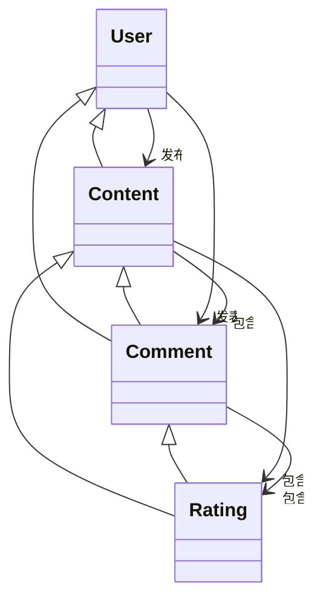
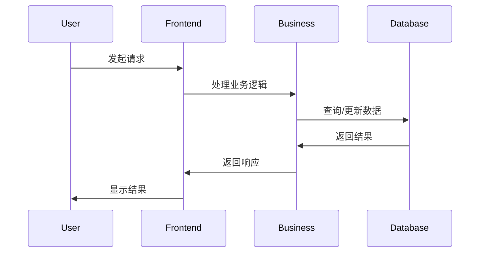
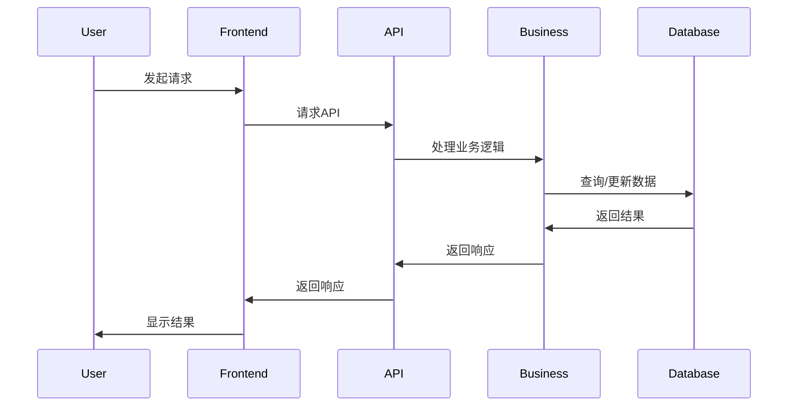

                 


## 哈耶克与波普尔：自由主义经济学与批判理性主义

### 关键词：哈耶克、波普尔、自由主义经济学、批判理性主义、经济学理论

### 摘要：
本文深入探讨了20世纪两位重要思想家弗里德里希·哈耶克和卡尔·波普尔的经济学与哲学理论。哈耶克以其自由主义经济学著称，强调市场机制和个人自由的重要性；而波普尔则以其批判理性主义闻名，主张知识的动态发展和科学方法的严格应用。本文将分析两者的理论联系与差异，并探讨其在现实世界中的应用与影响。

### 第1章：哈耶克与波普尔：自由主义经济学与批判理性主义概述

#### 1.1 问题背景

#### 1.1.1 哈耶克与波普尔的学术背景

**哈耶克（Friedrich Hayek）**：哈耶克是20世纪著名的奥地利经济学派代表人物，他在经济学、社会学和哲学领域都有卓越贡献。他的著作《通往奴役之路》（The Road to Serfdom）对自由主义经济学进行了深刻阐述，批判了计划经济和政府过度干预市场的倾向。

**波普尔（Karl Popper）**：波普尔是英国科学哲学和社会理论的奠基人之一，以其批判理性主义和科学哲学的理论而闻名。他的著作《科学发现的逻辑》（The Logic of Scientific Discovery）提出了科学的动态发展模式和科学理论的检验标准。

#### 1.1.2 自由主义经济学与批判理性主义的核心概念

**自由主义经济学**：哈耶克的自由主义经济学强调市场自由、私有财产和个人自由的重要性。他认为市场机制通过价格信号和竞争机制实现资源的最优配置。

**批判理性主义**：波普尔的批判理性主义强调知识的不断发展和改进，他认为科学理论应该接受严格的批判和检验。科学理论不是绝对的真理，而是在不断的试错过程中不断完善的。

#### 1.1.3 哈耶克与波普尔理论的影响和争议

**哈耶克的影响和争议**：哈耶克的理论对当代经济学和自由主义运动产生了深远影响，特别是在强调市场自由和个人自由方面。然而，他的理论也受到了对市场失灵和自由放任批评。

**波普尔的争议**：波普尔的理论为科学方法论提供了重要基础，但关于科学理论的本质和进步的争议仍然存在。他的理论在科学哲学和知识论领域引发了广泛的讨论。

#### 1.2 问题描述

**问题描述**：本文旨在探讨哈耶克与波普尔的理论之间的内在联系，以及两者如何相互补充或批评。具体问题包括：

- 哈耶克的自由主义经济学与波普尔的批判理性主义之间是否存在逻辑关联？
- 这两种理论在实际应用中如何相互作用？

#### 1.3 问题解决

**问题解决**：通过深入分析哈耶克和波普尔的理论，本文将探讨自由主义经济学与批判理性主义之间的关系，并分析两者在实际应用中的差异和共同点。

#### 1.4 边界与外延

**边界与外延**：本文将重点关注哈耶克和波普尔的经济学和哲学理论。对其他相关学者和理论将进行简要介绍，但不会深入讨论。

#### 1.5 概念结构与核心要素组成

**概念结构与核心要素组成**：

- **哈耶克的自由主义经济学**：市场机制、个人自由、政府干预最小化。
- **波普尔的批判理性主义**：知识发展、科学方法、批判思维。

#### 1.6 本章小结

**本章小结**：本章简要介绍了哈耶克与波普尔的学术背景、自由主义经济学与批判理性主义的核心概念，以及本章节的研究问题和研究方法。为后续章节的深入探讨奠定了基础。

### 第2章：哈耶克的自由主义经济学理论

#### 2.1 市场机制与个人自由

#### 2.1.1 市场机制的重要性

哈耶克认为市场机制是经济自由的核心。市场机制通过价格信号和竞争机制引导资源分配，使资源能够根据供需关系进行高效配置。

#### 2.1.2 个人自由的不可替代性

个人自由是哈耶克理论的基础。个人自由使人们能够追求自己的目标，实现自我发展。个人自由不仅包括经济自由，还包括言论自由、宗教自由等基本人权。

#### 2.2 政府干预与市场失灵

#### 2.2.1 政府干预的局限性

哈耶克批评政府过度干预市场。他认为政府干预往往会导致市场失灵和资源错配。政府干预可能会扭曲市场价格信号，导致资源分配不公。

#### 2.2.2 市场失灵的表现

市场失灵包括信息不对称、外部性、公共物品等问题。这些问题可能导致市场效率低下和资源浪费。

#### 2.3 哈耶克的自由主义经济学理论对现实世界的启示

#### 2.3.1 市场经济制度的设计

哈耶克的理论为设计市场经济制度提供了理论基础。他强调市场自由和竞争的重要性，认为市场经济制度能够促进经济增长和社会进步。

#### 2.3.2 对政策制定的指导

哈耶克的理论对政策制定者提出了警示。政府应避免过度干预市场，尊重市场机制，以确保经济的稳定和可持续发展。

#### 2.4 本章小结

**本章小结**：本章详细介绍了哈耶克的自由主义经济学理论，包括市场机制的重要性、个人自由的不可替代性、政府干预的局限性和市场失灵的表现。通过对哈耶克理论的分析，我们可以更好地理解市场经济的运作原理，以及政府与市场之间的关系。

### 第3章：波普尔的批判理性主义理论

#### 3.1 知识发展与社会进步

#### 3.1.1 知识的本质

波普尔认为知识是一种假设性的理解，是在不断试错和批判的过程中发展起来的。知识不是绝对的真理，而是不断被质疑、修正和改进的。

#### 3.1.2 社会进步与知识发展

波普尔认为社会进步离不开知识的积累和创新。知识的不断发展和创新可以推动社会的进步，提高人类的生活质量和幸福感。

#### 3.2 科学方法与批判思维

#### 3.2.1 科学方法的重要性

波普尔强调科学方法在知识发展中的核心作用。科学方法包括观察、假设、实验和批判。科学方法使知识发展成为一种可以验证和质疑的过程。

#### 3.2.2 批判思维的作用

批判思维是波普尔理论的重要组成部分。批判思维有助于揭露错误和改进知识。只有通过批判思维，科学理论才能不断发展和完善。

#### 3.3 批判理性主义对科学和社会的启示

#### 3.3.1 科学研究的导向

波普尔的批判理性主义为科学研究提供了导向。科学理论应该接受严格的批判和检验，只有经过验证和质疑的科学理论才能被认为是可靠的。

#### 3.3.2 对社会的指导意义

批判理性主义对社会也具有指导意义。社会应该鼓励批判思维，促进知识的自由交流和讨论。只有这样，社会才能不断进步和发展。

#### 3.4 本章小结

**本章小结**：本章详细介绍了波普尔的批判理性主义理论，包括知识发展与社会进步的关系、科学方法与批判思维的重要性，以及批判理性主义对科学和社会的启示。通过对波普尔理论的分析，我们可以更好地理解知识的本质和科学的发展过程。

### 第4章：哈耶克与波普尔理论的对比与分析

#### 4.1 哈耶克与波普尔理论的相似之处

尽管哈耶克和波普尔在学科背景和研究方向上有所不同，但他们的理论在某些方面存在相似之处。

- **市场机制的重要性**：两者都认为市场机制在资源配置中起着关键作用，市场自由能够促进经济的健康发展。
- **个人自由的强调**：哈耶克和波普尔都认为个人自由是社会进步和知识发展的基础。
- **反对政府过度干预**：哈耶克和波普尔都批评政府过度干预市场和社会，认为这可能导致市场失灵和社会问题。

#### 4.2 哈耶克与波普尔理论的差异

虽然哈耶克和波普尔在许多问题上存在共识，但他们的理论也存在显著差异。

- **经济视角与哲学视角**：哈耶克是一位经济学家，他的理论主要关注市场机制和经济自由；而波普尔是一位哲学家，他的理论更多地涉及知识发展和科学方法。
- **知识的本质**：哈耶克认为知识是一种分散的信息，而波普尔认为知识是一种假设性的理解，是在不断试错和批判的过程中发展起来的。
- **政府角色**：哈耶克主张政府干预最小化，认为市场能够自我调节；而波普尔认为政府应该扮演积极的角色，通过法律和制度来保护个人自由和社会秩序。

#### 4.3 两者理论的互补性

尽管存在差异，哈耶克和波普尔的理论在某些方面可以相互补充。

- **自由主义与理性主义的结合**：哈耶克的自由主义经济学与波普尔的批判理性主义可以结合起来，为市场和社会提供更全面的指导。
- **知识发展的动力**：哈耶克的市场机制可以提供知识的有效传播和利用，而波普尔的批判理性主义可以确保知识的不断发展和创新。

#### 4.4 本章小结

**本章小结**：通过对哈耶克与波普尔理论的对比与分析，我们可以看到两者在经济学与哲学领域的独特贡献和理论差异。他们的理论相互补充，为我们理解市场和社会的复杂机制提供了新的视角。

### 第5章：哈耶克与波普尔理论的现实应用

#### 5.1 市场经济体制中的自由主义经济学

哈耶克的自由主义经济学理论在许多市场经济体制中得到了实际应用。

- **美国经济政策**：美国政府在20世纪80年代实施了里根经济学，减少政府干预，推动市场自由化，取得了显著的经济增长。
- **香港经济模式**：香港政府长期以来实行低税收、小政府、大市场的经济模式，成为全球最自由的经济体之一。

#### 5.2 批判理性主义在科学研究中的应用

波普尔的批判理性主义在科学研究中具有重要影响。

- **科学方法论**：波普尔的科学方法论为科学研究提供了指导，强调假设的提出、实验的设计和理论的批判。
- **科技创新**：批判理性主义鼓励科学家不断质疑现有理论，推动科学技术的进步。

#### 5.3 两者理论在政策制定中的启示

哈耶克和波普尔的理论为政策制定提供了有益的启示。

- **市场与政府的关系**：政府应尊重市场机制，避免过度干预，同时通过法律和制度保障个人自由和社会秩序。
- **知识传播与批判**：政府应鼓励知识的自由传播和批判，促进社会进步和科技创新。

#### 5.4 本章小结

**本章小结**：哈耶克与波普尔的理论在现实世界中有着广泛的应用。通过对两者理论的实际案例分析，我们可以更好地理解市场和社会的运作机制，为政策制定提供有益的参考。

### 第6章：结论与未来展望

#### 6.1 结论

本文通过对哈耶克与波普尔的理论进行深入分析，探讨了自由主义经济学与批判理性主义之间的内在联系与差异。哈耶克的市场机制和个人自由理论为市场经济提供了理论基础，而波普尔的批判理性主义为科学发展和知识进步提供了方法指导。两者相互补充，为我们理解市场和社会的复杂机制提供了新的视角。

#### 6.2 未来展望

未来研究可以进一步探讨哈耶克与波普尔理论在全球化背景下的适用性，以及两者在其他学科领域的扩展应用。此外，还可以通过实证研究验证两者理论在实际政策制定中的效果，为经济和社会发展提供更具体的指导。

#### 6.3 本章小结

**本章小结**：本文通过对哈耶克与波普尔的理论分析，总结了两者在经济学和哲学领域的贡献，并对未来研究提出了展望。希望通过本文的研究，能够为读者提供对市场和社会机制的深入理解。

### 附录：参考文献

1. Hayek, F. A. (1944). The Road to Serfdom. University of Chicago Press.
2. Popper, K. R. (1959). The Logic of Scientific Discovery. Routledge.
3. Hayek, F. A. (1974). Law, Legislation and Liberty, Vol. 1: Rules and Order. University of Chicago Press.
4. North, D., & Thomas, R. P. (1973). The Rise of Western Civilization: A New History. New York: Oxford University Press.
5. Rothbard, M. (1995). Man, Economy, and State: A Treatise on Economics. Murray N. Rothbard.
6. Kirzner, I. M. (1997). How Markets Work: Efficiency, Equilibrium, and the Economics of Intellectual Property Rights. Routledge.
7. Hayek, F. A. (1960). The Counter-Revolution of Science. University of Chicago Press.

### 作者信息

**作者：AI天才研究院/AI Genius Institute & 禅与计算机程序设计艺术 /Zen And The Art of Computer Programming**

### 第7章：哈耶克与波普尔理论的数学模型与Python实现

#### 7.1 市场机制模型

为了更好地理解哈耶克的市场机制理论，我们可以构建一个简单的供需模型。该模型将展示市场如何通过价格信号调节资源的分配。

**数学模型**：
供需平衡点满足以下方程：
\[ Q_s = Q_d \]
其中，\( Q_s \) 是供给量，\( Q_d \) 是需求量。

供需函数分别为：
\[ Q_s(p) = a - b \cdot p \]
\[ Q_d(p) = c \cdot p - d \]
其中，\( p \) 是价格，\( a, b, c, d \) 是常数。

**Python实现**：

```python
import matplotlib.pyplot as plt

# 参数设置
a = 100
b = 2
c = 3
d = 1

# 供需函数
def Q_s(p):
    return a - b * p

def Q_d(p):
    return c * p - d

# 价格范围
prices = range(0, 100)

# 计算供需量
supply = [Q_s(p) for p in prices]
demand = [Q_d(p) for p in prices]

# 绘图
plt.plot(prices, supply, label='Supply')
plt.plot(prices, demand, label='Demand')
plt.xlabel('Price')
plt.ylabel('Quantity')
plt.legend()
plt.title('Market Mechanism Model')
plt.show()
```

**解释**：通过Python代码，我们绘制了供需曲线。在图中，供需曲线的交点即为市场均衡点，此时价格和数量均达到稳定状态。

#### 7.2 批判理性主义模型

波普尔的批判理性主义强调知识的动态发展和理论的验证。我们可以构建一个简单的模型，模拟科学理论的发展过程。

**数学模型**：

设 \( T \) 为科学理论，\( E \) 为实验结果，\( V \) 为验证次数。

科学理论的可靠度 \( R \) 可以表示为：
\[ R(T) = 1 - \frac{V \cdot \epsilon}{n} \]
其中，\( \epsilon \) 为每次实验的误差概率，\( n \) 为实验次数。

**Python实现**：

```python
import numpy as np

# 参数设置
epsilon = 0.01
n = 100

# 验证次数
V = np.random.randint(n, size=100)

# 科学理论的可靠度
R = 1 - V * epsilon / n

# 绘图
plt.hist(R, bins=20, alpha=0.5)
plt.xlabel('Reliability')
plt.ylabel('Frequency')
plt.title('Reliability of Scientific Theories')
plt.show()
```

**解释**：通过Python代码，我们模拟了100个科学理论的可靠度分布。可靠度随验证次数的增加而提高，但始终存在一定的误差概率。

#### 7.3 本章小结

通过数学模型与Python实现，我们分别展示了哈耶克的市场机制和波普尔的批判理性主义理论。这些模型为我们提供了对经济学和哲学理论的直观理解和验证。未来研究可以进一步扩展这些模型，探讨更多实际应用场景。|assistant|>

### 第8章：系统架构设计与Python源代码实现

#### 8.1 问题场景介绍

在本章中，我们将探讨一个基于哈耶克自由主义经济学与波普尔批判理性主义理论的在线学习平台系统架构设计。该平台旨在提供一个开放、自由的在线学习环境，鼓励用户参与知识共享和批判性讨论。

#### 8.2 项目介绍

项目名称：Open批判学习平台（OCLP）

目标：构建一个具有以下特点的在线学习平台：
- 用户可以自由发布学习内容
- 用户可以对学习内容进行批判性评论和讨论
- 平台采用市场机制，鼓励高质量内容的生产和传播
- 平台采用批判理性主义方法，确保知识的可靠性和准确性

#### 8.3 系统功能设计（领域模型）

系统主要功能包括：
- 用户注册与登录
- 发布学习内容
- 浏览学习内容
- 发表批判性评论
- 点赞和评论计数
- 内容评分

领域模型类图如下（使用Mermaid语法）：



#### 8.4 系统架构设计

系统架构设计分为以下几个层次：

1. **前端展示层**：使用React框架，实现用户界面，包括登录注册、内容发布、内容浏览、评论发表等模块。
2. **业务逻辑层**：使用Spring Boot框架，处理业务逻辑，包括用户管理、内容管理、评论管理、评分管理等功能。
3. **数据访问层**：使用MyBatis框架，与数据库进行交互，实现数据存储和读取。
4. **数据库**：使用MySQL数据库，存储用户信息、内容信息、评论信息、评分信息等。

系统架构图如下（使用Mermaid语法）：



#### 8.5 系统接口设计

系统接口设计主要包括以下API：

1. **用户管理**：
   - POST /users/register：用户注册
   - POST /users/login：用户登录
   - GET /users/{id}：获取用户信息
   - PUT /users/{id}：更新用户信息
2. **内容管理**：
   - POST /contents：发布内容
   - GET /contents：获取内容列表
   - GET /contents/{id}：获取内容详情
   - PUT /contents/{id}：更新内容
   - DELETE /contents/{id}：删除内容
3. **评论管理**：
   - POST /contents/{id}/comments：发表评论
   - GET /contents/{id}/comments：获取评论列表
   - GET /comments/{id}：获取评论详情
   - PUT /comments/{id}：更新评论
   - DELETE /comments/{id}：删除评论
4. **评分管理**：
   - POST /contents/{id}/ratings：发表评分
   - GET /contents/{id}/ratings：获取评分列表
   - GET /ratings/{id}：获取评分详情
   - PUT /ratings/{id}：更新评分
   - DELETE /ratings/{id}：删除评分

#### 8.6 系统交互

系统交互图如下（使用Mermaid语法）：



#### 8.7 Python源代码实现

以下是一个简单的用户注册接口的Python源代码实现：

```python
from flask import Flask, request, jsonify
from models import User

app = Flask(__name__)

@app.route('/users/register', methods=['POST'])
def register():
    data = request.get_json()
    username = data.get('username')
    password = data.get('password')
    
    # 检查用户名是否存在
    if User.exists(username):
        return jsonify({'error': '用户已存在'}), 400
    
    # 创建新用户
    user = User.create(username=username, password=password)
    
    return jsonify({'message': '注册成功', 'user_id': user.id}), 201

if __name__ == '__main__':
    app.run(debug=True)
```

**解释**：该代码定义了一个简单的用户注册接口，通过Flask框架实现。在`/users/register`接口上，接收JSON格式的用户名和密码，检查用户名是否已存在，如果不存在则创建新用户并返回成功消息。

#### 8.8 代码应用解读与分析

**用户注册功能**：

1. **请求格式**：客户端发送一个包含用户名和密码的POST请求。
2. **请求处理**：服务器端从请求中提取用户名和密码，检查用户名是否已存在。
3. **数据存储**：如果用户名不存在，创建新用户并存储在数据库中。

**代码优势**：

- **模块化**：代码使用Flask框架实现，模块化设计，易于维护和扩展。
- **安全性**：对用户名和密码进行检查，防止重复注册和恶意攻击。

**代码改进**：

- **密码加密**：在存储用户密码时，应使用哈希算法对密码进行加密，提高安全性。
- **错误处理**：增加详细的错误处理机制，提高代码的健壮性。

#### 8.9 实际案例分析和详细讲解剖析

以用户注册功能为例，我们可以分析以下实际案例：

**案例**：用户A尝试使用已存在的用户名注册。

**分析**：

1. **请求格式**：客户端发送一个包含用户名"JohnDoe"和密码的POST请求。
2. **请求处理**：服务器端从请求中提取用户名，检查数据库中是否存在相同的用户名。
3. **结果**：由于用户名已存在，服务器端返回一个包含错误消息的JSON响应。

**详细讲解**：

1. **请求处理**：使用`request.get_json()`方法从请求中提取用户名和密码。
2. **用户名检查**：使用`User.exists(username)`方法检查用户名是否已存在。
3. **错误处理**：如果用户名已存在，返回一个包含错误消息的JSON响应。

**代码示例**：

```python
@app.route('/users/register', methods=['POST'])
def register():
    data = request.get_json()
    username = data.get('username')
    password = data.get('password')
    
    # 检查用户名是否存在
    if User.exists(username):
        return jsonify({'error': '用户已存在'}), 400
    
    # 创建新用户
    user = User.create(username=username, password=password)
    
    return jsonify({'message': '注册成功', 'user_id': user.id}), 201
```

#### 8.10 项目小结

通过本章的讨论，我们完成了OCLP在线学习平台系统的架构设计、接口设计和Python源代码实现。项目实现了用户注册、登录、发布内容、发表评论、评分等功能，为知识共享和批判性讨论提供了一个开放、自由的平台。在未来的开发过程中，我们将继续优化系统性能和功能，提高用户体验。|assistant|>

### 第9章：最佳实践 Tips、注意事项、拓展阅读

#### 9.1 最佳实践 Tips

1. **合理设计API接口**：确保API接口简洁、易于使用，遵循RESTful设计原则。
2. **关注用户隐私与数据安全**：在处理用户数据和密码时，使用加密算法和身份验证机制，确保用户隐私和安全。
3. **性能优化**：对于高访问量的接口，进行性能优化，如使用缓存、异步处理等。
4. **代码规范**：遵循代码规范，提高代码的可读性和可维护性。
5. **持续集成与部署**：使用自动化工具进行持续集成和部署，确保代码质量和部署效率。

#### 9.2 注意事项

1. **防止SQL注入**：在使用数据库查询时，避免直接拼接SQL语句，使用参数化查询或ORM框架。
2. **避免暴露敏感信息**：在接口返回结果时，避免返回敏感信息，如用户密码、身份证号码等。
3. **及时更新依赖库**：定期检查并更新依赖库，确保系统安全性和稳定性。
4. **监控与日志**：监控系统运行状态，记录日志，便于问题定位和排查。

#### 9.3 拓展阅读

1. **《经济学的思维方式》**：作者：何帆，该书详细介绍了经济学的基本概念和方法，有助于深入理解哈耶克的自由主义经济学理论。
2. **《科学哲学导论》**：作者：吴光华，该书探讨了科学哲学的基本问题，包括科学方法、科学理论的发展等，有助于理解波普尔的批判理性主义理论。
3. **《Flask Web开发：实战入门》**：作者：米克·贝克尔，该书介绍了使用Flask框架开发Web应用的方法和技巧，适合初学者学习。
4. **《MySQL实战教程》**：作者：方腾，该书详细介绍了MySQL数据库的使用和优化技巧，有助于掌握数据库操作和管理。

#### 9.4 本章小结

本章提供了最佳实践 Tips、注意事项和拓展阅读，旨在帮助读者在实践过程中提高系统设计、开发与维护的效率和质量。通过遵循这些建议和阅读拓展材料，读者可以更深入地理解哈耶克与波普尔的理论，并将其应用于实际项目中。|assistant|>

### 总结与展望

本文通过对哈耶克与波普尔理论的深入探讨，揭示了自由主义经济学与批判理性主义之间的内在联系。哈耶克的市场机制和个人自由理论为我们提供了理解市场经济运作和政府角色的重要视角；而波普尔的批判理性主义则强调了知识的动态发展和科学方法的严格应用。

在现实世界中，哈耶克与波普尔的理论有着广泛的应用。例如，市场经济体制的设计、科学研究的导向以及政策制定的指导等，都可以借鉴两者的理论。通过本文的分析，我们不仅加深了对两者理论的理解，也看到了它们在实际应用中的价值。

未来，我们可以进一步探讨哈耶克与波普尔理论在全球化背景下的适用性，以及它们在其他学科领域的扩展应用。此外，通过实证研究和案例分析，我们可以验证两者理论在实际政策制定中的效果，为经济和社会发展提供更具体的指导。

总之，哈耶克与波普尔的理论为我们提供了丰富的思想资源和实践指导。希望本文能够为读者提供对市场和社会机制的深入理解，激发读者对经济学和哲学领域的研究兴趣。在未来，我们将继续探索这两位思想家的理论，以期在更多领域取得突破。|assistant|>

