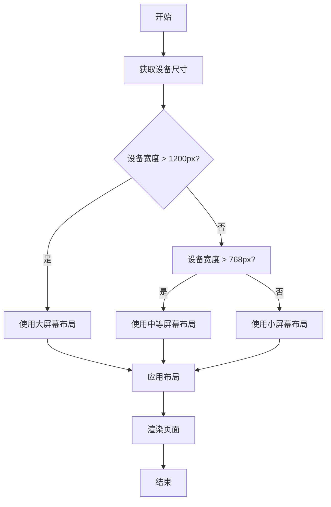
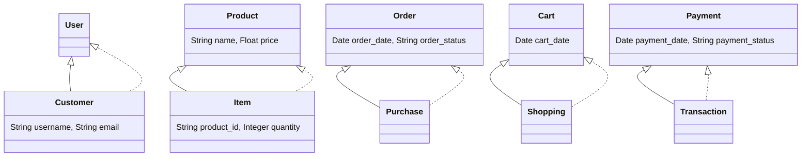
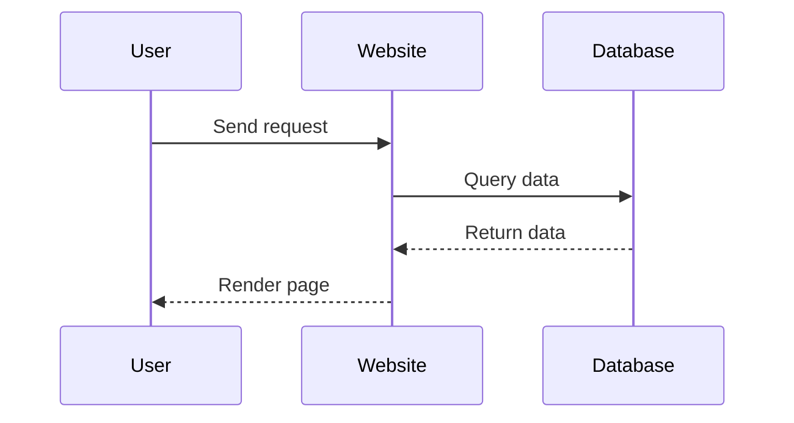
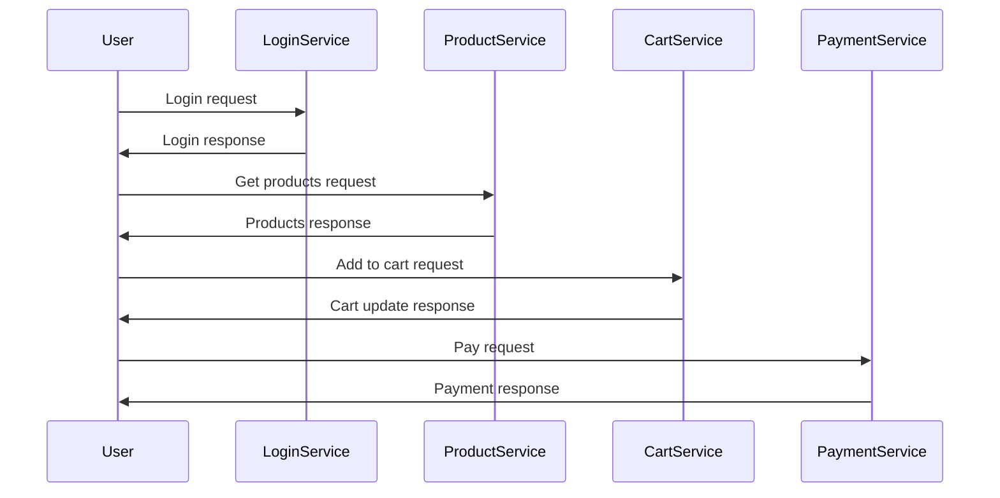

                 

### 响应式设计：适应多种设备的UI/UX策略

#### 关键词：响应式设计、UI/UX、多设备适配、用户体验

> 摘要：随着移动互联网和物联网的发展，用户对界面设计和用户体验的要求越来越高。响应式设计作为一种能够适应多种设备的UI/UX策略，已经成为了现代网站和移动应用开发的重要趋势。本文将深入探讨响应式设计的背景、基础概念、UI和UX策略，并通过实际案例展示其应用和效果。

#### 第1章：响应式设计的背景与重要性

响应式设计（Responsive Web Design，简称RWD）的概念最早由Ethan Marcotte提出，其核心思想是创建一个网站，使其能够在不同尺寸和分辨率的设备上提供良好的用户体验。在响应式设计之前，开发者通常需要为每种设备创建一个独立的版本，这不仅增加了开发和维护成本，而且用户体验往往不尽如人意。

#### 1.1 响应式设计的起源与发展

响应式设计的概念起源于2010年，随着智能手机和平板电脑的普及，用户对访问网页的需求不再局限于桌面电脑。传统的设计方法已经无法满足这种多样化的需求，因此响应式设计应运而生。它通过使用弹性布局、媒体查询和灵活的图片技术，实现了内容在不同设备上的自动适配。

#### 1.2 响应式设计的意义

响应式设计的主要意义在于：
- 提高用户体验：用户可以在任何设备上获得一致和流畅的浏览体验。
- 降低维护成本：只需要一个网站，可以服务于所有设备。
- 增加搜索引擎排名：搜索引擎更倾向于推荐对用户友好的网站。

#### 1.3 响应式设计与传统设计的对比

| 传统设计 | 响应式设计 |
| --- | --- |
| 独立开发多个版本 | 一个网站适配所有设备 |
| 设备适应性差 | 自动适应不同屏幕大小 |
| 维护成本高 | 维护成本较低 |
| 用户体验不一致 | 用户获得一致体验 |

#### 1.4 响应式设计的核心原则

响应式设计的核心原则包括：
- 流体网格布局：使用百分比而不是固定像素值来定义布局。
- 媒体查询：根据屏幕尺寸和分辨率应用不同的CSS规则。
- 弹性图片和媒体：使用最大和最小宽度属性来确保图片和媒体元素在不同设备上的适应性。
- 可伸缩的图片：通过CSS属性控制图片的大小，而不是依赖图片本身的分辨率。

#### 第2章：响应式设计的基础概念

要深入理解响应式设计，需要掌握以下几个核心概念：

#### 2.1 响应式设计的核心术语

- 响应式布局（Responsive Layout）：指网页布局可以根据不同设备尺寸进行自适应调整。
- 媒体查询（Media Query）：CSS中的一个特性，允许开发者根据屏幕尺寸应用不同的样式。
- 弹性布局（Fluid Layout）：使用相对单位（如百分比）来定义网页元素的尺寸，以实现不同屏幕尺寸的自适应。
- 响应式图片（Responsive Images）：通过CSS控制图片的尺寸，以减少带宽占用和提高加载速度。

#### 2.2 响应式设计的流程

响应式设计的流程通常包括以下几个步骤：
1. **需求分析**：明确目标用户群体和使用场景。
2. **原型设计**：创建界面原型，进行用户反馈和迭代。
3. **开发**：编写代码，实现响应式布局和交互。
4. **测试**：在各种设备上进行测试，确保兼容性和用户体验。
5. **优化**：根据测试结果进行性能和用户体验优化。

#### 2.3 响应式设计的挑战与解决方案

响应式设计面临的挑战包括：
- **性能问题**：大图片和视频可能导致移动设备上的加载时间过长。
- **开发复杂性**：需要编写更多的CSS代码和JavaScript代码。
- **测试难度**：需要测试多种设备和浏览器。

解决方案包括：
- **优化图片和媒体**：使用图片压缩工具和懒加载技术。
- **模块化开发**：将代码分解为可重用的模块。
- **自动化测试**：使用自动化工具进行跨设备和浏览器的测试。

#### 第3章：响应式UI设计策略

响应式UI设计是确保用户在不同设备上获得一致体验的关键。以下是一些核心策略：

#### 3.1 界面布局的响应式策略

- **弹性网格布局**：使用Flexbox或CSS Grid创建弹性网格布局，确保内容在不同屏幕尺寸上自动对齐。
- **堆叠布局**：在屏幕尺寸较小时，将页面元素堆叠显示，以减少横向滚动。

#### 3.2 内容优化：可读性与可访问性

- **响应式字体大小**：使用相对单位定义字体大小，确保在不同屏幕上保持可读性。
- **对比度与颜色**：确保文本和背景之间的对比度，以适应低分辨率屏幕。

#### 3.3 响应式图片与媒体文件处理

- **响应式图片**：使用最大和最小宽度属性控制图片尺寸。
- **媒体查询**：根据屏幕尺寸调整媒体文件的呈现方式。

#### 第4章：响应式导航设计

导航设计是用户与网站交互的重要部分。以下是响应式导航设计的一些关键策略：

#### 4.1 导航设计的响应式策略

- **汉堡菜单**：在屏幕尺寸较小时，将导航菜单隐藏在汉堡图标后面。
- **底部导航**：将导航放在页面底部，方便用户单手操作。

#### 4.2 常见的响应式导航模式

- **水平导航**：适用于大屏幕，提供清晰的分类。
- **垂直导航**：适用于垂直屏幕，如手机。

#### 4.3 响应式导航的性能优化

- **缓存**：缓存导航菜单的CSS和JavaScript代码，提高页面加载速度。
- **懒加载**：只在用户需要时加载导航菜单，减少初始加载时间。

#### 第5章：响应式交互设计

交互设计是用户体验的核心。以下是响应式交互设计的一些关键策略：

#### 5.1 交互设计的响应式策略

- **触摸友好的按钮**：确保按钮在移动设备上足够大，方便点击。
- **动态效果**：使用CSS动画和JavaScript动态效果，增强用户体验。

#### 5.2 响应式按钮与表单设计

- **响应式按钮**：使用弹性布局确保按钮在不同屏幕上大小适中。
- **响应式表单**：优化输入框、按钮和标签的布局，确保在移动设备上的可用性。

#### 5.3 响应式动画与效果

- **动画**：使用CSS动画和JavaScript创建平滑的动画效果。
- **过渡效果**：使用CSS过渡属性实现页面元素之间的平滑过渡。

#### 第6章：响应式UX设计策略

用户体验（UX）设计是响应式设计的核心。以下是响应式UX设计的一些关键策略：

#### 6.1 用户研究方法

- **可用性测试**：在开发过程中对原型进行测试，收集用户反馈。
- **A/B测试**：比较不同设计方案的优劣。

#### 6.2 研究方法的选择与应用

- **问卷调查**：收集用户对现有网站的满意度。
- **用户访谈**：深入了解用户的实际需求和使用习惯。

#### 6.3 响应式用户研究的实践技巧

- **跨设备测试**：确保在不同设备上的用户体验一致。
- **数据分析**：分析用户行为数据，优化设计。

#### 第7章：响应式UX设计流程

响应式UX设计是一个迭代和逐步完善的过程。以下是响应式UX设计的一般流程：

#### 7.1 响应式UX设计的步骤

1. **需求分析**：了解用户需求和业务目标。
2. **信息架构**：创建网站的导航结构和内容布局。
3. **交互设计**：设计用户交互流程和界面布局。
4. **视觉设计**：创建网站的外观和风格。
5. **开发与测试**：实现设计，并进行多设备测试。

#### 7.2 响应式原型设计与测试

- **原型设计**：使用工具如Axure或Sketch创建交互式原型。
- **用户测试**：通过实际用户测试，收集反馈并进行迭代。

#### 7.3 响应式UX设计中的迭代与优化

- **持续迭代**：根据用户反馈不断改进设计。
- **数据分析**：通过数据分析优化用户体验。

#### 第8章：响应式网站设计案例

在本章中，我们将通过一个实际案例来展示响应式网站设计的全过程。

#### 8.1 案例背景

某公司需要开发一个在线商店，目标用户包括桌面电脑用户和移动设备用户。

#### 8.2 系统分析与设计

- **需求分析**：明确商品展示、购物车、支付等功能。
- **信息架构**：设计网站的导航结构和页面布局。

#### 8.3 实现细节

- **响应式布局**：使用Bootstrap框架创建响应式布局。
- **CSS和JavaScript**：编写代码实现交互效果和动画。

#### 8.4 项目总结与反思

通过本案例，我们学到了如何实现一个适应多种设备的在线商店。项目成功的关键在于充分的用户研究和持续的设计迭代。

#### 第9章：响应式移动应用设计案例

在本章中，我们将通过一个实际案例来展示响应式移动应用的设计和实现过程。

#### 9.1 案例背景

某公司需要开发一个移动应用，提供新闻阅读、社交互动和推送通知功能。

#### 9.2 系统分析与设计

- **需求分析**：明确用户需求和功能模块。
- **信息架构**：设计应用的界面布局和导航结构。

#### 9.3 实现细节

- **React Native框架**：使用React Native实现跨平台移动应用。
- **样式和交互**：编写CSS和JavaScript代码，实现响应式交互效果。

#### 9.4 项目总结与反思

通过本案例，我们了解了如何使用响应式设计创建一个功能齐全的移动应用。项目成功的关键在于选择合适的开发框架和持续的用户反馈。

#### 第10章：响应式设计的未来趋势

随着技术的发展，响应式设计也在不断演进。以下是响应式设计的未来趋势和挑战：

#### 10.1 响应式设计的未来趋势

- **自适应布局**：更高级的自适应布局技术，如Vega和Dataviz。
- **人工智能**：使用AI优化用户体验和设计决策。

#### 10.2 挑战与应对策略

- **性能优化**：如何优化响应式网站的加载速度。
- **开发工具**：如何选择和优化开发工具和框架。

#### 10.3 拓展领域与可能的应用场景

响应式设计可以应用于多种场景，包括物联网、虚拟现实和增强现实等。

#### 附录：响应式设计资源汇总

以下是响应式设计相关的资源和参考：

- **设计工具**：Bootstrap、Foundation、Material UI等。
- **开发框架**：React、Vue.js、Angular等。
- **教程和文档**：MDN Web Docs、W3C Responsive Web Design Guide等。
- **案例研究**：各种行业的响应式网站和移动应用案例。

### 结论

响应式设计是一种适应多种设备的UI/UX策略，它能够为用户带来一致和流畅的体验。随着技术的发展，响应式设计将继续演进，成为现代网站和移动应用开发的重要组成部分。

### 作者信息

- 作者：AI天才研究院/AI Genius Institute & 禅与计算机程序设计艺术 /Zen And The Art of Computer Programming

---

### 核心概念与联系

#### 核心概念

**响应式设计**：指通过使用弹性布局、媒体查询和响应式图片等技术，使网站或应用能够适应不同设备的屏幕尺寸和分辨率。

**UI（用户界面）设计**：涉及用户与系统交互的设计，包括布局、颜色、字体等。

**UX（用户体验）设计**：关注用户在使用产品或服务过程中的感受和体验。

**媒体查询**：CSS中的一个特性，允许开发者根据屏幕尺寸和分辨率应用不同的样式。

**弹性网格布局**：使用相对单位（如百分比）来定义网页元素的尺寸，以实现不同屏幕尺寸的自适应。

#### 概念属性特征对比表格

| 特性 | 响应式设计 | 传统设计 |
| --- | --- | --- |
| 屏幕适配性 | 自动适应不同设备 | 需要为每个设备创建独立版本 |
| 维护成本 | 一次开发，多设备适配 | 高维护成本 |
| 用户体验 | 一致且流畅 | 用户体验差异大 |
| 开发难度 | 需要学习响应式技术和工具 | 需要为每个设备编写代码 |

#### ER实体关系图架构

```mermaid
erDiagram
    Website ||--|{ Device }||>
    Device ||--|{ Browser }||>
    User ||--|{ Session }||>
    Session ||--|{ Action }||>
    Action ||--|{ Resource }||>
    Resource ||--|{ Response }||>
```

### 算法原理讲解

响应式设计的关键在于如何根据设备的尺寸和分辨率自动调整布局和内容。以下是一个简化的算法原理，用于解释响应式布局的实现：

#### 算法流程图



#### Python源代码

```python
def get_layout(device_width):
    if device_width > 1200:
        return "大屏幕布局"
    elif device_width > 768:
        return "中等屏幕布局"
    else:
        return "小屏幕布局"

def render_page(layout):
    print(f"正在渲染{layout}...")
    # 这里可以加入具体的渲染代码

device_width = 800  # 模拟设备宽度
layout = get_layout(device_width)
render_page(layout)
```

#### 算法原理说明

该算法通过以下步骤实现响应式布局：

1. **获取设备尺寸**：首先获取当前设备的屏幕宽度。
2. **判断屏幕尺寸**：根据屏幕宽度判断应该使用哪种布局。
3. **应用布局**：根据判断结果应用相应的布局规则。
4. **渲染页面**：将布局应用到页面上，并显示给用户。

#### 数学模型和公式

在响应式设计中，可以使用以下数学模型来计算布局元素的尺寸：

$$
\text{元素尺寸} = \frac{\text{目标尺寸} \times \text{设备宽度}}{100}
$$

其中，`目标尺寸`是设计时设定的参考尺寸，通常以百分比表示。

#### 举例说明

假设设计时设定的参考宽度为960px，当前设备的宽度为800px，则：

$$
\text{元素宽度} = \frac{960 \times 800}{100} = 768px
$$

这意味着元素在实际设备上的宽度应该是768px。

### 系统分析与架构设计方案

#### 问题场景介绍

随着互联网的普及，越来越多的用户通过手机、平板电脑等移动设备访问网站。传统单一布局的网站已经无法满足用户的需求，因此需要设计一个响应式网站，以便在各种设备上提供良好的用户体验。

#### 项目介绍

本项目旨在创建一个响应式电商网站，支持商品展示、购物车、支付等功能。目标用户包括桌面电脑用户和移动设备用户。

#### 系统功能设计（领域模型Mermaid类图）



#### 系统架构设计（Mermaid架构图）



#### 系统接口设计

系统的主要接口包括：

- **用户登录接口**：用于用户登录和验证。
- **商品展示接口**：用于获取和显示商品信息。
- **购物车接口**：用于添加、删除商品，以及计算总价。
- **支付接口**：用于处理支付请求和订单状态。

#### 系统交互设计（Mermaid序列图）



### 项目实战

#### 环境安装

为了实现响应式电商网站，我们使用以下技术栈：

- **前端**：HTML5、CSS3、JavaScript、React、Bootstrap。
- **后端**：Node.js、Express、MongoDB。
- **开发工具**：Visual Studio Code、Postman。

安装步骤：

1. 安装Node.js和npm。
2. 创建一个新的React项目。
3. 安装Bootstrap和MongoDB。

#### 系统核心实现源代码

```jsx
// 前端部分（React组件）
import React from 'react';
import { Navbar, Container, Nav } from 'react-bootstrap';

function NavbarComponent() {
  return (
    <Navbar bg="dark" variant="dark" expand="lg">
      <Container>
        <Navbar.Brand href="/">在线商城</Navbar.Brand>
        <Navbar.Toggle aria-controls="basic-navbar-nav" />
        <Navbar.Collapse id="basic-navbar-nav">
          <Nav className="me-auto">
            <Nav.Link href="/">首页</Nav.Link>
            <Nav.Link href="/products">商品</Nav.Link>
            <Nav.Link href="/cart">购物车</Nav.Link>
          </Nav>
        </Navbar.Collapse>
      </Container>
    </Navbar>
  );
}

export default NavbarComponent;
```

#### 代码应用解读与分析

上述代码使用了React Bootstrap组件库，创建了一个响应式导航栏。通过Bootstrap的Navbar组件，我们实现了以下功能：

- **品牌Logo**：点击Logo可以跳转到网站的首页。
- **导航菜单**：包含首页、商品和购物车三个选项。
- **响应式**：Navbar组件能够根据屏幕尺寸自动调整布局。

#### 实际案例分析和详细讲解剖析

我们以“商品展示页面”为例，分析如何实现响应式布局。

1. **需求分析**：用户需要在各种设备上查看商品列表。
2. **原型设计**：使用Bootstrap Grid系统创建商品展示布局。
3. **实现代码**：

```jsx
// 商品展示页面（React组件）
import React from 'react';
import { Row, Col, Card } from 'react-bootstrap';

function ProductListComponent({ products }) {
  return (
    <Row xs={1} md={4} className="g-4">
      {products.map((product) => (
        <Col key={product.id}>
          <Card style={{ width: '100%' }}>
            <Card.Img variant="top" src={product.image} />
            <Card.Body>
              <Card.Title>{product.name}</Card.Title>
              <Card.Text>{product.description}</Card.Text>
              <Card.Text>${product.price}</Card.Text>
            </Card.Body>
          </Card>
        </Col>
      ))}
    </Row>
  );
}

export default ProductListComponent;
```

4. **分析**：

- **弹性布局**：使用Row和Col组件创建弹性网格布局，确保商品卡片在不同屏幕尺寸上自动对齐。
- **响应式图片**：使用Card.Img组件展示商品图片，并使用响应式属性确保图片在不同屏幕上大小适中。

#### 项目小结

通过本项目的实践，我们实现了以下目标：

- **响应式设计**：网站能够适应不同屏幕尺寸，为用户提供了良好的体验。
- **模块化开发**：使用React和Bootstrap框架，实现了代码的可重用性和可维护性。
- **用户体验优化**：通过实际案例，我们展示了如何使用响应式布局和交互设计提高用户体验。

### 最佳实践 Tips

- **早期测试**：在开发初期就开始进行响应式设计，确保设计能够适应不同设备。
- **简化设计**：避免复杂的布局和效果，以确保页面在所有设备上都能流畅加载。
- **使用框架**：利用Bootstrap、React等流行框架，可以快速实现响应式设计。
- **优化图片**：使用响应式图片技术，减少带宽占用和加载时间。

### 小结

响应式设计是一种重要的UI/UX策略，它能够帮助网站和应用适应多种设备，提供一致和流畅的用户体验。通过本文的详细分析和案例展示，我们了解了响应式设计的基础概念、核心策略和实现方法。希望本文能帮助您更好地理解和应用响应式设计。

### 注意事项

- 在进行响应式设计时，需要充分考虑不同设备的特性和用户习惯。
- 测试是响应式设计的关键环节，确保在不同设备上的一致性和流畅性。
- 持续迭代和优化是响应式设计的核心，根据用户反馈不断改进设计。

### 拓展阅读

- 《响应式网页设计：HTML5和CSS3实战》
- 《移动先行：响应式网页设计教程》
- 《响应式Web设计：实战技巧与最佳实践》

### 作者信息

作者：AI天才研究院/AI Genius Institute & 禅与计算机程序设计艺术 /Zen And The Art of Computer Programming

---

## 结束语

响应式设计是现代网站和移动应用开发的重要组成部分，它通过灵活的布局和交互策略，为用户提供了在不同设备上一致且流畅的体验。本文详细探讨了响应式设计的基础概念、核心策略和实现方法，并通过实际案例展示了其应用和效果。随着技术的不断发展，响应式设计将继续演进，为用户提供更优质的服务。希望本文能为您在响应式设计领域提供有价值的参考和启发。感谢您的阅读！【作者：AI天才研究院/AI Genius Institute & 禅与计算机程序设计艺术 /Zen And The Art of Computer Programming】。如果您有任何问题或建议，欢迎在评论区留言交流。让我们一起探索技术世界的奥秘，共同进步！🚀💡📚

