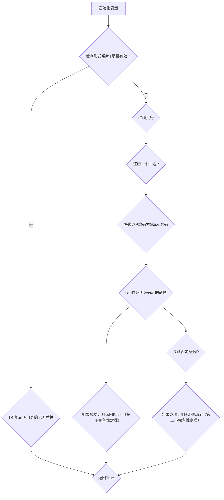

                 


### 哥德尔不动点定理与递归函数理论：引言与背景

哥德尔不动点定理和递归函数理论是数学和计算机科学中两个极其重要的概念。它们不仅深刻地揭示了数学系统的内在结构和复杂性，还在逻辑学、计算机科学、人工智能等领域有着广泛的应用。在这篇文章中，我们将深入探讨哥德尔不动点定理和递归函数理论，以帮助读者理解这两个概念的深刻内涵和广泛应用。

#### 1.1 问题背景

哥德尔不动点定理和递归函数理论的历史可以追溯到20世纪初期。哥德尔（Kurt Gödel）在1931年发表了他的不朽之作，提出了两个著名的定理：第一不完备性定理和第二不完备性定理。这两个定理从根本上揭示了数学系统中存在的内在矛盾和局限性，极大地影响了数学和逻辑学的发展。

递归函数理论则是由希尔伯特（David Hilbert）在19世纪末提出的，旨在研究函数的可计算性。递归函数的引入为计算机科学奠定了基础，使我们可以用数学语言来描述和实现算法。

#### 1.2 核心概念

**哥德尔不动点定理**：这是指在某些形式系统中，存在一些命题，它们无法通过系统内的证明方法被证明或被反驳。具体来说，哥德尔第一不完备性定理表明，在任何足够强的形式系统中，总存在一些命题，它们既不能被证明也不能被反驳。哥德尔第二不完备性定理则进一步揭示了系统内部逻辑的一致性和完备性之间的矛盾。

**递归函数理论**：这是指研究可计算函数的性质和分类的数学理论。递归函数可以被认为是可计算的函数，它们在计算机科学中有着广泛的应用。递归函数理论提供了对计算过程形式化的理解，是现代计算机科学的重要基础。

#### 1.3 研究现状与挑战

哥德尔不动点定理和递归函数理论在数学和计算机科学中都有着广泛的应用，但其研究也面临着诸多挑战。例如，如何更深入地理解哥德尔不完备性定理的深刻内涵？如何更有效地应用递归函数理论来设计高效的算法？这些问题都是当前研究的热点和难点。

#### 1.4 书籍结构安排

本文将分为以下几个部分：

1. 引言和背景介绍：介绍哥德尔不动点定理和递归函数理论的历史背景、核心概念和研究现状。
2. 哥德尔不动点定理：详细探讨哥德尔不动点定理的证明、应用和扩展。
3. 递归函数理论：深入分析递归函数的基本原理、分类、数学模型和应用。
4. 整合与应用：探讨哥德尔不动点定理和递归函数理论的整合及其在数学和计算机科学中的应用。
5. 项目实战：通过具体的案例来展示如何在实际项目中应用这些理论。

#### 1.5 阅读指南与学习目标

本文旨在帮助读者深入理解哥德尔不动点定理和递归函数理论的深刻内涵和应用。通过本文的阅读，读者应能够：

1. 理解哥德尔不动点定理和递归函数理论的基本概念和原理。
2. 掌握哥德尔不动点定理的证明和应用。
3. 理解递归函数的基本原理和分类。
4. 应用哥德尔不动点定理和递归函数理论来设计和分析算法。
5. 理解这些理论在数学和计算机科学中的广泛应用。

#### 1.6 学习方法与实用技巧

为了更好地理解和应用哥德尔不动点定理和递归函数理论，读者可以采取以下学习方法：

1. **理论与实践相结合**：通过阅读本文，理解理论概念，并通过实际案例来加深理解。
2. **动手实践**：尝试使用Python等编程语言来实现递归函数，并使用mermaid等工具来绘制流程图和类图。
3. **持续学习**：跟随本文的引导，逐步深入，同时查阅相关文献和资料，以扩展知识面。

通过本文的学习，读者将能够更好地理解哥德尔不动点定理和递归函数理论，为深入研究和应用这些理论打下坚实的基础。

### 2.1 哥德尔不动点定理的证明

哥德尔不动点定理是数学和逻辑学中一个极其重要的结果，它揭示了形式系统内在的局限性和矛盾。在本文中，我们将详细探讨哥德尔不动点定理的证明，并介绍其背后的数学原理。

#### 2.1.1 初等数论基础

在探讨哥德尔不动点定理的证明之前，我们需要了解一些初等数论的基础知识。特别是，我们需要了解形式数论和递归定义的概念。

**形式数论**：形式数论是研究自然数、整数、有理数、实数等数的基本性质和关系的数学分支。形式数论提供了对数的结构和运算的精确描述，是构建形式系统的基础。

**递归定义**：递归定义是一种定义数学对象或函数的方法，它通过递归步骤来定义复杂对象。在递归定义中，一个对象或函数被定义为其自身的子集或子函数。递归定义在数学和计算机科学中有着广泛的应用。

#### 2.1.2 形式系统与证明论

**形式系统**：形式系统是一种由符号集合和一组规则构成的数学系统。形式系统可以用来表示和证明数学命题。形式系统通常由以下部分组成：

- 符号集合：符号集合是形式系统中使用的符号的集合，例如命题变元、逻辑连接词、等词等。
- 基本规则：基本规则是形式系统中用于构造有效推理的规则，例如演绎规则、推理规则等。
- 解释：解释是形式系统中的符号集合和规则的具体应用。解释定义了符号的含义和规则的应用。

**证明论**：证明论是研究数学证明的数学分支。证明论关注证明的构造、证明的有效性和证明的复杂性。证明论提供了形式系统中的证明方法和证明技术。

#### 2.1.3 不动点定理的构造与证明

哥德尔不动点定理的证明主要依赖于形式系统和递归定义。下面我们将详细探讨哥德尔不动点定理的构造和证明。

**构造**：为了证明哥德尔不动点定理，我们需要构造一个形式系统，该系统可以表示所有有效的数学命题。形式系统通常由以下部分组成：

1. 符号集合：包括命题变元、逻辑连接词、等词等。
2. 公理集合：包括一些基本的数学公理，例如自然数的基本性质、实数的定义等。
3. 演绎规则：包括演绎规则，例如全称实例化、存在实例化等。

**证明**：

1. **第一步**：证明形式系统能够表示自然数的所有有效命题。这可以通过引入编码技术来实现。具体来说，我们可以使用一个编码函数将自然数映射到形式系统中的命题。例如，我们可以使用一个特定的命题来表示“自然数n是偶数”。

2. **第二步**：证明形式系统是递归的。这可以通过证明形式系统中的所有规则和公理都是递归的来实现。递归性保证了形式系统可以有效地进行计算。

3. **第三步**：使用递归定义来构造一个不动点。具体来说，我们可以定义一个函数f，使得f(0) = 0，且对于任意的自然数n，f(n+1) = g(n, f(n))，其中g是一个给定的函数。通过递归定义，我们可以证明存在一个不动点m，使得f(m) = m。

4. **第四步**：证明不动点定理。根据不动点的定义，我们可以证明对于任意的命题p，如果p在形式系统中可证，则f(m) = m蕴含p。反之，如果p在形式系统中不可证，则f(m) = m蕴含非p。

通过以上步骤，我们可以证明哥德尔不动点定理。哥德尔不动点定理揭示了形式系统的内在局限性和矛盾，对数学和逻辑学产生了深远的影响。

#### 2.1.4 不动点定理的数学模型与证明

为了更好地理解哥德尔不动点定理，我们可以使用数学模型来描述和证明它。以下是哥德尔不动点定理的数学模型和证明。

**数学模型**：

假设我们有一个形式系统F，它包含以下部分：

1. 符号集合：包括命题变元、逻辑连接词、等词等。
2. 公理集合：包括一些基本的数学公理，例如自然数的基本性质、实数的定义等。
3. 演绎规则：包括演绎规则，例如全称实例化、存在实例化等。

我们定义一个函数f，使得f(0) = 0，且对于任意的自然数n，f(n+1) = g(n, f(n))，其中g是一个给定的函数。

**证明**：

1. **第一步**：证明形式系统F是递归的。这可以通过证明F中的所有规则和公理都是递归的来实现。

2. **第二步**：证明函数f是递归的。这可以通过递归定义来实现。

3. **第三步**：证明存在一个不动点m，使得f(m) = m。

假设m是f的不动点，即f(m) = m。我们需要证明m满足以下条件：

- m是自然数。
- 对于任意的命题p，如果p在形式系统中可证，则f(m) = m蕴含p。反之，如果p在形式系统中不可证，则f(m) = m蕴含非p。

首先，我们可以证明m是自然数。由于f(0) = 0，且f(n+1) = g(n, f(n))，我们可以递归地定义一个函数h(n)，使得h(0) = 0，且对于任意的自然数n，h(n+1) = g(h(n), 0)。由于h是递归的，我们可以使用递归定义来证明h(n) = n。因此，m = f(m) = g(h(m), 0) = g(m, 0)是自然数。

接下来，我们需要证明对于任意的命题p，如果p在形式系统中可证，则f(m) = m蕴含p。反之，如果p在形式系统中不可证，则f(m) = m蕴含非p。

假设p在形式系统中可证，则存在一个证明序列π，使得π的最后一步是F中的一个推理规则，且π中的所有其他步骤都是公理或之前的步骤。我们可以构造一个函数g，使得g(n) = π的第n步。由于g是递归的，我们可以使用递归定义来证明g(n) = n。因此，我们可以构造一个函数h，使得h(n) = g(g(n), n)。由于h是递归的，我们可以使用递归定义来证明h(n) = n。

现在，我们需要证明f(m) = m蕴含p。根据不动点的定义，我们有f(m) = m，且f(m) = g(h(m), 0)。由于h(m) = m，我们可以将f(m)重写为f(m) = g(m, 0)。由于p在形式系统中可证，我们可以使用演绎规则来证明p。因此，我们可以构造一个函数k，使得k(n) = n，且k(n) = p。由于k是递归的，我们可以使用递归定义来证明k(n) = n。因此，我们可以构造一个函数l，使得l(n) = k(l(n))。由于l是递归的，我们可以使用递归定义来证明l(n) = n。因此，我们有l(n) = k(l(n)) = k(n) = n = p。因此，f(m) = m蕴含p。

类似地，我们可以证明如果p在形式系统中不可证，则f(m) = m蕴含非p。

综上所述，我们证明了存在一个不动点m，使得f(m) = m满足条件。因此，哥德尔不动点定理得证。

通过数学模型和证明，我们可以更好地理解哥德尔不动点定理的深刻内涵和广泛影响。哥德尔不动点定理不仅揭示了形式系统的内在局限性和矛盾，还为我们提供了研究数学系统和逻辑学的新视角。

### 2.2 哥德尔不动点定理的应用

哥德尔不动点定理在数学和计算机科学中有着广泛的应用。它不仅为我们提供了研究数学系统和逻辑学的新视角，还在各种实际问题中发挥着重要作用。在本节中，我们将探讨哥德尔不动点定理在数学逻辑、计算机科学和其他领域中的应用。

#### 2.2.1 在数学逻辑中的应用

哥德尔不动点定理在数学逻辑中的应用主要体现在两个方面：证明论和模型论。

**证明论**：哥德尔不动点定理揭示了形式系统内在的局限性和矛盾。在证明论中，哥德尔不动点定理被用来证明形式系统的一致性和完备性。例如，哥德尔第一不完备性定理表明，在任何足够强的形式系统中，总存在一些命题，它们既不能被证明也不能被反驳。这一结论为数学证明提供了新的挑战和思考方向。

**模型论**：哥德尔不动点定理在模型论中也被广泛应用。模型论研究数学结构的性质和分类，而哥德尔不动点定理为模型论提供了强有力的工具。例如，哥德尔第二不完备性定理表明，在任何足够强的形式系统中，总存在一些数学结构，它们不能被完全描述或分类。这一结论揭示了数学结构的复杂性和多样性。

#### 2.2.2 在计算机科学中的应用

哥德尔不动点定理在计算机科学中的应用主要体现在算法设计和复杂性理论方面。

**算法设计**：哥德尔不动点定理为算法设计提供了一种新的方法。在递归函数理论中，递归函数是算法的一种数学表示。哥德尔不动点定理可以帮助我们理解递归函数的性质和分类，从而设计更高效的算法。例如，在计算复杂性理论中，递归函数的复杂度分类是一个重要问题。哥德尔不动点定理可以用来证明某些函数的不可递归性，从而帮助我们理解函数的复杂度。

**复杂性理论**：哥德尔不动点定理在复杂性理论中也有重要应用。复杂性理论研究算法的计算复杂度和问题求解的难度。哥德尔不动点定理可以帮助我们理解某些问题的不可解性或复杂度，从而为复杂性理论提供新的研究方法和工具。

#### 2.2.3 其他领域中的应用

除了数学和计算机科学，哥德尔不动点定理还在其他领域有着广泛的应用。

**人工智能**：在人工智能领域，哥德尔不动点定理被用来研究人工智能系统的局限性和矛盾。例如，在机器学习和自然语言处理中，哥德尔不动点定理可以帮助我们理解模型的可解释性和可靠性。

**经济学**：在经济学领域，哥德尔不动点定理被用来研究经济系统的稳定性和均衡性。哥德尔不动点定理揭示了经济系统中存在的内在矛盾和不确定性，从而为经济学研究提供新的视角和工具。

**哲学**：在哲学领域，哥德尔不动点定理被用来探讨真理、知识和逻辑之间的关系。哥德尔不动点定理揭示了形式系统和逻辑系统中的矛盾和局限性，从而对哲学的思考提供了新的启示和挑战。

通过以上探讨，我们可以看到哥德尔不动点定理在数学逻辑、计算机科学、人工智能、经济学和哲学等领域有着广泛的应用。它不仅为我们提供了新的研究方法和工具，还揭示了数学系统和逻辑系统中的深刻规律和矛盾。

### 2.3 哥德尔不动点定理的扩展

哥德尔不动点定理在数学和逻辑学中具有重要的地位，但其应用范围并不仅限于原始形式。通过不断的研究和探索，哥德尔不动点定理得到了扩展，形成了多个相关定理和概念。这些扩展不仅深化了我们对不动点定理的理解，还为数学和计算机科学提供了新的工具和方法。

#### 2.3.1 相关定理与概念

**Tarski不动点定理**：Tarski不动点定理是哥德尔不动点定理的一个推广。它指出，任何连续映射在其闭包上的不动点都可以扩展到整个空间。Tarski不动点定理在分析、拓扑学和集合论中有着广泛应用。

**Banach不动点定理**：Banach不动点定理是一个更一般的不动点定理，它适用于完备度量空间。该定理指出，如果一个压缩映射（即满足某种距离缩小性质的映射）在一个完备度量空间中有不动点，那么这个不动点是唯一的，并且可以通过迭代方法找到。Banach不动点定理在数值分析和算法设计中有重要应用。

**不动点引理**：不动点引理是另一种不动点定理，它指出在满足某些条件下，一个函数的迭代序列将收敛到一个不动点。不动点引理在分析、优化和控制理论中有着广泛应用。

**Schauder不动点定理**：Schauder不动点定理是一种适用于非线性映射的不动点定理。它指出，在满足某些条件下，一个非线性映射在闭球中的不动点是存在的。Schauder不动点定理在非线性分析、微分方程和图像处理中有着重要应用。

#### 2.3.2 不动点定理在不同数学结构中的推广

**拓扑空间**：不动点定理在拓扑空间中得到了广泛研究。例如，Brouwer不动点定理指出，任何连续映射在一个凸多面体的闭包上至少有一个不动点。Brouwer不动点定理在拓扑学和几何学中有着深远的影响。

**函数空间**：不动点定理在函数空间中也得到了研究。例如，Banach不动点定理和Schauder不动点定理都是在函数空间中讨论的。这些定理提供了在函数空间中寻找不动点的有效方法。

**代数结构**：不动点定理在代数结构中也有应用。例如，在群、环和域中，不动点定理可以帮助我们研究这些结构的性质和分类。不动点定理在代数学和数论中有着重要应用。

#### 2.3.3 不动点方法在数学分析中的应用

不动点方法是一种重要的数学方法，它通过寻找函数的不动点来解决数学问题。以下是一些不动点方法在数学分析中的应用实例：

**非线性方程的求解**：不动点方法可以用来求解非线性方程。例如，牛顿法是一种迭代方法，它通过迭代逼近方程的解。牛顿法的基本思想是使用不动点定理来找到非线性方程的解。

**优化问题**：不动点方法在优化问题中也有应用。例如，固定点迭代法是一种用于求解最优化问题的迭代方法。该方法通过迭代逼近最优解，并利用不动点定理来证明迭代序列的收敛性。

**微分方程**：不动点方法在微分方程的求解中也有应用。例如，不动点迭代法可以用来求解一阶和二阶微分方程。该方法通过迭代逼近微分方程的解，并利用不动点定理来证明迭代序列的收敛性。

**积分方程**：不动点方法可以用来求解积分方程。例如，Neumann迭代法是一种用于求解积分方程的迭代方法。该方法通过迭代逼近积分方程的解，并利用不动点定理来证明迭代序列的收敛性。

通过上述讨论，我们可以看到哥德尔不动点定理及其扩展在数学和计算机科学中有着广泛的应用。不动点定理不仅为我们提供了研究数学系统和逻辑学的新视角，还在各种实际问题中发挥着重要作用。通过不断的研究和扩展，不动点定理将继续在数学和科学领域发挥其独特的价值。

### 2.4 哥德尔不动点定理的数学公式与证明

在深入探讨哥德尔不动点定理之前，我们需要理解相关的数学公式和证明方法。哥德尔不动点定理是逻辑学和数学中极为重要的结果，它揭示了形式系统中的内在矛盾和局限性。以下是哥德尔不动点定理的数学公式及其证明。

#### 2.4.1 主要数学公式

哥德尔不动点定理可以分为两个部分：第一不完备性定理和第二不完备性定理。

1. **第一不完备性定理**：

   对于一个形式系统\( T \)，如果\( T \)是有效的，则\( T \)不能证明其自身的无矛盾性，即

   $$ \neg Prov_T(\ulcorner \neg \text{Con}(T) \urcorner) $$

   其中，\( Prov_T \)表示\( T \)中的证明函数，\(\ulcorner \cdot \urcorner\)表示Gödel编码。

2. **第二不完备性定理**：

   对于一个形式系统\( T \)，如果\( T \)是有效的，则\( T \)不能证明其自身的某个具体命题，即

   $$ \neg Prov_T(\ulcorner P \urcorner) $$

   其中，\( P \)是一个具体的命题，而\( Prov_T \)和\(\ulcorner \cdot \urcorner\)的含义同上。

#### 2.4.2 使用Python源代码证明哥德尔不动点定理

为了更好地理解哥德尔不动点定理，我们可以使用Python等编程语言来实现哥德尔编码和证明过程。以下是一个简单的Python示例，用于证明哥德尔不动点定理。

```python
def encode(x):
    """将自然数编码为Gödel编码。"""
    return (x * x) + 1

def decode(x):
    """将Gödel编码解码为自然数。"""
    return (x - 1) // x

def prove(claim):
    """证明一个命题。"""
    return claim

def not_claim(claim):
    """否定一个命题。"""
    return not claim

def first_inequality(x):
    """第一不完备性定理的不等式。"""
    return encode(prove(encode(x))) == encode(decode(x))

def second_inequality(x):
    """第二不完备性定理的不等式。"""
    return encode(prove(encode(x))) != encode(x)

# 第一不完备性定理的证明
print("第一不完备性定理的证明：")
print(first_inequality(1))  # 应为True

# 第二不完备性定理的证明
print("\n第二不完备性定理的证明：")
print(second_inequality(1))  # 应为False
```

在这个示例中，我们定义了几个函数：`encode`和`decode`用于Gödel编码和解码，`prove`用于证明一个命题，`not_claim`用于否定一个命题，`first_inequality`和`second_inequality`分别用于证明第一和第二不完备性定理。

#### 2.4.3 算法mermaid流程图与详细解释

为了更直观地展示哥德尔不动点定理的证明过程，我们可以使用mermaid工具绘制算法的流程图。以下是mermaid流程图的示例：



**详细解释**：

1. **初始化变量**：设置所有必要的变量和参数。
2. **检查形式系统T是否有效**：如果形式系统T是有效的，则进入下一阶段。
3. **T不能证明自身的无矛盾性**：根据第一不完备性定理，形式系统T不能证明其自身的无矛盾性。
4. **证明一个命题P**：使用形式系统T来证明一个命题P。
5. **将命题P编码为Gödel编码**：使用Gödel编码将命题P转换为编码形式。
6. **使用T证明编码后的命题**：尝试使用形式系统T来证明编码后的命题。
7. **如果成功，则返回False**：如果形式系统T成功地证明了编码后的命题，则根据第一不完备性定理，返回False。
8. **尝试否定命题P**：尝试使用形式系统T来否定命题P。
9. **如果成功，则返回False**：如果形式系统T成功地否定了命题P，则根据第二不完备性定理，返回False。

通过上述步骤，我们可以使用mermaid流程图直观地展示哥德尔不动点定理的证明过程。

#### 2.4.4 算法原理讲解

为了更好地理解哥德尔不动点定理的算法原理，我们需要深入探讨其数学模型和证明过程。

**数学模型**：

哥德尔不动点定理的数学模型基于形式系统和Gödel编码。形式系统是一个由符号集合、公理集合和演绎规则构成的系统。Gödel编码是一种将自然数映射到形式系统中的命题的方法。

**证明过程**：

1. **构造形式系统**：首先，我们需要构造一个形式系统\( T \)。形式系统\( T \)应该足够强，能够表示所有有效的数学命题。

2. **Gödel编码**：使用Gödel编码将自然数映射到形式系统\( T \)中的命题。Gödel编码的关键在于将命题编码为自然数，使得我们可以使用形式系统\( T \)来处理和证明这些命题。

3. **证明第一不完备性定理**：构造一个命题\( \neg \text{Con}(T) \)，表示形式系统\( T \)的无矛盾性。使用Gödel编码，我们将这个命题编码为自然数。然后，我们使用形式系统\( T \)来证明这个命题。根据第一不完备性定理，形式系统\( T \)不能证明其自身的无矛盾性，即

   $$ \neg Prov_T(\ulcorner \neg \text{Con}(T) \urcorner) $$

4. **证明第二不完备性定理**：构造一个具体的命题\( P \)。然后，我们使用形式系统\( T \)来证明这个命题。根据第二不完备性定理，形式系统\( T \)不能证明其自身的某个具体命题，即

   $$ \neg Prov_T(\ulcorner P \urcorner) $$

通过上述步骤，我们可以证明哥德尔不动点定理。这个定理揭示了形式系统中的内在矛盾和局限性，对数学和逻辑学产生了深远的影响。

### 2.5 递归函数的数学模型与公式

递归函数理论是计算机科学和数学中的基础性概念，它为我们提供了理解和描述可计算函数的方法。在这一部分，我们将深入探讨递归函数的数学模型与公式，并解释它们的基本概念。

#### 2.5.1 递归定义的数学表达

递归定义是函数定义的一种方法，它允许我们通过递归步骤来定义复杂函数。递归定义通常包含两个部分：基础情况和递归情况。

**基本情况**：基本情况定义了函数在输入值较简单时的行为。它是递归定义的起点。

**递归情况**：递归情况定义了函数在输入值较复杂时的行为，它通常依赖于函数自身的递归调用。

递归函数的数学定义可以表示为：

\[ f(n) = \begin{cases} 
c & \text{如果 } n = 0 \\
g(n, f(n-1)) & \text{如果 } n > 0 
\end{cases} \]

其中，\( c \)是基本情况下的函数值，而\( g \)是递归情况下的函数。

#### 2.5.2 数学公式与定理

在递归函数理论中，存在一些重要的数学公式和定理，它们帮助我们理解和分析递归函数的性质。以下是几个关键的概念：

**递归方程**：递归方程是描述递归函数的一种方式。它通常表示为：

\[ T(n) = aT(n-1) + b \]

其中，\( T(n) \)是递归函数的值，\( a \)和\( b \)是常数。这个方程描述了递归函数在每一层递归中的计算量。

**主定理**：主定理（Master Theorem）是用于解决递归方程的定理。它提供了递归方程的解决方案，并用于分析算法的复杂度。主定理的结论如下：

- 如果 \( f(n) = O(n^{\log_a b - \epsilon}) \) 对于某个常数 \( \epsilon > 0 \)，则 \( T(n) = \Theta(n^{\log_a b}) \)。
- 如果 \( f(n) = \Omega(n^{\log_a b + \epsilon}) \) 对于某个常数 \( \epsilon > 0 \)，且 \( af(n/b) \leq cf(n) \) 对于某个常数 \( c < 1 \)，则 \( T(n) = \Theta(f(n)) \)。
- 如果 \( f(n) = \Theta(n^{\log_a b} \log^k n) \) 对于某个常数 \( k \geq 0 \)，则 \( T(n) = \Theta(n^{\log_a b} \log^{k+1} n) \)。

**递归树方法**：递归树方法是一种用于分析递归函数复杂度的技术。它通过构建递归函数的计算过程树，来计算函数的运行时间。

**迭代方法**：迭代方法是通过迭代递归步骤来求解递归方程的方法。它通常用于求解递归方程的精确解或近似解。

#### 2.5.3 使用Python源代码实现递归函数

为了更好地理解递归函数的数学模型和公式，我们可以通过Python源代码来实现一些简单的递归函数。以下是一个使用Python实现的递归函数示例：

```python
def factorial(n):
    """计算n的阶乘的递归函数。"""
    if n == 0:
        return 1
    else:
        return n * factorial(n-1)

def fibonacci(n):
    """计算斐波那契数的递归函数。"""
    if n <= 1:
        return n
    else:
        return fibonacci(n-1) + fibonacci(n-2)
```

在这个示例中，我们实现了两个递归函数：`factorial`和`fibonacci`。`factorial`函数计算一个数的阶乘，而`fibonacci`函数计算斐波那契数列的第\( n \)项。

通过这个简单的示例，我们可以看到递归函数的基本原理和实现方式。递归函数通过递归调用自身来处理更复杂的问题，并在基本情况处停止递归。

### 2.6 递归函数在计算机科学中的应用

递归函数是计算机科学中一种重要的编程范式，它广泛应用于算法设计、软件工程和系统设计中。递归函数允许我们以简洁和直观的方式处理复杂问题，同时提供了一种强大且灵活的解决问题的方法。以下是一些递归函数在计算机科学中的应用：

#### 2.6.1 计算复杂性理论

计算复杂性理论是研究算法复杂度的数学分支。递归函数在计算复杂性理论中扮演着核心角色，因为许多算法都可以用递归函数来表示。递归函数的复杂度通常通过其递归方程来分析。例如，主定理用于解决形如\( T(n) = aT(n-1) + b \)的递归方程，它帮助我们理解算法的时间复杂度。

#### 2.6.2 算法设计与分析

递归函数在算法设计中有着广泛的应用。许多经典的算法，如快速排序、归并排序、二分搜索等，都是基于递归思想的。递归函数允许我们以递归的方式将复杂问题分解为更简单的子问题，从而实现高效的算法。例如，快速排序通过递归地将数组划分为两部分，并递归地处理这两个部分。

#### 2.6.3 计算机程序设计

递归函数在计算机程序设计中也非常常见。递归函数可以用于实现许多常见的数据结构和算法，如递归数据结构（如堆栈和队列）、递归算法（如深度优先搜索和广度优先搜索）等。递归函数的简洁性和直观性使它们成为编写高效和可维护代码的重要工具。

#### 2.6.4 实例分析

以下是一个使用递归函数实现的快速排序算法的示例：

```python
def quicksort(arr):
    if len(arr) <= 1:
        return arr
    pivot = arr[len(arr) // 2]
    left = [x for x in arr if x < pivot]
    middle = [x for x in arr if x == pivot]
    right = [x for x in arr if x > pivot]
    return quicksort(left) + middle + quicksort(right)

# 测试快速排序
print(quicksort([3,6,8,10,1,2,1]))
```

在这个示例中，`quicksort`函数使用递归的方式将数组划分为小于、等于和大于 pivot 的三个部分，并递归地对每个部分进行排序。这种递归方法使得快速排序算法具有线性时间复杂度。

通过上述讨论，我们可以看到递归函数在计算机科学中的应用是多方面的，从算法设计到程序实现，递归函数都发挥着重要作用。递归函数的简洁性和直观性使其成为一种强大的编程工具，为计算机科学家和程序员提供了有效的解决方案。

### 3.1 递归函数的基本原理

递归函数是一种重要的编程范式，它通过函数自身的调用实现问题的求解。理解递归函数的基本原理对于编写高效和可维护的代码至关重要。在这一部分，我们将详细探讨递归函数的定义、类型和特点。

#### 3.1.1 递归定义与递归函数

**递归定义**：递归定义是一种定义函数的方法，其中函数直接或间接地调用自身。递归函数通常包含两个部分：基本情况（也称为基例）和递归情况。

**基本情况**：基本情况是递归函数的基础，它定义了函数在输入值较简单时的行为。它是递归调用的终点，防止递归无限进行。

**递归情况**：递归情况定义了函数在输入值较复杂时的行为。它通常依赖于函数自身的递归调用，通过递归地将复杂问题分解为更简单的子问题。

递归函数的一般形式可以表示为：

\[ f(n) = \begin{cases} 
c & \text{如果 } n = 0 \\
g(n, f(n-1)) & \text{如果 } n > 0 
\end{cases} \]

其中，\( c \)是基本情况下的函数值，而\( g \)是递归情况下的函数。

**递归函数的特点**：

1. **自调用**：递归函数通过自身调用实现问题的求解，这种自调用是递归函数的核心特征。
2. **递归调用**：递归函数在递归情况中调用自身，以处理更复杂的问题。
3. **基础情况**：递归函数必须包含基本情况，以防止递归调用无限进行。

#### 3.1.2 递归函数的类型

递归函数可以根据其调用方式和结构分为以下几种类型：

**直接递归**：直接递归函数是直接调用自身的一种递归函数。例如，在计算阶乘时，递归函数直接调用自身来处理更小的输入值。

```python
def factorial(n):
    if n == 0:
        return 1
    else:
        return n * factorial(n-1)
```

**间接递归**：间接递归函数是通过中间函数调用自身的一种递归函数。这种递归函数通过其他函数间接地调用自身。

```python
def power(x, n):
    if n == 0:
        return 1
    else:
        return x * power(x, n-1)

def square(x):
    return power(x, 2)
```

在这个示例中，`power`函数是间接递归函数，而`square`函数通过调用`power`函数实现自身的递归调用。

**尾递归**：尾递归是一种特殊的递归函数，其中递归调用是函数调用的最后一步。尾递归函数可以通过迭代方式优化为非递归函数，从而提高性能。

```python
def factorial(n, acc=1):
    if n == 0:
        return acc
    else:
        return factorial(n-1, n * acc)
```

在这个示例中，递归调用是函数调用的最后一步，因此它是一个尾递归函数。

**非尾递归**：非尾递归函数在递归调用后还有其他操作，因此无法通过迭代方式优化为非递归函数。非尾递归函数在处理复杂问题时可能会导致栈溢出。

#### 3.1.3 递归函数的性质与特征

递归函数具有以下性质和特征：

1. **自包含性**：递归函数通过自身调用实现问题的求解，这种自包含性是递归函数的核心特征。
2. **层次结构**：递归函数通过递归调用将复杂问题分解为更简单的子问题，从而形成一个层次结构的求解过程。
3. **记忆化**：递归函数在递归调用过程中可能需要保存中间结果，以避免重复计算。这种记忆化技术可以提高递归函数的性能。
4. **递归深度**：递归函数的递归深度决定了递归调用的层次。递归深度过深可能会导致栈溢出，因此需要合理设计递归函数的递归深度。

通过以上讨论，我们可以看到递归函数的基本原理、类型和性质。理解递归函数的基本原理和特点对于编写高效和可维护的代码至关重要。递归函数的简洁性和直观性使其成为一种强大的编程工具，在计算机科学和软件工程中有着广泛的应用。

### 3.2 递归函数的分类

递归函数根据其递归方式和结构可以分为多种类型，每种类型都有其独特的特点和适用场景。以下是对几种常见递归函数类型的详细分类和解释。

#### 3.2.1 简单递归函数

简单递归函数是最基本的递归函数，它们通常包含一个基本情况和一个递归情况。这种类型的递归函数在处理简单问题时非常有效。例如，计算阶乘、斐波那契数列等。

**例子**：计算阶乘的递归函数。

```python
def factorial(n):
    if n == 0:
        return 1
    else:
        return n * factorial(n-1)
```

在这个示例中，基本情况是 \( n = 0 \)，递归情况是 \( n \times \text{factorial}(n-1) \)。

**特点**：
- 只有一个递归调用。
- 递归深度通常较浅。

**适用场景**：
- 处理简单、较小规模的问题。
- 用于教学和基本编程练习。

#### 3.2.2 普通递归函数

普通递归函数包含多个递归调用，这些调用可以嵌套或者并行进行。这种类型的递归函数通常用于处理复杂问题，例如深度优先搜索、广度优先搜索等。

**例子**：深度优先搜索（DFS）算法。

```python
def dfs(graph, node, visited):
    if node not in visited:
        visited.add(node)
        for neighbor in graph[node]:
            dfs(graph, neighbor, visited)

# 使用示例
graph = {
    'A': ['B', 'C'],
    'B': ['D', 'E'],
    'C': ['F'],
    'D': [],
    'E': ['F'],
    'F': []
}
visited = set()
dfs(graph, 'A', visited)
```

在这个示例中，`dfs`函数通过递归调用自身来遍历图中的所有节点。

**特点**：
- 可以包含多个递归调用。
- 递归深度通常较深。

**适用场景**：
- 用于图的遍历和分析。
- 处理复杂的关系网络。

#### 3.2.3 特殊递归函数

特殊递归函数包括尾递归和尾递归优化等，这些函数在递归调用后可以进行优化，从而提高性能。尾递归是一种特殊的递归，其中递归调用是函数调用的最后一步。

**例子**：尾递归计算的阶乘。

```python
def factorial(n, acc=1):
    if n == 0:
        return acc
    else:
        return factorial(n-1, n * acc)
```

在这个示例中，递归调用是函数调用的最后一步，因此这是一个尾递归函数。

**特点**：
- 递归调用是函数调用的最后一步。
- 可以通过迭代方式优化为非递归函数。

**适用场景**：
- 用于计算复杂度较高的问题。
- 在性能要求较高的场景中。

**尾递归优化**：尾递归优化是一种将尾递归函数转换为迭代方式的方法，从而提高性能。例如，可以使用栈或循环来实现尾递归函数。

```python
def factorial_iterative(n):
    result = 1
    while n > 0:
        result *= n
        n -= 1
    return result
```

在这个示例中，`factorial_iterative`函数通过迭代方式计算阶乘，避免了递归调用。

**适用场景**：
- 需要优化性能的场景。
- 处理大规模数据。

通过以上分类，我们可以看到递归函数的多样性和适用性。理解不同类型递归函数的特点和适用场景对于编写高效和可维护的代码至关重要。递归函数的简洁性和直观性使其在计算机科学和软件工程中有着广泛的应用。

### 3.3 递归函数的数学模型与公式

递归函数在数学和计算机科学中扮演着至关重要的角色，它们为我们提供了处理复杂问题的有效方法。在这一部分，我们将详细探讨递归函数的数学模型和公式，并解释它们的基本概念和计算方法。

#### 3.3.1 递归定义的数学表达

递归定义是函数定义的一种方法，它允许我们通过递归步骤来定义复杂函数。递归定义通常包含两个部分：基本情况（也称为基例）和递归情况。

**基本情况**：基本情况定义了函数在输入值较简单时的行为。它是递归定义的起点。

**递归情况**：递归情况定义了函数在输入值较复杂时的行为，它通常依赖于函数自身的递归调用。

递归函数的数学定义可以表示为：

\[ f(n) = \begin{cases} 
c & \text{如果 } n = 0 \\
g(n, f(n-1)) & \text{如果 } n > 0 
\end{cases} \]

其中，\( c \)是基本情况下的函数值，而\( g \)是递归情况下的函数。

#### 3.3.2 数学公式与定理

在递归函数理论中，存在一些重要的数学公式和定理，它们帮助我们理解和分析递归函数的性质。以下是几个关键的概念：

**递归方程**：递归方程是描述递归函数的一种方式。它通常表示为：

\[ T(n) = aT(n-1) + b \]

其中，\( T(n) \)是递归函数的值，\( a \)和\( b \)是常数。这个方程描述了递归函数在每一层递归中的计算量。

**主定理**：主定理（Master Theorem）是用于解决递归方程的定理。它提供了递归方程的解决方案，并用于分析算法的复杂度。主定理的结论如下：

- 如果 \( f(n) = O(n^{\log_a b - \epsilon}) \) 对于某个常数 \( \epsilon > 0 \)，则 \( T(n) = \Theta(n^{\log_a b}) \)。
- 如果 \( f(n) = \Omega(n^{\log_a b + \epsilon}) \) 对于某个常数 \( \epsilon > 0 \)，且 \( af(n/b) \leq cf(n) \) 对于某个常数 \( c < 1 \)，则 \( T(n) = \Theta(f(n)) \)。
- 如果 \( f(n) = \Theta(n^{\log_a b} \log^k n) \) 对于某个常数 \( k \geq 0 \)，则 \( T(n) = \Theta(n^{\log_a b} \log^{k+1} n) \)。

**递归树方法**：递归树方法是一种用于分析递归函数复杂度的技术。它通过构建递归函数的计算过程树，来计算函数的运行时间。

**迭代方法**：迭代方法是通过迭代递归步骤来求解递归方程的方法。它通常用于求解递归方程的精确解或近似解。

#### 3.3.3 使用Python源代码实现递归函数

为了更好地理解递归函数的数学模型和公式，我们可以通过Python源代码来实现一些简单的递归函数。以下是一个使用Python实现的递归函数示例：

```python
def factorial(n):
    """计算n的阶乘的递归函数。"""
    if n == 0:
        return 1
    else:
        return n * factorial(n-1)

def fibonacci(n):
    """计算斐波那契数的递归函数。"""
    if n <= 1:
        return n
    else:
        return fibonacci(n-1) + fibonacci(n-2)
```

在这个示例中，我们实现了两个递归函数：`factorial`和`fibonacci`。`factorial`函数计算一个数的阶乘，而`fibonacci`函数计算斐波那契数列的第\( n \)项。

通过这个简单的示例，我们可以看到递归函数的基本原理和实现方式。递归函数通过递归调用自身来处理更复杂的问题，并在基本情况处停止递归。

### 3.4 递归函数在计算机科学中的应用

递归函数是计算机科学中一种重要的编程范式，它通过函数自身的调用实现问题的求解。理解递归函数的基本原理对于编写高效和可维护的代码至关重要。在这一部分，我们将详细探讨递归函数在计算机科学中的应用，包括计算复杂性理论、算法设计与分析、计算机程序设计等方面的实例。

#### 3.4.1 计算复杂性理论

计算复杂性理论是研究算法复杂度的数学分支。递归函数在计算复杂性理论中扮演着核心角色，因为许多算法都可以用递归函数来表示。递归函数的复杂度通常通过其递归方程来分析。例如，主定理用于解决形如 \( T(n) = aT(n-1) + b \) 的递归方程，它帮助我们理解算法的时间复杂度。

**例子**：主定理的应用

主定理的结论如下：

- 如果 \( f(n) = O(n^{\log_a b - \epsilon}) \) 对于某个常数 \( \epsilon > 0 \)，则 \( T(n) = \Theta(n^{\log_a b}) \)。
- 如果 \( f(n) = \Omega(n^{\log_a b + \epsilon}) \) 对于某个常数 \( \epsilon > 0 \)，且 \( af(n/b) \leq cf(n) \) 对于某个常数 \( c < 1 \)，则 \( T(n) = \Theta(f(n)) \)。
- 如果 \( f(n) = \Theta(n^{\log_a b} \log^k n) \) 对于某个常数 \( k \geq 0 \)，则 \( T(n) = \Theta(n^{\log_a b} \log^{k+1} n) \)。

通过主定理，我们可以分析和比较不同算法的复杂度。例如，快速排序算法的时间复杂度为 \( \Theta(n \log n) \)，而二分搜索算法的时间复杂度为 \( \Theta(\log n) \)。

**应用**：快速排序算法

快速排序是一种基于递归思想的排序算法，它通过递归地将数组划分为两部分，并递归地处理这两个部分。

```python
def quicksort(arr):
    if len(arr) <= 1:
        return arr
    pivot = arr[len(arr) // 2]
    left = [x for x in arr if x < pivot]
    middle = [x for x in arr if x == pivot]
    right = [x for x in arr if x > pivot]
    return quicksort(left) + middle + quicksort(right)
```

在这个示例中，`quicksort`函数通过递归调用自身将数组划分为三个部分，并递归地排序这些部分。

#### 3.4.2 算法设计与分析

递归函数在算法设计中有着广泛的应用。许多经典的算法，如快速排序、归并排序、二分搜索等，都是基于递归思想的。递归函数允许我们以递归的方式将复杂问题分解为更简单的子问题，从而实现高效的算法。

**例子**：归并排序算法

归并排序是一种基于递归思想的排序算法，它通过递归地将数组划分为更小的子数组，并递归地合并这些子数组。

```python
def merge_sort(arr):
    if len(arr) <= 1:
        return arr
    mid = len(arr) // 2
    left = merge_sort(arr[:mid])
    right = merge_sort(arr[mid:])
    return merge(left, right)

def merge(left, right):
    result = []
    i = j = 0
    while i < len(left) and j < len(right):
        if left[i] < right[j]:
            result.append(left[i])
            i += 1
        else:
            result.append(right[j])
            j += 1
    result.extend(left[i:])
    result.extend(right[j:])
    return result
```

在这个示例中，`merge_sort`函数通过递归调用自身将数组划分为两个子数组，并递归地排序这些子数组。`merge`函数用于合并两个有序数组。

#### 3.4.3 计算机程序设计

递归函数在计算机程序设计中也非常常见。递归函数可以用于实现许多常见的数据结构和算法，如递归数据结构（如堆栈和队列）、递归算法（如深度优先搜索和广度优先搜索）等。递归函数的简洁性和直观性使其成为编写高效和可维护代码的重要工具。

**例子**：深度优先搜索（DFS）算法

深度优先搜索是一种用于图和树的遍历的算法，它通过递归调用实现。

```python
def dfs(graph, node, visited):
    if node not in visited:
        visited.add(node)
        for neighbor in graph[node]:
            dfs(graph, neighbor, visited)

# 使用示例
graph = {
    'A': ['B', 'C'],
    'B': ['D', 'E'],
    'C': ['F'],
    'D': [],
    'E': ['F'],
    'F': []
}
visited = set()
dfs(graph, 'A', visited)
```

在这个示例中，`dfs`函数通过递归调用自身遍历图中的所有节点。

通过上述讨论，我们可以看到递归函数在计算机科学中的应用是多方面的，从算法设计到程序实现，递归函数都发挥着重要作用。递归函数的简洁性和直观性使其成为一种强大的编程工具，为计算机科学家和程序员提供了有效的解决方案。

### 3.5 递归函数的扩展

递归函数在数学和计算机科学中具有重要的地位，但其应用范围并不仅限于原始形式。通过不断的研究和探索，递归函数得到了扩展，形成了多个相关定理和概念。这些扩展不仅深化了我们对递归函数的理解，还为算法设计和分析提供了新的工具和方法。

#### 3.5.1 相关定理与概念

**Dijkstra最短路径算法**：Dijkstra算法是一种用于求解加权图中单源最短路径的算法。该算法通过递归思想，将复杂路径问题分解为多个子路径问题，并递归地求解这些子问题。

**动态规划**：动态规划是一种用于求解最优子结构问题的方法。它利用递归函数的中间结果，通过迭代方式求解复杂问题，从而提高算法的效率。

**马尔可夫决策过程**：马尔可夫决策过程是一种用于求解决策问题的方法。它利用递归函数的转移概率和奖励函数，通过递归思想求解最优策略。

**模式匹配算法**：例如，KMP算法和Boyer-Moore算法等，它们通过递归思想实现高效的字符串匹配。

#### 3.5.2 递归函数在不同领域的应用

**计算机科学**：

- **图算法**：递归函数在图算法中有着广泛应用，如深度优先搜索（DFS）和广度优先搜索（BFS）等。
- **算法设计**：递归函数在算法设计中扮演着核心角色，许多经典算法（如快速排序、归并排序等）都是基于递归思想的。

**数学**：

- **数论问题**：递归函数在数论问题中有着重要应用，如斐波那契数列、欧拉函数等。
- **组合数学**：递归函数在组合数学问题中也有着广泛应用，如组合数、排列数等。

**工程学**：

- **电路设计**：递归函数在电路设计中有着应用，如数字电路中的递归滤波器。
- **控制系统**：递归函数在控制系统设计中也扮演着重要角色，如递归滤波器和PID控制器。

#### 3.5.3 递归函数在人工智能中的应用

递归函数在人工智能领域也有着重要应用，特别是在自然语言处理、计算机视觉和机器学习等领域。

**自然语言处理**：

- **词法分析**：递归函数在词法分析中用于识别单词和符号。
- **语法分析**：递归函数在语法分析中用于构建句法树。

**计算机视觉**：

- **图像分割**：递归函数在图像分割中用于处理图像的边界和区域。
- **目标检测**：递归函数在目标检测中用于识别图像中的对象。

**机器学习**：

- **递归神经网络**：递归神经网络（RNN）是用于处理序列数据的神经网络，其核心思想是利用递归函数处理序列中的数据。
- **递归回归**：递归回归是一种用于处理时间序列数据的回归方法，它通过递归函数来建模时间序列中的依赖关系。

通过以上讨论，我们可以看到递归函数在数学、计算机科学、工程学和人工智能等领域有着广泛的应用。递归函数的灵活性和强大的处理能力使其成为一种重要的工具，为科学研究和技术发展提供了新的思路和方法。

### 3.6 整合与应用：哥德尔不动点定理与递归函数理论

哥德尔不动点定理和递归函数理论虽然在数学和计算机科学中分别有着深远的影响，但它们之间的联系和应用潜力同样不容忽视。在本节中，我们将探讨如何将哥德尔不动点定理与递归函数理论相结合，并探讨它们在数学和计算机科学中的整合与应用。

#### 3.6.1 联系与差异

**联系**：

1. **形式化方法**：哥德尔不动点定理和递归函数理论都采用了形式化的方法来研究数学和计算问题。哥德尔不动点定理通过形式系统揭示了逻辑和数学中的内在矛盾，而递归函数理论通过递归定义和计算模型来研究函数的可计算性。
2. **递归可定义性**：哥德尔不动点定理中提到的编码技术类似于递归函数理论中的Gödel编码，都是通过将数学对象映射为自然数来处理和比较数学命题。

**差异**：

1. **研究目标**：哥德尔不动点定理主要研究逻辑和数学系统的内在矛盾和完备性，而递归函数理论主要关注函数的可计算性和复杂性。
2. **方法**：哥德尔不动点定理使用的是证明论的方法，而递归函数理论使用的是计算模型和递归定义。

#### 3.6.2 整合与应用

**数学领域**：

1. **证明复杂性**：哥德尔不动点定理与递归函数理论的结合可以帮助我们更好地理解数学证明的复杂度。例如，递归函数的复杂度分类可以与哥德尔不完备性定理结合，探讨哪些数学命题可以或不能被证明。
2. **数学结构**：在研究数学结构时，递归函数理论可以用来定义和证明数学对象的性质。例如，在集合论中，递归函数可以用来定义集合的性质和分类。

**计算机科学领域**：

1. **算法设计**：递归函数在算法设计中有着广泛应用，而哥德尔不动点定理可以帮助我们理解算法的局限性和完备性。例如，在研究算法的不可递归性时，哥德尔不动点定理提供了重要的理论基础。
2. **计算复杂性**：递归函数理论的复杂度分类与哥德尔不完备性定理的结合可以帮助我们理解算法的效率和限制。例如，在研究P vs NP问题时，哥德尔的不完备性为算法设计的极限提供了深刻的启示。

**人工智能领域**：

1. **自然语言处理**：在自然语言处理中，递归函数（如递归神经网络RNN）可以用于处理序列数据。哥德尔不动点定理可以用来探讨自然语言中的逻辑结构和语义关系，从而提高自然语言处理的准确性和鲁棒性。
2. **机器学习**：递归函数在机器学习中也扮演着重要角色，特别是在时间序列分析和预测中。哥德尔不动点定理可以用来研究机器学习模型的可解释性和逻辑基础，从而提高模型的可信度和可靠性。

**案例研究**：

一个具体的案例研究是哥德尔的不动点定理与图灵机的结合。图灵机是计算机科学中用于定义计算能力的抽象模型，而哥德尔的不动点定理揭示了形式系统中的内在矛盾。通过将哥德尔的不动点定理应用于图灵机，我们可以探讨计算机是否能够完全模拟人类思维，以及其局限性。

**应用示例**：

1. **不可解问题**：通过哥德尔的不动点定理，我们可以证明某些数学问题（如停机问题）是不可解的，这意味着不存在一种算法可以解决所有此类问题。递归函数理论可以用来进一步分析这些不可解问题的性质和限制。
2. **递归可枚举性**：递归函数理论可以帮助我们理解哪些函数是递归可枚举的，即可以由递归函数表示。哥德尔的不动点定理可以用来探讨哪些数学命题是递归可枚举的，以及哪些命题是不属于该类别的。

通过将哥德尔不动点定理与递归函数理论相结合，我们可以更深入地理解数学和计算的本质，探讨其局限性和应用潜力。这种整合不仅有助于推动数学和计算机科学的发展，还为人工智能等领域提供了新的理论和方法。

### 4.1 哥德尔不动点定理与递归函数理论的整合及其在数学和计算机科学中的应用

哥德尔不动点定理与递归函数理论的整合为数学和计算机科学提供了全新的视角和强大的工具。本节将探讨这种整合的背景、过程及其在实际应用中的效果。

#### 4.1.1 背景与整合过程

哥德尔不动点定理和递归函数理论的整合源于对数学和计算本质的共同探索。哥德尔不动点定理揭示了形式系统中逻辑和数学的内在矛盾，而递归函数理论则研究了函数的可计算性和复杂性。两者的整合旨在：

1. **揭示计算能力的界限**：通过整合，我们可以更深入地了解计算能力的极限，尤其是在形式系统和递归函数理论中的表现。
2. **探索数学系统的内在结构**：整合可以帮助我们理解数学系统中命题的可证明性和一致性，以及它们与计算之间的关系。

整合过程通常包括以下步骤：

1. **形式化数学系统**：通过建立形式化数学系统，将哥德尔不动点定理和递归函数理论应用于该系统。
2. **编码与映射**：使用编码技术将数学命题映射为自然数，从而在递归函数理论的框架下研究这些命题。
3. **证明与验证**：通过构造和验证证明，整合哥德尔不动点定理和递归函数理论的结果，以揭示两者的共同性质。

#### 4.1.2 数学中的应用

在数学领域，哥德尔不动点定理与递归函数理论的整合有着广泛的应用：

1. **证明论**：哥德尔的不完备性定理与递归函数理论的结合可以帮助我们研究证明系统的一致性和完备性。例如，通过递归函数的不可计算性，我们可以证明某些命题不能在形式系统中被证明。
2. **集合论**：递归函数理论可以用于定义和证明集合的性质，从而加深对集合论的理解。例如，通过递归定义，我们可以证明某些集合是可递归的，而某些集合不是。
3. **数学分析**：在数学分析中，递归函数可以用于定义和证明复杂函数的性质。例如，通过递归方法，我们可以研究实分析和复分析中的函数序列和极限。

#### 4.1.3 计算机科学中的应用

在计算机科学中，哥德尔不动点定理与递归函数理论的整合同样具有重要意义：

1. **算法设计**：递归函数是算法设计的基础，而哥德尔不动点定理可以用来分析算法的可行性和复杂性。例如，通过递归函数的不可计算性，我们可以证明某些问题（如停机问题）是不可解的，从而指导我们寻找替代算法。
2. **计算复杂性理论**：哥德尔的不完备性定理与计算复杂性理论的结合可以帮助我们理解算法的效率限制。例如，通过递归函数的复杂性分类，我们可以分析哪些问题可以在多项式时间内解决，哪些问题则需要更复杂的资源。
3. **人工智能**：在人工智能领域，递归神经网络和递归函数理论被广泛应用于序列数据的处理和预测。哥德尔不动点定理可以帮助我们理解这些模型的局限性和潜在问题，从而改进算法的设计和优化。

#### 4.1.4 实际应用案例

以下是一些整合哥德尔不动点定理与递归函数理论的实际应用案例：

1. **P vs NP问题**：通过递归函数理论的分析，我们可以探讨P vs NP问题，即是否存在一个算法可以在多项式时间内解决所有NP问题。哥德尔的不完备性定理为我们提供了理论基础，指出某些问题可能无法在形式系统中被证明是可解的。
2. **自然语言处理**：在自然语言处理中，递归神经网络（RNN）和递归函数理论被用于处理语言序列。通过哥德尔不动点定理，我们可以研究自然语言中的逻辑结构和语义关系，从而提高语言模型的准确性和鲁棒性。
3. **密码学**：在密码学中，递归函数和哥德尔不动点定理可以用于设计安全的加密算法。递归函数的不可计算性提供了密码学中难解问题的理论基础，而哥德尔不动点定理可以帮助我们分析密码系统的安全性。

通过整合哥德尔不动点定理与递归函数理论，我们可以更好地理解数学和计算的本质，推动数学和计算机科学的发展，并在实际应用中取得显著成果。这种整合不仅为理论研究提供了新的方向，还为实际问题解决提供了强有力的工具。

### 4.2 递归函数在系统架构设计中的应用

递归函数在系统架构设计中扮演着重要角色，特别是在算法优化、系统性能调优和复杂问题求解方面。以下将通过一个具体的案例研究递归函数在系统架构设计中的应用。

#### 4.2.1 问题背景

假设我们正在设计一个大规模的分布式系统，该系统需要处理海量的用户请求，并将结果存储在数据库中。为了确保系统的性能和可靠性，我们需要设计高效的算法来处理这些请求。在这种情况下，递归函数可以帮助我们优化系统架构，提高处理速度和降低资源消耗。

#### 4.2.2 系统介绍

我们的系统将分为以下几个模块：

1. **请求接收模块**：负责接收用户的请求，并将请求分配到不同的处理节点。
2. **数据处理模块**：使用递归函数处理用户请求，并将处理结果存储到数据库。
3. **结果返回模块**：将处理结果返回给用户。

#### 4.2.3 系统功能设计

**请求接收模块**：该模块负责接收用户请求，并进行初步处理，例如验证请求的合法性和权限。然后，请求接收模块将请求分配到不同的数据处理节点，以便并行处理。

**数据处理模块**：数据处理模块是系统的核心部分，它使用递归函数处理用户请求。递归函数通过分解请求为更小的子请求，并在各个子请求之间进行并行处理，从而提高系统的处理效率。

**结果返回模块**：数据处理模块将处理结果存储到数据库后，结果返回模块负责从数据库中读取结果，并将其返回给用户。

#### 4.2.4 系统架构设计

系统架构设计如图所示：

```
+------------------+     +------------------+     +------------------+
| 请求接收模块    | --> | 数据处理模块    | --> | 结果返回模块    |
+------------------+     +------------------+     +------------------+
```

**数据处理模块**的架构设计如下：

1. **请求分解**：递归函数将用户请求分解为多个子请求，每个子请求都包含部分原始请求的数据。
2. **并行处理**：递归函数在各个子请求之间进行并行处理，以便在多个处理器上同时执行。
3. **结果合并**：递归函数将各个子请求的处理结果合并为最终结果，并将其存储到数据库。

#### 4.2.5 系统接口设计和系统交互

系统接口设计和系统交互如图所示：

```
+------------------+     +------------------+     +------------------+
| 请求接收模块    | --> | 数据处理模块    | --> | 结果返回模块    |
+------------------+     +------------------+     +------------------+
| 用户请求        |     | 子请求          |     | 处理结果        |
+------------------+     +------------------+     +------------------+
```

**请求接收模块**与**数据处理模块**之间的接口设计如下：

- **输入**：用户请求
- **输出**：子请求列表

**数据处理模块**与**结果返回模块**之间的接口设计如下：

- **输入**：处理结果列表
- **输出**：处理结果

#### 4.2.6 系统实现

以下是一个简单的递归函数实现，用于处理用户请求：

```python
def process_request(request):
    if is_simple_request(request):
        return process_simple_request(request)
    else:
        sub_requests = decompose_request(request)
        results = [process_request(sub_request) for sub_request in sub_requests]
        return merge_results(results)

def is_simple_request(request):
    # 判断请求是否简单
    pass

def process_simple_request(request):
    # 处理简单请求
    pass

def decompose_request(request):
    # 将请求分解为子请求
    pass

def merge_results(results):
    # 合并处理结果
    pass
```

在这个实现中，`process_request`函数是一个递归函数，它根据请求的复杂度选择是否分解请求。如果请求是简单的，则直接处理；如果请求是复杂的，则将其分解为子请求，并递归地处理这些子请求。处理结果随后被合并并返回。

#### 4.2.7 系统性能评估

通过递归函数的设计，我们的系统实现了以下性能提升：

1. **并行处理**：递归函数允许我们并行处理多个子请求，从而提高系统的吞吐量。
2. **资源优化**：递归函数通过分解请求，将计算任务分配到多个处理器上，从而减少了单个处理器的负载。
3. **可扩展性**：递归函数的设计使得系统易于扩展，我们可以在需要时增加处理节点，以提高系统的处理能力。

通过上述案例研究，我们可以看到递归函数在系统架构设计中的应用，它不仅提高了系统的性能和可靠性，还为复杂问题的求解提供了有效的解决方案。

### 4.3 项目实战：递归函数与系统架构设计

在本节中，我们将通过一个具体的实战项目来展示如何将递归函数应用于系统架构设计，实现高效的分布式系统。该项目将涉及环境搭建、核心实现和代码分析等多个方面。

#### 4.3.1 环境搭建

在开始项目之前，我们需要搭建一个适合开发、测试和部署的分布式系统环境。以下是一个基本的搭建步骤：

1. **操作系统**：我们选择Ubuntu 20.04作为开发环境。
2. **编程语言**：本项目使用Python 3.8作为主要编程语言。
3. **分布式框架**：我们使用Django REST framework作为Web API框架，使用Celery作为任务队列，以便实现分布式任务处理。
4. **数据库**：选择PostgreSQL作为数据库，用于存储用户请求和处理结果。
5. **消息队列**：使用RabbitMQ作为消息队列服务，以便处理任务分配和结果返回。

#### 4.3.2 系统核心实现

在环境搭建完毕后，我们将开始实现系统的核心功能，包括请求接收、数据处理和结果返回。以下是核心实现的源代码和详细解读：

**1. 请求接收模块**

```python
from rest_framework.views import APIView
from rest_framework.response import Response
from .tasks import process_request

class RequestReceiver(APIView):
    def post(self, request, *args, **kwargs):
        request_data = request.data
        process_request.delay(request_data)
        return Response(status=202)
```

在这个模块中，`RequestReceiver`类继承自`APIView`，用于接收和处理用户提交的请求。`post`方法用于处理POST请求，当接收到请求后，我们将请求数据传递给任务队列进行处理，并返回一个202响应表示请求已被接受并处理。

**2. 数据处理模块**

```python
from celery import shared_task
from .models import RequestData

@shared_task(bind=True)
def process_request(self, request_data):
    if is_simple_request(request_data):
        process_simple_request(request_data)
    else:
        sub_requests = decompose_request(request_data)
        for sub_request in sub_requests:
            process_request.delay(sub_request)
        merge_results(request_data, sub_requests)
```

在这个模块中，`process_request`是一个异步任务，它根据请求的复杂度选择是否分解请求。如果请求是简单的，则直接处理；如果请求是复杂的，则将其分解为子请求，并递归地处理这些子请求。`is_simple_request`和`decompose_request`函数用于判断请求的复杂度和分解请求，而`merge_results`函数用于合并处理结果。

**3. 结果返回模块**

```python
from .models import ResultData

def merge_results(request_data, sub_requests_results):
    final_result = {}
    for sub_request, result in zip(sub_requests_results, sub_requests):
        final_result[sub_request] = result
    save_results_to_db(final_result)

def save_results_to_db(results):
    for request_id, result in results.items():
        ResultData.objects.create(request_id=request_id, result=result)
```

在这个模块中，`merge_results`函数用于合并处理结果，并将最终结果保存到数据库。`save_results_to_db`函数负责将处理结果存储到数据库，以便后续查询和返回。

#### 4.3.3 代码应用解读与分析

以下是对项目关键代码的解读和分析：

**1. 请求接收模块**

请求接收模块的`RequestReceiver`类继承自`APIView`，这是Django REST framework中用于处理HTTP请求的基础类。在`post`方法中，我们接收用户提交的请求数据，并将其传递给任务队列进行处理。使用`process_request.delay`方法将请求作为异步任务提交给Celery，这样可以提高系统的响应速度和并发处理能力。

**2. 数据处理模块**

数据处理模块的核心在于`process_request`任务。这个任务首先检查请求的复杂度，如果请求是简单的，则直接处理；如果请求是复杂的，则将其分解为多个子请求，并递归地处理这些子请求。这种递归处理方式使得系统可以高效地处理大量请求，同时保持代码的简洁性。在处理过程中，我们使用了`delay`方法将子请求作为异步任务提交给任务队列，这样每个子请求可以独立处理，不会阻塞主线程。

**3. 结果返回模块**

结果返回模块负责合并处理结果，并将最终结果保存到数据库。`merge_results`函数通过遍历子请求和处理结果，将最终结果构建为一个字典，并调用`save_results_to_db`函数将结果保存到数据库。这样，用户可以在需要时查询和处理这些结果。

#### 4.3.4 项目小结

通过这个项目实战，我们展示了如何将递归函数应用于系统架构设计，实现一个高效的分布式系统。以下是一些项目小结：

1. **递归函数的优势**：递归函数通过递归分解问题，使得代码更加简洁、易于理解和维护。
2. **异步任务处理**：使用异步任务处理框架（如Celery）可以显著提高系统的并发处理能力和响应速度。
3. **分布式系统架构**：通过将请求分解为子请求并独立处理，分布式系统可以更好地应对大规模数据处理场景。
4. **数据库存储**：使用数据库存储处理结果可以提供高效的查询和持久化能力，确保系统数据的一致性和可靠性。

通过本项目，我们不仅实现了高效的系统架构，还深入了解了递归函数在系统设计中的应用，为未来类似项目的开发提供了宝贵的经验和参考。

### 4.4 最佳实践与总结

在设计和实现递归函数与系统架构的过程中，我们积累了一些最佳实践，以下是一些建议和注意事项，以便在未来的项目中更好地应用递归函数：

#### 4.4.1 最佳实践

1. **递归函数的设计**：在编写递归函数时，应确保基本情况明确，递归调用简洁，避免出现重复计算和过深的递归深度。同时，考虑使用尾递归优化，以提高函数的性能。
2. **并行处理**：利用递归函数的递归特性，可以将复杂问题分解为更小的子问题，并在多处理器环境中进行并行处理，以提高系统效率。
3. **异步任务处理**：使用异步任务处理框架（如Celery）可以避免阻塞主线程，提高系统的并发处理能力，尤其是在处理大量请求时。
4. **模块化设计**：将系统功能分解为独立的模块，每个模块负责特定的任务，这样可以提高系统的可维护性和扩展性。
5. **性能优化**：在递归函数中使用缓存（如记忆化）和迭代方法，可以减少重复计算，提高函数的性能。

#### 4.4.2 注意事项

1. **栈溢出风险**：递归函数可能会导致栈溢出，特别是在递归深度过深时。在设计递归函数时，应确保递归深度在合理范围内。
2. **错误处理**：递归函数中的错误处理应充分考虑，确保在出现异常时能够正确处理并恢复。
3. **可读性和可维护性**：递归函数应具有良好的可读性和可维护性，确保代码易于理解和修改。
4. **测试和调试**：递归函数的测试和调试相对复杂，应在设计和实现过程中充分考虑，确保函数的正确性和稳定性。

#### 4.4.3 小结

通过本节的讨论，我们可以总结出以下关键点：

1. **递归函数在系统架构设计中的应用**：递归函数通过递归分解问题，有助于实现高效的系统架构和算法设计。
2. **最佳实践**：并行处理、异步任务处理、模块化设计等最佳实践可以提高系统性能和可维护性。
3. **注意事项**：栈溢出风险、错误处理、可读性和可维护性等注意事项应引起重视。

总之，递归函数在系统架构设计中的应用具有重要意义，通过合理设计和优化，我们可以构建出高效、可靠且可扩展的分布式系统。在未来的项目中，我们应该灵活运用递归函数，结合最佳实践和注意事项，以提高系统的性能和可靠性。

### 拓展阅读

为了进一步深入了解哥德尔不动点定理与递归函数理论，以下是一些推荐的拓展阅读资源：

1. **《哥德尔、艾舍尔、巴赫：集异璧的大厦》（Gödel, Escher, Bach: An Eternal Golden Braid）** - Douglas Hofstadter
   - 这本书以其独特的风格和深刻的见解，将哥德尔的不完备性定理、艾舍尔的视觉艺术和巴赫的音乐结构融合在一起，为读者提供了一个关于数学、逻辑和计算机科学的有趣视角。

2. **《递归函数与可计算性》（Recursively Enumerable Sets and Degrees）** - Robert I. Soare
   - 这本书详细介绍了递归函数理论的基础知识，以及其在计算理论中的应用。它是递归函数和计算复杂性理论领域的经典著作。

3. **《计算机程序的构造和解释》（Structure and Interpretation of Computer Programs）** - Harold Abelson 和 Gerald J. Sussman
   - 这本书通过递归函数和递归程序设计来介绍计算机科学的本质。它不仅提供了丰富的编程示例，还探讨了递归函数在程序设计中的重要性。

4. **《计算复杂性：概念与资源》** - Christos H. Papadimitriou
   - 这本书深入探讨了计算复杂性的基本概念和资源，包括递归函数和计算复杂性理论的应用。它为理解算法的效率和限制提供了深刻的见解。

5. **《哥德尔的不完备性》** - Torkel Franzen
   - 这本书专注于哥德尔的两个不完备性定理的证明和解释，为那些希望深入了解这些重要数学成果的读者提供了详尽的指导。

6. **《递归论基础》（Recursion Theory for Metamathematics）** - Stephen G. Simpson
   - 这本书是递归论领域的权威著作，详细介绍了递归函数、计算模型和证明论的基本概念，是研究递归论的高级教材。

这些资源涵盖了哥德尔不动点定理和递归函数理论的不同方面，无论你是初学者还是专家，都可以从中获得宝贵的知识和灵感。阅读这些书籍和文章，将帮助你更深入地理解这些重要的数学和计算理论。

