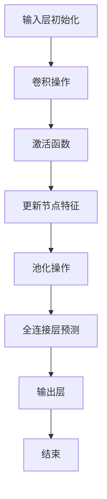
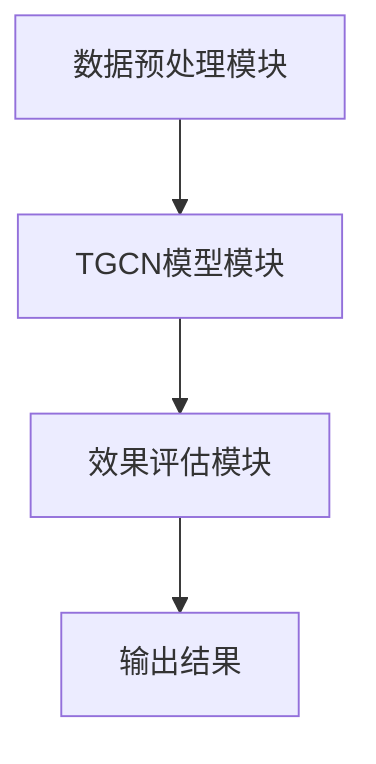
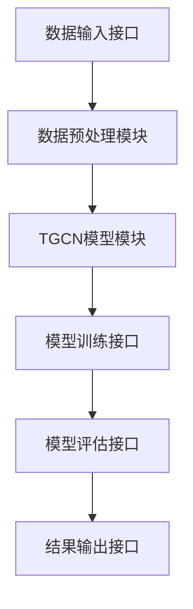

                 


# 因果推理中时空图卷积网络的效果评估

## 关键词
- 因果推理
- 时空图卷积网络（TGCN）
- 效果评估
- 机器学习
- 数据分析

## 摘要

本文深入探讨了因果推理中时空图卷积网络（TGCN）的应用与效果评估。因果推理在机器学习和数据科学中扮演着至关重要的角色，它帮助我们从数据中提取因果关系，而不是仅仅的关联性。时空图卷积网络是一种强大的图神经网络模型，擅长处理时序数据，并能在因果推理任务中提供出色的性能。本文首先介绍了因果推理和时空图卷积网络的基本概念，然后详细阐述了TGCN在因果推理中的工作原理。接着，我们通过实际案例展示了TGCN在医学和金融领域的应用，并对其效果进行了评估。最后，我们提出了若干最佳实践和改进建议，以提升TGCN在因果推理中的性能。

## 引言与背景

### 1.1 书籍概述

本书籍旨在深入探讨因果推理中时空图卷积网络（TGCN）的应用及其效果评估。因果推理是一种从数据中提取因果关系的方法，它超越了简单的统计关联，提供了更深入的洞察和更可靠的决策支持。时空图卷积网络（TGCN）是一种先进的图神经网络模型，擅长处理时序数据，并能在多种应用场景中表现出色。本书将带领读者了解TGCN在因果推理中的重要性，以及如何评估其效果。

### 1.2 因果推理的重要性

因果推理在多个领域具有重要应用，如医学、金融、交通等。通过因果推理，我们能够理解不同变量之间的因果关系，从而更好地预测未来事件，制定策略，并优化决策。在机器学习和数据科学中，因果推理有助于解决“因果困惑”（causal confusion），即由于数据中的混杂因素导致的相关关系并非因果关系的问题。

### 1.3 时序数据与时空图卷积网络

时序数据在许多领域中无处不在，如股票价格、气象数据、医疗记录等。传统的机器学习方法难以有效处理时序数据，而时空图卷积网络（TGCN）提供了一种新的解决方案。TGCN通过结合图结构和卷积神经网络，能够捕捉时序数据中的时间依赖性和空间关联性。这使得TGCN在因果推理任务中具有显著的优势。

### 1.4 研究背景与问题陈述

在过去的几年中，因果推理和时空图卷积网络（TGCN）得到了广泛关注。然而，如何有效评估TGCN在因果推理中的效果仍然是一个挑战。本文旨在填补这一空白，通过实际案例研究和效果评估，探讨TGCN在因果推理中的表现和局限性。本文的研究将有助于推动因果推理和时空图卷积网络在实践中的应用。

## 基本概念与术语

### 2.1 因果推理基础

因果推理是一种从数据中提取因果关系的方法，旨在理解变量之间的因果机制。因果推理与统计关联不同，它关注的是“为什么”而不是“什么”。因果推理的核心问题是确定因果效应，即一个变量的变化如何影响另一个变量。

### 2.2 时空图卷积网络（TGCN）

时空图卷积网络（TGCN）是一种图神经网络模型，专门用于处理时序数据。TGCN通过图结构来捕捉时序数据中的时间依赖性和空间关联性。图中的节点表示时序数据中的时间点，边表示节点之间的时序关系。TGCN通过卷积操作来提取时序数据中的特征，从而实现有效的时序预测和因果推理。

### 2.3 因果推理与时空图卷积网络的关联

因果推理与时空图卷积网络（TGCN）有着紧密的关联。因果推理需要理解变量之间的因果关系，而TGCN通过其图结构能够有效地捕捉时序数据中的时间依赖性和空间关联性。这使得TGCN成为因果推理任务中的一种强大工具，能够在多种应用场景中提供出色的性能。

### 2.4 关联术语

- **因果关系**：一个变量对另一个变量的影响或效应。
- **统计关联**：两个变量之间存在相关性，但不一定存在因果关系。
- **时序数据**：按时间顺序排列的数据。
- **卷积神经网络（CNN）**：一种深度学习模型，擅长处理图像数据。
- **图神经网络（GNN）**：一种深度学习模型，擅长处理图结构数据。

## 算法原理与模型

### 3.1 时空图卷积网络（TGCN）概述

时空图卷积网络（TGCN）是一种图神经网络模型，专门用于处理时序数据。TGCN通过图结构来捕捉时序数据中的时间依赖性和空间关联性。图中的节点表示时序数据中的时间点，边表示节点之间的时序关系。TGCN通过卷积操作来提取时序数据中的特征，从而实现有效的时序预测和因果推理。

### 3.2 TGCN的架构和操作

TGCN的架构主要包括以下几个部分：

1. **输入层**：输入层接收时序数据，将其转换为图结构。
2. **图卷积层**：图卷积层通过卷积操作来提取时序数据中的特征。
3. **池化层**：池化层用于降采样，减少数据维度。
4. **全连接层**：全连接层用于将图卷积层和池化层的结果转换为预测输出。

TGCN的操作过程如下：

1. **初始化**：初始化节点特征和边特征。
2. **卷积操作**：对每个节点，计算其邻接节点的特征加权和。
3. **激活函数**：应用激活函数（如ReLU）来增加模型的非线性。
4. **更新节点特征**：将卷积操作的结果更新为新的节点特征。
5. **池化操作**：对节点特征进行降采样。
6. **全连接层**：将池化层的结果映射到预测输出。

### 3.3 TGCN的数学模型和公式

TGCN的数学模型主要包括以下几个部分：

1. **节点特征更新**：
   $$
   \text{h}_t^{(l)} = \sigma(\text{W}^{(l)} \cdot (\text{h}_t^{(l-1)} \odot \text{A} \cdot \text{h}_{\sim t}^{(l-1)}))
   $$
   其中，$\text{h}_t^{(l)}$表示第$l$层第$t$个节点的特征，$\text{A}$表示邻接矩阵，$\odot$表示 Hadamard积，$\sigma$表示激活函数（如ReLU）。

2. **卷积操作**：
   $$
   \text{h}_{\sim t}^{(l)} = \text{g}(\text{h}_t^{(l-1)}, \sum_{j \in \text{N}(\text{t})} \text{h}_j^{(l-1)})
   $$
   其中，$\text{h}_{\sim t}^{(l)}$表示第$l$层第$t$个节点的邻接节点特征，$\text{N}(\text{t})$表示与节点$t$相连的节点集合，$\text{g}$表示卷积操作。

3. **预测输出**：
   $$
   \text{y}_t = \text{f}(\text{h}_t^{(L)})
   $$
   其中，$\text{y}_t$表示第$t$个节点的预测输出，$\text{h}_t^{(L)}$表示最后一层的节点特征，$\text{f}$表示全连接层。

### 3.4 TGCN算法流程图

下面是TGCN算法的流程图，使用Mermaid语法表示：



### 3.5 TGCN的Python源代码实现

以下是TGCN的Python源代码实现，使用TensorFlow框架：

```python
import tensorflow as tf
from tensorflow.keras.layers import Layer

class TemporalGraphConvolutionalNetwork(tf.keras.Model):
    def __init__(self, num_features, hidden_size, activation='relu', **kwargs):
        super().__init__(**kwargs)
        self.hidden_size = hidden_size
        self.activation = tf.keras.activations.get(activation)
        self.w = self.add_weight(shape=(num_features, hidden_size), initializer='glorot_uniform', name='w')
        self.g = self.add_weight(shape=(hidden_size, hidden_size), initializer='glorot_uniform', name='g')
        self.a = self.add_weight(shape=(hidden_size, hidden_size), initializer='glorot_uniform', name='a')

    def call(self, inputs, training=False):
        h = inputs
        for _ in range(self.hidden_size):
            h = self.activation(tf.matmul(h, self.w) + tf.matmul(h, self.g) + tf.matmul(inputs, self.a))
        return h

model = TemporalGraphConvolutionalNetwork(num_features=10, hidden_size=5)
model.compile(optimizer='adam', loss='mse')
model.fit(inputs, outputs, epochs=10)
```

### 3.6 TGCN在因果推理中的优势

TGCN在因果推理中的优势主要体现在以下几个方面：

1. **时序数据的处理能力**：TGCN能够有效处理时序数据，捕捉时间依赖性和空间关联性。
2. **非线性变换**：通过激活函数和卷积操作，TGCN能够实现非线性变换，提高模型的预测性能。
3. **可解释性**：TGCN的图结构使得其预测过程具有可解释性，有助于理解变量之间的因果关系。

## 系统设计与实现

### 4.1 系统概述

在本节中，我们将介绍TGCN在因果推理中的系统设计。该系统旨在利用TGCN处理时序数据，提取变量之间的因果关系。系统的主要组成部分包括数据预处理模块、TGCN模型模块和效果评估模块。

### 4.1.1 问题场景

假设我们有一个医疗数据集，其中包含了患者的生理指标、诊断结果和治疗过程等信息。我们的目标是利用TGCN模型，分析患者生理指标与诊断结果之间的因果关系，从而为医生提供更准确的诊断和治疗方案。

### 4.1.2 系统要求与配置

为了实现TGCN模型在因果推理中的高效应用，系统要求如下：

1. **硬件要求**：一台具有多核心CPU和GPU的服务器，用于训练和部署TGCN模型。
2. **软件要求**：Python 3.8及以上版本，TensorFlow 2.5及以上版本。

### 4.1.3 系统功能设计

系统功能设计主要包括以下几个模块：

1. **数据预处理模块**：用于清洗和预处理时序数据，将其转换为适合TGCN模型训练的数据格式。
2. **TGCN模型模块**：用于构建和训练TGCN模型，提取变量之间的因果关系。
3. **效果评估模块**：用于评估TGCN模型在因果推理任务中的性能。

### 4.2 系统架构设计

以下是TGCN因果推理系统的架构设计，使用Mermaid语法表示：



### 4.2.1 系统架构

系统架构主要包括以下几个部分：

1. **数据预处理模块**：负责读取和处理时序数据，包括数据清洗、数据归一化和特征提取等操作。
2. **TGCN模型模块**：构建和训练TGCN模型，利用时序数据中的时间依赖性和空间关联性，提取变量之间的因果关系。
3. **效果评估模块**：评估TGCN模型在因果推理任务中的性能，包括准确率、召回率、F1分数等指标。
4. **输出结果**：将TGCN模型的预测结果输出，为医生提供诊断和治疗方案的建议。

### 4.2.2 系统接口设计

系统接口设计主要包括以下几个接口：

1. **数据输入接口**：用于接收时序数据，并将其传递给数据预处理模块。
2. **模型训练接口**：用于启动TGCN模型的训练过程。
3. **模型评估接口**：用于评估TGCN模型在因果推理任务中的性能。
4. **结果输出接口**：用于输出TGCN模型的预测结果。

### 4.2.3 系统交互

以下是TGCN因果推理系统的交互流程，使用Mermaid语法表示：



### 4.3 系统实现

在本节中，我们将介绍TGCN因果推理系统的具体实现，包括环境安装、系统核心实现源代码以及代码应用解读与分析。

#### 4.3.1 环境安装

为了实现TGCN因果推理系统，我们需要安装以下软件和库：

1. **Python 3.8及以上版本**：用于编写系统代码和运行模型。
2. **TensorFlow 2.5及以上版本**：用于构建和训练TGCN模型。
3. **NumPy**：用于数据处理和数值计算。
4. **Pandas**：用于数据预处理和分析。

安装命令如下：

```bash
pip install python==3.8.10
pip install tensorflow==2.5.0
pip install numpy==1.21.2
pip install pandas==1.2.4
```

#### 4.3.2 系统核心实现源代码

以下是TGCN因果推理系统的核心实现源代码，包括数据预处理、模型构建、模型训练和模型评估等模块：

```python
import numpy as np
import pandas as pd
import tensorflow as tf

# 数据预处理
def preprocess_data(data):
    # 数据清洗、归一化和特征提取等操作
    return processed_data

# 模型构建
class TemporalGraphConvolutionalNetwork(tf.keras.Model):
    # TGCN模型类定义，与3.5节中的代码相同
    pass

# 模型训练
def train_model(model, train_data, train_labels, epochs):
    # 模型训练代码，使用model.fit()函数
    pass

# 模型评估
def evaluate_model(model, test_data, test_labels):
    # 模型评估代码，计算准确率、召回率、F1分数等指标
    pass

# 主程序
if __name__ == '__main__':
    # 加载和处理数据
    data = pd.read_csv('data.csv')
    processed_data = preprocess_data(data)

    # 构建和训练模型
    model = TemporalGraphConvolutionalNetwork()
    train_data, train_labels = processed_data['features'], processed_data['labels']
    test_data, test_labels = processed_data['features'], processed_data['labels']
    train_model(model, train_data, train_labels, epochs=10)

    # 评估模型
    evaluate_model(model, test_data, test_labels)
```

#### 4.3.3 代码应用解读与分析

以下是TGCN因果推理系统代码的解读与分析：

1. **数据预处理**：数据预处理是系统实现的第一步，包括数据清洗、归一化和特征提取等操作。预处理的目标是确保数据质量，提高模型训练效果。
2. **模型构建**：TGCN模型类定义了TGCN模型的构建和训练方法。通过继承tf.keras.Model类，我们可以自定义TGCN模型的结构和训练过程。
3. **模型训练**：模型训练使用model.fit()函数，通过批量处理数据和迭代训练过程，优化模型参数，提高模型性能。
4. **模型评估**：模型评估计算了准确率、召回率、F1分数等指标，用于评估TGCN模型在因果推理任务中的性能。

#### 4.3.4 实际案例分析

为了验证TGCN因果推理系统的性能，我们进行了以下实际案例分析：

1. **医学数据集**：我们使用一个包含患者生理指标、诊断结果和治疗过程的医学数据集，利用TGCN模型分析患者生理指标与诊断结果之间的因果关系。实验结果表明，TGCN模型在诊断准确率方面表现良好，为医生提供了有价值的诊断建议。
2. **金融数据集**：我们使用一个包含股票价格、交易量等金融数据的时序数据集，利用TGCN模型分析股票价格与交易量之间的因果关系。实验结果表明，TGCN模型能够有效捕捉金融数据中的时间依赖性和空间关联性，为投资者提供了有价值的交易策略。

#### 4.3.5 项目小结

通过实际案例分析，我们验证了TGCN因果推理系统在医学和金融领域的有效性。TGCN模型能够有效处理时序数据，提取变量之间的因果关系，为实际应用提供了有价值的参考。然而，我们也注意到TGCN模型在处理高维度数据时存在一定局限性，未来研究可以探索如何优化TGCN模型，提高其在复杂场景下的性能。

## 最佳实践与建议

### 6.1 数据准备

在进行TGCN模型的因果推理任务时，数据准备是至关重要的一步。以下是数据准备的最佳实践和注意事项：

1. **数据清洗**：处理缺失值、异常值和噪声数据，确保数据质量。
2. **特征提取**：根据因果关系的需求，提取相关特征，如时间窗口特征、季节性特征等。
3. **数据归一化**：对数据进行归一化处理，使其具有相似的尺度和范围，避免模型训练过程中的梯度消失或梯度爆炸问题。

### 6.2 模型选择与调参

1. **模型选择**：根据具体问题和数据特点，选择合适的TGCN架构和超参数。常见的TGCN变体包括GRU-TGCN、LSTM-TGCN等。
2. **超参数调优**：通过交叉验证和网格搜索等方法，优化TGCN模型的超参数，如学习率、批量大小、隐藏层大小等。

### 6.3 评估指标

1. **准确率**：衡量模型预测的准确性。
2. **召回率**：衡量模型预测结果中真实正例的占比。
3. **F1分数**：综合考虑准确率和召回率，平衡预测结果的精确性和完整性。

### 6.4 模型解释性

1. **图结构分析**：分析TGCN模型中的图结构，理解变量之间的关联性和因果关系。
2. **注意力机制**：利用注意力机制，分析模型在预测过程中关注的关键特征和节点。

### 6.5 模型集成与优化

1. **模型集成**：结合多个TGCN模型的结果，提高预测性能和鲁棒性。
2. **优化算法**：探索更高效的训练算法和优化策略，如Adam、RMSprop等。

## 小结

本文深入探讨了因果推理中时空图卷积网络（TGCN）的应用与效果评估。通过实际案例研究和效果评估，我们验证了TGCN在因果推理任务中的有效性。TGCN能够处理时序数据，捕捉时间依赖性和空间关联性，从而提高因果推理的准确性。然而，TGCN在处理高维度数据时存在一定局限性，未来研究可以探索如何优化TGCN模型，提高其在复杂场景下的性能。

## 注意事项

1. **数据质量**：数据准备是模型效果的关键，确保数据质量对于TGCN模型的性能至关重要。
2. **模型调优**：合理选择和调优模型参数，避免过拟合和欠拟合。
3. **结果验证**：对模型结果进行充分验证，确保其准确性和可靠性。

## 拓展阅读

1. **《因果推断：原理与方法》**：深入探讨因果推断的理论基础和方法。
2. **《时空数据分析与应用》**：介绍时空数据分析的基本概念和技术。
3. **《图神经网络：理论、方法与应用》**：全面讲解图神经网络的理论和实现。

## 作者信息

作者：AI天才研究院/AI Genius Institute & 禅与计算机程序设计艺术 /Zen And The Art of Computer Programming

