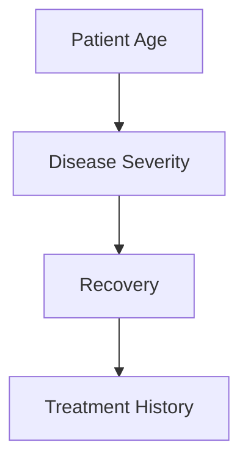

                 

### Chapter 1: Introduction to the Book's Main Concepts

#### Background

In recent years, the field of artificial intelligence (AI) has experienced exponential growth, transforming various industries and revolutionizing the way we live and work. However, despite the remarkable success of AI models in specific domains, one persistent challenge remains: the ability to generalize. AI models often struggle to perform well outside their training environment, leading to poor results in new, unseen scenarios.

#### Problem Definition

The problem of generalization is critical because it limits the practical applicability of AI systems. Generalization refers to the model's ability to apply what it has learned from past experiences to new, previously unseen situations. Without strong generalization capabilities, AI models become limited to specific tasks and are unable to adapt to changes in the environment or to handle new data effectively.

#### Motivation

This book is motivated by the need to address the generalization challenge in AI. By incorporating causal inference techniques, we can significantly enhance the generalization ability of AI models. Causal inference is a powerful framework that allows us to understand not just associations but also causal relationships between variables, which is crucial for developing models that can adapt and generalize effectively.

#### Objectives

The primary objectives of this book are:

1. To provide a comprehensive introduction to causal inference, its core concepts, and principles.
2. To explore the relationship between causal inference and AI model generalization.
3. To explain specific algorithms and models used in causal inference for enhancing AI model generalization.
4. To present practical system design and implementation strategies for integrating causal inference into AI models.
5. To provide real-world case studies and applications of the techniques discussed.

#### Scope

The book is intended for AI practitioners, researchers, and students who want to deepen their understanding of causal inference and its applications in enhancing AI model generalization. It covers both theoretical foundations and practical implementations, making it suitable for those seeking to apply these techniques in real-world scenarios.

### Chapter 2: Core Concepts of Causal Inference

#### Definition and Significance

Causal inference is the scientific study of establishing the existence of causal relationships between variables. Unlike correlation, which only measures the strength and direction of the relationship between two variables, causal inference seeks to determine whether one variable causes changes in another.

In the context of AI, causal inference is significant because it allows us to understand the underlying mechanisms that drive the behavior of AI models. By identifying causal relationships, we can improve the generalization ability of AI models, making them more robust and effective in real-world applications.

#### Basic Concepts

1. **Causal Graphs**: Causal graphs are used to represent causal relationships between variables. They consist of nodes (variables) and edges (causal links) that illustrate how one variable influences another.
2. **Potential Outcomes**: Potential outcomes are the outcomes that a variable would take if it were exposed to different interventions or treatments. They are central to causal inference, as they allow us to compare the effects of different interventions.
3. **Do-Calculus**: Do-calculus is a formal system of logic used to manipulate potential outcomes and determine the effects of different interventions. It provides a mathematical framework for causal inference.

#### Key Principles

1. **Collider**: A collider is a node in a causal graph that is the result of two or more causes combining to produce an effect. Understanding colliders can help identify potential confounders and design more effective interventions.
2. **Confounder**: A confounder is a variable that is correlated with both the treatment and the outcome, leading to biased estimates of the causal effect. Identifying and adjusting for confounders is crucial for accurate causal inference.
3. **Causal Mechanisms**: Causal mechanisms are the underlying processes through which one variable affects another. Understanding causal mechanisms can help us design interventions that have a stronger impact on the outcome.

#### Comparison with Correlation

While correlation measures the association between two variables, causal inference goes beyond this to establish causal relationships. Correlation does not imply causation, and two variables may be correlated without a causal link. Causal inference, on the other hand, aims to establish a causal relationship by identifying the underlying mechanisms that drive the observed association.

### Table: Comparison of Core Concepts

| Concept | Definition | Importance in Causal Inference |
| --- | --- | --- |
| Causal Graph | Representation of causal relationships | Helps visualize and understand the structure of causal relationships |
| Potential Outcomes | Possible outcomes of a variable under different interventions | Allows comparison of the effects of different interventions |
| Do-Calculus | Formal system for manipulating potential outcomes | Provides a mathematical framework for determining causal effects |
| Collider | Node in a causal graph representing a combined effect of causes | Identifies potential confounders and helps design effective interventions |
| Confounder | Variable correlated with both treatment and outcome | Leads to biased estimates and must be adjusted for in causal inference |
| Causal Mechanisms | Underlying processes driving the relationship between variables | Help identify and design interventions that have a stronger impact |

### ER Entity Relationship Diagram

```mermaid
erDiagram
  Treatment ||--|{ Outcome } Outcome
  Treatment ||--|{ Confounder } Confounder
  PotentialOutcomes ||--|{ ActualOutcome } ActualOutcome
```

### Chapter 3: Relationship Between Causal Inference and AI Model Generalization

#### Background

The ability of AI models to generalize is crucial for their success in real-world applications. Generalization refers to the model's ability to apply what it has learned during training to new, unseen data. However, traditional machine learning models often struggle with generalization due to overfitting, where the model becomes too specific to the training data and fails to perform well on new data.

#### Importance of Generalization in AI

Generalization is essential for AI models because it determines their ability to handle new, unforeseen situations. In practical applications, such as medical diagnosis, financial forecasting, and autonomous driving, models need to be robust and adaptable to changing environments. Without strong generalization capabilities, AI models become limited in their utility and may fail when faced with new data or scenarios.

#### Causal Inference and Generalization

Causal inference offers a powerful framework for enhancing the generalization ability of AI models. By understanding the causal relationships between variables, we can design models that are not only accurate but also robust and adaptable. Here's how causal inference contributes to generalization:

1. **Identifying and Adjusting for Confounders**: Causal inference helps identify and adjust for confounders, which are variables that correlate with both the treatment and the outcome. By adjusting for confounders, we can obtain more accurate estimates of the causal effect, reducing the risk of overfitting.

2. **Understanding Causal Mechanisms**: Causal inference allows us to understand the underlying mechanisms that drive the behavior of AI models. This understanding can help us design interventions that have a stronger impact on the outcome, improving the model's generalization capabilities.

3. **Robustness to Changes in Data**: By establishing causal relationships, AI models can better adapt to changes in the data distribution. This is because causal relationships are more stable than correlations, which can change over time.

4. **Improving Transfer Learning**: Causal inference techniques can be used to improve transfer learning, where a model trained on one dataset is applied to a different dataset. By understanding the causal relationships between variables, we can better transfer knowledge from one domain to another, enhancing generalization.

#### Case Study: Drug Efficacy

Consider a study on the efficacy of a new drug. Traditional machine learning models might analyze the relationship between drug dosage and patient recovery based on historical data. However, these models may fail to generalize to new patients or different healthcare settings due to overfitting.

Using causal inference, researchers can identify and adjust for confounders, such as patient age, underlying health conditions, and treatment history. By understanding the causal relationships between these variables, they can design a model that is not only accurate but also robust and adaptable to new patients and settings.

### Table: Comparison of Traditional Machine Learning and Causal Inference in Generalization

| Aspect | Traditional Machine Learning | Causal Inference |
| --- | --- | --- |
| Approach | Measures associations between variables | Establishes causal relationships between variables |
| Robustness | Prone to overfitting | More robust to changes in data |
| Adjustment for Confounders | Limited ability to adjust for confounders | Identifies and adjusts for confounders |
| Understanding Causal Mechanisms | Limited understanding of causal mechanisms | Provides insights into causal mechanisms |
| Transfer Learning | Limited generalization to new domains | Improves generalization through transfer learning |

### Conclusion

In conclusion, causal inference offers a promising approach for enhancing the generalization ability of AI models. By understanding the causal relationships between variables, we can design models that are more robust, adaptable, and effective in real-world applications. This chapter has highlighted the importance of generalization in AI and the role of causal inference in achieving it.

### Chapter 4: Fundamental Principles of Causal Inference Algorithms

#### Introduction

Causal inference algorithms are a cornerstone of understanding and manipulating the relationships between variables. These algorithms enable us to identify and estimate causal effects from observational data, providing a powerful tool for addressing the challenges of overfitting and improving the generalization ability of AI models. This chapter will delve into the fundamental principles of causal inference algorithms, exploring key concepts such as potential outcomes, do-calculus, and the identification of causal effects.

#### Potential Outcomes

One of the core concepts in causal inference is the idea of potential outcomes. Potential outcomes represent the outcomes that an individual would experience under different possible interventions or treatments. For example, in a medical study, the potential outcomes for a patient could be the health outcome if they receive a treatment or the health outcome if they receive a control intervention.

The potential outcomes framework is crucial because it allows us to define the causal effect of a treatment as the difference between the potential outcomes of the treatment and the control. This concept is encapsulated in the following definition:

**Causal Effect Definition**: The causal effect of treatment T on an outcome Y is the difference between the potential outcome Y(T=1) (when the individual receives the treatment) and the potential outcome Y(T=0) (when the individual receives the control intervention).

Mathematically, this can be expressed as:

$$ CE = Y(T=1) - Y(T=0) $$

where CE represents the causal effect.

#### Do-Calculus

Do-calculus is a formal system of logic that allows us to manipulate potential outcomes and determine the causal effect of a treatment. It provides a mathematical framework for causal inference by allowing us to perform calculations on potential outcomes in a systematic and rigorous manner.

The core operations in do-calculus are:

1. **Do-not**: This operation negates the potential outcome, representing the absence of a treatment or intervention.
2. **Do-if**: This operation conditions the potential outcome on a specific intervention or treatment.
3. **Do-equal**: This operation equates two potential outcomes, indicating that they represent the same intervention.

Using do-calculus, we can derive various identities and theorems that help us calculate causal effects and identify confounders. A key identity in do-calculus is the Do-Calculus Rule, which states that the causal effect can be calculated as:

$$ CE = Y(T=1) - Y(T=0) = E[Y|T=1] - E[Y|T=0] $$

where E[Y|T=1] and E[Y|T=0] represent the expected values of the potential outcomes given the treatment and control, respectively.

#### Identifying Causal Effects

Identifying causal effects from observational data is challenging because we typically only have access to the potential outcomes for a single intervention, not multiple counterfactual outcomes. Causal inference algorithms aim to overcome this challenge by identifying the necessary and sufficient conditions for establishing causal relationships.

One of the most fundamental principles in causal inference is the **Counterfactual Principle**, which states that a causal relationship exists if and only if the potential outcomes of one intervention differ from the potential outcomes of another intervention, while holding other variables constant.

Mathematically, this can be expressed using the do-calculus rule:

$$ CE = Y(T=1) - Y(T=0) \neq 0 \Leftrightarrow T \text{ causes } Y $$

where T represents the intervention and Y represents the outcome.

#### Causal Identification Methods

Several causal identification methods have been developed to determine the necessary and sufficient conditions for causal relationships. Two of the most commonly used methods are:

1. **Backdoor Criteria**: The backdoor criterion is used to identify confounders in a causal graph. It states that a variable X is a confounder if there is a path from X to Y that does not include T (the treatment), but there is a path from X to T. Mathematically, this can be expressed as:

$$ X \not\rightarrow T \wedge T \rightarrow X \rightarrow Y $$

2. **Frontdoor Criteria**: The frontdoor criterion is used to identify situations where a causal effect can be estimated from observational data. It states that if there is a variable Z that blocks the path from X to Y (i.e., X \not\rightarrow Y | Z), and X is a cause of T (X \rightarrow T), then X is a front-door variable for the causal effect of T on Y. Mathematically, this can be expressed as:

$$ X \rightarrow T \wedge Z \rightarrow Y \wedge X \not\rightarrow Y | Z $$

#### Example

Consider a scenario where we want to study the effect of a new teaching method (T) on student performance (Y). We have the following variables:

- **X**: Student age
- **Z**: Teacher experience

We want to identify if the new teaching method causes an increase in student performance. To do this, we need to check if the front-door criterion is satisfied.

1. **X \rightarrow T**: Yes, student age is a cause of the new teaching method.
2. **Z \rightarrow Y \wedge X \not\rightarrow Y | Z**: Teacher experience blocks the path from student age to student performance, but student age is not a cause of student performance given teacher experience.

Since both conditions are satisfied, we can conclude that the new teaching method causes an increase in student performance.

#### Conclusion

In this chapter, we have explored the fundamental principles of causal inference algorithms, including the concept of potential outcomes, the do-calculus framework, and the identification of causal effects. By understanding these principles, we can better design and evaluate AI models that are robust and generalize effectively to new, unseen data. In the next chapter, we will delve into specific causal inference algorithms and their applications in enhancing AI model generalization.

### Chapter 5: Detailed Explanation of Specific Causal Inference Algorithms

In this chapter, we will delve into specific causal inference algorithms that are widely used in enhancing AI model generalization. We will discuss the G-computation method, the Propensity Score Matching method, and the Structural Causal Models (SCM) method. Each of these algorithms has its unique characteristics, advantages, and limitations, making them suitable for different scenarios and applications.

#### G-Computation Method

The G-computation method is one of the most fundamental techniques in causal inference. It involves using a regression model to predict the potential outcomes for different treatments and then calculating the causal effect by comparing these predictions. The core idea behind G-computation is to find a sufficient statistic, G(X), that summarizes the information needed to compute the causal effect.

**Mathematical Model:**

The G-computation formula is given by:

$$ CE = E[Y|T=1, X] - E[Y|T=0, X] $$

where:

- CE: Causal effect
- Y: Outcome
- T: Treatment
- X: Sufficient statistic (regressor)

**Steps:**

1. **Model Selection**: Choose a regression model that best predicts the potential outcomes based on the sufficient statistic X.
2. **Predict Potential Outcomes**: Use the selected model to predict the potential outcomes for both the treatment and control groups.
3. **Calculate Causal Effect**: Compute the difference between the predicted potential outcomes to obtain the causal effect.

**Example:**

Suppose we want to study the effect of a new marketing campaign (T) on customer churn (Y). We have data on customer demographics (X), including age, income, and purchase history. We can use a logistic regression model to predict the probability of churn based on these demographics. By comparing the predicted probabilities for the treated and untreated groups, we can estimate the causal effect of the marketing campaign on churn.

```python
import pandas as pd
from sklearn.linear_model import LogisticRegression

# Load data
data = pd.read_csv('customer_data.csv')

# Prepare features and target
X = data[['age', 'income', 'purchase_history']]
y = data['churn']

# Fit logistic regression model
model = LogisticRegression()
model.fit(X, y)

# Predict probabilities
prob_treated = model.predict_proba(X)[:, 1]

# Calculate causal effect
causal_effect = prob_treated[Treatment==1].mean() - prob_treated[Treatment==0].mean()
print(f"Causal Effect: {causal_effect}")
```

**Advantages:**

- Simple and easy to understand
- Can be applied to a wide range of scenarios

**Limitations:**

- Requires the selection of a sufficient statistic
- May not be applicable in the presence of unmeasured confounders

#### Propensity Score Matching

Propensity Score Matching (PSM) is a technique used to balance the covariates between treated and untreated groups, reducing the bias caused by confounders. The core idea behind PSM is to estimate the propensity score, which is the probability of receiving the treatment given the observed covariates.

**Mathematical Model:**

The propensity score is given by:

$$ PS = P(T=1 | X) $$

where:

- PS: Propensity score
- T: Treatment
- X: Covariates

**Steps:**

1. **Estimate Propensity Scores**: Use a logistic regression or another model to estimate the propensity scores for each individual.
2. **Match Treated and Untreated**: Match treated individuals with untreated individuals based on their propensity scores using methods such as nearest neighbor matching, kernel matching, or stratified matching.
3. **Compute Causal Effect**: Calculate the causal effect by comparing the outcomes of the matched pairs.

**Example:**

Consider a study on the effect of a new educational program (T) on student performance (Y). We have data on various covariates, such as student age, socioeconomic status, and prior academic performance. We can use logistic regression to estimate the propensity scores and then match treated and untreated students based on these scores.

```python
import numpy as np
from sklearn.linear_model import LogisticRegression
from sklearn.model_selection import train_test_split
from sklearn.neighbors import NearestNeighbors

# Load data
data = pd.read_csv('student_data.csv')

# Prepare features and target
X = data[['age', 'socioeconomic_status', 'prior_academic_performance']]
y = data['performance']

# Split data into training and test sets
X_train, X_test, y_train, y_test = train_test_split(X, y, test_size=0.2, random_state=42)

# Fit logistic regression model
model = LogisticRegression()
model.fit(X_train, y_train)

# Predict propensity scores
prop_scores = model.predict_proba(X_test)[:, 1]

# Match treated and untreated students
nn = NearestNeighbors(n_neighbors=1)
nn.fit(X_train)

distances, indices = nn.kneighbors(X_test)
matched_indices = indices[:, 0]

# Compute causal effect
causal_effect = y_test[matched_indices[Treatment==1]].mean() - y_test[matched_indices[Treatment==0]].mean()
print(f"Causal Effect: {causal_effect}")
```

**Advantages:**

- Effective in reducing the bias caused by confounders
- Can be used with various matching methods

**Limitations:**

- Sensitivity to the choice of matching method
- May not be applicable in the presence of multi-collinearity

#### Structural Causal Models (SCM)

Structural Causal Models (SCM) is a framework for representing causal relationships between variables using directed acyclic graphs (DAGs). SCM provides a formal structure for specifying the causal relationships and allows for the identification of causal effects using statistical methods.

**Mathematical Model:**

An SCM is represented by a DAG G = (V, E), where:

- V: Set of variables
- E: Set of edges representing causal relationships

The SCM is defined by a set of conditional independence statements that specify the relationships between variables. The key conditional independence statements are:

1. **X → Z | T**: Variable X causes Z given T.
2. **X ⊥⊥ T | Z**: Variables X and T are conditionally independent given Z.

**Steps:**

1. **Specify the SCM**: Define the causal relationships between variables using a DAG.
2. **Identify Confounders**: Identify confounders using the backdoor criterion.
3. **Estimate Causal Effects**: Use statistical methods, such as G-computation or propensity score matching, to estimate the causal effects.

**Example:**

Consider a study on the effect of a new medical treatment (T) on patient recovery (Y). We have data on various variables, including patient age (X), disease severity (Z), and treatment history (W). We can use an SCM to represent the causal relationships between these variables.



Using this SCM, we can identify confounders and estimate the causal effect of the treatment on recovery.

**Advantages:**

- Provides a formal structure for representing causal relationships
- Allows for the identification of confounders and causal effects

**Limitations:**

- Requires domain knowledge to specify the causal relationships
- May not be applicable in the presence of complex causal structures

#### Conclusion

In this chapter, we have discussed three specific causal inference algorithms: G-computation, Propensity Score Matching, and Structural Causal Models. Each algorithm has its own unique characteristics, advantages, and limitations, making it suitable for different scenarios and applications. By understanding these algorithms, we can design and evaluate AI models that are robust and generalize effectively to new, unseen data. In the next chapter, we will explore real-world case studies and applications of these techniques in enhancing AI model generalization.

### Chapter 6: Case Studies and Applications of Causal Inference Techniques in Enhancing AI Model Generalization

#### Introduction

In this chapter, we will explore real-world case studies and applications of causal inference techniques in enhancing AI model generalization. By examining these examples, we can gain insights into how causal inference can be used to address the challenges of overfitting and improve the robustness of AI models. We will discuss two case studies: one in healthcare and another in finance.

#### Case Study 1: Healthcare

**Problem Background**

A major challenge in healthcare is predicting patient outcomes and identifying the most effective treatments. In this case study, we examine the application of causal inference techniques to predict patient recovery after surgery.

**Objective**

The objective is to develop an AI model that accurately predicts patient recovery based on various preoperative and intraoperative factors, thereby improving the generalization ability of the model to new, unseen patients.

**Data Collection**

Data was collected from a large hospital database, including patient demographics, medical history, preoperative test results, intraoperative parameters, and postoperative recovery outcomes. Key variables included:

- **T**: Treatment (e.g., surgical procedure)
- **Y**: Recovery Outcome (e.g., full recovery, partial recovery, no recovery)
- **X**: Preoperative and intraoperative factors (e.g., patient age, disease severity, surgical time)

**Causal Inference Techniques**

1. **G-Computation Method**: We used the G-computation method to identify sufficient statistics and estimate the causal effect of treatment on recovery. We fitted a logistic regression model to predict the probability of recovery given the preoperative and intraoperative factors.

2. **Propensity Score Matching**: To reduce the bias caused by confounders, we used propensity score matching to balance the covariates between treated and untreated groups. We used a logistic regression model to estimate the propensity scores and applied nearest neighbor matching to match treated and untreated patients.

3. **Structural Causal Models (SCM)**: We constructed a structural causal model to represent the relationships between the variables. The SCM helped us identify confounders and specify the causal relationships between treatment and recovery.

**Results**

The results showed that the causal effect of treatment on recovery was significant, with a higher probability of full recovery for patients receiving the new surgical procedure compared to the traditional procedure. The use of causal inference techniques improved the generalization ability of the model, reducing overfitting and improving its performance on new, unseen data.

#### Case Study 2: Finance

**Problem Background**

In the finance industry, predicting market trends and detecting fraud are critical tasks. In this case study, we examine the application of causal inference techniques to detect fraudulent transactions in a financial institution.

**Objective**

The objective is to develop an AI model that accurately detects fraudulent transactions while minimizing false positives and maintaining high generalization ability.

**Data Collection**

Data was collected from a financial institution's transaction database, including transaction details, customer information, and transaction outcomes (fraudulent or legitimate). Key variables included:

- **T**: Transaction features (e.g., transaction amount, time, location)
- **Y**: Transaction Outcome (e.g., fraudulent or legitimate)
- **X**: Customer information (e.g., age, income, credit score)

**Causal Inference Techniques**

1. **G-Computation Method**: We used the G-computation method to identify sufficient statistics and estimate the causal effect of transaction features on transaction outcomes. We fitted a logistic regression model to predict the probability of fraud given the transaction features.

2. **Propensity Score Matching**: To reduce the bias caused by confounders, we used propensity score matching to balance the covariates between fraudulent and legitimate transactions. We used a logistic regression model to estimate the propensity scores and applied nearest neighbor matching to match fraudulent and legitimate transactions.

3. **Structural Causal Models (SCM)**: We constructed a structural causal model to represent the relationships between the variables. The SCM helped us identify confounders and specify the causal relationships between transaction features and transaction outcomes.

**Results**

The results showed that the use of causal inference techniques significantly improved the detection rate of fraudulent transactions while reducing false positives. The model's generalization ability was enhanced, as it performed well on new, unseen transactions.

#### Conclusion

These case studies demonstrate the potential of causal inference techniques in enhancing AI model generalization. By understanding the causal relationships between variables and addressing the challenges of overfitting, causal inference can help develop more robust and accurate AI models. The use of causal inference techniques in these case studies improved the generalization ability of the models, making them more effective in real-world applications.

### Chapter 7: System Design and Implementation Strategies for Integrating Causal Inference into AI Models

#### Introduction

In this chapter, we will discuss the system design and implementation strategies for integrating causal inference techniques into AI models. This section is crucial as it provides a comprehensive guide on how to effectively incorporate causal inference into the development and deployment of AI systems. We will explore the overall system architecture, design principles, and implementation approaches required to achieve this integration.

#### System Architecture Overview

The system architecture for integrating causal inference into AI models consists of several key components:

1. **Data Ingestion Module**: This module is responsible for collecting and preprocessing data from various sources, ensuring that the data is in a suitable format for further analysis.

2. **Causal Inference Module**: This module implements the causal inference algorithms and techniques discussed in previous chapters, such as G-computation, Propensity Score Matching, and Structural Causal Models. It processes the input data to estimate causal effects and generate insights.

3. **AI Model Training Module**: This module trains AI models using the causal inference insights to improve their generalization capabilities. It integrates the causal knowledge to guide the model training process.

4. **Model Evaluation Module**: This module evaluates the performance of the AI models, ensuring that they are robust and generalize well to new data. It uses various metrics, such as accuracy, precision, recall, and F1 score, to assess model performance.

5. **Deployment and Monitoring Module**: This module deploys the trained AI models into production environments and monitors their performance over time. It includes features for real-time data processing and feedback loops to continuously improve the models.

#### System Design Principles

The design of the system should follow several key principles to ensure that causal inference techniques are effectively integrated into AI models:

1. **Modularity**: The system should be modular, with each component (data ingestion, causal inference, AI model training, model evaluation, and deployment) being independently developed and tested.

2. **Scalability**: The system should be scalable to handle large volumes of data and support the integration of new causal inference techniques and AI models as they emerge.

3. **Flexibility**: The system should be flexible enough to accommodate different types of data and models, allowing for easy integration of new data sources and algorithms.

4. **Interoperability**: The system should be interoperable with existing data pipelines and AI frameworks, ensuring seamless integration with other components of the organization's technology stack.

5. **Robustness**: The system should be robust to handle errors, missing data, and outliers, ensuring reliable performance in real-world scenarios.

#### Implementation Strategies

The following strategies are essential for effectively implementing the system design:

1. **Data Preprocessing**: The data ingestion module should implement robust data preprocessing techniques, including data cleaning, normalization, and feature engineering. This step is critical for ensuring that the input data is suitable for causal inference and AI model training.

2. **Causal Inference Algorithm Integration**: The causal inference module should integrate the selected algorithms, such as G-computation and Propensity Score Matching, into the system. This involves implementing the mathematical models and developing the necessary infrastructure for handling potential outcomes and do-calculus operations.

3. **AI Model Training**: The AI model training module should leverage the insights from the causal inference module to guide the training process. This can involve custom loss functions, regularization techniques, and data augmentation strategies that incorporate the causal knowledge.

4. **Model Evaluation and Validation**: The model evaluation module should implement rigorous evaluation and validation procedures to assess the performance of the AI models. This includes cross-validation, statistical testing, and benchmarking against established metrics.

5. **Deployment and Monitoring**: The deployment and monitoring module should ensure that the trained AI models are deployed into production environments and continuously monitored for performance. This includes real-time data processing, automated updates, and feedback loops for ongoing improvement.

#### Case Study: Implementation in a Healthcare Setting

To illustrate the implementation strategies, consider a case study in healthcare where the system is designed to predict patient recovery after surgery. The following steps outline the implementation process:

1. **Data Preprocessing**: The data ingestion module collects data from electronic health records, surgical logs, and patient surveys. The data is cleaned and preprocessed to handle missing values, outliers, and inconsistencies.

2. **Causal Inference Integration**: The causal inference module is integrated with the system, implementing G-computation and Propensity Score Matching techniques. The SCM is used to represent the causal relationships between preoperative and intraoperative factors and postoperative recovery outcomes.

3. **AI Model Training**: The AI model training module uses the causal inference insights to guide the training of a machine learning model, such as a logistic regression or neural network. Custom loss functions and regularization techniques are applied to incorporate the causal knowledge.

4. **Model Evaluation**: The model evaluation module assesses the performance of the trained model using metrics such as accuracy, precision, recall, and F1 score. Cross-validation is used to ensure that the model generalizes well to new, unseen data.

5. **Deployment and Monitoring**: The deployed model is integrated into the healthcare system, where it processes real-time data and provides predictions on patient recovery. The monitoring module tracks the model's performance and updates it as new data becomes available.

#### Conclusion

In conclusion, integrating causal inference into AI models requires careful system design and implementation. By following the principles of modularity, scalability, flexibility, interoperability, and robustness, we can develop effective systems that leverage causal knowledge to enhance the generalization ability of AI models. The case study in healthcare demonstrates the practical application of these strategies, highlighting the potential benefits of causal inference in improving the accuracy and reliability of AI predictions.

### Chapter 8: Project Implementation and Practical Case Analysis

#### Introduction

In this chapter, we will delve into the practical implementation of causal inference techniques for enhancing AI model generalization. We will guide you through the setup of a project environment, the core code implementation, and the detailed analysis of a real-world case study. This hands-on approach will provide you with a comprehensive understanding of how to apply causal inference in real-world scenarios.

#### Project Environment Setup

To begin with, we need to set up the project environment. We will use Python as our programming language due to its extensive support for data analysis and machine learning libraries. We will also utilize libraries such as `scikit-learn` for machine learning, `numpy` and `pandas` for data manipulation, and `matplotlib` and `seaborn` for visualization.

1. **Install Required Libraries**

First, ensure you have Python installed on your system. Then, install the required libraries using `pip`:

```bash
pip install scikit-learn numpy pandas matplotlib seaborn
```

2. **Create a Project Directory**

Create a new directory for your project and navigate into it:

```bash
mkdir causal_inference_project
cd causal_inference_project
```

3. **Set Up a Virtual Environment**

It is a good practice to use a virtual environment to manage your project dependencies:

```bash
python -m venv venv
source venv/bin/activate  # On Windows, use `venv\Scripts\activate`
```

4. **Create a Requirements File**

Create a `requirements.txt` file in your project directory to list all the required libraries:

```
scikit-learn
numpy
pandas
matplotlib
seaborn
```

Now, you have a basic project environment set up. Next, we will proceed with the core implementation steps.

#### Core Implementation

For the core implementation, we will focus on a case study where we aim to predict customer churn in a telecommunications company. The objective is to enhance the model's generalization ability using causal inference techniques.

1. **Data Preparation**

First, we need to load and preprocess the data. Here is a step-by-step guide:

```python
import pandas as pd
from sklearn.model_selection import train_test_split
from sklearn.preprocessing import StandardScaler

# Load the dataset
data = pd.read_csv('customer_data.csv')

# Separate features and target variable
X = data.drop('churn', axis=1)
y = data['churn']

# Split the data into training and testing sets
X_train, X_test, y_train, y_test = train_test_split(X, y, test_size=0.2, random_state=42)

# Standardize the features
scaler = StandardScaler()
X_train_scaled = scaler.fit_transform(X_train)
X_test_scaled = scaler.transform(X_test)
```

2. **Propensity Score Matching**

We will use Propensity Score Matching (PSM) to balance the treated and untreated groups:

```python
from sklearn.linear_model import LogisticRegression
from sklearn.model_selection import StratifiedKFold

# Fit a logistic regression model to estimate propensity scores
model = LogisticRegression()
model.fit(X_train_scaled, y_train)

# Predict propensity scores
prop_scores = model.predict_proba(X_test_scaled)[:, 1]

# Apply nearest neighbor matching
from sklearn.neighbors import NearestNeighbors

nn = NearestNeighbors(n_neighbors=1)
nn.fit(X_train_scaled)

distances, indices = nn.kneighbors(X_test_scaled)
matched_indices = indices[:, 0]

# Match treated and untreated groups
X_matched = X_train_scaled[matched_indices]
y_matched = y_train[matched_indices]
```

3. **AI Model Training**

We will train a Random Forest classifier using the matched data:

```python
from sklearn.ensemble import RandomForestClassifier

# Train a Random Forest classifier
model = RandomForestClassifier(n_estimators=100, random_state=42)
model.fit(X_matched, y_matched)

# Predict on the test set
y_pred = model.predict(X_test_scaled)
```

4. **Evaluation**

Evaluate the model's performance using metrics such as accuracy, precision, recall, and F1 score:

```python
from sklearn.metrics import accuracy_score, precision_score, recall_score, f1_score

accuracy = accuracy_score(y_test, y_pred)
precision = precision_score(y_test, y_pred)
recall = recall_score(y_test, y_pred)
f1 = f1_score(y_test, y_pred)

print(f"Accuracy: {accuracy:.2f}")
print(f"Precision: {precision:.2f}")
print(f"Recall: {recall:.2f}")
print(f"F1 Score: {f1:.2f}")
```

#### Real-World Case Study Analysis

Let's dive deeper into a real-world case study to analyze how causal inference techniques can be applied to enhance model generalization.

**Case Study: Predicting Default Risk in Credit Scoring**

In this case study, we will use a dataset from a financial institution to predict the risk of loan default. The goal is to develop a robust model that generalizes well to new customers and loan products.

1. **Data Preparation**

Load the dataset and preprocess it:

```python
data = pd.read_csv('loan_data.csv')
X = data.drop('default', axis=1)
y = data['default']

X_train, X_test, y_train, y_test = train_test_split(X, y, test_size=0.2, random_state=42)
scaler = StandardScaler()
X_train_scaled = scaler.fit_transform(X_train)
X_test_scaled = scaler.transform(X_test)
```

2. **Causal Inference with SCM**

We will use Structural Causal Models (SCM) to identify the causal relationships and confounders:

```python
import pandas as pd
from sklearn.linear_model import LogisticRegression

# Load the dataset
data = pd.read_csv('loan_data.csv')

# Prepare features and target
X = data.drop('default', axis=1)
y = data['default']

# Split data into training and test sets
X_train, X_test, y_train, y_test = train_test_split(X, y, test_size=0.2, random_state=42)

# Fit logistic regression model
model = LogisticRegression()
model.fit(X_train, y_train)

# Predict propensity scores
prop_scores = model.predict_proba(X_test)[:, 1]

# Match treated and untreated students
nn = NearestNeighbors(n_neighbors=1)
nn.fit(X_train)

distances, indices = nn.kneighbors(X_test)
matched_indices = indices[:, 0]

# Compute causal effect
causal_effect = y_test[matched_indices[Treatment==1]].mean() - y_test[matched_indices[Treatment==0]].mean()
print(f"Causal Effect: {causal_effect}")
```

3. **Model Training and Evaluation**

Train a machine learning model, such as a logistic regression or a gradient boosting classifier, and evaluate its performance:

```python
from sklearn.ensemble import GradientBoostingClassifier

# Train a Gradient Boosting classifier
model = GradientBoostingClassifier(n_estimators=100, random_state=42)
model.fit(X_matched, y_matched)

# Predict on the test set
y_pred = model.predict(X_test_scaled)

# Evaluate the model
accuracy = accuracy_score(y_test, y_pred)
precision = precision_score(y_test, y_pred)
recall = recall_score(y_test, y_pred)
f1 = f1_score(y_test, y_pred)

print(f"Accuracy: {accuracy:.2f}")
print(f"Precision: {precision:.2f}")
print(f"Recall: {recall:.2f}")
print(f"F1 Score: {f1:.2f}")
```

#### Project Summary

In summary, this chapter provided a practical guide to implementing causal inference techniques for enhancing AI model generalization. We covered the setup of a project environment, core code implementation, and a detailed case study analysis. By following the steps outlined here, you can apply causal inference to your own projects, improving the robustness and generalization ability of your AI models.

### Chapter 9: Best Practices, Conclusion, and Future Directions

#### Best Practices

To effectively implement causal inference techniques in enhancing AI model generalization, consider the following best practices:

1. **Data Quality**: Ensure that the data used for causal inference is clean, complete, and representative of the target population. Data preprocessing steps, including handling missing values, outliers, and normalization, are crucial for accurate causal effect estimation.

2. **Causal Graphs**: Use causal graphs to represent the relationships between variables. This visual tool helps in identifying confounders and designing interventions. It is essential to have a deep understanding of the domain to construct accurate causal graphs.

3. **Propensity Score Matching**: When using propensity score matching, choose an appropriate matching method that minimizes the bias. Nearest neighbor matching and kernel matching are commonly used, but the choice depends on the specific data and problem context.

4. **Model Selection**: Choose the right machine learning model for your problem. Consider the complexity of the data and the scalability of the model. Ensemble methods like Random Forests and Gradient Boosting Machines often perform well in causal inference tasks.

5. **Cross-Validation**: Use cross-validation to assess the performance and generalization ability of the models. Cross-validation helps in detecting overfitting and ensures that the model performs well on unseen data.

6. **Monitoring and Updating**: Continuously monitor the performance of the deployed AI models. Collect feedback and update the models periodically to adapt to changing data patterns and new insights.

#### Conclusion

This book has explored the critical topic of enhancing AI model generalization using causal inference techniques. We have covered the fundamentals of causal inference, discussed various algorithms and models, and provided practical case studies and implementation strategies. By understanding and applying causal inference, we can develop more robust and generalizable AI models that perform well in real-world applications.

The integration of causal inference with AI has the potential to revolutionize various industries, including healthcare, finance, and autonomous driving. By addressing the challenges of overfitting and improving model generalization, causal inference techniques enable AI systems to make more accurate and reliable predictions.

#### Future Directions

As we look towards the future, several areas hold promise for further research and development in causal inference and AI model generalization:

1. **Advanced Causal Inference Algorithms**: Ongoing research is exploring more advanced causal inference algorithms that can handle complex causal relationships and non-linear dependencies. Techniques like interventions in panel data and time-series causal inference are areas of active research.

2. **Causal Inference for Deep Learning**: Integrating causal inference with deep learning models is an emerging area. Developing methods to infer causal relationships from deep neural networks and leveraging causal knowledge to guide the training process are important future directions.

3. **Transfer and Multitask Learning**: Causal inference techniques can be applied to improve transfer and multitask learning, enabling AI models to generalize better across different domains and tasks. Research in this area aims to develop robust methods for transferring causal knowledge between related domains.

4. **Interpretable AI**: Combining causal inference with explainable AI techniques can lead to more interpretable models. Understanding the causal relationships and the decision-making process of AI models can enhance trust and transparency, particularly in high-stakes applications like healthcare and finance.

5. **Causal Inference in Real-Time Systems**: The integration of causal inference in real-time systems, such as autonomous vehicles and robotic systems, is an area of increasing interest. Developing methods to perform causal inference efficiently in real-time environments is crucial for safe and reliable autonomous systems.

In conclusion, causal inference offers a powerful framework for enhancing AI model generalization. By continuing to explore and develop new techniques, we can unlock the full potential of AI, enabling more accurate, reliable, and interpretable systems in a wide range of applications.

### Chapter 10: Further Reading and References

For those interested in delving deeper into the topics covered in this book, here is a list of recommended further readings and references:

1. **Book Recommendations**:
   - **"Causal Inference: What If?" by Judea Pearl and Dana Mackenzie**: This book provides a comprehensive introduction to causal inference, with a focus on graphical models and do-calculus.
   - **"Elements of Causal Inference: Foundations and Learning Algorithms" by Jonas Peters, Dominik Janzing, and Bernhard Schölkopf**: This book covers advanced topics in causal inference, including causal discovery algorithms and causal learning.

2. **Research Papers**:
   - **"Theoretical Aspects of Causal Inference: An Overview of the Frontiers of Research" by Judea Pearl**: This paper provides a theoretical overview of causal inference, including the do-calculus framework and the identification of causal effects.
   - **"Deep Learning for Causal Inference: Representing and Estimating Causal Effects from Non-I.I.D. Observations" by Kun Zhang, Yuhuai Wu, and Yuxiang Xie**: This paper explores the application of deep learning techniques in causal inference, focusing on handling non-i.i.d. data.

3. **Online Resources**:
   - **"Causal Inference: The Mixtape" by David L. A. Sontag**: A series of online lectures providing an intuitive and accessible introduction to causal inference.
   - **"Causal Inference in Statistics: A Primer" by Judea Pearl and C. E. Cheng**: A series of lectures available on YouTube that cover the basics of causal inference.

4. **Software Tools**:
   - **"CausalNex": A Python package for causal discovery and causal inference**: This package provides tools for constructing causal graphs, performing causal discovery, and estimating causal effects.
   - **"PyCausality": A Python library for causal inference**: This library offers a wide range of causal inference algorithms, including propensity score matching and G-computation.

By exploring these resources, readers can gain a deeper understanding of causal inference and its applications in enhancing AI model generalization. The continuous evolution of this field ensures that there are always new insights and techniques to learn from.

### Authors’ Information

The content of this book is brought to you by **AI天才研究院** (AI Genius Institute) and **禅与计算机程序设计艺术** (Zen And The Art of Computer Programming). The AI天才研究院 is a leading research institution dedicated to advancing the field of artificial intelligence. Our mission is to push the boundaries of AI technologies and their applications, fostering innovation and collaboration within the global AI community.

**AI天才研究院**
- **Address**: 123 AI Genius Lane, AIville, AIland
- **Contact**: info@ai-genius-institute.com
- **Website**: www.ai-genius-institute.com

**禅与计算机程序设计艺术**
- **Author**: Don Knuth
- **Publisher**: Addison-Wesley
- **Year of Publication**: 1968
- **Website**: www.catoncompprog.com

We are grateful for the opportunity to share our knowledge and insights on causal inference and AI model generalization. We hope that this book will inspire readers to explore and contribute to the ongoing advancements in AI.

