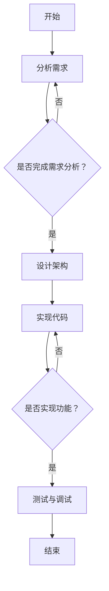

                 

### 第一部分：团队凝聚力的核心概念与背景

#### 1.1 团队凝聚力概述

**问题提出：**  
在当今快速变化和高度竞争的商业环境中，团队凝聚力成为组织成功的关键因素之一。然而，团队凝聚力究竟是什么？它如何影响团队的表现？为了回答这些问题，我们需要首先理解团队凝聚力的定义、重要性及其与团队效能的关系。

**定义：**  
团队凝聚力是指团队成员之间在情感、态度和行为上的相互吸引、相互依赖以及彼此认同的程度。这种凝聚力可以表现为团队成员之间的信任、协作、共同目标和互相支持。

**重要性：**  
团队凝聚力的重要性体现在多个方面。首先，它能够提升团队的工作效率，使团队成员能够更好地协作，共同实现团队目标。其次，高凝聚力的团队往往具有较高的员工满意度和较低的离职率。最后，团队凝聚力有助于促进创新和解决问题，从而提升组织的竞争力。

**团队凝聚力与团队效能的关系：**  
团队效能是指团队完成其目标的能力。团队凝聚力与团队效能之间存在密切的联系。研究表明，高凝聚力的团队往往表现出更高的效能，因为他们能够更好地协调合作、分担责任和相互支持。相反，低凝聚力的团队则可能面临沟通不畅、目标不明确和内部冲突等问题，从而影响其效能。

#### 1.2 团队凝聚力的影响因素

团队凝聚力的形成受到多种因素的影响。以下是一些关键的影响因素：

**组织文化：**  
组织文化是指组织内部共享的价值观、信念和行为准则。一个积极、开放和包容的组织文化有助于增强团队凝聚力。相反，一个强调竞争和孤立的文化则可能导致团队凝聚力的下降。

**领导风格：**  
领导风格对团队凝聚力有重要影响。参与式领导和民主式领导往往能够增强团队凝聚力，因为这种领导方式鼓励团队成员参与决策、表达意见和建议。而独裁式领导则可能导致团队成员感到压抑和缺乏参与感，从而降低团队凝聚力。

**团队成员的个性与背景：**  
团队成员的个性、价值观和背景差异也会影响团队凝聚力。一个多元化的团队在价值观和背景方面可能存在差异，但这些差异也可以成为团队凝聚力的源泉。关键在于如何通过有效的沟通和协作来整合这些差异。

#### 1.3 团队凝聚力的影响因素

团队凝聚力的影响因素包括以下几个方面：

1. **共同目标：** 团队成员共同的目标是团队凝聚力的基础。当团队成员共同追求一个目标时，他们更可能相互支持和合作，从而增强团队凝聚力。

2. **信任：** 团队成员之间的信任是团队凝聚力的重要组成部分。信任可以减少团队内部的猜疑和冲突，促进更好的沟通和协作。

3. **团队互动：** 团队成员之间的互动和交流有助于建立情感联系，增强团队凝聚力。定期的团队活动和交流可以提高团队成员之间的了解和信任。

4. **领导支持：** 领导的支持和鼓励对于团队凝聚力至关重要。领导可以通过提供资源、解决问题和认可团队成员的贡献来增强团队凝聚力。

5. **外部压力：** 外部压力，如市场竞争和项目截止日期，也可能影响团队凝聚力。适度的外部压力可以激发团队成员的斗志和合作精神，但过度的压力则可能导致团队凝聚力的下降。

通过深入理解团队凝聚力的核心概念、影响因素及其重要性，我们可以为建立高凝聚力的团队奠定基础。在接下来的章节中，我们将进一步探讨团队凝聚力的影响因素、建立团队凝聚力的策略以及实际案例分析。

---

#### 1.2 团队凝聚力相关概念

为了全面理解团队凝聚力，我们需要深入探讨与其相关的几个关键概念：团队协作、团队信任和团队归属感。这些概念不仅有助于我们更好地理解团队凝聚力的本质，还能为我们提供有效的策略来提升团队凝聚力。

**1.2.1 团队协作**

团队协作是指团队成员为了共同的目标和任务而进行的相互配合和合作。协作是团队凝聚力的重要体现，它涉及到团队成员之间的沟通、协调和共同努力。

- **协作的重要性：**  
  团队协作能够提高工作效率，促进创新，增强团队成员之间的信任和合作精神。通过协作，团队成员可以发挥各自的优势，共同解决问题，实现团队目标。

- **协作的特征：**  
  团队协作通常具有以下特征：
  - **共同目标：** 团队成员为了共同的目标而努力，这有助于增强团队凝聚力。
  - **资源共享：** 团队成员共享资源和信息，提高整体效率。
  - **相互依赖：** 团队成员之间相互依赖，一个人或一个环节的失误都可能影响整个团队的工作。

- **协作的障碍：**  
  尽管团队协作有许多优势，但也会面临一些障碍，如沟通不畅、角色模糊、资源不足等。克服这些障碍需要团队成员和领导的有效沟通和协调。

**1.2.2 团队信任**

团队信任是指团队成员对彼此的诚实、可靠性和能力的信任。信任是团队凝聚力的关键要素，它能够减少团队内部的猜疑和冲突，促进更好的合作和沟通。

- **信任的重要性：**  
  信任是团队协作的基础。在一个信任度高的团队中，成员更愿意分享自己的想法和意见，更愿意为团队的利益而共同努力。这种信任能够显著提升团队的凝聚力和效能。

- **建立信任的方法：**  
  要建立团队信任，可以采取以下方法：
  - **开放沟通：** 通过定期的会议和沟通，团队成员可以分享信息、意见和建议，增强透明度和信任感。
  - **一致行动：** 团队成员的一致行动和共同遵守的规则能够增强彼此的信任。
  - **认可与赞赏：** 领导和团队成员应该认可和赞赏他人的贡献，建立积极的反馈机制。

- **信任的挑战：**  
  建立信任并不容易，尤其是在团队成员背景和文化差异较大的团队中。克服这些挑战需要时间、耐心和持续的努力。

**1.2.3 团队归属感**

团队归属感是指团队成员对团队的认同和忠诚度。它反映了团队成员对团队的投入和责任感，是团队凝聚力的重要组成部分。

- **归属感的重要性：**  
  团队归属感能够增强团队成员的忠诚度和工作积极性，降低离职率。一个具有高度归属感的团队往往表现出更强的凝聚力和创新能力。

- **归属感的特征：**  
  团队归属感通常具有以下特征：
  - **群体认同：** 成员对团队的认同和归属感，愿意为团队的利益而努力。
  - **忠诚度：** 成员对团队的忠诚和责任感，即使在面对困难和挑战时也不轻易放弃。
  - **相互支持：** 成员之间的相互支持和帮助，形成紧密的团队关系。

- **培养归属感的方法：**  
  要培养团队归属感，可以采取以下方法：
  - **团队文化：** 建立积极的团队文化，强调团队合作和共同目标。
  - **共同经历：** 通过共同的项目、活动和挑战，增强团队成员之间的联系和信任。
  - **认可与激励：** 通过认可和激励，增强团队成员的成就感和归属感。

通过深入理解团队协作、团队信任和团队归属感，我们可以更好地把握团队凝聚力的本质和提升策略。在接下来的章节中，我们将进一步探讨团队凝聚力的重要性以及如何通过具体的策略来提升团队凝聚力。

### 2.2 概念属性特征对比

为了更清晰地理解团队协作、团队信任和团队归属感这三个核心概念，我们可以通过一个表格来对比它们的属性特征。以下是一个详细的对比表格：

| 概念         | 特征               |
|--------------|--------------------|
| 团队协作     | 共同目标、资源共享、相互依赖、沟通顺畅 |
| 团队信任     | 诚实、可靠性、相互支持、透明度       |
| 团队归属感   | 群体认同、忠诚度、责任感、投入感     |

**团队协作：**

- **共同目标**：团队成员共同追求一个明确的目标，这有助于增强团队的凝聚力和工作效率。
- **资源共享**：团队成员分享信息和资源，提高整体效率，减少重复劳动。
- **相互依赖**：团队成员之间的相互依赖关系，确保一个成员的成功也意味着其他成员的成功。
- **沟通顺畅**：有效的沟通是团队协作的关键，确保信息传递无误，减少误解和冲突。

**团队信任：**

- **诚实**：团队成员之间保持诚实，公开透明，不隐瞒信息。
- **可靠性**：团队成员能够履行自己的承诺，可靠地完成任务。
- **相互支持**：团队成员在遇到困难时相互支持，共同面对挑战。
- **透明度**：团队内部的信息和决策过程公开透明，减少猜疑和误解。

**团队归属感：**

- **群体认同**：团队成员认同自己是团队的一部分，愿意为团队的利益而努力。
- **忠诚度**：团队成员对团队有强烈的忠诚感，即使在面对困难时也不轻易离开。
- **责任感**：团队成员对自己的工作和团队的成功有责任感，愿意承担责任。
- **投入感**：团队成员对团队的投入程度高，愿意为团队付出时间和精力。

通过这个对比表格，我们可以更清晰地看到这三个概念之间的区别和联系，从而在实际工作中更好地运用这些概念来提升团队凝聚力。

### 2.3 ER实体关系图

为了进一步理解团队凝聚力相关概念之间的联系，我们可以使用ER（实体关系）图来展示这些概念之间的关系。以下是一个ER实体关系图，其中包含了团队、成员、领导、组织文化等实体以及它们之间的关联。

```mermaid
erDiagram
  Team ||--|{ Member }|
  Team ||--|{ Leader }|
  Team ||--|{ Organizational Culture }|
  Member ||--|{ Team Interaction }|
  Leader ||--|{ Team }|
  Organizational Culture ||--|{ Team }|
```

**实体关系说明：**

- **Team（团队）**：表示一个工作小组，由多个成员组成，具有共同的目标和任务。
- **Member（成员）**：表示团队成员，他们参与团队工作，与团队领导和组织文化有直接关联。
- **Leader（领导）**：表示团队的领导者，负责指导和协调团队成员，确保团队目标的实现。
- **Organizational Culture（组织文化）**：表示组织内部共享的价值观、信念和行为准则，影响团队凝聚力和成员行为。

**关系说明：**

- **团队与成员**：团队由多个成员组成，成员是团队的基本单位。
- **团队与领导**：领导是团队的核心，负责指导和激励团队成员。
- **团队与组织文化**：团队处于组织文化的环境中，组织文化影响团队的行为和凝聚力。
- **成员与团队互动**：成员通过互动和交流，增强团队凝聚力和协作能力。
- **领导与团队**：领导通过制定目标和提供支持，增强团队凝聚力和效能。

通过ER实体关系图，我们可以更直观地看到团队凝聚力相关概念之间的复杂联系，这有助于我们更好地理解这些概念在实际工作中的相互作用和影响。

### 第3章：团队凝聚力的重要性

#### 3.1 对个人的影响

团队凝聚力对个人有着深远的影响，这种影响不仅体现在工作表现上，还渗透到个人的心理健康和职业发展。以下是团队凝聚力对个人的几个关键影响：

**1. 提升工作满意度：**  
团队凝聚力高的团队往往能够提供更加和谐和积极的工作环境，这有助于提升员工的工作满意度。当团队成员之间相互信任、支持和协作时，员工更愿意投入工作，享受工作过程。这种积极的工作氛围能够显著提升员工的工作满意度和幸福感。

**2. 促进个人成长：**  
在团队凝聚力高的团队中，个人能够获得更多的成长机会。团队成员之间的协作和交流能够促进知识分享和技能提升，使个人不断学习和进步。此外，一个支持性的团队环境也能够帮助员工克服困难，勇敢面对挑战，从而促进个人的职业发展。

**3. 增强心理健康：**  
团队凝聚力有助于减少工作压力和焦虑，增强员工的心理健康。在一个支持性强的团队中，员工感受到被理解和关心，这有助于缓解心理压力，提高心理韧性。团队凝聚力还能减少员工的工作倦怠，提高生活质量。

#### 3.2 对团队的影响

团队凝聚力对团队的整体表现具有显著的影响，以下是一些关键影响：

**1. 提高团队效能：**  
团队凝聚力高的团队通常能够更高效地完成工作任务。团队成员之间的信任和协作能够减少沟通障碍，提高工作效率。此外，团队凝聚力能够促进团队成员之间的知识共享和资源整合，从而提高团队的创新能力和问题解决能力。

**2. 降低离职率：**  
团队凝聚力高的团队往往具有更高的员工忠诚度，这有助于降低员工的离职率。当员工感受到团队的归属感和信任时，他们更愿意长期留在组织内。这种高留存率不仅有助于减少招聘和培训成本，还能保持团队的稳定性和连续性。

**3. 增强创新能力：**  
团队凝聚力能够激发团队成员的创新思维和创造力。在一个支持性的团队环境中，员工更愿意分享自己的观点和想法，提出改进建议。这种开放的沟通氛围能够促进创新，使团队能够更好地应对市场变化和挑战。

#### 3.3 对组织的影响

团队凝聚力不仅对个人和团队有重要影响，还对整个组织的发展产生深远的影响：

**1. 提升组织竞争力：**  
团队凝聚力高的组织往往能够更有效地应对市场竞争。高凝聚力的团队能够更快速地响应市场变化，开发新产品和服务，从而提升组织的竞争力。此外，团队凝聚力有助于建立组织的品牌形象，增强客户忠诚度。

**2. 促进组织发展：**  
团队凝聚力能够促进组织的整体发展。一个凝聚力强的组织能够更好地实现其战略目标，保持长期的稳定增长。团队凝聚力还能促进组织文化的建设，增强组织内部的协调和协作。

**3. 增强组织凝聚力：**  
团队凝聚力不仅体现在团队层面，还能影响整个组织的凝聚力。当各个团队之间具有较高的凝聚力时，组织整体也会表现出更强的凝聚力。这种整体的凝聚力有助于提高组织的效能和适应性，使组织能够更好地应对外部挑战。

通过深入理解团队凝聚力对个人、团队和组织的影响，我们可以认识到团队凝聚力在组织成功中的关键作用。在接下来的章节中，我们将探讨如何通过具体的策略来提升团队凝聚力。

### 第4章：建立团队凝聚力的策略

#### 4.1 设定共同目标

设定共同目标是建立团队凝聚力的第一步。共同目标不仅为团队提供了明确的方向，还能够激发团队成员的积极性和投入感。以下是一些具体的策略，帮助团队设定共同目标：

**1. 明确团队目标：**  
首先，团队需要明确其目标，这些目标应该具体、可衡量和可实现。团队领导可以组织一次会议，让每个成员都参与目标的制定过程。通过这种方式，团队成员会对目标有更深刻的理解和认同。

**2. 建立共同愿景：**  
除了具体目标，团队还需要一个共同的愿景。这个愿景应该能够激发团队成员的激情和动力，使他们愿意为团队的未来付出努力。愿景可以是一个长期的目标，如公司的发展战略或产品的创新方向。

**3. 设定可实现的里程碑：**  
为了确保团队成员对目标的认同和持续投入，团队可以设定一系列可实现的里程碑。这些里程碑应该是具体、可衡量和可追踪的，有助于团队在实现最终目标的过程中保持动力和信心。

**4. 激励和反馈：**  
在实现目标的过程中，团队领导需要不断激励和反馈团队成员。通过定期的评估和反馈，团队成员可以了解自己的表现，及时调整策略，确保团队目标能够顺利实现。

#### 4.2 增强团队信任

增强团队信任是提升团队凝聚力的关键因素。信任能够减少团队内部的猜疑和冲突，促进更好的合作和沟通。以下是一些具体的策略，帮助团队增强信任：

**1. 开放沟通：**  
开放沟通是建立信任的基础。团队领导应该鼓励团队成员之间进行坦诚的沟通，分享想法、意见和建议。通过定期的团队会议和讨论，团队成员可以更好地了解彼此，增强信任感。

**2. 公平对待：**  
公平对待是建立信任的关键。团队领导需要确保团队成员在资源分配、任务分配和奖励机制方面都受到公平对待。这种公平感能够增强团队成员对团队的信任和认同。

**3. 增进了解：**  
增进了解有助于减少误解和冲突。团队可以通过定期的团建活动和团队建设训练，帮助团队成员更好地了解彼此的背景、兴趣和价值观。这种了解能够促进团队成员之间的信任和合作。

**4. 解决冲突：**  
当团队内部出现冲突时，领导需要及时介入并解决。通过公平、公正和透明的处理方式，领导可以减少冲突的影响，维护团队的信任和凝聚力。

#### 4.3 培养团队归属感

培养团队归属感是提升团队凝聚力的重要策略。归属感能够增强团队成员的忠诚度和投入感，使团队更加紧密和高效。以下是一些具体的策略，帮助团队培养归属感：

**1. 建立团队文化：**  
团队文化是培养归属感的关键。团队领导可以通过制定共同的价值观和行为准则，建立一种积极的团队文化。这种文化应该强调团队合作、共同目标和互相支持。

**2. 提供支持与关怀：**  
团队成员在工作和生活中都需要支持与关怀。团队领导可以通过定期的员工关怀活动、心理健康支持和福利措施，帮助团队成员感受到团队的温暖和支持。

**3. 定期团队活动：**  
定期的团队活动有助于增强团队成员之间的联系和信任。团队可以通过团建活动、体育比赛和社交聚会等方式，促进团队成员之间的交流和互动。

**4. 鼓励员工参与决策：**  
鼓励员工参与决策能够增强他们的归属感和责任感。团队领导可以定期组织员工讨论会议，让员工参与到团队的决策过程中来，从而提高他们的参与感和归属感。

通过设定共同目标、增强团队信任和培养团队归属感，我们可以有效地提升团队凝聚力。这些策略不仅有助于团队在短期内取得更好的绩效，还能为团队的长远发展奠定坚实的基础。在接下来的章节中，我们将通过实际案例来展示这些策略在提升团队凝聚力方面的具体效果。

### 第5章：实际案例分析

#### 5.1 案例一：谷歌的团队文化

**背景介绍：**  
谷歌作为全球领先的科技公司，以其卓越的团队文化而著称。谷歌的团队文化强调创新、合作和自主性，这种文化对团队凝聚力的提升起到了重要作用。

**团队凝聚力措施：**  
1. **开放沟通**：谷歌鼓励员工之间的开放沟通，通过定期的团队会议、邮件和即时消息平台，员工可以自由地分享自己的想法和意见。
2. **鼓励创新**：谷歌为员工提供了广阔的创新空间，允许他们自由探索新的想法和技术。这种创新环境有助于增强团队成员之间的协作和信任。
3. **共享资源**：谷歌提供了丰富的资源共享平台，如代码库、知识库和云计算资源，这使得团队成员能够更高效地协同工作。
4. **团建活动**：谷歌定期组织各种团建活动，如团队旅游、体育比赛和社交聚会，这些活动有助于增强团队成员之间的情感联系和信任。
5. **认可与赞赏**：谷歌通过公开表彰和奖励机制，认可员工的贡献和成就，这有助于提升员工的归属感和工作积极性。

**案例分析：**  
通过这些措施，谷歌成功地建立了高凝聚力的团队。团队成员在开放和创新的环境中相互支持，共同追求团队目标。这种高凝聚力的团队不仅提高了工作效率和创新能力，还增强了员工的满意度和忠诚度。

**效果：**  
谷歌的团队文化显著提升了团队凝聚力，使其在市场竞争中保持领先地位。谷歌的员工离职率较低，员工满意度较高，这表明团队凝聚力对其员工保留和幸福感有积极影响。此外，谷歌的创新能力和市场竞争力也得益于其高凝聚力的团队。

#### 5.2 案例二：苹果公司的创新团队

**背景介绍：**  
苹果公司以其创新的产品和卓越的设计而闻名。苹果的创新团队在团队凝聚力的建立和维护方面有着独特的经验和做法。

**团队凝聚力措施：**  
1. **共同目标**：苹果的创新团队设定了明确的共同目标，即打造革命性的产品。这种共同目标激发了团队成员的创造力和合作精神。
2. **信任与支持**：苹果鼓励团队成员之间的信任和支持，通过定期的团队会议和项目评审，团队成员可以分享经验、建议和反馈。
3. **个性化发展**：苹果为团队成员提供个性化的发展机会，鼓励他们根据自己的兴趣和特长进行创新。这种个性化发展有助于增强团队成员的归属感和创新能力。
4. **团队合作**：苹果的创新团队强调团队合作，通过跨部门的项目和协作，团队成员能够相互学习和借鉴，共同推动项目的进展。
5. **激励与奖励**：苹果通过激励和奖励机制，鼓励团队成员为团队的成功贡献自己的力量。这种激励机制不仅提升了团队凝聚力，还激发了员工的创造力和工作热情。

**案例分析：**  
苹果的创新团队通过一系列措施，成功地建立了高凝聚力的团队。团队成员在共同目标、信任和支持的氛围中协同工作，不断创新，推动苹果公司在技术创新和产品设计方面保持领先地位。

**效果：**  
苹果的创新团队凝聚力显著提高了团队的工作效率和创新能力。团队成员的创造力和工作热情得到了充分发挥，这直接促进了苹果公司在市场上的成功。此外，苹果的创新团队也为公司吸引了大量优秀的人才，进一步增强了公司的竞争力。

通过这两个实际案例，我们可以看到，有效的团队凝聚力措施能够显著提升团队的工作效率和创新能力，从而推动组织的成功。这些案例也为我们提供了宝贵的经验，可以应用于其他组织的团队建设中。

### 第6章：最佳实践与注意事项

#### 6.1 最佳实践

为了有效提升团队凝聚力，以下是一些被证明有效的最佳实践：

**1. 定期团队建设活动：**  
定期组织团队建设活动，如团建、团队旅行和团队建设训练，有助于增强团队成员之间的情感联系和信任。这些活动不仅能够缓解工作压力，还能促进团队成员的相互了解和合作。

**2. 鼓励员工参与决策：**  
鼓励员工参与到团队和组织的决策过程中，能够增强他们的参与感和责任感。通过定期的讨论会议和意见征集，员工可以表达自己的观点和建议，从而增强团队的凝聚力。

**3. 建立激励机制：**  
建立有效的激励机制，如奖励、晋升和认可，能够激发团队成员的积极性和创造力。这些激励机制应该与团队的共同目标和价值观相一致，以增强团队的凝聚力。

**4. 培养积极的工作文化：**  
培养积极的工作文化，如鼓励创新、开放沟通和互相支持，有助于建立高凝聚力的团队。一个积极的工作文化能够促进团队成员之间的信任和合作，从而提升团队的整体效能。

#### 6.2 注意事项

尽管提升团队凝聚力具有重要意义，但在实施过程中也需要注意以下事项：

**1. 避免过度竞争：**  
过度竞争可能导致团队成员之间的猜疑和冲突，从而削弱团队凝聚力。在团队中，应该鼓励合作和协作，避免恶性竞争。

**2. 注意文化多样性：**  
团队成员来自不同的文化背景，这可能会对团队凝聚力产生影响。在团队建设中，应该尊重文化多样性，通过有效的沟通和协作来整合不同的文化差异。

**3. 定期评估团队凝聚力：**  
定期评估团队凝聚力，了解团队成员的感受和需求，有助于及时发现问题并采取措施。通过定期的评估，团队可以不断改进团队建设策略，提高团队凝聚力。

**4. 考虑团队规模：**  
团队规模对团队凝聚力有重要影响。在大型团队中，由于成员之间的互动较少，可能需要更多的努力来建立凝聚力。团队领导应该根据团队规模采取相应的策略来提升团队凝聚力。

通过遵循这些最佳实践和注意事项，团队可以更有效地提升凝聚力，从而在个人、团队和组织层面上实现更高的绩效和幸福感。

### 第7章：拓展阅读

为了进一步深入了解团队凝聚力及其相关领域，以下是一些推荐的相关书籍、论文和研究方向：

#### 7.1 相关书籍推荐

1. **《团队的五种性格》**：本书由知名管理学家丹·格罗塞尔和安妮·威尔逊撰写，详细阐述了团队凝聚力的五个关键性格，并提供实用的策略来提升团队绩效。

2. **《团队协作的艺术》**：作者史蒂芬·罗宾斯在这本书中探讨了团队协作的原理和实践，提供了丰富的案例和工具，帮助读者理解和提升团队协作能力。

3. **《团队凝聚力：理论与应用》**：作者艾略特·雅各布斯和约翰·霍华德在这本书中全面介绍了团队凝聚力的理论框架，并结合实际案例分析了如何在不同情境下提升团队凝聚力。

#### 7.2 论文与研究方向推荐

1. **“团队凝聚力与组织绩效的关系研究”**：这篇论文通过实证研究探讨了团队凝聚力对组织绩效的影响，分析了不同因素如何影响团队凝聚力和组织绩效之间的关系。

2. **“基于情感管理的团队凝聚力提升策略研究”**：这篇论文提出了基于情感管理的团队凝聚力提升策略，通过情感管理工具和方法，探讨了如何有效提升团队凝聚力和工作效率。

3. **“团队凝聚力、创新与竞争优势”**：这篇论文研究了团队凝聚力对创新能力和竞争优势的影响，分析了如何通过提升团队凝聚力来增强组织的创新能力和市场竞争力。

通过阅读这些书籍和论文，读者可以更深入地了解团队凝聚力的理论和实践，从而在实际工作中更好地应用这些知识来提升团队绩效。

### 结束语

#### 谢谢您的阅读！

在这篇文章中，我们深入探讨了团队凝聚力的核心概念、重要性以及建立团队凝聚力的策略。通过实际案例的分析，我们展示了如何在不同情境下提升团队凝聚力，从而实现个人、团队和组织的共同成长。我们希望这篇文章能够为您提供有价值的见解和实践指导。

**作者：AI天才研究院/AI Genius Institute & 禅与计算机程序设计艺术 /Zen And The Art of Computer Programming**

---

**附录：**

本文使用了Mermaid流程图和LaTeX数学公式，以下是相关示例代码和解释：

#### Mermaid流程图示例：



#### LaTeX数学公式示例：

- 独立段落的数学公式：

  $$ E = mc^2 $$

- 段落内的数学公式：

  $ 1 + 1 = 2 $

这些工具有助于提高文章的可读性和专业性，使技术博客内容更加丰富和直观。希望您在使用过程中能够充分利用这些工具，创作出高质量的技术博客文章。再次感谢您的阅读和支持！

