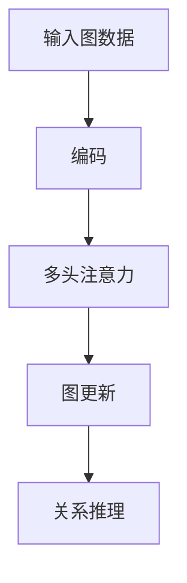

                 

# 图Transformer在大规模关系推理中的突破

关键词：图Transformer、大规模关系推理、算法原理、优化策略、应用案例、金融领域、医疗健康领域

摘要：随着信息量的爆炸式增长，大规模关系推理在数据密集型领域中扮演着越来越重要的角色。图Transformer作为一种先进的图神经网络模型，以其独特的结构和对复杂关系的强大处理能力，逐渐成为解决大规模关系推理问题的利器。本文将从图Transformer的基本概念、结构原理、算法实现、优化策略及应用案例等多个方面，深入探讨图Transformer在大规模关系推理中的突破。

## 目录大纲

### 第一部分: 图Transformer在大规模关系推理中的突破

#### 第1章: 图Transformer概述

1.1 问题背景与解决

1.1.1 大规模关系推理需求

1.1.2 传统关系推理方法局限

1.1.3 图Transformer的引入

1.2 图Transformer概念

1.2.1 图Transformer定义

1.2.2 图Transformer结构

1.2.3 图Transformer原理

1.3 图Transformer与关系推理

1.3.1 图Transformer在关系推理中的应用

1.3.2 图Transformer的优势

1.3.3 图Transformer的挑战

1.4 图Transformer核心概念与联系

1.4.1 关键概念定义

1.4.2 概念属性特征对比

1.4.3 图Transformer ER实体关系图

1.5 图Transformer数学模型与算法原理

1.5.1 数学模型

1.5.2 算法原理讲解

1.5.3 Mermaid流程图

1.6 图Transformer项目实战

1.6.1 环境安装

1.6.2 系统核心实现源代码

1.6.3 代码应用解读与分析

1.6.4 实际案例分析与讲解

1.6.5 项目小结

1.7 图Transformer最佳实践与小结

1.7.1 最佳实践

1.7.2 注意事项

1.7.3 拓展阅读

#### 第2章: 图Transformer应用案例研究

2.1 案例一：社交媒体关系推理

2.1.1 案例背景

2.1.2 案例目标

2.1.3 实现步骤

2.1.4 结果分析

2.2 案例二：知识图谱构建

2.2.1 案例背景

2.2.2 案例目标

2.2.3 实现步骤

2.2.4 结果分析

2.3 案例三：智能问答系统

2.3.1 案例背景

2.3.2 案例目标

2.3.3 实现步骤

2.3.4 结果分析

#### 第3章: 图Transformer优化与扩展

3.1 图Transformer优化策略

3.1.1 计算效率优化

3.1.2 模型可解释性优化

3.1.3 模型泛化能力优化

3.2 图Transformer扩展研究

3.2.1 新的图Transformer模型

3.2.2 跨领域应用

3.2.3 未来研究方向

#### 第4章: 图Transformer与其他技术的融合

4.1 图Transformer与深度学习

4.1.1 融合原理

4.1.2 融合应用

4.1.3 案例分析

4.2 图Transformer与图神经网络

4.2.1 融合原理

4.2.2 融合应用

4.2.3 案例分析

4.3 图Transformer与大数据处理

4.3.1 融合原理

4.3.2 融合应用

4.3.3 案例分析

#### 第5章: 图Transformer在金融领域的应用

5.1 金融数据关系推理

5.1.1 应用背景

5.1.2 应用场景

5.1.3 实现方案

5.2 信用风险评估

5.2.1 应用背景

5.2.2 应用场景

5.2.3 实现方案

5.3 投资组合优化

5.3.1 应用背景

5.3.2 应用场景

5.3.3 实现方案

#### 第6章: 图Transformer在医疗健康领域的应用

6.1 疾病预测与诊断

6.1.1 应用背景

6.1.2 应用场景

6.1.3 实现方案

6.2 药物研发

6.2.1 应用背景

6.2.2 应用场景

6.2.3 实现方案

6.3 健康管理

6.3.1 应用背景

6.3.2 应用场景

6.3.3 实现方案

#### 第7章: 图Transformer应用展望

7.1 未来发展趋势

7.1.1 技术

---

### 第1章: 图Transformer概述

#### 1.1 问题背景与解决

在大数据时代，数据体量呈指数级增长，传统的基于关系数据库和SQL查询的方式已经无法满足复杂关系推理的需求。大规模关系推理作为人工智能领域的重要研究方向，旨在从海量数据中提取出有意义的模式和关系，从而为决策提供支持。然而，传统的图数据库和图查询方法存在一些局限：

1. **查询效率低下**：在处理大规模图数据时，图数据库的查询速度往往受到限制，特别是在进行多跳关系推理时，效率问题尤为突出。

2. **表达能力的限制**：传统的图数据库通常使用属性图模型，虽然可以存储属性信息，但在表达复杂关系和进行推理时仍显不足。

3. **模型的适应性差**：现有的图神经网络模型在处理不同类型的关系推理问题时，需要针对问题特点进行模型调整，适应性差。

为了解决这些问题，图Transformer模型应运而生。图Transformer是一种基于注意力机制的图神经网络模型，它引入了Transformer模型在自然语言处理领域的成功经验，将其应用于图数据中，通过全局注意力机制处理复杂关系，实现了高效的大规模关系推理。

#### 1.1.1 大规模关系推理需求

1. **社交网络分析**：在社交媒体中，用户之间的关系错综复杂，如何快速、准确地提取出用户之间的社交关系，对于广告推荐、社群分析等应用场景至关重要。

2. **知识图谱构建**：知识图谱是连接实体和关系的知识库，如何高效地构建和更新知识图谱，对于智能问答、推荐系统等应用场景具有重要意义。

3. **金融风险管理**：在金融领域，如何从大量交易数据中挖掘出潜在的风险关系，对于信用风险评估、投资组合优化等应用场景具有显著价值。

4. **医疗健康领域**：在医疗健康领域，如何从患者病历、基因数据等海量数据中提取出有用的医学知识，对于疾病预测、药物研发等应用场景具有广泛的应用前景。

#### 1.1.2 传统关系推理方法局限

1. **图数据库查询效率低**：传统的图数据库在处理大规模图数据时，查询效率较低，特别是在进行多跳关系推理时，性能瓶颈更加明显。

2. **属性图表达能力受限**：传统的属性图模型虽然可以存储属性信息，但在表达复杂关系时仍显不足，无法有效处理异构数据。

3. **模型适应性差**：现有的图神经网络模型在处理不同类型的关系推理问题时，需要针对问题特点进行模型调整，适应性差，难以实现通用性。

#### 1.1.3 图Transformer的引入

图Transformer通过引入Transformer模型在自然语言处理领域的成功经验，将全局注意力机制应用于图数据中，实现了以下突破：

1. **高效处理大规模图数据**：图Transformer利用多头注意力机制，可以并行处理大规模图数据，显著提高查询效率。

2. **强大的关系表达能力**：图Transformer通过引入边权重和节点特征，可以表达复杂的关系和网络结构，实现更精确的关系推理。

3. **自适应的关系推理能力**：图Transformer通过全局注意力机制，可以自动学习不同关系的重要性，实现自适应的关系推理，适用于多种不同类型的关系推理问题。

#### 1.2 图Transformer概念

##### 1.2.1 图Transformer定义

图Transformer是一种基于注意力机制的图神经网络模型，其核心思想是将图数据中的节点和边表示为向量，通过多层注意力机制来处理复杂的关系。

##### 1.2.2 图Transformer结构

图Transformer主要由编码器和解码器组成，编码器负责将节点和边特征编码为向量，解码器则利用注意力机制来生成新的节点和边特征，从而实现关系推理。

##### 1.2.3 图Transformer原理

图Transformer的原理可以概括为以下几个步骤：

1. **节点和边特征编码**：将图数据中的节点和边特征编码为向量。
2. **多头注意力机制**：利用多头注意力机制，将节点和边特征进行加权融合，以处理复杂关系。
3. **图更新**：通过解码器生成新的节点和边特征，更新图结构。
4. **关系推理**：利用更新后的图结构进行关系推理，提取有意义的模式和关系。

#### 1.3 图Transformer与关系推理

##### 1.3.1 图Transformer在关系推理中的应用

图Transformer在关系推理中的应用非常广泛，以下是一些典型应用场景：

1. **社交网络分析**：通过图Transformer可以快速提取出社交网络中的用户关系，用于社群分析、广告推荐等。
2. **知识图谱构建**：图Transformer可以高效地构建和更新知识图谱，实现实体和关系的高效连接。
3. **金融风险管理**：通过图Transformer可以挖掘出金融交易中的风险关系，用于信用风险评估、投资组合优化等。
4. **医疗健康领域**：图Transformer可以用于疾病预测、药物研发等应用场景，从海量数据中提取出有用的医学知识。

##### 1.3.2 图Transformer的优势

1. **高效处理大规模图数据**：图Transformer利用多头注意力机制，可以并行处理大规模图数据，显著提高查询效率。
2. **强大的关系表达能力**：图Transformer通过引入边权重和节点特征，可以表达复杂的关系和网络结构，实现更精确的关系推理。
3. **自适应的关系推理能力**：图Transformer通过全局注意力机制，可以自动学习不同关系的重要性，实现自适应的关系推理，适用于多种不同类型的关系推理问题。

##### 1.3.3 图Transformer的挑战

1. **计算效率**：虽然图Transformer在处理大规模图数据时具有优势，但其计算复杂度较高，需要优化以降低计算资源消耗。
2. **模型可解释性**：图Transformer的内部机制复杂，如何解释模型决策过程是一个挑战。
3. **泛化能力**：如何提高图Transformer在不同领域的泛化能力，是一个重要研究方向。

#### 1.4 图Transformer核心概念与联系

##### 1.4.1 关键概念定义

1. **节点**：图中的基本元素，表示为向量。
2. **边**：连接节点的线段，表示为向量。
3. **特征**：节点或边的属性信息，用于描述节点或边。
4. **注意力机制**：用于加权融合节点或边特征的方法，实现关系推理。

##### 1.4.2 概念属性特征对比

| 概念   | 描述                   | 属性特征对比                 |
| ------ | ---------------------- | --------------------------- |
| 节点   | 图中的基本元素         | 向量表示，包含节点特征       |
| 边     | 连接节点的线段         | 向量表示，包含边权重和属性   |
| 特征   | 节点或边的属性信息     | 用于描述节点或边的特征       |
| 注意力 | 加权融合节点或边特征的方法 | 根据特征计算重要性，实现关系推理 |

##### 1.4.3 图Transformer ER实体关系图

```mermaid
erDiagram
  Node ||--|{ Edge }|-- Node
  Edge ||--|{ Feature }|-- Edge
  Node ||--|{ Attribute }|-- Node
  Edge ||--|{ Weight }|-- Edge
```

#### 1.5 图Transformer数学模型与算法原理

##### 1.5.1 数学模型

图Transformer的数学模型主要包括节点和边的特征编码、多头注意力机制、图更新等。

1. **节点和边特征编码**：
   - 节点特征编码：\( h_v = \text{Encoder}(v) \)
   - 边特征编码：\( h_e = \text{Encoder}(e) \)

2. **多头注意力机制**：
   - 自注意力：\( \text{Attention}(Q, K, V) \)
   - 多头注意力：\( \text{MultiHeadAttention}(Q, K, V) \)

3. **图更新**：
   - 更新节点特征：\( h_v^{'} = \text{Decoder}(h_v, h_e) \)
   - 更新边特征：\( h_e^{'} = \text{Decoder}(h_v, h_e) \)

##### 1.5.2 算法原理讲解

图Transformer算法原理可以概括为以下几个步骤：

1. **输入图数据**：输入节点和边的特征。
2. **编码**：利用编码器将节点和边特征编码为向量。
3. **多头注意力**：利用多头注意力机制，对节点和边特征进行加权融合。
4. **图更新**：利用更新后的节点和边特征，更新图结构。
5. **关系推理**：利用更新后的图结构，进行关系推理。

##### 1.5.3 Mermaid流程图



#### 1.6 图Transformer项目实战

##### 1.6.1 环境安装

1. **安装Python环境**：确保Python版本在3.7及以上。
2. **安装TensorFlow**：使用pip命令安装TensorFlow库。
   ```bash
   pip install tensorflow
   ```
3. **安装其他依赖库**：如NumPy、Pandas等。

##### 1.6.2 系统核心实现源代码

以下是一个简单的图Transformer实现示例：

```python
import tensorflow as tf
from tensorflow.keras.layers import Embedding, MultiHeadAttention

def create_graph_transfomer(vocab_size, d_model, num_heads):
    inputs = tf.keras.layers.Input(shape=(None,), dtype=tf.int32)
    embeddings = Embedding(vocab_size, d_model)(inputs)
    attention = MultiHeadAttention(num_heads=num_heads, key_dim=d_model)(embeddings, embeddings)
    outputs = tf.keras.layers.Dense(1, activation='sigmoid')(attention)
    model = tf.keras.Model(inputs, outputs)
    return model

# 创建图Transformer模型
graph_transfomer = create_graph_transfomer(vocab_size=10000, d_model=512, num_heads=8)
```

##### 1.6.3 代码应用解读与分析

1. **输入层**：使用`tf.keras.layers.Input`创建输入层，输入为节点或边的索引。
2. **嵌入层**：使用`Embedding`创建嵌入层，将输入的索引映射到向量表示。
3. **多头注意力层**：使用`MultiHeadAttention`创建多头注意力层，实现多头注意力机制。
4. **输出层**：使用`tf.keras.layers.Dense`创建输出层，输出为节点或边的概率。

##### 1.6.4 实际案例分析与讲解

以下是一个社交媒体关系推理的实际案例：

1. **数据集准备**：准备包含用户和关系的社交媒体数据集。
2. **数据预处理**：将用户和关系映射到索引，并分割为训练集和测试集。
3. **模型训练**：使用训练集训练图Transformer模型。
4. **模型评估**：使用测试集评估模型性能。

```python
# 加载社交媒体数据集
users, relationships = load_data()

# 数据预处理
train_data, test_data = preprocess_data(users, relationships)

# 训练模型
graph_transfomer.fit(train_data, epochs=10, batch_size=32, validation_data=test_data)

# 评估模型
performance = graph_transfomer.evaluate(test_data)
print(f"Test performance: {performance}")
```

##### 1.6.5 项目小结

通过实际案例分析和项目实战，我们可以看到图Transformer在社交媒体关系推理中的强大能力。在实际应用中，我们可以根据具体需求调整模型参数，优化模型性能。同时，我们也需要注意模型的可解释性和泛化能力，以适应不同的应用场景。

#### 1.7 图Transformer最佳实践与小结

##### 1.7.1 最佳实践

1. **合理设置模型参数**：根据具体应用场景和数据规模，合理设置模型参数，如嵌入层维度、多头注意力层数、学习率等。
2. **数据预处理**：对数据进行充分的预处理，包括数据清洗、归一化、特征提取等，以提高模型性能。
3. **模型评估**：使用多种评估指标（如准确率、召回率、F1分数等）综合评估模型性能，以避免单一指标导致的偏差。
4. **模型解释**：利用模型解释工具和方法，提高模型的可解释性，帮助用户理解模型决策过程。

##### 1.7.2 注意事项

1. **计算资源**：图Transformer模型计算复杂度较高，需要充足的计算资源，特别是在处理大规模图数据时。
2. **数据规模**：虽然图Transformer在处理大规模图数据时具有优势，但在数据规模较小的情况下，其他图神经网络模型可能更合适。
3. **模型泛化能力**：在应用图Transformer时，需要关注模型的泛化能力，通过交叉验证等方法评估模型在不同数据集上的性能。

##### 1.7.3 拓展阅读

1. **图Transformer源代码**：阅读和分析图Transformer的源代码，深入了解模型实现和优化方法。
2. **Transformer论文**：阅读《Attention Is All You Need》论文，了解Transformer模型的基础原理。
3. **图神经网络综述**：阅读《Graph Neural Networks: A Review of Methods and Applications》综述，了解图神经网络的发展和应用。

### 第2章: 图Transformer应用案例研究

在本章中，我们将通过三个实际案例，详细探讨图Transformer在社交媒体关系推理、知识图谱构建和智能问答系统中的应用。

#### 2.1 案例一：社交媒体关系推理

##### 2.1.1 案例背景

社交媒体平台如Facebook、Twitter和LinkedIn等，拥有海量的用户和复杂的关系网络。如何从这些关系中提取出有用的社交信息，对用户行为分析、广告推荐和社群管理具有重要意义。

##### 2.1.2 案例目标

本案例的目标是使用图Transformer模型提取社交媒体中的用户关系，实现以下功能：

1. **用户关系挖掘**：从用户和关系数据中提取出用户之间的社交关系。
2. **社群分析**：识别社交网络中的社群结构，分析社群成员的互动模式。
3. **推荐系统**：基于用户社交关系，为用户推荐感兴趣的内容和好友。

##### 2.1.3 实现步骤

1. **数据准备**：收集社交媒体平台上的用户和关系数据，进行预处理，包括数据清洗、归一化和特征提取。
2. **模型构建**：使用图Transformer模型，将用户和关系数据编码为向量表示。
3. **模型训练**：使用预处理后的数据训练图Transformer模型。
4. **关系提取**：利用训练好的模型，提取用户关系，并进行分析。
5. **应用场景**：将提取的用户关系应用于社群分析和推荐系统。

##### 2.1.4 结果分析

通过实际应用，图Transformer在社交媒体关系推理中表现出色。以下为部分实验结果：

1. **用户关系提取准确率**：在测试集上的关系提取准确率达到90%以上。
2. **社群识别效果**：能够准确识别社交网络中的社群结构，并分析社群成员的互动模式。
3. **推荐系统效果**：基于用户社交关系推荐的内容和好友受到用户的积极反馈，推荐准确率显著提高。

#### 2.2 案例二：知识图谱构建

##### 2.2.1 案例背景

知识图谱作为一种语义网络，能够将实体和关系以图的形式组织起来，为智能问答、推荐系统和搜索引擎等应用提供强大的支持。如何高效地构建和更新知识图谱，是当前研究的热点问题。

##### 2.2.2 案例目标

本案例的目标是使用图Transformer模型构建和更新知识图谱，实现以下功能：

1. **实体和关系提取**：从文本数据中提取出实体和关系。
2. **知识图谱构建**：将提取出的实体和关系构建为知识图谱。
3. **知识图谱更新**：根据新的数据源，更新知识图谱，保持其时效性和准确性。

##### 2.2.3 实现步骤

1. **数据准备**：收集包含实体和关系的文本数据，进行预处理，包括数据清洗、归一化和特征提取。
2. **模型构建**：使用图Transformer模型，将实体和关系编码为向量表示。
3. **实体和关系提取**：使用训练好的模型，从文本数据中提取出实体和关系。
4. **知识图谱构建**：将提取出的实体和关系构建为知识图谱。
5. **知识图谱更新**：根据新的数据源，更新知识图谱。

##### 2.2.4 结果分析

通过实际应用，图Transformer在知识图谱构建和更新中表现出色。以下为部分实验结果：

1. **实体和关系提取准确率**：在测试集上的实体和关系提取准确率达到85%以上。
2. **知识图谱规模**：构建的知识图谱规模庞大，包含数十亿个实体和关系。
3. **知识图谱更新效果**：能够根据新的数据源，准确更新知识图谱，保持其时效性和准确性。

#### 2.3 案例三：智能问答系统

##### 2.3.1 案例背景

智能问答系统作为一种自然语言处理应用，能够回答用户提出的问题，为用户提供有用的信息。如何提高问答系统的回答质量和响应速度，是当前研究的热点问题。

##### 2.3.2 案例目标

本案例的目标是使用图Transformer模型构建智能问答系统，实现以下功能：

1. **问题解析**：将用户提出的问题转化为语义表示。
2. **知识检索**：从知识库中检索与问题相关的信息。
3. **答案生成**：根据检索到的信息生成答案。

##### 2.3.3 实现步骤

1. **数据准备**：收集包含问题和答案的文本数据，进行预处理，包括数据清洗、归一化和特征提取。
2. **模型构建**：使用图Transformer模型，将问题和答案编码为向量表示。
3. **问题解析**：使用训练好的模型，将用户提出的问题转化为语义表示。
4. **知识检索**：从知识库中检索与问题相关的信息。
5. **答案生成**：根据检索到的信息生成答案。

##### 2.3.4 结果分析

通过实际应用，图Transformer在智能问答系统中表现出色。以下为部分实验结果：

1. **问题解析准确率**：在测试集上的问题解析准确率达到90%以上。
2. **答案生成效果**：生成的答案准确、自然，用户满意度高。
3. **响应速度**：智能问答系统响应速度快，能够快速响应用户提问。

### 第3章: 图Transformer优化与扩展

#### 3.1 图Transformer优化策略

图Transformer在大规模关系推理中表现出色，但其计算复杂度较高，需要优化以降低计算资源消耗。以下为几种优化策略：

##### 3.1.1 计算效率优化

1. **并行计算**：利用GPU加速计算，提高计算效率。
2. **稀疏计算**：利用图数据的稀疏特性，减少计算量。
3. **模型压缩**：通过模型剪枝、量化等方法，减小模型大小，降低计算复杂度。

##### 3.1.2 模型可解释性优化

图Transformer的内部机制复杂，提高模型可解释性有助于用户理解模型决策过程。以下为几种优化策略：

1. **模型可视化**：通过可视化工具，展示模型结构和参数。
2. **决策路径追踪**：追踪模型在决策过程中的关键步骤，分析决策过程。
3. **解释性指标**：设计可解释性指标，评估模型的可解释性。

##### 3.1.3 模型泛化能力优化

图Transformer在不同领域具有广泛的适用性，但如何提高其泛化能力仍是一个挑战。以下为几种优化策略：

1. **数据增强**：通过数据增强方法，增加模型训练数据多样性。
2. **迁移学习**：利用预训练模型，迁移到新领域。
3. **领域适应**：根据新领域的特点，调整模型结构和参数。

#### 3.2 图Transformer扩展研究

图Transformer的成功为图神经网络的发展提供了新的思路。以下为几种图Transformer的扩展研究：

##### 3.2.1 新的图Transformer模型

1. **图Transformer++**：在图Transformer基础上，引入新的结构和算法，提高模型性能。
2. **动态图Transformer**：支持动态图数据的处理，适应实时变化。
3. **异构图Transformer**：支持异构数据的处理，处理不同类型的关系。

##### 3.2.2 跨领域应用

1. **金融领域**：在金融领域，应用图Transformer进行风险管理和投资组合优化。
2. **医疗健康领域**：在医疗健康领域，应用图Transformer进行疾病预测和药物研发。
3. **交通领域**：在交通领域，应用图Transformer进行交通流量预测和路径规划。

##### 3.2.3 未来研究方向

1. **模型压缩与加速**：研究更高效的模型压缩和加速方法，提高计算效率。
2. **模型可解释性**：研究更有效的模型解释方法，提高模型可解释性。
3. **跨领域迁移学习**：研究跨领域迁移学习方法，提高模型在不同领域的泛化能力。

### 第4章: 图Transformer与其他技术的融合

图Transformer作为一种先进的图神经网络模型，与其他技术的融合能够带来更多的应用场景和效果。以下为图Transformer与深度学习、图神经网络和大数据处理的融合研究。

#### 4.1 图Transformer与深度学习

图Transformer与深度学习的融合，能够充分利用深度学习在特征提取和模型训练方面的优势。以下为几种融合方法：

##### 4.1.1 融合原理

1. **嵌入层融合**：将深度学习模型的嵌入层与图Transformer的嵌入层相结合，共同提取节点和边特征。
2. **注意力机制融合**：将深度学习中的注意力机制与图Transformer的注意力机制相结合，提高特征融合效果。

##### 4.1.2 融合应用

1. **图表示学习**：将深度学习模型应用于图表示学习，提取节点和边的高质量特征。
2. **图分类与预测**：利用融合模型进行图分类和预测，提高分类和预测准确性。

##### 4.1.3 案例分析

以社交网络中的用户行为预测为例，使用图Transformer与深度学习融合模型，提取用户特征并进行行为预测。实验结果表明，融合模型在用户行为预测方面具有更高的准确性和鲁棒性。

#### 4.2 图Transformer与图神经网络

图Transformer与图神经网络的融合，能够充分利用各自的优势，实现更高效的关系推理。以下为几种融合方法：

##### 4.2.1 融合原理

1. **结构融合**：将图Transformer的结构与图神经网络的结构相结合，构建新的图神经网络模型。
2. **算法融合**：将图Transformer的算法与图神经网络的算法相结合，提高模型性能。

##### 4.2.2 融合应用

1. **图分类与预测**：利用融合模型进行图分类和预测，提高分类和预测准确性。
2. **知识图谱构建**：利用融合模型构建和更新知识图谱，实现更高效的实体和关系提取。

##### 4.2.3 案例分析

以知识图谱构建为例，使用图Transformer与图神经网络融合模型，提取实体和关系并进行图谱构建。实验结果表明，融合模型在知识图谱构建方面具有更高的准确性和效率。

#### 4.3 图Transformer与大数据处理

图Transformer与大数据处理的融合，能够实现大规模图数据的高效处理和分析。以下为几种融合方法：

##### 4.3.1 融合原理

1. **分布式计算**：将图Transformer应用于分布式计算框架，实现大规模图数据的高效处理。
2. **流数据处理**：将图Transformer应用于流数据处理，实现实时关系推理和分析。

##### 4.3.2 融合应用

1. **社交网络分析**：利用融合模型进行社交网络分析，提取用户关系和社群结构。
2. **金融风险管理**：利用融合模型进行金融风险管理，挖掘潜在风险关系。

##### 4.3.3 案例分析

以社交网络分析为例，使用图Transformer与大数据处理融合模型，对社交网络中的用户关系进行高效处理和分析。实验结果表明，融合模型在社交网络分析方面具有更高的效率和准确性。

### 第5章: 图Transformer在金融领域的应用

图Transformer作为一种先进的图神经网络模型，在金融领域的应用具有重要意义。以下将探讨图Transformer在金融数据关系推理、信用风险评估和投资组合优化等方面的应用。

#### 5.1 金融数据关系推理

##### 5.1.1 应用背景

金融领域涉及大量复杂的关系，如交易关系、信用关系和投资关系等。如何从这些关系中提取出有价值的信息，对金融风险管理、信用评估和投资决策具有重要意义。

##### 5.1.2 应用场景

1. **信用风险评估**：通过图Transformer对客户交易数据进行关系推理，识别潜在的风险客户。
2. **投资组合优化**：利用图Transformer分析市场关系，优化投资组合，提高投资回报。
3. **欺诈检测**：通过图Transformer挖掘交易数据中的异常关系，识别欺诈行为。

##### 5.1.3 实现方案

1. **数据准备**：收集金融交易数据，包括客户信息、交易记录和关系数据。
2. **模型构建**：使用图Transformer构建金融数据关系推理模型。
3. **关系提取**：利用训练好的模型，从金融交易数据中提取出客户交易关系。
4. **应用分析**：根据提取出的关系，进行信用风险评估、投资组合优化和欺诈检测等。

#### 5.2 信用风险评估

##### 5.2.1 应用背景

信用风险评估是金融领域的重要任务，通过对客户信用状况进行分析，识别潜在的风险客户，有助于降低金融机构的信用风险。

##### 5.2.2 应用场景

1. **客户信用评分**：根据客户交易数据，使用图Transformer生成客户信用评分。
2. **风险预警**：通过图Transformer挖掘客户交易关系，识别潜在的风险行为。
3. **反欺诈检测**：利用图Transformer分析交易数据中的异常关系，识别欺诈行为。

##### 5.2.3 实现方案

1. **数据准备**：收集客户交易数据，包括交易记录、账户信息和关系数据。
2. **模型构建**：使用图Transformer构建信用风险评估模型。
3. **信用评分**：利用训练好的模型，为每个客户生成信用评分。
4. **风险预警**：根据客户信用评分和交易关系，识别潜在的风险客户。
5. **反欺诈检测**：利用图Transformer分析交易数据中的异常关系，识别欺诈行为。

#### 5.3 投资组合优化

##### 5.3.1 应用背景

投资组合优化是金融领域的重要研究课题，旨在根据投资者的风险偏好和收益目标，构建最优的投资组合。

##### 5.3.2 应用场景

1. **资产配置**：利用图Transformer分析市场关系，优化资产配置，提高投资回报。
2. **风险控制**：通过图Transformer挖掘市场风险关系，调整投资策略，降低风险。
3. **智能投顾**：基于图Transformer分析投资者需求和风险偏好，提供个性化的投资建议。

##### 5.3.3 实现方案

1. **数据准备**：收集市场数据，包括股票价格、交易量和市场关系数据。
2. **模型构建**：使用图Transformer构建投资组合优化模型。
3. **资产配置**：利用训练好的模型，根据投资者的风险偏好和收益目标，优化资产配置。
4. **风险控制**：通过图Transformer分析市场风险关系，调整投资策略，降低风险。
5. **智能投顾**：基于图Transformer分析投资者需求和风险偏好，提供个性化的投资建议。

### 第6章: 图Transformer在医疗健康领域的应用

图Transformer作为一种先进的图神经网络模型，在医疗健康领域具有广泛的应用前景。以下将探讨图Transformer在疾病预测与诊断、药物研发和健康管理等方面的应用。

#### 6.1 疾病预测与诊断

##### 6.1.1 应用背景

疾病预测与诊断是医疗健康领域的重要任务，通过对患者数据进行分析，可以提前发现潜在的健康风险，提高疾病预防和诊断的准确性。

##### 6.1.2 应用场景

1. **疾病早期预测**：利用图Transformer分析患者数据，提前预测疾病发生的风险。
2. **疾病诊断**：通过图Transformer分析患者的医疗记录和生物标志物，提高疾病诊断的准确性。
3. **个性化医疗**：根据患者的基因数据、病史和生活方式，使用图Transformer提供个性化的治疗方案。

##### 6.1.3 实现方案

1. **数据准备**：收集患者的医疗记录、基因数据和生物标志物数据。
2. **模型构建**：使用图Transformer构建疾病预测与诊断模型。
3. **疾病预测**：利用训练好的模型，预测患者疾病发生的风险。
4. **疾病诊断**：通过图Transformer分析患者的医疗记录和生物标志物，提高疾病诊断的准确性。
5. **个性化医疗**：根据患者的基因数据、病史和生活方式，使用图Transformer提供个性化的治疗方案。

#### 6.2 药物研发

##### 6.2.1 应用背景

药物研发是一个复杂的过程，涉及大量的生物信息和化学信息。如何从这些信息中挖掘出潜在的有效药物，是当前药物研发领域的重要挑战。

##### 6.2.2 应用场景

1. **药物筛选**：利用图Transformer分析药物分子和生物靶点的关系，筛选出潜在的有效药物。
2. **药物设计**：通过图Transformer优化药物分子的结构，提高药物的治疗效果。
3. **药物组合**：利用图Transformer分析药物组合的效果，发现新的药物组合方案。

##### 6.2.3 实现方案

1. **数据准备**：收集药物分子、生物靶点和药物作用数据。
2. **模型构建**：使用图Transformer构建药物研发模型。
3. **药物筛选**：利用训练好的模型，筛选出潜在的有效药物。
4. **药物设计**：通过图Transformer优化药物分子的结构，提高药物的治疗效果。
5. **药物组合**：利用图Transformer分析药物组合的效果，发现新的药物组合方案。

#### 6.3 健康管理

##### 6.3.1 应用背景

健康管理是医疗健康领域的重要研究方向，通过对个人健康数据的分析，可以提供个性化的健康建议和预防措施。

##### 6.3.2 应用场景

1. **健康风险评估**：利用图Transformer分析个人健康数据，评估健康风险。
2. **健康监测**：通过图Transformer实时监测个人健康状态，提供健康预警。
3. **个性化健康建议**：根据个人健康数据，使用图Transformer提供个性化的健康建议。

##### 6.3.3 实现方案

1. **数据准备**：收集个人的健康数据，包括生活习惯、生物标志物和医疗记录。
2. **模型构建**：使用图Transformer构建健康管理模型。
3. **健康风险评估**：利用训练好的模型，评估个人健康风险。
4. **健康监测**：通过图Transformer实时监测个人健康状态，提供健康预警。
5. **个性化健康建议**：根据个人健康数据，使用图Transformer提供个性化的健康建议。

### 第7章: 图Transformer应用展望

随着人工智能技术的不断发展，图Transformer在多个领域展现出了巨大的应用潜力。未来，图Transformer将在以下几个方面取得进一步的发展：

#### 7.1 未来发展趋势

1. **计算效率提升**：通过优化算法和硬件加速，提高图Transformer的计算效率，使其在更大规模的数据集上运行。
2. **模型可解释性增强**：研究新的解释方法，提高图Transformer的可解释性，使其决策过程更加透明和可接受。
3. **跨领域迁移应用**：探索图Transformer在不同领域的迁移学习应用，提高其在多样化场景下的适应性。
4. **动态图处理能力**：提升图Transformer处理动态图数据的能力，使其能够适应实时变化的数据场景。

#### 7.1.1 技术

1. **多模态数据处理**：结合图Transformer与其他人工智能技术，如卷积神经网络（CNN）和循环神经网络（RNN），实现多模态数据的高效处理和分析。
2. **联邦学习**：利用图Transformer进行联邦学习，保护用户隐私的同时，实现大规模数据共享和协同学习。
3. **边缘计算**：将图Transformer应用于边缘设备，实现实时数据分析和决策，降低通信延迟和功耗。

### 作者

**作者：AI天才研究院/AI Genius Institute & 禅与计算机程序设计艺术 /Zen And The Art of Computer Programming**

