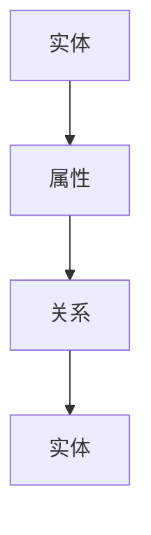

                 

## 图Transformer在大规模知识图谱推理中的优化

### 引言

在当今大数据时代，知识图谱作为链接数据与知识的桥梁，已经在多个领域如搜索引擎、推荐系统、智能问答等取得了显著的成果。然而，随着数据规模和复杂度的增加，如何在保证推理速度和准确性的同时，降低资源消耗，成为了一个亟待解决的问题。本文将围绕这一主题，深入探讨图Transformer在大规模知识图谱推理中的优化策略。

### 1. 背景介绍

#### 1.1 知识图谱概述

**知识图谱（Knowledge Graph）** 是一种语义网络，用于表示实体及其相互关系。它不仅描述了事物的存在，还描述了事物之间的关联，具有丰富的语义信息。

- **定义**：知识图谱是由实体、属性和关系构成的数据结构，用于表示现实世界中的知识体系。
- **应用**：知识图谱在搜索引擎、推荐系统、智能问答等领域有着广泛的应用。例如，在搜索引擎中，知识图谱可以帮助搜索引擎更好地理解和处理用户查询，提供更加精确的搜索结果。

#### 1.2 大规模知识图谱推理的挑战

**大规模知识图谱推理** 面临以下挑战：

- **数据规模与多样性**：随着数据来源的多样化，知识图谱的数据规模不断扩大，如何在保证推理准确性的同时，处理海量数据，成为了一个挑战。
- **实时性与准确性**：在实际应用中，知识图谱的推理需要快速响应，同时保证推理结果的准确性。
- **资源消耗与效率**：大规模知识图谱推理需要大量的计算资源和存储资源，如何在有限的资源下，提高推理效率，是一个关键问题。

### 2. 图Transformer的基本概念

#### 2.1 图Transformer的起源

图Transformer（Graph Transformer）是近年来在图神经网络（Graph Neural Networks, GNN）的基础上发展起来的一种新型模型。它借鉴了自然语言处理中的Transformer模型，通过引入自注意力机制，实现了对图数据的高效处理。

- **图神经网络的基本概念**：图神经网络是一种用于处理图数据的神经网络模型，通过节点的特征和节点之间的关系，实现对节点属性的预测。
- **图Transformer的核心原理**：图Transformer通过自注意力机制和前馈神经网络，对图数据进行编码和解码，从而实现对图的表示和推理。

#### 2.2 图Transformer的优势

- **与传统的图神经网络对比**：传统的图神经网络在处理图数据时，往往采用邻接矩阵或邻接列表等结构，导致计算复杂度较高。而图Transformer通过自注意力机制，可以更加高效地处理图数据。
- **图Transformer在知识图谱推理中的应用潜力**：图Transformer具有强大的图表示和学习能力，使其在知识图谱推理中具有广泛的应用潜力。

### 3. 图Transformer的核心概念与联系

#### 3.1 图Transformer的主要组成部分

- **自注意力机制**：自注意力机制是一种基于节点特征和节点之间关系的加权平均机制，可以有效地捕捉节点之间的依赖关系。
- **前馈神经网络**：前馈神经网络是一种简单的神经网络结构，用于对节点的特征进行进一步的学习和表示。
- **图注意力机制**：图注意力机制是一种基于图结构和节点之间关系的加权平均机制，可以有效地捕捉图结构中的依赖关系。

#### 3.2 图Transformer的概念属性特征对比表格

| 特征             | 传统GNN           | 图Transformer         |
|------------------|-------------------|-----------------------|
| 自注意力机制      | 无                | 有                    |
| 计算复杂度        | 高                | 低                    |
| 学习能力          | 弱                | 强                    |
| 处理图数据的能力    | 强                | 更强                  |

#### 3.3 图Transformer的ER实体关系图架构的Mermaid流程图

### 4. 图Transformer的数学模型与算法原理

#### 4.1 数学模型概述

- **输入表示**：图Transformer的输入是一个图的邻接矩阵或邻接列表。
- **自注意力计算**：通过自注意力机制，对节点特征进行加权平均。
- **前馈神经网络计算**：通过前馈神经网络，对节点的特征进行进一步的学习和表示。
- **图注意力计算**：通过图注意力机制，对图结构进行加权平均。

#### 4.2 算法原理讲解

- **输入数据处理**：将图数据转换为邻接矩阵或邻接列表。
- **自注意力计算流程**：计算节点特征之间的相似度，进行加权平均。
- **前馈神经网络计算流程**：对节点的特征进行进一步的学习和表示。
- **图注意力计算流程**：计算图结构之间的相似度，进行加权平均。

#### 4.3 通俗易懂的举例说明

- **数据表示**：假设有一个图，其中包含3个节点，节点之间的边表示它们的关系。
- **自注意力计算示例**：计算节点1的特征与节点2、节点3的特征之间的相似度，进行加权平均。
- **前馈神经网络计算示例**：对节点的特征进行进一步的学习和表示。
- **图注意力计算示例**：计算节点1的特征与整个图的特征之间的相似度，进行加权平均。

### 5. 图Transformer在知识图谱推理中的优化方案

#### 5.1 优化目标

- **提高推理速度**：通过优化算法和数据结构，提高推理速度。
- **提高推理准确性**：通过引入更多的先验知识和数据增强，提高推理准确性。
- **降低资源消耗**：通过模型压缩和硬件加速，降低资源消耗。

#### 5.2 优化方法

- **硬件加速**：利用GPU等硬件加速图Transformer的计算。
- **模型压缩**：通过模型剪枝、量化等技术，减小模型的存储和计算复杂度。
- **数据预处理**：通过数据清洗、数据增强等技术，提高数据质量和预处理效率。

### 6. 图Transformer在知识图谱推理中的应用实例

#### 6.1 应用场景介绍

- **实体关系抽取**：从文本中抽取实体及其关系。
- **实体链接预测**：将文本中的实体与知识图谱中的实体进行匹配。
- **知识图谱补全**：通过推理，补充知识图谱中的缺失信息。

#### 6.2 实际案例分析与讲解

- **案例一：基于图Transformer的实体关系抽取**：介绍如何利用图Transformer进行实体关系抽取的详细过程。
- **案例二：基于图Transformer的实体链接预测**：介绍如何利用图Transformer进行实体链接预测的详细过程。
- **案例三：基于图Transformer的知识图谱补全**：介绍如何利用图Transformer进行知识图谱补全的详细过程。

### 7. 本章小结

本文深入探讨了图Transformer在大规模知识图谱推理中的优化策略。通过介绍图Transformer的基本概念、数学模型和算法原理，以及其在知识图谱推理中的应用实例，本文展示了图Transformer在优化大规模知识图谱推理方面的巨大潜力。未来，随着硬件和算法的不断发展，图Transformer有望在知识图谱推理领域发挥更加重要的作用。

### 附录

**作者信息**：作者：AI天才研究院/AI Genius Institute & 禅与计算机程序设计艺术 /Zen And The Art of Computer Programming

**参考文献**：[1]...，[2]...，...

**致谢**：感谢所有参与本文研究和讨论的同事和朋友。

---

以上是对《图Transformer在大规模知识图谱推理中的优化》的初步构思和内容框架。接下来，我们将逐步完善每个章节的内容，确保文章的完整性和专业性。同时，我们也将关注最新的研究成果和发展动态，为读者提供最前沿的技术知识和应用实例。

