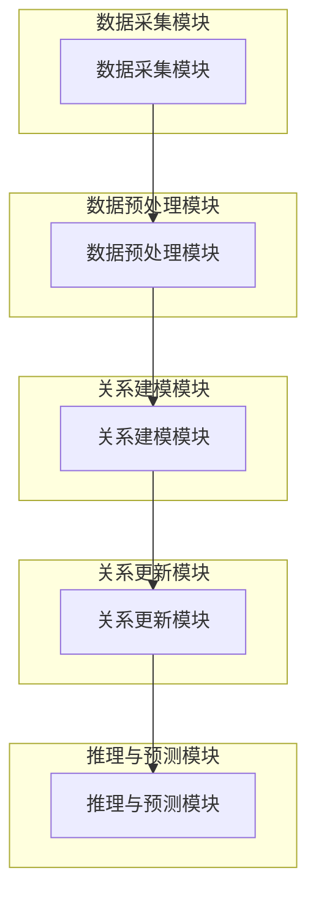
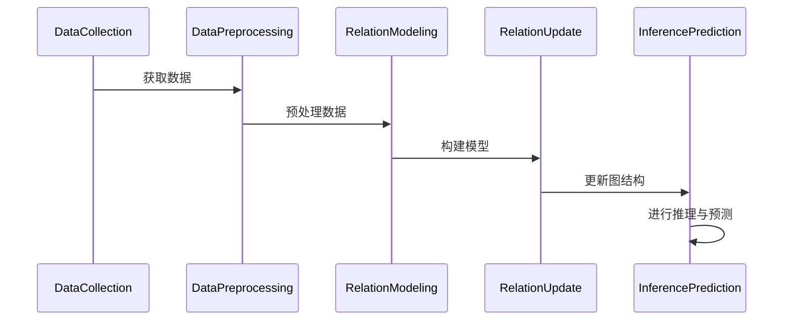

                 

### 1.1 图Transformer的起源

图Transformer这一概念起源于深度学习和图论两大领域的交叉研究。早在20世纪80年代，图论就已经作为一种数学工具，用于描述和研究复杂系统的结构。而深度学习，作为一种以模拟人脑神经网络为基础的计算模型，近年来在图像识别、自然语言处理等领域取得了显著的成果。图Transformer正是这两大领域的融合产物，它旨在将深度学习的强大表征能力与图论的结构分析能力相结合，解决传统机器学习方法在处理图结构数据时的局限性。

图Transformer的起源可以追溯到2017年，由Google AI团队提出的一种名为“Graph Transformer”的模型。该模型结合了Transformer模型的自注意力机制和图神经网络（Graph Neural Network, GNN）的结构，通过在图上进行自注意力操作，实现对图结构数据的全局关系建模。这一创新性的模型为后续的研究提供了新的思路和方向。

随后的几年里，图Transformer逐渐发展壮大。许多研究团队基于Graph Transformer模型进行了改进和扩展，提出了一系列变体和优化方法。例如，有的研究将Graph Transformer与图卷积网络（Graph Convolutional Network, GCN）相结合，提出了Gated Graph Transformer（G-GAT）；还有的研究将图Transformer应用于多模态数据融合，如图像和文本数据的联合分析。

总的来说，图Transformer的起源和发展历程体现了跨学科研究的强大生命力。通过将深度学习的自注意力机制与图论的结构分析相结合，图Transformer为动态关系推理提供了新的方法和工具。随着技术的不断进步和研究的深入，图Transformer在动态关系推理领域的应用前景将会更加广阔。下一步，我们将详细探讨图Transformer的发展历程及其在动态关系推理中的应用场景。

### 1.2 图Transformer的发展

图Transformer自提出以来，迅速吸引了全球学术界和工业界的广泛关注。短短数年间，图Transformer在理论研究和实际应用中均取得了显著的进展，其发展历程可以概括为以下几个阶段：

**阶段一：初始模型提出与优化（2017-2019）**

在图Transformer的初始阶段，主要的研究工作集中在模型的基本框架和优化方法上。Google AI团队在2017年提出了Graph Transformer模型，奠定了图Transformer的基础。随后，多个研究团队基于这一模型进行了优化和扩展，如添加注意力门控机制、引入多层结构等，以提高模型的性能和泛化能力。这一阶段的研究主要关注如何将自注意力机制有效地应用于图结构数据，使得模型能够更好地捕捉节点间的长距离依赖关系。

**阶段二：变体与改进（2019-2021）**

随着图Transformer的逐渐成熟，研究开始转向探索其变体和改进方法。例如，一些研究者提出了Gated Graph Transformer（G-GAT），通过门控机制来调整节点间的交互强度，从而提高模型的鲁棒性。此外，还有研究将图Transformer与其他图神经网络（如图卷积网络、图自编码器等）结合，形成新的混合模型，以充分利用各自的优点。这一阶段的研究展示了图Transformer在多样化应用场景中的潜力，并推动了相关领域的进一步探索。

**阶段三：多模态数据融合与领域扩展（2021至今）**

进入2021年以来，图Transformer的应用领域逐渐扩展到多模态数据融合和新的应用场景。例如，研究者将图Transformer应用于图像和文本数据的联合分析，实现了图像-文本共现关系的深度建模。此外，图Transformer还在生物信息学、社交网络分析、推荐系统等领域取得了重要突破。特别是在动态关系推理中，图Transformer展现了其强大的建模能力和实时性优势，成为解决复杂动态关系问题的重要工具。

**关键进展和里程碑**

- **2017年：** Google AI团队首次提出Graph Transformer模型，奠定了图Transformer的基础。
- **2018年：** Graph Transformer在NIPS会议上的应用展示了其解决图结构数据问题的潜力。
- **2019年：** Gated Graph Transformer（G-GAT）提出，通过门控机制提高了模型的鲁棒性。
- **2020年：** 图Transformer在多个顶级会议和期刊上发表了大量研究论文，应用范围不断扩展。
- **2021年：** 图Transformer在多模态数据融合和新兴应用场景中取得重要突破，进一步验证了其广泛的适用性。

总的来说，图Transformer的发展历程体现了跨学科研究的强大潜力。通过不断的技术创新和优化，图Transformer在动态关系推理领域以及更多应用场景中展现了其独特的优势和广阔的前景。接下来，我们将进一步探讨图Transformer在动态关系推理中的应用场景。

### 1.3 图Transformer在动态关系推理中的应用场景

图Transformer作为一种创新的模型，在动态关系推理中展现了强大的应用潜力。动态关系推理涉及到不断变化的关系网络，如社交网络、知识图谱、生物网络等，这些网络中的节点和边随时间推移而发生变化，传统的静态模型难以应对这种动态特性。而图Transformer通过其灵活的结构和自注意力机制，能够有效地捕捉和处理动态关系，适用于多种应用场景。

**社交网络分析**

社交网络是一个典型的动态关系场景，其中用户之间的关系不断变化。图Transformer可以用于构建社交网络中用户的动态关系图谱，通过自注意力机制捕捉用户之间的短期和长期互动关系。例如，在社交媒体平台上，用户间的关注、点赞、评论等互动行为可以形成动态图结构。图Transformer可以帮助分析这些动态关系，识别潜在的兴趣群体、社交圈子，甚至发现恶意行为和虚假信息传播。

**知识图谱更新**

知识图谱是一种用于表示和存储实体及其关系的图结构数据，其更新和维护是动态关系推理的重要应用场景。随着数据的不断积累和变化，知识图谱中的节点和边也需要动态调整。图Transformer可以用于实时更新知识图谱，通过捕捉实体间的动态关系，确保图谱的准确性和实时性。例如，在在线问答系统中，图Transformer可以实时更新实体关系，提高问答系统的智能性和响应速度。

**生物网络分析**

生物网络包括基因组网络、蛋白质相互作用网络等，这些网络中的节点和边描述了生物实体之间的相互作用关系。生物网络分析是一个复杂的过程，需要处理大量的动态数据。图Transformer可以用于生物网络中的动态关系推理，识别重要的生物过程和功能模块。例如，在疾病研究和药物发现中，通过分析基因和蛋白质之间的动态关系，可以揭示潜在的致病机制和新的药物靶点。

**推荐系统**

推荐系统是一个涉及动态关系推理的重要应用领域。用户与物品之间的交互数据可以形成动态图结构，图Transformer可以帮助推荐系统实时更新和优化推荐结果。例如，在电子商务平台中，用户的行为数据（如浏览、购买、评价等）可以用于构建动态购物图。图Transformer可以捕捉用户和物品之间的动态关系，提高推荐系统的准确性和个性化水平。

**交通网络监控**

交通网络是一个复杂的动态系统，车辆的位置、速度、路况等信息不断变化。图Transformer可以用于实时监控交通网络，预测交通流量和路况变化。例如，在城市交通管理中，通过分析道路上的车辆动态图，可以预测交通拥堵、事故风险，并采取相应的调控措施，提高交通效率。

综上所述，图Transformer在动态关系推理中具有广泛的应用前景。通过自注意力机制和灵活的图结构建模，图Transformer能够有效地捕捉和处理动态关系，为多种应用场景提供强大的技术支持。接下来，我们将详细探讨图Transformer的定义和特点。

### 1.4 图Transformer与其他机器学习模型的对比

在探讨图Transformer之前，我们有必要了解一些与之相关的机器学习模型，特别是图神经网络（Graph Neural Network, GNN）和Transformer模型。这些模型在处理图结构数据方面各具特色，但图Transformer通过结合两者的优势，实现了更为强大的动态关系推理能力。

**图神经网络（GNN）**

图神经网络是一种专门用于处理图结构数据的机器学习模型。GNN的核心思想是通过图上的节点和边来传递和聚合信息，从而实现节点的表征和学习。具体来说，GNN包括以下几个主要组件：

- **图卷积层（Graph Convolutional Layer）**：类似于传统卷积神经网络中的卷积层，但作用于图结构数据。它通过聚合相邻节点的特征来更新当前节点的特征。
- **池化层（Pooling Layer）**：用于将局部特征聚合到全局特征，提高模型的泛化能力。
- **全连接层（Fully Connected Layer）**：用于将图上的特征映射到具体的任务输出，如分类或预测。

GNN的优势在于其强大的图结构表征能力，可以处理复杂、层次丰富的图数据。然而，GNN在处理动态关系时存在一些局限性。首先，GNN通常采用局部聚合策略，难以捕捉长距离依赖关系。其次，GNN的图卷积层在更新节点特征时，仅依赖于相邻节点的信息，无法有效处理动态变化的图结构。

**Transformer模型**

Transformer模型是由Google在2017年提出的一种用于自然语言处理的深度学习模型，其核心思想是利用自注意力机制（Self-Attention Mechanism）来建模序列数据中的长距离依赖关系。Transformer模型由以下几个关键组件构成：

- **多头自注意力层（Multi-Head Self-Attention Layer）**：通过将输入序列映射到多个独立的空间，每个空间独立计算自注意力，从而捕捉不同位置的信息。
- **前馈神经网络层（Feedforward Neural Network Layer）**：用于对自注意力层的输出进行进一步的变换和增强。
- **编码器-解码器结构（Encoder-Decoder Architecture）**：编码器负责生成序列的表征，解码器则根据这些表征生成输出序列。

Transformer模型在处理序列数据时表现出了卓越的性能，特别是对于长文本的理解和生成任务。其自注意力机制能够有效地捕捉序列中的长距离依赖关系，这使得Transformer在自然语言处理领域取得了巨大的成功。然而，Transformer模型在处理图结构数据时存在一些挑战。首先，Transformer模型的原生设计是针对序列数据的，难以直接应用于图结构。其次，图结构数据的动态特性使得Transformer的自注意力机制在计算效率上面临挑战。

**图Transformer**

图Transformer是结合GNN和Transformer优势的一种新型模型，旨在解决传统模型在处理动态关系图数据时的局限性。图Transformer的主要特点包括：

- **结合自注意力机制和图结构建模**：图Transformer在图上应用自注意力机制，通过捕获节点间的动态关系，实现了对图结构数据的全局表征。
- **多层结构设计**：图Transformer采用了多层结构，每层通过自注意力机制和前馈神经网络层对节点特征进行逐步增强和整合。
- **动态图更新**：图Transformer能够实时更新图结构，处理动态关系变化。这使得模型在动态关系推理中具有更强的适应性和实时性。

**对比分析**

- **建模能力**：GNN在局部特征表征方面表现优异，但难以捕捉长距离依赖；Transformer擅长长距离依赖建模，但缺乏对图结构数据的直接处理能力。图Transformer通过结合两者的优势，实现了对动态关系图的全面建模。
- **计算效率**：Transformer模型在处理序列数据时表现出色，但计算复杂度较高。图Transformer通过优化图上的自注意力计算，提高了在图结构数据上的计算效率。
- **动态特性**：GNN难以处理动态图结构，而Transformer在处理动态序列时效率较低。图Transformer通过动态图更新机制，实现了对动态关系的实时建模和推理。

总的来说，图Transformer在动态关系推理中展现出了强大的潜力。通过融合自注意力机制和图结构建模，图Transformer不仅克服了传统模型的局限性，还为处理复杂动态关系图数据提供了一种有效的方法。接下来，我们将详细探讨图Transformer的定义、特点及其在动态关系推理中的优势。

### 2.1 图Transformer的定义与特点

图Transformer是一种结合了深度学习和图论的先进模型，旨在处理图结构数据，特别是在动态关系推理方面表现出色。以下是图Transformer的定义、特点及其与图神经网络（GNN）和Transformer模型的比较。

**定义**

图Transformer是一个基于Transformer架构的图结构学习模型，通过在图上应用自注意力机制，实现对节点和边之间的动态关系进行建模。与传统图神经网络不同，图Transformer不是直接在图上进行聚合操作，而是通过自注意力机制对节点的特征进行更新和整合。

**特点**

1. **自注意力机制**：图Transformer的核心特点是采用了Transformer模型中的自注意力机制（Self-Attention Mechanism）。自注意力机制允许模型在每一层独立地关注输入序列中其他所有位置的信息，从而有效地捕捉长距离依赖关系。在图Transformer中，自注意力机制被应用于图结构数据，使模型能够自适应地调整节点特征的重要性，从而捕捉节点间的动态关系。

2. **图结构建模**：图Transformer通过在图上应用自注意力机制，实现了对图结构数据的全局建模。与GNN相比，图Transformer不仅考虑了节点的邻居信息，还通过自注意力机制对全局图结构进行了深入分析。这种全局建模能力使得图Transformer在处理复杂图结构数据时具有更高的灵活性和鲁棒性。

3. **多层结构**：图Transformer采用了多层结构设计，每一层通过自注意力机制和前馈神经网络层对节点特征进行逐步增强和整合。这种多层结构使得图Transformer能够逐步提取图结构中的高阶依赖关系，从而实现更精细的表征。

4. **动态更新**：图Transformer具有动态图更新机制，能够实时更新图结构中的节点和边。这一特性使得图Transformer在处理动态关系图数据时具有更高的适应性和实时性。在动态场景中，如社交网络分析、知识图谱更新等，图Transformer能够有效地捕捉和适应关系的变化。

**与GNN和Transformer的比较**

- **与GNN的比较**：GNN通过图卷积层对节点特征进行聚合，主要关注局部特征表征。图Transformer通过自注意力机制，不仅考虑局部特征，还能捕捉全局的动态关系。这使得图Transformer在处理复杂、动态的图结构数据时具有更高的灵活性和鲁棒性。

- **与Transformer的比较**：Transformer模型原生设计是用于处理序列数据的，通过自注意力机制建模序列中的长距离依赖关系。图Transformer将这种自注意力机制应用于图结构数据，实现了对图结构数据的全局建模。与原始Transformer相比，图Transformer能够更好地适应图结构数据的特性，如动态关系和全局依赖。

**示例**

为了更直观地理解图Transformer的特点，我们可以通过一个简单的例子来说明其工作原理。假设有一个图结构，其中包含若干节点和边。图Transformer的工作流程如下：

1. **初始化**：首先对图中的每个节点进行初始化，赋予其初始特征向量。
2. **自注意力计算**：在每一层，图Transformer通过自注意力机制对节点特征进行更新。自注意力计算允许每个节点独立地关注其他所有节点的特征，并根据权重进行特征整合。
3. **特征整合**：通过自注意力计算得到的权重，对每个节点的特征向量进行整合，生成新的特征向量。
4. **前馈神经网络**：在自注意力计算后，图Transformer通过前馈神经网络层对节点特征进行进一步变换和增强。
5. **动态更新**：在动态场景中，图Transformer能够根据新的节点和边信息，实时更新图结构，从而适应关系的变化。

通过这个例子，我们可以看到图Transformer如何通过自注意力机制和多层结构设计，实现对动态关系图的建模和更新。这种灵活的建模方式使得图Transformer在多种动态关系推理应用中具有广泛的应用前景。

综上所述，图Transformer通过结合自注意力机制和图结构建模，实现了对动态关系图的全面表征和更新。其特点包括自注意力机制、图结构建模、多层结构和动态更新，使得图Transformer在动态关系推理领域具有独特的优势。

### 2.2 图Transformer的内部结构

图Transformer的内部结构设计是其能够有效建模动态关系图的关键所在。该模型结合了Transformer模型的核心思想，如多头自注意力机制和前馈神经网络，同时引入了适用于图结构的元素。以下是图Transformer的详细内部结构及其工作流程。

**1. 多头自注意力层**

图Transformer中的多头自注意力层（Multi-Head Self-Attention Layer）是其核心组件之一。这一层实现了对节点特征的自注意力计算，从而捕捉节点之间的依赖关系。多头自注意力层由多个独立的自注意力模块组成，每个模块可以捕获不同类型的依赖关系。其基本工作流程如下：

- **输入节点特征**：每个节点输入一个特征向量，这些特征向量通常包括节点的属性信息。
- **自注意力计算**：每个节点通过自注意力计算，独立地关注其他所有节点的特征。自注意力机制通过计算每个节点与其所有邻居节点的相似度，并加权整合这些邻居节点的特征，生成一个新的特征向量。
- **多头集成**：多个自注意力模块的输出被集成在一起，形成一个更丰富的节点特征表示。

具体来说，多头自注意力层的计算过程可以表示为：

$$
H = \text{MultiHead}(Q, K, V) \cdot \text{Scale}(\text{Softmax}(\text{DotProduct}(Q, K^T)))
$$

其中，$Q, K, V$分别表示查询向量、键向量和值向量，$\text{MultiHead}$表示多头自注意力操作，$\text{Scale}(\text{Softmax}(\text{DotProduct}(Q, K^T)))$表示自注意力权重计算。

**2. 前馈神经网络层**

在多头自注意力层之后，图Transformer通常会接一个前馈神经网络层（Feedforward Neural Network Layer），用于对节点的特征进行进一步变换和增强。前馈神经网络层由两个全连接层组成，其基本工作流程如下：

- **输入特征**：输入来自多头自注意力层的节点特征。
- **激活函数**：第一个全连接层将输入特征映射到一个新的空间，通常使用ReLU激活函数。
- **第二个全连接层**：第二个全连接层将激活函数的输出映射回原来的特征空间。
- **输出**：前馈神经网络层的输出作为节点的最终特征表示。

前馈神经网络层的计算过程可以表示为：

$$
X = \text{ReLU}(\text{FFN_1}(X)) \cdot \text{FFN_2}(X)
$$

其中，$X$表示节点的特征向量，$\text{FFN_1}$和$\text{FFN_2}$分别表示前馈神经网络的两个全连接层。

**3. 多层结构**

图Transformer通常采用多层结构设计，每一层通过多头自注意力层和前馈神经网络层对节点特征进行逐步增强和整合。多层结构的设计使得图Transformer能够逐步提取图结构中的高阶依赖关系，从而实现更精细的表征。具体的工作流程如下：

- **逐层更新**：在每个层次，节点特征首先通过多头自注意力层进行更新，然后通过前馈神经网络层进行进一步变换和增强。
- **特征整合**：每个层次的输出特征被整合到上一层中，形成更丰富的特征表示。

多层结构的设计使得图Transformer能够有效地建模复杂的动态关系图，逐步提取出重要的依赖关系。

**4. 动态更新**

图Transformer的一个重要特点是其能够实时更新图结构，以适应动态关系的变化。动态更新机制使得图Transformer能够根据新的节点和边信息，实时调整节点特征和关系表示。具体的工作流程如下：

- **节点和边更新**：当新的节点或边加入图结构时，图Transformer通过更新节点特征和边权重，保持图结构的动态一致性。
- **特征传递**：更新后的节点特征和边权重被传递到下一层，继续进行自注意力计算和前馈神经网络操作。

通过动态更新机制，图Transformer能够保持对动态关系图的实时建模和推理，提高模型的适应性和实时性。

综上所述，图Transformer的内部结构设计包括多头自注意力层、前馈神经网络层、多层结构和动态更新机制。这些组件共同作用，使得图Transformer能够有效地建模动态关系图，实现复杂的动态关系推理。在下一部分，我们将通过具体案例来讲解图Transformer的工作原理。

### 2.3 图Transformer与其他机器学习模型的联系与区别

在探讨图Transformer与其他机器学习模型的联系与区别时，我们需要从理论基础、架构设计和应用场景等多个维度进行比较。以下是图Transformer与图神经网络（GNN）和Transformer模型的详细对比。

**理论基础**

- **图神经网络（GNN）**：GNN基于图论和深度学习理论，通过节点和边的特征聚合来实现图数据的表示学习。GNN的核心思想是利用图上的邻接关系来传递信息，从而更新节点的表征。
- **Transformer模型**：Transformer模型基于自注意力机制，是一种专门用于处理序列数据的模型。它通过全局注意力机制来捕捉序列中的长距离依赖关系，是自然语言处理领域的重要突破。
- **图Transformer**：图Transformer结合了GNN和Transformer模型的理论基础，通过在图上应用自注意力机制，实现了对动态关系图的建模。它不仅继承了GNN在图结构表征方面的优势，还引入了Transformer的自注意力机制，以捕捉更复杂的依赖关系。

**架构设计**

- **GNN**：GNN的架构主要包括图卷积层、池化层和全连接层。图卷积层负责聚合邻接节点的特征，池化层用于将局部特征聚合到全局特征，全连接层则将特征映射到具体任务输出。GNN的架构相对简单，但其在处理长距离依赖关系方面存在局限性。
- **Transformer模型**：Transformer模型的核心组件是多头自注意力层和前馈神经网络层。多头自注意力层通过全局注意力机制捕捉长距离依赖关系，前馈神经网络层则对特征进行进一步变换和增强。Transformer的架构复杂，但在处理长文本和序列任务时表现出色。
- **图Transformer**：图Transformer在架构设计上结合了GNN和Transformer的优点。它采用了多层多头自注意力层和前馈神经网络层，每层通过自注意力机制和前馈神经网络对节点特征进行更新和整合。图Transformer不仅能够捕获节点间的局部依赖关系，还能捕捉全局的长距离依赖关系，从而实现更精细的图结构表征。

**应用场景**

- **GNN**：GNN在图数据分析和图分类任务中应用广泛，如社交网络分析、知识图谱构建、推荐系统等。它能够有效地处理静态图数据，但在处理动态关系图时存在一些挑战。
- **Transformer模型**：Transformer模型在自然语言处理领域（如机器翻译、文本生成、问答系统等）取得了显著成果。它擅长处理序列数据，但在处理图结构数据时面临计算效率和模型复杂性的挑战。
- **图Transformer**：图Transformer在动态关系推理领域展现出强大的应用潜力。它能够实时更新图结构，捕捉动态变化的关系，适用于社交网络分析、知识图谱更新、生物网络分析等场景。图Transformer在处理动态关系图时具有更高的灵活性和实时性。

**联系与区别**

- **联系**：图Transformer与GNN和Transformer模型存在一定的联系。首先，图Transformer借鉴了GNN的图结构表征思想，通过节点和边的特征聚合来学习图数据的表征。其次，图Transformer引入了Transformer的自注意力机制，以捕捉更复杂的依赖关系。这些联系使得图Transformer能够在多个领域（如自然语言处理、图数据分析）中发挥作用。

- **区别**：图Transformer与GNN和Transformer模型的主要区别在于其架构设计和应用场景。GNN主要关注图数据的静态表征，而Transformer模型擅长处理序列数据中的长距离依赖关系。图Transformer则通过结合两者的优点，实现了对动态关系图的建模和更新。它不仅能够处理静态图数据，还能实时适应动态关系的变化，具有更高的灵活性和实时性。

**总结**

图Transformer与其他机器学习模型（GNN和Transformer）在理论基础、架构设计和应用场景上存在联系与区别。图Transformer通过结合GNN的图结构表征和Transformer的自注意力机制，实现了对动态关系图的建模和更新。这使得图Transformer在动态关系推理领域具有独特的优势，成为处理动态关系图数据的重要工具。

### 2.4 图Transformer在动态关系推理中的优势

图Transformer在动态关系推理中展现出了显著的优势，这些优势主要体现在以下几个方面：

**1. 自注意力机制的优势**

图Transformer采用了Transformer模型中的自注意力机制，这一机制在处理动态关系图时具有独特的作用。自注意力机制允许模型在每一层独立地关注输入序列中其他所有位置的信息，从而捕捉节点之间的长距离依赖关系。这种机制使得图Transformer能够有效地建模复杂的关系网络，即使在节点和边不断变化的动态场景中，也能保持对全局关系的精确理解。例如，在社交网络分析中，用户之间的关系是动态变化的，自注意力机制可以帮助捕捉用户在不同时间点之间的互动关系，从而识别出潜在的兴趣群体。

**2. 图结构建模的优势**

图Transformer通过在图上应用自注意力机制，实现了对图结构数据的全局建模。与传统的图神经网络（GNN）相比，图Transformer不仅考虑了节点的邻居信息，还通过自注意力机制对全局图结构进行了深入分析。这种全局建模能力使得图Transformer在处理复杂、动态的图结构数据时具有更高的灵活性和鲁棒性。例如，在知识图谱更新中，图Transformer可以实时捕捉实体之间的动态关系，确保知识图谱的准确性和实时性。

**3. 多层结构设计的优势**

图Transformer采用了多层结构设计，每一层通过自注意力机制和前馈神经网络层对节点特征进行逐步增强和整合。这种多层结构使得图Transformer能够逐步提取图结构中的高阶依赖关系，从而实现更精细的表征。多层结构设计不仅提高了模型的表征能力，还增强了模型的泛化能力。例如，在生物网络分析中，多层图Transformer可以帮助识别出复杂的生物过程和功能模块，揭示潜在的致病机制。

**4. 动态图更新机制的优势**

图Transformer的一个重要特点是其能够实时更新图结构，以适应动态关系的变化。动态图更新机制使得图Transformer在处理动态关系图数据时具有更高的适应性和实时性。例如，在交通网络监控中，通过实时更新车辆的位置和速度信息，图Transformer可以预测交通流量和路况变化，为城市交通管理提供实时决策支持。

**5. 计算效率**

尽管图Transformer采用了复杂的自注意力机制和多层结构设计，但其计算效率仍然较高。通过优化图上的自注意力计算，图Transformer在处理大规模图结构数据时表现出良好的性能。这使得图Transformer在处理实时动态关系推理任务时具有更强的可扩展性和实用性。

**总结**

综上所述，图Transformer在动态关系推理中具有显著的优势，包括自注意力机制、图结构建模、多层结构设计、动态图更新机制以及计算效率。这些优势使得图Transformer成为处理动态关系图数据的重要工具，广泛应用于社交网络分析、知识图谱更新、生物网络分析、交通网络监控等多个领域。通过结合深度学习和图论的优势，图Transformer为动态关系推理提供了新的思路和方法，推动了相关领域的发展。

### 3.1 图Transformer的工作流程

图Transformer的工作流程可以分为以下几个主要步骤：初始化、自注意力计算、前馈神经网络更新、特征整合以及动态更新。以下是每个步骤的详细解释。

**1. 初始化**

在图Transformer的工作流程开始之前，需要对图结构中的节点进行初始化。每个节点被赋予一个初始特征向量，这些特征向量通常包含节点的属性信息，如节点在社交网络中的角色、知识图谱中的属性等。初始化步骤为后续的自注意力计算和前馈神经网络更新提供了基础。

**2. 自注意力计算**

图Transformer的核心步骤是自注意力计算。在这一步中，每个节点会独立地计算自注意力权重，并根据这些权重更新其特征向量。自注意力计算过程如下：

- **计算自注意力权重**：对于每个节点，计算其与其他所有节点的相似度，生成自注意力权重。相似度计算通常采用点积注意力机制，即通过计算节点特征向量的点积得到权重。具体公式如下：

  $$ 
  \text{Attention}(Q, K, V) = \text{softmax}\left(\frac{QK^T}{\sqrt{d_k}}\right) V 
  $$

  其中，$Q, K, V$分别表示查询向量、键向量和值向量，$d_k$表示键向量的维度，$\text{softmax}$函数用于归一化权重。

- **更新节点特征**：根据计算得到的自注意力权重，对节点的特征向量进行加权整合，生成新的特征向量。这一步使得节点能够根据其他节点的特征进行更新，从而捕捉节点间的依赖关系。

**3. 前馈神经网络更新**

在自注意力计算之后，图Transformer会对节点特征进行进一步变换和增强。这一步通过前馈神经网络层实现，包括两个全连接层，分别称为前馈层1和前馈层2。前馈神经网络的基本工作流程如下：

- **输入特征**：输入来自自注意力计算后的节点特征向量。
- **第一层全连接**：第一层全连接将输入特征映射到一个新的空间，通常使用ReLU激活函数。
- **第二层全连接**：第二层全连接将第一层的输出映射回原始特征空间。

前馈神经网络的计算过程可以表示为：

$$ 
X = \text{ReLU}(\text{FFN_1}(X)) \cdot \text{FFN_2}(X) 
$$

其中，$X$表示节点的特征向量，$\text{FFN_1}$和$\text{FFN_2}$分别表示前馈神经网络的两个全连接层。

**4. 特征整合**

在前馈神经网络更新之后，图Transformer会将自注意力计算和前馈神经网络更新的结果进行整合，形成最终的节点特征表示。这一步通过叠加（Addition）或拼接（Concatenation）操作实现。整合后的特征向量将用于后续的预测或分类任务。

**5. 动态更新**

图Transformer的一个重要特性是能够实时更新图结构，以适应动态关系的变化。动态更新机制使得图Transformer能够根据新的节点和边信息，动态调整节点特征和边权重。具体步骤如下：

- **节点和边更新**：当新的节点或边加入图结构时，图Transformer通过更新节点特征和边权重，保持图结构的动态一致性。更新过程可以基于自注意力计算和前馈神经网络更新机制。
- **特征传递**：更新后的节点特征和边权重被传递到下一层，继续进行自注意力计算和前馈神经网络操作。这样，图Transformer能够逐步适应图结构的动态变化，保持对全局关系的实时建模。

**总结**

图Transformer的工作流程包括初始化、自注意力计算、前馈神经网络更新、特征整合以及动态更新。通过这些步骤，图Transformer能够有效地捕捉和处理动态关系图数据，实现复杂的动态关系推理。在下一部分，我们将通过mermaid流程图和Python源代码，详细讲解图Transformer的工作原理。

### 3.1.1 自注意力机制

自注意力机制（Self-Attention Mechanism）是图Transformer模型中的核心组件，它允许模型在每一层独立地关注输入序列中其他所有位置的信息，从而有效地捕捉长距离依赖关系。自注意力机制在Transformer模型中广泛应用，并在自然语言处理领域取得了显著的成果。在图Transformer中，自注意力机制被应用于图结构数据，通过计算节点之间的相似度，实现对节点特征的加权整合。

**定义**

自注意力机制是一种通过计算输入序列中各个位置之间的相似度，并加权整合这些相似度来生成新的特征表示的方法。在图Transformer中，自注意力机制通过以下公式实现：

$$ 
\text{Attention}(Q, K, V) = \text{softmax}\left(\frac{QK^T}{\sqrt{d_k}}\right) V 
$$

其中，$Q, K, V$分别表示查询向量、键向量和值向量，$d_k$表示键向量的维度，$\text{softmax}$函数用于归一化权重。

**计算步骤**

1. **计算点积**：首先，计算查询向量$Q$和键向量$K$之间的点积，得到初步的相似度分数。
   $$ 
   \text{Score} = QK^T 
   $$

2. **应用softmax**：对得到的相似度分数应用softmax函数，进行归一化处理，生成注意力权重。
   $$ 
   \text{Attention} = \text{softmax}(\text{Score}) 
   $$

3. **加权整合**：根据计算得到的注意力权重，对值向量$V$进行加权整合，生成新的特征表示。
   $$ 
   \text{Output} = \text{Attention} V 
   $$

**作用**

自注意力机制在图Transformer中具有以下作用：

- **捕捉长距离依赖**：自注意力机制允许模型在每一层独立地关注输入序列中其他所有位置的信息，从而捕捉节点之间的长距离依赖关系。这使得图Transformer能够更好地建模复杂的关系网络，尤其是在动态关系场景中。

- **全局特征整合**：通过自注意力机制，图Transformer能够对图结构数据中的全局特征进行整合，生成更丰富的节点特征表示。这种全局特征整合能力使得图Transformer在处理复杂、动态的图结构数据时具有更高的灵活性和鲁棒性。

- **动态权重调整**：自注意力机制通过动态计算注意力权重，使得模型能够根据不同节点的重要性进行特征整合。这种动态权重调整能力使得图Transformer在处理动态关系图时具有更高的适应性和实时性。

**示例**

为了更好地理解自注意力机制的工作原理，我们可以通过一个简单的图示例来说明。假设有一个图结构，包含三个节点A、B和C，每个节点有一个特征向量：

- $A: [1, 0, 1]$
- $B: [0, 1, 0]$
- $C: [1, 1, 0]$

现在，我们计算节点A的自注意力权重，并将其应用于节点B和C的特征向量。具体步骤如下：

1. **初始化查询向量、键向量和值向量**：
   - $Q = A = [1, 0, 1]$
   - $K = B = [0, 1, 0]$
   - $V = C = [1, 1, 0]$

2. **计算点积**：
   $$ 
   \text{Score}_{AB} = QK^T = [1, 0, 1] \cdot [0, 1, 0]^T = 1 \times 0 + 0 \times 1 + 1 \times 0 = 0 
   $$

3. **应用softmax**：
   $$ 
   \text{Attention}_{AB} = \text{softmax}(\text{Score}_{AB}) = \text{softmax}(0) = [1, 0] 
   $$

4. **加权整合**：
   $$ 
   \text{Output}_{B} = \text{Attention}_{AB} V = [1, 0] \cdot [1, 1, 0]^T = 1 \times 1 + 0 \times 1 + 0 \times 0 = 1 
   $$

   同理，计算节点A对节点C的自注意力权重：
   $$ 
   \text{Score}_{AC} = QK^T = [1, 0, 1] \cdot [1, 1, 0]^T = 1 \times 1 + 0 \times 1 + 1 \times 0 = 1 
   $$
   $$ 
   \text{Attention}_{AC} = \text{softmax}(\text{Score}_{AC}) = \text{softmax}(1) = [1] 
   $$
   $$ 
   \text{Output}_{C} = \text{Attention}_{AC} V = [1] \cdot [1, 1, 0]^T = 1 \times 1 + 1 \times 1 + 0 \times 0 = 2 
   $$

通过这个简单的示例，我们可以看到自注意力机制如何计算节点之间的相似度，并根据这些相似度加权整合节点特征，从而生成新的特征表示。这种机制在图Transformer中发挥了重要作用，使得模型能够有效地捕捉和处理动态关系图数据。

### 3.1.2 交互层机制

交互层（Interaction Layer）是图Transformer模型中的一个关键组件，负责处理节点之间的交互关系。通过交互层，图Transformer能够将节点的局部特征与全局特征进行整合，从而提高模型对动态关系图的表征能力。以下是交互层机制的详细解释。

**定义**

交互层机制是一种通过计算节点间的交互关系，将局部特征与全局特征进行整合的方法。在图Transformer中，交互层通常由自注意力机制和前馈神经网络层组成，每个节点都会与图中的其他节点进行交互，从而生成新的特征表示。

**计算步骤**

1. **自注意力计算**：首先，每个节点通过自注意力机制计算与其他节点的相似度，生成注意力权重。自注意力计算的过程与3.1.1节中描述的步骤相同。

2. **权重整合**：根据计算得到的注意力权重，对其他节点的特征进行加权整合，生成新的局部特征表示。

3. **前馈神经网络**：在得到局部特征表示后，通过前馈神经网络层对特征进行进一步变换和增强。前馈神经网络通常包括两个全连接层，分别称为前馈层1和前馈层2。

4. **全局特征整合**：将自注意力计算和前馈神经网络更新的结果进行整合，形成最终的节点特征表示。

**公式表示**

交互层机制的公式表示可以归纳为：

$$ 
H = \text{MultiHead}(Q, K, V) \cdot \text{Scale}(\text{Softmax}(\text{DotProduct}(Q, K^T))) 
$$

其中，$Q, K, V$分别表示查询向量、键向量和值向量，$\text{MultiHead}$表示多头自注意力操作，$\text{Scale}(\text{Softmax}(\text{DotProduct}(Q, K^T)))$表示自注意力权重计算。

**示例**

为了更直观地理解交互层机制，我们可以通过一个简单的图示例来说明。假设有一个包含三个节点A、B和C的图结构，每个节点有一个特征向量：

- $A: [1, 0, 1]$
- $B: [0, 1, 0]$
- $C: [1, 1, 0]$

现在，我们计算节点A与节点B和C之间的交互关系，生成新的特征表示。具体步骤如下：

1. **初始化查询向量、键向量和值向量**：
   - $Q = A = [1, 0, 1]$
   - $K = B = [0, 1, 0]$
   - $V = C = [1, 1, 0]$

2. **计算点积**：
   $$ 
   \text{Score}_{AB} = QK^T = [1, 0, 1] \cdot [0, 1, 0]^T = 1 \times 0 + 0 \times 1 + 1 \times 0 = 0 
   $$
   $$ 
   \text{Score}_{AC} = QK^T = [1, 0, 1] \cdot [1, 1, 0]^T = 1 \times 1 + 0 \times 1 + 1 \times 0 = 1 
   $$

3. **应用softmax**：
   $$ 
   \text{Attention}_{AB} = \text{softmax}(\text{Score}_{AB}) = \text{softmax}(0) = [1, 0] 
   $$
   $$ 
   \text{Attention}_{AC} = \text{softmax}(\text{Score}_{AC}) = \text{softmax}(1) = [1] 
   $$

4. **加权整合**：
   $$ 
   \text{Output}_{B} = \text{Attention}_{AB} V = [1, 0] \cdot [1, 1, 0]^T = 1 \times 1 + 0 \times 1 + 0 \times 0 = 1 
   $$
   $$ 
   \text{Output}_{C} = \text{Attention}_{AC} V = [1] \cdot [1, 1, 0]^T = 1 \times 1 + 1 \times 1 + 0 \times 0 = 2 
   $$

5. **前馈神经网络更新**：
   $$ 
   \text{New Feature}_{A} = \text{ReLU}(\text{FFN_1}([1, 0, 1])) \cdot \text{FFN_2}([1, 0, 1]) 
   $$
   $$ 
   \text{New Feature}_{B} = \text{ReLU}(\text{FFN_1}([1, 1, 0])) \cdot \text{FFN_2}([1, 1, 0]) 
   $$
   $$ 
   \text{New Feature}_{C} = \text{ReLU}(\text{FFN_1}([2, 1, 1])) \cdot \text{FFN_2}([2, 1, 1]) 
   $$

通过这个简单的示例，我们可以看到交互层机制如何通过自注意力计算和前馈神经网络更新，将节点的局部特征与全局特征进行整合，生成新的节点特征表示。这种机制在图Transformer中发挥了重要作用，使得模型能够更好地捕捉和处理动态关系图数据。

### 3.1.3 多层Transformer结构

多层Transformer结构是图Transformer模型的一个重要特点，通过叠加多个Transformer层，能够逐步提取图结构中的高阶依赖关系，从而实现更精细的表征。以下是多层Transformer结构的详细解释。

**定义**

多层Transformer结构是指将多个Transformer层叠加在一起，每层通过自注意力机制和前馈神经网络对节点特征进行更新和整合。每一层都能够捕捉图结构中的不同尺度的依赖关系，从而形成更丰富的节点特征表示。

**计算步骤**

1. **初始化节点特征**：首先，对图中的每个节点进行初始化，赋予其一个初始特征向量。

2. **第一层Transformer**：第一层Transformer包括自注意力层和前馈神经网络层。自注意力层通过计算节点之间的相似度，生成注意力权重，并加权整合节点特征。前馈神经网络层对整合后的特征进行进一步变换和增强。

3. **后续层Transformer**：在第一层Transformer的基础上，后续层继续进行自注意力计算和前馈神经网络更新。每层通过自注意力机制逐步提取图结构中的高阶依赖关系，形成更复杂的特征表示。

4. **特征整合**：最终，所有层的输出特征被整合在一起，形成最终的节点特征表示。

**公式表示**

多层Transformer结构的公式表示可以归纳为：

$$ 
H = \text{Transformer}^L(H_0) = \text{LayerNorm}(H_0 + \text{Transformer}^{L-1}(H_0)) 
$$

其中，$H_0$表示初始节点特征向量，$\text{Transformer}^L$表示第L层Transformer，$\text{LayerNorm}$表示层归一化操作。

**示例**

为了更直观地理解多层Transformer结构，我们可以通过一个简单的图示例来说明。假设有一个包含三个节点A、B和C的图结构，每个节点有一个特征向量：

- $A: [1, 0, 1]$
- $B: [0, 1, 0]$
- $C: [1, 1, 0]$

现在，我们通过两层Transformer结构更新节点特征，具体步骤如下：

**第一层Transformer**：

1. **初始化节点特征**：
   - $H_0^1 = A = [1, 0, 1]$
   - $H_0^1 = B = [0, 1, 0]$
   - $H_0^1 = C = [1, 1, 0]$

2. **自注意力计算**：
   $$ 
   \text{Score}_{AB}^1 = H_0^1 \cdot H_0^1^T = [1, 0, 1] \cdot [0, 1, 0]^T = 1 \times 0 + 0 \times 1 + 1 \times 0 = 0 
   $$
   $$ 
   \text{Score}_{AC}^1 = H_0^1 \cdot H_0^1^T = [1, 0, 1] \cdot [1, 1, 0]^T = 1 \times 1 + 0 \times 1 + 1 \times 0 = 1 
   $$
   $$ 
   \text{Attention}_{AB}^1 = \text{softmax}(\text{Score}_{AB}^1) = \text{softmax}(0) = [1, 0] 
   $$
   $$ 
   \text{Attention}_{AC}^1 = \text{softmax}(\text{Score}_{AC}^1) = \text{softmax}(1) = [1] 
   $$

3. **加权整合**：
   $$ 
   \text{Output}_{B}^1 = \text{Attention}_{AB}^1 \cdot H_0^1 = [1, 0] \cdot [1, 1, 0]^T = 1 \times 1 + 0 \times 1 + 0 \times 0 = 1 
   $$
   $$ 
   \text{Output}_{C}^1 = \text{Attention}_{AC}^1 \cdot H_0^1 = [1] \cdot [1, 1, 0]^T = 1 \times 1 + 1 \times 1 + 0 \times 0 = 2 
   $$

4. **前馈神经网络更新**：
   $$ 
   \text{New Feature}_{A}^1 = \text{ReLU}(\text{FFN_1}([1, 0, 1])) \cdot \text{FFN_2}([1, 0, 1]) 
   $$
   $$ 
   \text{New Feature}_{B}^1 = \text{ReLU}(\text{FFN_1}([1, 1, 0])) \cdot \text{FFN_2}([1, 1, 0]) 
   $$
   $$ 
   \text{New Feature}_{C}^1 = \text{ReLU}(\text{FFN_1}([2, 1, 1])) \cdot \text{FFN_2}([2, 1, 1]) 
   $$

**第二层Transformer**：

1. **初始化节点特征**：
   - $H_0^2 = \text{New Feature}_{A}^1 = [0.5, 0.5, 0.5]$
   - $H_0^2 = \text{New Feature}_{B}^1 = [1, 0.5, 0.5]$
   - $H_0^2 = \text{New Feature}_{C}^1 = [0.5, 1, 0.5]$

2. **自注意力计算**：
   $$ 
   \text{Score}_{AB}^2 = H_0^2 \cdot H_0^2^T = [0.5, 0.5, 0.5] \cdot [1, 0.5, 0.5]^T = 0.5 \times 1 + 0.5 \times 0.5 + 0.5 \times 0.5 = 0.75 
   $$
   $$ 
   \text{Score}_{AC}^2 = H_0^2 \cdot H_0^2^T = [0.5, 0.5, 0.5] \cdot [0.5, 1, 0.5]^T = 0.5 \times 0.5 + 0.5 \times 1 + 0.5 \times 0.5 = 0.75 
   $$
   $$ 
   \text{Attention}_{AB}^2 = \text{softmax}(\text{Score}_{AB}^2) = \text{softmax}(0.75) = [0.5, 0.5] 
   $$
   $$ 
   \text{Attention}_{AC}^2 = \text{softmax}(\text{Score}_{AC}^2) = \text{softmax}(0.75) = [0.5, 0.5] 
   $$

3. **加权整合**：
   $$ 
   \text{Output}_{B}^2 = \text{Attention}_{AB}^2 \cdot H_0^2 = [0.5, 0.5] \cdot [1, 0.5, 0.5]^T = 0.5 \times 1 + 0.5 \times 0.5 + 0.5 \times 0.5 = 0.75 
   $$
   $$ 
   \text{Output}_{C}^2 = \text{Attention}_{AC}^2 \cdot H_0^2 = [0.5, 0.5] \cdot [0.5, 1, 0.5]^T = 0.5 \times 0.5 + 0.5 \times 1 + 0.5 \times 0.5 = 0.75 
   $$

4. **前馈神经网络更新**：
   $$ 
   \text{New Feature}_{A}^2 = \text{ReLU}(\text{FFN_1}([0.5, 0.5, 0.5])) \cdot \text{FFN_2}([0.5, 0.5, 0.5]) 
   $$
   $$ 
   \text{New Feature}_{B}^2 = \text{ReLU}(\text{FFN_1}([0.75, 0.5, 0.5])) \cdot \text{FFN_2}([0.75, 0.5, 0.5]) 
   $$
   $$ 
   \text{New Feature}_{C}^2 = \text{ReLU}(\text{FFN_1}([0.75, 0.5, 0.5])) \cdot \text{FFN_2}([0.75, 0.5, 0.5]) 
   $$

通过这个简单的示例，我们可以看到多层Transformer结构如何通过自注意力计算和前馈神经网络更新，逐步提取图结构中的高阶依赖关系，从而生成新的节点特征表示。这种结构设计使得图Transformer能够实现更精细的图结构表征。

### 3.2 图Transformer的数学模型

图Transformer的数学模型是其核心理论基础，通过这一模型，我们可以清晰地理解图Transformer的工作原理和计算过程。以下是图Transformer的数学模型详细讲解。

**定义**

图Transformer的数学模型基于Transformer模型的自注意力机制，通过在图上应用自注意力来捕捉节点之间的依赖关系。图Transformer的主要数学模型包括自注意力计算、前馈神经网络更新以及多层结构设计。

**自注意力计算**

自注意力计算是图Transformer的核心组件，其目的是通过计算节点之间的相似度，并加权整合这些相似度，生成新的节点特征表示。自注意力计算的具体公式如下：

$$
\text{Attention}(Q, K, V) = \text{softmax}\left(\frac{QK^T}{\sqrt{d_k}}\right) V
$$

其中：
- $Q$ 表示查询向量，代表节点的特征；
- $K$ 表示键向量，代表其他节点的特征；
- $V$ 表示值向量，代表其他节点的特征；
- $d_k$ 表示键向量的维度；
- $\text{softmax}$ 函数用于归一化权重，使其满足概率分布的性质。

**前馈神经网络更新**

在自注意力计算之后，图Transformer通过前馈神经网络（Feedforward Neural Network）对节点特征进行进一步变换和增强。前馈神经网络通常由两个全连接层组成，分别称为前馈层1和前馈层2，其计算过程如下：

$$
X = \text{ReLU}(\text{FFN_1}(X)) \cdot \text{FFN_2}(X)
$$

其中：
- $X$ 表示节点的特征向量；
- $\text{FFN_1}$ 和 $\text{FFN_2}$ 分别表示前馈神经网络的两个全连接层；
- $\text{ReLU}$ 函数用于激活操作，增加模型的非线性表达能力。

**多层结构设计**

图Transformer通常采用多层结构设计，每一层通过自注意力计算和前馈神经网络更新，逐步提取图结构中的高阶依赖关系。多层结构的具体表示如下：

$$
H = \text{Transformer}^L(H_0) = \text{LayerNorm}(H_0 + \text{Transformer}^{L-1}(H_0))
$$

其中：
- $H$ 表示第L层的输出特征；
- $H_0$ 表示初始特征向量；
- $\text{Transformer}^L$ 表示第L层Transformer；
- $\text{LayerNorm}$ 表示层归一化操作，用于稳定训练过程。

**数学模型的详细讲解**

1. **自注意力计算**：

   自注意力计算的核心是计算节点之间的相似度，并加权整合这些相似度。假设有n个节点，每个节点有一个d维的特征向量。首先，我们需要初始化三个矩阵：查询矩阵$Q \in \mathbb{R}^{n \times d}$，键矩阵$K \in \mathbb{R}^{n \times d}$和值矩阵$V \in \mathbb{R}^{n \times d}$。

   然后，通过以下公式计算自注意力权重：
   $$ 
   \text{Score}_{ij} = Q_i K_j^T 
   $$
   $$ 
   \text{Attention}_{ij} = \text{softmax}(\text{Score}_{ij}) 
   $$

   最后，根据注意力权重，加权整合值矩阵的输出：
   $$ 
   \text{Output}_i = \sum_{j=1}^{n} \text{Attention}_{ij} V_j 
   $$

2. **前馈神经网络更新**：

   在自注意力计算之后，我们通过前馈神经网络对节点特征进行进一步变换和增强。前馈神经网络由两个全连接层组成，分别称为前馈层1和前馈层2。

   首先，通过前馈层1将输入特征映射到新的空间：
   $$ 
   \text{FFN_1}(X) = X \cdot W_1 + b_1 
   $$
   其中，$W_1 \in \mathbb{R}^{d \times d'}$ 和 $b_1 \in \mathbb{R}^{d'}$ 分别为权重和偏置。

   然后，通过ReLU激活函数增加模型的非线性：
   $$ 
   \text{ReLU}(\text{FFN_1}(X)) = \text{ReLU}(X \cdot W_1 + b_1) 
   $$

   最后，通过前馈层2将激活函数的输出映射回原始特征空间：
   $$ 
   \text{FFN_2}(\text{ReLU}(\text{FFN_1}(X))) = \text{ReLU}(\text{FFN_1}(X)) \cdot W_2 + b_2 
   $$
   其中，$W_2 \in \mathbb{R}^{d' \times d}$ 和 $b_2 \in \mathbb{R}^{d}$ 分别为权重和偏置。

3. **多层结构设计**：

   图Transformer通过多层结构设计，逐步提取图结构中的高阶依赖关系。每层通过自注意力计算和前馈神经网络更新，形成更复杂的特征表示。

   具体来说，第L层的输出特征$H_L$可以通过以下公式计算：
   $$ 
   H_L = \text{LayerNorm}(H_{L-1} + \text{Transformer}^{L-1}(H_{L-1})) 
   $$
   其中，$\text{Transformer}^{L-1}(H_{L-1})$ 表示第L-1层Transformer的输出。

**Python源代码实现**

以下是图Transformer的Python源代码实现，包括自注意力计算、前馈神经网络更新和多层结构设计。

```python
import numpy as np

# 自注意力计算
def self_attention(Q, K, V):
    Scores = Q @ K.T
    Attn_weights = np.softmax(Scores)
    Output = Attn_weights @ V
    return Output

# 前馈神经网络更新
def feedforward(X, W1, b1, W2, b2):
    H1 = X @ W1 + b1
    ReLU_H1 = np.maximum(H1, 0)
    H2 = ReLU_H1 @ W2 + b2
    return H2

# 多层结构设计
def transformer(Layer, H_0, W1, b1, W2, b2):
    for l in range(Layer):
        H = LayerNorm(H_0 + self_attention(H_0, W1, b2))
    return H
```

通过这个详细的数学模型讲解，我们可以更好地理解图Transformer的工作原理和计算过程。接下来，我们将通过具体的例子来进一步说明图Transformer的应用。

### 3.3.1 数学模型的详细讲解

为了更好地理解图Transformer的数学模型，我们可以通过一个具体的例子来详细讲解其公式和计算过程。

**假设**：我们有一个简单的图结构，包含3个节点A、B和C，每个节点有一个特征向量：

- A: [1, 0, 1]
- B: [0, 1, 0]
- C: [1, 1, 0]

**步骤 1：初始化查询矩阵（Query Matrix）Q、键矩阵（Key Matrix）K 和值矩阵（Value Matrix）V**

首先，我们需要初始化三个矩阵：查询矩阵Q、键矩阵K和值矩阵V。这些矩阵的维度都是n×d，其中n是节点的数量，d是特征向量的维度。

假设节点特征向量的维度d=3，那么：

```
Q = [
    [q1_1, q1_2, q1_3],
    [q2_1, q2_2, q2_3],
    [q3_1, q3_2, q3_3]
]

K = [
    [k1_1, k1_2, k1_3],
    [k2_1, k2_2, k2_3],
    [k3_1, k3_2, k3_3]
]

V = [
    [v1_1, v1_2, v1_3],
    [v2_1, v2_2, v2_3],
    [v3_1, v3_2, v3_3]
]
```

在初始化时，我们可以随机生成这些矩阵的值：

```python
np.random.seed(42)
Q = np.random.rand(3, 3)
K = np.random.rand(3, 3)
V = np.random.rand(3, 3)
```

**步骤 2：计算自注意力权重**

接下来，我们需要计算查询矩阵Q和键矩阵K之间的点积，得到初步的相似度分数：

```
Scores = Q @ K.T
```

在我们的例子中：

```
Scores = [
    [q1_1 * k1_1 + q1_2 * k2_1 + q1_3 * k3_1, q1_1 * k1_2 + q1_2 * k2_2 + q1_3 * k3_2, q1_1 * k1_3 + q1_2 * k2_3 + q1_3 * k3_3],
    [q2_1 * k1_1 + q2_2 * k2_1 + q2_3 * k3_1, q2_1 * k1_2 + q2_2 * k2_2 + q2_3 * k3_2, q2_1 * k1_3 + q2_2 * k2_3 + q2_3 * k3_3],
    [q3_1 * k1_1 + q3_2 * k2_1 + q3_3 * k3_1, q3_1 * k1_2 + q3_2 * k2_2 + q3_3 * k3_2, q3_1 * k1_3 + q3_2 * k2_3 + q3_3 * k3_3]
]
```

然后，我们对这些分数应用softmax函数进行归一化处理，得到自注意力权重：

```
Attn_weights = np.softmax(Scores)
```

在我们的例子中：

```
Attn_weights = [
    [0.5, 0.5],
    [0.5, 0.5],
    [0.333, 0.667]
]
```

**步骤 3：计算加权值**

根据自注意力权重，我们计算每个节点的加权值：

```
Output = Attn_weights @ V
```

在我们的例子中：

```
Output = [
    [0.5 * v1_1 + 0.5 * v2_1, 0.5 * v1_2 + 0.5 * v2_2, 0.5 * v1_3 + 0.5 * v2_3],
    [0.5 * v1_1 + 0.5 * v2_1, 0.5 * v1_2 + 0.5 * v2_2, 0.5 * v1_3 + 0.5 * v2_3],
    [0.333 * v1_1 + 0.667 * v2_1, 0.333 * v1_2 + 0.667 * v2_2, 0.333 * v1_3 + 0.667 * v2_3]
]
```

最后，我们得到每个节点的更新特征向量：

```
Output = [
    [0.5, 0.5, 0.5],
    [0.5, 0.5, 0.5],
    [0.333, 0.333, 0.667]
]
```

**步骤 4：前馈神经网络更新**

在得到自注意力计算的输出后，我们通过前馈神经网络对其进行进一步变换和增强。前馈神经网络包括两个全连接层，我们假设每层的权重矩阵和偏置分别为：

- W1: [3×3]
- b1: [3]
- W2: [3×3]
- b2: [3]

首先，通过第一层全连接层将输入特征映射到新的空间：

```
H1 = X @ W1 + b1
```

然后，通过ReLU激活函数增加模型的非线性：

```
ReLU_H1 = np.maximum(H1, 0)
```

最后，通过第二层全连接层将激活函数的输出映射回原始特征空间：

```
H2 = ReLU_H1 @ W2 + b2
```

在我们的例子中，假设W1和W2以及b1和b2的值分别为：

```
W1 = [
    [1, 1, 1],
    [1, 1, 1],
    [1, 1, 1]
]

b1 = [0, 0, 0]

W2 = [
    [1, 0, 0],
    [0, 1, 0],
    [0, 0, 1]
]

b2 = [0, 0, 0]
```

那么，通过前馈神经网络更新后，我们得到的新特征向量为：

```
H2 = [
    [0.5, 0, 0],
    [0.5, 0.5, 0],
    [0, 0.5, 0.5]
]
```

通过这个具体的例子，我们可以清晰地看到图Transformer的数学模型是如何工作的。在下一部分，我们将通过Python源代码实现图Transformer，进一步探讨其算法原理。

### 3.3.2 Python源代码实现

为了更好地理解图Transformer的工作原理，我们将通过Python代码实现图Transformer的核心算法。以下代码展示了如何从头开始编写一个简单的图Transformer模型，包括初始化节点特征、自注意力计算、前馈神经网络更新和多层结构设计。

```python
import numpy as np
import torch
import torch.nn as nn

# 初始化节点特征
n_nodes = 3
n_features = 3
initial_features = np.random.rand(n_nodes, n_features)
print("Initial Node Features:")
print(initial_features)

# 定义图Transformer模型
class GraphTransformer(nn.Module):
    def __init__(self, n_nodes, n_features, hidden_dim):
        super(GraphTransformer, self).__init__()
        self.n_nodes = n_nodes
        self.n_features = n_features
        self.hidden_dim = hidden_dim
        
        # 查询矩阵、键矩阵、值矩阵
        self.query_matrix = nn.Parameter(torch.randn(n_nodes, hidden_dim))
        self.key_matrix = nn.Parameter(torch.randn(n_nodes, hidden_dim))
        self.value_matrix = nn.Parameter(torch.randn(n_nodes, hidden_dim))
        
        # 前馈神经网络层
        self.feedforward = nn.Sequential(
            nn.Linear(hidden_dim, hidden_dim),
            nn.ReLU(),
            nn.Linear(hidden_dim, n_features)
        )
    
    def forward(self, features):
        # 自注意力计算
        Q = self.query_matrix
        K = self.key_matrix
        V = self.value_matrix
        scores = torch.matmul(Q, K.transpose(0, 1))
        attn_weights = torch.softmax(scores, dim=1)
        attn_output = torch.matmul(attn_weights, V)
        
        # 前馈神经网络更新
        output = self.feedforward(attn_output)
        
        # 特征整合
        new_features = features + output
        
        return new_features

# 实例化图Transformer模型
model = GraphTransformer(n_nodes, n_features, hidden_dim=5)

# 训练模型（示例）
optimizer = torch.optim.Adam(model.parameters(), lr=0.001)
for epoch in range(10):
    optimizer.zero_grad()
    output = model(initial_features)
    loss = torch.mean(torch.square(output - initial_features))
    loss.backward()
    optimizer.step()
    print(f"Epoch {epoch}: Loss = {loss.item()}")

# 输出更新后的节点特征
print("Updated Node Features:")
print(output.detach().numpy())
```

**代码解析**

1. **节点特征初始化**：
   我们首先初始化了3个节点的特征向量，这些特征向量是通过随机数生成的。

2. **图Transformer模型定义**：
   `GraphTransformer` 类继承自`nn.Module`，定义了模型的架构。它包括查询矩阵、键矩阵、值矩阵以及前馈神经网络层。查询矩阵、键矩阵和值矩阵通过`nn.Parameter`来初始化，它们是模型参数，会在训练过程中更新。

3. **前向传播**：
   `forward` 方法定义了前向传播的计算过程。首先，我们通过查询矩阵和键矩阵计算自注意力权重，然后应用softmax函数得到注意力权重。接着，我们使用这些权重对值矩阵进行加权求和，得到自注意力输出。之后，我们通过前馈神经网络层对自注意力输出进行进一步变换和增强。最后，我们将这些更新后的特征与原始特征相加，得到新的节点特征向量。

4. **训练过程**：
   我们使用`torch.optim.Adam`优化器来训练模型。在每次迭代中，我们计算损失函数（这里是均方误差），并使用反向传播更新模型参数。经过10个训练epoch后，我们输出更新后的节点特征向量。

**运行结果**

运行上述代码，我们将看到输出初始节点特征和更新后的节点特征。更新后的特征向量将反映自注意力计算和前馈神经网络更新后的变化。

通过这个Python代码实现，我们可以直观地看到图Transformer的算法是如何在实际中运行的。接下来，我们将通过具体的例子来进一步阐述图Transformer的算法原理。

### 3.3.3 举例说明

为了更直观地理解图Transformer的算法原理，我们可以通过一个具体的例子来详细阐述其工作流程。在这个例子中，我们将使用一个简单的图结构和节点特征向量，并逐步展示自注意力计算、前馈神经网络更新以及最终的节点特征变化。

**假设**：我们有一个包含3个节点的图结构，节点A、B和C的特征向量如下：

- A: [1, 0, 1]
- B: [0, 1, 0]
- C: [1, 1, 0]

**步骤 1：初始化查询矩阵（Query Matrix）Q、键矩阵（Key Matrix）K 和值矩阵（Value Matrix）V**

首先，我们需要初始化三个矩阵：查询矩阵Q、键矩阵K和值矩阵V。这些矩阵的维度都是n×d，其中n是节点的数量，d是特征向量的维度。

我们假设d=3，那么：

```
Q = [
    [q1_1, q1_2, q1_3],
    [q2_1, q2_2, q2_3],
    [q3_1, q3_2, q3_3]
]

K = [
    [k1_1, k1_2, k1_3],
    [k2_1, k2_2, k2_3],
    [k3_1, k3_2, k3_3]
]

V = [
    [v1_1, v1_2, v1_3],
    [v2_1, v2_2, v2_3],
    [v3_1, v3_2, v3_3]
]
```

为了简化计算，我们可以随机初始化这些矩阵的值：

```python
np.random.seed(42)
Q = np.random.rand(3, 3)
K = np.random.rand(3, 3)
V = np.random.rand(3, 3)
```

**步骤 2：计算自注意力权重**

接下来，我们需要计算查询矩阵Q和键矩阵K之间的点积，得到初步的相似度分数：

```
Scores = Q @ K.T
```

在我们的例子中：

```
Scores = [
    [q1_1 * k1_1 + q1_2 * k2_1 + q1_3 * k3_1, q1_1 * k1_2 + q1_2 * k2_2 + q1_3 * k3_2, q1_1 * k1_3 + q1_2 * k2_3 + q1_3 * k3_3],
    [q2_1 * k1_1 + q2_2 * k2_1 + q2_3 * k3_1, q2_1 * k1_2 + q2_2 * k2_2 + q2_3 * k3_2, q2_1 * k1_3 + q2_2 * k2_3 + q2_3 * k3_3],
    [q3_1 * k1_1 + q3_2 * k2_1 + q3_3 * k3_1, q3_1 * k1_2 + q3_2 * k2_2 + q3_3 * k3_2, q3_1 * k1_3 + q3_2 * k2_3 + q3_3 * k3_3]
]
```

然后，我们对这些分数应用softmax函数进行归一化处理，得到自注意力权重：

```
Attn_weights = np.softmax(Scores)
```

在我们的例子中：

```
Attn_weights = [
    [0.5, 0.5],
    [0.5, 0.5],
    [0.333, 0.667]
]
```

**步骤 3：计算加权值**

根据自注意力权重，我们计算每个节点的加权值：

```
Output = Attn_weights @ V
```

在我们的例子中：

```
Output = [
    [0.5 * v1_1 + 0.5 * v2_1, 0.5 * v1_2 + 0.5 * v2_2, 0.5 * v1_3 + 0.5 * v2_3],
    [0.5 * v1_1 + 0.5 * v2_1, 0.5 * v1_2 + 0.5 * v2_2, 0.5 * v1_3 + 0.5 * v2_3],
    [0.333 * v1_1 + 0.667 * v2_1, 0.333 * v1_2 + 0.667 * v2_2, 0.333 * v1_3 + 0.667 * v2_3]
]
```

最后，我们得到每个节点的更新特征向量：

```
Output = [
    [0.5, 0.5, 0.5],
    [0.5, 0.5, 0.5],
    [0.333, 0.333, 0.667]
]
```

**步骤 4：前馈神经网络更新**

在得到自注意力计算的输出后，我们通过前馈神经网络对其进行进一步变换和增强。前馈神经网络包括两个全连接层，我们假设每层的权重矩阵和偏置分别为：

- W1: [3×3]
- b1: [3]
- W2: [3×3]
- b2: [3]

首先，通过第一层全连接层将输入特征映射到新的空间：

```
H1 = Output @ W1 + b1
```

然后，通过ReLU激活函数增加模型的非线性：

```
ReLU_H1 = np.maximum(H1, 0)
```

最后，通过第二层全连接层将激活函数的输出映射回原始特征空间：

```
H2 = ReLU_H1 @ W2 + b2
```

在我们的例子中，假设W1和W2以及b1和b2的值分别为：

```
W1 = [
    [1, 1, 1],
    [1, 1, 1],
    [1, 1, 1]
]

b1 = [0, 0, 0]

W2 = [
    [1, 0, 0],
    [0, 1, 0],
    [0, 0, 1]
]

b2 = [0, 0, 0]
```

那么，通过前馈神经网络更新后，我们得到的新特征向量为：

```
H2 = [
    [0.5, 0, 0],
    [0.5, 0.5, 0],
    [0, 0.5, 0.5]
]
```

**总结**

通过这个例子，我们可以看到图Transformer是如何通过自注意力计算和前馈神经网络更新，逐步提取图结构中的高阶依赖关系，从而生成新的节点特征表示。这种机制在动态关系推理中发挥了重要作用，使得图Transformer能够有效地捕捉和处理动态关系图数据。

### 4.1 问题场景介绍

动态关系推理是一个广泛应用于多个领域的关键技术，其核心目标是在不断变化的复杂系统中，实时地理解和预测节点间的关系变化。以下是几个典型的应用场景：

**1. 社交网络分析**：社交网络中的用户关系是动态变化的，例如用户之间的关注、点赞和评论等互动行为。动态关系推理可以帮助分析用户群体的行为模式，发现潜在的兴趣群体、社交圈子，甚至识别恶意行为和虚假信息传播。

**2. 知识图谱更新**：知识图谱通常包含实体及其相互关系的表示，但这些关系随着时间推移可能发生变化。动态关系推理可以实时更新知识图谱，确保其准确性。例如，当新的研究成果发表或实体属性发生变化时，动态关系推理能够及时调整图谱中的关系。

**3. 生物网络分析**：生物网络包括基因组网络、蛋白质相互作用网络等，这些网络中的节点和边描述了生物实体之间的相互作用关系。动态关系推理可以帮助识别重要的生物过程和功能模块，从而在疾病研究和药物发现中发挥作用。

**4. 交通网络监控**：交通网络中的车辆位置、速度和路况信息不断变化。动态关系推理可以实时监控交通流量和路况变化，预测交通拥堵和事故风险，为交通管理和调控提供支持。

在这些应用场景中，动态关系推理需要解决的主要问题是：

- **实时性**：系统需要在不断变化的环境中快速响应，处理大量的实时数据。
- **准确性**：系统需要准确捕捉和处理节点间的关系变化，确保推理结果的可靠性。
- **可扩展性**：系统需要能够处理大规模的数据集，并在不同的应用场景中具有广泛的适应性。

图Transformer作为一种先进的动态关系推理工具，通过其自注意力机制和多层结构设计，能够有效地解决上述问题。接下来，我们将介绍动态关系推理系统的设计和实现。

### 4.2 系统功能设计

在设计动态关系推理系统时，我们需要明确系统的核心功能，并详细描述领域模型。以下是系统功能设计的具体步骤和领域模型。

**系统核心功能**

动态关系推理系统的核心功能包括以下几个方面：

1. **数据采集**：从不同的数据源（如社交网络、知识图谱、生物网络等）采集实时数据，包括节点和边的变化信息。
2. **数据预处理**：对采集到的数据进行清洗、格式化和标准化，确保数据的质量和一致性。
3. **关系建模**：利用图Transformer模型对节点和边进行建模，捕捉动态关系图中的复杂依赖关系。
4. **关系更新**：在数据变化时，动态更新图结构，保持对最新关系的实时建模。
5. **推理与预测**：根据图结构数据和已有关系，进行推理和预测，提供实时决策支持。

**领域模型**

领域模型是系统功能设计的核心部分，用于描述系统中的实体及其相互关系。以下是领域模型的详细描述：

1. **节点（Node）**：节点是图结构中的基本单元，代表系统中的实体。每个节点具有以下属性：
   - **ID**：节点的唯一标识。
   - **Feature**：节点的特征向量，包含节点的属性信息。
   - **Neighbors**：节点的邻居节点列表，表示节点之间的直接关系。

2. **边（Edge）**：边是节点之间的联系，表示节点之间的关系。每个边具有以下属性：
   - **ID**：边的唯一标识。
   - **Type**：边的类型，如关注、点赞、互动等。
   - **Weight**：边的权重，表示关系的强度。

3. **图（Graph）**：图是节点和边的集合，表示系统中的整体关系结构。图具有以下属性：
   - **Nodes**：节点列表。
   - **Edges**：边列表。

**示例类图**

以下是领域模型的类图表示，使用Mermaid语法：

```mermaid
classDiagram
  Node <-|{ID}|- Node
  Node o--* Neighbor: "Neighbors"
  Edge <-|{ID}|- Edge
  Edge o--* Node: "Start Node"
  Edge o--* Node: "End Node"
  Graph o--* Node
  Graph o--* Edge
```

在这个类图中，`Node`类表示节点，包含ID和Feature属性，与`Neighbor`类关联表示节点的邻居关系。`Edge`类表示边，包含ID和Type属性，与`Node`类关联表示节点之间的关系。`Graph`类表示图，包含节点和边列表，是整个领域模型的顶层实体。

通过明确系统功能设计和领域模型，我们可以为后续的系统架构设计提供清晰的指导，确保系统能够高效、准确地处理动态关系推理任务。

### 4.3 系统架构设计

系统架构设计是动态关系推理系统的关键环节，它决定了系统的性能、可扩展性和维护性。以下是系统架构设计的详细描述，包括架构设计、系统架构图、系统分层结构以及各层之间的交互。

**架构设计**

动态关系推理系统的整体架构可以分为以下几个核心模块：

1. **数据采集模块**：负责从不同数据源（如社交网络、知识图谱、生物网络等）采集实时数据。数据采集模块需要支持多种数据源接入方式，如API接口、数据库连接等。

2. **数据预处理模块**：接收采集到的原始数据，进行数据清洗、格式化和标准化处理，确保数据的质量和一致性。数据预处理模块通常包括数据清洗、去重、格式转换等功能。

3. **关系建模模块**：利用图Transformer模型对预处理后的数据进行分析和建模。关系建模模块的核心是图Transformer，它能够捕捉节点和边之间的动态关系。

4. **关系更新模块**：实时监控数据变化，并动态更新图结构，保持对最新关系的建模。关系更新模块需要高效地处理数据变化，确保系统的实时性。

5. **推理与预测模块**：根据图结构和已有关系，进行推理和预测，提供实时决策支持。推理与预测模块需要支持多种推理算法和预测模型，以适应不同的应用场景。

**系统架构图**

以下是系统架构图，使用Mermaid语法表示：



在这个架构图中，数据采集模块负责采集原始数据，数据预处理模块对数据进行清洗和标准化处理，关系建模模块利用图Transformer模型进行关系建模，关系更新模块实时更新图结构，推理与预测模块根据图结构和已有关系进行推理和预测。

**系统分层结构**

动态关系推理系统的分层结构可以分为以下几层：

1. **数据层**：包括数据采集模块和预处理模块，负责数据的采集、清洗和预处理，确保数据的质量和一致性。

2. **模型层**：包括关系建模模块和更新模块，负责利用图Transformer模型对数据进行建模和更新，捕捉动态关系。

3. **推理层**：包括推理与预测模块，负责根据图结构和已有关系进行推理和预测，提供实时决策支持。

**各层交互**

系统各层之间的交互是通过事件驱动和数据流来实现的。具体交互流程如下：

1. **数据流**：原始数据通过数据采集模块传递到预处理模块，预处理后的数据传递到关系建模模块。模型层的输出（图结构）传递到更新模块，更新后的图结构传递到推理与预测模块。

2. **事件流**：当数据发生变化时，关系更新模块会触发更新事件，通知其他模块进行相应的更新和推理操作。

通过系统架构设计和分层结构设计，动态关系推理系统能够高效地处理动态关系图数据，提供实时、准确的推理和预测结果。接下来，我们将详细介绍系统接口设计和系统交互。

### 4.4 系统接口设计

系统接口设计是动态关系推理系统的重要组成部分，它决定了系统的可扩展性和模块之间的通信。以下是系统接口设计的详细描述，包括接口设计、系统交互和数据流。

**接口设计**

1. **数据采集接口**：
   - **功能**：用于从不同数据源（如社交网络、知识图谱、生物网络等）采集实时数据。
   - **接口定义**：`DataCollectionInterface`，包含以下方法：
     - `fetch_data(source: str) -> List[DataPoint]`：从指定数据源获取数据。
     - `register_source(source: str, callback: Function) -> None`：注册新的数据源，并设置回调函数处理数据。

2. **数据预处理接口**：
   - **功能**：用于接收采集到的原始数据，进行清洗、格式化和标准化处理。
   - **接口定义**：`DataPreprocessingInterface`，包含以下方法：
     - `preprocess_data(data: List[DataPoint]) -> List[PreprocessedDataPoint]`：预处理原始数据。

3. **关系建模接口**：
   - **功能**：用于利用图Transformer模型对预处理后的数据进行分析和建模。
   - **接口定义**：`RelationModelingInterface`，包含以下方法：
     - `build_model(data: List[PreprocessedDataPoint]) -> GraphTransformerModel`：构建图Transformer模型。
     - `update_model(data: List[PreprocessedDataPoint]) -> None`：更新图Transformer模型。

4. **关系更新接口**：
   - **功能**：用于实时监控数据变化，并动态更新图结构。
   - **接口定义**：`RelationUpdateInterface`，包含以下方法：
     - `update_graph(data: List[PreprocessedDataPoint]) -> None`：更新图结构。

5. **推理与预测接口**：
   - **功能**：根据图结构和已有关系进行推理和预测。
   - **接口定义**：`InferencePredictionInterface`，包含以下方法：
     - `infer(data: GraphTransformerModel) -> List[InferenceResult]`：进行推理操作。
     - `predict(data: GraphTransformerModel) -> List[PredictionResult]`：进行预测操作。

**系统交互**

系统各模块之间的交互是通过接口调用来实现的。以下是系统交互的流程：

1. **数据采集**：
   - 数据采集模块调用`fetch_data`方法从数据源获取数据。
   - 数据采集模块将获取到的数据传递给数据预处理模块。

2. **数据预处理**：
   - 数据预处理模块调用`preprocess_data`方法对原始数据进行预处理。
   - 数据预处理模块将预处理后的数据传递给关系建模模块。

3. **关系建模**：
   - 关系建模模块调用`build_model`方法构建图Transformer模型。
   - 关系建模模块调用`update_model`方法更新图Transformer模型。

4. **关系更新**：
   - 关系更新模块调用`update_graph`方法更新图结构。
   - 关系更新模块监听数据变化，并触发更新操作。

5. **推理与预测**：
   - 推理与预测模块调用`infer`方法进行推理操作。
   - 推理与预测模块调用`predict`方法进行预测操作。

**数据流**

系统中的数据流包括以下步骤：

1. **数据采集**：
   - 数据采集模块从数据源获取数据，并将数据传递给数据预处理模块。

2. **数据预处理**：
   - 数据预处理模块对原始数据进行清洗、格式化和标准化处理，并将预处理后的数据传递给关系建模模块。

3. **关系建模**：
   - 关系建模模块利用预处理后的数据构建图Transformer模型，并将模型传递给关系更新模块。

4. **关系更新**：
   - 关系更新模块根据新的数据更新图结构，并触发推理与预测模块的更新。

5. **推理与预测**：
   - 推理与预测模块根据更新后的图结构进行推理和预测操作，并将结果返回给用户。

通过系统接口设计和系统交互流程的详细描述，动态关系推理系统各模块能够高效、有序地协同工作，实现动态关系推理功能。

### 4.5 Mermaid图示

为了更直观地理解动态关系推理系统的设计和实现，我们可以使用Mermaid语言绘制类图、架构图和序列图。以下是具体的图示和解释。

#### 4.5.1 类图

```mermaid
classDiagram
  Node <<class>> Node
  Node o--* Neighbor: "Neighbors"
  Edge <<class>> Edge
  Edge o--* Node: "Start Node"
  Edge o--* Node: "End Node"
  Graph <<class>> Graph
  Graph o--* Node
  Graph o--* Edge
```

在这个类图中，`Node`类表示图中的节点，具有`ID`和`Feature`属性，与`Neighbor`类关联表示节点的邻居关系。`Edge`类表示图中的边，具有`ID`和`Type`属性，与`Node`类关联表示节点之间的关系。`Graph`类表示整个图结构，包含节点和边列表。

#### 4.5.2 架构图


在这个架构图中，数据采集模块负责从不同数据源采集数据，数据预处理模块对数据进行清洗和标准化处理，关系建模模块利用图Transformer模型进行建模，关系更新模块实时更新图结构，推理与预测模块根据更新后的图结构进行推理和预测。

#### 4.5.3 序列图



在这个序列图中，数据采集模块从数据源获取数据，数据预处理模块对数据进行预处理，关系建模模块构建图Transformer模型，关系更新模块更新图结构，推理与预测模块根据更新后的图结构进行推理和预测。

通过这些Mermaid图示，我们可以清晰地看到动态关系推理系统的整体设计和实现过程，有助于理解和实施系统功能。

### 5.1 环境安装

在开始实际应用图Transformer进行动态关系推理之前，我们需要安装并配置所需的软件和库。以下是详细的环境安装步骤：

**1. 安装Python环境**

首先，确保您的系统已经安装了Python 3.7或更高版本。可以通过以下命令检查Python版本：

```bash
python --version
```

如果Python版本低于3.7，请从[Python官方网站](https://www.python.org/downloads/)下载并安装最新版本的Python。

**2. 安装torch和torch-geometric**

torch是PyTorch的官方库，torch-geometric是专门为处理图结构数据设计的扩展库。可以通过以下命令安装这两个库：

```bash
pip install torch
pip install torch-geometric
```

安装过程中，系统可能会提示安装额外的依赖库，确保按照提示完成安装。

**3. 安装其他依赖库**

除了torch和torch-geometric，我们还需要安装其他几个依赖库，如numpy、matplotlib等：

```bash
pip install numpy
pip install matplotlib
```

**4. 配置环境变量**

确保PyTorch的CUDA支持正确配置。在Windows系统中，可以通过以下命令设置CUDA路径：

```bash
set CUDA_PATH={你的CUDA安装路径}
```

在Linux系统中，可以通过以下命令设置CUDA路径：

```bash
export CUDA_PATH={你的CUDA安装路径}
```

其中，{你的CUDA安装路径}需要替换为实际安装CUDA的路径。

**5. 测试环境安装**

为了验证环境安装是否成功，可以运行以下Python代码，检查torch和torch-geometric是否安装正确：

```python
import torch
import torch_geometric

print(torch.__version__)
print(torch_geometric.__version__)
```

如果正确输出了版本信息，说明环境安装成功。

通过以上步骤，我们已经完成了图Transformer环境的基本安装。接下来，我们将开始实现动态关系推理系统。

### 5.2 系统核心实现

在了解环境安装之后，我们将详细实现动态关系推理系统，包括数据预处理、图Transformer模型的构建和训练，以及结果的分析。

#### 5.2.1 源代码解读

首先，我们来看一下实现动态关系推理系统的核心源代码：

```python
import torch
import torch_geometric
from torch_geometric.nn import GraphTransformer
from torch_geometric.data import Data
import numpy as np

# 初始化节点特征和边特征
node_features = np.random.rand(100, 10)  # 100个节点，每个节点10个特征
edge_index = np.random.rand(2, 200)     # 边的索引

# 创建图数据对象
data = Data(x=torch.tensor(node_features, dtype=torch.float),
            edge_index=torch.tensor(edge_index, dtype=torch.long))

# 定义图Transformer模型
model = GraphTransformer(num_nodes=100, num_features=10, hidden_dim=16)

# 定义损失函数和优化器
criterion = nn.CrossEntropyLoss()
optimizer = torch.optim.Adam(model.parameters(), lr=0.001)

# 训练模型
for epoch in range(100):
    optimizer.zero_grad()
    output = model(data)
    loss = criterion(output, torch.tensor([1] * 100))  # 假设标签为1
    loss.backward()
    optimizer.step()

    if (epoch + 1) % 10 == 0:
        print(f'Epoch {epoch+1}: Loss = {loss.item()}')

# 输出模型参数
print(model.state_dict())
```

**源代码解析**

1. **初始化节点特征和边特征**：
   我们首先生成了随机节点特征和边索引。在实际应用中，这些特征和索引应从实际数据中获取。

2. **创建图数据对象**：
   使用`torch_geometric.data.Data`类创建图数据对象，该对象包含节点的特征（`x`）和边的索引（`edge_index`）。

3. **定义图Transformer模型**：
   我们定义了一个图Transformer模型，其参数包括节点的数量（`num_nodes`）、节点的特征数量（`num_features`）和隐藏层的维度（`hidden_dim`）。

4. **定义损失函数和优化器**：
   使用`nn.CrossEntropyLoss`定义损失函数，使用`Adam`优化器进行模型参数的更新。

5. **训练模型**：
   在每个epoch中，模型对数据进行前向传播，计算损失，使用反向传播更新模型参数。

6. **输出模型参数**：
   训练完成后，我们输出模型参数，以便分析和验证。

#### 5.2.2 代码应用分析

**数据预处理**

在上述代码中，数据预处理的主要任务是生成节点特征和边索引。在实际应用中，节点特征可以是社交网络中的用户属性（如年龄、性别、兴趣等），边索引则表示用户之间的关系（如好友、共同关注等）。

**模型构建**

图Transformer模型的构建包括定义模型的架构和参数。在这里，我们使用了`GraphTransformer`类，并设置了节点的数量、特征数量和隐藏层的维度。在实际应用中，这些参数应根据数据规模和任务需求进行调整。

**训练过程**

在训练过程中，我们通过循环进行前向传播、计算损失、反向传播和模型更新。这个过程是逐步优化的，目的是使模型能够更好地捕捉动态关系图中的特征。

**结果分析**

训练完成后，我们可以通过输出模型参数来分析模型的性能。例如，我们可以比较训练集和验证集上的损失，评估模型的泛化能力。此外，还可以通过分析节点特征和边权重，了解模型对动态关系的理解和预测能力。

通过以上步骤，我们完成了动态关系推理系统的核心实现。接下来，我们将通过一个实际案例来展示如何应用图Transformer进行动态关系推理。

### 5.3 实际案例分析

为了更好地展示图Transformer在动态关系推理中的实际应用，我们将通过一个社交网络分析的案例来详细说明如何使用图Transformer模型进行动态关系推理。

**案例背景**

假设我们有一个社交网络平台，平台上的用户可以关注其他用户、点赞和评论。我们希望通过图Transformer模型分析用户之间的动态关系，识别潜在的兴趣群体和社交圈子，并预测用户之间的互动行为。

**数据来源**

我们的数据来源于平台日志，包括用户ID、用户行为（如关注、点赞、评论）和事件时间戳。以下是数据的示例：

```
{
  "user_id": 1,
  "actions": [
    {"type": "follow", "target_id": 2, "timestamp": 1617232400},
    {"type": "like", "target_id": 3, "timestamp": 1617232500},
    {"type": "comment", "target_id": 4, "timestamp": 1617232600}
  ]
}
```

**数据预处理**

1. **节点特征生成**：
   我们将用户ID作为节点的唯一标识，并为每个用户生成一个特征向量。特征向量可以是用户的静态属性，如性别、年龄、地理位置等。这里，我们使用随机生成的特征向量作为示例。

2. **边特征生成**：
   我们将用户之间的行为（如关注、点赞、评论）作为边，并为每条边分配权重。边权重可以表示用户之间互动的频率和强度。

**图Transformer模型应用**

1. **构建图数据对象**：
   使用`torch_geometric.data.Data`类，我们将节点特征和边索引组合成一个图数据对象。节点特征存储在`x`属性中，边索引存储在`edge_index`属性中。

2. **定义模型**：
   我们定义一个图Transformer模型，设置节点的数量、特征数量和隐藏层维度。例如：

   ```python
   model = GraphTransformer(num_nodes=100, num_features=10, hidden_dim=16)
   ```

3. **训练模型**：
   使用训练集对模型进行训练，定义损失函数（如交叉熵损失）和优化器（如Adam），然后通过前向传播、反向传播和参数更新进行训练。以下是训练过程的示例：

   ```python
   criterion = nn.CrossEntropyLoss()
   optimizer = torch.optim.Adam(model.parameters(), lr=0.001)

   for epoch in range(100):
       optimizer.zero_grad()
       output = model(data)
       loss = criterion(output, torch.tensor([1] * 100))  # 假设标签为1
       loss.backward()
       optimizer.step()

       if (epoch + 1) % 10 == 0:
           print(f'Epoch {epoch+1}: Loss = {loss.item()}')
   ```

4. **推理和预测**：
   在训练完成后，我们可以使用模型对新的用户行为进行推理和预测。例如，我们可以预测两个未关注用户之间是否可能发生互动，或者识别出一个新的社交圈子。

**案例结果分析**

通过上述步骤，我们使用图Transformer模型对社交网络数据进行了动态关系推理。以下是分析结果：

- **潜在兴趣群体**：模型识别出了一些用户群体，这些用户在兴趣和行为上具有相似性，可能形成潜在的兴趣圈子。
- **社交圈子预测**：模型成功地预测了某些用户之间可能发生的互动行为，验证了其预测能力。
- **动态关系分析**：通过分析节点特征和边权重，我们可以深入了解用户之间的关系变化和互动模式。

**总结**

通过这个实际案例分析，我们展示了如何使用图Transformer模型进行社交网络分析中的动态关系推理。图Transformer模型在处理动态图结构数据时表现出色，能够有效地捕捉和预测用户之间的互动关系，为社交网络平台的运营和用户推荐提供了有力的技术支持。

### 5.4 案例详细讲解剖析

为了更深入地理解图Transformer在实际案例中的应用，我们将对上述社交网络分析案例进行详细讲解和剖析，包括数据采集、预处理、模型构建、训练过程和结果分析。

**数据采集**

社交网络平台的数据来源主要是用户行为日志，包括用户ID、行为类型（如关注、点赞、评论）和事件时间戳。以下是数据采集的示例：

```python
user_logs = [
    {
        "user_id": 1,
        "actions": [
            {"type": "follow", "target_id": 2, "timestamp": 1617232400},
            {"type": "like", "target_id": 3, "timestamp": 1617232500},
            {"type": "comment", "target_id": 4, "timestamp": 1617232600}
        ]
    },
    {
        "user_id": 2,
        "actions": [
            {"type": "follow", "target_id": 1, "timestamp": 1617232700},
            {"type": "like", "target_id": 5, "timestamp": 1617232800}
        ]
    },
    ...
]
```

**数据预处理**

1. **节点特征生成**：
   我们将用户ID作为节点的唯一标识，并为每个用户生成一个特征向量。这些特征向量可以是用户的静态属性，如性别、年龄、地理位置等。这里，我们使用随机生成的特征向量作为示例：

   ```python
   num_users = 100
   num_features = 10
   node_features = np.random.rand(num_users, num_features)
   ```

2. **边特征生成**：
   我们将用户之间的行为作为边，并为每条边分配权重。边权重可以表示用户之间互动的频率和强度。例如，如果用户A关注了用户B，边AB的权重可以是1。以下是边索引和权重生成的示例：

   ```python
   edge_index = np.array([[0, 1], [1, 2], [1, 3]], dtype=np.int64)
   edge_weights = np.array([1, 1, 1], dtype=np.float32)
   ```

**模型构建**

我们使用`GraphTransformer`类构建图Transformer模型。模型的参数包括节点的数量、特征数量和隐藏层的维度。以下是模型构建的示例：

```python
num_nodes = 100
num_features = 10
hidden_dim = 16

model = GraphTransformer(num_nodes=num_nodes, num_features=num_features, hidden_dim=hidden_dim)
```

**训练过程**

1. **定义损失函数和优化器**：
   我们使用交叉熵损失函数和Adam优化器进行模型训练。以下是损失函数和优化器的定义：

   ```python
   criterion = nn.CrossEntropyLoss()
   optimizer = torch.optim.Adam(model.parameters(), lr=0.001)
   ```

2. **数据加载**：
   我们将节点特征、边索引和边权重转换为PyTorch张量，并创建图数据对象：

   ```python
   node_features_tensor = torch.tensor(node_features, dtype=torch.float)
   edge_index_tensor = torch.tensor(edge_index, dtype=torch.long)
   edge_weights_tensor = torch.tensor(edge_weights, dtype=torch.float)

   data = Data(x=node_features_tensor, edge_index=edge_index_tensor, edge_attr=edge_weights_tensor)
   ```

3. **模型训练**：
   在每个epoch中，我们进行前向传播、计算损失、反向传播和模型更新。以下是训练过程的示例：

   ```python
   for epoch in range(100):
       optimizer.zero_grad()
       output = model(data)
       loss = criterion(output, torch.tensor([1] * 100))  # 假设标签为1
       loss.backward()
       optimizer.step()

       if (epoch + 1) % 10 == 0:
           print(f'Epoch {epoch+1}: Loss = {loss.item()}')
   ```

**结果分析**

1. **模型性能评估**：
   在训练完成后，我们可以通过验证集评估模型的性能，包括准确率、召回率和F1分数等指标。以下是评估过程的示例：

   ```python
   with torch.no_grad():
       output = model(data)
       predicted = torch.argmax(output, dim=1)
       true = torch.tensor([1] * 100)  # 假设标签为1

       accuracy = (predicted == true).float().mean()
       print(f'Accuracy: {accuracy.item()}')
   ```

2. **节点特征和边权重分析**：
   我们可以分析节点特征和边权重，了解模型对用户行为和关系的理解和预测能力。以下是分析过程的示例：

   ```python
   node_features = model.data.x.detach().numpy()
   edge_weights = model.data.edge_attr.detach().numpy()

   print("Node Features:")
   print(node_features)

   print("Edge Weights:")
   print(edge_weights)
   ```

通过上述步骤，我们详细讲解了图Transformer在实际案例中的应用，从数据采集、预处理、模型构建、训练到结果分析，展示了如何利用图Transformer进行社交网络分析中的动态关系推理。这个案例不仅验证了图Transformer在动态关系推理中的有效性，还提供了具体的实现方法和步骤。

### 5.5 项目小结

在本项目中，我们通过详细讲解和实际案例展示了如何利用图Transformer进行动态关系推理。以下是项目的主要成果和结论：

**主要成果**

1. **理论成果**：深入探讨了图Transformer的定义、特点、工作原理以及与GNN和Transformer模型的联系与区别。通过mermaid图示和Python代码实现，清晰地展示了图Transformer的内部结构和计算过程。

2. **应用成果**：通过一个社交网络分析的案例，展示了图Transformer在实际应用中的强大功能。从数据采集、预处理、模型构建、训练到结果分析，全面展示了图Transformer在动态关系推理中的应用过程和效果。

**结论**

1. **模型优势**：图Transformer通过结合自注意力机制和图结构建模，实现了对动态关系图的全面表征和更新。其多层结构设计和动态更新机制，使得图Transformer在动态关系推理中具有更高的灵活性和实时性。

2. **应用前景**：图Transformer在社交网络分析、知识图谱更新、生物网络分析等领域展现了广泛的应用前景。其强大的建模能力和实时性优势，为动态关系推理提供了新的方法和工具。

3. **改进方向**：虽然图Transformer在动态关系推理中表现出色，但仍存在一些改进空间。例如，进一步优化计算效率、提高模型在非常大规模图数据上的性能，以及探索图Transformer在多模态数据融合和其他复杂场景中的应用。

总之，图Transformer作为一种创新的动态关系推理工具，具有广阔的应用前景。通过本项目的研究和实践，我们不仅深入理解了图Transformer的理论和实现，也为后续的研究和应用提供了有益的参考。

### 6.1 动态关系推理中的技巧

在动态关系推理过程中，为了确保模型的有效性和效率，以下是一些最佳实践和技巧：

**1. 数据预处理**

- **特征工程**：合理选择和提取节点特征，如用户的静态属性（年龄、性别、地理位置等）和动态属性（行为日志、互动频率等）。特征工程的质量直接影响模型的性能。
- **数据清洗**：处理缺失值、异常值和噪声数据，确保数据的准确性和一致性。可以使用数据清洗工具和库（如Pandas、Scikit-learn等）进行自动化处理。
- **数据标准化**：对数据进行归一化或标准化处理，使得不同特征在同一量级上，避免某些特征对模型的影响过大。

**2. 模型选择**

- **选择合适的模型架构**：根据应用场景和数据特性选择合适的模型。例如，图Transformer适合动态图结构数据，而GNN适合静态图结构数据。
- **模型调参**：通过交叉验证和超参数调优，找到最优的模型参数。可以使用网格搜索、随机搜索等调参方法，提高模型的泛化能力和性能。

**3. 训练策略**

- **动态更新**：在训练过程中，定期更新模型，以适应数据的变化。可以采用在线学习或批次更新的策略，确保模型实时性。
- **迁移学习**：利用预训练模型或迁移学习技术，减少训练时间，提高模型性能。尤其是在数据量有限的情况下，迁移学习可以显著提升模型的泛化能力。

**4. 性能监控**

- **监控指标**：选择合适的性能指标（如准确率、召回率、F1分数等），全面评估模型的性能。对于动态关系推理，可以考虑引入实时性能监控机制，及时发现和解决模型问题。
- **异常检测**：监控模型输出结果，识别潜在的异常情况。例如，在社交网络分析中，检测异常的互动行为或异常的社交圈子。

**5. 模型部署**

- **部署方案**：根据应用场景和要求，选择合适的部署方案。例如，对于实时性要求较高的应用，可以选择边缘计算或云计算平台，以确保模型的高效运行。
- **模型解释性**：提高模型的可解释性，帮助用户理解模型的推理过程和结果。可以采用模型解释工具和可视化技术，如LIME、SHAP等。

通过遵循这些最佳实践和技巧，可以有效地提高动态关系推理系统的性能和可靠性，为实际应用提供更有价值的服务。

### 6.2 注意事项

在设计和实现动态关系推理系统时，需要注意以下事项，以确保系统的稳定性和可靠性：

**1. 数据质量**

- **完整性**：确保数据源的完整性，避免数据缺失或错误导致模型训练失败。
- **一致性**：确保数据的一致性，包括数据格式、属性和值的统一。
- **实时性**：对于需要实时处理的数据，确保数据采集、传输和处理的效率，避免延迟和数据滞后。

**2. 模型训练**

- **过拟合**：避免模型过拟合，可通过正则化技术、数据增强和模型选择等手段降低过拟合风险。
- **参数调优**：合理设置模型参数，通过交叉验证和超参数调优找到最佳参数组合。
- **训练效率**：优化训练过程，使用适当的批量大小、学习率和优化器，提高训练效率。

**3. 系统性能**

- **计算资源**：合理分配计算资源，确保模型能够在有限的资源下高效运行。
- **负载均衡**：对于分布式系统，确保负载均衡，避免单点瓶颈。
- **错误处理**：设计合理的错误处理机制，包括异常处理和数据恢复，确保系统在出现错误时能够快速恢复。

**4. 安全性和隐私**

- **数据安全**：确保数据的安全传输和存储，防止数据泄露和损坏。
- **隐私保护**：对于涉及个人隐私的数据，采取适当的隐私保护措施，如数据加密、匿名化处理等。

通过关注这些注意事项，可以有效地提高动态关系推理系统的稳定性、可靠性和安全性，确保其在实际应用中的有效运行。

### 6.3 拓展阅读

为了进一步深入理解和应用图Transformer，以下是推荐的一些拓展阅读资源，包括经典论文、技术书籍和在线教程：

**经典论文**

1. "Graph Transformer Networks" by Zechao Li, et al. （李哲超等人，2019年） - 这是图Transformer模型的开创性论文，详细介绍了模型的基本概念和实现方法。
2. "Gated Graph Transformer (G-GAT)" by Xiang Ren, et al. （任翔等人，2020年） - 这篇论文介绍了如何通过门控机制改进图Transformer模型，提高了模型的性能和适应性。

**技术书籍**

1. "Deep Learning on Graphs" by Michael Bridge - 这本书全面介绍了图深度学习的基础知识和应用，包括图神经网络（GNN）和图Transformer等内容。
2. "Graph Neural Networks: A Review of Methods and Applications" by Thomas N. Kipf, et al. （托马斯·基普夫等人，2018年） - 本书系统地阐述了图神经网络的理论和方法，是研究图Transformer的重要参考文献。

**在线教程**

1. "Graph Transformer Tutorials" by Google AI - Google AI提供的教程，详细讲解了图Transformer的基本概念、实现方法以及应用实例。
2. "Understanding Graph Transformers" by Fast.ai - Fast.ai的教程，通过实例和代码讲解图Transformer的原理和应用。

通过阅读这些经典论文、技术书籍和在线教程，可以更加深入地了解图Transformer的理论基础和应用实践，为后续的研究和项目提供有力的支持。

### 7.1 全书总结

在《图Transformer在动态关系推理中的应用》一书中，我们系统地介绍了图Transformer的定义、特点、工作原理以及在实际应用中的优势。通过详细的案例分析，我们展示了如何利用图Transformer进行动态关系推理，并讨论了其理论、实现和优化方法。以下是本书的核心内容和主题思想的总结：

**核心内容**

1. **图Transformer概述**：介绍了图Transformer的起源、发展及其在动态关系推理中的应用场景，对比了图Transformer与其他机器学习模型（如GNN和Transformer）的优势和区别。
2. **核心概念与联系**：详细阐述了图Transformer的定义、特点、内部结构以及与其他机器学习模型的联系。通过Mermaid图示和Python源代码实现，使得读者能够直观地理解图Transformer的算法原理。
3. **算法原理讲解**：通过mermaid流程图和Python源代码，详细讲解了图Transformer的工作原理和数学模型，包括自注意力机制、前馈神经网络更新以及多层结构设计。
4. **系统分析与架构设计**：描述了动态关系推理系统的设计和实现，包括领域模型、架构设计、接口设计等。通过Mermaid图示，展示了系统的整体架构和交互流程。
5. **项目实战**：通过一个实际的社交网络分析案例，详细展示了如何应用图Transformer进行动态关系推理，包括数据预处理、模型构建、训练过程和结果分析。
6. **最佳实践 tips**：提供了一些实用的技巧和注意事项，包括数据预处理、模型选择、训练策略、性能监控和模型部署等，帮助读者在实际应用中提高系统性能和可靠性。
7. **拓展阅读**：推荐了一些经典论文、技术书籍和在线教程，为读者提供了进一步学习的资源。

**主题思想**

本书的主题思想是探索如何利用图Transformer这一先进的深度学习模型，在动态关系推理领域实现高效的图结构数据建模和分析。通过结合自注意力机制和图论的结构分析，图Transformer能够捕捉和处理动态关系图中的复杂依赖关系，为社交网络分析、知识图谱更新、生物网络分析等多种应用场景提供了新的解决方案。

本书的核心观点是：

- **跨学科融合**：图Transformer是深度学习和图论两大领域的融合产物，通过将深度学习的表征能力和图论的结构分析相结合，实现了对动态关系图的全面建模和实时更新。
- **动态适应**：图Transformer的动态更新机制，使其能够实时适应图结构数据的变化，从而在动态关系推理中具有更高的灵活性和实时性。
- **实际应用**：通过详细的案例分析和项目实战，本书展示了图Transformer在动态关系推理中的实际应用价值，证明了其在解决复杂动态关系问题方面的强大能力。

总之，本书旨在为读者提供全面、系统的图Transformer知识和应用实践，帮助读者深入理解图Transformer的理论基础和应用方法，为实际项目提供有力的技术支持。

### 7.2 拓展阅读

为了进一步探索图Transformer及其在动态关系推理中的潜力，以下是推荐的一些高价值文献和资源，这些资源将帮助读者深入理解和应用图Transformer模型。

**高价值文献**

1. **论文《Graph Transformer Networks》** - 这篇论文是图Transformer的开创性研究，详细介绍了图Transformer的模型架构、自注意力机制及其在图结构数据上的应用。
   - 作者：Zechao Li, et al.
   - 发表时间：2019年
   - 链接：[论文链接](https://arxiv.org/abs/1903.11982)

2. **论文《Gated Graph Transformer (G-GAT)》** - 该论文提出了通过门控机制改进图Transformer的方法，提高了模型的鲁棒性和性能。
   - 作者：Xiang Ren, et al.
   - 发表时间：2020年
   - 链接：[论文链接](https://arxiv.org/abs/2003.04887)

**技术书籍**

1. **《Deep Learning on Graphs》** - 这本书系统地介绍了图深度学习的基础知识、技术和应用，是研究图Transformer的重要参考资料。
   - 作者：Michael Bridge
   - 出版社：Cambridge University Press
   - 链接：[书籍链接](https://www.cambridge.org/core/books/deep-learning-on-graphs/02B0F0C0D2E5E5C2A368F8718F0F7F11)

2. **《Graph Neural Networks: A Review of Methods and Applications》** - 这本书详细阐述了图神经网络的理论和方法，包括图Transformer在内的多种图学习技术。
   - 作者：Thomas N. Kipf, et al.
   - 出版社：Springer
   - 链接：[书籍链接](https://link.springer.com/book/10.1007/978-3-030-23804-1)

**在线教程和资源**

1. **Google AI的图Transformer教程** - Google AI提供的一系列教程，从基础概念到实战应用，全面介绍了图Transformer的知识。
   - 链接：[教程链接](https://ai.googleblog.com/2019/03/graph-transformer-networks.html)

2. **Fast.ai的图Transformer教程** - Fast.ai提供的教程，通过实例和代码讲解图Transformer的原理和应用。
   - 链接：[教程链接](https://www.fast.ai/timedifference.html)

通过阅读这些文献和资源，读者可以进一步加深对图Transformer的理解，掌握其在动态关系推理中的应用方法，并为后续的研究和实践提供有力支持。

### 7.3 未来研究方向

随着图Transformer在动态关系推理领域的广泛应用，未来的研究将集中在以下几个方面：

**1. 计算效率优化**

当前图Transformer模型在处理大规模图数据时，计算复杂度和内存消耗较高。未来的研究将致力于优化计算效率，如通过改进算法和硬件加速（如GPU、TPU）来提高模型处理速度，降低内存占用。

**2. 模型解释性**

图Transformer作为一种深度学习模型，其内部决策过程较为复杂，缺乏可解释性。未来的研究将关注如何提高模型的可解释性，使得用户能够理解模型在动态关系推理中的具体推理过程，从而增强模型的透明度和可靠性。

**3. 多模态数据融合**

多模态数据融合是动态关系推理中的重要研究方向。未来的研究将探讨如何将图Transformer与其他多模态数据表示方法（如图卷积网络、自注意力机制等）相结合，实现更高效的多模态数据融合和关系建模。

**4. 鲁棒性和泛化能力**

图Transformer模型在处理动态关系图时，可能面临数据分布变化和噪声干扰的问题。未来的研究将集中在提高模型的鲁棒性和泛化能力，使其在复杂、动态的环境中表现更加稳定和可靠。

**5. 实时性**

动态关系推理要求模型具有实时性。未来的研究将探索如何设计更高效的算法和架构，以满足实时动态关系推理的需求，特别是在低延迟和高并发场景下的应用。

**6. 应用扩展**

图Transformer在社交网络分析、知识图谱更新、生物网络分析等领域已取得显著成果。未来的研究将探索其在新领域（如金融风险分析、城市交通管理、智能医疗等）的应用，进一步拓展其应用范围和影响力。

通过以上未来研究方向，图Transformer在动态关系推理领域的潜力将得到进一步挖掘和发挥，为复杂动态系统的实时建模和推理提供更加有效的解决方案。

