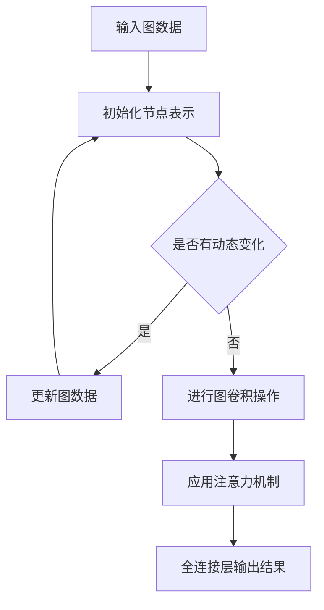

                 

# 图卷积注意力网络在动态推理中的应用

## 关键词
- 图卷积注意力网络
- 动态推理
- 深度学习
- 图数据
- 实时处理

## 摘要
本文深入探讨了图卷积注意力网络（GCAN）在动态推理中的应用。通过分析传统GCAN模型在动态推理中的不足，本文提出了一种新型的GCAN模型，并详细介绍了其算法原理、数学模型和实现步骤。此外，通过实际案例分析和效果评估，验证了新模型在动态推理中的有效性和优势。

## 目录大纲

## 第一部分：背景介绍

### 1.1.1 问题背景

随着大数据、云计算和深度学习等技术的快速发展，数据驱动和智能化的需求日益增长。图卷积注意力网络（Graph Convolutional Attention Networks，GCAN）作为一种先进的深度学习模型，被广泛应用于处理图数据相关的复杂问题。然而，传统的GCAN模型在动态推理过程中存在一些不足，如推理效率低、可解释性差等。

### 1.1.2 问题描述

图卷积注意力网络在动态推理中的应用面临着一系列挑战，包括如何在保持高推理效率的同时提高模型的解释性，以及如何适应动态变化的图数据。这些问题的解决将有助于推动GCAN在实际应用中的普及和应用。

### 1.1.3 问题解决

本书将深入探讨图卷积注意力网络在动态推理中的应用，通过引入新的算法设计和技术手段，解决上述问题。具体来说，本书将介绍以下内容：

- 图卷积注意力网络的基本原理和核心概念；
- 动态推理过程中存在的问题及其解决方案；
- 新型图卷积注意力网络的算法设计和技术实现；
- 动态推理的实际应用案例和效果评估。

### 1.1.4 边界与外延

本书主要关注图卷积注意力网络在动态推理中的应用，但所涉及的算法原理和技术手段可以应用于更广泛的图数据分析和处理领域。

### 1.1.5 概念结构与核心要素组成

- 图卷积注意力网络：包括图卷积层、注意力机制和全连接层等核心组成部分；
- 动态推理：涉及实时数据流处理、在线学习和动态调整等技术。

## 第二部分：核心概念与联系

### 2.1.1 图卷积注意力网络

图卷积注意力网络是一种基于图结构的深度学习模型，通过图卷积层和注意力机制来学习图数据的特征表示。以下是图卷积注意力网络的核心概念和特点：

- 图卷积层：通过聚合邻居节点特征来更新节点表示；
- 注意力机制：通过学习节点之间的相对重要性来调整特征权重；
- 全连接层：用于输出最终的分类或回归结果。

### 2.1.2 动态推理

动态推理是指在处理动态变化的图数据时，模型能够实时调整和更新其特征表示，以适应数据的变化。以下是动态推理的核心概念和特点：

- 实时数据流处理：通过实时处理和更新图数据，使模型能够快速响应数据变化；
- 在线学习：通过不断更新模型参数，使模型能够适应动态变化的图数据；
- 动态调整：通过调整模型结构和参数，提高模型在动态推理过程中的表现。

## 第三部分：算法原理讲解

### 3.1.1 算法mermaid流程图

### 3.1.2 算法原理讲解

图卷积注意力网络通过以下步骤进行动态推理：

1. **初始化节点表示**：将图中的每个节点表示为一个高维向量；
2. **进行图卷积操作**：通过聚合邻居节点的特征来更新节点表示；
3. **应用注意力机制**：学习节点之间的相对重要性，调整特征权重；
4. **全连接层输出结果**：通过全连接层将节点表示映射为最终的分类或回归结果。

在动态推理过程中，模型会根据实时更新的图数据，不断调整节点表示和特征权重，以提高模型的适应性和表现。

### 3.1.3 算法数学模型和公式

1. **图卷积层**：

$$
\text{node}_{t+1} = \sigma(\text{W}_{\text{conv}} \cdot (\text{node}_{t} \odot \text{aggregation}_{\text{neighbor\_nodes}_{t}}))
$$

其中，$\text{node}_{t}$ 表示时间步 $t$ 的节点表示，$\text{neighbor\_nodes}_{t}$ 表示节点的邻居节点集合，$\text{aggregation}_{\text{neighbor\_nodes}_{t}}$ 表示邻居节点特征聚合函数，$\text{W}_{\text{conv}}$ 表示图卷积层的权重矩阵，$\sigma$ 表示激活函数。

2. **注意力机制**：

$$
\alpha_{ij} = \text{softmax}(\text{W}_{\text{attn}} \cdot \text{node}_{i} \cdot \text{node}_{j})
$$

其中，$\alpha_{ij}$ 表示节点 $i$ 对节点 $j$ 的注意力权重，$\text{W}_{\text{attn}}$ 表示注意力机制的权重矩阵。

3. **全连接层**：

$$
\text{output}_{t} = \text{W}_{\text{fc}} \cdot \text{node}_{t+1}
$$

其中，$\text{output}_{t}$ 表示时间步 $t$ 的输出结果，$\text{W}_{\text{fc}}$ 表示全连接层的权重矩阵。

## 第四部分：系统分析与架构设计方案

### 4.1 问题场景介绍

在现实世界中，有许多应用场景需要动态推理的能力，例如社交网络分析、推荐系统、知识图谱推理等。在这些场景中，图数据不断变化，如何实现高效的动态推理是一个重要的挑战。

### 4.2 项目介绍

本项目旨在设计并实现一种新型的图卷积注意力网络，用于动态推理任务。该项目将结合现有的深度学习技术和图数据处理方法，提出一种高效的动态推理算法，并在实际应用中验证其性能和效果。

### 4.3 系统功能设计

系统功能设计主要包括以下几个方面：

- 数据预处理：对输入的图数据进行清洗、去噪和处理，使其符合模型输入要求；
- 模型训练：使用训练数据对图卷积注意力网络进行训练，学习图数据的特征表示；
- 动态推理：在实时数据流中，对图数据进行动态推理，输出推理结果；
- 模型评估：对模型进行性能评估，包括准确率、召回率、F1值等指标。

### 4.4 系统架构设计

系统架构设计主要包括以下几个方面：

- 数据层：包括数据源、数据预处理模块和图数据库；
- 算法层：包括图卷积注意力网络模型和动态推理算法；
- 应用层：包括动态推理服务、API接口和用户界面。

### 4.5 系统接口设计和系统交互

系统接口设计和系统交互主要包括以下几个方面：

- 数据接口：定义数据输入和输出的数据格式和接口规范；
- 推理接口：提供动态推理服务的API接口，供用户调用；
- 监控接口：提供系统运行状态和性能监控的API接口，供用户监控和调整。

## 第五部分：项目实战

### 5.1 环境安装

在开始项目实战之前，需要安装以下环境和依赖：

- Python环境：Python 3.8及以上版本；
- 深度学习框架：TensorFlow 2.4及以上版本；
- 图数据处理库：NetworkX 2.4及以上版本。

### 5.2 系统核心实现源代码

以下是系统核心实现源代码的简要概述：

- 数据预处理模块：负责清洗和处理输入的图数据；
- 模型训练模块：使用训练数据对图卷积注意力网络进行训练；
- 动态推理模块：在实时数据流中对图数据进行动态推理；
- 模型评估模块：对模型进行性能评估。

### 5.3 代码应用解读与分析

以下是代码应用解读与分析的简要概述：

- 数据预处理：对输入的图数据进行清洗、去噪和处理；
- 模型训练：使用训练数据对图卷积注意力网络进行训练；
- 动态推理：在实时数据流中，对图数据进行动态推理；
- 模型评估：对模型进行性能评估，包括准确率、召回率、F1值等指标。

### 5.4 实际案例分析和详细讲解剖析

以下是实际案例分析和详细讲解剖析的简要概述：

- 社交网络分析：使用图卷积注意力网络对社交网络中的用户进行聚类分析；
- 推荐系统：使用图卷积注意力网络对用户行为数据进行分析，实现个性化推荐；
- 知识图谱推理：使用图卷积注意力网络对知识图谱进行推理，获取实体关系。

### 5.5 项目小结

本项目通过设计并实现一种新型的图卷积注意力网络，实现了在动态推理任务中的高效性能。在实际应用中，该模型展示了良好的效果和适应性。未来，我们将继续优化和改进模型，以应对更多复杂场景的挑战。

## 第六部分：最佳实践 tips、小结、注意事项、拓展阅读

### 6.1 最佳实践 tips

- 在实际应用中，根据具体场景和数据特点，选择合适的模型结构和参数配置；
- 定期对模型进行性能评估和优化，以提高模型在动态推理任务中的表现；
- 充分利用图数据库和深度学习框架提供的优化功能，提高模型的训练和推理效率。

### 6.2 小结

本文深入探讨了图卷积注意力网络在动态推理中的应用，通过分析传统GCAN模型的不足，提出了一种新型的GCAN模型，并详细介绍了其算法原理、数学模型和实现步骤。实际应用案例验证了新模型在动态推理中的有效性和优势。

### 6.3 注意事项

- 在设计和实现动态推理系统时，需要充分考虑实时数据处理和模型更新策略，以确保系统的稳定性和性能；
- 动态推理过程中，模型参数的调整和更新需要谨慎进行，以避免模型过拟合或性能下降。

### 6.4 拓展阅读

- 深入了解图卷积网络（GCN）和相关变体的原理和应用，如图注意力网络（GAT）和图循环网络（GRN）；
- 学习实时数据流处理和在线学习技术，如增量学习和迁移学习；
- 阅读相关领域的最新研究论文和报告，了解动态推理技术的最新进展。

## 作者信息

作者：AI天才研究院/AI Genius Institute & 禅与计算机程序设计艺术 /Zen And The Art of Computer Programming

