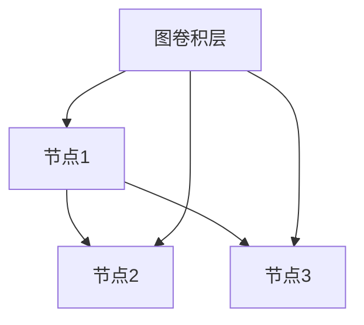
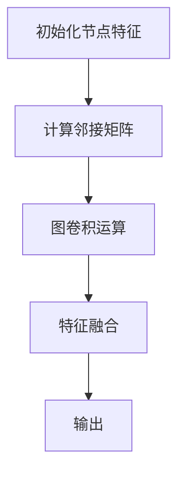
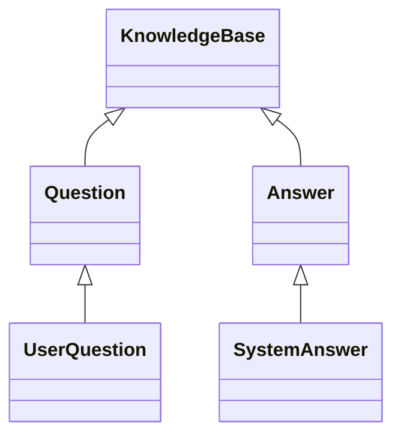
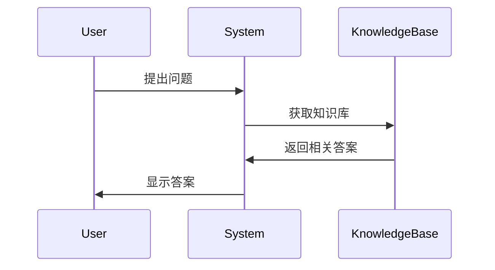
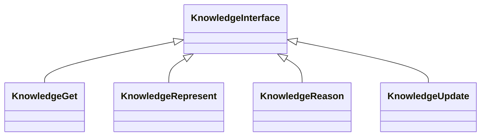

                 

# 图卷积网络在动态知识推理中的最新进展

## 关键词

- 图卷积网络
- 动态知识推理
- 知识图谱
- 机器学习
- 深度学习

## 摘要

本文将深入探讨图卷积网络（GCN）在动态知识推理领域的最新进展。首先，我们将介绍动态知识推理的背景和重要性，然后详细阐述图卷积网络的原理及其与动态知识推理的关联。接着，我们将通过具体算法原理讲解、系统分析与架构设计方案，以及项目实战等多个方面，全面剖析图卷积网络在动态知识推理中的应用和实践。最后，我们将总结当前的发展状况，并提出未来研究的方向和挑战。

## 第一部分：背景介绍与核心概念

### 第1章：引言

#### 1.1 问题背景

动态知识推理是人工智能领域的一个重要研究方向，它旨在模拟人类在复杂动态环境中的知识获取和推理能力。随着互联网和信息技术的飞速发展，数据量呈爆炸式增长，如何从海量数据中提取有价值的信息、进行有效的知识推理，成为了一个亟待解决的问题。图卷积网络作为一种在图形数据上执行卷积运算的深度学习模型，因其强大的特征提取和表示能力，在动态知识推理中展现出了巨大的潜力。

#### 1.2 问题描述

动态知识推理面临的挑战主要包括：

- **数据复杂性**：动态知识环境中的数据通常具有高度异构性和动态变化性。
- **推理效率**：如何在有限的时间内完成大规模数据的推理，是一个重要的问题。
- **知识表示**：如何有效地表示和利用知识，以便于推理过程。

图卷积网络在动态知识推理中的应用，主要是通过以下两个方面：

- **特征提取**：图卷积网络能够自动从图数据中提取出具有区分性的特征。
- **推理框架**：图卷积网络可以作为动态知识推理框架的核心组件，实现知识的自动推理和更新。

#### 1.3 问题解决

图卷积网络（GCN）的基本原理是通过对图中的节点进行卷积操作，提取节点的特征。具体来说，GCN利用图卷积函数将节点的邻接节点信息整合到自身特征中，从而实现节点的特征更新。

#### 1.4 边界与外延

图卷积网络在动态知识推理中的应用需要明确以下边界：

- **数据范围**：动态知识推理主要应用于大规模图数据。
- **算法范围**：图卷积网络是动态知识推理的一部分，但不是全部。

### 第2章：核心概念与联系

#### 2.1 图卷积网络原理

图卷积网络是一种基于图结构的卷积神经网络，其核心思想是将图中的节点特征映射到更高层次的特征表示。图卷积网络的数学模型主要包括以下几部分：

- **节点特征表示**：每个节点都有一组特征向量。
- **邻接矩阵**：描述节点之间的邻接关系。
- **图卷积函数**：用于更新节点的特征向量。

以下是一个简化的图卷积网络的mermaid流程图：



#### 2.2 动态知识推理概念

动态知识推理是指在不同时间点上，根据已有的知识和环境信息，进行推理和决策的过程。其核心特征包括：

- **动态性**：知识推理过程中，知识和环境都在不断变化。
- **增量性**：知识推理通常是在已有知识的基础上进行增量更新。

以下是一个动态知识推理的mermaid ER实体关系图：

```mermaid
erDiagram
  NodeA ||--|>{KnowledgeBase} KB
  NodeB ||--|>{KnowledgeBase} KB
  NodeC ||--|>{KnowledgeBase} KB
  NodeA ..|> NodeB : HasNeighbors
  NodeA ..|> NodeC : HasNeighbors
  NodeB ..|> NodeC : HasNeighbors
```

## 第二部分：算法原理讲解

### 第3章：图卷积网络算法原理

#### 3.1 算法流程与mermaid流程图

图卷积网络的算法流程可以概括为以下几个步骤：

1. **初始化节点特征**：每个节点初始化一组特征向量。
2. **邻接矩阵计算**：计算图中的邻接矩阵。
3. **图卷积运算**：对节点特征进行图卷积运算，更新节点的特征向量。
4. **特征融合**：将更新后的特征向量进行融合，得到最终的节点特征表示。

以下是一个简化的图卷积网络算法的mermaid流程图：



#### 3.2 数学模型与公式

图卷积网络的数学模型主要包括以下部分：

- **节点特征表示**：$x_i^{(l)} \in \mathbb{R}^d$，其中 $i$ 表示节点 $i$ 在第 $l$ 层的特征向量。
- **权重矩阵**：$A^{(l)} \in \mathbb{R}^{n \times n}$，其中 $n$ 表示图的节点数。
- **邻接矩阵**：$A \in \mathbb{R}^{n \times n}$，描述节点之间的邻接关系。

图卷积网络的更新公式为：

$$
x_i^{(l+1)} = \sigma(\mathbf{W}^{(l)}x_i^{(l)} + \sum_{j \in \mathcal{N}(i)} A_{ij}^{(l)}x_j^{(l)})
$$

其中，$\sigma$ 是激活函数，$\mathcal{N}(i)$ 表示节点 $i$ 的邻接节点集合，$\mathbf{W}^{(l)}$ 是权重矩阵。

#### 3.3 举例说明

假设有一个简单的图，包含三个节点 $A$、$B$、$C$，节点特征分别为 $x_A^{(0)} = [1, 0]$、$x_B^{(0)} = [0, 1]$、$x_C^{(0)} = [1, 1]$。邻接矩阵为：

$$
A = \begin{bmatrix}
0 & 1 & 0 \\
1 & 0 & 1 \\
0 & 1 & 0
\end{bmatrix}
$$

假设权重矩阵 $\mathbf{W}^{(0)}$ 为：

$$
\mathbf{W}^{(0)} = \begin{bmatrix}
0.1 & 0.2 \\
0.3 & 0.4
\end{bmatrix}
$$

使用ReLU作为激活函数，计算第一层的节点特征：

$$
x_A^{(1)} = \sigma(\mathbf{W}^{(0)}x_A^{(0)} + \sum_{j \in \mathcal{N}(A)} A_{Aj}^{(0)}x_j^{(0)})
$$

$$
x_B^{(1)} = \sigma(\mathbf{W}^{(0)}x_B^{(0)} + \sum_{j \in \mathcal{N}(B)} A_{Bj}^{(0)}x_j^{(0)})
$$

$$
x_C^{(1)} = \sigma(\mathbf{W}^{(0)}x_C^{(0)} + \sum_{j \in \mathcal{N}(C)} A_{Cj}^{(0)}x_j^{(0)})
$$

具体计算如下：

$$
x_A^{(1)} = \sigma(0.1 \cdot 1 + 0.2 \cdot 0 + 1 \cdot 1 \cdot 0 + 1 \cdot 0 \cdot 0) = \sigma(0.1 + 0) = 0.1
$$

$$
x_B^{(1)} = \sigma(0.3 \cdot 0 + 0.4 \cdot 1 + 1 \cdot 1 \cdot 0 + 1 \cdot 0 \cdot 1) = \sigma(0.4 + 0) = 0.4
$$

$$
x_C^{(1)} = \sigma(0.1 \cdot 1 + 0.2 \cdot 1 + 1 \cdot 0 \cdot 1 + 1 \cdot 1 \cdot 1) = \sigma(0.1 + 0.2 + 1) = 1.3
$$

最终得到第一层的节点特征：

$$
x_A^{(1)} = [0.1, 0], x_B^{(1)} = [0.4, 0.4], x_C^{(1)} = [1.3, 1.3]
$$

## 第三部分：系统分析与架构设计方案

### 第4章：系统架构设计

#### 4.1 问题场景介绍

动态知识推理的应用场景非常广泛，例如在智能问答系统、推荐系统、智能交通等领域。以智能问答系统为例，系统需要根据用户提出的问题，从已有的知识库中找到相关的答案，并在动态变化的环境中持续更新和优化答案。

#### 4.2 系统功能设计

系统的功能设计主要包括以下几个部分：

- **知识获取**：从不同来源获取知识，包括文本、图像、音频等多种形式。
- **知识表示**：将获取到的知识转化为图结构，以便于图卷积网络的推理和处理。
- **知识推理**：利用图卷积网络进行知识推理，提供智能问答、推荐等功能。
- **知识更新**：在动态知识环境中，持续更新和优化知识库。

以下是一个领域模型mermaid类图：



#### 4.3 系统架构设计

系统的架构设计采用分层架构，主要包括以下几个层次：

- **数据层**：负责数据存储和读取，包括知识库、用户数据等。
- **表示层**：负责知识的表示和转化，将不同形式的数据转化为图结构。
- **推理层**：利用图卷积网络进行知识推理，实现智能问答、推荐等功能。
- **应用层**：提供用户交互界面，实现用户查询和系统回答等功能。

以下是一个mermaid架构图：



#### 4.4 系统接口设计

系统的接口设计主要包括以下几个方面：

- **知识获取接口**：提供获取知识的接口，包括文本、图像、音频等多种形式。
- **知识表示接口**：提供知识表示的接口，将获取到的知识转化为图结构。
- **推理接口**：提供知识推理的接口，实现智能问答、推荐等功能。
- **更新接口**：提供知识更新的接口，实现知识的持续更新和优化。

以下是一个系统接口定义：



## 第四部分：项目实战

### 第5章：项目实战

#### 5.1 环境安装

在进行图卷积网络在动态知识推理中的项目实战之前，首先需要安装相关的环境。以下是一个简单的环境安装指南：

1. **安装Python**：确保Python环境已经安装，版本建议为3.8以上。
2. **安装PyTorch**：使用pip命令安装PyTorch库，命令如下：

   ```bash
   pip install torch torchvision
   ```

3. **安装其他依赖库**：安装其他必要的依赖库，如NetworkX、Numpy、Pandas等。

#### 5.2 系统核心实现

以下是一个简单的系统核心实现，包括知识获取、知识表示、知识推理等功能：

```python
import torch
import torch.nn as nn
import torch.optim as optim
from torch_geometric.nn import GCNConv

class KnowledgeSystem(nn.Module):
    def __init__(self, n_features, n_classes):
        super(KnowledgeSystem, self).__init__()
        self.conv1 = GCNConv(n_features, 16)
        self.conv2 = GCNConv(16, n_classes)

    def forward(self, data):
        x, edge_index = data.x, data.edge_index
        x = self.conv1(x, edge_index)
        x = F.relu(x)
        x = self.conv2(x, edge_index)
        return F.log_softmax(x, dim=1)

# 创建模型、优化器和损失函数
model = KnowledgeSystem(n_features=10, n_classes=5)
optimizer = optim.Adam(model.parameters(), lr=0.01)
criterion = nn.NLLLoss()

# 训练模型
for epoch in range(200):
    optimizer.zero_grad()
    out = model(data)
    loss = criterion(out, data.y)
    loss.backward()
    optimizer.step()
    if (epoch + 1) % 10 == 0:
        print(f'Epoch {epoch + 1}: loss = {loss.item()}')
```

#### 5.3 代码应用解读与分析

以上代码实现了一个简单的图卷积网络模型，用于动态知识推理。模型的主要组成部分包括：

- **GCNConv**：用于实现图卷积操作。
- **ReLU**：用于激活函数，增加网络的非线性。
- **NN

