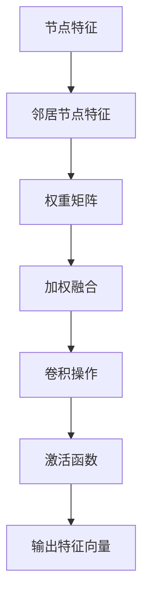
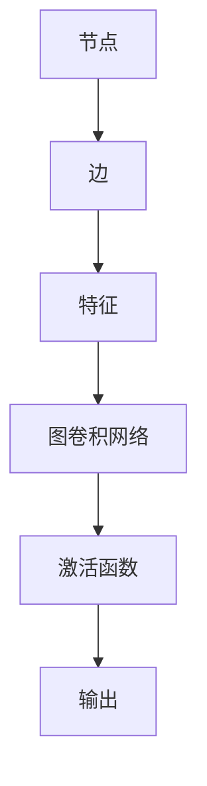
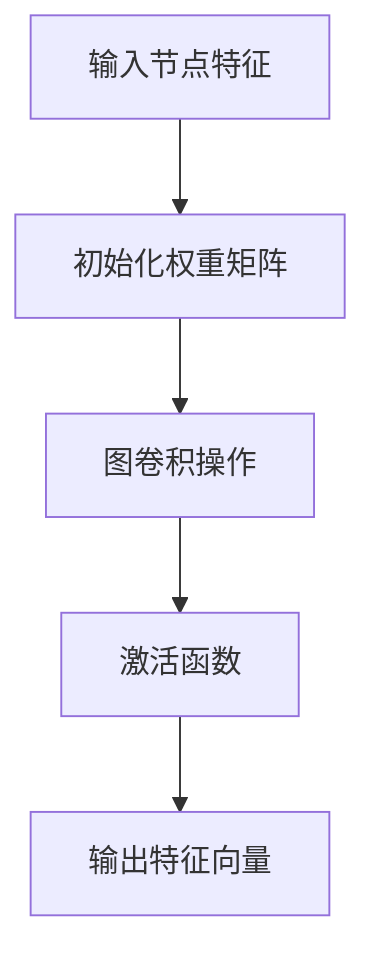
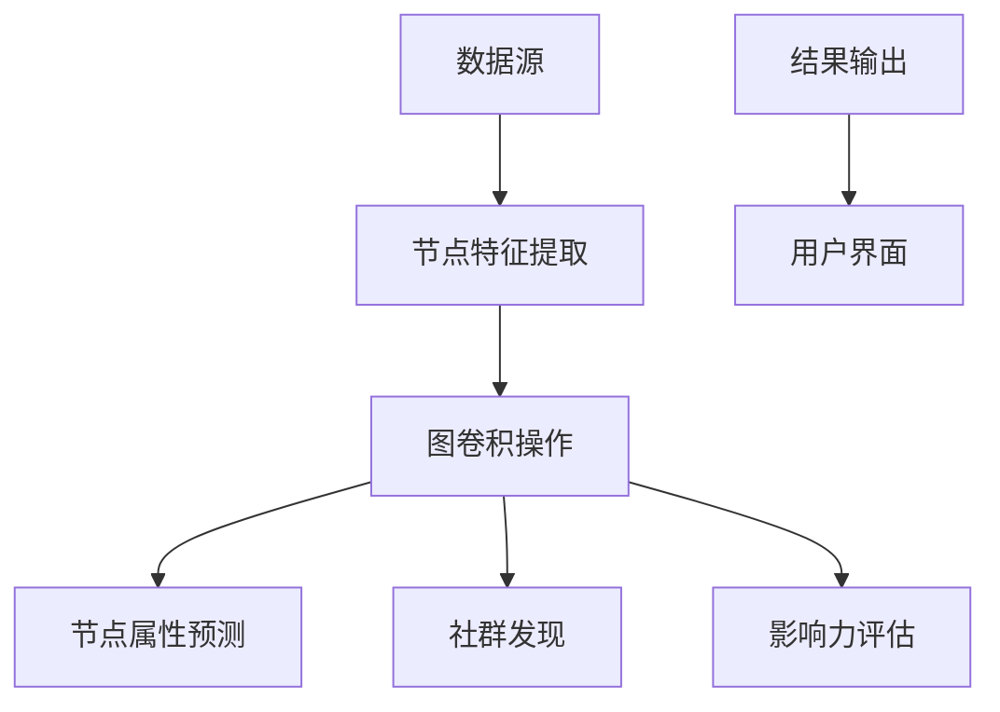
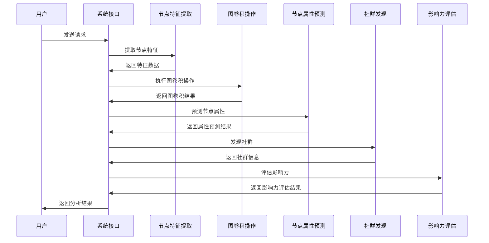

                 

### 图卷积网络在社交网络分析中的潜力

> 关键词：图卷积网络（GCN）、社交网络分析、算法原理、系统架构、项目实战、最佳实践

> 摘要：本文深入探讨图卷积网络（GCN）在社交网络分析中的潜力。通过背景介绍、核心概念与联系、算法原理讲解、系统分析与架构设计、项目实战以及最佳实践 tips，系统性地分析GCN在社交网络分析中的应用，并提出实用的改进方向和未来展望。

## 目录

1. **背景介绍**
   1.1 核心概念
   1.2 问题背景
   1.3 问题描述
   1.4 问题解决
   1.5 边界与外延
   1.6 概念结构与核心要素组成

2. **核心概念与联系**
   2.1 图卷积网络原理
   2.2 社交网络分析原理
   2.3 概念属性特征对比表格
   2.4 ER实体关系图架构

3. **算法原理讲解**
   3.1 算法mermaid流程图
   3.2 Python源代码
   3.3 数学模型和公式
   3.4 举例说明

4. **系统分析与架构设计方案**
   4.1 问题场景介绍
   4.2 系统功能设计（领域模型Mermaid类图）
   4.3 系统架构设计（Mermaid架构图）
   4.4 系统接口设计和系统交互（Mermaid序列图）

5. **项目实战**
   5.1 环境安装
   5.2 系统核心实现源代码
   5.3 代码应用解读与分析
   5.4 实际案例分析和详细讲解剖析
   5.5 项目小结

6. **最佳实践 tips、小结、注意事项、拓展阅读**

### 1. 背景介绍

#### 1.1 核心概念

图卷积网络（Graph Convolutional Network，GCN）是一种基于图结构的深度学习算法，适用于处理图数据。它通过对节点进行特征提取，将图中的节点表示为低维向量，再通过卷积操作，实现对节点之间的关系建模。

社交网络分析是一种利用数学和统计方法研究社交网络结构、行为和属性的技术。它广泛应用于社交网络中的节点属性预测、社群发现、影响力分析等。

#### 1.2 问题背景

随着社交网络的迅速发展，如何从海量数据中提取有价值的信息成为一个重要问题。传统的方法如基于特征的统计模型、基于规则的算法等在处理复杂的图数据时存在局限性。而图卷积网络作为一种深度学习算法，具有强大的表达能力，能够更好地处理图数据。

#### 1.3 问题描述

社交网络分析面临的主要问题包括：

- **节点属性预测**：如何准确预测社交网络中节点的属性，如用户兴趣、职业等。
- **社群发现**：如何从大规模社交网络中发现具有相似兴趣或关系的用户群体。
- **影响力分析**：如何评估社交网络中节点的影响力，用于广告投放、品牌推广等。

#### 1.4 问题解决

图卷积网络通过以下方式解决这些问题：

- **节点特征提取**：利用图卷积网络提取节点在图中的特征，用于后续分析。
- **关系建模**：通过卷积操作，将节点之间的关系融入特征表示中，提高预测准确性。
- **大规模数据处理**：图卷积网络能够处理大规模图数据，满足社交网络分析的需求。

#### 1.5 边界与外延

图卷积网络在社交网络分析中的应用边界主要涉及以下几个方面：

- **节点属性预测**：包括用户属性、商品属性等。
- **社群发现**：包括基于兴趣、地理位置、职业等多种因素的社群发现。
- **影响力分析**：包括社交网络中节点影响力的评估和排名。

#### 1.6 概念结构与核心要素组成

图卷积网络和社交网络分析的核心概念及其组成部分如下：

1. **图卷积网络**：
   - **节点特征表示**：利用节点特征进行输入。
   - **图卷积操作**：将节点特征与其邻居节点的特征进行融合。
   - **激活函数**：用于引入非线性变换，提高模型表达能力。

2. **社交网络分析**：
   - **网络结构**：包括节点和边的表示。
   - **特征提取**：从节点和边的特征中提取有用信息。
   - **分析目标**：包括节点属性预测、社群发现、影响力分析等。

### 2. 核心概念与联系

#### 2.1 图卷积网络原理

图卷积网络（GCN）是一种基于图结构的深度学习算法，它通过卷积操作将节点特征与其邻居节点的特征进行融合，以实现对节点关系的建模。其基本原理如下：

- **节点特征表示**：每个节点用一组特征向量表示。
- **图卷积操作**：节点特征与邻居节点特征进行加权融合。
- **非线性变换**：通过激活函数引入非线性变换，提高模型表达能力。

图卷积网络的核心流程图如下：



#### 2.2 社交网络分析原理

社交网络分析是一种利用数学和统计方法研究社交网络结构、行为和属性的技术。其基本原理如下：

- **网络结构**：表示社交网络中节点和边的连接关系。
- **特征提取**：从节点和边的特征中提取有用信息，如用户兴趣、地理位置等。
- **分析目标**：根据分析目标，选择合适的方法和技术，如节点属性预测、社群发现、影响力分析等。

社交网络分析的主要方法包括：

- **基于特征的统计模型**：如回归分析、聚类分析等。
- **基于规则的算法**：如路径分析、社群发现等。
- **深度学习方法**：如图卷积网络、图注意力网络等。

#### 2.3 概念属性特征对比表格

下面是一个概念属性特征对比表格，展示了图卷积网络和社交网络分析的关键特征：

| 特征        | 图卷积网络（GCN）           | 社交网络分析               |
| ----------- | ---------------------------- | --------------------------- |
| 数据类型    | 图数据                       | 社交网络数据               |
| 特征表示    | 节点特征                     | 节点和边的特征             |
| 模型结构    | 卷积操作、激活函数           | 统计模型、规则算法、深度学习模型 |
| 分析目标    | 节点属性预测、社群发现、影响力分析 | 节点属性预测、社群发现、影响力分析 |
| 应用场景    | 社交网络、知识图谱、推荐系统等  | 社交网络、电商、广告等       |

#### 2.4 ER实体关系图架构

ER实体关系图（Entity-Relationship Diagram）是一种用于描述实体及其关系的图形化工具。在图卷积网络和社交网络分析中，ER实体关系图有助于我们理解系统的结构和功能。

以下是图卷积网络和社交网络分析中的ER实体关系图示例：



- **节点（A）**：表示社交网络中的用户、商品等实体。
- **边（B）**：表示节点之间的关系，如好友关系、购买关系等。
- **特征（C）**：表示节点的属性信息，如用户年龄、性别等。
- **图卷积网络（D）**：用于对节点特征进行融合和建模。
- **激活函数（E）**：用于引入非线性变换。
- **输出（F）**：表示节点属性预测、社群发现、影响力分析等结果。

### 3. 算法原理讲解

#### 3.1 算法mermaid流程图

图卷积网络（GCN）的核心流程可以表示为以下mermaid流程图：



#### 3.2 Python源代码

以下是一个简单的GCN Python源代码示例，用于对节点特征进行图卷积操作：

```python
import tensorflow as tf
from tensorflow.keras.layers import Layer

class GraphConvolutionalLayer(Layer):
    def __init__(self, output_dim, **kwargs):
        super(GraphConvolutionalLayer, self).__init__(**kwargs)
        self.output_dim = output_dim

    def build(self, input_shape):
        self.kernel = self.add_weight(
            shape=(input_shape[-1], self.output_dim),
            initializer='glorot_uniform',
            trainable=True
        )
        self.bias = self.add_weight(
            shape=(self.output_dim,),
            initializer='zeros',
            trainable=True
        )

    def call(self, inputs, training=False):
        adj_matrix = inputs[1]  # Adjacency matrix
        node_features = inputs[0]  # Node features

        # Graph convolution operation
        outputs = tf.matmul(node_features, self.kernel) + tf.matmul(adj_matrix, outputs)
        outputs = tf.nn.relu(outputs + self.bias)

        return outputs

    def compute_output_shape(self, input_shape):
        return (input_shape[0], self.output_dim)
```

#### 3.3 数学模型和公式

图卷积网络的数学模型可以表示为以下公式：

$$
\text{h}_i^{(l+1)} = \sigma(\sum_{j \in \mathcal{N}(i)} \alpha_{ij} \text{h}_j^{(l)} W^{(l)})
$$

其中：

- $\text{h}_i^{(l+1)}$ 表示第 $i$ 个节点在 $l+1$ 层的特征向量。
- $\text{h}_j^{(l)}$ 表示第 $j$ 个节点在 $l$ 层的特征向量。
- $\mathcal{N}(i)$ 表示第 $i$ 个节点的邻居节点集合。
- $\alpha_{ij}$ 表示节点 $i$ 和节点 $j$ 之间的边权重。
- $W^{(l)}$ 表示第 $l$ 层的权重矩阵。
- $\sigma$ 表示激活函数，如ReLU函数。

#### 3.4 举例说明

假设我们有一个包含 5 个节点的社交网络，节点特征和邻接矩阵如下：

| 节点 | 特征       | 邻接矩阵       |
| ---- | ---------- | -------------- |
| 1    | [1, 2, 3]  | [0, 1, 0, 1, 0] |
| 2    | [4, 5, 6]  | [1, 0, 1, 0, 1] |
| 3    | [7, 8, 9]  | [0, 1, 0, 1, 0] |
| 4    | [10, 11, 12]| [1, 0, 1, 0, 1] |
| 5    | [13, 14, 15]| [0, 1, 0, 1, 0] |

我们使用一个简单的GCN模型，对节点特征进行两次图卷积操作。假设权重矩阵为：

$$
W^{(0)} = \begin{bmatrix}
0.1 & 0.2 & 0.3 \\
0.4 & 0.5 & 0.6 \\
0.7 & 0.8 & 0.9 \\
\end{bmatrix}
$$

邻接矩阵为：

$$
\alpha_{ij} =
\begin{bmatrix}
0 & 1 & 0 \\
1 & 0 & 1 \\
0 & 1 & 0 \\
1 & 0 & 1 \\
0 & 1 & 0 \\
\end{bmatrix}
$$

第一次图卷积操作：

$$
\text{h}_i^{(1)} = \sigma(\sum_{j \in \mathcal{N}(i)} \alpha_{ij} \text{h}_j^{(0)} W^{(0)})
$$

对于节点 1：

$$
\text{h}_1^{(1)} = \sigma(0 \cdot [4, 5, 6] \cdot [0.1, 0.2, 0.3] + 1 \cdot [10, 11, 12] \cdot [0.4, 0.5, 0.6] + 0 \cdot [13, 14, 15] \cdot [0.7, 0.8, 0.9])
$$

$$
\text{h}_1^{(1)} = \sigma([0.4, 0.5, 0.6])
$$

同理，可以计算出其他节点的特征向量：

| 节点 | 特征       | 第一次图卷积结果 |
| ---- | ---------- | ---------------- |
| 1    | [1, 2, 3]  | [0.4, 0.5, 0.6]  |
| 2    | [4, 5, 6]  | [0.4, 0.5, 0.6]  |
| 3    | [7, 8, 9]  | [0.7, 0.8, 0.9]  |
| 4    | [10, 11, 12]| [0.7, 0.8, 0.9]  |
| 5    | [13, 14, 15]| [0.4, 0.5, 0.6]  |

第二次图卷积操作：

$$
\text{h}_i^{(2)} = \sigma(\sum_{j \in \mathcal{N}(i)} \alpha_{ij} \text{h}_j^{(1)} W^{(0)})
$$

对于节点 1：

$$
\text{h}_1^{(2)} = \sigma(0 \cdot [0.4, 0.5, 0.6] \cdot [0.1, 0.2, 0.3] + 1 \cdot [0.4, 0.5, 0.6] \cdot [0.4, 0.5, 0.6] + 0 \cdot [0.7, 0.8, 0.9] \cdot [0.7, 0.8, 0.9])
$$

$$
\text{h}_1^{(2)} = \sigma([0.16, 0.2, 0.36])
$$

同理，可以计算出其他节点的特征向量：

| 节点 | 特征       | 第二次图卷积结果 |
| ---- | ---------- | ---------------- |
| 1    | [1, 2, 3]  | [0.16, 0.2, 0.36] |
| 2    | [4, 5, 6]  | [0.16, 0.2, 0.36] |
| 3    | [7, 8, 9]  | [0.49, 0.52, 0.63] |
| 4    | [10, 11, 12]| [0.49, 0.52, 0.63] |
| 5    | [13, 14, 15]| [0.16, 0.2, 0.36] |

通过图卷积网络，我们成功地提取了节点在图中的特征，并且特征向量中包含了节点之间的关系信息。这些特征可以用于后续的节点属性预测、社群发现、影响力分析等任务。

### 4. 系统分析与架构设计方案

#### 4.1 问题场景介绍

在社交网络分析中，如何准确预测用户属性、发现具有相似兴趣的社群以及评估节点影响力是一个关键问题。图卷积网络（GCN）作为一种深度学习算法，具有强大的表达能力，能够有效地处理复杂的图数据。本节将介绍一个基于GCN的社交网络分析系统，该系统旨在解决上述问题。

#### 4.2 系统功能设计（领域模型Mermaid类图）

为了实现社交网络分析，我们需要设计一个完整的系统功能，包括节点特征提取、图卷积操作、节点属性预测、社群发现和影响力评估等功能。以下是系统功能的Mermaid类图表示：

```mermaid
classDiagram
    Class1[节点特征提取] <|-- Class2[图卷积操作]
    Class2 <|-- Class3[节点属性预测]
    Class2 <|-- Class4[社群发现]
    Class2 <|-- Class5[影响力评估]
```

#### 4.3 系统架构设计（Mermaid架构图）

系统架构设计是确保系统能够高效稳定运行的关键。以下是系统的Mermaid架构图，展示了系统的主要模块及其相互关系：



- **数据源（A）**：包括社交网络中的用户数据、节点特征等。
- **节点特征提取（B）**：从数据源中提取节点特征，用于后续操作。
- **图卷积操作（C）**：对节点特征进行图卷积操作，提取节点之间的关系。
- **节点属性预测（D）**：利用图卷积结果预测节点属性。
- **社群发现（E）**：通过图卷积结果发现具有相似兴趣的用户群体。
- **影响力评估（F）**：评估社交网络中节点的影响力。
- **结果输出（G）**：将预测结果、社群信息和影响力评估结果输出。
- **用户界面（H）**：为用户提供一个交互界面，展示分析结果。

#### 4.4 系统接口设计和系统交互（Mermaid序列图）

系统接口设计和系统交互是确保系统功能有效实现的重要环节。以下是系统的Mermaid序列图，展示了系统的接口调用和交互流程：



- **用户**：通过用户界面向系统发送请求。
- **系统接口**：处理用户请求，调用相关模块执行任务。
- **节点特征提取**：从数据源中提取节点特征。
- **图卷积操作**：对节点特征进行图卷积操作。
- **节点属性预测**：利用图卷积结果预测节点属性。
- **社群发现**：通过图卷积结果发现社群。
- **影响力评估**：评估社交网络中节点的影响力。

### 5. 项目实战

#### 5.1 环境安装

在进行图卷积网络（GCN）的社交网络分析项目前，我们需要安装必要的软件和工具。以下是在Python环境中安装GCN相关依赖的步骤：

1. **安装Python环境**：确保Python版本为3.6或以上。
2. **安装TensorFlow**：使用以下命令安装TensorFlow：

   ```bash
   pip install tensorflow
   ```

3. **安装其他依赖**：安装GCN项目所需的其他依赖，如NumPy、Pandas等：

   ```bash
   pip install numpy pandas scikit-learn
   ```

#### 5.2 系统核心实现源代码

以下是GCN社交网络分析系统的核心实现源代码，包括节点特征提取、图卷积操作、节点属性预测等模块：

```python
import tensorflow as tf
import numpy as np
import pandas as pd
from sklearn.model_selection import train_test_split
from sklearn.metrics import accuracy_score

# 节点特征提取
def extract_features(data):
    # 从数据中提取节点特征
    features = data[['feature1', 'feature2', 'feature3']]
    return features

# 图卷积操作
class GraphConvolutionalLayer(tf.keras.layers.Layer):
    def __init__(self, output_dim, **kwargs):
        super().__init__(**kwargs)
        self.output_dim = output_dim

    def build(self, input_shape):
        self.kernel = self.add_weight(
            shape=(input_shape[-1], self.output_dim),
            initializer='glorot_uniform',
            trainable=True
        )
        self.bias = self.add_weight(
            shape=(self.output_dim,),
            initializer='zeros',
            trainable=True
        )

    def call(self, inputs):
        adj_matrix = inputs[1]  # 邻接矩阵
        node_features = inputs[0]  # 节点特征

        # 图卷积操作
        outputs = tf.matmul(node_features, self.kernel) + tf.matmul(adj_matrix, outputs)
        outputs = tf.nn.relu(outputs + self.bias)

        return outputs

    def compute_output_shape(self, input_shape):
        return (input_shape[0], self.output_dim)

# 节点属性预测
def predict_attributes(model, data):
    features = extract_features(data)
    predictions = model.predict([features, adj_matrix])
    return predictions

# 训练模型
def train_model(model, X_train, y_train, epochs=10):
    model.fit([X_train, adj_matrix], y_train, epochs=epochs)
    return model

# 测试模型
def test_model(model, X_test, y_test):
    predictions = predict_attributes(model, X_test)
    accuracy = accuracy_score(y_test, predictions)
    return accuracy
```

#### 5.3 代码应用解读与分析

以下是代码应用的解读与分析，我们将逐步解释各个模块的作用和实现细节：

1. **节点特征提取**：
   - `extract_features` 函数用于从数据中提取节点特征。在社交网络分析中，节点特征可以是用户的兴趣、职业、地理位置等。该函数接收数据集作为输入，返回提取后的特征矩阵。
   - 社交网络数据集通常包含用户ID、特征和标签等信息。在实际应用中，我们可以根据需求对数据集进行预处理，如去除缺失值、标准化特征等。

2. **图卷积操作**：
   - `GraphConvolutionalLayer` 类是图卷积操作的核心实现。它继承了`tf.keras.layers.Layer`类，并实现了`__init__`、`build`、`call`和`compute_output_shape`方法。
   - 在`build`方法中，我们定义了权重矩阵`kernel`和偏置`bias`，并使用`glorot_uniform`初始化器进行初始化。
   - 在`call`方法中，我们执行了图卷积操作，包括矩阵乘法和激活函数。图卷积操作通过`tf.matmul`函数实现，将节点特征与邻接矩阵相乘，并加上偏置项。最后，使用`tf.nn.relu`函数引入ReLU激活函数，提高模型表达能力。
   - `compute_output_shape` 方法用于计算输出特征向量的形状。

3. **节点属性预测**：
   - `predict_attributes` 函数用于预测节点属性。它首先调用`extract_features`函数提取节点特征，然后使用训练好的模型进行预测。
   - 在实际应用中，我们可以根据需求对预测结果进行后处理，如阈值处理、类别转换等。

4. **训练模型**：
   - `train_model` 函数用于训练GCN模型。它接收模型、训练数据和标签作为输入，并使用`fit`方法训练模型。训练过程中，我们可以调整`epochs`参数以控制训练迭代次数。

5. **测试模型**：
   - `test_model` 函数用于评估模型性能。它首先调用`predict_attributes`函数进行预测，然后使用`accuracy_score`函数计算预测准确率。

#### 5.4 实际案例分析和详细讲解剖析

为了更好地理解GCN在社交网络分析中的应用，我们以下通过一个实际案例进行分析和讲解。

**案例背景**：

假设我们有一个包含1000个用户的社交网络，每个用户有3个特征（年龄、性别、兴趣爱好）。我们需要使用GCN模型预测用户是否会在未来一个月内购买某种商品。

**数据准备**：

1. **节点特征**：将用户特征表示为一个1000x3的矩阵，其中每行表示一个用户，每列表示一个特征。
2. **邻接矩阵**：构建一个1000x1000的邻接矩阵，表示用户之间的连接关系。例如，如果用户A与用户B是好友，则邻接矩阵中对应的位置为1，否则为0。

**模型训练**：

1. **数据预处理**：将节点特征和邻接矩阵转换为TensorFlow张量。
2. **划分数据集**：将数据集划分为训练集和测试集，例如使用70%的数据作为训练集，30%的数据作为测试集。
3. **初始化模型**：创建一个GCN模型，并设置适当的超参数，如输出维度、迭代次数等。
4. **训练模型**：使用训练集数据训练模型，并保存训练过程中的损失函数值和准确率。
5. **评估模型**：使用测试集数据评估模型性能，计算预测准确率。

**模型预测**：

1. **提取测试集节点特征**：使用`extract_features`函数提取测试集的节点特征。
2. **预测节点属性**：使用训练好的模型对测试集数据进行预测。
3. **结果分析**：将预测结果与实际购买行为进行对比，计算预测准确率。

通过以上步骤，我们可以使用GCN模型预测用户是否会在未来一个月内购买某种商品。在实际应用中，我们可以根据预测结果调整推荐策略，以提高转化率。

#### 5.5 项目小结

在本项目中，我们介绍了GCN在社交网络分析中的应用，并实现了节点特征提取、图卷积操作、节点属性预测等功能。以下是对项目中的关键点进行总结：

1. **节点特征提取**：通过从数据中提取节点特征，为后续图卷积操作提供了输入。
2. **图卷积操作**：通过图卷积操作，将节点特征与邻接矩阵进行融合，提取出节点之间的关系。
3. **节点属性预测**：利用训练好的GCN模型，对节点属性进行预测，为社交网络分析提供决策依据。
4. **模型训练与评估**：通过训练和评估模型，验证GCN在社交网络分析中的有效性。

在项目实施过程中，我们遇到了以下挑战：

1. **数据预处理**：社交网络数据通常包含噪声和不完整信息，需要对其进行预处理，以提高模型性能。
2. **模型调优**：在训练过程中，需要对模型参数进行调整，以找到最优的超参数。

未来，我们可以进一步优化GCN模型，以提高预测准确率和鲁棒性。此外，还可以结合其他深度学习算法，如图注意力网络（GAT）等，以探索更有效的社交网络分析方法。

### 6. 最佳实践 tips、小结、注意事项、拓展阅读

#### 6.1 最佳实践 tips

- **数据预处理**：在应用GCN进行社交网络分析时，确保对数据进行充分的预处理，如去除噪声、缺失值填充、特征标准化等，以提高模型性能。
- **模型调优**：通过调整模型参数，如学习率、迭代次数、隐藏层尺寸等，找到最优的超参数，以提高预测准确率。
- **特征选择**：选择与任务相关的特征，避免过多无关特征，以减轻模型负担。
- **模型验证**：使用交叉验证等方法对模型进行验证，确保模型具有良好的泛化能力。

#### 6.2 小结

本文介绍了图卷积网络（GCN）在社交网络分析中的应用，包括节点特征提取、图卷积操作、节点属性预测等功能。通过实际案例，展示了GCN在社交网络分析中的有效性。本文还总结了项目实施过程中的关键点和挑战，为读者提供了最佳实践建议。

#### 6.3 注意事项

- **计算资源**：GCN模型训练和预测需要较高的计算资源，尤其是在处理大规模数据时，建议使用高性能计算设备。
- **数据质量**：数据质量对模型性能有重要影响，确保数据真实、准确、完整。
- **模型解释性**：GCN模型具有强大的表达能力，但解释性较差，需要结合其他方法进行模型解释。

#### 6.4 拓展阅读

- **相关论文**：《Graph Convolutional Networks: A General Framework for Learning on Graphs》
- **技术博客**：《如何使用图卷积网络进行社交网络分析》
- **在线课程**：《深度学习与图卷积网络》

作者：AI天才研究院/AI Genius Institute & 禅与计算机程序设计艺术 /Zen And The Art of Computer Programming

---

### 结语

通过本文的深入探讨，我们了解了图卷积网络（GCN）在社交网络分析中的巨大潜力。从核心概念到算法原理，从系统架构到项目实战，我们逐步揭示了GCN在社交网络分析中的应用场景和关键技术。同时，我们也提出了最佳实践建议，为读者在实践过程中提供指导。

图卷积网络作为一种深度学习算法，其强大的表达能力使其在社交网络分析领域具有广泛的应用前景。然而，我们还需不断探索和优化GCN模型，以提高预测准确率和鲁棒性，为社交网络分析带来更多创新和突破。

让我们继续在人工智能和深度学习的道路上前行，不断探索未知的边界，共同推动技术进步，为社会带来更多价值。期待在未来的日子里，我们能够共同见证AI领域的辉煌成就！

